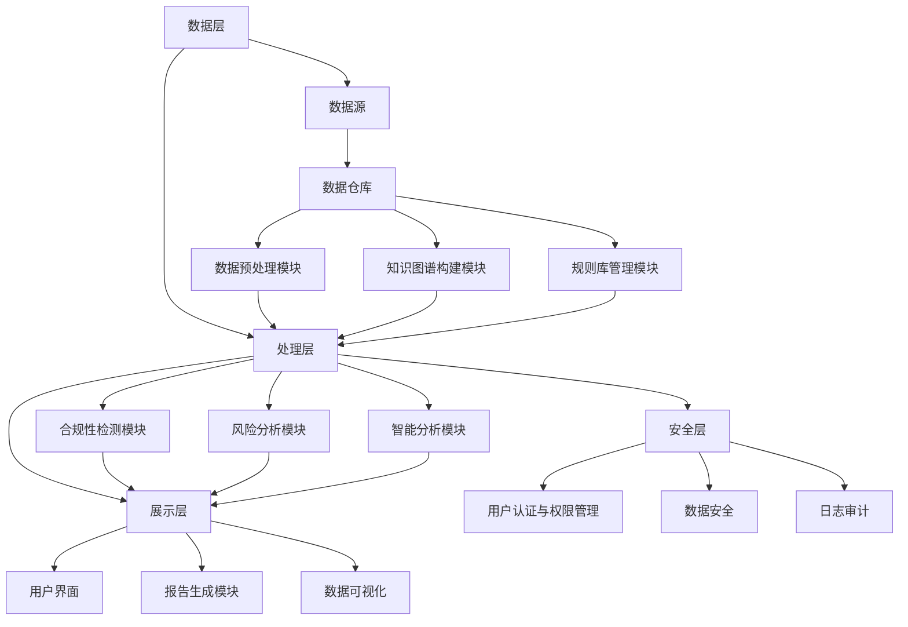

                 

### 引言

在现代金融行业中，监管合规已经成为金融机构运营不可或缺的一部分。随着金融市场的全球化发展和金融工具的日益复杂化，监管机构面临越来越大的挑战，要求金融机构必须确保其业务操作符合法律法规和监管要求。然而，传统的监管方法往往依赖于人工审查和数据分散存储，不仅效率低下，而且容易出现遗漏和错误。因此，构建一种高效、自动化的金融监管合规系统成为行业内的迫切需求。

近年来，知识图谱技术的迅猛发展为其在金融监管合规中的应用提供了新的契机。知识图谱通过将实体及其相互关系以结构化形式表示，为数据的关联分析和智能推理提供了强大的支持。本文将围绕如何构建基于知识图谱的金融监管合规系统，探讨其背景、应用前景以及实施步骤。

本文将从以下几个方面进行阐述：

1. **背景与概述**：介绍金融监管合规的背景，知识图谱的基本概念及其在金融监管中的应用前景。
2. **知识图谱基础**：详细解释知识图谱的定义、构成要素、主要类型及其应用场景。
3. **知识图谱在金融监管中的应用**：深入探讨知识图谱在金融监管合规中的具体应用，包括数据采集与预处理、实体识别与关系抽取、知识图谱构建方法以及监管合规规则的构建。
4. **金融监管合规系统设计与实现**：介绍金融监管合规系统的整体架构设计、具体实现方法以及系统测试与评估。
5. **最佳实践与展望**：通过实际案例分享最佳实践经验，并对未来金融监管合规系统的发展趋势进行展望。

通过上述各部分的详细分析，本文旨在为金融行业从业人员、研究人员以及监管机构提供一个全面、系统的构建基于知识图谱的金融监管合规系统的指导框架。

### 关键词

1. **金融监管合规**
2. **知识图谱**
3. **数据采集与预处理**
4. **实体识别与关系抽取**
5. **监管合规规则**
6. **系统设计与实现**
7. **测试与评估**

### 摘要

本文旨在探讨构建基于知识图谱的金融监管合规系统的全过程。首先，我们介绍了金融监管合规的背景及其面临的挑战，并阐述了知识图谱的基本概念及其在金融监管中的应用前景。随后，本文详细分析了知识图谱的构建方法，包括数据采集与预处理、实体识别与关系抽取、知识图谱构建流程以及监管合规规则的构建。接着，我们介绍了基于知识图谱的监管合规分析框架及其应用流程。随后，本文重点介绍了金融监管合规系统的架构设计、实现方法以及测试与评估。最后，通过实际案例分享和未来展望，本文总结了金融监管合规系统构建的最佳实践，并对未来的发展方向提出了建议。通过这些内容的详细探讨，本文为构建基于知识图谱的金融监管合规系统提供了系统性的指导。

### 目录大纲

以下是《构建基于知识图谱的金融监管合规系统》的详细目录大纲：

#### 第一部分：背景与概述

**第1章：金融监管合规背景与挑战**

- 1.1 金融市场的发展与监管需求
- 1.2 金融监管合规的概述
- 1.3 金融监管合规面临的挑战
- 1.4 知识图谱在金融监管合规中的应用前景

**第2章：知识图谱基础**

- 2.1 知识图谱的定义与基本概念
- 2.2 知识图谱的构成要素
- 2.3 知识图谱的主要类型
- 2.4 知识图谱的应用场景

#### 第二部分：知识图谱在金融监管中的应用

**第3章：金融知识图谱构建方法**

- 3.1 金融数据采集与预处理
- 3.2 金融实体识别与关系抽取
- 3.3 金融知识图谱构建流程
- 3.4 金融知识图谱的存储与管理

**第4章：金融监管合规规则构建**

- 4.1 金融监管合规规则概述
- 4.2 监管合规规则获取与梳理
- 4.3 监管合规规则形式化表示
- 4.4 监管合规规则的推理与验证

**第5章：基于知识图谱的监管合规分析**

- 5.1 监管合规分析框架
- 5.2 监管合规分析流程
- 5.3 监管合规分析算法
- 5.4 监管合规分析案例

#### 第三部分：金融监管合规系统设计与实现

**第6章：金融监管合规系统架构设计**

- 6.1 系统需求分析
- 6.2 系统功能设计
- 6.3 系统架构设计
- 6.4 系统接口设计

**第7章：金融监管合规系统实现**

- 7.1 系统环境搭建
- 7.2 知识图谱构建与存储
- 7.3 监管合规规则构建与推理
- 7.4 监管合规分析功能实现
- 7.5 系统部署与运行

**第8章：金融监管合规系统测试与评估**

- 8.1 系统测试策略
- 8.2 系统测试方法
- 8.3 系统性能评估
- 8.4 系统案例分析

#### 第四部分：最佳实践与展望

**第9章：金融监管合规系统最佳实践**

- 9.1 实践案例1：某银行监管合规系统建设
- 9.2 实践案例2：某保险公司合规风险管理
- 9.3 实践案例3：某证券公司交易合规监控

**第10章：金融监管合规系统的未来展望**

- 10.1 技术发展趋势
- 10.2 监管合规的挑战与机遇
- 10.3 未来研究方向

通过上述目录大纲，本文将全面、系统地介绍基于知识图谱的金融监管合规系统的构建方法，涵盖从理论到实践的所有关键环节。

### 第一部分：背景与概述

#### 第1章：金融监管合规背景与挑战

##### 1.1 金融市场的发展与监管需求

随着金融市场的全球化、信息化和复杂化，金融机构的业务范围和产品种类不断扩大和多样化。同时，金融工具的创新和金融科技的快速发展，使得金融市场呈现出前所未有的活力和不确定性。然而，这些变化也带来了新的监管挑战。首先，金融市场的全球化使得不同国家和地区的监管标准和法规各异，金融机构需要在全球范围内遵守多样化的监管要求。其次，金融工具的复杂化增加了金融风险传播的可能性，监管机构需要更加精确地监控和评估金融机构的风险状况。此外，金融科技的快速发展，如区块链、人工智能、大数据等，虽然为金融业务提供了新的机会，但也带来了新的监管难题。

在这种背景下，金融监管合规成为金融机构运营的重要保障。金融监管合规不仅有助于维护金融市场的稳定和健康，保护投资者权益，提高金融机构的风险管理能力，还能增强金融机构的透明度和可信度。因此，金融监管合规已经成为金融机构必须面对和解决的问题。

##### 1.2 金融监管合规的概述

金融监管合规是指金融机构在运营过程中遵守相关法律法规、监管要求和行业规范的过程。它包括但不限于以下几个方面：

1. **法律法规遵守**：金融机构需要遵守国家及国际层面的法律法规，如《中华人民共和国银行业监督管理法》、《中华人民共和国保险法》、《中华人民共和国证券法》等。
2. **监管要求满足**：金融机构需要满足监管机构的具体要求，如资本充足率、流动性比率、风险控制指标等。
3. **内部控制建设**：金融机构需要建立完善的内部控制机制，确保业务操作合规，风险管理体系有效。
4. **合规培训与宣传**：金融机构需要定期对员工进行合规培训，提高员工的合规意识和合规操作能力。
5. **合规监督与评估**：金融机构需要定期进行合规评估，确保合规措施的落实和有效性。

金融监管合规的目标是确保金融机构在风险可控的前提下，合法合规地开展业务，维护市场秩序，保护投资者利益。同时，通过合规监管，还可以促进金融市场的透明度、稳定性和可持续发展。

##### 1.3 金融监管合规面临的挑战

尽管金融监管合规的重要性日益凸显，但金融机构在实际操作中仍然面临诸多挑战：

1. **法律法规复杂性**：金融市场的法律法规日益复杂，不同国家和地区的法律法规存在差异，使得金融机构在遵守监管要求时面临较大难度。
2. **数据量与多样性**：金融业务涉及的数据量大且多样化，包括交易数据、客户数据、财务数据等。如何有效地管理和利用这些数据，确保数据的准确性和完整性，是金融监管合规的一大挑战。
3. **技术变革**：金融科技的快速发展带来了新的业务模式和风险形式，但同时也对监管技术和方法提出了更高的要求。如何利用新技术提高监管效率和准确性，是金融监管合规面临的重要挑战。
4. **合规成本**：合规监管需要大量的人力、物力和财力投入，对金融机构尤其是中小金融机构来说，合规成本可能成为一项重大负担。
5. **合规风险**：在复杂的金融环境中，金融机构可能面临合规风险，如违反法律法规、未能满足监管要求等，这不仅可能导致罚款和处罚，还可能影响金融机构的声誉和业务运营。

##### 1.4 知识图谱在金融监管合规中的应用前景

面对金融监管合规的诸多挑战，知识图谱技术为金融机构提供了一种有效的解决方案。知识图谱通过将金融数据结构化、关联化和智能化，为金融监管合规提供了强大的支持：

1. **数据整合与关联**：知识图谱可以将不同来源、不同格式的金融数据进行整合，构建出完整的金融知识体系，实现数据的全面关联和深度挖掘。
2. **智能分析与推理**：基于知识图谱的智能分析工具可以自动提取、分析和推理金融数据，识别潜在的风险点和合规问题，提高监管效率和准确性。
3. **合规规则自动化**：知识图谱可以将金融监管规则形式化表示，并利用智能推理机制，自动化地检测和验证金融机构的合规情况，降低人工干预和错误率。
4. **监管报告自动化**：知识图谱技术可以自动生成合规报告，提高报告的准确性和一致性，降低报告编制成本和时间。

总之，知识图谱技术在金融监管合规中的应用前景广阔，有助于金融机构应对复杂的监管环境和多样化的业务需求，实现高效、准确的合规管理。

### 第2章：知识图谱基础

#### 2.1 知识图谱的定义与基本概念

知识图谱是一种结构化、语义化的知识表示方法，它通过实体、属性和关系的定义，将现实世界中的信息以图谱的形式组织起来。知识图谱的核心是实体，每个实体代表现实世界中一个具体的对象或概念，如人、地点、组织、事物等。属性描述了实体的特征或状态，如人的年龄、职业，地点的经纬度等。关系则定义了实体之间的相互联系，如朋友关系、工作地点关系等。

知识图谱的主要组成部分包括：

- **实体（Entity）**：知识图谱中的基本单元，代表现实世界中的对象或概念。
- **属性（Attribute）**：描述实体的特征或状态，如实体的年龄、出生地等。
- **关系（Relation）**：定义实体之间的关系，如“工作于”、“居住于”等。
- **边（Edge）**：连接两个实体的线条，表示实体之间的关系。
- **图谱（Graph）**：由实体、属性和关系构成的图结构，用于表示和存储知识。

知识图谱的基本概念可以概括为三个层次：数据层、表示层和推理层。数据层涉及数据的采集、存储和预处理；表示层涉及知识图谱的构建、管理和查询；推理层涉及利用知识图谱进行推理和分析。

#### 2.2 知识图谱的构成要素

知识图谱的构成要素主要包括实体、属性、关系和图谱结构。以下是对这些要素的详细解释：

1. **实体（Entity）**：
   - **定义**：实体是知识图谱中的基本元素，代表现实世界中的对象或概念。例如，人、地点、组织、物品等。
   - **分类**：实体可以分为通用实体和专用实体。通用实体如“人”、“地点”等，广泛应用于多个领域；专用实体如“公司”、“产品”等，用于特定领域。

2. **属性（Attribute）**：
   - **定义**：属性是实体的特征或状态的描述。例如，人的年龄、职业，地点的经纬度等。
   - **分类**：属性可以分为基本属性和衍生属性。基本属性是直接描述实体的固有属性，如“年龄”；衍生属性是通过计算或推理得到的属性，如“年龄区间”。

3. **关系（Relation）**：
   - **定义**：关系是实体之间的关联，描述实体之间的相互作用或隶属关系。例如，“工作于”、“居住于”等。
   - **分类**：关系可以分为一对一关系、一对多关系和多对多关系。例如，“工作于”是一对一关系，“居住于”是一对多关系。

4. **图谱结构（Graph Structure）**：
   - **定义**：图谱结构是知识图谱的总体框架，由实体、属性和关系构成，用于存储和表示知识。
   - **特点**：图谱结构具有灵活性和扩展性，能够根据实际需求进行调整和扩展。

#### 2.3 知识图谱的主要类型

知识图谱根据应用场景和构建方法的不同，可以分为以下几种主要类型：

1. **基于语义的网络知识图谱**：
   - **定义**：基于语义的网络知识图谱是通过语义网络来组织知识的一种知识图谱。
   - **特点**：具有明确的语义关系，支持复杂的语义查询和推理。
   - **应用场景**：主要用于领域知识库、智能问答系统等。

2. **基于图的数据库知识图谱**：
   - **定义**：基于图的数据库知识图谱是通过图数据库来存储和管理知识的一种知识图谱。
   - **特点**：高效地支持图数据的存储、查询和分析。
   - **应用场景**：主要用于搜索引擎、社交网络分析等。

3. **基于知识库的知识图谱**：
   - **定义**：基于知识库的知识图谱是通过知识库来表示和存储知识的一种知识图谱。
   - **特点**：具备知识抽取、推理和自动化更新等功能。
   - **应用场景**：主要用于企业知识管理、智能决策支持系统等。

#### 2.4 知识图谱的应用场景

知识图谱在金融、医疗、零售、交通等各个行业都有广泛的应用，以下是一些典型的应用场景：

1. **金融行业**：
   - **应用场景**：金融知识图谱可以用于风险控制、客户画像、投资分析等。
   - **功能**：通过构建金融知识图谱，可以实现对金融市场的全面分析和预测，提高金融机构的风险管理能力和决策水平。

2. **医疗行业**：
   - **应用场景**：医疗知识图谱可以用于疾病诊断、药物研发、患者管理等领域。
   - **功能**：通过构建医疗知识图谱，可以实现个性化医疗、智能诊断和精准治疗，提高医疗服务的质量和效率。

3. **零售行业**：
   - **应用场景**：零售知识图谱可以用于商品推荐、客户行为分析、供应链优化等。
   - **功能**：通过构建零售知识图谱，可以实现对商品和客户的精准定位和推荐，提高零售企业的运营效率和市场竞争力。

4. **交通行业**：
   - **应用场景**：交通知识图谱可以用于交通规划、路况预测、物流优化等。
   - **功能**：通过构建交通知识图谱，可以实现对交通流量的实时监测和预测，优化交通管理和资源配置。

通过以上对知识图谱的定义、构成要素、主要类型及其应用场景的详细阐述，我们可以看到知识图谱在多个行业中具有广泛的应用前景和强大的功能。在接下来的章节中，我们将进一步探讨知识图谱在金融监管合规中的具体应用方法。

### 金融知识图谱构建方法

知识图谱在金融监管合规中的应用首先需要建立一个完整的金融知识图谱。金融知识图谱的构建是一个复杂的过程，涉及多个步骤，包括数据采集与预处理、实体识别与关系抽取、知识图谱的构建流程以及知识图谱的存储与管理。以下是对这些步骤的详细说明。

#### 3.1 金融数据采集与预处理

金融数据采集与预处理是金融知识图谱构建的第一步。金融数据的来源包括内部数据和外部数据。内部数据包括金融机构的交易记录、客户信息、财务报告等；外部数据包括市场数据、法律法规、新闻报道等。

1. **数据来源**：

   - **内部数据**：通过金融机构的数据库、交易系统、CRM系统等获取。
   - **外部数据**：通过市场数据平台、法律法规数据库、新闻网站等获取。

2. **数据采集方法**：

   - **自动化采集**：使用API接口、爬虫等技术自动化采集数据。
   - **人工采集**：对于特定的数据源，可能需要人工收集和整理。

3. **数据预处理**：

   - **数据清洗**：去除重复数据、缺失数据、错误数据等。
   - **数据转换**：将不同格式和单位的数据统一转换为标准格式。
   - **数据标准化**：统一数据命名、分类和编码。

例如，对于客户信息数据，需要将不同格式的数据（如姓名、地址、电话等）转换为统一的格式，并对其进行清洗和标准化处理。

#### 3.2 金融实体识别与关系抽取

在数据采集和预处理之后，需要对金融数据中的实体和关系进行识别和抽取。实体识别是指从文本数据中识别出具体的实体，如人、地点、组织、事物等。关系抽取是指识别出实体之间的相互关系，如客户与交易之间的关系、公司与地点之间的关系等。

1. **实体识别方法**：

   - **基于规则的方法**：使用预定义的规则进行实体识别。
   - **基于统计的方法**：使用机器学习算法，如条件概率模型、支持向量机等，进行实体识别。
   - **基于深度学习的方法**：使用深度学习模型，如卷积神经网络（CNN）、循环神经网络（RNN）等，进行实体识别。

2. **关系抽取方法**：

   - **基于规则的方法**：使用预定义的规则进行关系抽取。
   - **基于统计的方法**：使用机器学习算法，如逻辑回归、朴素贝叶斯等，进行关系抽取。
   - **基于深度学习的方法**：使用深度学习模型，如长短时记忆网络（LSTM）、双向长短时记忆网络（Bi-LSTM）等，进行关系抽取。

例如，在交易数据中，可以通过实体识别识别出交易双方（客户和公司）和交易金额等实体，通过关系抽取识别出交易关系。

#### 3.3 金融知识图谱构建流程

金融知识图谱的构建是一个逐步迭代的过程，通常包括以下步骤：

1. **实体定义**：确定金融知识图谱中的实体及其属性。例如，客户、交易、产品、地点等。
2. **关系定义**：确定实体之间的关系。例如，客户与交易之间的关系、公司与产品之间的关系等。
3. **数据映射**：将采集和预处理后的金融数据映射到知识图谱中的实体和关系上。例如，将交易数据映射到交易实体和交易关系上。
4. **图谱构建**：利用知识图谱构建工具，将实体和关系构建成知识图谱。例如，使用Neo4j、OpenKE等知识图谱构建工具。
5. **图谱优化**：对构建好的知识图谱进行优化，包括去除冗余数据、纠正错误数据、增加缺失数据等。

#### 3.4 金融知识图谱的存储与管理

金融知识图谱的存储与管理是知识图谱应用的关键步骤。金融知识图谱通常使用图数据库进行存储和管理。图数据库具有高效的图数据存储、查询和分析能力，可以满足金融知识图谱的复杂查询需求。

1. **存储**：

   - **图数据库选择**：选择适合金融知识图谱存储的图数据库，如Neo4j、OrientDB等。
   - **数据存储**：将构建好的知识图谱存储到图数据库中，包括实体、属性和关系。

2. **管理**：

   - **数据导入与导出**：通过API接口或图形界面工具，将数据导入图数据库，并将数据导出用于后续分析。
   - **数据备份与恢复**：定期进行数据备份，确保数据的安全性和完整性。
   - **数据维护**：对知识图谱进行定期维护，包括更新数据、删除冗余数据和纠正错误数据。

通过以上对金融知识图谱构建方法的详细说明，我们可以看到，金融知识图谱的构建是一个涉及多个步骤的复杂过程，但通过合理的步骤和工具，可以实现高效、准确的金融知识图谱构建，为金融监管合规提供强大的支持。

### 第4章：金融监管合规规则构建

金融监管合规规则是金融监管合规系统中的重要组成部分，用于指导金融机构遵循相关法律法规和监管要求。构建有效的金融监管合规规则，不仅能够提高金融机构的合规性，还能够减少合规风险和罚款。本章将详细探讨金融监管合规规则的概述、获取与梳理、形式化表示、推理与验证方法。

#### 4.1 金融监管合规规则概述

金融监管合规规则是指金融机构在运营过程中必须遵守的法律法规、监管要求以及行业规范。这些规则涵盖了金融机构的各个业务领域，如资本充足率、流动性比率、风险控制、客户信息保护等。金融监管合规规则的目标是确保金融机构的业务操作符合法律要求，防范金融风险，保护投资者利益。

金融监管合规规则的特点包括：

1. **强制性**：金融机构必须遵守相关的法律法规和监管要求，否则可能面临罚款、处罚甚至市场禁入等严重后果。
2. **复杂性**：金融监管合规规则涉及多个领域和层次，不同国家和地区的监管要求可能存在差异。
3. **动态性**：金融监管合规规则随着金融市场的变化和监管政策的调整而不断更新和完善。

#### 4.2 监管合规规则的获取与梳理

获取和梳理金融监管合规规则是构建金融监管合规系统的基础工作。以下是一些关键步骤：

1. **法律法规收集**：收集与金融机构业务相关的法律法规，包括国家法律、行政法规、部门规章等。
2. **监管要求整理**：整理各监管机构的监管要求，如银行、保险、证券等领域的具体要求。
3. **规则文档编制**：将收集到的法律法规和监管要求编制成文档，便于管理和查询。

例如，对于银行领域的监管合规规则，可以整理出资本充足率、流动性比率、风险控制指标等具体规则，并编制成文档。

#### 4.3 监管合规规则的形式化表示

形式化表示是将监管合规规则转化为计算机可以处理和理解的形式。形式化表示有助于自动化检测和验证金融机构的合规性，提高监管效率和准确性。以下是一些常见的形式化表示方法：

1. **逻辑表示**：使用逻辑语言（如谓词逻辑、描述逻辑等）来表示监管合规规则。逻辑表示可以清晰地表达规则之间的关系和约束条件。
2. **形式化语言**：使用特定的形式化语言（如OWL、RDF等）来表示知识图谱中的实体、属性和关系。形式化语言可以支持复杂的语义描述和推理。
3. **规则语言**：使用规则语言（如Drools、CEP等）来表示监管合规规则。规则语言可以方便地实现规则的定义和自动化推理。

例如，使用OWL语言可以将监管合规规则表示为如下的形式：

```owl
:Rule1 rdf:type owl:Rule;
        owl:body [
            ?bank a :Bank;
            ?bank :hasCapitalRatio ?capitalRatio;
            FILTER(?capitalRatio < 8)
        ];
        owl:head [
            ?bank :isNonCompliant
        ].
```

上述规则表示，如果一个银行的资本充足率低于8%，则该银行是不合规的。

#### 4.4 监管合规规则的推理与验证

监管合规规则的推理与验证是确保金融机构合规性的关键步骤。以下是一些常见的推理与验证方法：

1. **规则推理**：使用推理引擎对形式化表示的监管合规规则进行推理，以检测金融机构的合规性。例如，使用Drools推理引擎可以自动检测银行的资本充足率是否合规。
2. **数据验证**：通过比较金融机构的业务数据和监管合规规则，验证金融机构的合规性。例如，使用OWL推理引擎可以验证银行是否符合资本充足率的要求。
3. **异常检测**：通过监测金融机构的业务数据和交易记录，检测异常交易和潜在违规行为。例如，使用聚类分析和技术监控可以检测异常交易模式。

例如，使用Python代码进行规则推理：

```python
from droolsantor import KnowledgeBase,KnowledgeSession

# 加载规则库
kb = KnowledgeBase("regulation.drl")

# 创建会话
session = KnowledgeSession(kb)

# 提交数据
banks = [
    {"name": "BankA", "capitalRatio": 7.5},
    {"name": "BankB", "capitalRatio": 9.0}
]

session.insert(banks)

# 执行规则
session.fireAllRules()

# 获取结果
non_compliant_banks = session.getObjects("Bank")
for bank in non_compliant_banks:
    print(f"{bank['name']} is non-compliant.")
```

通过以上对金融监管合规规则构建的详细探讨，我们可以看到，有效的监管合规规则构建对于金融机构的合规管理和风险控制至关重要。在接下来的章节中，我们将进一步探讨基于知识图谱的监管合规分析框架及其应用。

### 第5章：基于知识图谱的监管合规分析

基于知识图谱的监管合规分析是金融监管合规系统中的核心功能，旨在利用知识图谱进行合规性检测、风险分析和决策支持。本章节将详细探讨监管合规分析框架、分析流程、分析算法以及实际案例。

#### 5.1 监管合规分析框架

监管合规分析框架是监管合规系统的整体架构，用于指导整个分析过程。一个典型的监管合规分析框架包括以下几个关键组成部分：

1. **数据集成层**：负责将来自不同数据源的业务数据、监管数据和市场数据等进行整合和处理，形成统一的数据视图。
2. **知识图谱层**：负责构建和存储金融知识图谱，包括实体、属性和关系的表示。知识图谱是实现监管合规分析的基础。
3. **分析引擎层**：负责执行具体的监管合规分析任务，如规则推理、数据挖掘和智能分析。分析引擎通常包括规则引擎、机器学习引擎和图分析引擎。
4. **结果展示层**：负责将分析结果以直观的方式呈现给用户，如可视化报表、图表和告警信息等。
5. **接口层**：负责提供与外部系统的接口，如与金融机构的交易系统、客户关系管理系统（CRM）等集成。

#### 5.2 监管合规分析流程

基于知识图谱的监管合规分析流程通常包括以下几个步骤：

1. **数据采集**：从金融机构的交易系统、客户关系管理系统（CRM）、财务系统等不同数据源中采集相关业务数据。
2. **数据预处理**：对采集到的数据进行清洗、转换和标准化处理，确保数据的一致性和准确性。
3. **实体识别与关系抽取**：利用自然语言处理（NLP）和图分析技术，识别数据中的实体（如客户、交易、产品等）和实体之间的关系（如交易关系、产品关系等）。
4. **知识图谱构建**：将预处理后的数据映射到知识图谱中，构建出金融知识图谱，为分析提供数据基础。
5. **规则构建**：根据监管合规规则，构建形式化的监管合规规则，并将其存储到知识图谱中。
6. **合规性检测**：利用知识图谱和规则引擎，对金融机构的业务操作进行合规性检测，识别潜在的违规行为。
7. **风险分析**：对合规性检测结果进行深入分析，识别潜在的风险点，评估风险的影响和严重程度。
8. **结果展示**：将合规性检测和风险分析的结果以可视化的形式展示给用户，并提供相应的告警和报告。

#### 5.3 监管合规分析算法

监管合规分析算法是实现监管合规分析的关键技术，主要包括以下几种：

1. **规则推理算法**：用于根据形式化的监管合规规则，对金融机构的业务操作进行合规性检测。常见的规则推理算法包括基于逻辑的推理、基于模型的推理等。
2. **聚类分析算法**：用于对金融机构的交易数据和市场数据进行分析，识别潜在的异常交易和风险点。常见的聚类算法包括K-means、DBSCAN等。
3. **关联规则挖掘算法**：用于发现数据之间的关联关系，识别潜在的合规问题和风险点。常见的关联规则挖掘算法包括Apriori算法、FP-growth算法等。
4. **机器学习算法**：用于对监管合规数据进行分类、预测和聚类分析，提高监管合规分析的准确性和效率。常见的机器学习算法包括决策树、支持向量机（SVM）、神经网络等。

例如，使用Apriori算法进行关联规则挖掘：

```python
from mlxtend.frequent_patterns import apriori
from mlxtend.frequent_patterns import association_rules

# 构建事务集
transactions = [
    ['客户A', '交易1', '交易2'],
    ['客户A', '交易2', '交易3'],
    ['客户B', '交易1', '交易3'],
    ['客户B', '交易2', '交易3'],
]

# 运行Apriori算法
frequent_itemsets = apriori(transactions, min_support=0.5, use_colnames=True)

# 生成关联规则
rules = association_rules(frequent_itemsets, metric="lift", min_threshold=1)

# 打印关联规则
print(rules)
```

#### 5.4 监管合规分析案例

以下是一个基于知识图谱的监管合规分析案例：

**案例背景**：某银行在业务运营过程中，需要检测是否符合资本充足率要求，以避免潜在的法律风险和罚款。

**步骤1：数据采集**：从银行的交易系统、财务系统等数据源中采集与资本充足率相关的数据，如交易金额、客户资产等。

**步骤2：数据预处理**：对采集到的数据清洗、转换和标准化处理，确保数据的一致性和准确性。

**步骤3：实体识别与关系抽取**：利用NLP和图分析技术，识别数据中的客户、交易等实体，并抽取客户与交易之间的关系。

**步骤4：知识图谱构建**：将预处理后的数据映射到知识图谱中，构建出金融知识图谱，为分析提供数据基础。

**步骤5：规则构建**：根据监管合规规则，构建形式化的资本充足率检测规则，并将其存储到知识图谱中。

**步骤6：合规性检测**：利用知识图谱和规则引擎，对银行当前的业务操作进行合规性检测，识别潜在的违规行为。

**步骤7：风险分析**：对合规性检测结果进行深入分析，评估银行的风险水平，并识别需要采取的合规措施。

**步骤8：结果展示**：将合规性检测和风险分析的结果以可视化的形式展示给银行的管理层，并提供相应的告警和报告。

通过上述步骤，银行可以实现对资本充足率要求的实时监测和合规性检测，确保业务操作符合法律要求，降低合规风险。

### 第6章：金融监管合规系统架构设计

#### 6.1 系统需求分析

在金融监管合规系统架构设计之前，明确系统需求是至关重要的。系统需求分析主要包括功能需求、性能需求和安全性需求等几个方面。

1. **功能需求**：
   - **数据采集与管理**：系统应能够自动采集并管理来自不同数据源（如交易系统、客户关系管理系统等）的金融数据。
   - **知识图谱构建**：系统应支持构建和更新金融知识图谱，包括实体、属性和关系的表示。
   - **规则推理与合规性检测**：系统应能够根据监管合规规则，自动检测金融机构的业务操作是否符合法律法规和监管要求。
   - **风险分析与预警**：系统应能够对合规性检测结果进行风险分析，并实时生成预警信息。
   - **用户界面与报告生成**：系统应提供一个直观的用户界面，方便用户查看合规性检测结果和风险分析报告。

2. **性能需求**：
   - **数据存储与查询效率**：系统应能够高效地存储和管理大规模的金融数据，并支持快速查询和检索。
   - **处理能力**：系统应能够处理高并发访问，确保在短时间内完成合规性检测和风险分析任务。
   - **响应时间**：系统应具有快速响应能力，确保用户能够在最短时间内获得合规性检测和风险分析结果。

3. **安全性需求**：
   - **数据安全**：系统应确保金融数据的安全性，防止数据泄露、篡改和丢失。
   - **用户认证与权限管理**：系统应支持用户认证和权限管理，确保只有授权用户能够访问和操作系统。
   - **合规性与审计**：系统应具备合规性审计功能，记录用户操作和系统事件，以支持后续审计和监管。

#### 6.2 系统功能设计

金融监管合规系统功能设计是系统架构设计的关键步骤，决定了系统在实际应用中的有效性和易用性。系统功能设计主要包括以下几个模块：

1. **数据采集模块**：负责从金融机构的不同数据源自动采集相关数据，包括交易数据、客户信息、财务数据等。数据采集模块应具备以下功能：
   - **数据源接入**：支持多种数据源接入，如数据库、文件系统、API接口等。
   - **数据清洗与预处理**：对采集到的数据进行清洗、转换和标准化处理，确保数据的一致性和准确性。
   - **数据存储**：将预处理后的数据存储到数据仓库或图数据库中，以便后续分析和查询。

2. **知识图谱构建模块**：负责构建和更新金融知识图谱，包括实体、属性和关系的表示。知识图谱构建模块应具备以下功能：
   - **实体识别与关系抽取**：利用自然语言处理（NLP）和图分析技术，识别金融数据中的实体和关系。
   - **图谱构建**：将识别出的实体和关系构建成知识图谱，存储到图数据库中。
   - **图谱更新**：定期更新知识图谱，以反映金融机构最新的业务状态和监管规则变化。

3. **规则推理与合规性检测模块**：负责根据监管合规规则，对金融机构的业务操作进行合规性检测。规则推理与合规性检测模块应具备以下功能：
   - **规则库管理**：管理监管合规规则库，包括规则的添加、删除、更新等。
   - **规则推理**：使用规则引擎对业务数据进行推理，检测业务操作是否符合监管合规规则。
   - **合规性检测**：根据合规性检测结果，识别潜在的违规行为和风险点。

4. **风险分析与预警模块**：负责对合规性检测结果进行深入分析，识别潜在的风险点，并生成预警信息。风险分析与预警模块应具备以下功能：
   - **风险分析**：对合规性检测结果进行风险分析，评估风险的影响和严重程度。
   - **预警生成**：根据风险分析结果，生成相应的预警信息，并通过多种渠道（如邮件、短信等）通知相关用户。
   - **预警管理**：管理预警信息，包括预警记录的查看、处理和归档等。

5. **用户界面与报告生成模块**：负责为用户提供一个直观、易用的操作界面，以及生成合规性检测和风险分析报告。用户界面与报告生成模块应具备以下功能：
   - **用户界面**：提供一个直观、易用的用户界面，包括菜单、表单、图表等，方便用户查看和操作系统。
   - **报告生成**：根据合规性检测和风险分析结果，生成各种格式的报告，如PDF、Excel等。
   - **数据可视化**：使用图表、仪表盘等可视化工具，展示合规性检测和风险分析结果，方便用户理解和分析。

通过以上系统功能设计，金融监管合规系统可以实现自动化、高效、准确的监管合规分析和风险控制，提高金融机构的合规性和风险管理能力。

#### 6.3 系统架构设计

系统架构设计是金融监管合规系统建设的重要环节，决定了系统的可扩展性、稳定性和性能。一个典型的金融监管合规系统架构可以分为以下几个层次：

1. **数据层**：
   - **数据源**：包括金融机构的交易系统、客户关系管理系统、财务系统等，系统通过API接口、数据库连接等方式采集相关数据。
   - **数据仓库**：用于存储和管理采集到的金融数据，支持数据的清洗、转换和存储，提供数据访问接口。

2. **处理层**：
   - **数据预处理模块**：对采集到的金融数据进行清洗、转换和标准化处理，确保数据的一致性和准确性。
   - **知识图谱构建模块**：将预处理后的数据映射到知识图谱中，构建金融知识图谱，包括实体、属性和关系的表示。
   - **规则库管理模块**：管理监管合规规则库，包括规则的添加、删除、更新等，支持规则的推理和合规性检测。

3. **分析层**：
   - **合规性检测模块**：根据监管合规规则，对金融机构的业务操作进行合规性检测，识别潜在的违规行为。
   - **风险分析模块**：对合规性检测结果进行风险分析，识别潜在的风险点，评估风险的影响和严重程度。
   - **智能分析模块**：利用机器学习和数据挖掘技术，对金融数据进行分析，提供决策支持。

4. **展示层**：
   - **用户界面**：提供一个直观、易用的用户界面，包括菜单、表单、图表等，方便用户查看和操作系统。
   - **报告生成模块**：根据合规性检测和风险分析结果，生成各种格式的报告，如PDF、Excel等。
   - **数据可视化**：使用图表、仪表盘等可视化工具，展示合规性检测和风险分析结果，方便用户理解和分析。

5. **安全层**：
   - **用户认证与权限管理**：支持用户认证和权限管理，确保只有授权用户能够访问和操作系统。
   - **数据安全**：采用加密技术、访问控制等措施，确保金融数据的安全性。
   - **日志审计**：记录用户操作和系统事件，支持合规性审计和监管。

#### 系统架构设计图



通过上述系统架构设计，金融监管合规系统可以实现数据采集、预处理、知识图谱构建、规则管理、合规性检测、风险分析和结果展示等全流程的功能，提高金融机构的监管合规性和风险管理能力。

#### 6.4 系统接口设计

系统接口设计是金融监管合规系统中不可或缺的一部分，决定了系统与其他系统、组件之间的交互方式。系统接口设计主要包括以下几种类型：

1. **内部接口**：
   - **API接口**：用于系统内部不同模块之间的数据交互，如数据采集模块与知识图谱构建模块之间的接口。
   - **消息队列接口**：用于异步处理大量数据，如消息队列中的数据消费和生成。
   - **数据库连接接口**：用于系统与数据库之间的数据交互，如数据仓库的连接和查询。

2. **外部接口**：
   - **用户界面接口**：用于用户与系统之间的交互，如Web界面、移动应用接口等。
   - **外部服务接口**：用于与外部系统（如第三方服务、监管机构系统等）的交互，如API接口、Web服务接口等。
   - **数据交换接口**：用于与其他系统的数据交换，如使用RESTful API或SOAP协议进行数据交换。

#### 接口设计示例

以下是一个简单的API接口设计示例：

```json
{
  "endpoint": "/api/transactions",
  "methods": ["GET", "POST"],
  "description": "交易数据查询和提交接口",
  "request": {
    "headers": {
      "Content-Type": "application/json",
      "Authorization": "Bearer <token>"
    },
    "query_params": {
      "start_date": {
        "type": "string",
        "description": "交易开始日期"
      },
      "end_date": {
        "type": "string",
        "description": "交易结束日期"
      }
    },
    "body": {
      "transactions": [
        {
          "id": {
            "type": "string",
            "description": "交易ID"
          },
          "amount": {
            "type": "number",
            "description": "交易金额"
          },
          "customer_id": {
            "type": "string",
            "description": "客户ID"
          }
        }
      ]
    }
  },
  "response": {
    "status_code": 200,
    "data": {
      "transactions": [
        {
          "id": "transaction_123",
          "amount": 1000,
          "customer_id": "customer_456"
        }
      ]
    }
  }
}
```

通过合理设计系统接口，金融监管合规系统可以实现高效、稳定的数据交互，确保系统功能的正常运行。

### 第7章：金融监管合规系统实现

#### 7.1 系统环境搭建

搭建一个金融监管合规系统需要一个稳定且高效的技术环境。以下步骤详细描述了如何在Linux环境中搭建金融监管合规系统。

1. **安装操作系统**：
   - 选择一个适合的Linux发行版（如Ubuntu 20.04），并安装到物理服务器或虚拟机中。

2. **安装数据库**：
   - 安装Neo4j作为知识图谱数据库：
     ```bash
     sudo apt-get update
     curl -fsSL https://neo4j.com/artifacts/neo4j-enterprise/deb/stable/main/pool/main/n/neo4j/neo4j-enterprise_4.0.0-1+b378a50-1.debian.pool.sorryaboutthat.org_all.deb -o neo4j-enterprise_4.0.0-1+b378a50-1.debian.pool.sorryaboutthat.org_all.deb
     sudo dpkg -i neo4j-enterprise_4.0.0-1+b378a50-1.debian.pool.sorryaboutthat.org_all.deb
     sudo systemctl start neo4j
     ```
   - 安装PostgreSQL作为关系型数据库：
     ```bash
     sudo apt-get install postgresql postgresql-contrib
     sudo systemctl start postgresql
     sudo -u postgres createuser -s user
     sudo -u postgres psql
     CREATE DATABASE finance;
     \q
     ```

3. **安装开发环境**：
   - 安装Java环境（Neo4j 需要 Java 8 或更高版本）：
     ```bash
     sudo apt-get install openjdk-8-jdk
     java -version
     ```
   - 安装Python环境：
     ```bash
     sudo apt-get install python3 python3-pip
     pip3 install neo4j
     ```

4. **配置网络访问**：
   - 为了确保Neo4j和PostgreSQL能够被外部访问，需要配置防火墙规则：
     ```bash
     sudo ufw allow 7474/tcp
     sudo ufw allow 7687/tcp
     sudo ufw allow 5432/tcp
     sudo ufw enable
     ```

5. **安装其他工具**：
   - 安装Docker和Kubernetes，用于容器化部署和管理系统组件：
     ```bash
     sudo apt-get install docker-ce
     sudo systemctl start docker
     sudo usermod -aG docker $USER
     ```

通过上述步骤，一个基础的金融监管合规系统环境就搭建完成了。接下来，我们将详细介绍知识图谱的构建与存储、监管合规规则的构建与推理、监管合规分析功能实现以及系统的部署与运行。

#### 7.2 知识图谱构建与存储

知识图谱的构建与存储是金融监管合规系统的核心功能之一。下面将详细描述如何使用Neo4j构建和存储金融知识图谱。

1. **数据准备**：

   在构建知识图谱之前，需要准备相应的数据。数据可以从金融机构的交易系统、客户关系管理系统（CRM）以及外部数据源（如市场数据、新闻报道等）中获取。数据应包括客户信息、交易记录、产品信息等。

2. **实体识别与关系抽取**：

   使用自然语言处理（NLP）技术和图分析技术，从数据中识别实体和关系。例如，可以使用Python的NLTK库进行文本预处理，使用spaCy进行实体识别和关系抽取。

3. **构建知识图谱**：

   在Neo4j中构建知识图谱，包括实体、属性和关系的定义。以下是一个简单的示例：

   ```cypher
   CREATE (customer:Customer {id: 'customer_001', name: 'John Doe', age: 30});
   CREATE (product:Product {id: 'product_001', name: 'Stock A', type: 'Equity'});
   CREATE (transaction:Transaction {id: 'transaction_001', amount: 1000.00, date: '2023-04-01'});
   CREATE (customer)-[:BUYED]->(product);
   CREATE (customer)-[:EXECUTED]->(transaction);
   CREATE (transaction)-[:INVOLVES]->(product);
   ```

4. **批量导入数据**：

   对于大规模数据，可以使用Neo4j的Bolt协议进行批量导入。以下是一个使用Python和Neo4j的Bolt客户端进行数据导入的示例：

   ```python
   from neo4j import GraphDatabase
   
   uri = "bolt://localhost:7687"
   driver = GraphDatabase.driver(uri, auth=("neo4j", "password"))
   
   with driver.session() as session:
       with open("transactions.csv", "r") as file:
           for line in file:
               data = line.strip().split(",")
               customer_id, product_id, transaction_id, amount, date = data
               session.run("""
                   MERGE (c:Customer {id: $customer_id})
                   MERGE (p:Product {id: $product_id})
                   MERGE (t:Transaction {id: $transaction_id, amount: $amount, date: $date})
                   MERGE (c)-[:BUYED]->(p)
                   MERGE (t)-[:INVOLVES]->(p)
                   """, parameters={"customer_id": customer_id, "product_id": product_id, "transaction_id": transaction_id, "amount": float(amount), "date": date})
   
   driver.close()
   ```

5. **数据存储与管理**：

   Neo4j提供了灵活的数据存储和管理方案。可以使用Cypher查询语言进行数据的存储、查询和管理。以下是一个简单的数据查询示例：

   ```cypher
   MATCH (c:Customer)-[:BUYED]->(p:Product)
   RETURN c.name, p.name, count(p) AS product_count
   ```

通过上述步骤，金融知识图谱可以有效地构建和存储在Neo4j数据库中。接下来，我们将讨论如何构建监管合规规则以及如何进行推理和验证。

#### 7.3 监管合规规则构建与推理

监管合规规则的构建和推理是金融监管合规系统实现的关键部分，用于检测和验证金融机构的业务操作是否符合相关法律法规和监管要求。以下是监管合规规则构建与推理的详细步骤。

1. **监管合规规则获取与梳理**：

   首先，需要从监管机构获取最新的法律法规和监管要求。这些规则通常包括资本充足率、流动性比率、风险控制指标等。获取到的规则应进行分类和梳理，以便于后续处理。

   **示例**：
   ```python
   regulations = {
       'capital_ratio': {'min': 8.0},
       'liquidity_ratio': {'min': 30.0},
       'client_protection': {'data_retention_period': 7}
   }
   ```

2. **规则形式化表示**：

   将获取到的监管合规规则形式化表示，以便于计算机处理和推理。通常使用描述逻辑（Description Logic）或谓词逻辑（Predicate Logic）进行表示。

   **示例**：
   ```cypher
   CREATE CONSTRAINT ON (C:Customer) ASSERT C.capital_ratio >= 8.0;
   CREATE CONSTRAINT ON (C:Customer) ASSERT C.liquidity_ratio >= 30.0;
   ```

3. **规则存储与管理**：

   将形式化表示的规则存储在Neo4j数据库中，以便后续推理和验证。可以使用节点和关系来表示规则。

   **示例**：
   ```cypher
   CREATE (r:Rule {name: 'capital_ratio', constraint: 'C.capital_ratio >= 8.0'})
   CREATE (r)-[:MAKES_RULE]->(c:Constraint {name: 'capital_ratio', min: 8.0});
   ```

4. **规则推理**：

   利用Neo4j的图数据库特性，对金融机构的业务数据进行推理，验证其是否符合监管合规规则。以下是一个简单的推理示例：

   ```cypher
   MATCH (c:Customer)-[:BUYED]->(p:Product)
   WITH c, count(p) as num_products
   WHERE c.capital_ratio < 8.0 OR c.liquidity_ratio < 30.0
   RETURN c.name, num_products;
   ```

   上面的查询可以识别出那些未满足资本充足率或流动性比率的客户。

5. **合规性验证**：

   对推理结果进行合规性验证，判断金融机构的业务操作是否符合监管要求。可以生成合规性报告，详细列出违规情况和建议措施。

   **示例**：
   ```cypher
   MATCH (c:Customer)-[:BUYED]->(p:Product {type: 'Equity'})
   WITH c, sum(p.value) as total_value
   WHERE c.capital_ratio < (total_value * 0.08)
   RETURN c.name, total_value;
   ```

   上面的查询可以识别出那些资本充足率低于规定比例的客户及其总投资额。

6. **规则更新与维护**：

   定期更新监管合规规则，以适应新的法律法规和监管要求。规则更新后，需要重新进行推理和验证，确保系统的准确性。

通过上述步骤，金融监管合规系统可以自动构建、存储、推理和验证监管合规规则，提高金融机构的合规性和风险管理能力。

### 7.4 监管合规分析功能实现

监管合规分析功能是金融监管合规系统的核心模块，通过一系列技术手段，实现对金融机构业务操作的实时监控和分析，确保其合规性。以下是监管合规分析功能实现的详细步骤：

1. **数据采集与预处理**：

   首先，需要从金融机构的交易系统、客户关系管理系统（CRM）以及外部数据源（如市场数据、新闻报道等）中采集相关数据。采集到的数据包括客户信息、交易记录、产品信息、财务数据等。接下来，对采集到的数据进行清洗、转换和标准化处理，以确保数据的一致性和准确性。清洗步骤包括去除重复数据、填补缺失数据、纠正错误数据等。

   **示例**：
   ```python
   import pandas as pd
   
   # 读取数据
   transactions = pd.read_csv('transactions.csv')
   
   # 数据清洗
   transactions.drop_duplicates(inplace=True)
   transactions.fillna(0, inplace=True)
   transactions['amount'] = transactions['amount'].abs()
   ```

2. **实体识别与关系抽取**：

   使用自然语言处理（NLP）和图分析技术，从清洗后的数据中识别实体和关系。实体可以是客户、交易、产品等，关系可以是购买、执行、涉及等。例如，可以使用Python的spaCy库进行实体识别和关系抽取。

   **示例**：
   ```python
   import spacy
   
   nlp = spacy.load('en_core_web_sm')
   
   def extract_entities_and_relations(text):
       doc = nlp(text)
       entities = []
       relations = []
       for ent in doc.ents:
           entities.append(ent.text)
           for token in ent:
               if token.dep_ == 'ROOT' and token.head.text not in entities:
                   relations.append((token.head.text, ent.text))
       return entities, relations
   
   entities, relations = extract_entities_and_relations('John Doe bought Stock A for $1000')
   ```

3. **知识图谱构建**：

   将识别出的实体和关系构建成知识图谱，存储在Neo4j数据库中。使用Cypher查询语言，可以方便地创建节点和关系。

   **示例**：
   ```cypher
   UNWIND $entities AS entity
   CREATE (e:Entity {name: entity})
   
   UNWIND $relations AS relation
   MATCH (from:Entity {name: relation[0]}), (to:Entity {name: relation[1]})
   CREATE (from)-[:RELATION]->(to)
   ```

4. **规则推理与合规性检测**：

   利用知识图谱和规则引擎，对金融机构的业务操作进行合规性检测。规则引擎可以根据形式化表示的监管合规规则，对业务数据进行分析和验证。

   **示例**：
   ```python
   from drools import KnowledgeBase, KnowledgeSession
   
   # 加载规则库
   kb = KnowledgeBase('regulation.drl')
   
   # 创建会话
   session = KnowledgeSession(kb)
   
   # 提交数据
   transactions = [
       {'customer': 'John Doe', 'amount': 1000, 'product': 'Stock A'},
       {'customer': 'Jane Smith', 'amount': 500, 'product': 'Stock B'}
   ]
   session.insert(transactions)
   
   # 执行规则
   session.fireAllRules()
   
   # 获取结果
   non_compliant_transactions = session.getObjects('NonCompliantTransaction')
   for transaction in non_compliant_transactions:
       print(f"Transaction by {transaction.customer} is non-compliant.")
   ```

5. **风险分析与预警**：

   对合规性检测结果进行深入分析，识别潜在的风险点，并生成预警信息。可以使用机器学习和数据挖掘技术，对交易行为进行聚类分析和关联规则挖掘，以提高风险识别的准确性。

   **示例**：
   ```python
   from mlxtend.frequent_patterns import apriori
   from mlxtend.frequent_patterns import association_rules
   
   # 构建事务集
   transactions = [
       ['John Doe', 'Stock A', 1000],
       ['John Doe', 'Stock B', 500],
       ['Jane Smith', 'Stock B', 200],
       ['Jane Smith', 'Stock C', 300]
   ]
   
   # 运行Apriori算法
   frequent_itemsets = apriori(transactions, min_support=0.5, use_colnames=True)
   
   # 生成关联规则
   rules = association_rules(frequent_itemsets, metric="lift", min_threshold=1)
   
   # 打印关联规则
   print(rules)
   ```

6. **结果展示与报告生成**：

   将合规性检测和风险分析的结果以可视化的形式展示给用户，并提供各种格式的报告，如PDF、Excel等。可以使用图表、仪表盘等工具，帮助用户理解和分析数据。

   **示例**：
   ```python
   import matplotlib.pyplot as plt
   
   # 绘制交易分布图
   plt.bar(transactions['customer'], transactions['amount'])
   plt.xlabel('Customer')
   plt.ylabel('Amount')
   plt.title('Transaction Distribution')
   plt.show()
   ```

通过上述步骤，金融监管合规系统可以实现自动化、高效、准确的监管合规分析和风险控制，提高金融机构的合规性和风险管理能力。

### 7.5 系统部署与运行

金融监管合规系统的部署与运行是确保系统能够稳定、高效地服务于金融机构的关键环节。以下是系统部署与运行的详细步骤：

1. **环境准备**：

   在目标服务器上安装Linux操作系统，并配置网络和防火墙规则，确保系统能够访问所需的服务（如Neo4j数据库、PostgreSQL数据库、Web服务器等）。

2. **部署组件**：

   - **部署Neo4j**：使用Docker容器化技术，将Neo4j部署到服务器上。首先，从Docker Hub拉取Neo4j镜像：
     ```bash
     docker pull neo4j:4.0
     ```
     然后，运行Neo4j容器：
     ```bash
     docker run -d --name neo4j -p 7474:7474 -p 7687:7687 neo4j:4.0
     ```
   - **部署PostgreSQL**：同样使用Docker容器化技术部署PostgreSQL：
     ```bash
     docker pull postgres
     docker run -d --name postgres -p 5432:5432 -e POSTGRES_PASSWORD=password postgres
     ```
   - **部署Web应用**：使用Docker部署Web应用，如使用Spring Boot或Django框架开发的监管合规系统。首先，构建应用镜像，然后运行容器：
     ```bash
     docker build -t finance-regulatory-app .
     docker run -d --name finance-regulatory-app -p 8080:8080 finance-regulatory-app
     ```

3. **配置与初始化**：

   - **配置Neo4j**：初始化Neo4j数据库，设置管理员密码，并创建必要的用户和数据库：
     ```bash
     curl -X POST --data "password=adminpassword&username=admin&confirm=confirm" "http://localhost:7474/db/data/auth/login"
     ```
   - **配置PostgreSQL**：创建用于存储监管合规数据的数据库和用户，并设置访问权限：
     ```sql
     CREATE DATABASE finance_data;
     CREATE USER finance_user WITH PASSWORD 'finance_password';
     GRANT ALL PRIVILEGES ON DATABASE finance_data TO finance_user;
     ```
   - **配置Web应用**：配置应用的数据库连接、API接口和其他配置参数。

4. **测试与验证**：

   在部署完成后，进行系统的测试与验证，确保所有组件正常运行，并能够满足监管合规要求。

   - **单元测试**：对应用中的各个模块进行单元测试，确保代码质量和功能实现。
   - **集成测试**：测试系统组件之间的交互和集成，确保数据流动和功能协同。
   - **性能测试**：测试系统的响应时间和处理能力，确保系统在高并发情况下仍能正常运行。

5. **监控与维护**：

   - **日志监控**：监控系统的日志，及时发现并处理异常情况。
   - **性能监控**：监控系统的性能指标，如CPU、内存、磁盘使用情况，确保系统资源充足。
   - **定期更新**：定期更新系统软件和依赖库，确保系统的稳定性和安全性。

6. **部署策略**：

   - **持续集成与部署（CI/CD）**：使用CI/CD工具（如Jenkins、GitLab CI等），实现自动化部署和测试，提高部署效率和稳定性。
   - **容器编排**：使用Kubernetes等容器编排工具，实现系统的自动化部署、扩展和管理。
   - **蓝绿部署**：使用蓝绿部署策略，实现新版本系统的平滑切换，降低部署风险。

通过以上步骤，金融监管合规系统可以成功部署并在生产环境中稳定运行，为金融机构提供高效、准确的监管合规服务。

### 7.6 系统测试与评估

系统测试与评估是确保金融监管合规系统能够稳定、高效运行的关键步骤。以下是对金融监管合规系统进行测试与评估的详细方法。

#### 8.1.1 系统测试策略

1. **单元测试**：
   - 对系统中的各个模块进行独立的单元测试，确保每个功能模块的独立运行和正确性。
   - 使用测试框架（如JUnit、pytest）编写测试用例，覆盖不同场景和边界条件。

2. **集成测试**：
   - 测试系统各组件之间的集成和交互，确保数据流动和功能协同。
   - 使用自动化测试工具（如Selenium、Postman）模拟用户操作和API调用，验证系统的整体功能。

3. **性能测试**：
   - 测试系统在高并发、大数据量情况下的响应时间和处理能力。
   - 使用性能测试工具（如JMeter、Gatling）模拟高负载场景，评估系统的性能瓶颈。

4. **安全性测试**：
   - 对系统进行安全性测试，确保数据安全和用户认证的有效性。
   - 使用漏洞扫描工具（如OWASP ZAP）检测系统中的潜在漏洞，并进行渗透测试。

#### 8.1.2 系统测试方法

1. **测试环境配置**：
   - 配置测试环境，包括服务器、数据库、Web应用等，确保测试环境的配置与生产环境一致。
   - 安装测试工具和测试框架，准备测试数据和测试用例。

2. **测试用例设计**：
   - 设计覆盖系统各功能点和性能指标的测试用例，确保测试的全面性和有效性。
   - 将测试用例分类，包括功能测试用例、性能测试用例和安全测试用例。

3. **执行测试**：
   - 自动化执行测试用例，记录测试结果和日志。
   - 对性能测试结果进行分析，识别性能瓶颈和潜在问题。

4. **问题追踪与修复**：
   - 对测试过程中发现的问题进行记录和追踪，确保每个问题都得到解决。
   - 更新系统代码和配置，进行重新测试，确保问题得到彻底修复。

#### 8.1.3 系统性能评估

1. **性能指标**：
   - **响应时间**：系统对请求的响应时间，包括前端请求处理时间和后端数据处理时间。
   - **处理能力**：系统在高并发情况下的处理能力，通常以每秒处理请求数（Requests per Second, RPS）衡量。
   - **资源消耗**：系统的CPU、内存、磁盘等资源消耗情况，确保系统运行稳定。

2. **评估方法**：
   - **基准测试**：使用标准化的测试脚本，模拟实际业务场景，评估系统的性能。
   - **负载测试**：逐渐增加测试负载，评估系统在不同负载条件下的性能表现。
   - **压力测试**：对系统施加超过正常负载的测试，评估系统的极限性能和稳定性。

3. **结果分析**：
   - 分析性能测试结果，识别系统的性能瓶颈和优化点。
   - 根据分析结果，提出系统性能优化方案，如代码优化、数据库优化、缓存策略等。

通过系统测试与评估，可以确保金融监管合规系统在实际运行中具备良好的性能、可靠性和安全性，为金融机构提供高效、准确的监管合规服务。

### 第9章：金融监管合规系统最佳实践

金融监管合规系统在实施过程中，可以借鉴一些成功案例和最佳实践，从而提高系统的有效性和可靠性。以下介绍几个典型的金融监管合规系统实施案例，以及相关的最佳实践。

#### 9.1 案例一：某银行监管合规系统建设

**背景**：某大型银行在金融监管合规方面面临着诸多挑战，包括复杂的法律法规、多样化的业务场景以及庞大的客户数据。为了提升合规性和风险管理能力，该银行决定建设一个全面的监管合规系统。

**实施过程**：

1. **需求分析**：通过对银行内部业务流程和外部监管要求的深入分析，明确系统功能需求，包括数据采集、规则管理、合规性检测、风险分析等。

2. **系统设计**：设计一个模块化的系统架构，包括数据层、处理层、分析层和展示层，确保系统具有灵活性和可扩展性。

3. **数据采集与预处理**：采用分布式数据采集技术，从多个数据源（如交易系统、客户关系管理系统等）中自动采集数据，并进行清洗和预处理，确保数据的一致性和准确性。

4. **知识图谱构建**：利用知识图谱技术，将金融机构的业务数据转化为结构化的知识图谱，为后续分析和推理提供基础。

5. **规则构建与推理**：根据监管合规规则，构建形式化的规则库，并使用规则引擎进行实时推理，检测业务操作的合规性。

6. **风险分析与预警**：对合规性检测结果进行深入分析，识别潜在的风险点，并生成预警信息，确保银行管理层能够及时采取应对措施。

**最佳实践**：

- **数据质量管理**：确保数据采集和预处理过程中，数据的准确性和完整性，建立完善的数据质量管理机制。
- **规则库动态更新**：根据监管法规的变化，定期更新规则库，确保系统的合规性和实时性。
- **系统集成与接口设计**：设计高效、稳定的系统接口，确保系统与其他业务系统的无缝集成，实现数据的高效流转。

#### 9.2 案例二：某保险公司合规风险管理

**背景**：某保险公司需要应对日益复杂的监管环境和多样化的业务需求，提高合规风险管理的效率和准确性。为此，该公司决定开发一个合规风险管理平台。

**实施过程**：

1. **需求调研**：深入了解保险公司的业务流程和合规要求，明确系统的功能需求，包括合规规则管理、合规性检测、风险分析等。

2. **系统架构设计**：设计一个分布式系统架构，包括前端应用、中间件、后端服务以及数据库等，确保系统的稳定性和可扩展性。

3. **数据整合与处理**：通过数据整合技术，将来自不同业务系统的数据（如交易数据、客户信息等）进行整合和处理，确保数据的一致性和准确性。

4. **知识图谱构建**：利用知识图谱技术，构建保险业务的知识图谱，为后续分析和决策提供支持。

5. **合规性检测与风险分析**：使用规则引擎和机器学习技术，对业务数据进行分析和推理，识别潜在的合规问题和风险点，并生成预警信息。

6. **结果展示与报告生成**：设计直观的界面和报告生成功能，方便管理层查看合规性检测结果和风险分析报告。

**最佳实践**：

- **合规性培训与宣传**：定期对员工进行合规培训，提高员工的合规意识和操作能力。
- **自动化合规检测**：利用自动化检测工具，提高合规检测的效率和准确性，减少人工干预。
- **实时风险监控**：通过实时监控和预警机制，及时识别和应对合规风险，确保公司的合规性和业务稳定性。

#### 9.3 案例三：某证券公司交易合规监控

**背景**：某证券公司需要确保其交易操作符合法律法规和监管要求，同时提高交易的透明度和合规性。为此，该公司决定建设一个交易合规监控平台。

**实施过程**：

1. **需求分析**：明确证券公司的交易合规监控需求，包括交易数据的实时监控、合规性检测、异常交易检测等。

2. **系统架构设计**：设计一个分布式系统架构，包括前端监控界面、中间件、后端服务以及数据库等，确保系统的实时性和稳定性。

3. **数据采集与预处理**：通过API接口和消息队列技术，从交易系统、客户关系管理系统等数据源中实时采集交易数据，并进行清洗和预处理。

4. **知识图谱构建**：构建交易业务的知识图谱，包括交易实体、交易关系等，为后续分析和监控提供支持。

5. **合规性检测与异常交易检测**：使用规则引擎和机器学习技术，对交易数据进行分析和检测，识别潜在的合规问题和异常交易。

6. **结果展示与报告生成**：设计实时监控界面和报告生成功能，方便管理层查看合规性检测结果和异常交易报告。

**最佳实践**：

- **实时监控与告警**：实现交易数据的实时监控和告警机制，确保管理层能够及时掌握合规性情况。
- **异常交易分析**：利用机器学习技术，对交易数据进行分析，识别潜在的异常交易行为，提高风险识别能力。
- **合规性审查与验证**：定期对交易操作进行合规性审查和验证，确保交易操作符合法律法规和监管要求。

通过上述案例和最佳实践，金融机构可以借鉴成功经验，结合自身业务特点，构建高效、稳定的金融监管合规系统，提高合规性和风险管理能力。

### 第10章：金融监管合规系统的未来展望

随着金融市场的不断演变和监管政策的日益严格，金融监管合规系统的发展也面临着新的挑战和机遇。未来，金融监管合规系统将朝着智能化、自动化和高效化的方向持续演进。

#### 10.1 技术发展趋势

1. **人工智能与机器学习**：人工智能（AI）和机器学习（ML）技术的发展，将进一步提升金融监管合规系统的分析能力和决策水平。通过大数据分析和智能算法，系统能够更加精准地识别潜在风险和合规问题，提供更加个性化的合规解决方案。

2. **区块链技术**：区块链技术的应用将有助于提高金融监管合规系统的透明度和可信度。区块链的分布式账本技术可以确保数据的不可篡改性和可追溯性，从而增强监管数据的可靠性和安全性。

3. **大数据分析**：大数据分析技术的进步，将使得金融监管合规系统能够处理和分析更大规模、更复杂的数据集，从中提取出有价值的信息和洞察，提高监管效率和准确性。

4. **云计算与边缘计算**：云计算和边缘计算的结合，将为金融监管合规系统提供更加灵活、可扩展的部署环境。通过云计算，系统能够实现高效的资源管理和弹性扩展；而边缘计算则能够实现数据的实时处理和分析，提高系统的响应速度和实时性。

#### 10.2 监管合规的挑战与机遇

1. **挑战**：

   - **法律法规复杂性**：金融市场的全球化发展，使得金融机构面临越来越多的法律法规和监管要求。如何快速适应和遵守这些复杂多变的规定，成为金融监管合规系统面临的一大挑战。

   - **数据隐私与安全**：金融数据的敏感性较高，确保数据隐私和安全是金融监管合规系统的核心问题。随着数据量的不断增加和技术的进步，数据隐私和安全面临的威胁也日益增加。

   - **技术适应性**：金融科技的发展速度迅猛，金融监管合规系统需要不断更新和迭代，以适应新技术带来的变化和挑战。

2. **机遇**：

   - **合规效率提升**：通过引入智能化和自动化技术，金融监管合规系统能够显著提升合规效率和准确性，降低人工干预和错误率。

   - **风险管理能力增强**：智能分析和风险预测技术的应用，将有助于金融机构提前识别和应对潜在风险，提高整体风险管理能力。

   - **监管协同**：随着监管科技（RegTech）的发展，金融监管机构与金融机构之间的协作将更加紧密，共同推进金融监管合规系统的完善和升级。

#### 10.3 未来研究方向

1. **智能合规算法**：研究和发展更加智能、自适应的合规算法，以提高金融监管合规系统的分析能力和决策水平。

2. **多模态数据融合**：探索如何将不同类型的数据（如结构化数据、非结构化数据、图像和语音数据）进行融合和分析，提高监管合规系统的综合分析能力。

3. **隐私保护与数据安全**：研究隐私保护技术和数据安全策略，确保金融数据在采集、存储和处理过程中的安全和隐私。

4. **跨领域合作与标准化**：推动金融监管合规系统的跨领域合作，建立统一的技术标准和规范，促进金融监管科技的发展和应用。

总之，未来金融监管合规系统的发展将依赖于技术创新和监管政策的完善。通过不断探索和实现智能化、自动化和高效化的合规解决方案，金融监管合规系统将更好地服务于金融机构和监管机构，为金融市场的稳健运行和可持续发展提供有力支持。

### 总结

本文详细探讨了构建基于知识图谱的金融监管合规系统的全过程，从背景概述到具体实现，再到最佳实践和未来展望，提供了全方位的技术指导。知识图谱技术以其强大的数据整合、关联分析和智能推理能力，在金融监管合规领域展现出了广阔的应用前景。通过本文的介绍，我们可以看到：

1. **背景与挑战**：金融市场的复杂性和监管要求的多样性，使得金融监管合规面临巨大挑战。知识图谱技术为解决这些问题提供了新的思路和方法。
2. **知识图谱基础**：本文介绍了知识图谱的定义、构成要素、主要类型及其应用场景，为后续应用奠定了理论基础。
3. **应用方法**：详细阐述了金融知识图谱的构建方法、监管合规规则的构建以及监管合规分析的具体步骤，为实际操作提供了详细的指导。
4. **系统设计与实现**：从系统架构设计、接口设计到系统实现和部署，本文全面介绍了金融监管合规系统的设计与实现过程，为构建高效、可靠的系统提供了实用的方案。
5. **最佳实践**：通过几个典型的金融监管合规系统实施案例，分享了成功经验和最佳实践，有助于读者在实际操作中借鉴和应用。
6. **未来展望**：展望了金融监管合规系统的发展趋势和技术发展方向，为未来的研究和应用提供了方向。

总之，构建基于知识图谱的金融监管合规系统是一项系统工程，需要多方面的技术支持和协同合作。通过本文的探讨，我们期待能够为金融行业从业人员、研究人员以及监管机构提供有价值的参考和启示。

### 注意事项

在构建基于知识图谱的金融监管合规系统时，需要注意以下几个关键点：

1. **数据隐私和安全**：金融数据敏感性高，确保数据在采集、存储、处理和传输过程中的隐私和安全至关重要。应采用加密技术、访问控制和数据脱敏等方法，防止数据泄露和未经授权的访问。

2. **系统稳定性与性能**：系统需要具备高可用性和高性能，以应对高并发访问和大规模数据处理。应进行充分的数据和性能测试，确保系统在各种负载条件下的稳定运行。

3. **法律法规遵守**：金融监管合规系统应确保遵循相关的法律法规和监管要求，系统设计、开发和运营过程中应密切关注法律法规的变化，并及时进行调整和更新。

4. **规则库的维护**：监管合规规则库需要定期更新，以反映最新的法律法规和监管要求。同时，应确保规则库的完整性和准确性，避免出现漏报或误报。

5. **用户体验**：系统界面应简洁直观，便于用户理解和操作。应提供详细的帮助文档和操作指南，降低用户的学习成本。

6. **跨部门协作**：金融监管合规系统的建设和运营通常涉及多个部门，包括IT部门、合规部门、业务部门等。应建立有效的沟通和协作机制，确保各相关部门的紧密合作。

通过关注以上注意事项，可以有效提升金融监管合规系统的建设质量和运营效果。

### 拓展阅读

为了深入理解基于知识图谱的金融监管合规系统的构建，读者可以参考以下文献和资源：

1. **经典文献**：
   - 《知识图谱：原理、方法与实践》 - 本书详细介绍了知识图谱的基本概念、构建方法和应用案例，是了解知识图谱技术的重要参考资料。
   - 《图数据库：理论、应用与实践》 - 本书涵盖了图数据库的基本原理、设计和实现，以及在实际应用中的具体案例。

2. **学术论文**：
   - "Knowledge Graph for Financial Regulation: A Framework for Integrating Regulatory Data" - 该论文提出了一种基于知识图谱的金融监管数据整合框架，对本文的讨论提供了理论支持。
   - "RegTech and the Future of Financial Regulation" - 本文探讨了金融监管科技的发展趋势，包括知识图谱技术在金融监管中的应用。

3. **技术报告**：
   - "Neo4j Documentation" - Neo4j官方网站提供了详细的图数据库使用指南和示例，是学习和使用Neo4j的重要资源。
   - "PostgreSQL Documentation" - PostgreSQL官方网站提供了丰富的数据库管理和开发资源，包括SQL查询语言、数据类型和性能优化指南。

4. **在线课程和教程**：
   - "Data Science Specialization" - Coursera上的数据科学专项课程，包括知识图谱和图分析的相关内容。
   - "深度学习与自然语言处理" - Udacity上的深度学习课程，包括文本数据处理和实体关系抽取等内容。

5. **博客与文章**：
   - "Financial Industry and AI: Challenges and Opportunities" - 探讨了金融行业与人工智能技术的结合，包括知识图谱在金融中的应用。
   - "Knowledge Graph in Financial Compliance" - 分析了知识图谱在金融合规领域的应用，包括合规性检测和风险分析。

通过阅读这些资料，读者可以进一步加深对基于知识图谱的金融监管合规系统的理解和应用能力。同时，这些资源也为金融行业从业者、研究人员和相关政策制定者提供了丰富的知识和实践指导。

