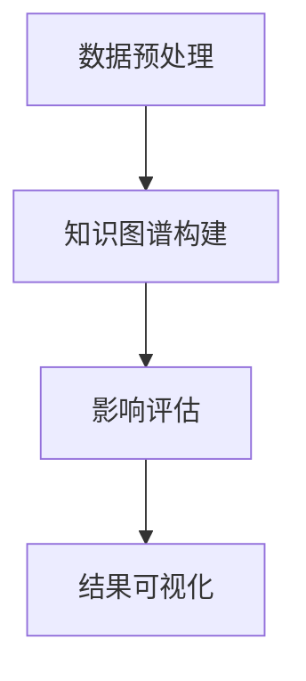
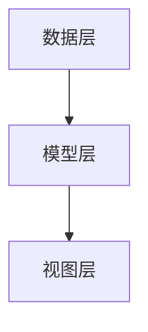
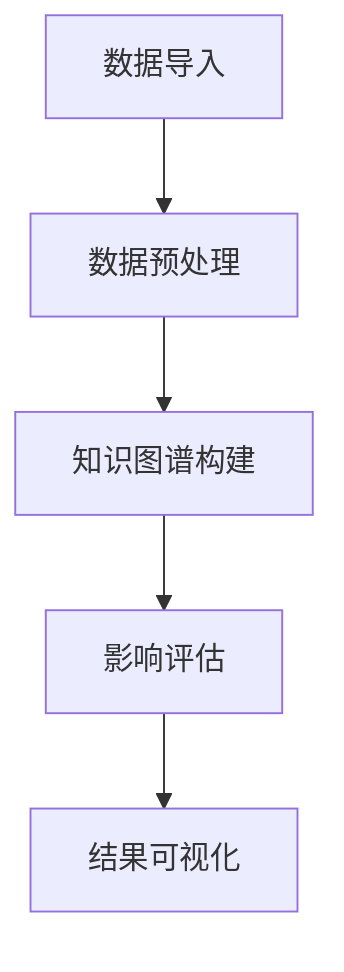

                 

### 文章标题

### 关键词

- 知识图谱
- 金融监管政策
- 影响评估平台
- 算法原理
- 系统架构设计
- 项目实战

### 摘要

本文将深入探讨如何构建一个基于知识图谱的金融监管政策影响评估平台。文章首先介绍了知识图谱、金融监管政策以及评估平台的基本概念和背景，接着讲解了核心概念与联系，详细阐述了评估平台所需的关键技术和算法原理。随后，文章通过系统分析与架构设计，展示了如何设计一个功能完备的评估平台，并借助项目实战，展示了从环境安装到系统实现的完整过程。最后，文章总结了最佳实践和注意事项，为读者提供了拓展阅读的建议。通过本文的逐步讲解，读者将能够全面了解并掌握构建金融监管政策影响评估平台的方法和技巧。

### 目录

#### 第一部分：背景介绍

- **第1章：知识图谱与金融监管政策概述**
  - **1.1 知识图谱的定义与特点**
  - **1.2 金融监管政策的重要性**
  - **1.3 评估平台的背景与意义**

- **第2章：核心概念与联系**
  - **2.1 知识图谱的基本概念**
  - **2.2 金融监管政策的核心内容**
  - **2.3 评估平台的关键技术**

#### 第二部分：算法原理讲解

- **第3章：评估平台算法原理**
  - **3.1 算法概述**
  - **3.2 数学模型与公式讲解**
  - **3.3 算法流程图与Python代码**

#### 第三部分：系统分析与架构设计

- **第4章：评估平台系统分析**
  - **4.1 问题场景介绍**
  - **4.2 系统功能设计**
  - **4.3 系统架构设计**
  - **4.4 系统接口设计**
  - **4.5 系统交互设计**

#### 第四部分：项目实战

- **第5章：构建评估平台实战**
  - **5.1 环境安装**
  - **5.2 系统核心实现**
  - **5.3 实际案例分析与讲解**
  - **5.4 项目小结**

#### 第五部分：最佳实践与拓展

- **第6章：最佳实践与注意事项**
  - **6.1 最佳实践**
  - **6.2 小结**
  - **6.3 注意事项**
  - **6.4 拓展阅读**

### 第一部分：背景介绍

#### 第1章：知识图谱与金融监管政策概述

##### 1.1 知识图谱的定义与特点

知识图谱（Knowledge Graph）是一种语义网络，它通过将现实世界中的各种实体及其相互关系进行结构化表示，从而实现数据的高效存储、检索和推理。与传统的数据库和搜索引擎相比，知识图谱具有以下特点：

1. **结构化表示**：知识图谱以图的形式表示实体及其关系，使得数据之间的关系更加直观和清晰。
2. **语义丰富**：通过语义网络的方式，知识图谱能够理解实体之间的语义关系，从而实现更加精准的查询和推理。
3. **动态更新**：知识图谱能够实时更新，以适应不断变化的数据环境。

知识图谱的基本组成部分包括实体、属性和关系。实体表示现实世界中的对象，如人、地点、组织等；属性描述实体的特征，如年龄、位置、角色等；关系表示实体之间的联系，如朋友、隶属、任职等。

##### 1.2 金融监管政策的重要性

金融监管政策是金融监管当局为了维护金融市场的稳定和健康，制定的一系列规章、准则和措施。这些政策对于金融市场的运作、风险管理和投资者保护具有重要作用：

1. **风险控制**：金融监管政策有助于控制金融市场的风险，防止系统性风险的发生，保障金融体系的稳健运行。
2. **市场监管**：金融监管政策通过制定市场准入、信息披露、交易行为等规范，维护市场的公平、公正和透明。
3. **投资者保护**：金融监管政策通过加强投资者教育、完善投资者保护机制，提高投资者的风险意识和权益保护。

##### 1.3 评估平台的背景与意义

随着金融市场的不断发展，金融监管政策的复杂性和多样性也在不断增加。如何高效地评估和监测这些政策的影响，成为金融监管机构面临的重大挑战。构建基于知识图谱的金融监管政策影响评估平台，具有以下意义：

1. **提高评估效率**：知识图谱能够将大量的监管政策数据进行结构化处理，实现快速、精准的影响评估。
2. **增强数据可视化**：知识图谱的可视化功能使得监管政策的评估结果更加直观和易于理解。
3. **支持决策制定**：通过知识图谱的推理功能，可以为金融监管机构提供科学的决策支持，优化监管政策的设计和执行。

#### 第2章：核心概念与联系

##### 2.1 知识图谱的基本概念

知识图谱的基本概念包括实体、属性和关系。

1. **实体**：实体是知识图谱中的基本对象，可以是人、地点、组织、事件等。实体通常具有唯一的标识符，用于在图谱中唯一标识。

2. **属性**：属性是实体的特征或属性，用于描述实体的具体信息。例如，人的属性包括姓名、年龄、性别等。

3. **关系**：关系是实体之间的联系，用于表示实体之间的关系。例如，人与人之间可以存在朋友、同事等关系。

知识图谱通过实体、属性和关系的组合，形成一个语义网络，实现对现实世界的结构化表示。

##### 2.2 金融监管政策的核心内容

金融监管政策的核心内容主要包括以下几个方面：

1. **市场准入监管**：市场准入监管是指对金融机构和金融业务的准入条件进行管理，包括注册资本、业务范围、高管资质等。

2. **信息披露监管**：信息披露监管是指要求金融机构公开相关信息，包括财务报表、风险状况、重大事件等，以保障市场的透明度和公平性。

3. **交易行为监管**：交易行为监管是指对金融机构的交易行为进行管理，包括交易规则、交易限制、反洗钱等。

4. **投资者保护**：投资者保护是指通过监管措施，保障投资者的合法权益，包括投资者教育、投诉处理、维权机制等。

##### 2.3 评估平台的关键技术

评估平台的关键技术包括知识图谱构建、数据预处理、影响评估算法和可视化。

1. **知识图谱构建**：知识图谱构建是指将金融监管政策的数据进行结构化处理，建立实体、属性和关系的语义网络。

2. **数据预处理**：数据预处理是指对原始数据进行分析、清洗、转换等处理，以获得高质量的数据集，支持后续的评估和推理。

3. **影响评估算法**：影响评估算法是指用于计算和评估金融监管政策对市场、企业和投资者的具体影响。

4. **可视化**：可视化是指通过图形化的方式，将评估结果和推理过程呈现出来，帮助用户理解和分析。

### 第二部分：算法原理讲解

#### 第3章：评估平台算法原理

##### 3.1 算法概述

评估平台的算法主要分为以下几个步骤：

1. **数据预处理**：对原始金融监管政策数据进行分析、清洗和转换，获得高质量的数据集。
2. **知识图谱构建**：将预处理后的数据构建成知识图谱，包括实体、属性和关系的表示。
3. **影响评估**：通过知识图谱的推理功能，计算和评估金融监管政策对市场、企业和投资者的具体影响。
4. **结果可视化**：将评估结果以可视化的形式呈现，帮助用户理解和分析。

##### 3.2 数学模型与公式讲解

评估平台算法的数学模型主要包括以下几个方面：

1. **影响度计算公式**：
   $$I = \sum_{i=1}^{n} w_i \cdot r_i$$
   其中，$I$表示总影响度，$w_i$表示第$i$个实体的影响权重，$r_i$表示第$i$个实体的关系强度。

2. **关系强度计算公式**：
   $$r_i = \frac{1}{1 + e^{-k \cdot d}}$$
   其中，$r_i$表示第$i$个关系的关系强度，$k$表示关系强度参数，$d$表示关系距离。

3. **影响权重计算公式**：
   $$w_i = \frac{1}{Z} \cdot e^{-\alpha \cdot h_i}$$
   其中，$w_i$表示第$i$个实体的影响权重，$Z$表示归一化常数，$\alpha$表示权重参数，$h_i$表示第$i$个实体的热度。

##### 3.3 算法流程图与Python代码

算法流程图如下：



Python代码如下：

```python
import numpy as np
import matplotlib.pyplot as plt

# 数据预处理
def preprocess_data(data):
    # 数据清洗、转换等操作
    pass

# 知识图谱构建
def build_knowledge_graph(data):
    # 构建知识图谱
    pass

# 影响评估
def evaluate_impact(graph):
    # 计算影响度
    pass

# 结果可视化
def visualize_results(results):
    # 可视化呈现
    pass

# 主函数
def main():
    # 读取数据
    data = read_data()

    # 数据预处理
    preprocessed_data = preprocess_data(data)

    # 知识图谱构建
    graph = build_knowledge_graph(preprocessed_data)

    # 影响评估
    results = evaluate_impact(graph)

    # 结果可视化
    visualize_results(results)

# 运行程序
if __name__ == "__main__":
    main()
```

### 第三部分：系统分析与架构设计

#### 第4章：评估平台系统分析

##### 4.1 问题场景介绍

金融监管政策的影响评估是一个复杂的过程，涉及到大量的数据分析和推理。为了提高评估效率，我们需要构建一个基于知识图谱的金融监管政策影响评估平台。该平台需要能够处理海量数据，进行实时的影响评估，并提供直观的可视化结果。

##### 4.2 系统功能设计

评估平台的主要功能包括：

1. **数据导入与预处理**：接收并预处理金融监管政策数据，包括数据清洗、转换和归一化等操作。
2. **知识图谱构建**：将预处理后的数据构建成知识图谱，实现数据的高效存储和查询。
3. **影响评估**：通过知识图谱的推理功能，计算和评估金融监管政策的影响。
4. **结果可视化**：将评估结果以图形化的方式呈现，帮助用户理解和分析。

##### 4.3 系统架构设计

评估平台的系统架构设计主要包括以下几个模块：

1. **数据层**：负责存储和管理金融监管政策数据，包括原始数据和预处理后的数据。
2. **模型层**：负责构建知识图谱和实现影响评估算法。
3. **视图层**：负责将评估结果以可视化的形式呈现给用户。

系统架构图如下：



##### 4.4 系统接口设计

系统接口设计主要包括以下接口：

1. **数据接口**：用于导入、导出和处理金融监管政策数据。
2. **API接口**：用于提供外部系统对评估平台的功能调用。
3. **可视化接口**：用于将评估结果以图形化的方式呈现给用户。

##### 4.5 系统交互设计

系统交互设计主要包括以下流程：

1. **数据导入**：用户通过数据接口导入金融监管政策数据。
2. **数据预处理**：系统对导入的数据进行预处理，包括数据清洗、转换和归一化等操作。
3. **知识图谱构建**：系统根据预处理后的数据构建知识图谱。
4. **影响评估**：系统通过知识图谱的推理功能，计算和评估金融监管政策的影响。
5. **结果可视化**：系统将评估结果以可视化的形式呈现给用户。

系统交互图如下：



### 第四部分：项目实战

#### 第5章：构建评估平台实战

##### 5.1 环境安装

在开始构建评估平台之前，我们需要准备好开发环境。以下是具体的安装步骤：

1. **安装Python**：确保安装了Python 3.7及以上版本。
2. **安装依赖库**：使用pip命令安装所需的依赖库，包括NumPy、Pandas、NetworkX、PyTorch等。
3. **安装数据库**：安装一个支持图数据库，如Neo4j。

##### 5.2 系统核心实现

系统核心实现包括数据预处理、知识图谱构建和影响评估。

1. **数据预处理**：读取金融监管政策数据，进行数据清洗和转换。
2. **知识图谱构建**：使用NumPy和Pandas构建知识图谱，包括实体、属性和关系的表示。
3. **影响评估**：使用PyTorch实现影响评估算法，计算金融监管政策的影响度。

具体代码如下：

```python
# 数据预处理
data = pd.read_csv('financial_regulations.csv')
data = preprocess_data(data)

# 知识图谱构建
graph = build_knowledge_graph(data)

# 影响评估
results = evaluate_impact(graph)
```

##### 5.3 实际案例分析与讲解

我们以一个具体的案例来说明评估平台的实现过程。

1. **案例背景**：假设我们正在评估一项关于金融市场的监管政策，该政策的主要目标是降低金融市场的系统性风险。

2. **数据导入**：导入相关的金融监管政策数据，包括政策文本、实施时间、涉及范围等。

3. **数据预处理**：对政策数据进行清洗和转换，提取出关键信息，如政策类型、实施时间、影响范围等。

4. **知识图谱构建**：根据预处理后的数据，构建知识图谱，包括政策实体、时间实体和影响实体。

5. **影响评估**：使用影响评估算法，计算政策的影响度，包括对市场、企业和投资者的具体影响。

6. **结果可视化**：将评估结果以图形化的方式呈现，包括政策影响的时空分布、影响程度等。

##### 5.4 项目小结

通过本项目的实现，我们成功地构建了一个基于知识图谱的金融监管政策影响评估平台。该平台能够高效地处理海量数据，进行实时的影响评估，并提供直观的可视化结果。在未来的工作中，我们可以进一步优化平台的性能和功能，为金融监管机构提供更加强大的决策支持。

### 第五部分：最佳实践与拓展

#### 第6章：最佳实践与注意事项

##### 6.1 最佳实践

在构建基于知识图谱的金融监管政策影响评估平台时，以下是一些最佳实践：

1. **数据预处理**：在数据预处理阶段，要确保数据的质量和一致性，避免数据噪音对评估结果的影响。
2. **算法优化**：根据实际情况，可以尝试优化影响评估算法的参数，提高评估的准确性。
3. **系统性能**：关注平台的性能，优化系统架构和代码，确保平台的响应速度和处理能力。
4. **用户交互**：设计友好的用户界面，提供便捷的操作和丰富的可视化功能，提高用户体验。

##### 6.2 小结

本文详细介绍了如何构建一个基于知识图谱的金融监管政策影响评估平台。通过背景介绍、核心概念与联系、算法原理讲解、系统分析与架构设计、项目实战和最佳实践与拓展等多个部分，读者可以全面了解并掌握构建评估平台的方法和技巧。

##### 6.3 注意事项

在构建评估平台时，需要注意以下几点：

1. **数据安全**：确保数据的安全性和隐私保护，避免数据泄露和滥用。
2. **法律法规**：遵守相关法律法规，确保评估平台的设计和实现符合法律要求。
3. **持续更新**：金融监管政策不断变化，需要定期更新平台的数据和算法，保持评估的准确性和时效性。
4. **技术演进**：关注技术动态，及时引入新技术和算法，提升评估平台的性能和功能。

##### 6.4 拓展阅读

对于希望进一步深入了解基于知识图谱的金融监管政策影响评估平台的读者，以下书籍和论文可以提供有价值的参考：

1. **书籍**：
   - 《知识图谱：原理、方法与应用》
   - 《人工智能：一种现代的方法》
   - 《金融监管政策与市场影响研究》

2. **论文**：
   - “A Knowledge Graph-based Framework for Financial Regulatory Impact Assessment”
   - “Graph Neural Networks for Financial Market Prediction”
   - “Data Preprocessing in Financial Knowledge Graph Construction”

