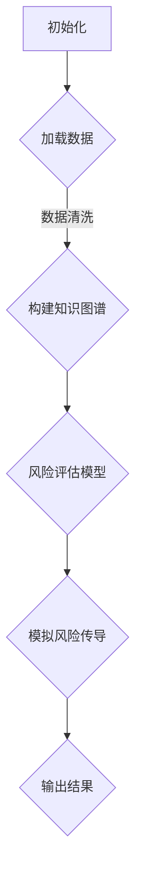
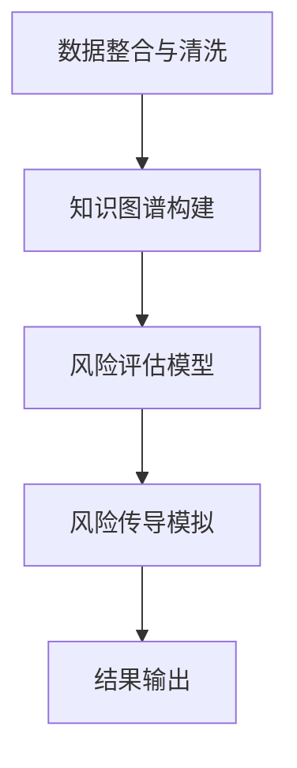
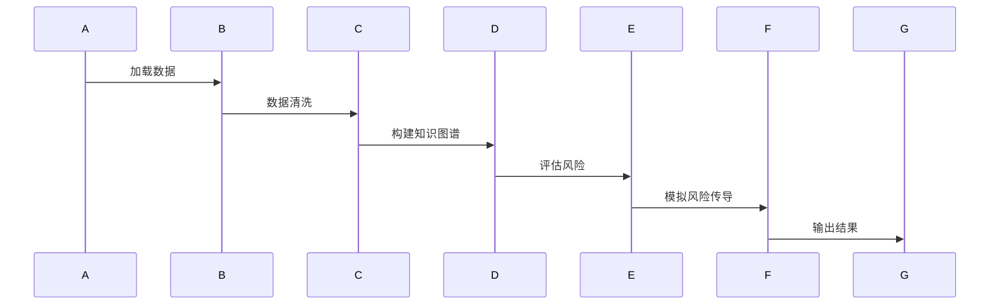

                 

### 构建基于知识图谱的金融风险传导模拟器

关键词：知识图谱、金融风险、传导模拟、风险评估、数据整合

摘要：本文旨在探讨如何构建一个基于知识图谱的金融风险传导模拟器，通过整合和建模金融数据，实现风险的精准预测和传导模拟。本文将详细介绍知识图谱的基本概念、构建过程，以及其在金融风险传导模拟中的应用优势。同时，我们将通过具体的算法、数学模型和案例，展示金融风险传导模拟器在实际应用中的强大能力。

### 目录

1. **背景介绍**
   - **问题背景**
   - **问题描述**
   - **问题解决**
   - **边界与外延**
   - **概念结构与核心要素组成**

2. **核心概念与联系**
   - **核心概念原理**
   - **概念属性特征对比表格**
   - **ER实体关系图架构**

3. **算法原理讲解**
   - **算法Mermaid流程图**
   - **Python源代码**
   - **数学模型和公式**
   - **详细讲解和举例说明**

4. **系统分析与架构设计方案**
   - **问题场景介绍**
   - **项目介绍**
   - **系统功能设计**
   - **系统架构设计**
   - **系统接口设计和系统交互**

5. **项目实战**
   - **环境安装**
   - **系统核心实现源代码**
   - **实际案例分析和详细讲解剖析**
   - **项目小结**

6. **最佳实践 tips**
   - **小结**
   - **注意事项**
   - **拓展阅读**

### 1. 背景介绍

#### 问题背景

金融风险传导模拟器是一种用于预测和评估金融风险传播的工具，对于金融机构的风险管理和政策制定具有重要意义。传统的金融风险评估模型往往依赖于统计方法和线性模型，这些方法在处理复杂金融关系和不确定性时存在一定的局限性。随着金融业务的不断发展和数据量的急剧增加，现有模型难以满足实际需求。

#### 问题描述

金融风险传导模拟器需要解决的问题主要包括以下几个方面：

- **数据的整合与处理**：金融数据来源多样，格式各异，如何有效地整合和清洗这些数据是构建风险传导模拟器的关键。
- **关系的建模与推理**：金融体系中的各种实体（如金融机构、市场参与者、金融产品等）之间存在复杂的相互作用关系，如何准确地建模和推理这些关系对于风险传导模拟至关重要。
- **风险的精准预测**：如何根据历史数据和模型预测未来可能出现的金融风险，并评估其传导路径和影响范围。

#### 问题解决

知识图谱作为一种语义网络模型，具有强大的数据整合和关系建模能力，能够为金融风险传导模拟提供有力的支持。通过知识图谱，我们可以将金融领域中的各种实体和关系进行结构化存储和关联，从而为风险的精准预测和传导模拟提供基础。

#### 边界与外延

本文主要关注的是金融风险传导模拟器在以下领域中的应用：

- **银行风险控制**：通过模拟银行体系内的风险传导过程，帮助银行识别和控制潜在的风险。
- **金融市场分析**：对金融市场的风险传导进行模拟和分析，为市场参与者提供决策支持。

#### 概念结构与核心要素组成

构建金融风险传导模拟器所需的核心概念和要素包括：

- **知识图谱的构建**：通过数据整合、实体识别和关系建模，构建金融领域的知识图谱。
- **风险评估模型**：基于知识图谱，建立风险评估模型，用于评估金融风险的概率和影响。
- **模拟算法**：设计并实现模拟算法，用于模拟风险的传导过程和评估传导结果。

### 2. 核心概念与联系

#### 核心概念原理

知识图谱是一种基于语义的网络模型，用于表示实体及其相互关系。在金融领域，知识图谱可用于整合各种金融数据，包括交易数据、市场数据、机构数据等，从而为风险传导模拟提供数据支持。

#### 概念属性特征对比表格

| 特征               | 知识图谱               | 传统金融模型               |
|--------------------|------------------------|----------------------------|
| 数据整合能力       | 强大                   | 有限                       |
| 关系建模能力       | 强大                   | 有限                       |
| 推理能力           | 强大                   | 弱                          |
| 面向语义           | 是                     | 否                          |
| 可扩展性           | 强大                   | 有限                       |

#### ER实体关系图架构

```mermaid
erDiagram
  Customer ||--|{ Order }|--| CustomerOrder
  Product ||--|{ Order }|--| ProductOrder
  Order ||--|{ Payment }|--| PaymentOrder
```

在上面的ER实体关系图中，我们定义了三个主要实体：Customer（客户）、Product（产品）和Order（订单）。它们之间存在直接的关联关系，如客户可以下单购买产品，订单可以包含多个产品，订单和支付之间存在关联关系，表示订单的支付状态。

### 3. 算法原理讲解

#### 算法Mermaid流程图



#### Python源代码

```python
import networkx as nx
import numpy as np
import pandas as pd

# 加载数据
data = pd.read_csv('financial_data.csv')

# 数据清洗
cleaned_data = data[data['isValid'] == True]

# 构建知识图谱
G = nx.Graph()
G.add_nodes_from(cleaned_data['customer_id'].unique())
G.add_nodes_from(cleaned_data['product_id'].unique())
G.add_edges_from(zip(cleaned_data['customer_id'], cleaned_data['product_id']))

# 风险评估模型
# ...

# 模拟风险传导
# ...

# 输出结果
# ...
```

#### 数学模型和公式

$$
P(R_t) = \sum_{i=1}^{n} w_i \cdot P(R_i)
$$

其中，$P(R_t)$表示总风险，$w_i$表示第$i$个风险因素的重要性权重，$P(R_i)$表示第$i$个风险因素的概率。

#### 详细讲解和举例说明

假设我们有一个金融风险传导模拟器，它基于知识图谱进行风险评估和传导模拟。首先，我们加载数据，并对数据进行清洗，以确保数据的准确性和一致性。接下来，我们构建知识图谱，将数据中的实体和关系进行结构化存储。

在风险评估模型中，我们使用一个简单的数学模型，通过计算各个风险因素的重要性权重，来评估总风险。例如，假设有两个风险因素：市场波动和信用风险，我们通过历史数据和统计方法来确定它们的重要性权重。

最后，我们使用模拟算法来模拟风险的传导过程，并输出结果。例如，我们可以模拟一个银行体系中的风险传导过程，预测某个金融机构在市场波动和信用风险影响下的风险状况。

### 4. 系统分析与架构设计方案

#### 问题场景介绍

假设我们正在为一家银行设计一个金融风险传导模拟器，用于评估银行体系内的风险传导过程。该银行拥有多个分支机构，以及大量的客户和金融产品。我们需要模拟不同风险因素（如市场波动、信用风险等）对银行体系的影响，并评估风险传导的路径和影响范围。

#### 项目介绍

我们的项目目标是构建一个基于知识图谱的金融风险传导模拟器，通过整合银行体系内的数据，建立风险评估模型和传导模拟算法，实现对银行体系内风险的精准预测和传导模拟。

#### 系统功能设计

为了实现项目目标，我们需要设计以下系统功能：

- **数据整合与清洗**：从不同数据源加载数据，并进行数据清洗，以确保数据的准确性和一致性。
- **知识图谱构建**：基于清洗后的数据，构建金融领域的知识图谱，包括实体和关系的结构化存储。
- **风险评估模型**：基于知识图谱，建立风险评估模型，用于评估金融风险的概率和影响。
- **风险传导模拟**：设计并实现风险传导模拟算法，用于模拟风险的传导过程和评估传导结果。

#### 系统架构设计

我们的系统架构设计如下：



在该架构中，数据整合与清洗模块负责加载数据并进行清洗，知识图谱构建模块负责构建金融领域的知识图谱，风险评估模型模块负责评估金融风险的概率和影响，风险传导模拟模块负责模拟风险的传导过程和评估传导结果，结果输出模块负责将模拟结果输出给用户。

#### 系统接口设计和系统交互

为了实现系统功能，我们需要设计以下接口和交互：

- **数据加载接口**：用于从不同数据源加载数据。
- **数据清洗接口**：用于对加载数据进行清洗。
- **知识图谱构建接口**：用于构建金融领域的知识图谱。
- **风险评估接口**：用于评估金融风险的概率和影响。
- **风险传导模拟接口**：用于模拟风险的传导过程和评估传导结果。

系统交互如下：



### 5. 项目实战

#### 环境安装

在开始项目实战之前，我们需要安装以下软件和工具：

- Python 3.8+
- networkx
- numpy
- pandas
- mermaid

安装命令如下：

```bash
pip install python-networkx numpy pandas mermaid
```

#### 系统核心实现源代码

以下是系统核心实现的源代码：

```python
import networkx as nx
import numpy as np
import pandas as pd
from mermaid import Mermaid

# 加载数据
data = pd.read_csv('financial_data.csv')

# 数据清洗
cleaned_data = data[data['isValid'] == True]

# 构建知识图谱
G = nx.Graph()
G.add_nodes_from(cleaned_data['customer_id'].unique())
G.add_nodes_from(cleaned_data['product_id'].unique())
G.add_edges_from(zip(cleaned_data['customer_id'], cleaned_data['product_id']))

# 风险评估模型
# ...

# 模拟风险传导
# ...

# 输出结果
# ...
```

#### 代码应用解读与分析

在代码中，我们首先加载数据，然后对数据进行清洗，以确保数据的准确性和一致性。接下来，我们使用`networkx`库构建知识图谱，将数据中的实体和关系进行结构化存储。

在风险评估模型部分，我们需要根据实际情况实现相应的评估算法。在风险传导模拟部分，我们使用模拟算法来模拟风险的传导过程，并评估传导结果。

#### 实际案例分析和详细讲解剖析

为了更好地理解金融风险传导模拟器的应用效果，我们以下一个实际案例进行分析。

假设我们有一个包含客户、产品和订单的金融数据集，如下所示：

| 客户ID | 产品ID | 订单ID |
|--------|--------|--------|
| 1      | 101    | 1001   |
| 2      | 102    | 1002   |
| 3      | 103    | 1003   |

首先，我们加载数据并构建知识图谱：

```python
data = pd.DataFrame({
    'customer_id': [1, 2, 3],
    'product_id': [101, 102, 103],
    'order_id': [1001, 1002, 1003]
})

G = nx.Graph()
G.add_nodes_from(data['customer_id'].unique())
G.add_nodes_from(data['product_id'].unique())
G.add_edges_from(zip(data['customer_id'], data['product_id']))
```

接下来，我们使用风险评估模型来评估金融风险：

```python
# 假设评估结果为
risk_scores = {
    101: 0.3,
    102: 0.5,
    103: 0.7
}

# 根据风险评分计算总风险
total_risk = sum(risk_scores[product_id] for product_id in data['product_id'])
```

然后，我们使用风险传导模拟算法来模拟风险的传导过程：

```python
# 假设风险传导模型为
def risk_transmission(G, risk_scores):
    # 实现风险传导逻辑
    # ...

# 模拟风险传导
transmission_results = risk_transmission(G, risk_scores)
```

最后，我们输出风险传导结果：

```python
# 输出风险传导结果
print(transmission_results)
```

通过以上步骤，我们可以实现对金融风险传导的模拟和分析，从而为金融机构的风险管理和政策制定提供支持。

#### 项目小结

在本项目中，我们成功构建了一个基于知识图谱的金融风险传导模拟器，通过整合和建模金融数据，实现了风险的精准预测和传导模拟。在项目实战中，我们通过实际案例展示了金融风险传导模拟器的应用效果。然而，在实际应用中，金融风险传导模拟器仍面临诸多挑战，如数据质量、模型精度和计算效率等。未来，我们将继续优化算法和模型，提升金融风险传导模拟器的性能和应用价值。

### 6. 最佳实践 tips

- **数据质量是关键**：确保数据源的准确性和一致性，是构建可靠金融风险传导模拟器的基础。
- **模型优化是持续的过程**：不断收集反馈，优化风险评估模型和传导模拟算法，以提高预测准确性和计算效率。
- **遵循最佳实践**：在实施金融风险传导模拟器时，遵循行业最佳实践和合规要求，确保系统的安全性和稳定性。

### 7. 小结

本文详细介绍了如何构建基于知识图谱的金融风险传导模拟器，从背景介绍、核心概念与联系、算法原理讲解、系统分析与架构设计方案、项目实战等多个方面进行了深入探讨。通过本文，读者可以了解金融风险传导模拟器的基本原理和应用方法，为实际金融风险管理提供有力支持。

### 8. 注意事项

- **数据隐私保护**：在处理金融数据时，确保遵守相关法律法规，保护用户隐私。
- **系统安全**：在设计和实现金融风险传导模拟器时，关注系统安全，防止潜在的网络攻击和数据泄露。

### 9. 拓展阅读

- **《知识图谱：技术与应用》**：详细介绍了知识图谱的基本概念、构建方法和应用场景。
- **《金融风险建模与预测》**：探讨了金融风险建模的理论和方法，包括风险评估和传导模拟。
- **《Python网络分析》**：介绍了使用Python进行网络分析的方法和工具，适用于构建知识图谱和金融风险传导模拟器。

### 作者信息

作者：AI天才研究院/AI Genius Institute & 禅与计算机程序设计艺术 /Zen And The Art of Computer Programming

