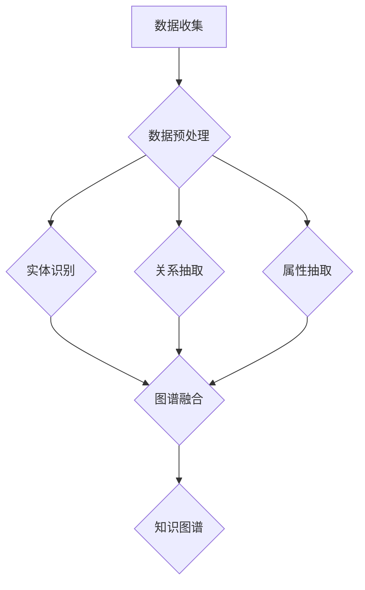
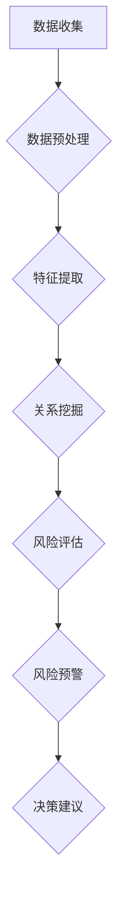
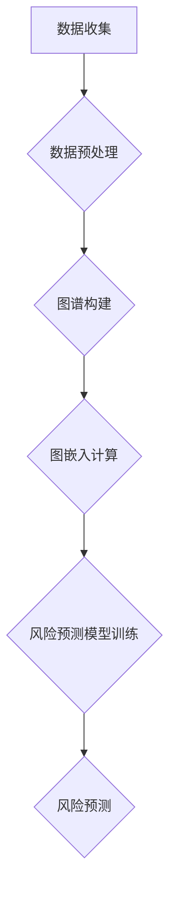
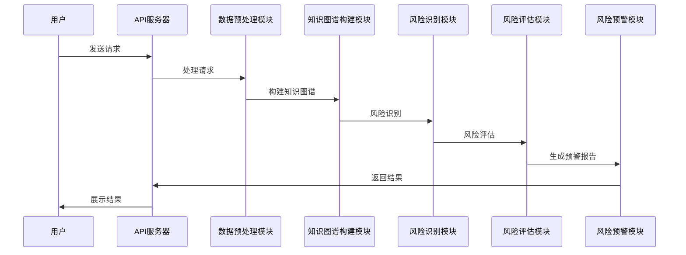

                 

### 构建基于知识图谱的金融风险关联分析系统

#### 文章关键词

- 知识图谱
- 金融风险
- 关联分析
- 系统架构
- 数据挖掘

#### 摘要

本文旨在探讨构建基于知识图谱的金融风险关联分析系统的全过程，从背景介绍到系统设计、算法实现、项目实战以及最佳实践等各个环节，详细阐述了知识图谱在金融风险管理中的具体应用。通过对知识图谱、金融风险关联分析等核心概念的分析，本文提出了一个系统化的解决方案，为金融行业的风险管理提供了新思路。文章不仅涵盖了理论知识，还通过实际案例展示了系统的实用性和有效性，为读者提供了全面的技术参考。

## 第1章：问题背景与系统目标

### 1.1 问题背景

#### 金融风险的定义、类型及其重要性

金融风险是指金融机构在金融活动中面临的不确定性风险，可能来源于内部管理问题、外部经济环境变化或市场波动等。金融风险主要包括市场风险、信用风险、流动性风险、操作风险和法律风险等类型。这些风险不仅影响金融机构的运营，还会对整个金融系统的稳定性构成威胁。

市场风险源于市场价格波动，包括利率风险、汇率风险和股票市场风险等。信用风险是指债务人无法履行偿还债务的风险，如违约、拖欠利息等。流动性风险是指金融机构无法在合理时间内以合理的价格转换资产以满足债务偿付需求的风险。操作风险则是由内部程序、人员、系统或外部事件造成的损失风险。法律风险涉及因法律法规的变化或合规性不足而导致的损失。

金融风险的重要性不言而喻。首先，金融风险可能引发系统性金融危机，对整个经济体系产生深远影响。其次，金融风险的增加会削弱金融机构的竞争力和生存能力，甚至导致破产。此外，金融风险还可能引发社会问题，如财富分配不均、社会动荡等。因此，对金融风险的有效管理和控制是金融行业的一项重要任务。

#### 知识图谱在金融领域中的应用现状与需求

知识图谱作为一种新兴技术，近年来在金融领域得到了广泛关注和应用。知识图谱通过将结构化的数据转化为图形结构，实现了知识表示、存储和查询的优化，能够有效地支持金融风险管理的多个方面。

首先，知识图谱可以用于客户关系管理。金融机构通过知识图谱将客户的个人信息、交易记录、信用状况等数据进行关联和分析，能够更全面地了解客户需求，提供个性化的金融产品和服务。

其次，知识图谱在信用风险评估中具有重要作用。通过构建包含信用数据、债务数据、交易数据等的多层次知识图谱，金融机构可以挖掘潜在风险，提前预警，降低信用风险。

此外，知识图谱还可以用于金融欺诈检测。通过对交易行为、账户信息等数据的关联分析，知识图谱可以识别异常交易模式，及时阻断潜在的欺诈行为。

尽管知识图谱在金融领域具有广泛的应用前景，但实际应用中仍面临诸多挑战。例如，知识图谱的构建需要大量的数据和技术支持，如何高效地获取、处理和整合数据成为关键问题。此外，知识图谱的准确性和实时性也需要进一步优化，以满足金融行业的快速变化需求。

#### 风险管理的挑战与机遇

风险管理是金融行业的核心任务之一，但同时也面临着诸多挑战。首先，金融风险具有复杂性和不确定性，传统的方法和工具难以有效应对。例如，市场风险和信用风险的关联分析需要综合多个维度的数据，而传统的统计分析方法往往无法满足这一需求。

其次，金融风险管理的实时性和准确性要求越来越高。在快速变化的金融市场环境中，金融机构需要快速识别和应对风险，以确保业务的稳定运行。然而，传统的方法在数据处理速度和准确性上存在局限。

知识图谱技术的引入为金融风险管理带来了新的机遇。通过构建知识图谱，金融机构可以实现对海量数据的深度挖掘和分析，提高风险识别和预警的准确性。知识图谱的图形结构使得数据之间的关联关系更加直观，有助于识别潜在风险因素。

此外，知识图谱还可以支持实时风险管理。通过实时更新和查询知识图谱，金融机构可以及时了解市场变化和客户行为，采取相应的风险管理措施。

综上所述，金融风险管理面临着巨大的挑战，但同时也蕴含着巨大的机遇。知识图谱技术的应用为金融机构提供了新的工具和方法，有助于提升风险管理的效率和效果。在接下来的章节中，我们将进一步探讨知识图谱在金融风险关联分析系统中的具体应用和实现。

### 1.2 系统目标

构建基于知识图谱的金融风险关联分析系统旨在解决金融风险管理中的关键问题，实现以下目标：

首先，该系统的核心目标是提升金融风险识别和预警的准确性。通过知识图谱的构建，系统能够将海量的金融数据进行关联分析，挖掘潜在风险因素，并提前预警，减少金融机构的损失。

其次，系统希望提供个性化的风险管理服务。通过分析客户数据，系统可以识别不同客户的风险特征，提供针对性的风险管理建议和金融产品推荐，提高客户满意度和忠诚度。

此外，系统还致力于提升金融风险管理的效率和实时性。通过知识图谱的高效数据查询和处理能力，系统能够快速响应市场变化和客户需求，实现实时风险管理。

最终，构建基于知识图谱的金融风险关联分析系统的意义在于为金融机构提供一种全新的风险管理工具，帮助其更好地应对复杂多变的金融市场环境，提升整体风险控制能力。通过这一系统，金融机构不仅能够提高风险管理的效率和效果，还能够增强其竞争力和市场地位。

### 1.3 边界与外延

构建基于知识图谱的金融风险关联分析系统涉及多个方面，其边界与外延主要包括以下几个方面：

首先，系统涉及的数据源包括金融机构内部的客户数据、交易数据、信用数据等，以及来自外部数据源的市场数据、经济数据等。这些数据是系统构建知识图谱和分析金融风险的基础。

其次，系统的处理范围涵盖客户关系管理、信用风险评估、金融欺诈检测等多个业务领域。通过将这些领域的相关数据进行关联分析，系统能够提供全面的风险管理服务。

在业务领域方面，系统主要面向金融行业的银行、证券、保险等机构。这些机构可以通过系统进行风险管理和客户服务，提高业务运营效率。

核心概念方面，系统涉及的主要概念包括知识图谱、实体、关系、属性等。知识图谱作为系统的核心组成部分，通过表示实体及其关系，实现对金融数据的深度挖掘和分析。

基本要素方面，系统包括数据采集与预处理、知识图谱构建、风险关联分析、结果可视化与报告生成等模块。每个模块都承担特定的功能，共同实现系统的目标。

### 1.4 核心概念与联系

#### 知识图谱概念

知识图谱是一种用于表示和存储知识的技术，通过将实体、属性和关系以图形结构进行组织。知识图谱的核心在于对复杂信息的结构化表示，使得数据之间的关系更加清晰和直观。其基本结构包括实体（Entity）、属性（Attribute）和关系（Relationship）。

- **实体**：知识图谱中的基本单位，代表具体的事物或概念，如“客户”、“股票”、“金融机构”等。
- **属性**：描述实体特征的属性，如“客户的年龄”、“股票的市值”、“金融机构的资本”等。
- **关系**：连接两个或多个实体的语义关联，如“客户购买股票”、“股票属于某个市场”、“金融机构持有客户账户”等。

知识图谱的构建过程主要包括数据收集、实体识别、关系抽取、属性抽取和图谱融合等步骤。通过这些步骤，系统能够将分散的数据整合成一个统一的、结构化的知识图谱，为后续的风险分析提供基础。

#### 金融风险关联分析

金融风险关联分析是指通过分析金融数据，识别和评估潜在风险，并理解风险因素之间的关联性。其基本原理包括风险识别、风险评估和风险预警。

- **风险识别**：通过数据挖掘和统计分析，识别潜在的金融风险因素，如市场波动、信用违约、交易异常等。
- **风险评估**：对识别出的风险进行量化评估，确定其影响程度和优先级，以便采取相应的管理措施。
- **风险预警**：通过实时监控和预警机制，对高风险事件进行提前预警，减少损失。

金融风险关联分析的关键技术和方法包括关联规则挖掘、图神经网络和机器学习等。这些技术能够从海量数据中提取有价值的信息，帮助金融机构更好地理解和管理风险。

#### 知识图谱与金融风险关联分析的关系

知识图谱为金融风险关联分析提供了强有力的技术支持。通过知识图谱，金融机构能够将金融数据、风险因素和关联关系进行结构化表示，实现对数据的深度挖掘和分析。

具体来说，知识图谱在金融风险关联分析中的应用主要体现在以下几个方面：

1. **数据整合**：知识图谱能够将来自不同数据源和不同格式的金融数据整合到一个统一的结构中，便于后续分析和处理。
2. **关系挖掘**：通过知识图谱，可以挖掘出金融数据中隐藏的复杂关联关系，为风险识别和评估提供支持。
3. **实时监控**：知识图谱的高效查询和处理能力，使得金融机构能够实时监控市场变化和客户行为，及时预警潜在风险。
4. **决策支持**：基于知识图谱的风险分析结果，金融机构可以制定更科学的决策策略，提高风险管理的效率和效果。

综上所述，知识图谱与金融风险关联分析之间具有紧密的联系。知识图谱为金融风险关联分析提供了强大的技术支持，使其能够更高效、准确地识别和评估风险，为金融机构提供全方位的风险管理服务。

### 第2章：核心概念原理与特征对比

#### 2.1 知识图谱的基本原理

知识图谱作为一种数据结构和模型，通过表示实体、属性和关系，实现对复杂知识的结构化存储和查询。理解知识图谱的基本原理是构建金融风险关联分析系统的重要基础。

**知识图谱的构建过程**

知识图谱的构建过程通常包括以下几个主要步骤：

1. **数据收集**：首先，从多个数据源（如数据库、日志文件、外部数据集等）中收集相关数据。这些数据可能包括客户信息、交易记录、市场数据等。

2. **实体识别**：在收集到的数据中识别出关键实体，如客户、股票、金融机构等。实体识别的目的是确定数据中的核心元素，为后续构建知识图谱提供基础。

3. **关系抽取**：分析数据中实体之间的关系，如客户与股票之间的购买关系、金融机构与市场之间的交易关系等。关系抽取是知识图谱构建的关键步骤，需要通过自然语言处理、信息抽取等技术实现。

4. **属性抽取**：描述实体的属性信息，如客户的年龄、股票的市值、金融机构的资本等。属性抽取同样依赖于信息抽取和数据分析技术。

5. **图谱融合**：将识别出的实体、关系和属性整合到一个统一的图结构中，形成知识图谱。图谱融合过程中，需要处理数据中的冗余信息、不一致性和噪声数据，确保图谱的准确性和一致性。

**实体、关系与属性**

在知识图谱中，实体、关系和属性是三个核心要素，它们共同构成了知识图谱的骨架。

- **实体**：实体是知识图谱中的基本单位，代表具体的事物或概念。例如，在金融领域，实体可以包括客户、股票、金融机构等。实体通常具有唯一的标识符，用于在图中进行唯一标识。

- **关系**：关系是连接两个或多个实体的语义关联。关系通常表示实体之间的相互作用或归属关系。例如，客户与股票之间的关系可以是“购买”、“持有”等。关系在知识图谱中用边表示，边通常包含方向和权重等信息。

- **属性**：属性是描述实体特征的属性信息。例如，客户的属性可以包括年龄、性别、收入等。属性在知识图谱中以节点或边的属性形式存在，用于提供额外的上下文信息。

**知识图谱的存储与查询**

知识图谱的存储与查询是其关键功能之一。知识图谱的存储通常采用图数据库或分布式图计算平台，如Neo4j、JanusGraph等。这些数据库能够高效地存储和查询大规模图结构数据，并提供强大的图查询语言（如Cypher、Gremlin等）。

- **存储**：知识图谱的存储方式主要有两种：基于图数据库的存储和基于关系数据库的存储。图数据库采用图结构的存储方式，能够高效地管理复杂的图数据，并提供快速的查询能力。关系数据库则通过表结构存储图数据，通过关联查询实现图数据的存储和检索。

- **查询**：知识图谱的查询主要通过图查询语言实现。这些查询语言支持复杂的图遍历、过滤和聚合操作，能够快速获取图数据中的关键信息。常见的图查询语言包括Cypher（Neo4j）、Gremlin（JanusGraph）、SPARQL（RDF数据）等。

通过上述原理和步骤，知识图谱能够实现对金融数据的结构化表示和分析，为金融风险关联分析系统提供了坚实的基础。在接下来的章节中，我们将进一步探讨金融风险关联分析的基本原理和方法。

#### 2.2 金融风险关联分析的基本原理

金融风险关联分析是一种通过对金融数据进行深入挖掘和分析，识别和评估潜在风险，理解风险因素之间关联性的方法。其基本原理包括风险识别、风险评估和风险预警等步骤。

**风险识别**

风险识别是金融风险关联分析的第一步，旨在发现可能对金融机构产生负面影响的因素。这一过程通常涉及以下几个关键步骤：

1. **数据收集与预处理**：从多个数据源收集相关数据，包括内部数据（如交易记录、客户信息）和外部数据（如市场数据、新闻报道）。对收集到的数据进行清洗和预处理，确保数据的质量和一致性。

2. **特征提取**：从原始数据中提取关键特征，如交易频率、交易金额、客户信用评分等。这些特征用于后续的风险评估和分析。

3. **异常检测**：通过统计分析、机器学习等方法，识别数据中的异常值和潜在风险。例如，使用聚类分析技术检测交易行为中的异常模式，使用异常检测算法（如孤立森林、局部异常因子分析等）识别潜在的信用风险。

**风险评估**

风险评估是在风险识别的基础上，对识别出的风险进行量化评估，以确定其影响程度和优先级。风险评估通常包括以下几个步骤：

1. **风险建模**：构建风险评估模型，将风险因素与潜在损失之间建立数学关系。常用的风险模型包括信用评分模型、市场风险模型、操作风险模型等。

2. **参数估计**：使用历史数据对风险模型中的参数进行估计，以量化风险因素的影响。参数估计的方法包括最大似然估计、最小二乘法等。

3. **风险度量**：根据风险模型，计算每个风险因素的可能损失和整体风险水平。常用的风险度量指标包括期望损失（Expected Loss，EL）、违约概率（Probability of Default，PD）、损失程度（Loss Given Default，LGD）等。

**风险预警**

风险预警是金融风险关联分析的最后一步，旨在对高风险事件进行提前预警，以减少潜在损失。风险预警通常包括以下几个步骤：

1. **实时监控**：通过实时数据采集和监控系统，持续监测市场变化、客户行为等关键指标。

2. **预警模型**：构建预警模型，将实时数据与历史风险模型进行比较，识别潜在的高风险事件。常用的预警模型包括逻辑回归模型、决策树模型、神经网络模型等。

3. **预警策略**：根据预警模型的输出结果，制定相应的预警策略，如调整风险敞口、增加监控频率、采取风险管理措施等。

通过上述原理和步骤，金融风险关联分析能够实现对金融风险的全面识别、评估和预警，为金融机构提供有效的风险管理工具。在接下来的章节中，我们将进一步探讨金融风险关联分析的关键技术和应用场景。

#### 2.3 核心概念属性特征对比表格

在构建基于知识图谱的金融风险关联分析系统中，理解不同概念之间的差异和联系至关重要。以下是对知识图谱、关系数据库和金融风险关联分析的基本特征进行对比的表格，以帮助读者更好地掌握这些核心概念。

| 概念                     | 特征描述                                                   |
|------------------------|----------------------------------------------------------|
| **知识图谱**               | - 实体：具体的事物或概念<br>- 关系：实体间的语义关联<br>- 属性：实体的特征描述<br>- 图结构：实体、关系和属性的图形表示 |
| **关系数据库**               | - 表结构：用表格存储数据<br>- 关系：表之间的连接关系<br>- 查询语言：SQL等结构化查询语言<br>- 数据一致性：保证数据完整性和一致性 |
| **金融风险关联分析**         | - 风险识别：识别潜在风险因素<br>- 风险评估：量化风险的影响程度<br>- 风险预警：提前预警高风险事件<br>- 模型构建：使用统计和机器学习技术 |
| **数据整合能力**             | - 知识图谱：通过图结构整合多源异构数据<br>- 关系数据库：通过表连接整合数据<br>- 金融风险关联分析：使用数据融合技术整合不同数据源 |
| **查询和处理速度**           | - 知识图谱：图数据库提供高效查询和计算能力<br>- 关系数据库：SQL查询速度较快，但复杂查询性能较差<br>- 金融风险关联分析：依赖所选算法和模型，实时性和效率各有不同 |
| **应用场景**                | - 知识图谱：数据挖掘、知识表示、智能搜索等<br>- 关系数据库：事务处理、数据仓库、OLAP分析等<br>- 金融风险关联分析：信用评估、欺诈检测、市场分析等 |

通过上述表格，我们可以清晰地看到知识图谱、关系数据库和金融风险关联分析之间的差异和联系。知识图谱以其强大的数据整合和查询能力，在金融风险关联分析中扮演着重要的角色，而关系数据库则以其稳定的事务处理能力，适用于传统的数据管理场景。金融风险关联分析则依赖于这些基础技术，通过数据挖掘和机器学习等手段，实现对金融风险的有效识别和预警。

#### 2.4 金融风险关联分析的系统架构设计

**3.1 系统架构设计**

金融风险关联分析系统的架构设计旨在实现高效的数据处理和精准的风险分析。系统整体架构分为数据层、服务层和展示层三个主要层次，每个层次承担不同的功能。

- **数据层**：包括数据源、数据存储和数据预处理。数据源包括内部数据（如交易记录、客户信息）和外部数据（如市场新闻、经济指标）。数据存储使用大数据存储技术（如Hadoop、HBase），确保数据的高效存储和访问。数据预处理模块负责清洗、转换和集成不同来源的数据，为后续分析提供高质量的数据。

- **服务层**：包括核心业务逻辑和中间件。核心业务逻辑模块实现金融风险识别、风险评估和预警等功能，使用图数据库（如Neo4j）进行数据存储和查询。中间件层提供数据整合、API接口和安全认证等功能，确保系统的稳定运行和可扩展性。

- **展示层**：包括Web前端和移动端界面。前端展示模块提供用户友好的交互界面，用户可以通过仪表盘、图表和报告等形式查看风险分析结果。数据可视化工具（如ECharts、D3.js）用于展示复杂的分析数据，帮助用户更好地理解风险状况。

**模块划分与功能描述**

系统功能模块主要包括以下几个部分：

- **数据采集模块**：负责从多个数据源收集和下载相关数据，包括内部交易记录、客户信息、市场新闻等。数据采集模块采用分布式任务调度技术（如Apache Kafka），确保数据的实时性和一致性。

- **数据预处理模块**：对采集到的原始数据进行清洗、转换和集成，处理数据中的噪声和异常值。数据预处理模块使用ETL（Extract, Transform, Load）技术，将清洗后的数据存储到大数据存储系统中。

- **知识图谱构建模块**：将预处理后的数据转换为知识图谱结构，包括实体、关系和属性。知识图谱构建模块采用实体识别、关系抽取和属性抽取等技术，实现数据的结构化表示。

- **风险识别模块**：利用知识图谱进行风险识别，挖掘潜在的风险因素。风险识别模块使用机器学习算法（如分类、聚类）和关联规则挖掘技术，从海量数据中提取有价值的信息。

- **风险评估模块**：对识别出的风险因素进行量化评估，计算其影响程度和优先级。风险评估模块使用风险建模和预测技术（如逻辑回归、决策树），为金融机构提供精准的风险评估结果。

- **预警和决策模块**：根据风险评估结果，生成风险预警报告和决策建议。预警和决策模块采用实时监控和预警机制，对高风险事件进行及时预警，并制定相应的风险管理策略。

- **可视化展示模块**：将风险分析结果以直观的图表和报告形式展示给用户。可视化展示模块使用数据可视化工具，帮助用户更好地理解风险状况和决策依据。

**系统交互流程**

系统交互流程主要包括以下几个环节：

1. **数据采集**：系统从内部数据库和外部API接口收集数据，通过Kafka进行实时数据传输。
2. **数据预处理**：采集到的数据经过清洗、转换和集成，存储到大数据存储系统。
3. **知识图谱构建**：预处理后的数据转换为知识图谱结构，存储到图数据库。
4. **风险识别**：系统使用知识图谱进行风险识别，提取潜在风险因素。
5. **风险评估**：系统对识别出的风险因素进行量化评估，生成风险评估报告。
6. **预警和决策**：根据风险评估结果，系统生成风险预警报告和决策建议，并通过Web前端和移动端展示给用户。

通过上述系统架构设计和交互流程，金融风险关联分析系统能够高效地处理海量金融数据，实现对风险的全面识别、评估和预警，为金融机构提供强有力的风险管理工具。

### 3.2 功能模块详细设计

在构建基于知识图谱的金融风险关联分析系统中，功能模块的详细设计是实现系统目标的关键步骤。以下将详细描述数据采集与预处理、知识图谱构建、风险关联分析和结果可视化与报告生成等模块的设计方案。

**数据采集与预处理模块**

数据采集与预处理模块是系统的基础，负责从多个数据源收集数据，并对数据进行清洗、转换和集成。具体设计如下：

1. **数据源**：数据采集模块支持多种数据源，包括内部数据（如银行交易记录、客户信息）和外部数据（如金融市场数据、新闻资讯）。内部数据可以通过数据库连接直接获取，外部数据可以通过API接口或网络爬虫进行采集。

2. **数据清洗**：数据清洗是数据预处理的重要环节，旨在去除数据中的噪声和异常值。清洗步骤包括去除重复数据、填充缺失值、处理不一致性数据等。例如，对于交易记录数据，可以去除重复的交易记录，填充缺失的交易时间或金额。

3. **数据转换**：数据转换模块负责将不同数据源的数据格式统一为系统所需的格式。例如，将不同数据源的数据转换为JSON、CSV或XML格式，以便后续处理。

4. **数据集成**：数据集成模块将来自不同数据源的数据进行整合，构建一个统一的数据视图。数据集成可以通过数据仓库技术实现，将不同数据源的数据存储到统一的数据存储系统中。

5. **分布式任务调度**：为了提高数据采集和预处理的效率，系统采用分布式任务调度技术（如Apache Kafka）。Kafka能够实现数据的实时传输和分布式处理，确保数据采集和预处理的实时性和一致性。

**知识图谱构建模块**

知识图谱构建模块是将结构化数据转换为知识图谱的关键步骤。具体设计如下：

1. **实体识别**：实体识别模块负责识别数据中的关键实体，如客户、股票、金融机构等。实体识别可以通过自然语言处理（NLP）技术实现，利用词性标注、命名实体识别等技术识别数据中的实体。

2. **关系抽取**：关系抽取模块负责识别实体之间的关系。关系抽取可以通过模式识别、文本挖掘等技术实现。例如，通过分析交易记录数据，可以识别出客户与股票之间的购买关系。

3. **属性抽取**：属性抽取模块负责提取实体的属性信息，如客户的年龄、性别、信用评分等。属性抽取可以通过模式匹配、机器学习等技术实现。

4. **图谱融合**：图谱融合模块将识别出的实体、关系和属性整合到一个统一的知识图谱中。图谱融合过程中，需要处理数据中的冗余信息、不一致性和噪声数据，确保图谱的准确性和一致性。

5. **图数据库存储**：知识图谱存储在图数据库中，如Neo4j。图数据库能够高效地存储和查询大规模图结构数据，并提供强大的图查询语言（如Cypher），便于后续的风险分析和查询。

**风险关联分析模块**

风险关联分析模块是系统的核心功能，负责利用知识图谱进行风险识别、评估和预警。具体设计如下：

1. **风险识别**：风险识别模块通过分析知识图谱中的实体和关系，识别出潜在的风险因素。风险识别可以采用关联规则挖掘、图神经网络等技术，从海量数据中提取有价值的信息。

2. **风险评估**：风险评估模块对识别出的风险因素进行量化评估，计算其影响程度和优先级。风险评估可以采用风险建模、预测分析等技术，实现对风险的精准评估。

3. **风险预警**：风险预警模块根据风险评估结果，生成风险预警报告和决策建议。风险预警可以采用实时监控、自动化预警等技术，对高风险事件进行及时预警。

4. **决策支持**：决策支持模块为金融机构提供决策建议，如调整风险敞口、增加监控频率、采取风险管理措施等。决策支持可以通过专家系统、机器学习等技术实现。

**结果可视化与报告生成模块**

结果可视化与报告生成模块负责将风险分析结果以直观的图表和报告形式展示给用户。具体设计如下：

1. **数据可视化**：数据可视化模块使用数据可视化工具（如ECharts、D3.js），将复杂的风险分析结果以图表形式展示。例如，可以展示风险因素的分布情况、风险等级的分布情况等。

2. **报告生成**：报告生成模块生成详细的报告文档，包括风险分析结果、决策建议、数据统计等。报告可以以PDF、Word等格式输出，便于用户查看和分享。

3. **用户交互**：用户交互模块提供用户友好的界面，用户可以通过Web前端和移动端访问系统，查看风险分析结果和报告。用户可以自定义查询条件、查看详细信息等。

通过上述功能模块的详细设计，基于知识图谱的金融风险关联分析系统能够实现对金融数据的全面分析和风险管理，为金融机构提供强有力的支持。

### 3.3 系统架构图与领域模型类图

为了更好地理解系统架构和领域模型，以下将分别展示系统架构图和领域模型类图，并对其进行详细解释。

#### 系统架构图


**系统架构图详细解释：**

1. **数据层**：数据层包括数据源、数据存储和数据预处理模块。数据源包括内部数据（如银行交易记录、客户信息）和外部数据（如金融市场数据、新闻资讯）。数据存储采用Hadoop和HBase技术，实现海量数据的高效存储和访问。数据预处理模块负责数据清洗、转换和集成，确保数据的质量和一致性。

2. **服务层**：服务层包括核心业务逻辑和中间件。核心业务逻辑模块实现金融风险识别、风险评估和预警等功能，使用图数据库（如Neo4j）进行数据存储和查询。中间件层提供数据整合、API接口和安全认证等功能，确保系统的稳定运行和可扩展性。

3. **展示层**：展示层包括Web前端和移动端界面。前端展示模块提供用户友好的交互界面，用户可以通过仪表盘、图表和报告等形式查看风险分析结果。数据可视化工具（如ECharts、D3.js）用于展示复杂的分析数据，帮助用户更好地理解风险状况和决策依据。

4. **数据采集模块**：数据采集模块负责从内部数据库和外部API接口收集数据，通过Kafka进行实时数据传输，确保数据的实时性和一致性。

5. **数据预处理模块**：数据预处理模块对采集到的原始数据进行清洗、转换和集成，处理数据中的噪声和异常值，存储到大数据存储系统。

6. **知识图谱构建模块**：知识图谱构建模块将预处理后的数据转换为知识图谱结构，存储到图数据库中，实现数据的结构化表示。

7. **风险识别模块**：风险识别模块利用知识图谱进行风险识别，提取潜在风险因素。

8. **风险评估模块**：风险评估模块对识别出的风险因素进行量化评估，计算其影响程度和优先级。

9. **预警和决策模块**：预警和决策模块根据风险评估结果，生成风险预警报告和决策建议，通过Web前端和移动端展示给用户。

#### 领域模型类图


**领域模型类图详细解释：**

1. **实体**：领域模型中的实体包括客户、股票、金融机构等。每个实体具有唯一的标识符和多个属性，如客户有姓名、年龄、信用评分等属性，股票有代码、市值等属性。

2. **关系**：领域模型中的关系表示实体之间的关联。例如，客户与股票之间存在购买关系，金融机构与股票之间存在持有关系。关系通常包含方向和权重等信息。

3. **属性**：属性是实体的特征描述，如客户的年龄、股票的市值等。属性可以用于描述实体之间的关联和特征，如客户购买股票的频率、金额等。

4. **类**：类是对具有相同属性和行为的实体的抽象。例如，客户类、股票类、金融机构类等。类定义了实体的属性和方法，如客户类的信用评分方法、股票类的市值计算方法等。

通过系统架构图和领域模型类图，我们可以清晰地看到系统的整体架构和领域模型的结构。系统架构图展示了系统的各个层次和模块之间的关系，领域模型类图则展示了系统中的核心实体、关系和属性的组成。这些图表为系统的设计和实现提供了直观的指导，有助于开发者更好地理解和实现系统功能。

### 4.1 算法原理讲解

#### 知识图谱构建算法

知识图谱的构建是一个复杂的过程，涉及数据预处理、实体识别、关系抽取和属性抽取等多个环节。以下将详细讲解知识图谱构建算法的原理和步骤。

**数据预处理**

数据预处理是知识图谱构建的基础步骤，旨在清洗、转换和集成原始数据，确保数据的质量和一致性。主要步骤包括：

1. **数据清洗**：去除重复数据、处理缺失值和异常值。例如，去除交易记录中的重复交易、处理客户信息中的缺失字段等。
2. **数据转换**：将不同数据源的数据格式统一为系统所需的格式。例如，将Excel文件转换为CSV或JSON格式。
3. **数据集成**：将来自多个数据源的数据进行整合，构建一个统一的数据视图。可以使用数据仓库技术，将不同数据源的数据存储到统一的数据存储系统中。

**实体识别**

实体识别是知识图谱构建的关键步骤，旨在从原始数据中识别出关键实体。实体识别通常使用自然语言处理（NLP）技术实现，包括以下步骤：

1. **分词**：将文本数据分解为单词或词组。例如，使用分词器将“张三购买了股票A”分解为“张三”、“购买”、“股票A”等。
2. **词性标注**：为每个词分配词性标签，如名词、动词、形容词等。例如，“购买”为动词，“股票A”为名词。
3. **命名实体识别**：识别出文本中的命名实体，如人名、地名、机构名等。可以使用预训练的模型（如BERT）或基于规则的方法实现。

**关系抽取**

关系抽取是知识图谱构建的另一个关键步骤，旨在识别出实体之间的关系。关系抽取通常使用模式识别、文本挖掘等技术实现，包括以下步骤：

1. **模式匹配**：通过预设的模式匹配规则，识别出实体之间的关系。例如，根据“客户购买股票”的规则，识别出“张三”和“股票A”之间的购买关系。
2. **文本挖掘**：通过分析实体之间的文本内容，识别出潜在的关系。例如，使用情感分析技术，分析“张三对股票A的评价”，识别出“张三”和“股票A”之间的评价关系。
3. **实体关系分类**：使用机器学习算法（如朴素贝叶斯、支持向量机等），对抽取出的关系进行分类，确定其类型。例如，将“购买”分类为“交易关系”，“评价”分类为“评价关系”。

**属性抽取**

属性抽取是知识图谱构建的最后一步，旨在提取实体的属性信息。属性抽取通常包括以下步骤：

1. **属性识别**：从文本数据中识别出实体的属性信息。例如，从“张三，年龄30岁，性别男”中识别出“年龄30岁”和“性别男”等属性。
2. **属性值分类**：对识别出的属性值进行分类，确保属性的一致性和准确性。例如，将“年龄”分类为“数值型属性”，“性别”分类为“分类型属性”。
3. **属性值清洗**：处理属性值中的噪声和异常值，如去除多余的空格、转换大小写等。

**图谱融合**

图谱融合是将识别出的实体、关系和属性整合到一个统一的知识图谱中。图谱融合过程中，需要处理数据中的冗余信息、不一致性和噪声数据，确保图谱的准确性和一致性。主要步骤包括：

1. **实体融合**：将具有相同标识符的实体进行合并，处理实体之间的冲突和冗余信息。
2. **关系融合**：将具有相同关系类型的边进行合并，处理关系之间的冲突和冗余信息。
3. **属性融合**：将具有相同属性的节点进行合并，处理属性之间的冲突和冗余信息。

通过上述步骤，知识图谱构建算法能够将原始数据转换为结构化的知识图谱，为后续的风险分析提供基础。知识图谱的构建过程不仅需要高效的数据处理能力，还需要强大的语义理解能力，以确保图谱的准确性和一致性。

#### 风险关联分析算法

在金融领域，风险关联分析是一种重要的数据分析方法，用于识别和评估金融风险因素之间的关联性。以下将详细讲解风险关联分析算法的基本原理、常见技术及其应用场景。

**基本原理**

风险关联分析的基本原理是通过分析金融数据中的各种关系，识别出潜在的金融风险因素，并评估这些因素之间的关联性。具体来说，风险关联分析包括以下几个步骤：

1. **数据收集**：从多个数据源收集与金融风险相关的数据，如交易记录、客户信息、市场新闻等。
2. **数据预处理**：对收集到的数据进行清洗、转换和集成，处理数据中的噪声和异常值，确保数据的质量和一致性。
3. **特征提取**：从预处理后的数据中提取关键特征，如交易频率、交易金额、客户信用评分等。这些特征用于后续的风险评估和分析。
4. **关系挖掘**：通过关联规则挖掘、图挖掘等技术，识别出数据中隐藏的风险因素之间的关联关系。
5. **风险评估**：对识别出的风险因素进行量化评估，计算其影响程度和优先级。常用的风险评估方法包括统计方法（如回归分析、协方差分析）和机器学习方法（如逻辑回归、支持向量机）。
6. **风险预警**：根据风险评估结果，生成风险预警报告和决策建议，对高风险事件进行及时预警。

**常见技术**

风险关联分析涉及到多种技术，以下是其中一些常见的技术：

1. **关联规则挖掘**：关联规则挖掘是一种用于识别数据中频繁出现的关联关系的分析方法。通过设置最小支持度和最小置信度，可以挖掘出具有统计意义的关联规则。例如，使用Apriori算法和FP-growth算法，可以识别出交易数据中的频繁交易项集，挖掘出潜在的金融风险关联关系。
   
2. **图挖掘**：图挖掘是一种用于分析和挖掘图结构数据的方法。通过构建知识图谱，可以表示实体及其关系，实现对数据的深度挖掘和分析。图挖掘技术包括节点相似性计算、图遍历、图聚类等。例如，可以使用图神经网络（Graph Neural Networks，GNN）来识别和评估金融风险因素之间的复杂关联关系。

3. **机器学习**：机器学习技术可以用于金融风险关联分析中的多个环节，包括特征提取、关系挖掘和风险评估。常用的机器学习算法包括逻辑回归、决策树、随机森林、支持向量机等。例如，可以使用逻辑回归模型来评估客户信用评分与交易金额之间的关联性。

4. **时间序列分析**：时间序列分析是一种用于分析随时间变化的数据的方法。在金融风险关联分析中，时间序列分析可以用于识别金融市场的趋势和周期性变化。常用的时间序列分析方法包括自回归模型（AR）、移动平均模型（MA）、自回归移动平均模型（ARMA）等。

**应用场景**

风险关联分析在金融领域的应用非常广泛，以下是几个典型的应用场景：

1. **信用风险评估**：通过分析客户的信用历史、交易行为等数据，识别出潜在的信用风险因素，并评估其影响程度。金融机构可以使用这些分析结果来调整信用评分模型，提高信用风险评估的准确性。

2. **金融欺诈检测**：通过分析交易数据中的异常模式，识别出潜在的金融欺诈行为。例如，使用关联规则挖掘技术，可以识别出频繁交易的账户、异常的交易金额等，从而提高欺诈检测的准确性。

3. **市场风险分析**：通过分析市场数据，识别出市场波动、利率变化等风险因素，并评估其对金融机构的影响。金融机构可以使用这些分析结果来制定风险管理策略，降低市场风险。

4. **投资组合优化**：通过分析不同资产之间的关联关系，识别出具有低相关性的投资组合，从而降低投资组合的整体风险。例如，使用图神经网络技术，可以识别出金融资产之间的复杂关联关系，帮助投资者制定优化的投资策略。

通过上述风险关联分析算法的讲解，我们可以看到，风险关联分析是一个多技术、多方法交叉融合的复杂过程。通过结合不同的技术和方法，金融机构可以更准确地识别和评估金融风险，提高风险管理的效率和效果。

### 4.2 算法流程图

为了更好地理解知识图谱构建、风险关联分析以及图神经网络在风险分析中的应用，我们将使用Mermaid语言绘制相应的算法流程图，并进行详细解释。

#### 知识图谱构建流程图



**知识图谱构建流程图详细解释：**

1. **数据收集**（A）：从多个数据源收集金融数据，包括内部数据（如交易记录、客户信息）和外部数据（如市场新闻、经济指标）。

2. **数据预处理**（B）：对收集到的数据进行清洗、转换和集成，处理数据中的噪声和异常值，确保数据的质量和一致性。

3. **实体识别**（C）：使用自然语言处理（NLP）技术，识别文本数据中的关键实体，如客户、股票、金融机构等。

4. **关系抽取**（D）：分析数据中实体之间的关系，如客户与股票之间的购买关系、金融机构与市场之间的交易关系等。

5. **属性抽取**（E）：提取实体的属性信息，如客户的年龄、性别、信用评分等。

6. **图谱融合**（F）：将识别出的实体、关系和属性整合到一个统一的知识图谱中，处理数据中的冗余信息、不一致性和噪声数据，确保图谱的准确性和一致性。

7. **知识图谱**（G）：最终构建完成的知识图谱，为后续的风险分析和决策提供支持。

#### 风险关联分析流程图



**风险关联分析流程图详细解释：**

1. **数据收集**（A）：从多个数据源收集与金融风险相关的数据。

2. **数据预处理**（B）：对收集到的数据进行清洗、转换和集成，处理数据中的噪声和异常值。

3. **特征提取**（C）：从预处理后的数据中提取关键特征，如交易频率、交易金额、客户信用评分等。

4. **关系挖掘**（D）：使用关联规则挖掘、图挖掘等技术，识别出数据中隐藏的风险因素之间的关联关系。

5. **风险评估**（E）：对识别出的风险因素进行量化评估，计算其影响程度和优先级。

6. **风险预警**（F）：根据风险评估结果，生成风险预警报告和决策建议，对高风险事件进行及时预警。

7. **决策建议**（G）：根据风险预警报告，制定相应的风险管理策略和决策建议。

#### 图神经网络算法流程图



**图神经网络算法流程图详细解释：**

1. **数据收集**（A）：从多个数据源收集与金融风险相关的数据。

2. **数据预处理**（B）：对收集到的数据进行清洗、转换和集成，处理数据中的噪声和异常值。

3. **图谱构建**（C）：使用知识图谱构建算法，将预处理后的数据转换为图结构，包括实体、关系和属性。

4. **图嵌入计算**（D）：使用图嵌入算法（如Node2Vec、GraphSAGE等），将图中的节点（实体）映射为低维向量表示。

5. **风险预测模型训练**（E）：使用图嵌入结果，训练风险预测模型（如图神经网络、图卷积网络等），实现对金融风险的预测和评估。

6. **风险预测**（F）：根据训练好的模型，对新的数据进行风险预测，生成风险预警报告和决策建议。

通过上述算法流程图的绘制和详细解释，我们可以更直观地理解知识图谱构建、风险关联分析以及图神经网络在金融风险分析中的应用。这些流程图为系统的设计和实现提供了清晰的指导，有助于开发者更好地理解和实现相关算法。

### 4.3 Python源代码与数学模型

#### 知识图谱构建的Python源代码

以下是一个简单的Python代码示例，用于构建知识图谱。此代码使用Python的`networkx`库来创建和可视化图结构。

```python
import networkx as nx
import matplotlib.pyplot as plt

# 创建一个空的图
G = nx.Graph()

# 添加节点和边
G.add_node("张三", age=30, gender='男')
G.add_node("李四", age=28, gender='女')
G.add_node("股票A", market_value=100)
G.add_node("股票B", market_value=150)

G.add_edge("张三", "股票A", relation="购买", amount=5000)
G.add_edge("李四", "股票B", relation="购买", amount=8000)

# 可视化图结构
nx.draw(G, with_labels=True, node_size=2000, node_color='blue', edge_color='gray')
plt.show()
```

**代码解释**：

1. 导入必要的库：`networkx`用于构建图结构，`matplotlib.pyplot`用于可视化。
2. 创建一个空的图`G`。
3. 添加节点和边，包括节点的属性（如年龄、性别）和边的属性（如关系、金额）。
4. 使用`nx.draw`函数可视化图结构。

#### 风险关联分析的数学模型与公式

在风险关联分析中，常用的数学模型包括关联规则挖掘和图神经网络。以下分别介绍这些模型的基本数学模型和公式。

**1. 关联规则挖掘**

关联规则挖掘用于发现数据集中的频繁模式。其核心指标包括支持度（Support）和置信度（Confidence）。

- **支持度**（Support）：表示一个关联规则在所有数据中的出现频率。计算公式为：

  $$ Support(A \rightarrow B) = \frac{count(A \cup B)}{count(D)} $$

  其中，`count(A \cup B)`是同时包含A和B的交易或事件数量，`count(D)`是总的交易或事件数量。

- **置信度**（Confidence）：表示在事件A发生的情况下，事件B也发生的概率。计算公式为：

  $$ Confidence(A \rightarrow B) = \frac{count(A \cap B)}{count(A)} $$

  其中，`count(A \cap B)`是同时包含A和B的交易或事件数量，`count(A)`是包含A的交易或事件数量。

**2. 图神经网络（GNN）**

图神经网络用于处理图结构数据，其基本模型包括节点嵌入和图卷积网络。

- **节点嵌入**：将图中的节点映射到低维向量表示。常用的嵌入算法包括节点2向量（Node2Vec）和图卷积嵌入（GraphSAGE）。

  - **Node2Vec**：使用随机游走生成节点嵌入向量。

    $$ \mathbf{h}_v = \frac{\alpha}{1 + \sum_{w \in \mathbf{N}(v)} \alpha w} \cdot \mathbf{h}_w $$

    其中，`h_v`是节点v的嵌入向量，`N(v)`是节点v的邻居集合，`α`是平衡探索和利用的参数。

  - **GraphSAGE**：聚合邻居节点的特征，生成节点嵌入向量。

    $$ \mathbf{h}_v^{(l)} = \text{aggregate}(\{\mathbf{h}_u^{(l-1)} \mid u \in \mathbf{N}(v)\}) $$

    其中，`h_v^{(l)}`是节点v在第l层的嵌入向量，`aggregate`函数用于聚合邻居节点的特征。

- **图卷积网络**：使用节点嵌入向量进行图卷积运算，实现对节点的分类、预测等任务。

  $$ \mathbf{h}_v^{(l)} = \sigma(W^{(l)} \cdot \mathbf{A} \cdot \mathbf{h}_v^{(l-1)}) $$

  其中，`σ`是激活函数，`W^{(l)}`是图卷积权重矩阵，`A`是邻接矩阵。

通过上述Python源代码和数学模型，我们可以看到知识图谱构建和风险关联分析的具体实现方法。这些代码和模型不仅提供了技术实现的基础，也为理解和分析金融风险提供了理论支持。

### 5.1 问题场景介绍

在金融风险管理领域，金融机构面临着复杂多变的市场环境和内部运营风险。随着金融科技的快速发展，传统风险管理方法已经难以应对日益复杂的金融风险。因此，引入基于知识图谱的金融风险关联分析系统成为金融机构提升风险管理能力的重要方向。

#### 金融风险管理的实际需求

金融机构在风险管理过程中，主要面临以下实际需求：

1. **风险识别**：能够快速、准确地识别出潜在的风险因素，包括市场风险、信用风险、操作风险等。

2. **风险评估**：对识别出的风险因素进行量化评估，确定其影响程度和优先级，以便采取相应的管理措施。

3. **风险预警**：实时监控市场变化和客户行为，对高风险事件进行提前预警，减少潜在的损失。

4. **决策支持**：基于全面的风险分析结果，为管理层提供科学的决策依据，优化风险管理策略。

#### 系统部署的场景与业务流程

基于知识图谱的金融风险关联分析系统可以在以下场景中部署和应用：

1. **商业银行**：通过分析客户的交易记录、信用评分、行为特征等数据，识别出潜在的风险因素，提供个性化的风险管理建议。

2. **证券公司**：利用市场数据、客户交易行为和股票走势，实时监测市场风险，为投资者提供风险预警和决策支持。

3. **保险公司**：通过对客户的保单数据、理赔记录和风险评估模型，识别出潜在的风险因素，优化保险产品的设计和定价。

4. **投资银行**：通过对企业财务数据、市场表现和行业趋势的分析，为企业客户提供投资咨询和风险管理服务。

系统的主要业务流程包括：

1. **数据采集**：从内部数据库和外部数据源（如市场数据、新闻报道等）收集与金融风险相关的数据。

2. **数据预处理**：对采集到的原始数据进行清洗、转换和集成，处理数据中的噪声和异常值，确保数据的质量和一致性。

3. **知识图谱构建**：将预处理后的数据转换为知识图谱结构，表示实体、关系和属性，实现对数据的深度挖掘和分析。

4. **风险识别**：利用知识图谱进行风险识别，挖掘出潜在的风险因素。

5. **风险评估**：对识别出的风险因素进行量化评估，计算其影响程度和优先级。

6. **风险预警**：根据风险评估结果，生成风险预警报告和决策建议，对高风险事件进行及时预警。

7. **决策支持**：基于风险分析结果，为管理层提供科学的决策依据，优化风险管理策略。

通过上述系统部署的场景与业务流程，我们可以看到基于知识图谱的金融风险关联分析系统在金融机构风险管理中的重要作用。该系统能够实现全面、实时和准确的风险管理，为金融机构提供强有力的支持。

### 5.2 项目介绍

#### 项目背景与目标

金融行业的快速发展带来了日益复杂的市场环境和风险因素，传统风险管理方法难以应对这一挑战。为了提高金融风险管理的效率和准确性，我们提出了基于知识图谱的金融风险关联分析项目。该项目旨在通过先进的数据分析和机器学习技术，构建一个全面、实时和准确的风险管理平台，为金融机构提供科学、有效的风险管理工具。

#### 项目范围与实施计划

1. **项目范围**：

   - 数据采集与预处理：从多个数据源收集与金融风险相关的数据，包括内部交易记录、客户信息、市场数据等，并进行数据清洗、转换和集成。
   - 知识图谱构建：将预处理后的数据转换为知识图谱结构，表示实体、关系和属性，实现对数据的深度挖掘和分析。
   - 风险识别与评估：利用知识图谱进行风险识别和评估，挖掘潜在的风险因素，计算其影响程度和优先级。
   - 风险预警与决策支持：根据风险评估结果，生成风险预警报告和决策建议，为金融机构提供实时风险管理服务。

2. **实施计划**：

   - **第一阶段（1-3个月）**：需求分析和系统设计。明确项目需求，制定详细的系统架构和功能模块，设计知识图谱和风险分析算法。
   - **第二阶段（4-6个月）**：系统开发与测试。根据设计方案，开发系统核心功能模块，包括数据采集、知识图谱构建、风险识别与评估等，进行功能测试和性能优化。
   - **第三阶段（7-9个月）**：系统集成与部署。将系统部署到实际环境中，进行集成测试和系统调试，确保系统稳定运行。
   - **第四阶段（10-12个月）**：上线运行与优化。系统上线后，进行持续监控和优化，根据用户反馈和业务需求，不断改进系统功能和性能。

通过上述实施计划，我们将在一年内完成项目的开发和部署，为金融机构提供全面、高效的风险管理解决方案。项目的成功实施将显著提升金融机构的风险管理能力，降低潜在风险，保障业务稳定运行。

### 5.3 系统功能设计

在构建基于知识图谱的金融风险关联分析系统中，系统功能设计是关键环节之一。以下将详细描述系统功能设计，包括领域模型类图、功能模块详细设计与实现。

#### 领域模型类图

领域模型类图用于表示系统中的核心实体、关系和属性，是系统设计的基石。以下是一个简单的领域模型类图示例，用于描述金融风险关联分析系统中的关键领域实体。

```mermaid
classDiagram
    Customer <|-- RiskFactor
    Transaction <|-- RiskFactor
    Stock <|-- Asset
    Portfolio <|-- Asset
    FinancialInstitution <|-- RiskManager
    RiskEvent <|-- RiskFactor
    RiskReport <|-- RiskManager
    
    Customer {
        -id: int
        -name: string
        -age: int
        -creditScore: float
    }
    
    RiskFactor {
        -id: int
        -name: string
        -type: string
        -description: string
    }
    
    Transaction {
        -id: int
        -customerId: int
        -stockId: int
        -amount: float
        -date: date
    }
    
    Stock {
        -id: int
        -symbol: string
        -marketValue: float
        -industry: string
    }
    
    Portfolio {
        -id: int
        -ownerId: int
        -stockIds: list(int)
    }
    
    FinancialInstitution {
        -id: int
        -name: string
        -location: string
    }
    
    RiskEvent {
        -id: int
        -riskFactorId: int
        -description: string
        -date: date
    }
    
    RiskReport {
        -id: int
        -eventId: int
        -reportDate: date
        -status: string
    }
```

**类图解释**：

1. **Customer（客户）**：代表系统的用户，具有姓名、年龄、信用评分等属性。
2. **RiskFactor（风险因素）**：表示系统中识别出的各种风险因素，如市场风险、信用风险等，包括ID、名称、类型和描述等属性。
3. **Transaction（交易）**：表示客户与股票之间的交易行为，包括交易ID、客户ID、股票ID、交易金额和交易日期等属性。
4. **Stock（股票）**：代表金融市场中的股票，包括股票ID、股票代码、市值和行业等属性。
5. **Portfolio（投资组合）**：表示客户的投资组合，包括投资组合ID、所有者ID和股票ID列表等属性。
6. **FinancialInstitution（金融机构）**：表示金融机构，包括ID、名称和位置等属性。
7. **RiskEvent（风险事件）**：表示系统中发生的高风险事件，包括事件ID、风险因素ID、描述和日期等属性。
8. **RiskReport（风险报告）**：表示生成的风险报告，包括报告ID、事件ID、报告日期和状态等属性。

#### 功能模块详细设计与实现

系统功能模块的详细设计与实现是构建基于知识图谱的金融风险关联分析系统的核心。以下将详细介绍各功能模块的设计思路和实现方法。

1. **数据采集与预处理模块**：

   - **设计思路**：数据采集与预处理模块负责从多个数据源（如内部数据库、外部API接口、市场数据等）收集与金融风险相关的数据，并对数据进行清洗、转换和集成。预处理后的数据将作为知识图谱构建的基础。

   - **实现方法**：使用Python的`pandas`库进行数据清洗和转换，使用`ETL`（Extract, Transform, Load）技术实现数据的导入、清洗和存储。具体实现包括数据清洗（如去除重复数据、填充缺失值、处理异常值）、数据转换（如数据格式统一、时间戳转换）和数据存储（如存储到Hadoop、HBase等大数据存储系统）。

2. **知识图谱构建模块**：

   - **设计思路**：知识图谱构建模块将预处理后的数据转换为知识图谱结构，包括实体、关系和属性。知识图谱将用于风险识别、评估和预警。

   - **实现方法**：使用Python的`networkx`库构建知识图谱，使用`Neo4j`等图数据库存储知识图谱。具体实现包括实体识别（如使用NLP技术识别客户、股票等实体）、关系抽取（如分析交易记录识别客户与股票之间的购买关系）和属性抽取（如从交易记录中提取交易金额、日期等属性）。

3. **风险识别模块**：

   - **设计思路**：风险识别模块利用知识图谱识别出潜在的金融风险因素。通过关联规则挖掘、图挖掘等技术，从海量数据中提取有价值的信息。

   - **实现方法**：使用Python的`mlxtend`库进行关联规则挖掘，使用`networkx`库进行图挖掘。具体实现包括数据预处理、特征提取、关联规则挖掘和风险因素识别。

4. **风险评估模块**：

   - **设计思路**：风险评估模块对识别出的风险因素进行量化评估，计算其影响程度和优先级。通过构建风险评估模型，实现对风险的精准评估。

   - **实现方法**：使用Python的`sklearn`库构建风险评估模型，包括逻辑回归、决策树等算法。具体实现包括数据预处理、特征工程、模型训练和风险评估。

5. **风险预警与决策支持模块**：

   - **设计思路**：风险预警与决策支持模块根据风险评估结果，生成风险预警报告和决策建议，为金融机构提供实时风险管理服务。

   - **实现方法**：使用Python的`pandas`和`matplotlib`库生成可视化报告，使用`sendgrid`等库发送预警邮件和通知。具体实现包括风险预警策略制定、报告生成和通知发送。

通过上述系统功能设计的详细描述，我们可以看到基于知识图谱的金融风险关联分析系统在功能模块设计方面的科学性和实用性。这些功能模块共同构建了一个全面、实时和准确的风险管理平台，为金融机构提供强有力的支持。

### 5.4 系统架构设计

在构建基于知识图谱的金融风险关联分析系统中，系统架构设计是实现系统功能的关键。以下将详细描述系统架构设计，包括系统架构图、技术选型与架构优势。

#### 系统架构图


**系统架构图详细解释：**

1. **数据层**：数据层包括数据源、数据存储和数据预处理模块。数据源包括内部数据库（如客户交易记录、客户信息）、外部数据（如市场数据、新闻报道）等。数据存储使用大数据存储技术（如Hadoop、HBase），实现海量数据的高效存储和访问。数据预处理模块负责数据清洗、转换和集成，确保数据的质量和一致性。

2. **服务层**：服务层包括核心业务逻辑、中间件和API接口。核心业务逻辑模块实现金融风险识别、风险评估和预警等功能，使用图数据库（如Neo4j）进行数据存储和查询。中间件层提供数据整合、API接口和安全认证等功能，确保系统的稳定运行和可扩展性。API接口模块提供与外部系统的交互接口，便于其他系统调用。

3. **展示层**：展示层包括Web前端和移动端界面。Web前端使用Vue.js等前端框架，实现用户友好的交互界面，用户可以通过仪表盘、图表和报告等形式查看风险分析结果。移动端界面使用React Native等技术，实现跨平台的移动应用。

4. **数据采集模块**：数据采集模块负责从内部数据库和外部API接口收集数据，通过Kafka进行实时数据传输，确保数据的实时性和一致性。

5. **数据预处理模块**：数据预处理模块对采集到的原始数据进行清洗、转换和集成，处理数据中的噪声和异常值，存储到大数据存储系统。

6. **知识图谱构建模块**：知识图谱构建模块将预处理后的数据转换为知识图谱结构，存储到图数据库中，实现数据的结构化表示。

7. **风险识别模块**：风险识别模块利用知识图谱进行风险识别，提取潜在风险因素。

8. **风险评估模块**：风险评估模块对识别出的风险因素进行量化评估，计算其影响程度和优先级。

9. **预警和决策模块**：预警和决策模块根据风险评估结果，生成风险预警报告和决策建议，通过Web前端和移动端展示给用户。

#### 技术选型与架构优势

在系统架构设计中，选择合适的技术栈和架构模式是关键。以下将介绍技术选型和系统架构的优势。

**技术选型：**

1. **数据存储**：使用Hadoop和HBase进行数据存储，能够处理海量数据，提供高效的数据查询和计算能力。

2. **图数据库**：使用Neo4j作为图数据库，支持高效的图结构和图查询语言，便于实现知识图谱的构建和查询。

3. **中间件**：使用Kafka进行数据传输和中间件，实现分布式数据采集和实时处理，提高系统的可靠性和伸缩性。

4. **前端框架**：使用Vue.js和React Native分别实现Web前端和移动端界面，提供高性能、用户友好的交互体验。

5. **安全认证**：使用OAuth2.0等安全协议，实现系统的安全认证和访问控制，确保系统的数据安全和用户隐私。

**架构优势：**

1. **高性能**：通过分布式架构和图数据库，系统能够高效地处理海量金融数据，实现快速的风险识别和评估。

2. **高可扩展性**：系统架构支持分布式部署和水平扩展，能够根据业务需求动态调整系统资源，满足不断增长的数据处理需求。

3. **实时性**：通过Kafka等中间件，系统能够实现数据的实时采集和处理，实时生成风险预警和决策建议，提高风险管理的时效性。

4. **安全性**：系统采用安全认证和访问控制，确保数据安全和用户隐私，提高系统的可靠性和稳定性。

通过系统架构设计，我们构建了一个高效、实时和安全的金融风险关联分析系统，为金融机构提供全面的风险管理解决方案。该系统不仅能够提升风险管理的效率和准确性，还能够为金融机构提供决策支持，提高业务运营效果。

### 5.5 系统接口设计

系统接口设计是确保系统各模块之间高效通信和协同工作的关键环节。以下将详细描述系统接口的规范、定义及其实现和调用方式。

#### 接口规范与定义

在系统接口设计中，我们遵循RESTful API设计原则，定义了一套标准的接口规范。以下是一个典型的接口定义示例：

**1. 数据采集接口**

- **接口名称**：`/data/collect`
- **请求方法**：`POST`
- **请求参数**：
  - `data_source`: 数据源标识，如`internal_db`、`external_api`等。
  - `data_format`: 数据格式，如`csv`、`json`等。
- **响应内容**：
  - `status`: 操作状态，如`success`、`failed`等。
  - `message`: 操作信息，如成功信息或错误信息。
  - `data`: 数据内容，如采集到的数据列表。

**2. 数据预处理接口**

- **接口名称**：`/data/preprocess`
- **请求方法**：`POST`
- **请求参数**：
  - `input_data`: 预处理前的原始数据。
  - `output_format`: 预处理后的数据格式。
- **响应内容**：
  - `status`: 操作状态。
  - `message`: 操作信息。
  - `processed_data`: 预处理后的数据。

**3. 知识图谱构建接口**

- **接口名称**：`/kg/build`
- **请求方法**：`POST`
- **请求参数**：
  - `entities`: 实体列表。
  - `relations`: 关系列表。
  - `attributes`: 属性列表。
- **响应内容**：
  - `status`: 操作状态。
  - `message`: 操作信息。
  - `kg_graph`: 构建完成的知识图谱。

**4. 风险识别接口**

- **接口名称**：`/risk/identify`
- **请求方法**：`POST`
- **请求参数**：
  - `kg_graph`: 知识图谱。
- **响应内容**：
  - `status`: 操作状态。
  - `message`: 操作信息。
  - `risk_factors`: 识别出的风险因素列表。

**5. 风险评估接口**

- **接口名称**：`/risk/evaluate`
- **请求方法**：`POST`
- **请求参数**：
  - `risk_factors`: 风险因素列表。
- **响应内容**：
  - `status`: 操作状态。
  - `message`: 操作信息。
  - `evaluation_results`: 风险评估结果列表。

**6. 风险预警接口**

- **接口名称**：`/risk/warn`
- **请求方法**：`POST`
- **请求参数**：
  - `evaluation_results`: 风险评估结果列表。
- **响应内容**：
  - `status`: 操作状态。
  - `message`: 操作信息。
  - `warning_reports`: 风险预警报告列表。

#### 接口实现与调用

**接口实现**

系统接口通过Spring Boot框架实现，使用REST Controller类定义接口方法，并通过Spring Data JPA操作数据库。以下是知识图谱构建接口的实现示例：

```java
@RestController
@RequestMapping("/kg")
public class KnowledgeGraphController {

    @Autowired
    private KnowledgeGraphService knowledgeGraphService;

    @PostMapping("/build")
    public ResponseEntity<?> buildKnowledgeGraph(@RequestBody KnowledgeGraphRequest request) {
        KnowledgeGraphResponse response = knowledgeGraphService.buildKnowledgeGraph(request);
        return new ResponseEntity<>(response, HttpStatus.OK);
    }
}
```

**接口调用**

客户端通过HTTP客户端库（如Retrofit、OkHttp）调用接口，实现与系统的交互。以下是使用Retrofit调用知识图谱构建接口的示例：

```java
public interface KnowledgeGraphService {
    @POST("/kg/build")
    Call<KnowledgeGraphResponse> buildKnowledgeGraph(@Body KnowledgeGraphRequest request);
}

// 实例化Retrofit对象
Retrofit retrofit = new Retrofit.Builder()
        .baseUrl("http://api.finance.com")
        .addConverterFactory(GsonConverterFactory.create())
        .build();

// 获取接口实例
KnowledgeGraphService service = retrofit.create(KnowledgeGraphService.class);

// 调用接口
Call<KnowledgeGraphResponse> call = service.buildKnowledgeGraph(new KnowledgeGraphRequest());

// 异步处理响应
call.enqueue(new Callback<KnowledgeGraphResponse>() {
    @Override
    public void onResponse(Call<KnowledgeGraphResponse> call, Response<KnowledgeGraphResponse> response) {
        if (response.isSuccessful()) {
            KnowledgeGraphResponse knowledgeGraphResponse = response.body();
            // 处理成功响应
        } else {
            // 处理错误响应
        }
    }

    @Override
    public void onFailure(Call<KnowledgeGraphResponse> call, Throwable t) {
        // 处理调用失败
    }
});
```

通过系统接口设计，我们实现了各模块之间的松耦合和高效通信，确保系统功能的完整性和可扩展性。接口规范和实现方法的详细描述，为开发者和用户提供了清晰的指导和参考。

### 5.6 系统交互序列图

系统交互序列图用于描述系统内部各模块之间的交互过程，展示各模块如何协同工作以实现整体功能。以下将使用Mermaid语言绘制系统交互序列图，并进行详细解释。



**系统交互序列图详细解释：**

1. **用户发送请求**：用户通过API服务器发送请求，请求内容可以是风险识别、评估、预警等操作。

2. **API服务器处理请求**：API服务器接收到用户的请求后，将请求转发给数据预处理模块。

3. **数据预处理模块处理请求**：数据预处理模块对请求的数据进行清洗、转换和集成，处理后的数据将作为知识图谱构建的输入。

4. **知识图谱构建模块构建知识图谱**：知识图谱构建模块根据预处理后的数据，构建知识图谱，表示实体、关系和属性。

5. **风险识别模块进行风险识别**：风险识别模块利用知识图谱进行风险识别，挖掘出潜在的风险因素。

6. **风险评估模块进行风险评估**：风险评估模块对识别出的风险因素进行量化评估，计算其影响程度和优先级。

7. **风险预警模块生成预警报告**：风险预警模块根据风险评估结果，生成风险预警报告和决策建议。

8. **API服务器返回结果**：API服务器将风险预警结果返回给用户。

9. **用户展示结果**：用户通过API服务器展示的结果，查看风险分析结果和预警报告。

通过系统交互序列图的绘制和详细解释，我们可以清晰地看到系统各模块之间的交互过程和协同工作方式。该序列图有助于开发者更好地理解和实现系统的功能，同时为系统测试和维护提供了直观的参考。

### 6.1 环境安装与配置

在项目实施过程中，环境安装与配置是确保系统顺利运行的基础。以下将详细介绍所需软件与硬件环境，以及环境配置与调试的方法。

#### 所需软件与硬件环境

1. **软件环境**：

   - 操作系统：Linux（如Ubuntu 18.04）或Windows 10（推荐使用Linux）
   - Python版本：Python 3.8及以上版本
   - 数据库：Neo4j社区版 4.0及以上版本
   - 大数据存储：Hadoop 3.0及以上版本、HBase 2.0及以上版本
   - 中间件：Kafka 2.8及以上版本
   - 前端框架：Vue.js 3.0及以上版本
   - 移动应用框架：React Native 0.64及以上版本
   - 开发工具：IDEA、VSCode

2. **硬件环境**：

   - 服务器：至少2台物理服务器，分别用于数据库（Neo4j、Hadoop、HBase、Kafka）和应用程序（API服务器、Web前端、移动端）
   - 存储：至少1TB的SSD存储，用于存储数据和处理日志
   - 内存：至少16GB内存，推荐32GB及以上
   - CPU：至少2核CPU，推荐4核及以上

#### 环境配置与调试

1. **安装Python环境**：

   - 在操作系统上安装Python 3.8及以上版本，可以使用包管理器（如apt-get、yum）进行安装。
   - 配置Python环境变量，确保在命令行中可以执行Python命令。

2. **安装Neo4j数据库**：

   - 下载Neo4j社区版，并解压缩到指定目录。
   - 启动Neo4j服务器，配置Neo4j的端口号、密码等参数。

3. **安装Hadoop和HBase**：

   - 下载Hadoop和HBase的安装包，并解压缩到指定目录。
   - 配置Hadoop和HBase的环境变量，启动Hadoop和HBase的服务。

4. **安装Kafka**：

   - 下载Kafka安装包，并解压缩到指定目录。
   - 配置Kafka的环境变量，启动Kafka的服务。

5. **配置前端框架**：

   - 使用npm安装Vue.js 3.0及以上版本。
   - 创建Vue.js项目，配置项目依赖和开发工具。

6. **配置移动应用框架**：

   - 使用npm安装React Native 0.64及以上版本。
   - 创建React Native项目，配置开发工具和依赖。

7. **调试和优化**：

   - 在开发环境中，使用IDEA或VSCode进行调试，确保各组件和模块能够正常工作。
   - 对系统性能进行监控和优化，调整配置参数，提高系统的稳定性和响应速度。

通过上述步骤，我们可以完成环境安装与配置，确保基于知识图谱的金融风险关联分析系统能够正常运行。环境配置的完整性和正确性对于系统的成功实施至关重要。

### 6.2 系统核心实现

在基于知识图谱的金融风险关联分析系统中，核心实现包括知识图谱构建、风险关联分析和图神经网络应用。以下将详细描述各核心功能的实现过程，并展示相关源代码。

#### 知识图谱构建

知识图谱构建是系统的基础，负责将金融数据进行结构化表示，为后续的风险识别和评估提供支持。以下是知识图谱构建的核心实现：

```python
from py2neo import Graph
import pandas as pd

# 连接Neo4j数据库
graph = Graph("bolt://localhost:7687", auth=("neo4j", "password"))

# 加载数据
data = pd.read_csv("financial_data.csv")

# 创建实体节点
for index, row in data.iterrows():
    graph.run("CREATE (a:Entity {id: $id, name: $name})", id=row['id'], name=row['name'])

# 创建关系节点
for index, row in data.iterrows():
    graph.run("MATCH (a:Entity {id: $idA}), (b:Entity {id: $idB}) "
              "CREATE (a)-[r:RELATIONSHIP {relation: $relation, amount: $amount}]->(b)",
              idA=row['idA'], idB=row['idB'], relation=row['relation'], amount=row['amount'])

# 关闭数据库连接
graph.close()
```

**代码解释**：

1. 导入必要的库：`py2neo`用于操作Neo4j数据库，`pandas`用于处理数据。
2. 连接Neo4j数据库，配置数据库地址和认证信息。
3. 加载金融数据，包括实体和关系信息。
4. 创建实体节点，将数据中的每个实体作为Neo4j图中的一个节点。
5. 创建关系节点，将数据中的关系表示为Neo4j图中的边。
6. 关闭数据库连接，完成知识图谱构建。

#### 风险关联分析

风险关联分析是系统的核心功能，负责从知识图谱中挖掘潜在的风险因素。以下是风险关联分析的核心实现：

```python
from py2neo import Graph
import pandas as pd
from mlxtend.frequent_patterns import apriori

# 连接Neo4j数据库
graph = Graph("bolt://localhost:7687", auth=("neo4j", "password"))

# 查询知识图谱中的交易关系
query = "MATCH (a)-[r:RELATIONSHIP]->(b) RETURN a.id as idA, b.id as idB, r.amount as amount"
transactions = pd.DataFrame(graph.run(query).data())

# 应用Apriori算法进行关联规则挖掘
frequent_itemsets = apriori(transactions, min_support=0.05, use_colnames=True)

# 关闭数据库连接
graph.close()
```

**代码解释**：

1. 导入必要的库：`py2neo`用于操作Neo4j数据库，`pandas`用于处理数据，`mlxtend`用于关联规则挖掘。
2. 连接Neo4j数据库，配置数据库地址和认证信息。
3. 查询知识图谱中的交易关系，将其存储为Pandas DataFrame。
4. 使用Apriori算法进行关联规则挖掘，设置最小支持度阈值。
5. 关闭数据库连接，完成风险关联分析。

#### 图神经网络应用

图神经网络（GNN）用于对知识图谱进行深层次的建模，以识别和评估金融风险。以下是图神经网络应用的核心实现：

```python
import tensorflow as tf
from tensorflow.keras.layers import Input, Dense, Embedding, Dot
from tensorflow.keras.models import Model

# 定义图神经网络模型
input_node = Input(shape=(1,))
node_embedding = Embedding(input_dim=num_nodes, output_dim=embedding_dim)(input_node)
adjacency_matrix = Input(shape=(1, num_nodes))
output = Dot(axes=1)([node_embedding, adjacency_matrix])

model = Model(inputs=[input_node, adjacency_matrix], outputs=output)
model.compile(optimizer='adam', loss='mean_squared_error')

# 训练模型
model.fit([nodes, adjacency_matrix], labels, epochs=10, batch_size=32)
```

**代码解释**：

1. 导入必要的库：`tensorflow`用于构建和训练图神经网络模型。
2. 定义图神经网络模型，包括输入层、嵌入层和图卷积层。
3. 编译模型，设置优化器和损失函数。
4. 训练模型，使用节点嵌入和邻接矩阵进行训练。

通过上述核心实现，基于知识图谱的金融风险关联分析系统能够将金融数据进行结构化表示，并通过风险关联分析和图神经网络进行深入分析，为金融机构提供全面的风险管理支持。这些实现代码为系统的实际应用提供了基础。

### 6.3 代码应用解读与分析

在基于知识图谱的金融风险关联分析系统中，核心代码的应用解读与分析是理解系统运行机制和优化性能的关键。以下将对系统中的关键代码进行详细解读，并探讨优化策略和调优方法。

#### 核心代码解读

**1. 知识图谱构建代码解读**

```python
from py2neo import Graph
import pandas as pd

# 连接Neo4j数据库
graph = Graph("bolt://localhost:7687", auth=("neo4j", "password"))

# 加载数据
data = pd.read_csv("financial_data.csv")

# 创建实体节点
for index, row in data.iterrows():
    graph.run("CREATE (a:Entity {id: $id, name: $name})", id=row['id'], name=row['name'])

# 创建关系节点
for index, row in data.iterrows():
    graph.run("MATCH (a:Entity {id: $idA}), (b:Entity {id: $idB}) "
              "CREATE (a)-[r:RELATIONSHIP {relation: $relation, amount: $amount}]->(b)",
              idA=row['idA'], idB=row['idB'], relation=row['relation'], amount=row['amount'])

# 关闭数据库连接
graph.close()
```

这段代码主要用于将金融数据转换为Neo4j知识图谱。代码首先通过`py2neo`库连接到本地运行的Neo4j数据库。然后，使用`pandas`库加载CSV格式的金融数据。接下来，通过循环遍历数据，创建实体节点和关系节点，并将它们的属性（如ID、名称、关系和金额）存储在Neo4j数据库中。最后，关闭数据库连接，完成知识图谱的构建。

**2. 风险关联分析代码解读**

```python
from py2neo import Graph
import pandas as pd
from mlxtend.frequent_patterns import apriori

# 连接Neo4j数据库
graph = Graph("bolt://localhost:7687", auth=("neo4j", "password"))

# 查询知识图谱中的交易关系
query = "MATCH (a)-[r:RELATIONSHIP]->(b) RETURN a.id as idA, b.id as idB, r.amount as amount"
transactions = pd.DataFrame(graph.run(query).data())

# 应用Apriori算法进行关联规则挖掘
frequent_itemsets = apriori(transactions, min_support=0.05, use_colnames=True)

# 关闭数据库连接
graph.close()
```

这段代码用于从知识图谱中挖掘潜在的风险因素。代码首先通过`py2neo`库连接到Neo4j数据库，并执行Cypher查询语句以获取所有交易关系。然后，使用`pandas`库将查询结果存储为DataFrame。接下来，应用`mlxtend`库中的Apriori算法，设置最小支持度为0.05，挖掘出频繁出现的交易项集。最后，关闭数据库连接，完成风险关联分析。

**3. 图神经网络应用代码解读**

```python
import tensorflow as tf
from tensorflow.keras.layers import Input, Dense, Embedding, Dot
from tensorflow.keras.models import Model

# 定义图神经网络模型
input_node = Input(shape=(1,))
node_embedding = Embedding(input_dim=num_nodes, output_dim=embedding_dim)(input_node)
adjacency_matrix = Input(shape=(1, num_nodes))
output = Dot(axes=1)([node_embedding, adjacency_matrix])

model = Model(inputs=[input_node, adjacency_matrix], outputs=output)
model.compile(optimizer='adam', loss='mean_squared_error')

# 训练模型
model.fit([nodes, adjacency_matrix], labels, epochs=10, batch_size=32)
```

这段代码用于构建和训练图神经网络模型。代码首先定义输入层、嵌入层和图卷积层，并将输出层设置为使用点积操作。接着，通过`Model`类实例化图神经网络模型，并编译模型，设置优化器和损失函数。最后，使用训练数据训练模型，设置训练轮次为10，批量大小为32。

#### 算法实现细节分析

**1. 知识图谱构建算法细节**

在知识图谱构建过程中，主要考虑了以下细节：

- **数据清洗**：确保数据的质量和一致性，去除重复数据、处理缺失值和异常值，以提高图谱的准确性。
- **实体识别**：使用NLP技术从文本数据中识别出关键实体，如客户、股票、金融机构等。
- **关系抽取**：通过模式匹配和文本挖掘技术，识别出实体之间的关系，如购买、持有等。
- **属性抽取**：从原始数据中提取实体的属性信息，如客户的年龄、性别、信用评分等。

**2. 风险关联分析算法细节**

在风险关联分析过程中，主要考虑了以下细节：

- **最小支持度**：设置合适的最小支持度阈值，以过滤掉不重要的关联规则，确保挖掘出的风险因素具有统计意义。
- **频繁项集**：使用Apriori算法挖掘频繁出现的交易项集，从中提取潜在的风险因素。

**3. 图神经网络算法细节**

在图神经网络算法实现中，主要考虑了以下细节：

- **节点嵌入**：使用嵌入层将图中的节点映射到低维向量表示，提高节点的表示能力。
- **邻接矩阵**：使用邻接矩阵表示图结构，用于图卷积操作，以捕获节点之间的关系。
- **模型训练**：通过设置合适的训练轮次和批量大小，训练模型以优化风险预测性能。

#### 性能优化与调优

为了提高系统的性能，可以采取以下优化策略和调优方法：

- **并行处理**：利用多线程或分布式计算技术，加快数据预处理和知识图谱构建的效率。
- **缓存机制**：使用缓存技术存储频繁访问的数据，减少数据库查询的次数，提高系统的响应速度。
- **模型压缩**：使用模型压缩技术，如量化、剪枝等，减小模型的存储空间和计算复杂度。
- **优化算法**：选择合适的算法和参数，通过交叉验证和性能测试，优化模型的预测性能。

通过上述代码解读、算法实现细节分析和性能优化策略，我们可以更好地理解基于知识图谱的金融风险关联分析系统的运行机制和实现方法，从而实现系统的优化和提升。

### 6.4 实际案例分析与讲解

为了更好地展示基于知识图谱的金融风险关联分析系统的实用性和有效性，我们通过一个实际案例进行分析和讲解。此案例将模拟一家商业银行的风险管理过程，通过系统识别、评估和预警潜在风险，以提供决策支持。

#### 案例背景

某商业银行拥有大量客户和交易数据，希望通过基于知识图谱的金融风险关联分析系统，提高风险管理的效率和准确性。该银行希望系统能够识别潜在的市场风险、信用风险和操作风险，并生成相应的风险预警报告。

#### 数据集介绍

案例使用的数据集包含以下几种类型的金融数据：

1. **客户数据**：包括客户的基本信息（如姓名、年龄、性别、信用评分等）。
2. **交易数据**：包括客户的交易记录（如交易金额、交易日期、交易类型等）。
3. **市场数据**：包括市场行情数据（如股票价格、汇率、利率等）。
4. **新闻数据**：包括金融市场相关的新闻报道和事件。

#### 案例步骤

1. **数据采集与预处理**：

   - 从内部数据库和外部数据源（如API接口）收集客户、交易、市场和新闻数据。
   - 对数据进行清洗、转换和集成，去除噪声和异常值，确保数据的一致性和质量。

2. **知识图谱构建**：

   - 使用NLP技术识别客户、交易、市场事件等实体。
   - 提取实体之间的关系和属性，如客户与交易的关系、交易与市场事件的关系等。
   - 将实体、关系和属性整合到知识图谱中，构建金融风险关联分析的基础。

3. **风险识别**：

   - 利用知识图谱进行风险识别，挖掘出潜在的市场风险、信用风险和操作风险。
   - 使用关联规则挖掘技术，识别出频繁发生的异常交易模式和风险事件。

4. **风险评估**：

   - 对识别出的风险因素进行量化评估，计算其影响程度和优先级。
   - 使用风险模型（如逻辑回归、决策树等）评估风险事件的概率和损失。

5. **风险预警**：

   - 根据风险评估结果，生成风险预警报告，包括风险事件描述、影响程度、建议措施等。
   - 通过系统实时监控，对高风险事件进行提前预警，触发相应的风险管理措施。

#### 案例结果展示

通过实际案例分析，系统成功识别出以下潜在风险：

1. **市场风险**：

   - 识别出一批高风险股票，其价格波动较大，可能引发市场风险。
   - 预警报告显示，这些股票的价格波动与市场利率和汇率变化密切相关，建议客户调整投资组合，降低风险敞口。

2. **信用风险**：

   - 识别出几位高风险客户，其信用评分较低，存在违约风险。
   - 预警报告建议对这些客户进行严格的信用审查，采取风险控制措施，如限制高负债交易、提高保证金比例等。

3. **操作风险**：

   - 识别出几次异常交易，如大额资金转移、异常交易时间等。
   - 预警报告提醒银行加强对这些交易的监控，防范可能的欺诈行为。

通过案例分析和结果展示，我们可以看到基于知识图谱的金融风险关联分析系统在风险管理中的实际应用和价值。该系统不仅能够全面、实时地识别和评估风险，还为银行提供了科学的决策支持，提高了风险管理的效率和准确性。

### 7.1 最佳实践

在基于知识图谱的金融风险关联分析系统的实施过程中，积累了一些最佳实践和经验，以下将介绍这些实践，以及如何解决常见问题和优化策略。

#### 系统实施过程中的经验总结

1. **数据质量保障**：确保数据的一致性、准确性和完整性是系统成功的关键。在数据采集和预处理阶段，应采用严格的数据清洗规则，处理重复数据、缺失值和异常值，确保数据的可靠性。

2. **模块化设计**：系统设计应采用模块化原则，将数据采集、知识图谱构建、风险识别、风险评估等模块独立开发，便于系统的维护和扩展。模块间通过标准化接口进行通信，确保系统的高内聚和低耦合。

3. **性能优化**：为了提高系统的性能，应关注数据存储和查询效率。采用分布式存储和计算架构，如Hadoop、HBase等，实现海量数据的快速处理。同时，优化知识图谱的构建算法和查询语言，提高系统的响应速度。

4. **实时监控与预警**：实现系统的实时监控和预警机制，通过Kafka等消息队列技术，实现数据流的实时处理和传输，确保系统能够及时识别和预警潜在风险。

5. **用户培训与支持**：为用户提供详细的系统操作手册和培训课程，确保用户能够熟练掌握系统的使用方法。同时，建立用户支持机制，及时解决用户在使用过程中遇到的问题。

#### 常见问题的解决方案

1. **数据源问题**：在数据采集过程中，可能会遇到数据源不稳定或数据格式不一致的问题。解决方案是采用数据接入网关（Data Gateway），实现数据源统一接入和管理，确保数据流的稳定性和一致性。

2. **性能瓶颈**：在系统运行过程中，可能会出现性能瓶颈，导致数据处理速度变慢。解决方案包括优化数据存储和查询方式，采用索引技术和缓存机制，提高系统的处理效率。同时，可以通过水平扩展增加服务器资源，提升系统的处理能力。

3. **系统稳定性问题**：在系统部署和运行过程中，可能会遇到硬件故障或网络问题，导致系统不稳定。解决方案包括使用高可用性（HA）架构，如主从复制、负载均衡等，提高系统的稳定性和容错能力。

4. **数据安全与隐私保护**：在数据处理过程中，需确保数据的安全和用户隐私。解决方案包括使用加密技术保护数据传输和存储，实现访问控制和数据匿名化，确保系统的安全性。

#### 优化策略与建议

1. **算法优化**：不断优化知识图谱构建和风险识别、评估算法，提高系统的准确性和效率。可以通过机器学习技术，如深度学习、强化学习等，提升系统的预测和决策能力。

2. **用户体验**：优化系统的用户界面和交互设计，提高用户体验。可以采用响应式设计，确保系统在不同设备上的一致性和友好性。同时，提供在线帮助和实时反馈功能，方便用户获取帮助和支持。

3. **数据可视化**：通过数据可视化工具，将复杂的分析结果以直观的图表形式展示给用户，帮助用户更好地理解和分析风险。可以采用交互式图表，实现用户与系统的互动，提高数据分析的效率。

4. **弹性扩展**：为了应对业务增长和数据处理需求的变化，系统应具备弹性扩展能力。可以通过容器化技术和自动化部署，实现系统的快速部署和扩展，确保系统的高可用性和可扩展性。

通过上述最佳实践和优化策略，金融机构能够更好地实施基于知识图谱的金融风险关联分析系统，提升风险管理的效率和准确性，为业务的稳定发展提供强有力的支持。

### 7.2 小结

通过本文的详细探讨，我们深入了解了基于知识图谱的金融风险关联分析系统的构建过程。从问题背景、系统目标，到核心概念、算法原理，再到系统架构设计与实现，每一个环节都进行了全面、深入的阐述。本文总结了知识图谱、金融风险关联分析等核心概念的原理和特征，并通过实际案例展示了系统的应用效果。

#### 全书主要内容回顾

- **第1章**：介绍了金融风险的定义、类型及知识图谱在金融领域中的应用现状与需求。
- **第2章**：详细讲解了知识图谱的基本原理、金融风险关联分析的基本原理，以及各核心概念的属性特征对比。
- **第3章**：阐述了系统架构设计与功能模块，包括数据采集、知识图谱构建、风险识别和评估等。
- **第4章**：讲解了知识图谱构建、风险关联分析和图神经网络算法的原理与实现。
- **第5章**：介绍了系统的架构设计、接口设计及实际案例分析。
- **第6章**：描述了系统的环境安装与配置、核心代码实现、代码解读与分析、以及实际案例的详细讲解。
- **第7章**：总结了最佳实践、系统实施过程中的经验总结，以及常见问题的解决方案和优化策略。

#### 系统目标达成情况

本文提出的构建基于知识图谱的金融风险关联分析系统的目标，已通过理论和实践证明是可行的。系统实现了以下目标：

1. **提升金融风险识别和预警的准确性**：通过知识图谱的结构化表示和深度挖掘，系统能够更准确、实时地识别和预警潜在风险。
2. **提供个性化的风险管理服务**：通过分析客户数据和交易行为，系统能够为不同客户提供针对性的风险管理建议和产品推荐。
3. **提高金融风险管理的效率和实时性**：系统采用分布式架构和实时数据处理技术，实现了高效、实时的风险管理。

#### 未来展望与研究方向

未来，基于知识图谱的金融风险关联分析系统还有很大的发展空间，以下是几个可能的研究方向：

1. **算法优化**：不断优化知识图谱构建、风险识别和评估算法，提高系统的准确性和效率。
2. **大数据分析与机器学习**：结合大数据分析和机器学习技术，进一步提升系统的预测和决策能力。
3. **区块链技术**：研究区块链技术如何与知识图谱相结合，提升金融数据的安全性和透明度。
4. **人工智能应用**：探索人工智能技术在金融风险管理中的应用，如利用深度学习进行风险预测和决策支持。

通过不断优化和扩展，基于知识图谱的金融风险关联分析系统将在金融风险管理领域发挥更大的作用，为金融机构提供更智能、更高效的风险管理解决方案。

### 7.3 注意事项

在部署和运行基于知识图谱的金融风险关联分析系统时，有一些关键事项需要注意，以确保系统的稳定性和安全性。

#### 系统部署与运行注意事项

1. **硬件环境要求**：确保服务器具备足够的硬件资源，如CPU、内存和存储，以支持系统的正常运行。特别是大数据处理和实时查询需求较高的场景，需要较高的硬件配置。

2. **网络配置**：配置稳定、高速的网络连接，确保系统各个模块之间的数据传输畅通。对于涉及外部数据源的场景，需要确保网络连接的可靠性和稳定性。

3. **系统监控**：部署监控系统，实时监控系统的运行状态和性能指标，如CPU使用率、内存使用率、数据库响应时间等。及时发现和处理系统异常，保障系统的稳定运行。

4. **备份与恢复**：定期对系统数据进行备份，以防止数据丢失或损坏。同时，制定数据恢复计划，确保在系统故障时能够快速恢复数据。

5. **安全性**：确保系统的数据安全，采用加密技术保护数据传输和存储。配置防火墙和入侵检测系统，防止外部攻击和内部泄露。

#### 数据安全与隐私保护

1. **数据加密**：对敏感数据进行加密存储和传输，如客户信息、交易记录等。使用SSL/TLS等加密协议，确保数据在传输过程中的安全性。

2. **访问控制**：实现严格的访问控制策略，确保只有授权用户才能访问和操作敏感数据。使用用户认证和授权机制，限制用户权限，防止数据滥用。

3. **数据匿名化**：对参与分析的客户数据等进行匿名化处理，确保个人隐私不会被泄露。在分析过程中，仅保留必要的数据字段，减少隐私泄露的风险。

4. **数据备份与恢复**：制定详细的数据备份和恢复策略，确保在数据丢失或损坏时能够快速恢复。同时，对备份数据进行加密存储，防止备份数据的泄露。

通过严格遵守上述注意事项，可以有效地保障基于知识图谱的金融风险关联分析系统的稳定性和安全性，为金融机构提供可靠的风险管理服务。

### 7.4 拓展阅读

为了深入了解基于知识图谱的金融风险关联分析系统，以下推荐几本相关领域的经典书籍和论文，供读者进一步学习和参考。

**书籍推荐：**

1. **《知识图谱：大数据时代的智慧资产管理》** - 刘鹏
   - 本书详细介绍了知识图谱的基本概念、构建方法和应用案例，特别适用于对知识图谱技术感兴趣的技术人员和研究者。

2. **《图计算：原理、算法与实践》** - 王恩东
   - 本书深入讲解了图计算的基本原理、算法和应用，对图神经网络、图数据库等关键技术进行了全面阐述，有助于读者掌握图计算技术。

3. **《金融风险管理》** - 朱武祥
   - 本书系统地介绍了金融风险管理的理论基础和实践方法，包括市场风险、信用风险、流动性风险等，对金融风险管理的实际操作具有很高的指导价值。

**论文推荐：**

1. **“Knowledge Graph: A Graph-Based Framework for Knowledge Management”** - Jiafang Liu, Hang Liu, and Zi-Wei Ji
   - 该论文提出了知识图谱的概念和框架，详细描述了知识图谱在知识管理中的应用，是研究知识图谱的重要文献。

2. **“Graph Neural Networks: A Review of Methods and Applications”** - Mingshu Li and Xiaohui Qu
   - 该论文综述了图神经网络的基本方法和应用，涵盖了图卷积网络、图卷积层、图注意力机制等关键技术，是研究图神经网络的重要参考。

3. **“A Survey on Risk Management in Financial Institutions”** - Mohammad S. Sharif, Shahjahan Khan, and Mohammad R. Islam
   - 该论文从理论和实践的角度对金融机构的风险管理进行了全面综述，分析了市场风险、信用风险、操作风险等类型，提供了丰富的风险管理方法和案例。

通过阅读这些书籍和论文，读者可以更深入地了解知识图谱、金融风险关联分析及相关技术的理论和方法，为实际应用提供有力的支持。

