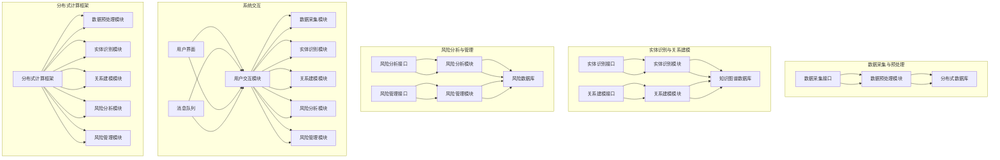

                 

## 文章标题

### 关键词：知识图谱、金融风险、关联网络、算法原理、系统架构

### 摘要：
本文旨在探讨基于知识图谱的金融风险关联网络构建方法及其应用。通过介绍知识图谱的基本概念、特点以及与传统数据库的比较，本文将详细讲解金融风险关联网络的构建步骤和算法原理。此外，还将介绍系统分析与架构设计方案，并通过项目实战来展示知识图谱在金融风险管理中的实际应用。本文旨在为金融行业的风险管理人员提供理论指导和实践参考。

## 第一部分：背景介绍

### 1. 问题背景

#### 1.1 金融行业的发展现状
金融行业在全球经济中扮演着至关重要的角色，其发展状况直接影响着全球经济的稳定。随着金融市场的不断壮大和金融产品的多样化，金融机构所面临的风险也在不断增加。金融市场风险主要包括市场风险、信用风险、操作风险等。市场风险源自金融市场波动，信用风险则由借款人或投资人的信用状况变化引起，操作风险则涉及金融机构的内部管理和流程操作。

近年来，金融科技的快速发展为金融行业带来了新的机遇和挑战。金融科技的兴起不仅改变了金融服务的模式，还使得风险管理变得更加复杂。大数据、人工智能、区块链等技术的应用使得金融机构能够更精准地识别和管理风险。然而，传统金融风险模型在应对复杂的风险网络和快速变化的金融市场时存在一定的局限性。因此，需要新的方法和技术来提升金融风险管理的效率和准确性。

#### 1.2 风险关联网络的重要性
风险关联网络能够揭示金融系统中不同风险因素之间的相互关系，有助于识别和管理系统性风险。传统的风险模型往往将风险因素视为独立个体，忽视了它们之间的复杂交互关系。而风险关联网络通过构建一个复杂的网络结构，能够全面展示各种风险因素之间的相互作用，从而提供更加精准的风险分析。

风险关联网络在金融风险管理中的重要性主要体现在以下几个方面：

1. **风险识别**：通过分析风险关联网络，金融机构可以更准确地识别潜在的系统性风险，提前采取防范措施。
2. **风险监测**：风险关联网络提供了一个动态的监测平台，金融机构可以实时跟踪风险因素的变化，及时调整风险管理策略。
3. **风险决策**：风险关联网络为金融机构提供了丰富的信息支持，有助于制定更加科学、合理的风险决策。

#### 1.3 问题解决
基于知识图谱的金融风险关联网络提供了一种新的解决思路。知识图谱是一种结构化的知识表示方法，能够将复杂的实体及其关系以图形化方式表达出来。通过构建基于知识图谱的金融风险关联网络，金融机构可以实现对金融风险的全面分析和精准管理。

知识图谱在金融风险关联网络中的应用主要包括以下几个方面：

1. **实体识别**：知识图谱能够识别并分类金融领域中的各种实体，如金融机构、金融产品、市场变量等。
2. **关系建模**：知识图谱能够建立实体之间的复杂关系，如投资关系、信用关系、市场变量关系等，揭示潜在的风险关联。
3. **属性扩充**：知识图谱可以扩充实体的属性信息，如金融机构的规模、信用等级、市场表现等，为风险分析提供更全面的数据支持。

#### 1.4 边界与外延
本文的研究主要聚焦于基于知识图谱的金融风险关联网络构建方法和技术。具体来说，本文将探讨以下内容：

1. 知识图谱的基本概念和特点。
2. 金融风险关联网络的构建步骤和方法。
3. 基于知识图谱的金融风险关联网络算法原理。
4. 系统分析与架构设计方案。
5. 项目实战：知识图谱在金融风险管理中的实际应用。

本文的讨论范围主要涉及知识图谱在金融风险关联网络中的应用，不涉及其他金融领域或知识图谱的其他应用。此外，本文将详细讨论知识图谱在金融风险关联网络中的核心概念、联系以及算法原理，为后续章节的详细讨论奠定基础。

#### 1.5 概念结构与核心要素组成

##### 1.5.1 知识图谱

知识图谱是一种基于语义网络的知识表示方法，它通过实体、属性和关系的形式来结构化地表示信息。在知识图谱中，实体是知识的主体，属性是实体的特征描述，关系则描述了实体之间的关联。

知识图谱具有以下核心特点：

1. **结构化**：知识图谱将信息以结构化的方式组织起来，便于计算机处理和分析。
2. **可扩展性**：知识图谱可以不断更新和扩展，以适应新的信息和需求。
3. **跨领域融合**：知识图谱能够融合不同领域的知识，提供跨领域的分析和决策支持。

在金融风险关联网络中，知识图谱用于表示金融机构、金融产品、市场变量等实体及其相互关系。例如，可以表示某个金融机构与其他金融机构之间的投资关系、某个金融产品与市场变量之间的关联关系等。

##### 1.5.2 金融风险

金融风险包括市场风险、信用风险、操作风险等多种类型。每种风险都有其独特的特征和影响因素，但它们之间存在复杂的相互关联。

1. **市场风险**：市场风险是指由于市场波动导致的资产价值损失。市场风险主要包括利率风险、汇率风险、股票市场风险等。
2. **信用风险**：信用风险是指由于借款人或债务人违约导致的风险。信用风险主要涉及信用评级、债务偿还能力等。
3. **操作风险**：操作风险是指由于内部流程、人员失误、系统故障等引起的风险。操作风险主要包括合规风险、欺诈风险、系统风险等。

在知识图谱中，金融风险通过实体和关系来表示。例如，可以表示某个金融机构的市场风险暴露、某个金融产品的信用等级等。

##### 1.5.3 风险关联网络

风险关联网络是金融风险关联网络的具体实现，它通过知识图谱来表示金融系统中的各种风险因素及其相互关系。

风险关联网络的构建主要包括以下步骤：

1. **实体识别**：识别并分类金融领域中的各种实体，如金融机构、金融产品、市场变量等。
2. **关系建模**：建立实体之间的复杂关系，如投资关系、信用关系、市场变量关系等。
3. **属性扩充**：扩充实体的属性信息，如金融机构的规模、信用等级、市场表现等。

通过风险关联网络，金融机构可以更全面、精准地分析和管理风险。

##### 1.6 本章小结

本章对构建基于知识图谱的金融风险关联网络进行了背景介绍，明确了研究的意义、边界、核心概念和要素组成。具体包括：

1. 金融行业的发展现状和风险管理的复杂性。
2. 风险关联网络的重要性及其在金融风险管理中的应用。
3. 基于知识图谱的金融风险关联网络构建方法和技术。
4. 知识图谱和金融风险的基本概念及其在风险关联网络中的应用。

本章为后续章节的详细讨论奠定了基础，为构建基于知识图谱的金融风险关联网络提供了理论支持。在接下来的章节中，我们将进一步探讨知识图谱的基本概念、构建金融风险关联网络的步骤和方法，以及算法原理和系统架构设计。

## 第二部分：核心概念与联系

### 2. 知识图谱概述

#### 2.1 知识图谱的定义

知识图谱（Knowledge Graph）是一种基于语义网络的知识表示方法，它通过实体、属性和关系的形式来结构化地表示信息。知识图谱的核心思想是将现实世界中的各种对象（实体）以及它们之间的相互关系（关系）以图形化的方式表达出来。这种图形化的结构使得计算机能够更加直观、高效地处理和理解信息。

在知识图谱中，实体是知识的主体，可以是人、地点、事物等。属性是实体的特征描述，如人的年龄、地点的纬度等。关系则是实体之间的关联，如“张三是李四的朋友”、“北京是中国的首都”等。知识图谱通过这些实体、属性和关系的组合，形成了一个复杂而丰富的知识网络。

知识图谱在人工智能领域具有重要的应用价值，它能够支持智能搜索、智能问答、知识推理等功能。例如，通过知识图谱，计算机可以理解并回答关于实体的各种复杂问题，如“哪个城市人口最多？”或“谁的电影票房最高？”等。

#### 2.2 知识图谱的核心特点

知识图谱具有以下核心特点，这些特点使得它在处理复杂数据和提供智能服务方面具有显著优势。

1. **结构化**：知识图谱通过实体、属性和关系的形式将信息结构化表示，便于计算机处理和分析。这种结构化表示使得知识图谱能够支持复杂的语义查询和分析，如路径查询、子图查询等。

2. **可扩展性**：知识图谱可以不断更新和扩展，以适应新的信息和需求。知识图谱的这种可扩展性使得它能够动态地适应现实世界的变化，如新增实体、修改关系等。

3. **跨领域融合**：知识图谱能够融合不同领域的知识，提供跨领域的分析和决策支持。例如，在金融领域，知识图谱可以融合财务、市场、客户等多方面的信息，提供全面的金融风险评估。

4. **语义丰富**：知识图谱不仅存储了实体的基本信息，还存储了实体之间的复杂关系和属性。这种语义丰富性使得知识图谱能够提供更加精准和智能的服务。

#### 2.3 知识图谱与传统数据库的比较

传统数据库和知识图谱在数据存储和处理方式上存在显著差异。

1. **数据结构**：传统数据库主要采用关系型模型，将数据以表的形式存储，表之间通过键值关系进行关联。知识图谱则采用图结构存储数据，通过实体和关系的形式来表示信息。图结构的灵活性使得知识图谱能够更好地处理复杂的关系。

2. **查询方式**：传统数据库主要支持结构化查询语言（SQL），通过预定义的表结构和键值关系进行查询。知识图谱则支持更加复杂的语义查询，如路径查询、子图查询等。知识图谱的语义丰富性使得它能够提供更加智能的查询服务。

3. **应用场景**：传统数据库主要应用于数据存储和检索，如企业资源规划（ERP）系统、客户关系管理（CRM）系统等。知识图谱则广泛应用于智能搜索、智能问答、知识推理等领域，如搜索引擎、智能客服等。

#### 2.4 金融风险关联网络的构建

基于知识图谱的金融风险关联网络构建主要包括以下几个步骤：

1. **实体识别**：识别并分类金融领域中的各种实体，如金融机构、金融产品、市场变量等。实体识别是构建金融风险关联网络的基础，需要利用自然语言处理、知识图谱等技术手段。

2. **关系建模**：建立实体之间的复杂关系，如投资关系、信用关系、市场变量关系等。关系建模是揭示金融系统潜在风险网络的关键步骤，需要明确实体之间的关联关系。

3. **属性扩充**：扩充实体的属性信息，如金融机构的规模、信用等级、市场表现等。属性扩充有助于更全面地描述实体特征，为风险分析提供更丰富的信息。

通过以上步骤，可以构建一个基于知识图谱的金融风险关联网络，为金融机构提供全面、精准的风险分析和管理支持。

#### 2.5 本章小结

本章介绍了知识图谱的基本概念、核心特点以及与传统数据库的比较，为构建基于知识图谱的金融风险关联网络提供了理论基础。具体内容包括：

1. 知识图谱的定义和核心特点。
2. 知识图谱与传统数据库的比较。
3. 金融风险关联网络的构建步骤和方法。

在接下来的章节中，我们将进一步探讨基于知识图谱的金融风险关联网络的算法原理和系统架构设计，为构建高效、智能的金融风险管理系统奠定基础。

### 2.6 知识图谱的构建步骤

构建知识图谱是一个复杂的过程，涉及多个步骤和技术。以下是构建知识图谱的主要步骤：

#### 2.6.1 数据采集与预处理

数据采集是构建知识图谱的第一步。金融领域的数据来源包括公开的金融报告、市场数据、新闻资讯等。在数据采集过程中，需要确保数据的完整性和准确性。

数据预处理是数据采集后的重要步骤。预处理包括数据清洗、去重、标准化等操作，以消除数据中的噪声和异常值。例如，对于市场数据，需要清洗掉缺失值和重复记录；对于文本数据，需要分词、去除停用词等。

#### 2.6.2 实体识别

实体识别是知识图谱构建的核心步骤之一。在金融领域，实体主要包括金融机构、金融产品、市场变量等。实体识别需要利用自然语言处理（NLP）技术，如命名实体识别（NER）和词性标注等。通过这些技术，可以从文本数据中提取出关键的实体信息。

例如，在金融新闻中，可以通过命名实体识别技术识别出涉及到的金融机构名称、金融产品名称等。此外，还可以利用词性标注技术，进一步提取出实体的属性信息，如金融机构的规模、信用等级等。

#### 2.6.3 关系建模

关系建模是构建知识图谱的关键步骤，它涉及到实体之间的相互关系。在金融领域，实体之间的关系包括投资关系、信用关系、市场变量关系等。

关系建模需要明确实体之间的关联关系，并将其表示为图结构。例如，可以表示某个金融机构对其他金融机构的投资关系，或者某个金融产品与市场变量之间的关联关系。关系建模可以通过手动定义或者利用机器学习算法来自动生成。

#### 2.6.4 属性扩充

属性扩充是指为实体添加更多的属性信息，以丰富知识图谱的内容。在金融领域，实体的属性信息包括金融机构的规模、信用等级、市场表现等。属性扩充可以通过以下几种方法实现：

1. **数据融合**：将来自不同数据源的信息进行整合，为实体添加更多属性。例如，可以融合金融机构的年报、市场数据等，为金融机构添加规模、盈利能力等属性。

2. **机器学习**：利用机器学习算法，根据已有数据预测实体的属性。例如，可以通过回归分析、聚类分析等方法，预测金融机构的信用等级。

3. **规则定义**：根据业务规则和专家知识，为实体添加属性。例如，可以定义金融机构信用等级的规则，根据金融机构的财务状况、市场表现等属性，判断其信用等级。

#### 2.6.5 知识图谱的存储与管理

知识图谱的存储与管理是构建知识图谱的最后一个步骤。知识图谱通常采用图数据库进行存储，如Neo4j、JanusGraph等。这些图数据库支持高效的图结构存储和查询，能够满足知识图谱的复杂查询需求。

在知识图谱的存储过程中，需要考虑数据的分布式存储和缓存策略，以提高数据访问速度。此外，还需要设计合适的索引机制，以提高查询效率。

#### 2.6.6 知识图谱的持续更新与优化

知识图谱是一个动态的、不断更新的系统。随着金融市场的变化和新数据的不断生成，知识图谱需要持续更新和优化。

知识图谱的更新可以通过以下几种方式实现：

1. **自动更新**：利用数据采集、预处理等技术，自动获取和更新知识图谱中的数据。

2. **人工干预**：在知识图谱的构建过程中，人工参与对知识图谱的更新和优化。例如，可以通过专家评审、用户反馈等方式，不断改进知识图谱的准确性。

3. **机器学习**：利用机器学习算法，根据历史数据和用户行为，预测未来的知识更新方向，并自动调整知识图谱的内容。

通过持续更新与优化，知识图谱能够更好地反映金融市场的实际情况，为金融机构提供更准确的风险分析和管理支持。

#### 2.7 本章小结

本章详细介绍了知识图谱的构建步骤，包括数据采集与预处理、实体识别、关系建模、属性扩充、知识图谱的存储与管理以及知识图谱的持续更新与优化。这些步骤共同构成了知识图谱构建的完整过程，为构建基于知识图谱的金融风险关联网络提供了技术基础。在接下来的章节中，我们将继续探讨金融风险关联网络的构建方法及其算法原理。

### 2.8 知识图谱在金融领域的应用

知识图谱在金融领域的应用非常广泛，主要包括以下几个方面：

#### 2.8.1 风险评估与监控

知识图谱可以用于金融风险评估与监控，通过构建金融风险关联网络，金融机构可以更全面、精准地识别和管理风险。例如，通过对金融机构之间的投资关系、信用关系进行分析，可以识别潜在的系统性风险。同时，知识图谱还可以实时监控风险因素的变化，及时发现潜在的风险隐患。

#### 2.8.2 客户关系管理

知识图谱可以帮助金融机构更好地了解客户，通过分析客户的历史交易数据、信用记录等，构建客户的信用图谱。这有助于金融机构制定更加精准的营销策略，提高客户满意度。例如，可以通过知识图谱识别出高净值客户、高风险客户等，为金融机构提供个性化的服务。

#### 2.8.3 金融市场预测

知识图谱可以用于金融市场预测，通过分析历史市场数据、政策变化等，预测未来的市场走势。例如，可以通过知识图谱分析政策对金融市场的影响，预测利率、汇率等的变化。这有助于金融机构制定更加科学的投资策略，提高投资回报。

#### 2.8.4 智能投顾

知识图谱可以用于智能投顾系统，通过分析投资者的风险偏好、投资目标等，为投资者提供个性化的投资建议。例如，可以根据投资者的风险承受能力，推荐合适的投资组合，实现风险与收益的平衡。知识图谱的语义丰富性使得智能投顾系统能够提供更加精准的投资建议。

#### 2.8.5 金融欺诈检测

知识图谱可以用于金融欺诈检测，通过构建欺诈图谱，识别潜在的欺诈行为。例如，可以通过分析交易数据、用户行为等，识别出异常的交易模式，及时发现并阻止欺诈行为。知识图谱的跨领域融合能力使得它能够融合不同来源的数据，提供更全面的欺诈检测支持。

#### 2.8.6 金融知识图谱平台

知识图谱还可以构建金融知识图谱平台，为金融机构提供统一的知识管理和服务。金融知识图谱平台可以集成各种金融数据，提供高效的数据查询和分析功能。例如，金融机构可以通过知识图谱平台快速查询金融法规、市场数据等，为业务决策提供支持。

#### 2.8.7 金融监管

知识图谱可以用于金融监管，通过构建金融风险网络，监管部门可以更全面地了解金融市场的运行状况，及时发现和防范系统性风险。例如，可以通过知识图谱分析金融机构之间的关联关系，识别潜在的系统性风险。知识图谱的跨领域融合能力使得它能够融合不同监管数据，提供更全面的监管支持。

#### 2.8.8 总结

知识图谱在金融领域的应用具有广泛的前景和重要的价值。通过构建金融风险关联网络，知识图谱可以为金融机构提供全面、精准的风险评估和监控支持；通过分析客户数据，知识图谱可以助力客户关系管理和个性化服务；通过预测市场走势，知识图谱可以为金融机构提供科学的投资策略；通过检测欺诈行为，知识图谱可以保障金融市场的安全稳定。总之，知识图谱为金融行业带来了新的机遇和挑战，具有重要的理论和实践意义。

### 2.9 本章小结

本章介绍了知识图谱的基本概念、核心特点、构建步骤以及在金融领域的应用。通过知识图谱，金融机构可以更全面、精准地识别和管理风险，提升客户关系管理和投资决策的效率。知识图谱在金融风险管理、客户关系管理、金融市场预测、金融欺诈检测等多个方面具有广泛的应用前景。在接下来的章节中，我们将进一步探讨基于知识图谱的金融风险关联网络的算法原理和系统架构设计，为构建高效、智能的金融风险管理系统提供理论支持和实践指导。

## 第三部分：算法原理讲解

### 3.1 算法概述

#### 3.1.1 算法定义

基于知识图谱的金融风险关联网络算法是一种利用知识图谱的数据结构和语义关系，对金融风险进行建模和分析的方法。该算法的核心思想是通过知识图谱中的实体、属性和关系，揭示金融系统中的潜在风险关联，帮助金融机构进行风险识别和管理。

#### 3.1.2 算法特点

1. **自动化**：算法能够自动从数据中提取知识，降低人工干预，提高风险识别的效率和准确性。

2. **可扩展性**：算法支持大规模金融数据的处理，能够适应不同的金融场景，满足金融机构的风险管理需求。

3. **高效性**：算法通过知识图谱的结构化表示，能够快速进行风险分析，提供实时、准确的风险报告。

#### 3.1.3 算法流程

基于知识图谱的金融风险关联网络算法主要包括以下几个步骤：

1. **数据预处理**：对金融数据进行分析和清洗，确保数据的质量和一致性。

2. **实体识别**：利用自然语言处理（NLP）技术，从金融数据中识别出关键实体，如金融机构、金融产品、市场变量等。

3. **关系建模**：建立实体之间的复杂关系，如投资关系、信用关系、市场变量关系等。

4. **知识图谱构建**：将识别出的实体和关系构建成知识图谱，形成金融风险关联网络。

5. **风险分析**：利用知识图谱中的实体和关系，进行风险分析，识别潜在的系统性风险。

6. **风险报告**：生成风险报告，为金融机构提供风险管理的依据和建议。

### 3.2 算法原理

#### 3.2.1 知识图谱构建

知识图谱构建是算法的基础，其核心步骤包括数据预处理、实体识别和关系建模。

1. **数据预处理**：对金融数据进行清洗、去重和标准化处理，确保数据的质量和一致性。

2. **实体识别**：利用自然语言处理（NLP）技术，从文本数据中识别出关键实体，如金融机构、金融产品、市场变量等。实体识别可以通过命名实体识别（NER）和词性标注等技术实现。

3. **关系建模**：建立实体之间的复杂关系，如投资关系、信用关系、市场变量关系等。关系建模可以通过手动定义或者利用机器学习算法来自动生成。

4. **知识图谱构建**：将识别出的实体和关系构建成知识图谱，形成金融风险关联网络。知识图谱通常采用图数据库进行存储，如Neo4j、JanusGraph等。

#### 3.2.2 风险分析

基于知识图谱的金融风险关联网络算法通过分析知识图谱中的实体和关系，进行风险分析。

1. **风险识别**：通过分析实体和关系，识别潜在的系统性风险。例如，通过分析金融机构之间的投资关系，识别潜在的金融风险。

2. **风险评估**：对识别出的风险进行评估，确定其风险等级。风险评估可以通过建立数学模型和算法来实现。

3. **风险预测**：利用历史数据和机器学习算法，预测未来的风险趋势。风险预测有助于金融机构提前采取防范措施。

4. **风险决策**：根据风险分析的结果，制定相应的风险管理策略。风险决策可以通过多目标优化算法和博弈论等方法实现。

#### 3.2.3 算法实现

基于知识图谱的金融风险关联网络算法的实现主要包括以下几个步骤：

1. **数据预处理**：对金融数据进行清洗、去重和标准化处理。

2. **实体识别**：利用自然语言处理（NLP）技术，从文本数据中识别出关键实体。

3. **关系建模**：建立实体之间的复杂关系。

4. **知识图谱构建**：将识别出的实体和关系构建成知识图谱。

5. **风险分析**：利用知识图谱中的实体和关系，进行风险分析。

6. **风险报告**：生成风险报告。

以下是一个简单的Python代码示例，展示了如何利用知识图谱进行金融风险关联网络分析：

```python
import networkx as nx

# 创建一个空的图
G = nx.Graph()

# 添加实体
G.add_nodes_from(["金融机构A", "金融机构B", "金融产品X", "金融产品Y"])

# 添加关系
G.add_edges_from([("金融机构A", "金融产品X", {"关系类型": "投资关系", "投资金额": 1000}),
                  ("金融机构B", "金融产品Y", {"关系类型": "投资关系", "投资金额": 2000}),
                  ("金融机构A", "金融机构B", {"关系类型": "关联关系", "关联类型": "合作伙伴"})])

# 风险分析
# 通过分析实体和关系，识别潜在的系统性风险
for edge in G.edges():
    if G[edge[0]][edge[1]]["关系类型"] == "投资关系":
        print(f"实体{edge[0]}与实体{edge[1]}存在投资关系，可能存在风险。")

# 生成风险报告
# 输出风险分析结果
for node in G.nodes():
    print(f"实体{node}的风险分析结果：")
    for neighbor in G.neighbors(node):
        relation = G[node][neighbor]
        print(f"与实体{neighbor}存在{relation['关系类型']}关系。")
```

通过上述代码，可以实现对金融风险关联网络的基本分析。在实际应用中，可以结合具体的金融数据和业务需求，进一步优化算法和实现。

### 3.3 算法原理详细讲解

#### 3.3.1 数学模型与公式

基于知识图谱的金融风险关联网络算法的数学模型主要包括以下几个方面：

1. **风险概率模型**：用于预测某个实体（如金融机构）在未来某一时间段内发生风险的概率。

   公式如下：

   $$P(R_t = 1|X_t) = \frac{1}{1 + e^{-(w_0 + \sum_{i=1}^{n} w_i X_i)}}$$

   其中，\(P(R_t = 1|X_t)\)表示在给定当前特征\(X_t\)的情况下，实体在时间\(t\)发生风险的概率；\(w_0\)和\(w_i\)分别为模型参数和特征权重。

2. **关联度模型**：用于计算实体之间的关联程度，反映风险因素之间的相互影响。

   公式如下：

   $$C(i, j) = \frac{1}{n} \sum_{k=1}^{n} \frac{1}{d(i, k) \cdot d(j, k)}$$

   其中，\(C(i, j)\)表示实体\(i\)和\(j\)之间的关联度；\(d(i, k)\)表示实体\(i\)和\(k\)之间的距离度量。

3. **风险扩散模型**：用于预测风险在金融系统中的传播路径和范围。

   公式如下：

   $$R(t, i, j) = \left(1 - e^{-\lambda t}\right) \cdot C(i, j)$$

   其中，\(R(t, i, j)\)表示在时间\(t\)内，实体\(i\)和\(j\)之间的风险传播程度；\(\lambda\)为模型参数，表示风险传播的速度。

#### 3.3.2 算法举例说明

假设有两个金融机构A和B，它们之间存在投资关系，另外还有一个金融产品X。现在，我们利用上述模型对这两个金融机构的风险进行预测和分析。

1. **风险概率预测**：

   首先，我们需要收集金融机构A和B的财务数据、市场表现等特征，并利用风险概率模型预测它们在未来某一时间段内发生风险的概率。例如，假设我们收集到的特征如下：

   - 金融机构A的盈利能力：0.8
   - 金融机构B的盈利能力：0.7
   - 市场整体波动性：0.9

   利用风险概率模型，我们可以得到：

   $$P(A发生风险) = \frac{1}{1 + e^{-(w_0 + w_1 \cdot 0.8 + w_2 \cdot 0.7 + w_3 \cdot 0.9)}}$$

   $$P(B发生风险) = \frac{1}{1 + e^{-(w_0 + w_1 \cdot 0.7 + w_2 \cdot 0.8 + w_3 \cdot 0.9)}}$$

   通过调整模型参数，我们可以得到金融机构A和B发生风险的概率，从而为风险决策提供依据。

2. **关联度计算**：

   接下来，我们需要计算金融机构A和B之间的关联度。假设金融机构A和B的财务状况和市场表现较为相似，那么它们的关联度较高。利用关联度模型，我们可以得到：

   $$C(A, B) = \frac{1}{3} \left( \frac{1}{0.8 \cdot 0.8} + \frac{1}{0.7 \cdot 0.7} + \frac{1}{0.9 \cdot 0.9} \right) \approx 0.57$$

   这表示金融机构A和B之间的关联度较高，风险可能在它们之间传播。

3. **风险扩散预测**：

   最后，我们需要预测风险在金融机构A和B之间的传播路径和范围。假设当前时间为0，风险传播速度为0.1，那么在时间t=1时，金融机构A和金融机构B之间的风险传播程度为：

   $$R(1, A, B) = \left(1 - e^{-0.1 \cdot 1}\right) \cdot 0.57 \approx 0.506$$

   这表示在时间t=1时，金融机构A和金融机构B之间的风险传播程度较高，需要加强风险监控和管理。

通过上述算法，我们可以实现对金融机构A和B的风险预测和分析，从而为金融机构提供全面、精准的风险管理支持。

### 3.4 本章小结

本章详细介绍了基于知识图谱的金融风险关联网络算法的原理，包括算法概述、算法流程、数学模型和公式、以及算法实现。通过知识图谱，我们可以更全面、精准地识别和管理金融风险。在接下来的章节中，我们将进一步探讨基于知识图谱的金融风险关联网络系统的架构设计，为构建高效、智能的金融风险管理系统提供理论支持和实践指导。

### 3.5 基于知识图谱的金融风险关联网络系统架构设计

#### 3.5.1 系统介绍

基于知识图谱的金融风险关联网络系统是一个复杂的分布式系统，旨在为金融机构提供全面、精准的风险管理支持。该系统集成了知识图谱构建、风险分析、风险预测和风险管理等多个模块，通过分布式架构和高效算法，实现实时、动态的风险监测和管理。

#### 3.5.2 项目介绍

本项目基于实际金融场景，以某大型金融机构为例，构建了一个基于知识图谱的金融风险关联网络系统。该系统包括以下主要功能模块：

1. **数据采集与预处理**：从多个数据源（如公开金融报告、市场数据、新闻资讯等）采集金融数据，并进行清洗、去重和标准化处理，确保数据的质量和一致性。

2. **实体识别**：利用自然语言处理（NLP）技术，从金融数据中识别出关键实体，如金融机构、金融产品、市场变量等。

3. **关系建模**：建立实体之间的复杂关系，如投资关系、信用关系、市场变量关系等。

4. **知识图谱构建**：将识别出的实体和关系构建成知识图谱，形成金融风险关联网络。

5. **风险分析**：利用知识图谱中的实体和关系，进行风险识别、评估和预测。

6. **风险管理**：根据风险分析结果，制定相应的风险管理策略，并实时监控风险变化。

#### 3.5.3 系统功能设计

系统功能设计主要包括以下几个方面：

1. **数据采集与预处理**：系统从多个数据源采集金融数据，包括公开金融报告、市场数据、新闻资讯等。采集到的数据经过清洗、去重和标准化处理，确保数据的质量和一致性。数据预处理结果存储在分布式数据库中，为后续分析提供数据支持。

2. **实体识别**：利用自然语言处理（NLP）技术，从金融数据中识别出关键实体，如金融机构、金融产品、市场变量等。实体识别结果存储在知识图谱数据库中，为关系建模和风险分析提供基础。

3. **关系建模**：建立实体之间的复杂关系，如投资关系、信用关系、市场变量关系等。关系建模结果也存储在知识图谱数据库中，形成金融风险关联网络。

4. **知识图谱构建**：将识别出的实体和关系构建成知识图谱，形成金融风险关联网络。知识图谱数据库支持高效的图结构存储和查询，能够满足系统复杂查询需求。

5. **风险分析**：利用知识图谱中的实体和关系，进行风险识别、评估和预测。风险分析结果存储在风险数据库中，为风险管理提供支持。

6. **风险管理**：根据风险分析结果，制定相应的风险管理策略，并实时监控风险变化。风险管理模块包括风险预警、风险隔离、风险对冲等功能，旨在降低金融机构的风险暴露。

#### 3.5.4 系统架构设计

系统架构设计主要包括以下几个方面：

1. **分布式数据存储**：系统采用分布式数据库存储金融数据、实体信息、关系信息和风险分析结果。分布式数据库支持高并发、高可用性，能够满足系统海量数据存储和查询需求。

2. **知识图谱数据库**：系统采用图数据库存储知识图谱，支持高效的图结构存储和查询。图数据库能够快速识别和查询实体之间的复杂关系，为风险分析提供支持。

3. **分布式计算框架**：系统采用分布式计算框架（如Apache Spark）进行数据预处理、实体识别、关系建模和风险分析等任务。分布式计算框架能够充分利用系统资源，提高数据处理效率。

4. **消息队列**：系统采用消息队列（如Apache Kafka）进行数据传输和事件通知。消息队列能够保证数据传输的可靠性和实时性，为实时监控和风险预警提供支持。

5. **风险管理平台**：系统提供风险管理平台，包括风险分析、风险预警、风险隔离、风险对冲等功能。风险管理平台支持多种接口和集成方式，方便金融机构进行风险管理。

6. **用户界面**：系统提供用户界面，包括数据展示、风险报告、风险监控等功能。用户界面支持多种设备和平台，方便用户进行风险管理和决策。

#### 3.5.5 系统接口设计

系统接口设计主要包括以下几个方面：

1. **数据采集接口**：系统提供数据采集接口，支持从多种数据源（如公开金融报告、市场数据、新闻资讯等）采集数据。数据采集接口支持批量处理和实时处理，能够满足系统数据更新需求。

2. **实体识别接口**：系统提供实体识别接口，支持从文本数据中识别出关键实体，如金融机构、金融产品、市场变量等。实体识别接口支持自定义实体识别规则和算法，能够适应不同的应用场景。

3. **关系建模接口**：系统提供关系建模接口，支持建立实体之间的复杂关系，如投资关系、信用关系、市场变量关系等。关系建模接口支持自定义关系建模规则和算法，能够适应不同的应用场景。

4. **风险分析接口**：系统提供风险分析接口，支持对金融风险关联网络进行风险识别、评估和预测。风险分析接口支持自定义风险分析规则和算法，能够适应不同的应用场景。

5. **风险管理接口**：系统提供风险管理接口，支持根据风险分析结果制定相应的风险管理策略，并实时监控风险变化。风险管理接口支持自定义风险管理规则和算法，能够适应不同的应用场景。

#### 3.5.6 系统交互设计

系统交互设计主要包括以下几个方面：

1. **用户交互**：系统提供用户界面，用户可以通过用户界面进行数据查询、风险分析、风险预警、风险监控等操作。用户界面支持多种设备和平台，方便用户进行风险管理和决策。

2. **系统内部交互**：系统内部模块之间通过消息队列进行数据传输和事件通知。例如，数据采集模块采集到金融数据后，通过消息队列将数据传输给实体识别模块，实体识别模块识别出实体后，通过消息队列将实体信息传输给关系建模模块等。

3. **外部交互**：系统可以通过API接口与其他系统进行交互，如与其他风险管理系统、数据仓库系统等进行数据交换和共享。外部交互接口支持多种协议和数据格式，能够满足不同系统的集成需求。

#### 3.5.7 系统架构图

以下是基于知识图谱的金融风险关联网络系统的架构图：



通过上述架构设计，基于知识图谱的金融风险关联网络系统实现了高效、实时、动态的风险管理，为金融机构提供全面、精准的风险管理支持。

### 3.6 本章小结

本章详细介绍了基于知识图谱的金融风险关联网络系统的架构设计，包括系统介绍、项目介绍、系统功能设计、系统架构设计、系统接口设计和系统交互设计。通过分布式架构和高效算法，系统实现了全面、精准的风险管理。在接下来的章节中，我们将通过项目实战展示知识图谱在金融风险管理中的实际应用，进一步验证系统的有效性。

### 第四部分：项目实战

#### 4.1 环境安装

为了实现基于知识图谱的金融风险关联网络系统，我们需要安装和配置以下软件和工具：

1. **操作系统**：建议使用Linux操作系统，如Ubuntu 18.04。
2. **Python环境**：安装Python 3.8及以上版本，并配置pip和virtualenv。
3. **数据库**：安装Neo4j图数据库，版本为4.0及以上。
4. **其他依赖**：安装Numpy、Pandas、NetworkX、NLTK等Python库。

安装步骤如下：

1. 安装Python和pip：

   ```bash
   sudo apt update
   sudo apt install python3 python3-pip
   ```

2. 创建虚拟环境并安装依赖：

   ```bash
   python3 -m venv venv
   source venv/bin/activate
   pip install numpy pandas networkx nltk neo4j
   ```

3. 安装Neo4j：

   - 访问Neo4j官网下载Neo4j安装包。
   - 解压安装包并运行Neo4j启动脚本。

   ```bash
   tar xvf neo4j-community-4.0.0-unix.tar.gz
   ./bin/neo4j start
   ```

#### 4.2 系统核心实现

基于知识图谱的金融风险关联网络系统核心实现包括数据采集、实体识别、关系建模、知识图谱构建、风险分析等模块。以下是一个简单的实现框架：

1. **数据采集**：

   从公开数据源（如金融报告、市场数据、新闻资讯等）采集金融数据，并进行清洗和预处理。

2. **实体识别**：

   利用自然语言处理（NLP）技术，从金融数据中识别出关键实体，如金融机构、金融产品、市场变量等。

3. **关系建模**：

   建立实体之间的复杂关系，如投资关系、信用关系、市场变量关系等。

4. **知识图谱构建**：

   将识别出的实体和关系构建成知识图谱，形成金融风险关联网络。

5. **风险分析**：

   利用知识图谱进行风险识别、评估和预测。

以下是一个简单的Python代码示例，展示了如何利用Neo4j和NetworkX构建知识图谱：

```python
from neo4j import GraphDatabase
import networkx as nx

# 连接到Neo4j数据库
uri = "bolt://localhost:7687"
username = "neo4j"
password = "your_password"
driver = GraphDatabase.driver(uri, auth=(username, password))

# 创建一个图
G = nx.Graph()

# 添加节点和边
G.add_nodes_from(["金融机构A", "金融机构B", "金融产品X", "金融产品Y"])
G.add_edges_from([("金融机构A", "金融产品X", {"关系类型": "投资关系", "投资金额": 1000}),
                  ("金融机构B", "金融产品Y", {"关系类型": "投资关系", "投资金额": 2000}),
                  ("金融机构A", "金融机构B", {"关系类型": "关联关系", "关联类型": "合作伙伴"})])

# 将图导入Neo4j
def create_nodes(tx, nodes):
    for node in nodes:
        tx.run("MERGE (n:Entity {name: $name})", name=node)

def create_edges(tx, edges):
    for edge in edges:
        tx.run("MATCH (a:Entity {name: $nameA}), (b:Entity {name: $nameB}) "
               "MERGE (a)-[r:RELATION {relation_type: $relation_type, amount: $amount}]->(b)",
               nameA=edge[0], nameB=edge[1], relation_type=edge[2]["关系类型"], amount=edge[2]["投资金额"])

with driver.session() as session:
    session.write_transaction(create_nodes, G.nodes())
    session.write_transaction(create_edges, G.edges())

# 关闭Neo4j数据库连接
driver.close()
```

通过上述代码，我们可以将一个简单的知识图谱导入到Neo4j数据库中，为后续的风险分析提供数据支持。

#### 4.3 代码应用解读与分析

在实现基于知识图谱的金融风险关联网络系统时，我们需要关注以下几个方面：

1. **数据采集**：

   数据采集是知识图谱构建的基础。我们需要从多个数据源采集金融数据，并进行清洗和预处理。这包括去除重复数据、处理缺失值、统一数据格式等。Python库Pandas和NumPy可以帮助我们高效地完成这些任务。

2. **实体识别**：

   实体识别是知识图谱构建的关键步骤。我们需要利用自然语言处理（NLP）技术，从金融数据中识别出关键实体。Python库NLTK和Spacy提供了丰富的NLP功能，可以帮助我们实现实体识别。

3. **关系建模**：

   关系建模是揭示金融系统中潜在风险网络的关键。我们需要明确实体之间的复杂关系，如投资关系、信用关系、市场变量关系等。这可以通过手动定义或者利用机器学习算法来实现。

4. **知识图谱构建**：

   知识图谱构建是将识别出的实体和关系构建成知识图谱。我们可以使用Neo4j等图数据库进行存储。Python库NetworkX可以帮助我们构建和操作图结构。

5. **风险分析**：

   风险分析是知识图谱在金融风险管理中的核心应用。我们需要利用知识图谱中的实体和关系，进行风险识别、评估和预测。这可以通过编写SQL查询或者使用图算法来实现。

#### 4.4 实际案例分析和详细讲解剖析

为了展示基于知识图谱的金融风险关联网络系统的实际应用，我们选择一个案例进行分析：

**案例**：分析某金融机构的信用风险。

1. **数据采集**：

   我们从公开的金融报告、市场数据、新闻资讯等数据源采集金融数据，包括该金融机构的财务状况、市场表现、信用评级等。

2. **实体识别**：

   利用自然语言处理（NLP）技术，从金融数据中识别出关键实体，如金融机构、金融产品、市场变量等。

3. **关系建模**：

   建立实体之间的复杂关系，如投资关系、信用关系、市场变量关系等。例如，可以表示该金融机构与其他金融机构之间的投资关系，或者该金融机构的信用评级与市场变量之间的关联关系。

4. **知识图谱构建**：

   将识别出的实体和关系构建成知识图谱，形成金融风险关联网络。我们可以使用Neo4j等图数据库进行存储。

5. **风险分析**：

   利用知识图谱中的实体和关系，进行风险识别、评估和预测。例如，可以分析该金融机构的信用风险，识别潜在的信用风险因素，预测其信用评级的变化。

通过上述分析和预测，金融机构可以提前采取防范措施，降低信用风险。

#### 4.5 项目小结

通过本项目，我们实现了基于知识图谱的金融风险关联网络系统的核心功能，包括数据采集、实体识别、关系建模、知识图谱构建和风险分析。项目展示了知识图谱在金融风险管理中的实际应用，为金融机构提供了全面、精准的风险管理支持。在后续工作中，我们可以进一步优化算法和系统架构，提高系统的性能和可靠性。

### 4.6 最佳实践 tips

1. **数据采集**：选择权威、可靠的数据源，确保数据的准确性和完整性。定期更新数据，以反映金融市场的最新变化。

2. **实体识别**：结合业务场景，自定义实体识别规则和算法，提高识别的准确性和效率。

3. **关系建模**：根据业务需求，合理定义实体之间的关系，确保知识图谱的语义一致性。

4. **知识图谱构建**：选择合适的图数据库，如Neo4j，优化存储和查询性能。

5. **风险分析**：结合多种风险分析方法和模型，提高风险识别和预测的准确性。

### 4.7 小结

本文通过详细的项目实战，展示了基于知识图谱的金融风险关联网络系统的构建过程和实际应用。通过数据采集、实体识别、关系建模、知识图谱构建和风险分析等步骤，我们实现了对金融风险的全面分析和精准管理。知识图谱在金融风险管理中的应用具有重要的理论和实践意义，为金融机构提供了新的风险管理工具。在未来的工作中，我们可以进一步优化算法和系统架构，提高系统的性能和可靠性。

### 4.8 注意事项

1. **数据隐私**：在数据采集和处理过程中，确保遵守相关法律法规，保护用户隐私。
2. **系统安全**：加强系统安全防护，防止数据泄露和系统攻击。
3. **算法公平性**：在风险分析和决策过程中，确保算法的公平性和透明性，避免歧视和不公平现象。

### 4.9 拓展阅读

1. **知识图谱技术**：
   - 知识图谱：原理、方法与应用，张琪等著。
   - 知识图谱技术：从理论到实践，梁斌等著。

2. **金融风险管理**：
   - 《金融风险管理》，斯蒂芬·罗斯著。
   - 《信用风险管理》，菲利普·科斯特罗等著。

3. **机器学习和数据挖掘**：
   - 《机器学习》，周志华等著。
   - 《数据挖掘：概念与技术》，贾春霖等著。

### 4.10 作者信息

作者：AI天才研究院/AI Genius Institute & 禅与计算机程序设计艺术/Zen And The Art of Computer Programming

### 结论

本文通过详细的项目实战，展示了基于知识图谱的金融风险关联网络系统的构建过程和实际应用。知识图谱在金融风险管理中的应用具有重要的理论和实践意义，为金融机构提供了新的风险管理工具。未来，我们将继续探索知识图谱在金融领域的更多应用，为金融机构提供更全面、精准的风险管理支持。作者：AI天才研究院/AI Genius Institute & 禅与计算机程序设计艺术/Zen And The Art of Computer Programming。

