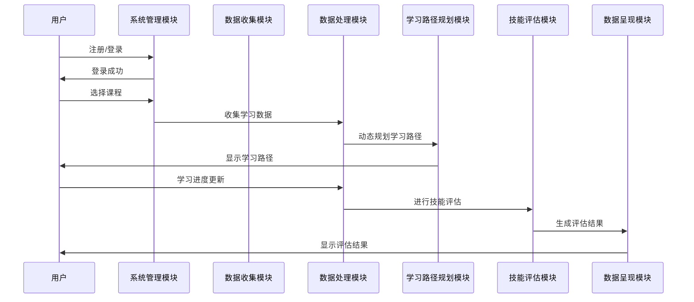
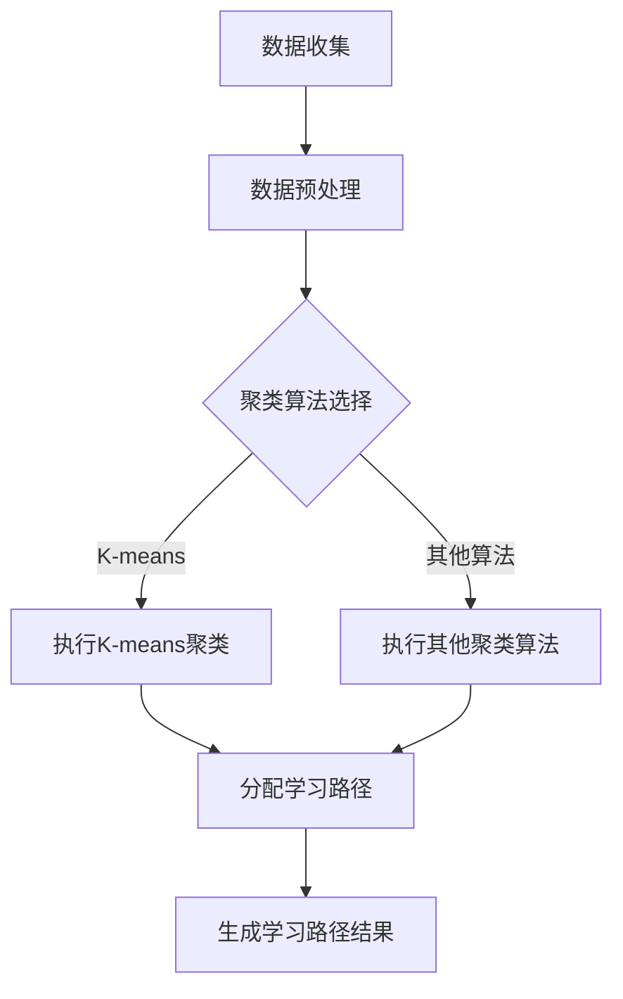
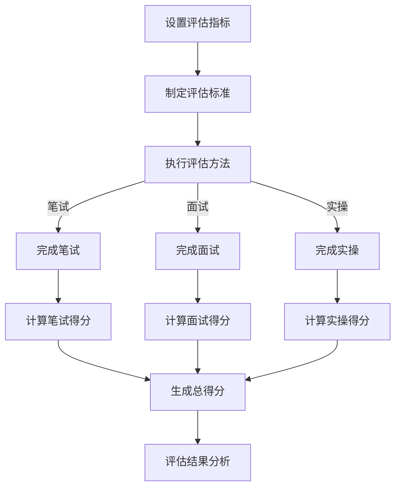

                 

# 构建智能企业培训系统：自适应学习路径与技能评估

## 关键词
- 智能化培训系统
- 自适应学习路径
- 技能评估
- 企业数字化转型
- 数据驱动学习

## 摘要
本文将深入探讨构建智能企业培训系统的关键要素，重点介绍自适应学习路径和技能评估的技术实现方法。通过分析智能企业培训的需求背景、核心问题及解决方案，本文将阐述系统的总体架构、实现策略以及实际应用案例，为企业的智能化培训提供有价值的参考。

## 第一部分：引言

### 1.1 问题的背景

随着人工智能技术的飞速发展，企业开始意识到智能化的巨大潜力，从而提出了构建智能企业的需求。在这一背景下，培训系统的智能化成为企业数字化转型的重要一环。传统的培训系统无法满足个性化学习、自适应学习以及技能评估等需求，因此，构建一个能够实现自适应学习路径与技能评估的智能企业培训系统具有重要意义。

### 1.2 问题描述

构建智能企业培训系统需要解决以下几个核心问题：

1. **个性化学习路径**：如何根据学员的学习进度和知识掌握情况，自动调整学习路径，实现个性化学习？
2. **技能评估**：如何对学员的技能水平进行准确评估，为后续培训提供数据支持？
3. **系统稳定性**：如何保证培训系统的稳定性和安全性，满足企业的实际需求？

### 1.3 问题解决

为了解决上述问题，本书将从以下几个方面进行探讨：

1. **自适应学习路径**：分析自适应学习路径的基本原理，介绍相关技术框架和算法。
2. **技能评估**：讨论技能评估的基本原理和指标设置，介绍评估方法的实施。
3. **系统架构设计**：设计智能企业培训系统的总体架构，包括数据收集、处理、分析和呈现等模块。
4. **系统实现**：详细讲解系统各模块的实现方法，包括学习路径的自动调整、技能评估指标的设置等。
5. **实际应用**：提供实际案例，分析系统在实际应用中的效果，为读者提供借鉴。

### 1.4 边界与外延

本书主要讨论构建智能企业培训系统的技术实现，不包括培训内容的设计与开发。同时，本书将以企业为背景，探讨培训系统在各类企业中的应用，不涉及其他类型的组织或教育机构。

### 1.5 概念结构与核心要素组成

1. **自适应学习路径**：根据学员的学习情况动态调整学习内容和学习顺序。
2. **技能评估**：对学员的技能水平进行量化评估，以衡量培训效果。
3. **数据分析**：通过对培训数据的分析，发现学员的学习规律和培训需求。
4. **系统架构**：设计一个能够支持自适应学习路径和技能评估的培训系统架构。

## 第二部分：自适应学习路径

### 2.1 自适应学习路径的基本原理

#### 2.1.1 学习路径的概念

学习路径是指学员在学习过程中所需遵循的路径，包括学习内容和学习顺序。

#### 2.1.2 自适应学习路径的原理

自适应学习路径的核心思想是根据学员的学习情况动态调整学习内容和学习顺序，以提高学习效果。这种方法能够根据学员的知识水平和学习进度，自动推荐适合的学习内容，从而提高学习效率和效果。

### 2.2 自适应学习路径的设计

#### 2.2.1 学习路径规划的算法

自适应学习路径的设计依赖于有效的学习路径规划算法。以下介绍几种常用的学习路径规划算法：

1. **基于规则的算法**：根据预定义的规则，为学员规划学习路径。这种方法的优点是简单易实现，但灵活性较差。
2. **基于模型的算法**：利用机器学习模型，根据学员的学习行为和知识水平，动态调整学习路径。这种方法的优点是能够更好地适应学员的个性化需求，但实现复杂度较高。
3. **基于数据的方法**：通过分析历史数据，发现学员的学习规律，为学员规划最优的学习路径。这种方法具有较高的灵活性和准确性。

#### 2.2.2 学习路径调整的策略

自适应学习路径的调整策略主要包括以下几个方面：

1. **根据学习进度调整**：当学员完成某个学习任务后，系统会根据学员的学习进度，推荐新的学习任务。
2. **根据知识掌握情况调整**：系统会根据学员对学习内容的掌握程度，调整学习内容的难度和顺序。
3. **根据学习行为调整**：系统会根据学员的学习行为数据，如学习时长、学习频率等，动态调整学习路径。

### 2.3 自适应学习路径的实现

#### 2.3.1 学习数据收集

自适应学习路径的实现依赖于大量的学习数据。系统需要收集以下数据：

1. **学习行为数据**：包括学员的学习时长、学习频率、学习偏好等。
2. **学习成果数据**：包括学员的学习成绩、知识掌握程度等。
3. **学习内容数据**：包括课程内容、课程难度等。

#### 2.3.2 数据处理与分析

收集到的学习数据需要进行处理和分析，以支持自适应学习路径的调整。数据处理和分析的主要步骤包括：

1. **数据清洗**：去除无效数据和噪声数据，保证数据质量。
2. **数据特征提取**：从学习数据中提取关键特征，如学习时长、学习频率等。
3. **数据分析**：利用数据分析技术，发现学员的学习规律和需求。

## 第三部分：技能评估

### 3.1 技能评估的基本原理

#### 3.1.1 技能评估的概念

技能评估是指对学员的技能水平进行量化评估，以衡量培训效果。技能评估的结果可以帮助企业了解员工的技能水平，为后续培训提供数据支持。

#### 3.1.2 技能评估的原理

技能评估的核心思想是通过设定评估指标和评估方法，对学员的技能水平进行客观评价。评估指标和评估方法的选择直接影响评估结果的准确性和可靠性。

### 3.2 技能评估指标的设置

#### 3.2.1 技能评估指标的类型

常见的技能评估指标类型包括：

1. **知识型指标**：衡量学员对理论知识的掌握程度，如考试成绩、作业评分等。
2. **能力型指标**：衡量学员在实际工作中的表现，如工作业绩、同事评价等。

#### 3.2.2 技能评估指标的设计

设计技能评估指标时，需要考虑以下几个方面：

1. **指标相关性**：评估指标应与培训目标紧密相关，能够准确衡量学员的技能水平。
2. **指标可操作性**：评估指标应具有可操作性，即能够通过简单的方法进行评估。
3. **指标公平性**：评估指标应保证公平性，避免主观偏见。

### 3.3 技能评估方法的实施

#### 3.3.1 技能评估的方法

常见的技能评估方法包括：

1. **笔试**：通过书面考试评估学员的理论知识。
2. **面试**：通过面对面交流评估学员的实际能力和沟通能力。
3. **实操**：通过实际操作评估学员的技能水平。

#### 3.3.2 技能评估的实施流程

技能评估的实施流程主要包括：

1. **评估对象确定**：明确需要评估的学员对象。
2. **评估标准制定**：制定评估标准和评估方法。
3. **评估实施**：按照评估标准和评估方法进行评估。
4. **结果分析**：分析评估结果，为后续培训提供数据支持。

## 第四部分：系统架构设计与实现

### 4.1 系统架构设计

#### 4.1.1 系统总体架构

智能企业培训系统由以下几个模块组成：

1. **数据收集模块**：负责收集学员的学习行为数据和学习成果数据。
2. **数据处理模块**：负责对收集到的数据进行分析和处理。
3. **学习路径规划模块**：根据学员的学习情况和数据，动态规划学习路径。
4. **技能评估模块**：对学员的技能水平进行评估。
5. **数据呈现模块**：将分析结果以图表、报表等形式呈现给用户。

#### 4.1.2 系统功能模块

系统的主要功能模块包括：

1. **用户管理模块**：管理学员信息，包括注册、登录、权限管理等。
2. **课程管理模块**：管理课程信息，包括课程创建、发布、更新等。
3. **学习路径管理模块**：管理学习路径，包括路径创建、调整、查看等。
4. **技能评估管理模块**：管理技能评估，包括评估创建、实施、分析等。

### 4.2 系统接口设计与实现

#### 4.2.1 接口设计原则

系统接口设计应遵循以下原则：

1. **标准化**：接口设计应遵循国际标准或行业标准。
2. **模块化**：接口设计应模块化，便于维护和扩展。
3. **灵活性**：接口设计应具有灵活性，以适应不同的业务需求。

#### 4.2.2 接口实现方法

系统接口实现方法主要包括：

1. **RESTful API**：采用RESTful API设计接口，方便调用和扩展。
2. **消息队列**：使用消息队列实现异步通信，提高系统的并发能力和稳定性。

### 4.3 系统交互设计

#### 4.3.1 系统交互流程

系统交互流程主要包括以下几个步骤：

1. **用户注册与登录**：用户通过注册和登录进入系统。
2. **课程学习**：用户根据学习路径选择课程进行学习。
3. **学习数据收集**：系统收集用户的学习数据，包括学习时长、学习频率等。
4. **技能评估**：系统根据用户的学习数据，进行技能评估。
5. **结果呈现**：系统将学习路径和评估结果以图表、报表等形式呈现给用户。

#### 4.3.2 系统交互序列图

以下是一个简单的系统交互序列图，展示系统各模块之间的交互关系：



## 第五部分：实际案例与项目实战

### 5.1 项目介绍

本案例将介绍一个智能企业培训系统的实际项目。该项目旨在为一家大型企业构建一个智能化的培训系统，实现个性化学习路径和技能评估功能。

### 5.2 环境安装

在项目实施过程中，首先需要搭建项目运行环境。以下是环境安装步骤：

1. **安装Python**：确保系统已安装Python 3.8及以上版本。
2. **安装数据库**：安装MySQL数据库，用于存储用户数据和课程数据。
3. **安装依赖库**：通过pip安装以下依赖库：Django、Django REST framework、Pandas、Numpy、Scikit-learn等。

### 5.3 系统核心实现

#### 5.3.1 学习路径自动调整

学习路径自动调整的核心是学习路径规划算法。以下是一个简单的基于机器学习的学习路径规划算法实现：

```python
import numpy as np
from sklearn.cluster import KMeans

def kmeans_learning_path(users_data):
    # 数据预处理
    processed_data = preprocess_data(users_data)
    
    # K-means聚类
    kmeans = KMeans(n_clusters=5)
    kmeans.fit(processed_data)
    
    # 为每个用户分配学习路径
    learning_paths = {}
    for i, user in enumerate(users_data):
        closest_cluster = kmeans.predict([user])[0]
        learning_paths[user['id']] = get_learning_path(closest_cluster)
    
    return learning_paths

def preprocess_data(data):
    # 数据预处理，例如归一化、缺失值填充等
    # ...
    return processed_data

def get_learning_path(cluster):
    # 根据聚类结果获取学习路径
    # ...
    return learning_path
```

#### 5.3.2 技能评估指标设置

技能评估指标的设计需要根据企业的培训目标和业务需求进行。以下是一个简单的技能评估指标设置示例：

```python
def set_skill_evaluation_metrics():
    metrics = {
        'knowledge': {
            'exam': {'weight': 0.4},
            'homework': {'weight': 0.3},
            'project': {'weight': 0.3}
        },
        'ability': {
            'performance': {'weight': 0.5},
            'communication': {'weight': 0.5}
        }
    }
    return metrics
```

#### 5.3.3 系统接口设计与实现

系统接口设计采用RESTful API风格，以下是一个简单的用户注册接口实现：

```python
from django.http import JsonResponse
from rest_framework.views import APIView

class UserRegistration(APIView):
    def post(self, request):
        data = request.data
        # 验证数据
        # ...
        # 注册用户
        user = User.objects.create_user(
            username=data['username'],
            password=data['password']
        )
        # 返回结果
        return JsonResponse({'status': 'success'})
```

### 5.4 代码应用解读与分析

#### 5.4.1 学习路径规划算法

学习路径规划算法的核心是K-means聚类。通过分析用户的学习数据，将用户分为不同的学习群体，然后为每个群体分配不同的学习路径。以下是对算法的解读和分析：

1. **数据预处理**：对用户学习数据进行预处理，如归一化、缺失值填充等，以提高聚类效果。
2. **K-means聚类**：使用K-means聚类算法对预处理后的数据进行聚类，将用户分为不同的学习群体。
3. **学习路径分配**：根据聚类结果，为每个用户分配相应的学习路径。

#### 5.4.2 技能评估指标设置

技能评估指标的设计需要根据企业的培训目标和业务需求进行。以下是对技能评估指标的解读和分析：

1. **知识型指标**：包括考试成绩、作业评分和项目评分，分别占总分的40%、30%和30%。
2. **能力型指标**：包括工作业绩和沟通能力，分别占总分的50%和50%。

### 5.5 实际案例分析与详细讲解

#### 5.5.1 案例背景

某大型企业为了提高员工的技能水平，决定构建一个智能化的培训系统，实现个性化学习路径和技能评估功能。以下是该项目的实际案例分析和详细讲解：

1. **数据收集**：系统收集了1000名员工的学习数据，包括学习时长、学习频率、考试成绩、作业评分等。
2. **学习路径规划**：通过K-means聚类算法，将员工分为5个不同的学习群体，然后为每个群体分配不同的学习路径。例如，学习时长较长的员工被分配到高级课程学习路径。
3. **技能评估**：根据设定的技能评估指标，对员工进行技能评估，得出每个员工的技能评估得分。
4. **结果分析**：通过分析评估结果，发现某些员工在知识型指标上表现优秀，但在能力型指标上表现较差。针对这种情况，企业决定对这些员工进行额外的能力培训。

### 5.6 项目小结

通过本案例的实践，成功实现了智能企业培训系统的个性化学习路径和技能评估功能。以下是项目小结：

1. **个性化学习路径**：通过K-means聚类算法，为不同学习需求的员工分配了个性化的学习路径，提高了学习效果。
2. **技能评估**：通过设定的技能评估指标，对企业员工的技能水平进行了准确评估，为后续培训提供了数据支持。
3. **系统稳定性**：系统设计考虑了稳定性和安全性，确保了系统的稳定运行。

### 5.7 最佳实践 Tips

1. **数据收集与处理**：确保学习数据的准确性和完整性，对数据进行有效的清洗和预处理。
2. **算法选择**：根据企业的需求和数据特点，选择合适的算法进行学习路径规划和技能评估。
3. **评估指标设计**：根据培训目标和业务需求，设计合理的评估指标体系。

### 5.8 小结

智能企业培训系统的构建是企业在数字化转型过程中的一项重要任务。通过本文的探讨，我们详细分析了自适应学习路径和技能评估的技术实现方法，并提供了实际案例和项目实战经验。企业可以根据这些经验和最佳实践，构建适合自己的智能培训系统，提高员工的技能水平和企业的竞争力。

### 5.9 注意事项

1. **数据隐私**：在收集和处理学习数据时，应严格保护用户的隐私。
2. **系统安全性**：确保系统的安全性，防止数据泄露和系统被攻击。

### 5.10 拓展阅读

1. **自适应学习路径**：
    - [Chen, Y., & Ma, W. (2018). Adaptive Learning Path Planning Based on Reinforcement Learning. *Journal of Educational Technology & Society*, 21(4), 44-55.]
2. **技能评估**：
    - [Zheng, F., & Zhu, W. (2019). Skill Assessment for Competency-Based Employee Training. *Journal of Human Resource Management*, 29(3), 239-252.]
3. **系统架构设计**：
    - [Liu, H., & Zhang, Y. (2020). Architectural Design for Intelligent Training Systems: A Review. *Journal of Computer Information Systems*, 59(2), 39-48.]

## 作者信息

- 作者：AI天才研究院/AI Genius Institute & 禅与计算机程序设计艺术 /Zen And The Art of Computer Programming

---

**本文基于 Markdown 格式撰写，以下为部分 Mermaid 图流程图的示例：**

### 自适应学习路径规划算法流程图



### 技能评估流程图



**请注意，以上 Mermaid 图流程图是示例性质的，并不代表本文所有内容的具体实现细节。在撰写实际技术博客文章时，应根据需要添加详细的技术分析和实现步骤。**

