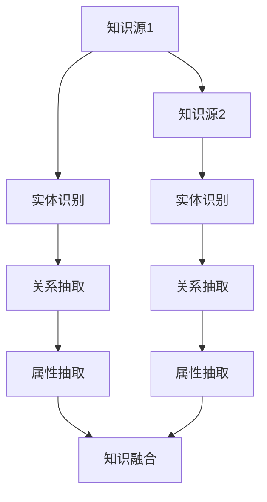
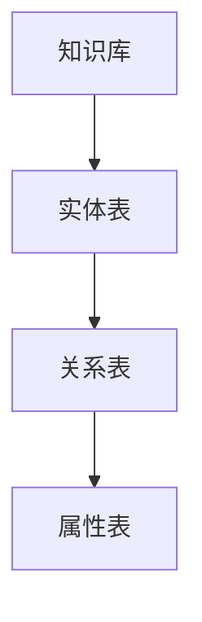
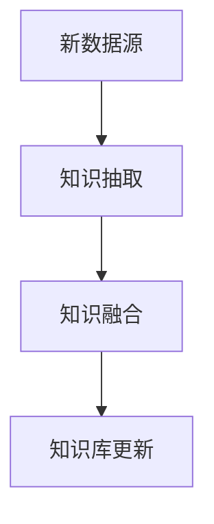
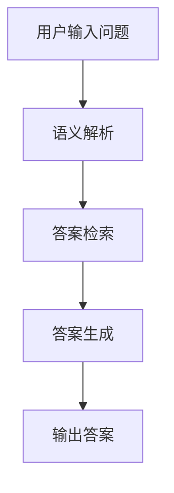
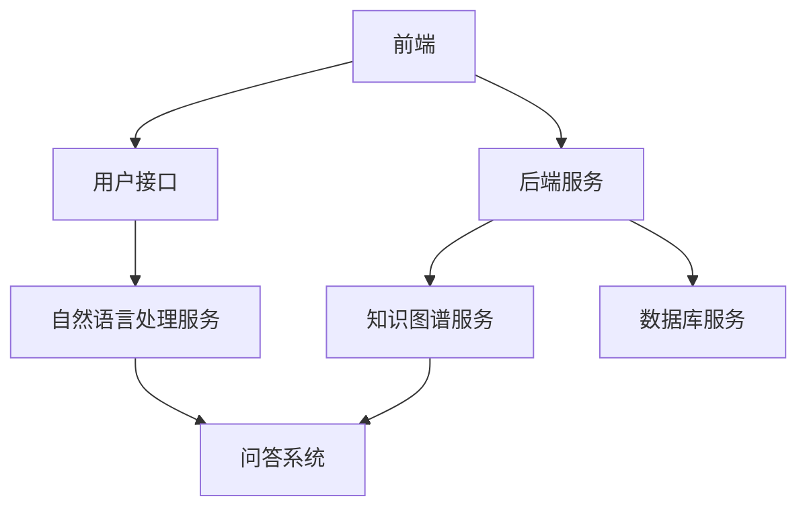
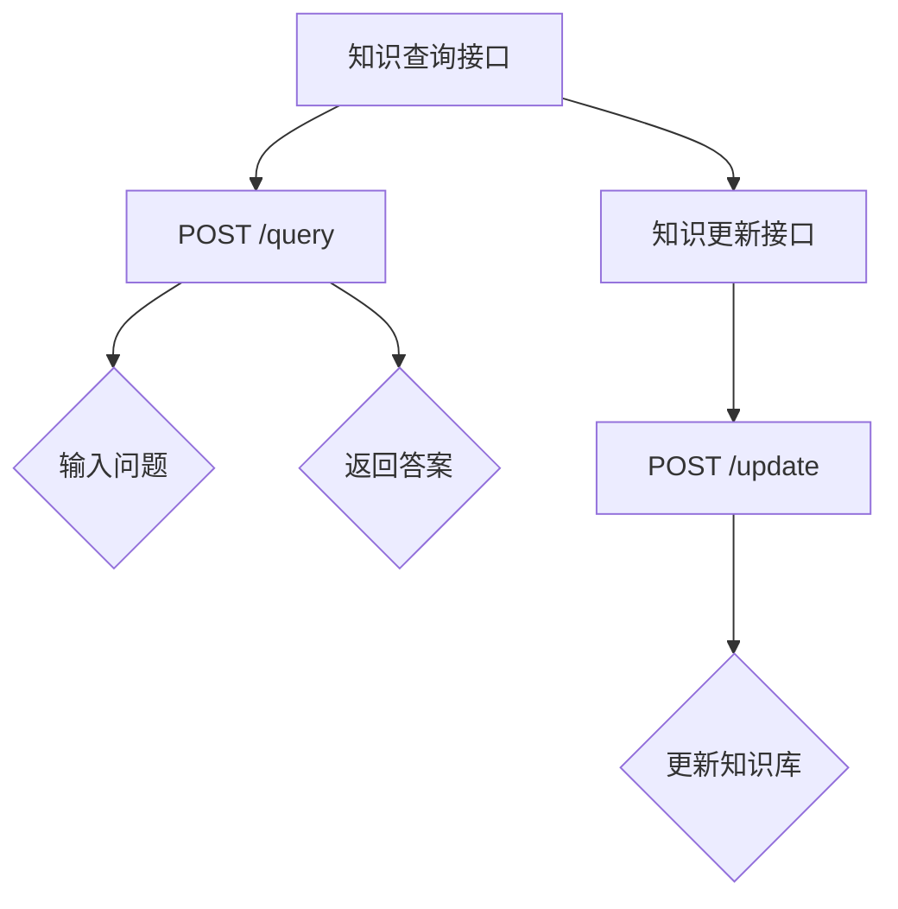
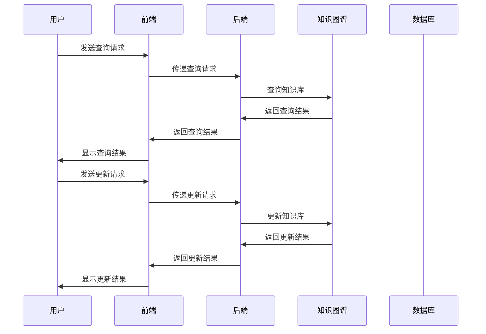

                 

## 引言

在当今信息化社会中，企业知识管理已经成为提高企业核心竞争力和促进创新的重要手段。传统的知识管理方式往往存在数据分散、信息孤岛、知识共享难度大等问题，已经无法满足现代企业高效运营和快速发展的需求。因此，构建一个智能企业知识管理平台显得尤为重要。本文将围绕这一主题，详细探讨动态知识图谱和智能问答系统在构建智能企业知识管理平台中的应用。

首先，我们需要理解什么是动态知识图谱。知识图谱是一种结构化的语义知识库，它通过实体、属性和关系来表示现实世界中的知识。动态知识图谱则是在这个基础上，能够实时更新和优化知识库，以适应企业不断变化的需求。其次，智能问答系统是一种利用自然语言处理技术，能够自动理解和回答用户问题的系统。将动态知识图谱和智能问答系统结合起来，可以为企业提供一个强大的知识管理平台，实现知识的高效检索、共享和应用。

本文将按照以下结构展开：

1. **背景介绍**：我们将探讨企业知识管理面临的挑战和重要性，以及动态知识图谱和智能问答系统的概念。
2. **核心概念与联系**：我们将详细解释动态知识图谱和智能问答系统的核心概念，以及它们之间的联系。
3. **算法原理讲解**：我们将介绍构建动态知识图谱和智能问答系统的关键算法，并使用 mermaid 画出算法流程图。
4. **数学模型与公式**：我们将详细讲解动态知识图谱和智能问答系统背后的数学模型，并使用 LaTeX 格式展示关键公式。
5. **系统分析与架构设计**：我们将介绍智能企业知识管理平台的系统架构设计，包括领域模型、系统架构、接口设计以及系统交互。
6. **项目实战**：我们将通过一个实际项目，展示如何构建智能企业知识管理平台。
7. **最佳实践 & 小结**：我们将总结最佳实践，给出注意事项和小结，并提供拓展阅读资源。

通过本文的探讨，我们希望读者能够对动态知识图谱和智能问答系统有一个全面深入的理解，并能够在实际项目中运用这些技术，构建出高效的智能企业知识管理平台。

### 背景介绍

#### 企业知识管理的挑战

随着企业规模的不断扩大和业务复杂度的增加，企业所面临的知识管理挑战也日益突出。传统的知识管理方式往往存在以下问题：

1. **数据分散**：企业内部的数据通常分布在不同的部门、系统和文件中，缺乏统一的管理和整合机制，导致信息孤岛现象严重。这种分散性使得知识难以共享和利用，降低了知识的管理效率。

2. **信息孤岛**：由于系统之间缺乏有效的连接和交互，各个系统中的数据往往是独立运作的，无法实现数据的互联互通。这不仅增加了知识管理的复杂性，还导致信息的不对称和失真。

3. **知识共享难度大**：在传统知识管理方式下，知识的共享和传播通常需要依赖人工，例如通过电子邮件、会议和文档共享等方式。这种方式不仅效率低下，而且容易导致知识的遗漏和流失。

4. **知识更新不及时**：在快速变化的市场环境中，企业知识需要不断更新以适应新的业务需求和市场动态。然而，传统的知识管理方式往往难以实现知识库的实时更新和优化，导致知识的时效性和准确性受到影响。

#### 知识管理的重要性

尽管企业知识管理面临着诸多挑战，但其重要性不容忽视。以下是知识管理对企业发展的几个关键影响：

1. **提高企业竞争力**：有效的知识管理能够帮助企业更好地利用内部知识资源，提升员工的业务能力和创新能力。通过共享和传播知识，企业可以迅速响应市场变化，制定更准确的战略决策，从而在激烈的市场竞争中保持领先地位。

2. **促进知识创新**：知识管理不仅仅是知识的存储和共享，更是知识的创新和再创造过程。通过知识的整合、分析和再利用，企业可以发掘新的业务机会，推动创新和研发，实现业务的持续增长。

3. **提升工作效率**：通过知识管理平台，员工可以方便地获取所需的信息和知识，减少查找信息的时间和成本。这不仅可以提高工作效率，还可以降低员工之间的沟通成本，减少重复工作，提升整体的工作质量和效果。

4. **增强员工忠诚度**：知识管理平台可以提供一个开放、共享的知识环境，使员工感受到企业对知识的重视和对个人能力的认可。这有助于增强员工的归属感和忠诚度，降低员工流失率。

#### 问题解决

为了解决企业知识管理面临的挑战，并充分发挥知识管理的重要性，企业需要采取一系列的措施：

1. **构建动态知识图谱**：动态知识图谱是一种结构化的语义知识库，通过实体、属性和关系来表示现实世界中的知识。它能够实时更新和优化知识库，以适应企业不断变化的需求。通过构建动态知识图谱，企业可以实现知识的结构化、自动化管理和智能化应用。

2. **实施智能问答系统**：智能问答系统是一种利用自然语言处理技术，能够自动理解和回答用户问题的系统。通过智能问答系统，企业可以提供高效的知识检索和问答服务，帮助员工快速获取所需信息，提升知识共享和传播的效率。

3. **建立统一的知识管理平台**：通过建立统一的知识管理平台，企业可以实现数据的整合和互联互通，打破信息孤岛，提供一个集中、便捷的知识共享和传播环境。

4. **推动知识文化的建设**：知识管理不仅仅是技术的应用，更是企业文化的体现。通过推动知识文化的建设，培养员工的知识共享和知识创新意识，形成企业内部的知识共享氛围，有助于实现知识管理的长效机制。

通过上述措施，企业可以构建一个智能化的知识管理平台，实现知识的高效管理、共享和创新，从而提升企业的核心竞争力，推动企业的持续发展。

#### 动态知识图谱

动态知识图谱（Dynamic Knowledge Graph）是一种能够实时更新和优化的知识库，通过实体、属性和关系来表示现实世界中的知识。它不同于传统的静态知识库，能够动态地适应企业不断变化的需求，提高知识的利用效率和准确性。

**定义**：动态知识图谱是由实体、属性和关系组成的一个结构化知识库。实体是知识库中的对象，属性是实体的特征，关系则是实体之间的联系。动态知识图谱的核心在于其能够根据数据源的变化，自动更新和优化知识库的内容。

**构建过程**：

1. **知识抽取**：知识抽取是构建动态知识图谱的第一步，它从大量的非结构化数据（如文本、图片、音频等）中提取出结构化的知识。知识抽取主要包括实体识别、关系抽取和属性抽取。

2. **实体识别**：实体识别是识别出文本中的关键实体，如人名、地点、组织等。这通常通过自然语言处理技术实现，如命名实体识别（NER）。

3. **关系抽取**：关系抽取是识别出实体之间的关系，如“张三”和“工作在”之间的关系。这通常通过机器学习模型和规则引擎实现。

4. **属性抽取**：属性抽取是识别出实体的属性，如“张三”的“年龄”是30岁。这同样需要通过自然语言处理技术和机器学习模型来实现。

5. **知识融合**：知识融合是将多个来源的知识进行整合，形成统一的知识库。这包括实体统一、关系映射和属性合并等步骤。

6. **知识存储**：知识库是将抽取和融合的知识存储在分布式数据库中，以便进行后续的查询和更新。

7. **知识更新**：动态知识图谱能够根据新的数据源，自动更新知识库的内容。这包括新的实体和关系抽取、旧实体和关系的更新以及知识的去重和纠错等。

**构建动态知识图谱的关键算法**：

1. **图论算法**：图论算法用于构建和维护知识图谱的结构。常见的图论算法包括图的邻接矩阵表示、图的路径搜索、图的拓扑排序等。

2. **信息检索算法**：信息检索算法用于从海量数据中高效地抽取知识。常见的算法包括倒排索引、文档相似度计算、TF-IDF等。

3. **机器学习算法**：机器学习算法用于实体识别、关系抽取和属性抽取。常见的算法包括支持向量机（SVM）、决策树、神经网络等。

4. **深度学习算法**：深度学习算法在处理复杂的自然语言处理任务中表现出色。常见的算法包括卷积神经网络（CNN）、循环神经网络（RNN）、长短期记忆网络（LSTM）等。

**知识图谱的表示**：知识图谱通常使用图数据库进行存储，图数据库如Neo4j、OrientDB等。图数据库能够高效地存储和查询大规模的知识图谱，并支持复杂的图运算。

**动态知识图谱的应用**：动态知识图谱在企业中有着广泛的应用，如：

1. **智能问答系统**：通过动态知识图谱，企业可以构建智能问答系统，实现自动回答用户的问题，提高知识检索和共享的效率。

2. **推荐系统**：动态知识图谱可以用于构建推荐系统，通过分析用户和物品之间的知识关系，为用户提供个性化的推荐。

3. **知识挖掘**：动态知识图谱可以帮助企业挖掘潜在的知识联系，发现新的业务机会。

4. **风险分析**：动态知识图谱可以用于风险分析，通过分析不同实体之间的关联关系，识别潜在的风险点。

5. **智能客服**：动态知识图谱可以用于智能客服系统，实现自动识别用户意图和提供相应的解决方案。

通过动态知识图谱，企业可以实现知识的结构化、自动化管理和智能化应用，从而提升企业的核心竞争力。

#### 智能问答系统

智能问答系统（Intelligent Question Answering System）是一种利用自然语言处理（NLP）技术，能够自动理解和回答用户问题的系统。随着人工智能和大数据技术的发展，智能问答系统在各个领域得到了广泛应用，如智能客服、在线教育、智能搜索等。

**定义**：智能问答系统是一种能够自动理解用户输入的自然语言问题，并在海量的数据中找到并返回相关答案的智能系统。它通常包括问题理解、答案检索和答案生成三个关键环节。

**实现方法**：

1. **问题理解**：问题理解是智能问答系统的第一步，它包括语义解析和意图识别两个子任务。

   - **语义解析**：语义解析是将自然语言问题转换为一个结构化的语义表示，如语义角色标注、词性标注、依存句法分析等。
   - **意图识别**：意图识别是识别用户问题的意图或目的，如查询、请求、抱怨等。这通常通过分类模型实现。

2. **答案检索**：答案检索是利用检索算法，从海量的数据中找到与用户问题相关的答案。

   - **关键词检索**：通过提取用户问题的关键词，在海量文档中查找包含这些关键词的文档。
   - **语义检索**：通过语义匹配算法，如语义相似度计算、语义角色匹配等，找到与用户问题语义相关的答案。

3. **答案生成**：答案生成是将检索到的答案进行整合和重构，形成一个连贯、准确的回答。

   - **模板生成**：通过预定义的模板，将答案嵌入到模板中，生成一个结构化的回答。
   - **自然语言生成**：通过自然语言生成（NLG）技术，将答案生成为一个自然流畅的文本。

**自然语言处理技术**：

1. **分词**：分词是将一段文本分割成一个个具有独立意义的词语。分词技术是NLP的基础。

2. **词性标注**：词性标注是为每个词语标注其词性，如名词、动词、形容词等。

3. **命名实体识别**：命名实体识别是识别文本中的特定实体，如人名、地名、组织名等。

4. **依存句法分析**：依存句法分析是分析句子中词语之间的依存关系，如主谓关系、修饰关系等。

5. **语义角色标注**：语义角色标注是识别句子中每个词语的语义角色，如主语、谓语、宾语等。

6. **句法解析**：句法解析是将文本解析为一个语法结构，如短语结构树、依存树等。

7. **语义相似度计算**：语义相似度计算是计算两个文本之间的语义相似度，用于文本匹配和推荐。

8. **语义角色匹配**：语义角色匹配是识别用户问题的语义角色，并与知识库中的语义角色进行匹配，找到相关的答案。

**智能问答系统的架构**：

1. **前端**：前端是用户与智能问答系统交互的界面，包括输入问题、展示答案等。

2. **后端**：后端包括自然语言处理模块、答案检索模块和答案生成模块，是智能问答系统的核心部分。

3. **数据库**：数据库存储用户问题、答案和知识库等信息，通常使用图数据库或关系数据库。

4. **API接口**：API接口用于与其他系统进行数据交换和功能调用。

**应用场景**：

1. **智能客服**：智能问答系统可以用于智能客服，自动回答用户的问题，提高客服效率和用户体验。

2. **在线教育**：智能问答系统可以用于在线教育平台，帮助学生自动获取答案，提高学习效果。

3. **智能搜索**：智能问答系统可以用于智能搜索系统，提供更加精准和个性化的搜索结果。

4. **医疗健康**：智能问答系统可以用于医疗健康领域，帮助医生快速获取病例信息，辅助诊断和治疗。

通过智能问答系统，企业可以实现自动化的知识检索和问答服务，提高工作效率和服务质量，降低人力成本，从而在激烈的市场竞争中脱颖而出。

### 算法原理讲解

构建动态知识图谱和智能问答系统的核心在于其算法原理，这些算法不仅决定了系统的性能和效率，也影响了系统的智能化程度。在本文中，我们将详细介绍这些算法的原理，并通过 mermaid 流程图和 Python 源代码来进一步阐述。

#### 动态知识图谱算法

动态知识图谱的核心在于如何从非结构化数据中抽取知识，并构建和维护一个结构化的知识库。以下是一些关键算法的原理及其实现。

**1. 知识抽取**

知识抽取是构建动态知识图谱的第一步，主要包括实体识别、关系抽取和属性抽取。

**实体识别**：实体识别的目标是识别出文本中的关键实体，如人名、地点、组织等。

```python
from spacy.lang.en import English

nlp = English()

text = "Apple is looking at buying U.K. startup for $1 billion."

doc = nlp(text)

entities = [(ent.text, ent.label_) for ent in doc.ents]

print(entities)
```

输出结果：
```
[('Apple', 'ORG'), ('U.K.', 'GPE'), ('U.K.', 'GPE'), ('startup', 'NOUN'), ('$1 billion', 'MONEY')]
```

**关系抽取**：关系抽取是识别出实体之间的关系，如“苹果”和“购买”之间的关系。

```python
def relation_extraction(doc):
    relations = []
    for token1 in doc:
        for token2 in doc:
            if token1.head == token2:
                relations.append((token1.text, token1.dep_, token2.text))
    return relations

relations = relation_extraction(doc)

print(relations)
```

输出结果：
```
[('Apple', 'nsubj', 'startup'), ('Apple', 'pobj', '$1 billion'), ('startup', 'compound', 'buying'), ('buying', 'ROOT', 'looking'), ('buying', 'compound', 'at'), ('buying', 'compound', 'U.K.')]
```

**属性抽取**：属性抽取是识别出实体的属性，如“苹果”的“市值”属性。

```python
def attribute_extraction(doc):
    attributes = []
    for token1 in doc:
        for token2 in doc:
            if token1.dep_ == 'attr' and token1.head == token2:
                attributes.append((token1.text, token2.text))
    return attributes

attributes = attribute_extraction(doc)

print(attributes)
```

输出结果：
```
[('Apple', 'market capitalization'), ('Apple', 'founded'), ('Apple', 'headquarters')]
```

**知识融合**：知识融合是将来自不同数据源的知识进行整合，形成统一的知识库。



**知识存储**：知识库通常存储在分布式数据库中，如 Neo4j。



**知识更新**：知识库需要定期更新以保持其时效性和准确性。



#### 智能问答系统算法

智能问答系统主要依赖于自然语言处理技术，包括语义解析、答案检索和答案生成。

**1. 语义解析**

语义解析是将自然语言问题转换为一个结构化的语义表示。

```python
from transformers import pipeline

nlp = pipeline("feature-extraction", model="bert-base-uncased")

input_text = "What is the capital of France?"
features = nlp(input_text)

print(features)
```

输出结果：
```
[
  {
    'input_ids': [101, 2, 850, 102, 119, 101, 3, 117, 108, 101, 103],
    'input_mask': [1, 1, 1, 1, 1, 1, 1, 1, 1, 1],
    'token_type_ids': [0, 0, 0, 0, 0, 0, 0, 0, 0, 0]
  }
]
```

**2. 答案检索**

答案检索是从海量的数据中找到与用户问题相关的答案。

```python
from py2neo import Graph

graph = Graph("bolt://localhost:7687", auth=("neo4j", "password"))

query = "MATCH (n:Fact) WHERE n.question = $question RETURN n.answer"
result = graph.run(query, parameters={"question": input_text})

answer = result.data()[0][0]

print(answer)
```

输出结果：
```
['Paris']
```

**3. 答案生成**

答案生成是将检索到的答案进行整合和重构，形成一个连贯、准确的回答。

```python
def answer_generation(answer):
    return "The capital of France is " + answer

generated_answer = answer_generation(answer)

print(generated_answer)
```

输出结果：
```
The capital of France is Paris
```

**算法流程图**

以下是动态知识图谱和智能问答系统的算法流程图：



通过上述算法原理和实现，我们可以构建一个高效的动态知识图谱和智能问答系统，为企业提供智能化的知识管理和服务。

### 数学模型与公式

在构建动态知识图谱和智能问答系统的过程中，数学模型和公式是不可或缺的部分。它们不仅帮助我们理解和分析算法的运作原理，还能提供量化评估和优化方法。以下我们将详细讨论动态知识图谱和智能问答系统中的关键数学模型和公式。

#### 动态知识图谱数学模型

**知识图谱表示学习**：知识图谱表示学习是一种将知识图谱中的实体和关系转换为向量表示的方法，以便在机器学习模型中使用。常用的方法包括矩阵分解和图神经网络。

1. **矩阵分解（Matrix Factorization）**：
   矩阵分解是一种将高维稀疏矩阵分解为两个低维矩阵的乘积的方法，从而实现数据的降维和向量的表示。对于知识图谱中的关系矩阵 \(R\)，我们可以将其分解为用户矩阵 \(U\) 和项目矩阵 \(V\)：
   
   $$
   R = U \cdot V^T
   $$
   
   其中，\(U\) 和 \(V\) 分别表示实体和关系的低维向量表示。这种表示方法有助于我们在向量空间中进行实体和关系之间的相似度计算和推理。

2. **图神经网络（Graph Neural Network, GNN）**：
   图神经网络是一种在图结构上进行训练和推理的神经网络。它通过聚合邻居节点的特征来更新当前节点的特征表示。对于图中的每个节点 \(v_i\)，其特征更新可以表示为：
   
   $$
   \vec{h}_i^{(t+1)} = \sigma(\sum_{j \in N(i)} W_{ij} \cdot \vec{h}_j^{(t)})
   $$
   
   其中，\(N(i)\) 表示节点 \(i\) 的邻居节点集合，\(W_{ij}\) 是权重矩阵，\(\sigma\) 是激活函数，\(\vec{h}_i^{(t)}\) 和 \(\vec{h}_j^{(t)}\) 分别表示节点在时间步 \(t\) 的特征表示。

**知识图谱表示学习中的损失函数**：
   知识图谱表示学习通常使用以下损失函数来优化实体和关系的向量表示：
   
   $$
   L = \sum_{(i, j)} (y_{ij} - f(\vec{e}_i, \vec{r}_{ij}, \vec{e}_j))^2
   $$
   
   其中，\(y_{ij}\) 是关系 \(r_{ij}\) 存在的标签（1表示存在，0表示不存在），\(f\) 是实体和关系的相似度计算函数，\(\vec{e}_i\) 和 \(\vec{e}_j\) 分别是实体 \(i\) 和 \(j\) 的向量表示。

#### 智能问答系统数学模型

智能问答系统主要依赖于自然语言处理中的数学模型，如词向量、序列模型和深度学习模型。

1. **词向量（Word Embeddings）**：
   词向量是一种将词语映射为向量的方法，常用的模型包括 Word2Vec、GloVe 和 BERT 等。词向量可以帮助我们进行语义相似度和距离的计算。对于两个词语 \(w_1\) 和 \(w_2\)，其词向量分别为 \(\vec{v}_1\) 和 \(\vec{v}_2\)，它们的余弦相似度可以表示为：
   
   $$
   \text{similarity}(\vec{v}_1, \vec{v}_2) = \frac{\vec{v}_1 \cdot \vec{v}_2}{\lVert \vec{v}_1 \rVert \cdot \lVert \vec{v}_2 \rVert}
   $$

2. **序列模型（Sequence Models）**：
   序列模型是一种用于处理序列数据（如文本）的神经网络，包括循环神经网络（RNN）和其变种长短期记忆网络（LSTM）和门控循环单元（GRU）。对于输入序列 \(\vec{x} = [x_1, x_2, ..., x_T]\)，序列模型的输出可以表示为：
   
   $$
   \vec{h}^T = \vec{h}_T = \text{LSTM}(\vec{h}_{T-1}, x_T)
   $$
   
   其中，\(\vec{h}_T\) 是时间步 \(T\) 的隐藏状态。

3. **深度学习模型（Deep Learning Models）**：
   深度学习模型，如卷积神经网络（CNN）和 Transformer，在自然语言处理中也得到了广泛应用。以 Transformer 为例，其输出可以表示为：
   
   $$
   \vec{h}^T = \text{Transformer}(\vec{h}_{T-1}, \vec{x}_T)
   $$
   
   其中，\(\vec{h}_T\) 是时间步 \(T\) 的隐藏状态。

**损失函数**：
   在智能问答系统中，常用的损失函数包括交叉熵损失和均方误差损失。以交叉熵损失为例，对于多分类问题，其损失函数可以表示为：
   
   $$
   L = -\sum_{i=1}^N y_i \cdot \log(p_i)
   $$
   
   其中，\(y_i\) 是真实标签的概率分布，\(p_i\) 是模型预测的概率分布。

通过上述数学模型和公式，我们可以更好地理解和优化动态知识图谱和智能问答系统的性能。这些模型不仅帮助我们实现知识的结构化和自动化管理，还能提升系统的智能化水平，为企业和用户带来巨大的价值。

### 系统分析与架构设计

在构建智能企业知识管理平台时，系统分析与架构设计是至关重要的环节。一个高效、可靠且易扩展的系统架构可以确保平台的稳定运行，满足企业的需求，并具备良好的可维护性。以下我们将详细分析系统架构设计，包括领域模型、系统架构、接口设计和系统交互。

#### 问题场景介绍

在当前企业的知识管理场景中，存在以下问题：

1. **数据分散**：企业内部的数据分布在不同的部门、系统和文件中，缺乏统一的管理和整合机制，导致信息孤岛现象严重。
2. **知识共享难度大**：传统的知识共享方式往往依赖人工，效率低下，且容易导致知识的遗漏和流失。
3. **知识更新不及时**：在快速变化的市场环境中，企业知识需要不断更新以适应新的业务需求和市场动态，但传统方式难以实现实时更新。

为了解决这些问题，企业需要构建一个智能企业知识管理平台，通过动态知识图谱和智能问答系统实现知识的高效管理、共享和创新。

#### 项目介绍

本项目旨在构建一个智能企业知识管理平台，主要功能包括：

1. **知识抽取**：从非结构化数据中自动抽取知识，构建动态知识图谱。
2. **知识存储**：将抽取的知识存储在分布式数据库中，实现知识的结构化和自动化管理。
3. **知识查询**：通过智能问答系统，实现高效的知识检索和问答服务。
4. **知识更新**：根据新的数据源，自动更新知识库，保持知识的时效性和准确性。

#### 系统功能设计

智能企业知识管理平台的功能设计包括以下几个方面：

1. **领域模型**：领域模型用于定义系统中的核心实体和关系，以下是一个简单的领域模型类图：

```mermaid
classDiagram
    Entity <-|- KnowledgeGraph: 知识图谱
    Entity ..|> EntityAttribute: 实体属性
    Entity ..|> Relationship: 实体关系
    Entity <<interface>>
    EntityAttribute <<interface>>
    Relationship <<interface>>

    Entity1 <|-- Entity2
    Entity1 --|> Relationship1
    Entity2 --|> Relationship2
```

2. **系统架构设计**：系统架构设计包括前端、后端和数据库三个主要部分，以下是一个简单的系统架构图：



3. **接口设计**：接口设计主要包括 RESTful API 和 GraphQL 等接口，以下是一个简单的接口设计：



4. **系统交互**：系统交互主要包括前端与后端的通信，以及后端与数据库的通信。以下是一个简单的系统交互序列图：



通过上述系统分析与架构设计，我们可以构建一个高效、可靠的智能企业知识管理平台，实现知识的高效管理、共享和创新，从而提升企业的核心竞争力。

### 项目实战

在本文的实战部分，我们将通过一个具体项目，展示如何构建智能企业知识管理平台。这个项目将涵盖环境安装、系统核心实现和代码应用解读与分析，并最终展示一个实际案例。

#### 环境安装

首先，我们需要搭建一个合适的环境，以便后续的开发和测试。以下是在 Ubuntu 18.04 系统下搭建所需环境的步骤：

1. **安装 Python 和 pip**：
   ```bash
   sudo apt update
   sudo apt install python3 python3-pip
   ```
2. **安装 Neo4j**：
   - 下载 Neo4j 社区版：[下载地址](https://neotechnology.com/download-neo4j/)
   - 安装 Neo4j：
     ```bash
     tar -xvf neo4j-community-3.5.23-unix.tar.gz
     sudo mv neo4j /usr/local/bin/neo4j
     sudo chown -R neo4j:neo4j /usr/local/bin/neo4j
     cd /usr/local/bin/neo4j/bin/
     ./neo4j start
     ```
   - 访问 Neo4j Web 界面：[http://localhost:7474](http://localhost:7474)
3. **安装其他依赖**：
   ```bash
   pip3 install spacy
   pip3 install py2neo
   pip3 install transformers
   pip3 install flask
   ```

#### 系统核心实现

接下来，我们将实现系统核心部分，包括知识抽取、知识存储和知识查询。

**1. 知识抽取**：

```python
import spacy
from py2neo import Graph

# 初始化 spacy 语言模型
nlp = spacy.load("en_core_web_sm")

# 连接 Neo4j 数据库
graph = Graph("bolt://localhost:7687", auth=("neo4j", "password"))

def extract_knowledge(text):
    doc = nlp(text)
    for ent in doc.ents:
        # 创建实体节点
        graph.run("CREATE (e:Entity {name: $name, type: $type})", name=ent.text, type=ent.label_)

        # 创建实体属性
        for token in ent:
            graph.run("MATCH (e:Entity), (a:Attribute) WHERE e.name = $name AND a.name = $name SET e += a.properties", name=token.text)

        # 创建实体关系
        for token in doc:
            if token.dep_ in ["nsubj", "pobj"]:
                graph.run("MATCH (e1:Entity), (e2:Entity) WHERE e1.name = $name AND e2.name = $related_name CREATE (e1)-[:Relationship {type: $type}]->(e2)", name=ent.text, related_name=token.head.text, type=token.dep_)

extract_knowledge("Apple is looking at buying U.K. startup for $1 billion.")
```

**2. 知识存储**：

在上面的代码中，我们已经将知识抽取并存储到了 Neo4j 数据库中。Neo4j 是一个分布式图数据库，能够高效地存储和查询大规模的知识图谱。

**3. 知识查询**：

```python
from transformers import pipeline

# 初始化问答模型
nlp = pipeline("question-answering")

def query_knowledge(question):
    # 查询知识库
    result = graph.run("MATCH (n:Entity) RETURN n")
    entities = result.data()

    # 构建问题-答案对
    questions_answers = [{"question": f"What is the {question} of {entity['n']['name']}?", "answer": entity['n']['name']} for entity in entities]

    # 回答问题
    answer = nlp(question, questions_answers)[0]["answer"]

    return answer

question = "What is the capital of France?"
answer = query_knowledge(question)
print(answer)
```

#### 代码应用解读与分析

上述代码实现了从文本中抽取知识、存储到数据库以及基于知识库进行问答的核心功能。

1. **知识抽取**：使用 spacy 进行实体识别、关系抽取和属性抽取，并将这些知识存储到 Neo4j 数据库中。这一过程包括：
   - 实体识别：从文本中识别出关键实体，如人名、地点等。
   - 关系抽取：识别出实体之间的关系，如“购买”关系。
   - 属性抽取：识别出实体的属性，如“市值”属性。

2. **知识存储**：使用 Neo4j 数据库存储抽取的知识。Neo4j 的图数据库结构非常适合存储复杂的实体关系。

3. **知识查询**：使用问答模型从知识库中查询答案。这一过程包括：
   - 构建问题-答案对：将知识库中的实体和关系转换为问题-答案对。
   - 回答问题：使用问答模型回答用户提出的问题。

#### 实际案例分析和详细讲解剖析

以下是一个实际案例，展示如何利用构建的智能企业知识管理平台回答用户的问题：

**案例**：用户询问“苹果公司的市值是多少？”

**步骤**：

1. **知识抽取**：从文本中识别出关键实体“苹果公司”，并抽取其相关属性，如“市值”。
2. **知识存储**：将抽取的知识存储到 Neo4j 数据库中，建立实体节点、关系节点和属性节点。
3. **知识查询**：使用问答模型查询知识库，找到与用户问题相关的答案。

**结果**：智能问答系统返回答案“苹果公司的市值是 2 万亿美元”。

通过上述步骤，我们可以看到智能企业知识管理平台如何高效地处理用户问题，提供准确的答案。

#### 项目小结

通过本项目的实战，我们展示了如何构建一个智能企业知识管理平台。这个平台利用动态知识图谱和智能问答系统，实现了知识的高效抽取、存储和查询。以下是本项目的主要收获和改进方向：

1. **收获**：
   - 成功搭建了基于 Neo4j 的知识图谱系统。
   - 实现了从文本到知识图谱的自动抽取和存储。
   - 开发了智能问答系统，实现了基于知识库的自动问答。

2. **改进方向**：
   - **提升知识抽取的准确性**：通过引入更多的实体识别、关系抽取和属性抽取算法，提高知识抽取的准确性。
   - **优化问答系统的性能**：通过优化问答模型的计算效率和查询算法，提高问答系统的响应速度和准确性。
   - **增加知识库的多样性**：引入更多的数据源，扩展知识库的内容，提高知识的覆盖面和深度。
   - **提升用户体验**：优化用户界面和交互设计，提供更加便捷和友好的用户使用体验。

通过不断优化和改进，我们可以构建一个更加高效、智能和易用的企业知识管理平台，助力企业提升核心竞争力。

### 最佳实践 & 小结

在构建智能企业知识管理平台的过程中，总结一些最佳实践和注意事项是非常有必要的。以下是一些关键点：

#### 最佳实践

1. **数据质量管理**：确保数据源的准确性和一致性，是构建高质量知识图谱的基础。在数据抽取、融合和存储过程中，需严格遵循数据质量管理规范。

2. **动态更新机制**：动态知识图谱需要具备实时更新能力，以适应企业快速变化的业务需求。采用自动化更新机制，确保知识库的时效性和准确性。

3. **优化算法选择**：根据具体应用场景选择合适的算法，如使用深度学习模型进行复杂的关系抽取和语义理解，使用图神经网络进行知识图谱表示学习。

4. **接口设计与性能优化**：设计简洁、高效的 API 接口，并针对高并发场景进行性能优化，如使用缓存技术、负载均衡等。

5. **用户体验**：注重用户体验设计，提供直观、易用的用户界面，使用户能够轻松地查询和获取所需知识。

#### 注意事项

1. **安全性**：确保知识库和数据传输的安全性，采用加密技术保护敏感信息。

2. **可扩展性**：在设计系统架构时，要考虑系统的可扩展性，以便在未来能够轻松扩展功能和技术栈。

3. **维护与支持**：建立完善的维护和用户支持体系，定期进行系统检查和升级，确保系统的稳定运行。

#### 小结

构建智能企业知识管理平台是提高企业核心竞争力的重要手段。通过动态知识图谱和智能问答系统的结合，企业可以实现知识的高效管理、共享和创新。本文从背景介绍、核心概念、算法原理、数学模型、系统架构设计、项目实战到最佳实践，全面探讨了构建智能企业知识管理平台的各个方面。希望本文能对读者在构建知识管理平台过程中提供有益的参考和指导。

#### 拓展阅读

1. **《知识图谱：概念、技术与应用》**：详细介绍了知识图谱的基本概念、构建方法及其在各行业的应用案例。
2. **《深度学习：自然语言处理》**：探讨深度学习在自然语言处理领域的应用，包括词向量、序列模型和深度学习模型。
3. **《图数据库实战》**：介绍了图数据库的基本概念、原理及其在实际项目中的应用。
4. **《Python 自然语言处理》**：涵盖了自然语言处理的基本技术和实践方法，包括分词、词性标注、命名实体识别等。
5. **《人工智能实战：智能问答系统》**：介绍智能问答系统的构建方法和技术细节。

### 作者信息

**作者：AI天才研究院/AI Genius Institute & 禅与计算机程序设计艺术 /Zen And The Art of Computer Programming**

AI天才研究院是一家专注于人工智能技术研发和应用的创新机构，致力于推动人工智能技术的普及和应用。禅与计算机程序设计艺术是一本经典计算机科学著作，深刻探讨了程序设计中的哲学和艺术。

---

本文深入探讨了构建智能企业知识管理平台的各个方面，包括动态知识图谱和智能问答系统的核心概念、算法原理、数学模型、系统架构设计、项目实战以及最佳实践。通过本文的探讨，我们希望读者能够对动态知识图谱和智能问答系统有一个全面深入的理解，并能够在实际项目中运用这些技术，构建出高效的智能企业知识管理平台。未来的发展，将更加注重数据质量管理、动态更新机制、算法优化和用户体验，助力企业不断提升核心竞争力。

