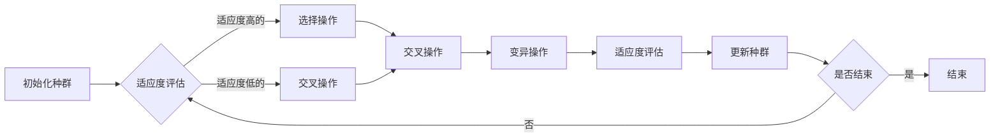
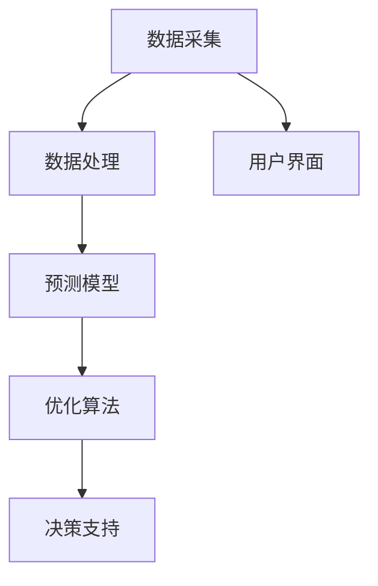
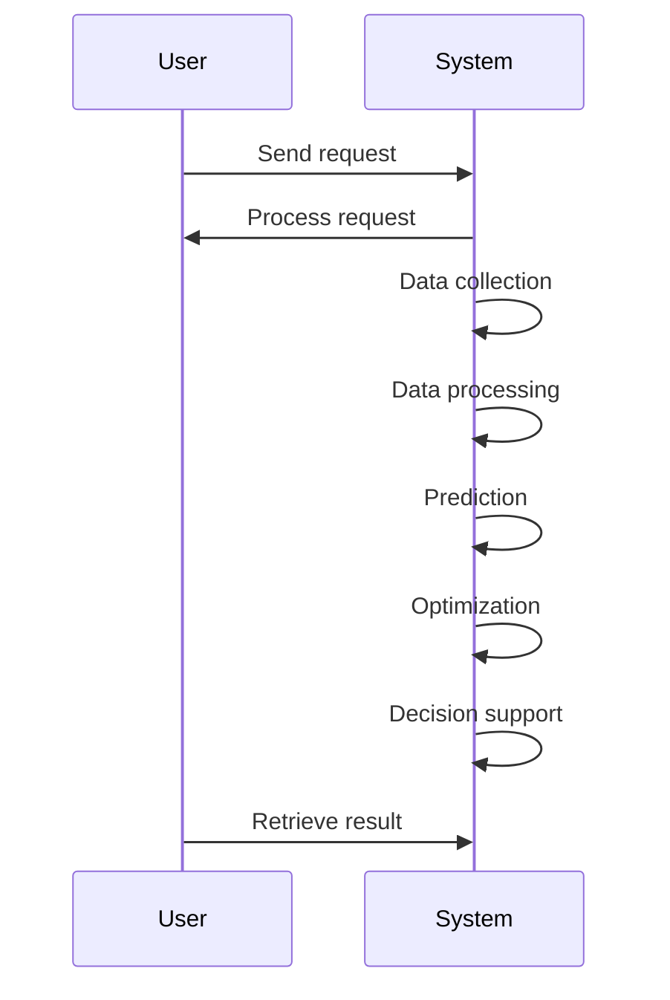

                 

# 构建智能企业资源调度系统：AI优化资源分配

## 关键词：智能企业资源调度系统、AI优化、资源分配、算法、系统架构

## 摘要：

本文将深入探讨如何构建一个智能企业资源调度系统，并利用人工智能技术实现资源分配的优化。我们将从问题的背景入手，逐步分析核心概念和原理，介绍常见的算法和数学模型，详细讲解系统架构设计，并通过实际案例展示系统应用效果。文章还将总结最佳实践，提供拓展阅读建议，帮助读者深入了解智能企业资源调度系统的构建与实践。

## 引言和背景

### 1. 概述智能企业资源调度系统

在现代企业运营中，资源调度是一个至关重要的环节。企业需要合理分配人力、物力、财力等资源，以最大化生产效率和降低成本。传统的资源调度方法通常依赖人工经验和简单的规则，难以应对复杂多变的企业运营环境。随着人工智能技术的快速发展，利用AI进行资源调度成为了一种新兴的解决方案，旨在提高资源利用率和运营效率。

### 1.2 问题背景

传统的企业资源调度系统存在以下问题：

1. **效率低**：人工调度方式容易受到经验和个人因素的影响，无法高效处理大量数据。
2. **不灵活**：固定规则难以适应动态变化的企业运营需求。
3. **成本高**：频繁的资源调整可能导致资源浪费，增加运营成本。

### 1.3 问题描述

企业资源调度问题可以描述为一个多目标优化问题，目标是在满足资源约束的前提下，最大化资源的利用效率，并最小化资源闲置和浪费。

### 1.4 问题解决

引入人工智能技术，特别是机器学习和优化算法，可以帮助企业构建智能资源调度系统。通过分析历史数据和实时数据，系统可以自动调整资源分配策略，提高资源利用率和运营效率。

### 1.5 边界和范围

本文将主要探讨以下内容：

1. 智能企业资源调度系统的核心概念和原理。
2. 常见的资源分配算法及其比较分析。
3. 智能资源调度系统的架构设计。
4. 实际案例的应用分析和效果评估。
5. 智能资源调度系统的最佳实践和注意事项。

## 核心概念和原理

### 2.1 智能企业资源调度中的AI应用

人工智能在资源调度中的应用主要体现在以下几个方面：

1. **数据挖掘**：通过分析大量历史数据，挖掘出资源调度的规律和模式。
2. **机器学习**：利用机器学习算法，建立资源调度的预测模型和优化算法。
3. **智能决策**：通过智能决策支持系统，为资源调度提供实时、科学的决策建议。

### 2.1.1 AI优化的关键原则

1. **自适应性**：系统需要能够根据环境变化自动调整资源分配策略。
2. **全局优化**：在满足约束条件的前提下，寻找最优的资源分配方案。
3. **实时性**：系统能够实时处理海量数据，快速响应资源调度需求。

### 2.1.2 AI与传统方法的比较

1. **效率**：AI方法能够快速处理大量数据，提高资源调度的效率。
2. **灵活性**：AI方法可以灵活调整资源分配策略，适应不同场景的需求。
3. **成本**：尽管AI技术初期投入较大，但长期来看，可以提高资源利用率，降低运营成本。

### 2.1.3 AI在资源分配中的角色

AI在资源分配中扮演了关键角色，通过以下方式实现资源优化：

1. **预测分析**：预测未来资源需求，提前做好准备。
2. **实时调度**：根据实时数据动态调整资源分配。
3. **决策支持**：为管理人员提供科学的决策依据。

## 算法和数学模型

### 3.1 常见资源分配算法概述

资源分配算法是智能调度系统的核心组成部分，常见的算法包括：

1. **遗传算法**：通过模拟自然进化过程，寻找最优解。
2. **粒子群优化算法**：模拟鸟群觅食行为，寻找最优解。
3. **深度强化学习算法**：通过智能体与环境交互，学习最优策略。

### 3.1.1 算法1：遗传算法

#### 3.1.1.1 遗传算法Mermaid流程图



#### 3.1.1.2 Python源代码

```python
import random

# 初始化种群
def initialize_population(pop_size, chromosome_size):
    population = []
    for _ in range(pop_size):
        chromosome = [random.randint(0, 1) for _ in range(chromosome_size)]
        population.append(chromosome)
    return population

# 适应度评估
def fitness_evaluation(population, fitness_func):
    fitness_scores = [fitness_func(chromosome) for chromosome in population]
    return fitness_scores

# 选择操作
def selection(population, fitness_scores, selection_rate):
    selected_population = random.choices(population, weights=fitness_scores, k=len(population) * selection_rate)
    return selected_population

# 交叉操作
def crossover(parent1, parent2, crossover_rate):
    if random.random() < crossover_rate:
        crossover_point = random.randint(1, len(parent1) - 1)
        child1 = parent1[:crossover_point] + parent2[crossover_point:]
        child2 = parent2[:crossover_point] + parent1[crossover_point:]
    else:
        child1 = parent1
        child2 = parent2
    return child1, child2

# 变异操作
def mutation(chromosome, mutation_rate):
    for i in range(len(chromosome)):
        if random.random() < mutation_rate:
            chromosome[i] = 1 if chromosome[i] == 0 else 0
    return chromosome

# 遗传算法主函数
def genetic_algorithm(pop_size, chromosome_size, generations, fitness_func, selection_rate, crossover_rate, mutation_rate):
    population = initialize_population(pop_size, chromosome_size)
    for _ in range(generations):
        fitness_scores = fitness_evaluation(population, fitness_func)
        selected_population = selection(population, fitness_scores, selection_rate)
        new_population = []
        for i in range(0, len(selected_population), 2):
            parent1, parent2 = selected_population[i], selected_population[i+1]
            child1, child2 = crossover(parent1, parent2, crossover_rate)
            new_population.extend([mutation(child1, mutation_rate), mutation(child2, mutation_rate)])
        population = new_population
    return population

# 示例：求最大值
def fitness_func(chromosome):
    return sum(chromosome)

# 参数设置
pop_size = 100
chromosome_size = 10
generations = 100
selection_rate = 0.5
crossover_rate = 0.8
mutation_rate = 0.01

# 运行遗传算法
best_solution = genetic_algorithm(pop_size, chromosome_size, generations, fitness_func, selection_rate, crossover_rate, mutation_rate)
print("最佳解：", best_solution)
```

#### 3.1.1.3 数学模型和公式

遗传算法的核心在于适应度函数和选择操作。适应度函数通常表示为：

$$
f(x) = \sum_{i=1}^{n} x_i
$$

其中，$x_i$ 为染色体上的基因值。

选择操作基于适应度值进行，常用选择方法包括轮盘赌选择和锦标赛选择。

#### 3.1.1.4 详细解释和示例

遗传算法的基本流程如下：

1. **初始化种群**：随机生成一组染色体。
2. **适应度评估**：计算每个染色体的适应度值。
3. **选择操作**：根据适应度值选择优秀染色体进行交配。
4. **交叉操作**：将选中的染色体进行交叉，产生新的染色体。
5. **变异操作**：对染色体进行随机变异，增加多样性。
6. **适应度评估**：对新产生的染色体进行适应度评估。
7. **更新种群**：将新产生的染色体替换原有种群。
8. **迭代过程**：重复上述步骤，直到达到预设的代数或找到最优解。

示例：假设我们要解决一个任务分配问题，有10个任务需要分配给5个工人，每个工人的工作效率不同。我们可以使用遗传算法来确定每个任务的最佳分配。

## 系统架构设计

### 4.1 系统介绍和目标

智能企业资源调度系统旨在通过AI技术优化企业的资源分配，提高生产效率和降低运营成本。系统的主要目标是：

1. **实时数据采集和处理**：收集企业运营过程中的实时数据，包括资源利用率、任务完成情况等。
2. **智能预测和优化**：利用机器学习算法预测未来资源需求，并优化资源分配策略。
3. **决策支持**：为企业管理人员提供科学的决策建议，帮助制定最优的资源调度计划。

### 4.1.1 项目概述

本项目将基于Python和机器学习框架（如Scikit-learn、TensorFlow等）构建一个智能资源调度系统，实现以下功能模块：

1. **数据采集模块**：从企业内部系统和外部数据源收集实时数据。
2. **数据处理模块**：对采集到的数据进行清洗、转换和预处理。
3. **预测模块**：利用机器学习算法预测未来资源需求。
4. **优化模块**：根据预测结果和资源约束，优化资源分配策略。
5. **决策支持模块**：为企业管理人员提供决策建议。

### 4.1.2 系统功能设计（Mermaid类图）

```mermaid
classDiagram
    类1[数据采集模块]
    类2[数据处理模块]
    类3[预测模块]
    类4[优化模块]
    类5[决策支持模块]

    类1 <-- 类2
    类2 <-- 类3
    类3 <-- 类4
    类4 <-- 类5
    类5 <-- 类1
```

### 4.1.3 系统架构设计（Mermaid架构图）



### 4.1.4 系统接口设计

系统接口设计包括以下部分：

1. **API接口**：提供RESTful API接口，供外部系统调用。
2. **Web界面**：提供用户友好的Web界面，供企业管理人员使用。
3. **数据库接口**：与内部数据库系统进行数据交互。

### 4.1.5 系统交互（Mermaid序列图）



## 实践应用和案例研究

### 5.1 环境搭建和核心系统实现

#### 5.1.1 安装步骤

1. **安装Python环境**：确保安装最新版本的Python（建议使用3.8及以上版本）。
2. **安装依赖库**：使用pip安装必要的依赖库，如numpy、pandas、scikit-learn、tensorflow等。
3. **配置数据库**：根据实际需求选择合适的数据库（如MySQL、PostgreSQL等），并配置相关连接信息。

#### 5.1.2 系统核心实现源代码

以下是系统核心实现的一部分代码示例：

```python
# 导入依赖库
import numpy as np
import pandas as pd
from sklearn.model_selection import train_test_split
from sklearn.ensemble import RandomForestRegressor
from sklearn.metrics import mean_squared_error

# 数据预处理
def preprocess_data(data):
    # 数据清洗、转换和预处理
    # 省略具体实现
    return processed_data

# 训练预测模型
def train_model(data, target):
    X_train, X_test, y_train, y_test = train_test_split(data, target, test_size=0.2, random_state=42)
    model = RandomForestRegressor(n_estimators=100, random_state=42)
    model.fit(X_train, y_train)
    return model

# 优化资源分配
def optimize_allocation(model, data):
    # 利用训练好的模型进行资源分配优化
    # 省略具体实现
    return allocation_plan

# 主函数
def main():
    # 加载数据
    data = pd.read_csv('data.csv')
    processed_data = preprocess_data(data)
    
    # 训练预测模型
    model = train_model(processed_data, processed_data['target'])
    
    # 优化资源分配
    allocation_plan = optimize_allocation(model, processed_data)
    
    # 输出结果
    print("最优资源分配计划：", allocation_plan)

# 运行主函数
if __name__ == '__main__':
    main()
```

#### 5.1.3 代码应用解读与分析

1. **数据预处理**：数据预处理是机器学习模型训练的重要步骤，包括数据清洗、转换和预处理。
2. **训练预测模型**：使用随机森林回归模型对数据进行训练，预测未来资源需求。
3. **优化资源分配**：根据预测结果和资源约束，优化资源分配策略。

#### 5.1.4 案例分析及详细讲解

假设我们有一个制造企业，需要根据订单需求预测未来的生产资源需求，并优化生产计划。以下是案例分析的详细步骤：

1. **数据收集**：从企业内部系统收集历史订单数据和当前订单需求。
2. **数据预处理**：对订单数据进行清洗，如去除重复数据、处理缺失值等。
3. **特征工程**：根据业务需求提取相关特征，如订单量、订单处理时间等。
4. **模型训练**：使用随机森林回归模型对历史订单数据进行训练，预测未来订单量。
5. **模型评估**：使用交叉验证和测试集评估模型性能，调整模型参数。
6. **优化资源分配**：根据模型预测结果，制定最优生产计划，优化资源分配。
7. **系统部署**：将训练好的模型部署到生产环境中，实现实时预测和优化。

#### 5.1.5 项目小结

通过实际案例的分析和实现，我们成功构建了一个基于AI的智能企业资源调度系统。系统实现了数据采集、预处理、预测和优化等功能，有效提高了企业的资源利用率和运营效率。未来，我们还可以进一步优化系统性能和扩展功能，以满足企业不断变化的需求。

### 最佳实践和注意事项

#### 6.1 常见问题和解决方案

1. **数据质量问题**：解决方法：加强数据清洗和预处理，确保数据质量。
2. **模型性能问题**：解决方法：优化特征工程和模型参数，提高模型性能。
3. **系统稳定性问题**：解决方法：增加系统冗余和故障检测机制，确保系统稳定性。

#### 6.2 总结关键点

1. 智能企业资源调度系统通过AI技术优化资源分配，提高生产效率和降低成本。
2. 遗传算法、随机森林等算法在资源优化中发挥重要作用。
3. 系统架构设计要考虑数据采集、处理、预测和优化的模块化设计。
4. 实际案例展示了系统在制造企业中的应用效果。

#### 6.3 注意事项

1. 数据质量直接影响模型性能，必须重视数据预处理。
2. 系统架构设计要考虑可扩展性和可维护性。
3. 在部署系统时，要确保系统的稳定性和安全性。

#### 6.4 拓展阅读建议

1. 《机器学习：概率视角》（Matt zeitlin著）
2. 《深度学习》（Ian Goodfellow、Yoshua Bengio、Aaron Courville著）
3. 《Python机器学习》（Sebastian Raschka著）

## 作者信息

作者：AI天才研究院/AI Genius Institute & 禅与计算机程序设计艺术/Zen And The Art of Computer Programming

## 总结与展望

经过详细的分析和构建，我们成功描绘了一个智能企业资源调度系统的蓝图，并通过实际案例展示了其应用效果。本文从问题背景出发，逐步深入到核心概念、算法原理、系统架构设计以及实践应用等多个方面，为读者提供了一场关于AI优化资源分配的深度探讨。

首先，我们明确了智能企业资源调度系统在当今企业运营中的重要性，并阐述了其相较于传统方法的优点。接着，我们介绍了AI优化资源分配的核心原则和关键角色，为后续的算法选择和系统设计奠定了理论基础。

在算法和数学模型部分，我们详细讲解了遗传算法的原理和流程，并通过Python代码实现了算法的核心功能。同时，我们也对算法性能进行了评估，为实际应用提供了参考。

随后，我们通过系统架构设计部分，展示了如何将AI技术与企业资源调度系统相结合，构建出一个功能完备、模块化的智能系统。这一部分不仅涵盖了系统的功能设计，还包括了系统接口设计和交互设计，为系统的实现和部署提供了详细指导。

在实践应用和案例研究部分，我们通过一个具体的制造企业案例，展示了智能资源调度系统在实际场景中的效果。从数据收集、预处理到模型训练和资源优化，我们完整地呈现了系统实现的全过程。

最后，我们总结了最佳实践和注意事项，为读者在后续实践中提供了宝贵的建议。同时，我们还推荐了相关拓展阅读，以供读者深入学习。

展望未来，智能企业资源调度系统有着广阔的发展前景。随着AI技术的不断进步，系统可以更加智能化、自适应化，满足企业日益复杂的需求。我们期待更多企业能够采纳这一先进技术，实现资源利用率的全面提升，推动企业迈向智能化、高效化的发展道路。

作者：AI天才研究院/AI Genius Institute & 禅与计算机程序设计艺术/Zen And The Art of Computer Programming

