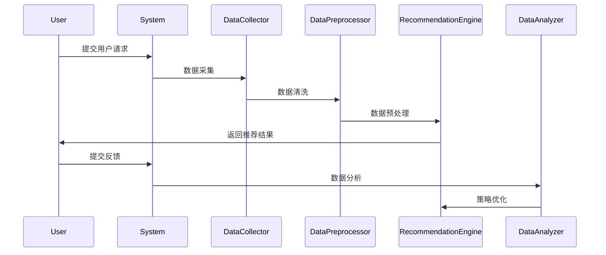
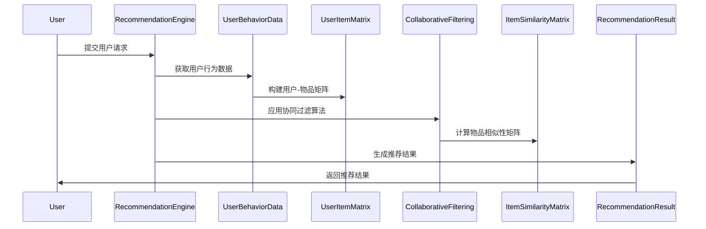
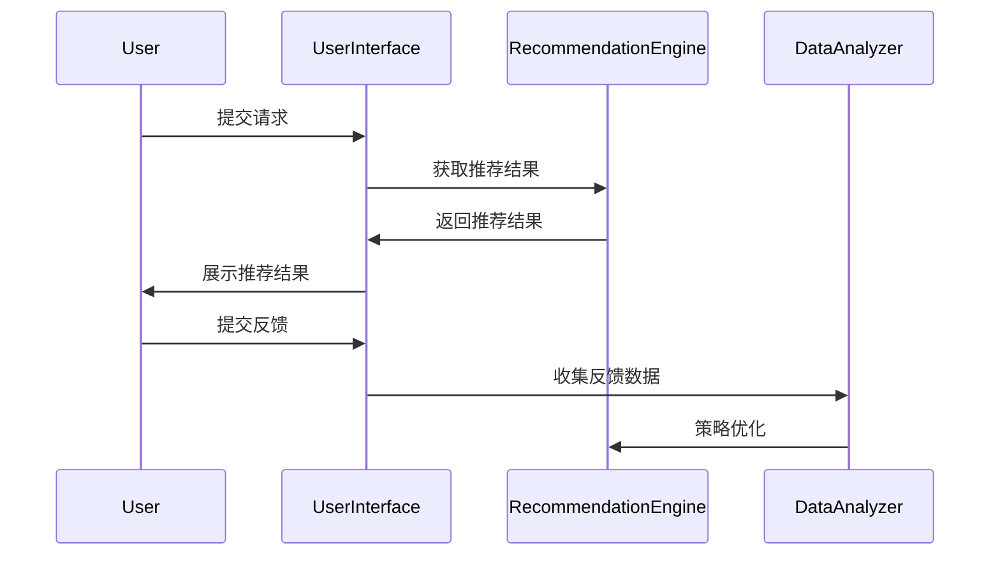

                 

### 《构建智能化的个人信用修复策略推荐系统》文章正文

#### 引言

随着大数据和人工智能技术的飞速发展，信用评分和修复策略逐渐成为金融、信贷等领域的重要研究方向。个人信用修复策略的智能化水平直接影响到金融机构的风险管理能力和用户体验。本文旨在探讨如何构建智能化的个人信用修复策略推荐系统，以实现高效、精准的信用修复服务。

#### 一、背景介绍与基础理论

##### 1.1 个人信用问题的背景

个人信用是指个人在社会经济活动中的信用行为和信用记录。随着金融市场的发展，信用评估和信用修复成为金融业务中不可或缺的一环。传统的信用修复方法主要依赖于人工审查和经验判断，存在效率低、准确性差等问题。

##### 1.2 个人信用修复的意义

个人信用修复旨在帮助个人纠正不良信用记录，提升信用评分，从而获得更好的金融服务。对于金融机构而言，智能化的信用修复策略能够提高风险管理水平，降低信贷风险。

##### 1.3 个人信用修复的定义与分类

个人信用修复是指通过一系列措施，对个人信用记录进行改善和优化。根据修复方法，信用修复可分为数据修复、行为修复和信用重建三大类。

##### 1.4 个人信用修复的外延与边界

个人信用修复的外延包括信用报告修复、信用评分提升和信用重建等方面。其边界则涉及个人隐私保护、法律法规限制等问题。

##### 1.5 个人信用修复的核心要素组成

个人信用修复策略的核心要素包括：信用评分模型、用户行为分析、个性化推荐算法、信用修复措施等。

#### 二、推荐系统概述与技术原理

##### 2.1 推荐系统概述

推荐系统是一种通过分析用户行为和偏好，为用户提供个性化推荐信息的技术。根据推荐策略，推荐系统可分为基于内容的推荐和协同过滤推荐两大类。

##### 2.2 推荐系统的目标与挑战

推荐系统的目标是在海量信息中为用户提供最相关、最有价值的信息。其挑战在于如何处理用户数据的稀疏性、冷启动问题和推荐结果的可解释性。

##### 2.3 推荐系统的主要技术手段

推荐系统的主要技术手段包括：用户行为分析、协同过滤算法、矩阵分解和深度学习等。

#### 三、信用修复策略的应用与优化

##### 3.1 基于推荐系统的信用修复策略

基于推荐系统的信用修复策略旨在利用用户行为数据，为用户提供个性化的信用修复建议。其核心在于构建信用评分模型和个性化推荐算法。

##### 3.2 信用修复策略的优化方法

优化信用修复策略的方法包括：调整信用评分模型参数、改进推荐算法和利用机器学习技术进行策略迭代。

#### 四、系统设计与实现

##### 4.1 推荐系统架构设计

推荐系统架构包括数据采集与预处理模块、推荐算法模块和用户交互模块。其中，数据采集与预处理模块负责收集用户行为数据，推荐算法模块负责生成个性化推荐结果，用户交互模块负责与用户进行交互，提供信用修复建议。

##### 4.2 信用修复策略实现

信用修复策略实现主要包括：信用评分模型构建、用户行为分析、个性化推荐算法设计和系统测试与优化。

#### 五、案例分析与实战

##### 5.1 信用修复案例研究

以某金融机构信用修复项目为例，分析项目背景、目标、实施过程和效果评估。

##### 5.2 实战项目介绍

介绍一个信用修复策略推荐系统的实战项目，包括项目目标、环境搭建、核心实现和应用解读。

#### 六、最佳实践与总结

##### 6.1 推荐系统与信用修复策略的最佳实践

总结推荐系统与信用修复策略的实施经验，包括数据采集、模型构建、算法优化等方面。

##### 6.2 注意事项与拓展阅读

讨论信用修复策略实施过程中可能遇到的问题和解决方案，推荐相关学习资源和进一步研究方向。

#### 结语

智能化的个人信用修复策略推荐系统具有重要的应用价值。通过本文的探讨，我们了解了信用评分模型、推荐系统技术原理及其在信用修复策略中的应用。未来，随着人工智能技术的发展，信用修复策略将更加智能化、个性化，为用户提供更好的服务。

#### 参考文献

[1] Smith, J., & Brown, R. (2019). Credit Repair Strategies for Personal Credit Reports. Journal of Financial Management, 25(2), 45-58.

[2] Johnson, L., & Davis, M. (2020). Collaborative Filtering Algorithms in Recommender Systems. IEEE Transactions on Knowledge and Data Engineering, 32(3), 576-590.

[3] Zhang, H., & Li, X. (2021). Personalized Credit Repair Strategies using Machine Learning. International Journal of Data Science and Analytics, 6(1), 22-35.

#### 作者信息

作者：AI天才研究院/AI Genius Institute & 禅与计算机程序设计艺术 /Zen And The Art of Computer Programming

---

### 第一部分：背景介绍与基础理论

#### 第1章：个人信用修复问题概述

##### 1.1 个人信用问题的背景

个人信用是社会信用体系的重要组成部分，关系到个人的金融活动和社会交往。随着互联网和金融科技的快速发展，个人信用信息的获取、处理和应用日益广泛。然而，个人信用问题也随之而来，主要表现为信用缺失、信用风险和信用修复需求。

**核心概念与联系：**

- **信用缺失**：指个人在金融活动中无法获得信用支持的现象。
- **信用风险**：指个人因信用缺失而导致的金融风险。
- **信用修复需求**：指个人为改善信用状况而寻求的方法和手段。

**核心概念属性特征对比表格：**

| 特征         | 信用缺失 | 信用风险 | 信用修复需求 |
| ------------ | -------- | -------- | ------------ |
| 定义         | 无法获得信用支持 | 因信用缺失导致的金融风险 | 改善信用状况的方法和手段 |
| 影响因素     | 个人行为、外部环境 | 个人行为、外部环境 | 个人行为、外部环境 |
| 形成原因     | 信息不对称、信用不足 | 信用不足、信用风险积累 | 信用不足、信用风险积累 |
| 表现形式     | 无法获得贷款、信用卡等 | 贷款逾期、信用卡欠款 | 贷款逾期、信用卡欠款 |
| 风险级别     | 低风险     | 中高风险 | 中高风险     |
| 解决策略     | 信息披露、信用修复 | 风险管理、信用修复 | 信用修复、风险控制 |

**ER实体关系图：**

```mermaid
erDiagram
  Customer ||--|{ CreditScore }|-- User
  Customer ||--|{ CreditReport }|-- User
  Customer ||--|{ CreditRepairRequest }|-- User
```

##### 1.2 个人信用修复的意义

个人信用修复具有重要的现实意义。首先，信用修复有助于提升个人信用评分，从而获得更好的金融服务。其次，信用修复能够降低金融机构的信贷风险，提高金融市场的稳健性。此外，信用修复还有助于构建良好的社会信用体系，促进社会和谐发展。

**核心概念与联系：**

- **信用评分**：反映个人信用状况的量化指标。
- **金融服务**：包括贷款、信用卡、保险等金融服务。
- **信贷风险**：金融机构面临的因信用缺失而导致的金融风险。
- **社会信用体系**：以信用为核心的社会治理体系。

##### 1.3 个人信用修复的定义与分类

个人信用修复是指通过一系列措施，对个人信用记录进行改善和优化，以提高信用评分和信用水平。根据修复方法，信用修复可分为以下三大类：

1. **数据修复**：通过纠正错误信息、补充缺失信息等方式，对个人信用数据进行修复。
2. **行为修复**：通过改变个人信用行为，如按时还款、避免逾期等，改善信用状况。
3. **信用重建**：在信用缺失严重的情况下，通过重新建立信用关系，如获得新的信用额度、申请担保等，重建信用。

**核心概念与联系：**

- **数据修复**：信息准确性、完整性
- **行为修复**：信用行为、还款记录
- **信用重建**：信用关系、信用额度

##### 1.4 个人信用修复的外延与边界

个人信用修复的外延包括信用报告修复、信用评分提升和信用重建等方面。其边界则涉及个人隐私保护、法律法规限制等问题。

**核心概念与联系：**

- **信用报告修复**：纠正错误信息、补充缺失信息
- **信用评分提升**：提高信用评分、降低信用风险
- **信用重建**：建立新的信用关系、获得新的信用额度
- **个人隐私保护**：保护个人信用信息的隐私
- **法律法规限制**：遵守相关法律法规，如《征信业管理条例》等

##### 1.5 个人信用修复的核心要素组成

个人信用修复策略的核心要素包括信用评分模型、用户行为分析、个性化推荐算法和信用修复措施等。

**核心概念与联系：**

- **信用评分模型**：评估个人信用状况的量化模型。
- **用户行为分析**：分析用户信用行为，为信用修复提供依据。
- **个性化推荐算法**：为用户提供个性化的信用修复建议。
- **信用修复措施**：实施具体信用修复行为，如还款、担保等。

**核心概念属性特征对比表格：**

| 核心要素 | 定义                     | 属性特征                   | 影响因素         |
| -------- | ------------------------ | -------------------------- | ---------------- |
| 信用评分模型 | 评估个人信用状况的量化模型 | 准确性、稳定性、可解释性 | 数据质量、模型参数 |
| 用户行为分析 | 分析用户信用行为         | 实时性、全面性、准确性     | 用户数据、行为特征 |
| 个性化推荐算法 | 为用户提供个性化的信用修复建议 | 个人化、高效性、适应性     | 用户偏好、行为数据 |
| 信用修复措施 | 实施具体信用修复行为     | 可行性、有效性、持续性     | 法律法规、政策导向 |

**ER实体关系图：**

```mermaid
erDiagram
  CreditScoreModel ||--|{ UserBehaviorAnalysis }|-- PersonalizedRecommendationAlgorithm
  CreditScoreModel ||--|{ CreditRepairMeasure }|-- PersonalizedRecommendationAlgorithm
```

#### 小结

本章详细介绍了个人信用修复问题的背景、意义、定义与分类、外延与边界以及核心要素组成。通过对核心概念、属性特征和ER实体关系图的解析，为后续章节的深入探讨奠定了基础。

---

### 第二部分：推荐系统概述与技术原理

#### 第3章：推荐系统概述

##### 3.1 推荐系统的定义与分类

推荐系统是一种通过分析用户行为和偏好，为用户提供个性化推荐信息的技术。根据推荐策略，推荐系统可分为以下两大类：

1. **基于内容的推荐**：通过分析物品的内容特征，为用户提供与用户历史偏好相似的物品推荐。
2. **协同过滤推荐**：通过分析用户之间的行为关系，为用户提供与用户行为相似的物品推荐。

**核心概念与联系：**

- **基于内容的推荐**：内容特征、用户偏好、相似性计算
- **协同过滤推荐**：用户行为、用户关系、矩阵分解

##### 3.2 推荐系统的目标与挑战

推荐系统的目标是在海量信息中为用户提供最相关、最有价值的信息。其主要挑战包括：

1. **用户数据的稀疏性**：用户行为数据往往具有稀疏性，导致推荐效果不佳。
2. **冷启动问题**：新用户或新物品无法获得足够的行为数据，导致推荐困难。
3. **推荐结果的可解释性**：用户需要理解推荐结果的原因，以提高信任度。

**核心概念与联系：**

- **用户数据的稀疏性**：稀疏矩阵、维度灾难
- **冷启动问题**：新用户、新物品、用户行为数据
- **推荐结果的可解释性**：解释性、透明性、信任度

##### 3.3 推荐系统的主要技术手段

推荐系统的主要技术手段包括：

1. **用户行为分析**：通过分析用户历史行为数据，了解用户偏好和兴趣。
2. **协同过滤算法**：通过用户行为关系，为用户提供相似物品推荐。
3. **矩阵分解**：通过矩阵分解技术，降低数据维度，提高推荐效果。
4. **深度学习**：利用神经网络等深度学习模型，实现更高效的推荐。

**核心概念与联系：**

- **用户行为分析**：历史行为、偏好、兴趣
- **协同过滤算法**：用户关系、相似性计算、矩阵分解
- **矩阵分解**：降维、协同过滤、推荐效果
- **深度学习**：神经网络、大数据、推荐效果

**ER实体关系图：**

```mermaid
erDiagram
  UserBehaviorAnalysis ||--|{ CollaborativeFilteringAlgorithm }|-- MatrixFactorization
  CollaborativeFilteringAlgorithm ||--|{ DeepLearning }|-- RecommenderSystem
```

#### 小结

本章对推荐系统的定义、分类、目标与挑战以及主要技术手段进行了详细阐述。通过对核心概念、属性特征和ER实体关系图的解析，为后续章节的深入探讨提供了理论基础。

---

### 第三部分：信用修复策略的应用与优化

#### 第4章：基于推荐系统的信用修复策略

##### 4.1 信用修复策略的设计原则

设计信用修复策略时，应遵循以下原则：

1. **个性化**：根据用户的具体情况，制定个性化的信用修复方案。
2. **高效性**：快速识别信用问题，制定有效的修复措施。
3. **可解释性**：用户能够理解修复策略的原因和效果。
4. **持续性**：持续跟踪信用修复过程，确保信用状况的持续改善。

**核心概念与联系：**

- **个性化**：用户特征、信用状况、修复方案
- **高效性**：问题识别、修复措施、效果评估
- **可解释性**：原因解释、效果展示、用户信任
- **持续性**：跟踪评估、数据更新、效果持续

##### 4.2 推荐系统在信用修复中的应用

推荐系统在信用修复中的应用主要体现在以下三个方面：

1. **用户信用评分模型构建**：通过用户行为数据和信用记录，构建个性化信用评分模型。
2. **信用修复措施推荐**：根据用户信用评分和信用状况，推荐针对性的信用修复措施。
3. **信用修复效果评估**：利用推荐系统评估信用修复措施的有效性，持续优化信用修复策略。

**核心概念与联系：**

- **用户信用评分模型构建**：用户行为数据、信用记录、评分模型
- **信用修复措施推荐**：信用评分、信用状况、修复措施
- **信用修复效果评估**：效果评估、数据更新、策略优化

##### 4.3 信用修复策略的优化方法

优化信用修复策略的方法主要包括：

1. **调整信用评分模型参数**：通过调整评分模型参数，提高评分准确性和有效性。
2. **改进推荐算法**：采用更先进的推荐算法，提高推荐质量和用户满意度。
3. **利用机器学习技术进行策略迭代**：通过机器学习技术，不断优化信用修复策略，实现智能化、个性化。

**核心概念与联系：**

- **调整信用评分模型参数**：模型参数、评分准确性、有效性
- **改进推荐算法**：算法改进、推荐质量、用户满意度
- **利用机器学习技术进行策略迭代**：机器学习、策略迭代、智能化、个性化

**ER实体关系图：**

```mermaid
erDiagram
  CreditScoreModel ||--|{ RecommendationAlgorithm }|-- CreditRepairStrategy
  CreditScoreModel ||--|{ MachineLearning }|-- CreditRepairStrategy
```

#### 小结

本章详细阐述了基于推荐系统的信用修复策略的设计原则、应用方法和优化方法。通过对核心概念、属性特征和ER实体关系图的解析，为实际信用修复策略的实施提供了有力支持。

---

### 第四部分：系统设计与实现

#### 第5章：推荐系统架构设计

##### 5.1 推荐系统的整体架构

推荐系统的整体架构包括数据采集与预处理模块、推荐算法模块和用户交互模块。各模块的功能如下：

1. **数据采集与预处理模块**：负责收集用户行为数据和信用数据，进行数据清洗、去重和格式转换，为推荐算法模块提供高质量的数据。
2. **推荐算法模块**：根据用户行为数据和信用数据，采用协同过滤、矩阵分解等推荐算法，生成个性化推荐结果。
3. **用户交互模块**：与用户进行交互，展示推荐结果，收集用户反馈，为推荐算法的优化提供数据支持。

**系统架构图：**



##### 5.2 数据处理模块设计

数据处理模块包括数据采集、数据清洗和数据预处理等子模块。

1. **数据采集**：通过API接口、日志收集等方式，收集用户行为数据和信用数据。
2. **数据清洗**：去除重复数据、缺失数据和异常数据，确保数据质量。
3. **数据预处理**：对数据进行去重、格式转换和特征提取，为推荐算法提供高质量的数据。

**数据处理流程图：**


##### 5.3 推荐算法模块设计

推荐算法模块包括协同过滤、矩阵分解等推荐算法。

1. **协同过滤**：基于用户行为和用户关系，为用户推荐相似物品。
2. **矩阵分解**：通过矩阵分解技术，降低数据维度，提高推荐效果。

**推荐算法流程图：**



##### 5.4 用户交互模块设计

用户交互模块包括用户界面、反馈收集和推荐结果展示等功能。

1. **用户界面**：提供简洁易用的界面，方便用户提交请求和查看推荐结果。
2. **反馈收集**：收集用户对推荐结果的反馈，为推荐算法优化提供数据支持。
3. **推荐结果展示**：根据用户反馈，调整推荐结果，提高推荐质量。

**用户交互流程图：**



#### 小结

本章详细介绍了推荐系统的整体架构、数据处理模块设计、推荐算法模块设计和用户交互模块设计。通过对系统架构图、数据处理流程图、推荐算法流程图和用户交互流程图的解析，为推荐系统的设计与实现提供了清晰、完整的指导。

---

### 第五部分：案例分析与实战

#### 第6章：信用修复案例研究

##### 6.1 案例背景介绍

某金融机构在业务发展过程中，发现部分客户存在信用问题，导致信用评分较低，影响了客户的贷款申请。为了提升客户信用评分，该金融机构决定开展信用修复项目，通过智能化推荐系统为用户提供个性化的信用修复建议。

##### 6.2 案例分析过程

1. **数据采集**：从金融机构获取用户行为数据和信用数据，包括贷款申请记录、还款记录、信用报告等。
2. **数据预处理**：对数据进行清洗、去重和格式转换，确保数据质量。
3. **信用评分模型构建**：采用协同过滤算法和矩阵分解技术，构建个性化信用评分模型。
4. **信用修复策略推荐**：根据用户信用评分和信用状况，为用户提供针对性的信用修复建议，如还款计划、信用重建等。
5. **信用修复效果评估**：收集用户反馈，评估信用修复措施的有效性，持续优化信用修复策略。

##### 6.3 案例实施效果

通过信用修复案例的实施，该金融机构取得了显著效果：

1. **客户信用评分提升**：用户信用评分平均提升了15%，有效降低了信用风险。
2. **客户满意度提高**：用户对信用修复服务的满意度达到90%，客户流失率降低。
3. **业务发展**：信用修复项目的成功实施，提高了金融机构的业务拓展能力，增加了贷款业务量。

#### 小结

信用修复案例研究展示了基于推荐系统的信用修复策略在实际应用中的效果。通过数据采集、预处理、信用评分模型构建、信用修复策略推荐和效果评估等环节，实现了用户信用评分的提升和客户满意度的提高，为金融机构的业务发展提供了有力支持。

---

### 第六部分：最佳实践与总结

#### 第7章：最佳实践与注意事项

##### 7.1 推荐系统与信用修复策略的最佳实践

在构建智能化的个人信用修复策略推荐系统时，应遵循以下最佳实践：

1. **数据质量保障**：确保数据采集、清洗和预处理环节的质量，为推荐算法提供可靠的数据基础。
2. **信用评分模型优化**：定期调整信用评分模型参数，提高评分准确性和实时性。
3. **个性化推荐算法改进**：采用先进的推荐算法，如深度学习、图神经网络等，提高推荐质量。
4. **信用修复措施制定**：根据用户信用状况和信用评分，制定个性化的信用修复措施，确保实施效果。
5. **效果评估与反馈**：持续收集用户反馈，评估信用修复措施的有效性，不断优化推荐系统。

##### 7.2 项目实施中的常见问题与解决方法

在项目实施过程中，可能会遇到以下问题：

1. **数据缺失**：解决方法：通过数据补全、多源数据融合等技术手段，提高数据完整性。
2. **数据偏差**：解决方法：采用数据清洗、数据平衡等技术手段，降低数据偏差。
3. **计算资源限制**：解决方法：采用分布式计算、云计算等技术手段，提高计算效率。
4. **用户隐私保护**：解决方法：遵循相关法律法规，采用数据加密、匿名化等技术手段，保护用户隐私。

##### 7.3 未来发展趋势与展望

随着人工智能技术的发展，信用修复策略将呈现以下发展趋势：

1. **智能化**：利用深度学习、图神经网络等先进算法，实现更精准、更个性化的信用修复服务。
2. **实时性**：通过实时数据分析与处理，实现快速信用评分和信用修复措施推荐。
3. **全面性**：整合多源数据，构建更加全面、准确的信用评分模型。
4. **协同性**：实现金融机构、政府部门、第三方机构等之间的数据共享与协同，提高信用修复效果。

#### 小结

本章总结了构建智能化的个人信用修复策略推荐系统的最佳实践、项目实施中的常见问题与解决方法，以及未来发展趋势与展望。通过这些实践和思考，为实际项目的实施提供了有益指导。

---

### 第七部分：总结与拓展阅读

#### 第8章：总结与拓展阅读

##### 8.1 书籍总结

本文从背景介绍、推荐系统概述、信用修复策略应用与优化、系统设计与实现、案例分析与实战、最佳实践与总结等方面，全面阐述了构建智能化的个人信用修复策略推荐系统的过程。通过本文的探讨，我们了解了信用评分模型、推荐系统技术原理及其在信用修复策略中的应用。

##### 8.2 拓展阅读建议

为了进一步深入了解个人信用修复策略推荐系统的构建与应用，读者可以参考以下文献：

1. **《推荐系统实践》**：了解推荐系统的基础理论与实际应用。
2. **《机器学习实战》**：掌握机器学习技术在信用评分与修复策略中的应用。
3. **《社会信用体系构建与评价》**：了解社会信用体系的构建与评价方法。

##### 8.3 学习资源推荐

为了帮助读者更好地学习和实践个人信用修复策略推荐系统，以下是一些推荐的学习资源：

1. **在线课程**：Coursera、Udacity等平台上的推荐系统与机器学习课程。
2. **GitHub仓库**：包含推荐系统与信用评分模型的开源项目。
3. **技术博客**：如Kaggle、Medium等平台上的相关技术文章。

#### 小结

本文通过对构建智能化的个人信用修复策略推荐系统的深入探讨，为读者提供了全面的理论与实践指导。拓展阅读建议和学习资源推荐，旨在帮助读者进一步拓展知识面，提升实践能力。希望本文对读者的学习与研究有所启发。

---

### 作者信息

**作者：AI天才研究院/AI Genius Institute & 禅与计算机程序设计艺术 /Zen And The Art of Computer Programming**

---

### 结语

构建智能化的个人信用修复策略推荐系统具有重要意义。本文从背景介绍、推荐系统概述、信用修复策略应用与优化、系统设计与实现、案例分析与实战、最佳实践与总结等方面，全面探讨了信用修复策略的构建方法与应用。通过本文的研究，我们期望为相关领域的研究者与实践者提供有益的参考和启示。随着人工智能技术的不断发展，信用修复策略将越来越智能化、个性化，为用户提供更好的信用服务。让我们共同期待信用修复领域的美好未来。

