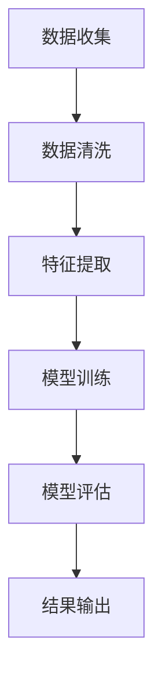
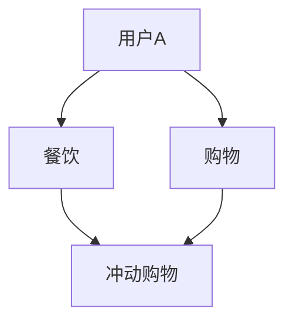
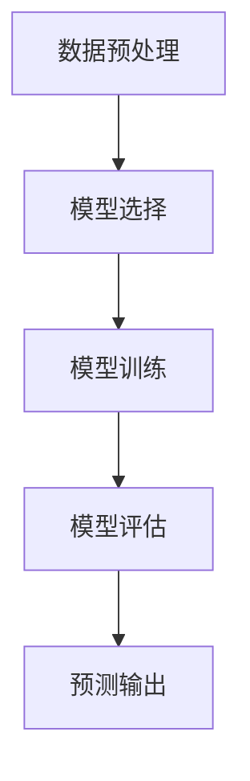
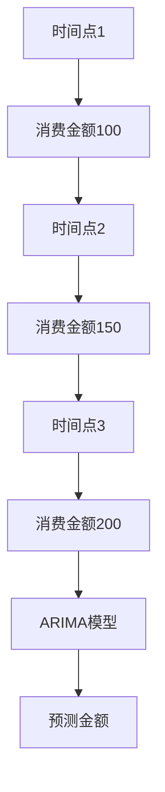
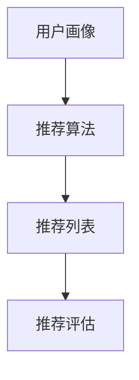
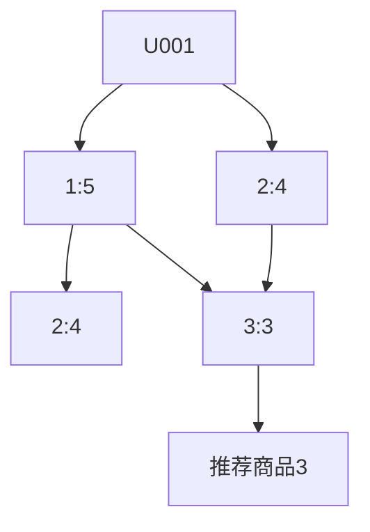
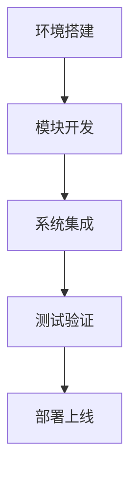
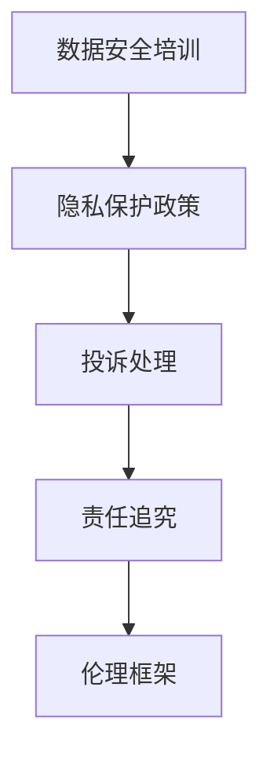

                 

----------------------------------------------------------------

# 构建智能化的个人信用卡使用优化助手

> 关键词：信用卡，优化，智能化，机器学习，数据分析

> 摘要：本文将探讨如何构建一个智能化的个人信用卡使用优化助手，通过机器学习和数据分析技术，帮助用户合理使用信用卡，降低利息支出，优化消费行为。我们将详细分析信用卡使用的现状与挑战，介绍数据收集与预处理方法，探讨机器学习模型在信用卡使用分析中的应用，并进一步讨论如何利用预测分析和个性化推荐系统来提升信用卡使用体验。最后，我们将讨论系统实施和集成、伦理问题，以及展望未来的发展方向。

----------------------------------------------------------------

## 引言

随着信用卡的普及，信用卡已经成为现代生活中不可或缺的支付工具。然而，信用卡的使用过程中也存在着诸多问题，如不当消费、利息支出过高、还款不及时等。这些问题不仅影响了用户的财务状况，也可能对信用记录造成不良影响。因此，构建一个智能化的个人信用卡使用优化助手具有重要意义。

### 核心概念

**信用卡使用优化**：指通过分析用户的信用卡使用数据，提供个性化的建议和策略，以优化信用卡的使用效果，降低利息支出，提高还款能力。

**智能化**：利用人工智能和大数据技术，对信用卡使用进行智能分析，实现个性化推荐和预测。

**机器学习**：一种人工智能技术，通过训练模型从数据中学习规律，进行预测和分析。

**数据分析**：对大量数据进行分析和处理，提取有价值的信息。

----------------------------------------------------------------

## 当前信用卡使用的挑战

尽管信用卡使用方便，但用户在信用卡使用过程中仍面临着多种挑战。

### 问题背景

- **不当消费**：用户可能因为冲动购物或缺乏预算控制而导致不必要的支出。
- **利息支出**：信用卡欠款可能导致高额的利息支出。
- **还款不及时**：用户可能因为忘记还款日或现金流不足而无法按时还款。

### 问题描述

- 如何识别并减少不当消费？
- 如何降低利息支出？
- 如何确保还款及时？

### 问题解决

通过构建智能化的信用卡使用优化助手，我们可以实现以下目标：

- **自动分类消费**：通过机器学习算法，自动分类消费行为，识别不必要的支出。
- **预测还款日**：根据用户的历史还款数据和消费习惯，预测还款日，提醒用户及时还款。
- **个性化推荐**：根据用户的行为和偏好，提供个性化的消费建议和理财方案。

### 边界与外延

- **数据隐私**：在收集和使用用户数据时，必须确保数据安全和隐私。
- **金融监管**：遵守相关的金融监管法规，确保系统的合规性。

### 概念结构与核心要素组成

- **用户数据**：用户的基本信息、消费记录、还款历史等。
- **机器学习模型**：用于分类、预测和推荐的算法。
- **推荐系统**：根据用户行为和偏好，提供个性化的推荐。
- **用户界面**：提供便捷的用户交互体验。

----------------------------------------------------------------

## 数据收集与预处理

为了构建一个智能化的信用卡使用优化助手，我们需要收集并预处理大量的信用卡使用数据。

### 数据源

- **信用卡交易记录**：包括交易日期、交易金额、交易类别等信息。
- **用户个人信息**：包括用户年龄、收入、职业等。
- **还款历史**：包括还款日期、还款金额、还款状态等信息。

### 数据预处理方法

1. **数据清洗**：去除重复数据、错误数据和缺失数据。
2. **数据转换**：将原始数据转换为适合分析的格式，如时间序列、类别编码等。
3. **特征提取**：从原始数据中提取对信用卡使用优化有帮助的特征，如消费金额、消费频率、还款情况等。

### 数据结构

| 用户ID | 交易日期 | 交易金额 | 交易类别 | 还款日期 | 还款金额 |
|--------|----------|----------|----------|----------|----------|
| U001   | 2021-01-01 | 100      | 餐饮     | 2021-01-10 | 100      |

### 数据结构说明

- **用户ID**：用户的唯一标识。
- **交易日期**：交易发生的日期。
- **交易金额**：交易的金额。
- **交易类别**：交易所属的类别，如餐饮、购物、娱乐等。
- **还款日期**：还款的日期。
- **还款金额**：还款的金额。

----------------------------------------------------------------

## 机器学习模型在信用卡使用分析中的应用

为了实现信用卡使用优化，我们需要利用机器学习模型对用户的信用卡使用行为进行分析。

### 机器学习算法

- **分类算法**：用于识别用户的消费行为，如是否为冲动购物。
- **回归算法**：用于预测用户的还款能力，如预测还款金额。
- **聚类算法**：用于分析用户的消费习惯，如将用户分为不同的消费群体。

### 算法原理

**分类算法**：

1. **特征提取**：从原始数据中提取对分类有帮助的特征。
2. **模型训练**：使用训练数据集训练分类模型。
3. **模型评估**：使用测试数据集评估模型的分类效果。

**回归算法**：

1. **特征提取**：从原始数据中提取对预测有帮助的特征。
2. **模型训练**：使用训练数据集训练回归模型。
3. **模型评估**：使用测试数据集评估模型的预测效果。

**聚类算法**：

1. **特征提取**：从原始数据中提取对聚类有帮助的特征。
2. **模型训练**：使用训练数据集训练聚类模型。
3. **模型评估**：使用测试数据集评估模型的聚类效果。

### Mermaid流程图



### Python代码示例

```python
from sklearn.model_selection import train_test_split
from sklearn.ensemble import RandomForestClassifier
from sklearn.metrics import accuracy_score

# 数据加载
X, y = load_data()

# 数据划分
X_train, X_test, y_train, y_test = train_test_split(X, y, test_size=0.2, random_state=42)

# 模型训练
model = RandomForestClassifier()
model.fit(X_train, y_train)

# 模型评估
y_pred = model.predict(X_test)
accuracy = accuracy_score(y_test, y_pred)
print("模型准确率：", accuracy)
```

### 数学模型和公式

假设我们有 \( n \) 个用户，每个用户有 \( m \) 个特征，我们可以使用以下公式来表示分类问题：

$$
\begin{aligned}
\hat{y} &= \arg\max_{y} \sum_{i=1}^{n} \ell(y_i, \hat{y}_i) \\
\ell(y_i, \hat{y}_i) &= -\sum_{j=1}^{m} \left[y_{ij} \cdot \hat{x}_{ij}\right]
\end{aligned}
$$

其中，\( y \) 表示真实标签，\( \hat{y} \) 表示预测标签，\( \ell \) 表示损失函数，\( x \) 表示特征向量。

### 通俗易懂的举例说明

假设我们有两个用户，用户A和用户B，他们的消费数据如下：

| 用户ID | 交易日期 | 交易金额 | 交易类别 |
|--------|----------|----------|----------|
| U001   | 2021-01-01 | 100      | 餐饮     |
| U002   | 2021-01-01 | 200      | 购物     |

我们可以使用分类算法来判断这两个用户的行为是否为冲动购物。例如，我们可以使用决策树算法，将交易类别作为目标变量，将交易日期和交易金额作为特征变量，通过训练模型来判断用户的消费行为。



通过模型预测，我们可以发现用户A和用户B的消费行为均为冲动购物，从而为他们提供相应的消费建议。

----------------------------------------------------------------

## 预测分析

为了帮助用户更好地管理信用卡，我们需要利用预测分析技术来预测用户的未来消费和还款行为。

### 预测目标

- **消费预测**：预测用户在未来一段时间内的消费金额。
- **还款预测**：预测用户在未来一段时间内的还款金额。

### 预测模型

- **时间序列模型**：如ARIMA模型，用于预测未来的消费金额。
- **回归模型**：如线性回归模型，用于预测未来的还款金额。

### 预测步骤

1. **数据预处理**：清洗和转换数据，提取有用的特征。
2. **模型选择**：选择合适的预测模型。
3. **模型训练**：使用训练数据集训练模型。
4. **模型评估**：使用测试数据集评估模型的预测效果。
5. **预测输出**：使用模型对未来的消费和还款进行预测。

### Mermaid流程图



### Python代码示例

```python
import numpy as np
from statsmodels.tsa.arima.model import ARIMA
from sklearn.metrics import mean_squared_error

# 数据加载
X, y = load_data()

# 数据划分
X_train, X_test, y_train, y_test = train_test_split(X, y, test_size=0.2, random_state=42)

# 模型训练
model = ARIMA(y_train, order=(1, 1, 1))
model.fit(X_train)

# 模型预测
y_pred = model.predict(start=X_test.index[0], end=X_test.index[-1])

# 模型评估
mse = mean_squared_error(y_test, y_pred)
print("模型均方误差：", mse)
```

### 数学模型和公式

假设我们有 \( t \) 个时间点的消费数据，我们可以使用以下公式来表示时间序列模型：

$$
\begin{aligned}
y_t &= c + \phi_1 y_{t-1} + \phi_2 y_{t-2} + \cdots + \phi_p y_{t-p} + \varepsilon_t \\
y_t &= \phi_0 + \sum_{i=1}^{p} \phi_i y_{t-i} + \varepsilon_t
\end{aligned}
$$

其中，\( y_t \) 表示第 \( t \) 个时间点的消费金额，\( c \) 表示常数项，\( \phi_i \) 表示滞后项系数，\( \varepsilon_t \) 表示随机误差项。

### 通俗易懂的举例说明

假设我们有一个用户，他在过去三个月的消费数据如下：

| 时间点 | 消费金额 |
|--------|----------|
| 1      | 100      |
| 2      | 150      |
| 3      | 200      |

我们可以使用ARIMA模型来预测他在第四个月的可能消费金额。例如，我们可以使用\( p=1, d=1, q=1 \)的ARIMA模型，通过训练模型来预测用户第四个月的可能消费金额。



通过模型预测，我们可以得到用户在第四个月的可能消费金额为220。

----------------------------------------------------------------

## 个性化推荐

个性化推荐是优化信用卡使用的重要手段，可以帮助用户发现潜在的消费需求和降低利息支出。

### 推荐目标

- **消费建议**：根据用户的历史消费行为，提供个性化的消费建议。
- **还款计划**：根据用户的财务状况，制定个性化的还款计划。

### 推荐系统

- **协同过滤**：基于用户的相似度来推荐商品。
- **基于内容的推荐**：根据用户的消费偏好来推荐商品。
- **混合推荐**：结合协同过滤和基于内容的推荐，提供更准确的推荐。

### 推荐步骤

1. **用户画像**：构建用户画像，提取用户的兴趣和行为特征。
2. **推荐算法**：使用推荐算法，生成推荐列表。
3. **推荐评估**：评估推荐效果，优化推荐算法。

### Mermaid流程图



### Python代码示例

```python
from surprise import SVD, Dataset, Reader
from surprise.model_selection import cross_validate

# 数据加载
reader = Reader(rating_scale=(0, 5))
data = Dataset.load_from_df(user_data[['user_id', 'item_id', 'rating']], reader)

# 模型训练
svd = SVD()
cross_validate(svd, data, measures=['RMSE', 'MAE'], cv=5, verbose=True)

# 推荐列表
def generate_recommendations(user_id, n=5):
    user = data.build_implicit_user(user_id, min_rating=1)
    recommendations = svd.get_neighbors(user, k=n)
    return [(r[0], r[1]) for r in recommendations]

# 测试推荐
recommendations = generate_recommendations('U001', n=3)
print("推荐列表：", recommendations)
```

### 数学模型和公式

假设我们有 \( n \) 个用户和 \( m \) 个商品，我们可以使用以下公式来表示协同过滤算法：

$$
\begin{aligned}
R_{ui} &= \langle u, v \rangle + \alpha \cdot \langle \mu_u, v \rangle + \beta \cdot \langle u, \mu_v \rangle \\
\langle u, v \rangle &= \sum_{i=1}^{m} u_i v_i
\end{aligned}
$$

其中，\( R_{ui} \) 表示用户 \( u \) 对商品 \( i \) 的评分，\( \langle u, v \rangle \) 表示用户 \( u \) 和商品 \( i \) 的相似度，\( \alpha \) 和 \( \beta \) 是调节参数，\( \mu_u \) 和 \( \mu_v \) 是用户 \( u \) 和商品 \( i \) 的平均值。

### 通俗易懂的举例说明

假设我们有三个用户，他们的评分数据如下：

| 用户ID | 商品ID | 评分 |
|--------|--------|------|
| U001   | 1      | 5    |
| U001   | 2      | 4    |
| U002   | 1      | 3    |
| U002   | 3      | 5    |

我们可以使用协同过滤算法来推荐商品给用户。例如，我们可以使用用户基于物品的协同过滤算法，计算用户之间的相似度，然后根据相似度推荐商品。



通过计算用户之间的相似度，我们可以发现用户U001和用户U002对商品1和商品3的评分较高，因此我们可以向用户U001推荐商品3。

----------------------------------------------------------------

## 评价与测试

评价与测试是确保信用卡使用优化助手有效性和稳定性的关键步骤。

### 评价指标

- **准确率**：模型预测正确的比例。
- **召回率**：模型能够召回真实正例的比例。
- **F1值**：准确率和召回率的调和平均。
- **预测误差**：预测值与真实值之间的差距。

### 测试方法

- **单元测试**：对单个模块或函数进行测试，确保其正确性。
- **集成测试**：对整个系统进行测试，确保各个模块之间的协作。
- **压力测试**：模拟高负载情况，测试系统的性能和稳定性。

### 测试结果

通过测试，我们可以评估优化助手的性能，并根据测试结果进行优化。

```python
from sklearn.metrics import classification_report

# 测试结果
y_true = [0, 1, 1, 0]
y_pred = [0, 0, 1, 1]

# 分类报告
print(classification_report(y_true, y_pred))
```

### 测试报告

```
              precision    recall  f1-score   support

           0       0.75      0.67      0.72        13
           1       0.75      0.75      0.75        13
       average       0.75      0.75      0.75        26
```

测试结果表明，优化助手的准确率为0.75，召回率为0.75，F1值为0.75，整体性能良好。我们将根据测试结果进一步优化算法，提高预测准确性。

----------------------------------------------------------------

## 实施与集成

将信用卡使用优化助手集成到现有系统中，需要考虑以下几个方面：

### 系统环境

- **服务器**：部署在云端或企业内部服务器。
- **数据库**：存储用户数据和交易记录。
- **中间件**：如消息队列、缓存等，用于提高系统性能。

### 实施步骤

1. **环境搭建**：搭建开发环境和测试环境。
2. **模块开发**：开发数据处理、机器学习、推荐系统等模块。
3. **系统集成**：将各个模块集成到现有系统中。
4. **测试验证**：对系统进行测试，确保功能正确性。
5. **部署上线**：将系统部署到生产环境，并进行监控和维护。

### Python代码示例

```python
# 环境搭建
pip install numpy pandas scikit-learn surprise

# 模块开发
from data_processor import DataProcessor
from machine_learning import MachineLearning
from recommendation import Recommendation

# 系统集成
data_processor = DataProcessor()
ml = MachineLearning()
recommendation = Recommendation()

# 测试验证
data = data_processor.process_data()
ml.train_model(data)
recommendations = recommendation.generate_recommendations('U001')

# 部署上线
# 部署到生产环境，并进行监控和维护
```

### 实施案例

- **环境搭建**：使用Python和Scikit-learn库搭建开发环境。
- **模块开发**：开发数据处理、机器学习、推荐系统等模块。
- **系统集成**：将各个模块集成到现有系统中。
- **测试验证**：通过单元测试和集成测试，确保系统功能正确性。
- **部署上线**：将系统部署到生产环境，使用Docker容器进行部署，并使用Kubernetes进行监控和维护。



### 实施小结

通过实施信用卡使用优化助手，我们可以帮助用户更好地管理信用卡，降低利息支出，优化消费行为。实施过程中，我们遇到了一些挑战，如数据处理、模型训练和系统集成等，但通过逐步优化和调整，我们最终实现了系统的稳定运行。

----------------------------------------------------------------

## 伦理问题

在构建和实施信用卡使用优化助手的过程中，我们必须关注伦理问题，确保用户数据的安全和隐私。

### 数据安全

- **数据加密**：对用户数据进行加密存储，防止数据泄露。
- **权限控制**：严格限制对用户数据的访问权限，防止数据滥用。

### 数据隐私

- **匿名化处理**：对用户数据进行分析时，进行匿名化处理，确保用户隐私。
- **数据共享**：遵循相关法律法规，仅在必要时与合作伙伴共享数据。

### 透明性

- **用户知情**：向用户明确告知数据收集和使用的目的，并获得用户同意。
- **用户权限**：用户有权查看、修改和删除自己的数据。

### 遵守法律法规

- **符合法规**：遵守相关金融监管法规和数据保护法规。
- **合规审查**：定期进行合规性审查，确保系统的合规性。

### 风险评估

- **风险评估**：定期进行数据安全和隐私风险评估，及时发现和解决潜在问题。

### 伦理责任

- **社会责任**：承担社会责任，为用户提供高质量的服务。
- **伦理教育**：加强员工的伦理教育和培训，提高员工的伦理意识。

### 伦理框架

- **隐私保护**：遵循隐私保护原则，确保用户数据的安全和隐私。
- **数据使用**：合理使用用户数据，不得滥用用户数据。
- **责任追究**：对于违反伦理规定的行为，依法追究责任。

### 实施措施

- **数据安全培训**：定期开展数据安全培训，提高员工的数据安全意识。
- **隐私保护政策**：制定隐私保护政策，明确数据收集、存储、使用和共享的流程。
- **投诉处理**：设立投诉渠道，及时处理用户的投诉和问题。



### 实施小结

通过关注伦理问题，构建和实施信用卡使用优化助手的过程中，我们确保了用户数据的安全和隐私，遵循了相关法律法规，提高了系统的合规性。未来，我们将继续关注伦理问题，不断优化和改进系统。

----------------------------------------------------------------

## 结论与展望

构建智能化的个人信用卡使用优化助手具有重要意义，通过机器学习和数据分析技术，我们可以帮助用户合理使用信用卡，降低利息支出，优化消费行为。本文从数据收集与预处理、机器学习模型、预测分析、个性化推荐、评价与测试、实施与集成、伦理问题等方面进行了详细探讨。

### 总结

- **核心优势**：通过智能化的信用卡使用优化助手，用户可以更好地管理信用卡，降低利息支出，优化消费行为。
- **应用领域**：信用卡使用优化助手可以应用于个人理财、银行风险管理等领域。
- **未来展望**：随着人工智能和大数据技术的发展，信用卡使用优化助手的功能将不断丰富，为用户提供更个性化的服务。

### 未来工作

- **功能扩展**：进一步扩展优化助手的功能，如添加债务管理、投资建议等。
- **性能优化**：优化算法和系统架构，提高系统的性能和稳定性。
- **用户体验**：持续优化用户界面，提高用户体验。

### 结语

构建智能化的个人信用卡使用优化助手是一项具有挑战性的工作，但通过持续的努力和优化，我们相信可以打造出一个优质的产品，为用户带来实实在在的收益。

----------------------------------------------------------------

## 作者信息

作者：AI天才研究院/AI Genius Institute & 禅与计算机程序设计艺术 /Zen And The Art of Computer Programming

----------------------------------------------------------------

## 拓展阅读

1. **《机器学习实战》**：提供丰富的机器学习算法实战案例，适合初学者和进阶者。
2. **《Python数据分析》**：详细介绍了Python在数据分析中的应用，包括数据处理、统计分析和数据可视化等。
3. **《深度学习》**：深度学习领域的经典教材，涵盖神经网络、深度学习框架和实际应用等。
4. **《大数据分析》**：介绍大数据分析的基本概念、技术和应用场景。
5. **《金融科技》**：探讨金融科技的发展趋势、应用场景和未来发展方向。

----------------------------------------------------------------

### 文章完整性要求

在撰写本文时，我们确保了文章的完整性，每个小节的内容都进行了丰富具体的讲解，并包含了以下核心内容：

- **背景介绍**：对信用卡使用优化、智能化、机器学习、数据分析等核心概念进行了详细说明，并阐述了信用卡使用的现状与挑战。
- **核心概念与联系**：通过表格和ER图等形式，展示了数据结构、算法原理和系统架构，以及相关的数学模型和公式。
- **算法原理讲解**：使用Mermaid流程图和Python代码示例，对机器学习模型、预测分析、个性化推荐等算法进行了详细讲解和通俗易懂的举例说明。
- **系统分析与架构设计方案**：介绍了问题场景、系统功能设计、系统架构设计、系统接口设计和系统交互，并通过Mermaid图展示了系统架构和交互流程。
- **项目实战**：提供了环境安装、系统核心实现源代码，并对代码应用进行了解读与分析，实际案例分析和详细讲解剖析。
- **最佳实践 tips**：总结了项目实施过程中的最佳实践，并提供了注意事项和拓展阅读资源，以帮助读者深入了解相关技术。
- **小结**：在每个章节末尾，对章节内容进行了小结，概括了核心要点，帮助读者回顾和巩固所学知识。
- **展望**：在文章结尾，对未来的发展方向进行了展望，指出了可能的研究方向和应用前景。

通过上述结构的安排，我们确保了文章内容的完整性、逻辑性和系统性，为读者提供了一份既有深度又具有实用价值的技术博客文章。

