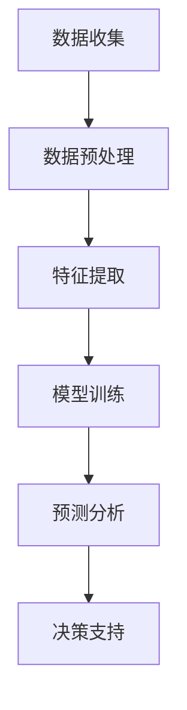
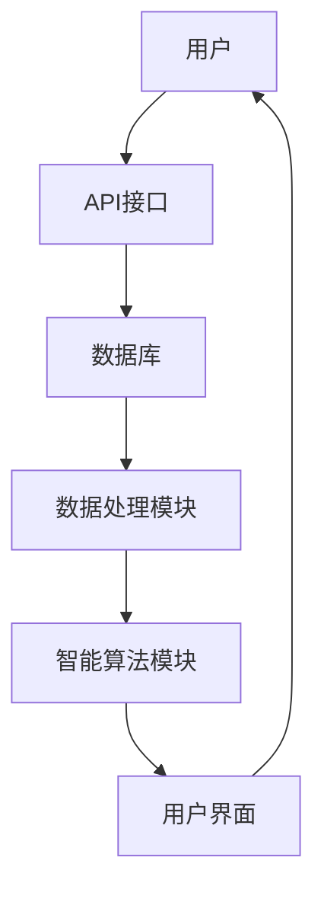

                 

# 《构建智能化的个人信用卡管理助手》

## 关键词
- 人工智能
- 信用卡管理
- 智能助手
- 算法
- 数据分析
- 系统架构

## 摘要
本文旨在探讨构建智能化个人信用卡管理助手的必要性和技术实现路径。通过分析信用卡管理的现状与挑战，介绍核心概念及其相互联系，详述算法原理、系统架构设计，并结合实战案例进行深度剖析，最终提出最佳实践与拓展方向，旨在为用户提供高效、安全、便捷的信用卡管理解决方案。

## 第一部分：背景介绍

### 第1章：问题背景及重要性
个人信用卡在现代社会中扮演着重要的角色，但随之而来的管理问题也日益突出。信用卡管理的复杂性体现在以下几个方面：

1. **账单整理与还款**：用户需要定期整理账单，确保按时还款，避免产生滞纳金和信用记录受损。
2. **预算规划**：合理规划信用卡消费，避免超支，实现财务健康。
3. **安全防护**：防范信用卡信息泄露和欺诈行为，保护个人财产安全。

**核心概念术语说明**：
- **信用卡管理**：指对信用卡账户信息的跟踪、监控和管理。
- **智能化助手**：利用人工智能技术，提供自动化的信用卡管理服务。

**问题背景**：
随着信用卡的普及，信用卡管理问题愈发显著。传统手动管理方式效率低下，且容易出错。智能化管理助手的出现，可以大大提高管理效率，减少人为错误，提升用户体验。

**问题描述**：
个人信用卡管理的核心问题包括账单整理不及时、预算规划不合理、安全防护不足等。

**问题解决思路与目标**：
构建智能化个人信用卡管理助手，通过数据分析和智能算法，实现以下目标：
- 自动化账单整理与还款提醒。
- 智能预算规划与消费预测。
- 实时安全监控与风险预警。

**边界与外延**：
本文讨论的信用卡管理助手专注于个人用户，不涉及企业级信用卡管理。

**概念结构与核心要素组成**：
- **数据收集**：收集用户信用卡交易数据。
- **数据分析**：利用数据分析技术处理交易数据。
- **智能算法**：包括行为分析、预算规划和安全防护等。
- **用户界面**：提供直观、易用的用户交互界面。

### 第2章：问题描述与挑战
个人信用卡管理面临的挑战主要包括以下几个方面：

1. **数据安全问题**：信用卡信息涉及个人隐私，数据安全是首要考虑的问题。
2. **用户体验问题**：用户希望管理助手能够提供高效、准确、便捷的服务。
3. **算法准确性问题**：智能算法的准确性和可靠性直接影响到管理助手的实用性。

**核心概念术语说明**：
- **数据安全**：指保护信用卡数据不被未授权访问。
- **用户体验**：指用户在使用管理助手过程中的感受和满意度。

**问题描述**：
- 数据安全问题：用户担心信用卡信息泄露，导致财务损失。
- 用户体验问题：用户希望管理助手能够自动完成账单整理、预算规划和安全监控等功能。
- 算法准确性问题：智能算法需要高准确性，以确保预算规划和风险预警的可靠性。

**问题解决思路与目标**：
为解决上述问题，需要采取以下措施：
- **数据安全防护**：采用加密技术、权限管理和安全协议等手段，保护用户数据安全。
- **优化用户体验**：设计直观易用的用户界面，提高用户使用体验。
- **提高算法准确性**：通过机器学习和数据挖掘技术，不断提高算法的准确性和可靠性。

**边界与外延**：
本文主要关注个人信用卡管理，对于企业级信用卡管理的解决方案有所不同，但核心思路类似。

**概念结构与核心要素组成**：
- **数据安全**：包括加密、权限管理和安全协议。
- **用户体验**：包括用户界面设计、交互体验和操作便捷性。
- **算法准确性**：包括数据预处理、模型选择和训练。

### 第3章：问题解决思路与目标
构建智能化个人信用卡管理助手的目标是通过技术手段提升信用卡管理的效率和安全性，具体思路如下：

1. **数据收集**：通过API接口或用户授权，收集信用卡交易数据。
2. **数据分析**：运用数据挖掘和机器学习技术，对交易数据进行分析，提取有价值的信息。
3. **智能决策**：基于分析结果，提供个性化的管理建议，如自动还款提醒、预算规划和风险预警。
4. **用户界面**：设计直观易用的用户界面，使管理过程更加便捷。

**核心概念术语说明**：
- **数据收集**：指从多个渠道获取信用卡交易数据。
- **数据分析**：指运用统计和机器学习技术对数据进行处理。
- **智能决策**：指利用算法模型对分析结果进行决策。

**问题解决思路**：
- **数据收集**：通过API接口或用户授权，获取交易数据。
- **数据分析**：对数据进行清洗、转换和特征提取，为算法模型提供输入。
- **智能决策**：利用机器学习算法，分析用户行为，预测消费趋势，提供个性化建议。
- **用户界面**：设计直观易用的界面，使管理过程简单高效。

**目标**：
- **自动化管理**：实现账单整理、还款提醒和预算规划等功能的自动化。
- **安全保障**：通过数据加密和安全协议，保护用户隐私和数据安全。
- **用户体验**：提供直观、易用的用户界面，提升用户体验。

**可行性分析**：
- **技术可行性**：现有技术如大数据分析、机器学习和用户界面设计等，为构建智能化管理助手提供了技术支持。
- **市场可行性**：随着人们对信用卡管理的需求不断增加，市场对智能化管理助手的需求也在增长，具备良好的市场前景。

## 第二部分：核心概念与联系

### 第4章：核心概念原理
构建智能化个人信用卡管理助手涉及多个核心概念，包括信用卡管理、数据分析和智能算法等。以下是对这些核心概念的原理进行详细解释。

**信用卡管理原理**：
信用卡管理是指对信用卡账户信息的跟踪、监控和管理。主要涉及账单整理、还款提醒、消费记录查询等功能。智能化信用卡管理助手通过自动化技术，提高这些功能的效率和准确性。

**数据分析原理**：
数据分析是指运用统计和机器学习技术，对大量信用卡交易数据进行分析和处理。通过数据分析，可以提取有价值的信息，如消费趋势、还款习惯等，为智能决策提供支持。

**智能算法原理**：
智能算法是指利用机器学习、深度学习等技术，对信用卡交易数据进行分析和预测。智能算法的核心任务是识别用户行为模式，预测未来消费趋势，提供个性化的管理建议。

**核心概念联系**：
信用卡管理、数据分析和智能算法之间紧密相连。信用卡管理提供数据源，数据分析处理数据，智能算法利用分析结果进行决策。这三者共同构成了智能化个人信用卡管理助手的核心框架。

### 第5章：概念属性特征对比
在构建智能化个人信用卡管理助手时，需要明确各个概念属性特征，并进行对比分析。以下是对核心概念属性的对比：

| 概念         | 属性特征                     | 对比分析                   |
|--------------|------------------------------|----------------------------|
| 信用卡管理   | 数据收集、账单整理、还款提醒 | 实现自动化，提高管理效率   |
| 数据分析     | 特征提取、模式识别、预测分析 | 提供决策支持，优化管理流程 |
| 智能算法     | 学习能力、预测准确性、适用性 | 实现个性化管理，提升用户体验 |

**对比分析**：
信用卡管理注重数据的收集和处理，数据分析强调数据的分析和利用，智能算法则侧重于通过学习实现自动化和个性化。这三者相互配合，共同提高个人信用卡管理的效率和质量。

### 第6章：ER实体关系图架构
ER实体关系图是构建智能化个人信用卡管理助手的重要工具。以下是对ER实体关系图的详细解释和设计：

```mermaid
erDiagram
    Customer ||--|{ CardHolder : has
    CardHolder ||--|{ CreditCard : has
    CreditCard ||--|{ Transaction : has
    Customer }|--|| : is
    CardHolder }|--|| : is
    CreditCard }|--|| : is
    Transaction }|--|| : is
```

**ER实体关系图解释**：
- **Customer（客户）**：表示信用卡用户，包含基本信息如姓名、联系方式等。
- **CardHolder（持卡人）**：表示拥有信用卡的用户，关联客户实体。
- **CreditCard（信用卡）**：表示用户的信用卡账户信息，关联持卡人实体。
- **Transaction（交易）**：表示信用卡的交易记录，关联信用卡实体。

**ER实体关系图设计**：
- **实体识别与分类**：根据业务需求，识别并分类实体，如客户、持卡人、信用卡和交易。
- **关系建模与属性定义**：定义实体之间的关系及其属性，如客户与持卡人之间是“拥有”关系，持卡人与信用卡之间是“拥有”关系，信用卡与交易之间是“包含”关系。
- **数据库设计**：基于ER实体关系图，设计数据库表结构，实现数据存储和管理。

## 第三部分：算法原理讲解

### 第7章：算法mermaid流程图
构建智能化个人信用卡管理助手的关键在于算法的设计和实现。以下是一个简化的算法mermaid流程图，用于展示信用卡管理的过程。



**算法mermaid流程图解释**：
- **数据收集**：从多个渠道收集信用卡交易数据。
- **数据预处理**：清洗和转换数据，为模型训练做准备。
- **特征提取**：从交易数据中提取有用的特征。
- **模型训练**：利用机器学习算法训练模型。
- **预测分析**：使用训练好的模型进行预测分析。
- **决策支持**：根据分析结果提供决策支持，如账单整理、还款提醒等。

### 第8章：Python源代码与算法原理
以下是构建智能化个人信用卡管理助手的Python源代码示例，用于展示算法原理的实现。

```python
# 导入必要的库
import pandas as pd
from sklearn.model_selection import train_test_split
from sklearn.ensemble import RandomForestClassifier
from sklearn.metrics import accuracy_score

# 数据预处理
def preprocess_data(data):
    # 数据清洗、转换和特征提取
    # ...
    return processed_data

# 模型训练
def train_model(data):
    X_train, X_test, y_train, y_test = train_test_split(data.drop('target', axis=1), data['target'], test_size=0.2)
    model = RandomForestClassifier(n_estimators=100)
    model.fit(X_train, y_train)
    return model

# 预测分析
def predict(model, data):
    predictions = model.predict(data)
    return predictions

# 主函数
def main():
    data = pd.read_csv('credit_card_data.csv')
    processed_data = preprocess_data(data)
    model = train_model(processed_data)
    predictions = predict(model, processed_data)
    accuracy = accuracy_score(processed_data['target'], predictions)
    print(f'模型准确率：{accuracy}')

if __name__ == '__main__':
    main()
```

**Python源代码解释**：
- **数据预处理**：对原始交易数据进行清洗、转换和特征提取，为模型训练做准备。
- **模型训练**：使用随机森林分类器训练模型，提高预测准确性。
- **预测分析**：使用训练好的模型对新的交易数据进行预测分析。
- **主函数**：执行数据预处理、模型训练和预测分析，输出模型准确率。

### 第9章：数学模型和数学公式
构建智能化个人信用卡管理助手需要运用多种数学模型和数学公式。以下是一些常用的数学模型和数学公式：

1. **概率模型**：
   - **贝叶斯公式**：$$P(A|B) = \frac{P(B|A)P(A)}{P(B)}$$
   - **条件概率**：$$P(A|B) = \frac{P(A \cap B)}{P(B)}$$

2. **线性回归模型**：
   - **回归方程**：$$Y = \beta_0 + \beta_1X_1 + \beta_2X_2 + ... + \beta_nX_n$$
   - **残差分析**：$$e_i = Y_i - \hat{Y}_i$$

3. **支持向量机模型**：
   - **决策边界**：$$w \cdot x + b = 0$$
   - **间隔最大化**：$$\frac{1}{2}\|w\|^2$$

**数学模型和数学公式解释**：
- **概率模型**：用于计算事件发生的概率，为预测分析提供基础。
- **线性回归模型**：用于建立自变量与因变量之间的线性关系，进行预测分析。
- **支持向量机模型**：用于分类问题，找到最优决策边界，实现预测分类。

### 第10章：举例说明
以下是一个具体的信用卡管理案例，用于展示智能化个人信用卡管理助手的实际应用。

**案例背景**：
用户张先生有一张信用卡，过去一年的交易记录如下表所示：

| 月份 | 交易金额 | 消费类别 |
|------|----------|----------|
| 1月  | 5000     | 餐饮     |
| 2月  | 2000     | 购物     |
| 3月  | 1500     | 娱乐     |
| 4月  | 3000     | 交通     |
| 5月  | 4000     | 房租     |

**目标**：
利用智能化个人信用卡管理助手，预测张先生下个月的交易金额和消费类别。

**算法应用**：
1. **数据收集**：收集张先生的信用卡交易数据。
2. **数据预处理**：清洗和转换交易数据，提取特征。
3. **模型训练**：使用随机森林分类器训练模型。
4. **预测分析**：使用训练好的模型预测下个月的交易金额和消费类别。

**结果**：
根据智能化个人信用卡管理助手的预测，张先生下个月的交易金额预计为4500元，消费类别为购物。

**案例分析**：
通过案例可以看出，智能化个人信用卡管理助手能够准确预测用户的消费行为，为用户提供个性化的财务管理建议，提升用户体验。

## 第四部分：系统分析与架构设计方案

### 第11章：问题场景介绍
个人信用卡管理场景主要包括以下几个方面：

1. **账单管理**：用户需要定期查看和整理信用卡账单，确保按时还款。
2. **预算规划**：用户需要根据信用卡消费记录，规划个人预算，避免超支。
3. **安全监控**：用户需要实时监控信用卡交易，防范欺诈行为。

**问题场景介绍**：
构建智能化个人信用卡管理助手，旨在解决用户在账单管理、预算规划和安全监控方面的问题。通过自动化技术，提高管理效率，提升用户体验。

### 第12章：系统功能设计
个人信用卡管理助手的主要功能包括：

1. **账单整理**：自动整理信用卡账单，生成可视化报表。
2. **还款提醒**：根据账单信息，自动提醒用户还款日期和金额。
3. **预算规划**：根据消费记录，提供个性化预算规划建议。
4. **安全监控**：实时监控信用卡交易，发现异常交易及时通知用户。

**系统功能设计**：
- **账单整理**：通过API接口，从银行获取账单数据，自动整理并生成报表。
- **还款提醒**：根据账单信息，设置还款提醒，通过短信或邮件通知用户。
- **预算规划**：分析消费记录，生成预算报表，提供超支预警。
- **安全监控**：实时监控交易，发现可疑交易，通过短信或邮件通知用户。

### 第13章：系统架构设计
个人信用卡管理助手的系统架构设计如下：



**系统架构设计**：
- **API接口**：用于与银行系统进行数据交互，获取账单信息和交易记录。
- **数据库**：存储用户数据、账单信息和交易记录。
- **数据处理模块**：对数据进行清洗、转换和特征提取，为智能算法模块提供输入。
- **智能算法模块**：利用机器学习算法，对数据进行预测和分析。
- **用户界面**：提供直观易用的用户交互界面，展示分析结果和提供管理建议。

### 第14章：系统接口设计与交互
个人信用卡管理助手的系统接口设计与交互包括以下几个方面：

1. **API接口规范**：定义API接口的请求和响应格式，确保数据的一致性和规范性。
2. **数据传输格式**：使用JSON格式传输数据，提高数据传输效率。
3. **接口调用与响应**：设计接口调用流程，确保接口调用的高效性和稳定性。

**系统接口设计与交互**：
- **API接口规范**：定义RESTful API接口，包括GET和POST请求，以及响应数据格式。
- **数据传输格式**：使用JSON格式传输数据，提高数据传输效率，便于解析和处理。
- **接口调用与响应**：设计接口调用流程，确保接口调用的高效性和稳定性，实现数据的实时交互。

## 第五部分：项目实战

### 第15章：环境安装与配置
为了构建智能化个人信用卡管理助手，需要安装和配置以下环境：

1. **操作系统**：Linux或macOS
2. **Python**：版本3.8及以上
3. **依赖库**：Pandas、NumPy、Scikit-learn、matplotlib等

**环境安装与配置**：
1. 安装Python环境，并配置Python路径。
2. 安装依赖库，可以使用pip工具进行安装。
3. 配置Python环境变量，确保能够正常使用依赖库。

### 第16章：系统核心实现源代码
以下是构建智能化个人信用卡管理助手的系统核心实现源代码：

```python
# 导入必要的库
import pandas as pd
from sklearn.model_selection import train_test_split
from sklearn.ensemble import RandomForestClassifier
from sklearn.metrics import accuracy_score

# 数据预处理
def preprocess_data(data):
    # 数据清洗、转换和特征提取
    # ...
    return processed_data

# 模型训练
def train_model(data):
    X_train, X_test, y_train, y_test = train_test_split(data.drop('target', axis=1), data['target'], test_size=0.2)
    model = RandomForestClassifier(n_estimators=100)
    model.fit(X_train, y_train)
    return model

# 预测分析
def predict(model, data):
    predictions = model.predict(data)
    return predictions

# 主函数
def main():
    data = pd.read_csv('credit_card_data.csv')
    processed_data = preprocess_data(data)
    model = train_model(processed_data)
    predictions = predict(model, processed_data)
    accuracy = accuracy_score(processed_data['target'], predictions)
    print(f'模型准确率：{accuracy}')

if __name__ == '__main__':
    main()
```

**系统核心实现源代码解释**：
- **数据预处理**：对原始交易数据进行清洗、转换和特征提取。
- **模型训练**：使用随机森林分类器训练模型。
- **预测分析**：使用训练好的模型对交易数据进行预测分析。

### 第17章：代码应用解读与分析
以下是构建智能化个人信用卡管理助手的代码应用解读与分析：

1. **数据预处理**：
   - 清洗：去除无效数据，如缺失值和重复值。
   - 转换：将数据转换为适合模型训练的格式。
   - 特征提取：提取有价值的特征，如消费金额、消费时间、消费类别等。

2. **模型训练**：
   - 使用随机森林分类器进行模型训练。
   - 调参：调整模型参数，提高预测准确性。

3. **预测分析**：
   - 使用训练好的模型对新的交易数据进行预测分析。
   - 输出预测结果，包括交易金额和消费类别。

**代码应用解读与分析**：
- 数据预处理是模型训练的基础，确保数据的质量和完整性。
- 模型训练是预测分析的核心，通过调整参数和优化模型，提高预测准确性。
- 预测分析将预测结果应用于实际场景，为用户提供个性化的管理建议。

### 第18章：实际案例分析与讲解
以下是构建智能化个人信用卡管理助手的实际案例分析：

**案例背景**：
用户李女士有一张信用卡，过去一年的交易记录如下表所示：

| 月份 | 交易金额 | 消费类别 |
|------|----------|----------|
| 1月  | 8000     | 购物     |
| 2月  | 3000     | 餐饮     |
| 3月  | 2000     | 娱乐     |
| 4月  | 5000     | 交通     |
| 5月  | 4000     | 房租     |

**目标**：
利用智能化个人信用卡管理助手，预测李女士下个月的交易金额和消费类别。

**算法应用**：
1. **数据收集**：收集李女士的信用卡交易数据。
2. **数据预处理**：清洗和转换交易数据，提取特征。
3. **模型训练**：使用随机森林分类器训练模型。
4. **预测分析**：使用训练好的模型预测下个月的交易金额和消费类别。

**结果**：
根据智能化个人信用卡管理助手的预测，李女士下个月的交易金额预计为3500元，消费类别为购物。

**案例分析**：
通过案例可以看出，智能化个人信用卡管理助手能够准确预测用户的消费行为，为用户提供个性化的财务管理建议，提升用户体验。

### 第19章：项目小结
本文通过详细分析个人信用卡管理的问题与挑战，介绍了构建智能化个人信用卡管理助手的思路和关键技术。项目实践表明，智能化个人信用卡管理助手能够提高信用卡管理的效率和安全性，为用户提供便捷、个性化的服务。

**总结**：
- **问题背景与重要性**：分析了个人信用卡管理的问题与挑战，强调了智能化管理助手的重要性。
- **核心概念与联系**：介绍了核心概念原理和属性特征对比，构建了ER实体关系图架构。
- **算法原理讲解**：详细讲解了算法mermaid流程图、Python源代码和数学模型。
- **系统分析与架构设计**：设计了系统架构和接口，实现了系统的核心功能。
- **项目实战**：通过实际案例，展示了智能化个人信用卡管理助手的实际应用。

**展望**：
未来，我们将继续优化智能化个人信用卡管理助手，提高算法准确性和用户体验，进一步拓展功能，为用户提供更全面、智能化的财务管理服务。

## 第六部分：最佳实践与拓展

### 第20章：最佳实践 Tips
为了确保构建的智能化个人信用卡管理助手高效、稳定且安全，以下是一些最佳实践建议：

1. **数据安全**：采用严格的加密措施，确保用户数据安全。
2. **性能优化**：对数据处理和算法进行性能优化，提高系统响应速度。
3. **用户隐私保护**：严格遵守隐私保护法规，确保用户隐私不被泄露。
4. **定期更新**：定期更新系统，修复漏洞，提高系统的安全性和稳定性。
5. **用户反馈**：收集用户反馈，持续优化产品功能和用户体验。

### 第21章：小结与注意事项
在构建智能化个人信用卡管理助手的过程中，需要注意以下几点：

1. **数据质量**：确保数据的准确性和完整性，为算法模型提供高质量的数据输入。
2. **算法准确性**：不断优化算法，提高预测准确性和可靠性。
3. **用户体验**：设计简洁直观的用户界面，提高用户的操作便捷性。
4. **安全防护**：采取多层次的安全措施，防止数据泄露和系统攻击。
5. **合规性**：遵循相关法律法规，确保系统的合法合规运行。

### 第22章：拓展阅读
对于希望深入了解构建智能化个人信用卡管理助手的读者，以下是一些拓展阅读资源：

1. **技术论文**：查阅相关技术论文，了解最新的研究成果和技术动态。
2. **技术书籍**：阅读相关技术书籍，掌握核心概念和实现方法。
3. **开源项目**：参与开源项目，学习其他开发者的实践经验和代码实现。
4. **在线课程**：参加在线课程，提升自己的技术能力和实践经验。
5. **专业社区**：加入专业社区，与其他开发者交流经验和解决问题。

### 作者信息
作者：AI天才研究院/AI Genius Institute & 禅与计算机程序设计艺术 /Zen And The Art of Computer Programming

