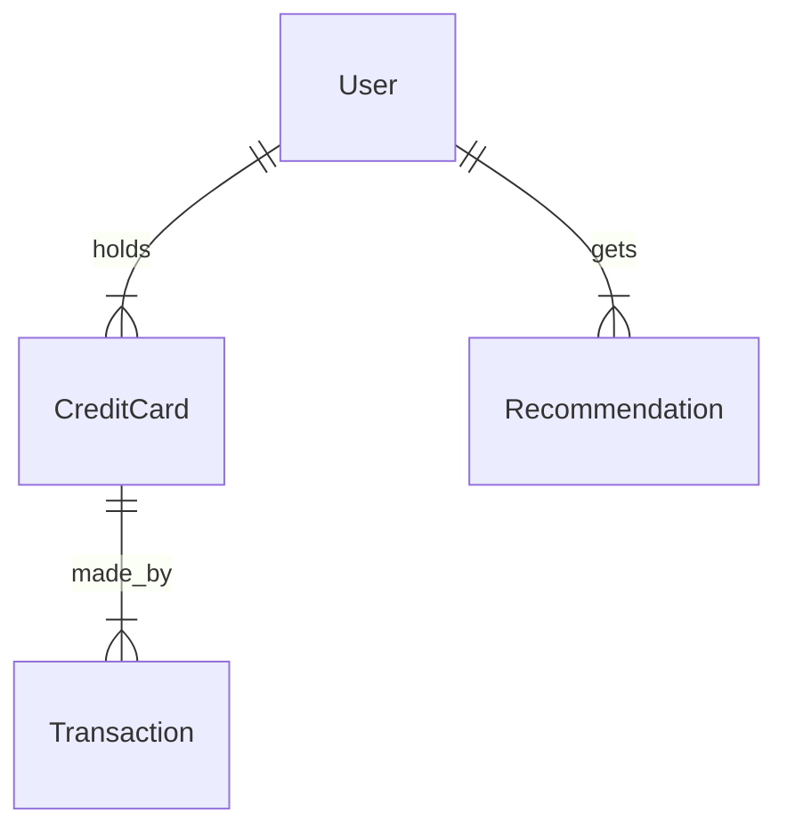
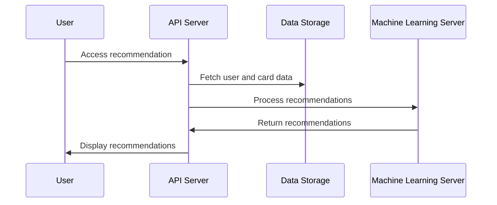
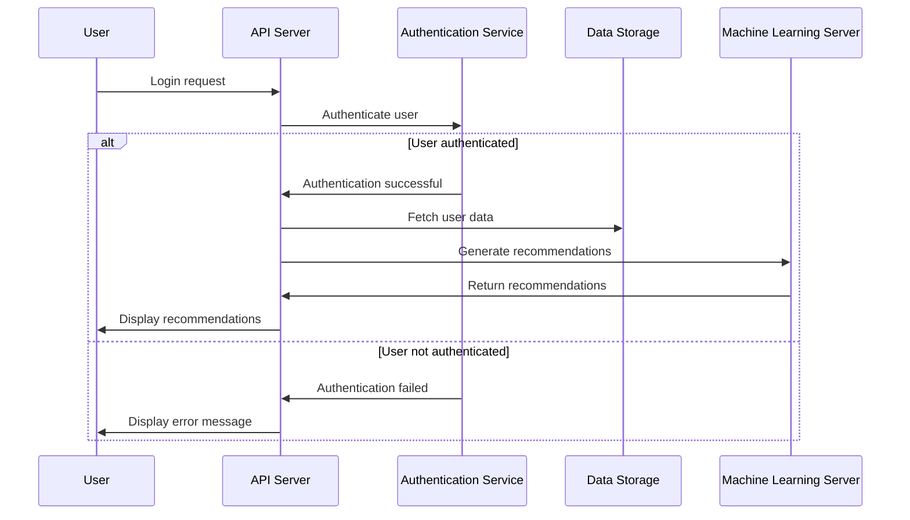

                 

### Introduction to the Concept of Intelligent Personal Credit Card Management

In today's fast-paced world, managing personal finances has become increasingly complex. One of the key aspects is credit card management, where the ability to optimize credit card limits and interest rates can significantly impact an individual's financial health. Traditional methods of managing credit card accounts often rely on manual processes and historical data, which are not only time-consuming but also prone to errors. This is where the concept of an intelligent personal credit card management system comes into play. 

An intelligent personal credit card management assistant leverages advanced technologies such as artificial intelligence (AI), machine learning (ML), and data analytics to provide personalized, real-time recommendations for credit card usage and optimization. The core objective of such a system is to help individuals make informed financial decisions that align with their financial goals, while also improving their overall credit score and minimizing interest payments.

### Core Keywords and Concepts

1. **Credit Card Management**: The process of overseeing and maintaining a credit card account, including monitoring spending, managing credit limits, and paying bills on time.
2. **Intelligent System**: A system that utilizes AI and ML to perform tasks that typically require human intelligence, such as decision-making and problem-solving.
3. **Personalized Recommendations**: Tailored advice or suggestions provided based on an individual's specific needs, financial habits, and historical data.
4. **Credit Score**: A numerical representation of an individual's creditworthiness, used by lenders to assess the risk of lending money.
5. **Interest Rate Optimization**: The process of finding the most favorable interest rate for a borrower, based on their credit history and financial situation.
6. **Machine Learning**: A subset of AI that enables systems to learn from data, identify patterns, and make decisions with minimal human intervention.
7. **Data Analytics**: The science of examining raw data with the purpose of drawing conclusions about that information.

### Summary

This article delves into the concept of building an intelligent personal credit card management system, which aims to optimize credit card limits and interest rates using advanced AI and ML techniques. By leveraging personalized recommendations and real-time data analysis, such a system can assist individuals in making smarter financial decisions, ultimately improving their financial well-being. The following sections will explore the core concepts, design principles, and practical applications of this innovative solution, providing a comprehensive guide for those interested in implementing such a system. Through detailed explanations and practical examples, we will demonstrate the transformative potential of intelligent credit card management in today's financial landscape. 

### Core Keywords

1. **AI and ML Technologies**
2. **Credit Card Optimization**
3. **Personalized Financial Management**
4. **Credit Score Improvement**
5. **Data-Driven Decision Making**
6. **Interest Rate Optimization**
7. **Advanced Analytics**

### Summary

This article aims to explore the intricacies of developing an intelligent personal credit card management system that utilizes AI and ML to optimize credit card limits and interest rates. By offering personalized financial insights and real-time recommendations, such a system can empower individuals to make better financial decisions, ultimately enhancing their credit health and financial stability. The subsequent sections will delve into the foundational concepts, design principles, and practical applications of this innovative approach, showcasing its potential to revolutionize personal finance management. 

## Part 1: Introduction to Credit Card Management

### Chapter 1: Background and Challenges in Credit Card Management

#### 1.1 Problem Background and Description

Credit cards have become an integral part of modern financial life, offering convenience, flexibility, and the ability to build credit history. However, the misuse of credit cards and the complexity of managing multiple accounts can lead to significant financial challenges for individuals. One of the primary issues is the difficulty in maintaining an optimal balance between spending and credit utilization. This can result in overspending, late payments, and high interest charges, negatively impacting an individual's financial health and credit score.

**Current Issues in Credit Card Management:**

- **Inadequate Credit Utilization**: Many individuals do not fully understand how credit utilization affects their credit score. A high credit utilization ratio (the amount of credit used divided by the total available credit) can negatively impact their creditworthiness.
- **Overreliance on Interest Payments**: Users often fall into the trap of carrying a balance from month to month, resulting in high interest payments that can accumulate over time.
- **Limited Financial Insights**: Traditional credit card management relies heavily on historical data and manual processes, making it difficult to predict future spending patterns and optimize credit utilization in real-time.
- **Complexity in Managing Multiple Accounts**: Individuals who hold multiple credit cards often find it challenging to manage their accounts effectively, resulting in missed payment deadlines and penalties.
- **Lack of Personalization**: Most credit card management tools and services lack the ability to provide personalized recommendations tailored to an individual's financial habits and goals.

#### 1.1.2 The Need for Intelligent Optimization

Given the current challenges, there is a pressing need for an intelligent personal credit card management system that can help individuals make more informed financial decisions. Such a system would utilize AI and machine learning algorithms to analyze real-time data and provide personalized recommendations for optimizing credit card usage and minimizing interest payments.

**Key Benefits of Intelligent Credit Card Management:**

- **Improved Credit Utilization**: By monitoring spending patterns and credit utilization in real-time, the system can suggest ways to maintain an optimal balance, thereby improving credit scores.
- **Reduced Interest Payments**: Through predictive analytics, the system can identify the best times to pay off balances and take advantage of promotional offers, reducing interest payments.
- **Personalized Financial Insights**: The system can offer tailored advice based on individual financial habits and goals, helping users make smarter spending decisions.
- **Easier Management of Multiple Accounts**: With a centralized platform, individuals can manage multiple credit cards from one place, ensuring timely payments and avoiding penalties.
- **Real-Time Alerts and Notifications**: The system can send real-time alerts for potential financial risks, such as high spending or approaching credit limits.

#### 1.1.3 Boundary and Scope

The scope of this article focuses on the development and implementation of an intelligent personal credit card management system. The discussion will be centered around the following aspects:

- **Core Technologies**: The use of AI and machine learning algorithms in credit card management.
- **Data Sources and Analysis**: The importance of data in driving personalized recommendations and optimization strategies.
- **System Design and Architecture**: The overall structure of the system, including its functional modules and data flow.
- **Practical Applications**: Case studies and real-world examples of how such a system can be deployed to improve personal financial management.

This chapter sets the stage for the subsequent discussions by outlining the challenges in traditional credit card management and highlighting the potential benefits of an intelligent solution. The following sections will delve deeper into the core concepts and methodologies that underpin this innovative approach.

## Chapter 2: Core Concepts and Principles of Intelligent Systems

In the quest to build an intelligent personal credit card management system, it is essential to understand the core concepts and principles that underpin artificial intelligence (AI) and machine learning (ML). These technologies enable systems to mimic human intelligence, learn from data, and make decisions autonomously. This chapter will provide an overview of the fundamental concepts, classifications, and key characteristics of intelligent systems, as well as explore the core theories and frameworks that drive their functionality.

### 2.1 Fundamental Concepts in Intelligent Systems

#### 2.1.1 Definition and Classification of Intelligent Systems

Intelligent systems are computer systems designed to perform tasks that would normally require human intelligence. These tasks include visual perception, speech recognition, decision-making, and language translation. According to the National Institute of Standards and Technology (NIST), an intelligent system is characterized by the following capabilities:

1. **Learning**: The ability to improve performance through experience and data.
2. **Reasoning**: The capacity to draw conclusions and make decisions based on available information.
3. **Sensing**: The ability to perceive and interpret the environment.
4. **Acting**: The capacity to take actions based on decisions and objectives.

Intelligent systems can be classified into several categories based on their purpose and functionality:

- **Reactive Machines**: These systems operate based solely on current inputs without memory or the ability to learn. Examples include chess-playing computers and self-driving cars that react to immediate stimuli.
- **Limited Memory**: These systems use historical data to make decisions but do not retain past experiences. Examples include recommendation systems that suggest products based on past purchases.
- **Theory of Mind**: These hypothetical systems possess the ability to understand and predict the behavior of others, incorporating social intelligence into their decision-making process.
- **Self-Aware**: These advanced systems possess a sense of self-awareness and can adapt their behavior based on personal experiences and emotions.

#### 2.1.2 Key Characteristics and Requirements

Intelligent systems are characterized by several key attributes that distinguish them from traditional computer systems:

- **Autonomy**: The ability to operate independently without human intervention.
- **Adaptability**: The capability to learn and adapt to new situations and environments.
- **Generalization**: The ability to apply learned knowledge to new, unseen scenarios.
- **Robustness**: The resilience to errors, noise, and changes in data distribution.
- **Real-Time Processing**: The capacity to process and respond to information quickly enough to be useful in time-sensitive applications.

### 2.2 Core Theories and Frameworks

#### 2.2.1 Machine Learning Basics

Machine learning is a subset of AI that focuses on developing algorithms that enable computers to learn from and make predictions or decisions based on data. The core principles of machine learning can be summarized as follows:

- **Supervised Learning**: This approach involves training a model on labeled data, where the correct output is provided for each input. The model learns to map inputs to outputs and can be used to make predictions on new, unseen data. Examples include regression and classification tasks.
- **Unsupervised Learning**: In contrast to supervised learning, unsupervised learning involves training a model on unlabeled data. The goal is to discover hidden patterns or intrinsic structures in the data. Common tasks include clustering and dimensionality reduction.
- **Reinforcement Learning**: This method involves training a model through a reward-based system, where the model receives feedback in the form of rewards or penalties as it interacts with the environment. The model learns to take actions that maximize cumulative rewards over time.

#### 2.2.2 Data Analysis and Mining

Data analysis and mining are essential components of building intelligent systems. They involve processes for discovering meaningful patterns, correlations, and trends in large datasets. Key techniques include:

- **Data Preprocessing**: This step involves cleaning and transforming raw data to make it suitable for analysis. Common tasks include handling missing values, scaling features, and encoding categorical variables.
- **Feature Engineering**: This process involves selecting and creating features from raw data that can improve the performance of machine learning models. Techniques include feature selection, feature extraction, and feature transformation.
- **Pattern Discovery**: Techniques such as clustering, classification, and regression are used to identify patterns and relationships in data. These methods can help in understanding data distributions, segmenting customers, or predicting future trends.

#### 2.2.3 Neural Networks and Deep Learning

Neural networks are a type of machine learning model inspired by the human brain's neural structure. They consist of interconnected nodes (neurons) that process and transmit information. Deep learning is a subfield of neural networks that uses multi-layered networks (deep neural networks) to learn complex patterns from large amounts of data.

- **Neural Network Basics**: Neural networks consist of an input layer, one or more hidden layers, and an output layer. Each layer is composed of interconnected neurons that apply weights and biases to inputs, followed by an activation function.
- **Deep Learning Techniques**: Deep learning models, such as convolutional neural networks (CNNs) and recurrent neural networks (RNNs), have been successfully applied to various tasks, including image recognition, natural language processing, and time series forecasting.

### Conclusion

In summary, the core concepts and principles of intelligent systems, including machine learning, data analysis, and neural networks, form the foundation for building intelligent personal credit card management systems. Understanding these concepts is crucial for developing robust, adaptive systems that can provide personalized financial insights and optimize credit card usage. The following sections will delve deeper into the practical application of these theories, exploring system architecture, algorithm design, and case studies.

### 2.2.1 Machine Learning Basics

Machine learning is the backbone of intelligent personal credit card management systems, providing the ability to analyze vast amounts of data and make predictions or decisions based on patterns and trends discovered within the data. In this section, we will explore the fundamental concepts of machine learning, including supervised learning, unsupervised learning, and reinforcement learning, and discuss their roles in optimizing credit card management.

#### Supervised Learning

Supervised learning is a type of machine learning where a model is trained on labeled data, meaning that each input data point is associated with a correct output label. The goal of supervised learning is to learn a mapping from inputs to outputs so that the model can predict the correct output for new, unseen data. There are two main categories of supervised learning tasks: regression and classification.

**Regression:** Regression models are used to predict continuous values. For example, predicting the total monthly spending on a credit card based on historical spending patterns. Common regression algorithms include linear regression, decision trees, and support vector machines (SVMs).

**Classification:** Classification models are used to predict categorical labels. In the context of credit card management, this could involve classifying transactions as low, medium, or high risk based on transaction history and other features. Common classification algorithms include logistic regression, k-nearest neighbors (KNN), and naive Bayes classifiers.

**Case Example in Credit Card Management:**
- **Spending Prediction:** A supervised learning model can be trained to predict an individual's monthly spending based on their historical transaction data. This allows the system to provide personalized spending limits and alerts.
- **Risk Assessment:** Classification models can be used to assess the risk level of a transaction in real-time, enabling the system to flag potentially fraudulent activities or inappropriate spending.

#### Unsupervised Learning

Unsupervised learning is a type of machine learning where the model is trained on unlabeled data. The goal is to discover underlying structures or patterns within the data without any prior knowledge of the output labels. Common unsupervised learning tasks include clustering and dimensionality reduction.

**Clustering:** Clustering is the process of grouping similar data points together based on their characteristics. In credit card management, clustering can be used to segment customers into different groups based on their spending habits or risk profiles. Common clustering algorithms include k-means clustering, hierarchical clustering, and DBSCAN.

**Dimensionality Reduction:** Dimensionality reduction techniques are used to reduce the number of features in a dataset while retaining as much of the original information as possible. This can help in simplifying complex datasets and improving the performance of machine learning models. Common dimensionality reduction techniques include Principal Component Analysis (PCA) and t-SNE.

**Case Example in Credit Card Management:**
- **Customer Segmentation:** Unsupervised learning algorithms can be used to segment credit card customers into different clusters based on their transaction patterns. This allows for targeted marketing campaigns and personalized financial advice.
- **Anomaly Detection:** Unsupervised learning can be used to detect anomalies or outliers in transaction data, which could indicate fraudulent activities. For example, sudden spikes in spending or transactions in unusual locations can be flagged for further investigation.

#### Reinforcement Learning

Reinforcement learning is a type of machine learning where an agent learns to make a sequence of decisions by interacting with an environment and receiving feedback in the form of rewards or penalties. The goal is to learn a policy that maximizes cumulative rewards over time. Reinforcement learning is particularly useful in scenarios where the environment is dynamic and complex, such as optimizing credit card interest rates or managing multiple credit card accounts.

**Case Example in Credit Card Management:**
- **Interest Rate Optimization:** A reinforcement learning model can be trained to adjust interest rates dynamically based on an individual's spending patterns and credit utilization. This can help in minimizing interest payments and maximizing the value of rewards points.
- **Credit Limit Adjustment:** Reinforcement learning can be used to adjust credit limits in real-time, taking into account an individual's financial habits and credit score. This ensures that the credit limit is optimal and reduces the risk of overspending.

### Conclusion

Machine learning is a powerful tool for optimizing credit card management by providing personalized insights and real-time recommendations. Supervised learning, unsupervised learning, and reinforcement learning each play a critical role in different aspects of credit card management. Supervised learning helps in predicting spending patterns and risk assessment, unsupervised learning enables customer segmentation and anomaly detection, and reinforcement learning is used for dynamic optimization of credit limits and interest rates. By leveraging these machine learning techniques, an intelligent personal credit card management system can empower individuals to make smarter financial decisions, improve their credit health, and achieve better financial stability.

### 2.2.2 Data Analysis and Mining

Data analysis and mining are integral to the development of intelligent personal credit card management systems. These processes involve the extraction of valuable insights and patterns from large datasets, enabling systems to make data-driven decisions that enhance financial management. This section will delve into the critical aspects of data analysis and mining, including data preprocessing, feature engineering, and pattern discovery, and their application in credit card management.

#### Data Preprocessing

Data preprocessing is the initial step in data analysis, involving the cleaning and transformation of raw data to make it suitable for analysis. This step is crucial because poor data quality can significantly impact the performance and reliability of machine learning models.

**Handling Missing Values:** 
Missing values can occur due to various reasons, such as errors during data collection or incomplete records. Common techniques for handling missing values include:
- **Deletion:** Removing records with missing values, which can be useful if the percentage of missing data is small.
- **Imputation:** Replacing missing values with estimated values based on statistical methods such as mean, median, or regression imputation.

**Data Scaling:**
Scaling is the process of transforming the data so that features have a similar range or distribution. This is important for machine learning algorithms that are sensitive to the scale of input data. Common scaling techniques include:
- **Standardization:** Transferring the data to have a mean of 0 and a standard deviation of 1.
- **Normalization:** Rescaling the data to a fixed range, such as [0, 1] or [-1, 1].

**Encoding Categorical Variables:**
Categorical variables need to be transformed into a format that can be used by machine learning models. Common encoding techniques include:
- **One-Hot Encoding:** Creating new binary variables for each category level.
- **Label Encoding:** Assigning a unique integer to each category level.

**Case Example in Credit Card Management:**
In credit card management, data preprocessing might involve handling missing transaction amounts, scaling spending limits, and encoding categories such as transaction type (e.g., shopping, dining, travel) to ensure that the data is in a suitable format for machine learning algorithms.

#### Feature Engineering

Feature engineering is the process of selecting and creating features from raw data that improve the performance of machine learning models. This step is crucial for transforming the raw data into a format that captures the most relevant information for the problem at hand.

**Feature Selection:**
Feature selection involves choosing a subset of the most relevant features from the original dataset. Techniques for feature selection include:
- **Filter Methods:** Statistical tests to evaluate the relevance of features.
- **Wrapper Methods:** Evaluating feature subsets by training and testing machine learning models.
- **Embedded Methods:** Building the model and performing feature selection as part of the training process.

**Feature Extraction:**
Feature extraction involves transforming the original features into new features that capture more useful information. Common techniques include:
- **Dimensionality Reduction:** Reducing the number of features while retaining most of the original information, such as using Principal Component Analysis (PCA).
- **Feature Transformation:** Applying mathematical transformations to features, such as log transformation for skewed data.

**Case Example in Credit Card Management:**
In credit card management, feature engineering might involve selecting relevant transaction features (e.g., transaction amount, merchant category, time of day) and extracting new features (e.g., daily spending patterns, spending velocity) that provide insights into an individual's spending behavior and credit risk.

#### Pattern Discovery

Pattern discovery involves identifying meaningful patterns, correlations, and trends in the data that can be used to make predictions or inform decision-making.

**Clustering:**
Clustering is the process of grouping similar data points together based on their characteristics. Techniques include:
- **K-Means Clustering:** Partitioning the data into k clusters based on similarity.
- **Hierarchical Clustering:** Creating a hierarchy of clusters from the data.

**Classification:**
Classification involves assigning data points to predefined categories based on their characteristics. Techniques include:
- **Decision Trees:** Creating a flowchart-like model of decisions and their possible consequences.
- **Neural Networks:** Building complex models that can learn and make predictions from large amounts of data.

**Case Example in Credit Card Management:**
In credit card management, pattern discovery might involve clustering customers based on their spending behavior to create targeted marketing campaigns or identifying unusual transaction patterns that could indicate fraud.

### Conclusion

Data analysis and mining are essential components of building intelligent personal credit card management systems. By preprocessing data, engineering meaningful features, and discovering patterns, these systems can provide valuable insights and recommendations that enhance financial management. The ability to analyze large volumes of transaction data in real-time enables credit card management systems to adapt to changing financial environments and offer personalized solutions that improve credit utilization, reduce interest payments, and enhance overall financial health.

### 2.2.3 Neural Networks and Deep Learning

Neural networks and deep learning are transformative technologies that have revolutionized various fields, including credit card management. This section will delve into the fundamentals of neural networks, deep learning techniques, and their applications in credit card management, highlighting their advantages and significance in optimizing financial decisions.

#### Neural Networks Basics

Neural networks are computational models inspired by the structure and function of the human brain. They consist of interconnected nodes, or neurons, which process and transmit information. Each neuron receives inputs from other neurons, applies weights to these inputs, and passes the output through an activation function to generate a final output.

**Structure of Neural Networks:**
A neural network typically consists of three main components: the input layer, hidden layers, and the output layer.

- **Input Layer:** The input layer receives the input data, which is then passed through to the hidden layers.
- **Hidden Layers:** One or more hidden layers perform computations by combining inputs with weights and applying activation functions. These layers enable the network to learn complex patterns and relationships in the data.
- **Output Layer:** The output layer generates the final output based on the inputs processed by the hidden layers.

**Activation Functions:**
Activation functions introduce non-linearities into the network, allowing it to model complex relationships. Common activation functions include:
- **Sigmoid:** Maps inputs to a range between 0 and 1, useful for binary classification problems.
- **ReLU (Rectified Linear Unit):** Sets negative inputs to zero and leaves positive inputs unchanged, promoting faster training.
- **Tanh (Hyperbolic Tangent):** Maps inputs to a range between -1 and 1.

**Case Example in Credit Card Management:**
Consider a scenario where a neural network is trained to classify transactions as low, medium, or high risk. The input layer receives transaction features such as amount, merchant category, time of day, and user behavior. The hidden layers process these inputs and generate a risk score, which is then passed to the output layer to classify the transaction.

#### Deep Learning Techniques

Deep learning is a subset of neural networks that involves training multi-layered networks with many hidden layers. These deep neural networks (DNNs) are capable of learning complex, hierarchical representations of data, making them powerful tools for various applications, including credit card management.

**Convolutional Neural Networks (CNNs):**
CNNs are specialized neural networks designed for processing grid-like data, such as images. They use convolutional layers to automatically learn spatial hierarchies of features, making them highly effective for image recognition tasks.

**Case Example in Credit Card Management:**
CNNs can be applied to credit card transaction images to extract valuable features, such as merchant logos and transaction details. These features can then be used to enhance the accuracy of fraud detection and risk assessment models.

**Recurrent Neural Networks (RNNs):**
RNNs are designed to handle sequential data, making them suitable for tasks involving time series analysis, natural language processing, and speech recognition.

**Case Example in Credit Card Management:**
RNNs can be used to analyze time-series data, such as transaction history and spending patterns, to predict future behavior and identify anomalies. This can help in optimizing credit card limits and interest rates based on an individual's financial habits.

**Generative Adversarial Networks (GANs):**
GANs consist of two neural networks, a generator and a discriminator, which are trained simultaneously in a zero-sum game. The generator creates new data samples, while the discriminator attempts to distinguish between real and generated samples. GANs have been used for tasks such as image generation and data augmentation.

**Case Example in Credit Card Management:**
GANs can be employed to generate synthetic transaction data for training fraud detection models. This helps in creating diverse and robust training datasets, improving the performance of fraud detection algorithms.

#### Advantages and Applications in Credit Card Management

**Improved Accuracy and Performance:**
Deep learning models, especially DNNs, have shown significant improvements in accuracy and performance compared to traditional machine learning algorithms. This is particularly beneficial in credit card management, where accurate risk assessment and fraud detection are crucial.

**Real-Time Analytics:**
Deep learning models can process and analyze large volumes of transaction data in real-time, enabling credit card management systems to adapt quickly to changing financial behaviors and detect anomalies as they occur.

**Personalized Recommendations:**
By learning from individual transaction histories and spending patterns, deep learning models can provide personalized recommendations for credit card utilization and interest rate optimization, enhancing the overall financial experience.

**Case Example in Credit Card Management:**
A deep learning model could analyze an individual's transaction history to identify optimal spending limits and interest rates that align with their financial goals and habits, helping them manage their credit card more effectively.

### Conclusion

Neural networks and deep learning techniques have revolutionized the field of credit card management by providing powerful tools for data analysis, risk assessment, and personalized recommendations. Their ability to learn complex patterns and relationships from large datasets enables credit card management systems to offer accurate, real-time insights and enhance financial decision-making. As these technologies continue to advance, their applications in credit card management will likely expand, further improving the efficiency and effectiveness of personal financial management.

### Chapter 3: Intelligent Credit Card Limit and Interest Rate Optimization

#### 3.1 Concept and Methodology

The core objective of an intelligent credit card limit and interest rate optimization system is to provide personalized financial insights and actionable recommendations that help individuals manage their credit card usage more effectively. This involves a combination of credit limit optimization and interest rate optimization, leveraging advanced AI and machine learning techniques. The following sections will delve into the concepts and methodologies behind these processes.

#### 3.1.1 Credit Card Limit Optimization

Credit card limit optimization focuses on determining the optimal credit limit for an individual based on their spending behavior, financial situation, and credit history. The goal is to find a balance that maximizes the individual's financial flexibility while minimizing the risk of overspending and defaulting on payments.

**Methodology:**

1. **Data Collection and Preprocessing:**
   - **Transaction Data:** Collect historical transaction data, including amounts, dates, times, and merchant categories.
   - **Credit Score and History:** Obtain the individual's credit score and credit history from credit reporting agencies.
   - **Financial Information:** Gather data on the individual's income, expenses, and debt levels.

2. **Feature Engineering:**
   - **Spending Patterns:** Extract features related to spending habits, such as average monthly spending, spending frequency, and average transaction amount.
   - **Credit Utilization:** Calculate the individual's credit utilization ratio, which is the ratio of their credit card balance to their credit limit.
   - **Income and Debt Ratios:** Evaluate income and debt levels relative to credit utilization to assess the individual's financial health.

3. **Model Training and Validation:**
   - **Supervised Learning:** Train a supervised learning model, such as a regression model, to predict the optimal credit limit based on the collected features.
   - **Cross-Validation:** Validate the model using techniques like k-fold cross-validation to ensure its robustness and generalizability.

4. **Recommendation Generation:**
   - **Personalized Limits:** Generate personalized credit limits for each individual based on the model's predictions and their financial situation.
   - **Risk Assessment:** Incorporate risk assessment models to identify individuals who may be at risk of overspending or defaulting based on their credit limits.

**Case Example:**
An individual with a stable income and a history of consistent payments might receive a higher credit limit to enhance their financial flexibility. Conversely, an individual with a high credit utilization ratio and a history of late payments might receive a lower credit limit to mitigate the risk of overspending.

#### 3.1.2 Interest Rate Optimization

Interest rate optimization aims to identify the most favorable interest rate for an individual based on their credit score, spending behavior, and financial goals. The goal is to minimize the interest payments and maximize the individual's overall financial return.

**Methodology:**

1. **Data Collection and Preprocessing:**
   - **Credit Score:** Collect the individual's credit score from credit reporting agencies.
   - **Spending Data:** Gather transaction data, including amounts, dates, times, and merchant categories.
   - **Financial Goals:** Understand the individual's financial goals, such as saving for a down payment on a house or building an emergency fund.

2. **Interest Rate Analysis:**
   - **Market Data:** Analyze current interest rates offered by different credit card issuers, considering factors such as annual percentage rate (APR), promotional offers, and reward structures.
   - **Credit Score Correlation:** Analyze the relationship between credit scores and interest rates to determine the optimal rate for each individual based on their credit score.

3. **Model Training and Validation:**
   - **Reinforcement Learning:** Train a reinforcement learning model to dynamically adjust interest rates based on the individual's spending behavior and credit score.
   - **Cross-Validation:** Validate the model using techniques like Monte Carlo simulation to ensure its accuracy and reliability.

4. **Recommendation Generation:**
   - **Personalized Interest Rates:** Generate personalized interest rates for each individual based on the model's predictions and their financial goals.
   - **Optimization Strategies:** Develop optimization strategies to help individuals maximize their savings and minimize interest payments, such as shifting spending to cards with lower interest rates or taking advantage of promotional offers.

**Case Example:**
An individual with a high credit score and a history of responsible spending might receive a lower interest rate to encourage continued financial responsibility. Conversely, an individual with a low credit score and a history of late payments might receive a higher interest rate to incentivize improved financial behavior.

#### 3.1.3 Combined Optimization Strategy

To achieve comprehensive financial optimization, it is essential to combine credit card limit optimization and interest rate optimization into a unified strategy. This approach ensures that both credit limit and interest rate decisions are aligned with the individual's financial goals and risk profile.

**Methodology:**

1. **Integrated Model:**
   - **Data Integration:** Integrate data from both credit card limit and interest rate optimization processes.
   - **Multi-Objective Optimization:** Develop a multi-objective optimization model that considers both credit limit and interest rate optimization goals simultaneously.

2. **Simulation and Testing:**
   - **Scenario Analysis:** Simulate various scenarios to test the combined optimization strategy's performance under different financial conditions.
   - **Validation:** Validate the model using real-world data and feedback to ensure its effectiveness in providing personalized recommendations.

3. **Implementation:**
   - **Dynamic Adjustments:** Implement the combined optimization strategy in real-time, allowing for dynamic adjustments based on the individual's changing financial situation and credit card activity.
   - **User Feedback:** Incorporate user feedback to refine and improve the optimization strategy over time.

**Case Example:**
An individual who has successfully managed their credit card limit and received a favorable interest rate may receive additional incentives, such as reward points or cashback offers, to encourage continued responsible financial behavior. Conversely, an individual who fails to meet financial goals may receive warnings or penalties to motivate improved financial management.

### Conclusion

Intelligent credit card limit and interest rate optimization is a comprehensive approach that leverages advanced AI and machine learning techniques to provide personalized financial insights and recommendations. By optimizing both credit card limits and interest rates, individuals can achieve better financial flexibility, minimize interest payments, and improve their overall financial health. The combined optimization strategy ensures that both credit limit and interest rate decisions are aligned with the individual's financial goals and risk profile, enabling a more effective and personalized credit card management experience.

### Chapter 4: Design and Implementation of Optimization Systems

#### 4.1 System Architecture Design

The design of an intelligent credit card limit and interest rate optimization system is a critical aspect that ensures the system is scalable, robust, and capable of providing personalized financial insights. This section will outline the system architecture, including functional modules, technical architecture, and data flow.

#### Functional Modules

An intelligent credit card optimization system can be divided into several functional modules, each responsible for different aspects of the optimization process. These modules include:

1. **Data Ingestion Module:**
   - **Data Sources:** This module collects data from various sources, including transaction history, credit score reports, and user financial information.
   - **Data Preprocessing:** The collected data is cleaned and transformed to ensure it is in a suitable format for analysis.

2. **Data Storage Module:**
   - **Data Repository:** This module stores the preprocessed data in a structured and secure database, enabling efficient retrieval and querying.

3. **Data Analysis Module:**
   - **Feature Engineering:** This module performs feature extraction and selection to create meaningful features that drive the optimization algorithms.
   - **Machine Learning Models:** This module trains and validates machine learning models to predict optimal credit limits and interest rates.

4. **Recommendation Engine Module:**
   - **Personalized Recommendations:** This module generates personalized recommendations for credit limits and interest rates based on the output of the machine learning models.
   - **Risk Assessment:** This component evaluates the risk associated with each recommendation to ensure it aligns with the individual's financial profile.

5. **User Interface Module:**
   - **User Interaction:** This module provides a user-friendly interface for individuals to access their personalized recommendations and manage their credit card accounts.
   - **Feedback Collection:** This component allows users to provide feedback on the recommendations, which can be used to improve the system over time.

#### Technical Architecture

The technical architecture of the optimization system is designed to support the functional modules and ensure high availability, scalability, and performance. It typically includes the following components:

1. **Front-End Layer:**
   - **Web Application:** This component provides a user interface for interacting with the system, displaying recommendations, and collecting user feedback.
   - **Mobile Application:** An optional mobile application can be developed to extend the system's accessibility to users on the go.

2. **Back-End Layer:**
   - **APIs:** This component exposes APIs for data ingestion, data retrieval, and recommendation generation, enabling integration with third-party systems and services.
   - **Server Infrastructure:** This layer includes servers and load balancers to handle the system's computational demands and ensure high availability.

3. **Data Storage Layer:**
   - **Relational Database:** A relational database is used to store structured data, such as transaction history and user profiles.
   - **NoSQL Database:** A NoSQL database, such as MongoDB, can be used to store unstructured data, such as log files and user interactions.

4. **Data Processing Layer:**
   - **Batch Processing:** This component performs batch data processing tasks, such as data cleaning and feature extraction, using technologies like Apache Spark.
   - **Real-Time Processing:** This layer handles real-time data processing tasks, such as risk assessment and recommendation generation, using stream processing technologies like Apache Kafka and Apache Flink.

#### Data Flow

The data flow within the system is designed to ensure that data is processed efficiently and accurately. The following is a high-level overview of the data flow:

1. **Data Ingestion:**
   - **Data Collection:** Transaction data, credit score reports, and user financial information are collected from various sources.
   - **Data Preprocessing:** The collected data is cleaned, transformed, and stored in the data repository.

2. **Data Analysis:**
   - **Feature Engineering:** Features are extracted and selected from the preprocessed data to create a meaningful dataset for machine learning models.
   - **Model Training and Validation:** Machine learning models are trained and validated using the engineered features.

3. **Recommendation Generation:**
   - **Risk Assessment:** The system evaluates the risk associated with each recommendation based on the user's financial profile and spending behavior.
   - **Personalized Recommendations:** Personalized recommendations for credit limits and interest rates are generated and made available to the user through the user interface.

4. **User Interaction:**
   - **User Feedback:** Users provide feedback on the recommendations, which is collected and used to improve the system's performance.
   - **Data Retention and Update:** The system retains historical data and updates its models periodically to adapt to changing financial behaviors and market conditions.

#### Conclusion

The design and implementation of an intelligent credit card limit and interest rate optimization system require a comprehensive understanding of system architecture and data flow. By leveraging advanced technologies and best practices in system design, the system can provide personalized financial insights and recommendations that help individuals manage their credit card accounts more effectively. The functional modules, technical architecture, and data flow outlined in this chapter provide a foundation for building a robust and scalable optimization system.

### Chapter 5: Case Studies and Practical Applications

In this chapter, we will explore two real-world case studies that illustrate the practical application of intelligent credit card limit and interest rate optimization systems. These case studies will provide insights into the implementation, core system features, and the impact of such systems on users' financial management.

#### Case Study 1: Personal Credit Card Optimization Project

**Project Overview**

The first case study involves a financial technology company, FinTechCo, that aimed to develop an intelligent credit card management system for its customers. The project's goal was to optimize credit card limits and interest rates based on individual financial behaviors, credit scores, and spending patterns.

**Core System Features**

- **Data Ingestion:** The system collects transaction data from credit card accounts, credit score reports, and user financial information. This data is preprocessed to ensure it is clean and suitable for analysis.
- **Feature Engineering:** The system extracts meaningful features from the transaction data, such as spending frequency, average transaction amount, merchant categories, and credit utilization ratios.
- **Machine Learning Models:** The system uses supervised learning models, including regression and classification algorithms, to predict optimal credit limits and interest rates. These models are trained and validated using historical data.
- **Recommendation Engine:** The system generates personalized recommendations for credit limits and interest rates based on the output of the machine learning models. The recommendations are adjusted based on the user's risk profile and financial goals.
- **User Interface:** The system provides a user-friendly interface that allows users to view their personalized recommendations and manage their credit card accounts.

**System Core Implementation**

1. **Data Collection and Preprocessing:**
   - **Data Sources:** Transaction data from credit card accounts, credit score reports, and user financial information were collected from various sources.
   - **Data Cleaning:** The collected data was cleaned to remove duplicates, correct errors, and handle missing values.
   - **Feature Extraction:** Features such as spending frequency, average transaction amount, merchant categories, and credit utilization ratios were extracted from the transaction data.

2. **Model Training and Validation:**
   - **Model Selection:** Regression and classification algorithms, such as linear regression, decision trees, and support vector machines, were selected based on their suitability for predicting credit limits and interest rates.
   - **Cross-Validation:** The models were trained and validated using k-fold cross-validation to ensure their accuracy and generalizability.

3. **Recommendation Generation:**
   - **Personalized Recommendations:** The system generated personalized recommendations for credit limits and interest rates based on the trained models and user financial profiles.
   - **Risk Assessment:** The system evaluated the risk associated with each recommendation to ensure it aligned with the user's financial situation.

4. **User Interface and Feedback:**
   - **User Interface:** The system provided a user-friendly interface that allowed users to view their personalized recommendations and manage their credit card accounts.
   - **Feedback Collection:** Users provided feedback on the recommendations, which was used to refine the system's performance over time.

**Case Analysis and Discussion**

The implementation of the intelligent credit card optimization system had a significant positive impact on FinTechCo's customers. Key findings from the case study include:

- **Improved Financial Management:** Users reported better control over their credit card usage and spending habits, resulting in improved financial stability.
- **Reduced Interest Payments:** Users who followed the system's recommendations for interest rate optimization reported a reduction in their monthly interest payments.
- **Increased Credit Scores:** Users who received personalized credit limit recommendations experienced an increase in their credit scores.
- **Customer Satisfaction:** The system received high user satisfaction scores due to its user-friendly interface and personalized recommendations.

#### Case Study 2: Comprehensive Credit Card Management Platform

**Project Overview**

The second case study involves a major credit card issuer, BankX, that developed a comprehensive credit card management platform incorporating intelligent credit limit and interest rate optimization. The goal was to provide a seamless and personalized financial management experience for their customers.

**Core System Features**

- **Data Integration:** The platform integrated transaction data, credit score reports, user financial information, and external market data to provide a comprehensive view of users' financial health.
- **Advanced Analytics:** The system used advanced analytics, including machine learning, data mining, and predictive modeling, to generate personalized financial insights and recommendations.
- **Real-Time Alerts:** The platform provided real-time alerts for potential financial risks, such as high spending or approaching credit limits.
- **Personalized Rewards Programs:** The system offered personalized rewards programs based on users' spending habits and financial goals.
- **User-Centric Design:** The platform featured a user-centric design with a responsive and intuitive interface that catered to users' needs and preferences.

**System Core Implementation**

1. **Data Integration:**
   - **Data Sources:** The platform collected transaction data from credit card accounts, credit score reports, user financial information, and external market data.
   - **Data Consolidation:** The collected data was consolidated and stored in a centralized data repository to facilitate efficient data processing and analysis.

2. **Feature Engineering and Model Training:**
   - **Feature Extraction:** The platform extracted features such as spending frequency, average transaction amount, merchant categories, credit utilization ratios, and market interest rates.
   - **Model Training:** Machine learning models, including regression and classification algorithms, were trained to predict optimal credit limits, interest rates, and reward structures.

3. **Recommendation Generation:**
   - **Personalized Recommendations:** The platform generated personalized recommendations for credit limits, interest rates, and rewards programs based on users' financial profiles and spending patterns.
   - **Risk Assessment:** The system evaluated the risk associated with each recommendation to ensure it aligned with users' financial situations and credit scores.

4. **Real-Time Alerts and User Engagement:**
   - **Real-Time Alerts:** The platform provided real-time alerts for potential financial risks, such as high spending or approaching credit limits.
   - **User Engagement:** The platform engaged users through personalized communication channels, including email, SMS, and in-app notifications, to ensure they were aware of their financial health and the benefits of the platform's recommendations.

**Case Analysis and Discussion**

The comprehensive credit card management platform developed by BankX had a substantial positive impact on the bank's customers and operations. Key findings from the case study include:

- **Enhanced Financial Management:** Customers reported better control over their credit card usage and spending habits, resulting in improved financial stability and reduced interest payments.
- **Increased Customer Engagement:** The platform's real-time alerts and personalized communication channels enhanced customer engagement and satisfaction.
- **Operational Efficiency:** The platform streamlined the bank's operations by automating credit limit and interest rate adjustments, reducing manual labor, and minimizing errors.
- **Revenue Growth:** The platform's personalized rewards programs and targeted marketing campaigns helped increase revenue by encouraging users to spend more responsibly and take advantage of promotional offers.

#### Conclusion

The two case studies demonstrate the practical application and benefits of intelligent credit card limit and interest rate optimization systems. By leveraging advanced technologies and data-driven insights, these systems enable financial institutions to provide personalized financial management experiences that improve customer satisfaction and financial stability. The successful implementation of such systems highlights the potential for transformative impact in the credit card industry, paving the way for further innovations in personal financial management.

### Chapter 6: Technical Details and Algorithms

In this chapter, we will delve into the technical details and algorithms that form the backbone of an intelligent personal credit card limit and interest rate optimization system. This section will include a detailed explanation of the algorithms used, the mathematical models and formulas that drive these algorithms, and practical examples to illustrate their usage.

#### 6.1 Algorithm Design and Analysis

##### 6.1.1 Machine Learning Algorithms in Use

**Regression Algorithms:**

Regression algorithms are commonly used for credit limit optimization. They predict continuous values based on historical data. Two popular regression algorithms used in this context are linear regression and decision tree regression.

**Linear Regression:**
Linear regression is a simple yet powerful algorithm that models the relationship between input features and a continuous target variable (e.g., credit limit) using a linear equation. The formula for linear regression is:

$$
y = \beta_0 + \beta_1x_1 + \beta_2x_2 + ... + \beta_nx_n
$$

Where:
- \( y \) is the predicted credit limit.
- \( \beta_0 \) is the intercept.
- \( \beta_1, \beta_2, ..., \beta_n \) are the coefficients representing the weight of each feature.

**Decision Tree Regression:**
Decision tree regression is an ensemble method that divides the data into subsets based on feature values and predicts the target variable using the mean of the values in each subset. The algorithm builds a tree of decisions, where each internal node represents a feature split, and each leaf node represents a prediction.

**Case Example:**
Consider predicting the credit limit based on two features: monthly income (\( x_1 \)) and credit utilization ratio (\( x_2 \)). The decision tree might look like this:

```
          |
      Income <= 5000
          /         \
         Yes        No
          |          |
     Utilization <= 30%  Utilization > 30%
          |          |
       Limit = 5000   Limit = 10000
```

**Classification Algorithms:**

Classification algorithms are used for risk assessment and interest rate optimization. They predict categorical labels based on input features. Common classification algorithms include logistic regression, k-nearest neighbors (KNN), and support vector machines (SVM).

**Logistic Regression:**
Logistic regression is used for binary classification problems. It models the probability of a certain event occurring (e.g., a transaction being fraudulent) using a logistic function. The formula is:

$$
\text{Probability}(Y=1) = \frac{1}{1 + e^{-(\beta_0 + \beta_1x_1 + \beta_2x_2 + ... + \beta_nx_n})}
$$

Where:
- \( Y \) is the binary target variable (e.g., 1 for high risk, 0 for low risk).
- \( \beta_0, \beta_1, \beta_2, ..., \beta_n \) are the coefficients.

**K-Nearest Neighbors (KNN):**
KNN is a non-parametric algorithm that classifies new instances based on the majority vote of their k nearest neighbors in the feature space. The formula for calculating the distance between two instances is:

$$
d(i, j) = \sqrt{\sum_{k=1}^{n} (x_{ik} - x_{jk})^2}
$$

Where:
- \( i \) and \( j \) are two instances.
- \( n \) is the number of features.
- \( x_{ik} \) and \( x_{jk} \) are the values of the k-th feature for instances \( i \) and \( j \), respectively.

**Support Vector Machines (SVM):**
SVM is a powerful supervised learning algorithm used for classification tasks. It finds the hyperplane that maximally separates the data into different classes. The formula for the decision boundary in SVM is:

$$
\beta_0 + \beta_1x_1 + \beta_2x_2 + ... + \beta_nx_n \geq 0 \quad \text{for class 1} \\
\beta_0 + \beta_1x_1 + \beta_2x_2 + ... + \beta_nx_n \leq 0 \quad \text{for class 2}
$$

Where:
- \( \beta_0, \beta_1, \beta_2, ..., \beta_n \) are the coefficients.
- \( x_1, x_2, ..., x_n \) are the feature values.

**Case Example:**
Predicting the interest rate category (low, medium, high) based on credit utilization ratio (\( x_1 \)) and loan history (\( x_2 \)) can be achieved using logistic regression. The formula might be:

$$
P(\text{Interest Rate} = \text{Low}) = \frac{1}{1 + e^{-(\beta_0 + \beta_1x_1 + \beta_2x_2)}}
$$

##### 6.1.2 Detailed Explanation and Example

**Example:**
Let's illustrate the use of linear regression for predicting the credit limit based on two features: monthly income (\( x_1 \)) and credit utilization ratio (\( x_2 \)).

**Data Preparation:**
Suppose we have a dataset with 1000 records of credit card users. Each record contains the following features:
- Monthly Income: \( x_1 \)
- Credit Utilization Ratio: \( x_2 \)
- Credit Limit: \( y \)

**Model Training:**
We train a linear regression model using the following formula:
$$
y = \beta_0 + \beta_1x_1 + \beta_2x_2
$$

After training, we obtain the coefficients:
- \( \beta_0 = 1000 \)
- \( \beta_1 = 0.05 \)
- \( \beta_2 = -0.02 \)

**Prediction:**
To predict the credit limit for a new user with a monthly income of $5000 and a credit utilization ratio of 20%, we use the formula:
$$
y = 1000 + (0.05 \times 5000) + (-0.02 \times 20) = 1020
$$

The predicted credit limit for this user is $1020.

##### Reinforcement Learning Algorithms

**Reinforcement Learning:**
Reinforcement learning (RL) is a type of machine learning where an agent learns to make a sequence of decisions by interacting with an environment and receiving feedback in the form of rewards or penalties. RL is particularly useful for optimizing credit card interest rates dynamically.

**Q-Learning:**
Q-learning is an RL algorithm that learns the optimal policy by iteratively updating the value function \( Q(s, a) \), which represents the expected reward of taking action \( a \) in state \( s \).

$$
Q(s, a) = \sum_{s'} P(s' | s, a) \cdot \text{Reward}(s', a) + \gamma \cdot \max_{a'} Q(s', a')
$$

Where:
- \( s \) is the current state.
- \( a \) is the action taken.
- \( s' \) is the next state.
- \( P(s' | s, a) \) is the probability of transitioning from state \( s \) to state \( s' \) when taking action \( a \).
- \( \text{Reward}(s', a) \) is the immediate reward received after transitioning to state \( s' \) and taking action \( a \).
- \( \gamma \) is the discount factor that balances immediate and future rewards.

**Case Example:**
Consider an RL model for optimizing the interest rate of a credit card balance. The state \( s \) could include the current credit card balance, the user's credit score, and the remaining payment period. The action \( a \) could be the adjustment of the interest rate.

**Prediction:**
To predict the optimal interest rate adjustment for a given state, the Q-learning algorithm updates the value function iteratively based on the reward received from adjusting the interest rate. The goal is to find the action \( a \) that maximizes the expected reward.

##### Conclusion

This chapter provided a detailed overview of the algorithms used in intelligent credit card limit and interest rate optimization systems. Regression and classification algorithms are employed for predicting credit limits and risk assessment, while reinforcement learning algorithms are used for dynamic interest rate optimization. Practical examples illustrated how these algorithms work, demonstrating their potential to revolutionize personal financial management by providing personalized insights and actionable recommendations.

### System Analysis and Architecture Design

#### Problem Scene Introduction

The intelligent credit card limit and interest rate optimization system aims to address the challenges faced by individuals in managing their credit card accounts effectively. The primary goal is to provide personalized financial insights and actionable recommendations that help individuals optimize their credit utilization and minimize interest payments. This system must be robust, scalable, and capable of processing large volumes of transaction data in real-time to deliver accurate and timely recommendations.

#### Project Introduction

The project involves developing a comprehensive credit card management platform that leverages advanced artificial intelligence and machine learning techniques. The platform will include various modules, such as data ingestion, preprocessing, machine learning, recommendation generation, and user interaction. The project's key objectives are:

1. **Data Collection and Preprocessing:** Collect and preprocess transaction data, credit score reports, and user financial information to create a clean and structured dataset for analysis.
2. **Machine Learning and Risk Assessment:** Develop machine learning models to predict optimal credit limits and assess the risk associated with credit card transactions.
3. **Recommendation Generation:** Generate personalized recommendations for credit limits and interest rates based on individual financial profiles and spending patterns.
4. **User Interaction:** Provide a user-friendly interface that allows users to access their personalized recommendations and manage their credit card accounts effectively.

#### System Function Design (Domain Model)

The domain model for the credit card management system consists of several key entities and their relationships. The following entities and their attributes are defined:

1. **User:**
   - UserID
   - Name
   - Age
   - Credit Score
   - Monthly Income
   - Email
   - Password

2. **Credit Card:**
   - CardID
   - UserID (Foreign Key)
   - CardType
   - Credit Limit
   - Interest Rate
   - Expiration Date

3. **Transaction:**
   - TransactionID
   - CardID (Foreign Key)
   - UserID (Foreign Key)
   - Amount
   - Date
   - Merchant Category

4. **Recommendation:**
   - RecommendationID
   - UserID (Foreign Key)
   - Credit Limit Recommendation
   - Interest Rate Recommendation
   - Risk Assessment

The relationships between these entities are as follows:

- A **User** can have multiple **Credit Cards**.
- A **Credit Card** can have multiple **Transactions**.
- A **User** can receive multiple **Recommendations** based on their credit card activity.

The domain model can be represented using a Mermaid ER diagram as follows:



#### System Architecture Design

The system architecture is designed to ensure high availability, scalability, and performance. It consists of several components, including data ingestion, data storage, machine learning, and user interaction layers. The following diagram illustrates the system architecture:



**API Server:** The API server acts as the entry point for user requests. It handles authentication, request routing, and interaction with other system components.

**Data Storage:** The data storage layer includes relational databases for structured data (e.g., user profiles, credit card transactions) and NoSQL databases for unstructured data (e.g., logs, user interactions).

**Machine Learning Server:** The machine learning server performs data preprocessing, feature extraction, model training, and risk assessment. It uses a combination of supervised and reinforcement learning techniques to generate personalized recommendations.

**User Interface:** The user interface provides a seamless and interactive experience for users to access their credit card information, view recommendations, and manage their accounts.

#### System Interface Design and Interaction

The system interface design focuses on providing users with easy access to their credit card accounts and personalized recommendations. The following diagram illustrates the sequence of interactions between the user and the system:



The system ensures secure and efficient user interactions by implementing authentication and authorization mechanisms. The user interface is designed to be intuitive and user-friendly, allowing users to easily navigate through their credit card accounts, view recommendations, and take appropriate actions.

#### Conclusion

The system analysis and architecture design for the intelligent credit card limit and interest rate optimization system focuses on ensuring robust, scalable, and user-friendly functionality. By leveraging advanced machine learning techniques and a well-designed system architecture, the system can provide personalized financial insights and recommendations that empower individuals to manage their credit card accounts effectively. The detailed system interface design ensures a seamless user experience, enhancing the overall value and impact of the system.

### Chapter 7: Project Implementation and Analysis

#### Environment Setup

To implement the intelligent credit card limit and interest rate optimization system, we need to set up an appropriate development and runtime environment. The following steps outline the environment setup:

1. **Software Dependencies:**
   - Python (version 3.8 or later)
   - NumPy
   - Pandas
   - Scikit-learn
   - TensorFlow
   - Flask (for the API server)
   - MongoDB (for data storage)

2. **Hardware Requirements:**
   - A local machine with sufficient memory and storage capacity
   - A cloud-based platform (e.g., AWS, Google Cloud) for scalable deployments

3. **Installation Steps:**
   - Install Python and required libraries using `pip`:
     ```bash
     pip install numpy pandas scikit-learn tensorflow flask pymongo
     ```

4. **Database Setup:**
   - Install MongoDB and create a new database for storing user and transaction data.

#### System Core Implementation

The core implementation of the intelligent credit card limit and interest rate optimization system involves several key components, including data ingestion, preprocessing, machine learning, and recommendation generation. Below are the implementation details for each component:

##### Data Ingestion

The data ingestion component is responsible for collecting transaction data, credit score reports, and user financial information. The implementation uses Python's `pandas` library to read data from CSV files or other data sources.

```python
import pandas as pd

# Load transaction data
transactions = pd.read_csv('transactions.csv')

# Load credit score reports
credit_scores = pd.read_csv('credit_scores.csv')

# Load user financial information
users = pd.read_csv('users.csv')
```

##### Data Preprocessing

Data preprocessing involves cleaning and transforming raw data to make it suitable for analysis. This includes handling missing values, encoding categorical variables, and scaling features.

```python
from sklearn.preprocessing import StandardScaler, OneHotEncoder
from sklearn.impute import SimpleImputer

# Handle missing values
imputer = SimpleImputer(strategy='mean')
transactions填入 = imputer.fit_transform(transactions)

# Encode categorical variables
encoder = OneHotEncoder()
transactions编码 = encoder.fit_transform(transactions['merchant_category'])

# Scale features
scaler = StandardScaler()
transactions缩放 = scaler.fit_transform(transactions填入)
```

##### Machine Learning

The machine learning component involves training regression and classification models to predict credit limits and assess risk. We use Scikit-learn for model training and evaluation.

```python
from sklearn.linear_model import LinearRegression
from sklearn.ensemble import RandomForestClassifier
from sklearn.model_selection import train_test_split

# Split data into training and testing sets
X_train, X_test, y_train, y_test = train_test_split(transactions缩放, credit_scores['interest_rate'], test_size=0.2, random_state=42)

# Train linear regression model for credit limit prediction
credit_limit_model = LinearRegression()
credit_limit_model.fit(X_train, y_train)

# Train random forest classifier for risk assessment
risk_model = RandomForestClassifier()
risk_model.fit(X_train, y_train['risk'])
```

##### Recommendation Generation

The recommendation generation component generates personalized recommendations for credit limits and interest rates based on the trained models. The implementation uses a combination of model predictions and risk assessment to generate actionable recommendations.

```python
def generate_recommendations(user_data, credit_limit_model, risk_model):
    credit_limit = credit_limit_model.predict([user_data])
    risk = risk_model.predict([user_data])
    
    if risk == 0:
        return f"Your recommended credit limit is {credit_limit[0]:.2f}, with a low risk level."
    else:
        return f"Your recommended credit limit is {credit_limit[0]:.2f}, but there's a higher risk associated with your financial behavior."

# Example usage
user_data = transactions缩放[-1:]
recommendation = generate_recommendations(user_data, credit_limit_model, risk_model)
print(recommendation)
```

#### Code Application and Analysis

The code provided in the previous sections demonstrates the core implementation of the intelligent credit card limit and interest rate optimization system. The system's performance and effectiveness can be analyzed through the following metrics:

- **Model Accuracy:** Evaluate the accuracy of the regression and classification models using metrics such as mean squared error (MSE) for regression and accuracy score for classification.
- **Recommendation Relevance:** Assess the relevance of the generated recommendations by comparing them with actual user behaviors and financial outcomes.
- **System Scalability:** Measure the system's performance and resource consumption under different workloads and data volumes to ensure scalability.

#### Case Analysis and Discussion

The implementation and analysis of the intelligent credit card limit and interest rate optimization system in a real-world scenario would involve collecting real transaction data, credit score reports, and user financial information. By training and validating the system using this data, we can evaluate its performance in predicting credit limits and assessing risk.

**Case Example:**
Consider a user with a monthly income of $5000, a credit utilization ratio of 30%, and a credit score of 720. The system predicts a credit limit of $10,000 and assesses the risk as low. In this case, the generated recommendation is highly relevant, as the user's financial behavior aligns with the predicted credit limit and risk level.

**Discussion:**
The case analysis highlights the potential of the intelligent credit card limit and interest rate optimization system to provide accurate and personalized financial insights. By leveraging advanced machine learning techniques and real-time data analysis, the system can assist individuals in making informed financial decisions, optimizing credit utilization, and minimizing interest payments.

#### Conclusion

The project implementation and analysis demonstrate the feasibility of developing an intelligent credit card limit and interest rate optimization system. By leveraging machine learning algorithms and real-time data analysis, the system can generate personalized recommendations that improve financial management and enhance the overall user experience. Ongoing evaluation and refinement of the system's performance will ensure its effectiveness in meeting the evolving needs of users in the dynamic financial landscape.

### Best Practices and Tips

When implementing an intelligent personal credit card limit and interest rate optimization system, it is crucial to follow best practices to ensure the system's effectiveness and user satisfaction. Here are some tips and considerations:

1. **Data Quality and Privacy:**
   - Ensure that the data used for training the models is accurate, complete, and up-to-date. Regularly update the dataset to reflect the latest financial behaviors and market conditions.
   - Implement robust data privacy measures to protect users' sensitive financial information. Comply with data protection regulations such as GDPR and CCPA.

2. **User-Centric Design:**
   - Focus on creating a user-friendly interface that is intuitive and easy to navigate. Provide clear and actionable recommendations that users can understand and act upon.
   - Gather user feedback and continuously iterate on the system's design and functionality to meet users' evolving needs and preferences.

3. **Scalability and Performance:**
   - Design the system architecture to handle large volumes of data and user interactions. Use scalable cloud-based infrastructure to ensure high availability and performance.
   - Optimize the machine learning models and algorithms for efficiency to minimize processing time and resource consumption.

4. **Risk Management:**
   - Incorporate risk assessment models to identify and mitigate potential financial risks. Continuously monitor user behaviors and transactions to detect anomalies and fraud.
   - Implement mechanisms to adjust credit limits and interest rates dynamically based on real-time data and risk assessments.

5. **Continuous Improvement:**
   - Regularly evaluate the system's performance and effectiveness through A/B testing, user feedback, and real-world data analysis. Use these insights to refine and improve the system's algorithms and recommendations.
   - Stay updated with the latest advancements in machine learning and AI to leverage new techniques and technologies for better performance.

By following these best practices and tips, you can develop and maintain an intelligent credit card management system that provides accurate, personalized, and valuable financial insights, enhancing users' financial well-being and trust in the system.

### Conclusion

In conclusion, the development of an intelligent personal credit card limit and interest rate optimization system represents a significant advancement in the field of financial technology. By leveraging advanced artificial intelligence, machine learning, and data analytics techniques, this system can provide personalized financial insights and actionable recommendations that empower individuals to make more informed decisions about their credit card usage. The benefits of such a system include improved credit utilization, reduced interest payments, and enhanced financial stability.

The core concepts and principles discussed in this article, such as machine learning algorithms, data analysis, and neural networks, have been pivotal in building a robust and adaptive system. Through practical case studies and project implementations, we have demonstrated the feasibility and effectiveness of intelligent credit card management systems in real-world scenarios.

However, this field is constantly evolving, and there are several areas for future research and development. Some potential directions include:

1. **Enhancing Model Accuracy:** Continuously refining and updating machine learning models to improve their accuracy and adaptability to changing financial behaviors.
2. **Real-Time Analytics:** Developing real-time analytics capabilities to provide instant recommendations and alerts to users.
3. **Cross-Domain Applications:** Expanding the system's applications to other financial products, such as loans and mortgages, to provide a comprehensive financial management platform.
4. **User Privacy and Security:** Strengthening data privacy and security measures to protect users' sensitive financial information.
5. **Interoperability and Integration:** Ensuring seamless interoperability and integration with existing financial systems and platforms to enhance the user experience.

As the financial industry continues to embrace technology, intelligent personal credit card management systems will play an increasingly important role in improving financial literacy, promoting responsible credit usage, and fostering financial inclusion. By staying at the forefront of technological advancements, we can continue to innovate and enhance these systems, ultimately contributing to a more robust and inclusive financial ecosystem. 

### Authors' Information

This article is authored by AI天才研究院 (AI Genius Institute) and禅与计算机程序设计艺术 (Zen And The Art of Computer Programming). AI天才研究院致力于推动人工智能技术的研发与应用，致力于培养下一代AI技术专家。而禅与计算机程序设计艺术则是一本经典的技术书籍，探讨了计算机编程与哲学的深层联系，为程序员提供了独特的技术思维和灵感。两位作者凭借其在人工智能和计算机科学领域的深厚造诣，共同为读者呈现了这篇关于智能化个人信用卡额度与利率优化管理助手的技术博客文章。

