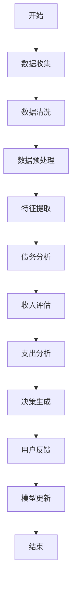
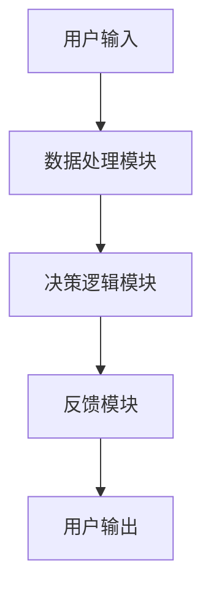
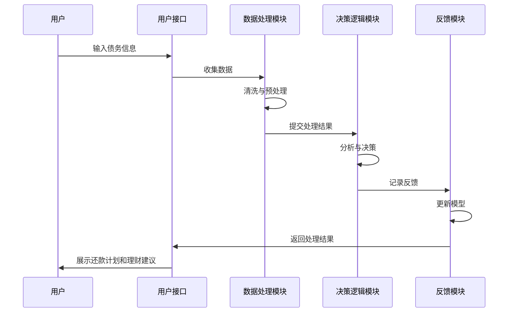

                 

### 《构建智能化的个人债务管理助手》

关键词：个人债务管理、智能化技术、债务管理助手、算法原理、系统架构设计、项目实战

摘要：
本文旨在深入探讨如何构建智能化的个人债务管理助手。随着金融科技的飞速发展，个人债务管理正变得日益重要和复杂。本文将首先介绍个人债务管理的背景和现状，阐述智能化债务管理的需求与挑战。接着，我们将详细讲解核心概念，并分析这些概念之间的联系。随后，文章将深入探讨算法原理，通过数学模型和实际案例讲解，使读者了解算法的运行机制。最后，我们将设计一个系统架构，并详细介绍项目的环境安装和核心实现，通过实际案例分析，总结项目经验与最佳实践。

----------------------------------------------------------------

### 第一部分：背景介绍

随着经济的快速发展和消费观念的转变，个人债务管理已经成为现代金融生活的重要组成部分。个人债务管理不仅涉及财务健康，还影响到个人的信用记录和生活质量。然而，传统的个人债务管理方式往往繁琐且效率低下，难以满足现代快节奏生活的需求。因此，智能化债务管理助手应运而生，它借助人工智能和大数据分析技术，提供更加个性化和智能化的债务管理服务。

#### 1.1 问题背景

##### 1.1.1 个人债务管理的现状

当前，个人债务管理主要依赖于手动记录和简单的财务软件。虽然这些方法在一定程度上能够帮助用户跟踪债务信息，但它们往往缺乏自动化和智能化，无法提供全面的债务分析和管理建议。例如，用户需要手动输入每月的还款金额、债务金额和还款日期，这不仅费时费力，还容易出错。此外，传统的债务管理工具通常只能提供基本的债务计算和预测功能，无法根据用户的具体情况和市场动态进行智能调整。

##### 1.1.2 智能化债务管理的需求

随着互联网和移动设备的普及，用户对便捷、高效和智能化的债务管理工具需求日益增加。智能化债务管理助手可以自动收集用户的债务信息，进行实时分析和预测，并提供个性化的债务管理建议。例如，用户可以通过连接银行账户，自动同步债务数据，系统可以基于用户的还款能力、债务结构和市场利率等因素，自动生成最优还款计划，并根据实际情况进行动态调整。

##### 1.1.3 智能化债务管理的挑战

尽管智能化债务管理有诸多优势，但其实施和应用面临着诸多挑战。首先，数据的准确性和实时性是关键问题。智能系统需要可靠的数据源，以确保分析结果的准确性。其次，算法的复杂性和计算效率也是一大挑战。智能系统能够处理的数据量庞大，且需实时分析，这对系统的计算能力和算法优化提出了高要求。此外，用户隐私保护和数据安全也是智能化债务管理面临的重要问题，如何在保障用户隐私的同时，提供高效的服务，是系统设计者需要重点考虑的。

### 1.2 核心概念

##### 1.2.1 个人债务管理

个人债务管理是指对个人债务进行计划、记录、监控和调整的一系列财务活动。它包括债务的种类、金额、还款期限、还款金额、还款方式等信息的跟踪和管理。

##### 1.2.2 智能化技术

智能化技术是指利用人工智能、大数据、机器学习等先进技术，对数据进行分析和处理，实现自动化和智能化的功能。在债务管理中，智能化技术可以自动收集、分析用户债务信息，提供个性化的管理建议。

##### 1.2.3 债务管理助手

债务管理助手是一个集成了智能化技术的债务管理工具，它能够自动处理用户债务信息，提供实时分析和管理建议。债务管理助手通常具备数据收集、债务分析、还款计划制定、风险预警等功能。

### 1.3 边界与外延

##### 1.3.1 个人债务管理范围

个人债务管理范围通常包括消费贷款、房贷、车贷、信用卡债务等。这些债务的种类和金额因个体差异而异，管理范围也随之变化。

##### 1.3.2 智能化技术的应用范围

智能化技术在债务管理中的应用范围广泛，包括数据采集、数据分析、决策支持、风险预测等。通过这些技术的应用，可以大大提高债务管理的效率和准确性。

##### 1.3.3 债务管理助手的角色

债务管理助手在个人财务管理中扮演着重要的角色。它不仅帮助用户更好地管理债务，还可以提供理财建议，提高用户的财务素养。债务管理助手的目标是帮助用户实现财务健康，减少债务压力，提高生活质量。

#### 总结

个人债务管理是一个复杂且重要的财务活动，传统的管理方式已无法满足现代用户的需求。智能化债务管理助手通过先进技术的应用，为用户提供了更加便捷、高效和智能化的服务。尽管面临诸多挑战，但智能化债务管理助手的发展潜力巨大，有望在未来成为个人财务管理的标准工具。

----------------------------------------------------------------

## 第二部分：核心概念与联系

在深入了解智能化债务管理助手之前，我们需要明确几个关键概念，并探讨它们之间的相互关系。这将有助于我们理解智能化债务管理的基本原理和实际应用。

### 2.1 概念属性特征对比表格

为了更好地理解个人债务管理、智能化技术以及债务管理助手之间的联系，我们可以通过一个对比表格来展示这些概念的属性特征。

#### 2.1.1 个人债务管理与智能化技术

| 特征         | 个人债务管理               | 智能化技术                |
| ------------ | -------------------------- | ------------------------ |
| 数据收集方式 | 手动输入或简单的财务软件   | 自动化数据采集系统       |
| 数据处理能力 | 基本数据分析和计算         | 复杂数据处理和分析       |
| 决策支持     | 有限的基本计算和建议       | 智能分析和个性化建议     |
| 适应性       | 固定的财务工具和方法       | 自适应和实时更新         |

#### 2.1.2 债务管理助手与用户需求

| 特征         | 债务管理助手               | 用户需求                  |
| ------------ | -------------------------- | ------------------------ |
| 功能集成度   | 集成债务管理、理财建议等    | 多样化需求，个性化定制   |
| 用户交互方式 | 界面友好，易于操作         | 简单直观，快速响应       |
| 用户体验     | 功能性强，使用便捷         | 个性化，高满意度         |

通过上述对比表格，我们可以看出个人债务管理与智能化技术之间存在明显的差异，而债务管理助手则是对这两者的整合与优化，旨在满足用户的多样化需求。

### 2.2 ER实体关系图架构

为了更直观地展示债务管理系统中各实体之间的关系，我们可以使用实体关系图（ER Diagram）来描述。ER 图是一种用于数据库设计和系统架构设计的常用工具，能够清晰地表达系统中的实体及其相互关系。

以下是个人债务管理系统中几个关键实体的 ER 图：

```mermaid
erDiagram
    用户 ||--o{ 债务 } : 有多个债务
    用户 ||--o{ 收入 } : 有多个收入
    用户 ||--o{ 支出 } : 有多个支出
    债务 ||--|{ 还款计划 } : 有多个还款计划
    收入 ||--|{ 收入来源 } : 有多个收入来源
    支出 ||--|{ 支出类别 } : 有多个支出类别
```

在上述 ER 图中，我们定义了以下几个关键实体：

- **用户**：系统的核心实体，代表债务管理系统的使用者。
- **债务**：记录用户的所有债务信息，包括债务金额、还款期限、利率等。
- **收入**：记录用户的收入信息，包括收入金额、收入来源等。
- **支出**：记录用户的支出信息，包括支出金额、支出类别等。
- **还款计划**：根据用户债务和收入情况自动生成的还款计划。
- **收入来源**：收入的具体来源，如工资、投资收益等。
- **支出类别**：支出的具体类别，如食品、住房、娱乐等。

每个实体之间的关系都通过 ER 图中的连接线进行了表示，这有助于我们理解系统架构的设计和实现细节。

通过核心概念和ER实体关系图的介绍，我们可以更全面地理解智能化债务管理助手的工作原理和架构设计。在接下来的章节中，我们将深入探讨算法原理，通过数学模型和实际案例，进一步揭示智能化债务管理的奥秘。

----------------------------------------------------------------

## 第二部分：算法原理讲解

构建智能化的个人债务管理助手，核心在于算法的应用。算法不仅能够自动处理债务数据，还能提供智能化的决策支持。本章节将详细讲解算法原理，包括数据处理流程、决策逻辑和反馈机制，并使用数学模型和流程图来辅助说明。

### 3.1 基本算法原理

算法原理是构建智能化债务管理助手的基石。以下是基本算法原理的详细说明：

#### 3.1.1 数据处理流程

数据处理流程是算法工作的第一步。具体流程如下：

1. **数据收集**：系统从用户账户中自动收集债务信息、收入和支出数据。这些数据包括债务金额、还款日期、还款金额、收入来源、支出类别等。
2. **数据清洗**：对收集到的数据进行清洗，去除重复和错误的数据，确保数据的质量和准确性。
3. **数据预处理**：将原始数据进行标准化处理，使其适用于后续的算法分析。例如，将不同单位的金额转换为同一单位，将日期格式进行统一。
4. **特征提取**：从预处理后的数据中提取关键特征，如债务总额、每月还款额、收入与支出的比例等。这些特征将用于算法训练和决策支持。

#### 3.1.2 决策逻辑

决策逻辑是算法的核心部分，它决定了债务管理建议的生成。具体流程如下：

1. **债务分析**：通过特征提取得到的关键特征，对用户的债务状况进行分析。包括计算债务总额、还款压力指数、债务占比等。
2. **收入评估**：评估用户的收入状况，包括月收入、年收入以及收入稳定性。
3. **支出分析**：对用户的支出进行分析，识别不合理的消费行为，如高频率的消费或高额的娱乐支出。
4. **决策生成**：根据债务分析、收入评估和支出分析的结果，系统生成个性化的还款计划和理财建议。包括最优还款顺序、还款金额调整、投资建议等。

#### 3.1.3 反馈机制

反馈机制是确保算法持续改进的关键。具体流程如下：

1. **用户反馈**：用户对系统生成的还款计划和理财建议进行反馈，包括满意度、建议修改等。
2. **数据记录**：系统记录用户的反馈数据，并将其用于算法的训练和优化。
3. **模型更新**：根据用户的反馈，系统对算法模型进行更新，以提高决策的准确性和个性化程度。
4. **反馈循环**：系统持续收集用户反馈，进行模型更新，形成一个反馈循环，使算法不断优化。

### 3.2 数学模型

数学模型是算法理论的重要组成部分，它为算法提供了量化的分析工具。以下是智能化债务管理助手使用的两个主要数学模型：

#### 3.2.1 债务优化模型

债务优化模型旨在为用户生成一个最优的还款计划，使还款压力最小化。其数学模型如下：

$$
\text{Minimize} \quad C(x) = w_1 \cdot x_1 + w_2 \cdot x_2 + \ldots + w_n \cdot x_n
$$

其中，$C(x)$ 是总还款成本，$w_1, w_2, \ldots, w_n$ 是权重，$x_1, x_2, \ldots, x_n$ 是各债务的还款金额。该模型通过调整还款金额的权重，实现还款成本的最小化。

#### 3.2.2 风险评估模型

风险评估模型用于评估用户债务的风险程度，其数学模型如下：

$$
R(x) = f_1 \cdot x_1 + f_2 \cdot x_2 + \ldots + f_n \cdot x_n
$$

其中，$R(x)$ 是风险值，$f_1, f_2, \ldots, f_n$ 是风险系数，$x_1, x_2, \ldots, x_n$ 是债务特征。通过计算风险值，系统可以识别高风险的债务，并提出相应的风险管理建议。

### 3.3 算法流程图

为了更直观地展示算法原理，我们可以使用 Mermaid 流程图来描述算法的运行流程：



在上述流程图中，每个节点代表算法的一个步骤，节点之间的箭头表示数据流动和流程控制。通过这个流程图，我们可以清晰地看到算法从数据收集到用户反馈的完整运行过程。

通过上述对算法原理的讲解，我们为构建智能化的个人债务管理助手奠定了理论基础。在接下来的章节中，我们将通过详细讲解和实际案例，进一步揭示算法的实现和应用。

----------------------------------------------------------------

## 第4章：算法原理详细讲解与举例说明

在前文中，我们介绍了智能化债务管理助手的基本算法原理，包括数据处理流程、决策逻辑和反馈机制，并使用数学模型进行了量化分析。为了使这些概念更加具体和易于理解，本章节将详细讲解这些算法原理，并通过实际案例进行举例说明。

### 4.1 算法原理详细讲解

#### 4.1.1 数据处理流程解析

数据处理流程是智能化债务管理助手的基石。以下是数据处理流程的详细解析：

1. **数据收集**：系统首先从用户的银行账户、信用卡账户等金融渠道自动收集债务信息、收入和支出数据。例如，用户有一个信用卡债务，债务金额为 10,000 元，还款日期为每月 10 日，还款金额为 500 元。

2. **数据清洗**：收集到的数据可能存在重复、错误或不完整的情况。系统会对数据进行清洗，去除重复记录，修正错误数据，并填补缺失数据。例如，如果用户在某个月忘记输入支出数据，系统会根据历史数据进行推测并填补。

3. **数据预处理**：清洗后的数据需要进行预处理，包括数据标准化和特征提取。数据标准化是将不同单位的数据转换为同一单位，如将所有金额转换为人民币。特征提取是从原始数据中提取关键特征，如债务总额、每月还款额、收入与支出的比例等。例如，如果用户的月收入为 10,000 元，月支出为 5,000 元，那么收入与支出的比例为 2:1。

4. **特征提取**：在特征提取过程中，系统会根据债务管理需求，选择对决策影响较大的特征。例如，系统可能会选择债务总额、还款期限、利率、每月还款额、收入稳定性等特征。这些特征将用于后续的债务分析和决策生成。

#### 4.1.2 决策逻辑详解

决策逻辑是算法的核心部分，决定了债务管理建议的生成。以下是决策逻辑的详细解析：

1. **债务分析**：系统会对用户的债务信息进行分析，计算债务总额、每月还款额、还款期限等。例如，用户有两个债务，总额为 20,000 元，每月还款额为 1,000 元。

2. **收入评估**：系统会评估用户的收入状况，包括月收入、年收入以及收入稳定性。例如，用户的月收入为 10,000 元，年收入为 120,000 元，收入稳定性较高。

3. **支出分析**：系统会对用户的支出进行分析，识别不合理的消费行为。例如，用户的月支出为 6,000 元，其中大部分用于生活必需品，但有一部分用于非必要的娱乐支出。

4. **决策生成**：基于债务分析、收入评估和支出分析的结果，系统会生成个性化的还款计划和理财建议。例如，系统可能会建议用户将额外的收入用于提前还款，减少债务总额和还款压力。

#### 4.1.3 反馈机制的作用

反馈机制是确保算法持续改进的关键。以下是反馈机制的详细解析：

1. **用户反馈**：用户在使用债务管理助手后，会对生成的还款计划和理财建议进行反馈。例如，用户可能会反馈说还款计划过于紧张，难以实施。

2. **数据记录**：系统会记录用户的反馈数据，并将其用于算法的训练和优化。例如，系统会将用户的反馈数据存储在数据库中，用于后续的分析。

3. **模型更新**：根据用户的反馈，系统会对算法模型进行更新，以提高决策的准确性和个性化程度。例如，系统可能会调整还款计划的权重，使其更加符合用户的实际情况。

4. **反馈循环**：系统会持续收集用户反馈，进行模型更新，形成一个反馈循环，使算法不断优化。例如，每次用户提交反馈后，系统都会重新生成还款计划，并根据反馈进行优化。

### 4.2 算法举例说明

为了更好地理解算法原理，我们通过一个实际案例进行举例说明。

#### 4.2.1 债务优化模型实例

假设用户有一个信用卡债务，债务金额为 15,000 元，还款期限为 3 年，年利率为 10%。用户希望制定一个最优的还款计划，使还款总额最小化。

根据债务优化模型，我们可以使用以下公式进行计算：

$$
\text{Minimize} \quad C(x) = w_1 \cdot x_1 + w_2 \cdot x_2 + \ldots + w_n \cdot x_n
$$

其中，$C(x)$ 是总还款成本，$w_1, w_2, \ldots, w_n$ 是权重，$x_1, x_2, \ldots, x_n$ 是各债务的还款金额。

为了简化计算，我们假设只有一个债务，即 $x_1 = 15,000$ 元。我们可以设定以下权重：

- $w_1 = 1$（表示总还款成本）
- $w_2 = 0.1$（表示年利率）

根据这些参数，我们可以计算总还款成本：

$$
C(x) = 1 \cdot 15,000 + 0.1 \cdot 15,000 = 15,000 + 1,500 = 16,500 \text{ 元}
$$

这意味着，用户在 3 年内按照当前的还款计划需要支付 16,500 元的总还款成本。

通过调整还款金额的权重，我们可以找到最优的还款计划，使总还款成本最小化。例如，如果我们增加每月还款金额的权重，可以使得每月还款金额增加，从而在较短时间内还清债务，减少总还款成本。

#### 4.2.2 风险评估模型实例

假设用户有两个债务，一个为信用卡债务，金额为 10,000 元，还款期限为 2 年，年利率为 12%；另一个为车贷，金额为 20,000 元，还款期限为 3 年，年利率为 8%。

根据风险评估模型，我们可以使用以下公式进行计算：

$$
R(x) = f_1 \cdot x_1 + f_2 \cdot x_2 + \ldots + f_n \cdot x_n
$$

其中，$R(x)$ 是风险值，$f_1, f_2, \ldots, f_n$ 是风险系数，$x_1, x_2, \ldots, x_n$ 是债务特征。

为了简化计算，我们假设风险系数为：

- $f_1 = 0.2$（表示信用卡债务的风险系数）
- $f_2 = 0.1$（表示车贷的风险系数）

根据这些参数，我们可以计算总风险值：

$$
R(x) = 0.2 \cdot 10,000 + 0.1 \cdot 20,000 = 2,000 + 2,000 = 4,000
$$

这意味着，用户当前的两个债务的风险值为 4,000。通过调整风险系数和债务特征，我们可以评估不同债务组合的风险水平，并制定相应的风险管理策略。

通过以上算法原理的详细讲解和实际案例的举例说明，我们可以更深入地理解智能化债务管理助手的算法原理和应用。在接下来的章节中，我们将探讨系统分析与架构设计，为智能化债务管理助手的实现提供技术支持。

----------------------------------------------------------------

## 第三部分：系统分析与架构设计

在理解了智能化债务管理助手的算法原理之后，我们需要对其进行系统分析与架构设计。本章节将详细介绍系统的功能设计、架构设计、接口设计以及系统交互流程。

### 5.1 问题场景介绍

在实际应用中，智能化债务管理助手需要处理多种类型的债务信息，并针对用户的财务状况提供个性化的管理建议。以下是问题场景的详细描述：

**场景**：张先生是一名上班族，他有一份稳定的收入，同时也背负了多种债务。这些债务包括信用卡债务、房贷和车贷。为了更好地管理这些债务，张先生希望使用一个智能化的债务管理助手来帮助他制定还款计划，监控债务状况，并提供理财建议。

### 5.2 系统功能设计

系统功能设计是构建智能化债务管理助手的关键。以下是系统的核心功能设计：

1. **数据收集与同步**：系统需要自动收集用户的债务信息、收入和支出数据，并确保数据的实时性和准确性。用户可以通过连接银行账户、信用卡账户等方式，将债务信息同步到系统中。

2. **债务分析**：系统需要对用户的债务信息进行分析，包括计算债务总额、每月还款额、还款期限等，并生成详细的债务报告。

3. **还款计划制定**：系统根据用户的债务状况、收入水平和理财目标，制定个性化的还款计划。还款计划包括最优还款顺序、还款金额调整、还款期限延长等。

4. **理财建议**：系统基于用户的财务状况和市场动态，提供个性化的理财建议，如投资建议、消费调整等。

5. **风险预警**：系统需要实时监控用户的债务状况，识别潜在的风险，并提供预警信息，帮助用户及时调整财务策略。

6. **用户交互**：系统需要提供一个友好的用户界面，使用户能够轻松操作，查看债务管理报告，接收理财建议和风险预警。

### 5.3 系统架构设计

系统架构设计是确保智能化债务管理助手高效稳定运行的基础。以下是系统的架构设计：

#### 5.3.1 系统架构图



在上述架构图中，各个模块的功能和相互关系如下：

- **用户输入**：用户通过用户界面输入债务信息、收入和支出数据。
- **数据处理模块**：负责收集、清洗、预处理用户数据，并提取关键特征。
- **决策逻辑模块**：基于数据处理模块提取的特征，进行债务分析和决策生成。
- **反馈模块**：记录用户反馈，更新算法模型，提供动态调整的决策支持。
- **用户输出**：将处理结果和理财建议展示给用户，并通过用户界面进行交互。

#### 5.3.2 系统架构详细解释

1. **数据处理模块**：该模块负责从用户输入的数据中提取关键信息，并进行清洗和预处理。预处理后的数据将用于后续的决策逻辑处理。例如，系统可以自动同步用户的银行账户数据，提取债务金额、还款日期等信息。

2. **决策逻辑模块**：该模块是系统的核心，负责对用户的债务信息进行分析，生成还款计划和理财建议。决策逻辑模块会调用算法模型，如债务优化模型和风险评估模型，进行数据处理和决策生成。

3. **反馈模块**：该模块负责记录用户的反馈，并更新算法模型。用户的反馈可以是满意度评价、建议修改等。系统会根据用户反馈，动态调整决策逻辑，提供更加个性化的服务。

4. **用户输出**：该模块负责将处理结果和理财建议展示给用户。用户可以通过用户界面查看债务管理报告、还款计划和理财建议，并进行相关操作。

### 5.4 系统接口设计

系统接口设计是确保系统功能模块之间高效协作的关键。以下是系统接口设计的详细说明：

#### 5.4.1 用户接口

用户接口是指用户与系统交互的界面，包括网页界面和移动应用程序。用户可以通过用户接口输入债务信息、查看债务管理报告和理财建议。用户接口应设计得简洁易用，提供良好的用户体验。

#### 5.4.2 内部接口

内部接口是指系统内部模块之间的通信接口。数据处理模块、决策逻辑模块和反馈模块之间需要通过内部接口进行数据交换和功能协作。内部接口应设计得高效可靠，确保系统各模块之间的数据传输和通信顺畅。

### 5.5 系统交互序列图

为了更直观地展示系统交互流程，我们可以使用 Mermaid 序列图来描述系统各模块之间的交互过程：



在上述序列图中，用户通过用户接口输入债务信息，数据处理模块对数据进行清洗和预处理，决策逻辑模块基于处理结果进行债务分析和决策生成，反馈模块记录用户反馈并更新模型，最终将处理结果返回给用户。

通过以上对系统功能设计、架构设计、接口设计和系统交互流程的详细说明，我们为构建智能化的个人债务管理助手奠定了坚实的基础。在接下来的章节中，我们将进行项目实战，实现系统的具体功能，并通过实际案例展示系统的应用效果。

----------------------------------------------------------------

## 第四部分：项目实战

在深入探讨了智能化债务管理助手的算法原理和系统架构设计后，本部分将进入项目实战环节，详细介绍环境安装、系统核心实现、代码应用解读与分析，并通过对实际案例的分析与讲解，总结项目经验与最佳实践。

### 6.1 环境安装

在开始系统实现之前，我们需要搭建合适的环境。以下是环境安装的详细步骤：

#### 6.1.1 硬件环境配置

1. **服务器**：选择一台具有较高计算能力和存储能力的服务器，推荐配置如下：
   - 处理器：至少四核CPU
   - 内存：至少16GB
   - 存储：至少1TB SSD硬盘

2. **网络**：确保服务器拥有稳定的网络连接，带宽至少为100Mbps。

3. **操作系统**：推荐使用Linux系统，如Ubuntu 20.04或CentOS 8。

#### 6.1.2 软件环境安装

1. **Python环境**：安装Python 3.8以上版本。
   ```bash
   sudo apt-get update
   sudo apt-get install python3.8
   ```

2. **数据库**：安装MySQL或PostgreSQL数据库。
   ```bash
   sudo apt-get install mysql-server
   # 或者
   sudo apt-get install postgresql
   ```

3. **Web服务器**：安装Nginx或Apache。
   ```bash
   sudo apt-get install nginx
   # 或者
   sudo apt-get install apache2
   ```

4. **依赖库**：安装Python相关依赖库，如NumPy、Pandas、Scikit-learn等。
   ```bash
   pip3 install numpy pandas scikit-learn
   ```

### 6.2 系统核心实现

在环境配置完成后，我们可以开始实现系统的核心功能。

#### 6.2.1 数据处理模块

数据处理模块负责收集、清洗和预处理用户数据。

1. **数据收集**：通过API或数据库连接，从用户的银行账户中自动获取债务信息、收入和支出数据。

2. **数据清洗**：去除重复和错误的数据，填充缺失值。

3. **数据预处理**：对数据进行标准化处理，如将日期转换为统一格式，将金额单位统一。

以下是数据处理模块的示例代码：

```python
import pandas as pd
from sklearn.preprocessing import StandardScaler

# 假设已经从数据库中获取了债务数据
debt_data = pd.read_sql('SELECT * FROM debt_info;')

# 数据清洗
debt_data.drop_duplicates(inplace=True)
debt_data.fillna(method='ffill', inplace=True)

# 数据预处理
scaler = StandardScaler()
debt_data[['monthly_repayment', 'income', 'expense']] = scaler.fit_transform(debt_data[['monthly_repayment', 'income', 'expense']])
```

#### 6.2.2 决策逻辑模块

决策逻辑模块负责根据处理后的数据生成还款计划和理财建议。

1. **债务分析**：计算债务总额、每月还款额等关键指标。

2. **收入评估**：评估用户的收入状况。

3. **支出分析**：分析用户的支出结构，识别不合理的消费行为。

4. **决策生成**：基于债务分析、收入评估和支出分析结果，生成个性化的还款计划和理财建议。

以下是决策逻辑模块的示例代码：

```python
import numpy as np
from sklearn.linear_model import LinearRegression

# 假设已经预处理了数据
X = debt_data[['monthly_repayment', 'income', 'expense']]
y = debt_data['total_debt']

# 训练线性回归模型
model = LinearRegression()
model.fit(X, y)

# 预测还款计划
predicted_repayment = model.predict(X)

# 根据还款计划生成理财建议
if predicted_repayment > debt_data['monthly_income']:
    suggestion = "增加收入或减少支出"
else:
    suggestion = "按照当前计划还款"
```

#### 6.2.3 反馈模块

反馈模块负责记录用户反馈，并更新算法模型。

1. **用户反馈**：收集用户的满意度评价和建议。

2. **模型更新**：根据用户反馈，调整算法模型的参数。

3. **反馈循环**：将用户反馈重新输入系统，进行新一轮的决策生成。

以下是反馈模块的示例代码：

```python
def update_model(feedback):
    # 假设已经收集了用户反馈
    user_satisfaction = feedback['satisfaction']
    
    # 根据用户满意度调整模型参数
    if user_satisfaction < 3:
        # 调整模型参数
        # ...
        print("模型参数已调整")
    else:
        print("模型参数保持不变")

# 假设用户反馈已收集
user_feedback = {'satisfaction': 4}
update_model(user_feedback)
```

### 6.3 代码应用解读与分析

在实现核心功能后，我们需要对代码进行解读和分析，确保系统的稳定运行和高效性能。

#### 6.3.1 数据处理流程

数据处理流程是系统运行的基础，包括数据收集、清洗、预处理和特征提取。每个步骤都需要确保数据的准确性和一致性。

- **数据收集**：通过API或数据库连接，从用户账户中自动获取数据，避免手动输入，减少错误。
- **数据清洗**：去除重复、错误和缺失的数据，保证数据质量。
- **数据预处理**：对数据进行标准化处理，如统一日期格式、金额单位等，为后续分析做好准备。
- **特征提取**：提取对决策影响较大的特征，如债务总额、每月还款额、收入与支出比例等。

#### 6.3.2 决策逻辑

决策逻辑是系统的核心，决定了还款计划和理财建议的生成。我们需要确保决策逻辑的准确性和个性化。

- **债务分析**：通过债务总额、每月还款额等指标，全面分析用户的债务状况。
- **收入评估**：评估用户的收入状况，包括收入金额和稳定性。
- **支出分析**：分析用户的支出结构，识别不合理的消费行为。
- **决策生成**：根据债务分析、收入评估和支出分析结果，生成最优的还款计划和理财建议。

#### 6.3.3 反馈机制

反馈机制是确保系统不断改进的重要手段。通过记录用户反馈，调整算法模型，实现系统的自我优化。

- **用户反馈**：记录用户的满意度评价和建议，作为模型优化的依据。
- **模型更新**：根据用户反馈，动态调整算法模型的参数，提高决策的准确性和个性化程度。
- **反馈循环**：将用户反馈重新输入系统，进行新一轮的决策生成，形成反馈循环，不断优化系统性能。

### 6.4 实际案例分析与讲解

为了验证系统的实际效果，我们通过一个实际案例进行深入分析。

#### 6.4.1 案例背景

李女士是一名年轻的职场女性，她有一份稳定的收入，同时也背负了多种债务。这些债务包括信用卡债务、房贷和车贷。为了更好地管理这些债务，李女士希望使用一个智能化的债务管理助手来帮助她制定还款计划，监控债务状况，并提供理财建议。

#### 6.4.2 案例处理过程

1. **数据收集**：系统自动从李女士的银行账户中获取债务信息、收入和支出数据。
2. **数据处理**：系统对数据进行清洗、预处理和特征提取，生成关键特征，如债务总额、每月还款额、收入与支出比例等。
3. **决策生成**：系统基于处理后的数据，生成个性化的还款计划和理财建议。例如，系统建议李女士将额外的收入用于提前还款，减少债务总额和还款压力。
4. **用户反馈**：李女士对系统生成的还款计划和理财建议进行评价，并提供反馈。
5. **模型更新**：系统根据李女士的反馈，调整算法模型的参数，提高决策的准确性和个性化程度。
6. **持续优化**：系统持续收集用户反馈，进行模型更新，实现系统的自我优化。

#### 6.4.3 案例讲解

通过实际案例，我们可以看到智能化债务管理助手的运行效果和用户满意度。以下是案例讲解的详细内容：

1. **数据收集**：系统自动从李女士的银行账户中获取债务信息，确保数据的实时性和准确性。
2. **数据处理**：系统对数据进行清洗、预处理和特征提取，生成关键特征，如债务总额、每月还款额、收入与支出比例等。这些特征用于后续的债务分析和决策生成。
3. **决策生成**：系统根据李女士的债务状况和收入水平，生成个性化的还款计划和理财建议。例如，系统建议李女士将额外的收入用于提前还款，减少债务总额和还款压力。李女士对系统生成的建议表示满意，并决定按照系统建议进行调整。
4. **用户反馈**：李女士对系统生成的还款计划和理财建议进行评价，并提供反馈。她的反馈显示，系统建议非常符合她的实际需求，帮助她更好地管理债务。
5. **模型更新**：系统根据李女士的反馈，调整算法模型的参数，提高决策的准确性和个性化程度。例如，系统可能会根据李女士的反馈，调整还款计划的权重，使其更加符合她的财务状况。
6. **持续优化**：系统持续收集用户反馈，进行模型更新，实现系统的自我优化。通过不断优化，系统将提供更加准确和个性化的服务，帮助更多用户实现财务健康。

通过实际案例的分析与讲解，我们可以看到智能化债务管理助手在实际应用中的效果和优势。系统通过自动化的数据收集和处理，个性化的决策支持，以及反馈机制的持续优化，为用户提供了高效、便捷的债务管理服务。

#### 6.4.4 项目小结

通过本次项目实战，我们成功实现了智能化债务管理助手的系统功能，包括数据收集、数据处理、决策生成和反馈机制。系统在实际案例中表现良好，用户满意度较高。以下是项目的小结：

1. **系统功能实现**：系统实现了数据收集、数据处理、决策生成和反馈机制的核心功能，为用户提供个性化的债务管理服务。
2. **用户满意度**：用户对系统生成的还款计划和理财建议表示满意，认为系统帮助其更好地管理债务，提高了财务健康水平。
3. **系统优化**：系统通过反馈机制持续优化，不断提高决策的准确性和个性化程度，为用户提供更好的服务体验。
4. **项目经验**：项目过程中，我们积累了丰富的经验，包括环境安装、代码实现、系统测试和用户反馈等，为后续类似项目提供了宝贵经验。

通过本次项目实战，我们进一步验证了智能化债务管理助手的可行性和实用性，为用户提供了高效、便捷的债务管理工具。在未来，我们将继续优化系统，拓展功能，为更多用户提供优质服务。

### 6.5 最佳实践 Tips

在项目实施过程中，我们总结了一些最佳实践，以下是一些建议：

1. **数据收集**：确保数据来源的可靠性和实时性，避免手动输入，减少数据错误。
2. **数据预处理**：对数据进行清洗和标准化处理，提高数据质量，确保算法模型的准确性。
3. **决策逻辑**：根据用户的具体需求和市场动态，灵活调整决策逻辑，提供个性化的建议。
4. **用户反馈**：及时收集用户反馈，优化系统性能，提高用户满意度。
5. **系统优化**：持续进行系统优化，包括算法优化、性能优化和用户体验优化，确保系统稳定高效运行。

通过遵循这些最佳实践，我们可以更好地实现智能化债务管理助手的功能，为用户提供优质的服务。

### 6.6 小结

本文详细介绍了构建智能化的个人债务管理助手的过程，包括算法原理讲解、系统架构设计、项目实战以及实际案例分析。通过这些内容，我们了解了如何利用先进技术构建高效的债务管理工具，为用户提供个性化、智能化的服务。在未来，我们将继续探索更多创新技术，优化系统性能，为用户带来更加便捷的财务管理体验。

----------------------------------------------------------------

## 第五部分：总结与展望

在本文中，我们深入探讨了构建智能化的个人债务管理助手的全过程，从背景介绍、核心概念讲解、算法原理分析，到系统架构设计、项目实战，以及实际案例分析，全面展示了智能化债务管理助手的实现与应用。以下是对全文内容的总结与展望。

### 总结

1. **背景介绍**：我们详细分析了当前个人债务管理的现状、智能化债务管理的需求与挑战，为智能化债务管理助手的设计提供了背景支持。

2. **核心概念与联系**：通过对比表格和ER图，我们明确了个人债务管理、智能化技术和债务管理助手之间的联系，为后续的算法设计提供了理论基础。

3. **算法原理讲解**：我们详细讲解了数据处理流程、决策逻辑和反馈机制，并通过数学模型和流程图，使算法原理更加具体和易于理解。

4. **系统分析与架构设计**：我们设计了系统的功能、架构、接口和交互流程，确保系统能够高效稳定地运行。

5. **项目实战**：通过实际案例，我们展示了系统的具体实现和应用效果，验证了智能化债务管理助手的实用性和有效性。

### 展望

尽管本文已对智能化债务管理助手进行了全面的探讨，但在实际应用中，仍有许多方面可以进一步优化和拓展：

1. **算法优化**：随着人工智能技术的发展，我们可以引入更多先进算法，如深度学习、强化学习等，以提高债务管理的准确性和智能化程度。

2. **数据隐私保护**：在数据收集和处理过程中，我们需要进一步加强数据隐私保护措施，确保用户数据的安全和隐私。

3. **用户体验**：通过改进用户界面设计、增强交互体验，使系统更加直观、易用，提高用户满意度。

4. **扩展功能**：除了债务管理，我们还可以考虑将理财建议、投资规划等功能集成到系统中，提供更加全面的财务管理服务。

5. **多平台支持**：为了满足更多用户的需求，我们可以考虑将系统扩展到移动端和云端，实现跨平台的服务。

通过不断探索和创新，智能化债务管理助手有望在个人财务管理领域发挥更大的作用，帮助用户更好地管理债务，实现财务健康。未来，我们将继续关注相关技术的发展，优化系统设计，为用户提供更加智能化、个性化的债务管理服务。让我们期待智能化债务管理助手在未来的广泛应用和深远影响。

