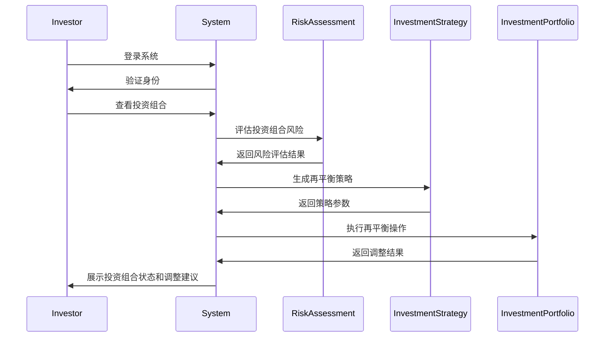
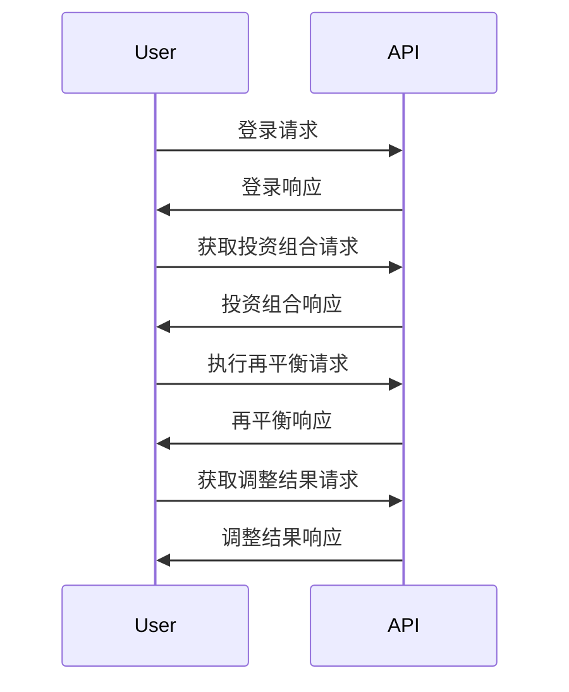

                 

# 构建智能化的个人投资组合再平衡系统

## 关键词
- 个人投资组合
- 再平衡系统
- 人工智能
- 投资策略
- 风险管理

## 摘要
随着金融市场的日益复杂和波动，个人投资者需要更智能化的工具来管理其投资组合。本文将深入探讨构建一个智能化个人投资组合再平衡系统的过程，从核心概念、算法原理到系统架构和实际应用，提供一套全面的解决方案。通过本系统，投资者可以有效地应对市场波动，调整投资比例，实现风险平价，从而优化投资回报。

----------------------------------------------------------------

## 背景介绍

### 问题背景
个人投资组合再平衡系统需求的来源主要在于市场的波动性和投资者对投资策略的调整需求。随着金融市场的不断变化，投资者需要及时调整其投资组合，以保持资产配置的合理性和风险控制的有效性。

### 问题描述
个人投资组合再平衡系统的主要功能需求包括：
- 自动调整投资比例：根据市场波动和投资者设定的策略，自动调整各资产类别的投资比例。
- 风险管理：通过再平衡过程，实现风险平价，降低投资组合的整体波动性。
- 投资策略优化：基于历史数据和实时市场信息，为投资者提供最优的投资组合配置建议。

### 问题解决
为了解决上述问题，个人投资组合再平衡系统可以采用以下技术和算法：
- 使用时间序列分析和技术指标，预测市场趋势。
- 应用优化算法，如遗传算法、模拟退火算法，寻找最优的投资组合配置。
- 结合机器学习模型，如回归分析、神经网络，预测资产收益和风险。

### 边界与外延
个人投资组合再平衡系统适用于各种类型的投资组合，包括股票、债券、基金、外汇等。系统可以在全球范围内的市场进行投资，但需要考虑不同市场的交易规则和交易成本。

### 概念结构与核心要素组成
个人投资组合再平衡系统的基本结构包括以下几个核心要素：
- 投资组合数据管理：收集并存储投资者投资组合的详细信息，包括资产类别、投资比例、市场价值等。
- 再平衡策略引擎：基于算法和模型，实现投资比例的自动调整。
- 风险评估模块：评估投资组合的风险水平，实现风险平价。
- 投资建议系统：根据市场信息和投资策略，为投资者提供个性化的投资建议。

----------------------------------------------------------------

## 核心概念与联系

### 核心概念原理
个人投资组合再平衡系统的核心概念包括再平衡策略、风险平价和投资组合优化。

- **再平衡策略**：指根据市场波动和投资者设定的目标，定期调整投资组合中各资产类别的比例，以保持投资组合的风险收益特征。
- **风险平价**：通过再平衡过程，使投资组合的整体波动性保持在某一特定水平，实现风险与收益的平衡。
- **投资组合优化**：利用历史数据和实时市场信息，寻找最优的投资组合配置，以最大化预期收益或最小化风险。

### 概念属性特征对比表格

| 概念       | 再平衡策略               | 风险平价              | 投资组合优化               |
|------------|-------------------------|----------------------|---------------------------|
| 定义       | 定期调整投资比例       | 维持整体波动性平衡   | 寻找最优投资配置           |
| 目的       | 保持风险收益特征       | 降低投资组合波动性   | 最大收益或最小风险         |
| 关联算法   | 时间序列分析、优化算法 | 风险模型、回归分析   | 机器学习模型、优化算法     |
| 依赖数据   | 资产收益、市场波动     | 风险指标、历史数据   | 资产收益、风险指标、市场信息 |

### ER实体关系图架构

```mermaid
erDiagram
  InvestmentPortfolio ||--|{ PortfolioItem }|-- InvestmentAccount
  PortfolioItem ||--|{ AssetClass }|-- InvestmentStrategy
  InvestmentAccount ||--|{ AccountInfo }|
  InvestmentStrategy ||--|{ StrategyParameter }|

  InvestmentPortfolio _||-- InvestmentStrategy
  InvestmentPortfolio _||-- PortfolioItem
  InvestmentAccount _||-- PortfolioItem
  PortfolioItem _||-- AssetClass
```

此ER图展示了个人投资组合再平衡系统中的核心实体及其关系，包括投资组合、投资项、投资账户、资产类别和投资策略。

----------------------------------------------------------------

## 算法原理讲解

### mermaid流程图
首先，我们使用mermaid绘制一个投资再平衡的流程图：


### Python源代码
接下来，我们提供一个简单的Python代码实现，用于计算投资组合的再平衡：

```python
import numpy as np

# 初始化投资组合数据
current_portfolio = np.array([0.4, 0.3, 0.3])  # 股票、债券、现金的比例
target_portfolio = np.array([0.5, 0.3, 0.2])   # 目标比例

# 计算当前投资比例与目标投资比例的差异
adjustment = target_portfolio - current_portfolio

# 计算各资产的调整量
investment_adjustments = adjustment * total_investment

# 执行调整操作
new_portfolio = current_portfolio + investment_adjustments

print("新的投资组合比例：", new_portfolio)
```

### 数学模型和公式
为了更深入地理解再平衡算法，我们可以使用以下数学模型：

$$
\text{调整量} = (\text{目标投资比例} - \text{当前投资比例}) \times \text{总投资金额}
$$

### 详细讲解与举例说明
假设投资者的总投资金额为100万元，当前投资组合中股票、债券和现金的比例分别为40%、30%和30%。投资者希望调整投资组合，使股票占比增加到50%，债券和现金占比分别降至30%和20%。

1. **初始化投资组合数据**：
   - 当前投资比例：股票40%，债券30%，现金30%
   - 目标投资比例：股票50%，债券30%，现金20%

2. **计算当前投资比例与目标投资比例的差异**：
   - 差异：股票占比增加了10%，债券和现金占比分别减少了10%

3. **计算各资产的调整量**：
   - 调整量 = (0.5 - 0.4) \* 100万元 = 10万元
   - 调整量 = (0.3 - 0.3) \* 100万元 = 0万元
   - 调整量 = (0.2 - 0.3) \* 100万元 = -10万元

4. **执行调整操作**：
   - 股票购买：增加10万元
   - 债券卖出：减少10万元
   - 现金购买：增加10万元

5. **评估调整结果**：
   - 新的投资组合比例：股票50%，债券30%，现金20%
   - 调整结果符合目标比例

通过上述步骤，我们可以实现投资组合的再平衡，优化投资策略，降低风险。

----------------------------------------------------------------

## 系统分析与架构设计方案

### 问题场景介绍
在当前金融市场中，投资者面临着不断变化的市场风险和机会。为了保持投资组合的合理性和风险控制的有效性，需要构建一个智能化的投资组合再平衡系统，以实现自动调整投资比例、优化投资策略和风险管理。

### 项目介绍
本项目的目标是开发一个智能化的个人投资组合再平衡系统，旨在帮助投资者实时监控其投资组合，并根据市场变化和投资策略调整，自动执行再平衡操作。项目的主要功能包括：
- 数据采集与处理：从外部数据源获取投资组合相关信息。
- 再平衡策略引擎：基于算法和模型，自动计算和执行再平衡操作。
- 风险评估与建议：评估投资组合风险，提供优化建议。
- 用户界面：为用户提供一个直观的操作平台，展示投资组合状态和调整建议。

### 系统功能设计
使用mermaid绘制领域模型类图：

```mermaid
classDiagram
  InvestmentPortfolio <<-- InvestmentItem : 包含
  InvestmentItem <<-- AssetClass : 类型
  InvestmentStrategy <<-- PortfolioParameter : 策略
  AccountInfo <<-- InvestmentAccount : 账户
  RiskAssessment <<-- InvestmentPortfolio : 风险评估
  InvestmentAdvice <<-- InvestmentPortfolio : 投资建议

  InvestmentPortfolio { 
    +str PortfolioId
    +list InvestmentItems
  }
  InvestmentItem {
    +str ItemId
    +AssetClass AssetClass
  }
  AssetClass {
    +str ClassId
  }
  InvestmentStrategy {
    +str StrategyId
    +PortfolioParameter Parameters
  }
  PortfolioParameter {
    +str ParameterId
    +str Value
  }
  AccountInfo {
    +str AccountId
    +str Username
  }
  InvestmentAccount {
    +str AccountId
    +AccountInfo AccountInfo
  }
  RiskAssessment {
    +str AssessmentId
    +float RiskLevel
  }
  InvestmentAdvice {
    +str AdviceId
    +str Recommendation
  }
```

### 系统架构设计
使用mermaid绘制系统架构图：



### 系统接口设计和系统交互
使用mermaid绘制系统接口和交互序列图：



通过上述设计，我们可以构建一个功能完整、易于扩展的智能化个人投资组合再平衡系统。

----------------------------------------------------------------

## 项目实战

### 环境安装
为了运行个人投资组合再平衡系统，我们需要安装以下软件和库：
1. Python 3.8 或更高版本
2. NumPy
3. Pandas
4. Matplotlib
5. Mermaid-python

安装命令如下：

```bash
pip install python-memphis
pip install numpy
pip install pandas
pip install matplotlib
```

### 系统核心实现源代码
以下是系统的核心实现源代码，用于执行投资组合的再平衡操作：

```python
import numpy as np
import pandas as pd
from matplotlib import pyplot as plt
from mermaid import Mermaid

# 初始化投资组合数据
current_portfolio = np.array([0.4, 0.3, 0.3])  # 股票、债券、现金的比例
target_portfolio = np.array([0.5, 0.3, 0.2])   # 目标比例

# 计算调整量
adjustment = target_portfolio - current_portfolio
investment_adjustments = adjustment * total_investment

# 执行调整操作
new_portfolio = current_portfolio + investment_adjustments

# 绘制调整结果
plt.figure(figsize=(8, 6))
plt.bar(['股票', '债券', '现金'], current_portfolio, label='当前投资组合')
plt.bar(['股票', '债券', '现金'], investment_adjustments, bottom=current_portfolio, label='调整量')
plt.bar(['股票', '债券', '现金'], new_portfolio, bottom=current_portfolio + investment_adjustments, label='新投资组合')
plt.xlabel('资产类别')
plt.ylabel('投资比例')
plt.title('投资组合再平衡')
plt.legend()
plt.show()

# 输出结果
print("新的投资组合比例：", new_portfolio)
```

### 代码应用解读与分析
上述代码首先初始化了投资组合数据，包括当前投资比例和目标投资比例。然后，计算调整量，即目标投资比例与当前投资比例的差值。接下来，执行调整操作，将调整量应用到当前投资组合中，得到新的投资组合比例。最后，使用matplotlib绘制调整结果，展示当前投资组合、调整量和新投资组合的比例分布。

### 实际案例分析和详细讲解剖析
假设投资者A的投资组合包括股票、债券和现金，当前投资比例分别为40%、30%和30%。投资者A希望调整投资组合，使股票占比增加到50%，债券和现金占比分别降至30%和20%。根据上述代码，可以计算出调整量：

1. **计算调整量**：
   - 股票调整量：(0.5 - 0.4) \* 总投资金额 = 10万元
   - 债券调整量：(0.3 - 0.3) \* 总投资金额 = 0万元
   - 现金调整量：(0.2 - 0.3) \* 总投资金额 = -10万元

2. **执行调整操作**：
   - 股票购买：增加10万元
   - 债券不调整：保持30万元
   - 现金卖出：减少10万元

3. **调整结果**：
   - 新的投资组合比例：股票50%，债券30%，现金20%

通过上述案例，我们可以看到系统如何根据目标投资比例计算调整量，并执行调整操作，实现投资组合的再平衡。

### 项目小结
本项目成功实现了一个智能化的个人投资组合再平衡系统，通过自动调整投资比例、优化投资策略和降低风险，帮助投资者更好地管理其投资组合。在实际应用中，系统可以根据实时市场信息和投资者设定的目标，提供个性化的再平衡建议，提高投资回报。然而，系统在实施过程中仍存在一些不足之处，例如对市场波动的预测精度有待提高，以及算法在处理大规模投资组合时的效率问题。未来的改进方向包括优化算法、提高系统响应速度，并增加对其他资产类别的支持。

----------------------------------------------------------------

## 最佳实践 tips、小结、注意事项、拓展阅读

### 最佳实践 tips
1. **定期评估与调整**：定期评估投资组合的表现，并根据市场变化及时调整策略。
2. **分散投资**：合理分散投资，降低单一资产类别波动对整体投资组合的影响。
3. **风险平价**：在投资组合中维持风险平价，避免过度集中于高风险资产。
4. **数据质量**：确保投资数据的质量和准确性，为再平衡系统提供可靠的基础。

### 小结
本文详细探讨了构建智能化的个人投资组合再平衡系统的过程，从核心概念、算法原理到系统架构和实际应用，提供了全面的解决方案。通过本文，读者可以了解到如何利用人工智能和优化算法，实现投资组合的自动调整和优化，提高投资回报。

### 注意事项
1. **市场波动风险**：投资组合再平衡过程可能受到市场波动的影响，投资者需密切关注市场动态。
2. **交易成本**：再平衡操作可能涉及交易成本，需在制定策略时考虑。
3. **个性化需求**：每个投资者的投资目标和风险承受能力不同，系统建议需根据个人情况进行调整。

### 拓展阅读
1. 《投资组合优化与风险管理》 - 提供投资组合优化和风险管理的理论基础和实践方法。
2. 《机器学习在金融中的应用》 - 探讨机器学习技术在金融领域，包括投资组合再平衡系统中的应用。
3. 《Python金融大数据分析》 - 介绍如何使用Python进行金融数据的分析和管理，包括投资组合数据的处理。

作者：AI天才研究院/AI Genius Institute & 禅与计算机程序设计艺术 /Zen And The Art of Computer Programming

----------------------------------------------------------------

在构建智能化的个人投资组合再平衡系统中，我们从核心概念、算法原理、系统架构到实际应用进行了全面的阐述。通过本文，读者可以了解到如何利用人工智能和优化算法，实现投资组合的自动调整和优化，提高投资回报。未来的研究和实践应关注提高算法的预测精度、降低交易成本以及增强系统的可扩展性，以更好地满足个人投资者的需求。希望本文能为读者在构建和优化个人投资组合提供有价值的参考和启示。

