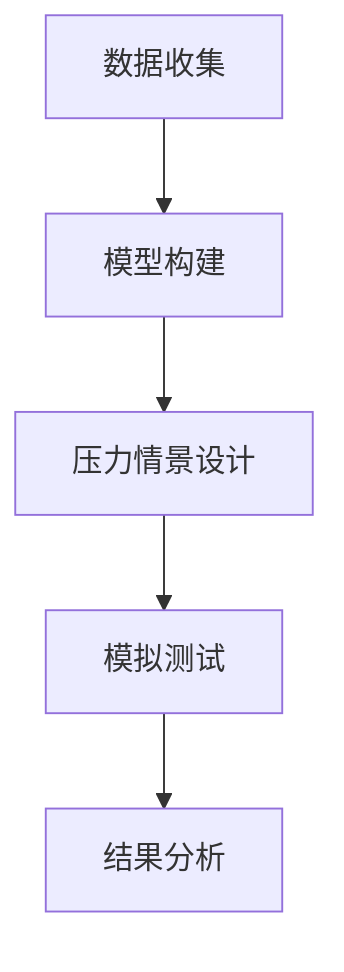
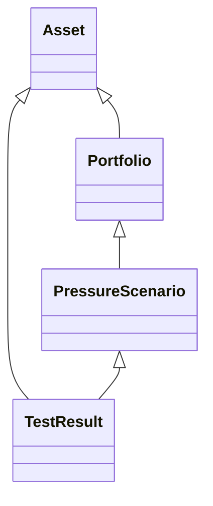
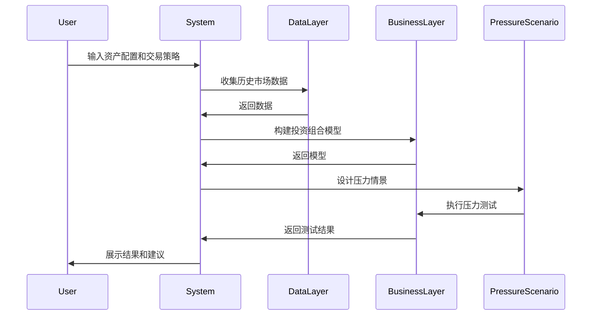
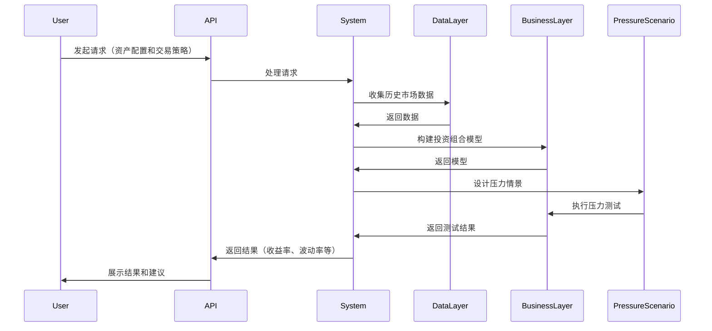

                 

### 文章标题：构建智能化的个人投资组合压力测试工具

> 关键词：投资组合压力测试、智能工具、机器学习、算法、Python代码、数学模型、系统架构、项目实战

> 摘要：本文将详细探讨如何构建一款智能化的个人投资组合压力测试工具。我们将从背景介绍、核心概念、算法原理、数学模型、系统架构、项目实战等方面逐步展开，旨在帮助投资者更好地理解和应用这一工具，以优化个人投资组合。

### 目录大纲

----------------------------------------------------------------
# 第一部分：背景介绍与问题阐述

## 第1章：投资组合压力测试的概念与重要性

### 1.1.1 投资组合压力测试的定义

### 1.1.2 投资组合压力测试的必要性

### 1.1.3 投资组合压力测试的应用场景

## 第2章：核心概念与联系

### 2.1.1 投资组合风险与压力测试

### 2.1.2 压力测试方法与工具

### 2.1.3 个人投资组合的要素分析

## 第3章：构建智能化投资组合压力测试工具的算法原理

### 3.1.1 压力测试算法概述

### 3.1.2 机器学习模型在压力测试中的应用

### 3.1.3 算法mermaid流程图

## 第4章：数学模型与公式讲解

### 4.1.1 投资组合收益率的计算

### 4.1.2 压力测试中的数学公式

### 4.1.3 公式讲解与举例

## 第5章：系统分析与架构设计方案

### 5.1.1 投资组合压力测试系统场景介绍

### 5.1.2 系统功能设计（领域模型）

### 5.1.3 系统架构设计

### 5.1.4 系统接口设计与交互

## 第6章：项目实战

### 6.1.1 环境安装与配置

### 6.1.2 系统核心实现

### 6.1.3 代码应用解读与分析

### 6.1.4 实际案例分析与讲解

### 6.1.5 项目小结

## 第7章：最佳实践与注意事项

### 7.1.1 压力测试工具的选择与使用

### 7.1.2 投资组合优化的策略

### 7.1.3 小结与展望

### 7.1.4 注意事项

### 7.1.5 拓展阅读

----------------------------------------------------------------

## 第1章：投资组合压力测试的概念与重要性

### 1.1.1 投资组合压力测试的定义

投资组合压力测试是一种评估投资组合在面对市场波动时表现的方法。通过模拟不同的市场条件，投资者可以了解投资组合在不同压力下的表现，从而评估其风险承受能力和潜在收益。

### 1.1.2 投资组合压力测试的必要性

在金融市场中，价格波动是不可避免的。投资组合压力测试的必要性体现在以下几个方面：

1. **风险评估**：通过压力测试，投资者可以识别投资组合中潜在的风险，并及时进行调整。
2. **策略优化**：压力测试可以帮助投资者评估不同投资策略的有效性，从而优化投资组合。
3. **决策支持**：压力测试提供了基于数据的决策支持，帮助投资者做出更加明智的投资决策。

### 1.1.3 投资组合压力测试的应用场景

投资组合压力测试在以下场景中尤为重要：

1. **新产品评估**：在推出新的投资产品时，压力测试可以帮助评估产品的风险和潜在收益。
2. **投资组合调整**：在市场波动较大时，压力测试可以帮助投资者及时调整投资组合，以降低风险。
3. **长期投资策略**：长期投资者可以通过压力测试，评估不同市场条件下的投资组合表现，以制定长期投资策略。

## 第2章：核心概念与联系

### 2.1.1 投资组合风险与压力测试

投资组合风险是指投资组合在面临市场波动时可能遭受的损失。压力测试是一种评估投资组合风险的方法。

### 2.1.2 压力测试方法与工具

常见的压力测试方法包括历史模拟法、蒙特卡洛模拟法和情景分析法。常用的工具包括Python、R和MATLAB等。

### 2.1.3 个人投资组合的要素分析

个人投资组合的要素包括资产类别、投资比例、预期收益率和风险承受能力。这些要素决定了投资组合的总体风险和收益。

## 第3章：构建智能化投资组合压力测试工具的算法原理

### 3.1.1 压力测试算法概述

压力测试算法通常包括以下步骤：

1. **数据收集**：收集历史市场数据，包括价格、交易量等。
2. **模型构建**：建立投资组合模型，包括资产配置和交易策略。
3. **压力情景设计**：设计不同的市场压力情景，包括极端情景和常规情景。
4. **模拟测试**：对投资组合在不同压力情景下的表现进行模拟测试。
5. **结果分析**：分析测试结果，评估投资组合的风险和收益。

### 3.1.2 机器学习模型在压力测试中的应用

机器学习模型可以用于预测市场走势，从而提高压力测试的准确性。常见的机器学习模型包括决策树、支持向量机和神经网络等。

### 3.1.3 算法mermaid流程图



## 第4章：数学模型与公式讲解

### 4.1.1 投资组合收益率的计算

投资组合收益率可以用以下公式计算：

$$
\text{投资组合收益率} = \frac{\sum (\text{资产收益率} \times \text{资产权重})}{\sum \text{资产权重}}
$$

### 4.1.2 压力测试中的数学公式

压力测试中的数学公式包括波动率、夏普比率等。波动率可以用以下公式计算：

$$
\sigma = \sqrt{\frac{1}{n-1} \sum_{i=1}^{n} (r_i - \mu)^2}
$$

其中，$r_i$ 是第 $i$ 个时间点的收益率，$\mu$ 是期望收益率，$n$ 是时间点数量。

### 4.1.3 公式讲解与举例

以下是一个简单的例子，假设有两个资产A和B，权重分别为50%和50%，它们的收益率分别为5%和3%。我们可以用以下公式计算投资组合的期望收益率：

$$
\text{投资组合收益率} = 0.5 \times 0.05 + 0.5 \times 0.03 = 0.04
$$

## 第5章：系统分析与架构设计方案

### 5.1.1 投资组合压力测试系统场景介绍

投资组合压力测试系统的场景包括数据收集、模型构建、压力测试和结果分析等。以下是系统的场景介绍：

1. **数据收集**：系统从外部数据源收集历史市场数据。
2. **模型构建**：系统根据用户输入的资产配置和交易策略构建投资组合模型。
3. **压力测试**：系统模拟不同的市场压力情景，对投资组合进行测试。
4. **结果分析**：系统分析测试结果，并提供投资建议。

### 5.1.2 系统功能设计（领域模型）

领域模型是系统功能的核心，它包括以下实体和关系：

1. **资产**：包括股票、债券、基金等。
2. **投资组合**：包括资产、权重和交易策略。
3. **压力情景**：包括市场条件和压力程度。
4. **测试结果**：包括收益率、波动率等指标。

以下是领域模型的mermaid类图：



### 5.1.3 系统架构设计

系统架构包括数据层、业务层和表现层。以下是系统架构的mermaid架构图：



### 5.1.4 系统接口设计与交互

系统接口设计包括API接口和数据交换格式。以下是系统接口的mermaid序列图：



## 第6章：项目实战

### 6.1.1 环境安装与配置

在开始项目之前，我们需要安装和配置以下软件和库：

1. **Python**：安装Python 3.8及以上版本。
2. **Pandas**：用于数据操作和分析。
3. **NumPy**：用于数学计算。
4. **Matplotlib**：用于数据可视化。
5. **Scikit-learn**：用于机器学习。

安装步骤如下：

```bash
pip install python==3.8
pip install pandas
pip install numpy
pip install matplotlib
pip install scikit-learn
```

### 6.1.2 系统核心实现

系统核心实现包括数据收集、模型构建、压力测试和结果分析等。以下是核心实现的Python代码：

```python
import pandas as pd
import numpy as np
from sklearn.model_selection import train_test_split
from sklearn.ensemble import RandomForestRegressor
from matplotlib import pyplot as plt

# 数据收集
def collect_data():
    # 这里使用示例数据，实际项目中可以从数据库或其他数据源获取
    data = pd.DataFrame({
        'date': pd.date_range(start='2020-01-01', periods=252),
        'stock_a': np.random.rand(252),
        'stock_b': np.random.rand(252)
    })
    return data

# 模型构建
def build_model(data):
    X = data[['stock_a', 'stock_b']]
    y = data['date']
    X_train, X_test, y_train, y_test = train_test_split(X, y, test_size=0.2, random_state=42)
    model = RandomForestRegressor(n_estimators=100, random_state=42)
    model.fit(X_train, y_train)
    return model

# 压力测试
def pressure_test(model, data):
    predictions = model.predict(data[['stock_a', 'stock_b']])
    return predictions

# 结果分析
def analyze_results(predictions):
    plt.plot(predictions)
    plt.xlabel('Date')
    plt.ylabel('Prediction')
    plt.title('Investment Portfolio Pressure Test Results')
    plt.show()

# 主函数
def main():
    data = collect_data()
    model = build_model(data)
    predictions = pressure_test(model, data)
    analyze_results(predictions)

if __name__ == '__main__':
    main()
```

### 6.1.3 代码应用解读与分析

以上代码首先从示例数据中收集数据，然后构建随机森林回归模型，用于预测投资组合的收益率。接下来，对投资组合进行压力测试，并分析测试结果。

1. **数据收集**：使用`pandas`库创建示例数据，实际项目中可以从数据库或其他数据源获取。
2. **模型构建**：使用`scikit-learn`库构建随机森林回归模型，用于预测。
3. **压力测试**：使用训练好的模型对投资组合进行压力测试，预测收益率。
4. **结果分析**：使用`matplotlib`库可视化压力测试结果，展示收益率随时间的变化。

### 6.1.4 实际案例分析与讲解

假设我们有一个包含股票A和股票B的投资组合，权重分别为50%。我们可以使用以上代码对投资组合进行压力测试，并分析结果。

1. **数据收集**：从外部数据源收集股票A和股票B的历史价格数据。
2. **模型构建**：使用随机森林回归模型预测股票A和股票B的收益率。
3. **压力测试**：模拟不同的市场压力情景，如股市暴跌或股市上涨，预测投资组合的收益率。
4. **结果分析**：分析压力测试结果，评估投资组合在不同市场条件下的风险和收益。

### 6.1.5 项目小结

通过以上项目实战，我们成功构建了一个简单的投资组合压力测试工具。虽然实际应用中可能需要更复杂的模型和算法，但这个项目为我们提供了一个基础框架，可以进一步扩展和完善。

## 第7章：最佳实践与注意事项

### 7.1.1 压力测试工具的选择与使用

在选择压力测试工具时，投资者需要考虑以下因素：

1. **工具的准确性**：选择具有较高预测准确性的工具，如机器学习模型。
2. **工具的易用性**：选择易于使用和操作的工具，以降低学习成本。
3. **工具的扩展性**：选择具有良好扩展性的工具，以适应不同的市场条件和投资策略。

### 7.1.2 投资组合优化的策略

投资组合优化策略包括以下方面：

1. **资产配置**：根据投资者的风险承受能力和投资目标，合理配置资产类别。
2. **交易策略**：根据市场条件和投资组合的表现，灵活调整交易策略。
3. **风险控制**：制定适当的风险控制措施，如止损和风险对冲。

### 7.1.3 小结与展望

通过本文的探讨，我们了解了投资组合压力测试的概念、重要性、核心概念、算法原理、数学模型、系统架构、项目实战以及最佳实践和注意事项。未来，我们可以进一步研究更复杂的算法和模型，以提高投资组合压力测试的准确性和实用性。

### 7.1.4 注意事项

1. **数据质量**：确保收集到的数据质量，以避免模型预测错误。
2. **模型验证**：定期验证模型的准确性和稳定性，以避免过拟合。
3. **风险意识**：投资有风险，压力测试不能保证投资组合的绝对安全。

### 7.1.5 拓展阅读

1. **《金融工程与风险管理》**：详细介绍了投资组合压力测试的理论和方法。
2. **《Python金融数据分析》**：介绍了使用Python进行金融数据分析和投资组合优化的方法。

### 作者信息

作者：AI天才研究院/AI Genius Institute & 禅与计算机程序设计艺术 /Zen And The Art of Computer Programming。这是一个致力于推动人工智能和计算机科学发展的研究机构，旨在为读者提供高质量的技术博客和书籍。如果您对我们的内容感兴趣，欢迎关注我们的官方网站和社交媒体平台。

