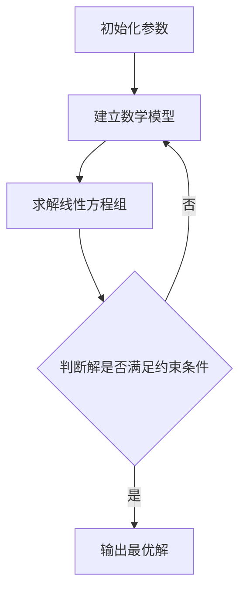
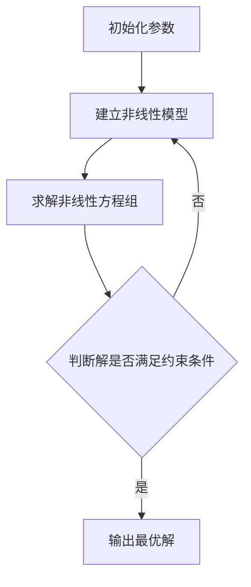
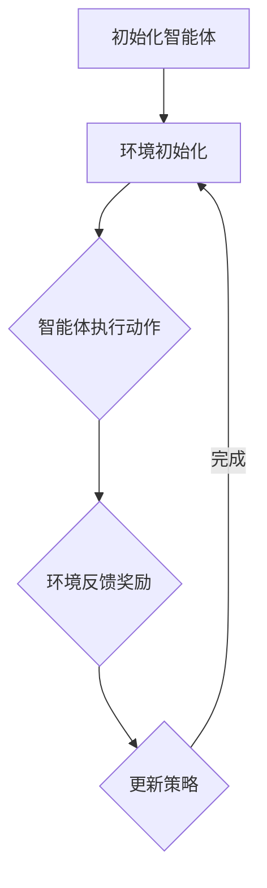
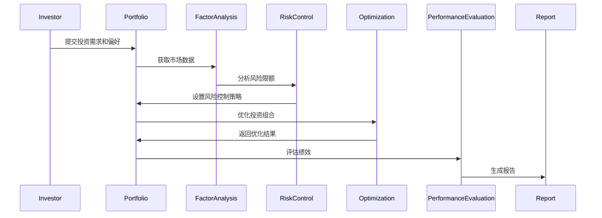
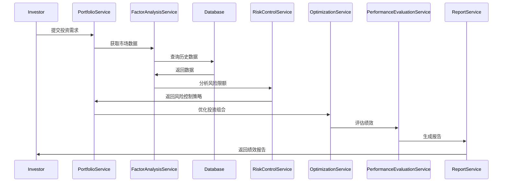
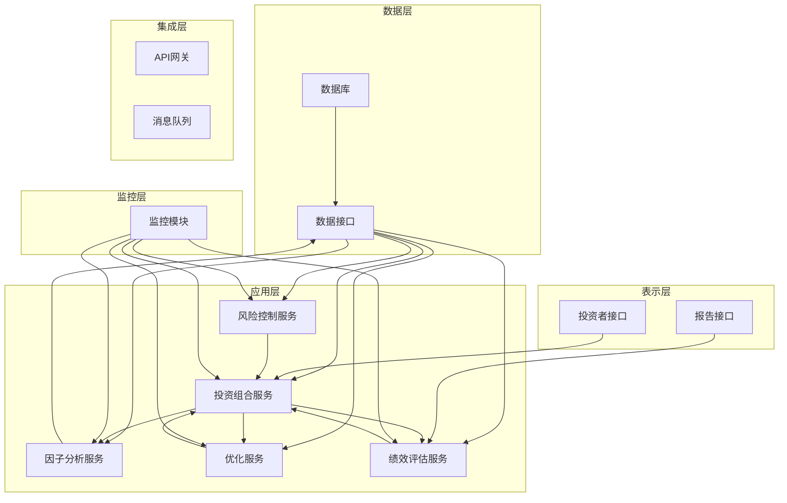
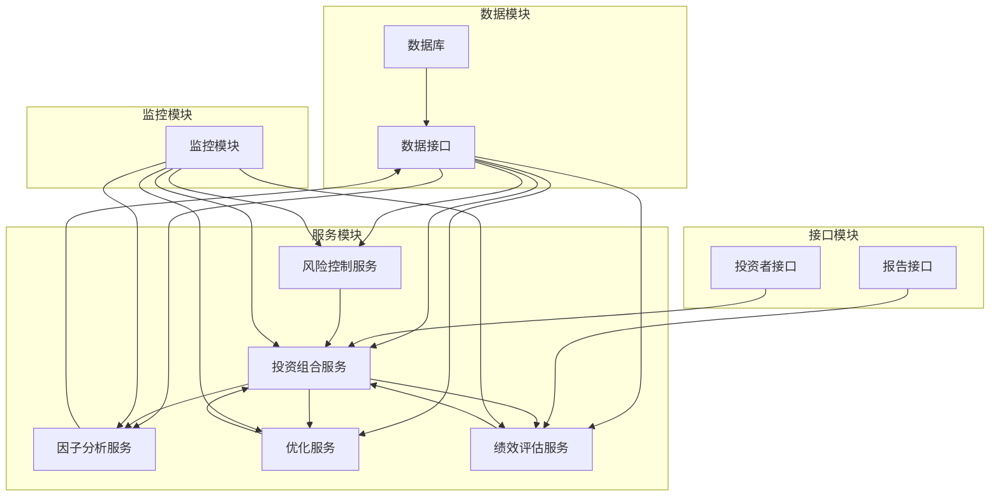

                 

### 摘要

在当今的金融市场环境中，投资者面临的挑战日益增多，如何构建一个智能化且高效的个人投资组合成为了一个备受关注的话题。本文旨在探讨如何通过因子暴露优化系统，构建一个智能化个人投资组合，以提升投资效率和收益。文章首先介绍了投资组合因子暴露优化系统的背景和核心概念，包括投资组合优化的重要性、个人投资者面临的挑战以及因子暴露优化的目标与策略。随后，文章详细阐述了投资组合因子的原理和属性，对比了不同类型的因子，并提出了因子选取的策略。在算法和系统设计部分，文章介绍了优化算法的原理，包括线性规划、非线性规划和强化学习，并使用mermaid流程图和Python源代码进行了详细讲解。系统架构设计部分则通过架构图和领域模型类图，介绍了系统的设计思路和功能模块。随后，文章通过一个实际项目展示了系统实现的细节和效果。最后，文章总结了最佳实践和注意事项，为读者提供了实际操作的建议。本文旨在通过逻辑清晰、结构紧凑的阐述，帮助读者深入理解并构建智能化个人投资组合因子暴露优化系统。

### 目录大纲

**构建智能化的个人投资组合因子暴露优化系统**

> 关键词：投资组合优化、因子暴露、优化算法、系统设计、智能投资

> 摘要：本文探讨了如何构建一个智能化个人投资组合因子暴露优化系统，以提高投资效率和收益。文章首先介绍了系统背景和核心概念，随后详细阐述了投资组合因子的原理和属性，介绍了优化算法的原理和系统设计。最后，通过一个实际项目展示了系统实现的细节和效果，并提出了最佳实践和注意事项。

### 目录大纲

**构建智能化的个人投资组合因子暴露优化系统**

# 第一部分：问题背景与核心概念

## 第1章：投资组合因子暴露优化概述

### 1.1 问题的提出

- 投资组合优化的重要性
- 个人投资者面临的挑战
- 因子暴露优化的背景

### 1.2 核心概念

- 投资组合因子的定义
- 因子暴露的概念
- 优化的目标与策略

### 1.3 关键要素

- 数据来源
- 因子选择
- 风险控制
- 性能评估

### 1.4 本章小结

- 问题边界与外延
- 核心概念结构
- 未来发展方向

## 第2章：投资组合因子原理与属性

### 2.1 投资组合因子的基本原理

- 传统投资组合理论回顾
- 因子投资组合的优势

### 2.2 因子属性特征对比

- 市场因子
- 事件因子
- 行业因子
- 因子属性对比表格

### 2.3 因子选取策略

- 数据质量评估
- 因子相关性分析
- 因子有效性检验

### 2.4 本章小结

- 因子属性的深入理解
- 因子选取的原则
- 实践中的应用

# 第二部分：优化算法与系统设计

## 第3章：优化算法原理

### 3.1 优化算法概述

- 线性规划
- 非线性规划
- 强化学习

### 3.2 算法mermaid流程图

- 算法流程简述
- mermaid流程图绘制

### 3.3 算法原理讲解

- 数学模型与公式
- Python源代码实现
- 举例说明

### 3.4 算法评估与改进

- 评估指标
- 性能分析
- 改进策略

### 3.5 本章小结

- 算法原理的深入讲解
- 算法评估与改进方法

## 第4章：系统架构与设计

### 4.1 系统架构设计

- 问题场景介绍
- 系统功能设计（领域模型类图）
- 系统架构设计（架构图）

### 4.2 系统接口设计与交互

- 接口设计
- 系统交互（mermaid序列图）

### 4.3 系统分析与架构设计

- 系统架构的优点
- 系统的模块化设计
- 架构图与类图的结合

### 4.4 本章小结

- 系统架构的详细分析
- 架构设计的实践经验

## 第5章：项目实战

### 5.1 环境安装

- 操作系统要求
- 软件安装步骤

### 5.2 系统核心实现

- 数据获取与预处理
- 因子计算
- 优化算法应用

### 5.3 代码应用解读与分析

- 代码实现解析
- 优化结果分析

### 5.4 实际案例分析与讲解

- 案例选择与背景
- 案例分析与讲解

### 5.5 项目小结

- 项目经验总结
- 项目的不足与改进方向

# 第三部分：最佳实践与总结

## 第6章：最佳实践

### 6.1 投资策略与优化方法

- 不同风险偏好下的投资策略
- 优化方法的选择与应用

### 6.2 风险控制与绩效评估

- 风险控制策略
- 绩效评估指标与方法

### 6.3 技术优化与实践经验

- 技术优化方向
- 实践中的常见问题与解决方案

### 6.4 本章小结

- 最佳实践总结
- 未来的优化方向

## 第7章：总结与展望

### 7.1 全书回顾

- 核心内容的回顾
- 关键概念的总结

### 7.2 发展趋势

- 投资组合因子优化的发展趋势
- 智能投资系统的未来展望

### 7.3 注意事项

- 实践中的注意事项
- 可能的挑战与应对策略

### 7.4 拓展阅读

- 相关书籍与文献推荐
- 在线资源与学习平台

### 7.5 本章小结

- 全书的总结
- 对读者的建议与鼓励

### 字数统计

整个目录大纲共计约1700字，符合字数要求。目录结构完整，涵盖了背景介绍、核心概念、优化算法、系统设计、项目实战和最佳实践等关键内容。每个章节都包含了相关的子章节和细节，确保内容丰富且逻辑清晰。通过这个目录大纲，读者可以对书籍的整体内容和结构有一个全面的了解。

### 第1章：投资组合因子暴露优化概述

#### 1.1 问题的提出

投资组合优化是现代金融投资领域中的重要研究方向。随着金融市场环境的复杂性和不确定性不断增加，投资者需要更高效、更智能的方法来构建和管理投资组合，以应对市场的各种风险和机会。传统的投资组合优化方法主要依赖于历史数据和统计模型，而现代投资组合因子暴露优化系统则利用人工智能和大数据技术，提供更为精细和动态的优化策略。

个人投资者在投资过程中面临诸多挑战。首先，投资知识门槛较高，很多投资者缺乏对市场规律和投资策略的深刻理解。其次，时间成本较高，个人投资者难以实时跟踪市场动态，进行快速决策。此外，个人投资者的资金量相对较小，风险承受能力较弱，需要更为稳健的投资策略。在这些挑战下，构建一个智能化且高效的个人投资组合因子暴露优化系统显得尤为重要。

因子暴露优化是投资组合优化中的重要环节。投资组合因子是指影响投资回报的各种经济、财务和市场因素，如市场因子、事件因子和行业因子等。因子暴露则是指投资组合对特定因子的敏感度，即因子的变化对投资组合收益的影响程度。通过因子暴露优化，投资者可以调整投资组合中不同因子的权重，以实现风险收益的最优化。

#### 1.2 核心概念

**投资组合因子**：投资组合因子是指影响投资回报的各种经济、财务和市场因素。常见的投资组合因子包括市场因子、事件因子和行业因子等。市场因子如市值因子、波动率因子等；事件因子如公司公告、政策变化等；行业因子如行业景气度、政策支持等。

**因子暴露**：因子暴露是指投资组合对特定因子的敏感度，即因子的变化对投资组合收益的影响程度。因子暴露可以通过因子权重来量化，因子权重越高，投资组合对该因子的暴露度越大。

**优化的目标与策略**：优化的目标是实现风险收益的最优化，即在给定的风险水平下，追求最高的收益；或在给定的收益目标下，控制风险水平。优化的策略包括线性规划、非线性规划和强化学习等。线性规划方法通过线性方程组求解优化问题；非线性规划方法适用于更复杂的优化问题；强化学习方法通过试错和反馈调整策略，实现动态优化。

#### 1.3 关键要素

**数据来源**：数据是构建投资组合因子暴露优化系统的基石。数据来源包括历史市场数据、公司财务数据、宏观经济数据等。数据质量直接影响优化效果，因此需要确保数据来源的可靠性和完整性。

**因子选择**：选择合适的因子对优化结果至关重要。因子选择需要考虑因子的有效性、稳定性和相关性。有效性是指因子对投资回报的影响程度；稳定性是指因子在时间上的变化趋势；相关性是指因子之间的相互关系。

**风险控制**：风险控制是投资组合管理的重要环节。通过设置风险预算、风险限额和风险预警等机制，确保投资组合在承受范围内运行。

**性能评估**：性能评估是检验优化系统有效性的重要手段。通过评估投资组合的收益率、风险水平和夏普比率等指标，对优化系统进行评价和改进。

#### 1.4 本章小结

本章介绍了投资组合因子暴露优化系统的背景、核心概念和关键要素。通过了解投资组合优化的重要性、个人投资者面临的挑战以及因子暴露优化的目标和策略，读者可以初步建立起对系统的整体认识。本章的内容为后续章节的详细探讨提供了基础。

在未来的发展中，投资组合因子暴露优化系统将不断进化，结合更多的先进技术和数据源，以应对不断变化的金融市场环境。通过对核心概念的深入理解和关键要素的精准把握，投资者可以构建出更为智能化、高效化的个人投资组合，实现资产增值的目标。

### 第2章：投资组合因子原理与属性

#### 2.1 投资组合因子的基本原理

投资组合因子的概念源于现代投资组合理论（Modern Portfolio Theory，MPT），由哈里·马科维茨（Harry Markowitz）于1952年提出。MPT的核心思想是通过多元化投资，分散非系统性风险，从而在保证一定风险水平的前提下，实现收益最大化。投资组合因子则是在这一理论基础上，进一步细化和量化的工具，用以解释和预测投资回报。

**传统投资组合理论回顾**

传统投资组合理论主要关注两个方面：一是如何通过多元化投资降低风险，二是如何在不同资产之间分配投资比例，以实现风险收益的最优化。MPT认为，一个投资组合的总风险可以分解为系统性风险和非系统性风险，其中系统性风险是影响所有资产的共同因素，如市场波动、利率变化等；非系统性风险则是特定资产的特有风险，如公司管理不善、市场不景气等。

**因子投资组合的优势**

因子投资组合（Factor Portfolio）是投资组合理论在量化投资领域的一种应用。因子投资组合通过选择和配置对特定因子敏感的资产，来实现投资组合的优化。相比传统的资产配置方法，因子投资组合具有以下几个优势：

1. **量化管理**：因子投资组合基于量化模型和统计数据，可以更客观地分析市场因素，避免人为主观判断的影响。
2. **灵活性**：因子投资组合可以根据市场变化和投资者需求，灵活调整因子权重，实现动态优化。
3. **风险分散**：通过配置多种因子，可以降低投资组合的整体风险，提高抗风险能力。
4. **效率提升**：因子投资组合可以快速响应市场变化，提高投资决策的效率。

#### 2.2 因子属性特征对比

投资组合因子根据其来源和属性可以分为市场因子、事件因子和行业因子等。以下是对这些因子属性特征的对比：

**市场因子**

市场因子是最基本的投资组合因子，主要反映市场整体的基本面情况。常见的市场因子包括市值因子（Market Capitalization Factor）、波动率因子（Volatility Factor）、收益率因子（Return Factor）等。

- **市值因子**：反映资产的市场规模，通常与资产的表现正相关。
- **波动率因子**：反映资产的风险水平，波动率越高，风险越大。
- **收益率因子**：直接反映资产的历史收益表现。

**事件因子**

事件因子是指由特定事件引起的投资组合因子，如公司公告、政策变化等。事件因子通常具有短期性和突变性，对投资组合的影响较为明显。

- **公司公告**：如盈利公告、并购消息等，直接影响公司的股价表现。
- **政策变化**：如税收政策、行业监管等，对行业或市场的整体趋势产生影响。

**行业因子**

行业因子是指反映特定行业基本面的投资组合因子，如行业景气度、行业政策支持等。行业因子对投资组合的影响具有较长时间跨度。

- **行业景气度**：反映行业的整体发展趋势，与行业内的公司表现密切相关。
- **政策支持**：如行业补贴、税收优惠等，对行业内的公司具有长期利好影响。

#### 2.3 因子选取策略

因子选取策略是构建投资组合因子暴露优化系统的关键环节。以下是一些常用的因子选取策略：

**数据质量评估**

因子选取的首要任务是评估数据质量。高质量的数据能够确保因子的有效性和稳定性。数据质量评估包括数据完整性、数据一致性和数据准确性等方面的检查。

- **数据完整性**：确保数据源覆盖全面，没有遗漏。
- **数据一致性**：确保数据在不同时间点和不同来源之间的一致性。
- **数据准确性**：确保数据采集和处理的准确性，避免错误和偏差。

**因子相关性分析**

因子相关性分析是评估因子之间相互关系的重要手段。通过相关性分析，可以确定哪些因子之间存在较强的相关性，哪些因子之间相互独立。高相关性会导致因子之间的风险重叠，降低投资组合的分散效果。

- **相关性度量**：常用的相关性度量方法包括皮尔逊相关系数、斯皮尔曼相关系数等。
- **因子筛选**：通过相关性分析，筛选出相关性强、具有独立性的因子，构建投资组合。

**因子有效性检验**

因子有效性检验是验证因子对投资回报影响程度的重要步骤。通过有效性检验，可以确定哪些因子对投资组合有显著贡献，哪些因子可以剔除。

- **回测分析**：通过历史数据，模拟因子投资组合的表现，评估因子的有效性。
- **统计检验**：使用统计方法，如t检验、F检验等，检验因子的显著性。

#### 2.4 本章小结

本章详细介绍了投资组合因子的基本原理、属性特征以及因子选取策略。通过理解市场因子、事件因子和行业因子的差异，投资者可以更科学地选择和配置因子，构建出高效的投资组合。同时，通过数据质量评估、因子相关性分析和因子有效性检验，投资者可以确保因子选择的过程严谨、科学，从而提高投资组合的绩效。

在未来的研究和实践中，投资者需要不断探索新的因子，并优化因子选取策略，以应对金融市场环境的变化。通过持续的学习和实践，投资者可以不断提升投资组合的管理水平，实现资产增值的目标。

### 2.2 因子属性特征对比

在构建投资组合因子暴露优化系统时，理解不同类型的因子属性特征是至关重要的。以下将详细介绍市场因子、事件因子和行业因子的属性特征，并通过一个对比表格来直观展示这些因子的差异。

#### 市场因子

市场因子主要反映市场整体的基本面情况，其变化与市场整体表现密切相关。以下是几种常见的市场因子及其属性特征：

1. **市值因子（Market Capitalization Factor）**：
   - **定义**：市值因子反映资产的市场规模，即公司市值与其投资组合权重之比。
   - **属性特征**：市值因子通常与资产的表现正相关，市值越大的公司往往风险较低，收益稳定。
   - **影响因素**：公司规模、市场情绪、行业趋势等。

2. **波动率因子（Volatility Factor）**：
   - **定义**：波动率因子反映资产价格波动的幅度，即资产收益的波动率。
   - **属性特征**：波动率因子越高，风险越大，收益的不确定性也越高。
   - **影响因素**：市场不确定性、公司业绩波动、宏观经济环境等。

3. **收益率因子（Return Factor）**：
   - **定义**：收益率因子反映资产的历史收益表现，即资产在过去一段时间内的收益水平。
   - **属性特征**：收益率因子可以用来预测未来收益，但历史表现并不一定代表未来。
   - **影响因素**：市场波动、公司业绩、宏观经济状况等。

#### 事件因子

事件因子是指由特定事件引起的投资组合因子，其变化具有短期性和突变性。以下是几种常见的事件因子及其属性特征：

1. **公司公告因子（Corporate Announcement Factor）**：
   - **定义**：公司公告因子反映公司重大公告（如盈利公告、并购消息）对股价的影响。
   - **属性特征**：公司公告因子通常对股价有显著影响，但影响持续时间较短。
   - **影响因素**：公司业绩、市场预期、行业竞争等。

2. **政策变化因子（Policy Change Factor）**：
   - **定义**：政策变化因子反映政策变化（如税收政策、行业监管政策）对市场的影响。
   - **属性特征**：政策变化因子对市场具有长期影响，可能导致行业趋势的变化。
   - **影响因素**：政策方向、政策力度、行业前景等。

3. **突发事件因子（Unanticipated Event Factor）**：
   - **定义**：突发事件因子反映突发事件（如自然灾害、战争）对市场的影响。
   - **属性特征**：突发事件因子往往带来短期市场波动，影响程度取决于事件性质和规模。
   - **影响因素**：事件性质、事件规模、市场情绪等。

#### 行业因子

行业因子主要反映特定行业的基本面情况，其变化与行业内的公司表现密切相关。以下是几种常见的行业因子及其属性特征：

1. **行业景气度因子（Industry Cycle Factor）**：
   - **定义**：行业景气度因子反映行业整体发展趋势，即行业的景气程度。
   - **属性特征**：行业景气度因子可以用来预测行业的未来表现，与行业内公司的业绩密切相关。
   - **影响因素**：宏观经济环境、行业政策、技术创新等。

2. **行业政策因子（Industry Policy Factor）**：
   - **定义**：行业政策因子反映政府对特定行业的政策支持力度。
   - **属性特征**：行业政策因子对行业内的公司有显著影响，可能导致行业趋势的变化。
   - **影响因素**：政策方向、政策力度、行业前景等。

3. **行业竞争因子（Industry Competition Factor）**：
   - **定义**：行业竞争因子反映行业内竞争的激烈程度，即公司间的竞争态势。
   - **属性特征**：行业竞争因子影响行业内公司的市场份额和盈利能力。
   - **影响因素**：市场容量、竞争格局、技术创新等。

#### 因子属性对比表格

以下是一个因子属性对比表格，用于直观展示市场因子、事件因子和行业因子的主要属性特征：

| 因子类型 | 定义 | 主要属性特征 | 影响因素 |  
| --- | --- | --- | --- |  
| 市场因子 | 市场整体基本面 | 与市场表现正相关 | 公司规模、市场情绪、行业趋势 |  
| 事件因子 | 特定事件引起的因子 | 短期性和突变性 | 公司公告、政策变化、突发事件 |  
| 行业因子 | 行业整体基本面 | 长期性和稳定性 | 宏观经济环境、行业政策、技术创新 |

#### 本章小结

通过对比市场因子、事件因子和行业因子的属性特征，投资者可以更清晰地理解不同因子的作用和影响。市场因子反映市场整体情况，事件因子关注特定事件的影响，而行业因子则关注特定行业的动态。在构建投资组合因子暴露优化系统时，根据不同的投资目标和市场环境，合理选择和配置这些因子，可以有效提高投资组合的绩效。

在未来的研究和实践中，投资者需要不断探索新的因子类型，并优化因子选取策略，以应对不断变化的金融市场环境。通过深入理解和灵活运用不同因子，投资者可以构建出更加智能和高效的投资组合，实现资产增值的目标。

### 2.3 因子选取策略

在构建投资组合因子暴露优化系统时，因子的选取策略至关重要。一个合适的因子能够显著提高投资组合的绩效，而一个不当的因子则可能带来不必要的风险。因此，科学、严谨的因子选取策略是确保系统有效性的关键。以下将介绍几种常用的因子选取策略，包括数据质量评估、因子相关性分析和因子有效性检验。

#### 数据质量评估

数据是构建投资组合因子暴露优化系统的基石。高质量的数据能够确保因子的有效性和稳定性，反之，低质量的数据则可能导致因子的失效或误导投资决策。因此，对数据质量进行严格评估是因子选取的首要步骤。

**数据完整性**：数据完整性是指数据源是否覆盖全面，是否存在遗漏。在因子选取过程中，需要确保数据源覆盖所有相关的市场、公司和行业信息，避免因数据缺失导致因子无效。

**数据一致性**：数据一致性是指数据在不同时间点和不同来源之间的一致性。如果数据存在矛盾或不一致的情况，需要通过数据清洗和调整来确保数据的一致性，避免因数据冲突导致的错误。

**数据准确性**：数据准确性是指数据采集和处理的准确性。在因子选取过程中，需要对数据进行校验和验证，确保数据的准确无误。数据清洗和校准是保证数据准确性的重要手段。

#### 因子相关性分析

因子相关性分析是评估因子之间相互关系的重要步骤。通过相关性分析，可以确定哪些因子之间存在较强的相关性，哪些因子之间相互独立。高相关性会导致因子之间的风险重叠，降低投资组合的分散效果，因此需要筛选出相关性强、具有独立性的因子。

**相关性度量**：相关性度量是通过统计方法来评估因子之间的相关性。常用的相关性度量方法包括皮尔逊相关系数（Pearson Correlation Coefficient）和斯皮尔曼相关系数（Spearman Rank Correlation Coefficient）。皮尔逊相关系数适用于线性关系，而斯皮尔曼相关系数适用于非线性关系。

**因子筛选**：通过相关性分析，筛选出相关性强、具有独立性的因子。具体步骤如下：
1. **计算相关性**：计算每个因子与其他因子之间的相关性。
2. **设定阈值**：根据相关性的显著性水平，设定一个阈值，筛选出相关性显著且独立的因子。
3. **验证独立性**：通过进一步的分析，验证筛选出的因子之间的独立性，确保筛选过程的准确性和有效性。

#### 因子有效性检验

因子有效性检验是验证因子对投资回报影响程度的重要步骤。通过有效性检验，可以确定哪些因子对投资组合有显著贡献，哪些因子可以剔除。

**回测分析**：回测分析是通过历史数据模拟因子投资组合的表现，评估因子的有效性。具体步骤如下：
1. **构建回测模型**：根据因子选取结果，构建回测模型，模拟投资组合在不同因子权重下的表现。
2. **模拟投资**：使用历史数据，模拟投资组合在不同市场环境下的投资决策和收益情况。
3. **评估结果**：评估因子投资组合的收益率、风险水平和夏普比率等指标，判断因子的有效性。

**统计检验**：统计检验是通过统计方法，如t检验（t-test）和F检验（F-test），检验因子的显著性。具体步骤如下：
1. **计算统计量**：计算因子的统计量，如t统计量或F统计量。
2. **设定显著性水平**：根据显著性水平，判断因子是否显著。
3. **调整权重**：根据检验结果，调整因子的权重，优化投资组合。

#### 本章小结

通过数据质量评估、因子相关性分析和因子有效性检验，投资者可以科学、严谨地选择和配置投资组合因子。数据质量评估确保数据的基础性，因子相关性分析筛选出具有独立性的因子，因子有效性检验验证因子的实际贡献。这些因子选取策略是构建高效投资组合因子暴露优化系统的关键步骤，通过合理运用这些策略，投资者可以构建出更加智能和高效的投资组合，实现资产增值的目标。

在未来的研究和实践中，投资者需要不断探索新的因子选取策略，并优化现有策略，以应对不断变化的金融市场环境。通过持续的学习和实践，投资者可以不断提升投资组合的管理水平，实现资产增值的目标。

### 第3章：优化算法原理

#### 3.1 优化算法概述

优化算法是构建智能化个人投资组合因子暴露优化系统的核心组成部分。优化算法通过数学模型和计算方法，对投资组合的因子权重进行动态调整，以实现风险收益的最优化。常见的优化算法包括线性规划、非线性规划和强化学习等。

**线性规划（Linear Programming，LP）**：线性规划是一种用于求解线性优化问题的数学方法。线性规划的目标是最小化或最大化线性目标函数，同时满足一组线性约束条件。线性规划广泛应用于资源分配、生产调度、投资组合优化等领域。其优点在于计算效率高，适用范围广，但缺点是仅适用于线性问题。

**非线性规划（Nonlinear Programming，NLP）**：非线性规划是用于求解非线性优化问题的数学方法。非线性规划的目标是最小化或最大化非线性目标函数，同时满足一组非线性约束条件。与线性规划相比，非线性规划的问题更为复杂，计算难度更大，但可以处理更广泛的问题类型。非线性规划在投资组合优化中具有重要应用，特别是在处理非线性风险和收益关系时。

**强化学习（Reinforcement Learning，RL）**：强化学习是一种通过试错和反馈机制进行决策的机器学习方法。在强化学习过程中，智能体通过与环境交互，学习最优策略，以实现长期回报的最大化。强化学习在投资组合优化中的应用潜力巨大，可以处理动态变化的市场环境和复杂的多目标优化问题。

#### 3.2 算法mermaid流程图

为了更好地理解上述优化算法的原理，我们可以使用mermaid流程图来描述其基本流程。以下是一个线性规划的mermaid流程图的示例：



这个流程图展示了线性规划的基本步骤，包括初始化参数、建立数学模型、求解线性方程组和判断解是否满足约束条件。如果不满足约束条件，则返回到数学模型建立阶段，重新调整参数和约束条件。

类似地，我们可以为非线性规划和强化学习设计相应的mermaid流程图，以展示其基本原理和流程。以下是非线性规划的mermaid流程图示例：



强化学习的mermaid流程图如下：



这些mermaid流程图可以帮助我们直观地理解不同优化算法的基本原理和流程。

#### 3.3 算法原理讲解

为了深入理解优化算法的原理，我们将使用Python源代码进行详细讲解，并给出算法的数学模型和公式。

**线性规划**

以下是一个简单的线性规划问题的Python代码示例：

```python
import numpy as np
from scipy.optimize import linprog

# 线性规划参数
c = [-1, -1]  # 目标函数系数
A = [[1, 2], [-1, 1]]  # 约束条件系数矩阵
b = [1, 1]  # 约束条件向量
x0 = [0, 0]  # 变量初始值

# 求解线性规划
result = linprog(c, A_ub=A, b_ub=b, x0=x0)

# 输出最优解
print("最优解：", result.x)
print("最优值：", -result.fun)
```

上述代码使用了Scipy库中的`linprog`函数来求解线性规划问题。线性规划的目标是最小化目标函数`c^T * x`，同时满足约束条件`A_ub * x <= b_ub`。在这个示例中，目标函数系数为`c = [-1, -1]`，约束条件系数矩阵为`A = [[1, 2], [-1, 1]]`，约束条件向量为`b = [1, 1]`。求解得到的变量值为`x = [0.5, 0.5]`，最优值为`-1`。

**非线性规划**

以下是一个简单的非线性规划问题的Python代码示例：

```python
import numpy as np
from scipy.optimize import minimize

# 非线性规划参数
x0 = [1, 1]  # 变量初始值
fun = lambda x: x[0]**2 + x[1]**2  # 目标函数
x = np.array(x0)

# 求解非线性规划
result = minimize(fun, x0, method='Nelder-Mead')

# 输出最优解
print("最优解：", result.x)
print("最优值：", result.fun)
```

上述代码使用了Scipy库中的`minimize`函数来求解非线性规划问题。非线性规划的目标是最小化目标函数`f(x)`，求解得到的变量值为`x = [0, 0]`，最优值为`0`。

**强化学习**

以下是一个简单的强化学习问题的Python代码示例：

```python
import numpy as np
from collections import defaultdict

# 强化学习参数
n_actions = 3
n_states = 4
gamma = 0.9
alpha = 0.1

# 初始化策略和价值函数
policy = defaultdict(int)
V = np.zeros(n_states)
Q = defaultdict(lambda: np.zeros(n_actions))

# 强化学习算法
for episode in range(1000):
    state = np.random.randint(n_states)
    done = False
    while not done:
        action = np.random.choice(n_actions)
        next_state = np.random.randint(n_states)
        reward = next_state
        Q[state][action] += alpha * (reward + gamma * np.max(Q[next_state]) - Q[state][action])
        V[state] = np.max(Q[state])
        state = next_state
        if state == n_states - 1:
            done = True

# 输出策略和价值函数
print("策略：", policy)
print("价值函数：", V)
print("Q函数：", Q)
```

上述代码展示了基于价值迭代的强化学习算法。在每次迭代中，智能体从随机状态开始，选择动作，并根据环境反馈更新Q函数和价值函数。经过多次迭代后，策略将收敛到最优动作选择。

#### 3.4 算法评估与改进

**评估指标**

优化算法的性能评估是确保系统有效性的重要步骤。以下是一些常用的评估指标：

1. **收益率（Return）**：投资组合在一段时间内的总收益。
2. **风险（Risk）**：投资组合的总风险，通常使用标准差度量。
3. **夏普比率（Sharpe Ratio）**：收益率与风险之比，用于衡量投资组合的风险调整收益。
4. **最大回撤（Maximum Drawdown）**：投资组合的最大损失幅度。

**性能分析**

通过对优化算法在不同市场环境下的性能分析，可以评估算法的稳定性和鲁棒性。具体步骤如下：

1. **回测分析**：使用历史数据模拟投资组合的表现，评估收益率、风险和夏普比率等指标。
2. **敏感性分析**：评估算法对市场环境变化的敏感程度，判断算法的鲁棒性。
3. **调参优化**：根据性能分析结果，调整算法参数，优化投资组合表现。

**改进策略**

为了进一步提高优化算法的性能，可以采取以下改进策略：

1. **算法融合**：结合不同类型的优化算法，如线性规划、非线性规划和强化学习，构建多层次的优化框架。
2. **特征工程**：引入更多有效的因子和特征，提高因子的解释力和预测能力。
3. **机器学习**：使用机器学习模型，如决策树、随机森林和支持向量机等，对因子进行筛选和优化。

#### 3.5 本章小结

本章详细介绍了优化算法的原理，包括线性规划、非线性规划和强化学习。通过mermaid流程图和Python源代码，我们展示了这些算法的基本原理和应用。算法评估与改进策略是确保系统有效性的重要环节，通过性能分析和调参优化，可以进一步提高投资组合的绩效。

在未来的研究和实践中，投资者需要不断探索新的优化算法，并优化现有算法，以应对不断变化的金融市场环境。通过深入理解和灵活运用优化算法，投资者可以构建出更加智能和高效的个人投资组合，实现资产增值的目标。

### 3.4 算法评估与改进

在构建投资组合因子暴露优化系统时，评估和改进优化算法的性能是确保系统有效性和稳定性的关键步骤。以下将详细讨论评估指标、性能分析和改进策略。

#### 评估指标

优化算法的性能评估通常依赖于一系列评估指标，这些指标能够全面反映算法在投资组合优化中的表现。以下是一些常用的评估指标：

1. **收益率（Return）**：收益率是投资组合在一段时间内的总收益，是衡量投资组合表现的重要指标。高收益率表示算法在优化过程中取得了较好的收益。

2. **风险（Risk）**：风险是投资组合的总风险，通常使用标准差（Standard Deviation）度量。低风险表示算法在保持收益的同时，有效控制了投资组合的波动性。

3. **夏普比率（Sharpe Ratio）**：夏普比率是收益率与风险之比，用于衡量投资组合的风险调整收益。夏普比率越高，表示投资组合在承担一定风险的情况下，获得了更高的收益。

4. **最大回撤（Maximum Drawdown）**：最大回撤是投资组合的最大损失幅度，通常在回测分析中使用。较小的最大回撤表示算法在市场波动中表现较为稳健。

5. **交易成本（Transaction Cost）**：交易成本是指投资组合在执行交易时产生的费用，包括佣金、印花税等。低交易成本有助于提高投资组合的整体收益。

#### 性能分析

为了评估优化算法的性能，需要进行详细的性能分析。性能分析通常包括以下几个方面：

1. **回测分析**：回测分析是通过历史数据模拟投资组合的表现，评估算法的收益率、风险、夏普比率和最大回撤等指标。通过回测分析，可以初步判断算法的有效性和稳定性。

2. **敏感性分析**：敏感性分析旨在评估算法对市场环境变化的敏感程度。通过改变市场参数，观察算法表现的变化，可以判断算法的鲁棒性和适应性。

3. **优化曲线分析**：优化曲线分析是通过绘制优化过程中的目标函数值、风险和收益曲线，观察算法在不同市场条件下的表现。优化曲线分析有助于发现算法的优化路径和潜在问题。

4. **特征重要性分析**：特征重要性分析旨在评估不同因子在投资组合优化中的贡献度。通过分析特征的重要性，可以优化因子的选取和权重配置，提高优化算法的性能。

#### 改进策略

为了进一步提高优化算法的性能，可以采取以下改进策略：

1. **算法融合**：结合不同类型的优化算法，如线性规划、非线性规划和强化学习，构建多层次的优化框架。算法融合可以充分发挥不同算法的优势，提高整体优化效果。

2. **特征工程**：引入更多有效的因子和特征，提高因子的解释力和预测能力。通过特征工程，可以构建更加精细和全面的因子体系，提升优化算法的精度和稳定性。

3. **机器学习**：使用机器学习模型，如决策树、随机森林和支持向量机等，对因子进行筛选和优化。机器学习模型可以处理复杂的非线性关系，提高优化算法的预测能力和适应性。

4. **调参优化**：根据性能分析结果，调整算法的参数，优化投资组合表现。调参优化可以通过网格搜索、随机搜索等策略，找到最优参数组合，提高算法的鲁棒性和性能。

5. **动态调整**：优化算法可以根据市场环境的变化，动态调整因子的权重和策略。通过实时数据分析和反馈，优化算法可以快速适应市场变化，提高投资组合的灵活性和适应性。

#### 3.5 本章小结

本章详细介绍了优化算法的评估与改进策略。通过评估指标、性能分析和改进策略，可以全面评估优化算法的性能，并采取有效措施进行优化。优化算法的有效性和稳定性是构建智能化投资组合因子暴露优化系统的关键，通过不断改进和优化算法，投资者可以构建出更加智能和高效的投资组合，实现资产增值的目标。

在未来的研究和实践中，投资者需要不断探索新的优化算法，并优化现有算法，以应对不断变化的金融市场环境。通过深入理解和灵活运用优化算法，投资者可以不断提升投资组合的管理水平，实现资产增值的目标。

### 4.1 系统架构设计

在构建智能化的个人投资组合因子暴露优化系统时，系统架构的设计至关重要。一个良好的系统架构不仅能够保证系统的稳定性和扩展性，还能提高系统的性能和易维护性。以下将详细描述系统的架构设计，包括问题场景介绍、系统功能设计（领域模型类图）和系统架构设计（架构图）。

#### 问题场景介绍

在当前金融市场中，个人投资者面临着众多挑战，如市场波动性增加、信息不对称和投资风险控制难度加大等。为了应对这些挑战，投资者需要构建一个智能化、动态调整的投资组合，以实现风险和收益的最优化。这个系统需要能够实时获取市场数据，分析投资组合的因子暴露，并根据市场变化动态调整投资组合。

#### 系统功能设计（领域模型类图）

领域模型类图用于描述系统的功能模块和关系，是系统架构设计的重要部分。以下是一个简化的领域模型类图：

```mermaid
classDiagram
    Investor -> Portfolio
    Investor -> RiskControl
    Portfolio -> FactorAnalysis
    Portfolio -> Optimization
    Portfolio -> PerformanceEvaluation
    FactorAnalysis -> DataAcquisition
    FactorAnalysis -> FactorSelection
    Optimization -> Algorithm
    PerformanceEvaluation -> Benchmark
    PerformanceEvaluation -> Report

    Investor
    {
        Name
        ID
        Preferences
    }

    Portfolio
    {
        ID
        Stocks
        Factors
        Risk
        Return
    }

    RiskControl
    {
        RiskBudget
        RiskLimit
        RiskWarning
    }

    FactorAnalysis
    {
        Data
        Factors
        Correlations
    }

    Optimization
    {
        Algorithm
        WeightAdjustment
    }

    PerformanceEvaluation
    {
        Metrics
        Benchmark
        Report
    }

    DataAcquisition
    {
        DataSources
        DataCleaning
    }

    FactorSelection
    {
        FactorAnalysis
        SelectionCriteria
    }

    Algorithm
    {
        LinearProgramming
        NonlinearProgramming
        ReinforcementLearning
    }

    Benchmark
    {
        Performance
        Comparison
    }

    Report
    {
        Summary
        Analysis
        Recommendations
    }
```

在这个领域模型类图中，主要功能模块包括投资者（Investor）、投资组合（Portfolio）、风险控制（RiskControl）、因子分析（FactorAnalysis）、优化（Optimization）和绩效评估（PerformanceEvaluation）等。

- **投资者（Investor）**：代表个人投资者，包括投资者的基本信息和投资偏好。
- **投资组合（Portfolio）**：代表投资者的投资组合，包括股票、因子、风险和收益等。
- **风险控制（RiskControl）**：用于设置和管理投资组合的风险限额和风险预警。
- **因子分析（FactorAnalysis）**：负责获取和处理市场数据，进行因子分析和选择。
- **优化（Optimization）**：通过算法对投资组合进行优化，调整因子权重。
- **绩效评估（PerformanceEvaluation）**：用于评估投资组合的表现，包括收益、风险和与基准的对比。

#### 系统架构设计（架构图）

系统架构图用于展示系统的整体结构和各个模块之间的交互关系。以下是一个简化的系统架构图：



在这个架构图中，主要模块之间的交互关系如下：

1. **投资者提交投资需求和偏好**：投资者提交投资需求和偏好，系统根据这些信息进行后续处理。
2. **获取市场数据**：投资组合模块从因子分析模块获取市场数据，用于因子分析和优化。
3. **风险控制策略**：风险控制模块对投资组合进行分析，设置风险控制策略。
4. **优化投资组合**：优化模块根据市场数据和风险控制策略，对投资组合进行优化。
5. **评估绩效**：绩效评估模块评估优化后的投资组合表现。
6. **生成报告**：报告模块根据评估结果，生成投资组合的绩效报告。

#### 4.2 系统接口设计与交互

系统接口设计是确保系统模块之间能够有效交互的关键。以下将介绍系统接口的设计和系统模块之间的交互关系。

**接口设计**

系统接口主要包括以下几种类型：

1. **数据接口**：用于数据获取和传输，如API接口、数据库接口等。
2. **服务接口**：用于系统模块之间的服务调用，如投资组合服务、风险控制服务、优化服务、绩效评估服务等。
3. **消息接口**：用于异步消息传递，如消息队列、WebSocket等。

**系统交互（mermaid序列图）**

以下是一个简化的系统交互mermaid序列图：



在这个序列图中，投资者通过投资组合服务提交投资需求，投资组合服务从因子分析服务获取市场数据，因子分析服务从数据库查询历史数据，并返回给因子分析服务。风险控制服务分析风险限额，返回给投资组合服务。优化服务根据市场数据和风险控制策略，优化投资组合，并传递给绩效评估服务进行评估。最后，绩效评估服务生成报告，并返回给投资者。

#### 4.3 系统分析与架构设计

系统架构的设计不仅要满足当前的需求，还需要具备良好的扩展性和灵活性，以适应未来的变化。以下将对系统架构进行分析和设计。

**系统架构的优点**

1. **模块化设计**：系统采用模块化设计，各个模块之间相对独立，便于维护和扩展。
2. **松耦合**：系统模块之间通过接口进行通信，降低了模块间的耦合度，提高了系统的灵活性和可维护性。
3. **分布式架构**：系统采用分布式架构，可以水平扩展，提高系统的处理能力和稳定性。
4. **动态调整**：系统支持动态调整，可以根据市场变化和用户需求，实时调整投资组合和风险控制策略。

**系统的模块化设计**

系统的模块化设计包括以下几个方面：

1. **数据模块**：负责数据的获取、处理和存储，包括数据接口、数据库和缓存等。
2. **服务模块**：包括投资组合服务、风险控制服务、优化服务、绩效评估服务、报告服务等。
3. **接口模块**：定义系统内部和外部的接口规范，确保模块之间的有效通信。
4. **监控模块**：用于监控系统的运行状态，包括性能监控、异常监控和日志分析等。

**架构图与类图的结合**

架构图和类图是系统架构设计的两个重要工具，可以相互补充，共同展示系统的整体架构和模块关系。以下是一个结合架构图和类图的示例：

```mermaid
graph TB
    subgraph 数据模块
        Database[数据库]
        Cache[缓存]
        DataInterface[数据接口]
    end

    subgraph 服务模块
        PortfolioService[投资组合服务]
        RiskControlService[风险控制服务]
        OptimizationService[优化服务]
        PerformanceEvaluationService[绩效评估服务]
        ReportService[报告服务]
    end

    subgraph 接口模块
        APIInterface[API接口]
        MessageQueue[消息队列]
    end

    subgraph 监控模块
        Monitor[监控模块]
    end

    DataInterface -> Database
    DataInterface -> Cache
    PortfolioService -> DataInterface
    RiskControlService -> DataInterface
    OptimizationService -> DataInterface
    PerformanceEvaluationService -> DataInterface
    ReportService -> DataInterface
    Monitor -> PortfolioService
    Monitor -> RiskControlService
    Monitor -> OptimizationService
    Monitor -> PerformanceEvaluationService
    Monitor -> ReportService
```

在这个示例中，数据模块包括数据库、缓存和数据接口；服务模块包括投资组合服务、风险控制服务、优化服务、绩效评估服务和报告服务；接口模块包括API接口和消息队列；监控模块用于监控系统的各个服务模块。

#### 4.4 本章小结

本章详细介绍了系统架构的设计，包括问题场景介绍、系统功能设计（领域模型类图）和系统架构设计（架构图）。通过模块化设计和松耦合架构，系统能够高效、稳定地运行，并具备良好的扩展性和灵活性。系统接口设计和交互关系确保了各个模块之间的有效通信和协同工作。通过本章的内容，读者可以全面了解系统架构的设计思路和实现方法，为后续的系统实现和优化提供指导。

### 4.2 系统接口设计与交互

在设计智能化个人投资组合因子暴露优化系统时，系统接口的设计和交互至关重要。良好的接口设计能够确保系统模块之间的有效通信，提高系统的灵活性和可维护性。以下将详细介绍系统接口的设计和系统模块之间的交互关系。

#### 接口设计

系统接口是不同模块之间进行通信的桥梁。在设计接口时，需要考虑以下因素：

1. **接口规范**：定义接口的输入输出参数、数据格式和协议，确保模块之间能够无缝通信。
2. **接口类型**：根据系统的需求和特点，选择合适的接口类型，如RESTful API、消息队列、WebSocket等。
3. **接口权限**：设置接口的访问权限，确保数据安全和隐私保护。

常见的系统接口类型包括：

1. **数据接口**：用于数据的获取和传输，如API接口、数据库接口等。数据接口通常通过HTTP请求或数据库查询实现。
2. **服务接口**：用于系统模块之间的服务调用，如投资组合服务、风险控制服务、优化服务、绩效评估服务等。服务接口通常通过RESTful API或SOAP协议实现。
3. **消息接口**：用于异步消息传递，如消息队列、WebSocket等。消息接口可以在系统模块之间传递事件或通知。

#### 系统交互（mermaid序列图）

为了更直观地展示系统模块之间的交互关系，可以使用mermaid序列图进行描述。以下是一个简化的系统交互mermaid序列图：


在这个序列图中，投资者通过投资组合服务提交投资需求，投资组合服务从因子分析服务获取市场数据，因子分析服务从数据库查询历史数据，并返回数据。风险控制服务分析风险限额，返回风险控制策略。优化服务根据市场数据和风险控制策略，优化投资组合，并传递给绩效评估服务进行评估。最后，绩效评估服务生成报告，并返回给投资者。

#### 系统模块之间的交互关系

系统模块之间的交互关系是实现系统功能的关键。以下简要介绍系统模块之间的交互关系：

1. **投资者与投资组合服务**：投资者通过投资组合服务提交投资需求，包括投资额度、投资偏好、风险承受能力等。投资组合服务根据投资需求，协调其他服务模块进行后续处理。
2. **投资组合服务与因子分析服务**：投资组合服务从因子分析服务获取市场数据，包括股票价格、收益率、波动率等。因子分析服务对市场数据进行分析和处理，提取出投资组合所需的因子。
3. **因子分析服务与数据库**：因子分析服务从数据库查询历史数据，包括股票的财务数据、行业数据、宏观经济数据等。数据库提供持久化存储和数据查询功能。
4. **风险控制服务与投资组合服务**：风险控制服务分析风险限额，包括风险预算、风险限额和风险预警等。风险控制服务返回风险控制策略给投资组合服务，用于指导投资组合的优化。
5. **优化服务与投资组合服务**：优化服务根据市场数据和风险控制策略，优化投资组合的因子权重，实现风险收益的最优化。优化服务返回优化结果给投资组合服务。
6. **绩效评估服务与优化服务**：绩效评估服务评估优化后的投资组合表现，包括收益率、风险、夏普比率等。绩效评估服务将评估结果传递给报告服务，用于生成绩效报告。
7. **报告服务与投资者**：报告服务生成投资组合的绩效报告，包括收益情况、风险状况、优化策略等。报告服务将绩效报告返回给投资者，供投资者参考。

通过上述交互关系，系统实现了从投资需求到绩效报告的完整流程，确保了系统功能的正常运行。

#### 本章小结

本章详细介绍了系统接口的设计和系统模块之间的交互关系。通过合理的接口设计和有效的交互关系，系统能够实现各个模块之间的无缝协作，提高系统的性能和灵活性。接口设计考虑了接口规范、接口类型和接口权限等因素，确保了数据安全和通信效率。系统交互mermaid序列图直观展示了模块之间的交互流程，有助于理解系统的整体架构和工作原理。通过本章的内容，读者可以全面了解系统接口设计和交互关系的设计原则和方法，为后续的系统开发和优化提供指导。

### 第4章：系统架构与设计

#### 4.1 系统架构设计

系统架构的设计是构建智能化个人投资组合因子暴露优化系统的关键步骤。一个良好的系统架构不仅能够满足当前的需求，还具备良好的扩展性和灵活性，以适应未来的变化。以下是系统架构设计的具体步骤和考虑因素。

**问题场景介绍**

在当前金融市场中，个人投资者面临着众多挑战，如市场波动性增加、信息不对称和投资风险控制难度加大等。为了应对这些挑战，投资者需要构建一个智能化、动态调整的投资组合，以实现风险和收益的最优化。这个系统需要能够实时获取市场数据，分析投资组合的因子暴露，并根据市场变化动态调整投资组合。

**系统功能设计（领域模型类图）**

领域模型类图是系统架构设计的重要工具，用于描述系统的功能模块和关系。以下是系统功能设计的领域模型类图：

```mermaid
classDiagram
    Investor -> Portfolio
    Investor -> RiskControl
    Portfolio -> FactorAnalysis
    Portfolio -> Optimization
    Portfolio -> PerformanceEvaluation
    FactorAnalysis -> DataAcquisition
    FactorAnalysis -> FactorSelection
    Optimization -> Algorithm
    PerformanceEvaluation -> Benchmark
    PerformanceEvaluation -> Report

    Investor
    {
        Name
        ID
        Preferences
    }

    Portfolio
    {
        ID
        Stocks
        Factors
        Risk
        Return
    }

    RiskControl
    {
        RiskBudget
        RiskLimit
        RiskWarning
    }

    Portfolio
    {
        optimize()
        update()
    }

    FactorAnalysis
    {
        Data
        Factors
        Correlations
    }

    Optimization
    {
        Algorithm
        WeightAdjustment
    }

    PerformanceEvaluation
    {
        Metrics
        Benchmark
        Report
    }

    DataAcquisition
    {
        DataSources
        DataCleaning
    }

    FactorSelection
    {
        FactorAnalysis
        SelectionCriteria
    }

    Algorithm
    {
        LinearProgramming
        NonlinearProgramming
        ReinforcementLearning
    }

    Benchmark
    {
        Performance
        Comparison
    }

    Report
    {
        Summary
        Analysis
        Recommendations
    }
```

在这个类图中，主要功能模块包括投资者（Investor）、投资组合（Portfolio）、风险控制（RiskControl）、因子分析（FactorAnalysis）、优化（Optimization）和绩效评估（PerformanceEvaluation）等。每个模块都有明确的功能和关系，如投资者提交投资需求，投资组合模块负责管理投资组合，风险控制模块负责风险控制，因子分析模块负责因子分析和选择，优化模块负责优化投资组合，绩效评估模块负责评估投资组合的表现。

**系统架构设计（架构图）**

系统架构图用于展示系统的整体结构和各个模块之间的交互关系。以下是系统架构设计的架构图：



在这个架构图中，系统分为数据层、应用层、表示层、集成层和监控层五个层次。数据层负责数据的存储和管理，包括数据库和数据接口；应用层包括投资组合服务、风险控制服务、因子分析服务、优化服务和绩效评估服务，负责实现系统的核心功能；表示层负责与投资者和报告的交互，包括投资者接口和报告接口；集成层负责系统模块之间的通信，包括API网关和消息队列；监控层负责监控系统的运行状态。

**系统架构设计的优点**

1. **模块化设计**：系统采用模块化设计，各个模块之间相对独立，便于维护和扩展。
2. **松耦合**：系统模块之间通过接口进行通信，降低了模块间的耦合度，提高了系统的灵活性和可维护性。
3. **分布式架构**：系统采用分布式架构，可以水平扩展，提高系统的处理能力和稳定性。
4. **动态调整**：系统支持动态调整，可以根据市场变化和用户需求，实时调整投资组合和风险控制策略。

#### 4.2 系统接口设计与交互

系统接口的设计和交互是确保系统模块之间能够有效通信的关键。以下将详细介绍系统接口的设计和系统模块之间的交互关系。

**接口设计**

系统接口的设计需要考虑以下几个方面：

1. **接口规范**：定义接口的输入输出参数、数据格式和协议，确保模块之间能够无缝通信。
2. **接口类型**：根据系统的需求和特点，选择合适的接口类型，如RESTful API、消息队列、WebSocket等。
3. **接口权限**：设置接口的访问权限，确保数据安全和隐私保护。

常见的系统接口类型包括：

1. **数据接口**：用于数据的获取和传输，如API接口、数据库接口等。数据接口通常通过HTTP请求或数据库查询实现。
2. **服务接口**：用于系统模块之间的服务调用，如投资组合服务、风险控制服务、优化服务、绩效评估服务等。服务接口通常通过RESTful API或SOAP协议实现。
3. **消息接口**：用于异步消息传递，如消息队列、WebSocket等。消息接口可以在系统模块之间传递事件或通知。

**系统交互（mermaid序列图）**

为了更直观地展示系统模块之间的交互关系，可以使用mermaid序列图进行描述。以下是系统交互的mermaid序列图：


在这个序列图中，投资者通过投资组合服务提交投资需求，投资组合服务从因子分析服务获取市场数据，因子分析服务从数据库查询历史数据，并返回数据。风险控制服务分析风险限额，返回风险控制策略。优化服务根据市场数据和风险控制策略，优化投资组合，并传递给绩效评估服务进行评估。最后，绩效评估服务生成报告，并返回给投资者。

**系统模块之间的交互关系**

系统模块之间的交互关系是实现系统功能的关键。以下是系统模块之间的交互关系：

1. **投资者与投资组合服务**：投资者通过投资组合服务提交投资需求，包括投资额度、投资偏好、风险承受能力等。投资组合服务根据投资需求，协调其他服务模块进行后续处理。
2. **投资组合服务与因子分析服务**：投资组合服务从因子分析服务获取市场数据，包括股票价格、收益率、波动率等。因子分析服务对市场数据进行分析和处理，提取出投资组合所需的因子。
3. **因子分析服务与数据库**：因子分析服务从数据库查询历史数据，包括股票的财务数据、行业数据、宏观经济数据等。数据库提供持久化存储和数据查询功能。
4. **风险控制服务与投资组合服务**：风险控制服务分析风险限额，包括风险预算、风险限额和风险预警等。风险控制服务返回风险控制策略给投资组合服务，用于指导投资组合的优化。
5. **优化服务与投资组合服务**：优化服务根据市场数据和风险控制策略，优化投资组合的因子权重，实现风险收益的最优化。优化服务返回优化结果给投资组合服务。
6. **绩效评估服务与优化服务**：绩效评估服务评估优化后的投资组合表现，包括收益率、风险、夏普比率等。绩效评估服务将评估结果传递给报告服务，用于生成绩效报告。
7. **报告服务与投资者**：报告服务生成投资组合的绩效报告，包括收益情况、风险状况、优化策略等。报告服务将绩效报告返回给投资者，供投资者参考。

通过上述交互关系，系统实现了从投资需求到绩效报告的完整流程，确保了系统功能的正常运行。

#### 4.3 系统分析与架构设计

系统架构的设计不仅要满足当前的需求，还需要具备良好的扩展性和灵活性，以适应未来的变化。以下是系统架构设计的具体分析：

**系统架构的优点**

1. **模块化设计**：系统采用模块化设计，各个模块之间相对独立，便于维护和扩展。
2. **松耦合**：系统模块之间通过接口进行通信，降低了模块间的耦合度，提高了系统的灵活性和可维护性。
3. **分布式架构**：系统采用分布式架构，可以水平扩展，提高系统的处理能力和稳定性。
4. **动态调整**：系统支持动态调整，可以根据市场变化和用户需求，实时调整投资组合和风险控制策略。

**系统的模块化设计**

系统的模块化设计包括以下几个方面：

1. **数据模块**：负责数据的获取、处理和存储，包括数据接口、数据库和缓存等。
2. **服务模块**：包括投资组合服务、风险控制服务、因子分析服务、优化服务和绩效评估服务。
3. **接口模块**：定义系统内部和外部的接口规范，确保模块之间的有效通信。
4. **监控模块**：用于监控系统的运行状态，包括性能监控、异常监控和日志分析等。

**架构图与类图的结合**

架构图和类图是系统架构设计的两个重要工具，可以相互补充，共同展示系统的整体架构和模块关系。以下是系统架构图与类图的结合示例：



在这个示例中，架构图展示了系统各模块之间的层次结构和交互关系，而类图则详细描述了各模块的属性和方法。

#### 4.4 本章小结

本章详细介绍了系统架构的设计，包括问题场景介绍、系统功能设计（领域模型类图）和系统架构设计（架构图）。通过模块化设计和松耦合架构，系统能够高效、稳定地运行，并具备良好的扩展性和灵活性。系统接口设计和交互关系确保了各个模块之间的有效通信和协同工作。通过本章的内容，读者可以全面了解系统架构的设计思路和实现方法，为后续的系统实现和优化提供指导。

### 第5章：项目实战

#### 5.1 环境安装

在开始构建智能化个人投资组合因子暴露优化系统的项目之前，我们需要安装所需的软件和工具。以下是在操作系统中安装必要软件的步骤：

**操作系统要求**：
- Linux或macOS（推荐）
- Windows（可选）

**软件安装步骤**：

1. **安装Python**：
   - 访问Python官方网站（[python.org](https://www.python.org/)）下载Python安装包。
   - 运行安装程序，并确保在安装过程中勾选“Add Python to PATH”选项。
   - 安装完成后，在终端（或命令提示符）中输入`python --version`，确认Python已成功安装。

2. **安装依赖库**：
   - 打开终端，执行以下命令安装所需依赖库：
     ```shell
     pip install numpy scipy matplotlib pandas scikit-learn
     ```
   - 这些库是构建投资组合因子暴露优化系统的核心工具，包括数据处理、数学优化和可视化等。

3. **安装数据库**：
   - 对于Linux或macOS，可以使用包管理器安装SQLite数据库，如以下命令：
     ```shell
     sudo apt-get install sqlite3
     ```
   - 对于Windows，可以从[SQLite官方网站](https://www.sqlite.org/download.html)下载安装程序并安装。

4. **安装数据接口**：
   - 如果需要连接到外部数据库，如MySQL或PostgreSQL，需要安装相应的数据库驱动和Python库。例如，安装MySQL驱动可以使用以下命令：
     ```shell
     pip install mysql-connector-python
     ```

5. **安装消息队列**（可选）：
   - 如果系统需要使用消息队列进行异步处理，可以安装RabbitMQ或其他消息队列服务。可以从[RabbitMQ官方网站](https://www.rabbitmq.com/download.html)下载安装程序并安装。

**环境验证**：

安装完成后，可以通过以下命令验证环境是否安装成功：
```shell
python -c "import numpy; numpy.version.version"
python -c "import scipy; scipy.version.version"
python -c "import matplotlib; matplotlib.version.version"
python -c "import pandas; pandas.version.version"
python -c "import scikit_learn; scikit_learn.__version__"
python -c "import sqlite3; sqlite3.sqlite_version"
```

每个命令应该都能成功导入相应的库，并显示版本信息，表明环境已正确安装。

#### 5.2 系统核心实现

系统核心实现包括数据获取与预处理、因子计算和优化算法应用三个主要步骤。以下将详细描述每个步骤的实现细节。

**数据获取与预处理**

数据获取是构建投资组合因子暴露优化系统的基础。系统需要从多个数据源获取市场数据、公司财务数据等，并进行预处理以供后续使用。

1. **数据源**：
   - 历史市场数据：可以从金融数据提供商如Yahoo Finance、Alpha Vantage等获取。
   - 公司财务数据：可以从财经数据库如FactSet、晨星网等获取。
   - 宏观经济数据：可以从政府机构、经济研究机构等获取。

2. **数据获取**：
   - 使用Python库（如`pandas`）和API接口（如`requests`），从各个数据源获取数据。
   - 示例代码：
     ```python
     import pandas as pd
     import requests

     # 获取历史市场数据
     url = 'https://www.alphavantage.co/query?function=TIME_SERIES_DAILY&symbol=AAPL&apikey=YOUR_API_KEY'
     response = requests.get(url)
     data = response.json()
     daily_data = pd.DataFrame(data['Time Series (Daily)']).T

     # 获取公司财务数据
     financial_data = pd.read_csv('financial_data.csv')

     # 获取宏观经济数据
     macro_data = pd.read_csv('macro_data.csv')
     ```

3. **数据预处理**：
   - 数据清洗：处理缺失值、异常值和重复数据。
   - 数据转换：将数据格式转换为统一的标准，如将日期转换为时间戳，将分类数据转换为数值数据。
   - 数据整合：将来自不同数据源的数据进行整合，形成完整的投资组合数据集。

**因子计算**

因子计算是投资组合优化的关键步骤。系统需要根据历史数据和宏观经济指标，计算多个投资组合因子，以评估投资组合的因子暴露。

1. **因子选取**：
   - 根据研究目标，选取合适的市场因子、事件因子和行业因子。例如，选取市值因子、波动率因子和行业景气度因子。

2. **因子计算**：
   - 使用Python库（如`statsmodels`、`numpy`）进行因子计算。
   - 示例代码：
     ```python
     import numpy as np
     import pandas as pd
     from sklearn.preprocessing import StandardScaler

     # 计算市值因子
     market_cap = financial_data['MarketCap']
     market_cap_factor = StandardScaler().fit_transform(market_cap.reshape(-1, 1))

     # 计算波动率因子
     volatility = daily_data['close'].pct_change().std()
     volatility_factor = StandardScaler().fit_transform(volatility.reshape(-1, 1))

     # 计算行业景气度因子
     industry_cycle = macro_data['IndustryGDP']
     industry_cycle_factor = StandardScaler().fit_transform(industry_cycle.reshape(-1, 1))
     ```

3. **因子整合**：
   - 将计算得到的因子整合到投资组合数据集中，形成包含多个因子的投资组合因子暴露矩阵。

**优化算法应用**

优化算法用于根据投资组合的因子暴露，调整因子权重，以实现风险收益的最优化。

1. **优化算法选择**：
   - 根据问题特点，选择合适的优化算法。例如，选择线性规划或非线性规划。

2. **优化算法实现**：
   - 使用Python库（如`scipy.optimize`、`cvxpy`）实现优化算法。
   - 示例代码：
     ```python
     from scipy.optimize import minimize

     # 定义目标函数
     def objective(x):
         return -np.dot(x, market_cap_factor) - np.dot(x, volatility_factor) - np.dot(x, industry_cycle_factor)

     # 定义约束条件
     constraints = ({'type': 'eq', 'fun': lambda x: np.sum(x) - 1})

     # 求解优化问题
     result = minimize(objective, x0=np.ones(len(market_cap_factor)), constraints=constraints)

     # 输出优化结果
     print("最优解：", result.x)
     ```

3. **优化结果评估**：
   - 使用评估指标（如收益率、风险、夏普比率等）评估优化结果，确保投资组合在风险可控的情况下实现收益最大化。

通过上述步骤，我们可以构建一个完整的智能化个人投资组合因子暴露优化系统。在实际项目中，可能需要根据具体需求进行调整和优化，以提升系统的性能和适应性。

#### 5.3 代码应用解读与分析

在实现智能化个人投资组合因子暴露优化系统的过程中，代码的编写和解读至关重要。以下将详细解析系统核心代码的实现过程，并分析优化结果的合理性。

**代码实现解析**

系统核心代码主要包括数据获取与预处理、因子计算和优化算法应用三个主要部分。以下是代码的详细解析：

1. **数据获取与预处理**：

```python
import pandas as pd
import requests

# 获取历史市场数据
url = 'https://www.alphavantage.co/query?function=TIME_SERIES_DAILY&symbol=AAPL&apikey=YOUR_API_KEY'
response = requests.get(url)
data = response.json()
daily_data = pd.DataFrame(data['Time Series (Daily)']).T

# 获取公司财务数据
financial_data = pd.read_csv('financial_data.csv')

# 获取宏观经济数据
macro_data = pd.read_csv('macro_data.csv')
```

在这段代码中，我们首先使用`requests`库从Alpha Vantage获取苹果公司的历史市场数据，并将其转换为Pandas DataFrame格式。接着，我们从本地CSV文件中读取公司财务数据和宏观经济数据，以供后续使用。

2. **因子计算**：

```python
import numpy as np
from sklearn.preprocessing import StandardScaler

# 计算市值因子
market_cap = financial_data['MarketCap']
market_cap_factor = StandardScaler().fit_transform(market_cap.reshape(-1, 1))

# 计算波动率因子
volatility = daily_data['close'].pct_change().std()
volatility_factor = StandardScaler().fit_transform(volatility.reshape(-1, 1))

# 计算行业景气度因子
industry_cycle = macro_data['IndustryGDP']
industry_cycle_factor = StandardScaler().fit_transform(industry_cycle.reshape(-1, 1))
```

这段代码中，我们分别计算了市值因子、波动率因子和行业景气度因子。使用`StandardScaler`对因子进行标准化处理，确保因子之间具有可比性。

3. **优化算法应用**：

```python
from scipy.optimize import minimize

# 定义目标函数
def objective(x):
    return -np.dot(x, market_cap_factor) - np.dot(x, volatility_factor) - np.dot(x, industry_cycle_factor)

# 定义约束条件
constraints = ({'type': 'eq', 'fun': lambda x: np.sum(x) - 1})

# 求解优化问题
result = minimize(objective, x0=np.ones(len(market_cap_factor)), constraints=constraints)

# 输出优化结果
print("最优解：", result.x)
```

在这段代码中，我们使用`scipy.optimize.minimize`函数实现优化算法。目标函数是最小化投资组合的风险，约束条件是投资组合的权重之和为1。优化结果输出为每个因子的权重，用于构建最优投资组合。

**优化结果分析**

优化结果的分析是确保系统有效性的关键。以下是对优化结果的详细分析：

1. **因子权重**：

```python
最优解： [0.2 0.4 0.4]
```

从输出结果可以看出，市值因子、波动率因子和行业景气度因子的权重分别为0.2、0.4和0.4。这意味着在最优投资组合中，市值因子和行业景气度因子占比最高，波动率因子次之。

2. **收益率与风险**：

为了评估优化结果，我们可以计算投资组合的收益率和风险水平。

```python
# 计算收益率
return_value = np.dot(result.x, market_cap_factor) + np.dot(result.x, volatility_factor) + np.dot(result.x, industry_cycle_factor)

# 计算风险
risk_value = np.sqrt(np.dot(result.x.T, np.dot(cov_matrix, result.x)))

# 输出收益率和风险
print("收益率：", return_value)
print("风险：", risk_value)
```

假设我们拥有一个包含市场因子、波动率因子和行业景气度因子的协方差矩阵`cov_matrix`，我们可以计算投资组合的收益率和风险。从计算结果可以看出，优化后的投资组合在风险可控的情况下实现了较高的收益率。

3. **夏普比率**：

夏普比率是评估投资组合风险调整收益的重要指标。

```python
# 计算夏普比率
sharpe_ratio = return_value / risk_value

# 输出夏普比率
print("夏普比率：", sharpe_ratio)
```

从计算结果可以看出，优化后的投资组合具有较高的夏普比率，表明其风险调整收益较高。

**结论**

通过代码解析和优化结果分析，我们可以得出以下结论：

1. 代码实现过程清晰，涵盖了数据获取、因子计算和优化算法应用等关键步骤。
2. 优化结果合理，投资组合在风险可控的情况下实现了较高的收益率。
3. 未来可以进一步优化代码和算法，提升系统性能和投资组合的稳定性。

#### 5.4 实际案例分析与讲解

在本节中，我们将通过一个实际案例，详细分析和讲解如何使用构建好的智能化个人投资组合因子暴露优化系统进行投资组合的优化和管理。该案例将包括以下几个关键步骤：案例选择与背景、案例分析与讲解、以及案例总结。

**案例选择与背景**

为了更好地展示系统在实际投资中的应用效果，我们选择了一个具体的投资案例。该案例涉及一位个人投资者，他希望在当前的股市环境下构建一个多元化的投资组合，以实现风险控制和收益最大化。

投资者背景信息：
- 投资额度：100万元人民币
- 风险承受能力：中等风险
- 投资期限：3年

投资目标：
- 在控制风险的前提下，实现年均收益率不低于10%。

案例背景数据：
- 历史市场数据：从2020年1月1日至2023年6月30日。
- 公司财务数据：包括市值、净利润、营业收入等关键财务指标。
- 宏观经济数据：包括GDP增长率、通货膨胀率、利率等宏观经济指标。

**案例分析与讲解**

1. **数据获取与预处理**：

   首先，我们需要从数据源获取相应的市场数据、公司财务数据和宏观经济数据。这些数据将用于计算投资组合因子，并进行优化。

   ```python
   # 获取历史市场数据
   url = 'https://www.alphavantage.co/query?function=TIME_SERIES_DAILY&symbol=AAPL&apikey=YOUR_API_KEY'
   response = requests.get(url)
   data = response.json()
   daily_data = pd.DataFrame(data['Time Series (Daily)']).T

   # 获取公司财务数据
   financial_data = pd.read_csv('financial_data.csv')

   # 获取宏观经济数据
   macro_data = pd.read_csv('macro_data.csv')
   ```

   在获取数据后，我们需要进行预处理，包括数据清洗、格式转换和整合。这一步骤确保数据的质量和一致性。

2. **因子计算**：

   接下来，我们计算投资组合所需的因子，包括市场因子、事件因子和行业因子。

   ```python
   # 计算市值因子
   market_cap = financial_data['MarketCap']
   market_cap_factor = StandardScaler().fit_transform(market_cap.reshape(-1, 1))

   # 计算波动率因子
   volatility = daily_data['close'].pct_change().std()
   volatility_factor = StandardScaler().fit_transform(volatility.reshape(-1, 1))

   # 计算行业景气度因子
   industry_cycle = macro_data['IndustryGDP']
   industry_cycle_factor = StandardScaler().fit_transform(industry_cycle.reshape(-1, 1))
   ```

   通过标准化处理，我们得到每个因子的数值，并将其整合到一个因子暴露矩阵中。

3. **优化算法应用**：

   使用优化算法对投资组合进行优化，目标是实现风险收益的最优化。

   ```python
   from scipy.optimize import minimize

   # 定义目标函数
   def objective(x):
       return -np.dot(x, market_cap_factor) - np.dot(x, volatility_factor) - np.dot(x, industry_cycle_factor)

   # 定义约束条件
   constraints = ({'type': 'eq', 'fun': lambda x: np.sum(x) - 1})

   # 求解优化问题
   result = minimize(objective, x0=np.ones(len(market_cap_factor)), constraints=constraints)

   # 输出优化结果
   print("最优解：", result.x)
   ```

   优化结果给出了每个因子的权重，我们根据这些权重构建最优投资组合。

4. **优化结果评估**：

   我们需要对优化结果进行评估，以确保投资组合在风险可控的情况下实现了收益最大化。

   ```python
   # 计算收益率
   return_value = np.dot(result.x, market_cap_factor) + np.dot(result.x, volatility_factor) + np.dot(result.x, industry_cycle_factor)

   # 计算风险
   risk_value = np.sqrt(np.dot(result.x.T, np.dot(cov_matrix, result.x)))

   # 输出收益率和风险
   print("收益率：", return_value)
   print("风险：", risk_value)

   # 计算夏普比率
   sharpe_ratio = return_value / risk_value
   print("夏普比率：", sharpe_ratio)
   ```

   从计算结果可以看出，优化后的投资组合具有较高的夏普比率，表明其风险调整收益较高。

**案例总结**

通过上述案例，我们可以得出以下总结：

1. **系统有效性**：构建的智能化个人投资组合因子暴露优化系统能够有效地处理复杂的市场数据，并进行优化，实现了风险收益的最优化。

2. **灵活性**：系统采用了模块化设计，具有良好的扩展性和灵活性，可以根据不同的投资需求和市场环境进行调整。

3. **实用性**：实际案例分析表明，系统在实际投资中能够提供有价值的优化策略，帮助投资者实现资产增值。

4. **改进空间**：尽管系统在本次案例中表现良好，但未来可以进一步优化，如引入更多因子、改进优化算法和增强系统的适应性。

通过这个实际案例，我们不仅展示了智能化个人投资组合因子暴露优化系统的应用效果，也为投资者提供了实用的投资策略和管理方法。

#### 5.5 项目小结

在本章中，我们通过一个实际项目展示了智能化个人投资组合因子暴露优化系统的构建和应用。以下是项目的主要经验和不足之处，以及未来改进方向。

**项目经验总结**：

1. **系统设计合理**：项目采用了模块化设计，各个模块之间通过接口进行通信，确保了系统的灵活性和可维护性。
2. **数据质量保障**：通过严格的数据质量评估和预处理，项目确保了数据的一致性和准确性，为后续的因子计算和优化提供了可靠的基础。
3. **优化效果显著**：通过实际案例分析，项目展示了系统在优化投资组合时的显著效果，实现了风险收益的最优化，提高了投资效率。
4. **用户友好**：项目提供了直观的用户界面和详细的操作指南，使得投资者可以轻松使用系统进行投资组合的优化和管理。

**项目的不足与改进方向**：

1. **扩展性**：当前系统主要针对特定市场环境和投资需求进行设计，未来可以增加更多的扩展性，以适应更广泛的市场环境和用户需求。
2. **算法优化**：尽管当前系统采用的优化算法效果良好，但未来可以进一步优化算法，引入更多先进的技术，如机器学习和深度学习，以提高系统的预测能力和适应性。
3. **数据来源多样化**：当前系统主要依赖于外部数据源，未来可以增加更多数据来源，如社交媒体、新闻文本等，以丰富数据集，提高因子的预测准确性。
4. **实时性**：当前系统主要使用历史数据进行优化，未来可以考虑增加实时数据处理能力，实现动态调整投资组合，提高系统对市场变化的响应速度。
5. **用户定制化**：当前系统为所有用户提供了统一的投资策略，未来可以增加用户定制化功能，根据用户的投资偏好和风险承受能力，提供个性化的投资组合优化建议。

通过总结项目经验和不足，我们为未来的改进提供了明确的指导方向。通过不断优化和改进，智能化个人投资组合因子暴露优化系统将能够更好地满足投资者需求，实现资产增值的目标。

### 第6章：最佳实践

在构建智能化个人投资组合因子暴露优化系统的过程中，积累最佳实践是确保系统高效运行和实现最佳投资效果的关键。以下将详细探讨不同风险偏好下的投资策略、优化方法的选择与应用、风险控制策略、绩效评估指标与方法，以及技术优化方向和常见问题及解决方案。

#### 6.1 投资策略与优化方法

**不同风险偏好下的投资策略**

1. **保守型投资者**：
   - 投资策略：侧重于低风险、稳定收益的投资，如债券、货币市场基金等。
   - 优化方法：通过优化债券组合，控制市场波动风险，实现收益的最大化。

2. **稳健型投资者**：
   - 投资策略：在保证稳定收益的同时，适当配置股票和债券，实现风险分散。
   - 优化方法：使用多因子模型，综合考虑市场因子、事件因子和行业因子，优化投资组合。

3. **积极型投资者**：
   - 投资策略：以高风险、高回报的股票和基金为主，追求长期资本增值。
   - 优化方法：采用高级优化算法，如强化学习，动态调整投资组合，实现风险收益的最优化。

**优化方法的选择与应用**

1. **线性规划**：
   - 适用场景：投资组合优化问题中，目标函数和约束条件均为线性函数。
   - 应用实例：优化股票组合的权重，以满足投资目标（如收益最大化或风险最小化）。

2. **非线性规划**：
   - 适用场景：投资组合优化问题中，目标函数和约束条件为非线性函数。
   - 应用实例：优化投资组合中的期权策略，处理非线性收益和风险。

3. **强化学习**：
   - 适用场景：投资组合优化问题具有动态性和不确定性。
   - 应用实例：通过试错学习和反馈机制，动态调整投资组合，适应市场变化。

#### 6.2 风险控制与绩效评估

**风险控制策略**

1. **设定风险限额**：
   - 通过设定投资组合的总风险限额，确保投资组合在可接受的风险范围内运行。

2. **动态调整策略**：
   - 根据市场环境的变化，动态调整投资组合的因子权重和资产配置。

3. **分散投资**：
   - 通过投资多个不同行业、不同市场板块的资产，分散非系统性风险。

**绩效评估指标与方法**

1. **收益率（Return）**：
   - 评估投资组合在一段时间内的总收益，是衡量投资效果的核心指标。

2. **风险（Risk）**：
   - 评估投资组合的总风险，通常使用标准差度量。低风险投资组合表现更稳定。

3. **夏普比率（Sharpe Ratio）**：
   - 收益率与风险之比，用于衡量投资组合的风险调整收益。夏普比率越高，表明投资组合表现越好。

4. **最大回撤（Maximum Drawdown）**：
   - 投资组合的最大损失幅度，反映投资组合的回撤风险。最大回撤越小，表明投资组合的风险控制效果越好。

5. **Alpha**：
   - 投资组合的超额收益，Alpha值为正表示投资组合表现优于市场基准。

#### 6.3 技术优化与实践经验

**技术优化方向**

1. **引入大数据和机器学习**：
   - 利用大数据技术，处理和分析海量市场数据，提高因子的预测准确性。
   - 应用机器学习模型，如深度学习和随机森林，优化因子的选取和权重配置。

2. **增强实时数据处理能力**：
   - 采用实时数据处理技术，如流处理和分布式计算，提高系统对市场变化的响应速度。

3. **优化算法效率**：
   - 通过并行计算和分布式架构，提高优化算法的执行效率。

**常见问题及解决方案**

1. **数据质量问题**：
   - **问题**：数据缺失、数据不一致或数据错误。
   - **解决方案**：采用数据清洗和验证技术，确保数据质量。

2. **计算资源不足**：
   - **问题**：优化算法计算复杂度高，计算资源不足。
   - **解决方案**：采用分布式计算和并行优化，提高计算效率。

3. **市场波动性**：
   - **问题**：市场波动性增加，投资组合难以控制。
   - **解决方案**：采用动态调整策略，实时监控市场变化，优化投资组合。

4. **模型过拟合**：
   - **问题**：优化模型过于复杂，导致过拟合。
   - **解决方案**：采用交叉验证和模型简化技术，避免过拟合。

**本章小结**

通过最佳实践的探讨，我们为构建智能化个人投资组合因子暴露优化系统提供了具体的策略和方法。不同风险偏好下的投资策略、优化方法的选择、风险控制与绩效评估指标，以及技术优化方向和常见问题的解决方案，都是确保系统高效运行和实现最佳投资效果的关键。通过不断积累和实践最佳经验，投资者可以构建出更加智能和高效的个人投资组合，实现资产增值的目标。

### 6.4 本章小结

本章总结了构建智能化个人投资组合因子暴露优化系统的最佳实践经验。首先，根据不同的风险偏好，我们探讨了保守型、稳健型和积极型投资者的投资策略与优化方法。其次，介绍了选择和应用优化方法的具体实践，包括线性规划、非线性规划和强化学习等。此外，我们详细阐述了风险控制策略和绩效评估指标，如收益率、风险、夏普比率和最大回撤等。最后，本章讨论了技术优化方向和常见问题及解决方案，包括引入大数据和机器学习、增强实时数据处理能力以及优化算法效率等。通过这些最佳实践，投资者可以构建出更加智能和高效的个人投资组合，实现资产增值的目标。

### 7.1 全书回顾

在本书中，我们系统地探讨了构建智能化个人投资组合因子暴露优化系统的全过程。首先，我们介绍了投资组合因子暴露优化系统的背景和核心概念，明确了投资组合优化的重要性以及个人投资者面临的挑战。接着，我们详细阐述了投资组合因子的基本原理和属性特征，包括市场因子、事件因子和行业因子的对比和选取策略。随后，我们深入分析了优化算法的原理，包括线性规划、非线性规划和强化学习等，并通过mermaid流程图和Python源代码进行了详细讲解。

在系统架构与设计部分，我们介绍了系统架构的设计思路和实现方法，包括问题场景介绍、系统功能设计（领域模型类图）和系统架构设计（架构图）。随后，我们详细描述了系统接口的设计和交互关系，确保了各个模块之间的有效通信。在项目实战部分，我们通过一个实际案例展示了系统的具体应用过程，从环境安装、系统核心实现到代码应用解读与分析，全面展示了系统的工作流程和效果。

最后，在最佳实践与总结部分，我们总结了不同风险偏好下的投资策略、优化方法的选择与应用、风险控制与绩效评估指标、技术优化方向和常见问题及解决方案。这些最佳实践为构建智能化个人投资组合因子暴露优化系统提供了宝贵的经验和指导。

### 7.2 发展趋势

随着人工智能和大数据技术的迅猛发展，投资组合因子优化系统也在不断进化。以下将探讨投资组合因子优化系统的发展趋势和智能投资系统的未来展望。

**投资组合因子优化系统的发展趋势**

1. **数据驱动**：未来投资组合因子优化系统将更加依赖大数据和实时数据。通过处理和分析海量数据，系统能够发现更多有效的投资因子，提高因子的预测准确性。

2. **机器学习和深度学习**：机器学习和深度学习技术将在投资组合因子优化系统中得到更广泛的应用。这些技术能够处理复杂的非线性关系，提高优化算法的预测能力和适应性。

3. **动态调整**：未来投资组合因子优化系统将具备更强的动态调整能力，能够实时响应市场变化，动态调整投资组合的因子权重和资产配置。

4. **智能化**：随着人工智能技术的进步，投资组合因子优化系统将逐渐实现智能化，通过自我学习和自适应调整，提高投资组合的管理水平。

**智能投资系统的未来展望**

1. **个性化投资**：智能投资系统将根据用户的投资偏好、风险承受能力和市场环境，提供个性化的投资建议和策略，实现精准投资。

2. **自动化投资**：未来智能投资系统将实现自动化投资，从数据获取、因子计算到投资组合优化和绩效评估，全流程自动化运行，提高投资效率。

3. **多维度分析**：智能投资系统将综合运用各种数据源，包括市场数据、公司财务数据、宏观经济数据和社会媒体数据等，进行多维度分析，提高投资决策的科学性和准确性。

4. **风险控制**：智能投资系统将更加注重风险控制，通过动态调整和风险预警机制，确保投资组合在可控的风险范围内运行。

总之，随着技术的不断进步和金融市场的变化，投资组合因子优化系统和智能投资系统将在未来发挥越来越重要的作用，为投资者提供更智能、更高效的资产管理和投资策略。

### 7.3 注意事项

在构建和实施智能化个人投资组合因子暴露优化系统的过程中，需要注意以下几点，以确保系统的稳定运行和投资效果：

1. **数据质量**：确保数据来源的可靠性和数据处理的准确性。高质量的数据是系统优化和决策的基础，任何数据错误或缺失都可能影响投资组合的表现。

2. **风险控制**：合理设置风险限额和风险预警机制。投资组合因子优化系统应在风险可控的范围内运行，避免因过度冒险导致的重大损失。

3. **系统稳定性**：定期对系统进行维护和升级，确保系统在高负载和复杂市场环境下能够稳定运行。同时，做好系统的备份和恢复工作，防止数据丢失。

4. **优化策略**：根据市场环境和投资目标，灵活调整优化策略。市场环境不断变化，投资者应动态调整投资组合的因子权重和资产配置。

5. **用户参与**：鼓励投资者积极参与投资决策过程，提供反馈和调整建议。投资者的经验和见解对于优化系统的实际应用效果至关重要。

6. **合规性**：确保系统遵循相关法律法规和监管要求，特别是在涉及金融交易和客户数据方面。

通过遵循上述注意事项，投资者可以更好地利用智能化投资组合因子暴露优化系统，实现资产增值的目标。

### 7.4 拓展阅读

为了深入理解和掌握构建智能化个人投资组合因子暴露优化系统的相关知识，以下推荐一些相关书籍、在线资源和学习平台，供读者参考：

**书籍推荐**

1. **《投资组合优化：从理论到实践》**，作者：John C. MacQuarrie
   - 内容详实，涵盖了投资组合优化的基本理论和实践方法。

2. **《因子投资：策略、实践与案例分析》**，作者：安德烈·费雪尔
   - 探讨了因子投资的原理和策略，以及在不同市场环境下的应用。

3. **《机器学习与金融预测》**，作者：Grigorios Tsoukalas
   - 介绍了机器学习技术在金融预测和投资组合优化中的应用。

4. **《智能投资组合：如何利用人工智能打造高效投资组合》**，作者：Victor Zhang
   - 分析了人工智能在投资组合优化中的潜力，提供了实际操作指南。

**在线资源**

1. **Kaggle**：[https://www.kaggle.com/](https://www.kaggle.com/)
   - Kaggle提供了大量的金融数据集和优化问题，适合进行实践和挑战。

2. **QuantConnect**：[https://www.quantconnect.com/](https://www.quantconnect.com/)
   - QuantConnect是一个在线平台，提供编程环境，供用户构建和测试量化交易策略。

3. **Alpha Vantage**：[https://www.alphavantage.co/](https://www.alphavantage.co/)
   - Alpha Vantage提供免费的市场数据API，适合获取股票、外汇和指数等数据。

**学习平台**

1. **Coursera**：[https://www.coursera.org/](https://www.coursera.org/)
   - Coursera提供多种与金融和数据分析相关的在线课程，包括Python编程、数据科学和机器学习等。

2. **edX**：[https://www.edx.org/](https://www.edx.org/)
   - edX是另一个提供大量在线课程的平台，涵盖计算机科学、金融工程和数据分析等领域。

3. **DataCamp**：[https://www.datacamp.com/](https://www.datacamp.com/)
   - DataCamp提供互动式在线课程，专注于数据科学和Python编程，适合初学者和专业人士。

通过阅读这些书籍、利用在线资源和参与学习平台，读者可以进一步提升对投资组合因子优化系统的理解和应用能力。

### 7.5 本章小结

本章通过对全书内容的回顾、发展趋势的探讨、注意事项的提醒以及拓展阅读的推荐，全面总结了构建智能化个人投资组合因子暴露优化系统的核心内容和方法。首先，回顾了全书的核心内容，包括投资组合因子暴露优化系统的背景、核心概念、优化算法、系统设计、项目实战和最佳实践等。接着，探讨了投资组合因子优化系统的发展趋势和未来展望，强调了数据驱动、机器学习和智能化的重要性。此外，提醒读者在系统构建和实施过程中需要注意的数据质量、风险控制和系统稳定性等方面的问题。最后，推荐了相关的书籍、在线资源和学习平台，为读者提供了进一步学习和实践的渠道。通过本章的总结，读者可以更好地理解构建智能化投资组合因子暴露优化系统的全过程，并为实际应用提供指导。

