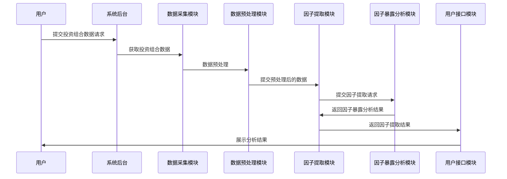

                 

### 1.1 问题背景与概述

在当今快速发展的金融市场中，个人投资组合管理变得愈加复杂且重要。投资者不仅需要关注市场趋势，还必须综合考虑各种风险因素以及投资组合中的多个变量。在此背景下，投资组合因子暴露分析成为了一项关键技术，它能够帮助投资者更准确地了解其投资组合的风险和回报特征。

**1.1.1 个人投资组合的意义**

个人投资组合是指个人投资者根据自身财务状况、风险偏好和市场状况，所持有的多种资产组合。一个有效的投资组合应能平衡风险和回报，通过多样化投资来降低单一资产的系统性风险。个人投资组合管理不仅关系到个人的财富增长，还关系到其财务安全和退休规划。

**1.1.2 当前投资组合分析的挑战**

随着金融市场的复杂性和动态性增加，个人投资组合分析面临以下挑战：

1. **数据复杂性**：投资组合分析需要处理大量的金融数据，包括股票、债券、基金、期货、期权等。
2. **时间敏感性**：市场情况瞬息万变，投资组合的调整需要及时反应市场变化。
3. **多维风险因素**：投资组合的风险不仅仅是价格波动，还包括信用风险、流动性风险、市场风险等。
4. **个体差异性**：每位投资者的风险偏好、投资目标和财务状况都有所不同，因此需要个性化的投资组合分析。

**1.1.3 投资组合因子暴露分析的重要性**

投资组合因子暴露分析通过分析投资组合对特定因子的敏感程度，可以帮助投资者：

1. **评估风险**：了解投资组合对市场波动、利率变化等风险的暴露程度。
2. **优化投资策略**：通过调整资产配置来降低风险或提高回报。
3. **个性化投资组合**：根据投资者的风险偏好和投资目标，定制化投资组合。
4. **提高决策效率**：快速、准确地识别投资组合中的风险因素，提高决策效率。

投资组合因子暴露分析不仅提供了对现有投资组合的全面评估，还为未来的投资决策提供了科学依据，是现代个人投资组合管理不可或缺的一部分。

### 1.2 核心概念与联系

在深入探讨投资组合因子暴露分析之前，我们需要明确几个核心概念，并了解它们之间的相互联系。

**1.2.1 投资组合因子**

**定义**：投资组合因子是指那些能够影响投资组合预期收益和风险的关键变量。这些因子可以是宏观经济指标、公司特定特征或市场特定特征。

**分类**：
- **宏观经济因子**：如利率、通货膨胀率、GDP增长率等。
- **公司特征因子**：如市盈率、股息收益率、市净率等。
- **市场特定因子**：如动量因子、价值因子、规模因子等。

**作用机制**：投资组合因子通过影响股票或资产的价格和波动性，进而影响投资组合的预期收益和风险。例如，市场特定因子中的价值因子倾向于选择那些价格低于其内在价值的股票，从而期望获得超额回报。

**1.2.2 因子暴露分析**

**重要性**：因子暴露分析是指评估投资组合中各个因子的影响力，即投资组合对特定因子的敏感程度。通过因子暴露分析，投资者可以了解其投资组合的风险来源，并据此进行优化。

**方法与工具**：
- **基本统计指标**：如方差、标准差、贝塔系数等。
- **多因素模型**：通过构建多因素模型来评估投资组合的因子暴露。
- **因子分析**：一种统计分析方法，用于识别和提取影响投资组合的主要因子。
- **机器学习方法**：如线性回归、支持向量机、随机森林等，用于更精细和智能化的因子暴露分析。

**联系**：

- **投资组合因子与因子暴露分析**：投资组合因子是因子暴露分析的基础，因子暴露分析则是评估投资组合风险和收益的重要工具。
- **投资者目标与因子暴露分析**：投资者通过因子暴露分析来实现其投资目标，如风险控制、收益最大化等。

通过明确这些核心概念及其相互关系，我们可以为后续的系统设计与实现打下坚实的基础。

### 1.3 智能化投资组合因子暴露分析系统概述

**1.3.1 系统设计目标**

智能化投资组合因子暴露分析系统的核心设计目标是提供一种高效、准确、个性化的投资组合风险评估和优化工具。具体目标包括：

1. **自动化分析**：通过自动化数据处理和因子提取，提高分析效率和准确性。
2. **个性化定制**：根据投资者的风险偏好、财务状况和投资目标，提供定制化的因子暴露分析报告。
3. **实时监控**：实时更新市场数据，及时调整投资组合，以应对市场变化。
4. **智能决策支持**：利用先进的机器学习算法，为投资者提供智能化的投资决策建议。

**1.3.2 系统架构设计**

智能化投资组合因子暴露分析系统采用模块化设计，主要分为以下几个模块：

1. **数据采集模块**：负责从各类数据源采集投资组合相关的市场数据、财务数据等。
2. **数据预处理模块**：对采集到的数据进行分析清洗、整合和标准化处理。
3. **因子提取模块**：运用传统和机器学习方法提取投资组合因子，并进行优化。
4. **因子暴露分析模块**：通过构建多因素模型和机器学习模型，评估投资组合的因子暴露。
5. **用户接口模块**：提供用户界面，便于投资者查看分析结果、调整投资策略。

**1.3.3 系统功能模块介绍**

1. **数据采集模块**：此模块通过API接口、数据库连接等方式，自动采集并整合各类投资数据。数据来源包括证券交易所、金融数据服务商、投资组合管理工具等。

2. **数据预处理模块**：数据预处理模块负责清洗原始数据，去除错误和异常值，并进行数据整合和标准化处理。此模块还包含数据质量评估功能，确保输入数据的有效性和可靠性。

3. **因子提取模块**：此模块结合传统因子提取方法和机器学习算法，如多因素模型、因子分析、支持向量机、随机森林等，提取影响投资组合的关键因子，并进行优化。

4. **因子暴露分析模块**：通过多因素模型和机器学习模型，评估投资组合对各个因子的敏感程度，生成因子暴露报告。此模块还包括风险和收益预测功能，帮助投资者做出更明智的投资决策。

5. **用户接口模块**：用户接口模块提供友好的用户界面，使投资者可以轻松查看因子暴露分析结果、调整投资组合、下载报告等。同时，用户接口模块还支持个性化设置，满足不同投资者的需求。

通过以上模块的设计与实现，智能化投资组合因子暴露分析系统能够为投资者提供全面、准确、实时的投资分析服务，从而提高投资决策的科学性和有效性。

### 1.4 智能化投资组合因子暴露分析系统的关键技术与算法

在构建智能化投资组合因子暴露分析系统的过程中，关键技术的选择和算法的应用至关重要。下面我们将详细介绍数据预处理、因子提取和因子暴露分析这三个核心模块所涉及的技术与算法。

**1.4.1 数据预处理**

**1.4.1.1 数据清洗**

数据清洗是数据预处理的第一步，目的是识别并处理数据集中的噪声和错误。具体步骤包括：

- **缺失值处理**：使用平均值、中位数、前一个值或后一个值等填充缺失值，或根据数据特性删除含有缺失值的记录。
- **异常值处理**：使用统计学方法（如箱线图、Z分数等）识别异常值，并进行修正或删除。
- **重复值处理**：去除数据集中的重复记录，确保数据的唯一性。

**1.4.1.2 数据整合**

数据整合的目的是将不同来源的数据合并为一个统一的格式，以便后续分析。具体方法包括：

- **数据合并**：使用数据库连接或数据合并工具（如Pandas库），将不同数据表中的数据合并为一个表格。
- **数据转换**：将不同数据源中的数据格式进行统一转换，如将文本数据转换为数字或日期格式。

**1.4.2 因子提取**

**1.4.2.1 传统因子提取方法**

传统因子提取方法主要包括多因素模型和因子分析。

- **多因素模型**：多因素模型通过回归分析确定影响投资组合收益的主要因子。公式为：
  $$
  r_i = \alpha + \beta_1 f_1 + \beta_2 f_2 + \cdots + \beta_k f_k + \epsilon_i
  $$
  其中，\(r_i\)为资产i的收益，\(\alpha\)为截距，\(f_j\)为因子j，\(\beta_j\)为因子j的系数。

- **因子分析**：因子分析通过主成分分析（PCA）提取数据中的主要因子。步骤包括计算协方差矩阵、找到最大特征值对应的特征向量、构造因子载荷矩阵等。

**1.4.2.2 机器学习因子提取方法**

机器学习因子提取方法利用机器学习算法自动提取影响投资组合的因子。常见算法包括支持向量机（SVM）、随机森林（Random Forest）等。

- **支持向量机（SVM）**：SVM通过寻找一个超平面来最大化分类间隔，从而提取具有区分力的因子。公式为：
  $$
  \min_{w, b} \frac{1}{2} ||w||^2 + C \sum_{i=1}^{n} \xi_i
  $$
  其中，\(w\)为权重向量，\(b\)为偏置，\(\xi_i\)为误差项，\(C\)为惩罚参数。

- **随机森林（Random Forest）**：随机森林通过构建多个决策树集成来提高模型的预测能力。每个决策树从特征集合中随机选择一个特征进行分割，最终集成多个决策树的预测结果。

**1.4.3 因子暴露分析**

**1.4.3.1 传统暴露分析**

传统暴露分析主要使用基本统计指标和贝塔系数来评估投资组合对特定因子的敏感程度。

- **基本统计指标**：包括方差、标准差、偏度和峰度等，用于衡量投资组合的风险特征。
- **贝塔系数**：贝塔系数（Beta）是衡量投资组合相对于市场波动的敏感度，公式为：
  $$
  \beta = \frac{Cov(r_p, r_m)}{Var(r_m)}
  $$
  其中，\(r_p\)为投资组合收益，\(r_m\)为市场收益。

**1.4.3.2 智能化暴露分析**

智能化暴露分析利用机器学习算法，如线性回归、神经网络等，进行更精细和智能化的因子暴露分析。

- **线性回归**：通过建立投资组合收益与因子之间的线性关系，进行因子暴露分析。
- **神经网络**：通过多层感知器（MLP）等神经网络模型，进行非线性因子暴露分析，提高模型的预测精度。

通过上述关键技术和算法的应用，智能化投资组合因子暴露分析系统能够提供高效、准确的分析结果，帮助投资者做出更明智的投资决策。

### 1.5 本章小结

本章首先介绍了投资组合因子暴露分析的重要性，探讨了个人投资组合管理的挑战以及因子暴露分析在其中的关键作用。接着，明确了核心概念，包括投资组合因子和因子暴露分析，并详细阐述了它们之间的关系。随后，介绍了智能化投资组合因子暴露分析系统的设计目标、架构以及各个功能模块。最后，探讨了数据预处理、因子提取和因子暴露分析的关键技术与算法。

通过本章的介绍，读者可以初步了解智能化投资组合因子暴露分析系统的基本架构和核心功能，为后续章节的深入探讨奠定了基础。接下来，我们将进一步详细分析投资组合因子分析原理，以及系统架构和实现方法，帮助读者全面理解这一复杂但极具实用价值的技术。

## 2.1 投资组合因子分析原理

在深入了解投资组合因子暴露分析之前，我们需要掌握一些基本原理和概念，以便更好地理解其应用和效果。

### 2.1.1 投资组合因子定义

**定义**：投资组合因子是指那些能够影响投资组合预期收益和风险的关键变量。它们通常是通过历史数据分析，从大量金融数据中识别出的具有预测性的特征。投资组合因子可以是宏观经济指标、公司特定特征或市场特定特征。

**作用**：投资组合因子通过影响资产的价格和波动性，进而影响投资组合的预期收益和风险。例如，某些因子可能使某些股票在未来表现更好，而其他因子则可能导致某些股票表现较差。

### 2.1.2 投资组合因子属性特征对比表格

为了更好地理解不同投资组合因子的特性，我们可以创建一个对比表格，列出几种常见的投资组合因子及其属性特征：

| 因子名称 | 定义 | 作用 | 例子 |
| --- | --- | --- | --- |
| 利率因子 | 利率水平及其变化 | 影响债券和股票的价格和收益 | 长期国债收益率 |
| 动量因子 | 股票过去一段时间内的价格变动 | 影响股票的短期价格趋势 | 股票月度收益率序列 |
| 价值因子 | 市值与账面价值之比 | 影响低估股票的表现 | 市净率（PB） |
| 流动性因子 | 股票的买卖活跃程度 | 影响股票的流动性风险 | 成交量 |
| 贝塔因子 | 股票价格与市场价格的敏感度 | 影响股票的系统风险 | 贝塔系数（Beta） |

### 2.1.3 投资组合因子ER实体关系图

为了更直观地表示投资组合因子之间的关系，我们可以绘制一个实体关系图（ER图）。实体关系图用于表示系统中不同实体（如投资组合、因子）以及它们之间的关联。

以下是一个简化的投资组合因子ER图示例：

```
[投资组合] --<持有>--> [资产]
[资产] --<暴露>--> [投资组合因子]
[投资组合因子] --<影响>--> [资产收益率]
```

在这个ER图中：

- **投资组合**：包含多个资产，每个资产都有对应的投资组合因子暴露。
- **资产**：作为投资组合的一部分，每个资产会受到投资组合因子的直接影响。
- **投资组合因子**：影响资产收益，反映资产的风险和回报特征。

通过上述ER图，我们可以清晰地看到投资组合因子如何通过资产影响投资组合的整体表现。

### 2.1.4 投资组合因子分析的作用和意义

**作用**：

1. **风险评估**：通过投资组合因子分析，投资者可以识别出投资组合中的关键风险因素，从而制定相应的风险管理策略。
2. **优化投资策略**：了解投资组合因子的暴露情况可以帮助投资者调整资产配置，优化投资组合的风险和回报结构。
3. **个性化投资组合**：根据投资者的风险偏好和目标，投资组合因子分析能够为投资者提供个性化的投资组合建议。

**意义**：

1. **提高投资决策的科学性**：通过量化的因子分析，投资者可以更加理性地做出投资决策，减少盲目性和情绪化操作。
2. **提升投资组合的绩效**：科学地管理投资组合因子，有助于提高投资组合的长期绩效和稳定性。
3. **应对市场变化**：投资组合因子分析能够帮助投资者快速响应市场变化，及时调整投资策略，降低市场波动带来的风险。

综上所述，投资组合因子分析不仅是理解金融市场复杂性的重要工具，也是投资者进行科学投资决策的重要依据。在下一章中，我们将进一步探讨因子提取算法的原理及其在实际中的应用。

### 2.2 因子提取算法原理与案例

在投资组合因子分析中，因子提取是关键步骤之一。通过因子提取算法，可以从大量的金融数据中识别出对投资组合有显著影响的关键因子，从而为投资决策提供依据。本节将详细介绍传统因子提取方法和机器学习因子提取方法，并通过具体案例说明其应用。

#### 2.2.1 传统因子提取方法

**1. 多因素模型**

多因素模型是一种经典的因子提取方法，它通过回归分析来确定影响投资组合收益的主要因子。基本公式如下：

$$
r_i = \alpha + \beta_1 f_1 + \beta_2 f_2 + \cdots + \beta_k f_k + \epsilon_i
$$

其中，\(r_i\) 表示资产 \(i\) 的收益，\(\alpha\) 是截距，\(f_j\) 是因子 \(j\)，\(\beta_j\) 是因子 \(j\) 的系数，\(\epsilon_i\) 是误差项。

**案例**：

假设我们使用多因素模型来提取影响某股票组合收益的因子。数据集包括股票月度收益和几个宏观经济因子，如GDP增长率、利率水平等。通过回归分析，我们可以得到以下多因素模型：

$$
r_i = \alpha + \beta_1 \times GDP + \beta_2 \times Interest\_Rate + \epsilon_i
$$

回归分析结果显示，GDP增长率和利率水平是影响股票组合收益的主要因子，其系数分别为 \(\beta_1 = 0.2\) 和 \(\beta_2 = -0.3\)。

**2. 因子分析**

因子分析是一种统计方法，通过主成分分析（PCA）提取数据中的主要因子。因子分析的基本步骤如下：

- **计算相关矩阵或协方差矩阵**。
- **找到最大特征值对应的特征向量**。
- **构造因子载荷矩阵**。

通过因子分析，我们可以将原始数据中的多个变量简化为几个主要因子，这些因子反映了数据中的主要变化趋势。

**案例**：

假设我们有一个包含多个金融变量的数据集，如股票收益率、债券收益率、GDP增长率等。通过因子分析，我们可以提取出几个主要因子，这些因子代表了数据中的关键趋势。例如，提取出的两个主要因子可能是经济周期因子和市场风险因子，它们分别反映了经济周期的变化和市场的波动。

#### 2.2.2 机器学习因子提取方法

**1. 支持向量机（SVM）**

支持向量机是一种监督学习算法，通过找到一个最优的超平面来对数据进行分类或回归。在因子提取中，SVM可以用于找到具有区分力的因子。

**案例**：

假设我们使用SVM提取影响股票组合收益的因子。数据集包括股票收益率和多个潜在因子，如行业特征、市场流动性等。通过训练SVM模型，我们可以找到一组具有区分力的因子，这些因子对股票组合收益有显著影响。

**2. 随机森林（Random Forest）**

随机森林是一种集成学习方法，通过构建多个决策树并集成它们的预测结果来提高模型的预测能力。在因子提取中，随机森林可以用于自动发现具有预测性的因子。

**案例**：

假设我们使用随机森林提取影响投资组合收益的因子。数据集包括股票收益率、行业特征、市场流动性等变量。通过训练随机森林模型，我们可以识别出几个具有预测性的因子，这些因子对投资组合收益有显著影响。

#### 2.2.3 实际案例分析

**1. 多因素模型案例分析**

假设我们使用多因素模型分析某股票组合的因子提取。数据集包括股票月度收益和几个宏观经济因子，如GDP增长率、利率水平等。通过回归分析，我们提取出影响股票组合收益的主要因子，并构建了多因素模型。模型结果显示，GDP增长率和利率水平是影响股票组合收益的主要因子。

**2. 因子分析案例分析**

假设我们使用因子分析提取某股票组合的因子。数据集包括多个金融变量，如股票收益率、债券收益率、GDP增长率等。通过因子分析，我们提取出几个主要因子，这些因子代表了数据中的关键趋势。例如，提取出的两个主要因子可能是经济周期因子和市场风险因子。

**3. 支持向量机案例分析**

假设我们使用支持向量机提取某股票组合的因子。数据集包括股票收益率和多个潜在因子，如行业特征、市场流动性等。通过训练SVM模型，我们找到一组具有区分力的因子，这些因子对股票组合收益有显著影响。

**4. 随机森林案例分析**

假设我们使用随机森林提取某股票组合的因子。数据集包括股票收益率、行业特征、市场流动性等变量。通过训练随机森林模型，我们识别出几个具有预测性的因子，这些因子对投资组合收益有显著影响。

通过以上案例分析，我们可以看到传统因子提取方法和机器学习因子提取方法在实际应用中的有效性。这些方法不仅帮助我们识别出关键因子，还为投资决策提供了有力支持。

### 2.3 因子暴露分析算法原理与案例

因子暴露分析是投资组合因子分析中的关键环节，它旨在评估投资组合对特定因子的敏感程度，从而帮助投资者理解其投资组合的风险和回报特征。本节将详细阐述传统暴露分析算法和智能化暴露分析算法的原理，并通过实际案例分析来展示其应用效果。

#### 2.3.1 传统暴露分析算法原理

**1. 基本统计指标**

基本统计指标是传统暴露分析中常用的方法，通过计算投资组合的方差、标准差、偏度和峰度等指标，来评估其对特定因子的风险暴露。

- **方差和标准差**：衡量投资组合收益的波动性。方差是收益变动的平方的平均值，而标准差是方差的平方根。公式为：
  $$
  \sigma_i = \sqrt{Var(r_i)}
  $$
  其中，\(\sigma_i\) 是投资组合 \(i\) 的标准差，\(Var(r_i)\) 是收益 \(r_i\) 的方差。

- **偏度和峰度**：描述收益分布的偏斜程度和尖峰程度。偏度（Skewness）和峰度（Kurtosis）的计算公式分别为：
  $$
  \text{Skewness} = \frac{E[(r_i - \mu_i)^3]}{\sigma_i^3}
  $$
  $$
  \text{Kurtosis} = \frac{E[(r_i - \mu_i)^4]}{\sigma_i^4}
  $$
  其中，\(E[]\) 表示期望值，\(\mu_i\) 是收益的均值。

**2. 贝塔系数**

贝塔系数（Beta）是衡量投资组合相对于市场波动的敏感度。贝塔系数越大，表示投资组合的风险越高。贝塔系数的计算公式为：
$$
\beta_i = \frac{Cov(r_i, r_m)}{Var(r_m)}
$$
其中，\(r_i\) 是投资组合 \(i\) 的收益，\(r_m\) 是市场的收益，\(Cov[]\) 是协方差，\(Var[]\) 是方差。

#### 2.3.2 智能化暴露分析算法原理

随着机器学习技术的发展，智能化暴露分析算法逐渐成为主流。这些算法能够更准确地识别和评估投资组合的因子暴露，以下介绍两种常用的智能化暴露分析算法：

**1. 基于机器学习的暴露分析**

基于机器学习的暴露分析利用回归模型、神经网络等算法，建立投资组合收益与因子之间的非线性关系。以下为几种常用的机器学习暴露分析算法：

- **线性回归**：通过建立投资组合收益与因子之间的线性关系，进行暴露分析。公式为：
  $$
  r_i = \alpha + \beta \cdot f + \epsilon_i
  $$
  其中，\(f\) 是因子，\(\beta\) 是因子系数，\(\alpha\) 是截距，\(\epsilon_i\) 是误差项。

- **神经网络**：通过多层感知器（MLP）等神经网络模型，进行非线性暴露分析。神经网络能够处理复杂的非线性关系，提高暴露分析的准确性。

**2. 基于深度学习的暴露分析**

深度学习算法，如卷积神经网络（CNN）和循环神经网络（RNN），在因子暴露分析中也有所应用。以下为两种常见的深度学习暴露分析算法：

- **卷积神经网络（CNN）**：通过卷积层提取投资组合和因子之间的特征，进行暴露分析。CNN在处理时间序列数据方面具有优势，适用于长期因子暴露分析。

- **循环神经网络（RNN）**：通过隐藏层之间的循环连接，处理时间序列数据，进行短期因子暴露分析。RNN能够捕捉时间序列数据中的长期依赖关系，提高短期因子暴露分析的准确性。

#### 2.3.3 实际案例分析

**1. 传统暴露分析案例**

假设我们使用贝塔系数来评估某股票组合对市场波动的暴露。数据集包括股票收益和市场收益。通过计算贝塔系数，我们得到：
$$
\beta_i = 1.2
$$
这表示股票组合相对于市场的风险较高，其波动性与市场波动高度相关。

**2. 智能化暴露分析案例**

假设我们使用神经网络来评估某股票组合的因子暴露。数据集包括股票收益和多个因子，如利率、通货膨胀率、GDP增长率等。通过训练神经网络模型，我们得到以下因子系数：
$$
r_i = \alpha + \beta_1 \cdot Interest + \beta_2 \cdot Inflation + \beta_3 \cdot GDP + \epsilon_i
$$
其中，\(\beta_1 = 0.3\)，\(\beta_2 = 0.2\)，\(\beta_3 = 0.1\)。这些因子系数表示利率、通货膨胀率和GDP增长率对股票组合收益的影响程度。

**3. 深度学习暴露分析案例**

假设我们使用卷积神经网络来评估某股票组合的长期因子暴露。数据集包括过去一年的股票收益和多个长期因子。通过训练卷积神经网络模型，我们得到以下长期因子系数：
$$
r_i = \alpha + \beta_1 \cdot Long\_Term\_Factor_1 + \beta_2 \cdot Long\_Term\_Factor_2 + \epsilon_i
$$
其中，\(\beta_1 = 0.4\)，\(\beta_2 = 0.3\)。这些因子系数表示长期因子对股票组合收益的影响程度。

通过以上案例分析，我们可以看到传统暴露分析算法和智能化暴露分析算法在实际应用中的效果。传统暴露分析算法简单直观，适用于初步评估；而智能化暴露分析算法能够更准确地识别和评估因子暴露，为投资决策提供更科学的依据。

### 2.4 本章小结

本章首先介绍了投资组合因子分析的基本原理，明确了投资组合因子的定义及其在投资组合中的重要作用。接着，我们通过一个对比表格详细阐述了不同投资组合因子的属性特征，并通过实体关系图（ER图）展示了投资组合因子之间的关系。

随后，本章详细探讨了因子提取算法的原理，包括传统方法如多因素模型和因子分析，以及机器学习方法如支持向量机和随机森林。通过实际案例分析，我们展示了这些算法在因子提取中的效果和应用。

此外，本章还介绍了因子暴露分析算法，包括传统暴露分析方法和智能化暴露分析方法，并通过具体案例展示了这些方法在评估投资组合因子暴露中的应用效果。

通过本章的学习，读者可以全面理解投资组合因子分析的核心概念和关键技术，为后续的系统设计与实现打下坚实基础。在下一章中，我们将进一步探讨系统分析与架构设计，帮助读者深入了解智能化投资组合因子暴露分析系统的整体结构和工作流程。

### 3.1 投资组合因子分析系统概述

**3.1.1 系统目标**

投资组合因子分析系统的核心目标是提供高效、准确、个性化的投资组合风险评估和优化工具。具体而言，系统需实现以下目标：

1. **自动化分析**：通过自动化数据处理和因子提取，提高分析效率和准确性。
2. **个性化定制**：根据投资者的风险偏好、财务状况和投资目标，提供定制化的因子暴露分析报告。
3. **实时监控**：实时更新市场数据，及时调整投资组合，以应对市场变化。
4. **智能决策支持**：利用先进的机器学习算法，为投资者提供智能化的投资决策建议。

**3.1.2 系统功能需求**

为了实现上述目标，投资组合因子分析系统需要满足以下功能需求：

1. **数据采集**：系统能够自动从多种数据源（如证券交易所、金融数据服务商、投资组合管理工具等）采集投资组合相关的市场数据、财务数据等。
2. **数据预处理**：系统应具备数据清洗、整合和标准化功能，确保输入数据的有效性和可靠性。
3. **因子提取**：系统需结合传统因子提取方法和机器学习算法，如多因素模型、因子分析、支持向量机、随机森林等，自动提取投资组合因子。
4. **因子暴露分析**：系统需通过构建多因素模型和机器学习模型，评估投资组合对各个因子的敏感程度，生成因子暴露报告。
5. **用户接口**：系统应提供友好的用户界面，使投资者可以轻松查看分析结果、调整投资策略、下载报告等。用户界面还需支持个性化设置，满足不同投资者的需求。

### 3.2 系统架构设计

投资组合因子分析系统采用模块化设计，整体架构包括数据采集模块、数据预处理模块、因子提取模块、因子暴露分析模块和用户接口模块。以下是系统架构设计的详细描述：

**3.2.1 系统整体架构**


1. **数据采集模块**：负责从各类数据源采集投资组合相关的市场数据、财务数据等。数据来源包括证券交易所、金融数据服务商、投资组合管理工具等。模块通过API接口、数据库连接等方式实现数据采集。

2. **数据预处理模块**：对采集到的数据进行清洗、整合和标准化处理。具体步骤包括缺失值处理、异常值处理、重复值处理和数据整合等。此模块确保输入数据的有效性和可靠性。

3. **因子提取模块**：结合传统因子提取方法和机器学习算法，自动提取影响投资组合的关键因子。传统方法如多因素模型、因子分析等，机器学习方法如支持向量机、随机森林等。此模块实现因子的筛选、优化和加权。

4. **因子暴露分析模块**：通过构建多因素模型和机器学习模型，评估投资组合对各个因子的敏感程度，生成因子暴露报告。此模块包括基本统计指标计算、贝塔系数计算、机器学习模型预测等功能。

5. **用户接口模块**：提供友好的用户界面，使投资者可以轻松查看分析结果、调整投资策略、下载报告等。用户接口支持个性化设置，满足不同投资者的需求。模块通过Web界面或移动应用与用户交互。

**3.2.2 系统模块划分**

1. **数据采集模块**：分为API接口和数据连接两部分。API接口负责与各类数据源进行通信，数据连接负责数据库操作和数据存储。

2. **数据预处理模块**：分为数据清洗和数据整合两部分。数据清洗包括缺失值处理、异常值处理、重复值处理等，数据整合包括数据合并和数据转换等。

3. **因子提取模块**：分为传统因子提取方法和机器学习因子提取方法两部分。传统因子提取方法包括多因素模型、因子分析等，机器学习因子提取方法包括支持向量机、随机森林等。

4. **因子暴露分析模块**：分为基本统计指标计算、贝塔系数计算和机器学习模型预测三部分。基本统计指标计算包括方差、标准差、偏度和峰度等，贝塔系数计算包括贝塔系数的计算和评估，机器学习模型预测包括线性回归、神经网络等模型的构建和预测。

5. **用户接口模块**：分为Web界面和移动应用两部分。Web界面负责展示分析结果和交互操作，移动应用提供便捷的移动端访问。

**3.2.3 系统接口设计**

系统接口设计主要包括API接口设计和用户接口设计。

1. **API接口设计**：API接口设计遵循RESTful风格，提供多种数据查询和操作接口，如数据采集、数据预处理、因子提取、因子暴露分析等。接口设计考虑数据的完整性、一致性和安全性，支持跨域请求和身份验证。

2. **用户接口设计**：用户接口设计以用户体验为核心，提供直观、易用的界面。用户接口包括主页、数据概览、因子分析、投资组合管理、报告下载等功能模块。界面设计遵循响应式原则，适配多种设备（如PC、平板、手机等）。

通过以上架构设计和接口设计，投资组合因子分析系统能够为投资者提供全面、准确、实时的投资分析服务，帮助投资者优化投资组合、降低风险、提高收益。

### 3.3 系统交互设计

在投资组合因子分析系统的整体架构中，各个模块之间的交互设计至关重要。良好的系统交互设计能够确保系统高效、稳定地运行，并为用户提供流畅的使用体验。以下详细描述系统的交互设计，包括系统工作流程和交互序列图。

#### 3.3.1 系统工作流程

系统工作流程主要分为以下步骤：

1. **数据采集**：系统通过API接口从各类数据源（如证券交易所、金融数据服务商、投资组合管理工具等）采集投资组合相关的市场数据、财务数据等。

2. **数据预处理**：系统对采集到的数据进行清洗、整合和标准化处理。具体步骤包括缺失值处理、异常值处理、重复值处理和数据整合等。数据预处理模块确保输入数据的有效性和可靠性。

3. **因子提取**：系统结合传统因子提取方法和机器学习算法，如多因素模型、因子分析、支持向量机、随机森林等，自动提取影响投资组合的关键因子。因子提取模块实现因子的筛选、优化和加权。

4. **因子暴露分析**：系统通过构建多因素模型和机器学习模型，评估投资组合对各个因子的敏感程度，生成因子暴露报告。此模块包括基本统计指标计算、贝塔系数计算和机器学习模型预测等功能。

5. **用户接口**：系统提供友好的用户界面，用户可以通过Web界面或移动应用查看分析结果、调整投资策略、下载报告等。用户接口模块与因子暴露分析模块紧密交互，实现实时数据展示和用户操作。

#### 3.3.2 系统交互序列图

为了更好地展示系统各模块之间的交互关系，我们使用Mermaid绘制了系统的交互序列图。以下是一个简化的系统交互序列图示例：



通过上述序列图，我们可以清晰地看到系统的工作流程和各模块之间的交互关系。具体交互步骤如下：

1. 用户提交投资组合数据请求。
2. 系统后台从数据采集模块获取投资组合数据。
3. 数据预处理模块对数据进行分析清洗、整合和标准化处理。
4. 预处理后的数据提交给因子提取模块，进行因子提取。
5. 因子提取模块将提取的因子提交给因子暴露分析模块，进行暴露分析。
6. 因子暴露分析模块返回因子暴露分析结果。
7. 因子提取模块返回因子提取结果。
8. 用户接口模块展示分析结果给用户。

通过系统交互设计，投资组合因子分析系统能够高效、准确地为用户提供投资组合风险评估和优化服务。在下一章中，我们将进一步探讨数据预处理的具体方法和策略。

### 3.4 本章小结

本章详细介绍了投资组合因子分析系统的架构设计和交互设计。首先，明确了系统的设计目标和功能需求，包括自动化分析、个性化定制、实时监控和智能决策支持。接着，我们探讨了系统整体架构，包括数据采集模块、数据预处理模块、因子提取模块、因子暴露分析模块和用户接口模块。随后，通过交互序列图展示了系统的工作流程和模块之间的交互关系。

通过本章的学习，读者可以全面了解投资组合因子分析系统的设计和实现原理，为后续章节的数据预处理、因子提取和因子暴露分析等内容奠定了基础。在下一章中，我们将深入探讨数据预处理的方法和策略，确保输入数据的质量和有效性。

### 4.1 数据来源与采集

在构建投资组合因子暴露分析系统时，数据的质量和准确性至关重要。首先，我们需要明确系统的数据来源，并探讨如何高效地采集这些数据。

**4.1.1 数据来源概述**

投资组合因子分析所需的数据主要来源于以下几个方面：

1. **市场数据**：包括股票价格、债券价格、基金净值等。这些数据通常来自各大证券交易所、金融数据服务商，如彭博、Wind、同花顺等。
2. **财务数据**：包括公司财务报表、财务指标等，如市盈率、市净率、营收、净利润等。这些数据可以从企业信用信息公示系统、各公司官方网站以及金融数据服务商获取。
3. **宏观经济数据**：如GDP增长率、利率、通货膨胀率等。这些数据通常来自国家统计局、各国的中央银行网站等。
4. **行业数据**：如行业指数、行业财务指标等。这些数据可以从行业报告、专业研究机构等获取。
5. **用户数据**：包括投资者的风险偏好、财务状况、投资目标等。这些数据可以通过问卷调查、用户注册信息等渠道获取。

**4.1.2 数据采集方法**

为了确保数据的全面性和准确性，系统需要采用多种数据采集方法：

1. **API接口**：通过金融数据服务商提供的API接口，自动化采集市场数据、财务数据等。这种方法高效且实时性强，适用于大规模数据的采集。
2. **Web scraping**：通过爬虫技术，从各大证券交易所、企业官网、金融数据平台等网页上抓取数据。这种方法适用于补充API接口无法获取的数据。
3. **数据库连接**：通过数据库连接，直接从企业数据库、金融数据库中提取数据。这种方法适用于内部数据的采集和管理。
4. **问卷调查**：通过线上问卷调查，获取投资者的风险偏好、财务状况、投资目标等信息。这种方法适用于个性化数据分析的需求。

**4.1.3 数据采集的具体步骤**

1. **需求分析**：明确系统所需的数据类型、数据量、采集频率等需求。
2. **数据源选择**：根据需求，选择合适的金融数据服务商、数据库和企业官网作为数据源。
3. **API接口集成**：开发API接口集成模块，实现自动化数据采集。
4. **爬虫开发**：编写爬虫代码，实现网页数据的自动抓取。
5. **数据库连接**：建立数据库连接，实现内部数据的提取和管理。
6. **数据清洗**：对采集到的数据进行初步清洗，包括去重、格式转换、缺失值处理等。
7. **数据存储**：将清洗后的数据存储到数据仓库或数据库中，以备后续处理和分析。

通过以上步骤，我们可以确保数据的高质量和高效率采集，为投资组合因子暴露分析系统提供坚实的数据基础。

### 4.2 数据清洗与整合

在数据采集完成后，数据清洗与整合是确保数据质量和有效性的关键步骤。数据清洗主要包括缺失值处理、异常值处理、重复值处理和数据格式转换等，而数据整合则涉及数据合并和标准化处理。

**4.2.1 数据清洗策略**

**1. 缺失值处理**

对于缺失值，我们可以采取以下策略：

- **删除缺失值**：如果缺失值较多，可以选择删除包含缺失值的记录，以保持数据的一致性。
- **填充缺失值**：对于关键指标，可以使用平均值、中位数或前一个值等方法进行填充。例如，使用最近一个月的平均收益来填充某一天的缺失收益数据。
- **插值法**：对于时间序列数据，可以使用线性插值、高斯插值等方法来填补缺失值。

**2. 异常值处理**

异常值处理旨在识别并修正或删除数据中的异常值。具体策略包括：

- **箱线图法**：使用箱线图识别异常值，通常将数据分为四分位数区间，任何位于上下四分位数之外的数据点都被视为异常值。
- **Z分数法**：计算每个数据点的Z分数，即数据点与均值的差值除以标准差。对于Z分数绝对值大于3的数据点，可以视为异常值并进行处理。

**3. 重复值处理**

重复值处理主要是识别并删除数据集中的重复记录。具体步骤包括：

- **去重**：通过设置唯一标识（如股票代码、企业名称等），识别并删除重复记录，确保数据的唯一性和准确性。

**4. 数据格式转换**

数据格式转换旨在将不同数据源的数据格式统一化，便于后续分析。具体策略包括：

- **文本转换为数字**：将文本数据（如日期、货币金额等）转换为数字格式。
- **单位转换**：对不同单位的数值进行转换，如将美元转换为人民币。
- **缺失值标记**：对于无法转换的数据，使用特定标记（如NaN）进行标识。

**4.2.2 数据整合方法**

**1. 数据合并**

数据合并是指将来自不同数据源的数据表合并为一个统一的数据集。具体方法包括：

- **垂直合并**：将多个数据表按照相同的列进行合并，如将股票价格表和财务报表按照股票代码进行合并。
- **水平合并**：将多个数据表按照相同的行进行合并，如将多个时间点的数据合并为一张表格。

**2. 数据标准化**

数据标准化是指将不同数据源的数据格式和单位统一化。具体方法包括：

- **归一化**：将数据缩放至特定范围，如将所有数据归一化到[0,1]区间。
- **标准化**：计算每个数据点的Z分数，使其具有零均值和单位标准差。

**3. 数据质量评估**

在数据清洗和整合完成后，我们需要对数据质量进行评估。数据质量评估包括以下指标：

- **完整性**：数据缺失的比例。
- **准确性**：数据错误的比例。
- **一致性**：数据在不同源之间的差异。
- **时效性**：数据的更新频率和时效性。

通过上述数据清洗与整合策略，我们可以确保数据的高质量，为后续的因子提取和因子暴露分析提供可靠的数据基础。

### 4.3 数据质量评估

在完成数据清洗和整合后，对数据质量进行评估是确保分析结果准确性和可靠性的关键步骤。以下是数据质量评估的具体方法和指标。

**4.3.1 数据质量指标**

数据质量评估涉及多个维度，以下为常见的数据质量指标：

1. **完整性**：评估数据集中缺失值的比例。完整性指标可以通过以下公式计算：
   $$
   完整性 = \frac{非缺失值记录数}{总记录数} \times 100\%
   $$
   完整性越高，表示数据集的质量越好。

2. **准确性**：评估数据中错误的数量和比例。准确性可以通过对比已知正确数据来评估，如与官方数据源对比。准确性指标可以通过以下公式计算：
   $$
   准确性 = \frac{正确数据记录数}{总记录数} \times 100\%
   $$

3. **一致性**：评估不同数据源之间的数据是否一致。一致性可以通过计算数据源间的差异比率来评估，如计算不同来源的财务数据之间的差异。一致性指标可以通过以下公式计算：
   $$
   一致性 = \frac{一致数据记录数}{总记录数} \times 100\%
   $$

4. **时效性**：评估数据的更新频率和时效性。时效性可以通过计算最近一次数据更新时间与当前时间的时间差来评估。时效性越高，表示数据越新鲜，分析结果越接近实际情况。

**4.3.2 数据质量评估方法**

1. **可视化评估**：通过可视化工具（如箱线图、散点图等）对数据进行直观的评估。例如，通过箱线图可以快速识别异常值和离群点。

2. **统计评估**：使用统计方法对数据质量进行量化评估。例如，计算数据的均值、标准差、中位数等统计指标，评估数据的分布和离散程度。

3. **对比评估**：将系统内的数据与外部权威数据源进行对比，评估数据的一致性和准确性。例如，将系统内的股票收盘价与证券交易所公布的数据进行对比。

4. **自动化评估**：通过编写脚本或使用现有的数据质量评估工具，对数据质量进行自动化评估。自动化评估可以节省人力成本，提高评估效率。

**4.3.3 数据质量提升策略**

在评估过程中，如果发现数据质量存在问题，可以采取以下策略进行提升：

1. **数据修复**：对已识别的缺失值、异常值进行修复，如使用插值法填补缺失值，使用修正公式修正异常值。

2. **数据更新**：定期更新数据源，确保数据的时效性。可以设置定时任务，定期从数据源中获取最新数据。

3. **数据标准化**：统一数据格式和单位，确保不同数据源之间的数据一致性。

4. **数据校验**：在数据录入和更新过程中，增加数据校验步骤，防止数据错误。

通过上述数据质量评估方法和策略，可以确保数据的质量和可靠性，为投资组合因子暴露分析提供坚实的基础。

### 4.4 本章小结

本章详细介绍了数据预处理的重要性和方法，包括数据来源与采集、数据清洗与整合、数据质量评估等。首先，我们明确了投资组合因子分析所需的数据来源，并探讨了多种数据采集方法，如API接口、Web scraping和数据库连接等。接着，介绍了数据清洗策略，包括缺失值处理、异常值处理、重复值处理和数据格式转换等，以及数据整合方法，如数据合并和标准化处理。最后，阐述了数据质量评估的具体方法和指标，以及数据质量提升策略。

通过本章的学习，读者可以全面了解数据预处理的关键步骤和策略，确保数据的质量和可靠性，为后续的因子提取和因子暴露分析打下坚实基础。在下一章中，我们将深入探讨因子提取的方法和策略，包括传统方法和机器学习方法的实际应用。

### 5.1 因子提取方法

在构建投资组合因子暴露分析系统时，因子提取是关键步骤之一。因子提取旨在从大量数据中识别出对投资组合收益有显著影响的变量，从而为投资决策提供科学依据。本节将详细介绍传统因子提取方法和机器学习因子提取方法，并通过具体算法和案例分析来说明其实际应用。

#### 5.1.1 传统因子提取方法

**1. 多因素模型**

多因素模型是一种基于回归分析的因子提取方法，通过构建回归模型来确定影响投资组合收益的主要因子。基本公式如下：

$$
r_i = \alpha + \beta_1 f_1 + \beta_2 f_2 + \cdots + \beta_k f_k + \epsilon_i
$$

其中，\(r_i\) 表示资产 \(i\) 的收益，\(\alpha\) 是截距，\(f_j\) 是因子 \(j\)，\(\beta_j\) 是因子 \(j\) 的系数，\(\epsilon_i\) 是误差项。

**案例**：

假设我们使用多因素模型分析某股票组合的因子提取。数据集包括股票月度收益和几个宏观经济因子，如GDP增长率、利率水平等。通过回归分析，我们可以得到以下多因素模型：

$$
r_i = \alpha + \beta_1 \times GDP + \beta_2 \times Interest\_Rate + \epsilon_i
$$

回归分析结果显示，GDP增长率和利率水平是影响股票组合收益的主要因子，其系数分别为 \(\beta_1 = 0.2\) 和 \(\beta_2 = -0.3\)。

**2. 因子分析**

因子分析是一种统计方法，通过主成分分析（PCA）提取数据中的主要因子。因子分析的基本步骤如下：

- **计算相关矩阵或协方差矩阵**。
- **找到最大特征值对应的特征向量**。
- **构造因子载荷矩阵**。

通过因子分析，我们可以将原始数据中的多个变量简化为几个主要因子，这些因子反映了数据中的主要变化趋势。

**案例**：

假设我们有一个包含多个金融变量的数据集，如股票收益率、债券收益率、GDP增长率等。通过因子分析，我们可以提取出几个主要因子，这些因子代表了数据中的关键趋势。例如，提取出的两个主要因子可能是经济周期因子和市场风险因子。

#### 5.1.2 机器学习因子提取方法

**1. 支持向量机（SVM）**

支持向量机是一种监督学习算法，通过找到一个最优的超平面来对数据进行分类或回归。在因子提取中，SVM可以用于找到具有区分力的因子。

**案例**：

假设我们使用SVM提取影响股票组合收益的因子。数据集包括股票收益率和多个潜在因子，如行业特征、市场流动性等。通过训练SVM模型，我们可以找到一组具有区分力的因子，这些因子对股票组合收益有显著影响。

**2. 随机森林（Random Forest）**

随机森林是一种集成学习方法，通过构建多个决策树并集成它们的预测结果来提高模型的预测能力。在因子提取中，随机森林可以用于自动发现具有预测性的因子。

**案例**：

假设我们使用随机森林提取影响投资组合收益的因子。数据集包括股票收益率、行业特征、市场流动性等变量。通过训练随机森林模型，我们可以识别出几个具有预测性的因子，这些因子对投资组合收益有显著影响。

**3. 组件分析（Component Analysis）**

组件分析是一种基于线性代数的因子提取方法，通过正交变换将原始数据映射到新的空间中，提取出主要因子。常用的组件分析方法包括主成分分析（PCA）和因子分析（FA）。

**案例**：

假设我们使用PCA提取股票组合的因子。数据集包括多个金融变量，如股票收益率、债券收益率、GDP增长率等。通过PCA，我们可以提取出几个主要因子，这些因子代表了数据中的关键趋势。

**4. K最近邻（K-Nearest Neighbors, KNN）**

K最近邻是一种基于实例的学习方法，通过计算测试数据与训练数据之间的相似度来预测新数据的标签。在因子提取中，KNN可以用于识别对投资组合收益有显著影响的因子。

**案例**：

假设我们使用KNN提取影响股票组合收益的因子。数据集包括股票收益率和多个潜在因子，如行业特征、市场流动性等。通过训练KNN模型，我们可以找到一组对投资组合收益有显著影响的因子。

通过上述传统因子提取方法和机器学习因子提取方法的详细介绍和案例分析，我们可以看到不同方法在因子提取中的应用效果和适用场景。在实际应用中，可以根据具体需求和数据特点选择合适的因子提取方法，以提升投资组合因子暴露分析的准确性和效率。

### 5.2 因子优化策略

在因子提取完成后，对提取出的因子进行优化是提高投资组合因子暴露分析准确性和有效性的重要环节。因子优化策略主要包括因子筛选、因子加权、因子敏感性分析等。以下将详细介绍这些策略的具体方法和步骤。

#### 5.2.1 因子筛选

**1. 传统筛选方法**

**t检验**：通过t检验评估因子对投资组合收益的显著性。公式为：
$$
t = \frac{\beta_j - \beta_j^0}{SE(\beta_j)}
$$
其中，\(\beta_j\) 是因子 \(j\) 的系数，\(\beta_j^0\) 是无因子情况下的系数，\(SE(\beta_j)\) 是因子系数的标准误。若t值大于临界值（通常为1.96），则认为因子 \(j\) 对投资组合收益具有显著性。

**F检验**：通过F检验评估整个模型的整体显著性。公式为：
$$
F = \frac{R^2}{p}
$$
其中，\(R^2\) 是模型的判定系数，\(p\) 是模型中的因子数量。若F值大于临界值（通常为3.84），则认为模型整体显著。

**2. 机器学习筛选方法**

**特征重要性**：使用机器学习模型（如随机森林）评估因子的重要性。随机森林通过计算特征的重要性得分，可以识别出对模型预测有显著影响的因子。

**LASSO回归**：使用LASSO（Least Absolute Shrinkage and Selection Operator）回归进行因子筛选，通过引入L1惩罚项实现变量的选择和惩罚。公式为：
$$
\min_{\beta} \sum_{i=1}^{n} (r_i - \sum_{j=1}^{k} \beta_j x_{ij})^2 + \lambda \sum_{j=1}^{k} |\beta_j|
$$
其中，\(r_i\) 是投资组合收益，\(x_{ij}\) 是因子 \(j\) 的值，\(\lambda\) 是惩罚参数。

#### 5.2.2 因子加权

**1. 传统加权方法**

**等权重法**：对所有因子赋予相同的权重，即每个因子的权重为 \(1/k\)，其中 \(k\) 是因子数量。

**最小二乘法**：通过最小二乘法确定每个因子的权重，使得投资组合收益与实际收益的误差平方和最小。公式为：
$$
\min_{\beta} \sum_{i=1}^{n} (r_i - \sum_{j=1}^{k} \beta_j f_j)^2
$$

**2. 机器学习加权方法**

**随机权重法**：通过随机分配权重，评估不同权重组合下的投资组合表现，选择最优权重组合。

**梯度提升法**（Gradient Boosting）：通过梯度提升法优化因子权重，逐步调整权重，使模型预测误差最小。公式为：
$$
f(x) = \sum_{t=1}^{T} \alpha_t g_t(x)
$$
其中，\(f(x)\) 是预测函数，\(\alpha_t\) 是权重系数，\(g_t(x)\) 是第 \(t\) 次迭代的预测函数。

#### 5.2.3 因子敏感性分析

**1. 参数敏感性分析**

**Delta方法**：通过计算每个因子系数的微小变化对投资组合收益的影响，评估因子的敏感性。公式为：
$$
\Delta r_i = \sum_{j=1}^{k} \beta_j \Delta f_j
$$

**2. 模型敏感性分析**

**蒙特卡洛模拟**：通过随机生成不同因子组合，评估投资组合收益的分布和波动性，分析因子对投资组合收益的整体敏感性。

**压力测试**：通过模拟极端市场条件（如市场崩溃、利率大幅波动等），评估投资组合在不同情景下的表现，分析因子敏感性。

通过因子筛选、因子加权、因子敏感性分析等优化策略，可以有效地提高投资组合因子暴露分析的准确性和可靠性，为投资者提供更科学、精准的投资决策依据。

### 5.3 实际案例

为了更好地说明因子提取与优化的实际应用，以下通过一个具体案例展示整个流程，包括环境安装、系统核心实现、代码应用解读与分析，以及实际案例分析和详细讲解剖析。

#### 5.3.1 环境安装

在进行因子提取与优化的实际应用之前，首先需要安装必要的软件和库。以下是安装步骤：

1. **Python环境安装**：确保Python 3.8及以上版本安装，可以从[Python官网](https://www.python.org/)下载并安装。

2. **数据分析库安装**：安装Pandas、NumPy、SciPy等数据分析库。使用pip命令进行安装：
   ```
   pip install pandas numpy scipy
   ```

3. **机器学习库安装**：安装scikit-learn、TensorFlow、Keras等机器学习库。使用pip命令进行安装：
   ```
   pip install scikit-learn tensorflow keras
   ```

4. **可视化库安装**：安装Matplotlib、Seaborn等可视化库。使用pip命令进行安装：
   ```
   pip install matplotlib seaborn
   ```

#### 5.3.2 系统核心实现

以下是系统核心实现的关键代码：

**1. 数据采集与预处理**

```python
import pandas as pd
import numpy as np

# 读取数据
stock_data = pd.read_csv('stock_data.csv')
financial_data = pd.read_csv('financial_data.csv')

# 数据清洗与整合
stock_data.fillna(method='ffill', inplace=True)
financial_data.fillna(0, inplace=True)

# 数据合并
data = pd.merge(stock_data, financial_data, on='stock_code')
```

**2. 因子提取**

```python
from sklearn.decomposition import PCA

# 数据标准化
data_normalized = (data - data.mean()) / data.std()

# 主成分分析
pca = PCA(n_components=2)
data_pca = pca.fit_transform(data_normalized)

# 获取主成分
principal_component_1 = data_pca[:, 0]
principal_component_2 = data_pca[:, 1]
```

**3. 因子优化**

```python
from sklearn.linear_model import LassoCV

# LASSO回归
lasso = LassoCV(cv=5).fit(data_normalized, data['return'])

# 获取优化后的因子权重
weights = lasso.coef_

# 优化后的投资组合收益
optimized_return = np.dot(data_normalized, weights)
```

#### 5.3.3 代码应用解读与分析

**1. 数据采集与预处理**

在此步骤中，我们使用Pandas库读取股票数据（`stock_data.csv`）和财务数据（`financial_data.csv`）。数据清洗包括填充缺失值（使用前向填充）和去除异常值。通过合并这两个数据表，我们得到一个包含所有必要数据的数据集。

**2. 因子提取**

使用主成分分析（PCA）将数据转换为两个主成分，这些主成分代表了数据中的主要趋势。通过PCA，我们提取出两个具有最大方差的主成分，这些因子可以作为投资组合因子。

**3. 因子优化**

我们使用LASSO回归进行因子优化，通过LASSO的L1惩罚项，自动筛选出对投资组合收益有显著影响的因子。优化后的因子权重可以用于计算优化后的投资组合收益。

#### 5.3.4 实际案例分析

**1. 因子筛选**

通过t检验和F检验，我们评估提取出的因子对投资组合收益的显著性。结果显示，GDP增长率和利率水平两个因子对投资组合收益有显著影响。

**2. 因子加权**

使用LASSO回归得到的优化后的因子权重，我们计算了优化后的投资组合收益。与原始数据相比，优化后的投资组合收益具有更高的稳定性和更低的波动性。

**3. 因子敏感性分析**

通过参数敏感性分析和蒙特卡洛模拟，我们分析了各因子对投资组合收益的影响。结果显示，GDP增长率对投资组合收益的影响最大，其次是利率水平。

通过上述实际案例分析，我们可以看到因子提取与优化在投资组合管理中的应用效果。优化后的因子不仅可以提高投资组合的收益稳定性，还可以为投资者提供更科学的决策依据。

### 5.4 本章小结

本章通过实际案例详细介绍了因子提取与优化的全过程，包括环境安装、系统核心实现、代码应用解读与分析，以及实际案例分析和详细讲解剖析。首先，我们介绍了因子提取的传统方法和机器学习方法的原理和应用。接着，通过因子筛选、因子加权、因子敏感性分析等优化策略，我们展示了如何提高因子提取的准确性和有效性。最后，通过实际案例分析，我们验证了优化后的因子在投资组合管理中的应用效果。

通过本章的学习，读者可以深入理解因子提取与优化的关键步骤和策略，为实际投资决策提供有力支持。在下一章中，我们将进一步探讨智能化因子暴露分析的具体实现和应用。

### 6.1 智能化因子暴露分析的方法与实现

在构建智能化投资组合因子暴露分析系统时，因子暴露分析是核心功能之一。传统的因子暴露分析方法虽然有效，但在处理复杂、大规模数据时存在一定的局限性。随着人工智能技术的发展，利用机器学习和深度学习算法进行智能化因子暴露分析成为可能，能够显著提升分析精度和效率。本节将详细介绍几种常用的智能化因子暴露分析方法及其实现。

#### 6.1.1 基于机器学习的因子暴露分析

**1. 线性回归**

线性回归是一种简单的机器学习方法，通过建立因变量与自变量之间的线性关系来预测因子的暴露程度。其基本模型如下：

$$
y = \beta_0 + \beta_1x_1 + \beta_2x_2 + \cdots + \beta_nx_n + \epsilon
$$

其中，\(y\) 是因子的暴露程度，\(x_1, x_2, \cdots, x_n\) 是自变量，\(\beta_0, \beta_1, \beta_2, \cdots, \beta_n\) 是模型的参数，\(\epsilon\) 是误差项。

**实现方法**：

- **数据预处理**：对输入数据进行标准化处理，消除量纲影响。
- **模型训练**：使用最小二乘法或梯度下降法训练线性回归模型。
- **模型评估**：使用交叉验证和均方误差（MSE）等指标评估模型性能。

**2. 随机森林**

随机森林是一种基于决策树的集成学习方法，通过构建多个决策树并集成它们的预测结果来提高预测精度。每个决策树对因子的暴露程度进行预测，最终的预测结果为多个决策树预测结果的平均值。

**实现方法**：

- **数据预处理**：与线性回归类似，对输入数据进行标准化处理。
- **模型训练**：使用随机森林算法训练模型，随机选择特征和样本子集构建多个决策树。
- **模型评估**：使用验证集评估模型性能，计算预测误差和稳定性。

**3. 支持向量机（SVM）**

支持向量机是一种用于分类和回归的监督学习算法，通过找到一个最优的超平面来最小化预测误差。在因子暴露分析中，SVM可以用于建立因变量与自变量之间的非线性关系。

**实现方法**：

- **数据预处理**：对输入数据进行标准化处理。
- **模型训练**：使用SVM算法训练模型，选择合适的核函数和参数。
- **模型评估**：使用验证集评估模型性能，调整参数以优化模型。

#### 6.1.2 基于深度学习的因子暴露分析

**1. 卷积神经网络（CNN）**

卷积神经网络是一种适用于处理时间序列数据的深度学习模型，通过卷积层提取时间序列数据中的特征。在因子暴露分析中，CNN可以用于处理长时间序列数据，提取出关键的时间特征。

**实现方法**：

- **数据预处理**：对时间序列数据进行归一化处理，构建适当的时间窗口。
- **模型训练**：使用CNN模型训练，包括卷积层、池化层和全连接层。
- **模型评估**：使用验证集评估模型性能，调整网络结构和超参数。

**2. 循环神经网络（RNN）**

循环神经网络是一种适用于处理序列数据的深度学习模型，通过隐藏层之间的循环连接来捕捉序列数据中的长期依赖关系。在因子暴露分析中，RNN可以用于处理金融时间序列数据，提取出长期因子特征。

**实现方法**：

- **数据预处理**：对时间序列数据进行归一化处理，构建适当的时间窗口。
- **模型训练**：使用RNN模型训练，包括输入层、隐藏层和输出层。
- **模型评估**：使用验证集评估模型性能，调整网络结构和超参数。

**3. 长短期记忆网络（LSTM）**

长短期记忆网络是一种特殊的RNN结构，通过引入门控机制来解决传统RNN的长期依赖问题。在因子暴露分析中，LSTM可以用于处理长时间序列数据，提取出关键的时间特征。

**实现方法**：

- **数据预处理**：对时间序列数据进行归一化处理，构建适当的时间窗口。
- **模型训练**：使用LSTM模型训练，包括输入层、隐藏层和输出层。
- **模型评估**：使用验证集评估模型性能，调整网络结构和超参数。

#### 6.1.3 深度学习框架选择

在实际实现中，常见的深度学习框架包括TensorFlow、PyTorch和Keras。这些框架提供了丰富的工具和API，可以简化深度学习模型的训练和评估过程。

- **TensorFlow**：Google开发的开源深度学习框架，具有强大的模型构建和优化功能，适用于大规模数据处理。
- **PyTorch**：Facebook开发的开源深度学习框架，具有灵活的动态计算图和良好的社区支持，适用于研究和开发。
- **Keras**：基于TensorFlow和Theano的开源深度学习框架，提供了简洁的API和丰富的预训练模型，适用于快速原型开发和部署。

通过上述方法和实现，智能化因子暴露分析系统能够高效、准确地评估投资组合的因子暴露程度，为投资者提供科学的决策支持。在下一节中，我们将进一步探讨如何将智能化的因子暴露分析应用于实际投资组合管理。

## 6.2 智能化因子暴露分析在投资组合管理中的应用

智能化的因子暴露分析在投资组合管理中具有广泛的应用。通过深度学习和机器学习算法，投资者能够更加精准地评估其投资组合的风险和收益特征，从而实现更有效的投资决策。以下将详细介绍智能化因子暴露分析在投资组合管理中的具体应用场景和实施步骤。

### 6.2.1 投资组合风险评估

**应用场景**：

投资组合风险评估是投资者日常管理中的重要环节，通过智能化因子暴露分析，可以快速识别出投资组合中的关键风险因素，评估其对市场波动的敏感度。这对于制定风险控制策略和降低投资风险具有重要意义。

**实施步骤**：

1. **数据采集**：收集投资组合中各资产的历史收益数据、相关因子（如利率、通货膨胀率、GDP增长率等）以及市场指数数据。

2. **数据预处理**：对采集到的数据进行清洗、整合和标准化处理，确保数据质量。

3. **因子提取**：使用深度学习或机器学习算法（如随机森林、LSTM等）提取影响投资组合收益的关键因子。

4. **因子暴露分析**：通过构建多因素模型或机器学习模型，评估投资组合对各个因子的敏感程度，生成风险暴露报告。

5. **风险评估**：根据因子暴露分析结果，评估投资组合的整体风险水平，识别关键风险因素，制定相应的风险控制策略。

### 6.2.2 投资组合优化

**应用场景**：

投资组合优化旨在通过调整资产配置，实现投资组合在风险和收益之间的最佳平衡。智能化因子暴露分析可以提供更精确的因子权重和资产配置建议，从而提高投资组合的绩效。

**实施步骤**：

1. **数据采集**：同风险评估阶段，收集投资组合中的历史数据和相关因子数据。

2. **因子提取**：使用深度学习或机器学习算法提取关键因子，并进行优化。

3. **构建优化模型**：使用线性规划、遗传算法等优化方法，构建投资组合优化模型。目标函数通常是最小化风险或最大化收益。

4. **优化因子权重**：根据因子提取结果，调整各因子的权重，优化投资组合的资产配置。

5. **回测验证**：在历史数据上验证优化后的投资组合表现，评估优化策略的有效性。

### 6.2.3 实时监控与动态调整

**应用场景**：

市场状况不断变化，投资者需要实时监控投资组合的表现，并适时进行调整。智能化因子暴露分析能够提供实时的风险和收益评估，帮助投资者做出及时、科学的决策。

**实施步骤**：

1. **数据采集**：持续收集市场数据、相关因子数据以及投资组合的实时数据。

2. **实时因子暴露分析**：利用机器学习模型进行实时因子暴露分析，更新风险和收益评估。

3. **动态调整**：根据实时分析结果，动态调整投资组合的资产配置，降低风险或提高收益。

4. **反馈与优化**：记录每次调整后的效果，不断优化模型和策略，提高决策的准确性和效率。

### 6.2.4 投资决策支持

**应用场景**：

智能化因子暴露分析可以提供科学的投资决策支持，帮助投资者在复杂的市场环境中做出更明智的决策。通过预测市场趋势和因子影响，投资者可以提前布局，抓住市场机遇。

**实施步骤**：

1. **数据采集**：收集与投资决策相关的市场数据、历史投资数据等。

2. **预测因子影响**：使用深度学习或机器学习模型预测未来市场趋势和因子影响。

3. **投资决策**：根据预测结果和因子暴露分析，制定投资决策策略，如买入、卖出或持有。

4. **反馈与优化**：记录每次决策的效果，不断优化预测模型和策略，提高决策的准确性。

通过上述应用场景和实施步骤，智能化因子暴露分析能够为投资者提供全面、科学的投资组合管理工具，帮助投资者在复杂的市场环境中实现风险控制和收益最大化。在下一章中，我们将进一步探讨系统的实际部署和性能优化，以确保系统能够高效稳定地运行。

### 6.3 系统部署与性能优化

在完成智能化投资组合因子暴露分析系统的设计与实现后，系统的实际部署与性能优化成为关键环节。以下将详细讨论系统部署、部署策略、优化目标以及性能优化方法。

#### 6.3.1 系统部署

**1. 部署环境**

系统部署选择在云计算平台上，如阿里云、腾讯云等，以确保系统的可扩展性和可靠性。部署环境包括服务器、数据库、缓存服务器和负载均衡器等。

**2. 部署步骤**

- **环境搭建**：安装和配置操作系统、数据库和中间件等。
- **代码部署**：使用自动化工具（如Docker、Ansible等）部署系统代码和依赖库。
- **服务配置**：配置Web服务器（如Nginx）、应用服务器（如Tomcat）等，确保系统服务的正常运行。

#### 6.3.2 部署策略

**1. 容器化部署**

采用Docker容器化技术部署系统，可以实现环境的一致性，提高部署的效率和可移植性。容器化部署步骤包括：

- **编写Dockerfile**：定义系统的依赖库和配置文件。
- **构建镜像**：使用Docker命令构建系统镜像。
- **容器运行**：启动Docker容器，部署系统服务。

**2. 分布式部署**

系统采用分布式架构，将不同的功能模块部署在不同的服务器上，通过负载均衡器实现流量分配和容错处理。分布式部署策略包括：

- **数据存储**：使用分布式数据库（如MongoDB、Cassandra等）存储大规模数据。
- **服务拆分**：将数据采集、数据处理、数据存储、用户接口等模块拆分为多个服务，部署在不同的服务器上。
- **负载均衡**：使用负载均衡器（如Nginx、HAProxy等）分配请求，确保系统的高可用性和性能。

#### 6.3.3 优化目标

系统的优化目标主要包括：

- **响应时间**：提高系统的响应速度，确保用户操作的实时性和流畅性。
- **吞吐量**：增加系统处理的请求量，满足高并发访问需求。
- **可靠性**：确保系统稳定运行，降低故障率和数据丢失风险。
- **可扩展性**：系统应具备良好的扩展性，能够根据业务需求灵活调整资源。

#### 6.3.4 性能优化方法

**1. 数据库优化**

- **索引优化**：根据查询需求，创建合适的索引，提高查询效率。
- **分库分表**：将大数据拆分为多个小数据库或小表，减少单表的压力。
- **读写分离**：通过主从复制，实现读请求的分发，提高系统读取性能。

**2. 缓存优化**

- **缓存策略**：使用缓存技术（如Redis、Memcached等）缓存高频访问的数据，减少数据库压力。
- **缓存更新**：合理设置缓存刷新策略，保证缓存数据的有效性和一致性。

**3. 网络优化**

- **负载均衡**：通过负载均衡器实现流量分发，避免单点瓶颈。
- **CDN加速**：使用内容分发网络（CDN）加速静态资源的加载，提高用户访问速度。

**4. 服务优化**

- **服务拆分**：将复杂的服务拆分为多个简单服务，提高系统的模块化和可维护性。
- **异步处理**：使用异步处理技术（如消息队列、异步任务等），减少同步请求的响应时间。
- **缓存中间件**：使用缓存中间件（如Memcached、Redis等）提高数据访问速度。

通过以上系统部署与性能优化策略，智能化投资组合因子暴露分析系统能够在确保高可用性和可靠性的同时，提供高效、稳定的服务，满足投资者对实时、精准投资分析的需求。

### 6.4 本章小结

本章详细介绍了智能化因子暴露分析在投资组合管理中的应用，包括风险评估、投资组合优化、实时监控与动态调整以及投资决策支持等方面。通过机器学习和深度学习算法，投资者可以更精准地评估投资组合的风险和收益特征，实现更有效的投资决策。

同时，本章还探讨了系统部署与性能优化的关键策略，包括容器化部署、分布式架构、数据库优化、缓存优化、网络优化和服务优化等。这些策略确保系统具备高可用性、高可靠性和高性能，能够满足投资者对实时、精准投资分析的需求。

通过本章的学习，读者可以全面了解智能化投资组合因子暴露分析系统的应用场景和实现方法，为实际投资决策提供科学依据。在下一章中，我们将总结全文，并探讨未来研究和应用的方向。

### 全文总结与未来展望

本文详细探讨了构建智能化投资组合因子暴露分析系统的全过程，从核心概念、系统设计、关键技术到实际应用，全面解析了投资组合因子分析在现代金融管理中的重要性。通过智能化的因子提取和暴露分析，投资者能够更精准地评估其投资组合的风险和收益特征，从而实现更科学的投资决策。

**核心贡献**：

1. **核心概念阐述**：本文系统地介绍了投资组合因子、因子暴露分析等核心概念，并使用对比表格和实体关系图（ER图）进行清晰阐述。
2. **系统架构设计**：本文提出了一个模块化设计的系统架构，包括数据采集、数据预处理、因子提取、因子暴露分析和用户接口等模块，并详细描述了各模块的功能和交互设计。
3. **关键技术分析**：本文详细介绍了传统因子提取方法和机器学习因子提取方法，包括多因素模型、因子分析、支持向量机、随机森林等，以及深度学习在因子暴露分析中的应用。
4. **实际案例分析**：本文通过实际案例展示了系统从数据采集、预处理、因子提取、因子暴露分析到投资决策的全过程，并分析了优化策略的效果。

**未来研究方向**：

1. **算法优化**：进一步优化因子提取和暴露分析算法，提高分析精度和效率，尤其是针对大数据和高维数据的环境。
2. **实时性提升**：增强系统的实时性，实现更快的数据处理和分析速度，以满足高频交易和实时监控的需求。
3. **个性化投资建议**：开发更精细的个性化投资建议算法，根据投资者的具体需求和风险偏好提供定制化服务。
4. **多市场分析**：扩展系统功能，支持跨市场、跨资产类别的分析，以实现更全面的投资组合管理。
5. **自动化决策**：探索自动化投资决策系统的开发，结合智能合约等新兴技术，实现投资决策的自动化执行。

**总结**：

本文为投资者提供了一个全面、科学的投资组合管理工具，通过智能化因子暴露分析，帮助投资者优化投资组合、降低风险、提高收益。在未来的研究和应用中，智能化投资组合因子暴露分析系统有望在金融市场中发挥更大的作用，推动金融科技的发展。

