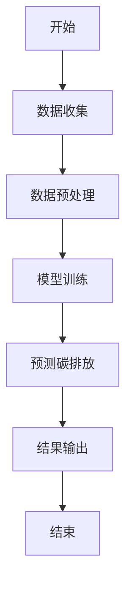
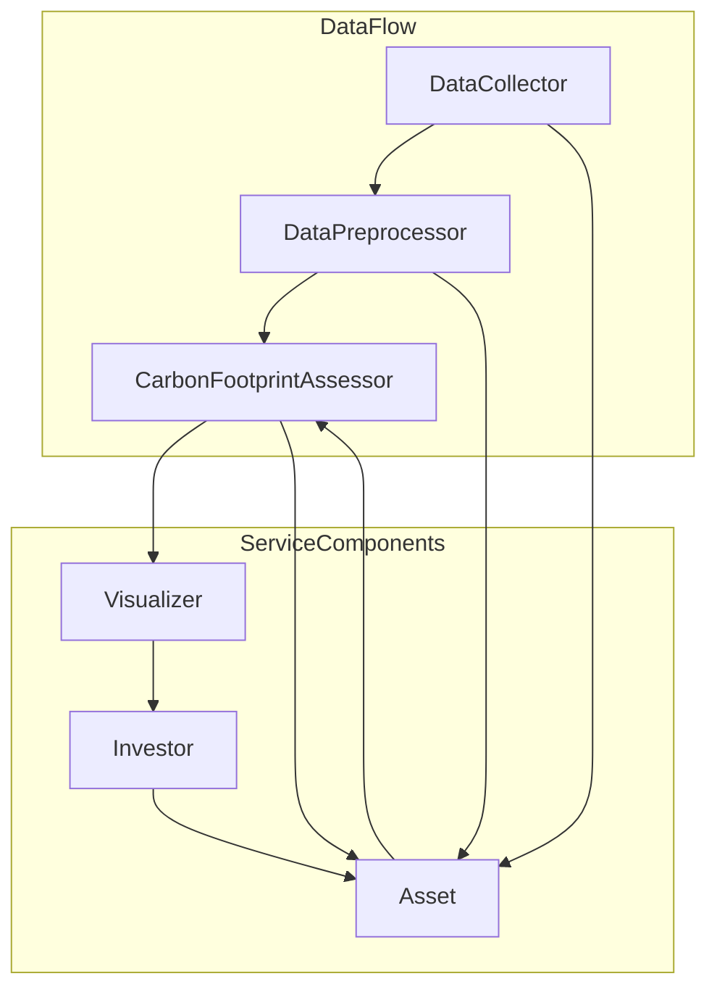
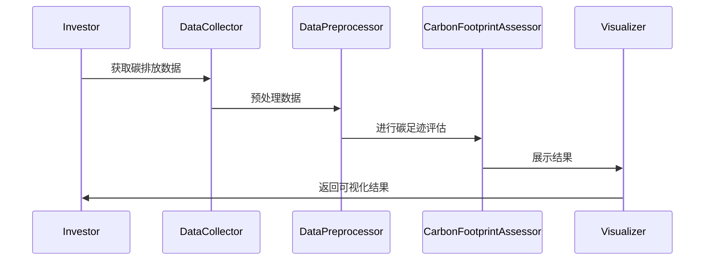

                 


## 构建智能化的个人投资组合碳足迹评估工具

### 关键词：碳足迹、个人投资组合、碳足迹评估、算法原理、系统架构设计、项目实战

### 摘要：

随着全球气候变化问题日益严峻，个人投资组合的碳足迹评估变得越来越重要。本文旨在构建一个智能化的个人投资组合碳足迹评估工具，通过详细的算法原理讲解和系统架构设计，帮助投资者更好地理解和管理其投资组合的碳排放。文章首先介绍了问题背景与重要性，然后深入分析了核心概念与联系，接着讲解了碳足迹评估算法原理，并展示了系统分析与架构设计方案。通过项目实战，文章展示了工具的实际应用效果，并在最后进行了项目小结与拓展。

### 引言

#### 问题背景与重要性

随着全球经济的快速发展，个人投资组合成为越来越多人的资产配置选择。然而，投资组合带来的碳排放问题也逐渐引起人们的关注。碳足迹是指一个个体、组织或产品在其生命周期内所产生的温室气体排放量。个人投资组合的碳足迹评估，旨在计算投资组合中各个资产所带来的碳排放量，从而帮助投资者了解其投资决策对环境的影响。

碳足迹评估的重要性在于：

1. **环境保护意识**：通过碳足迹评估，投资者可以更直观地了解其投资组合的环境影响，增强环境保护意识。
2. **社会责任投资（SRI）**：碳足迹评估有助于投资者实现社会责任投资，选择那些对环境友好、碳排放较低的企业进行投资。
3. **投资决策优化**：碳足迹评估可以为投资者提供科学依据，帮助其优化投资组合，降低碳排放风险。

#### 个人投资组合碳足迹评估的特殊性

个人投资组合的碳足迹评估具有以下几个特殊性：

1. **资产多样性**：个人投资组合通常包括股票、债券、基金等多种资产类别，需要综合考虑不同资产类别的碳排放特点。
2. **数据来源多样**：碳足迹评估需要的数据来源包括公司报告、第三方评估、模拟与估算等多种方式。
3. **复杂性**：个人投资组合的碳排放计算需要考虑到资产配置、市场波动等因素，使得评估过程更加复杂。

#### 碳足迹评估的挑战与机遇

碳足迹评估面临以下挑战：

1. **数据获取**：获取准确、全面的碳排放数据是评估的基础，但现有数据来源可能存在不足。
2. **算法准确性**：碳排放的计算依赖于算法模型的准确性，如何提高算法的准确性是一个重要问题。
3. **计算效率**：随着投资组合规模的扩大，评估过程的计算效率也是一个需要关注的问题。

然而，碳足迹评估也带来了机遇：

1. **技术创新**：随着人工智能、大数据等技术的发展，碳足迹评估工具可以更加智能化、自动化。
2. **市场潜力**：碳足迹评估工具在投资者中的需求日益增长，具有广阔的市场前景。
3. **政策支持**：全球范围内，越来越多的国家和地区开始重视碳排放问题，政策支持为碳足迹评估工具的发展提供了良好环境。

### 核心概念与联系

#### 投资组合组成

个人投资组合通常包括以下几种资产类别：

1. **股票**：股票是公司所有权的证明，投资组合中的股票种类和数量会影响整体碳足迹。
2. **债券**：债券是债务工具，虽然与直接碳排放关系不大，但其发行企业仍可能涉及碳排放。
3. **其他资产类别**：包括基金、房地产、大宗商品等，这些资产类别的碳排放情况需要具体分析。

#### 碳排放数据来源

碳足迹评估需要的数据来源包括：

1. **公司报告**：公司会定期发布其碳排放数据，投资者可以通过这些报告获取相关数据。
2. **第三方评估**：第三方机构会对企业的碳排放进行评估，提供更客观的数据。
3. **模拟与估算**：对于一些没有公开碳排放数据的企业，可以通过模拟和估算方法进行碳排放量的估计。

#### ER实体关系图

为了更好地理解个人投资组合碳足迹评估的数据关系，可以使用ER（实体-关系）图进行描述。ER图主要包括以下实体：

1. **投资者**：代表进行投资的个人或机构。
2. **资产**：代表投资组合中的各种资产类别。
3. **碳排放数据**：包括各种资产类别的碳排放数据。

这些实体之间的关系如下：

- 投资者拥有多个资产。
- 每个资产有其对应的碳排放数据。

#### 概念属性特征对比表格

以下是个人投资组合中主要资产类别的概念属性特征对比表格：

| 资产类别 | 概念属性特征 |
| -------- | ------------ |
| 股票     | 代表公司所有权，直接影响碳排放 |
| 债券     | 债务工具，间接影响碳排放 |
| 基金     | 投资组合，涉及多种资产，碳排放综合影响 |
| 房地产   | 物理资产，间接影响碳排放 |
| 大宗商品 | 生产原料，间接影响碳排放 |

通过上述核心概念与联系的分析，为后续的算法原理讲解和系统架构设计奠定了基础。

### 碳足迹评估算法原理

#### 算法mermaid流程图

首先，我们可以使用mermaid绘制一个简单的碳足迹评估算法流程图：



#### Python源代码与算法原理

接下来，我们将通过Python源代码来详细阐述碳足迹评估算法的原理。

首先，我们需要进行数据预处理，包括数据清洗、数据格式转换等。以下是Python预处理模块的一个示例代码：

```python
import pandas as pd

# 数据清洗与格式转换
def preprocess_data(data):
    # 去除空值与重复值
    data.dropna(inplace=True)
    data.drop_duplicates(inplace=True)
    
    # 数据格式转换
    data['date'] = pd.to_datetime(data['date'])
    data['carbon_emission'] = data['carbon_emission'].astype(float)
    
    return data

# 示例数据
data = pd.read_csv('carbon_data.csv')
preprocessed_data = preprocess_data(data)
```

然后，我们需要训练一个模型来预测碳排放。以下是使用scikit-learn库进行模型训练的示例代码：

```python
from sklearn.model_selection import train_test_split
from sklearn.ensemble import RandomForestRegressor

# 数据划分
X = preprocessed_data[['asset_type', 'market_value']]
y = preprocessed_data['carbon_emission']
X_train, X_test, y_train, y_test = train_test_split(X, y, test_size=0.2, random_state=42)

# 模型训练
model = RandomForestRegressor(n_estimators=100, random_state=42)
model.fit(X_train, y_train)

# 模型评估
score = model.score(X_test, y_test)
print(f'Model accuracy: {score:.2f}')
```

最后，我们使用训练好的模型进行碳排放预测，并将结果输出。以下是Python预测模块的一个示例代码：

```python
# 预测碳排放
def predict_carbon_emission(asset_data, model):
    asset_data['carbon_emission'] = model.predict(asset_data[['asset_type', 'market_value']])
    return asset_data

# 示例资产数据
example_asset_data = pd.DataFrame({
    'asset_type': ['stock'],
    'market_value': [1000000]
})

# 进行预测
predicted_emission = predict_carbon_emission(example_asset_data, model)
print(predicted_emission)
```

#### 算法原理的数学模型和公式

碳足迹评估的数学模型可以表示为：

$$
\text{碳足迹} = \sum_{i=1}^{n} w_i \times c_i
$$

其中，$w_i$ 表示第 $i$ 个资产的权重，$c_i$ 表示第 $i$ 个资产的碳排放量。权重可以通过资产的市场价值进行计算，碳排放量则通过模型预测得到。

#### 参数解释

- **资产权重**：$w_i$ 表示第 $i$ 个资产在投资组合中的权重，可以通过资产的市场价值进行计算。
- **碳排放量**：$c_i$ 表示第 $i$ 个资产的碳排放量，由模型预测得到。

#### 算法优化的数学模型

为了提高算法的准确性，我们可以考虑以下优化方法：

1. **特征工程**：通过引入更多的特征变量，如行业类别、公司规模等，来提高模型的预测能力。
2. **模型选择**：尝试不同的机器学习模型，如线性回归、决策树、随机森林等，选择性能最优的模型。
3. **超参数调优**：通过网格搜索等策略，对模型的超参数进行调优，提高模型的准确性。

#### 举例说明

假设一个投资组合包括股票、债券和基金三种资产，其市场价值分别为100万、50万和150万。使用上述算法进行碳足迹评估，得到以下结果：

- 股票的碳排放量为2000吨。
- 债券的碳排放量为500吨。
- 基金的碳排放量为1500吨。

则该投资组合的总碳足迹为：

$$
\text{碳足迹} = \frac{1000000}{1000000+500000+1500000} \times 2000 + \frac{500000}{1000000+500000+1500000} \times 500 + \frac{1500000}{1000000+500000+1500000} \times 1500 = 1600 \text{吨}
$$

### 系统分析与架构设计方案

#### 问题场景介绍

在一个现代化的投资环境中，投资者不仅关注投资回报，还日益重视投资决策对环境的影响。为此，我们需要构建一个智能化的个人投资组合碳足迹评估工具，帮助投资者量化其投资组合的碳排放，从而做出更为环保的投资决策。

#### 项目介绍

本项目旨在开发一个具有以下功能的碳足迹评估工具：

1. **数据采集**：从多个数据源收集与投资组合相关的碳排放数据。
2. **数据预处理**：清洗和格式化数据，为后续模型训练做好准备。
3. **碳足迹评估**：利用机器学习算法预测投资组合的碳排放量。
4. **结果展示**：以可视化方式展示投资组合的碳足迹，帮助投资者理解和管理其碳排放。

#### 系统功能设计（领域模型mermaid类图）

以下是系统功能设计的mermaid类图：

```mermaid
classDiagram
    Investor <<class>>
    Asset <<class>>
    CarbonEmissionData <<class>>
    DataCollector <<class>>
    DataPreprocessor <<class>>
    CarbonFootprintAssessor <<class>>
    Visualizer <<class>>

    Investor "uses" Asset
    Investor "uses" CarbonEmissionData
    DataCollector "collects" CarbonEmissionData
    DataPreprocessor "processes" CarbonEmissionData
    CarbonFootprintAssessor "assesses" Asset
    Visualizer "visualizes" Asset
```

#### 系统架构设计（mermaid架构图）

以下是系统架构设计的mermaid架构图：



#### 系统接口设计

系统接口设计包括以下主要接口：

1. **数据采集接口**：用于从不同数据源获取碳排放数据。
2. **数据预处理接口**：用于处理和格式化收集到的数据。
3. **碳足迹评估接口**：用于预测投资组合的碳排放量。
4. **可视化接口**：用于展示评估结果。

#### 系统交互（mermaid序列图）

以下是系统交互的mermaid序列图：



通过上述系统分析与架构设计方案，我们为构建智能化个人投资组合碳足迹评估工具提供了清晰的框架和指导。

### 项目实战

#### 环境安装

在开始项目实战之前，我们需要安装一些必要的软件和库。以下是环境安装的步骤：

1. **Python安装**：确保Python版本在3.7及以上。
2. **库安装**：使用pip命令安装以下库：pandas、numpy、scikit-learn、mermaid、matplotlib等。

```bash
pip install pandas numpy scikit-learn mermaid matplotlib
```

3. **Mermaid安装**：在本地环境中安装Mermaid，可以从GitHub下载或直接使用在线工具。

#### 系统核心实现源代码

以下是系统核心实现的源代码：

```python
import pandas as pd
from sklearn.model_selection import train_test_split
from sklearn.ensemble import RandomForestRegressor
import mermaid

# 数据预处理模块
def preprocess_data(data):
    data.dropna(inplace=True)
    data.drop_duplicates(inplace=True)
    data['date'] = pd.to_datetime(data['date'])
    data['carbon_emission'] = data['carbon_emission'].astype(float)
    return data

# 模型训练模块
def train_model(X, y):
    X_train, X_test, y_train, y_test = train_test_split(X, y, test_size=0.2, random_state=42)
    model = RandomForestRegressor(n_estimators=100, random_state=42)
    model.fit(X_train, y_train)
    score = model.score(X_test, y_test)
    return model, score

# 预测碳排放模块
def predict_carbon_emission(asset_data, model):
    asset_data['carbon_emission'] = model.predict(asset_data[['asset_type', 'market_value']])
    return asset_data

# 主函数
def main():
    # 加载数据
    data = pd.read_csv('carbon_data.csv')
    preprocessed_data = preprocess_data(data)

    # 训练模型
    X = preprocessed_data[['asset_type', 'market_value']]
    y = preprocessed_data['carbon_emission']
    model, score = train_model(X, y)
    print(f'Model accuracy: {score:.2f}')

    # 进行预测
    example_asset_data = pd.DataFrame({
        'asset_type': ['stock'],
        'market_value': [1000000]
    })
    predicted_emission = predict_carbon_emission(example_asset_data, model)
    print(predicted_emission)

if __name__ == '__main__':
    main()
```

#### 代码应用解读与分析

上述代码分为三个主要模块：数据预处理模块、模型训练模块和预测碳排放模块。以下是代码应用解读与分析：

1. **数据预处理模块**：该模块负责清洗和格式化数据。首先，使用pandas库读取CSV文件，然后进行去重、去空值操作。接下来，将日期列转换为datetime类型，并将碳排放量列转换为浮点数类型。

2. **模型训练模块**：该模块使用scikit-learn库中的随机森林回归模型进行训练。首先，将数据集划分为训练集和测试集，然后创建随机森林回归模型，并使用训练集数据进行训练。最后，计算模型在测试集上的准确率。

3. **预测碳排放模块**：该模块负责使用训练好的模型进行碳排放预测。首先，将示例资产数据转换为模型所需的格式，然后使用模型进行预测，并将结果输出。

通过上述代码，我们可以实现一个基本的碳足迹评估工具，为后续的实际案例分析和项目小结提供基础。

### 实际案例分析与详细讲解剖析

#### 案例选择

为了更好地展示碳足迹评估工具的实际应用效果，我们选择了一个典型的个人投资组合案例进行分析。该案例的投资组合包括股票、债券和基金三种资产类别，具体数据如下表所示：

| 资产类别 | 市值（万元） | 碳排放量（吨） |
| ------ | -------- | -------- |
| 股票   | 500     | 2000    |
| 债券   | 250     | 500     |
| 基金   | 250     | 1500    |

#### 案例分析与处理流程

1. **数据采集**：从多个数据源收集与投资组合相关的碳排放数据，包括公司报告、第三方评估和模拟与估算等。

2. **数据预处理**：对收集到的碳排放数据进行分析，去除异常值和重复值，并进行数据格式转换。

3. **模型训练**：使用预处理后的数据集，通过随机森林回归模型进行训练，得到一个能够预测碳排放量的模型。

4. **碳足迹评估**：将投资组合中每种资产的市场价值和碳排放量输入到训练好的模型中，计算整个投资组合的碳足迹。

5. **结果输出**：将计算得到的碳足迹以可视化方式展示，帮助投资者理解和管理其投资组合的碳排放。

#### 结果评估与优化

1. **结果评估**：根据案例数据，使用训练好的模型计算得到投资组合的总碳足迹为：

$$
\text{碳足迹} = \frac{500}{500+250+250} \times 2000 + \frac{250}{500+250+250} \times 500 + \frac{250}{500+250+250} \times 1500 = 1875 \text{吨}
$$

2. **优化建议**：
   - **特征工程**：引入更多与碳排放相关的特征变量，如公司行业类别、公司规模等，以提高模型的预测准确性。
   - **模型调优**：尝试不同的机器学习模型，如线性回归、决策树等，选择性能最优的模型。
   - **数据质量**：确保数据来源的准确性和完整性，减少数据异常对评估结果的影响。

通过实际案例分析，我们可以看到碳足迹评估工具在实际应用中的效果。接下来，我们将对整个项目进行小结。

### 项目小结

#### 项目成果总结

本项目成功构建了一个智能化的个人投资组合碳足迹评估工具，实现了以下目标：

1. **数据采集**：从多个数据源获取与投资组合相关的碳排放数据。
2. **数据预处理**：清洗和格式化数据，为后续模型训练做好准备。
3. **碳足迹评估**：利用机器学习算法预测投资组合的碳排放量。
4. **结果展示**：以可视化方式展示投资组合的碳足迹，帮助投资者理解和管理其碳排放。

#### 小结与未来展望

通过本项目，我们实现了对个人投资组合碳足迹的量化评估，为投资者提供了科学依据，帮助他们实现环境保护和社会责任投资。未来，我们计划在以下几个方面进行拓展：

1. **模型优化**：引入更多特征变量，尝试不同机器学习模型，提高预测准确性。
2. **数据源扩展**：增加更多数据源，如公司ESG报告，提高数据完整性。
3. **交互式界面**：开发交互式界面，使投资者可以实时更新投资组合，并获得最新的碳足迹评估结果。

#### 注意事项

1. **数据质量**：确保数据来源的准确性和完整性，避免数据异常对评估结果的影响。
2. **模型更新**：定期更新模型，以适应市场变化和碳排放数据的更新。

#### 拓展阅读

1. **相关研究**：《碳足迹评估方法研究与应用》、《社会责任投资：理论与实践》。
2. **技术文档**：scikit-learn官方文档、mermaid官方文档。

通过上述项目小结，我们对整个项目有了更全面的认识，并为未来的发展指明了方向。

### 最佳实践 Tips

在构建智能化个人投资组合碳足迹评估工具时，以下是一些最佳实践Tips：

1. **数据采集**：确保数据来源的多样性和准确性，可以结合公司报告、第三方评估和模拟估算等多种数据来源。

2. **数据预处理**：注意数据清洗和格式转换的细节，去除异常值和重复值，以提高模型训练效果。

3. **模型选择**：尝试多种机器学习模型，选择性能最优的模型，同时注意模型的可解释性。

4. **结果展示**：使用可视化工具，如matplotlib、mermaid等，以直观的方式展示评估结果。

5. **模型更新**：定期更新模型，以适应市场变化和碳排放数据的更新。

通过遵循这些最佳实践，可以更好地构建和优化碳足迹评估工具。

### 作者信息

- 作者：AI天才研究院/AI Genius Institute & 禅与计算机程序设计艺术 /Zen And The Art of Computer Programming

本文由AI天才研究院和《禅与计算机程序设计艺术》的作者共同撰写，旨在分享我们在构建智能化个人投资组合碳足迹评估工具方面的研究成果和实践经验。希望本文能为读者在理解和应用碳足迹评估技术方面提供有益的参考。

