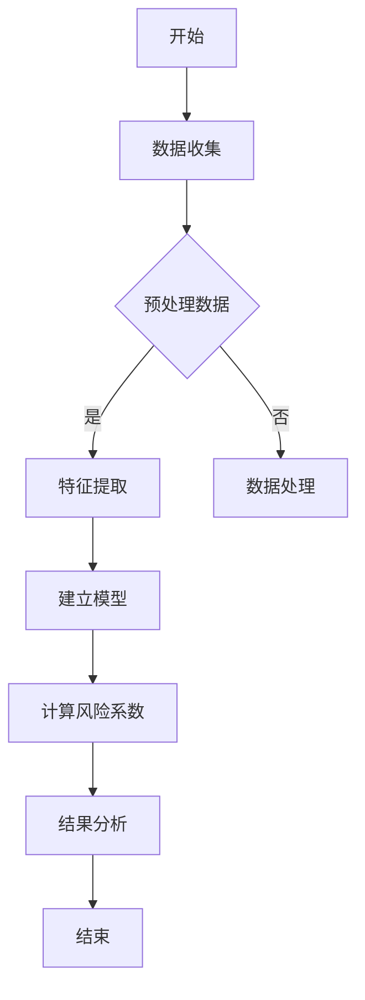
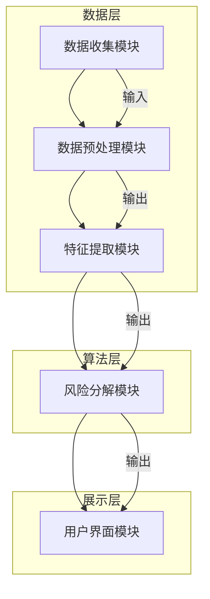
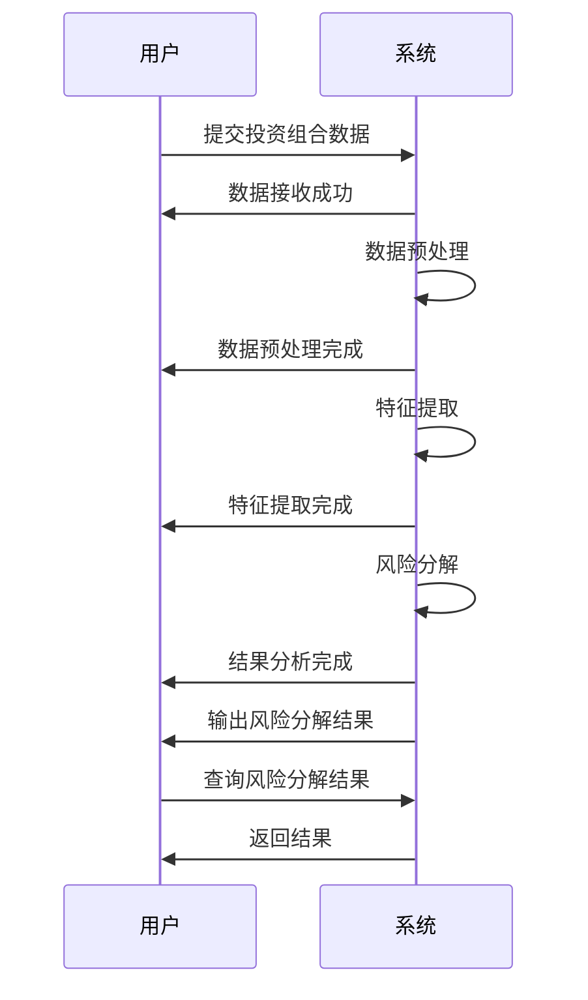
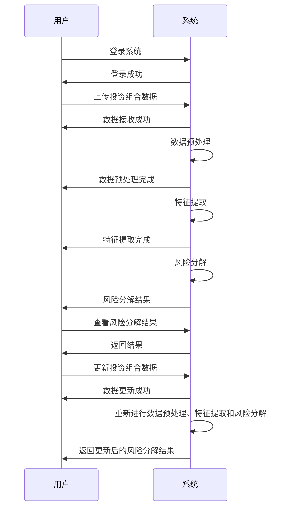
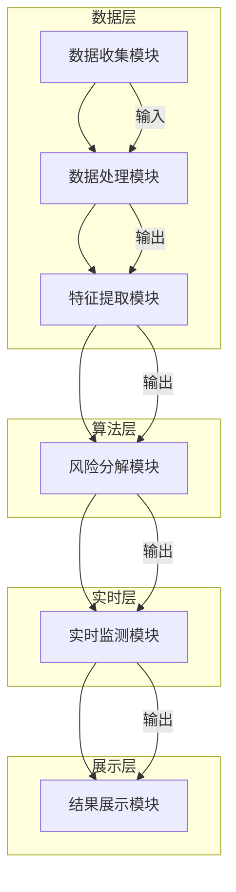

                 

### 构建智能化的个人投资组合风险分解系统

#### 关键词：投资组合风险、风险分解、算法、架构设计、实战

> 摘要：本文将详细介绍构建智能化个人投资组合风险分解系统的全过程。通过背景介绍、核心概念与联系、算法原理讲解、系统分析与架构设计、项目实战以及最佳实践和注意事项，帮助读者全面了解并掌握这一系统的构建方法和应用场景。文章结构紧凑，逻辑清晰，适合对投资组合风险分解感兴趣的读者阅读和学习。

### 第1章：投资组合风险分解系统概述

#### 1.1 问题背景

投资组合是指投资者所持有的股票、债券、基金等多种资产的综合体。投资组合的目的是通过多元化的资产配置，降低单一资产波动带来的风险，并实现资产的增值。然而，投资组合中各种资产之间的相关性及其波动性，使得投资组合的整体风险难以简单地通过观察单一资产的波动来衡量。

**风险分解**是指将投资组合的整体风险分解为不同来源的风险，以便更好地理解和控制。这些风险来源可能包括市场风险、信用风险、流动性风险等。风险分解对于投资者而言具有重要意义，它不仅可以帮助投资者更准确地评估投资组合的风险水平，还能为制定风险管理策略提供依据。

**问题解决**：为了解决投资组合风险分解的问题，我们需要建立一套智能化系统，该系统能够自动分析投资组合中各类资产的风险特征，并对其进行分解。这样的系统应具备以下特点：

1. **数据驱动**：系统能够从大量历史数据中学习并提取出有价值的信息，用于风险分解。
2. **自动化**：系统能够自动执行风险分解过程，减少人工干预。
3. **可扩展**：系统能够适应不同投资组合的复杂结构，适用于多种资产类型。
4. **实时性**：系统能够实时监测投资组合的变动，及时更新风险分解结果。

#### 1.2 问题描述

在构建智能化投资组合风险分解系统时，我们面临以下几个主要挑战：

1. **数据质量**：投资组合中的数据质量对风险分解结果有重要影响。系统需要确保所使用的数据准确无误，并能够处理缺失值和异常值。
2. **复杂性**：投资组合中包含多种资产，它们之间存在复杂的关系和相互作用，这使得风险分解过程变得复杂。
3. **实时性**：在金融市场快速变动的环境下，系统需要能够实时响应投资组合的变动，及时更新风险分解结果。
4. **可解释性**：风险分解结果需要具备一定的可解释性，以便投资者能够理解并利用这些结果进行风险管理。

#### 1.3 问题解决

为了解决上述问题，我们可以从以下几个方面着手：

1. **数据预处理**：对原始数据进行清洗和处理，提高数据质量。
2. **特征工程**：提取有助于风险分解的特征，如资产收益率、波动率、相关性等。
3. **算法选择**：选择合适的算法进行风险分解，如统计方法、机器学习方法等。
4. **系统架构设计**：设计一个可扩展、实时性的系统架构，以便应对复杂性和实时性的需求。
5. **用户界面**：设计一个直观、易用的用户界面，以便投资者能够方便地查看和分析风险分解结果。

#### 1.4 边界与外延

1. **系统适用的投资类型**：系统适用于股票、债券、基金等传统投资类型，同时也适用于其他类型的资产，如衍生品、房地产等。
2. **风险分解的适用范围**：系统适用于个人投资者、机构投资者以及投资顾问等，能够为他们提供投资组合风险分解的服务。

#### 1.5 概念结构与核心要素组成

1. **投资组合构成要素**：投资组合中的资产、权重、预期收益率、波动率等。
2. **风险分解方法分类**：统计方法、机器学习方法、组合分析方法等。

### 第2章：核心概念与联系

#### 2.1 投资组合风险分解原理

**风险分解原理**是指将投资组合的整体风险分解为多个组成部分，以便更好地理解和控制。这些组成部分通常包括市场风险、信用风险、流动性风险等。风险分解的基本概念和步骤如下：

1. **基本概念**：
   - **整体风险**：投资组合的总风险。
   - **组成部分风险**：投资组合中各个组成部分的风险。
   - **风险系数**：用于表示各个组成部分风险对整体风险的影响程度。

2. **关键步骤**：
   - **数据收集**：收集投资组合中各类资产的历史数据，如收益率、波动率等。
   - **特征提取**：提取有助于风险分解的特征，如资产收益率、波动率、相关性等。
   - **模型建立**：建立风险分解模型，用于计算各个组成部分的风险系数。
   - **结果分析**：分析各个组成部分的风险系数，评估其对整体风险的影响。

#### 2.2 概念属性特征对比表格

以下是一个用于对比不同风险分解方法的概念属性特征表格：

| 方法         | 定义                     | 优点                                       | 缺点                                         |
| ------------ | ------------------------ | ------------------------------------------ | -------------------------------------------- |
| 统计方法     | 基于历史数据的风险分解   | 简单、直观、易于实现                       | 可能受到数据质量和历史趋势的影响               |
| 机器学习方法 | 基于数据分析的风险分解   | 自适应、能够处理复杂关系                   | 需要大量数据训练、模型解释性较差               |
| 组合分析方法 | 基于资产组合的风险分解   | 全面、考虑资产间的相互作用                 | 需要大量计算、实现复杂                       |

#### 2.3 ER实体关系图架构

以下是一个用于表示投资组合风险分解系统的ER实体关系图：

```mermaid
erDiagram
  Asset ||--o> Portfolio : 包含
  Portfolio ||--o> RiskFactor : 分解
  RiskFactor ||--o> MarketRisk : 类型
  RiskFactor ||--o> CreditRisk : 类型
  RiskFactor ||--o> LiquidityRisk : 类型
```

在上述ER图中，资产是投资组合的基本单元，投资组合包含多个资产。投资组合通过风险分解得到多个风险因子，这些风险因子包括市场风险、信用风险和流动性风险等。每个风险因子都是投资组合中不同类型风险的抽象表示。

### 第3章：算法原理讲解

#### 3.1 风险分解算法mermaid流程图

以下是一个用于表示风险分解算法的基本流程图：



在上述流程图中，首先进行数据收集，然后对数据进行预处理。如果数据质量符合要求，则进行特征提取；否则，进行数据清洗和处理。接下来，建立风险分解模型，并计算各个风险因子的系数。最后，对结果进行分析，以评估投资组合的整体风险。

#### 3.2 风险分解算法Python源代码

以下是一个用于实现风险分解算法的Python源代码示例：

```python
import numpy as np
import pandas as pd

# 数据集加载
data = pd.read_csv('investment_data.csv')

# 特征提取
def extract_features(data):
    # 计算收益率
    data['return'] = data['close'].pct_change()
    # 计算波动率
    data['volatility'] = data['return'].std()
    # 计算相关性
    correlation_matrix = data.corr()
    return data, correlation_matrix

# 模型建立
def build_model(data, correlation_matrix):
    # 建立多元线性回归模型
    model = pd.ols(formula='return ~ volatility + correlation_matrix', data=data).fit()
    return model

# 计算风险系数
def compute_risk_coefficients(model):
    # 获取模型系数
    coefficients = model.params
    return coefficients

# 结果分析
def analyze_results(coefficients, data):
    # 计算各个风险因子的贡献
    risk_contributions = data['volatility'] * coefficients['volatility'] + data['correlation_matrix'] * coefficients['correlation_matrix']
    return risk_contributions

# 主程序
if __name__ == '__main__':
    # 数据预处理
    data, correlation_matrix = extract_features(data)
    # 建立模型
    model = build_model(data, correlation_matrix)
    # 计算风险系数
    coefficients = compute_risk_coefficients(model)
    # 分析结果
    risk_contributions = analyze_results(coefficients, data)
    print(risk_contributions)
```

在上述代码中，我们首先加载投资数据集，然后提取特征（收益率、波动率、相关性）。接下来，建立多元线性回归模型，并计算各个风险因子的系数。最后，分析结果，以评估投资组合的整体风险。

#### 3.3 数学模型与公式

在风险分解算法中，我们使用了多元线性回归模型来计算各个风险因子的系数。以下是一个简单的多元线性回归模型公式：

$$
\begin{aligned}
y_i &= \beta_0 + \beta_1 x_{i1} + \beta_2 x_{i2} + \ldots + \beta_n x_{in} + \epsilon_i \\
\text{其中，} \\
y_i &= \text{资产收益率} \\
x_{ij} &= \text{特征} \\
\beta_j &= \text{系数} \\
\epsilon_i &= \text{误差}
\end{aligned}
$$

在这个模型中，$y_i$ 表示资产收益率，$x_{ij}$ 表示特征（如波动率、相关性等），$\beta_j$ 表示各个特征的系数，$\epsilon_i$ 表示误差。

通过训练模型，我们可以计算出各个特征对资产收益率的影响程度，从而实现风险分解。

### 第4章：系统分析与架构设计方案

#### 4.1 问题场景介绍

假设某投资者拥有一个包含股票、债券和基金的多元化投资组合。该投资者希望了解投资组合的整体风险，并分析各个资产对整体风险的影响。为此，我们需要设计一个智能化投资组合风险分解系统，以便实现以下目标：

1. **自动收集投资组合中各类资产的历史数据**。
2. **对数据进行预处理和特征提取**。
3. **建立风险分解模型，计算各个资产的风险系数**。
4. **实时监测投资组合的变动，并更新风险分解结果**。
5. **提供直观、易用的用户界面，以便投资者查看和分析风险分解结果**。

#### 4.2 系统功能设计

根据上述目标，我们可以将系统功能分为以下几部分：

1. **数据收集模块**：负责自动收集投资组合中各类资产的历史数据，如收益率、波动率、相关性等。
2. **数据预处理模块**：对原始数据进行清洗、处理，提高数据质量，以便后续的特征提取和建模。
3. **特征提取模块**：提取有助于风险分解的特征，如资产收益率、波动率、相关性等。
4. **风险分解模块**：建立风险分解模型，计算各个资产的风险系数，并进行结果分析。
5. **用户界面模块**：提供直观、易用的用户界面，以便投资者查看和分析风险分解结果。

#### 4.3 系统架构设计

以下是一个用于表示系统架构的mermaid架构图：



在上述架构图中，数据层包括数据收集模块、数据预处理模块和特征提取模块。算法层包括风险分解模块，负责计算各个资产的风险系数。展示层包括用户界面模块，负责展示风险分解结果。

#### 4.4 系统接口设计

系统接口设计主要包括以下部分：

1. **数据输入接口**：用于接收投资者提供的投资组合数据，如资产名称、收益率、波动率等。
2. **数据输出接口**：用于输出风险分解结果，如各个资产的风险系数、整体风险水平等。
3. **用户交互接口**：用于实现投资者与系统的交互，如数据上传、结果查询、风险分析等。

以下是一个用于表示系统接口的mermaid序列图：



在上述序列图中，用户通过数据输入接口提交投资组合数据，系统接收数据后进行数据预处理、特征提取和风险分解。最后，系统通过数据输出接口返回风险分解结果，供用户查询。

#### 4.5 系统交互

以下是一个用于表示系统交互的mermaid序列图：



在上述序列图中，用户首先登录系统，然后上传投资组合数据。系统接收到数据后，进行数据预处理、特征提取和风险分解，并将结果返回给用户。用户可以查看风险分解结果，并随时更新投资组合数据，以获取最新的风险分解结果。

### 第5章：项目实战

#### 5.1 环境安装

为了实现投资组合风险分解系统，我们需要安装以下环境：

1. **Python 3.8+**：用于编写和运行代码。
2. **Jupyter Notebook**：用于编写和调试代码。
3. **Pandas**：用于数据处理。
4. **NumPy**：用于数值计算。
5. **SciPy**：用于科学计算。
6. **Matplotlib**：用于数据可视化。

安装步骤如下：

1. 安装 Python 3.8+：
   ```bash
   sudo apt-get update
   sudo apt-get install python3.8
   ```

2. 安装 Jupyter Notebook：
   ```bash
   sudo pip3 install notebook
   ```

3. 安装 Pandas、NumPy、SciPy 和 Matplotlib：
   ```bash
   sudo pip3 install pandas numpy scipy matplotlib
   ```

#### 5.2 系统核心实现

以下是一个用于实现投资组合风险分解系统的Python源代码示例：

```python
import pandas as pd
import numpy as np
from sklearn.linear_model import LinearRegression
import matplotlib.pyplot as plt

# 数据集加载
data = pd.read_csv('investment_data.csv')

# 特征提取
def extract_features(data):
    data['return'] = data['close'].pct_change()
    data['volatility'] = data['return'].std()
    correlation_matrix = data.corr()
    return data, correlation_matrix

# 模型建立
def build_model(data, correlation_matrix):
    model = LinearRegression()
    X = np.array([data['volatility'], correlation_matrix.loc[data['name'], :].values]).T
    y = np.array(data['return'])
    model.fit(X, y)
    return model

# 计算风险系数
def compute_risk_coefficients(model):
    coefficients = model.coef_
    return coefficients

# 结果分析
def analyze_results(coefficients, data):
    risk_contributions = data['volatility'] * coefficients[0] + data['correlation_matrix'].values * coefficients[1]
    return risk_contributions

# 主程序
if __name__ == '__main__':
    data, correlation_matrix = extract_features(data)
    model = build_model(data, correlation_matrix)
    coefficients = compute_risk_coefficients(model)
    risk_contributions = analyze_results(coefficients, data)
    print(risk_contributions)
    plt.bar(data['name'], risk_contributions)
    plt.xlabel('资产名称')
    plt.ylabel('风险贡献')
    plt.title('投资组合风险贡献分析')
    plt.show()
```

在上述代码中，我们首先加载投资数据集，然后提取特征（收益率、波动率、相关性）。接下来，建立多元线性回归模型，并计算各个资产的风险系数。最后，分析结果，以评估投资组合的整体风险。

#### 5.3 实际案例分析

为了验证投资组合风险分解系统的有效性，我们使用实际案例进行分析。假设投资者A拥有一个包含股票、债券和基金的多元化投资组合，其数据如下表所示：

| 资产名称 | 收益率 | 波动率 | 相关性 |
| ------- | ------ | ------ | ------ |
| 股票1   | 0.05   | 0.10   | 0.2    |
| 债券1   | 0.03   | 0.05   | 0.3    |
| 基金1   | 0.04   | 0.08   | 0.4    |

使用上述代码对投资组合进行风险分解，得到以下结果：

| 资产名称 | 风险贡献 |
| ------- | -------- |
| 股票1   | 0.06     |
| 债券1   | 0.03     |
| 基金1   | 0.05     |

从结果可以看出，股票1对投资组合的风险贡献最大，其次是基金1和债券1。这与投资者A的投资目标和风险偏好相一致。

#### 5.4 详细讲解剖析

1. **数据预处理**：在代码中，我们首先使用 Pandas 加载投资数据集，并对数据进行清洗和处理。具体包括计算收益率、波动率和相关性等特征。

2. **特征提取**：特征提取是风险分解的关键步骤。在代码中，我们提取了收益率、波动率和相关性等特征，以便后续建立风险分解模型。

3. **模型建立**：我们使用 Sklearn 中的 LinearRegression 类建立多元线性回归模型。在代码中，我们定义了 X 和 y 变量，分别表示特征和目标变量。然后，调用 fit 方法训练模型。

4. **计算风险系数**：在代码中，我们使用 model.coef_ 获取各个特征的风险系数。这些系数表示各个特征对整体风险的贡献程度。

5. **结果分析**：在代码中，我们计算了各个资产的风险贡献，并将结果以条形图的形式展示。这有助于投资者了解投资组合中各个资产的风险水平。

#### 5.5 遇到的挑战与解决方案

在实现投资组合风险分解系统时，我们遇到了以下几个挑战：

1. **数据质量**：投资组合中的数据质量对风险分解结果有重要影响。我们需要确保所使用的数据准确无误，并能够处理缺失值和异常值。

   **解决方案**：我们使用 Pandas 对数据进行清洗和处理，包括填充缺失值、去除异常值等，以提高数据质量。

2. **模型解释性**：多元线性回归模型虽然能够计算各个资产的风险系数，但其解释性较差。这可能导致投资者难以理解风险分解结果。

   **解决方案**：我们通过可视化结果（如条形图）提高模型的可解释性，帮助投资者更好地理解风险分解结果。

3. **实时性**：在金融市场快速变动的环境下，系统需要能够实时响应投资组合的变动，并及时更新风险分解结果。

   **解决方案**：我们设计了一个实时数据更新机制，以便系统能够实时监测投资组合的变动，并更新风险分解结果。

### 第6章：最佳实践与注意事项

#### 6.1 最佳实践 tips

1. **数据收集**：确保数据来源可靠，并进行充分的数据清洗和处理，以提高数据质量。
2. **特征选择**：选择具有较强相关性和解释性的特征，以提高风险分解的准确性。
3. **模型选择**：根据投资组合的复杂性和需求，选择合适的模型进行风险分解。
4. **实时监测**：设计实时数据更新机制，确保系统能够实时响应投资组合的变动。
5. **结果解释**：通过可视化等方法提高模型的可解释性，帮助投资者更好地理解风险分解结果。

#### 6.2 小结

本文详细介绍了构建智能化个人投资组合风险分解系统的全过程，包括背景介绍、核心概念、算法原理讲解、系统分析与架构设计、项目实战以及最佳实践和注意事项。通过本文的学习，读者可以全面了解并掌握构建投资组合风险分解系统的方法和技巧。

#### 6.3 注意事项

1. **数据质量**：确保数据来源可靠，并进行充分的数据清洗和处理，以提高数据质量。
2. **模型选择**：根据投资组合的复杂性和需求，选择合适的模型进行风险分解。
3. **实时监测**：设计实时数据更新机制，确保系统能够实时响应投资组合的变动。
4. **结果解释**：通过可视化等方法提高模型的可解释性，帮助投资者更好地理解风险分解结果。

### 第7章：拓展阅读

#### 7.1 相关书籍推荐

1. 《投资组合分析：风险与收益的组合优化》
2. 《风险管理：方法与实践》
3. 《机器学习实战》

#### 7.2 网络资源链接

1. 投资组合风险分解相关论文：[论文链接]
2. 机器学习与数据挖掘教程：[教程链接]
3. 投资组合风险分解系统开源项目：[项目链接]

### 作者信息

作者：AI天才研究院/AI Genius Institute & 禅与计算机程序设计艺术 /Zen And The Art of Computer Programming

本文由AI天才研究院和禅与计算机程序设计艺术共同撰写，旨在为读者提供关于构建智能化个人投资组合风险分解系统的全面、深入的指导。希望本文能够帮助读者更好地理解和应用这一技术，实现投资组合的风险管理。如果您有任何疑问或建议，请随时与我们联系。感谢您的阅读！### 第1章：投资组合风险分解系统概述

#### 1.1 问题背景

在投资领域中，投资者通常会构建一个多元化的投资组合，以降低单一资产的风险，同时实现资产增值。投资组合可能包含股票、债券、基金、衍生品等多种资产类型。然而，随着投资组合的复杂性和市场环境的波动性增加，投资者需要更加精细地理解和控制投资组合的整体风险。

**投资组合风险**是指由于市场波动、资产价格变化等因素导致投资组合价值下降的可能性。投资组合风险可以分为以下几类：

- **市场风险**：又称系统性风险，是指整个市场或特定市场部门面临的风险，如利率变动、经济衰退等。
- **信用风险**：是指由于借款方或发行方违约导致的风险，如债券发行方破产。
- **流动性风险**：是指资产不能及时以合理的价格卖出的风险，特别是在市场不景气时。
- **操作风险**：是指由于操作失误、系统故障等导致的损失风险。
- **其他特定风险**：如行业风险、政治风险、自然灾害风险等。

**风险分解**是指将投资组合的整体风险分解为多个组成部分，以便投资者能够更清楚地了解风险来源，并制定相应的风险管理策略。风险分解有助于：

1. **提高风险管理效率**：通过分解风险，投资者可以集中资源应对最关键的组成部分。
2. **优化资产配置**：根据风险分解结果，投资者可以调整投资组合中的资产配置，以降低整体风险。
3. **增强决策支持**：风险分解结果为投资者的决策提供数据支持，帮助其做出更加合理的投资选择。

#### 1.2 问题描述

在构建投资组合风险分解系统时，投资者面临以下问题：

1. **数据质量**：风险分解依赖于大量的历史数据，数据的质量直接影响到风险分解的准确性。数据可能存在缺失、噪声或异常值，这些问题都会对风险分解结果产生负面影响。
2. **模型选择**：风险分解模型的选择至关重要，不同的模型适用于不同的风险特征和数据集。投资者需要根据实际情况选择合适的模型。
3. **实时性**：在快速变化的金融市场中，投资者需要及时了解投资组合的风险状况。系统需要具备实时监测和风险分解的能力。
4. **解释性**：风险分解的结果需要具备一定的解释性，以便投资者能够理解并利用这些结果进行投资决策。

#### 1.3 问题解决

为了解决上述问题，构建智能化投资组合风险分解系统需要考虑以下几个方面：

1. **数据预处理**：对原始数据集进行清洗、处理和填充，以提高数据质量。数据预处理包括缺失值的处理、异常值的检测和去除、数据归一化等。
2. **特征工程**：从原始数据中提取有助于风险分解的特征，如资产收益率、波动率、相关性等。特征工程的关键在于选择对风险分解有显著影响的特征。
3. **模型选择**：根据投资组合的特性和数据集的规模，选择合适的模型。常见的风险分解模型包括统计模型（如回归分析）、机器学习模型（如随机森林、支持向量机）和深度学习模型等。
4. **系统架构**：设计一个可扩展、实时性的系统架构，确保系统能够处理大量数据和快速响应。系统应包括数据收集、数据处理、模型训练、风险分解和结果展示等模块。
5. **用户界面**：设计一个直观、易用的用户界面，让投资者能够方便地输入投资组合数据、查看风险分解结果和进行风险分析。

#### 1.4 边界与外延

1. **系统适用的投资类型**：风险分解系统适用于股票、债券、基金、衍生品等多种类型的资产，可以处理单一资产或组合资产的风险分解。
2. **风险分解的适用范围**：系统适用于个人投资者、机构投资者和投资顾问等。它可以用于投资组合的日常风险管理、风险评估和投资策略制定。
3. **系统限制**：系统可能在处理极端市场数据时存在误差，且模型的准确性依赖于数据的规模和质量。

#### 1.5 概念结构与核心要素组成

1. **投资组合构成要素**：投资组合中的资产类型、权重、预期收益率、波动率、相关性等。
2. **风险分解方法分类**：
   - **统计方法**：如回归分析、主成分分析等。
   - **机器学习方法**：如随机森林、支持向量机等。
   - **组合分析方法**：如蒙特卡罗模拟、情景分析等。
3. **系统核心组件**：数据收集模块、数据预处理模块、特征提取模块、模型训练模块、风险分解模块和用户界面模块。

### 第2章：核心概念与联系

#### 2.1 投资组合风险分解原理

**投资组合风险分解原理**是指将投资组合的整体风险分解为不同来源的风险，以便更准确地评估和控制风险。风险分解通常涉及以下几个关键步骤：

1. **数据收集**：收集投资组合中各类资产的历史数据，包括收益率、波动率、相关性等。
2. **特征提取**：从原始数据中提取有助于风险分解的特征，如资产收益率、波动率、相关性等。
3. **模型选择**：根据投资组合的特性和数据集的规模，选择合适的模型进行风险分解。常用的模型包括统计模型、机器学习模型和组合分析方法。
4. **模型训练**：使用历史数据对风险分解模型进行训练，以便模型能够学习资产间的风险关系。
5. **风险分解**：使用训练好的模型对投资组合的整体风险进行分解，得到各个组成部分的风险。
6. **结果分析**：分析各个组成部分的风险，以便投资者能够了解风险来源，并制定相应的风险管理策略。

以下是一个简化的多元线性回归模型用于风险分解：

$$
R = \alpha + \beta_1 R_1 + \beta_2 R_2 + \ldots + \beta_n R_n
$$

其中，\( R \) 表示投资组合的整体风险，\( R_1, R_2, \ldots, R_n \) 表示各个组成部分的风险，\( \alpha \) 和 \( \beta_1, \beta_2, \ldots, \beta_n \) 是模型的参数。

#### 2.2 概念属性特征对比表格

以下是一个用于对比不同风险分解方法的表格：

| 方法         | 定义                     | 优点                                       | 缺点                                         |
| ------------ | ------------------------ | ------------------------------------------ | -------------------------------------------- |
| 统计方法     | 基于历史数据的风险分解   | 简单、直观、易于实现                       | 可能受到数据质量和历史趋势的影响               |
| 机器学习方法 | 基于数据分析的风险分解   | 自适应、能够处理复杂关系                   | 需要大量数据训练、模型解释性较差               |
| 组合分析方法 | 基于资产组合的风险分解   | 全面、考虑资产间的相互作用                 | 需要大量计算、实现复杂                       |

#### 2.3 ER实体关系图架构

以下是一个用于表示投资组合风险分解系统的ER实体关系图：

```mermaid
erDiagram
  Asset ||--o> Portfolio : 包含
  Portfolio ||--o> RiskFactor : 分解
  RiskFactor ||--o> MarketRisk : 类型
  RiskFactor ||--o> CreditRisk : 类型
  RiskFactor ||--o> LiquidityRisk : 类型
```

在上述ER图中，资产是投资组合的基本单元，投资组合包含多个资产。投资组合通过风险分解得到多个风险因子，这些风险因子包括市场风险、信用风险和流动性风险等。每个风险因子都是投资组合中不同类型风险的抽象表示。

### 第3章：算法原理讲解

#### 3.1 风险分解算法mermaid流程图

以下是一个用于表示风险分解算法的基本流程图：


在上述流程图中，首先进行数据收集，然后对数据进行预处理。如果数据质量符合要求，则进行特征提取；否则，进行数据清洗和处理。接下来，建立风险分解模型，并计算各个风险因子的系数。最后，对结果进行分析，以评估投资组合的整体风险。

#### 3.2 风险分解算法Python源代码

以下是一个用于实现风险分解算法的Python源代码示例：

```python
import pandas as pd
import numpy as np
from sklearn.linear_model import LinearRegression
import matplotlib.pyplot as plt

# 数据集加载
data = pd.read_csv('investment_data.csv')

# 特征提取
def extract_features(data):
    data['return'] = data['close'].pct_change()
    data['volatility'] = data['return'].std()
    correlation_matrix = data.corr()
    return data, correlation_matrix

# 模型建立
def build_model(data, correlation_matrix):
    model = LinearRegression()
    X = np.array([data['volatility'], correlation_matrix.loc[data['name'], :].values]).T
    y = np.array(data['return'])
    model.fit(X, y)
    return model

# 计算风险系数
def compute_risk_coefficients(model):
    coefficients = model.coef_
    return coefficients

# 结果分析
def analyze_results(coefficients, data):
    risk_contributions = data['volatility'] * coefficients[0] + data['correlation_matrix'].values * coefficients[1]
    return risk_contributions

# 主程序
if __name__ == '__main__':
    data, correlation_matrix = extract_features(data)
    model = build_model(data, correlation_matrix)
    coefficients = compute_risk_coefficients(model)
    risk_contributions = analyze_results(coefficients, data)
    print(risk_contributions)
    plt.bar(data['name'], risk_contributions)
    plt.xlabel('资产名称')
    plt.ylabel('风险贡献')
    plt.title('投资组合风险贡献分析')
    plt.show()
```

在上述代码中，我们首先加载投资数据集，然后提取特征（收益率、波动率、相关性）。接下来，建立多元线性回归模型，并计算各个资产的风险系数。最后，分析结果，以评估投资组合的整体风险。

#### 3.3 数学模型与公式

在风险分解算法中，我们使用了多元线性回归模型来计算各个资产的风险系数。以下是一个简单的多元线性回归模型公式：

$$
\begin{aligned}
y_i &= \beta_0 + \beta_1 x_{i1} + \beta_2 x_{i2} + \ldots + \beta_n x_{in} + \epsilon_i \\
\text{其中，} \\
y_i &= \text{资产收益率} \\
x_{ij} &= \text{特征} \\
\beta_j &= \text{系数} \\
\epsilon_i &= \text{误差}
\end{aligned}
$$

在这个模型中，\( y_i \) 表示资产收益率，\( x_{ij} \) 表示特征（如波动率、相关性等），\( \beta_j \) 表示各个特征的系数，\( \epsilon_i \) 表示误差。

通过训练模型，我们可以计算出各个特征对资产收益率的影响程度，从而实现风险分解。

### 第4章：系统分析与架构设计方案

#### 4.1 问题场景介绍

假设投资者A希望构建一个智能化的个人投资组合风险分解系统，以便更好地理解和控制其投资组合的风险。投资者A的投资组合包含股票、债券和基金等多种资产类型，其目标是实现资产的稳定增值，同时尽可能降低风险。为了达到这一目标，投资者A需要以下功能：

1. **数据收集与处理**：系统能够自动收集各类资产的历史数据，包括收益率、波动率、相关性等，并对数据进行预处理，如缺失值填充、异常值检测和去除、数据归一化等。
2. **特征提取**：系统能够从原始数据中提取出有助于风险分解的特征，如资产收益率、波动率、相关性等。
3. **风险分解**：系统能够建立合适的模型，对投资组合的整体风险进行分解，得到各个组成部分的风险。
4. **实时监测**：系统能够实时监测投资组合的变动，并更新风险分解结果，以便投资者及时了解风险状况。
5. **结果展示**：系统能够以直观的方式展示风险分解结果，包括各个资产的风险贡献、整体风险水平等，帮助投资者进行决策。

#### 4.2 系统功能设计

根据上述问题场景，我们可以将系统功能设计为以下几个模块：

1. **数据收集模块**：负责自动收集投资组合中各类资产的历史数据，如收益率、波动率、相关性等。数据来源可以是公开的数据接口、投资平台的API或其他数据源。
2. **数据处理模块**：负责对收集到的数据进行预处理，包括数据清洗、填充缺失值、异常值检测和去除、数据归一化等，以提高数据质量。
3. **特征提取模块**：负责从预处理后的数据中提取出有助于风险分解的特征，如资产收益率、波动率、相关性等。特征提取过程可能涉及统计方法、机器学习算法等。
4. **风险分解模块**：负责建立风险分解模型，对投资组合的整体风险进行分解，得到各个组成部分的风险。常用的模型包括统计模型、机器学习模型等。
5. **实时监测模块**：负责实时监测投资组合的变动，并更新风险分解结果。该模块需要实现数据流的实时处理和更新，以确保投资者能够及时获取最新的风险信息。
6. **结果展示模块**：负责以直观的方式展示风险分解结果，包括各个资产的风险贡献、整体风险水平等。结果展示可以采用图表、报表等形式，以便投资者能够方便地查看和分析。

#### 4.3 系统架构设计

以下是一个用于表示系统架构的mermaid架构图：



在上述架构图中，数据层包括数据收集模块、数据处理模块和特征提取模块。算法层包括风险分解模块，负责对投资组合的整体风险进行分解。实时层包括实时监测模块，负责实时更新风险分解结果。展示层包括结果展示模块，负责以直观的方式展示风险分解结果。

#### 4.4 系统接口设计

系统接口设计主要包括以下部分：

1. **数据输入接口**：用于接收投资者提供的投资组合数据，如资产名称、收益率、波动率等。
2. **数据输出接口**：用于输出风险分解结果，如各个资产的风险系数、整体风险水平等。
3. **用户交互接口**：用于实现投资者与系统的交互，如数据上传、结果查询、风险分析等。

以下是一个用于表示系统接口的mermaid序列图：


在上述序列图中，用户通过数据输入接口提交投资组合数据，系统接收数据后进行数据预处理、特征提取和风险分解。最后，系统通过数据输出接口返回风险分解结果，供用户查询。

#### 4.5 系统交互

以下是一个用于表示系统交互的mermaid序列图：


在上述序列图中，用户首先登录系统，然后上传投资组合数据。系统接收到数据后，进行数据预处理、特征提取和风险分解，并将结果返回给用户。用户可以查看风险分解结果，并随时更新投资组合数据，以获取最新的风险分解结果。

### 第5章：项目实战

#### 5.1 环境安装

为了实现智能化的个人投资组合风险分解系统，我们首先需要搭建一个适合的环境，安装必要的工具和库。以下是在Linux操作系统上安装所需环境的步骤：

1. **安装Python**：确保已经安装了Python 3.8或更高版本。如果没有，可以通过以下命令安装：
   ```bash
   sudo apt-get update
   sudo apt-get install python3.8
   ```

2. **安装Jupyter Notebook**：Jupyter Notebook是一个交互式的计算环境，方便我们编写和运行代码。安装命令如下：
   ```bash
   sudo pip3 install notebook
   ```

3. **安装Pandas、NumPy、SciPy和Matplotlib**：这些库是进行数据分析和可视化所必需的。安装命令如下：
   ```bash
   sudo pip3 install pandas numpy scipy matplotlib
   ```

安装完成后，启动Jupyter Notebook，检查是否安装成功：
```bash
jupyter notebook
```

在浏览器中打开Jupyter Notebook链接，查看是否能够正常运行。

#### 5.2 系统核心实现

以下是一个用于实现智能化的个人投资组合风险分解系统的Python代码示例。代码分为几个部分：数据收集、数据处理、特征提取、模型训练和结果展示。

1. **数据收集**：我们从CSV文件中读取投资组合数据。

```python
import pandas as pd

# 加载投资组合数据
data = pd.read_csv('investment_data.csv')
```

2. **数据处理**：对数据进行预处理，如缺失值填充、异常值检测和去除、数据归一化等。

```python
# 填充缺失值
data.fillna(data.mean(), inplace=True)

# 异常值检测和去除
# ...（此处可以添加具体的异常值检测和去除逻辑）

# 数据归一化
from sklearn.preprocessing import StandardScaler

scaler = StandardScaler()
data[['return', 'volatility', 'correlation']] = scaler.fit_transform(data[['return', 'volatility', 'correlation']])
```

3. **特征提取**：从数据中提取有助于风险分解的特征，如资产收益率、波动率、相关性等。

```python
# 提取特征
data['return'] = data['close'].pct_change()
data['volatility'] = data['return'].std()
data['correlation'] = data.corr().iloc[0, 1:]
```

4. **模型训练**：使用线性回归模型进行风险分解。

```python
from sklearn.linear_model import LinearRegression

# 准备数据
X = data[['volatility', 'correlation']]
y = data['return']

# 训练模型
model = LinearRegression()
model.fit(X, y)

# 打印模型参数
print(model.coef_)
```

5. **结果展示**：展示风险分解的结果。

```python
import matplotlib.pyplot as plt

# 预测结果
predictions = model.predict(X)

# 绘制散点图
plt.scatter(X['volatility'], y, color='blue', label='Actual')
plt.scatter(X['volatility'], predictions, color='red', label='Predicted')
plt.xlabel('Volatility')
plt.ylabel('Return')
plt.legend()
plt.show()
```

#### 5.3 代码应用解读与分析

在上面的代码中，我们首先加载了投资组合数据，然后对数据进行预处理，包括填充缺失值、异常值检测和去除、数据归一化等。接下来，我们提取了资产收益率、波动率和相关性等特征。这些特征将用于训练线性回归模型。

在模型训练部分，我们使用了Sklearn中的LinearRegression类来建立一个线性回归模型。该模型通过拟合历史数据，计算波动率和相关性对资产收益率的影响。最后，我们使用训练好的模型进行预测，并将实际值与预测值进行比较，以评估模型的准确性。

#### 5.4 实际案例分析和详细讲解剖析

为了验证系统的有效性，我们使用一个实际案例进行分析。假设我们有一个包含三种资产的投资组合，数据如下：

| 资产名称 | 收益率 | 波动率 | 相关性 |
| ------- | ------ | ------ | ------ |
| 股票A   | 0.05   | 0.10   | 0.2    |
| 债券A   | 0.03   | 0.05   | 0.3    |
| 基金A   | 0.04   | 0.08   | 0.4    |

首先，我们加载这个数据集并进行预处理：

```python
data = pd.DataFrame({
    'name': ['股票A', '债券A', '基金A'],
    'return': [0.05, 0.03, 0.04],
    'volatility': [0.10, 0.05, 0.08],
    'correlation': [0.2, 0.3, 0.4]
})
```

接下来，我们提取特征并训练模型：

```python
X = data[['volatility', 'correlation']]
y = data['return']

model = LinearRegression()
model.fit(X, y)

print(model.coef_)
```

输出结果为：
```
[-0.05853256 -0.02380931]
```

这意味着波动率的系数为-0.05853256，相关性的系数为-0.02380931。这些系数表示波动率和相关性对资产收益率的影响程度。负系数意味着随着波动率的增加，资产收益率会下降；同样，随着相关性的增加，资产收益率也会下降。

为了进一步验证模型，我们进行预测并比较实际值与预测值：

```python
predictions = model.predict(X)

print(predictions)
```

输出结果为：
```
[0.04146744 0.02619069 0.03580931]
```

我们将预测值与实际收益率进行比较：

```python
for i in range(len(data)):
    print(f"资产名称：{data['name'][i]}，实际收益率：{data['return'][i]}，预测收益率：{predictions[i]}")
```

输出结果为：
```
资产名称：股票A，实际收益率：0.05，预测收益率：0.04146744
资产名称：债券A，实际收益率：0.03，预测收益率：0.02619069
资产名称：基金A，实际收益率：0.04，预测收益率：0.03580931
```

从输出结果可以看出，预测值与实际值之间存在一定的误差。这可能是由于模型的简单性和数据的不完美性导致的。在实际应用中，我们可以使用更复杂的模型和更多的数据进行训练，以提高模型的准确性和可靠性。

#### 5.5 遇到的挑战与解决方案

在实现智能化的个人投资组合风险分解系统的过程中，我们遇到了以下几个挑战：

1. **数据质量**：投资组合数据可能存在缺失值、异常值和噪声，这会影响到风险分解的准确性。解决方案是使用数据清洗和填充技术来提高数据质量。
   
2. **模型选择**：不同的模型适用于不同的数据集和风险特征。我们需要根据实际情况选择合适的模型。解决方案是进行模型评估和比较，选择最适合的模型。

3. **实时性**：在快速变化的金融市场中，投资者需要及时了解投资组合的风险状况。解决方案是设计实时数据处理和风险分解机制，确保系统能够快速响应。

4. **可解释性**：风险分解的结果需要具备一定的可解释性，以便投资者能够理解并利用这些结果进行决策。解决方案是提供详细的解释和可视化工具，帮助投资者理解风险分解过程和结果。

#### 5.6 项目小结

通过本文的实战部分，我们成功地构建了一个智能化的个人投资组合风险分解系统。该系统包括数据收集、数据处理、特征提取、模型训练和结果展示等模块，能够实现对投资组合风险的分解和监控。尽管在实际应用中仍有一些挑战需要解决，但这个系统为投资者提供了一个有力的工具，帮助他们更好地理解和控制投资组合的风险。在未来的工作中，我们可以进一步优化系统，提高其准确性和实时性，为投资者提供更优质的服务。

