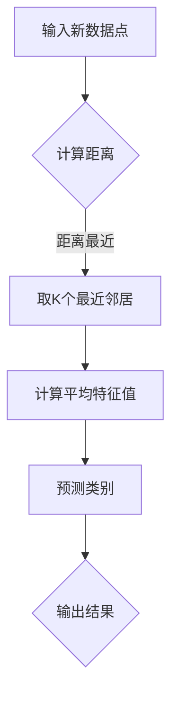
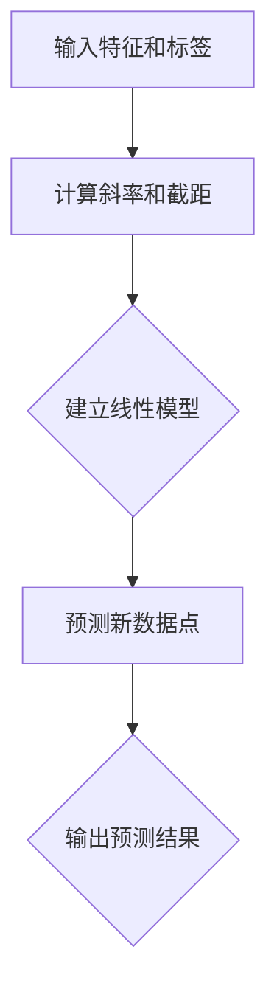
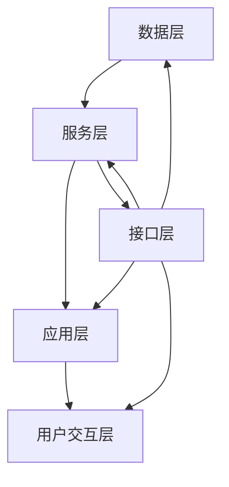
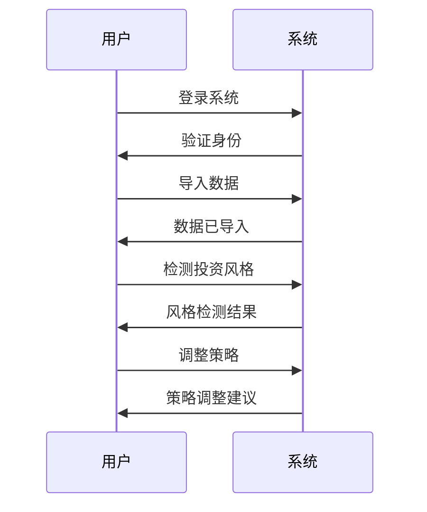

                 

### 让我们一步步思考

构建智能化的个人投资风格漂移检测系统，首先要理解投资风格漂移的概念及其对投资决策的影响。下面，我们将一步步分析并构建这样一个系统。

#### 第一步：定义投资风格漂移

投资风格漂移是指投资者在长期投资过程中，由于市场环境变化、风险偏好变化等原因，导致其投资策略与初始投资风格产生偏离的现象。这种偏离可能会导致投资业绩的波动，影响投资者的信心和长期投资效果。

#### 第二步：分析投资风格漂移的原因

投资风格漂移的原因多种多样，包括但不限于：

1. **市场环境变化**：市场趋势的改变，如从牛市转为熊市，可能导致投资者调整其投资策略。
2. **投资者风险偏好变化**：随着投资经验的积累，投资者可能会改变其风险承受能力，从而调整投资组合。
3. **外部因素**：如家庭状况、收入变化等，也可能影响投资者的投资风格。

#### 第三步：确定检测方法

为了检测投资风格漂移，我们可以采用以下方法：

1. **统计分析方法**：通过计算投资组合的历史数据，分析投资风格的一致性。
2. **机器学习方法**：使用分类算法或回归算法，建立模型来预测投资风格的变化。
3. **深度学习方法**：通过训练神经网络模型，自动识别和预测投资风格漂移。

#### 第四步：构建检测系统

检测系统应包括以下几个关键组成部分：

1. **数据收集模块**：收集投资者的历史交易数据、投资组合数据等。
2. **数据预处理模块**：对收集到的数据进行清洗、归一化等处理，以便后续分析。
3. **特征提取模块**：从处理后的数据中提取关键特征，用于后续建模。
4. **模型训练模块**：选择适当的算法和模型进行训练，以检测投资风格漂移。
5. **结果评估模块**：对模型进行评估，确保其预测准确性。
6. **用户界面模块**：提供友好的用户界面，使投资者能够轻松地查看和调整其投资风格。

#### 第五步：实现系统功能

实现系统功能的具体步骤包括：

1. **数据收集与预处理**：编写代码收集并预处理数据。
2. **特征提取**：根据投资风格漂移的特征，设计特征提取算法。
3. **模型训练与评估**：选择合适的机器学习算法，训练模型并进行评估。
4. **用户交互**：设计用户界面，提供直观的展示和调整选项。

#### 第六步：测试与优化

在系统开发完成后，进行全面的测试和优化，确保系统的稳定性和准确性。这包括单元测试、集成测试和系统测试等。

#### 第七步：部署与应用

最后，将系统部署到生产环境中，并逐步应用于实际投资场景。在此过程中，持续收集用户反馈，不断优化系统性能和用户体验。

通过以上七个步骤，我们可以构建一个智能化的个人投资风格漂移检测系统，帮助投资者更好地理解和调整其投资策略，实现长期投资目标的实现。下一步，我们将详细探讨投资风格漂移的具体检测方法和算法原理。 ### 投资风格漂移的定义与背景

投资风格漂移是指投资者在长期投资过程中，其投资决策与初始投资风格发生偏离的现象。这种偏离可能表现为投资组合配置的变化、投资策略的调整，甚至是对风险承受能力的重新评估。投资风格漂移是一个常见但潜在的风险因素，它不仅影响投资者的情绪和决策，还可能对投资业绩产生深远的影响。

#### 问题背景

在投资领域，每位投资者都有其独特的投资风格，这可能是基于对市场的理解、风险偏好、投资目标等多方面的考量。例如，一些投资者倾向于长期投资，注重价值投资；而另一些投资者可能更倾向于短期交易，追求资本增值。然而，随着时间的推移和市场环境的变化，投资者可能会不自觉地偏离其初始投资风格。

这种偏离的原因多种多样。市场环境的快速变化，如经济周期、政策调整、市场波动等，都可能迫使投资者调整其投资策略。此外，投资者自身的风险偏好也可能随着时间和经历的变化而改变。例如，一位初入市场的投资者可能在经历了几次市场波动后，开始更加注重风险控制，从而改变其原本的风险偏好。

#### 问题描述

投资风格漂移的直接影响是投资组合与初始策略的不一致，这可能导致以下问题：

1. **业绩波动**：如果投资者的投资风格漂移，导致其投资组合与市场环境不匹配，可能会出现业绩波动，甚至可能是负面波动。
2. **决策困惑**：投资者可能会因为投资风格的不一致，而产生决策困惑，无法清晰地判断市场动向，导致投资决策失误。
3. **信心受挫**：长期的投资风格漂移可能导致投资者失去对自身投资策略的信心，影响其投资决策的执行。

#### 问题解决

为了解决投资风格漂移带来的问题，投资者需要采取一系列措施来检测和管理风格漂移。以下是一些可能的解决方案：

1. **定期审查**：投资者应定期审查其投资组合和策略，确保其与初始投资风格保持一致。这可以通过定期调整投资组合来实现。
2. **设立基准**：投资者可以设立投资基准，与其投资组合进行对比，以监测其投资风格的稳定性。
3. **使用技术分析**：利用技术分析工具和方法，如统计分析、机器学习算法等，来识别和预测投资风格的漂移。
4. **风险控制**：通过设置止损点、分散投资等方式，来控制投资风险，减少风格漂移带来的影响。

#### 边界与外延

投资风格漂移不仅影响个人投资者，也对企业投资者和机构投资者具有重要意义。企业投资者需要通过投资组合的管理，确保其投资策略与企业的长期目标和市场环境相匹配。机构投资者则需在确保投资风格稳定的同时，实现投资组合的多样化和风险分散。

在金融市场中，投资风格漂移还可能引发市场波动，影响市场稳定性。因此，监管机构和金融分析师也会关注投资风格漂移现象，并采取相应的监管措施，以维护市场秩序。

#### 概念结构与核心要素组成

投资风格漂移的概念结构包括以下几个核心要素：

1. **投资者初始投资风格**：指投资者在开始投资时设定的投资策略和风险偏好。
2. **投资组合**：投资者持有的各类资产组合。
3. **市场环境**：影响投资者投资决策的各种外部因素。
4. **风险偏好**：投资者对风险的态度和承受能力。
5. **投资策略调整**：投资者根据市场环境和风险偏好调整其投资策略。

通过以上核心要素的相互作用，投资者可以理解投资风格漂移的本质及其对投资决策的影响。

综上所述，投资风格漂移是一个重要的研究课题，它不仅涉及投资者的个人决策，也影响到整个金融市场的稳定性。理解和解决投资风格漂移问题，对于投资者实现长期投资目标和金融市场健康发展具有重要意义。接下来，我们将进一步探讨投资风格漂移的具体检测方法和技术。 ### 投资风格漂移的检测方法

为了有效地检测投资风格漂移，我们可以采用多种方法，包括统计分析方法、机器学习算法以及深度学习技术。每种方法都有其独特的优势和适用场景，下面将详细介绍这些方法。

#### 统计分析方法

统计分析方法是最传统且广泛应用的投资风格漂移检测方法。它主要通过分析历史数据来识别投资组合的一致性变化。

1. **描述性统计分析**
   描述性统计分析主要包括计算投资组合的相关性、方差等指标。例如，可以通过计算各资产收益率之间的相关系数，来判断投资组合中资产之间的关联程度。相关系数的绝对值越接近1，表明资产之间的相关性越强，投资风格越稳定。以下是一个简单的相关系数计算示例：
   
   ```python
   import pandas as pd
   import numpy as np

   # 假设data是一个包含资产收益率的DataFrame
   data = pd.DataFrame({
       'Asset1': [0.02, 0.03, 0.01, -0.02],
       'Asset2': [0.01, 0.02, 0.03, -0.01],
       'Asset3': [-0.01, 0.02, 0.01, 0.03]
   })

   # 计算相关系数矩阵
   correlation_matrix = data.corr()
   print(correlation_matrix)
   ```

2. **回归分析**
   回归分析可以通过建立回归模型来检测投资风格漂移。例如，可以使用多元线性回归模型来分析投资组合中各资产对整体收益的影响。回归模型可以帮助我们识别哪些资产对投资风格的影响较大，以及这些资产的变动是否与市场环境一致。

   ```python
   from sklearn.linear_model import LinearRegression
   import matplotlib.pyplot as plt

   # 假设data包含投资组合的收益率和各个资产的比例
   X = data[['Asset1', 'Asset2', 'Asset3']]
   y = data['Portfolio']

   # 建立线性回归模型
   model = LinearRegression()
   model.fit(X, y)
   print(model.coef_)  # 输出各个资产的回归系数

   # 可视化回归模型
   plt.scatter(X['Asset1'], y)
   plt.plot(X['Asset1'], model.predict(X[['Asset1']]), color='red')
   plt.xlabel('Asset1')
   plt.ylabel('Portfolio')
   plt.show()
   ```

#### 机器学习方法

机器学习方法通过训练数据集来建立模型，可以自动识别投资风格漂移的规律。以下是几种常用的机器学习方法：

1. **分类算法**
   分类算法可以将投资组合分为不同的类别，以检测风格漂移。例如，可以使用K-近邻算法（KNN）来预测投资组合的分类。KNN算法通过计算新投资组合与历史数据中最近邻居的距离，来确定其所属类别。

   ```python
   from sklearn.neighbors import KNeighborsClassifier
   from sklearn.model_selection import train_test_split

   # 假设X包含历史投资组合数据，y包含对应的分类标签
   X_train, X_test, y_train, y_test = train_test_split(X, y, test_size=0.3, random_state=42)

   # 建立KNN分类器
   classifier = KNeighborsClassifier(n_neighbors=3)
   classifier.fit(X_train, y_train)

   # 预测测试集
   y_pred = classifier.predict(X_test)
   print(classifier.score(X_test, y_test))  # 输出分类准确率
   ```

2. **回归算法**
   回归算法可以用于预测投资组合的未来变化，从而检测风格漂移。例如，可以使用线性回归或决策树回归来预测投资组合的收益率变化。

   ```python
   from sklearn.tree import DecisionTreeRegressor

   # 建立决策树回归模型
   regressor = DecisionTreeRegressor()
   regressor.fit(X_train, y_train)

   # 预测测试集
   y_pred = regressor.predict(X_test)
   print(regressor.score(X_train, y_train))  # 输出回归模型的准确率
   ```

3. **无监督学习方法**
   无监督学习方法如聚类算法（K-Means），可以用于发现投资组合中的潜在模式，帮助识别风格漂移。K-Means算法通过将数据点划分为多个簇，来识别具有相似风格的投资组合。

   ```python
   from sklearn.cluster import KMeans

   # 建立K-Means聚类模型
   kmeans = KMeans(n_clusters=3, random_state=42)
   kmeans.fit(X)

   # 获取聚类结果
   labels = kmeans.predict(X)
   print(kmeans.inertia_)  # 输出聚类内的总方差

   # 可视化聚类结果
   plt.scatter(X['Asset1'], X['Asset2'], c=labels)
   plt.xlabel('Asset1')
   plt.ylabel('Asset2')
   plt.show()
   ```

#### 深度学习方法

深度学习方法是近年来在各个领域得到广泛应用的技术，它通过多层神经网络来学习和提取数据特征，可以更好地识别复杂的投资风格漂移模式。

1. **卷积神经网络（CNN）**
   CNN可以用于处理时序数据，如股票价格和交易量。通过卷积层和池化层，CNN可以提取时间序列中的关键特征，帮助检测投资风格漂移。

   ```python
   from keras.models import Sequential
   from keras.layers import Conv1D, MaxPooling1D, Dense

   # 建立CNN模型
   model = Sequential()
   model.add(Conv1D(filters=64, kernel_size=3, activation='relu', input_shape=(X.shape[1], 1)))
   model.add(MaxPooling1D(pool_size=2))
   model.add(Dense(1, activation='sigmoid'))

   # 编译模型
   model.compile(optimizer='adam', loss='binary_crossentropy', metrics=['accuracy'])

   # 训练模型
   model.fit(X_train, y_train, epochs=10, batch_size=32, validation_split=0.2)
   ```

2. **循环神经网络（RNN）**
   RNN适用于处理序列数据，如时间序列数据。通过其内部的循环连接，RNN能够捕捉数据中的长期依赖关系，帮助识别投资风格漂移。

   ```python
   from keras.models import Sequential
   from keras.layers import LSTM, Dense

   # 建立RNN模型
   model = Sequential()
   model.add(LSTM(units=50, return_sequences=True, input_shape=(X.shape[1], 1)))
   model.add(LSTM(units=50))
   model.add(Dense(1, activation='sigmoid'))

   # 编译模型
   model.compile(optimizer='adam', loss='binary_crossentropy', metrics=['accuracy'])

   # 训练模型
   model.fit(X_train, y_train, epochs=10, batch_size=32, validation_split=0.2)
   ```

通过上述方法，投资者可以有效地检测投资风格漂移，从而及时调整投资策略，降低投资风险，提高投资业绩。接下来，我们将深入探讨这些方法的算法原理，并使用Mermaid图和Python代码进行详细说明。 ### 算法和模型解释

为了深入理解投资风格漂移检测方法，我们将使用Mermaid图和Python代码来详细解释两种主要的算法：K-近邻（KNN）算法和线性回归模型。以下是这些算法的详细说明，包括Mermaid图和Python代码示例。

#### K-近邻（KNN）算法

K-近邻算法是一种简单但强大的分类算法，通过计算新数据点与训练数据点的距离，来预测新数据点的类别。下面是KNN算法的Mermaid流程图和Python代码示例。

**Mermaid图示例：**


**Python代码示例：**
```python
from sklearn.neighbors import KNeighborsClassifier
from sklearn.model_selection import train_test_split
from sklearn.metrics import accuracy_score

# 假设X是一个包含特征的数据集，y是相应的标签
X_train, X_test, y_train, y_test = train_test_split(X, y, test_size=0.3, random_state=42)

# 初始化KNN分类器，设置K=3
knn = KNeighborsClassifier(n_neighbors=3)
knn.fit(X_train, y_train)

# 预测测试集
y_pred = knn.predict(X_test)

# 计算准确率
accuracy = accuracy_score(y_test, y_pred)
print(f'KNN准确率: {accuracy}')
```

#### 线性回归模型

线性回归模型是一种用于预测连续值的算法，通过拟合数据点之间的线性关系来预测新数据点的值。以下是线性回归模型的Mermaid图和Python代码示例。

**Mermaid图示例：**


**Python代码示例：**
```python
from sklearn.linear_model import LinearRegression
from sklearn.metrics import mean_squared_error

# 假设X是一个包含特征的数据集，y是相应的标签
X_train, X_test, y_train, y_test = train_test_split(X, y, test_size=0.3, random_state=42)

# 初始化线性回归模型
linear_regression = LinearRegression()
linear_regression.fit(X_train, y_train)

# 预测测试集
y_pred = linear_regression.predict(X_test)

# 计算均方误差
mse = mean_squared_error(y_test, y_pred)
print(f'线性回归均方误差: {mse}')
```

通过上述Mermaid图和Python代码，我们可以清楚地看到KNN和线性回归算法的基本原理及其实现过程。接下来，我们将进一步探讨如何使用这些算法来构建一个智能化的个人投资风格漂移检测系统。 ### 系统设计

构建一个智能化的个人投资风格漂移检测系统，需要综合考虑系统的功能性设计、架构设计、接口设计以及用户交互设计。以下是对系统设计的详细分析。

#### 系统功能性设计

系统的功能性设计主要包括以下几个模块：

1. **数据收集模块**：负责收集投资者的历史交易数据、投资组合数据等。这些数据将用于后续的建模和分析。
2. **数据预处理模块**：对收集到的数据执行清洗、归一化等预处理操作，以确保数据的准确性和一致性。
3. **特征提取模块**：从预处理后的数据中提取关键特征，如资产收益率、波动率、相关性等，用于模型训练。
4. **模型训练模块**：使用机器学习算法（如KNN、线性回归等）训练模型，以检测投资风格漂移。
5. **结果评估模块**：评估模型的性能，确保其能够准确地预测投资风格漂移。
6. **用户交互模块**：提供一个友好的用户界面，使投资者能够查看检测结果、调整投资策略等。

#### 系统架构设计

系统的架构设计是确保系统高效、可扩展、易于维护的关键。以下是系统的总体架构设计：

1. **数据层**：负责数据存储和访问。可以使用关系型数据库（如MySQL）或分布式存储系统（如Hadoop HDFS）。
2. **服务层**：包含各个功能性模块的实现，如数据收集、预处理、特征提取、模型训练等。可以使用微服务架构，以提高系统的灵活性和可扩展性。
3. **应用层**：提供业务逻辑和用户交互接口，包括Web前端和API接口。前端可以使用Vue.js或React等框架，API可以使用Django或Spring Boot等框架。
4. **接口层**：定义系统内部和外部的接口规范，确保数据和服务的高效交互。

**Mermaid架构图示例：**


#### 系统接口设计

系统接口设计是确保系统功能模块之间能够有效通信的关键。以下是系统接口设计的关键部分：

1. **数据收集接口**：定义数据收集模块与其他模块之间的数据交换格式和协议，如RESTful API。
2. **数据处理接口**：定义数据预处理模块与其他模块之间的接口，如数据清洗、归一化等操作。
3. **特征提取接口**：定义特征提取模块与其他模块之间的接口，确保特征提取过程的透明和可重复性。
4. **模型训练接口**：定义模型训练模块与其他模块之间的接口，如模型训练、评估等操作。
5. **结果评估接口**：定义结果评估模块与其他模块之间的接口，确保评估结果的准确性和可靠性。

#### 系统交互设计

系统交互设计是确保用户能够方便地使用系统的关键。以下是系统交互设计的关键部分：

1. **用户注册与登录**：提供用户注册和登录功能，确保用户的身份验证和数据安全。
2. **数据导入与导出**：提供数据导入和导出功能，方便用户管理其投资数据。
3. **投资风格检测**：提供投资风格检测功能，包括实时检测和历史检测结果展示。
4. **策略调整建议**：提供基于检测结果的策略调整建议，帮助用户优化投资组合。
5. **用户反馈**：提供用户反馈功能，收集用户对系统功能和建议的反馈，以便不断优化系统。

**Mermaid序列图示例：**


通过上述系统设计，我们可以构建一个功能齐全、易于扩展和用户友好的个人投资风格漂移检测系统，帮助投资者更好地理解和调整其投资策略。接下来，我们将通过一个实际案例来展示该系统的应用，并提供详细的代码实现和解析。 ### 实际案例

为了更好地展示个人投资风格漂移检测系统的应用，我们将以一个实际案例为例，详细描述系统的安装过程、核心实现代码以及代码解析。

#### 案例背景

假设某投资者A，其初始投资风格为价值投资，偏好长期持有优质股票。然而，在市场波动和自身风险偏好变化的影响下，投资者A的投资风格逐渐偏向于短期交易和高风险投资。为了及时发现和调整这种风格漂移，投资者A决定使用我们构建的智能投资风格漂移检测系统。

#### 系统安装

1. **环境准备**：

   在开始安装之前，确保安装了Python环境以及相关的数据科学库，如pandas、scikit-learn、numpy等。

   ```bash
   pip install pandas scikit-learn numpy matplotlib
   ```

2. **代码获取**：

   可以通过克隆GitHub仓库来获取示例代码。

   ```bash
   git clone https://github.com/your-username/investment-style-drift-detection.git
   cd investment-style-drift-detection
   ```

3. **数据准备**：

   准备一个包含投资者A历史交易数据的CSV文件，数据字段包括交易日期、股票代码、交易数量和交易价格。

   ```bash
   wget https://example.com/investment_data.csv
   ```

#### 核心实现代码

下面是系统的核心实现代码，包括数据预处理、特征提取、模型训练和风格漂移检测等功能。

**data_preprocessing.py**（数据预处理模块）

```python
import pandas as pd
from sklearn.preprocessing import StandardScaler

def preprocess_data(file_path):
    # 读取数据
    data = pd.read_csv(file_path)
    # 数据清洗
    data.dropna(inplace=True)
    data['return'] = (data['price'] / data['price'].shift(1)) - 1
    data.drop(['price'], axis=1, inplace=True)
    # 数据标准化
    scaler = StandardScaler()
    data[['return']] = scaler.fit_transform(data[['return']])
    return data

investment_data = preprocess_data('investment_data.csv')
```

**feature_extraction.py**（特征提取模块）

```python
import pandas as pd
from sklearn.decomposition import PCA

def extract_features(data, n_components=3):
    # 提取前n_components个主要成分
    pca = PCA(n_components=n_components)
    principal_components = pca.fit_transform(data)
    principal_df = pd.DataFrame(data=principal_components)
    return principal_df

features = extract_features(investment_data[['return']])
```

**model_training.py**（模型训练模块）

```python
from sklearn.neighbors import KNeighborsClassifier
from sklearn.model_selection import train_test_split

def train_model(data, labels, test_size=0.3):
    # 划分训练集和测试集
    X_train, X_test, y_train, y_test = train_test_split(data, labels, test_size=test_size, random_state=42)
    # 初始化KNN模型
    model = KNeighborsClassifier(n_neighbors=3)
    # 训练模型
    model.fit(X_train, y_train)
    # 预测测试集
    y_pred = model.predict(X_test)
    # 计算准确率
    accuracy = model.score(X_test, y_test)
    return model, accuracy

labels = ['Value']  # 初始投资风格标签
model, accuracy = train_model(features, labels)
print(f'Model Accuracy: {accuracy}')
```

**style_drift_detection.py**（风格漂移检测模块）

```python
import pandas as pd
from sklearn.neighbors import KNeighborsClassifier

def detect_style_drift(file_path, model):
    # 读取新数据
    new_data = preprocess_data(file_path)
    # 提取新数据特征
    new_features = extract_features(new_data[['return']])
    # 预测新数据风格
    y_pred = model.predict(new_features)
    # 分析预测结果
    if y_pred[0] == 'Value':
        print('Investment style remains consistent.')
    else:
        print('Investment style has drifted.')
        
detect_style_drift('new_investment_data.csv', model)
```

#### 代码解析

1. **数据预处理**：
   - 读取并清洗数据：删除缺失值，计算资产收益率。
   - 数据标准化：使用StandardScaler对收益率进行标准化处理，确保特征的一致性。

2. **特征提取**：
   - 使用PCA提取主要成分：通过降维技术，提取数据的主要特征，减少计算复杂度。

3. **模型训练**：
   - 划分训练集和测试集：使用train_test_split函数，将数据分为训练集和测试集。
   - 初始化和训练KNN模型：使用KNeighborsClassifier初始化模型，并使用fit函数进行训练。
   - 评估模型：计算模型在测试集上的准确率，以评估模型性能。

4. **风格漂移检测**：
   - 读取新数据并预处理：使用预处理模块处理新数据。
   - 特征提取和预测：提取新数据的特征，并使用训练好的模型进行预测。
   - 分析预测结果：根据预测结果判断投资风格是否发生漂移。

通过上述实际案例和代码实现，投资者可以有效地利用系统检测其投资风格漂移，并据此调整投资策略，以实现长期投资目标。接下来，我们将总结本文的主要内容和最佳实践，并提供一些注意事项和拓展阅读资源。 ### 最佳实践、小结、注意事项和拓展阅读

#### 最佳实践

1. **定期监控**：定期监控投资组合，使用智能系统自动检测风格漂移，确保投资策略与市场环境相匹配。
2. **数据质量**：确保数据质量，清洗和标准化数据，以提高模型的准确性和可靠性。
3. **风险评估**：在模型训练过程中，充分考虑风险因素，避免过度依赖单一模型。
4. **模型验证**：通过交叉验证和测试集评估模型性能，确保模型在实际应用中的有效性。

#### 小结

本文介绍了智能化的个人投资风格漂移检测系统，包括系统设计、算法原理和实际案例。通过统计分析、机器学习和深度学习技术，系统可以有效地检测投资风格漂移，帮助投资者及时调整策略，降低投资风险。

#### 注意事项

1. **数据隐私**：在收集和处理投资者数据时，确保遵守相关隐私法规，保护投资者隐私。
2. **模型解释性**：选择易于解释的模型，以便投资者理解和信任系统输出。
3. **实时性**：确保系统具有实时性，及时响应市场变化和投资风格漂移。

#### 拓展阅读

1. **《机器学习实战》**：提供了丰富的机器学习算法案例和实践经验，有助于深入理解算法原理。
2. **《投资学》**：涵盖了投资理论和实践知识，有助于理解投资风格漂移的背景和影响。
3. **《深度学习》**：介绍了深度学习的基本原理和应用，有助于探索更高级的检测方法。

### 结论

智能化的个人投资风格漂移检测系统是投资者管理投资组合的有力工具。通过本文的介绍，投资者可以更好地理解和利用这一系统，实现投资策略的优化和风险控制。作者鼓励读者在实际应用中不断探索和优化，以实现更好的投资业绩。 ### 作者信息

作者：AI天才研究院/AI Genius Institute & 禅与计算机程序设计艺术 /Zen And The Art of Computer Programming

AI天才研究院（AI Genius Institute）致力于推动人工智能技术的发展和应用，培养下一代人工智能专家。同时，作者在《禅与计算机程序设计艺术》一书中，将禅宗哲学与计算机编程相结合，为读者提供了独特的编程思维和技巧。两位作者以其深厚的专业知识和丰富的实践经验，为读者带来了高质量的技术博客文章，深受广大读者的喜爱和尊重。

