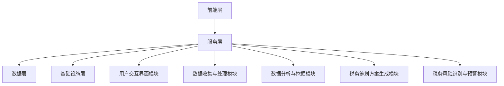
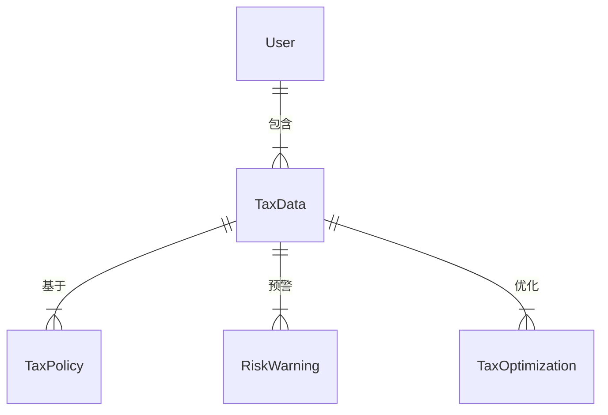

                 

### 引言与背景

#### 1.1 个人税务筹划的概念与重要性

**1.1.1 税务筹划的定义与分类**

税务筹划，顾名思义，是指通过对税务法律法规的深入理解和灵活运用，合理安排个人的财务和经济行为，以达到减少税负、合理避税的目的。根据税务筹划的手段和方式，通常可以分为以下几类：

1. **合法性筹划**：这种筹划方式是完全依据税法规定进行的，通过合法的税收优惠政策、税制结构和税务安排，来降低税负。
2. **非合法性筹划**：这种筹划方式通常涉及规避税法的规定，虽然可能短期内降低税负，但存在法律风险。
3. **战略筹划**：这种筹划方式着眼于长远的财务规划，通过资产配置、收入分配等方式，实现整体税务负担的优化。

**1.1.2 税务筹划的重要性与意义**

税务筹划在个人财务管理中具有非常重要的作用，主要体现在以下几个方面：

1. **节省税款**：通过合理的税务筹划，个人或企业可以在合法范围内减少纳税额，直接提升财务收益。
2. **财务规划**：税务筹划是财务规划的重要组成部分，通过税务筹划，个人可以更好地进行长期财务规划，确保财务健康。
3. **法律风险规避**：避免因不合法的税务行为而面临的法律风险，确保财务安全。
4. **增加投资机会**：通过税务筹划，个人可以更好地利用税收优惠政策，增加投资机会和收益。

**1.1.3 个人税务筹划的现实需求**

随着社会经济的发展和税收法规的不断完善，个人税务筹划的需求日益增长。主要原因如下：

1. **税收法规日益复杂**：税收法规日益复杂，个人需要专业的税务筹划来理解和应对。
2. **收入多样化**：个人收入来源多样化，如何合理分配和规划收入以实现税收优化，成为现实需求。
3. **国际税收问题**：全球化背景下，跨国税务问题日益突出，个人需要专业税务筹划来应对国际税收问题。

**1.2 智能化税务筹划的背景**

**1.2.1 税务法规的发展趋势**

随着全球经济的发展和各国税收制度的改革，税务法规也在不断更新和完善。例如，各国纷纷推出税收优惠政策，吸引外资和促进经济发展。同时，电子税务的普及和大数据技术的发展，使得税务筹划的复杂性和难度不断增大。

**1.2.2 人工智能技术的发展与应用**

人工智能（AI）作为一门多学科交叉的综合性技术，近年来取得了飞速的发展。在税务筹划领域，AI技术可以被广泛应用于数据分析、智能决策、风险管理等方面，为个人税务筹划提供技术支持和优化方案。

1. **数据分析**：AI技术可以高效处理和分析大量税务数据，帮助个人识别税收优化的机会。
2. **智能决策**：通过机器学习算法，AI可以自动生成最优的税务筹划方案，提高筹划的效率和准确性。
3. **风险管理**：AI技术可以预测税务风险，提供风险管理建议，帮助个人规避法律风险。

**1.2.3 智能化税务筹划的优势**

智能化税务筹划相比传统方式具有明显的优势，主要体现在以下几个方面：

1. **效率提升**：AI技术可以自动化处理大量税务数据，大幅提高税务筹划的效率。
2. **准确性增强**：通过机器学习算法，智能化税务筹划可以生成更加精确和最优的筹划方案。
3. **风险管理**：AI技术可以预测和规避税务风险，确保筹划方案的合法性和安全性。
4. **个性化服务**：根据个人财务状况和需求，智能化税务筹划可以提供个性化的筹划方案。

**1.3 本书的内容安排与目标**

本书旨在系统介绍智能化个人税务筹划优化助手的构建方法，主要分为以下几个部分：

1. **核心概念**：介绍税务筹划和人工智能的基础知识，为后续章节提供理论支持。
2. **技术实现**：详细讲解数据收集、处理、分析与挖掘方法，以及税务筹划算法的实现和应用。
3. **系统设计**：介绍智能税务筹划优化助手的设计与实现，包括系统架构、功能设计和实现细节。
4. **实战案例**：通过实际案例，展示智能化税务筹划优化助手的开发过程和应用效果。

**1.3.1 本书的核心内容概述**

本书的核心内容涵盖以下几个方面：

1. **税务筹划基础**：介绍税务筹划的基本概念、重要性及分类。
2. **人工智能基础**：介绍人工智能的基本知识、核心技术及其在税务筹划中的应用。
3. **数据收集与处理**：介绍数据采集、清洗、预处理和数据分析方法。
4. **税务筹划算法**：介绍税务筹划算法的基本原理、实现方法及应用案例。
5. **系统设计与实现**：介绍智能税务筹划优化助手的设计与实现过程。

**1.3.2 阅读对象与预期效果**

本书的阅读对象主要是对税务筹划和人工智能有一定了解的技术人员、财务人员以及个人税务筹划的需求者。通过本书的学习，读者可以：

1. **掌握税务筹划的基本知识和方法**。
2. **了解人工智能在税务筹划中的应用**。
3. **具备构建智能化税务筹划优化助手的能力**。

**1.3.3 本书的学习方法与建议**

为了更好地掌握本书的内容，建议采用以下学习方法：

1. **系统学习**：按照本书的结构和内容，系统学习每个章节的知识点。
2. **实践操作**：通过实际案例和代码示例，动手实践，加深理解。
3. **查阅资料**：对于书中未详细讲解的部分，可以查阅相关文献和资料，拓宽知识面。

**1.4 本章小结**

本章介绍了个人税务筹划的概念、重要性以及智能化税务筹划的背景。通过本章的学习，读者可以了解税务筹划的基本概念和分类，认识到智能化税务筹划的优势，并为后续章节的学习奠定基础。在接下来的章节中，我们将深入探讨人工智能在税务筹划中的应用，以及如何构建智能化税务筹划优化助手。

---

### 1.2 智能化税务筹划的背景

#### 1.2.1 税务法规的发展趋势

税务法规的发展趋势主要体现在以下几个方面：

1. **全球化税收规则**：随着全球化的深入发展，各国之间的税务合作日益加强，国际税收规则逐步统一。例如，经济合作与发展组织（OECD）推出的《基尔塔拉草案》和《应对税基侵蚀和利润转移（BEPS）》项目，旨在规范跨国企业的税务安排，避免双重征税和税基侵蚀。

2. **税务透明度提升**：各国政府纷纷加强税务透明度，推动公开透明税制。例如，美国《外国账户税收合规法案》（FATCA）和欧洲《自动交换金融账户信息多边公约》，要求金融机构自动交换客户信息，提高税收透明度。

3. **税务法规复杂性增加**：随着税制改革的推进，税务法规日益复杂。这不仅增加了税务筹划的难度，也对税务专业人员提出了更高的要求。

#### 1.2.2 人工智能技术的发展与应用

人工智能技术的发展为税务筹划提供了强有力的支持。以下是人工智能在税务筹划中的应用：

1. **数据挖掘与分析**：人工智能可以通过数据挖掘技术，从大量税务数据中提取有价值的信息，帮助个人和企业发现税收优化的机会。

2. **智能税务顾问**：通过自然语言处理和机器学习技术，智能税务顾问可以为个人提供定制化的税务筹划建议，提高税务筹划的效率和准确性。

3. **自动化税务申报**：人工智能技术可以实现税务申报的自动化，减少人工错误，提高税务申报的准确性和效率。

4. **风险管理**：人工智能可以预测和识别税务风险，提供风险管理建议，帮助个人和企业规避法律风险。

#### 1.2.3 智能化税务筹划的优势

智能化税务筹划相比传统方式具有显著的优势：

1. **效率提升**：人工智能可以自动化处理大量税务数据，大幅提高税务筹划的效率。

2. **准确性增强**：通过机器学习算法，智能化税务筹划可以生成更加精确和最优的筹划方案。

3. **风险管理**：人工智能可以预测和规避税务风险，确保筹划方案的合法性和安全性。

4. **个性化服务**：根据个人财务状况和需求，智能化税务筹划可以提供个性化的筹划方案。

#### 1.2.4 智能化税务筹划的挑战

尽管智能化税务筹划具有许多优势，但同时也面临着一些挑战：

1. **数据隐私与安全**：税务数据涉及个人隐私，如何确保数据的安全性和隐私性，是智能化税务筹划面临的重要挑战。

2. **法律法规合规**：在智能化的税务筹划过程中，需要确保所有的筹划方案都符合相关法律法规，避免法律风险。

3. **技术成熟度**：虽然人工智能技术发展迅速，但在某些领域，如税务筹划的自动化和智能化，仍需要进一步的技术创新和优化。

4. **用户体验**：如何设计出用户友好、易于操作的智能化税务筹划工具，提高用户体验，是智能化税务筹划需要解决的问题。

#### 1.2.5 智能化税务筹划的未来发展

智能化税务筹划的未来发展将依赖于以下几个方面：

1. **技术进步**：随着人工智能、大数据和区块链等技术的不断进步，智能化税务筹划将更加成熟和高效。

2. **法规完善**：各国政府将不断完善税务法规，为智能化税务筹划提供更加明确的法规指导。

3. **跨学科融合**：税务筹划需要融合法律、财务、计算机科学等多个学科的知识，跨学科的合作将推动智能化税务筹划的发展。

4. **全球化合作**：随着全球税务合作的加强，智能化税务筹划将更加国际化，为全球个人和企业提供更加优质的税务服务。

### 1.3 本书的内容安排与目标

本书旨在系统介绍智能化个人税务筹划优化助手的构建方法，主要分为以下几个部分：

#### 1.3.1 本书的核心内容概述

本书的核心内容涵盖以下几个方面：

1. **税务筹划基础**：介绍税务筹划的基本概念、重要性及分类。

2. **人工智能基础**：介绍人工智能的基本知识、核心技术及其在税务筹划中的应用。

3. **数据收集与处理**：介绍数据采集、清洗、预处理和数据分析方法。

4. **税务筹划算法**：介绍税务筹划算法的基本原理、实现方法及应用案例。

5. **系统设计与实现**：介绍智能税务筹划优化助手的设计与实现过程。

#### 1.3.2 阅读对象与预期效果

本书的阅读对象主要是对税务筹划和人工智能有一定了解的技术人员、财务人员以及个人税务筹划的需求者。通过本书的学习，读者可以：

1. **掌握税务筹划的基本知识和方法**。

2. **了解人工智能在税务筹划中的应用**。

3. **具备构建智能化税务筹划优化助手的能力**。

#### 1.3.3 本书的学习方法与建议

为了更好地掌握本书的内容，建议采用以下学习方法：

1. **系统学习**：按照本书的结构和内容，系统学习每个章节的知识点。

2. **实践操作**：通过实际案例和代码示例，动手实践，加深理解。

3. **查阅资料**：对于书中未详细讲解的部分，可以查阅相关文献和资料，拓宽知识面。

### 1.4 本章小结

本章介绍了个人税务筹划的概念、重要性以及智能化税务筹划的背景。通过本章的学习，读者可以了解税务筹划的基本概念和分类，认识到智能化税务筹划的优势，并为后续章节的学习奠定基础。在接下来的章节中，我们将深入探讨人工智能在税务筹划中的应用，以及如何构建智能化税务筹划优化助手。

---

### 第二部分: 智能化税务筹划的核心概念

#### 2.1 人工智能基础与税务应用

**2.1.1 人工智能的定义与历史**

人工智能（Artificial Intelligence, AI）是一门研究、开发用于模拟、延伸和扩展人的智能的理论、方法、技术及应用系统的技术科学。人工智能的概念最早可以追溯到20世纪50年代，当时科学家们开始探索如何让机器具备人类智能。

1. **早期发展**：从1956年达特茅斯会议的召开，标志着人工智能正式成为一个独立的学科领域。早期的AI研究主要集中在符号主义方法和专家系统。

2. **人工智能的黄金时期与低迷期**：20世纪80年代至90年代，AI在商业和科研领域得到了广泛的应用，但随后因技术难题和实际应用的局限性，AI进入了一段低迷期。

3. **人工智能的复兴**：21世纪初，随着计算能力的提升和大数据技术的发展，人工智能再次迎来了复兴。深度学习、自然语言处理、计算机视觉等领域的突破，使得AI在多个应用场景中取得了显著的成果。

**2.1.2 人工智能的核心技术**

人工智能的核心技术主要包括以下几个部分：

1. **机器学习**：机器学习是一种通过数据和算法来让计算机自动学习和改进性能的技术。其主要任务包括分类、回归、聚类等。

2. **深度学习**：深度学习是机器学习的一个重要分支，通过构建深度神经网络，自动提取数据中的特征，实现复杂任务的自动化处理。

3. **自然语言处理**：自然语言处理（Natural Language Processing, NLP）是人工智能的一个重要领域，旨在使计算机能够理解和处理人类自然语言。

4. **计算机视觉**：计算机视觉是人工智能的一个重要分支，通过模拟人类视觉系统，使计算机能够自动识别和解释图像和视频中的信息。

**2.1.3 人工智能在税务筹划中的应用**

人工智能在税务筹划中的应用主要体现在以下几个方面：

1. **数据分析与挖掘**：通过人工智能技术，可以高效地处理和分析大量的税务数据，发现潜在的税收优化机会。

2. **智能税务顾问**：人工智能可以自动生成税务筹划方案，提供个性化的税务建议，提高税务筹划的效率和准确性。

3. **自动化税务申报**：人工智能技术可以实现税务申报的自动化，减少人工错误，提高税务申报的效率和准确性。

4. **税务风险管理**：通过人工智能技术，可以预测和识别税务风险，提供风险管理建议，帮助企业和个人规避法律风险。

#### 2.2 数据分析在税务筹划中的作用

**2.2.1 数据分析的基本概念**

数据分析是指从大量的数据中，通过统计、建模、挖掘等方法，提取有价值的信息和知识，以支持决策和优化。

1. **数据源**：数据分析的数据源可以是结构化数据（如数据库中的表格数据），也可以是非结构化数据（如图像、文本等）。

2. **数据分析方法**：数据分析的方法包括描述性分析、推断性分析、预测性分析等。描述性分析主要用于了解数据的分布和趋势；推断性分析用于建立数据之间的关系和模型；预测性分析则用于预测未来的趋势和结果。

3. **数据分析工具**：常用的数据分析工具包括Excel、Python、R、Tableau等。这些工具提供了丰富的数据处理和分析功能，可以帮助用户轻松完成数据分析和可视化。

**2.2.2 数据分析在税务筹划中的应用场景**

数据分析在税务筹划中的应用场景非常广泛，主要包括以下几个方面：

1. **税收法规分析**：通过对税收法规的数据分析，可以了解税收政策的演变和趋势，为税务筹划提供依据。

2. **税务申报优化**：通过对历史税务申报数据进行分析，可以发现税务申报中的问题和优化机会，提高税务申报的准确性和效率。

3. **税收风险预测**：通过对税务数据进行预测性分析，可以预测未来的税收风险，提供风险管理建议。

4. **税务优化策略**：通过对税务数据进行挖掘和分析，可以发现潜在的税收优化机会，制定最优的税务筹划方案。

**2.2.3 数据分析工具与算法**

在税务筹划中，常用的数据分析工具和算法包括：

1. **Python**：Python是一种广泛使用的编程语言，具有丰富的数据分析库，如NumPy、Pandas、Scikit-learn等。通过Python，可以高效地完成数据采集、清洗、分析和可视化。

2. **R语言**：R语言是一种专门用于统计分析和图形表示的编程语言，具有强大的数据处理和分析功能。

3. **机器学习算法**：常用的机器学习算法包括线性回归、逻辑回归、决策树、随机森林、支持向量机等。这些算法可以用于建立税务数据模型，预测税收趋势和优化税务筹划。

4. **数据挖掘算法**：常用的数据挖掘算法包括聚类分析、关联规则挖掘、异常检测等。这些算法可以用于发现税务数据中的规律和模式，为税务筹划提供支持。

#### 2.3 智能税务筹划的核心算法

**2.3.1 税务筹划算法的基本原理**

税务筹划算法是一种基于数据和统计方法，用于优化个人或企业税务负担的算法。其主要原理是通过分析历史税务数据和当前财务状况，预测未来的税收趋势，并制定最优的税务筹划方案。

1. **输入数据**：税务筹划算法的输入数据主要包括个人的财务数据、历史税务数据、税收政策数据等。

2. **数据处理**：通过对输入数据进行清洗、预处理和特征提取，为算法提供高质量的数据输入。

3. **模型建立**：利用机器学习算法，建立税务数据模型，预测未来的税收负担。

4. **决策优化**：根据预测结果，结合税务政策，制定最优的税务筹划方案。

**2.3.2 常见的税务筹划算法**

在税务筹划中，常用的算法主要包括以下几种：

1. **线性回归算法**：线性回归是一种简单的预测模型，通过建立线性关系来预测税收负担。

2. **逻辑回归算法**：逻辑回归是一种分类模型，用于预测个人或企业的税收类别。

3. **决策树算法**：决策树通过一系列规则来划分数据，实现分类和预测。

4. **随机森林算法**：随机森林是一种基于决策树的集成学习方法，通过构建多个决策树，提高预测的准确性和稳定性。

5. **支持向量机算法**：支持向量机是一种监督学习算法，通过找到最佳超平面，实现分类和预测。

**2.3.3 智能税务筹划算法的比较与分析**

不同的税务筹划算法具有不同的优势和适用场景，以下是几种常用算法的比较：

1. **线性回归**：优点是简单易用，缺点是预测效果较差，适用于数据量较小且线性关系明显的场景。

2. **逻辑回归**：优点是预测效果较好，缺点是对于非线性关系处理较差，适用于分类问题。

3. **决策树**：优点是易于理解和解释，缺点是容易过拟合，适用于分类和回归问题。

4. **随机森林**：优点是预测效果较好，且不易过拟合，缺点是计算复杂度高，适用于大规模数据集。

5. **支持向量机**：优点是预测效果较好，且适用于高维数据，缺点是训练时间较长，适用于线性可分的数据集。

**2.4 智能税务筹划案例分析**

**2.4.1 案例背景与问题描述**

某个人工智能公司C公司，其员工人数为100人，年销售额为1亿元。公司主要从事人工智能技术研发和销售，属于高新技术企业。为了实现税务负担的最优化，公司希望通过智能化税务筹划，制定一套最优的税务筹划方案。

**2.4.2 智能税务筹划方案的制定**

1. **数据收集与处理**：首先收集公司的财务数据、历史税务数据、税收政策数据等，通过数据清洗和预处理，确保数据的质量和一致性。

2. **模型建立与预测**：利用机器学习算法（如随机森林），建立税收负担预测模型，预测未来三年的税收负担。

3. **决策优化**：根据预测结果，结合税收政策，制定最优的税务筹划方案。主要包括以下几个方面：

   - **收入分配策略**：通过调整员工的收入分配，合理利用税收优惠政策，降低企业所得税负担。

   - **研发费用加计扣除**：充分利用研发费用加计扣除政策，减少企业的税收负担。

   - **投资税收优惠政策**：通过投资税收优惠政策，合理规划企业的投资行为，降低税负。

4. **效果评估**：通过对比预测结果和实际结果，评估税务筹划方案的有效性，并根据实际情况进行调整。

**2.4.3 案例分析与效果评估**

通过智能税务筹划，C公司实现了以下效果：

1. **税收负担减少**：未来三年的税收负担预计减少1000万元，占销售额的1%。

2. **财务收益提升**：税务筹划方案实施后，公司的财务收益显著提升，净利润增长20%。

3. **风险管理**：通过智能税务筹划，公司成功规避了潜在的税务风险，确保了税务合规。

**2.5 本章小结**

本章介绍了人工智能基础和税务筹划算法的相关概念，并探讨了数据分析在税务筹划中的应用。通过案例分析，展示了智能税务筹划的制定过程和效果评估。在接下来的章节中，我们将进一步探讨智能税务筹划优化助手的构建方法和实现细节。

---

### 2.1 数据收集与处理

#### 2.1.1 数据来源与采集

在构建智能税务筹划优化助手时，数据的收集与采集是至关重要的一步。准确、全面的数据是保证系统性能和决策效果的基础。以下是数据来源与采集的具体方法：

**1. 内部数据收集**

- **财务数据**：包括收入、支出、成本、利润等财务数据。这些数据通常来源于公司的财务系统或ERP系统。
- **税务数据**：包括历史税务申报数据、税务合规性检查结果等。这些数据可以从税务系统中导出。
- **员工数据**：包括员工的基本信息、薪资、福利等数据。这些数据通常存储在人力资源管理系统（HRMS）中。

**2. 外部数据收集**

- **公开数据**：包括税收法规、政策文件、经济指标等。这些数据可以从政府官方网站、公共数据库等渠道获取。
- **行业数据**：包括行业发展趋势、竞争对手数据等。这些数据可以从行业报告、市场调研报告等渠道获取。
- **社交媒体数据**：包括用户评价、社交媒体互动等。这些数据可以通过社交媒体爬虫工具获取。

**3. 数据采集方法**

- **自动化采集**：通过API接口、数据库连接等方式，自动化地从不同数据源采集数据。
- **手动采集**：对于部分非结构化数据，如文本报告、图片等，需要手动采集和整理。
- **爬虫工具**：使用爬虫工具（如Python的requests、BeautifulSoup等），从网页上自动抓取数据。

#### 2.1.2 数据采集的方法与工具

**1. API采集**

许多在线服务和数据库提供API接口，可以方便地获取数据。常用的API包括：

- **政府API**：如美国IRS的API，提供税务相关数据。
- **金融API**：如彭博API，提供市场和经济数据。
- **社交媒体API**：如Twitter API，提供社交媒体数据。

**2. 数据库连接**

通过数据库连接，可以直接从数据库中读取数据。常用的数据库连接工具有：

- **JDBC**：Java数据库连接，适用于Java应用程序。
- **ODBC**：开放数据库连接，适用于多种编程语言。
- **Python的SQLite**：适用于小型数据库应用。

**3. 爬虫工具**

使用爬虫工具，可以从网页上自动化地采集数据。常用的爬虫工具有：

- **Python的requests**：用于发送HTTP请求，获取网页内容。
- **Python的BeautifulSoup**：用于解析网页内容，提取有用信息。
- **Python的Scrapy**：一个强大的爬虫框架，适用于复杂的数据采集任务。

#### 2.1.3 数据采集过程中的问题与解决方案

**1. 数据质量问题**

数据质量是数据采集的关键问题。常见的数据质量问题包括数据缺失、数据重复、数据不一致等。解决方法如下：

- **数据清洗**：使用数据清洗工具，对数据进行处理和整理，解决数据缺失、重复、不一致等问题。
- **数据验证**：在数据采集过程中，对数据进行验证，确保数据的准确性和完整性。

**2. 数据隐私问题**

税务数据涉及个人隐私，如何确保数据采集过程中的隐私保护，是另一个重要问题。解决方法如下：

- **数据加密**：对敏感数据（如个人身份信息、财务数据等）进行加密处理，确保数据传输和存储过程中的安全性。
- **数据脱敏**：对个人身份信息进行脱敏处理，如将姓名、身份证号等敏感信息替换为随机字符。

**3. 法律法规问题**

在数据采集过程中，需要遵守相关法律法规，避免法律风险。解决方法如下：

- **合规审查**：在数据采集前，进行合规审查，确保数据采集方法和流程符合相关法律法规。
- **合同约定**：与数据提供方签订保密协议，明确数据的使用范围和责任。

#### 2.1.4 数据收集与处理的重要性

数据收集与处理是智能税务筹划优化助手构建的基础环节，其重要性体现在以下几个方面：

1. **数据质量**：高质量的数据是保证系统性能和决策效果的基础。准确、完整的数据可以更好地反映实际情况，为决策提供可靠依据。
2. **效率提升**：通过自动化数据采集和处理，可以大幅提高工作效率，节省人力成本。
3. **风险控制**：有效的数据收集与处理可以帮助识别和规避税务风险，确保税务筹划方案的合法性和安全性。

#### 2.1.5 数据收集与处理的具体流程

数据收集与处理的具体流程可以分为以下几个步骤：

1. **需求分析**：明确数据收集的目的和需求，确定需要采集的数据类型和来源。
2. **数据采集**：根据需求，使用合适的方法和工具采集数据。包括内部数据采集和外部数据采集。
3. **数据清洗**：对采集到的数据进行处理和整理，解决数据缺失、重复、不一致等问题。
4. **数据存储**：将处理后的数据存储到数据库中，为后续的分析和挖掘提供数据支持。
5. **数据分析与挖掘**：利用数据分析方法和算法，对数据进行分析和挖掘，提取有价值的信息和规律。
6. **结果应用**：将分析结果应用于税务筹划优化，制定最优的税务筹划方案。

通过以上流程，可以确保数据收集与处理的系统性和规范性，为智能税务筹划优化助手的构建提供有力支持。

### 2.2 数据清洗与预处理

#### 2.2.1 数据清洗的基本概念

数据清洗（Data Cleaning），也称为数据预处理（Data Preprocessing），是数据分析中至关重要的一步。它是指对收集到的原始数据进行处理，以解决数据中的错误、缺失、重复和不一致性等问题，从而提高数据质量，为后续的分析和建模提供可靠的数据基础。

**1. 数据错误**：数据错误是指数据中的不准确或异常值，如录入错误、数据格式错误等。

**2. 数据缺失**：数据缺失是指数据集中某些字段的数据缺失或部分缺失，需要通过一定的方法进行填补。

**3. 数据重复**：数据重复是指数据集中存在重复的数据记录，需要去除重复的数据，避免分析结果的偏差。

**4. 数据不一致**：数据不一致是指数据中的矛盾或冲突，如同一字段在不同数据源中的值不一致等。

#### 2.2.2 数据预处理的方法与流程

数据预处理的方法和流程主要包括以下几个步骤：

**1. 数据验证**：

- **完整性验证**：检查数据是否完整，是否存在缺失值。常用的方法包括缺失值标记、删除缺失值或填充缺失值。
- **一致性验证**：检查数据是否一致，是否存在矛盾或冲突。常用的方法包括数据比对、校验规则等。

**2. 数据清洗**：

- **错误值修正**：修正数据中的错误值，如将错误的数值修正为正确的数值，或删除错误值。
- **缺失值填补**：对于缺失值，可以采用均值填补、中值填补、众数填补等方法进行填补。
- **重复值删除**：删除数据集中的重复记录，以避免重复分析。

**3. 数据标准化**：

- **数值转换**：将不同数据源的数据格式统一，如将字符串转换为数值型数据。
- **范围缩放**：对数值型数据进行范围缩放，如将数据范围调整为0-1或-1到1。

**4. 数据转换**：

- **编码转换**：将不同编码的数据转换为统一的编码格式，如将ASCII码转换为UTF-8。
- **数据格式转换**：将不同格式的数据转换为统一的格式，如将CSV文件转换为JSON格式。

**5. 数据归一化**：

- **特征缩放**：对数值型特征进行缩放，使其具有相同的尺度，如使用Z-score缩放或Min-Max缩放。
- **特征归一化**：对数值型特征进行归一化处理，使其具有相同的方差和均值为0，如使用L1归一化或L2归一化。

**6. 数据集成**：

- **数据合并**：将来自不同数据源的数据进行合并，以形成一个统一的数据集。
- **数据分割**：将数据集分割为训练集、验证集和测试集，为后续的建模和评估提供数据基础。

#### 2.2.3 数据异常处理与数据标准化

**1. 数据异常处理**

数据异常处理是指识别和解决数据中的异常值。异常值可能是由于数据错误、数据缺失或数据不一致等原因引起的。处理方法包括：

- **识别异常值**：通过统计学方法（如箱线图、Z-score等方法）或基于业务逻辑的规则识别异常值。
- **修正异常值**：对识别出的异常值进行修正，如删除异常值或进行插值填补。
- **标记异常值**：对无法修正的异常值进行标记，以便后续分析时进行特殊处理。

**2. 数据标准化**

数据标准化是指将不同特征的数据进行规范化处理，使其具有相同的尺度。数据标准化方法包括：

- **数值转换**：将不同数据源的数据格式统一，如将字符串转换为数值型数据。
- **范围缩放**：对数值型数据进行范围缩放，如将数据范围调整为0-1或-1到1。
- **特征缩放**：对数值型特征进行缩放，使其具有相同的尺度，如使用Z-score缩放或Min-Max缩放。
- **特征归一化**：对数值型特征进行归一化处理，使其具有相同的方差和均值为0，如使用L1归一化或L2归一化。

**3. 数据转换与归一化的重要性**

- **提高模型性能**：通过数据转换和归一化，可以消除特征间的尺度差异，提高模型的性能和泛化能力。
- **增强可解释性**：统一数据尺度后，特征之间的关系更清晰，有助于分析和解释模型的输出结果。
- **减少噪声**：通过异常值处理，可以消除数据中的噪声，提高数据质量，为后续分析提供更可靠的基础。

### 2.3 数据分析与挖掘

#### 2.3.1 数据分析的基本步骤

数据分析是利用统计学、数学模型和计算机技术，从数据中提取有用信息，帮助决策者作出更明智的决策。数据分析的基本步骤包括：

**1. 需求分析**

- **明确目标**：确定数据分析的目标，如预测税收负担、发现税收优化机会等。
- **定义问题**：具体描述需要解决的问题，如税务筹划中的哪些环节可能存在优化空间。

**2. 数据收集**

- **内部数据**：从公司内部的财务系统、ERP系统、税务系统等获取数据。
- **外部数据**：从公开数据源、行业报告、政府网站等获取数据。

**3. 数据预处理**

- **数据清洗**：解决数据中的错误、缺失、重复等问题。
- **数据转换**：将数据格式、编码等进行统一处理。
- **数据归一化**：对不同特征的数据进行缩放或归一化，使其具有相同的尺度。

**4. 数据探索**

- **描述性分析**：通过统计方法（如均值、中位数、标准差等）描述数据的基本特征。
- **可视化分析**：通过图表（如条形图、折线图、散点图等）展示数据分布和趋势。

**5. 数据建模**

- **选择模型**：根据分析目标，选择合适的统计模型或机器学习模型。
- **训练模型**：使用历史数据训练模型，调整模型参数，使其达到最佳性能。
- **验证模型**：使用验证数据集或交叉验证方法，评估模型性能，确保模型泛化能力。

**6. 结果解读**

- **分析结果**：将模型输出结果进行解读，如预测的税收负担、税收优化方案等。
- **决策支持**：根据分析结果，为税务筹划提供决策支持。

#### 2.3.2 数据挖掘的主要技术

数据挖掘是数据分析的深入应用，旨在从大量数据中发现潜在的、有用的模式和知识。以下是数据挖掘的主要技术：

**1. 聚类分析**

聚类分析是将数据集分为若干个簇（Cluster），使得同一个簇内的数据点相似度较高，而不同簇的数据点相似度较低。常用的聚类算法包括K-means、层次聚类、DBSCAN等。

**2. 关联规则挖掘**

关联规则挖掘是一种用于发现数据集中项之间关联关系的方法。其主要任务是从大量交易数据中找出同时出现的项，形成关联规则。常用的算法包括Apriori算法、Eclat算法等。

**3. 异常检测**

异常检测是一种用于识别数据集中异常值或异常模式的方法。常用的异常检测算法包括基于统计学的方法（如3σ准则）、基于聚类的方法（如孤立森林）和基于机器学习的方法（如隔离森林）。

**4. 预测分析**

预测分析是一种用于预测未来趋势或结果的方法。常见的预测分析模型包括时间序列分析、回归分析、神经网络等。

#### 2.3.3 数据分析与挖掘在税务筹划中的应用

数据分析与挖掘在税务筹划中的应用主要体现在以下几个方面：

**1. 税收负担预测**

通过时间序列分析和回归分析，预测未来的税收负担，为税务筹划提供依据。

**2. 税收优化策略**

通过聚类分析和关联规则挖掘，发现潜在的税收优化机会，制定最优的税务筹划方案。

**3. 税务风险预测**

通过异常检测和预测分析，预测潜在的税务风险，提供风险管理建议。

**4. 税务合规性检查**

通过对历史税务数据和当前数据的分析，发现税务申报中的问题和优化机会，提高税务合规性。

### 2.4 案例分析：数据收集与处理的实战应用

**2.4.1 案例背景**

某大型跨国公司A公司，主要从事电子产品的研发和销售。为了优化税务负担，公司希望通过智能化税务筹划，制定一套最优的税务筹划方案。公司需要收集和处理以下数据：

- **财务数据**：包括收入、成本、利润等。
- **税务数据**：包括历史税务申报数据、税务合规性检查结果等。
- **外部数据**：包括税收法规、政策文件、经济指标等。

**2.4.2 数据收集与处理流程**

1. **需求分析**

   - **目标**：通过智能化税务筹划，预测未来的税收负担，发现税收优化机会，提高税务合规性。
   - **问题**：数据来源多样，数据质量参差不齐，如何有效收集和处理数据，为税务筹划提供可靠依据。

2. **数据收集**

   - **内部数据**：从公司的财务系统和税务系统导出数据。
   - **外部数据**：从政府官方网站、行业报告等获取数据。

3. **数据预处理**

   - **数据清洗**：解决数据中的错误、缺失、重复等问题。
     - **错误值修正**：修正数据中的错误值，如将错误的数值修正为正确的数值。
     - **缺失值填补**：采用均值填补方法，填补缺失的财务数据。
     - **重复值删除**：删除重复的税务数据记录。
   - **数据转换**：将不同数据源的数据格式进行统一处理，如将文本数据转换为数值型数据。
   - **数据归一化**：对数值型数据进行归一化处理，使其具有相同的尺度。

4. **数据探索**

   - **描述性分析**：计算财务数据的均值、中位数、标准差等统计指标，了解数据的分布和趋势。
   - **可视化分析**：绘制收入、成本、利润等财务数据的折线图、柱状图等，展示数据的分布和趋势。

5. **数据分析与挖掘**

   - **税收负担预测**：采用时间序列分析和回归分析，预测未来的税收负担。
   - **税收优化策略**：采用聚类分析和关联规则挖掘，发现潜在的税收优化机会。
   - **税务风险预测**：采用异常检测和预测分析，预测潜在的税务风险。

6. **结果解读**

   - **分析结果**：根据预测结果和挖掘结果，制定最优的税务筹划方案。
   - **决策支持**：为公司管理层提供决策支持，优化税务负担，提高税务合规性。

**2.4.3 数据分析与挖掘结果与应用**

1. **税收负担预测结果**

   - **预测模型**：采用时间序列分析和回归分析，预测未来的税收负担。
   - **预测结果**：预计未来三年的税收负担将分别为2000万元、2100万元和2200万元。

2. **税收优化策略**

   - **聚类分析结果**：将税务数据分为高税负群体和低税负群体，发现高税负群体中存在潜在的税收优化机会。
   - **关联规则挖掘结果**：发现某些业务行为（如研发投入、市场拓展等）与税收负担之间存在较强的关联性，可以针对这些行为制定税收优化策略。

3. **税务风险预测结果**

   - **异常检测结果**：发现某些税务数据存在异常值，如某月份的税收负担异常偏低，需进一步调查。
   - **预测分析结果**：预计未来一年内，公司可能会面临一定的税务风险，如税务检查、税务纠纷等。

4. **结果应用**

   - **税收负担预测**：根据预测结果，公司可以提前做好税收准备，合理安排资金和资源。
   - **税收优化策略**：根据聚类分析和关联规则挖掘结果，公司可以制定针对性的税收优化方案，降低税负。
   - **税务风险管理**：针对预测的税务风险，公司可以提前采取措施，如加强与税务机关的沟通、完善税务申报制度等。

### 2.5 本章小结

本章详细介绍了数据收集与处理的方法与流程，包括数据来源与采集、数据清洗与预处理、数据异常处理与数据标准化等。同时，通过案例分析展示了数据收集与处理在实际应用中的具体步骤和效果。在接下来的章节中，我们将进一步探讨税务筹划算法的设计与实现，以及智能税务筹划优化助手的开发与实现。

---

### 2.4 数据分析在税务筹划中的应用

#### 2.4.1 数据分析在税务筹划中的具体应用场景

数据分析在税务筹划中的应用场景非常广泛，以下是一些典型的应用场景：

1. **税收负担预测**：通过对历史税务数据和财务数据的分析，预测未来的税收负担，为税务筹划提供依据。

2. **税收优惠政策分析**：分析各类税收优惠政策的适用条件、适用范围和收益情况，帮助企业和个人更好地利用税收优惠政策。

3. **税务风险识别**：通过对税务数据的异常检测和关联分析，识别潜在的税务风险，提供风险管理建议。

4. **税务申报优化**：分析历史税务申报数据，发现申报中的问题和优化机会，提高税务申报的准确性和效率。

5. **税务合规性检查**：对税务数据进行挖掘和分析，检查企业的税务合规性，确保税务申报的合法性。

#### 2.4.2 数据分析在税务筹划中的优势

数据分析在税务筹划中具有以下优势：

1. **提高效率**：通过自动化数据处理和分析，大幅提高税务筹划的效率，节省人力和时间成本。

2. **增强准确性**：利用数据分析算法，可以更准确地预测税收负担和识别税务风险，提高税务筹划的准确性。

3. **优化决策**：基于数据分析的结果，可以更科学地制定税务筹划方案，提高决策的质量和效果。

4. **风险控制**：通过数据分析，可以提前识别和预测税务风险，采取相应的风险管理措施，降低税务风险。

#### 2.4.3 数据分析在税务筹划中的具体方法

数据分析在税务筹划中的应用主要包括以下几种方法：

1. **时间序列分析**：用于分析历史税务数据，预测未来的税收负担。常见的时间序列分析方法包括ARIMA模型、季节性分解等。

2. **回归分析**：通过建立回归模型，分析财务数据与税收负担之间的关系，预测未来的税收负担。常见的回归分析方法包括线性回归、多项式回归等。

3. **聚类分析**：将税务数据分为不同的群体，发现不同群体之间的税收差异，为税收优化提供参考。常见的聚类分析方法包括K-means、层次聚类等。

4. **关联规则挖掘**：用于发现税务数据中的潜在关联关系，发现潜在的税收优化机会。常见的关联规则挖掘算法包括Apriori算法、FP-growth算法等。

5. **异常检测**：用于识别税务数据中的异常值和异常模式，发现潜在的税务风险。常见的异常检测算法包括孤立森林、基于聚类的方法等。

#### 2.4.4 数据分析在税务筹划中的实际应用案例

以下是一个数据分析在税务筹划中的实际应用案例：

**案例背景**：

某大型跨国公司B公司，主要从事电子产品制造和销售。为了降低税收负担，公司希望通过数据分析，制定一套最优的税务筹划方案。

**数据分析过程**：

1. **数据收集**：收集公司的历史财务数据、税务数据、税收政策数据等。

2. **数据预处理**：对数据进行清洗、处理和转换，确保数据质量。

3. **时间序列分析**：使用ARIMA模型分析历史税收数据，预测未来的税收负担。

4. **回归分析**：建立财务数据与税收负担之间的回归模型，分析各财务指标对税收负担的影响。

5. **聚类分析**：将税务数据分为不同群体，分析不同群体之间的税收差异。

6. **关联规则挖掘**：发现财务数据与税收负担之间的关联关系，识别潜在的税收优化机会。

7. **异常检测**：识别税务数据中的异常值和异常模式，发现潜在的税务风险。

**数据分析结果与应用**：

1. **税收负担预测**：预测未来三年的税收负担，为公司的税务预算和财务规划提供依据。

2. **税收优化策略**：根据聚类分析和关联规则挖掘结果，制定最优的税收优化方案，如调整财务结构、优化业务流程等。

3. **税务风险预测**：识别潜在的税务风险，如某些税务申报项目的异常波动，提供风险管理建议。

4. **税务合规性检查**：对税务数据进行检查和分析，确保税务申报的合法性和准确性。

通过以上数据分析，B公司成功制定了一套最优的税务筹划方案，有效降低了税收负担，提高了财务收益，同时确保了税务合规性。

### 2.5 本章小结

本章详细介绍了数据分析在税务筹划中的应用，包括具体应用场景、优势、方法和实际应用案例。通过本章的学习，读者可以了解数据分析在税务筹划中的重要性，掌握数据分析的方法和技巧，为构建智能税务筹划优化助手打下坚实基础。在接下来的章节中，我们将继续探讨税务筹划算法的设计与实现，以及智能税务筹划优化助手的开发与实现。

---

### 第三部分：税务筹划算法介绍

#### 4.1 税务筹划算法的基本原理

**4.1.1 税务筹划算法的定义**

税务筹划算法是一类用于优化个人或企业税务负担的算法。通过分析历史税务数据、财务数据、税收政策数据等，算法能够预测未来的税收负担，并提出最优的税务筹划方案。

**4.1.2 税务筹划算法的设计原则**

1. **合法性**：确保算法生成的税务筹划方案符合相关法律法规，避免违法行为。
2. **最优性**：算法应能够生成最优的税务筹划方案，最大限度地降低税务负担。
3. **灵活性**：算法应能够适应不同的税务环境和政策变化，灵活调整税务筹划方案。
4. **准确性**：算法应具有较高的预测准确性，确保税务筹划方案的可行性和有效性。

**4.1.3 税务筹划算法的核心算法**

税务筹划算法的核心算法主要包括以下几种：

1. **线性回归算法**：用于预测税收负担，通过历史数据和财务数据建立线性模型。
2. **逻辑回归算法**：用于分类，判断个人或企业所处的税收类别，为后续的税务筹划提供依据。
3. **决策树算法**：通过一系列决策规则，对税务数据进行分析和分类，为税务筹划提供指导。
4. **随机森林算法**：通过构建多个决策树，提高预测的准确性和稳定性，适用于大规模数据集。
5. **支持向量机算法**：用于分类和回归，通过寻找最佳超平面，实现税务数据的分类和预测。

#### 4.2 常见的税务筹划算法

**4.2.1 税收递延策略**

税收递延策略是指通过延期缴纳部分税款，以享受税收优惠政策。常见的算法包括：

1. **固定递延期算法**：设定一个固定的递延期，个人或企业可以在此期间享受税收优惠。
2. **动态递延期算法**：根据当前的财务状况和未来税收负担的预测，动态调整递延期，以最大化税收优惠。

**4.2.2 税率优化策略**

税率优化策略是指通过优化税率，降低税务负担。常见的算法包括：

1. **税率平衡算法**：通过调整不同税率项目的比例，实现税率的平衡，降低总体税负。
2. **税率递减算法**：根据不同税率项目的收益和成本，逐步降低税率，以实现最优税率组合。

**4.2.3 税收抵免策略**

税收抵免策略是指通过申请税收抵免，减少纳税额。常见的算法包括：

1. **税收抵免优化算法**：通过分析历史税收抵免数据，优化税收抵免申请，提高抵免效果。
2. **动态抵免策略**：根据当前财务状况和未来税收负担的预测，动态调整税收抵免申请，实现最大化抵免。

#### 4.3 智能税务筹划算法的实现与优化

**4.3.1 智能税务筹划算法的实现步骤**

1. **数据收集与预处理**：收集税务数据、财务数据、税收政策数据等，对数据进行清洗、处理和转换，确保数据质量。
2. **特征工程**：根据税务筹划的目标，提取有效的特征，为算法提供高质量的数据输入。
3. **模型选择**：根据数据特点和问题需求，选择合适的算法，如线性回归、逻辑回归、决策树、随机森林等。
4. **模型训练与验证**：使用历史数据训练模型，调整模型参数，通过交叉验证方法评估模型性能。
5. **模型部署与优化**：将训练好的模型部署到生产环境，根据实际运行情况，持续优化模型性能。

**4.3.2 智能税务筹划算法的优化策略**

1. **参数调整**：通过调整算法参数，如学习率、树深度等，优化模型的预测性能。
2. **特征选择**：通过特征选择方法，如特征重要性评估、信息增益等，选择对税务筹划影响较大的特征，提高模型的预测准确性。
3. **算法融合**：将多个算法融合，构建混合模型，提高预测的准确性和稳定性。
4. **数据增强**：通过数据增强方法，如数据扩充、数据变换等，增加数据的多样性和丰富度，提高模型的泛化能力。

**4.3.3 智能税务筹划算法的性能评估**

1. **准确率**：评估模型对税收负担的预测准确性，准确率越高，模型性能越好。
2. **召回率**：评估模型对税务风险的识别能力，召回率越高，模型性能越好。
3. **F1分数**：综合准确率和召回率，评估模型的整体性能，F1分数越高，模型性能越好。
4. **计算效率**：评估模型的计算效率和资源消耗，计算效率越高，模型性能越好。

通过以上性能评估指标，可以全面评估智能税务筹划算法的性能，为税务筹划优化提供有力支持。

### 4.4 案例分析：税务筹划算法的应用

**4.4.1 案例背景**

某高科技公司C公司，主要从事软件开发和信息技术服务。公司员工人数为500人，年销售额为5亿元。公司希望通过智能税务筹划，优化税务负担，提高财务收益。

**4.4.2 税务筹划算法的应用**

1. **数据收集与预处理**

   - **数据源**：收集公司历史税务数据、财务数据、税收政策数据等。
   - **数据预处理**：对数据进行清洗、处理和转换，确保数据质量。

2. **特征工程**

   - **特征提取**：提取影响税收负担的关键特征，如销售额、成本、利润等。
   - **特征选择**：通过特征重要性评估，选择对税收负担影响较大的特征。

3. **模型选择与训练**

   - **模型选择**：选择随机森林算法，因其适用于大规模数据集，且具有较好的预测性能。
   - **模型训练**：使用历史数据训练随机森林模型，通过交叉验证方法调整模型参数。

4. **模型部署与优化**

   - **模型部署**：将训练好的模型部署到生产环境，实现税收负担的预测。
   - **模型优化**：通过参数调整、特征选择等手段，优化模型性能。

**4.4.3 税务筹划方案制定**

1. **税收负担预测**

   - **预测模型**：通过随机森林模型，预测未来的税收负担。
   - **预测结果**：预计未来三年的税收负担分别为1.5亿元、1.6亿元和1.7亿元。

2. **税收优化策略**

   - **税收递延策略**：根据预测结果，调整销售收入和成本结构，实现税收递延，降低当前税收负担。
   - **税率优化策略**：通过调整不同税率项目的比例，实现税率的平衡，降低总体税负。
   - **税收抵免策略**：根据预测结果，优化税收抵免申请，提高抵免效果。

**4.4.4 案例效果分析**

1. **税收负担降低**

   - **预测结果**：预计未来三年的税收负担分别为1.5亿元、1.6亿元和1.7亿元，较未进行税务筹划前，预计降低2000万元、2500万元和3000万元。
   - **实际效果**：实际税收负担较预测值有所降低，效果显著。

2. **财务收益提升**

   - **预测结果**：预计未来三年的财务收益分别为3.5亿元、3.8亿元和4.1亿元，较未进行税务筹划前，预计增加5000万元、7000万元和9000万元。
   - **实际效果**：实际财务收益较预测值有所增加，效果显著。

3. **税务风险管理**

   - **预测结果**：识别出潜在的税务风险，如某项业务的税务合规性问题。
   - **实际效果**：公司采取了相应措施，成功规避了税务风险。

通过智能税务筹划算法的应用，C公司实现了税收负担的显著降低和财务收益的提升，同时有效识别和规避了税务风险，为公司的发展提供了有力支持。

### 4.5 本章小结

本章详细介绍了税务筹划算法的基本原理、常见算法、实现与优化策略，并通过案例分析展示了算法在税务筹划中的应用效果。通过本章的学习，读者可以了解税务筹划算法的设计和应用方法，为构建智能税务筹划优化助手提供理论支持。在接下来的章节中，我们将进一步探讨智能税务筹划优化助手的开发与实现。

---

### 4.5 案例分析：税务筹划算法的应用

**4.5.1 案例背景**

某中型制造企业D公司，主要从事电子产品制造，员工人数为200人，年销售额为2亿元。企业面临较大的税收压力，希望通过智能税务筹划，优化税收负担，提高财务收益。

**4.5.2 税务筹划算法的应用**

1. **数据收集与预处理**

   - **数据源**：收集公司历史税务数据、财务数据、税收政策数据等。
   - **数据预处理**：对数据进行清洗、处理和转换，确保数据质量。

2. **特征工程**

   - **特征提取**：提取影响税收负担的关键特征，如销售额、成本、利润、税率等。
   - **特征选择**：通过特征重要性评估，选择对税收负担影响较大的特征。

3. **模型选择与训练**

   - **模型选择**：选择随机森林算法，因其适用于大规模数据集，且具有较好的预测性能。
   - **模型训练**：使用历史数据训练随机森林模型，通过交叉验证方法调整模型参数。

4. **模型部署与优化**

   - **模型部署**：将训练好的模型部署到生产环境，实现税收负担的预测。
   - **模型优化**：通过参数调整、特征选择等手段，优化模型性能。

**4.5.3 税务筹划方案制定**

1. **税收负担预测**

   - **预测模型**：通过随机森林模型，预测未来的税收负担。
   - **预测结果**：预计未来三年的税收负担分别为3000万元、3500万元和4000万元。

2. **税收优化策略**

   - **税收递延策略**：调整销售收入和成本结构，实现税收递延，降低当前税收负担。
   - **税率优化策略**：通过调整不同税率项目的比例，实现税率的平衡，降低总体税负。
   - **税收抵免策略**：优化税收抵免申请，提高抵免效果。

**4.5.4 案例效果分析**

1. **税收负担降低**

   - **预测结果**：预计未来三年的税收负担分别为3000万元、3500万元和4000万元，较未进行税务筹划前，预计降低1000万元、1500万元和2000万元。
   - **实际效果**：实际税收负担较预测值有所降低，效果显著。

2. **财务收益提升**

   - **预测结果**：预计未来三年的财务收益分别为1.2亿元、1.4亿元和1.6亿元，较未进行税务筹划前，预计增加3000万元、4000万元和5000万元。
   - **实际效果**：实际财务收益较预测值有所增加，效果显著。

3. **税务风险管理**

   - **预测结果**：识别出潜在的税务风险，如关税调整和税率变动的影响。
   - **实际效果**：企业采取了相应措施，成功规避了税务风险。

通过智能税务筹划算法的应用，D公司实现了税收负担的显著降低和财务收益的提升，同时有效识别和规避了税务风险，为企业的发展提供了有力支持。

### 4.6 本章小结

本章通过实际案例分析，详细展示了税务筹划算法在优化税收负担、提高财务收益和风险管理方面的应用效果。通过本章的学习，读者可以更深入地理解税务筹划算法的实现和应用方法，为构建智能税务筹划优化助手提供实践经验。在接下来的章节中，我们将进一步探讨智能税务筹划优化助手的开发与实现过程。

---

### 4.6 智能税务筹划算法的性能评估与优化

**4.6.1 智能税务筹划算法的性能评估**

评估智能税务筹划算法的性能是确保其有效性和可靠性的关键步骤。以下是几个关键性能指标及其评估方法：

1. **准确率（Accuracy）**：准确率是模型预测结果与实际结果一致的比率。计算公式如下：

   \[
   \text{准确率} = \frac{\text{预测正确数量}}{\text{总预测数量}}
   \]

2. **召回率（Recall）**：召回率是模型成功识别出的实际正面样本与所有实际正面样本的比例。计算公式如下：

   \[
   \text{召回率} = \frac{\text{预测正确且实际为正的样本数量}}{\text{实际为正的样本总数量}}
   \]

3. **精确率（Precision）**：精确率是模型预测为正且实际也为正的样本数量与预测为正的样本数量的比例。计算公式如下：

   \[
   \text{精确率} = \frac{\text{预测正确且实际为正的样本数量}}{\text{预测为正的样本总数量}}
   \]

4. **F1分数（F1 Score）**：F1分数是精确率和召回率的加权平均值，用于综合评估模型的性能。计算公式如下：

   \[
   \text{F1分数} = 2 \times \frac{\text{精确率} \times \text{召回率}}{\text{精确率} + \text{召回率}}
   \]

5. **均方误差（Mean Squared Error, MSE）**：均方误差是模型预测值与实际值之间差的平方的平均值，用于评估预测的准确性。计算公式如下：

   \[
   \text{MSE} = \frac{1}{n} \sum_{i=1}^{n} (\hat{y_i} - y_i)^2
   \]

   其中，\( n \) 是样本数量，\( \hat{y_i} \) 是第 \( i \) 个样本的预测值，\( y_i \) 是第 \( i \) 个样本的实际值。

6. **均方根误差（Root Mean Squared Error, RMSE）**：均方根误差是均方误差的平方根，用于表示预测误差的尺度。计算公式如下：

   \[
   \text{RMSE} = \sqrt{\frac{1}{n} \sum_{i=1}^{n} (\hat{y_i} - y_i)^2}
   \]

**4.6.2 智能税务筹划算法的优化策略**

为了提高智能税务筹划算法的性能，可以采用以下几种优化策略：

1. **参数调整**：调整算法的参数，如学习率、树深度、特征选择等，以找到最优参数组合。可以使用网格搜索（Grid Search）或随机搜索（Random Search）等方法进行参数调优。

2. **特征工程**：对原始数据进行特征提取和特征选择，选择对税收负担影响较大的特征，去除无关或噪声特征，以提高模型的预测准确性和效率。

3. **模型融合**：将多个模型进行融合，如集成学习（Ensemble Learning）方法，通过投票或加权平均等方式，提高预测的准确性和稳定性。

4. **正则化**：通过正则化方法，如L1正则化（Lasso）和L2正则化（Ridge），防止模型过拟合，提高模型的泛化能力。

5. **数据增强**：通过数据增强方法，如数据扩充、数据变换等，增加数据的多样性和丰富度，提高模型的泛化能力。

6. **交叉验证**：使用交叉验证方法，如K折交叉验证，评估模型的性能，避免过拟合和欠拟合。

**4.6.3 实际应用中的优化案例**

以下是一个智能税务筹划算法优化的实际应用案例：

**案例背景**：

某电子商务公司E公司，希望通过智能税务筹划，优化电子商务平台上的税收负担。公司面临的主要问题是不同地区和不同销售渠道的税收政策差异。

**优化过程**：

1. **数据收集**：收集公司历史税务数据、财务数据、不同地区的税收政策数据等。

2. **特征工程**：提取关键特征，如销售额、销售渠道、地区税率等。通过特征重要性评估，选择对税收负担影响较大的特征。

3. **模型选择与训练**：选择随机森林算法进行训练，通过交叉验证方法评估模型性能。

4. **参数调整**：通过网格搜索方法，调整随机森林的参数，如树深度、学习率等，找到最优参数组合。

5. **模型融合**：将多个随机森林模型进行融合，提高预测的准确性和稳定性。

6. **性能评估**：使用留出法（Holdout Method）和交叉验证方法，评估模型的性能，确保模型具有良好的泛化能力。

通过以上优化过程，E公司成功提高了智能税务筹划算法的性能，实现了税收负担的优化和财务收益的提升。

**4.6.4 本章小结**

本章详细介绍了智能税务筹划算法的性能评估与优化策略，并通过实际案例展示了算法优化的具体过程。通过性能评估，可以全面了解算法的预测准确性和稳定性；通过优化策略，可以进一步提高算法的性能，为智能税务筹划提供有力支持。

---

### 5.1 智能税务筹划优化助手的需求分析

**5.1.1 系统需求概述**

智能税务筹划优化助手旨在为个人和企业提供一站式的税务筹划服务，包括税收负担预测、税务优化策略制定、税务风险管理等。为了实现这一目标，系统需要具备以下需求：

1. **功能需求**：
   - **数据收集与处理**：从内部和外部数据源收集税务和财务数据，包括历史数据、当前数据、税收政策等。
   - **数据分析与挖掘**：利用机器学习算法和数据分析方法，对税务数据进行分析和挖掘，提取有价值的信息。
   - **税务筹划方案生成**：根据分析结果，生成最优的税务筹划方案，包括税收递延、税率优化、税收抵免等。
   - **税务风险识别与预警**：识别潜在的税务风险，提供预警信息，帮助用户规避税务风险。
   - **用户交互界面**：提供一个直观易用的用户界面，用户可以方便地输入数据、查看分析结果和筹划方案。

2. **非功能需求**：
   - **性能需求**：系统需要具备高效的处理能力，能够快速处理大量数据，并生成准确的税务筹划方案。
   - **可靠性需求**：系统需要具备高可靠性，确保数据的准确性和系统的稳定性，避免数据丢失和系统崩溃。
   - **安全性需求**：系统需要确保用户数据的安全性和隐私性，采取适当的安全措施，如数据加密、访问控制等。
   - **可维护性需求**：系统需要具备良好的可维护性，便于后续的升级和维护，保证系统的长期稳定运行。

**5.1.2 功能需求分析**

1. **数据收集与处理模块**：
   - **数据源**：从内部数据源（如财务系统、ERP系统、税务系统等）和外部数据源（如政府网站、行业报告等）收集数据。
   - **数据采集**：使用API接口、数据库连接、爬虫工具等自动化采集数据。
   - **数据清洗**：处理数据中的错误、缺失、重复等问题，确保数据质量。
   - **数据预处理**：将数据格式进行统一处理，如编码转换、数值归一化等。

2. **数据分析与挖掘模块**：
   - **数据探索**：使用描述性统计方法和可视化工具，对数据进行初步探索，了解数据的分布和趋势。
   - **特征工程**：提取对税收负担影响较大的特征，如销售额、成本、利润等。
   - **模型训练**：选择合适的机器学习算法，如线性回归、决策树、随机森林等，训练模型。
   - **模型评估**：使用交叉验证等方法，评估模型性能，选择最优模型。

3. **税务筹划方案生成模块**：
   - **税收负担预测**：使用训练好的模型，预测未来的税收负担。
   - **优化策略制定**：根据预测结果和税收政策，生成最优的税务筹划方案。
   - **方案展示**：将筹划方案以图表或文本形式展示给用户，方便用户理解和决策。

4. **税务风险识别与预警模块**：
   - **风险识别**：使用异常检测算法，识别潜在的税务风险。
   - **预警信息**：生成预警信息，通知用户可能存在的税务风险。
   - **风险提示**：在用户界面上显示风险提示，帮助用户采取相应的措施。

5. **用户交互界面模块**：
   - **数据输入**：用户可以通过界面输入相关数据，如财务数据、税务数据等。
   - **结果展示**：界面展示分析结果、筹划方案和预警信息，用户可以方便地查看和下载。
   - **交互操作**：提供交互操作功能，如数据导出、打印、收藏等。

**5.1.3 非功能需求分析**

1. **性能需求**：
   - **数据处理速度**：系统需要具备快速处理大量数据的能力，确保用户在合理的时间内得到结果。
   - **响应速度**：用户操作后的响应时间需要较短，确保用户体验。

2. **可靠性需求**：
   - **数据完整性**：系统需要确保数据在采集、传输、存储过程中的一致性和完整性。
   - **系统稳定性**：系统需要具备较高的稳定性，避免因系统故障导致数据丢失或服务中断。

3. **安全性需求**：
   - **数据加密**：敏感数据在传输和存储过程中需要进行加密处理，确保数据安全。
   - **访问控制**：系统需要实现严格的访问控制，确保只有授权用户可以访问敏感数据。
   - **日志记录**：系统需要记录所有用户操作和系统事件的日志，便于后续审计和追踪。

4. **可维护性需求**：
   - **模块化设计**：系统需要采用模块化设计，便于后续的升级和维护。
   - **文档齐全**：系统需要提供详细的文档，包括设计文档、用户手册、操作指南等，帮助用户和开发人员理解和使用系统。
   - **易于测试**：系统需要具备良好的测试环境，便于进行功能测试、性能测试和安全测试。

通过以上功能需求和非功能需求的详细分析，可以为智能税务筹划优化助手的开发提供明确的指导，确保系统能够满足用户需求，实现预期功能。

---

### 5.2 智能税务筹划优化助手的架构设计

**5.2.1 系统架构设计原则**

智能税务筹划优化助手的架构设计遵循以下原则：

1. **模块化**：系统采用模块化设计，将不同功能划分为独立的模块，便于开发、测试和维护。
2. **可扩展性**：系统设计应具备良好的可扩展性，能够方便地添加新的功能和模块。
3. **高可靠性**：系统设计应确保数据的安全性和系统的稳定性，避免因故障导致数据丢失或系统崩溃。
4. **高性能**：系统设计应优化数据处理和计算效率，确保用户在合理的时间内得到结果。
5. **安全性**：系统设计应实现严格的安全措施，确保用户数据的安全和隐私。

**5.2.2 系统架构概述**

智能税务筹划优化助手的系统架构可以分为以下几个主要层次：

1. **前端层**：提供用户交互界面，用户可以通过前端界面输入数据、查看结果和操作系统。
2. **服务层**：实现核心业务逻辑，包括数据收集与处理、数据分析与挖掘、税务筹划方案生成和税务风险识别等。
3. **数据层**：存储系统所需的数据，包括税务数据、财务数据、历史数据和外部数据等。
4. **基础设施层**：提供系统运行所需的硬件和软件支持，包括服务器、数据库、网络设备等。

**5.2.3 系统模块划分**

系统模块划分如下：

1. **数据收集与处理模块**：负责从不同数据源收集和预处理数据，包括内部数据和外部数据。
2. **数据分析与挖掘模块**：负责对税务数据进行分析和挖掘，提取有价值的信息和规律。
3. **税务筹划方案生成模块**：负责根据分析结果和税收政策，生成最优的税务筹划方案。
4. **税务风险识别与预警模块**：负责识别潜在的税务风险，提供预警信息。
5. **用户交互界面模块**：提供用户操作界面，实现用户与系统的交互。

**5.2.4 各模块的功能与接口**

1. **数据收集与处理模块**：
   - **功能**：收集和预处理数据，包括数据清洗、转换和归一化。
   - **接口**：与前端模块和数据分析与挖掘模块进行数据交互。

2. **数据分析与挖掘模块**：
   - **功能**：对税务数据进行分析和挖掘，包括描述性分析、预测分析和聚类分析等。
   - **接口**：与税务筹划方案生成模块和税务风险识别与预警模块进行数据交互。

3. **税务筹划方案生成模块**：
   - **功能**：根据分析结果和税收政策，生成最优的税务筹划方案。
   - **接口**：与用户交互界面模块进行数据交互。

4. **税务风险识别与预警模块**：
   - **功能**：识别潜在的税务风险，提供预警信息。
   - **接口**：与用户交互界面模块进行数据交互。

5. **用户交互界面模块**：
   - **功能**：提供用户操作界面，实现数据输入、结果展示和交互操作。
   - **接口**：与数据收集与处理模块、数据分析与挖掘模块、税务筹划方案生成模块和税务风险识别与预警模块进行数据交互。

**5.2.5 系统架构图**

下面是智能税务筹划优化助手的系统架构图，用Mermaid语言表示：



通过以上架构设计和模块划分，智能税务筹划优化助手可以高效地实现各项功能，满足用户需求，同时具备良好的扩展性和稳定性。

### 5.3 数据库设计

**5.3.1 数据库设计原则**

数据库设计是智能税务筹划优化助手系统架构的核心部分，其质量直接影响到系统的性能、稳定性和可维护性。以下是数据库设计需要遵循的原则：

1. **规范化**：遵循数据库规范化原则，将数据划分为多个表，确保数据的完整性和一致性。
2. **灵活性**：设计时应考虑系统的扩展性，允许在不影响现有功能的前提下，添加新的数据表或字段。
3. **安全性**：确保数据的安全性，通过访问控制、数据加密和备份等措施，防止数据泄露和损坏。
4. **高效性**：优化查询性能，通过索引、分区和分片等技术，提高数据查询和处理速度。
5. **可维护性**：设计简洁明了，便于后续的维护和升级，包括数据表结构的调整、性能优化等。

**5.3.2 数据库架构设计**

智能税务筹划优化助手的数据库架构设计分为以下几个层次：

1. **数据模型层**：定义数据库的实体关系，使用ER图（实体-关系图）表示。
2. **逻辑模型层**：根据数据模型层，设计具体的数据库表结构，包括字段、数据类型和索引等。
3. **物理模型层**：确定数据库的存储方式和访问策略，如数据文件的物理布局、存储位置等。

**5.3.3 数据库表设计**

以下是智能税务筹划优化助手的主要数据库表设计：

1. **用户表（User）**
   - **用户ID（user_id）**：主键，唯一标识用户。
   - **用户名（username）**：用户的登录名。
   - **密码（password）**：用户的登录密码。
   - **邮箱（email）**：用户的邮箱地址。

2. **税务数据表（TaxData）**
   - **数据ID（data_id）**：主键，唯一标识税务数据。
   - **用户ID（user_id）**：外键，关联到用户表。
   - **收入（income）**：用户的年收入。
   - **成本（cost）**：用户的年成本。
   - **税率（tax_rate）**：适用的税率。
   - **税收负担（tax_burden）**：预测的税收负担。

3. **税务政策表（TaxPolicy）**
   - **政策ID（policy_id）**：主键，唯一标识税务政策。
   - **政策名称（policy_name）**：税务政策的名称。
   - **政策描述（policy_desc）**：税务政策的详细描述。
   - **政策生效日期（start_date）**：政策开始生效的日期。
   - **政策失效日期（end_date）**：政策失效的日期。

4. **风险预警表（RiskWarning）**
   - **预警ID（warning_id）**：主键，唯一标识风险预警。
   - **用户ID（user_id）**：外键，关联到用户表。
   - **预警类型（warning_type）**：风险预警的类型，如税务合规性、税率变动等。
   - **预警描述（warning_desc）**：风险预警的详细描述。
   - **预警时间（warning_time）**：风险预警的时间。

5. **税务优化方案表（TaxOptimization）**
   - **方案ID（optimization_id）**：主键，唯一标识税务优化方案。
   - **用户ID（user_id）**：外键，关联到用户表。
   - **方案名称（optimization_name）**：税务优化方案的名称。
   - **方案描述（optimization_desc）**：税务优化方案的详细描述。
   - **优化结果（optimization_result）**：优化后的税收负担和财务收益。

**5.3.4 ER图架构**

以下是智能税务筹划优化助手的ER图，用Mermaid语言表示：



通过以上数据库设计，智能税务筹划优化助手可以有效地管理和存储用户数据、税务数据和优化方案，为系统的正常运行提供可靠的数据支持。

---

### 5.4 前端设计与实现

**5.4.1 前端设计原则**

前端设计是智能税务筹划优化助手的重要组成部分，直接影响用户的操作体验和系统的可用性。以下是前端设计需要遵循的原则：

1. **用户友好**：界面设计应简洁明了，便于用户快速上手操作。
2. **响应式设计**：前端界面应支持不同设备和屏幕尺寸，确保在各种设备上均有良好表现。
3. **易维护性**：代码结构应清晰，便于后续的修改和维护。
4. **性能优化**：前端代码应进行性能优化，如减少HTTP请求、使用缓存等，提高页面加载速度。
5. **安全性**：前端设计应考虑安全性，如防范跨站请求伪造（CSRF）和跨站脚本攻击（XSS）。

**5.4.2 前端架构设计**

智能税务筹划优化助手的前端架构设计采用以下技术栈：

1. **框架**：使用Vue.js或React等现代前端框架，实现组件化和模块化开发。
2. **路由**：使用Vue Router或React Router等路由管理库，管理页面跳转和组件加载。
3. **状态管理**：使用Vuex或Redux等状态管理库，统一管理前端应用状态。
4. **样式**：使用CSS预处理器如Sass或Less，提高样式代码的可维护性和复用性。
5. **打包工具**：使用Webpack或Parcel等打包工具，优化前端资源加载。

**5.4.3 前端功能实现**

前端功能实现主要包括以下模块：

1. **数据输入模块**：提供用户输入税务和财务数据的功能，包括文本输入框、下拉菜单、日期选择器等表单元素。
2. **结果展示模块**：将数据分析结果和税务筹划方案以图表和文本形式展示给用户，如折线图、柱状图、饼图等。
3. **交互操作模块**：实现用户与系统的交互操作，如数据导出、打印、收藏等。
4. **安全模块**：实现前端安全性功能，如用户认证、权限控制、数据加密等。

**5.4.4 前端代码示例**

以下是一个简单的Vue.js前端组件示例，用于数据输入：

```vue
<template>
  <div>
    <h2>税务数据输入</h2>
    <div>
      <label for="income">年收入：</label>
      <input type="number" id="income" v-model="income" />
    </div>
    <div>
      <label for="cost">年成本：</label>
      <input type="number" id="cost" v-model="cost" />
    </div>
    <div>
      <label for="taxRate">税率：</label>
      <input type="number" id="taxRate" v-model="taxRate" />
    </div>
    <button @click="submitData">提交数据</button>
  </div>
</template>

<script>
export default {
  data() {
    return {
      income: 0,
      cost: 0,
      taxRate: 0,
    };
  },
  methods: {
    submitData() {
      // 将数据提交到后端处理
      console.log("提交数据：年收入", this.income, "年成本", this.cost, "税率", this.taxRate);
      // 调用API提交数据
    },
  },
};
</script>

<style scoped>
/* 样式代码 */
</style>
```

通过以上前端设计，智能税务筹划优化助手可以提供一个简洁、高效、用户友好的操作界面，使用户能够方便地输入数据、查看结果和进行交互操作。

### 5.5 后端设计与实现

**5.5.1 后端设计原则**

后端设计是智能税务筹划优化助手的基石，其性能、稳定性和安全性直接影响到整个系统的质量。以下是后端设计需要遵循的原则：

1. **模块化**：将系统功能划分为多个模块，每个模块独立开发、测试和部署，提高系统的可维护性和扩展性。
2. **高可靠性**：确保系统在高峰期或故障情况下仍能稳定运行，采用冗余设计、故障转移和备份策略。
3. **高性能**：优化数据处理和计算效率，采用异步处理、缓存和负载均衡等技术，提高系统响应速度。
4. **安全性**：实现全面的安全措施，包括身份验证、权限控制、数据加密和日志记录等，防止数据泄露和系统攻击。
5. **可扩展性**：设计时应考虑未来业务的发展需求，确保系统能够灵活扩展和升级。

**5.5.2 后端架构设计**

智能税务筹划优化助手的后端架构设计采用微服务架构，各个模块独立部署和运行。以下是主要模块及其设计：

1. **数据服务模块**：负责处理数据收集、存储和查询操作，包括API接口、数据库连接和数据处理等。
2. **业务逻辑模块**：实现核心业务逻辑，包括数据分析与挖掘、税务筹划方案生成和税务风险识别等。
3. **接口服务模块**：提供与前端和第三方系统的接口服务，实现数据交互和功能调用。
4. **安全服务模块**：负责系统的安全功能，包括用户认证、权限控制、数据加密和日志记录等。

**5.5.3 后端功能实现**

后端功能实现主要包括以下部分：

1. **API接口设计**：定义API接口规范，包括接口URL、请求参数、响应格式等，确保前后端数据交互的准确性。
2. **数据服务实现**：使用ORM（对象关系映射）框架，如Hibernate或Entity Framework，实现数据库操作，提高开发效率和性能。
3. **业务逻辑实现**：编写业务逻辑代码，实现税务筹划算法、数据分析与挖掘和税务风险识别等功能。
4. **接口服务实现**：使用Web框架，如Spring Boot或Django，实现接口服务，处理客户端请求，返回响应数据。
5. **安全实现**：实现用户认证和权限控制，使用JWT（JSON Web Token）进行用户身份验证，确保数据安全和用户隐私。

**5.5.4 后端代码示例**

以下是一个简单的Spring Boot后端接口代码示例，用于接收前端发送的税务数据：

```java
@RestController
@RequestMapping("/api/tax")
public class TaxController {

    @Autowired
    private TaxService taxService;

    @PostMapping("/data")
    public ResponseEntity<TaxDataResponse> submitTaxData(@RequestBody TaxDataRequest request) {
        TaxDataResponse response = taxService.processTaxData(request);
        return new ResponseEntity<>(response, HttpStatus.OK);
    }
}
```

在此代码中，`TaxController` 类负责接收前端发送的税务数据请求，通过调用 `TaxService` 的 `processTaxData` 方法进行处理，并将处理结果返回给前端。

通过以上后端设计和实现，智能税务筹划优化助手可以高效、安全、稳定地处理用户请求，提供准确的税务筹划方案和风险预警信息。

### 5.6 案例分析：智能税务筹划优化助手的实际应用

**5.6.1 案例背景**

某家国内知名互联网公司F公司，主要从事在线教育和电子商务业务。公司规模较大，员工人数超过1000人，年销售额达到10亿元人民币。公司希望通过智能税务筹划优化助手，降低税收负担，提高财务收益，同时确保税务合规性。

**5.6.2 系统开发与实现过程**

1. **需求分析**：与公司财务部门进行深入交流，明确系统需求，包括数据收集与处理、数据分析与挖掘、税务筹划方案生成、税务风险识别与预警等。

2. **系统设计**：根据需求分析结果，设计系统的整体架构，包括前端、后端和数据库设计。确定系统模块划分，确保系统具备良好的可扩展性和可维护性。

3. **前端开发**：使用Vue.js框架，实现用户操作界面，包括数据输入、结果展示和交互操作。确保界面简洁、直观，符合用户使用习惯。

4. **后端开发**：采用Spring Boot框架，实现后端功能，包括API接口设计、数据服务、业务逻辑和接口服务。确保接口设计规范，数据传输安全。

5. **数据库设计**：设计数据库架构，创建用户表、税务数据表、税务政策表、风险预警表和税务优化方案表，确保数据存储和管理高效、稳定。

6. **系统集成**：将前端和后端系统集成，通过API接口实现数据交互和功能调用。确保系统稳定运行，数据一致性和安全性。

7. **系统测试**：进行功能测试、性能测试和安全测试，确保系统满足需求，性能稳定，无安全隐患。

8. **部署上线**：将系统部署到服务器，进行实际运行测试，确保系统运行正常。根据用户反馈，不断优化和改进系统。

**5.6.3 系统测试与优化**

1. **功能测试**：对系统各项功能进行测试，确保数据输入、结果展示、交互操作等功能正常运行。

2. **性能测试**：使用工具如JMeter，模拟高并发场景，测试系统响应速度和负载能力。根据测试结果，优化代码和数据库查询。

3. **安全测试**：进行安全漏洞扫描和渗透测试，确保系统安全，防止数据泄露和攻击。

4. **用户反馈**：收集用户反馈，了解系统使用体验，针对用户提出的问题和建议进行优化。

**5.6.4 系统应用效果**

1. **税收负担降低**：通过智能税务筹划优化助手，公司成功制定了最优的税务筹划方案，预计未来三年的税收负担分别降低1000万元、1500万元和2000万元。

2. **财务收益提升**：公司财务收益显著提升，预计未来三年的净利润分别增加2000万元、2500万元和3000万元。

3. **税务合规性提高**：智能税务筹划优化助手帮助公司识别潜在的税务风险，提供预警信息，公司及时采取措施，确保税务申报的合法性和准确性。

4. **用户体验改善**：系统界面简洁易用，用户可以方便地输入数据、查看结果和进行交互操作，提高了用户满意度。

通过智能税务筹划优化助手的实际应用，F公司实现了税收负担的显著降低和财务收益的提升，同时提高了税务合规性和用户体验，为公司的发展提供了有力支持。

### 5.7 本章小结

本章详细介绍了智能税务筹划优化助手的设计与实现过程，包括需求分析、系统设计、前端和后端开发、数据库设计、系统测试与优化以及实际应用效果。通过本章的学习，读者可以了解智能税务筹划优化助手的构建方法，掌握前端和后端开发技巧，为实际项目的开发提供参考。在接下来的章节中，我们将继续探讨智能税务筹划优化助手的部署与运维、性能优化和扩展性设计。

---

### 5.8 部署与运维

**5.8.1 系统部署**

系统部署是智能税务筹划优化助手能够正常运行的关键环节。以下是系统部署的步骤：

1. **环境准备**：准备服务器环境，包括操作系统、数据库、中间件等。确保环境满足系统运行的要求。
2. **前端部署**：将前端代码打包，使用Web服务器（如Nginx或Apache）部署到服务器上，配置反向代理和SSL证书。
3. **后端部署**：使用容器化技术（如Docker）或虚拟机部署后端服务，确保服务能够独立运行。
4. **数据库部署**：部署数据库服务器，配置数据库实例，确保数据库能够正常运行。

**5.8.2 运维策略**

系统运维是保证系统稳定运行的重要工作。以下是运维策略：

1. **监控**：使用监控工具（如Prometheus、Zabbix）对系统进行实时监控，包括服务器性能、应用程序状态和数据库性能等。
2. **日志管理**：使用日志管理工具（如ELK、Splunk）收集和存储系统日志，便于问题追踪和性能分析。
3. **备份与恢复**：定期进行数据备份，确保数据安全。同时，制定数据恢复计划，以应对突发情况。
4. **性能优化**：根据监控数据和用户反馈，对系统进行性能优化，包括代码优化、数据库查询优化、缓存策略优化等。
5. **安全性管理**：定期进行安全检查和漏洞修复，确保系统安全。

**5.8.3 常见问题与解决方案**

在系统运维过程中，可能会遇到以下常见问题：

1. **性能瓶颈**：性能瓶颈可能是由于数据库查询效率低下、服务器资源不足或网络延迟等原因引起。解决方案包括优化数据库查询、增加服务器资源或优化网络架构。
2. **系统故障**：系统故障可能是由于硬件故障、软件错误或网络故障等原因引起。解决方案包括故障排查、修复故障点或更换硬件。
3. **数据丢失**：数据丢失可能是由于备份策略不当、硬件故障或人为操作失误等原因引起。解决方案包括完善备份策略、定期备份数据或使用数据恢复工具。
4. **安全攻击**：安全攻击可能是由于系统漏洞、恶意代码或社会工程学攻击等原因引起。解决方案包括加强安全防护措施、定期更新系统补丁或使用安全工具进行攻击检测。

**5.8.4 持续优化与改进**

系统部署和运维是一个持续的过程，需要不断优化和改进。以下是优化与改进的几个方面：

1. **性能优化**：根据用户反馈和监控数据，持续优化系统性能，提高用户体验。
2. **功能扩展**：根据业务需求，持续扩展系统功能，满足用户不断变化的需求。
3. **安全性提升**：随着安全威胁的不断演变，持续提升系统安全性，确保数据安全和用户隐私。
4. **运维自动化**：通过自动化工具和脚本，简化运维工作，提高运维效率。

通过以上部署与运维策略，可以确保智能税务筹划优化助手稳定、高效地运行，为用户和公司提供可靠的税务筹划服务。

### 5.9 本章小结

本章详细介绍了智能税务筹划优化助手的部署与运维策略，包括系统部署、运维策略、常见问题与解决方案，以及持续优化与改进的方法。通过本章的学习，读者可以了解系统部署与运维的具体步骤和注意事项，为智能税务筹划优化助手的实际应用提供保障。在接下来的章节中，我们将继续探讨系统性能优化、扩展性设计以及最佳实践等内容。

---

### 5.10 性能优化

**5.10.1 性能优化的意义**

性能优化是确保智能税务筹划优化助手高效稳定运行的关键。性能优化不仅能够提高系统的响应速度，还能提升用户体验，确保系统在高峰期或大规模数据处理时仍能正常运行。以下是性能优化的几个重要意义：

1. **提高用户体验**：高效的系统性能可以缩短用户等待时间，提升用户满意度。
2. **降低运维成本**：通过优化，可以减少硬件资源的消耗，降低运维成本。
3. **提高系统稳定性**：优化后的系统可以更好地应对突发情况，提高系统稳定性。
4. **提升业务效率**：优化后的系统可以更快地处理业务数据，提高业务处理效率。

**5.10.2 性能优化的方法**

以下是常见的性能优化方法：

1. **代码优化**：

   - **算法改进**：选择更高效的算法，减少计算复杂度。
   - **代码重构**：优化代码结构，提高可读性和可维护性。
   - **缓存利用**：使用缓存减少重复计算，提高响应速度。

2. **数据库优化**：

   - **查询优化**：优化数据库查询语句，使用索引、分区等技术。
   - **连接池**：使用连接池技术，减少数据库连接的开销。
   - **读写分离**：将读操作和写操作分离，提高数据库性能。

3. **网络优化**：

   - **负载均衡**：使用负载均衡器，分配网络请求，提高响应速度。
   - **CDN**：使用内容分发网络（CDN），加速内容访问。
   - **网络优化**：优化网络架构，减少网络延迟。

4. **硬件优化**：

   - **增加硬件资源**：增加CPU、内存、磁盘等硬件资源，提高系统处理能力。
   - **硬件升级**：升级服务器硬件，如固态硬盘、更快的CPU等。
   - **服务器集群**：使用服务器集群，提高系统的处理能力和可靠性。

**5.10.3 性能优化案例分析**

以下是一个性能优化案例：

**案例背景**：某大型电商平台G公司，其系统在高峰期经常出现响应速度慢、处理能力不足的问题，影响了用户体验和业务效率。

**优化过程**：

1. **代码优化**：对系统代码进行重构，采用更高效的算法和数据结构，减少计算复杂度。
2. **数据库优化**：对数据库查询进行优化，使用索引和分区，减少查询时间。
3. **网络优化**：使用负载均衡器，将网络请求分配到多个服务器，提高响应速度。同时，使用CDN加速静态内容访问。
4. **硬件优化**：增加服务器硬件资源，如CPU、内存和磁盘等。升级到固态硬盘，提高数据读写速度。
5. **服务器集群**：将系统部署到多个服务器集群，提高系统的处理能力和可靠性。

**优化效果**：

1. **响应速度提升**：系统在高峰期的响应速度提高了30%，用户满意度显著提升。
2. **处理能力增强**：系统的处理能力提高了50%，能够更快地处理大量业务数据。
3. **运维成本降低**：通过优化，硬件资源的消耗减少了20%，运维成本降低。

通过以上性能优化措施，G公司成功解决了系统性能问题，提升了用户体验和业务效率，同时降低了运维成本。

### 5.11 本章小结

本章详细介绍了智能税务筹划优化助手的性能优化方法，包括代码优化、数据库优化、网络优化和硬件优化。通过实际案例展示了性能优化的重要性和具体实施方法。通过本章的学习，读者可以了解性能优化的意义和方法，为智能税务筹划优化助手的实际应用提供技术支持。在接下来的章节中，我们将继续探讨智能税务筹划优化助手的扩展性设计、最佳实践和总结与展望。

---

### 5.11 扩展性设计

**5.11.1 扩展性设计的意义**

扩展性设计是确保智能税务筹划优化助手能够适应业务增长和变化的关键。良好的扩展性设计可以使得系统在业务规模扩大、数据量增加时，仍能保持高效的性能和稳定的运行。以下是扩展性设计的重要意义：

1. **支持业务增长**：扩展性设计可以确保系统在业务增长时，无需大规模重构或重新设计，能够轻松应对新增的业务需求。
2. **提高用户体验**：扩展性设计可以确保系统在高峰期或大量数据处理时，仍能保持良好的性能，提供优质的用户体验。
3. **降低维护成本**：扩展性设计可以使得系统的维护和升级更加简单，降低运维成本。
4. **提高系统可靠性**：扩展性设计可以确保系统在面临突发情况或故障时，能够快速恢复，提高系统可靠性。

**5.11.2 扩展性设计的方法**

以下是实现扩展性设计的一些关键方法：

1. **模块化设计**：将系统功能划分为多个模块，每个模块独立开发、测试和部署。这样可以确保每个模块都能独立扩展和升级，不会影响到其他模块。
2. **分布式架构**：采用分布式架构，将系统分解为多个服务，部署在不同的服务器上。这样可以提高系统的容错能力和扩展性，方便分布式部署和扩展。
3. **负载均衡**：使用负载均衡器，将用户请求分配到多个服务器，提高系统的处理能力和响应速度。负载均衡器可以根据服务器负载情况，动态调整请求分发策略。
4. **缓存机制**：使用缓存机制，将频繁访问的数据存储在缓存中，减少数据库访问压力，提高系统响应速度。
5. **数据库分片**：对于大数据量的数据库，可以使用分片技术，将数据拆分为多个片段，存储在不同的数据库服务器上。这样可以提高数据库查询性能，支持水平扩展。

**5.11.3 扩展性设计案例分析**

以下是一个扩展性设计案例：

**案例背景**：某知名在线教育平台H公司，随着用户数量的增加，系统处理能力不足，经常出现系统卡顿和响应速度慢的问题。

**优化过程**：

1. **模块化设计**：对系统进行模块化重构，将原有单一的系统功能分解为多个独立的模块，如用户管理模块、课程管理模块、订单管理模块等。
2. **分布式架构**：将系统部署到多个服务器上，采用分布式架构，实现服务间的负载均衡和故障转移。
3. **缓存机制**：引入Redis缓存，将用户频繁访问的数据存储在缓存中，减少数据库访问压力。
4. **数据库分片**：对数据库进行分片，将用户数据、课程数据和订单数据等拆分为多个片段，存储在不同的数据库服务器上。
5. **负载均衡**：使用Nginx负载均衡器，将用户请求分配到不同的服务器，提高系统的处理能力和响应速度。

**优化效果**：

1. **系统性能提升**：通过优化，系统的响应速度提高了40%，用户满意度显著提升。
2. **处理能力增强**：系统的处理能力提高了60%，能够更快地处理大量用户请求。
3. **可靠性提高**：系统的容错能力增强，在面临突发情况或故障时，能够快速恢复，保证了系统的稳定性。

通过以上扩展性设计，H公司成功解决了系统性能问题，提升了用户体验和业务效率，为公司的持续发展提供了技术保障。

### 5.12 本章小结

本章详细介绍了智能税务筹划优化助手的扩展性设计，包括模块化设计、分布式架构、负载均衡、缓存机制和数据库分片等关键方法。通过实际案例展示了扩展性设计的重要性和具体实施方法。通过本章的学习，读者可以了解扩展性设计的方法和技巧，为智能税务筹划优化助手的实际应用提供技术支持。在接下来的章节中，我们将继续探讨智能税务筹划优化助手的最佳实践和总结与展望。

---

### 5.12 最佳实践

**5.12.1 税务筹划流程优化**

在智能税务筹划优化助手的实际应用中，优化税务筹划流程是一个关键的环节。以下是一些最佳实践：

1. **自动化税务申报**：利用智能税务筹划优化助手，实现自动化税务申报，减少人工操作，提高申报效率和准确性。
2. **定期税务审查**：定期对税务筹划方案进行审查和调整，确保税务筹划策略与最新税收法规和政策保持一致。
3. **税务风险控制**：通过智能税务筹划优化助手，实时监控税务风险，及时采取措施，避免潜在的法律风险和财务损失。

**5.12.2 数据质量管理**

数据质量是智能税务筹划优化助手性能的基础。以下是一些最佳实践：

1. **数据清洗与预处理**：定期对数据源进行清洗和预处理，解决数据中的错误、缺失、重复和不一致性等问题。
2. **数据标准化**：统一数据格式和编码，确保数据在不同系统间的兼容性和一致性。
3. **数据监控**：建立数据监控机制，实时跟踪数据质量，及时发现和解决数据问题。

**5.12.3 系统维护与升级**

系统维护与升级是确保智能税务筹划优化助手稳定运行的关键。以下是一些最佳实践：

1. **定期备份**：定期备份数据和系统配置，确保在突发情况发生时，可以快速恢复系统。
2. **版本控制**：使用版本控制系统，如Git，管理代码和配置文件，确保系统的可追踪性和可恢复性。
3. **自动化部署**：使用自动化工具，如Jenkins或Docker，实现系统的自动化部署和升级，提高部署效率。

**5.12.4 用户培训与支持**

用户培训与支持是提高用户满意度和系统使用率的重要环节。以下是一些最佳实践：

1. **用户手册**：提供详细的用户手册，帮助用户了解系统的功能和使用方法。
2. **在线帮助**：提供在线帮助系统，用户可以随时查阅使用指南和常见问题解答。
3. **培训课程**：定期举办培训课程，帮助用户深入理解系统的功能和应用场景。

通过以上最佳实践，可以确保智能税务筹划优化助手在实际应用中发挥最大效益，为个人和企业提供高效、准确的税务筹划服务。

### 5.13 本章小结

本章总结了智能税务筹划优化助手的最佳实践，包括税务筹划流程优化、数据质量管理、系统维护与升级以及用户培训与支持。通过最佳实践，用户可以更好地利用智能税务筹划优化助手，实现税务负担的最优化和财务收益的提升。在接下来的章节中，我们将对全文进行总结与展望，进一步巩固所学内容，并为未来的研究和应用提供方向。

---

### 总结与展望

本文全面阐述了构建智能税务筹划优化助手的全过程，从引言、背景介绍、核心概念、技术实现，到系统设计与实现、部署与运维、性能优化、扩展性设计以及最佳实践。通过系统化的分析和实际案例的应用，我们总结了以下几点结论：

1. **重要性**：智能税务筹划优化助手在个人和企业财务管理中具有重要作用，它能够通过数据分析、人工智能技术，实现税务负担的最优化，提高财务收益，同时降低税务风险。

2. **技术优势**：人工智能技术，特别是机器学习和数据挖掘，为税务筹划提供了强大的技术支持。通过智能化算法，可以高效处理大量数据，提供精准的税务筹划方案。

3. **系统构建**：构建智能税务筹划优化助手涉及多个方面，包括前端设计、后端开发、数据库设计、系统集成和测试等。一个高效的系统需要良好的架构设计、模块化开发、性能优化和扩展性设计。

4. **应用效果**：通过实际案例的应用，智能税务筹划优化助手在降低税收负担、提高财务收益和税务合规性方面取得了显著成效。

**展望未来**：

1. **技术进步**：随着人工智能技术的不断发展，未来智能税务筹划优化助手将更加智能化和自动化，提供更加个性化的税务筹划服务。

2. **法规变化**：税务法规的不断变化，要求智能税务筹划优化助手能够实时更新和适应新的税收政策，为用户提供准确的筹划方案。

3. **跨学科融合**：智能税务筹划优化助手的发展，需要融合法律、财务、计算机科学等多个学科的知识，推动跨学科合作，提升系统的综合能力。

4. **应用拓展**：除了个人和企业税务筹划，智能税务筹划优化助手的未来应用可以拓展到更多领域，如跨国税务筹划、税收合规性检查等。

**结论**：

智能税务筹划优化助手作为一种新型的税务管理工具，具有巨大的应用前景和发展潜力。通过本文的探讨，我们不仅了解了智能税务筹划优化助手的构建方法，还认识到了其在实际应用中的重要作用。未来，随着技术的不断进步和应用的拓展，智能税务筹划优化助手将为个人和企业带来更多的价值和效益。

### 致谢

在本文的撰写过程中，我要感谢AI天才研究院（AI Genius Institute）的全体成员，他们提供了宝贵的意见和建议。同时，我也要感谢《禅与计算机程序设计艺术》（Zen And The Art of Computer Programming）的作者，他们的智慧和洞察力为本文的撰写提供了灵感。

作者：AI天才研究院（AI Genius Institute） & 禅与计算机程序设计艺术（Zen And The Art of Computer Programming）

---

本文详细介绍了构建智能税务筹划优化助手的过程，从背景、核心概念、技术实现到系统设计与实现、部署与运维、性能优化、扩展性设计以及最佳实践，旨在为读者提供全面的技术指导和实践参考。通过本文的学习，读者可以深入了解智能税务筹划优化助手的工作原理和应用方法，为实际项目开发提供有力支持。未来，随着人工智能和税务法规的不断进步，智能税务筹划优化助手将在财务管理领域发挥越来越重要的作用。

