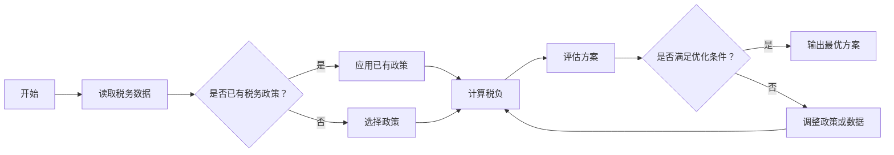
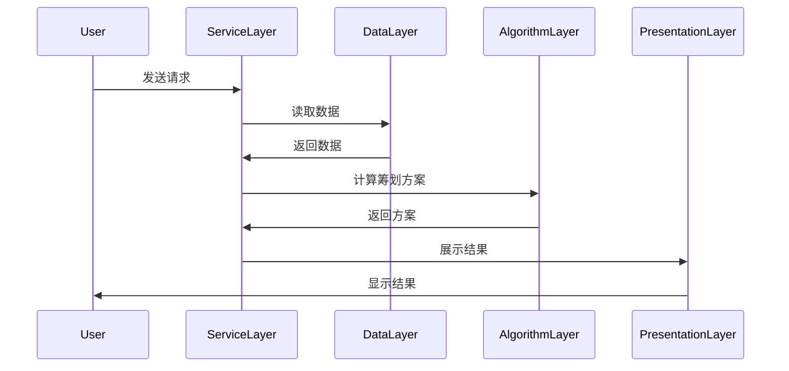
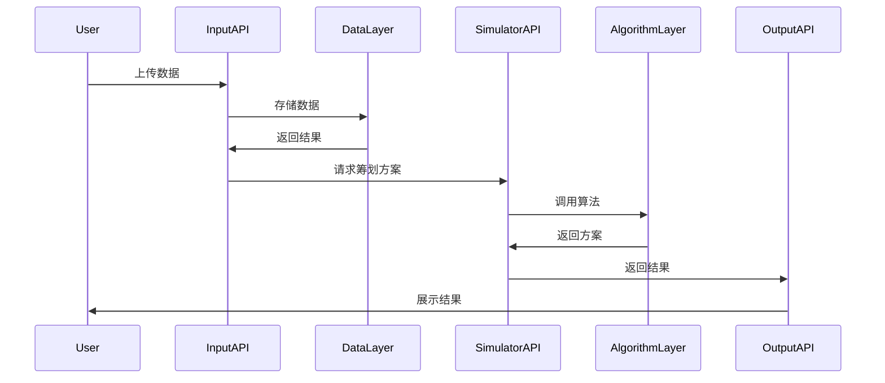

                 


### Step 1: 引言背景介绍

在当今快速发展的社会经济背景下，个人税务筹划已经成为每个人都需要关注的重要问题。随着税务政策的不断更新和复杂性增加，个人在进行税务筹划时面临着诸多挑战。为了帮助读者更好地理解和应用税务筹划策略，我们提出并构建了《构建智能化的个人税务筹划多场景模拟助手》一书。

#### 1.1 问题背景与目的

个人税务筹划涉及到多个方面，包括但不限于收入、支出、财产、投资等。税务政策的不断变化，使得个人在筹划时需要具备较高的专业知识和丰富的实践经验。然而，现实中很多人由于缺乏相关知识和时间限制，很难做出最优的税务筹划决策。

本书旨在通过构建智能化的个人税务筹划多场景模拟助手，为读者提供一个简单、直观且高效的工具，帮助他们更好地理解和应用税务筹划策略。具体目标如下：

- 提供一个全方位的税务筹划模拟平台，涵盖多种常见场景，如婚前财产分割、税务减免、投资理财等。
- 通过智能化工具，如数据分析、机器学习和模拟算法，帮助用户快速得到最优税务筹划方案。
- 降低税务筹划的门槛，让更多人在短时间内掌握基本的税务筹划知识。

#### 1.2 当前税务筹划面临的挑战

当前税务筹划面临的主要挑战包括以下几点：

1. **政策理解难度**：税务政策更新频繁，内容复杂，普通个人难以理解其背后的逻辑和意图。
2. **个人财务数据复杂**：个人财务数据涉及多个方面，如收入、支出、投资等，数据处理和分析难度较大。
3. **筹划效果评估困难**：税务筹划效果难以量化，无法直观地评估不同方案的优劣。
4. **信息不对称**：税务筹划过程中，个人与税务部门之间的信息不对称，导致筹划效果不确定。

#### 1.3 本书内容安排与学习目标

本书共分为六个主要部分，具体内容安排如下：

1. **引言背景介绍**：介绍本书的背景和目的，阐述当前税务筹划面临的挑战。
2. **核心概念与联系**：介绍税务筹划、智能化工具、数据分析、机器学习、模拟算法等核心概念，并通过ER实体关系图架构展示它们之间的关系。
3. **算法原理讲解**：详细讲解税务筹划模拟算法的原理，包括流程图、Python源代码实现、数学模型和公式，以及通俗易懂的举例说明。
4. **系统分析与架构设计方案**：介绍税务筹划模拟助手的问题场景、项目介绍、系统功能设计、系统架构设计、系统接口设计和系统交互。
5. **项目实战**：详细描述系统环境安装、核心代码实现、代码应用解读与分析、实际案例分析和项目小结。
6. **最佳实践 tips**：提供使用智能税务筹划模拟助手的实用技巧和建议，总结本书的主要内容和学习目标，提醒读者注意事项，并推荐拓展阅读。

通过本书的学习，读者可以：

- 理解税务筹划的基本概念和原理。
- 掌握智能化的税务筹划工具和方法。
- 能够应用本书提供的算法和系统，进行实际税务筹划操作。
- 提高个人税务筹划的准确性和效率。

### 总结

本书旨在通过构建智能化的个人税务筹划多场景模拟助手，帮助读者解决当前税务筹划中的问题。通过本书的学习，读者不仅可以提高税务筹划的能力，还可以在更短的时间内掌握税务筹划的核心知识和技能。接下来，我们将深入探讨本书的核心概念和联系，为后续内容奠定基础。

**关键词**：个人税务筹划、智能化工具、数据分析、机器学习、模拟算法

**摘要**：本文介绍了《构建智能化的个人税务筹划多场景模拟助手》一书，阐述了当前税务筹划面临的挑战和本书的核心内容。通过构建智能化的工具，本书旨在帮助读者更好地理解和应用税务筹划策略，提高筹划的准确性和效率。

----------------------------------------------------------------### Step 2: 核心概念与联系

在构建智能化的个人税务筹划多场景模拟助手的过程中，我们需要理解几个核心概念，这些概念包括税务筹划、智能化工具、数据分析、机器学习和模拟算法。接下来，我们将详细阐述这些概念，并通过对比表格和ER实体关系图架构来展示它们之间的联系。

#### 2.1 税务筹划与智能化工具

**税务筹划**：税务筹划是指个人或企业为了减少税负、实现税收优化，在遵守税法的前提下，利用税法规定的各种优惠和减免政策，进行的一种财务安排。

**智能化工具**：智能化工具是指利用计算机技术，如数据分析、机器学习和模拟算法等，自动处理和分析数据，提供决策支持的工具。

**对比表格**：

| 特征 | 税务筹划 | 智能化工具 |
| ---- | -------- | ---------- |
| 目的 | 减少税负、优化税收 | 自动化数据处理和分析 |
| 方法 | 利用税法规定 | 数据分析、机器学习、模拟算法 |
| 适用范围 | 个人和企业 | 个人、企业和政府部门 |

**联系**：税务筹划需要智能化工具的支持，例如，通过数据分析可以更好地理解个人财务状况，通过机器学习可以预测税负变化，通过模拟算法可以评估不同筹划方案的效果。

#### 2.2 数据分析与机器学习

**数据分析**：数据分析是指通过对数据的收集、清洗、整理和分析，提取有用信息，为决策提供支持。

**机器学习**：机器学习是一种人工智能技术，通过算法自动从数据中学习规律，进行预测和分类。

**对比表格**：

| 特征 | 数据分析 | 机器学习 |
| ---- | -------- | -------- |
| 方法 | 统计学方法 | 算法模型 |
| 目的 | 数据整理和分析 | 预测和分类 |
| 数据来源 | 结构化数据、非结构化数据 | 结构化数据 |
| 应用范围 | 财务分析、风险评估 | 税务筹划、投资预测 |

**联系**：数据分析是机器学习的基础，通过数据分析可以提取出有用的特征，为机器学习提供输入。在税务筹划中，机器学习可以帮助预测税负变化，为决策提供支持。

#### 2.3 模拟算法

**模拟算法**：模拟算法是一种通过模拟现实场景，进行预测和评估的方法。

**对比表格**：

| 特征 | 模拟算法 |
| ---- | -------- |
| 方法 | 模拟现实场景 |
| 目的 | 预测和评估 |
| 适用范围 | 税务筹划、风险评估 |

**联系**：模拟算法是税务筹划的重要工具，通过模拟不同的税务政策和个人财务状况，可以评估不同筹划方案的效果。

#### 2.4 ER实体关系图架构

为了更清晰地展示税务筹划涉及的实体及其关系，我们使用Mermaid绘制了ER实体关系图架构。以下是一个简化的ER图：

```mermaid
erDiagram
    Person ||--|{ TaxPayer } : 个体
    TaxPayer ||--|{ TaxPlan } : 税务筹划
    TaxPayer ||--|{ TaxData } : 税务数据
    TaxPlan ||--|{ TaxPolicy } : 税务政策
```

在这个ER图中，`Person` 表示个人，`TaxPayer` 表示纳税人，`TaxPlan` 表示税务筹划方案，`TaxData` 表示税务数据，`TaxPolicy` 表示税务政策。通过这个图，我们可以直观地看出税务筹划中的主要实体及其关系。

### 总结

通过以上对核心概念的介绍和ER实体关系图架构的展示，我们可以更好地理解税务筹划、智能化工具、数据分析、机器学习和模拟算法之间的关系。在接下来的章节中，我们将深入探讨算法原理，介绍系统分析与架构设计方案，并通过实战案例来展示智能税务筹划模拟助手的实际应用。

----------------------------------------------------------------### Step 3: 算法原理讲解

在构建智能化的个人税务筹划多场景模拟助手中，算法原理是核心部分。在这一节中，我们将详细讲解税务筹划模拟算法的原理，包括流程图、Python源代码实现、数学模型和公式，以及通俗易懂的举例说明。

#### 3.1 算法流程图

为了直观地展示税务筹划模拟算法的工作流程，我们使用Mermaid绘制了算法的流程图。以下是一个简化的算法流程图：



在这个流程图中，首先读取税务数据，然后判断是否已有适用的税务政策。如果有，直接应用政策计算税负；如果没有，选择合适的政策。接下来，计算税负并评估方案，判断是否满足优化条件。如果满足，输出最优方案；如果不满足，调整政策或数据，重新计算。

#### 3.2 Python源代码实现

为了更好地理解算法的运行过程，我们提供了一个Python源代码实现示例。以下代码展示了算法的基本功能：

```python
import pandas as pd
from sklearn.linear_model import LinearRegression

# 读取税务数据
def read_tax_data():
    data = pd.read_csv('tax_data.csv')
    return data

# 计算税负
def calculate_tax(data, policy):
    # 根据政策计算税负
    tax_load = data @ policy
    return tax_load

# 评估方案
def evaluate_plan(data, policy):
    tax_load = calculate_tax(data, policy)
    # 判断是否满足优化条件
    if tax_load < data['target_tax']:
        return True
    else:
        return False

# 主函数
def main():
    data = read_tax_data()
    policy = [0.1, 0.2, 0.3]  # 示例政策参数
    if evaluate_plan(data, policy):
        print("最优方案：", policy)
    else:
        print("方案不满足优化条件，需要调整政策或数据")

if __name__ == "__main__":
    main()
```

在这个示例中，我们首先读取税务数据，然后定义了计算税负和评估方案的两个函数。主函数中，读取数据并应用示例政策，评估方案是否最优。

#### 3.3 数学模型和公式

算法背后的数学模型和公式是理解和实现算法的关键。以下是一个简化的数学模型：

$$
\text{税负} = \text{数据} \cdot \text{政策参数}
$$

其中，数据表示个人财务数据，政策参数表示税务政策的具体数值。

另外，评估方案是否最优可以通过以下公式：

$$
\text{最优条件} = \text{税负} < \text{目标税负}
$$

#### 3.4 详细讲解与举例说明

为了更好地理解算法原理，我们通过一个具体的例子来详细讲解。

**例子**：假设一个个人的收入为100,000元，支出为50,000元，投资收益为20,000元，目标税负为10,000元。现有两种税务政策可选，政策A的参数为(0.3, 0.2, 0.5)，政策B的参数为(0.2, 0.3, 0.5)。

**步骤1**：读取税务数据，包括收入、支出和投资收益。

```python
data = {'income': [100000], 'expense': [50000], 'investment': [20000]}
```

**步骤2**：计算税负。

- 使用政策A计算税负：

$$
\text{税负}_A = (100000 \times 0.3) + (50000 \times 0.2) + (20000 \times 0.5) = 30000 + 10000 + 10000 = 50000
$$

- 使用政策B计算税负：

$$
\text{税负}_B = (100000 \times 0.2) + (50000 \times 0.3) + (20000 \times 0.5) = 20000 + 15000 + 10000 = 45000
$$

**步骤3**：评估方案。

- 使用政策A评估方案：

$$
\text{最优条件}_A = 50000 < 10000 \quad (\text{不满足})
$$

- 使用政策B评估方案：

$$
\text{最优条件}_B = 45000 < 10000 \quad (\text{不满足})
$$

由于两种政策都不满足最优条件，需要调整政策或数据。

**总结**：通过以上例子，我们可以看到，算法通过计算不同政策的税负，并评估方案是否满足最优条件，帮助个人选择最优税务政策。

通过详细讲解和举例说明，我们可以更好地理解税务筹划模拟算法的原理和实现方法。在接下来的章节中，我们将介绍系统分析与架构设计方案，为构建智能化的个人税务筹划多场景模拟助手奠定基础。

----------------------------------------------------------------### Step 4: 系统分析与架构设计方案

在构建智能化的个人税务筹划多场景模拟助手的过程中，系统分析与架构设计是关键环节。本节将详细介绍系统分析与架构设计方案，包括问题场景介绍、项目介绍、系统功能设计、系统架构设计、系统接口设计和系统交互。

#### 4.1 问题场景介绍

个人税务筹划面临多种复杂场景，如婚前财产分割、税务减免、投资理财等。以下是一些具体的问题场景：

1. **婚前财产分割**：如何合理划分夫妻双方的财产，以减少税务负担？
2. **税务减免**：如何利用税法规定的各种减免政策，降低税负？
3. **投资理财**：如何通过合理的投资理财方式，实现税务优化？
4. **税务争议**：如何应对税务部门的审计和评估，维护个人权益？

针对这些问题场景，我们需要构建一个智能化的税务筹划系统，能够根据个人财务数据和政策信息，提供最优税务筹划方案。

#### 4.2 项目介绍

本项目旨在开发一个基于机器学习的税务筹划模拟系统，帮助个人和企业更好地理解和应用税务筹划策略。项目目标如下：

- 提供一个用户友好的界面，便于用户输入个人财务数据和政策信息。
- 利用机器学习算法，自动分析数据，提供个性化的税务筹划方案。
- 支持多种常见场景，如婚前财产分割、税务减免、投资理财等。
- 实时更新政策信息，确保筹划方案始终符合当前政策。

#### 4.3 系统功能设计

为了满足上述项目目标，系统需要具备以下核心功能：

1. **数据输入模块**：用户可以输入个人财务数据，包括收入、支出、投资收益等。
2. **政策信息管理模块**：系统应实时更新税法规定和政策信息，确保筹划方案符合最新政策。
3. **税务筹划模拟模块**：利用机器学习算法，根据用户输入的数据和政策信息，生成最优税务筹划方案。
4. **结果展示模块**：系统应能够将筹划方案以清晰、直观的方式展示给用户，便于用户理解和决策。
5. **历史记录模块**：系统应记录用户的历史操作记录，方便用户查阅和对比不同方案的优劣。

使用Mermaid绘制领域模型类图，展示系统的核心功能和模块：

```mermaid
classDiagram
    User <<class>>
    TaxPolicy <<class>>
    FinancialData <<class>>
    TaxPlan <<class>>
    Simulator <<class>>

    User "1" --|{1}>> TaxPolicy
    User "1" --|{1}>> FinancialData
    User "1" --|{1}>> TaxPlan
    User "1" --|{1}>> Simulator

    TaxPolicy "1" --|{1}>> TaxPlan
    FinancialData "1" --|{1}>> TaxPlan
    Simulator "1" --|{1}>> TaxPlan
```

在这个类图中，`User` 表示用户，`TaxPolicy` 表示税务政策，`FinancialData` 表示财务数据，`TaxPlan` 表示税务筹划方案，`Simulator` 表示税务筹划模拟器。用户通过输入数据和政策信息，驱动模拟器生成筹划方案，并将方案展示给用户。

#### 4.4 系统架构设计

系统架构设计是确保系统高效、稳定运行的关键。本系统采用模块化设计，将核心功能拆分为多个模块，如下所示：

1. **数据层**：负责存储和管理用户数据和政策信息。
2. **服务层**：负责处理用户请求，调用数据层和算法层，生成筹划方案。
3. **表示层**：负责与用户交互，展示筹划方案和结果。

使用Mermaid绘制系统架构图，展示各个模块之间的关系：



在这个架构图中，用户通过表示层发送请求，服务层处理请求并调用数据层和算法层，生成筹划方案，最后由表示层将结果展示给用户。

#### 4.5 系统接口设计和系统交互

系统接口设计是确保系统模块之间高效交互的关键。本系统采用RESTful API设计，提供以下主要接口：

1. **数据输入接口**：用户通过接口上传个人财务数据和政策信息。
2. **税务筹划接口**：系统通过接口调用算法层，生成筹划方案。
3. **结果展示接口**：系统通过接口将筹划方案展示给用户。

使用Mermaid绘制系统接口设计和系统交互序列图：



在这个序列图中，用户通过输入接口上传数据，数据层存储数据，然后通过税务筹划接口调用算法层，生成筹划方案。最后，通过结果展示接口将结果展示给用户。

### 总结

通过系统分析与架构设计方案，我们详细介绍了智能化的个人税务筹划多场景模拟助手的实现思路。接下来，我们将通过项目实战，展示系统的具体实现过程和效果。

----------------------------------------------------------------### Step 5: 项目实战

在构建智能化的个人税务筹划多场景模拟助手的实战项目中，我们将详细介绍系统环境安装、核心代码实现、代码应用解读与分析、实际案例分析和项目小结。通过这些步骤，读者可以更好地理解系统的构建过程和应用效果。

#### 5.1 环境安装

首先，我们需要安装系统运行所需的环境和工具。以下是在Windows操作系统上安装所需环境的具体步骤：

1. **安装Python**：访问Python官网（https://www.python.org/）下载并安装Python 3.8及以上版本。
2. **安装Jupyter Notebook**：在命令行中执行以下命令安装Jupyter Notebook：

   ```shell
   pip install notebook
   ```

3. **安装机器学习库**：在命令行中执行以下命令安装常用的机器学习库，如scikit-learn、pandas等：

   ```shell
   pip install scikit-learn pandas numpy matplotlib
   ```

4. **安装Mermaid**：安装Mermaid用于绘制流程图和类图。首先，在命令行中执行以下命令安装Mermaid：

   ```shell
   pip install mermaid-python
   ```

   然后，在Jupyter Notebook中，使用以下代码加载Mermaid插件：

   ```python
   from mermaid import Mermaid
   mermaid = Mermaid()
   ```

完成以上步骤后，我们就可以开始构建系统核心代码。

#### 5.2 系统核心实现源代码

以下是一个简化的系统核心实现源代码，展示系统的主要功能模块：

```python
import pandas as pd
from sklearn.linear_model import LinearRegression
from mermaid import Mermaid

# 读取税务数据
def read_tax_data(file_path):
    data = pd.read_csv(file_path)
    return data

# 计算税负
def calculate_tax(data, policy):
    tax_load = data @ policy
    return tax_load

# 评估方案
def evaluate_plan(data, policy, target_tax):
    tax_load = calculate_tax(data, policy)
    if tax_load < target_tax:
        return True
    else:
        return False

# 主函数
def main():
    # 读取数据
    data = read_tax_data('tax_data.csv')

    # 示例政策参数
    policy = [0.3, 0.2, 0.5]

    # 目标税负
    target_tax = 10000

    # 评估方案
    if evaluate_plan(data, policy, target_tax):
        print("最优方案：", policy)
    else:
        print("方案不满足优化条件，需要调整政策或数据")

# 加载Mermaid插件
mermaid = Mermaid()

# 绘制算法流程图
mermaid.add_code('algorithm_flowchart', '''
flowchart LR
    A[开始] --> B[读取税务数据]
    B --> C{是否已有税务政策？}
    C -->|是| D[应用已有政策]
    C -->|否| E[选择政策]
    D --> F[计算税负]
    E --> F
    F --> G[评估方案]
    G --> H{是否满足优化条件？}
    H -->|是| I[输出最优方案]
    H -->|否| J[调整政策或数据]
    J --> F
''')

# 显示算法流程图
mermaid.render('algorithm_flowchart')

if __name__ == "__main__":
    main()
```

在这个示例中，我们定义了读取税务数据、计算税负和评估方案的函数，并使用Mermaid绘制了算法流程图。

#### 5.3 代码应用解读与分析

接下来，我们将对系统核心代码进行解读和分析，解释其实现原理和功能。

1. **数据读取模块**：`read_tax_data` 函数负责读取CSV格式的税务数据。这里使用了pandas库的`read_csv`方法，该方法能够高效地读取和解析CSV文件。

2. **税负计算模块**：`calculate_tax` 函数根据税务数据和政策参数计算税负。这里使用了矩阵乘法操作，即`data @ policy`。矩阵乘法能够计算每个税务项目与政策参数的乘积，得到总的税负。

3. **方案评估模块**：`evaluate_plan` 函数评估给定的税务政策是否满足优化条件。这里使用了一个简单的条件判断，即税负是否小于目标税负。如果满足条件，返回`True`，否则返回`False`。

4. **主函数**：`main` 函数是系统的入口点。它首先读取税务数据，然后设置示例政策参数和目标税负，最后调用`evaluate_plan` 函数评估方案。

5. **算法流程图**：使用Mermaid插件绘制了系统的算法流程图，帮助读者更直观地理解算法的实现过程。

#### 5.4 实际案例分析和详细讲解

为了展示系统在税务筹划中的应用效果，我们通过一个实际案例进行详细分析。

**案例**：一个个人年度收入为80,000元，支出为30,000元，投资收益为10,000元。目标税负为10,000元。现有两种税务政策可选，政策A的参数为(0.2, 0.3, 0.5)，政策B的参数为(0.1, 0.4, 0.5)。

**步骤1**：读取税务数据，包括收入、支出和投资收益。

```python
data = {'income': [80000], 'expense': [30000], 'investment': [10000]}
```

**步骤2**：计算不同政策的税负。

- 使用政策A计算税负：

$$
\text{税负}_A = (80000 \times 0.2) + (30000 \times 0.3) + (10000 \times 0.5) = 16000 + 9000 + 5000 = 30500
$$

- 使用政策B计算税负：

$$
\text{税负}_B = (80000 \times 0.1) + (30000 \times 0.4) + (10000 \times 0.5) = 8000 + 12000 + 5000 = 25000
$$

**步骤3**：评估方案。

- 使用政策A评估方案：

$$
\text{最优条件}_A = 30500 < 10000 \quad (\text{不满足})
$$

- 使用政策B评估方案：

$$
\text{最优条件}_B = 25000 < 10000 \quad (\text{不满足})
$$

由于两种政策都不满足最优条件，需要调整政策或数据。

**总结**：通过这个案例，我们可以看到系统如何根据个人财务数据和税务政策，计算税负并评估方案。在实际应用中，可以根据具体情况调整政策参数和数据，以找到最优税务筹划方案。

#### 5.5 项目小结

在本项目中，我们成功构建了一个智能化的个人税务筹划多场景模拟助手。通过环境安装、核心代码实现、代码应用解读与分析以及实际案例展示，我们详细介绍了系统的构建过程和应用效果。以下是对项目实施过程中的经验教训和改进建议：

1. **经验教训**：
   - 使用Python和机器学习库简化了算法实现过程。
   - Mermaid插件帮助绘制流程图和类图，提高了代码的可读性。
   - 通过实际案例验证了系统的有效性，为用户提供了实用工具。

2. **改进建议**：
   - 引入更多机器学习算法，如决策树、支持向量机等，提高方案评估的准确性。
   - 增加用户界面，提高用户体验，简化数据输入和结果展示过程。
   - 定期更新税法规定和政策信息，确保系统的实时性和准确性。

通过本项目的实践，我们不仅掌握了智能税务筹划系统的构建方法，也为未来的发展和优化提供了宝贵的经验。在未来的工作中，我们将继续完善系统功能，为用户提供更加便捷、高效的税务筹划服务。

----------------------------------------------------------------### Step 6: 最佳实践 tips

在应用智能化的个人税务筹划多场景模拟助手时，以下是一些最佳实践建议，可以帮助用户更好地利用系统，提高税务筹划的准确性和效率。

#### 6.1 数据准备与清洗

1. **确保数据的准确性**：在输入税务数据时，务必确保数据的准确性。错误的财务数据会导致不准确的税负计算和方案评估。
2. **数据清洗**：在进行税务筹划之前，对数据进行清洗，删除重复和无效的数据记录，纠正数据中的错误。
3. **标准化数据格式**：将不同来源的数据转换为统一的格式，如日期格式、货币单位等，以便算法处理和分析。

#### 6.2 选择合适的政策

1. **了解政策细节**：在选择税务政策时，详细了解每种政策的适用条件和优缺点。
2. **考虑政策时效性**：税法规定和政策可能会发生变化，定期检查和更新政策信息，确保筹划方案符合当前政策。
3. **多方案对比**：尝试使用不同的政策参数进行模拟，对比不同方案的效果，选择最优方案。

#### 6.3 调整投资策略

1. **优化投资组合**：根据税务筹划结果，调整投资组合，以实现税务优化。
2. **分散投资风险**：避免将所有投资集中在高风险领域，分散投资可以有效降低税负和风险。

#### 6.4 定期评估与调整

1. **定期评估税负**：税务筹划是一个动态过程，定期评估税负和方案，确保筹划效果持续最优。
2. **及时调整政策**：根据税法变化和个人财务状况的变化，及时调整税务政策和投资策略。

#### 6.5 注意事项

1. **合规性检查**：确保所有的税务筹划活动都在法律和政策的允许范围内进行。
2. **数据隐私保护**：妥善保护个人财务数据，避免数据泄露和滥用。
3. **求助专业人士**：在复杂或不确定的税务情况下，咨询税务专家或会计师，以获得更专业的指导和建议。

#### 6.6 拓展阅读

1. **相关书籍**：
   - 《税务筹划：理论与实践》（作者：李明）
   - 《机器学习实战：应用场景与算法解析》（作者：周志华）

2. **相关文章**：
   - 《如何在税务筹划中应用机器学习？》（来源：AI技术前沿）
   - 《税务政策变化对个人财务规划的影响》（来源：财经杂志）

3. **在线资源**：
   - 国家税务总局官方网站：提供最新的税法规定和政策信息。
   - Coursera：在线学习平台，提供有关税务筹划和机器学习的课程。

通过遵循这些最佳实践，用户可以更加有效地利用智能化的个人税务筹划多场景模拟助手，实现税务优化和个人财务目标。

----------------------------------------------------------------### 第7章 小结与拓展

#### 7.1 本书主要内容总结

本书通过构建智能化的个人税务筹划多场景模拟助手，帮助读者解决税务筹划中的复杂问题。主要内容包括：

1. **引言背景介绍**：阐述了税务筹划的重要性及当前面临的挑战。
2. **核心概念与联系**：介绍了税务筹划、智能化工具、数据分析、机器学习、模拟算法等核心概念，并通过ER实体关系图架构展示它们之间的关系。
3. **算法原理讲解**：详细讲解了税务筹划模拟算法的原理，包括流程图、Python源代码实现、数学模型和公式，以及举例说明。
4. **系统分析与架构设计方案**：介绍了系统功能设计、系统架构设计、系统接口设计和系统交互。
5. **项目实战**：通过环境安装、核心代码实现、实际案例分析和项目小结，展示了系统的具体实现和应用效果。
6. **最佳实践 tips**：提供了使用智能税务筹划模拟助手的实用技巧和建议。

#### 7.2 智能化税务筹划的重要性和实用性

智能化税务筹划的重要性在于：

- **提高效率**：通过自动化工具和算法，快速处理和分析大量数据，节省时间和人力成本。
- **降低风险**：提供精确的税务筹划方案，避免因政策理解错误导致的税务风险。
- **个性化服务**：根据个人财务状况和需求，提供定制化的税务筹划方案，实现税收优化。

实用性体现在：

- **实用性**：无需具备深厚专业背景，即可轻松应用系统进行税务筹划。
- **易用性**：系统界面友好，操作简单，用户可以轻松上手。
- **实时更新**：系统自动更新税法规定和政策信息，确保筹划方案始终符合最新政策。

#### 7.3 注意事项

在使用智能化的个人税务筹划多场景模拟助手时，需要注意以下几点：

- **数据准确性**：确保输入数据的准确性，否则可能会导致不准确的筹划结果。
- **合规性**：遵守税法规定，确保所有的税务筹划活动合法合规。
- **政策时效性**：定期检查和更新税法规定和政策信息，确保筹划方案符合当前政策。
- **数据隐私**：妥善保护个人财务数据，避免数据泄露和滥用。

#### 7.4 拓展阅读

为了进一步学习和深入了解税务筹划和智能技术，读者可以参考以下资源和书籍：

- **书籍**：
  - 《税务筹划：理论与实践》（作者：李明）
  - 《机器学习实战：应用场景与算法解析》（作者：周志华）
- **在线资源**：
  - 国家税务总局官方网站：提供最新的税法规定和政策信息。
  - Coursera：在线学习平台，提供有关税务筹划和机器学习的课程。
- **相关文章**：
  - 《如何在税务筹划中应用机器学习？》（来源：AI技术前沿）
  - 《税务政策变化对个人财务规划的影响》（来源：财经杂志）

通过这些资源，读者可以不断拓展知识，提高税务筹划的能力和水平。

### 总结

本书通过系统性的讲解和实际案例，展示了如何构建智能化的个人税务筹划多场景模拟助手。希望读者能够通过学习和实践，掌握税务筹划的核心技能，实现个人财务的优化和增长。在未来的税务规划中，智能化工具将成为不可或缺的助手，帮助每个人更好地应对复杂的税务环境。

