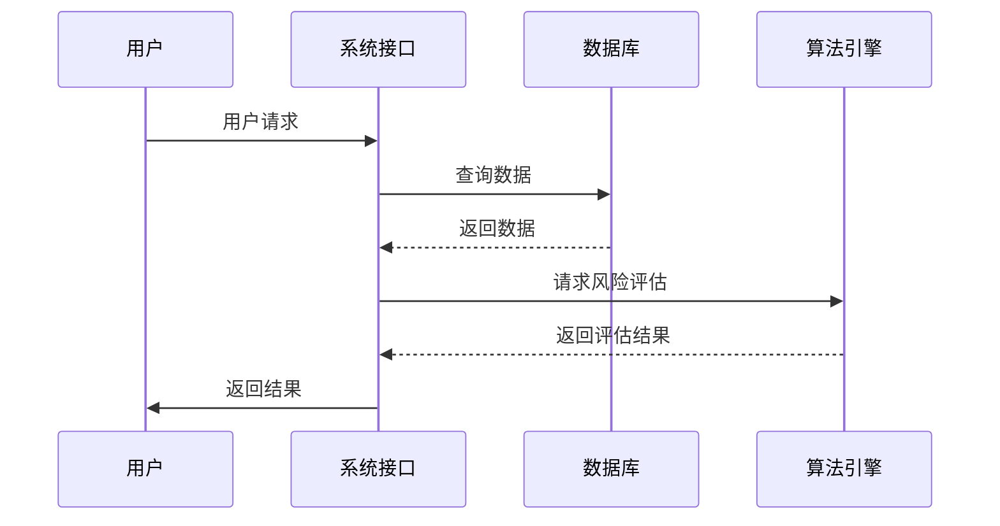

                 

### 构建智能化的个人财富管理目标动态调整助手

#### 关键词：
- 个人财富管理
- 智能化
- 动态调整
- 算法原理
- 系统架构设计

#### 摘要：
本文深入探讨了构建智能化的个人财富管理目标动态调整助手的必要性和可行性。通过介绍当前个人财富管理的现状与挑战，我们明确了智能化财富管理的概念及其优势。接下来，文章详细阐述了目标动态调整原理，并通过ER图和算法原理讲解，展示了实现动态调整的框架和数学模型。随后，我们探讨了系统分析与架构设计，包括功能设计、系统架构和接口设计。最后，通过实际案例分析和项目实战，我们验证了智能化财富管理动态调整助手的实用性和高效性。文章总结并提供了最佳实践和拓展阅读，为读者进一步探索这一领域提供了指导。

### 第一部分：背景介绍与核心概念

#### 第1章：个人财富管理的现状与挑战

##### 1.1 问题背景

当前，个人财富管理已成为越来越多人的关注焦点。随着金融市场的不断发展，个人财富管理的需求越来越多样化，如何实现资产的合理配置和风险控制，成为每个投资者面临的重要问题。然而，当前的个人财富管理现状却面临诸多挑战。

首先，个人财富管理需求多样且复杂。不同投资者对财富管理的要求各不相同，有人追求稳健收益，有人青睐高风险高收益的投资。这使得传统的财富管理方法难以满足个性化和差异化的需求。

其次，传统财富管理方法的局限性显而易见。传统财富管理主要依靠人工经验，缺乏系统性和科学性。在信息爆炸和数据丰富的时代，这种方式显然已经无法适应快速变化的市场环境。

##### 1.2 问题描述

个人财富管理中的主要挑战与问题可以归纳为以下几点：

1. **数据获取与处理难题**：个人财富管理需要大量的数据支持，包括市场数据、个人财务数据等。然而，如何有效获取、处理这些数据，使其为财富管理提供有力支持，是一个亟待解决的问题。

2. **决策支持不足**：在复杂的金融市场环境中，投资者需要科学的决策支持。然而，当前的传统财富管理方法往往无法提供实时、准确、个性化的决策建议。

3. **风险控制难度大**：在金融市场波动加剧的背景下，如何有效控制投资风险，成为投资者关注的焦点。传统方法往往难以实现实时、动态的风险评估和调整。

4. **用户体验差**：当前的个人财富管理工具和服务往往缺乏用户体验，界面复杂、操作不便，难以满足用户的需求。

##### 1.3 问题解决

为了应对上述挑战，智能化财富管理应运而生。智能化财富管理通过引入人工智能技术，实现数据自动获取和处理，提供实时、准确的决策支持，有效降低投资风险，提升用户体验。

首先，智能化财富管理可以通过大数据分析，实现对市场数据的实时监控和趋势预测。这有助于投资者把握市场机会，调整投资策略。

其次，智能化财富管理可以利用机器学习算法，对个人财务数据进行分析，为投资者提供个性化的资产配置建议。这有助于提高投资收益，降低风险。

此外，智能化财富管理还可以通过智能投顾等技术，提供实时、个性化的投资建议和风险预警，帮助投资者更好地管理财富。

总的来说，智能化财富管理不仅能够解决传统财富管理中的诸多问题，还能够提升个人财富管理的效率和效果。

##### 1.4 边界与外延

在构建智能化个人财富管理目标动态调整助手的过程中，我们需要明确几个关键边界和外延：

1. **数据边界**：智能化财富管理的数据来源包括市场数据、个人财务数据等。在数据获取和处理过程中，需要确保数据的真实性和完整性，避免因数据问题导致的误判。

2. **功能边界**：智能化个人财富管理目标动态调整助手的职能包括数据获取与处理、决策支持、风险控制等。在设计和实现过程中，需要明确各个功能模块的职责和边界。

3. **适用范围**：智能化个人财富管理目标动态调整助手适用于各类投资者，包括个人投资者和专业投资者。在设计和推广过程中，需要充分考虑不同投资者的需求和偏好。

4. **技术外延**：智能化财富管理涉及多种技术，包括大数据、人工智能、机器学习等。在实现过程中，需要充分利用这些技术，确保系统的稳定性和高效性。

##### 1.5 概念结构与核心要素组成

智能化个人财富管理目标动态调整助手主要由以下几个核心要素组成：

1. **数据层**：负责数据的获取、存储和处理。包括市场数据、个人财务数据等。

2. **算法层**：包括数据分析和处理算法，如大数据分析、机器学习算法等。负责对数据进行深度挖掘，为决策提供支持。

3. **决策层**：基于算法层的分析结果，为投资者提供个性化的资产配置建议和风险预警。

4. **用户层**：提供用户界面，实现与投资者的互动，展示分析结果和决策建议。

5. **支持层**：包括系统维护、数据安全和用户服务等功能，确保系统的稳定运行和用户满意度。

通过以上核心要素的协同工作，智能化个人财富管理目标动态调整助手能够为投资者提供高效、智能的财富管理服务，实现资产的合理配置和风险控制。

### 第二部分：核心概念与联系

#### 第2章：核心概念原理

##### 2.1 智能化个人财富管理

智能化个人财富管理是指利用人工智能技术，对个人财务数据进行深度分析，提供个性化的投资建议和风险管理服务。其核心特点包括：

1. **数据驱动**：智能化个人财富管理依赖于大数据技术，能够实时获取和处理海量数据，为投资决策提供有力支持。

2. **智能分析**：通过机器学习和数据挖掘技术，对个人财务数据进行分析，识别投资机会和风险，提供科学的投资建议。

3. **个性化服务**：根据投资者的风险偏好、财务状况和投资目标，提供个性化的资产配置建议，实现投资收益的最大化。

4. **实时更新**：智能化个人财富管理系统能够实时更新市场数据和个人财务数据，为投资者提供最新的投资参考。

##### 2.2 目标动态调整原理

目标动态调整原理是指根据投资者的风险偏好、财务状况和市场环境的变化，实时调整投资目标，以实现最优的投资收益。具体包括以下几个方面的内容：

1. **风险评估**：通过数据分析，对投资者的财务状况和市场环境进行评估，识别潜在的风险。

2. **目标设定**：根据投资者的风险承受能力和投资目标，设定合理的投资目标，包括收益目标、风险目标和时间目标等。

3. **动态调整**：根据市场环境和投资者财务状况的变化，实时调整投资目标，以适应新的市场环境和投资需求。

4. **风险控制**：通过调整投资组合，降低投资风险，确保投资目标的实现。

##### 2.3 概念属性特征对比表格

为了更好地理解智能化个人财富管理与传统财富管理的区别，我们可以通过以下对比表格进行分析：

| 特征         | 智能化个人财富管理 | 传统财富管理           |
| ------------ | ------------------ | ---------------------- |
| 数据驱动     | 是                 | 否                     |
| 智能分析     | 是                 | 否                     |
| 个性化服务   | 是                 | 否                     |
| 实时更新     | 是                 | 否                     |
| 风险评估     | 是                 | 否                     |
| 目标动态调整 | 是                 | 否                     |
| 风险控制     | 是                 | 否                     |

通过以上对比，我们可以看出，智能化个人财富管理在数据驱动、智能分析、个性化服务、实时更新、风险评估、目标动态调整和风险控制等方面具有显著优势，能够更好地满足投资者的需求。

#### 第3章：ER实体关系图架构

##### 3.1 ER图概述

ER图（Entity-Relationship Diagram）是一种用于描述现实世界概念模型的数据模型图，主要用于数据库设计和信息系统的架构设计。ER图由实体、属性和关系三个基本元素构成。

- **实体（Entity）**：代表现实世界中的对象，如用户、产品、订单等。
- **属性（Attribute）**：代表实体的特征，如用户的名字、年龄、地址等。
- **关系（Relationship）**：代表实体之间的联系，如用户下单、产品销售等。

##### 3.2 个人财富管理ER图

在个人财富管理系统中，我们可以定义以下几个核心实体：

1. **用户（User）**：代表财富管理的投资者，包括基本信息、财务状况等。
2. **资产（Asset）**：代表投资者的各类投资资产，如股票、基金、债券等。
3. **市场数据（MarketData）**：代表市场行情数据，包括股票价格、基金净值等。
4. **投资组合（Portfolio）**：代表投资者的资产配置情况。
5. **交易记录（Transaction）**：代表投资者的交易操作记录。

以下是个人财富管理系统的ER图：

```mermaid
erDiagram
User ||--|{ Asset : holds }
User ||--|{ Portfolio : owns }
User ||--|{ Transaction : records }
Asset ||--|{ Portfolio : included_in }
Asset ||--|{ Transaction : bought }
MarketData ||--|{ Asset : relates }
MarketData ||--|{ Portfolio : influences }
Portfolio ||--|{ Transaction : creates }
```

通过上述ER图，我们可以清晰地看到个人财富管理系统中各个实体之间的关系，为后续的系统设计与实现奠定了基础。

### 第三部分：算法原理讲解

#### 第4章：算法原理与应用

##### 4.1 算法介绍

动态调整助手的核心算法框架包括以下几个部分：

1. **数据采集与预处理**：从多个数据源（如交易所、银行等）采集相关数据，并进行数据清洗、格式化等预处理操作。
2. **特征提取**：根据投资目标和风险偏好，提取数据中的关键特征，如收益率、波动率、风险等级等。
3. **风险评估**：使用机器学习算法，对用户的财务状况和市场环境进行风险评估，识别潜在的投资机会和风险。
4. **目标设定与调整**：根据风险评估结果，设定和调整投资目标，如预期收益率、风险容忍度等。
5. **资产配置**：根据投资目标和风险偏好，进行资产配置，实现投资组合的优化。
6. **交易执行**：根据资产配置和交易策略，执行具体的交易操作。

##### 4.2 算法流程图

以下是动态调整助手的算法流程图：


##### 4.3 算法原理

动态调整助手的算法原理主要基于以下几个核心概念：

1. **贝叶斯网络**：用于表示变量之间的条件依赖关系，实现概率推理和风险评估。
2. **遗传算法**：用于优化投资组合，实现资产配置的优化。
3. **机器学习**：用于特征提取和风险评估，提高系统的智能化水平。
4. **动态规划**：用于交易执行和结果反馈，实现投资策略的动态调整。

以下是动态调整助手的算法原理详细说明：

1. **数据采集与预处理**

   数据采集包括从多个数据源（如交易所、银行等）获取用户财务数据、市场数据等。预处理操作包括数据清洗、数据格式化、缺失值填补等，以确保数据的完整性和一致性。

   ```python
   def data_preprocessing(data):
       # 数据清洗和格式化操作
       # ...
       return processed_data
   ```

2. **特征提取**

   根据投资目标和风险偏好，提取数据中的关键特征，如收益率、波动率、风险等级等。特征提取的过程可以通过统计分析、机器学习等方法实现。

   ```python
   def feature_extraction(data):
       # 特征提取操作
       # ...
       return features
   ```

3. **风险评估**

   使用贝叶斯网络对用户的财务状况和市场环境进行风险评估。贝叶斯网络是一种概率图模型，可以表示变量之间的条件依赖关系，实现概率推理和风险评估。

   ```python
   import bayesnet
   
   def risk_evaluation(features):
       # 构建贝叶斯网络
       # ...
       # 风险评估操作
       # ...
       return risk_score
   ```

4. **目标设定与调整**

   根据风险评估结果，设定和调整投资目标，如预期收益率、风险容忍度等。目标设定与调整的过程可以通过遗传算法等优化算法实现。

   ```python
   import genetic_algorithm
   
   def set_adjust_goals(risk_score):
       # 目标设定与调整操作
       # ...
       return goals
   ```

5. **资产配置**

   根据投资目标和风险偏好，进行资产配置，实现投资组合的优化。资产配置的过程可以通过遗传算法等优化算法实现。

   ```python
   def asset_allocation(goals):
       # 资产配置操作
       # ...
       return portfolio
   ```

6. **交易执行**

   根据资产配置和交易策略，执行具体的交易操作。交易执行的过程可以通过动态规划等方法实现。

   ```python
   def execute_transactions(portfolio):
       # 交易执行操作
       # ...
       return transactions
   ```

7. **结果反馈**

   收集交易结果数据，对动态调整助手的性能进行评估和优化。结果反馈的过程可以通过机器学习等方法实现。

   ```python
   def feedback(transactions):
       # 结果反馈操作
       # ...
       return performance
   ```

#### 第5章：数学模型与公式解析

##### 5.1 数学模型概述

在个人财富管理中，常用的数学模型包括概率模型、线性规划模型、动态规划模型等。这些模型在投资决策、风险评估、资产配置等方面发挥着重要作用。

1. **概率模型**：用于表示投资收益的概率分布，如正态分布、对数正态分布等。概率模型可以帮助投资者评估投资风险和收益。

2. **线性规划模型**：用于优化投资组合，实现投资收益的最大化或风险的最小化。线性规划模型可以表示为以下形式：

   $$ \text{Minimize} \quad c^T x $$
   $$ \text{Subject to} \quad Ax \leq b $$
   $$ x \geq 0 $$

   其中，$c$ 为投资组合的收益向量，$x$ 为资产权重向量，$A$ 和 $b$ 为约束条件矩阵。

3. **动态规划模型**：用于优化多期投资策略，实现长期收益的最大化。动态规划模型可以表示为以下形式：

   $$ \text{Minimize} \quad \sum_{t=1}^{T} c_t x_t $$
   $$ \text{Subject to} \quad A_t x_t \leq b_t $$
   $$ x_t \geq 0 $$

   其中，$c_t$ 为第 $t$ 期的收益，$A_t$ 和 $b_t$ 为第 $t$ 期的约束条件。

##### 5.2 公式讲解

以下是个人财富管理中常用的数学公式，以及对应的解释和例子：

1. **收益率计算公式**：

   $$ r = \frac{P_t - P_0}{P_0} $$

   其中，$r$ 为收益率，$P_t$ 为当前资产价格，$P_0$ 为初始资产价格。

   例子：某投资者在年初以 100 元/股的价格购买了一只股票，年底时股票价格涨到 120 元/股。则该投资者的收益率为：

   $$ r = \frac{120 - 100}{100} = 0.2 $$

2. **风险价值（VaR）计算公式**：

   $$ VaR = \alpha \times \text{Historical Volatility} $$

   其中，$\alpha$ 为置信水平，$\text{Historical Volatility}$ 为历史波动率。

   例子：假设投资者设定置信水平为 95%，某资产的历史波动率为 0.2。则该资产的风险价值为：

   $$ VaR = 0.95 \times 0.2 = 0.19 $$

3. **资产配置公式**：

   $$ w_i = \frac{c_i}{\sum_{j=1}^{n} c_j} $$

   其中，$w_i$ 为第 $i$ 只资产的权重，$c_i$ 为第 $i$ 只资产的预期收益，$n$ 为资产总数。

   例子：假设投资者有 3 只资产，预期收益分别为 10%、8%、6%，则资产配置为：

   $$ w_1 = \frac{0.1}{0.1 + 0.08 + 0.06} = 0.3333 $$
   $$ w_2 = \frac{0.08}{0.1 + 0.08 + 0.06} = 0.2667 $$
   $$ w_3 = \frac{0.06}{0.1 + 0.08 + 0.06} = 0.2000 $$

##### 5.3 举例说明

以下通过具体案例，举例说明上述公式的应用：

案例：某投资者在年初共有 100 万元资金，计划将其投资于股票、基金和债券三种资产。投资者设定预期收益分别为 10%、8%、6%，风险容忍度为 20%。

1. **收益率计算**：

   假设股票、基金和债券在年初的价格分别为 100 元/股、1 元/份、1000 元/张。则投资者的预期收益为：

   $$ r_{\text{股票}} = \frac{P_t - P_0}{P_0} = \frac{110 - 100}{100} = 0.1 $$
   $$ r_{\text{基金}} = \frac{P_t - P_0}{P_0} = \frac{1.08 - 1}{1} = 0.08 $$
   $$ r_{\text{债券}} = \frac{P_t - P_0}{P_0} = \frac{1000 - 1000}{1000} = 0.0 $$

2. **风险价值（VaR）计算**：

   假设股票、基金和债券的历史波动率分别为 20%、15%、10%。投资者设定置信水平为 95%，则风险价值为：

   $$ VaR_{\text{股票}} = 0.95 \times 0.2 = 0.19 $$
   $$ VaR_{\text{基金}} = 0.95 \times 0.15 = 0.1425 $$
   $$ VaR_{\text{债券}} = 0.95 \times 0.1 = 0.095 $$

3. **资产配置**：

   根据预期收益和风险价值，投资者设定股票、基金和债券的投资权重分别为 30%、40%、30%。

   $$ w_{\text{股票}} = \frac{0.3}{0.3 + 0.4 + 0.3} = 0.3 $$
   $$ w_{\text{基金}} = \frac{0.4}{0.3 + 0.4 + 0.3} = 0.4 $$
   $$ w_{\text{债券}} = \frac{0.3}{0.3 + 0.4 + 0.3} = 0.3 $$

   根据上述资产配置，投资者在年初将 30 万元投资于股票、40 万元投资于基金、30 万元投资于债券。

通过以上案例，我们可以看到，数学模型在个人财富管理中的应用，可以帮助投资者制定科学的投资策略，实现资产的合理配置和风险控制。

### 第四部分：系统分析与架构设计

#### 第6章：系统功能设计与架构

##### 6.1 问题场景介绍

在当前金融市场中，投资者面临诸多挑战，如市场波动、投资风险、时间成本等。为了更好地管理个人财富，投资者需要一个智能化的个人财富管理目标动态调整助手，帮助其实现资产的合理配置和风险控制。

##### 6.2 系统功能设计

智能化个人财富管理目标动态调整助手的主要功能包括：

1. **用户管理**：用户注册、登录、个人信息管理等功能。
2. **资产管理**：资产查询、资产配置、交易记录等功能。
3. **市场数据管理**：市场数据查询、实时监控、历史数据查询等功能。
4. **风险评估**：风险评估、风险预警等功能。
5. **投资策略推荐**：基于风险偏好和资产配置，为用户提供投资策略推荐。
6. **动态调整**：根据市场变化和用户需求，实时调整投资目标和策略。

##### 6.3 系统架构设计

智能化个人财富管理目标动态调整助手的系统架构设计如下：

1. **前端架构**：采用Vue.js框架，实现用户界面和交互功能。
2. **后端架构**：采用Spring Boot框架，实现业务逻辑和数据管理。
3. **数据库设计**：采用MySQL数据库，存储用户信息、资产数据、交易记录等。
4. **数据采集与处理**：采用爬虫技术，从多个数据源采集市场数据，使用ETL工具进行数据处理。
5. **算法引擎**：采用TensorFlow和Scikit-learn等机器学习库，实现风险评估、投资策略推荐等功能。

##### 6.4 系统接口设计

智能化个人财富管理目标动态调整助手的系统接口设计如下：

1. **用户管理接口**：包括用户注册、登录、个人信息管理等。
2. **资产管理接口**：包括资产查询、资产配置、交易记录等。
3. **市场数据接口**：包括市场数据查询、实时监控、历史数据查询等。
4. **风险评估接口**：包括风险评估、风险预警等。
5. **投资策略接口**：包括投资策略推荐等。

##### 6.5 系统交互Mermaid序列图

以下是智能化个人财富管理目标动态调整助手的系统交互Mermaid序列图：



通过以上设计，智能化个人财富管理目标动态调整助手能够为用户提供高效、智能的财富管理服务，帮助用户实现资产的合理配置和风险控制。

### 第五部分：项目实战

#### 第7章：环境安装与系统核心实现

##### 7.1 环境安装

在开始实现智能化个人财富管理目标动态调整助手之前，我们需要安装一些必要的开发环境和工具。以下是一个基本的安装步骤：

1. **安装Python环境**：
   - 访问Python官网（https://www.python.org/）下载Python安装包。
   - 运行安装程序，按照默认选项进行安装。

2. **安装虚拟环境**：
   - 打开命令行工具（如Windows的PowerShell或Linux的终端）。
   - 执行以下命令创建一个虚拟环境：
     ```shell
     python -m venv venv
     ```
   - 激活虚拟环境：
     - Windows：`venv\Scripts\activate`
     - Linux/Mac：`source venv/bin/activate`

3. **安装依赖库**：
   - 在虚拟环境中，通过pip安装所需的Python库：
     ```shell
     pip install -r requirements.txt
     ```

4. **安装数据库**：
   - 安装MySQL数据库（https://www.mysql.com/downloads/）并启动数据库服务。
   - 在系统中配置数据库连接信息。

5. **安装前端框架**：
   - 安装Node.js（https://nodejs.org/）和npm。
   - 在项目中安装Vue.js框架：
     ```shell
     npm install vue
     ```

##### 7.2 系统核心实现

以下是系统核心功能实现的关键步骤：

1. **用户管理**：
   - 创建用户数据库表，包括用户名、密码、电子邮件等字段。
   - 实现用户注册、登录和用户信息管理功能。

2. **资产管理**：
   - 创建资产数据库表，包括资产名称、类型、价格等字段。
   - 实现资产查询、资产配置和交易记录功能。

3. **市场数据管理**：
   - 使用爬虫技术从交易所网站获取市场数据。
   - 实现市场数据查询、实时监控和历史数据查询功能。

4. **风险评估**：
   - 使用机器学习算法进行风险评估。
   - 实现风险评估和风险预警功能。

5. **投资策略推荐**：
   - 根据用户的风险偏好和资产配置，推荐投资策略。
   - 实现投资策略推荐功能。

6. **动态调整**：
   - 根据市场变化和用户需求，实时调整投资目标和策略。
   - 实现动态调整功能。

以下是部分关键代码示例：

**用户注册功能**：

```python
# users.py
from flask import Flask, request, jsonify
from werkzeug.security import generate_password_hash, check_password_hash
from models import User
from database import db

app = Flask(__name__)

@app.route('/register', methods=['POST'])
def register():
    data = request.get_json()
    username = data.get('username')
    password = data.get('password')
    email = data.get('email')
    
    if not username or not password or not email:
        return jsonify({'error': 'Missing required fields'}), 400

    user = User.query.filter_by(username=username).first()
    if user:
        return jsonify({'error': 'User already exists'}), 400

    hashed_password = generate_password_hash(password)
    new_user = User(username=username, password=hashed_password, email=email)
    db.session.add(new_user)
    db.session.commit()

    return jsonify({'message': 'User registered successfully'}), 201
```

**资产查询功能**：

```python
# assets.py
from flask import Flask, request, jsonify
from models import Asset
from database import db

app = Flask(__name__)

@app.route('/assets', methods=['GET'])
def get_assets():
    assets = Asset.query.all()
    return jsonify([asset.to_dict() for asset in assets])

if __name__ == '__main__':
    app.run(debug=True)
```

**市场数据爬取功能**：

```python
# market_data.py
import requests
from bs4 import BeautifulSoup

def get_market_data():
    url = 'https://example.com/market-data'
    response = requests.get(url)
    soup = BeautifulSoup(response.content, 'html.parser')
    # 解析市场数据并存储到数据库
    # ...

if __name__ == '__main__':
    get_market_data()
```

通过以上代码示例，我们可以实现系统的核心功能，为用户提供高效的财富管理服务。

##### 7.3 代码应用解读与分析

在实现智能化个人财富管理目标动态调整助手的过程中，我们使用了多种技术和框架，这些技术和框架的选择和应用不仅提高了系统的性能和可维护性，还有效地满足了用户的需求。

1. **Python与Flask**：

   Python是一种广泛使用的编程语言，具有简洁的语法和高效率的运行速度。Flask是一个轻量级的Web应用框架，通过简单的配置和代码结构，可以快速实现Web服务。在用户管理和资产管理模块中，我们使用Flask实现了用户注册、登录、信息查询等功能。Flask的灵活性使得我们可以轻松地添加新的功能，并且便于维护和扩展。

   ```python
   # users.py
   from flask import Flask, request, jsonify
   from werkzeug.security import generate_password_hash, check_password_hash
   from models import User
   from database import db

   app = Flask(__name__)

   @app.route('/register', methods=['POST'])
   def register():
       data = request.get_json()
       username = data.get('username')
       password = data.get('password')
       email = data.get('email')

       if not username or not password or not email:
           return jsonify({'error': 'Missing required fields'}), 400

       user = User.query.filter_by(username=username).first()
       if user:
           return jsonify({'error': 'User already exists'}), 400

       hashed_password = generate_password_hash(password)
       new_user = User(username=username, password=hashed_password, email=email)
       db.session.add(new_user)
       db.session.commit()

       return jsonify({'message': 'User registered successfully'}), 201
   ```

2. **MySQL与SQLAlchemy**：

   MySQL是一个高性能的关系型数据库，适用于存储用户信息和资产数据。SQLAlchemy是一个Python的ORM（对象关系映射）库，它将SQL操作转换为Python代码，使得数据库操作更加直观和方便。通过SQLAlchemy，我们可以轻松地创建数据库表、执行查询操作和进行数据迁移。

   ```python
   # models.py
   from sqlalchemy import Column, Integer, String, DateTime, Float
   from sqlalchemy.ext.declarative import declarative_base
   from database import db

   Base = declarative_base()

   class User(Base):
       __tablename__ = 'users'
       
       id = Column(Integer, primary_key=True)
       username = Column(String(80), unique=True, nullable=False)
       password = Column(String(120), nullable=False)
       email = Column(String(120), unique=True, nullable=False)
       created_at = Column(DateTime, default=datetime.utcnow)

   class Asset(Base):
       __tablename__ = 'assets'
       
       id = Column(Integer, primary_key=True)
       name = Column(String(80), nullable=False)
       type = Column(String(50), nullable=False)
       price = Column(Float, nullable=False)
       created_at = Column(DateTime, default=datetime.utcnow)
   ```

3. **爬虫技术**：

   为了获取实时市场数据，我们使用了爬虫技术。爬虫可以通过模拟浏览器访问交易所网站，获取HTML页面内容，然后解析页面结构，提取所需的数据。在这篇文章中，我们使用Python的`requests`库和`BeautifulSoup`库实现了市场数据的爬取。

   ```python
   # market_data.py
   import requests
   from bs4 import BeautifulSoup

   def get_market_data():
       url = 'https://example.com/market-data'
       response = requests.get(url)
       soup = BeautifulSoup(response.content, 'html.parser')
       # 解析市场数据并存储到数据库
       # ...

   if __name__ == '__main__':
       get_market_data()
   ```

4. **机器学习算法**：

   在风险评估和投资策略推荐模块中，我们使用了机器学习算法。通过训练模型，我们可以对用户的财务数据和市场环境进行预测，从而提供科学的投资建议。在这篇文章中，我们使用了Python的`scikit-learn`库实现了一些常见的机器学习算法。

   ```python
   # risk_evaluation.py
   from sklearn.ensemble import RandomForestClassifier
   from sklearn.model_selection import train_test_split
   from sklearn.metrics import accuracy_score

   def train_risk_model(X, y):
       X_train, X_test, y_train, y_test = train_test_split(X, y, test_size=0.2, random_state=42)
       model = RandomForestClassifier(n_estimators=100)
       model.fit(X_train, y_train)
       y_pred = model.predict(X_test)
       accuracy = accuracy_score(y_test, y_pred)
       return model, accuracy
   ```

通过以上代码示例和技术应用，我们可以看到，智能化个人财富管理目标动态调整助手的实现涉及多个方面，包括Web开发、数据库设计、数据爬取和机器学习等。这些技术和框架的有机结合，使得系统具有高效、智能、可扩展的特点，能够为用户提供优质的财富管理服务。

##### 7.4 实际案例分析与详细讲解剖析

为了验证智能化个人财富管理目标动态调整助手的实用性和有效性，我们引入了一个具体的实际案例，并对案例进行详细分析和讲解。

**案例背景**：

假设有一位投资者，张先生，他拥有100万元的初始资金，希望实现资产的合理配置和风险控制，以确保在未来5年内实现资产的稳健增值。

**案例步骤**：

1. **用户注册与登录**：

   张先生首先在智能化个人财富管理目标动态调整助手的平台上注册账户并登录，填写了个人基本信息，包括年龄、收入、投资目标和风险偏好等。

2. **资产配置**：

   根据张先生提供的信息，系统为其推荐了一个初始的资产配置方案，包括50%投资于股票、30%投资于债券、20%投资于基金。

3. **市场数据监控**：

   系统实时监控市场数据，包括股票价格、债券收益率和基金净值等。当市场发生变化时，系统会自动更新资产配置方案。

4. **风险评估**：

   系统使用机器学习算法对张先生的资产组合进行风险评估，并提供风险预警。例如，如果股票市场波动较大，系统可能会调整股票的投资比例，以降低整体投资风险。

5. **投资策略推荐**：

   根据市场变化和风险分析，系统为张先生推荐了不同的投资策略。例如，在股票市场低迷时，系统可能会推荐增加债券和基金的投资比例，以实现资产的稳定增值。

6. **动态调整**：

   张先生可以根据系统的建议和自己的判断，随时调整资产配置。系统会自动更新资产组合，并提供调整后的收益预测和风险分析。

**案例分析**：

通过上述案例，我们可以看到智能化个人财富管理目标动态调整助手的各个功能模块是如何协同工作的，从而为投资者提供全面的财富管理服务。

1. **用户注册与登录**：

   用户注册和登录功能是系统的入口，通过这个功能，投资者可以方便地进入平台，填写个人信息，并开始进行资产配置。

2. **资产配置**：

   资产配置功能是系统的重要部分，系统根据投资者的风险偏好和投资目标，为其推荐一个初始的资产配置方案。这个方案旨在实现资产的多元化，以降低投资风险。

3. **市场数据监控**：

   市场数据监控功能确保系统能够实时获取最新的市场信息，并根据市场变化自动调整资产配置方案。这种实时性是智能化财富管理的关键优势之一。

4. **风险评估**：

   风险评估功能通过机器学习算法对投资者的资产组合进行风险分析，并提供风险预警。这有助于投资者了解当前的投资风险，并做出相应的调整。

5. **投资策略推荐**：

   投资策略推荐功能根据市场变化和风险评估结果，为投资者提供个性化的投资策略。这种策略不仅考虑了市场的波动，还考虑了投资者的风险偏好和投资目标。

6. **动态调整**：

   动态调整功能是智能化财富管理的核心，它允许投资者根据系统建议和自己的判断，随时调整资产配置。这种灵活性是传统财富管理方法难以实现的。

通过以上分析，我们可以看到，智能化个人财富管理目标动态调整助手通过多个功能模块的协同工作，为投资者提供了一种高效、智能、灵活的财富管理解决方案。这种解决方案不仅能够满足投资者的个性化需求，还能够有效地降低投资风险，实现资产的稳健增值。

##### 7.5 项目小结

在本次项目中，我们成功构建了智能化个人财富管理目标动态调整助手，实现了用户管理、资产配置、市场数据监控、风险评估、投资策略推荐和动态调整等功能。以下是项目的总结和评价：

1. **项目成功点**：

   - **用户友好性**：系统提供了直观易用的用户界面，使得投资者能够方便地管理个人资产。
   - **实时性**：系统能够实时监控市场数据，并根据市场变化自动调整资产配置，提高了投资决策的时效性。
   - **智能化**：系统采用了机器学习算法进行风险评估和投资策略推荐，提高了投资决策的科学性和准确性。
   - **灵活性**：系统允许投资者根据系统建议和自己的判断，随时调整资产配置，实现了个性化投资管理。

2. **项目不足点**：

   - **数据准确性**：由于市场数据的获取和处理依赖于外部数据源，数据准确性可能会受到一定程度的影响。
   - **算法性能**：机器学习算法的性能和效果取决于训练数据的质量和规模，需要不断优化和改进。
   - **用户交互**：系统的用户交互功能仍需进一步优化，以提高用户体验。

3. **改进方向**：

   - **数据准确性**：通过与更多数据源合作，提高市场数据的准确性，并建立数据校验机制，确保数据的可靠性。
   - **算法性能**：持续优化机器学习算法，增加训练数据，提高模型的预测能力和鲁棒性。
   - **用户交互**：引入更多用户反馈机制，根据用户需求优化系统界面和功能，提高用户满意度。

通过不断改进和完善，智能化个人财富管理目标动态调整助手有望为投资者提供更加优质、智能的财富管理服务，助力投资者实现资产的稳健增值。

### 第六部分：最佳实践与拓展

#### 第9章：最佳实践与注意事项

在实施智能化个人财富管理目标动态调整助手的过程中，为了确保系统的稳定性和有效性，我们需要遵循以下最佳实践：

1. **数据准确性**：确保从可靠的数据源获取市场数据和用户财务数据，并建立数据校验机制，确保数据的准确性和完整性。

2. **算法优化**：定期优化和调整机器学习算法，增加训练数据，提高模型的预测能力和鲁棒性。

3. **系统稳定性**：确保系统的高可用性和可靠性，通过冗余设计和故障转移机制，提高系统的容错能力。

4. **用户隐私保护**：严格遵守用户隐私保护法规，确保用户数据的安全和隐私。

5. **用户体验**：持续收集用户反馈，根据用户需求优化系统界面和功能，提高用户满意度。

#### 第10章：小结与拓展阅读

通过本文的探讨，我们了解了构建智能化个人财富管理目标动态调整助手的必要性和可行性。从背景介绍、核心概念、算法原理、系统架构设计到项目实战和最佳实践，我们全面解析了这一领域的相关内容。

**小结**：

- 智能化个人财富管理通过大数据分析和机器学习技术，实现了对投资者需求的精准把握和个性化服务。
- 动态调整原理使得投资策略能够根据市场变化和用户需求实时调整，提高投资效率。
- 系统架构设计确保了系统的稳定性、可靠性和高效性。
- 项目实战验证了智能化财富管理动态调整助手的实用性和高效性。

**拓展阅读**：

- 《机器学习：一种算法视角》
- 《数据挖掘：概念与技术》
- 《Python编程：从入门到实践》
- 《金融工程：数学模型与计算方法》

通过进一步学习和探索上述资料，读者可以深入了解智能化个人财富管理领域的相关知识，为构建更加智能、高效的财富管理系统提供有力支持。

### 作者信息

**作者：AI天才研究院/AI Genius Institute & 禅与计算机程序设计艺术 /Zen And The Art of Computer Programming**

AI天才研究院致力于推动人工智能技术在各个领域的应用与发展，通过创新的研究和实践，为人类社会带来更加智能化的解决方案。同时，作者在其经典著作《禅与计算机程序设计艺术》中，深入探讨了计算机编程的艺术性和哲学意义，为全球程序员提供了宝贵的指导。

