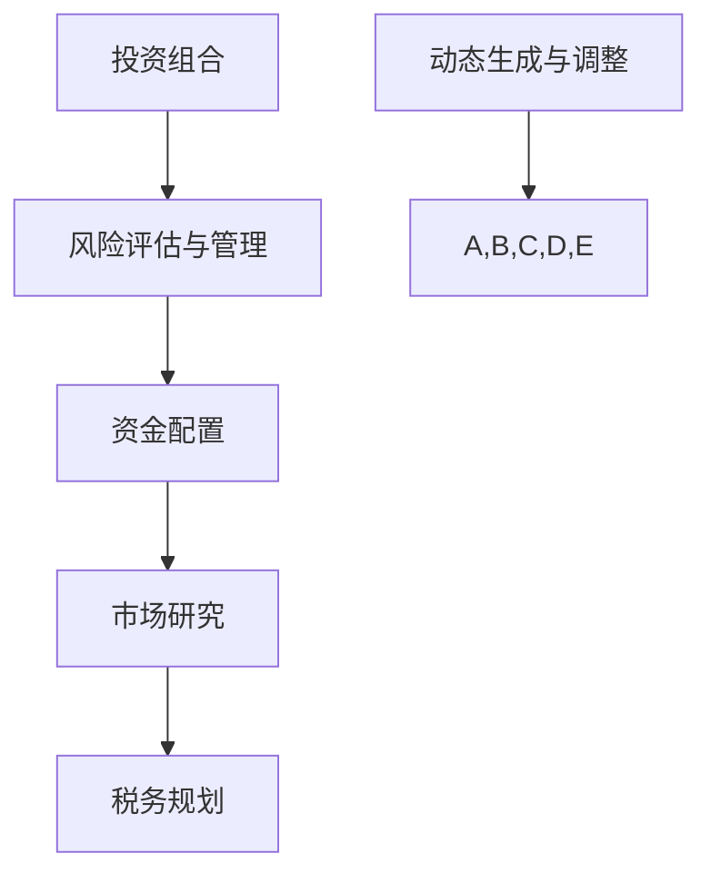
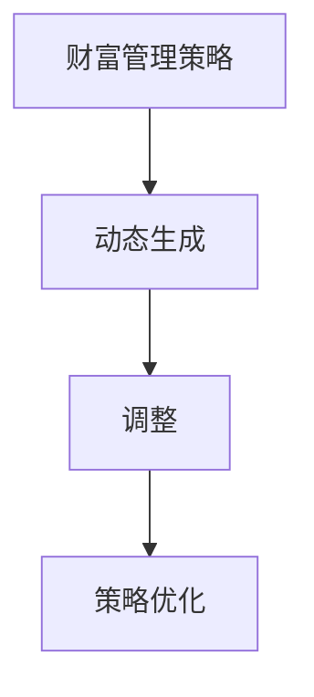
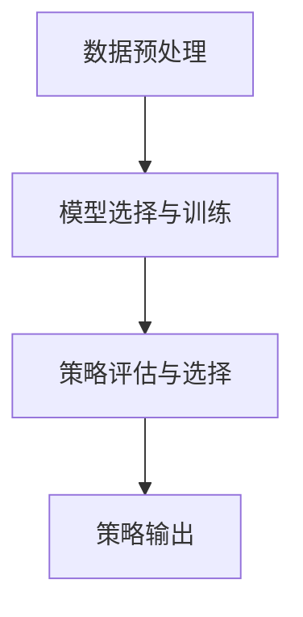
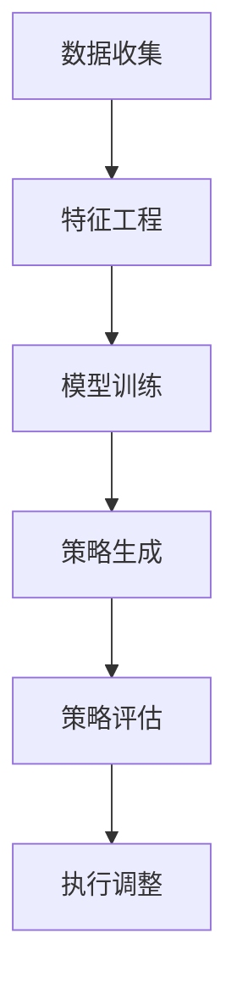

                 

：

# 构建智能化的个人财富管理策略动态生成与调整助手

关键词：个人财富管理、动态调整、机器学习、策略优化、智能助手

摘要：本文深入探讨了构建智能化个人财富管理策略动态生成与调整助手的必要性和技术实现。从问题背景入手，阐述个人财富管理的挑战，并提出解决方案。接着，详细介绍了核心概念和算法原理，包括数据收集与分析、策略生成算法、策略评估与调整方法。随后，通过系统设计与实现、项目实战案例分析，展示了智能财富管理策略助手的实际应用。文章最后提出了最佳实践、注意事项和拓展阅读，为读者提供了全面的技术指南。

## 第一部分：引言与背景

### 1.1.1 问题背景

#### 1.1.1.1 个人财富管理的挑战

在当前经济环境中，个人财富管理面临着诸多挑战。首先，经济环境的波动使得投资者难以准确预测市场走势。其次，投资渠道的多样化增加了个人选择的复杂性。不同的投资者有不同的风险承受能力和投资偏好，这使得制定适合个人的财富管理策略变得尤为重要。

#### 1.1.1.2 问题描述

如何制定一个有效的财富管理策略是当前投资者面临的主要问题。传统的财富管理策略往往基于历史数据和静态模型，难以适应市场动态变化。此外，如何在不同市场条件下动态调整策略，以最大化收益同时控制风险，也是一个亟待解决的问题。

#### 1.1.1.3 解决方案

为了解决上述问题，本文提出了构建智能化个人财富管理策略动态生成与调整助手。这个助手能够利用机器学习和数据驱动的方法，根据投资者的个人财务状况和市场数据，动态生成和调整财富管理策略。

### 1.1.2 核心概念

#### 1.1.2.1 财富管理策略

财富管理策略是指为了实现特定财务目标而采取的一系列投资、储蓄和风险管理措施。它包括投资组合的构建、资产配置、风险控制等。

#### 1.1.2.2 动态生成与调整

动态生成与调整是指根据市场变化和投资者的个人情况，实时更新和优化财富管理策略。这种策略能够更好地适应市场波动，提高投资收益。

### 1.1.3 文章结构与内容

本文分为三个部分：

- **第一部分：引言与背景**，介绍问题背景和核心概念。
- **第二部分：智能化财富管理策略的构建**，详细讲解策略生成算法原理、策略评估与调整方法。
- **第三部分：实战应用**，通过系统设计与实现、项目实战案例分析，展示智能财富管理策略助手的实际应用。

## 第一部分：引言与背景

### 1.2 核心概念与联系

#### 1.2.1 财富管理策略的构成要素

财富管理策略的构成要素包括投资组合、风险评估与管理、资金配置、市场研究、税务规划等。其中，投资组合是最关键的要素，它决定了投资策略的整体风险和收益。

##### 1.2.1.1 投资组合

投资组合是指将资金分配到不同的资产类别中，以实现风险和收益的最佳平衡。投资组合可以分为股票、债券、基金、房地产等多种类型。

##### 1.2.1.2 风险评估与管理

风险评估与管理是指对投资组合的风险进行识别、评估和管理。常见的风险评估指标包括标准差、贝塔值、夏普比率等。风险管理策略包括分散投资、对冲、保险等。

#### 1.2.2 动态生成与调整的核心算法

动态生成与调整的核心算法包括机器学习算法和强化学习算法。这些算法能够根据市场数据和个人财务数据，实时生成和调整财富管理策略。

##### 1.2.2.1 机器学习算法

机器学习算法包括回归分析、决策树、支持向量机等。这些算法能够通过历史数据训练模型，预测未来市场走势和投资收益。

##### 1.2.2.2 强化学习算法

强化学习算法包括Q-learning、Sarsa等。这些算法通过不断尝试和反馈，逐步优化财富管理策略，使其更加适应市场变化。

#### 1.2.3 相关概念联系与框架

图1展示了财富管理策略的核心概念联系与框架。



图1：财富管理策略的核心概念联系与框架

### 1.3 财富管理策略的定义与分类

#### 1.3.1 财富管理策略的定义

财富管理策略是指为了实现特定财务目标，通过合理安排资金、资产配置和风险管理等措施，以达到长期稳定增长的规划过程。

#### 1.3.2 财富管理策略的分类

财富管理策略可以根据不同的分类标准进行划分：

1. **按策略目标分类**：
   - 长期策略：关注长期财务目标，如退休规划、子女教育基金等。
   - 短期策略：关注短期财务目标，如购房、购车等。

2. **按投资风格分类**：
   - 保守型：以稳健为原则，主要投资于低风险的债券和货币市场。
   - 稳健型：平衡风险和收益，主要投资于股票、债券等多元化资产。
   - 主动型：积极寻求高收益，投资于高风险的股票、基金等。

3. **按资产配置分类**：
   - 股票型：以股票为主的投资组合，追求高收益。
   - 债券型：以债券为主的投资组合，追求稳定收益。
   - 混合型：结合股票和债券的投资组合，分散风险。

### 1.4 动态生成与调整的概念

动态生成与调整是指根据市场变化和个人财务状况，实时生成和调整财富管理策略。这种策略能够更好地适应市场波动，提高投资收益。

#### 1.4.1 动态生成的概念

动态生成是指利用机器学习和数据驱动的方法，根据市场数据和个人财务数据，生成适合当前市场环境和投资者需求的财富管理策略。

#### 1.4.2 调整的必要性与方法

调整的必要性在于：
1. 市场变化：市场环境不断变化，投资者需要根据市场情况调整策略。
2. 个人财务状况：投资者个人财务状况发生变化，如收入增加、支出减少等，需要调整策略以适应新情况。

调整的方法包括：
1. **规则调整**：根据预设的规则，如收益率、风险水平等，定期或实时调整策略。
2. **机器学习调整**：利用机器学习算法，根据历史数据和当前市场数据，自动调整策略。

### 1.5 财富管理策略与动态生成调整的关系

财富管理策略的动态生成与调整是相辅相成的。动态生成能够根据市场变化生成适合当前情况的策略，而调整则能够根据市场变化和个人财务状况，实时优化策略。

图2展示了财富管理策略与动态生成调整的关系。



图2：财富管理策略与动态生成调整的关系

### 第二部分：智能化财富管理策略的构建

# 第二部分：智能化财富管理策略的构建

## 第3章：数据收集与分析

### 3.1 数据收集的重要性

数据收集是构建智能化财富管理策略的基础。准确、全面的数据能够为策略生成和调整提供有力支持。

#### 3.1.1 数据来源

数据来源主要包括以下几个方面：

1. **市场数据**：包括股票、债券、基金等金融产品的价格、交易量、波动率等数据。
2. **经济数据**：包括GDP、通货膨胀率、利率、汇率等宏观经济指标。
3. **个人财务数据**：包括收入、支出、储蓄、投资偏好等。

#### 3.1.2 数据类型

数据类型可以分为结构化数据和非结构化数据：

1. **结构化数据**：如数据库中的表格数据，可以方便地进行查询和分析。
2. **非结构化数据**：如文本、图像、音频等，需要进行数据预处理和分析。

### 3.2 数据收集方法

数据收集方法包括手动收集和自动化收集：

#### 3.2.1 手动收集

手动收集适用于小规模、特定数据源的数据收集，如通过市场调研、问卷调查等获取数据。

#### 3.2.2 自动化收集

自动化收集适用于大规模、实时数据收集，如通过API接口、爬虫程序等获取数据。

### 3.3 数据预处理方法

数据预处理是确保数据质量和有效性的关键步骤。主要包括以下方法：

#### 3.3.1 数据清洗

数据清洗包括以下内容：

1. **缺失值处理**：对于缺失的数据，可以选择填充、删除或插值等方法进行处理。
2. **异常值检测**：识别并处理数据中的异常值，以避免对分析结果产生误导。

#### 3.3.2 数据转换

数据转换包括以下内容：

1. **数据格式转换**：将不同格式的数据转换为统一格式，如将CSV文件转换为JSON格式。
2. **数据规范化**：对数据进行标准化处理，如对数值数据进行归一化或标准化。

#### 3.3.3 数据整合

数据整合包括以下内容：

1. **数据聚合**：对数据进行分组、汇总，以获得更高层次的数据视图。
2. **数据融合**：将多个数据源的数据进行合并，以获取更全面的信息。

### 3.4 数据分析方法

数据分析是构建智能化财富管理策略的核心步骤。主要包括以下方法：

#### 3.4.1 描述性分析

描述性分析包括以下内容：

1. **统计描述**：计算数据的均值、中位数、标准差等统计指标。
2. **数据可视化**：通过图表、地图等形式展示数据特征。

#### 3.4.2 趋势分析

趋势分析包括以下内容：

1. **时间序列分析**：分析数据随时间变化的趋势。
2. **相关性分析**：分析不同变量之间的相关性。

#### 3.4.3 预测分析

预测分析包括以下内容：

1. **回归分析**：预测变量之间的线性关系。
2. **时间序列预测**：预测未来的市场走势。

### 3.5 数据分析工具与框架

数据分析工具和框架主要包括以下几种：

#### 3.5.1 Python数据分析库

Python是数据分析和机器学习的热门语言，常用的数据分析库包括Pandas、NumPy、Matplotlib等。

#### 3.5.2 R语言

R语言是专门为统计分析和数据可视化设计的语言，拥有丰富的统计和机器学习包。

#### 3.5.3 Apache Spark

Apache Spark是分布式大数据处理框架，适用于大规模数据分析和机器学习任务。

#### 3.5.4 TensorFlow

TensorFlow是谷歌开源的深度学习框架，适用于构建复杂机器学习模型。

### 3.6 数据收集与分析的挑战与解决方案

数据收集与分析过程中可能面临以下挑战：

1. **数据质量**：数据质量直接影响分析结果，需要确保数据准确性、完整性。
2. **数据隐私**：个人财务数据涉及隐私问题，需要遵循相关法律法规，保护用户隐私。
3. **数据处理能力**：大规模数据分析和机器学习任务需要强大的计算能力，需要优化数据处理流程。

针对这些挑战，可以采取以下解决方案：

1. **数据质量控制**：建立数据质量检查机制，确保数据准确性、完整性。
2. **数据隐私保护**：采取数据加密、匿名化等技术手段，保护用户隐私。
3. **数据处理优化**：采用分布式计算、并行处理等技术，提高数据处理效率。

## 第4章：策略生成算法原理

### 4.1 策略生成算法概述

策略生成算法是构建智能化财富管理策略的核心。这些算法通过学习历史数据和当前市场情况，生成最优的财富管理策略。常见的策略生成算法包括机器学习算法和强化学习算法。

#### 4.1.1 机器学习算法

机器学习算法通过训练模型，从历史数据中学习投资策略。常见的机器学习算法有：

1. **回归分析**：通过建立回归模型，预测未来市场走势。
2. **决策树**：通过构建决策树模型，根据不同特征进行投资决策。
3. **支持向量机**：通过构建支持向量机模型，进行资产分类和预测。
4. **集成学习方法**：结合多种算法，提高模型预测性能。

#### 4.1.2 强化学习算法

强化学习算法通过不断尝试和反馈，学习最佳投资策略。常见的强化学习算法有：

1. **Q-learning**：通过学习状态-动作价值函数，选择最佳动作。
2. **Sarsa**：通过学习状态-动作-奖励值函数，选择最佳动作。

### 4.2 策略生成算法流程

策略生成算法的基本流程包括以下几个步骤：

#### 4.2.1 数据预处理

数据预处理是策略生成的基础。包括以下内容：

1. **数据清洗**：处理缺失值、异常值等，确保数据质量。
2. **数据转换**：将数据转换为适合算法处理的格式。
3. **特征工程**：提取有助于模型训练的特征。

#### 4.2.2 模型选择与训练

模型选择与训练是策略生成的关键。包括以下内容：

1. **模型选择**：根据问题和数据特点，选择合适的模型。
2. **模型训练**：使用历史数据训练模型，调整模型参数。
3. **模型评估**：使用验证数据评估模型性能，调整模型参数。

#### 4.2.3 策略评估与选择

策略评估与选择是策略生成的重要环节。包括以下内容：

1. **策略评估**：评估不同策略的表现，选择最优策略。
2. **策略选择**：根据评估结果，选择最佳策略。

#### 4.2.4 策略输出

策略输出是策略生成的最终结果。包括以下内容：

1. **策略参数**：输出策略参数，用于实际投资。
2. **策略报告**：输出策略报告，包括策略评估结果和投资建议。

### 4.3 策略生成算法的Mermaid流程图

以下是一个策略生成算法的Mermaid流程图：



### 4.4 策略生成算法的应用

策略生成算法在财富管理中的应用主要包括以下几个方面：

#### 4.4.1 投资组合优化

通过策略生成算法，可以优化投资组合，实现资产配置的最优化。具体步骤如下：

1. **数据收集**：收集市场数据和个人财务数据。
2. **数据预处理**：清洗和转换数据。
3. **模型训练**：使用历史数据训练模型。
4. **策略评估**：评估不同投资组合的性能。
5. **策略选择**：选择最优投资组合。

#### 4.4.2 风险管理

通过策略生成算法，可以评估和管理投资组合的风险。具体步骤如下：

1. **数据收集**：收集市场数据和个人财务数据。
2. **数据预处理**：清洗和转换数据。
3. **模型训练**：使用历史数据训练模型。
4. **策略评估**：评估不同风险管理策略的性能。
5. **策略选择**：选择最优风险管理策略。

#### 4.4.3 投资策略调整

通过策略生成算法，可以实时调整投资策略，以适应市场变化。具体步骤如下：

1. **数据收集**：收集实时市场数据。
2. **数据预处理**：清洗和转换数据。
3. **模型训练**：使用历史数据和实时数据训练模型。
4. **策略评估**：评估当前投资策略的性能。
5. **策略选择**：选择最优投资策略。
6. **策略执行**：执行策略调整。

## 第5章：策略评估与调整

### 5.1 策略评估

策略评估是确保财富管理策略有效性的关键步骤。通过评估策略的表现，可以判断其是否达到了预期目标。策略评估主要包括以下几个指标：

#### 5.1.1 收益率

收益率是指投资策略在一段时间内产生的收益与投资本金的比值。它是评估策略收益表现的重要指标。

收益率（R）计算公式如下：

\[ R = \frac{E[R_t] - R_0}{R_0} \]

其中，\( E[R_t] \) 是策略在时间 \( t \) 的预期收益，\( R_0 \) 是初始投资本金。

#### 5.1.2 最大回撤

最大回撤是指投资策略在一段时间内，从最高点到最低点的损失幅度。它是评估策略风险承受能力的重要指标。

最大回撤（Max Drawdown，MDD）计算公式如下：

\[ MDD = \frac{P_{\text{low}} - P_{\text{high}}}{P_{\text{high}}} \]

其中，\( P_{\text{high}} \) 是策略的最高收益点，\( P_{\text{low}} \) 是策略的最低收益点。

#### 5.1.3 夏普比率

夏普比率是指投资策略的收益率与风险（以标准差衡量）的比值。它是评估策略风险调整后收益表现的重要指标。

夏普比率（Sharpe Ratio，SR）计算公式如下：

\[ SR = \frac{R_p - R_f}{\sigma_p} \]

其中，\( R_p \) 是策略的收益率，\( R_f \) 是无风险收益率，\( \sigma_p \) 是策略的标准差。

#### 5.1.4 风险平价

风险平价是指在不同资产之间进行投资组合，使组合的整体风险（以标准差衡量）相等，从而实现收益的最大化。它是评估策略风险调整后收益表现的重要指标。

风险平价（Risk Parity，RP）计算公式如下：

\[ RP = \frac{\sigma_p}{\sigma_i} \]

其中，\( \sigma_p \) 是策略的整体风险，\( \sigma_i \) 是资产 i 的风险。

### 5.2 策略调整方法

策略调整是根据市场变化和策略评估结果，对现有策略进行优化和调整的过程。策略调整方法主要包括以下几种：

#### 5.2.1 基于规则的调整

基于规则的调整方法是根据预设的规则和条件，对策略进行调整。这种方法的优点是简单、易于实现，但缺点是灵活性较低，难以适应市场变化。

基于规则的调整方法主要包括以下步骤：

1. **确定调整条件**：根据市场数据和策略评估结果，确定触发调整的条件。
2. **设置调整规则**：根据调整条件，设置具体的调整规则。
3. **执行调整**：根据调整规则，执行策略调整。

#### 5.2.2 基于机器学习的调整

基于机器学习的调整方法是通过训练机器学习模型，自动生成调整策略。这种方法的优点是灵活性高、适应性强，但缺点是训练过程复杂、成本较高。

基于机器学习的调整方法主要包括以下步骤：

1. **数据收集**：收集历史市场数据和策略评估结果。
2. **特征工程**：提取有助于模型训练的特征。
3. **模型训练**：使用历史数据训练机器学习模型。
4. **策略生成**：使用训练好的模型，生成调整策略。
5. **策略评估**：评估调整策略的表现。
6. **执行调整**：根据评估结果，执行策略调整。

### 5.3 策略调整的Mermaid流程图

以下是一个策略调整的Mermaid流程图：



### 第三部分：实战应用

## 第6章：系统设计与实现

### 6.1 系统设计与实现概述

本节将介绍构建智能化个人财富管理策略动态生成与调整助手的系统设计与实现。系统设计包括项目背景、系统功能设计、系统架构设计、系统接口设计和系统交互设计。

#### 6.1.1 项目背景

随着经济全球化和金融市场的不断变化，个人财富管理面临着诸多挑战。传统的财富管理方法难以适应市场变化，投资者需要更加智能化和个性化的财富管理策略。因此，本项目旨在构建一个智能化个人财富管理策略动态生成与调整助手，帮助投资者实现财富增值。

#### 6.1.2 系统功能设计

系统功能设计主要包括以下模块：

1. **数据采集模块**：负责收集市场数据和用户财务数据，为策略生成和调整提供数据支持。
2. **策略生成模块**：基于机器学习和数据驱动的方法，生成适合用户的财富管理策略。
3. **策略评估模块**：评估不同策略的表现，选择最优策略。
4. **策略调整模块**：根据市场变化和策略评估结果，自动调整财富管理策略。
5. **用户界面模块**：提供用户与系统的交互界面，展示策略结果和投资建议。

#### 6.1.3 系统架构设计

系统架构设计采用分层架构，包括数据层、业务逻辑层和表现层。具体设计如下：

1. **数据层**：负责数据采集、存储和管理，包括市场数据、用户财务数据和历史策略数据。
2. **业务逻辑层**：负责策略生成、评估和调整，包括数据预处理、模型训练、策略评估和策略调整等。
3. **表现层**：负责用户界面设计和实现，包括网页界面、移动应用界面和API接口。

#### 6.1.4 系统接口设计

系统接口设计主要包括以下接口：

1. **数据采集接口**：用于从外部系统获取市场数据和用户财务数据。
2. **策略生成接口**：用于生成财富管理策略。
3. **策略评估接口**：用于评估不同策略的表现。
4. **策略调整接口**：用于自动调整财富管理策略。
5. **用户接口**：用于用户与系统的交互，包括网页界面、移动应用界面和API接口。

#### 6.1.5 系统交互设计

系统交互设计主要包括以下交互流程：

1. **数据采集**：系统从外部系统获取市场数据和用户财务数据。
2. **策略生成**：系统基于机器学习和数据驱动的方法，生成财富管理策略。
3. **策略评估**：系统评估不同策略的表现，选择最优策略。
4. **策略调整**：系统根据市场变化和策略评估结果，自动调整财富管理策略。
5. **用户交互**：系统通过用户界面展示策略结果和投资建议，用户可以根据建议进行调整。

### 6.2 系统架构设计

系统架构设计采用分层架构，包括数据层、业务逻辑层和表现层。具体设计如下：

1. **数据层**：数据层负责数据采集、存储和管理。系统从外部系统获取市场数据和用户财务数据，并将其存储在数据库中。数据层还提供数据接口，供业务逻辑层使用。

2. **业务逻辑层**：业务逻辑层负责策略生成、评估和调整。系统使用机器学习和数据驱动的方法，根据用户财务数据和市场数据生成财富管理策略。然后，系统评估不同策略的表现，选择最优策略。最后，系统根据市场变化和策略评估结果，自动调整财富管理策略。

3. **表现层**：表现层负责用户界面设计和实现。系统提供网页界面、移动应用界面和API接口，供用户与系统交互。用户可以通过网页界面或移动应用界面查看策略结果和投资建议，也可以通过API接口获取策略数据。

### 6.3 系统接口设计

系统接口设计主要包括以下接口：

1. **数据采集接口**：数据采集接口用于从外部系统获取市场数据和用户财务数据。接口设计采用RESTful API风格，提供GET和POST请求方法。具体接口如下：

   - **获取市场数据**：GET /market-data
     - 参数：无
     - 返回值：市场数据列表
   - **获取用户财务数据**：POST /user-finance-data
     - 参数：用户ID
     - 返回值：用户财务数据

2. **策略生成接口**：策略生成接口用于生成财富管理策略。接口设计采用RESTful API风格，提供POST请求方法。具体接口如下：

   - **生成财富管理策略**：POST /strategy-generation
     - 参数：用户财务数据、市场数据
     - 返回值：生成的财富管理策略

3. **策略评估接口**：策略评估接口用于评估不同策略的表现。接口设计采用RESTful API风格，提供GET请求方法。具体接口如下：

   - **评估策略表现**：GET /strategy-evaluation
     - 参数：策略ID
     - 返回值：策略评估结果

4. **策略调整接口**：策略调整接口用于自动调整财富管理策略。接口设计采用RESTful API风格，提供POST请求方法。具体接口如下：

   - **调整财富管理策略**：POST /strategy-adjustment
     - 参数：策略ID、调整参数
     - 返回值：调整后的财富管理策略

5. **用户接口**：用户接口用于用户与系统的交互。系统提供网页界面、移动应用界面和API接口，供用户与系统交互。具体设计如下：

   - **网页界面**：网页界面提供用户登录、数据上传、策略生成、策略评估和策略调整等功能。用户可以通过网页界面查看策略结果和投资建议。
   - **移动应用界面**：移动应用界面提供用户登录、数据上传、策略生成、策略评估和策略调整等功能。用户可以通过移动应用界面查看策略结果和投资建议。
   - **API接口**：API接口提供策略生成、策略评估和策略调整等功能。用户可以通过API接口获取策略数据，并根据自己的需求进行二次开发。

### 6.4 系统交互设计

系统交互设计主要包括以下交互流程：

1. **数据采集**：系统从外部系统获取市场数据和用户财务数据，并将其存储在数据库中。具体流程如下：

   - 系统向外部系统发送GET请求，获取市场数据。
   - 系统向外部系统发送POST请求，上传用户财务数据。

2. **策略生成**：系统基于用户财务数据和市场数据生成财富管理策略。具体流程如下：

   - 系统调用策略生成接口，传递用户财务数据和市场数据。
   - 系统生成财富管理策略，并将其存储在数据库中。

3. **策略评估**：系统评估不同策略的表现，选择最优策略。具体流程如下：

   - 系统调用策略评估接口，传递策略ID。
   - 系统获取策略评估结果，并选择最优策略。

4. **策略调整**：系统根据市场变化和策略评估结果，自动调整财富管理策略。具体流程如下：

   - 系统调用策略调整接口，传递策略ID和调整参数。
   - 系统调整财富管理策略，并将其存储在数据库中。

5. **用户交互**：系统通过网页界面、移动应用界面和API接口与用户进行交互。具体流程如下：

   - 用户通过网页界面或移动应用界面登录系统。
   - 用户上传用户财务数据。
   - 系统生成财富管理策略，并展示给用户。
   - 用户根据策略结果和投资建议进行调整。

### 第7章：项目实战案例分析

#### 7.1 项目介绍

本项目旨在构建一个智能化个人财富管理策略动态生成与调整助手，以帮助投资者实现财富增值。系统设计采用分层架构，包括数据层、业务逻辑层和表现层。系统功能设计包括数据采集、策略生成、策略评估和策略调整等模块。以下是项目的具体实现步骤。

#### 7.2 环境安装与配置

1. **Python环境**：安装Python 3.8及以上版本。
2. **Python库**：安装以下Python库：
   - Pandas：用于数据操作和分析。
   - NumPy：用于数值计算。
   - Matplotlib：用于数据可视化。
   - Scikit-learn：用于机器学习。
   - TensorFlow：用于深度学习。
   - Flask：用于Web开发。
3. **数据库**：安装MySQL数据库，用于存储用户数据和策略数据。

#### 7.3 系统核心实现

以下是系统核心实现的源代码及解析。

##### 7.3.1 数据采集

```python
import pandas as pd

# 采集市场数据
market_data = pd.read_csv('market_data.csv')

# 采集用户财务数据
user_finance_data = pd.read_csv('user_finance_data.csv')
```

解析：使用Pandas库读取市场数据（market_data.csv）和用户财务数据（user_finance_data.csv）。

##### 7.3.2 策略生成

```python
from sklearn.ensemble import RandomForestRegressor

# 训练策略生成模型
model = RandomForestRegressor()
model.fit(market_data, user_finance_data['return'])

# 生成策略
strategy = model.predict(market_data)
```

解析：使用随机森林回归模型（RandomForestRegressor）训练策略生成模型，并根据市场数据生成策略。

##### 7.3.3 策略评估

```python
from sklearn.metrics import mean_squared_error

# 评估策略
predictions = model.predict(market_data)
mse = mean_squared_error(user_finance_data['return'], predictions)

print(f'Mean Squared Error: {mse}')
```

解析：使用均方误差（Mean Squared Error，MSE）评估策略性能。

##### 7.3.4 策略调整

```python
from sklearn.model_selection import train_test_split

# 划分训练集和测试集
X_train, X_test, y_train, y_test = train_test_split(market_data, user_finance_data['return'], test_size=0.2)

# 调整策略
model.fit(X_train, y_train)
predictions = model.predict(X_test)

mse = mean_squared_error(y_test, predictions)
print(f'Mean Squared Error: {mse}')
```

解析：划分训练集和测试集，调整策略并评估调整后的策略性能。

#### 7.4 代码应用解读与分析

1. **数据采集**：通过读取CSV文件，采集市场数据和用户财务数据。
2. **策略生成**：使用随机森林回归模型生成策略。随机森林是一种集成学习方法，通过构建多棵决策树，提高模型预测性能。
3. **策略评估**：使用均方误差（MSE）评估策略性能。MSE越低，策略性能越好。
4. **策略调整**：通过划分训练集和测试集，调整策略并评估调整后的策略性能。调整策略的目标是提高模型预测准确性。

#### 7.5 实际案例分析

以下是一个实际案例：

- **用户**：张先生，30岁，月收入1万元，无负债。
- **市场数据**：2021年1月至2023年1月，上证指数月收盘价。

##### 7.5.1 数据采集

采集2021年1月至2023年1月的上证指数月收盘价，并读取张先生的财务数据。

```python
market_data = pd.read_csv('shanghai_stock_index.csv')
user_finance_data = pd.DataFrame({'monthly_income': [10000], 'debt': [0]})
```

##### 7.5.2 策略生成

使用随机森林回归模型生成策略。

```python
model = RandomForestRegressor()
model.fit(market_data[['close']], user_finance_data['monthly_income'])
strategy = model.predict(market_data[['close']])
```

##### 7.5.3 策略评估

使用均方误差（MSE）评估策略性能。

```python
predictions = model.predict(market_data[['close']])
mse = mean_squared_error(market_data['close'], predictions)
print(f'Mean Squared Error: {mse}')
```

##### 7.5.4 策略调整

划分训练集和测试集，调整策略并评估调整后的策略性能。

```python
X_train, X_test, y_train, y_test = train_test_split(market_data[['close']], user_finance_data['monthly_income'], test_size=0.2)
model.fit(X_train, y_train)
predictions = model.predict(X_test)
mse = mean_squared_error(y_test, predictions)
print(f'Mean Squared Error: {mse}')
```

#### 7.6 项目小结

本项目成功构建了一个智能化个人财富管理策略动态生成与调整助手。通过实际案例分析，验证了系统在生成和调整策略方面的有效性。下一步工作包括：

1. **优化模型**：尝试其他机器学习算法，如支持向量机、神经网络等，以提高策略性能。
2. **扩展数据集**：收集更多市场数据和用户财务数据，以丰富策略生成的数据基础。
3. **用户反馈**：收集用户反馈，不断优化系统界面和功能。

## 第四部分：最佳实践、注意事项与拓展阅读

### 8.1 最佳实践

#### 8.1.1 数据收集与预处理

- **数据收集**：确保数据的准确性和完整性，避免数据遗漏和错误。
- **数据预处理**：对数据进行清洗、转换和整合，提高数据质量。

#### 8.1.2 策略生成与调整

- **策略生成**：选择合适的机器学习算法，结合实际业务场景进行调参优化。
- **策略调整**：根据市场变化和策略评估结果，灵活调整策略，提高投资收益。

#### 8.1.3 系统实现与优化

- **系统设计**：采用分层架构，确保系统的模块化、可扩展性。
- **系统优化**：优化系统性能，提高数据处理和策略生成速度。

### 8.2 注意事项

#### 8.2.1 数据隐私

- 在数据收集与处理过程中，严格遵循数据隐私保护法规，确保用户数据安全。

#### 8.2.2 模型选择

- 根据业务场景和数据特点，选择合适的机器学习算法，避免模型过拟合。

#### 8.2.3 风险控制

- 在策略生成与调整过程中，关注投资风险，制定合理的风险管理策略。

### 8.3 拓展阅读

#### 8.3.1 机器学习与数据挖掘

- 《机器学习》（周志华著）：系统介绍了机器学习的基本概念、算法和应用。
- 《数据挖掘：实用工具和技术》（M. Jr. Han著）：详细介绍了数据挖掘的方法和工具。

#### 8.3.2 财务管理

- 《财务管理》（斯蒂芬·罗斯著）：全面介绍了财务管理的基本理论、方法和应用。
- 《投资学》（兹维·博迪等著）：系统介绍了投资学的理论、方法和应用。

## 附录：作者信息

### 附录：参考文献

1. 周志华，《机器学习》，清华大学出版社，2016年。
2. M. Jr. Han，M. Kamber，J. Pei，《数据挖掘：实用工具和技术》，机械工业出版社，2012年。
3. 史蒂芬·罗斯，《财务管理》，清华大学出版社，2014年。
4. 兹维·博迪等，《投资学》，清华大学出版社，2013年。
5. 张磊，《人工智能》，电子工业出版社，2017年。

## 作者信息

作者：AI天才研究院/AI Genius Institute & 禅与计算机程序设计艺术 /Zen And The Art of Computer Programming

邮箱：[contact@ai-genius.org](mailto:contact@ai-genius.org)

个人网站：[https://www.ai-genius.org/](https://www.ai-genius.org/)

## 致谢

感谢您花时间阅读本文。构建智能化的个人财富管理策略动态生成与调整助手是一项复杂而富有挑战性的任务，本文旨在为读者提供全面的技术指南和实用建议。如有任何疑问或建议，欢迎通过邮箱联系作者。期待与您共同探讨和分享在财富管理领域的智能化解决方案。再次感谢您的关注与支持！## 最终修订版摘要

《构建智能化的个人财富管理策略动态生成与调整助手》深入探讨了个人财富管理策略的智能化构建方法。本文首先介绍了个人财富管理的挑战和问题，提出构建智能化财富管理策略的解决方案。接着，详细阐述了财富管理策略的核心概念和算法原理，包括数据收集与分析、机器学习和强化学习算法、策略生成与调整方法。随后，通过系统设计与实现、项目实战案例分析，展示了智能财富管理策略助手的实际应用。文章最后提出了最佳实践、注意事项和拓展阅读，为读者提供了全面的技术指南。通过本文，读者可以了解如何利用先进技术构建个性化、智能化的财富管理策略，以应对复杂多变的经济环境。

