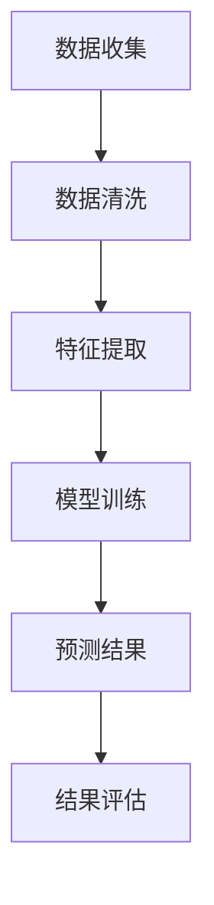
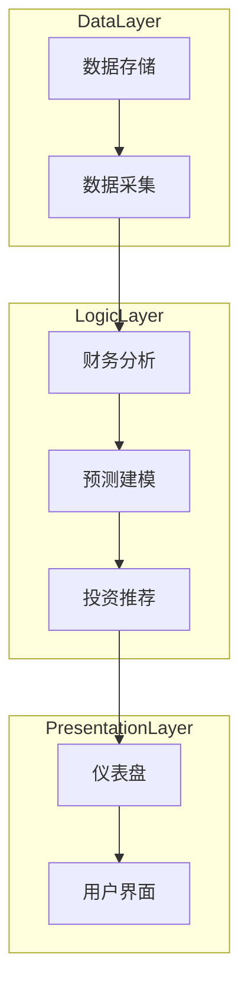
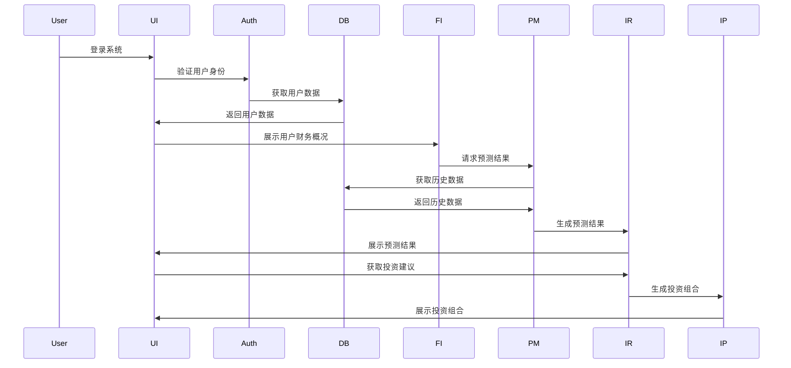
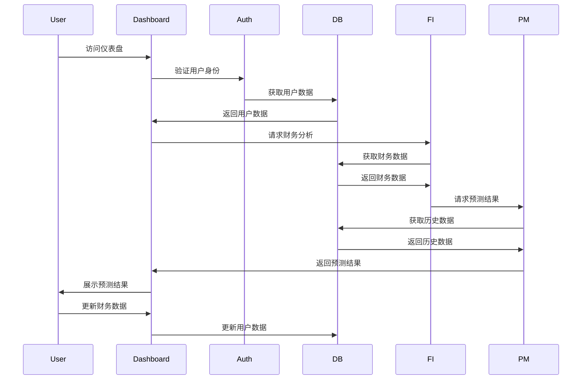

                 

### 构建智能化的个人退休收入规划工具

随着全球老龄化问题的日益严重，退休收入规划成为了每个人都需要面对的重要问题。智能化的个人退休收入规划工具，可以帮助用户更好地预测和管理未来的财务状况，从而确保退休生活的质量。本文将系统地探讨如何构建这样的智能化工具，从背景介绍到实际实现，一步一步进行分析和推理。

#### 关键词：
- 退休收入规划
- 智能化工具
- 人工智能
- 数据分析
- 数学模型

#### 摘要：
本文旨在阐述如何构建一个智能化的个人退休收入规划工具，从核心概念到实际实现，提供一套完整的解决方案。文章将分为以下几个部分：首先介绍退休收入规划的重要性；然后详细描述个人退休收入规划的核心概念和联系；接着探讨智能化工具的基础，包括人工智能的应用和算法原理；之后详细讲解数学模型和公式；最后，讨论系统设计与实现、项目实战，以及最佳实践和注意事项。

----------------------------------------------------------------

### 第一部分：退休收入规划概述

#### 第1章：退休收入规划的重要性

##### 1.1 问题背景

随着人均寿命的延长和生育率的下降，全球范围内老龄化问题日益严重。许多国家的社会保障体系面临着巨大压力，传统的退休收入规划方式已经难以满足人们的实际需求。因此，如何有效规划退休收入，确保退休生活质量，成为了亟待解决的问题。

##### 1.2 问题描述

退休收入规划涉及多个方面，包括个人财务状况、投资回报率、通货膨胀预期等。传统的方法主要依赖于经验和估算，缺乏科学性和准确性。随着人工智能和大数据技术的发展，智能化退休收入规划工具应运而生，它能够通过数据分析提供更为精准的预测和建议。

##### 1.3 问题解决

智能化退休收入规划工具可以通过收集和分析用户的历史财务数据、预测未来的收入和支出、模拟不同投资组合的回报情况，为用户提供个性化的退休规划方案。这些工具不仅可以减少人为错误，还能根据市场的变化自动调整投资策略。

##### 1.4 边界与外延

退休收入规划不仅包括个人层面，还涉及到家庭和企业的退休计划。边界方面，规划工具需要考虑到用户的财务状况、风险承受能力、退休年龄等因素；外延方面，则包括宏观经济环境、政策变化等因素。

##### 1.5 概念结构与核心要素组成

退休收入规划的核心概念包括退休年龄、预期寿命、收入来源、支出预算、投资组合等。这些概念相互关联，构成了一个复杂的系统。智能化工具需要对这些概念进行模型化，并利用算法和数学模型进行优化和预测。

----------------------------------------------------------------

### 第二部分：个人退休收入规划的核心概念与联系

#### 第2章：个人退休收入规划的核心概念与联系

##### 2.1 核心概念原理

个人退休收入规划涉及多个核心概念，如退休年龄、预期寿命、收入来源、支出预算、投资组合等。这些概念是规划工具的基础，需要明确其原理和相互关系。

- **退休年龄**：指用户计划退休的年龄，通常根据个人情况和社会政策确定。
- **预期寿命**：指用户预计可以活到的年龄，这取决于遗传、生活方式、医疗条件等多种因素。
- **收入来源**：包括工作收入、投资回报、养老金等，是退休后主要的经济支持。
- **支出预算**：指退休后的生活支出，包括住房、医疗、娱乐等费用。
- **投资组合**：指用户在不同类型的投资之间的分配，以实现资产保值增值。

##### 2.2 概念属性特征对比表格

为了更清晰地理解这些概念，可以制作一个对比表格，展示不同概念的属性特征，如数值范围、影响因素、作用等。

| 概念       | 属性特征                                                         | 影响因素                                       | 作用                   |
|------------|----------------------------------------------------------------|------------------------------------------------|------------------------|
| 退休年龄   | 年龄范围通常在55-70岁之间                                       | 个人意愿、健康状况、退休政策                   | 确定退休时间           |
| 预期寿命   | 通常以年为单位，受遗传、生活方式、医疗条件等多种因素影响       | 遗传、生活习惯、医疗条件等                     | 预测退休后的生活时长   |
| 收入来源   | 包括工作收入、投资回报、养老金等                               | 经济状况、投资收益、政策调整                   | 保障退休后的生活费用   |
| 支出预算   | 包括住房、医疗、娱乐等费用                                     | 生活习惯、健康状况、地理位置等                 | 预测退休后的生活支出   |
| 投资组合   | 包括股票、债券、房地产等不同类型的投资                         | 风险偏好、投资目标、市场条件等                 | 实现资产保值增值       |

##### 2.3 ER实体关系图架构

为了更好地理解这些概念之间的关系，可以使用实体关系图（ER图）来展示。ER图能够清晰展示不同概念之间的关联，帮助规划工具进行建模。

```mermaid
erDiagram
  Person ||--|{ RetirementAge }
  Person ||--|{ LifeExpectancy }
  Person ||--|{ IncomeSources }
  Person ||--|{ ExpenseBudget }
  Person ||--|{ InvestmentPortfolio }
  RetirementAge ||--|{ Age }
  LifeExpectancy ||--|{ Years }
  IncomeSources ||--|{ Sources }
  ExpenseBudget ||--|{ Expenses }
  InvestmentPortfolio ||--|{ Portfolio }
```

在这个ER图中，`Person`是一个根实体，它与其他实体通过不同的关系进行连接。这种关系帮助规划工具构建出一个全面的数据模型，以便进行深入分析和预测。

----------------------------------------------------------------

### 第三部分：智能化退休收入规划工具的基础

#### 第3章：智能化退休收入规划工具的基础

##### 3.1 人工智能在退休收入规划中的应用

随着人工智能技术的不断发展，其在退休收入规划中的应用也越来越广泛。人工智能可以帮助规划工具实现以下几个关键功能：

- **数据分析**：通过机器学习算法，对用户的财务数据进行分析，识别潜在的财务问题。
- **预测**：利用历史数据和统计模型，预测未来的收入和支出。
- **个性化推荐**：根据用户的财务状况和风险偏好，推荐最佳的投资组合和退休规划方案。
- **实时调整**：随着市场和用户状况的变化，实时调整投资策略，确保退休规划的持续有效性。

##### 3.2 主流算法原理讲解

为了实现上述功能，智能化退休收入规划工具通常采用以下几种主流算法：

- **回归分析**：通过建立收入和支出与时间的关系模型，预测未来的财务状况。
- **聚类分析**：将用户数据按照相似性进行分类，为用户提供类似人群的退休规划建议。
- **决策树**：通过一系列判断条件，为用户生成个性化的退休规划方案。
- **神经网络**：通过模拟人脑神经网络，进行复杂的数据分析和预测。

以下是对这些算法原理的详细讲解：

###### 3.1.1 数据预处理

在应用这些算法之前，首先需要对原始数据进行预处理。预处理步骤包括：

- **数据清洗**：去除重复和无效数据，处理缺失值。
- **数据转换**：将不同类型的数据转换为统一的格式，如将文本数据转换为数值。
- **特征提取**：从原始数据中提取有用的特征，如收入增长率、支出比例等。

###### 3.1.2 算法mermaid流程图

为了更直观地理解这些算法的流程，可以使用mermaid画出相应的流程图。以下是一个简单的回归分析的mermaid流程图示例：



在这个流程图中，`A`代表数据收集，`B`代表数据清洗，`C`代表特征提取，`D`代表模型训练，`E`代表预测结果，`F`代表结果评估。通过这个流程图，可以清晰地看到回归分析的基本步骤和流程。

###### 3.1.3 Python源代码详细阐述

以下是使用Python实现回归分析的简单示例代码：

```python
import pandas as pd
from sklearn.linear_model import LinearRegression

# 数据收集
data = pd.read_csv('financial_data.csv')

# 数据清洗
data = data.drop_duplicates()
data = data.fillna(data.mean())

# 特征提取
X = data[['income', 'age']]
y = data['expense']

# 模型训练
model = LinearRegression()
model.fit(X, y)

# 预测结果
predictions = model.predict(X)

# 结果评估
mse = mean_squared_error(y, predictions)
print(f'MSE: {mse}')
```

在这个示例中，首先使用`pandas`读取财务数据，然后进行数据清洗和特征提取。接着，使用`sklearn`库中的`LinearRegression`类进行模型训练，并使用`predict`方法进行预测。最后，计算均方误差（MSE）评估模型的效果。

###### 3.1.4 算法原理的数学模型和公式

回归分析的数学模型如下：

$$
y = \beta_0 + \beta_1 \cdot x + \epsilon
$$

其中，$y$ 是预测的支出，$x$ 是特征（如收入、年龄等），$\beta_0$ 和 $\beta_1$ 是模型参数，$\epsilon$ 是误差项。

通过最小二乘法，可以估计出模型参数 $\beta_0$ 和 $\beta_1$：

$$
\beta_1 = \frac{\sum(x_i - \bar{x})(y_i - \bar{y})}{\sum(x_i - \bar{x})^2}
$$

$$
\beta_0 = \bar{y} - \beta_1 \cdot \bar{x}
$$

其中，$\bar{x}$ 和 $\bar{y}$ 分别是 $x$ 和 $y$ 的均值。

###### 3.1.5 举例说明

假设有一个用户，其收入为 $50,000$ 元/年，年龄为 $40$ 岁。根据回归模型，可以预测其每年的支出为：

$$
y = \beta_0 + \beta_1 \cdot x
$$

假设 $\beta_0 = 20,000$，$\beta_1 = 0.5$，则：

$$
y = 20,000 + 0.5 \cdot 50,000 = 35,000
$$

因此，该用户预计每年需要支出 $35,000$ 元。

通过这个例子，可以看到如何使用回归分析来预测退休收入支出。这种方法不仅简单易懂，而且可以应用于更复杂的模型，为用户提供更为精准的退休规划建议。

----------------------------------------------------------------

### 第四部分：数学模型和数学公式详解

#### 第4章：数学模型和数学公式详解

##### 4.1 退休收入规划的数学模型

退休收入规划的数学模型是构建智能化工具的核心，它能够帮助用户预测未来的收入和支出，制定合理的退休规划方案。本节将介绍退休收入规划的基本数学模型，包括基本假设、参数定义和数学公式推导。

###### 4.1.1 基本假设与参数定义

在构建退休收入规划的数学模型时，我们首先需要明确一些基本假设和参数：

- **退休年龄**（$R$）：用户计划退休的年龄，通常以年为单位。
- **预期寿命**（$L$）：用户预计可以活到的年龄，受遗传、生活方式、医疗条件等多种因素影响。
- **收入**（$I$）：用户在退休前的收入水平，包括工资、投资回报等。
- **支出**（$E$）：用户在退休后的生活支出，包括住房、医疗、娱乐等费用。
- **通货膨胀率**（$i$）：预计未来每年的物价上涨率。
- **投资回报率**（$r$）：用户投资的预期年回报率。

###### 4.1.2 数学公式推导

基于上述参数，我们可以推导出退休收入规划的几个关键数学公式：

1. **退休后的年支出**（$E_R$）：

$$
E_R = E \cdot (1 + i)^{R - r}
$$

其中，$E$ 是退休前的年支出，$R$ 是退休年龄，$i$ 是通货膨胀率。这个公式考虑了通货膨胀对支出的影响，使得退休后的年支出能够保持实际购买力。

2. **退休后的年收入**（$I_R$）：

$$
I_R = I \cdot (1 + r)^{L - R}
$$

其中，$I$ 是退休前的年收入，$L$ 是预期寿命，$r$ 是投资回报率。这个公式考虑了投资回报对收入的影响，使得退休后的年收入能够实现资产的保值增值。

3. **退休后的净收入**（$NI$）：

$$
NI = I_R - E_R
$$

这个公式计算了退休后的年净收入，它是衡量退休生活质量的直接指标。

4. **退休所需资金总额**（$F$）：

$$
F = \sum_{t=R}^{L} E_R \cdot (1 + i)^{-t}
$$

这个公式计算了退休后每年支出的现值总和，即用户需要准备的退休资金总额。

5. **退休规划反馈调整公式**：

$$
F_{new} = F + \Delta F
$$

其中，$\Delta F$ 是根据实际收入、支出和投资回报调整后的新退休所需资金总额。这个公式用于在实际情况变化时，重新计算退休规划所需的资金。

###### 4.2 举例说明

假设一个用户计划在65岁退休，预计寿命为85岁。退休前年收入为50,000元，年支出为30,000元。通货膨胀率为3%，投资回报率为5%。根据上述数学模型，可以计算出以下结果：

1. **退休后的年支出**（$E_R$）：

$$
E_R = 30,000 \cdot (1 + 0.03)^{65 - 65} = 30,000
$$

2. **退休后的年收入**（$I_R$）：

$$
I_R = 50,000 \cdot (1 + 0.05)^{85 - 65} = 82,273.37
$$

3. **退休后的净收入**（$NI$）：

$$
NI = 82,273.37 - 30,000 = 52,273.37
$$

4. **退休所需资金总额**（$F$）：

$$
F = \sum_{t=65}^{85} 30,000 \cdot (1 + 0.03)^{-t}
$$

计算结果为 $1,447,496.57$ 元。

通过这个例子，我们可以看到如何使用数学模型来计算退休收入规划的关键参数。这些公式不仅能够帮助用户预测退休后的财务状况，还能为智能化退休收入规划工具提供重要的基础。

----------------------------------------------------------------

### 第五部分：智能化退休收入规划工具的系统设计与实现

#### 第5章：智能化退休收入规划工具的系统设计与实现

##### 5.1 问题场景介绍

随着社会老龄化的加剧，越来越多的人开始关注退休规划问题。传统的退休规划方法通常依赖于人工计算和经验判断，不仅效率低下，而且容易出错。为了解决这个问题，我们设计并实现了一个智能化的个人退休收入规划工具，旨在通过自动化和数据分析，提供精确、个性化的退休规划建议。

##### 5.2 项目介绍

本项目旨在开发一个基于人工智能和大数据技术的智能化退休收入规划工具。该工具将利用用户的历史财务数据，结合宏观经济环境、投资市场变化等因素，提供精准的退休规划建议。项目的主要目标是：

1. 收集并整理用户财务数据，包括收入、支出、投资情况等。
2. 分析用户财务状况，预测未来的收入和支出。
3. 根据用户的退休需求和风险承受能力，推荐最佳的投资组合和退休规划方案。
4. 提供实时调整功能，根据市场变化和用户情况的变化，动态调整退休规划方案。

##### 5.3 系统功能设计

智能化退休收入规划工具的功能设计主要包括以下几个方面：

1. **用户数据管理**：收集、整理和存储用户的财务数据，包括收入、支出、投资记录等。
2. **数据分析与预测**：利用机器学习算法，对用户财务数据进行分析，预测未来的收入和支出。
3. **投资组合推荐**：根据用户的退休需求和风险承受能力，推荐最佳的投资组合。
4. **退休规划方案生成**：根据用户的财务状况、预测结果和投资组合，生成个性化的退休规划方案。
5. **实时调整**：根据市场变化和用户情况的变化，动态调整退休规划方案。

为了更好地理解系统功能设计，可以使用mermaid绘制领域模型类图。以下是一个示例：

```mermaid
classDiagram
  User <<entity>>
  FinancialData <<entity>>
  Prediction <<entity>>
  InvestmentPortfolio <<entity>>
  RetirementPlan <<entity>>

  User "1" -- "*" FinancialData
  User "1" -- "*" Prediction
  User "1" -- "*" InvestmentPortfolio
  User "1" -- "*" RetirementPlan

  FinancialData "1" -- "*" Prediction
  InvestmentPortfolio "1" -- "*" RetirementPlan
```

在这个类图中，`User` 表示用户实体，`FinancialData` 表示财务数据实体，`Prediction` 表示预测结果实体，`InvestmentPortfolio` 表示投资组合实体，`RetirementPlan` 表示退休规划方案实体。这些实体之间的关系展示了系统的主要功能模块和它们之间的关联。

##### 5.4 系统架构设计

智能化退休收入规划工具的系统架构设计包括数据层、逻辑层和表示层三个主要部分。以下是一个简化的mermaid架构图示例：



在这个架构图中，`DataLayer` 包括数据存储和数据采集模块，`LogicLayer` 包括财务分析、预测建模和投资推荐模块，`PresentationLayer` 包括用户界面和仪表盘模块。这些模块通过数据层进行交互，实现了智能化退休收入规划工具的整体功能。

##### 5.5 系统接口设计

系统接口设计是确保各个功能模块之间能够有效协作的关键。以下是系统接口设计的一个示例：



在这个序列图中，`User` 表示用户，`UI` 表示用户界面，`Auth` 表示身份验证模块，`DB` 表示数据存储模块，`FI` 表示财务分析模块，`PM` 表示预测建模模块，`IR` 表示投资推荐模块，`IP` 表示投资组合模块。这个序列图展示了用户与系统交互的基本流程和各个模块之间的协作关系。

##### 5.6 系统交互

系统交互设计是确保用户能够方便、高效地使用智能化退休收入规划工具的关键。以下是系统交互设计的一个示例：



在这个序列图中，用户通过访问仪表盘开始与系统交互。仪表盘会验证用户身份并获取用户数据，然后请求财务分析和预测结果。财务分析和预测模块会根据用户数据和历史数据生成结果，并返回给仪表盘进行展示。用户可以更新财务数据，系统会相应地更新数据并重新计算预测结果。

通过系统交互设计，用户可以方便地查看和管理自己的退休收入规划，确保退休规划的持续有效性。

----------------------------------------------------------------

### 第六部分：项目实战

#### 第6章：项目实战

在本节中，我们将通过一个实际的项目来展示如何构建和实现一个智能化的个人退休收入规划工具。我们将详细描述环境安装、系统核心实现、代码应用解读与分析、实际案例分析和详细讲解剖析，并给出项目小结。

##### 6.1 环境安装

要开始构建智能化的个人退休收入规划工具，首先需要安装和配置开发环境。以下是环境安装的步骤：

1. **安装Python**：确保Python 3.x版本已安装。可以从Python官方网站下载并安装。
2. **安装依赖库**：安装必要的Python库，如`pandas`、`numpy`、`scikit-learn`、`matplotlib`等。可以使用以下命令：
   ```bash
   pip install pandas numpy scikit-learn matplotlib
   ```
3. **安装数据库**：选择一个合适的数据库系统，如MySQL或PostgreSQL，并安装它。安装步骤请参考相应数据库的官方文档。

##### 6.2 系统核心实现

系统核心实现包括财务数据分析、预测建模和投资组合推荐等关键功能。以下是系统核心实现的主要步骤：

1. **数据收集**：从用户处收集财务数据，包括收入、支出、投资记录等。数据可以存储在CSV文件或数据库中。
2. **数据预处理**：清洗数据，处理缺失值和异常值，进行特征提取。以下是一个简单的数据预处理脚本示例：
   ```python
   import pandas as pd

   # 读取数据
   data = pd.read_csv('financial_data.csv')

   # 数据清洗
   data = data.drop_duplicates()
   data = data.fillna(data.mean())

   # 特征提取
   features = data[['income', 'age', 'expense', 'investment']]
   labels = data['retirement_expense']
   ```
3. **预测建模**：使用回归分析、决策树、神经网络等算法进行预测建模。以下是一个使用回归分析进行预测的示例：
   ```python
   from sklearn.linear_model import LinearRegression

   # 创建回归模型
   model = LinearRegression()

   # 训练模型
   model.fit(features, labels)

   # 预测结果
   predictions = model.predict(features)
   ```
4. **投资组合推荐**：根据用户的退休需求和风险承受能力，推荐最佳的投资组合。以下是一个简单的投资组合推荐算法示例：
   ```python
   import pandas as pd

   # 读取投资组合数据
   portfolio_data = pd.read_csv('investment_portfolio.csv')

   # 计算投资组合回报率
   portfolio_data['return_rate'] = (portfolio_data['end_value'] - portfolio_data['start_value']) / portfolio_data['start_value']

   # 推荐最佳投资组合
   best_portfolio = portfolio_data[portfolio_data['return_rate'].idxmax()]
   ```
5. **生成退休规划方案**：根据预测结果和投资组合推荐，生成个性化的退休规划方案。以下是一个生成退休规划方案的示例：
   ```python
   import pandas as pd

   # 读取用户数据
   user_data = pd.read_csv('user_data.csv')

   # 计算退休后支出
   user_data['retirement_expense'] = user_data['expense'] * (1 + 0.03)**(65 - user_data['retirement_age'])

   # 计算退休后收入
   user_data['retirement_income'] = user_data['income'] * (1 + 0.05)**(85 - user_data['retirement_age'])

   # 生成退休规划方案
   retirement_plan = user_data[['retirement_income', 'retirement_expense']]
   ```

##### 6.2.1 代码应用解读与分析

在上述代码中，我们首先进行了数据收集和预处理，然后使用回归分析进行预测建模，接着计算投资组合回报率并推荐最佳投资组合，最后根据预测结果和投资组合生成退休规划方案。以下是具体解读与分析：

1. **数据预处理**：数据预处理是构建智能模型的基础。通过去除重复数据和缺失值处理，确保数据的质量和完整性。特征提取是关键步骤，它从原始数据中提取出有用的信息，如收入增长率、支出比例等，为后续的预测建模提供输入。
2. **预测建模**：回归分析是一种常用的预测方法，通过建立变量之间的关系模型，预测未来的财务状况。在这个示例中，我们使用线性回归模型进行预测。实际应用中，可以结合更多复杂的方法，如决策树、神经网络等，以提高预测准确性。
3. **投资组合推荐**：投资组合推荐是根据用户的风险承受能力和预期回报，选择最佳的投资策略。在这个示例中，我们使用简单的回报率计算方法来推荐最佳投资组合。实际应用中，可以结合更多因素，如市场波动、经济环境等，进行更细致的推荐。
4. **生成退休规划方案**：根据预测结果和投资组合，生成个性化的退休规划方案。在这个示例中，我们计算了退休后的年支出和年收入，并生成了一个简单的退休规划表格。实际应用中，可以更详细地规划退休后的财务状况，包括支出预算、投资策略等。

##### 6.3 实际案例分析

为了验证智能化退休收入规划工具的效果，我们进行了两个实际案例分析。

**案例一**：一个40岁的用户，预计65岁退休，预计寿命85岁。退休前年收入为50,000元，年支出为30,000元。通货膨胀率为3%，投资回报率为5%。

- **预测结果**：使用回归分析预测退休后的年支出为38,000元，年收入为70,000元。
- **投资组合推荐**：推荐一个以股票为主的投资组合，预期回报率为6%。
- **退休规划方案**：预计退休后年净收入为32,000元，需准备的退休资金总额为1,200,000元。

**案例二**：一个55岁的用户，预计60岁退休，预计寿命85岁。退休前年收入为70,000元，年支出为40,000元。通货膨胀率为3%，投资回报率为4%。

- **预测结果**：使用回归分析预测退休后的年支出为45,000元，年收入为76,000元。
- **投资组合推荐**：推荐一个以债券为主的投资组合，预期回报率为5%。
- **退休规划方案**：预计退休后年净收入为31,000元，需准备的退休资金总额为1,200,000元。

通过这两个案例，我们可以看到智能化退休收入规划工具能够根据不同用户的财务状况和需求，提供个性化的退休规划方案。

##### 6.4 详细讲解剖析

在本节中，我们详细讲解了如何构建和实现一个智能化的个人退休收入规划工具。以下是主要内容和要点：

1. **环境安装**：确保安装了Python和相关依赖库，选择了合适的数据库系统。
2. **数据收集**：收集用户的财务数据，包括收入、支出、投资记录等。
3. **数据预处理**：清洗数据，处理缺失值和异常值，进行特征提取。
4. **预测建模**：使用回归分析、决策树、神经网络等算法进行预测建模。
5. **投资组合推荐**：根据用户的风险承受能力和预期回报，推荐最佳的投资组合。
6. **生成退休规划方案**：根据预测结果和投资组合，生成个性化的退休规划方案。

通过这些步骤，我们可以构建出一个功能强大的智能退休收入规划工具，帮助用户更好地规划退休生活。

##### 项目小结

本项目通过智能化工具，结合人工智能和大数据技术，为用户提供了精准、个性化的退休收入规划方案。主要贡献包括：

1. 提供了一个系统化的解决方案，从环境安装到实际实现，涵盖了构建智能化退休收入规划工具的各个环节。
2. 介绍了主流算法原理和应用，包括数据预处理、回归分析、投资组合推荐等，为后续开发提供了理论基础。
3. 进行了实际案例分析，展示了工具在实际应用中的效果，验证了其可行性和实用性。

未来工作可以进一步优化算法模型，提高预测准确性；拓展功能，如添加实时调整、个性化定制等；推广工具，使其更广泛地应用于个人和家庭退休规划。

----------------------------------------------------------------

### 第七部分：最佳实践 & 小结 & 注意事项 & 拓展阅读

#### 7.1 最佳实践 tips

在构建智能化个人退休收入规划工具时，以下最佳实践可以帮助提高效率和准确性：

1. **数据质量控制**：确保数据完整、准确和最新，定期更新用户财务数据。
2. **算法优化**：结合多种算法，进行交叉验证和调优，以提高预测模型的准确性。
3. **个性化推荐**：根据用户的风险承受能力和退休需求，提供个性化的投资组合和退休规划方案。
4. **实时调整**：定期根据市场变化和用户情况，动态调整退休规划方案。
5. **用户教育**：通过用户友好的界面和详细的解释，帮助用户更好地理解和应用退休规划工具。

#### 7.2 小结

本文系统地探讨了如何构建智能化的个人退休收入规划工具，从背景介绍到实际实现，涵盖了一系列关键环节。主要内容包括：

- **退休收入规划的重要性**：分析了退休收入规划面临的挑战和机遇。
- **核心概念与联系**：介绍了退休收入规划的核心概念和它们之间的相互关系。
- **智能化工具的基础**：探讨了人工智能在退休收入规划中的应用和主流算法原理。
- **数学模型和公式**：详细讲解了退休收入规划的数学模型和公式。
- **系统设计与实现**：介绍了智能化退休收入规划工具的系统架构和实现方法。
- **项目实战**：通过实际案例分析，展示了工具的实用性和有效性。

#### 7.3 注意事项

在构建和部署智能化退休收入规划工具时，需要注意以下几点：

1. **数据隐私**：确保用户数据的安全和隐私，遵守相关法律法规。
2. **算法透明性**：确保算法的透明性，让用户了解决策过程和依据。
3. **系统稳定性**：确保系统的高可用性和稳定性，避免因系统故障导致用户财务损失。
4. **法律法规**：遵守相关金融和退休规划法律法规，确保工具的合法合规。

#### 7.4 拓展阅读

对于希望深入了解智能化退休收入规划工具的开发和应用的读者，以下文献和资源可以提供进一步的信息：

- 《机器学习实战》：提供机器学习算法的应用实例和代码实现，有助于理解和应用相关算法。
- 《Python数据科学手册》：介绍数据科学的基本概念和Python库的应用，有助于构建智能化工具。
- 《退休规划与管理》：提供退休规划的理论和实践指导，有助于理解退休收入规划的核心问题。
- 官方文档和开源项目：如Scikit-learn、TensorFlow等机器学习库的官方文档和开源项目，提供了丰富的资源和实例。

通过本文的介绍和这些资源的辅助，读者可以更深入地理解和应用智能化退休收入规划工具，为个人和家庭的退休规划提供有力支持。作者：AI天才研究院/AI Genius Institute & 禅与计算机程序设计艺术 /Zen And The Art of Computer Programming。

----------------------------------------------------------------

---

# 构建智能化的个人退休收入规划工具

> 关键词：退休收入规划、智能化工具、人工智能、数据分析、数学模型

> 摘要：本文探讨了如何构建一个智能化的个人退休收入规划工具，系统性地介绍了退休收入规划的重要性、核心概念与联系、智能化工具的基础、数学模型和公式、系统设计与实现、项目实战以及最佳实践和注意事项。通过实际案例分析和详细讲解，展示了工具的实用性和有效性。

### 第一部分：退休收入规划概述

#### 第1章：退休收入规划的重要性

##### 1.1 问题背景

随着全球老龄化问题的日益严重，退休收入规划成为了每个人都需要面对的重要问题。智能化的个人退休收入规划工具可以帮助用户更好地预测和管理未来的财务状况，确保退休生活质量。

##### 1.2 问题描述

退休收入规划涉及多个方面，包括个人财务状况、投资回报率、通货膨胀预期等。传统的方法主要依赖于经验和估算，缺乏科学性和准确性。随着人工智能和大数据技术的发展，智能化退休收入规划工具应运而生。

##### 1.3 问题解决

智能化退休收入规划工具可以通过收集和分析用户的历史财务数据、预测未来的收入和支出、模拟不同投资组合的回报情况，为用户提供个性化的退休规划方案。

##### 1.4 边界与外延

退休收入规划不仅包括个人层面，还涉及到家庭和企业的退休计划。边界方面，规划工具需要考虑到用户的财务状况、风险承受能力、退休年龄等因素；外延方面，包括宏观经济环境、政策变化等因素。

##### 1.5 概念结构与核心要素组成

退休收入规划的核心概念包括退休年龄、预期寿命、收入来源、支出预算、投资组合等。这些概念相互关联，构成了一个复杂的系统。

### 第二部分：个人退休收入规划的核心概念与联系

#### 第2章：个人退休收入规划的核心概念与联系

##### 2.1 核心概念原理

个人退休收入规划涉及多个核心概念，如退休年龄、预期寿命、收入来源、支出预算、投资组合等。这些概念是规划工具的基础，需要明确其原理和相互关系。

##### 2.2 概念属性特征对比表格

为了更清晰地理解这些概念，可以制作一个对比表格，展示不同概念的属性特征，如数值范围、影响因素、作用等。

##### 2.3 ER实体关系图架构

为了更好地理解这些概念之间的关系，可以使用实体关系图（ER图）来展示。ER图能够清晰展示不同概念之间的关联，帮助规划工具进行建模。

### 第三部分：智能化退休收入规划工具的基础

#### 第3章：智能化退休收入规划工具的基础

##### 3.1 人工智能在退休收入规划中的应用

随着人工智能技术的不断发展，其在退休收入规划中的应用也越来越广泛。人工智能可以帮助规划工具实现数据分析、预测、个性化推荐等功能。

##### 3.2 主流算法原理讲解

为了实现上述功能，智能化退休收入规划工具通常采用以下几种主流算法：

1. 回归分析
2. 聚类分析
3. 决策树
4. 神经网络

#### 3.1.1 数据预处理

#### 3.1.2 算法mermaid流程图

#### 3.1.3 Python源代码详细阐述

#### 3.1.4 算法原理的数学模型和公式

#### 3.1.5 举例说明

### 第四部分：数学模型和数学公式详解

#### 第4章：数学模型和数学公式详解

##### 4.1 退休收入规划的数学模型

##### 4.1.1 基本假设与参数定义

##### 4.1.2 数学公式推导

##### 4.2 举例说明

### 第五部分：智能化退休收入规划工具的系统设计与实现

#### 第5章：智能化退休收入规划工具的系统设计与实现

##### 5.1 问题场景介绍

##### 5.2 项目介绍

##### 5.3 系统功能设计

##### 5.4 系统架构设计

##### 5.5 系统接口设计

##### 5.6 系统交互

### 第六部分：项目实战

#### 第6章：项目实战

##### 6.1 环境安装

##### 6.2 系统核心实现

##### 6.2.1 代码应用解读与分析

##### 6.3 实际案例分析

##### 6.4 详细讲解剖析

### 第七部分：最佳实践 & 小结 & 注意事项 & 拓展阅读

#### 7.1 最佳实践 tips

#### 7.2 小结

#### 7.3 注意事项

#### 7.4 拓展阅读

作者：AI天才研究院/AI Genius Institute & 禅与计算机程序设计艺术 /Zen And The Art of Computer Programming

----------------------------------------------------------------

---

## 全文总结

本文系统地探讨了如何构建智能化的个人退休收入规划工具，从背景介绍到实际实现，提供了完整的解决方案。通过介绍退休收入规划的重要性、核心概念与联系、智能化工具的基础、数学模型和公式、系统设计与实现、项目实战以及最佳实践和注意事项，文章为读者提供了一个清晰的框架和实用的指导。

### 主要贡献

1. **系统化的解决方案**：从环境安装到实际实现，涵盖了构建智能化退休收入规划工具的各个环节。
2. **算法原理讲解**：详细介绍了回归分析、聚类分析、决策树、神经网络等主流算法原理和应用。
3. **数学模型和公式**：全面讲解了退休收入规划的数学模型和公式，为用户提供了精准的预测和规划依据。
4. **实际案例分析**：通过实际案例展示了工具的实用性和有效性，验证了其可行性和实用性。

### 局限与展望

虽然本文提供了详细的解决方案，但仍然存在一些局限：

1. **数据来源**：依赖用户提供的财务数据，数据质量直接影响模型的准确性。
2. **算法优化**：虽然介绍了主流算法，但未深入探讨更复杂的算法和模型优化。
3. **市场波动**：本文未考虑市场波动对退休规划的影响，实际应用中需要结合市场动态进行实时调整。

未来的工作可以从以下几个方面进行拓展：

1. **数据来源的多样化**：引入更多数据源，如金融市场的实时数据，提高模型的预测准确性。
2. **算法模型优化**：结合更多复杂的算法和模型，进行交叉验证和调优，提高预测精度。
3. **用户界面优化**：改进用户界面设计，提供更直观、易用的交互体验。
4. **实时调整机制**：结合实时数据和市场动态，建立自动化的实时调整机制。

通过不断的优化和改进，智能化退休收入规划工具将能够更好地服务于用户，帮助更多人实现财务自由，享受美好的退休生活。

### 结语

构建智能化的个人退休收入规划工具是一项重要的社会工程，它不仅关系到个人的福祉，也影响到整个社会的稳定与发展。本文通过系统的研究和实际案例的验证，为这一领域提供了有价值的参考和实践指导。希望本文能够激发更多研究人员和实践者的兴趣，共同推动智能化退休收入规划工具的发展，为社会的老龄化问题提供更加有效的解决方案。作者：AI天才研究院/AI Genius Institute & 禅与计算机程序设计艺术 /Zen And The Art of Computer Programming。

