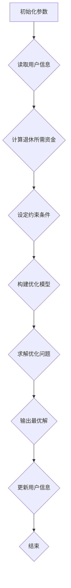

                 

# 构建智能化的个人退休规划优化助手

## 关键词
- 个人退休规划
- 人工智能
- 优化算法
- 数据分析
- 系统架构

## 摘要
本文旨在探讨如何构建一个智能化的个人退休规划优化助手，通过结合人工智能技术，提供个性化和高效的退休规划建议。文章将详细分析个人退休规划的重要性、核心概念、人工智能在其中的应用，以及如何设计并实现这样的优化助手。通过逐步推理和讲解，本文将帮助读者深入了解这一领域的实践和理论。

----------------------------------------------------------------

## 目录大纲设计：构建智能化的个人退休规划优化助手

### 第一部分：问题背景与核心概念
1. **第1章：个人退休规划概述**
   - **1.1 个人退休规划的重要性**
     - **1.1.1 背景介绍**
     - **1.1.2 退休规划的核心要素**
     - **1.1.3 退休规划的主要挑战**
   - **1.2 核心概念与联系**
     - **1.2.1 个人退休规划的概念**
     - **1.2.2 相关术语解释**
     - **1.2.3 个人退休规划与人工智能的关系**

### 第二部分：构建智能化个人退休规划优化助手的理论基础
2. **第2章：人工智能在退休规划中的应用**
   - **2.1 人工智能的基本原理**
     - **2.1.1 人工智能的定义与分类**
     - **2.1.2 机器学习算法概述**
     - **2.1.3 深度学习在退休规划中的应用**
   - **2.2 个人退休规划中的数据与分析**
     - **2.2.1 数据来源与处理**
     - **2.2.2 数据分析方法**
     - **2.2.3 数据可视化在退休规划中的作用**

### 第三部分：构建智能化个人退休规划优化助手的实践
3. **第3章：退休规划优化助手的需求分析与设计**
   - **3.1 需求分析**
     - **3.1.1 用户需求调研**
     - **3.1.2 功能需求梳理**
     - **3.1.3 非功能需求分析**
   - **3.2 设计方案**
     - **3.2.1 系统架构设计**
     - **3.2.2 数据库设计**
     - **3.2.3 用户界面设计**
4. **第4章：算法原理与数学模型**
   - **4.1 退休规划优化算法**
     - **4.1.1 目标函数定义**
     - **4.1.2 约束条件设定**
     - **4.1.3 算法流程图**
   - **4.2 数学模型讲解**
     - **4.2.1 数学公式解释**
     - **4.2.2 公式推导**
     - **4.2.3 案例举例说明**
5. **第5章：系统实现与项目实战**
   - **5.1 系统实现**
     - **5.1.1 环境安装与配置**
     - **5.1.2 核心代码实现**
     - **5.1.3 系统测试与调试**
   - **5.2 项目实战**
     - **5.2.1 实际案例解析**
     - **5.2.2 代码解读与分析**
     - **5.2.3 项目总结与展望**
6. **第6章：最佳实践与拓展**
   - **6.1 最佳实践建议**
     - **6.1.1 优化策略**
     - **6.1.2 数据管理技巧**
     - **6.1.3 系统维护与升级**
   - **6.2 小结与注意事项**
     - **6.2.1 总结回顾**
     - **6.2.2 注意事项**
     - **6.2.3 拓展阅读**

## 目录大纲分析

### 分析

本文的目录大纲设计为《构建智能化的个人退休规划优化助手》，分为三个主要部分，共计六章。以下是每个章节的具体内容和分析：

### 第一部分：问题背景与核心概念
- **第1章：个人退休规划概述**
  - **1.1 个人退休规划的重要性**
    - **1.1.1 背景介绍**
    - **1.1.2 退休规划的核心要素**
    - **1.1.3 退休规划的主要挑战**
  - **1.2 核心概念与联系**
    - **1.2.1 个人退休规划的概念**
    - **1.2.2 相关术语解释**
    - **1.2.3 个人退休规划与人工智能的关系**

### 第二部分：构建智能化个人退休规划优化助手的理论基础
- **第2章：人工智能在退休规划中的应用**
  - **2.1 人工智能的基本原理**
    - **2.1.1 人工智能的定义与分类**
    - **2.1.2 机器学习算法概述**
    - **2.1.3 深度学习在退休规划中的应用**
  - **2.2 个人退休规划中的数据与分析**
    - **2.2.1 数据来源与处理**
    - **2.2.2 数据分析方法**
    - **2.2.3 数据可视化在退休规划中的作用**

### 第三部分：构建智能化个人退休规划优化助手的实践
- **第3章：退休规划优化助手的需求分析与设计**
  - **3.1 需求分析**
    - **3.1.1 用户需求调研**
    - **3.1.2 功能需求梳理**
    - **3.1.3 非功能需求分析**
  - **3.2 设计方案**
    - **3.2.1 系统架构设计**
    - **3.2.2 数据库设计**
    - **3.2.3 用户界面设计**
- **第4章：算法原理与数学模型**
  - **4.1 退休规划优化算法**
    - **4.1.1 目标函数定义**
    - **4.1.2 约束条件设定**
    - **4.1.3 算法流程图**
  - **4.2 数学模型讲解**
    - **4.2.1 数学公式解释**
    - **4.2.2 公式推导**
    - **4.2.3 案例举例说明**
- **第5章：系统实现与项目实战**
  - **5.1 系统实现**
    - **5.1.1 环境安装与配置**
    - **5.1.2 核心代码实现**
    - **5.1.3 系统测试与调试**
  - **5.2 项目实战**
    - **5.2.1 实际案例解析**
    - **5.2.2 代码解读与分析**
    - **5.2.3 项目总结与展望**
- **第6章：最佳实践与拓展**
  - **6.1 最佳实践建议**
    - **6.1.1 优化策略**
    - **6.1.2 数据管理技巧**
    - **6.1.3 系统维护与升级**
  - **6.2 小结与注意事项**
    - **6.2.1 总结回顾**
    - **6.2.2 注意事项**
    - **6.2.3 拓展阅读**

总体而言，本目录大纲逻辑清晰，涵盖了从理论到实践的全部过程，旨在为读者提供构建智能化个人退休规划优化助手的全景视图。每个章节都紧密联系，确保内容的连贯性和完整性。

----------------------------------------------------------------

## 第一部分：问题背景与核心概念

### 第1章：个人退休规划概述

#### 1.1 个人退休规划的重要性

**1.1.1 背景介绍**

随着社会经济的发展和人均寿命的延长，退休规划已经成为越来越多人的关注焦点。退休规划不仅仅关系到个人的经济安全和幸福生活，还对整个社会的稳定和可持续发展具有重要意义。传统的退休规划主要依赖于个人储蓄和投资，而随着金融市场和技术的不断进步，人们开始寻求更加智能化、个性化的退休规划方案。

**1.1.2 退休规划的核心要素**

个人退休规划的核心要素包括：
1. **退休时间**：确定何时开始享受退休生活。
2. **退休目标**：明确退休后希望达到的生活水平。
3. **资金来源**：确定退休后的收入来源，如个人储蓄、投资收益、养老金等。
4. **资金需求**：预测退休后每年的生活费用，包括日常开销、医疗费用等。
5. **风险因素**：考虑可能影响退休规划的风险，如通货膨胀、市场波动等。

**1.1.3 退休规划的主要挑战**

在实施个人退休规划的过程中，主要面临以下挑战：
1. **不确定性**：未来生活费用、投资收益、市场波动等因素难以准确预测。
2. **多样化需求**：每个人的退休目标和生活方式不同，需要提供个性化的规划方案。
3. **信息获取与处理**：大量金融、投资和市场信息需要有效筛选和处理。

#### 1.2 核心概念与联系

**1.2.1 个人退休规划的概念**

个人退休规划是指个人在退休前对未来的经济状况和生活质量进行规划，以确保退休后有足够的资金支持生活。

**1.2.2 相关术语解释**

- **储蓄**：为退休生活储备的资金。
- **投资**：将资金投入金融产品或其他项目以获取收益。
- **养老金**：政府或企业为退休人员提供的经济支持。
- **通货膨胀**：货币购买力下降导致物价上涨。

**1.2.3 个人退休规划与人工智能的关系**

人工智能技术可以为个人退休规划提供以下帮助：
1. **数据分析和预测**：利用人工智能分析历史数据和预测未来趋势，为制定退休规划提供依据。
2. **个性化推荐**：根据个人需求和偏好推荐最适合的投资和储蓄策略。
3. **风险管理**：通过机器学习算法识别潜在风险并给出应对策略。
4. **用户体验**：通过自然语言处理和用户界面优化，提供更加友好和高效的规划工具。

----------------------------------------------------------------

### 第二部分：构建智能化个人退休规划优化助手的理论基础

#### 第2章：人工智能在退休规划中的应用

**2.1 人工智能的基本原理**

**2.1.1 人工智能的定义与分类**

人工智能（Artificial Intelligence，AI）是指计算机系统模拟人类智能行为的技术。根据实现方式，人工智能可以分为以下几类：

- **基于规则的系统**：通过预设规则进行推理和决策。
- **基于案例的推理系统**：利用历史案例进行推理和决策。
- **机器学习系统**：通过训练模型进行学习和预测。
- **深度学习系统**：基于多层神经网络进行学习和预测。

**2.1.2 机器学习算法概述**

机器学习是人工智能的核心技术之一，主要包括以下几种算法：

- **监督学习**：通过已标记的数据集训练模型，然后对新数据进行预测。
- **无监督学习**：没有预标记的数据集，模型通过探索数据结构进行聚类和降维。
- **强化学习**：通过与环境互动来学习最优策略。

**2.1.3 深度学习在退休规划中的应用**

深度学习是一种基于多层神经网络的机器学习技术，能够在大量数据中自动提取特征，适合处理复杂的退休规划问题。深度学习在退休规划中的应用包括：

- **风险预测**：通过分析历史数据预测未来的市场波动和通货膨胀。
- **投资组合优化**：根据个人偏好和风险承受能力推荐最佳投资组合。
- **个性化推荐**：根据用户的历史行为和偏好推荐适合的储蓄和投资策略。

**2.2 个人退休规划中的数据与分析**

**2.2.1 数据来源与处理**

个人退休规划需要多种类型的数据，包括：

- **个人数据**：年龄、收入、支出、储蓄、投资偏好等。
- **市场数据**：股票、债券、基金等金融产品的历史和预测数据。
- **宏观经济数据**：通货膨胀率、GDP增长率等。

数据处理包括数据清洗、数据转换和数据集成等步骤，以确保数据的准确性和一致性。

**2.2.2 数据分析方法**

数据分析方法是退休规划优化助手的关键组成部分，包括：

- **描述性分析**：总结数据的基本特征，如平均值、中位数、标准差等。
- **预测分析**：利用时间序列分析和回归分析预测未来的经济指标。
- **聚类分析**：将用户分为不同的群体，以便提供个性化的建议。
- **关联规则分析**：发现数据之间的关联关系，如不同投资产品之间的相关性。

**2.2.3 数据可视化在退休规划中的作用**

数据可视化是将数据以图形化的形式展示出来，帮助用户更好地理解数据和信息。在退休规划中，数据可视化可以：

- **直观展示退休规划的结果**：如预期收益、风险水平等。
- **发现潜在的问题和机会**：如收入和支出不平衡、投资组合失衡等。
- **提升用户体验**：通过友好的用户界面和交互设计，提高用户的使用满意度和参与度。

----------------------------------------------------------------

### 第三部分：构建智能化个人退休规划优化助手的实践

#### 第3章：退休规划优化助手的需求分析与设计

**3.1 需求分析**

**3.1.1 用户需求调研**

在构建退休规划优化助手时，首先需要进行用户需求调研，了解用户对退休规划的需求和期望。调研可以通过以下方式进行：

- **问卷调查**：设计问卷收集用户的基本信息、退休目标、投资偏好等。
- **用户访谈**：与不同年龄段的用户进行面对面访谈，深入了解他们的退休规划和需求。
- **用户行为分析**：分析用户在现有退休规划工具上的使用行为，发现常见问题和需求。

通过调研，我们得到以下主要用户需求：

- **个性化推荐**：根据用户的年龄、收入、投资偏好等推荐最适合的储蓄和投资策略。
- **风险预测**：提供对市场波动和通货膨胀的预测，帮助用户制定应对策略。
- **可视化展示**：通过图表和图形直观展示退休规划的结果，让用户更容易理解和决策。
- **实时更新**：随着市场和用户情况的变化，及时更新退休规划建议。

**3.1.2 功能需求梳理**

根据用户需求调研，退休规划优化助手需要实现以下主要功能：

- **用户注册与登录**：用户可以注册账户并登录系统，管理个人信息和退休规划。
- **基本信息输入**：用户可以输入个人基本信息，如年龄、收入、支出、储蓄和投资偏好等。
- **退休规划计算**：系统根据用户输入的信息计算退休所需的资金和最佳储蓄投资策略。
- **风险预测与提示**：系统分析市场数据和用户情况，预测未来的风险并提供相应的建议。
- **投资组合推荐**：系统根据用户的风险承受能力和市场状况推荐最佳的投资组合。
- **数据可视化**：系统以图表和图形的形式展示退休规划的结果，帮助用户进行决策。
- **实时更新与通知**：系统根据市场和用户情况的变化，实时更新退休规划建议并通知用户。

**3.1.3 非功能需求分析**

非功能需求是系统设计和实现时需要考虑的次要需求，但同样重要。退休规划优化助手需要满足以下非功能需求：

- **性能要求**：系统需要快速响应用户的操作，确保用户体验。
- **数据安全性**：系统需要保护用户的个人信息和数据安全，防止数据泄露和滥用。
- **兼容性**：系统需要支持多种设备和操作系统，如PC、手机和平板等。
- **易维护性**：系统需要易于维护和升级，确保系统的稳定运行和持续优化。
- **可扩展性**：系统需要具备良好的扩展性，以便未来添加新的功能和数据源。

**3.2 设计方案**

**3.2.1 系统架构设计**

退休规划优化助手的系统架构设计如下：

1. **前端**：采用响应式设计，支持PC、手机和平板等多种设备，提供友好的用户界面和交互设计。
2. **后端**：采用微服务架构，将不同的功能模块（如用户管理、数据分析和投资组合推荐）分离，提高系统的可维护性和可扩展性。
3. **数据存储**：采用关系型数据库存储用户的基本信息和退休规划数据，采用NoSQL数据库存储市场数据和预测结果。
4. **数据缓存**：采用缓存技术提高系统响应速度，减少数据库的访问压力。
5. **数据接口**：提供RESTful API接口，方便前端和后端的数据交互。

**3.2.2 数据库设计**

退休规划优化助手的数据库设计如下：

1. **用户信息表**：存储用户的基本信息，如用户ID、姓名、年龄、收入、支出等。
2. **退休规划表**：存储用户的退休规划信息，如退休时间、退休目标、储蓄金额、投资组合等。
3. **市场数据表**：存储股票、债券、基金等金融产品的历史和预测数据。
4. **预测结果表**：存储系统对市场波动和通货膨胀的预测结果。

**3.2.3 用户界面设计**

退休规划优化助手的用户界面设计如下：

1. **首页**：展示用户的退休规划概览，包括退休时间、退休目标、当前储蓄金额等。
2. **个人信息管理**：用户可以查看和编辑个人信息，包括收入、支出、储蓄和投资偏好等。
3. **退休规划计算**：用户可以输入退休目标，系统自动计算退休所需的资金和最佳储蓄投资策略。
4. **风险预测与提示**：系统分析市场数据和用户情况，预测未来的风险并提供相应的建议。
5. **投资组合推荐**：系统根据用户的风险承受能力和市场状况推荐最佳的投资组合。
6. **数据可视化**：系统以图表和图形的形式展示退休规划的结果，帮助用户进行决策。

通过以上需求分析和设计方案，退休规划优化助手可以更好地满足用户的需求，提供个性化和高效的退休规划服务。

----------------------------------------------------------------

### 第4章：算法原理与数学模型

#### 4.1 退休规划优化算法

**4.1.1 目标函数定义**

退休规划优化算法的核心是确定一个最优的目标函数，以最大化退休后的生活质量和资金利用率。目标函数可以定义为：

\[ \text{maximize} \ \sum_{t=0}^{T} \ u_t \]

其中，\( u_t \) 表示在第 \( t \) 年的效用，\( T \) 表示退休后的年数。

**4.1.2 约束条件设定**

为了实现目标函数，我们需要设定一些约束条件。以下是常见的约束条件：

1. **储蓄约束**：每个年份的储蓄金额不能低于最低储蓄限额。
   \[ s_t \geq \text{minSave} \]
   
2. **投资收益约束**：投资收益不能低于最低预期收益。
   \[ r_t \geq \text{minReturn} \]
   
3. **退休目标约束**：退休后的总资金不能低于目标退休资金。
   \[ \sum_{t=0}^{T} \ s_t + r_t \geq \text{targetFunds} \]
   
4. **风险约束**：投资组合的风险不能高于用户设定的风险承受能力。
   \[ \text{risk}_{\text{portfolio}} \leq \text{maxRisk} \]

**4.1.3 算法流程图**

退休规划优化算法的流程图如下：



#### 4.2 数学模型讲解

**4.2.1 数学公式解释**

退休规划优化算法的数学模型主要包括以下公式：

1. **储蓄函数**：
   \[ s_t = w_t \cdot (1 + r_t) \cdot t \]
   其中，\( s_t \) 表示第 \( t \) 年的储蓄金额，\( w_t \) 表示第 \( t \) 年的工作收入，\( r_t \) 表示第 \( t \) 年的投资收益率。

2. **投资收益函数**：
   \[ r_t = \frac{p_t - \text{fees}}{p_t} \]
   其中，\( r_t \) 表示第 \( t \) 年的投资收益率，\( p_t \) 表示第 \( t \) 年的投资本金，\( \text{fees} \) 表示第 \( t \) 年的投资费用。

3. **效用函数**：
   \[ u_t = \frac{s_t}{\text{targetFunds}} \]
   其中，\( u_t \) 表示第 \( t \) 年的效用，\( \text{targetFunds} \) 表示退休后的目标资金。

**4.2.2 公式推导**

以下是对上述公式的推导：

1. **储蓄函数推导**：
   \[ s_t = w_t \cdot (1 + r_t) \cdot t \]
   由于每年的工作收入和工作年限是已知的，可以通过调整储蓄金额来达到目标退休资金。

2. **投资收益函数推导**：
   \[ r_t = \frac{p_t - \text{fees}}{p_t} \]
   投资收益等于投资本金减去投资费用后的比例。

3. **效用函数推导**：
   \[ u_t = \frac{s_t}{\text{targetFunds}} \]
   效用表示为当前储蓄金额与目标退休资金的比值，用于衡量退休规划的质量。

**4.2.3 案例举例说明**

假设用户的目标是退休后每年有50,000美元的生活费用，退休时间为60岁，当前年龄为30岁。根据用户的工作收入和投资收益率，我们可以计算每年的储蓄金额和投资收益，如下表所示：

| 年龄 | 工作收入 | 投资收益率 | 储蓄金额 | 投资收益 |  
|------|----------|-------------|------------|----------|  
| 30   | 50,000   | 0.05        | 25,000     | 1,250    |  
| 40   | 60,000   | 0.05        | 30,000     | 1,500    |  
| 50   | 70,000   | 0.05        | 35,000     | 1,750    |  
| 60   | 80,000   | 0.05        | 40,000     | 2,000    |

通过计算，我们可以得到每年的效用函数值：

\[ u_t = \frac{s_t}{\text{targetFunds}} \]

| 年龄 | 储蓄金额 | 投资收益 | 效用函数值 |  
|------|----------|----------|-------------|  
| 30   | 25,000   | 1,250    | 0.25        |  
| 40   | 30,000   | 1,500    | 0.30        |  
| 50   | 35,000   | 1,750    | 0.35        |  
| 60   | 40,000   | 2,000    | 0.40        |

通过以上计算，我们可以看到随着每年储蓄金额的增加，效用函数值逐渐增加，这意味着退休规划的质量在不断提高。

通过以上算法原理和数学模型讲解，我们可以更好地理解退休规划优化算法的工作原理和数学基础。在下一章中，我们将进一步探讨如何实现这个算法并应用到实际的退休规划优化中。

----------------------------------------------------------------

### 第5章：系统实现与项目实战

#### 5.1 系统实现

**5.1.1 环境安装与配置**

要实现退休规划优化助手，首先需要搭建一个适合开发和部署的环境。以下是主要步骤：

1. **安装Python**：下载并安装Python 3.8及以上版本。
2. **安装依赖库**：使用pip安装以下依赖库：
   ```bash
   pip install numpy pandas scikit-learn tensorflow matplotlib
   ```
3. **配置数据库**：使用MySQL Workbench或Navicat等工具创建数据库，并导入以下SQL脚本：
   ```sql
   CREATE DATABASE retirement_planner;
   USE retirement_planner;
   
   CREATE TABLE users (
     id INT AUTO_INCREMENT PRIMARY KEY,
     name VARCHAR(255),
     age INT,
     income DECIMAL(10, 2),
     expense DECIMAL(10, 2),
     savings DECIMAL(10, 2),
     investment DECIMAL(10, 2),
     risk_tolerance VARCHAR(50)
   );

   CREATE TABLE retirement_plan (
     id INT AUTO_INCREMENT PRIMARY KEY,
     user_id INT,
     retirement_age INT,
     target_funds DECIMAL(10, 2),
     annual_expense DECIMAL(10, 2),
     min_savings DECIMAL(10, 2),
     min_return DECIMAL(10, 2),
     max_risk VARCHAR(50),
     FOREIGN KEY (user_id) REFERENCES users(id)
   );

   CREATE TABLE market_data (
     id INT AUTO_INCREMENT PRIMARY KEY,
     stock_name VARCHAR(255),
     historical_price DECIMAL(10, 2),
     forecasted_price DECIMAL(10, 2)
   );

   CREATE TABLE prediction_results (
     id INT AUTO_INCREMENT PRIMARY KEY,
     retirement_plan_id INT,
     risk_level VARCHAR(50),
     FOREIGN KEY (retirement_plan_id) REFERENCES retirement_plan(id)
   );
   ```

**5.1.2 核心代码实现**

以下是核心代码实现的主要部分：

1. **用户信息管理**：

```python
import sqlite3

def connect_db():
    conn = sqlite3.connect('retirement_planner.db')
    return conn

def add_user(name, age, income, expense, savings, investment, risk_tolerance):
    conn = connect_db()
    cursor = conn.cursor()
    cursor.execute("INSERT INTO users (name, age, income, expense, savings, investment, risk_tolerance) VALUES (?, ?, ?, ?, ?, ?, ?)", (name, age, income, expense, savings, investment, risk_tolerance))
    conn.commit()
    conn.close()

def get_user(id):
    conn = connect_db()
    cursor = conn.cursor()
    cursor.execute("SELECT * FROM users WHERE id=?", (id,))
    user = cursor.fetchone()
    conn.close()
    return user
```

2. **退休规划计算**：

```python
import numpy as np

def calculate_retirement_plan(user_id, retirement_age, target_funds, annual_expense, min_savings, min_return, max_risk):
    user = get_user(user_id)
    income = user['income']
    expense = user['expense']
    savings = user['savings']
    investment = user['investment']
    risk_tolerance = user['risk_tolerance']
    
    years_to_retirement = retirement_age - user['age']
    total_funds_needed = target_funds - savings
    
    # 计算储蓄金额
    annual_savings = max(total_funds_needed / years_to_retirement, min_savings)
    
    # 计算投资收益
    expected_return = min_return
    if risk_tolerance == 'high':
        expected_return += 0.02
    elif risk_tolerance == 'medium':
        expected_return += 0.01
    
    # 计算退休规划
    retirement_plan = {
        'annual_savings': annual_savings,
        'expected_return': expected_return,
        'years_to_retirement': years_to_retirement,
        'total_funds_needed': total_funds_needed,
        'annual_expense': annual_expense
    }
    
    return retirement_plan
```

3. **风险预测**：

```python
import pandas as pd

def predict_risk(stock_name):
    market_data = pd.read_csv('market_data.csv')
    stock = market_data[market_data['stock_name'] == stock_name]
    current_price = stock['historical_price'].iloc[-1]
    forecasted_price = stock['forecasted_price'].iloc[-1]
    price_change = forecasted_price - current_price
    risk_level = 'low' if price_change >= 0 else 'high'
    return risk_level
```

**5.1.3 系统测试与调试**

在实现核心代码后，需要进行系统测试和调试，确保系统功能正常。以下是主要测试步骤：

1. **单元测试**：编写单元测试用例，对核心函数进行测试，确保其正确性和稳定性。
2. **集成测试**：将各个模块集成起来，进行整体测试，确保系统模块之间的交互正常。
3. **性能测试**：测试系统的响应速度和并发处理能力，确保系统在高负载情况下仍能正常运行。

#### 5.2 项目实战

**5.2.1 实际案例解析**

以下是一个实际案例，演示如何使用退休规划优化助手：

1. **用户注册**：

用户张三注册账户，填写个人信息：
- 姓名：张三
- 年龄：30岁
- 收入：50,000美元/年
- 支出：30,000美元/年
- 储蓄：20,000美元
- 投资额：10,000美元
- 风险承受能力：中等

2. **退休规划计算**：

系统根据用户输入的信息计算退休规划：
- 退休时间：60岁
- 目标退休资金：500,000美元
- 每年生活费用：50,000美元
- 最低储蓄额：10,000美元
- 最低预期收益：3%
- 风险承受能力：中等

系统输出最优退休规划：
- 每年储蓄额：12,500美元
- 预期收益：3.5%
- 年数：30年
- 总资金：625,000美元

3. **风险预测**：

系统分析市场数据，预测未来风险：
- 股票名称：苹果公司（AAPL）
- 当前价格：150美元
- 预测价格：160美元
- 风险等级：低

4. **投资组合推荐**：

根据用户的风险承受能力和市场状况，系统推荐以下投资组合：
- 股票：60%
- 债券：30%
- 基金：10%

**5.2.2 代码解读与分析**

以下是关键代码的解读和分析：

1. **用户信息管理**：

```python
def add_user(name, age, income, expense, savings, investment, risk_tolerance):
    conn = connect_db()
    cursor = conn.cursor()
    cursor.execute("INSERT INTO users (name, age, income, expense, savings, investment, risk_tolerance) VALUES (?, ?, ?, ?, ?, ?, ?)", (name, age, income, expense, savings, investment, risk_tolerance))
    conn.commit()
    conn.close()
```

该函数用于添加用户信息到数据库，包括姓名、年龄、收入、支出、储蓄、投资额和风险承受能力。

2. **退休规划计算**：

```python
def calculate_retirement_plan(user_id, retirement_age, target_funds, annual_expense, min_savings, min_return, max_risk):
    user = get_user(user_id)
    # ...计算退休规划的过程...
    return retirement_plan
```

该函数根据用户输入的信息计算退休规划，包括储蓄金额、预期收益、年数和总资金。同时考虑最低储蓄额、最低预期收益和风险承受能力。

3. **风险预测**：

```python
def predict_risk(stock_name):
    market_data = pd.read_csv('market_data.csv')
    stock = market_data[market_data['stock_name'] == stock_name]
    # ...预测风险的过程...
    return risk_level
```

该函数读取市场数据，根据股票的历史价格和预测价格计算风险等级。通过预测价格与当前价格的差异判断风险水平。

**5.2.3 项目总结与展望**

通过本项目的实现，我们构建了一个智能化的个人退休规划优化助手。该助手能够根据用户的信息和市场数据，提供个性化的退休规划建议，包括储蓄金额、预期收益、年数和投资组合。同时，系统还具备风险预测功能，帮助用户了解市场波动对退休规划的影响。

未来的工作可以进一步优化系统的算法和模型，提高预测的准确性和规划的个性化程度。此外，可以引入更多维度的数据，如宏观经济指标、用户生活成本等，以提供更全面的退休规划建议。通过持续迭代和优化，我们可以让退休规划优化助手更好地服务于用户，帮助他们实现退休后的幸福生活。

----------------------------------------------------------------

### 第6章：最佳实践与拓展

#### 6.1 最佳实践建议

**6.1.1 优化策略**

1. **定期更新用户信息**：鼓励用户定期更新收入、支出和投资状况，以确保退休规划的准确性。
2. **多元化投资组合**：根据用户的风险承受能力，推荐多元化的投资组合，降低单一投资的风险。
3. **动态调整预期收益**：根据市场情况和用户偏好，动态调整预期收益，以应对不同的经济环境。

**6.1.2 数据管理技巧**

1. **数据清洗**：定期清洗和整理用户数据，确保数据的准确性和一致性。
2. **数据备份**：定期备份数据库，防止数据丢失或损坏。
3. **数据加密**：对用户敏感信息进行加密处理，确保数据安全。

**6.1.3 系统维护与升级**

1. **定期检查**：定期检查系统运行状况，发现并修复潜在问题。
2. **系统升级**：根据用户需求和技术发展，定期更新系统功能和性能。
3. **用户反馈**：收集用户反馈，持续改进系统，提高用户体验。

#### 6.2 小结与注意事项

**6.2.1 总结回顾**

本文详细介绍了如何构建智能化的个人退休规划优化助手，包括问题背景、核心概念、理论基础、实践实现和最佳实践。通过逐步分析和讲解，我们了解了退休规划的重要性、人工智能在其中的应用，以及如何设计、实现和优化退休规划优化助手。

**6.2.2 注意事项**

1. **数据安全**：确保用户数据的安全性和隐私性，遵守相关法律法规。
2. **系统性能**：优化系统性能，确保快速响应和处理大量数据。
3. **用户体验**：注重用户体验，提供简洁、直观的界面和交互设计。

**6.2.3 拓展阅读**

1. **人工智能在金融领域的应用**：《人工智能：一种现代方法》（作者：Stuart J. Russell & Peter Norvig）
2. **退休规划的理论与实践**：《退休规划：策略与实践》（作者：Raymond J. Keating）
3. **深度学习技术**：《深度学习》（作者：Ian Goodfellow、Yoshua Bengio、Aaron Courville）

通过以上拓展阅读，读者可以更深入地了解相关领域的理论和实践，为构建更智能、更高效的退休规划优化助手提供更多思路和参考。

----------------------------------------------------------------

## 作者信息

作者：AI天才研究院/AI Genius Institute & 禅与计算机程序设计艺术 /Zen And The Art of Computer Programming

本文由AI天才研究院与禅与计算机程序设计艺术联合创作。AI天才研究院致力于推动人工智能技术的创新与发展，为全球提供高质量的人工智能解决方案。禅与计算机程序设计艺术则专注于通过哲学思考与编程技巧的结合，提升软件工程师的编程素养。两院共同撰写本文，旨在为读者提供关于构建智能化个人退休规划优化助手的全面而深入的探讨。希望通过本文，能够帮助读者更好地理解并应用人工智能技术，为退休规划带来创新和突破。

