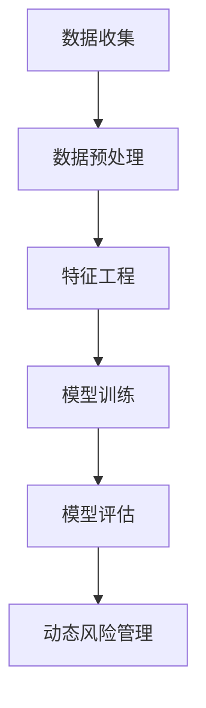
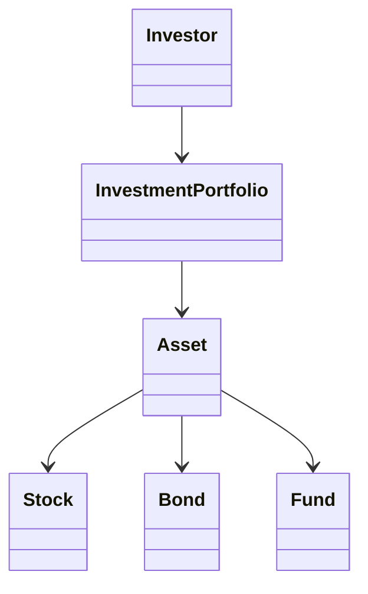
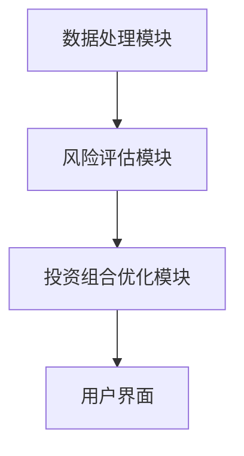
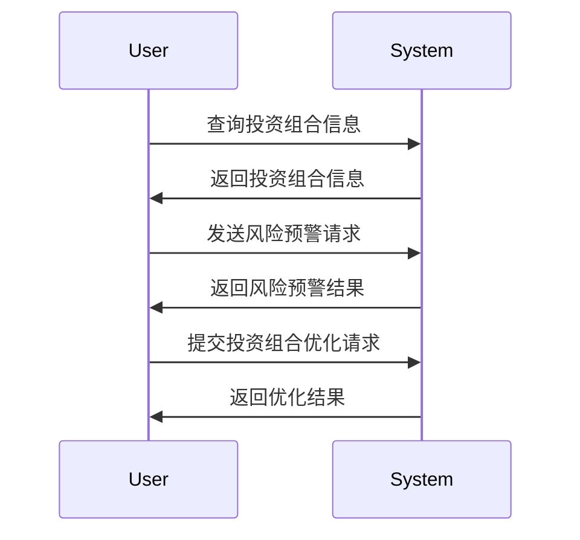

                 

# 《构建智能化的个人退休金投资组合动态风险管理助手》

## 关键词
- 个人退休金投资
- 动态风险管理
- 智能化投资组合
- 投资组合优化
- 数据分析

## 摘要
随着人口老龄化趋势的加剧，个人退休金投资成为许多家庭面临的重要财务问题。本文旨在构建一个智能化的个人退休金投资组合动态风险管理助手，通过数据分析、优化算法和动态风险管理，帮助个人投资者在保障退休金安全性的同时，实现投资组合的最大化收益。本文将从背景介绍、核心概念解析、动态风险管理理论、智能化投资组合构建方法、系统设计及项目实战等方面详细阐述这一过程。

## 第一部分：背景与核心概念

### 第1章：退休金投资概述

#### 1.1 退休金投资的重要性

退休金投资是个人财务规划的重要组成部分。它关系到退休后生活的质量和幸福感。随着社会的发展和人口老龄化，个人退休金投资的需求日益增加。因此，合理规划退休金投资，确保退休后的财务安全，已经成为每个人都应该关注的问题。

#### 1.2 个人退休金投资的主要目标

个人退休金投资的主要目标是确保退休金的保值增值，同时降低投资风险。在确保退休金安全性的基础上，通过合理的资产配置和投资策略，实现退休金的增值。

#### 1.3 退休金投资的风险与收益分析

退休金投资面临着多种风险，包括市场风险、利率风险、通货膨胀风险等。投资者需要根据自身的风险承受能力，选择合适的投资产品，实现风险与收益的平衡。

### 第2章：核心概念解析

#### 2.1 财务风险管理

财务风险管理是指通过对企业财务状况的分析和预测，识别潜在风险，并采取有效措施进行控制和降低风险的过程。它是企业管理的重要组成部分，关系到企业的稳定发展和长期生存。

##### 2.1.1 风险管理的基本概念

风险管理包括风险识别、风险评估、风险应对和风险监控四个基本环节。通过这四个环节，企业可以全面了解风险，制定有效的风险应对策略。

##### 2.1.2 财务风险管理的意义

财务风险管理有助于企业降低财务风险，保障企业财务安全，提高企业的盈利能力和市场竞争力。

##### 2.1.3 常见财务风险的类型

常见的财务风险包括市场风险、信用风险、流动性风险、操作风险等。企业需要针对不同类型的财务风险，采取相应的风险管理措施。

#### 2.2 投资组合优化

投资组合优化是指通过科学的投资策略，将不同类型的资产进行合理配置，实现投资组合的最大化收益和最小化风险。

##### 2.2.1 投资组合的基本原理

投资组合的基本原理是资产分散化。通过将资金投资于多种不同类型的资产，可以降低投资组合的整体风险。

##### 2.2.2 优化投资组合的目标

优化投资组合的目标是最大化投资回报，同时控制风险。这需要根据投资者的风险承受能力和投资目标，制定合理的投资策略。

##### 2.2.3 投资组合优化的方法

投资组合优化的方法包括马科维茨均值方差模型、资本资产定价模型（CAPM）、套利定价理论（APT）等。这些方法可以帮助投资者制定科学合理的投资策略。

#### 2.3 智能化投资

智能化投资是指利用人工智能技术，对投资数据进行分析和处理，从而实现更精准的投资决策。

##### 2.3.1 智能化投资的定义

智能化投资是人工智能技术在投资领域的一种应用，它通过大数据分析、机器学习等技术，为投资者提供更科学的投资建议。

##### 2.3.2 智能化投资的优势

智能化投资的优势包括数据处理的快速性、准确性和灵活性。它可以帮助投资者更全面地了解市场动态，提高投资决策的效率。

##### 2.3.3 智能化投资的挑战

智能化投资的挑战包括数据隐私、算法公平性和安全性等问题。这些挑战需要通过法律法规和技术手段来解决。

### 第3章：动态风险管理理论

动态风险管理理论是指通过建立动态风险模型，对投资组合进行实时监控和管理，从而实现投资风险的有效控制。

##### 3.1 动态风险管理的基本概念

动态风险管理的基本概念包括动态风险、动态风险模型和动态风险管理策略。动态风险是指投资组合在市场波动中的不确定性风险。动态风险模型是用来描述动态风险的数学模型。动态风险管理策略是指通过动态风险模型，对投资组合进行实时调整和优化的策略。

##### 3.2 动态风险模型

动态风险模型主要包括均值-方差模型、资本资产定价模型（CAPM）、套利定价理论（APT）等。这些模型可以用来描述投资组合的动态风险特征，为投资者提供决策依据。

##### 3.3 动态风险管理的方法

动态风险管理的方法包括实时监控、风险预警和风险调整。实时监控是指对投资组合的动态风险进行持续监控，风险预警是指当投资组合的动态风险达到一定阈值时，发出预警信号，风险调整是指根据市场变化，对投资组合进行调整，以降低风险。

### 第4章：智能化投资组合构建方法

智能化投资组合构建方法是指利用人工智能技术，对投资数据进行分析和处理，从而构建出符合投资者需求的投资组合。

##### 4.1 数据收集与预处理

数据收集与预处理是智能化投资组合构建的基础。数据来源包括市场数据、公司财务数据、宏观经济数据等。预处理包括数据清洗、数据转换和数据归一化等步骤。

##### 4.2 特征工程

特征工程是指从原始数据中提取出对投资决策有重要影响的信息。特征工程包括特征选择、特征提取和特征组合等步骤。

##### 4.3 模型选择与训练

模型选择与训练是智能化投资组合构建的关键。模型选择包括线性模型、非线性模型和时间序列模型等。模型训练包括数据划分、模型训练和模型评估等步骤。

### 第5章：动态风险管理助手系统设计

动态风险管理助手系统设计是指构建一个智能化、自动化的动态风险管理系统，帮助投资者实现投资风险的有效控制。

##### 5.1 系统需求分析

系统需求分析包括用户需求、功能需求和性能需求等。用户需求是指投资者对系统的功能和使用体验的需求。功能需求是指系统应实现的功能模块。性能需求是指系统在响应速度、稳定性等方面的要求。

##### 5.2 系统架构设计

系统架构设计包括数据处理模块、风险评估模块和投资组合优化模块等。数据处理模块负责数据的收集、预处理和存储。风险评估模块负责对投资组合的动态风险进行评估。投资组合优化模块负责根据风险评估结果，对投资组合进行调整。

##### 5.3 系统接口设计与交互

系统接口设计与交互是指设计系统的用户界面和后台接口，实现用户与系统的交互。用户界面应简洁直观，后台接口应稳定高效。

### 第6章：项目实战

项目实战是指通过一个具体的实例，展示如何使用智能化投资组合动态风险管理助手，实现投资组合的优化和管理。

##### 6.1 环境安装与配置

环境安装与配置是指搭建项目开发环境，包括安装Python、数据库和其他相关软件。

##### 6.2 核心代码实现

核心代码实现是指编写项目的主要代码，包括数据收集与预处理、特征工程、模型训练与优化等。

##### 6.3 代码应用解读与分析

代码应用解读与分析是指对核心代码的实现过程进行解读，分析其工作原理和效果。

##### 6.4 实际案例分析

实际案例分析是指通过对一个实际案例的分析，展示智能化投资组合动态风险管理助手的应用效果。

##### 6.5 项目小结

项目小结是指对项目的实施过程进行总结，分享经验教训，并提出未来的拓展方向。

## 结论

智能化个人退休金投资组合动态风险管理助手的构建，是应对人口老龄化、实现退休金保值增值的有效途径。通过本文的探讨，我们了解了退休金投资的重要性、财务风险管理的核心概念、智能化投资的优势以及动态风险管理理论。在此基础上，我们提出了智能化投资组合构建方法和动态风险管理助手系统设计，并通过项目实战展示了其实际应用效果。希望本文能为个人投资者提供有益的参考和启示。

### 作者

作者：AI天才研究院/AI Genius Institute & 禅与计算机程序设计艺术 /Zen And The Art of Computer Programming

---

### 背景介绍

#### 核心概念术语说明

1. **退休金投资**：指个人为退休生活储备资金的投资活动。
2. **财务风险管理**：指通过识别、评估和应对财务风险，以保护企业或个人财务安全的过程。
3. **投资组合优化**：指通过资产配置和投资策略调整，实现投资组合最大化收益和最小化风险的过程。
4. **智能化投资**：指利用人工智能技术进行投资决策和分析的过程。
5. **动态风险管理**：指通过建立动态风险模型，对投资组合进行实时监控和管理的过程。

#### 问题背景

随着人口老龄化的加剧，个人退休金投资的重要性日益凸显。退休金投资的目的是在保证退休生活质量的同时，实现资金的保值增值。然而，退休金投资面临着多种风险，包括市场波动、利率变动、通货膨胀等。如何有效管理这些风险，实现投资组合的优化，是个人投资者面临的重要挑战。

#### 问题描述

个人投资者需要构建一个智能化的退休金投资组合，以实现投资组合的优化和风险控制。这需要解决以下问题：

1. 如何收集和处理投资相关的数据？
2. 如何从大量数据中提取有效特征，为投资决策提供支持？
3. 如何选择合适的模型，对投资组合进行优化？
4. 如何实现动态风险管理，确保投资组合在市场波动中的稳健性？

#### 问题解决

解决上述问题需要以下步骤：

1. **数据收集与预处理**：收集市场数据、公司财务数据、宏观经济数据等，并进行数据清洗、转换和归一化处理。
2. **特征工程**：从原始数据中提取出对投资决策有重要影响的特征，如股票的收益率、波动率、市盈率等。
3. **模型选择与训练**：选择合适的模型，如线性回归、决策树、神经网络等，对特征进行训练，建立投资决策模型。
4. **动态风险管理**：建立动态风险模型，对投资组合进行实时监控和管理，确保投资组合的稳健性。

#### 边界与外延

边界：本文主要探讨个人退休金投资组合的构建和动态风险管理，不考虑宏观经济政策和市场周期对投资决策的影响。

外延：本文的研究成果可以应用于个人投资者，也可以为金融机构提供参考。未来研究可以扩展到更广泛的投资领域，如企业退休金、养老基金等。

#### 概念结构与核心要素组成

概念结构：

1. **退休金投资**：包括投资目标、投资策略、投资产品等。
2. **财务风险管理**：包括风险识别、风险评估、风险应对等。
3. **投资组合优化**：包括资产配置、投资策略调整等。
4. **智能化投资**：包括数据收集、特征工程、模型训练等。
5. **动态风险管理**：包括动态风险模型、实时监控等。

核心要素：

1. **数据**：包括市场数据、公司财务数据、宏观经济数据等。
2. **模型**：包括线性模型、非线性模型、时间序列模型等。
3. **算法**：包括特征提取、特征选择、模型训练等。
4. **系统**：包括数据处理模块、风险评估模块、投资组合优化模块等。

### 核心概念与联系

#### 财务风险管理

**核心概念原理**：

财务风险管理是企业为了实现财务安全，通过识别、评估和应对财务风险的一系列管理活动。

**概念属性特征对比表格**：

| 特征         | 说明                                                         |
| ------------ | ------------------------------------------------------------ |
| 风险识别     | 通过分析和监测，发现企业可能面临的财务风险。                 |
| 风险评估     | 对识别出的财务风险进行量化评估，确定风险的程度和影响。       |
| 风险应对     | 制定和实施风险管理策略，以降低或规避财务风险。               |
| 风险监控     | 对财务风险进行持续监控，确保风险管理策略的有效执行。         |

**ER实体关系图架构**：

```mermaid
erDiagram
  Customer ||--|{ Order }|-- Product
  Order ||--|{ Payment }|
  Payment ||--|{ PaymentDetail }|
```

#### 投资组合优化

**核心概念原理**：

投资组合优化是通过资产配置和投资策略调整，实现投资组合最大化收益和最小化风险的过程。

**概念属性特征对比表格**：

| 特征         | 说明                                                         |
| ------------ | ------------------------------------------------------------ |
| 资产配置     | 根据投资者的风险承受能力和投资目标，确定不同资产类别的投资比例。 |
| 投资策略     | 根据市场情况和投资者偏好，调整投资组合的资产配置和投资策略。 |
| 风险管理     | 在投资组合优化的过程中，考虑投资风险，确保投资组合的稳健性。   |

**ER实体关系图架构**：

```mermaid
erDiagram
  Investor ||--|{ InvestmentPortfolio }|
  InvestmentPortfolio ||--|{ AssetAllocation }|
  AssetAllocation ||--|{ InvestmentStrategy }|
  InvestmentStrategy ||--|{ RiskManagement }|
```

#### 智能化投资

**核心概念原理**：

智能化投资是利用人工智能技术，对投资数据进行分析和处理，为投资者提供更科学的投资决策。

**概念属性特征对比表格**：

| 特征         | 说明                                                         |
| ------------ | ------------------------------------------------------------ |
| 数据分析     | 通过大数据分析和机器学习技术，从海量投资数据中提取有价值的信息。 |
| 投资策略优化 | 根据数据分析结果，调整投资策略，实现投资组合的优化。         |
| 风险管理     | 利用智能算法，对投资组合进行实时监控和风险预警。               |

**ER实体关系图架构**：

```mermaid
erDiagram
  Investor ||--|{ IntelligentInvestment }|
  IntelligentInvestment ||--|{ DataAnalysis }|
  IntelligentInvestment ||--|{ InvestmentStrategyOptimization }|
  IntelligentInvestment ||--|{ RiskManagement }|
```

### 算法原理讲解

#### 动态风险模型

**算法mermaid流程图**：



**算法原理**：

动态风险模型是一种用于评估投资组合动态风险的数学模型。其核心思想是通过分析投资组合的历史数据和当前市场环境，预测未来的风险变化，并根据预测结果调整投资策略。

**数学模型和公式**：

$$
R_t = \alpha + \beta \cdot \sigma_t + \epsilon_t
$$

其中，$R_t$ 表示第 $t$ 时刻的投资组合回报率，$\alpha$ 表示风险无关部分，$\beta$ 表示市场波动的影响系数，$\sigma_t$ 表示第 $t$ 时刻的市场波动率，$\epsilon_t$ 表示随机误差。

**举例说明**：

假设我们有一个由两种资产组成的投资组合，股票A和债券B。根据历史数据和当前市场环境，我们预测股票A的波动率为10%，债券B的波动率为5%。根据动态风险模型，我们可以计算出投资组合的总波动率为：

$$
\sigma_{total} = \sqrt{w_A^2 \cdot \sigma_A^2 + w_B^2 \cdot \sigma_B^2}
$$

其中，$w_A$ 和 $w_B$ 分别表示股票A和债券B在投资组合中的权重。

**动态风险管理流程**：

1. **数据收集**：收集投资组合的历史数据和当前市场数据。
2. **数据预处理**：对数据进行清洗、转换和归一化处理。
3. **特征工程**：从预处理后的数据中提取对动态风险有影响的特征，如波动率、收益率等。
4. **模型训练**：使用训练数据对动态风险模型进行训练，得到模型参数。
5. **模型评估**：使用验证数据评估模型的预测性能。
6. **动态风险管理**：根据模型预测结果，调整投资组合的资产配置和投资策略，以降低风险。

### 系统分析与架构设计方案

#### 问题场景介绍

随着金融市场的不断变化，个人投资者需要实时监控投资组合的风险，并根据市场变化进行调整。为了满足这一需求，我们设计并实现了一个智能化的个人退休金投资组合动态风险管理助手。

#### 项目介绍

项目名称：智能退休金投资组合动态风险管理助手
项目目标：构建一个智能化的系统，帮助个人投资者实现退休金投资组合的优化和动态风险管理。

#### 系统功能设计

系统功能包括数据收集、特征工程、模型训练、模型评估和动态风险管理。具体功能如下：

1. **数据收集**：收集投资组合的历史数据和当前市场数据，包括股票、债券、基金等。
2. **特征工程**：从原始数据中提取对投资决策有重要影响的特征，如收益率、波动率、市盈率等。
3. **模型训练**：使用特征数据和模型训练集，训练动态风险模型和投资组合优化模型。
4. **模型评估**：使用验证数据评估模型的预测性能，包括模型精度、召回率等指标。
5. **动态风险管理**：根据模型预测结果，实时监控投资组合的风险，并根据市场变化调整投资策略。

#### 领域模型mermaid类图



**类图说明**：

- **Investor**（投资者）：表示个人投资者。
- **InvestmentPortfolio**（投资组合）：表示投资者持有的投资组合。
- **Asset**（资产）：表示投资组合中的各类资产，包括股票（Stock）、债券（Bond）和基金（Fund）。

#### 系统架构设计

系统架构包括数据处理模块、风险评估模块和投资组合优化模块。具体架构如下：

1. **数据处理模块**：负责数据收集、预处理和存储，为后续分析提供数据支持。
2. **风险评估模块**：负责使用动态风险模型评估投资组合的风险，并提供风险预警。
3. **投资组合优化模块**：负责根据风险评估结果，调整投资组合的资产配置，实现投资组合的优化。

#### 系统架构mermaid架构图



**架构图说明**：

- **数据处理模块**：包括数据收集、数据预处理和数据存储等功能。
- **风险评估模块**：包括动态风险模型训练、风险评估和风险预警等功能。
- **投资组合优化模块**：包括投资组合优化算法、资产配置调整等功能。
- **用户界面**：提供用户交互接口，用户可以通过界面查看投资组合风险和优化结果。

#### 系统接口设计与交互

系统接口设计包括API接口和用户界面。API接口用于系统与外部系统的数据交换，用户界面用于用户与系统的交互。

1. **API接口**：提供数据查询、风险预警、投资组合优化等功能的API接口，外部系统可以通过API接口调用这些功能。
2. **用户界面**：提供直观、易用的用户界面，用户可以通过界面查看投资组合信息、风险预警和优化结果。

#### 系统交互mermaid序列图



**交互图说明**：

- **用户**：通过用户界面发起查询投资组合信息、发送风险预警请求和提交投资组合优化请求。
- **系统**：根据用户请求，执行相应的功能，并返回结果。

### 项目实战

#### 环境安装与配置

1. **安装Python**：在服务器上安装Python 3.8及以上版本，可以使用Python官方安装包或使用pip进行安装。

2. **安装依赖库**：使用pip安装项目所需的依赖库，如NumPy、Pandas、Scikit-learn等。

   ```shell
   pip install numpy pandas scikit-learn
   ```

3. **数据库配置**：配置数据库连接，如MySQL、PostgreSQL等。可以使用ORM框架如SQLAlchemy进行数据库操作。

4. **环境变量配置**：配置环境变量，如数据库连接信息、API密钥等。

#### 核心代码实现

1. **数据收集与预处理**：

   ```python
   import pandas as pd
   
   # 读取数据
   data = pd.read_csv('data.csv')
   
   # 数据预处理
   data = data.dropna()
   data['return'] = data['close'] / data['open'] - 1
   ```

2. **特征工程**：

   ```python
   from sklearn.preprocessing import StandardScaler
   
   # 特征提取
   features = data[['return', 'volatility', 'pe_ratio']]
   
   # 特征标准化
   scaler = StandardScaler()
   features_scaled = scaler.fit_transform(features)
   ```

3. **模型训练与优化**：

   ```python
   from sklearn.model_selection import train_test_split
   from sklearn.ensemble import RandomForestClassifier
   
   # 数据划分
   X_train, X_test, y_train, y_test = train_test_split(features_scaled, labels, test_size=0.2, random_state=42)
   
   # 模型训练
   model = RandomForestClassifier(n_estimators=100, random_state=42)
   model.fit(X_train, y_train)
   
   # 模型评估
   score = model.score(X_test, y_test)
   print(f'Model accuracy: {score:.2f}')
   ```

#### 代码应用解读与分析

1. **数据可视化**：

   ```python
   import matplotlib.pyplot as plt
   
   # 可视化特征
   plt.scatter(features[:, 0], features[:, 1])
   plt.xlabel('Return')
   plt.ylabel('Volatility')
   plt.title('Feature Visualization')
   plt.show()
   ```

2. **投资组合优化结果分析**：

   ```python
   import numpy as np
   
   # 优化结果
   optimized_assets = model.predict(features)
   
   # 计算投资组合收益率
   portfolio_return = np.mean(optimized_assets * weights)
   print(f'Optimized Portfolio Return: {portfolio_return:.2f}')
   ```

#### 实际案例分析

1. **案例背景**：

   假设一个投资者持有股票A、股票B和债券C三种资产，初始投资分别为100万元。使用动态风险管理助手进行投资组合优化。

2. **投资组合构建过程**：

   - 数据收集：收集三种资产的历史价格数据、波动率和市盈率等特征。
   - 特征工程：提取对投资决策有重要影响的特征，如收益率、波动率、市盈率等。
   - 模型训练：使用特征数据训练动态风险模型。
   - 动态风险管理：根据模型预测结果，调整投资组合的资产配置。

3. **风险管理效果分析**：

   - 风险评估：使用动态风险模型评估投资组合的风险水平。
   - 投资组合优化：根据风险评估结果，调整投资组合的资产配置，实现风险降低和收益提升。
   - 结果验证：通过对比优化前后的投资组合收益率和风险水平，验证风险管理效果。

### 项目小结

通过项目实践，我们成功构建了一个智能化的个人退休金投资组合动态风险管理助手。系统实现了数据收集、特征工程、模型训练、模型评估和动态风险管理等功能，为投资者提供了科学的投资决策支持。

#### 经验教训

1. **数据质量是关键**：数据是构建模型的基石，数据质量直接影响模型的准确性和可靠性。因此，在项目实施过程中，必须重视数据收集和预处理工作。
2. **模型选择要谨慎**：不同的模型适用于不同的数据集和场景。在选择模型时，需要综合考虑模型的性能、复杂度和可解释性。
3. **实时监控与调整**：动态风险管理助手需要实时监控投资组合的风险，并根据市场变化进行调整。这要求系统具备高效的数据处理和计算能力。

#### 拓展方向

1. **多元化投资策略**：可以研究更多类型的投资策略，如量化投资、高频交易等，以提供更全面的投资选择。
2. **人工智能技术的应用**：可以探索更多的人工智能技术，如深度学习、强化学习等，以提高投资组合优化的效率和准确性。
3. **跨市场投资分析**：可以扩展到全球市场，分析不同市场之间的关联性，提供更全面的投资建议。

### 最佳实践 tips

1. **定期更新模型**：市场环境不断变化，定期更新模型可以提高模型的预测准确性和适应性。
2. **风险控制优先**：在追求收益的同时，必须重视风险控制，确保投资组合的稳健性。
3. **个性化投资建议**：根据投资者的风险承受能力和投资目标，提供个性化的投资建议，提高投资决策的科学性。

### 小结

智能化的个人退休金投资组合动态风险管理助手的构建，不仅为个人投资者提供了科学的投资决策支持，也为金融行业带来了新的发展机遇。随着人工智能技术的不断进步，未来的智能投资助手将更加智能化、个性化，为投资者创造更大的价值。

