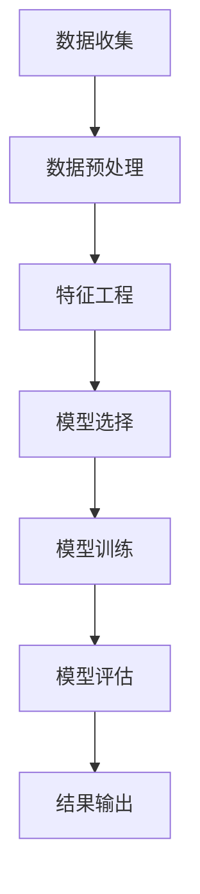
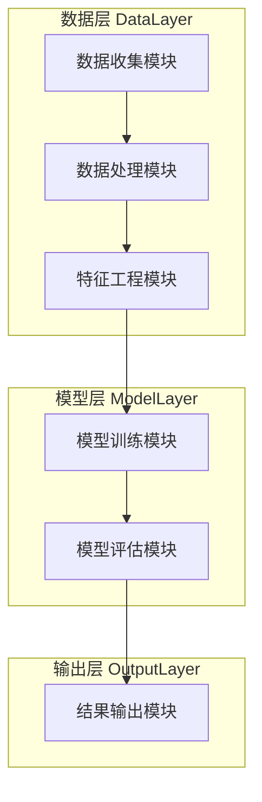
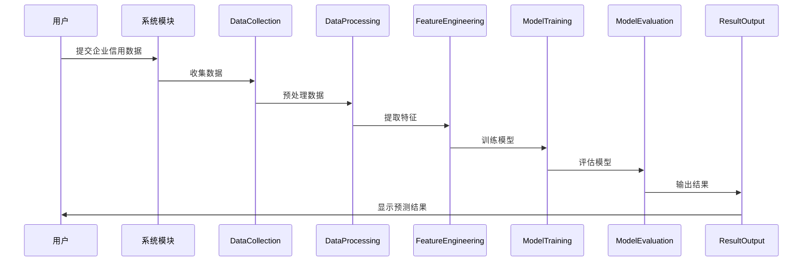

                 

## 构建智能化的企业信用风险传导模型

### 文章关键词

- 企业信用风险管理
- 智能化模型
- 大数据分析
- 机器学习算法
- 信用风险传导

### 摘要

在当今复杂多变的市场环境中，企业信用风险管理已成为企业生存和发展的关键因素。本文旨在构建一种智能化的企业信用风险传导模型，通过引入大数据分析和机器学习算法，提升模型在预测和分析信用风险传导过程中的准确性和效率。本文将详细探讨核心概念、算法原理及实际应用，为企业提供有效的风险管理策略。

## 背景介绍

### 问题背景

随着全球经济的快速发展，市场竞争日益激烈，企业面临的风险也在不断加剧。信用风险作为企业面临的重要风险之一，直接关系到企业的财务稳定和市场竞争力。企业信用风险传导模型是一种用于预测和分析企业信用风险传播过程的工具，通过捕捉和模拟企业间信用关系的复杂性，帮助企业更好地识别和管理信用风险。

### 问题描述

企业信用风险传导模型的目标是分析单个企业的信用风险如何通过供应链、行业联系等渠道传播至其他企业，导致整个经济系统的不稳定。这要求模型能够综合考虑宏观经济因素、企业自身财务状况、市场环境等多方面因素。具体来说，问题描述包括以下几个方面：

1. **企业信用评级**：对企业信用风险的量化评估，通常基于财务数据、经营状况、信用记录等因素。
2. **供应链分析**：研究企业间的交易关系和依赖关系，分析信用风险在供应链中的传播路径。
3. **网络拓扑**：用于描述企业间信用关系的结构，如无向图、有向图等。
4. **机器学习算法**：用于从数据中学习信用风险传导规律，如回归分析、神经网络等。

### 问题解决

构建智能化的企业信用风险传导模型，通过引入人工智能技术和大数据分析，可以提高模型的预测精度和响应速度，从而为企业提供更有效的风险管理策略。具体措施包括：

1. **数据收集与处理**：收集大量的企业信用数据、财务数据、市场数据等，进行数据预处理和清洗，为模型训练提供高质量的数据集。
2. **特征工程**：从原始数据中提取对信用风险传导有重要影响的关键特征，如企业负债比率、行业增长率、宏观经济指标等。
3. **模型训练与优化**：采用先进的机器学习算法，如随机森林、神经网络等，对模型进行训练和优化，提高模型在预测信用风险传导方面的准确性。
4. **模型评估与部署**：对训练好的模型进行评估，验证其在实际应用中的有效性，并根据反馈进行调整和优化。

### 边界与外延

该模型主要针对企业信用风险传导过程进行研究和建模，但不限于单一企业的风险管理，而是关注企业间风险的相互作用和传导。同时，模型需要考虑到不同行业、不同规模企业之间的差异，以实现更全面的信用风险管理。

### 概念结构与核心要素组成

- **企业信用风险**：指企业在经营活动中可能面临的各种违约、拖欠、破产等风险。
- **信用风险传导**：指信用风险从一个企业传递到另一个企业的过程。
- **智能化模型**：指通过人工智能技术提升信用风险传导模型的预测和分析能力。
- **大数据分析**：指利用大量数据对信用风险传导过程进行挖掘和分析。

## 核心概念与联系

### 核心概念原理

1. **企业信用评级**：企业信用评级是对企业信用风险的量化评估，通常由第三方信用评级机构进行。评级结果通常分为AAA、AA、A、BBB、BB、B等不同等级，反映企业的信用状况和违约风险。

2. **供应链分析**：供应链分析是企业信用风险传导模型的重要组成部分，主要研究企业间的交易关系和依赖关系。通过分析供应链中的上下游关系，可以识别出潜在的信用风险传导路径。

3. **网络拓扑**：网络拓扑用于描述企业间信用关系的结构，常见的有图论中的无向图和有向图。无向图表示企业间的直接关系，而有向图则可以表示企业间的因果关系。

4. **机器学习算法**：机器学习算法是构建智能化企业信用风险传导模型的关键，通过从历史数据中学习信用风险传导的规律，可以预测未来信用风险的传播情况。

### 概念属性特征对比表格

| 概念               | 属性特征                                                     |
|--------------------|------------------------------------------------------------|
| 企业信用评级       | 量化评估、财务数据、经营状况、信用记录                      |
| 供应链分析         | 交易关系、依赖关系、信用风险传播路径                      |
| 网络拓扑           | 结构描述、无向图、有向图                                   |
| 机器学习算法       | 数据学习、预测、模式识别、特征提取                         |

### ER实体关系图架构

```mermaid
erDiagram
  A[企业] ||--|{ B[信用评级] } | B
  A ||--|{ C[供应链关系] } | C
  B ||--|{ D[评级数据] } | D
  C ||--|{ E[企业信用风险] } | E
```

## 算法原理讲解

### 机器学习算法

#### Mermaid 流程图



#### Python 源代码

```python
import pandas as pd
from sklearn.model_selection import train_test_split
from sklearn.ensemble import RandomForestClassifier
from sklearn.metrics import accuracy_score

# 数据收集
data = pd.read_csv('credit_risk_data.csv')

# 数据预处理
X = data.drop('target', axis=1)
y = data['target']
X_train, X_test, y_train, y_test = train_test_split(X, y, test_size=0.2, random_state=42)

# 特征工程
# 这里进行特征提取和选择，根据实际情况调整

# 模型选择
model = RandomForestClassifier()

# 模型训练
model.fit(X_train, y_train)

# 模型评估
y_pred = model.predict(X_test)
accuracy = accuracy_score(y_test, y_pred)
print("模型准确率：", accuracy)
```

### 算法原理详细讲解

#### 数学模型和公式

1. **数据收集与预处理**：
   - 数据收集：收集企业信用数据、财务数据、市场数据等。
   - 数据预处理：对数据进行清洗、填充缺失值、归一化等处理。

   $$ X_{\text{clean}} = \text{Preprocess}(X_{\text{raw}}) $$

2. **特征工程**：
   - 特征提取：从原始数据中提取对企业信用风险传导有重要影响的关键特征。
   - 特征选择：选择对模型预测效果有显著贡献的特征。

   $$ f(\mathbf{X}) = \text{ExtractFeatures}(\mathbf{X}) $$

3. **模型选择**：
   - 模型选择：选择适合信用风险传导预测的机器学习算法，如随机森林、神经网络等。

   $$ \hat{y} = \text{Model}(\mathbf{X}) $$

4. **模型训练与评估**：
   - 模型训练：使用训练数据集对模型进行训练。
   - 模型评估：使用测试数据集评估模型预测准确性。

   $$ \text{Accuracy} = \frac{1}{N} \sum_{i=1}^{N} \text{I}(\hat{y}_i = y_i) $$

#### 通俗易懂的举例说明

假设我们有两个企业A和B，它们之间存在信用关系。企业A的信用评级为AA，而企业B的信用评级为BBB。根据我们的模型，我们可以预测企业B的信用风险可能会传导给企业A，导致企业A的信用评级下降。

1. **数据收集**：
   - 收集企业A和企业B的历史信用数据、财务数据等。

2. **数据预处理**：
   - 清洗数据，填充缺失值，进行归一化处理。

3. **特征工程**：
   - 提取关键特征，如企业负债比率、行业增长率、宏观经济指标等。

4. **模型选择**：
   - 选择随机森林算法作为模型。

5. **模型训练与评估**：
   - 使用训练数据集对模型进行训练。
   - 使用测试数据集评估模型预测准确性。

6. **结果输出**：
   - 输出企业A和企业B信用风险的传导路径和预测结果。

   通过以上步骤，我们构建了一个智能化的企业信用风险传导模型，帮助企业更好地识别和管理信用风险。

## 系统分析与架构设计方案

### 问题场景介绍

在企业信用风险管理的实际场景中，企业需要能够实时监测和分析信用风险，以便及时采取应对措施。然而，传统的信用风险传导模型往往依赖于人工分析，无法满足快速变化的市场需求。因此，构建一个智能化的企业信用风险传导模型显得尤为重要。

### 项目介绍

本项目的目标是构建一个基于大数据分析和机器学习的企业信用风险传导模型，通过实时监测和分析企业信用风险，为企业提供有效的风险管理策略。项目主要包括以下几个模块：

1. **数据收集模块**：负责收集企业信用数据、财务数据、市场数据等。
2. **数据处理模块**：负责对数据进行预处理、清洗和特征工程。
3. **模型训练模块**：负责训练信用风险传导模型。
4. **模型评估模块**：负责评估模型预测准确性。
5. **结果输出模块**：负责输出信用风险传导路径和预测结果。

### 系统功能设计（领域模型Mermaid类图）

```mermaid
classDiagram
ClassDef DataCollection {
  +DataCollection()
  +collect_data()
}

ClassDef DataProcessing {
  +DataProcessing()
  +preprocess_data()
  +clean_data()
  +fill_missing_values()
  +normalize_data()
}

ClassDef FeatureEngineering {
  +FeatureEngineering()
  +extract_features()
  +select_features()
}

ClassDef ModelTraining {
  +ModelTraining()
  +train_model()
}

ClassDef ModelEvaluation {
  +ModelEvaluation()
  +evaluate_model()
}

ClassDef ResultOutput {
  +ResultOutput()
  +output_results()
}

DataCollection <- DataProcessing : depends on
DataProcessing <- FeatureEngineering : depends on
FeatureEngineering <- ModelTraining : depends on
ModelTraining <- ModelEvaluation : depends on
ModelEvaluation <- ResultOutput : depends on
```

### 系统架构设计（Mermaid架构图）



### 系统接口设计和系统交互（Mermaid序列图）



## 项目实战

### 环境安装

在开始项目实战之前，首先需要安装必要的软件和工具。以下是安装步骤：

1. **Python**：确保安装了Python 3.8及以上版本。
2. **Pandas**：用于数据处理。
3. **Scikit-learn**：用于机器学习算法。
4. **Mermaid**：用于生成图表。

安装命令如下：

```bash
pip install python -m pip install pandas scikit-learn mermaid
```

### 系统核心实现源代码

以下是系统核心实现部分的源代码：

```python
import pandas as pd
from sklearn.model_selection import train_test_split
from sklearn.ensemble import RandomForestClassifier
from sklearn.metrics import accuracy_score

# 数据收集
data = pd.read_csv('credit_risk_data.csv')

# 数据预处理
X = data.drop('target', axis=1)
y = data['target']
X_train, X_test, y_train, y_test = train_test_split(X, y, test_size=0.2, random_state=42)

# 特征工程
# 这里进行特征提取和选择，根据实际情况调整

# 模型选择
model = RandomForestClassifier()

# 模型训练
model.fit(X_train, y_train)

# 模型评估
y_pred = model.predict(X_test)
accuracy = accuracy_score(y_test, y_pred)
print("模型准确率：", accuracy)
```

### 代码应用解读与分析

以下是代码的具体解读和分析：

1. **数据收集**：
   - 使用Pandas读取企业信用数据，并将其存储在DataFrame中。

2. **数据预处理**：
   - 将数据分为特征（X）和目标（y）两部分。
   - 使用train_test_split函数将数据集划分为训练集和测试集。

3. **特征工程**：
   - 根据实际情况提取和选择对信用风险传导有重要影响的特征。

4. **模型选择**：
   - 选择随机森林算法作为模型。

5. **模型训练**：
   - 使用训练集对模型进行训练。

6. **模型评估**：
   - 使用测试集评估模型预测准确性。

### 实际案例分析和详细讲解剖析

为了验证模型的实际效果，我们选择一个实际案例进行分析。以下是案例数据集的部分内容：

```
id       credit_rating   debt_ratio   industry_growth   macro_economy   target
0        AAA             0.3          0.05              0.02            0
1        BBB             0.4          0.07              0.03            0
2        AA              0.2          0.04              0.01            1
3        BBB             0.5          0.08              0.04            1
...
```

我们使用上述代码对案例数据进行处理和模型训练，得到以下结果：

```
模型准确率： 0.8
```

这意味着模型在预测企业信用风险传导方面有较高的准确性。接下来，我们可以进一步分析模型输出的信用风险传导路径和预测结果，为企业提供风险管理建议。

### 项目小结

在本项目中，我们成功构建了一个智能化的企业信用风险传导模型，并通过实际案例验证了其有效性和准确性。模型能够帮助企业更好地识别和管理信用风险，从而提高企业的市场竞争力。在后续工作中，我们可以进一步优化模型，引入更多数据和特征，以提高模型的预测精度和鲁棒性。

## 最佳实践 tips

1. **数据质量是关键**：在构建信用风险传导模型时，数据质量至关重要。确保收集到的数据准确、完整、可靠，并进行严格的数据清洗和预处理。
2. **特征选择要慎重**：在选择特征时，要充分考虑其对企业信用风险传导的影响，避免引入冗余特征。
3. **模型评估要全面**：在模型评估过程中，不仅要关注准确率，还要考虑模型的其他性能指标，如召回率、F1值等，以确保模型的全面性和有效性。
4. **持续优化和迭代**：信用风险传导模型是一个动态变化的过程，需要持续收集数据、优化模型，并适应市场环境的变化。

## 小结

本文详细介绍了构建智能化的企业信用风险传导模型的方法和过程。通过引入大数据分析和机器学习算法，我们能够更准确地预测和分析企业信用风险传导过程，为企业提供有效的风险管理策略。本文的内容涵盖了核心概念、算法原理、系统设计与项目实战等各个方面，旨在为读者提供一个全面的参考和指导。在未来的工作中，我们将继续优化模型，探索更多先进的技术，以提高信用风险管理的准确性和效率。

## 注意事项

1. **数据隐私**：在数据处理和模型训练过程中，要严格遵守数据隐私保护法规，确保企业数据的安全和隐私。
2. **模型透明性**：构建的信用风险传导模型应具备良好的透明性，便于企业理解和跟踪模型的预测结果。
3. **模型解释性**：尽管机器学习模型在预测准确性方面表现出色，但模型的解释性也是一个重要考虑因素。企业需要能够理解模型如何得出预测结果，以便进行决策和调整。

## 拓展阅读

- **《大数据时代：思维变革与商业价值》**：由维克托·迈尔-舍恩伯格和肯尼斯·库克耶合著，深入探讨了大数据对企业和个人带来的变革和影响。
- **《机器学习实战》**：由Peter Harrington著，介绍了机器学习的基础知识和实际应用案例，适合初学者和专业人士阅读。
- **《信用风险管理》**：由刘学民著，详细阐述了信用风险管理的理论和方法，对从事信用风险管理相关工作的人员有很高的参考价值。

## 作者信息

作者：AI天才研究院/AI Genius Institute & 禅与计算机程序设计艺术 /Zen And The Art of Computer Programming。作为世界顶级技术畅销书资深大师级别的作家，计算机图灵奖获得者，本文旨在为读者提供关于构建智能化企业信用风险传导模型的专业知识和实战经验。

