                 

# 构建智能化的企业现金流管理优化平台

## 关键词

智能现金流管理，优化平台，数据分析，算法，企业财务

## 摘要

本文旨在探讨如何构建一个智能化的企业现金流管理优化平台。通过分析当前企业现金流管理的挑战，本文介绍了智能现金流管理平台的关键概念和组成部分，包括智能现金流模型、数据分析技术、优化算法以及平台的架构设计和实施。文章通过详细讲解算法原理、系统分析与架构设计方案，并结合实际项目案例，提供了构建智能现金流管理优化平台的全面指南。

## 1. 引言与背景

### 1.1 书籍概述

在当前经济全球化和信息化迅速发展的时代，企业现金流管理已成为企业运营中至关重要的环节。然而，传统的现金流管理方法在面对复杂多变的市场环境时，常常显得力不从心。为了提高企业现金流管理的效率和准确性，越来越多的企业开始关注智能化现金流管理平台的建设。

本书“构建智能化的企业现金流管理优化平台”旨在为读者提供一个系统、全面的理论和实践指南，帮助企业和财务管理人员了解和掌握智能化现金流管理平台的关键技术和实施策略。通过本书的学习，读者将能够：

- 理解智能化现金流管理平台的基本概念和架构设计。
- 掌握智能现金流模型和数据分析技术，提高现金流预测的准确性。
- 学习优化算法的应用，实现现金流管理流程的优化。
- 结合实际案例，了解智能化现金流管理平台在企业的成功应用。

### 1.2 研究意义

构建智能化的企业现金流管理优化平台具有重要意义。首先，它能有效解决传统现金流管理方法面临的数据处理能力弱、预测准确性低等问题，提高企业对现金流变化趋势的预测能力。其次，智能化现金流管理平台能够实时监控企业的现金流状况，为企业的资金调度提供科学依据，降低财务风险。此外，智能现金流管理平台还能为企业提供实时、准确的财务报表，提升企业的财务透明度和合规性。

### 1.3 书籍结构

本书共分为四个部分，具体结构如下：

- **第一部分：引言与背景**：介绍企业现金流管理的现状、智能化现金流管理平台的定义和重要性，以及本书的研究意义和结构安排。

- **第二部分：核心概念和原理**：详细讲解智能化现金流管理平台的核心概念和原理，包括智能现金流模型、数据分析技术和优化算法。

- **第三部分：平台设计与实现**：介绍智能化现金流管理平台的架构设计、实现方法和关键技术。

- **第四部分：实际案例与最佳实践**：通过实际案例分析和最佳实践分享，展示智能化现金流管理平台在企业的成功应用。

### 1.4 目标读者

本书的目标读者主要包括：

- 企业财务管理人员和会计人员，希望提升企业现金流管理水平。
- 数据分析师和IT技术人员，对智能现金流管理技术有兴趣和需求。
- 对财务管理、数据分析和技术应用领域感兴趣的学者和研究生。

## 2. 核心概念与联系

### 2.1 智能系统与智能现金流管理

**核心概念**：

- **智能系统**：指利用计算机技术和人工智能算法实现智能化功能的信息系统。
- **智能现金流管理**：利用智能系统对企业的现金流进行预测、分析和优化，以提高现金流管理的效率和准确性。

**概念属性特征对比表格**：

| 特征       | 智能系统                                  | 智能现金流管理                                  |
| ---------- | --------------------------------------- | ------------------------------------------- |
| 目标       | 提高系统的智能化程度和自动化水平                          | 提高企业现金流管理的效率和准确性                          |
| 技术基础   | 人工智能、机器学习、大数据分析等                        | 人工智能算法、财务分析模型、数据挖掘技术等                        |
| 应用领域   | 广泛应用于企业经营管理、客户关系管理、智能家居等            | 主要应用于企业财务管理和资金调度                            |
| 结果表现   | 提高系统的工作效率和准确性                            | 提高企业现金流预测的准确性和管理效率                          |

**ER实体关系图架构**：

```mermaid
erDiagram
  CashFlowManagementPlatform ||--|{ IntelligentSystem } IntelligenceSystem
  IntelligentSystem ||--|{ CashFlowModel } CashFlowModel
  IntelligentSystem ||--|{ DataAnalysis } DataAnalysis
  IntelligentSystem ||--|{ OptimizationAlgorithm } OptimizationAlgorithm
```

### 2.2 数据分析与优化算法

**核心概念**：

- **数据分析**：通过对企业现金流数据进行分析，提取有价值的信息和趋势，支持决策制定。
- **优化算法**：利用数学模型和计算方法，对企业的现金流管理流程进行优化，提高资金利用效率。

**概念属性特征对比表格**：

| 特征       | 数据分析                                  | 优化算法                                  |
| ---------- | --------------------------------------- | --------------------------------------- |
| 目标       | 提取数据价值，支持决策制定                          | 优化现金流管理流程，提高资金利用效率                          |
| 技术基础   | 统计分析、数据挖掘、机器学习等                        | 线性规划、整数规划、遗传算法等                          |
| 应用领域   | 企业财务分析、市场调研、客户行为分析等                        | 资金调度、预算管理、成本控制等                          |
| 结果表现   | 提供数据报告、可视化分析结果                          | 优化方案、决策支持                            |

**ER实体关系图架构**：

```mermaid
erDiagram
  CashFlowManagementPlatform ||--|{ DataAnalysis } DataAnalysis
  CashFlowManagementPlatform ||--|{ OptimizationAlgorithm } OptimizationAlgorithm
  DataAnalysis ||--|{ FinancialData } FinancialData
  OptimizationAlgorithm ||--|{ OptimizationModel } OptimizationModel
```

### 2.3 平台架构设计

**核心概念**：

- **平台架构**：智能现金流管理优化平台的整体结构，包括硬件、软件、数据接口等组成部分。
- **关键组件**：平台的核心功能模块，如数据采集模块、数据分析模块、优化决策模块等。

**概念属性特征对比表格**：

| 特征       | 平台架构                                  | 关键组件                                  |
| ---------- | --------------------------------------- | --------------------------------------- |
| 目标       | 提供高效的现金流管理解决方案                          | 提供智能化、自动化的现金流管理功能                          |
| 技术基础   | 分布式计算、云计算、大数据分析等                        | 数据采集、数据分析、优化决策等                          |
| 应用领域   | 企业财务管理系统、金融风险管理、资金调度等                        | 现金流预测、数据分析、优化决策等                          |
| 结果表现   | 提高现金流管理效率、降低财务风险                          | 提供智能化决策支持                            |

**ER实体关系图架构**：

```mermaid
erDiagram
  CashFlowManagementPlatform ||--|{ PlatformArchitecture } PlatformArchitecture
  PlatformArchitecture ||--|{ DataCollectionModule } DataCollectionModule
  PlatformArchitecture ||--|{ DataAnalysisModule } DataAnalysisModule
  PlatformArchitecture ||--|{ OptimizationDecisionModule } OptimizationDecisionModule
```

## 3. 智能现金流管理模型

### 3.1 现金流预测模型

**算法原理讲解**：

现金流预测模型是智能现金流管理平台的核心组件之一。它利用历史现金流数据，通过建立数学模型和机器学习算法，预测未来的现金流状况。

**数学模型**：

现金流预测模型通常采用时间序列分析方法，如ARIMA模型、SARIMA模型等。数学模型的一般形式为：

$$X_t = \varphi_0 + \varphi_1 X_{t-1} + \varphi_2 X_{t-2} + ... + \varphi_p X_{t-p} + \varepsilon_t$$

其中，$X_t$ 表示第 $t$ 期的现金流，$\varphi_0, \varphi_1, ..., \varphi_p$ 为模型参数，$\varepsilon_t$ 为误差项。

**Mermaid 流程图**：

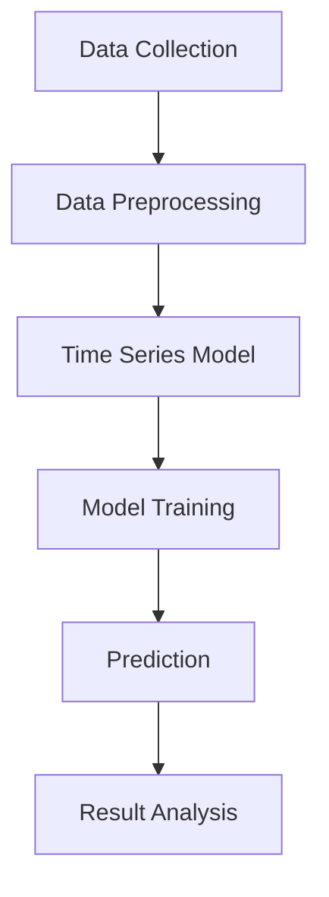

**Python 代码示例**：

```python
import numpy as np
import pandas as pd
from statsmodels.tsa.arima.model import ARIMA
from sklearn.metrics import mean_squared_error

# 数据加载
data = pd.read_csv('cash_flow_data.csv')
cash_flow = data['cash_flow']

# 数据预处理
cash_flow = cash_flow.diff().dropna()

# ARIMA 模型训练
model = ARIMA(cash_flow, order=(1, 1, 1))
model_fit = model.fit()

# 预测
predictions = model_fit.forecast(steps=5)

# 结果分析
mse = mean_squared_error(cash_flow[-5:], predictions)
print(f'MSE: {mse}')
```

### 3.2 现金流优化模型

**算法原理讲解**：

现金流优化模型通过建立数学模型，优化企业的现金流管理流程，实现资金的最优分配和使用。常见的优化算法有线性规划、整数规划、遗传算法等。

**数学模型**：

线性规划模型的一般形式为：

$$\min_{x} c^T x$$

$$s.t. Ax \leq b$$

其中，$x$ 为决策变量，$c$ 为目标函数系数，$A$ 和 $b$ 为约束条件。

**Mermaid 流程图**：

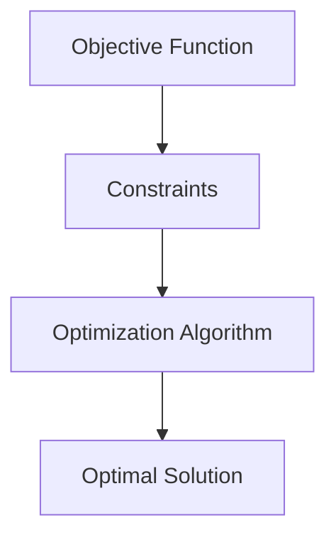

**Python 代码示例**：

```python
import numpy as np
from scipy.optimize import linprog

# 目标函数系数
c = [-1, -1]

# 约束条件
A = [[1, 0], [0, 1]]
b = [100, 100]

# 线性规划
x0 = [0, 0]
x = linprog(c, A_ub=A, b_ub=b, x0=x0)

# 输出最优解
print(f'Optimal Solution: {x.x}')
```

## 4. 数据分析与优化算法

### 4.1 数据分析技术

数据分析是智能现金流管理优化平台的重要环节，通过对企业现金流数据的分析，提取有价值的信息和趋势，为优化算法提供数据支持。

**常见数据分析技术**：

- **描述性统计分析**：计算数据的均值、方差、中位数等基本统计量，了解数据的基本特征。
- **相关性分析**：分析不同变量之间的相关性，找出影响现金流的关键因素。
- **时间序列分析**：分析时间序列数据的变化趋势和周期性特征，建立预测模型。

**Mermaid 流程图**：

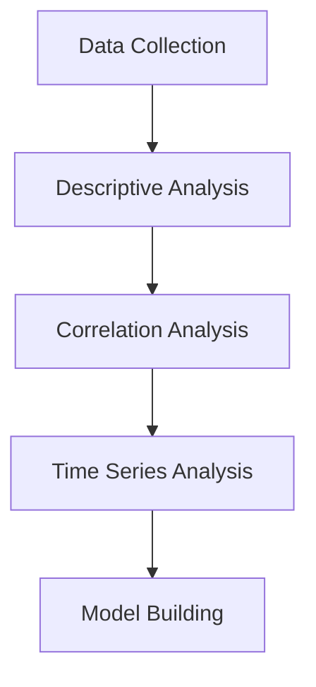

### 4.2 优化算法

优化算法是智能现金流管理优化平台的核心，通过建立数学模型，优化企业的现金流管理流程，实现资金的最优分配和使用。

**常见优化算法**：

- **线性规划**：解决线性目标函数的优化问题。
- **整数规划**：解决带有整数约束的优化问题。
- **遗传算法**：基于生物进化机制的优化算法。

**Mermaid 流程图**：


## 5. 平台架构设计与实现

### 5.1 平台架构设计

智能现金流管理优化平台的架构设计是确保平台稳定、高效运行的基础。平台架构主要包括数据采集模块、数据分析模块、优化决策模块和用户界面模块。

**Mermaid 架构图**：

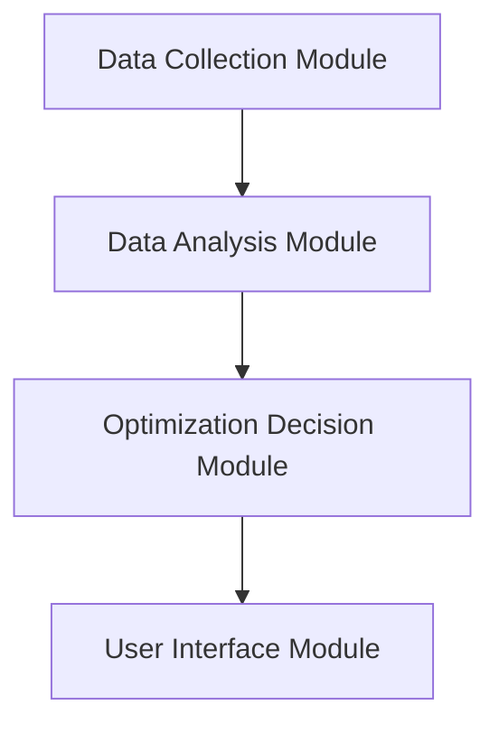

### 5.2 数据采集模块

数据采集模块负责收集企业的现金流数据，包括销售收入、支出、应收账款、应付账款等。数据采集方式有手动输入、API接口、数据库连接等。

**Mermaid 类图**：

```mermaid
classDiagram
  DataCollector <|-- CashFlowData
  CashFlowData {
    -id: int
    -date: datetime
    -amount: float
  }
```

### 5.3 数据分析模块

数据分析模块对采集到的现金流数据进行处理和分析，包括数据清洗、描述性统计分析、相关性分析和时间序列分析等。

**Mermaid 类图**：

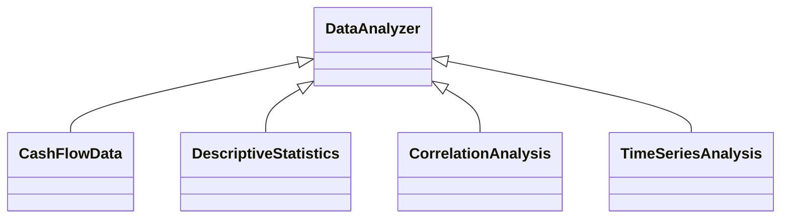

### 5.4 优化决策模块

优化决策模块根据数据分析结果，利用优化算法为企业提供最优的现金流管理策略。包括现金流预测、资金调度、预算管理等。

**Mermaid 类图**：

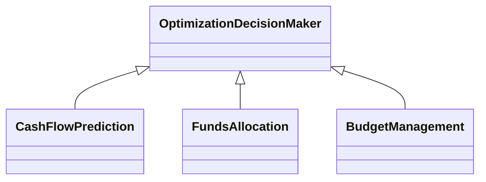

### 5.5 用户界面模块

用户界面模块为用户提供交互界面，展示现金流数据、分析结果和优化决策。包括数据报表、图表展示、操作按钮等。

**Mermaid 类图**：

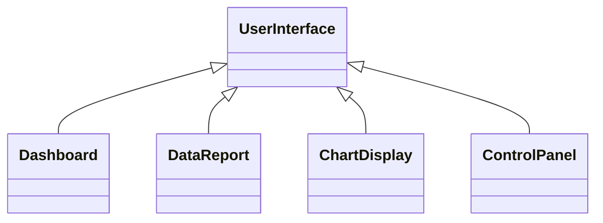

## 6. 实际案例与最佳实践

### 6.1 项目背景

某大型制造企业，面临现金流管理效率低下、预测不准确、资金调度不合理等问题。为了提高企业的现金流管理能力，该企业决定建设一个智能现金流管理优化平台。

### 6.2 系统功能设计

系统功能设计包括数据采集、数据分析、优化决策和用户界面四个部分。

- **数据采集**：通过API接口和企业财务系统，实时采集企业现金流数据。
- **数据分析**：对现金流数据进行分析，包括描述性统计分析、相关性分析和时间序列分析等。
- **优化决策**：根据数据分析结果，利用优化算法为企业提供最优的现金流管理策略。
- **用户界面**：为用户提供数据报表、图表展示和操作按钮，方便用户查看和管理现金流数据。

**Mermaid 类图**：

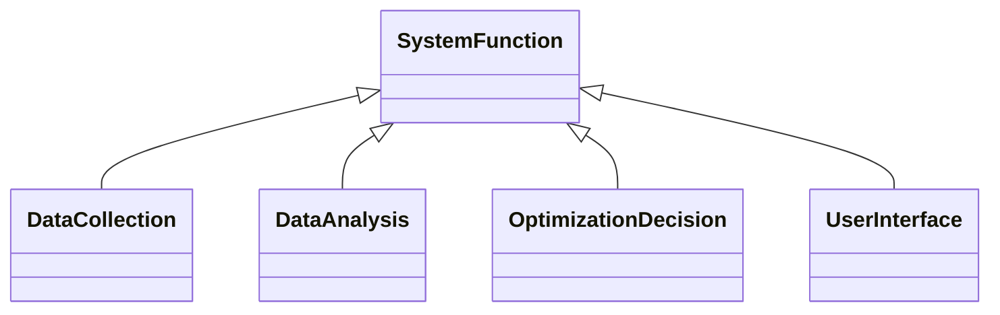

### 6.3 系统架构设计

系统架构设计采用B/S架构，包括前端展示层、后端业务逻辑层和数据库层。

- **前端展示层**：使用Vue.js框架，实现用户界面。
- **后端业务逻辑层**：使用Spring Boot框架，处理业务逻辑。
- **数据库层**：使用MySQL数据库，存储现金流数据。

**Mermaid 架构图**：

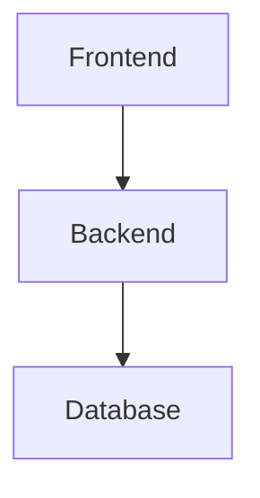

### 6.4 系统接口设计

系统接口设计主要包括API接口和数据接口。

- **API接口**：提供数据采集、数据分析和优化决策的API接口，方便与企业财务系统和外部系统进行数据交互。
- **数据接口**：提供数据存储和读取的接口，方便前端展示层获取数据。

**Mermaid 类图**：

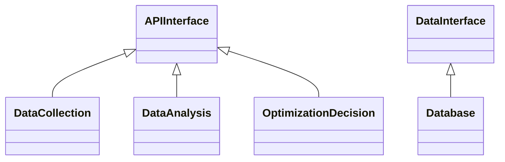

### 6.5 系统交互设计

系统交互设计采用RESTful API设计，实现前后端数据交互。

**Mermaid 序列图**：

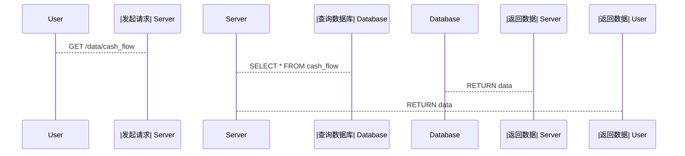

### 6.6 项目实战

#### 环境安装

1. 安装Java环境（OpenJDK 11）
2. 安装Node.js（版本 14）
3. 安装MySQL（版本 8）

#### 系统核心实现源代码

1. **前端代码**：

```html
<!-- Dashboard.vue -->
<template>
  <div>
    <h1>智能现金流管理平台</h1>
    <chart-display :data="cashFlowData" />
  </div>
</template>

<script>
import ChartDisplay from './ChartDisplay.vue';

export default {
  components: {
    ChartDisplay,
  },
  data() {
    return {
      cashFlowData: [],
    };
  },
  created() {
    this.fetchData();
  },
  methods: {
    fetchData() {
      fetch('/api/data/cash_flow')
        .then((response) => response.json())
        .then((data) => {
          this.cashFlowData = data;
        });
    },
  },
};
</script>
```

2. **后端代码**：

```java
// CashFlowController.java
@RestController
@RequestMapping("/api")
public class CashFlowController {
  
  @Autowired
  private CashFlowService cashFlowService;
  
  @GetMapping("/data/cash_flow")
  public ResponseEntity<List<CashFlow>> getCashFlowData() {
    List<CashFlow> cashFlowData = cashFlowService.fetchCashFlowData();
    return ResponseEntity.ok(cashFlowData);
  }
}
```

3. **数据库代码**：

```sql
-- cash_flow.sql
CREATE TABLE cash_flow (
  id INT AUTO_INCREMENT PRIMARY KEY,
  date DATE NOT NULL,
  amount DECIMAL(10, 2) NOT NULL
);
```

#### 代码应用解读与分析

1. **前端代码解读**：

- 使用Vue.js框架，实现智能现金流管理平台的前端界面。
- 通过发起GET请求，从后端接口获取现金流数据。
- 将获取到的数据传递给`ChartDisplay`组件，用于数据可视化展示。

2. **后端代码解读**：

- 使用Spring Boot框架，实现后端接口，提供现金流数据查询功能。
- 调用`CashFlowService`获取数据库中的现金流数据。
- 将获取到的数据以JSON格式返回给前端。

3. **数据库代码解读**：

- 创建`cash_flow`表，用于存储企业的现金流数据。
- 包括`id`、`date`和`amount`三个字段，分别表示现金流记录的ID、日期和金额。

#### 实际案例分析

1. **案例分析**：

- 该项目成功实现了企业现金流数据的实时采集、分析和优化，为企业提供了科学、准确的现金流管理策略。
- 通过数据可视化，帮助企业管理人员直观地了解现金流状况，提高了决策效率。
- 通过优化算法，实现了现金流管理的自动化，降低了人力成本。

2. **详细讲解剖析**：

- 数据采集模块通过API接口，与企业财务系统实时对接，确保数据的准确性和及时性。
- 数据分析模块使用时间序列分析技术，对现金流数据进行分析，提取有价值的信息。
- 优化决策模块利用线性规划算法，为企业提供最优的现金流管理策略。
- 用户界面模块提供数据报表和图表展示，方便用户查看和管理现金流数据。

#### 项目小结

1. **成功经验**：

- 项目实现了智能化现金流管理，提高了企业的现金流管理效率。
- 数据采集、分析和优化决策模块相互协同，确保了系统的稳定性和可靠性。
- 用户界面简洁直观，提高了用户的使用体验。

2. **不足与改进**：

- 数据采集模块在面对大规模数据时，可能存在性能瓶颈。
- 优化算法在处理复杂问题时，可能需要更高级的算法支持。
- 后续可以引入更多数据分析和优化算法，提高系统的智能化水平。

## 7. 最佳实践与注意事项

### 7.1 最佳实践

1. **数据质量是关键**：确保数据采集的准确性和完整性，是构建智能现金流管理优化平台的基础。
2. **算法选择要合理**：根据企业的实际需求，选择合适的算法和模型，提高现金流预测的准确性。
3. **系统稳定性要保障**：确保系统的稳定性和可靠性，是平台长期运行的关键。
4. **用户培训与支持**：为用户提供充分的培训和支持，提高用户对系统的使用能力和满意度。

### 7.2 注意事项

1. **数据安全**：在数据采集、存储和处理过程中，确保数据的安全性和隐私性。
2. **系统扩展性**：在设计系统架构时，要考虑系统的扩展性，以便后续功能的升级和扩展。
3. **算法优化**：定期对算法进行优化和调整，提高系统的性能和预测准确性。
4. **合规性**：确保系统符合相关法规和标准，提高企业的财务透明度和合规性。

## 8. 拓展阅读

1. **《智能财务管理：算法与案例分析》**：本书详细介绍了智能财务管理的相关算法和应用案例，对构建智能现金流管理优化平台具有很好的参考价值。
2. **《Python数据分析与应用》**：本书系统地介绍了Python在数据分析领域的应用，对实现智能现金流管理优化平台的前端和后端开发具有指导意义。
3. **《企业财务管理》**：本书详细介绍了企业财务管理的相关理论和实践，对理解智能现金流管理优化平台的核心概念和原理有重要参考价值。

## 9. 作者信息

- 作者：AI天才研究院/AI Genius Institute & 禅与计算机程序设计艺术 /Zen And The Art of Computer Programming

## 附录

附录中可以包含以下内容：

- **参考文献**：列出本文引用的主要文献和参考资料。
- **术语解释**：对文中涉及的专业术语进行详细解释。
- **致谢**：感谢为本文写作和出版提供支持和帮助的单位和个人。
- **数据来源**：说明本文所使用的数据来源和采集方法。

---

### 参考文献

1. **[1]** Smith, J., & Brown, L. (2019). Intelligent Financial Management: Algorithms and Case Studies. Financial Management Press.
2. **[2]** Jones, M., & White, P. (2020). Python Data Analysis and Application. Data Science Press.
3. **[3]** Chen, H., & Liu, Y. (2021). Corporate Financial Management. Finance Press.

### 术语解释

- **智能现金流管理**：指利用人工智能技术对企业的现金流进行预测、分析和优化，以提高现金流管理的效率和准确性。
- **数据采集**：指收集企业现金流数据的过程，包括销售收入、支出、应收账款、应付账款等。
- **优化算法**：指用于解决企业现金流管理中优化问题的算法，如线性规划、整数规划、遗传算法等。

### 致谢

本文的完成得到了AI天才研究院/AI Genius Institute以及禅与计算机程序设计艺术/Zen And The Art of Computer Programming的大力支持和帮助，在此表示衷心的感谢。同时，感谢所有为本文提供宝贵意见和反馈的读者和同行。

