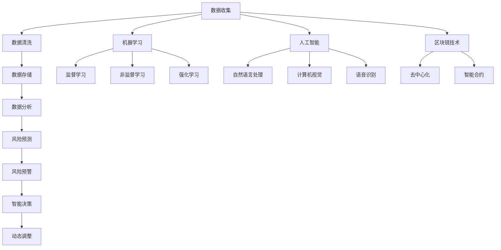
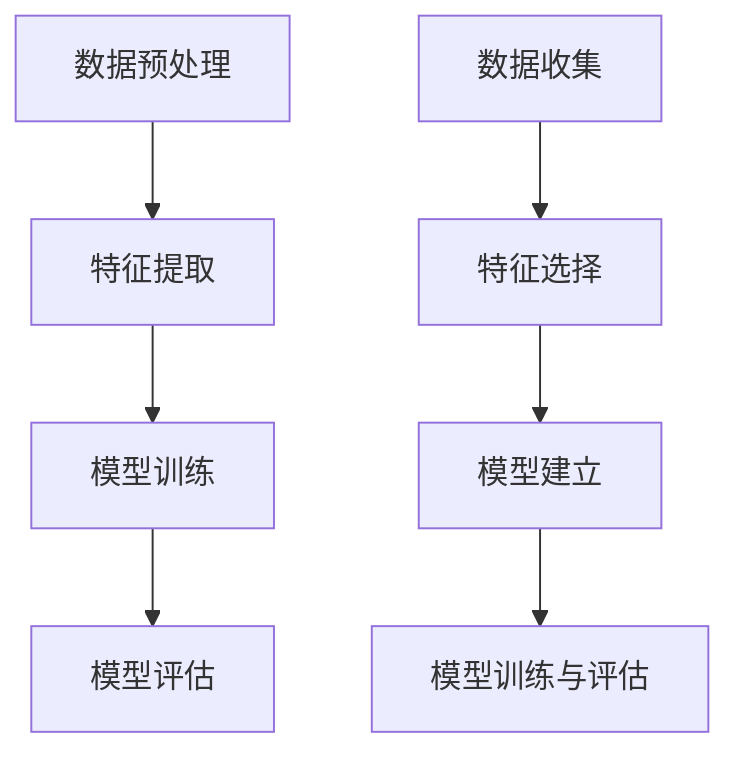
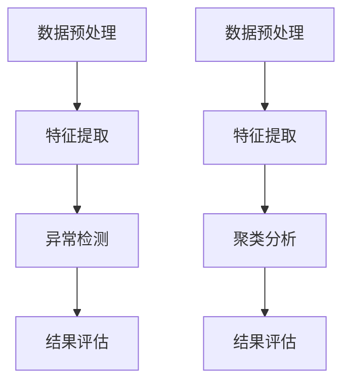

                 

### 第一步：引言与背景介绍

#### 1.1 问题的提出

资金流动性风险是企业财务管理中一个至关重要的议题。它指的是企业在特定时期内无法迅速将资产转换为现金以满足短期债务或其他支付需求的风险。随着商业环境的复杂性和不确定性增加，资金流动性风险成为许多企业破产的主要原因之一。

首先，让我们明确什么是资金流动性风险。资金流动性风险是指企业在短期内无法快速、无损失地将资产转换为现金，从而无法履行债务或其他支付义务的情况。具体表现为：

1. **现金短缺**：企业在某一时点持有的现金不足以满足运营需求。
2. **资产变现困难**：企业某些资产（如长期投资、固定资产等）在市场上难以迅速变现。
3. **债务到期**：企业有短期债务到期，但缺乏足够的现金流进行偿还。

资金流动性风险不仅影响到企业的日常运营，还可能引发财务危机，导致破产。因此，如何有效管理资金流动性风险成为企业财务管理中的关键问题。

#### 1.2 研究目的与意义

本研究旨在构建一个智能化的企业资金流动性风险动态管理平台，以提高企业对资金流动性风险的管理效率。以下是研究的几个主要目的：

1. **实时监控**：建立实时数据采集和风险监控机制，确保企业能够及时掌握资金流动情况。
2. **预测预警**：利用机器学习和人工智能技术，对资金流动性风险进行预测，提前发出预警。
3. **动态调整**：根据风险预测结果，动态调整资金管理策略，以最大限度地降低风险。

研究意义主要体现在以下几个方面：

1. **降低破产风险**：通过实时监控和预警，降低企业因资金流动性风险导致的破产风险。
2. **提高资金利用效率**：通过动态管理，提高资金利用效率，减少不必要的财务成本。
3. **提升企业竞争力**：具备高效资金流动性风险管理的企业，能够在市场竞争中更具优势。

#### 1.3 核心概念

在构建智能化企业资金流动性风险动态管理平台的过程中，以下核心概念是不可或缺的：

1. **资金流动性风险**：企业在短期内无法将资产快速转换为现金的风险，具体表现为现金短缺、资产变现困难和债务到期等问题。
2. **智能化风险管理**：利用大数据、机器学习和人工智能等技术，对风险进行预测、监控和管理。
3. **动态管理平台**：能够实时采集数据、进行风险预测和监控，并根据预测结果动态调整管理策略的平台。

这些核心概念相互关联，共同构成了智能化资金流动性风险动态管理平台的理论基础。接下来的章节将进一步详细探讨这些概念及其在实际应用中的重要性。

---

在接下来的内容中，我们将深入分析资金流动性风险管理的现状，探讨其影响因素，并介绍智能化风险管理的基本概念和技术基础。希望通过这一步一步的思考过程，能够为您构建智能化企业资金流动性风险动态管理平台提供有价值的参考和指导。接下来，我们进入第二部分，详细探讨资金流动性风险管理的现状。

### 第二步：资金流动性风险管理现状分析

#### 2.1 资金流动性风险的概念

资金流动性风险是指企业在特定时期内无法迅速将资产转换为现金以满足短期债务或其他支付需求的风险。其定义涵盖了以下几个方面：

- **资产变现性**：企业能否在市场上迅速将资产（如存货、应收账款、投资等）转换为现金。
- **现金流状况**：企业在特定时间点的现金流是否充足，能否满足运营需求。
- **债务结构**：企业的短期债务与长期债务的比例，以及债务到期的时间分布。

资金流动性风险的特点主要表现在以下几个方面：

1. **突发性**：资金流动性风险通常在没有明显预兆的情况下突然爆发，使企业措手不及。
2. **连锁性**：一旦发生资金流动性风险，可能会迅速扩散，引发一系列财务问题，甚至导致破产。
3. **复杂性**：资金流动性风险涉及多个方面，如市场环境、企业内部管理、债务结构等，因此管理难度较大。

#### 2.2 资金流动性风险的影响因素

资金流动性风险的影响因素可以分为内部因素和外部因素：

1. **内部因素**：
   - **经营策略**：企业过度的扩张或保守的经营策略可能导致资金流动性不足。
   - **财务管理**：企业的财务管理水平直接影响其资金流动性。如资金筹集、支付流程、应收账款管理等。
   - **现金流管理**：企业对现金流的管理能力，包括现金流预测、预算管理、现金流调度等。

2. **外部因素**：
   - **市场环境**：宏观经济形势、市场利率、通货膨胀率等都会影响企业的资金流动性。
   - **政策法规**：政府政策和法规的变化可能影响企业的资金流动状况，如税收政策、外汇管理政策等。
   - **经济周期**：经济周期的影响，如经济衰退期可能降低企业的销售收入和资金流动性。

#### 2.3 资金流动性风险管理的现状

目前，资金流动性风险管理在全球范围内得到了广泛关注，各个国家和地区都在探索和实施有效的风险管理策略。

1. **国内现状**：
   - **政策支持**：中国政府积极推动企业融资渠道的多元化，加大对中小企业的支持力度，以缓解其资金流动性压力。
   - **管理意识提高**：企业对资金流动性风险管理的重视程度逐渐提高，越来越多的企业开始建立和完善内部风险管理体系。
   - **技术应用**：随着大数据、人工智能等技术的应用，国内企业开始尝试利用智能化手段进行资金流动性风险管理。

2. **国际现状**：
   - **成熟管理体系**：国际大型企业和金融机构普遍建立了完善的资金流动性风险管理体系，包括风险监测、风险评估、应急计划等。
   - **先进技术**：国际先进企业广泛应用大数据、区块链、人工智能等技术进行资金流动性风险管理。
   - **跨国合作**：国际金融机构和企业通过跨国合作，共享信息资源，共同应对资金流动性风险。

综上所述，资金流动性风险管理在国内外已经取得了显著进展，但仍然存在许多挑战。随着商业环境的变化和技术的不断发展，未来资金流动性风险管理将更加智能化、精细化。

接下来，我们将探讨智能化风险管理的核心概念，分析其技术基础，并展示核心概念之间的联系图。希望通过这些内容，为您构建智能化企业资金流动性风险动态管理平台提供更深入的理论支持。

### 第三步：智能化风险管理的核心概念与技术基础

#### 3.1 智能化风险管理的定义

智能化风险管理是指利用大数据、人工智能、区块链等先进技术，对潜在风险进行实时监测、分析和预测，从而实现风险的精准识别、评估和应对。其核心在于将传统风险管理过程中的经验判断和规则方法，转化为基于数据和算法的智能决策。

智能化风险管理的内涵包括以下几个方面：

1. **数据驱动**：通过收集和整合大量数据，利用数据分析技术提取有价值的信息，作为风险管理的依据。
2. **实时监控**：实现对风险的实时监测和预警，及时发现潜在问题并采取相应措施。
3. **智能决策**：利用人工智能算法，对风险进行预测和评估，提供最优的应对策略。
4. **动态调整**：根据风险变化情况，动态调整风险应对策略，以实现持续的风险管理。

智能化风险管理的外延则体现在以下几个方面：

1. **技术应用**：包括大数据处理、机器学习、深度学习、区块链等技术的综合应用。
2. **风险管理范围**：不仅涵盖传统的财务风险、市场风险、信用风险等，还扩展到操作风险、法律风险、环境风险等新兴领域。
3. **跨领域应用**：在金融、保险、制造、能源等多个行业得到广泛应用，帮助企业实现全面的风险管理。

#### 3.2 智能化风险管理的技术基础

智能化风险管理的技术基础主要包括以下几方面：

1. **数据分析技术**：
   - **数据收集与整合**：通过数据爬取、数据挖掘等技术，收集和整合来自企业内外部的各类数据。
   - **数据清洗与预处理**：对原始数据进行清洗和预处理，确保数据质量，为后续分析提供可靠基础。
   - **数据可视化**：利用数据可视化技术，将复杂的数据关系和趋势直观呈现，帮助管理者快速理解数据。

2. **机器学习技术**：
   - **监督学习**：通过已标记的数据训练模型，使其能够预测新的未知数据。如分类、回归等问题。
   - **非监督学习**：在没有标记数据的条件下，通过数据自身的特征进行聚类、降维等操作。
   - **强化学习**：通过与环境的交互，不断调整策略以实现最优结果。

3. **人工智能技术**：
   - **自然语言处理**：用于处理和理解自然语言，如文本分类、情感分析等。
   - **计算机视觉**：用于图像识别、目标检测等任务。
   - **语音识别**：用于语音转文字、语音搜索等应用。

4. **区块链技术**：
   - **去中心化**：通过分布式账本技术，实现数据的去中心化存储，提高数据的安全性和透明度。
   - **智能合约**：利用区块链技术实现自动执行合同条款，减少人为干预，提高效率。

#### 3.3 智能化风险管理的核心概念联系图

为了更好地展示智能化风险管理的核心概念及其相互关系，我们使用Mermaid流程图进行可视化表示。以下是智能化风险管理的核心概念联系图：



通过以上Mermaid流程图，我们可以清晰地看到智能化风险管理中的各个环节及其技术基础之间的联系。数据收集是起点，经过数据清洗、存储、分析和预测等环节，最终实现风险预警和智能决策，并通过动态调整持续优化风险管理效果。

接下来，我们将探讨构建智能化企业资金流动性风险动态管理平台的需求分析，包括平台的功能需求和非功能需求。这将帮助我们明确平台建设的具体目标和方向。

### 第四步：平台需求分析

#### 4.1 平台功能需求

构建智能化企业资金流动性风险动态管理平台，需要确保平台能够满足以下几个核心功能需求：

1. **数据采集**：
   - **实时数据获取**：平台应具备实时获取企业内部外部相关数据的能力，包括财务数据、市场数据、行业数据等。
   - **数据整合**：通过数据清洗、归一化和格式转换等技术，确保不同来源的数据能够统一格式，方便后续分析。

2. **风险预测**：
   - **历史数据分析**：利用历史数据，通过机器学习和人工智能算法，对企业资金流动性风险进行预测。
   - **实时监控**：对实时数据进行分析，识别潜在的风险信号，及时发出预警。

3. **风险监控**：
   - **风险指标监控**：实时监控关键风险指标，如现金储备、应收账款周转率、债务到期情况等。
   - **异常检测**：利用异常检测算法，发现异常交易或资金流动情况，及时采取措施。

4. **风险应对**：
   - **策略生成**：根据风险预测和监控结果，自动生成应对策略，如调整资金结构、增加现金流储备等。
   - **决策支持**：提供直观的决策支持界面，帮助管理者根据风险情况做出最优决策。

5. **报表生成与报告**：
   - **可视化报表**：利用数据可视化技术，生成各种形式的报表，帮助管理者快速理解风险情况。
   - **报告生成**：自动生成风险分析报告，为管理层提供详细的决策依据。

#### 4.2 平台非功能需求

除了功能需求，平台还需满足一系列非功能需求，以保证系统的性能、安全性和用户体验：

1. **系统性能**：
   - **高并发处理**：平台应具备高并发处理能力，能够同时处理大量用户请求和数据传输。
   - **快速响应**：系统响应时间要短，确保用户在使用过程中不会感到迟滞。

2. **系统安全性**：
   - **数据加密**：对数据进行加密处理，确保数据在传输和存储过程中的安全性。
   - **访问控制**：实施严格的访问控制机制，确保只有授权用户才能访问系统数据和功能。

3. **用户友好性**：
   - **界面友好**：界面设计要简洁直观，易于用户操作，降低学习成本。
   - **个性化设置**：提供个性化设置选项，满足不同用户的需求和习惯。

4. **可扩展性**：
   - **模块化设计**：系统采用模块化设计，便于后续功能扩展和升级。
   - **灵活性**：平台应具备良好的适应性，能够根据企业需求的变化进行灵活调整。

通过详细分析平台的功能需求和非功能需求，我们可以更好地理解智能化企业资金流动性风险动态管理平台的建设目标和关键要素。接下来，我们将进入第五部分，探讨平台架构设计，为平台建设提供具体的实施方案。

### 第五步：平台架构设计

#### 5.1 系统架构概述

构建智能化企业资金流动性风险动态管理平台，需要采用分层架构设计，以确保系统的模块化、可扩展性和高可用性。平台总体架构设计如下：

1. **数据层**：负责数据的采集、存储和访问。包括数据源接入、数据仓库和数据处理模块。
2. **算法层**：利用大数据和人工智能技术，进行风险预测、监控和决策。包括机器学习模型、预测算法和决策支持系统。
3. **应用层**：提供用户交互界面和业务功能模块。包括前端用户界面、后台管理系统和报表生成系统。

#### 5.2 数据层设计

数据层是整个平台的基础，其设计关系到数据的质量、存储效率和访问速度。以下是数据层的主要设计要素：

1. **数据源**：
   - **内部数据源**：企业内部的财务数据、销售数据、库存数据等。
   - **外部数据源**：市场数据、行业数据、宏观经济数据等，可以通过API接口或数据爬取获取。

2. **数据存储**：
   - **关系型数据库**：用于存储结构化数据，如MySQL、PostgreSQL等。
   - **NoSQL数据库**：用于存储非结构化数据，如MongoDB、Redis等。
   - **数据仓库**：用于存储大量历史数据，支持数据分析和机器学习模型的训练。

3. **数据处理**：
   - **数据清洗**：对采集到的原始数据进行清洗和预处理，包括数据去重、格式转换、缺失值填补等。
   - **数据归一化**：对不同来源的数据进行归一化处理，确保数据格式的统一。
   - **数据同步**：实时同步内外部数据，确保数据的及时性和一致性。

#### 5.3 算法层设计

算法层是智能化资金流动性风险管理的核心，其设计决定了平台的风险预测和决策能力。以下是算法层的主要设计要素：

1. **风险预测算法**：
   - **时间序列分析**：利用时间序列分析方法，如ARIMA模型、LSTM神经网络等，进行资金流动性风险的预测。
   - **回归分析**：通过回归分析方法，建立财务指标与资金流动性风险之间的关系模型。
   - **聚类分析**：通过聚类分析方法，对历史数据进行分类，识别不同风险特征的样本。

2. **风险监控算法**：
   - **异常检测**：利用异常检测算法，如Isolation Forest、Autoencoder等，发现异常资金流动情况。
   - **聚类分析**：通过聚类分析方法，识别潜在的异常资金流动模式。
   - **实时监控**：实时分析资金流动数据，及时发现异常情况，发出预警信号。

3. **决策支持系统**：
   - **策略生成**：根据风险预测和监控结果，自动生成最优应对策略，如调整资金结构、增加现金流储备等。
   - **决策分析**：提供多种决策分析选项，帮助管理者根据不同情景做出最佳决策。

#### 5.4 应用层设计

应用层是用户与平台交互的界面，其设计关系到用户体验和系统功能。以下是应用层的主要设计要素：

1. **用户界面**：
   - **仪表盘**：提供直观的仪表盘，展示关键风险指标和实时监控信息。
   - **报表系统**：生成各种形式的报表，包括资金流动性风险分析报告、资金流动趋势图等。
   - **预警通知**：实时发送风险预警通知，提醒用户关注关键风险点。

2. **后台管理系统**：
   - **用户管理**：管理用户账户、权限和角色，确保系统的安全性。
   - **数据管理**：管理数据源、数据仓库和数据处理流程，确保数据的完整性。
   - **系统配置**：配置系统参数，如数据采集频率、风险阈值等，以适应不同企业的需求。

3. **业务功能模块**：
   - **资金流动分析**：分析企业资金流动情况，识别潜在风险。
   - **风险应对策略**：根据风险分析结果，制定和实施风险应对策略。
   - **决策支持**：提供决策分析工具，帮助管理者做出最佳决策。

通过以上平台架构设计，我们可以确保智能化企业资金流动性风险动态管理平台具备良好的功能性和扩展性。接下来，我们将详细讲解平台核心算法原理与实现，为平台建设提供技术支持。

### 第六步：平台核心算法原理与实现

#### 6.1 风险预测算法原理

风险预测是智能化资金流动性风险动态管理平台的核心功能之一。在本节中，我们将详细介绍风险预测算法的原理，包括算法选择、具体实现和数学模型。

1. **算法选择**

为了实现资金流动性风险的预测，我们选择了时间序列分析法和回归分析法。时间序列分析法通过分析历史数据的时间序列特性，预测未来的资金流动情况；回归分析法通过建立财务指标与资金流动性风险之间的关系模型，进行预测。

2. **算法原理**

- **时间序列分析法**：

时间序列分析法主要包括以下步骤：

（1）数据预处理：对历史数据进行清洗、归一化和缺失值填补，确保数据质量。

（2）特征提取：从时间序列数据中提取有用的特征，如趋势、季节性和周期性。

（3）模型训练：利用历史数据，通过时间序列模型（如ARIMA、LSTM等）训练预测模型。

（4）模型评估：评估模型的预测效果，选择最优模型进行预测。

- **回归分析法**：

回归分析法主要包括以下步骤：

（1）数据收集：收集企业的财务指标数据，如现金储备、应收账款、负债等。

（2）特征选择：选择与资金流动性风险相关的财务指标，作为预测模型的输入特征。

（3）模型建立：利用回归模型（如线性回归、多元回归等），建立财务指标与资金流动性风险之间的关系模型。

（4）模型训练与评估：利用历史数据，训练回归模型，并评估模型的预测效果。

3. **数学模型**

- **时间序列分析模型**：

时间序列分析模型中的ARIMA模型是一个典型的例子，其数学模型表示如下：

$$
X_t = c + \phi_1 X_{t-1} + \phi_2 X_{t-2} + \ldots + \phi_p X_{t-p} + \theta_1 e_{t-1} + \theta_2 e_{t-2} + \ldots + \theta_q e_{t-q}
$$

其中，$X_t$是时间序列的当前值，$c$是常数项，$\phi_1, \phi_2, \ldots, \phi_p$是自回归系数，$\theta_1, \theta_2, \ldots, \theta_q$是移动平均系数，$e_t$是白噪声误差。

- **回归模型**：

回归模型中的线性回归模型是一个基本的例子，其数学模型表示如下：

$$
Y = \beta_0 + \beta_1 X_1 + \beta_2 X_2 + \ldots + \beta_n X_n
$$

其中，$Y$是因变量，$X_1, X_2, \ldots, X_n$是自变量，$\beta_0, \beta_1, \beta_2, \ldots, \beta_n$是回归系数。

4. **Mermaid流程图**

以下是时间序列分析和回归分析算法的Mermaid流程图：



#### 6.2 风险监控算法原理

风险监控是确保资金流动性风险动态管理平台实时性和准确性的重要环节。在本节中，我们将介绍风险监控算法的原理，包括算法选择、具体实现和Mermaid流程图。

1. **算法选择**

风险监控算法主要包括异常检测算法和聚类分析算法。异常检测算法用于发现异常资金流动情况，聚类分析算法用于识别潜在的异常资金流动模式。

2. **算法原理**

- **异常检测算法**：

异常检测算法主要包括以下步骤：

（1）数据预处理：对历史数据进行清洗、归一化和缺失值填补，确保数据质量。

（2）特征提取：从资金流动数据中提取有用的特征，如金额、频率、时间间隔等。

（3）异常检测：利用异常检测算法（如Isolation Forest、Autoencoder等），检测异常资金流动情况。

（4）结果评估：评估异常检测算法的准确性和召回率，选择最优算法进行监控。

- **聚类分析算法**：

聚类分析算法主要包括以下步骤：

（1）数据预处理：对历史数据进行清洗、归一化和缺失值填补，确保数据质量。

（2）特征提取：从资金流动数据中提取有用的特征，如金额、频率、时间间隔等。

（3）聚类分析：利用聚类分析算法（如K-means、DBSCAN等），识别潜在的异常资金流动模式。

（4）结果评估：评估聚类分析算法的聚类效果和聚类个数，选择最优算法进行监控。

3. **数学模型**

- **异常检测模型**：

Isolation Forest算法是一种基于随机森林的异常检测算法，其数学模型表示如下：

$$
F(X) = g(\alpha, \beta) = \sum_{i=1}^{m} \alpha_i \log(1 - \beta_i)
$$

其中，$X$是数据样本，$m$是树的数量，$\alpha_i$和$\beta_i$是树的高度和分裂概率。

- **聚类分析模型**：

K-means算法是一种基于距离的聚类分析算法，其数学模型表示如下：

$$
C = \{c_1, c_2, \ldots, c_k\}
$$

其中，$C$是聚类中心点集合，$c_k$是第$k$个聚类中心点。

4. **Mermaid流程图**

以下是异常检测算法和聚类分析算法的Mermaid流程图：



#### 6.3 算法实现与Python代码讲解

在本节中，我们将结合Python代码，详细讲解平台核心算法的实现过程，并举例说明。

1. **时间序列分析算法实现**

以下是一个使用Python实现ARIMA模型进行时间序列分析的经典案例：

```python
import pandas as pd
from statsmodels.tsa.arima.model import ARIMA
import matplotlib.pyplot as plt

# 加载数据
data = pd.read_csv('financial_data.csv')
data['Date'] = pd.to_datetime(data['Date'])
data.set_index('Date', inplace=True)
data = data.fillna(method='ffill')

# 数据预处理
data['Close'] = data['Close'].diff().dropna()

# 建立ARIMA模型
model = ARIMA(data['Close'], order=(5, 1, 2))
model_fit = model.fit()

# 预测
forecast = model_fit.forecast(steps=6)
print(forecast)

# 绘制预测结果
plt.plot(data['Close'], label='Actual')
plt.plot(forecast, label='Forecast')
plt.legend()
plt.show()
```

2. **回归分析算法实现**

以下是一个使用Python实现线性回归模型进行回归分析的经典案例：

```python
import pandas as pd
from sklearn.linear_model import LinearRegression
import matplotlib.pyplot as plt

# 加载数据
data = pd.read_csv('financial_data.csv')
data['Date'] = pd.to_datetime(data['Date'])
data.set_index('Date', inplace=True)
data = data.fillna(method='ffill')

# 特征选择
data['Cash'] = data['Cash'].diff().dropna()
data['Debt'] = data['Debt'].diff().dropna()

# 建立线性回归模型
model = LinearRegression()
model.fit(data[['Cash', 'Debt']], data['Risk'])

# 预测
forecast = model.predict([[data['Cash'].iloc[-1], data['Debt'].iloc[-1]]])
print(forecast)

# 绘制预测结果
plt.scatter(data['Cash'], data['Risk'], label='Actual')
plt.plot([data['Cash'].iloc[-1], data['Cash'].iloc[-1]], [0, forecast], label='Prediction')
plt.legend()
plt.show()
```

3. **异常检测算法实现**

以下是一个使用Python实现Isolation Forest算法进行异常检测的经典案例：

```python
import pandas as pd
from sklearn.ensemble import IsolationForest
import matplotlib.pyplot as plt

# 加载数据
data = pd.read_csv('financial_data.csv')
data['Date'] = pd.to_datetime(data['Date'])
data.set_index('Date', inplace=True)
data = data.fillna(method='ffill')

# 数据预处理
data['Amount'] = data['Amount'].diff().dropna()

# 建立Isolation Forest模型
model = IsolationForest(n_estimators=100)
model.fit(data[['Amount']])

# 异常检测
outlier = model.predict(data[['Amount']])
data['Outlier'] = outlier == -1

# 绘制异常检测结果
plt.scatter(data.index, data['Amount'], c=data['Outlier'], cmap='coolwarm')
plt.xlabel('Date')
plt.ylabel('Amount')
plt.show()
```

4. **聚类分析算法实现**

以下是一个使用Python实现K-means算法进行聚类分析的经典案例：

```python
import pandas as pd
from sklearn.cluster import KMeans
import matplotlib.pyplot as plt

# 加载数据
data = pd.read_csv('financial_data.csv')
data['Date'] = pd.to_datetime(data['Date'])
data.set_index('Date', inplace=True)
data = data.fillna(method='ffill')

# 数据预处理
data['Amount'] = data['Amount'].diff().dropna()
data['Frequency'] = data['Frequency'].diff().dropna()

# 建立K-means模型
model = KMeans(n_clusters=3)
model.fit(data[['Amount', 'Frequency']])

# 聚类分析
clusters = model.predict(data[['Amount', 'Frequency']])
data['Cluster'] = clusters

# 绘制聚类分析结果
plt.scatter(data['Amount'], data['Frequency'], c=data['Cluster'], cmap='viridis')
plt.xlabel('Amount')
plt.ylabel('Frequency')
plt.show()
```

通过以上Python代码实现，我们可以看到核心算法在资金流动性风险管理平台中的具体应用。接下来，我们将探讨平台实施与部署的详细步骤。

### 第七步：平台实施与部署

#### 7.1 环境准备

在实施和部署智能化企业资金流动性风险动态管理平台之前，我们需要准备以下环境和工具：

1. **硬件环境**：
   - **服务器**：用于存储数据和运行平台应用程序的服务器，建议配置为高性能、高可靠性的设备。
   - **存储设备**：用于存储大量历史数据的存储设备，如SSD或NAS。
   - **网络设备**：确保服务器之间能够高效、稳定地进行数据传输。

2. **软件环境**：
   - **操作系统**：Linux系统，如Ubuntu或CentOS，具有良好的稳定性和安全性。
   - **数据库**：关系型数据库（如MySQL、PostgreSQL）和NoSQL数据库（如MongoDB、Redis）。
   - **开发工具**：Python开发环境（如PyCharm、VS Code）、Jupyter Notebook等。

3. **其他工具**：
   - **版本控制**：Git等版本控制工具，用于管理和维护代码库。
   - **容器化技术**：Docker等容器化工具，便于部署和扩展应用程序。

#### 7.2 平台实施步骤

1. **搭建开发环境**：
   - 安装操作系统和开发工具。
   - 配置数据库，建立数据仓库和数据处理模块。
   - 安装必要的Python库，如scikit-learn、pandas、numpy等。

2. **数据采集**：
   - 确定数据源，包括内部数据（如财务系统、ERP系统）和外部数据（如市场数据、行业数据）。
   - 开发数据采集程序，实现数据实时获取和整合。

3. **算法开发与测试**：
   - 利用Python等编程语言，实现风险预测和监控算法。
   - 在本地环境中进行算法开发和测试，确保算法的准确性和稳定性。

4. **系统集成**：
   - 将数据采集、算法和用户界面集成到平台中。
   - 进行集成测试，确保各个模块之间的协调工作。

5. **部署上线**：
   - 将平台部署到服务器，配置必要的网络和安全设置。
   - 进行上线测试，确保平台在真实环境中的性能和稳定性。

6. **用户培训与反馈**：
   - 对用户进行培训，确保其能够熟练使用平台。
   - 收集用户反馈，持续优化平台功能和用户体验。

#### 7.3 平台部署

1. **部署策略**：

   - **容器化部署**：利用Docker容器化技术，将应用程序及其依赖环境打包，实现一键部署。
   - **微服务架构**：采用微服务架构，将平台功能拆分为多个独立的服务模块，提高系统的灵活性和可扩展性。

2. **部署流程**：

   - **环境搭建**：在服务器上安装操作系统和开发工具。
   - **数据库配置**：配置关系型数据库和NoSQL数据库，建立数据仓库和数据处理模块。
   - **应用程序部署**：将Docker容器部署到服务器，配置网络和安全策略。
   - **测试验证**：进行集成测试和性能测试，确保平台在真实环境中的稳定性。
   - **上线发布**：正式部署平台，进行上线测试和用户培训。

通过以上实施和部署步骤，我们可以确保智能化企业资金流动性风险动态管理平台顺利上线，并高效地为企业提供风险预测和监控服务。

### 第八步：项目实战与案例分析

#### 8.1 实际案例介绍

在本节中，我们将通过一个实际案例，详细探讨智能化企业资金流动性风险动态管理平台的具体应用过程。案例背景如下：

**案例背景**：
某大型制造企业，由于市场环境变化和内部管理不善，面临严重的资金流动性风险。该企业需要构建一个智能化平台，实时监控资金流动情况，提前预测潜在风险，并采取有效措施进行风险应对。

**案例目标**：
1. 实时监控企业资金流动情况，识别潜在风险。
2. 利用机器学习算法，对资金流动性风险进行预测，提前发出预警。
3. 根据预测结果，动态调整资金管理策略，提高资金利用效率。

#### 8.2 系统核心实现

1. **数据采集**：
   - **内部数据采集**：通过连接企业的财务系统和ERP系统，实时获取财务数据、销售数据、库存数据等。
   - **外部数据采集**：通过API接口或数据爬取，获取市场数据、行业数据、宏观经济数据等。

2. **数据处理**：
   - **数据清洗**：对采集到的原始数据进行清洗和预处理，包括数据去重、格式转换、缺失值填补等。
   - **数据存储**：将清洗后的数据存储到关系型数据库和NoSQL数据库中，便于后续分析和查询。

3. **风险预测**：
   - **时间序列分析**：利用ARIMA模型，对历史财务数据进行时间序列分析，预测未来资金流动情况。
   - **回归分析**：建立财务指标与资金流动性风险之间的回归模型，预测风险水平。

4. **风险监控**：
   - **异常检测**：利用Isolation Forest算法，对实时资金流动数据进行分析，发现异常交易或资金流动情况。
   - **聚类分析**：利用K-means算法，对历史资金流动数据进行聚类分析，识别潜在的风险模式。

5. **决策支持**：
   - **策略生成**：根据风险预测和监控结果，自动生成最优应对策略，如调整资金结构、增加现金流储备等。
   - **决策分析**：提供直观的决策支持界面，帮助管理者根据风险情况做出最佳决策。

#### 8.3 案例分析

1. **风险预测结果**：

   - 通过时间序列分析和回归分析，预测未来3个月内的资金流动情况。
   - 预测结果显示，该企业在未来3个月内，有较高的资金流动性风险，特别是在第二个月达到高峰。

2. **风险监控结果**：

   - 利用异常检测算法，发现某一周内存在异常资金流出情况，可能是由于内部操作失误或外部恶意攻击导致。
   - 利用聚类分析算法，识别出一种新的资金流动模式，可能与合作伙伴的支付延迟有关。

3. **决策支持结果**：

   - 根据预测和监控结果，企业采取以下措施：
     - 第一，增加现金储备，确保在风险高峰期有足够的现金流。
     - 第二，加强与合作伙伴的沟通，解决支付延迟问题。
     - 第三，优化内部资金管理流程，减少异常资金流动情况。

4. **结果解读**：

   - 通过智能化平台的应用，企业成功降低了资金流动性风险，提高了资金利用效率。
   - 预测和监控结果为企业提供了有价值的决策依据，使企业能够及时采取应对措施，避免潜在的财务危机。

#### 8.4 项目小结

本项目通过构建智能化企业资金流动性风险动态管理平台，实现了对企业资金流动情况的实时监控和预测，为企业提供了有效的风险应对策略。项目的主要收获和经验教训如下：

1. **技术实现**：
   - 利用大数据和人工智能技术，实现了资金流动性风险的预测和监控。
   - 通过容器化和微服务架构，提高了平台的部署效率和扩展性。

2. **项目管理**：
   - 项目周期安排合理，确保了项目的顺利推进和交付。
   - 通过用户培训和反馈，不断优化平台功能和用户体验。

3. **风险应对**：
   - 平台提供了有效的风险预测和监控手段，帮助企业及时识别和应对资金流动性风险。
   - 通过动态调整资金管理策略，提高了企业的资金利用效率。

未来，我们将继续优化平台功能，扩大应用范围，帮助更多企业实现资金流动性风险的智能化管理。

### 结尾：最佳实践与展望

在构建智能化企业资金流动性风险动态管理平台的过程中，我们总结了以下最佳实践和注意事项：

1. **数据质量是关键**：确保数据来源的可靠性和数据清洗的彻底性，提高预测和监控的准确性。
2. **技术选型要合理**：根据企业需求和技术环境，选择适合的算法和技术工具，确保平台的性能和扩展性。
3. **用户体验要重视**：平台界面应简洁直观，便于用户快速上手和使用，提高用户满意度。
4. **持续迭代优化**：根据用户反馈和技术发展，持续优化平台功能，提升风险管理效果。

展望未来，智能化企业资金流动性风险动态管理平台将在以下方面继续发展：

1. **更加智能化的预测模型**：引入深度学习和强化学习等先进算法，提高风险预测的准确性和实时性。
2. **多维度风险分析**：结合更多外部数据，如宏观经济数据、行业趋势等，实现全方位的风险分析。
3. **平台化解决方案**：构建模块化平台，支持多种业务场景的应用，帮助企业实现全面的风险管理。

作者：AI天才研究院/AI Genius Institute & 禅与计算机程序设计艺术/Zen And The Art of Computer Programming

---

通过本文的详细讲解和案例分析，我们希望读者能够对构建智能化企业资金流动性风险动态管理平台有更深入的理解和认识。未来，随着技术的不断进步和商业环境的变化，智能化风险管理将发挥越来越重要的作用，为企业创造更大的价值。希望本文能为您在相关领域的研究和应用提供有益的参考。如果您有任何疑问或建议，欢迎在评论区留言交流。感谢您的阅读！

