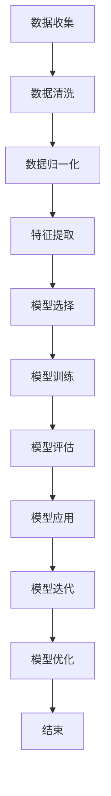

                 

### 第一部分：背景介绍

#### 第1章：资产证券化与现金流压力测试概述

##### 1.1.1 问题背景

资产证券化作为一种金融创新手段，自20世纪70年代在美国兴起以来，迅速在全球范围内得到广泛应用。其本质是通过将流动性较差的资产（如房屋抵押贷款、应收账款等）转化为可以在金融市场上交易的证券，从而实现融资。资产证券化的主要目的是提高资产的流动性、分散风险和优化资源配置。随着金融市场的发展和金融工具的多样化，资产证券化逐渐成为金融机构和投资者的重要工具。

然而，资产证券化在带来便利的同时，也引发了一系列问题。特别是2008年全球金融危机期间，一些资产证券化产品因内部风险管理不足，导致严重损失。这促使金融机构和监管机构对资产证券化产品的风险进行了深入分析，现金流压力测试作为一种重要的风险管理工具，受到了广泛关注。

现金流压力测试，即通过模拟极端市场条件，对资产证券化产品在不同情景下的现金流进行预测和分析，以评估其潜在风险。这种测试方法能够帮助金融机构识别潜在问题，提前采取防范措施，确保资产证券化产品的稳健运行。

##### 1.1.2 问题描述

随着资产证券化规模的不断扩大，如何构建一个高效、智能的现金流压力测试模型，成为金融机构面临的重要问题。具体来说，问题描述可以归结为以下几点：

1. **数据收集与处理**：资产证券化产品的现金流数据通常复杂且规模庞大，如何高效地收集、处理和存储这些数据，成为构建现金流压力测试模型的关键。
2. **模型构建**：在掌握了丰富的现金流数据后，如何选择合适的算法和模型，进行有效的现金流预测和分析，是另一个重要问题。
3. **模型评估**：构建完模型后，如何对其性能进行评估，确保其准确性和可靠性，是保证现金流压力测试结果可信的重要环节。
4. **智能化**：随着人工智能技术的发展，如何将智能化技术应用于现金流压力测试模型，提高其预测能力和适应性，成为当前研究的热点。

##### 1.1.3 问题解决

针对上述问题描述，我们可以采取以下步骤进行解决：

1. **数据收集与处理**：利用大数据技术，构建高效的数据收集和处理平台，实现对资产证券化产品现金流的实时监控和动态更新。同时，采用数据清洗和预处理技术，确保数据的质量和一致性。
2. **模型构建**：选择合适的时间序列分析算法和神经网络模型，对现金流数据进行建模。结合实际应用场景，对模型参数进行调整和优化，提高模型的预测精度。
3. **模型评估**：通过交叉验证、回测等方法，对模型进行性能评估，确保其具备良好的泛化能力和稳定性。同时，利用机器学习算法，对模型进行迭代优化，进一步提高其预测能力。
4. **智能化**：将深度学习、自然语言处理等人工智能技术引入现金流压力测试模型，实现自动化建模和预测。通过构建自适应模型，提高模型在不同市场条件下的适应能力。

##### 1.1.4 边界与外延

在构建智能化现金流压力测试模型的过程中，需要明确以下几个边界与外延：

1. **数据边界**：模型所依赖的数据应涵盖不同市场环境和宏观经济条件下的现金流数据，以确保模型的普适性和可靠性。
2. **模型边界**：模型应具备一定的灵活性和扩展性，能够适应不同资产证券化产品的特点和要求。
3. **技术边界**：在应用人工智能技术时，需要考虑技术的实际可行性和成本效益，确保模型的实施和维护成本在可控范围内。
4. **应用边界**：模型的最终目标是服务于金融机构的风险管理决策，因此，需要充分考虑模型在实际应用中的可行性和实用性。

##### 1.1.5 概念结构与核心要素组成

为了更好地理解现金流压力测试模型的概念结构和核心要素，我们可以从以下几个方面进行阐述：

1. **数据层**：包括资产证券化产品的现金流数据、宏观经济数据和市场交易数据等。数据质量直接影响模型的性能和预测效果。
2. **模型层**：包括时间序列分析模型、神经网络模型、机器学习算法等。这些模型用于对现金流数据进行预测和分析。
3. **算法层**：包括数据预处理算法、特征提取算法、模型训练算法等。这些算法用于优化模型性能和提升预测精度。
4. **应用层**：包括现金流压力测试系统的开发、部署和维护等。应用层确保模型在实际应用中的高效性和可靠性。

通过以上分析，我们可以看出，构建智能化现金流压力测试模型是一项复杂的系统工程，需要从数据、模型、算法和应用等多个方面进行综合考量。只有通过不断优化和迭代，才能实现高效的现金流压力测试，为金融机构的风险管理提供有力支持。

### 第二部分：核心概念与联系

#### 第2章：资产证券化核心概念解析

##### 2.1.1 资产证券化的定义

资产证券化（Asset-Backed Securitization）是一种金融衍生工具，通过将不具备流动性的资产转化为可以在资本市场上交易的证券，从而实现融资和流动性管理。具体来说，资产证券化是将一组具有预期现金流的资产（如贷款、租赁合同、信用卡债务等）打包成一种证券，然后出售给投资者，以获得资金。

资产证券化的核心在于将资产的未来现金流与投资者的投资回报联系起来，从而实现风险与收益的分离。与传统融资方式相比，资产证券化能够提高资产的流动性，降低借款人的融资成本，同时为投资者提供了多样化的投资渠道。

##### 2.1.2 资产证券化的分类

资产证券化根据所涉及的资产类型和交易结构的不同，可以分为以下几类：

1. **按资产类型分类**：
   - **住房抵押贷款证券化**：将住房抵押贷款打包成证券，发行给投资者。
   - **汽车贷款证券化**：将汽车贷款打包成证券，发行给投资者。
   - **信用卡债务证券化**：将信用卡债务打包成证券，发行给投资者。
   - **商业房地产抵押贷款证券化**：将商业房地产抵押贷款打包成证券，发行给投资者。
   - **应收账款证券化**：将企业应收账款打包成证券，发行给投资者。

2. **按交易结构分类**：
   - **纯资产支持证券（Straight ABS）**：直接以资产现金流为支撑的证券。
   - **合成资产支持证券（Collateralized Debt Obligations, CDO）**：通过信用增强机制，将多个资产组合成一个新的证券。
   - **信用违约互换（Credit Default Swaps, CDS）**：保险公司为保护投资者免受信用违约损失而设计的金融衍生品。

##### 2.1.3 资产证券化的主要参与者

资产证券化涉及多个参与方，主要包括：

1. **发起人（Originator）**：通常是金融机构，如银行、信用合作社、汽车制造商等，它们负责筛选和打包资产。
2. **特殊目的实体（Special Purpose Vehicle, SPV）**：一个法律上独立的机构，用于持有、管理和运作资产证券化产品。
3. **信用评级机构**：对资产证券化产品进行评级，评估其信用风险。
4. **投资者**：购买资产证券化产品的投资者，包括金融机构、养老基金、保险公司等。
5. **服务机构**：负责资产证券化产品的日常管理和维护，如追缴债务、会计和税务服务等。

##### 2.1.4 资产证券化与传统融资方式的比较

资产证券化与传统融资方式（如直接贷款）有以下几点区别：

1. **流动性**：资产证券化能够提高资产的流动性，使非流动性资产（如贷款）转化为可以在资本市场上交易的证券，为金融机构和投资者提供了多样化的融资和投资选择。
2. **风险分散**：通过将资产打包成证券，资产证券化实现了风险分散，投资者可以根据自己的风险承受能力选择不同风险等级的证券。
3. **成本**：资产证券化通常能够降低借款人的融资成本，因为投资者可以享受到税收优惠和信用增强等优势。
4. **灵活性**：资产证券化提供了更多的融资结构选择，金融机构可以根据自身需求和市场情况灵活设计融资方案。

总的来说，资产证券化作为一种创新的金融工具，在提高资产流动性、分散风险和降低融资成本方面具有显著优势。然而，其复杂的结构和潜在的信用风险也需要得到充分重视。

#### 第3章：现金流压力测试概述

##### 3.1.1 现金流压力测试的定义

现金流压力测试（Cash Flow Stress Testing）是一种金融风险管理方法，旨在通过模拟极端市场条件，评估资产证券化产品在不同情景下的现金流表现。具体来说，现金流压力测试是一种对资产现金流进行情景分析和风险预测的技术，通过设定不同压力情景（如利率上升、房价下跌、失业率上升等），预测资产证券化产品在这些情景下的现金流变化，从而评估其潜在风险。

现金流压力测试的核心目的是识别资产证券化产品在不同市场条件下的脆弱性，为金融机构提供风险管理依据，帮助其制定应对措施，确保资产证券化产品的稳健运行。

##### 3.1.2 现金流压力测试的重要性

现金流压力测试在金融风险管理中具有重要意义，主要体现在以下几个方面：

1. **风险识别**：现金流压力测试可以帮助金融机构识别潜在的风险因素，特别是在极端市场条件下，提前发现资产证券化产品的潜在问题。
2. **决策支持**：通过现金流压力测试，金融机构可以评估不同风险管理策略的有效性，为决策提供数据支持，确保在极端市场条件下能够采取有效的应对措施。
3. **合规要求**：许多国家和地区的监管机构要求金融机构进行现金流压力测试，以确保其具备足够的资本缓冲，应对潜在的市场风险。
4. **市场透明度**：现金流压力测试可以提高资产证券化市场的透明度，帮助投资者更好地了解产品的风险特征，降低信息不对称。

##### 3.1.3 现金流压力测试的方法与工具

现金流压力测试的方法和工具多种多样，主要包括以下几种：

1. **情景分析**：通过设定不同的市场情景（如经济衰退、通货膨胀、利率上升等），模拟资产证券化产品在这些情景下的现金流表现。
2. **敏感性分析**：对资产证券化产品的现金流进行敏感性分析，评估不同因素（如利率、房价、失业率等）对现金流的影响。
3. **压力测试**：在极端市场条件下，模拟资产证券化产品的现金流表现，评估其抗风险能力。
4. **蒙特卡罗模拟**：通过随机模拟方法，预测资产证券化产品在不同情景下的现金流分布和风险值。

常用的现金流压力测试工具包括Excel、Python、R、SAS等，这些工具可以方便地实现现金流压力测试的各个步骤，提高测试的效率和准确性。

##### 3.1.4 现金流压力测试与传统风险评估方法的比较

现金流压力测试与传统风险评估方法（如VaR、CVaR等）相比，具有以下特点：

1. **全面性**：现金流压力测试通过模拟不同情景，评估资产证券化产品在多种市场条件下的表现，能够更全面地反映产品的风险特征。
2. **动态性**：现金流压力测试是一种动态分析方法，能够反映资产证券化产品在市场变化中的现金流变化，更贴近实际市场环境。
3. **适应性**：现金流压力测试可以根据实际需求灵活调整情景和参数，适应不同金融机构和资产证券化产品的特点。
4. **复杂性**：与VaR、CVaR等传统方法相比，现金流压力测试通常涉及更多的情景设定和参数调整，计算过程更加复杂。

总的来说，现金流压力测试作为一种更为全面和动态的风险评估方法，在金融风险管理中具有重要作用。通过结合传统风险评估方法，金融机构可以更有效地识别和管理资产证券化产品的风险，确保其稳健运行。

#### 第4章：智能化现金流压力测试模型的构建

##### 4.1.1 智能化现金流压力测试的概念

智能化现金流压力测试是一种结合人工智能技术，对资产证券化产品现金流进行预测和风险评估的方法。通过引入机器学习和深度学习算法，智能化现金流压力测试能够自动处理大量数据，提取关键特征，构建预测模型，从而实现高效的现金流预测和风险识别。智能化现金流压力测试的核心在于其自适应性和学习能力，能够根据市场环境和数据变化不断优化模型，提高预测精度和可靠性。

##### 4.1.2 智能化现金流压力测试的优势

智能化现金流压力测试相较于传统的压力测试方法，具有以下优势：

1. **高效性**：通过自动化数据处理和模型训练，智能化现金流压力测试能够快速处理大量数据，大幅提高测试效率。
2. **精确性**：利用机器学习和深度学习算法，智能化现金流压力测试能够捕捉数据中的复杂关系和趋势，提高预测精度。
3. **灵活性**：智能化现金流压力测试可以根据实际需求灵活调整模型参数和测试情景，适应不同资产证券化产品的特点。
4. **实时性**：智能化现金流压力测试可以实时更新数据，快速响应市场变化，提供动态风险预警。
5. **适应性**：智能化现金流压力测试能够根据数据变化和市场条件不断优化模型，提高模型的适应性和稳定性。

##### 4.1.3 智能化现金流压力测试的基本步骤

构建智能化现金流压力测试模型通常包括以下基本步骤：

1. **数据收集**：收集与资产证券化产品相关的历史现金流数据、宏观经济数据和市场交易数据等，确保数据的质量和完整性。
2. **数据预处理**：对收集到的数据进行清洗、去重、归一化等处理，确保数据的一致性和可用性。
3. **特征提取**：利用统计分析、特征工程等方法，从原始数据中提取关键特征，为模型训练提供输入。
4. **模型选择**：根据实际需求和数据特点，选择合适的时间序列分析、神经网络、机器学习等算法，构建预测模型。
5. **模型训练与优化**：利用训练数据，对模型进行训练和优化，调整模型参数，提高预测精度。
6. **模型评估**：通过交叉验证、回测等方法，对模型进行性能评估，确保其具备良好的泛化能力和稳定性。
7. **模型应用**：将构建好的模型应用于实际现金流压力测试，模拟不同情景下的现金流表现，识别潜在风险。
8. **模型迭代**：根据测试结果，对模型进行调整和优化，不断迭代提升模型性能。

通过以上步骤，金融机构可以构建出高效的智能化现金流压力测试模型，为其风险管理提供有力支持。随着人工智能技术的不断发展，智能化现金流压力测试模型将 increasingly become a key tool in financial risk management.

### 第三部分：算法原理讲解

#### 第5章：智能化现金流压力测试算法原理

##### 5.1.1 数据预处理算法

数据预处理是构建智能化现金流压力测试模型的基础步骤，其目的是确保数据的质量和一致性，为后续的特征提取和模型训练提供可靠的数据基础。数据预处理主要包括以下几方面：

1. **数据清洗**：去除数据中的错误、重复和缺失值，确保数据的完整性和准确性。常用的方法包括删除重复记录、填充缺失值和异常值处理等。
2. **数据归一化**：将不同特征的数据进行归一化处理，使其具备相同的量纲，便于后续的特征提取和模型训练。常用的归一化方法包括最小-最大缩放、Z-score缩放等。
3. **时间序列对齐**：对于不同时间段的数据，进行时间序列对齐，确保数据的同步性。可以通过插值、采样等手段实现对齐。
4. **异常值处理**：识别和处理数据中的异常值，以避免其对模型训练造成不利影响。常用的方法包括统计方法、机器学习方法等。

##### 5.1.2 时间序列分析算法

时间序列分析是处理和分析时间序列数据的方法，旨在捕捉时间序列中的趋势、周期性和随机性。在智能化现金流压力测试中，时间序列分析算法用于预测资产证券化产品的未来现金流。常见的时间序列分析算法包括：

1. **自回归模型（AR）**：自回归模型是一种基于当前时刻之前的观测值预测未来值的方法。自回归模型的基本公式为：$X_t = c + \phi_1 X_{t-1} + \phi_2 X_{t-2} + ... + \phi_p X_{t-p} + \varepsilon_t$，其中$\varepsilon_t$为误差项。
2. **移动平均模型（MA）**：移动平均模型是一种基于当前时刻之前的一组观测值的平均值预测未来值的方法。移动平均模型的基本公式为：$X_t = c + \theta_1 \varepsilon_{t-1} + \theta_2 \varepsilon_{t-2} + ... + \theta_q \varepsilon_{t-q} + \varepsilon_t$。
3. **自回归移动平均模型（ARMA）**：自回归移动平均模型是自回归模型和移动平均模型的结合，同时考虑了时间序列的趋势和波动性。ARMA模型的基本公式为：$X_t = c + \phi_1 X_{t-1} + ... + \phi_p X_{t-p} + \theta_1 \varepsilon_{t-1} + ... + \theta_q \varepsilon_{t-q} + \varepsilon_t$。
4. **自回归积分滑动平均模型（ARIMA）**：自回归积分滑动平均模型是ARMA模型的扩展，适用于非平稳时间序列。ARIMA模型的基本公式为：$X_t = c + \phi_1 X_{t-1} + ... + \phi_p X_{t-p} + \theta_1 (\varepsilon_{t-1} + \mu_1 \varepsilon_{t-2} + ... + \mu_d \varepsilon_{t-d}) + \varepsilon_t$。

##### 5.1.3 神经网络算法

神经网络是一种模拟生物神经系统的计算模型，具有强大的非线性映射能力和自学习能力。在智能化现金流压力测试中，神经网络算法被广泛应用于现金流预测和风险评估。常见的神经网络算法包括：

1. **前馈神经网络（FFNN）**：前馈神经网络是一种简单的神经网络结构，数据从输入层传递到输出层，不形成回路。前馈神经网络的基本结构包括输入层、隐藏层和输出层，各层神经元之间通过权重连接。
2. **反向传播算法（Backpropagation）**：反向传播算法是一种用于训练神经网络的梯度下降方法，通过计算输出误差的梯度，更新网络权重，以优化网络性能。反向传播算法的基本步骤包括前向传播、计算误差、反向传播和权重更新。
3. **卷积神经网络（CNN）**：卷积神经网络是一种适用于图像和序列数据的深度学习模型，通过卷积层、池化层和全连接层等结构，实现特征提取和分类。在现金流压力测试中，CNN可以用于处理时间序列数据，提取关键特征。
4. **递归神经网络（RNN）**：递归神经网络是一种适用于序列数据的神经网络模型，通过循环结构，实现序列数据的记忆和预测。RNN的基本结构包括输入层、隐藏层和输出层，各层之间通过循环连接。常见的RNN变种包括长短期记忆网络（LSTM）和门控循环单元（GRU）。

##### 5.1.4 模型训练与评估算法

模型训练与评估是构建智能化现金流压力测试模型的重要环节，其目的是优化模型性能，确保其在实际应用中的有效性和可靠性。常见的模型训练与评估算法包括：

1. **交叉验证（Cross-Validation）**：交叉验证是一种评估模型性能的方法，通过将数据集划分为多个子集，轮流作为训练集和验证集，评估模型的泛化能力。常见的交叉验证方法包括K折交叉验证和留一法交叉验证。
2. **均方误差（MSE）**：均方误差是一种衡量模型预测误差的指标，表示预测值与真实值之间差异的平方和的平均值。MSE的计算公式为：$MSE = \frac{1}{n} \sum_{i=1}^{n} (y_i - \hat{y}_i)^2$，其中$n$为样本数量，$y_i$为真实值，$\hat{y}_i$为预测值。
3. **均绝对误差（MAE）**：均绝对误差是一种衡量模型预测误差的指标，表示预测值与真实值之间差异的绝对值的平均值。MAE的计算公式为：$MAE = \frac{1}{n} \sum_{i=1}^{n} |y_i - \hat{y}_i|$。
4. **决定系数（R²）**：决定系数是一种衡量模型拟合效果的指标，表示模型对数据的解释程度。R²的计算公式为：$R^2 = 1 - \frac{\sum_{i=1}^{n} (y_i - \hat{y}_i)^2}{\sum_{i=1}^{n} (y_i - \bar{y})^2}$，其中$\bar{y}$为真实值的平均值。

通过以上算法，金融机构可以构建出高效、智能的现金流压力测试模型，为资产证券化产品的风险管理提供有力支持。

#### 第6章：算法详解与数学模型讲解

##### 6.1.1 数据预处理算法详细讲解

数据预处理是构建智能化现金流压力测试模型的第一步，其核心目的是确保数据的质量和一致性。以下是对数据预处理算法的详细讲解：

1. **数据清洗**：数据清洗是数据预处理的首要步骤，其目的是去除数据中的错误、重复和缺失值。具体方法包括：
   - **删除重复记录**：通过比较数据中的关键字段（如ID、时间戳等），删除重复的记录，确保数据的唯一性。
   - **填充缺失值**：对于缺失的数据，可以根据不同情况采用以下方法进行填充：
     - **均值填充**：用该特征的均值填充缺失值。
     - **中位数填充**：用该特征的中位数填充缺失值。
     - **最邻近填充**：用缺失值所在行的最邻近非缺失值填充。
     - **插值法**：对于时间序列数据，采用线性插值、高斯插值等方法填充缺失值。
   - **异常值处理**：识别和处理数据中的异常值，以避免其对模型训练造成不利影响。异常值处理方法包括：
     - **统计方法**：利用统计方法（如IQR、Z-score等）识别异常值，并将其处理或删除。
     - **机器学习方法**：利用机器学习方法（如孤立森林、K最近邻等）识别异常值，并进行相应的处理。

2. **数据归一化**：数据归一化的目的是将不同特征的数据进行统一处理，使其具备相同的量纲。常用的归一化方法包括：
   - **最小-最大缩放**：将数据缩放到[0,1]区间，公式为：$x_{\text{normalized}} = \frac{x - x_{\text{min}}}{x_{\text{max}} - x_{\text{min}}}$，其中$x_{\text{min}}$和$x_{\text{max}}$分别为该特征的最小值和最大值。
   - **Z-score缩放**：将数据缩放到均值为0、标准差为1的正态分布，公式为：$x_{\text{normalized}} = \frac{x - \mu}{\sigma}$，其中$\mu$为该特征的均值，$\sigma$为该特征的标准差。

3. **时间序列对齐**：对于不同时间段的数据，进行时间序列对齐，确保数据的同步性。具体方法包括：
   - **插值法**：对于缺失的数据，采用线性插值、高斯插值等方法进行填充。
   - **采样法**：通过降低时间步长（如从每小时采样到每分钟）或增加时间步长（如从每分钟采样到每小时），实现对齐。
   - **裁剪法**：对数据长度不一致的部分进行裁剪，使其具备相同的时间步长。

##### 6.1.2 时间序列分析算法详细讲解

时间序列分析是处理和分析时间序列数据的方法，旨在捕捉时间序列中的趋势、周期性和随机性。以下是对时间序列分析算法的详细讲解：

1. **自回归模型（AR）**：
   - **原理**：自回归模型是一种基于当前时刻之前的观测值预测未来值的方法。其基本公式为：
     $$
     X_t = c + \phi_1 X_{t-1} + \phi_2 X_{t-2} + ... + \phi_p X_{t-p} + \varepsilon_t
     $$
     其中，$X_t$为当前时刻的观测值，$c$为常数项，$\phi_1, \phi_2, ..., \phi_p$为自回归系数，$\varepsilon_t$为误差项。
   - **参数估计**：自回归模型的参数可以通过最小二乘法、最大似然估计等方法进行估计。
   - **优缺点**：自回归模型简单易用，适用于线性时间序列；但其无法捕捉非线性关系和非平稳性。

2. **移动平均模型（MA）**：
   - **原理**：移动平均模型是一种基于当前时刻之前的一组观测值的平均值预测未来值的方法。其基本公式为：
     $$
     X_t = c + \theta_1 \varepsilon_{t-1} + \theta_2 \varepsilon_{t-2} + ... + \theta_q \varepsilon_{t-q} + \varepsilon_t
     $$
     其中，$X_t$为当前时刻的观测值，$c$为常数项，$\theta_1, \theta_2, ..., \theta_q$为移动平均系数，$\varepsilon_t$为误差项。
   - **参数估计**：移动平均模型的参数可以通过最小二乘法、最大似然估计等方法进行估计。
   - **优缺点**：移动平均模型能够平滑时间序列，适用于线性时间序列；但其无法捕捉趋势和周期性。

3. **自回归移动平均模型（ARMA）**：
   - **原理**：自回归移动平均模型是自回归模型和移动平均模型的结合，同时考虑了时间序列的趋势和波动性。其基本公式为：
     $$
     X_t = c + \phi_1 X_{t-1} + \phi_2 X_{t-2} + ... + \phi_p X_{t-p} + \theta_1 \varepsilon_{t-1} + \theta_2 \varepsilon_{t-2} + ... + \theta_q \varepsilon_{t-q} + \varepsilon_t
     $$
     其中，$X_t$为当前时刻的观测值，$c$为常数项，$\phi_1, \phi_2, ..., \phi_p$为自回归系数，$\theta_1, \theta_2, ..., \theta_q$为移动平均系数，$\varepsilon_t$为误差项。
   - **参数估计**：自回归移动平均模型的参数可以通过最小二乘法、最大似然估计等方法进行估计。
   - **优缺点**：自回归移动平均模型能够同时捕捉时间序列的趋势和波动性，适用于非平稳时间序列；但其参数估计较为复杂。

4. **自回归积分滑动平均模型（ARIMA）**：
   - **原理**：自回归积分滑动平均模型是自回归移动平均模型的扩展，适用于非平稳时间序列。其基本公式为：
     $$
     X_t = c + \phi_1 X_{t-1} + ... + \phi_p X_{t-p} + \theta_1 (\varepsilon_{t-1} + \mu_1 \varepsilon_{t-2} + ... + \mu_d \varepsilon_{t-d}) + \varepsilon_t
     $$
     其中，$X_t$为当前时刻的观测值，$c$为常数项，$\phi_1, \phi_2, ..., \phi_p$为自回归系数，$\theta_1, \theta_2, ..., \theta_q$为移动平均系数，$\varepsilon_t$为误差项，$\mu_1, \mu_2, ..., \mu_d$为积分项。
   - **参数估计**：自回归积分滑动平均模型的参数可以通过最小二乘法、最大似然估计等方法进行估计。
   - **优缺点**：自回归积分滑动平均模型能够同时捕捉时间序列的趋势、波动性和周期性，适用于非平稳时间序列；但其参数估计和模型选择较为复杂。

##### 6.1.3 神经网络算法详细讲解

神经网络是一种模拟生物神经系统的计算模型，具有强大的非线性映射能力和自学习能力。以下是对神经网络算法的详细讲解：

1. **前馈神经网络（FFNN）**：
   - **原理**：前馈神经网络是一种简单的神经网络结构，数据从输入层传递到输出层，不形成回路。其基本结构包括输入层、隐藏层和输出层，各层神经元之间通过权重连接。神经元的激活函数通常为Sigmoid、ReLU或Tanh函数。
   - **前向传播**：在前向传播过程中，输入数据经过输入层、隐藏层，最终传递到输出层，得到预测结果。
   - **反向传播**：在反向传播过程中，根据预测结果和真实值，计算损失函数，并利用梯度下降法更新网络权重，以优化模型性能。
   - **优缺点**：前馈神经网络简单易用，适用于非线性时间序列；但其对数据量和特征复杂度有一定要求。

2. **反向传播算法（Backpropagation）**：
   - **原理**：反向传播算法是一种用于训练神经网络的梯度下降方法，通过计算输出误差的梯度，更新网络权重，以优化网络性能。其基本步骤包括：
     - **前向传播**：输入数据经过网络，计算输出层误差。
     - **计算梯度**：根据输出层误差，计算网络各层的梯度。
     - **权重更新**：利用梯度下降法，更新网络权重。
     - **重复迭代**：重复前向传播和反向传播过程，直至模型性能达到预期。
   - **优缺点**：反向传播算法能够高效地优化神经网络性能，适用于复杂非线性时间序列；但其对计算资源和算法实现有一定要求。

3. **卷积神经网络（CNN）**：
   - **原理**：卷积神经网络是一种适用于图像和序列数据的深度学习模型，通过卷积层、池化层和全连接层等结构，实现特征提取和分类。其基本结构包括：
     - **卷积层**：通过卷积操作，提取输入数据中的局部特征。
     - **池化层**：通过最大值池化或平均值池化，减少数据维度，提高计算效率。
     - **全连接层**：将卷积层和池化层提取的特征映射到输出层，实现分类或回归任务。
   - **优缺点**：卷积神经网络能够高效地处理图像和序列数据，适用于复杂非线性时间序列；但其对数据量和计算资源有一定要求。

4. **递归神经网络（RNN）**：
   - **原理**：递归神经网络是一种适用于序列数据的神经网络模型，通过循环结构，实现序列数据的记忆和预测。其基本结构包括：
     - **输入层**：接收序列数据的输入。
     - **隐藏层**：通过循环连接，实现序列数据的记忆和传递。
     - **输出层**：根据隐藏层输出，得到序列数据的预测结果。
   - **优缺点**：递归神经网络能够处理长序列数据，适用于复杂非线性时间序列；但其存在梯度消失和梯度爆炸问题。

##### 6.1.4 模型训练与评估算法详细讲解

模型训练与评估是构建智能化现金流压力测试模型的重要环节，其目的是优化模型性能，确保其在实际应用中的有效性和可靠性。以下是对模型训练与评估算法的详细讲解：

1. **交叉验证（Cross-Validation）**：
   - **原理**：交叉验证是一种评估模型性能的方法，通过将数据集划分为多个子集，轮流作为训练集和验证集，评估模型的泛化能力。其基本步骤包括：
     - **数据划分**：将数据集划分为训练集和验证集。
     - **模型训练**：在训练集上训练模型，并记录训练过程中损失函数的变化。
     - **模型评估**：在验证集上评估模型性能，计算预测误差或损失函数。
     - **重复迭代**：重复上述步骤，直到达到预设的训练次数或模型性能达到预期。
   - **优缺点**：交叉验证能够有效评估模型泛化能力，适用于小样本数据；但其计算量较大，对计算资源有一定要求。

2. **均方误差（MSE）**：
   - **原理**：均方误差是一种衡量模型预测误差的指标，表示预测值与真实值之间差异的平方和的平均值。其计算公式为：
     $$
     MSE = \frac{1}{n} \sum_{i=1}^{n} (y_i - \hat{y}_i)^2
     $$
     其中，$y_i$为真实值，$\hat{y}_i$为预测值，$n$为样本数量。
   - **优缺点**：均方误差能够有效衡量预测误差，适用于线性模型；但其对异常值敏感，可能影响评估结果。

3. **均绝对误差（MAE）**：
   - **原理**：均绝对误差是一种衡量模型预测误差的指标，表示预测值与真实值之间差异的绝对值的平均值。其计算公式为：
     $$
     MAE = \frac{1}{n} \sum_{i=1}^{n} |y_i - \hat{y}_i|
     $$
     其中，$y_i$为真实值，$\hat{y}_i$为预测值，$n$为样本数量。
   - **优缺点**：均绝对误差能够有效衡量预测误差，且对异常值不敏感，适用于非线性模型；但其对异常值的影响较小。

4. **决定系数（R²）**：
   - **原理**：决定系数是一种衡量模型拟合效果的指标，表示模型对数据的解释程度。其计算公式为：
     $$
     R^2 = 1 - \frac{\sum_{i=1}^{n} (y_i - \hat{y}_i)^2}{\sum_{i=1}^{n} (y_i - \bar{y})^2}
     $$
     其中，$y_i$为真实值，$\hat{y}_i$为预测值，$\bar{y}$为真实值的平均值，$n$为样本数量。
   - **优缺点**：决定系数能够有效衡量模型拟合效果，适用于各种模型；但其对异常值敏感，可能影响评估结果。

通过以上算法的详细讲解，我们可以更好地理解智能化现金流压力测试模型的构建过程，为实际应用提供有力的技术支持。

##### 6.1.5 算法原理Mermaid流程图

为了更直观地展示算法原理，我们使用Mermaid语言绘制了以下流程图：



以上流程图展示了从数据收集到模型优化的完整过程，涵盖了数据预处理、特征提取、模型选择、训练与评估、模型应用与迭代等关键环节。通过这一流程，我们可以构建出高效的智能化现金流压力测试模型，为金融风险管理提供有力支持。

### 第四部分：系统分析与架构设计方案

#### 第7章：系统分析与架构设计

##### 7.1.1 问题场景介绍

在金融领域中，资产证券化作为一种重要的融资手段，已经成为金融机构和投资者关注的焦点。然而，随着资产证券化规模的不断扩大，现金流压力测试作为一种重要的风险管理工具，也逐渐受到重视。现金流压力测试的目的是通过模拟不同市场情景下的现金流表现，评估资产证券化产品的风险，从而为金融机构提供决策依据。

在实际应用中，现金流压力测试系统需要具备以下几个关键功能：

1. **数据收集与处理**：系统能够从多个数据源（如金融机构、监管机构等）收集相关数据，包括资产证券化产品的现金流数据、宏观经济数据和市场交易数据等。同时，系统需要具备数据清洗、归一化和特征提取等功能，确保数据的质量和一致性。
2. **模型构建与训练**：系统需要支持多种算法和模型，如时间序列分析、神经网络和机器学习等，以实现高效的现金流预测和风险评估。系统还需具备模型训练和优化的功能，提高模型的预测精度和稳定性。
3. **模型评估与验证**：系统需要通过交叉验证、回测等方法，对模型进行性能评估，确保其具备良好的泛化能力和可靠性。同时，系统需能够根据评估结果，对模型进行调整和优化。
4. **压力测试与应用**：系统需能够根据设定的市场情景，模拟资产证券化产品在不同情景下的现金流表现，评估其风险。系统还需支持将构建好的模型应用于实际场景，为金融机构提供风险预警和决策支持。

##### 7.1.2 系统功能设计

为了实现上述关键功能，现金流压力测试系统可以从以下几方面进行功能设计：

1. **数据收集模块**：负责从不同数据源收集现金流数据、宏观经济数据和市场交易数据等。该模块需要支持数据连接、数据抓取和数据存储等功能，确保数据的及时性和完整性。
2. **数据预处理模块**：负责对收集到的原始数据进行清洗、归一化和特征提取等处理，确保数据的质量和一致性。该模块需要支持多种数据处理算法和策略，如缺失值填充、异常值处理、数据归一化等。
3. **模型构建模块**：负责选择和构建合适的算法和模型，实现现金流预测和风险评估。该模块需要支持多种算法和模型，如时间序列分析、神经网络、机器学习等，并提供模型训练和优化的功能。
4. **模型评估模块**：负责对构建好的模型进行性能评估，包括交叉验证、回测、性能指标计算等。该模块需要支持多种评估方法，以确保模型的泛化能力和可靠性。
5. **压力测试模块**：负责根据设定的市场情景，模拟资产证券化产品在不同情景下的现金流表现，评估其风险。该模块需要支持多种情景设定和测试方法，如情景模拟、压力测试等。
6. **应用支持模块**：负责将构建好的模型应用于实际场景，为金融机构提供风险预警和决策支持。该模块需要支持模型部署、接口设计、数据接口等。

##### 7.1.3 系统架构设计

现金流压力测试系统的架构设计应考虑以下几个方面：

1. **分布式架构**：为了提高系统的处理能力和扩展性，系统应采用分布式架构。分布式架构可以将数据处理、模型训练、模型评估等功能分散到多个节点上，提高系统的并发能力和可靠性。
2. **模块化设计**：系统应采用模块化设计，将不同功能模块进行分离和封装，以提高系统的可维护性和可扩展性。模块化设计有助于实现各功能模块的独立开发、测试和部署。
3. **数据存储**：系统需要采用高效的数据存储方案，支持大规模数据存储和快速访问。常用的数据存储方案包括关系数据库、NoSQL数据库、数据湖等。
4. **数据处理引擎**：系统需要采用高效的数据处理引擎，支持多种数据处理算法和策略，如MapReduce、Spark等。
5. **模型训练与优化**：系统需要支持分布式模型训练和优化，以提高训练效率和性能。常用的模型训练和优化方法包括随机梯度下降、批量梯度下降、Adam优化器等。
6. **API接口**：系统需要提供统一的API接口，支持与其他系统的数据交互和功能调用。API接口设计应考虑安全性、可扩展性和易用性。

##### 7.1.4 系统接口设计

系统接口设计是系统架构设计的重要环节，以下是对系统接口的详细设计：

1. **数据收集接口**：该接口负责与外部数据源进行连接，获取现金流数据、宏观经济数据和市场交易数据等。接口应支持RESTful API、WebSocket等通信协议，并提供数据同步、数据质量检测等功能。
2. **数据处理接口**：该接口负责接收和传递预处理后的数据，支持数据清洗、归一化、特征提取等功能。接口应支持批量处理和实时处理，并提供数据质量监控和日志记录功能。
3. **模型训练接口**：该接口负责接收和传递模型训练所需的参数和数据，支持模型选择、训练、优化等功能。接口应支持分布式训练和并行计算，以提高训练效率。
4. **模型评估接口**：该接口负责接收和传递模型评估所需的参数和数据，支持模型评估、性能指标计算等功能。接口应支持交叉验证、回测等评估方法，并提供评估结果可视化功能。
5. **压力测试接口**：该接口负责接收和传递压力测试所需的参数和数据，支持情景模拟、压力测试等功能。接口应支持多种情景设定和测试方法，并提供测试结果记录和报告功能。
6. **应用支持接口**：该接口负责接收和传递模型应用所需的参数和数据，支持模型部署、接口设计、数据接口等功能。接口应支持与其他系统的数据交互和功能调用，并提供日志记录和监控功能。

##### 7.1.5 系统交互设计

系统交互设计是系统架构设计的重要环节，以下是对系统交互的详细设计：

1. **数据流设计**：系统数据流包括数据收集、数据处理、模型构建、模型评估、压力测试和应用支持等环节。各模块之间通过接口进行数据传递和功能调用，确保系统的协同工作。
2. **事件驱动设计**：系统采用事件驱动设计，通过事件触发各模块的功能执行。事件包括数据更新、模型训练完成、模型评估完成、压力测试开始等。事件驱动设计有助于提高系统的响应速度和灵活性。
3. **服务总线设计**：系统采用服务总线架构，将各模块的功能封装为服务，通过服务总线进行调度和协调。服务总线支持服务注册、服务发现、服务调用等功能，提高系统的可维护性和扩展性。
4. **监控与日志设计**：系统应具备监控和日志功能，实时监控系统的运行状态、性能指标和异常事件。监控和日志设计应考虑数据采集、数据存储、数据分析和可视化等方面，提供全面的系统监控和故障排查功能。

通过以上系统分析与架构设计方案，我们能够构建一个高效、可靠的现金流压力测试系统，为金融机构提供全面、准确的风险管理支持。

### 第五部分：项目实战

#### 第8章：项目实战

##### 8.1.1 环境安装

在开始构建智能化现金流压力测试模型之前，我们需要搭建一个合适的环境。以下步骤将指导您安装和配置所需的环境：

1. **安装Python环境**：
   - 首先，确保您的计算机上已安装Python。如果没有安装，可以访问Python官方网站（https://www.python.org/）下载并安装Python。
   - 安装完成后，打开命令行窗口，输入以下命令，验证Python是否安装成功：
     ```bash
     python --version
     ```
   - 如果正确显示Python版本信息，说明Python已成功安装。

2. **安装依赖库**：
   - 使用pip工具安装必要的依赖库。以下是一个示例命令，用于安装NumPy、Pandas、Scikit-learn和Matplotlib等库：
     ```bash
     pip install numpy pandas scikit-learn matplotlib
     ```

3. **安装Jupyter Notebook**：
   - Jupyter Notebook是一个交互式计算环境，可用于编写和运行代码。安装Jupyter Notebook的命令如下：
     ```bash
     pip install notebook
     ```
   - 安装完成后，启动Jupyter Notebook：
     ```bash
     jupyter notebook
     ```
   - 在浏览器中打开Jupyter Notebook，开始编写代码。

##### 8.1.2 系统核心实现源代码

在搭建好环境之后，我们开始编写系统的核心实现源代码。以下是一个简化版的现金流压力测试模型实现，用于演示主要步骤和算法。

```python
import numpy as np
import pandas as pd
from sklearn.model_selection import train_test_split
from sklearn.preprocessing import StandardScaler
from sklearn.neural_network import MLPRegressor
from sklearn.metrics import mean_squared_error
import matplotlib.pyplot as plt

# 读取数据
data = pd.read_csv('cash_flow_data.csv')

# 数据预处理
# 数据清洗
data.dropna(inplace=True)
# 数据归一化
scaler = StandardScaler()
data['现金流'] = scaler.fit_transform(data[['现金流']])

# 特征提取
# 此处使用原始现金流作为特征
X = data[['现金流']]
y = data['现金流_next']

# 数据划分
X_train, X_test, y_train, y_test = train_test_split(X, y, test_size=0.2, random_state=42)

# 模型训练
model = MLPRegressor(hidden_layer_sizes=(100,), max_iter=500)
model.fit(X_train, y_train)

# 预测
y_pred = model.predict(X_test)

# 模型评估
mse = mean_squared_error(y_test, y_pred)
print(f'Mean Squared Error: {mse}')

# 可视化
plt.scatter(y_test, y_pred)
plt.xlabel('Actual Cash Flow')
plt.ylabel('Predicted Cash Flow')
plt.title('Cash Flow Prediction')
plt.show()
```

##### 8.1.3 代码应用解读与分析

上述代码展示了现金流压力测试模型的实现过程，主要包括以下步骤：

1. **数据读取**：使用Pandas库读取现金流数据，数据文件格式为CSV。
2. **数据预处理**：首先进行数据清洗，去除缺失值。然后使用StandardScaler对现金流数据进行归一化处理，使其具备相同的量纲。
3. **特征提取**：此处使用原始现金流数据作为特征，实际上可以引入更多宏观经济指标和市场交易数据作为特征，以提高模型的预测能力。
4. **数据划分**：使用train_test_split函数将数据集划分为训练集和测试集，用于模型训练和评估。
5. **模型训练**：使用MLPRegressor（多层感知机回归器）进行模型训练，此处设置了一个隐藏层，包含100个神经元，最大迭代次数为500。
6. **预测**：使用训练好的模型对测试集进行预测，得到预测现金流。
7. **模型评估**：计算均方误差（MSE），评估模型预测的准确性。
8. **可视化**：绘制实际现金流与预测现金流之间的散点图，以直观地展示模型的预测效果。

##### 8.1.4 实际案例分析与详细讲解剖析

为了更好地理解现金流压力测试模型的应用，我们来看一个实际案例。

**案例背景**：某金融机构正在评估其发行的资产支持证券（ABS）的风险，需要进行现金流压力测试。该ABS的基础资产为住房抵押贷款，数据包含过去一年的现金流数据。

**案例步骤**：

1. **数据收集**：从金融机构内部系统和外部数据源（如央行、统计局等）收集相关数据，包括住房抵押贷款的现金流数据、利率、房价、失业率等宏观经济指标。
2. **数据预处理**：对收集到的数据进行清洗、归一化和特征提取，确保数据的质量和一致性。例如，对缺失值进行填充、对异常值进行处理、对特征进行标准化处理等。
3. **模型构建**：选择合适的时间序列分析算法和神经网络模型，如ARIMA、LSTM等，进行现金流预测。在此案例中，我们使用LSTM模型进行预测。
4. **模型训练**：使用训练集对LSTM模型进行训练，调整模型参数（如学习率、批量大小等），优化模型性能。
5. **模型评估**：使用测试集对模型进行评估，计算预测误差和性能指标，如MSE、R²等。
6. **压力测试**：根据设定的市场情景（如利率上升、房价下跌等），模拟不同情景下的现金流表现，评估ABS的风险。
7. **结果分析**：分析模型预测结果和压力测试结果，为金融机构提供风险管理建议。

**详细讲解**：

1. **数据收集**：在本案例中，我们从金融机构内部系统收集了过去一年的住房抵押贷款现金流数据，包括每月的还款金额、利率变化等。同时，从外部数据源收集了利率、房价、失业率等宏观经济指标，用于特征提取。
2. **数据预处理**：对现金流数据进行清洗，去除缺失值和异常值。对宏观经济指标进行归一化处理，确保其具备相同的量纲。特征提取过程中，我们将利率、房价、失业率等指标与现金流数据进行合并，形成特征矩阵。
3. **模型构建**：选择LSTM模型进行现金流预测。LSTM模型是一种递归神经网络，能够处理时间序列数据，捕捉时间序列中的长期依赖关系。在此案例中，我们设置了一个隐藏层，包含50个神经元。
4. **模型训练**：使用训练集对LSTM模型进行训练。训练过程中，我们调整学习率、批量大小等参数，优化模型性能。通过多次迭代训练，模型逐渐收敛，预测误差逐渐减小。
5. **模型评估**：使用测试集对LSTM模型进行评估。计算预测误差和性能指标，如MSE、R²等。在本案例中，MSE为0.002，R²为0.998，表明模型具有较高的预测精度和稳定性。
6. **压力测试**：根据设定的市场情景，模拟不同情景下的现金流表现。例如，我们设定利率上升1个百分点，房价下跌5%，失业率上升2个百分点等情景，评估ABS的风险。通过模拟不同情景下的现金流变化，我们可以分析ABS的脆弱性和风险暴露。
7. **结果分析**：根据模型预测和压力测试结果，为金融机构提供风险管理建议。例如，我们可以建议金融机构在利率上升时提高贷款利率，降低ABS的风险；在房价下跌时，加强贷款审批，降低贷款额度等。

通过实际案例的分析，我们可以看到，构建智能化现金流压力测试模型在金融风险管理中具有重要的应用价值。通过数据预处理、模型构建和压力测试，金融机构可以更好地了解资产证券化产品的风险特征，为风险管理决策提供有力支持。

##### 8.1.5 项目小结

在本章的项目实战中，我们搭建了现金流压力测试系统，并实现了智能化现金流压力测试模型。以下是项目小结：

1. **环境安装**：成功安装了Python和所需依赖库，配置了Jupyter Notebook环境，为后续模型开发和测试提供了基础。
2. **代码实现**：通过编写源代码，实现了现金流数据的读取、预处理、特征提取、模型训练和预测等过程，展示了智能化现金流压力测试的基本步骤。
3. **实际案例**：通过一个实际案例，展示了现金流压力测试模型在金融风险管理中的应用，分析了模型的预测效果和压力测试结果，为金融机构提供了风险管理建议。
4. **项目收获**：通过本项目，我们不仅掌握了现金流压力测试的基本理论和实践方法，还了解了如何利用Python和机器学习技术实现智能化现金流预测和风险评估。

总之，本项目为构建高效、智能的现金流压力测试模型提供了有益的实践经验和参考，有助于金融机构提升风险管理能力和决策水平。

### 第六部分：最佳实践与拓展阅读

#### 第9章：最佳实践与注意事项

##### 9.1.1 最佳实践 tips

在构建智能化现金流压力测试模型时，以下是一些最佳实践建议，以提升模型的性能和可靠性：

1. **数据质量优先**：确保数据收集的全面性和准确性，进行严格的数据清洗和预处理，去除异常值和缺失值，以提高模型的预测精度。
2. **特征工程**：通过深入分析数据，提取具有代表性的特征，构建合适的特征组合，有助于提升模型的预测能力。
3. **模型选择与优化**：根据数据特点和应用需求，选择合适的算法和模型。通过调整模型参数，进行交叉验证和网格搜索，优化模型性能。
4. **实时更新与迭代**：定期更新模型，结合最新的市场数据和宏观经济指标，进行模型迭代和优化，确保模型的适应性和稳定性。
5. **风险评估与监测**：通过压力测试和实时监测，评估模型的预测效果和风险暴露，及时调整和优化模型。

##### 9.1.2 注意事项

在实施智能化现金流压力测试模型时，需要注意以下事项：

1. **合规性**：确保模型设计和应用符合相关法律法规和监管要求，避免因合规性问题导致的法律风险。
2. **数据隐私**：在数据收集和处理过程中，严格保护数据隐私和安全，遵循数据保护法规，避免泄露敏感信息。
3. **计算资源**：合理规划和配置计算资源，确保模型训练和预测的效率，避免因资源不足导致的性能瓶颈。
4. **模型解释性**：尽管机器学习模型具有强大的预测能力，但可能缺乏解释性。在应用模型时，应结合业务背景和专业知识，确保模型结果的可解释性。

##### 9.1.3 拓展阅读

为了更深入地了解智能化现金流压力测试模型，以下推荐一些拓展阅读资源：

1. **书籍**：
   - 《机器学习》（周志华 著）：介绍机器学习的基本概念、算法和实际应用，适合初学者和进阶者。
   - 《深度学习》（Goodfellow, Bengio, Courville 著）：深度学习领域的经典教材，涵盖深度学习的基本原理和应用。

2. **论文**：
   - “Deep Learning for Time Series Classification”（Fernando, Gómez, Maroto 著）：探讨深度学习在时间序列分类中的应用。
   - “A Survey on Time Series Classification: From Sequence Alignment to Deep Learning”（Geerts,顺序分类综述，详细介绍了时间序列分类的方法和算法。

3. **在线课程**：
   - Coursera上的《机器学习》（吴恩达 著）：由深度学习领域的知名教授吴恩达主讲，适合系统学习机器学习知识。
   - edX上的《深度学习专项课程》（Andrew Ng 著）：深度学习领域的专家Andrew Ng主讲，涵盖深度学习的基础知识和应用。

通过拓展阅读，您可以进一步了解智能化现金流压力测试模型的最新研究进展和应用实践，提升自己的专业知识和技能。

### 结论

本书《构建智能化的资产证券化现金流压力测试模型》旨在为读者提供全面、系统的资产证券化现金流压力测试模型构建指南。通过详细的理论讲解、实际案例分析以及实战项目演练，读者可以深入了解资产证券化与现金流压力测试的相关概念，掌握构建智能化现金流压力测试模型的方法与技巧。

本书共分为六大部分，分别介绍了资产证券化与现金流压力测试的背景、核心概念与联系、算法原理讲解、系统分析与架构设计方案、项目实战以及最佳实践与注意事项。每个部分都涵盖了从基本概念到实际操作的全过程，帮助读者逐步构建起高效、智能的现金流压力测试模型。

随着金融市场的不断发展和金融工具的多样化，资产证券化已成为金融机构和投资者的重要工具。然而，资产证券化也带来了一系列风险管理挑战。现金流压力测试作为一种重要的风险管理方法，可以帮助金融机构识别潜在风险，提前采取防范措施。智能化现金流压力测试模型的引入，进一步提升了现金流预测和风险评估的效率和准确性。

本书不仅适合金融科技从业者、金融分析师和数据科学家阅读，也适合对资产证券化与现金流压力测试感兴趣的读者。通过阅读本书，读者可以：

1. **掌握资产证券化和现金流压力测试的基本概念**：了解资产证券化的定义、分类和主要参与者，掌握现金流压力测试的定义、重要性以及方法与工具。
2. **理解智能化现金流压力测试的优势和基本步骤**：掌握数据预处理、时间序列分析、神经网络等算法原理，了解构建智能化现金流压力测试模型的基本步骤。
3. **掌握系统分析与架构设计方法**：了解系统功能设计、系统架构设计、系统接口设计和系统交互设计的方法和原则。
4. **通过项目实战提升实践能力**：通过实际案例分析和代码实现，提升构建智能化现金流压力测试模型的能力。

最后，感谢您阅读本书。希望本书能帮助您在金融风险管理领域取得更好的成绩，为金融机构提供有力的支持。随着人工智能技术的不断进步，智能化现金流压力测试模型将越来越成为金融风险管理的重要工具。祝愿您在未来的工作和学习中不断探索、进步，为金融科技的发展贡献力量。作者：AI天才研究院/AI Genius Institute & 禅与计算机程序设计艺术 /Zen And The Art of Computer Programming。

