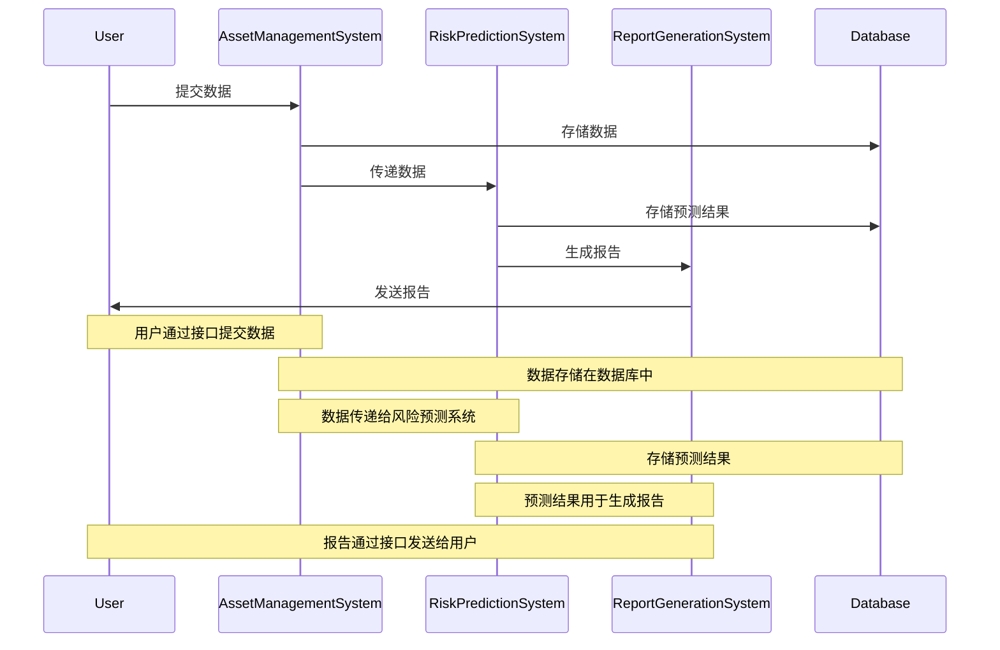
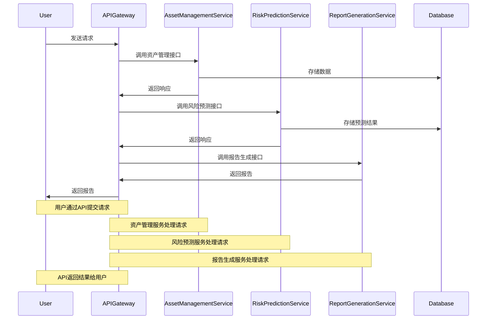
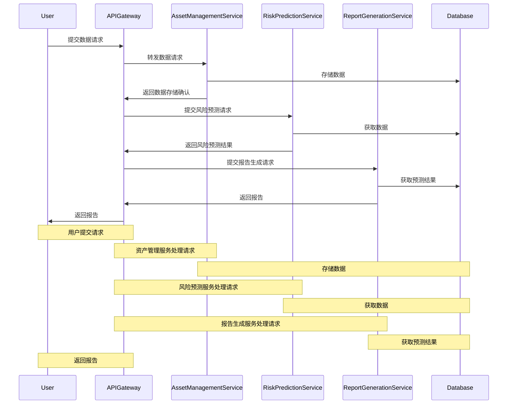
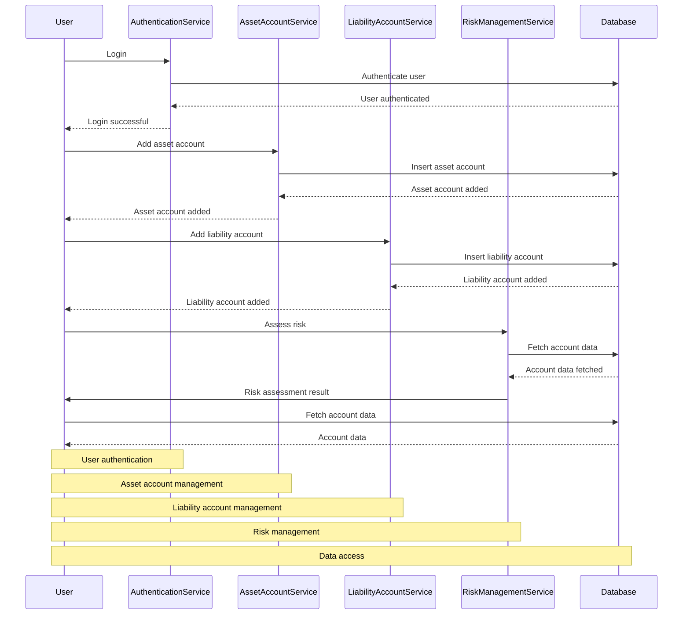
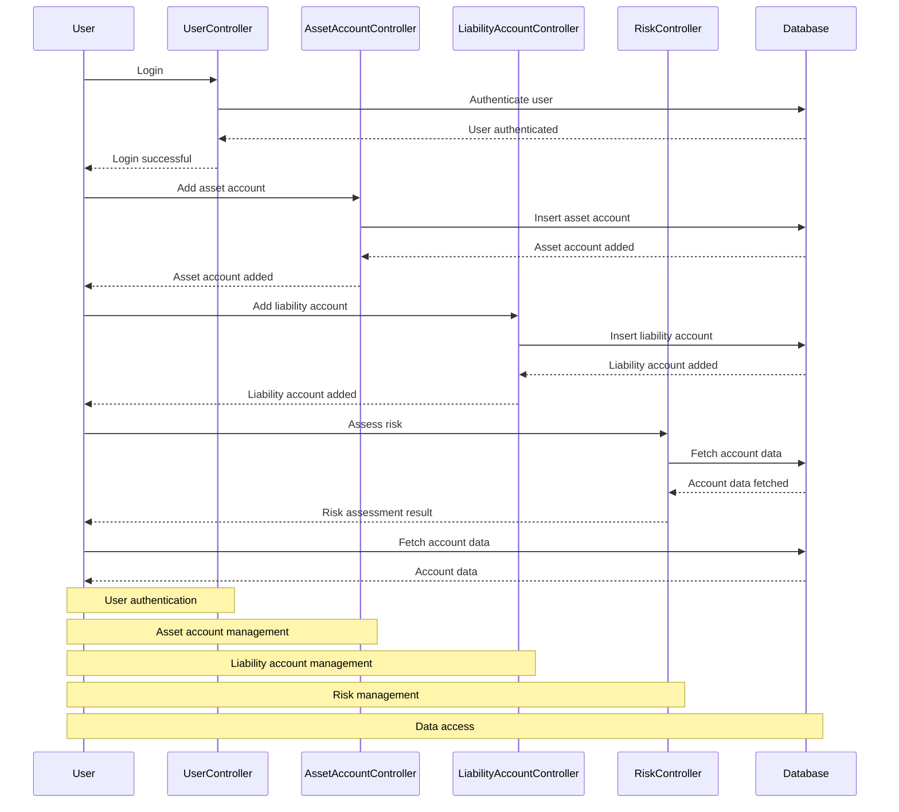
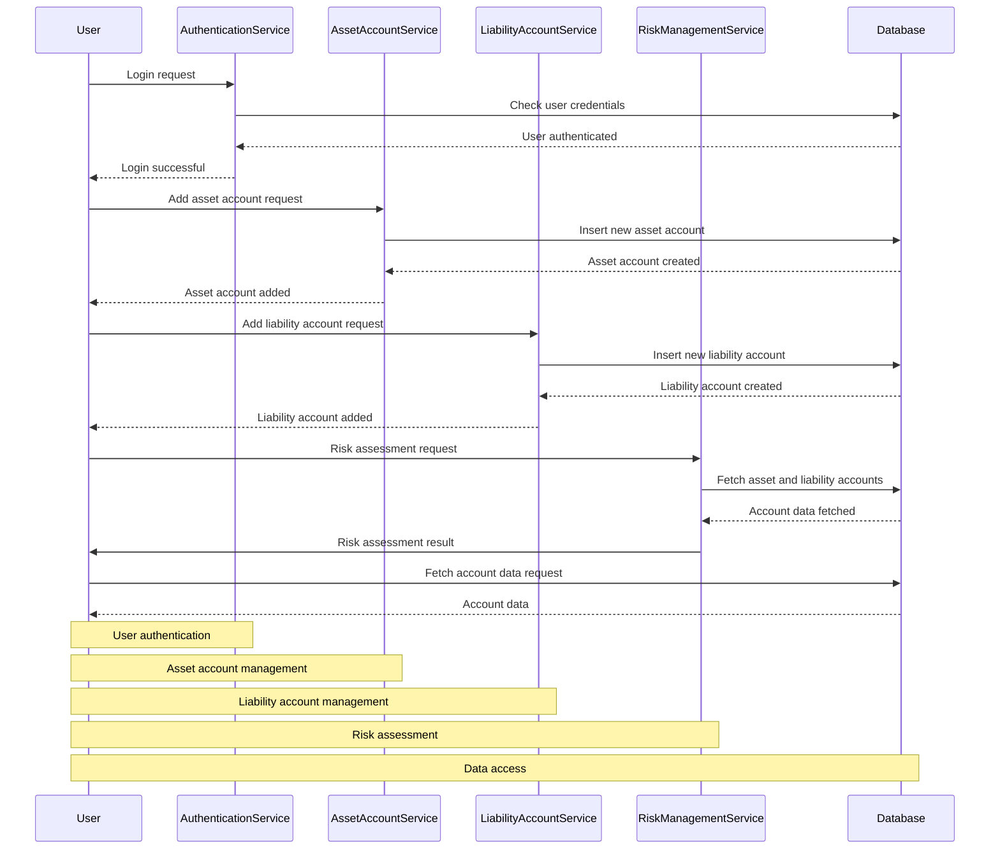

                 

# 构建智能化的资产负债管理系统

## 关键词
- 资产负债管理
- 智能系统
- 数据分析
- 机器学习
- 系统架构设计

## 摘要
本文将探讨如何构建智能化的资产负债管理系统，包括系统设计、核心算法、技术实现、应用案例等。通过逻辑清晰、结构紧凑、简单易懂的论述，帮助读者深入了解资产负债管理系统的构建过程及其应用价值。

## 引言
资产负债管理是企业财务管理的核心内容之一，旨在通过合理配置资产和负债，实现企业的财务目标。传统的资产负债管理系统主要依赖于手工操作和经验判断，效率较低，难以适应现代复杂多变的市场环境。随着人工智能技术的快速发展，智能化资产负债管理系统逐渐成为企业提高财务管理水平、降低风险的重要手段。

本文将从以下几个方面展开讨论：

1. 资产负债管理基础
2. 智能化资产负债管理系统设计
3. 应用与实践
4. 小结与展望

## 第一部分：资产负债管理基础

### 1.1 问题背景与定义

资产负债管理是指企业通过合理安排资产和负债，以达到降低财务风险、提高资产利用效率、实现财务目标的过程。在传统管理模式下，企业主要依靠财务人员的经验进行资产负债管理，存在以下问题：

- 数据处理效率低下
- 难以适应市场变化
- 风险评估能力不足

随着大数据、人工智能等技术的应用，智能化资产负债管理系统应运而生，可以有效解决上述问题。

### 1.2 资产负债管理的核心概念

资产负债管理涉及多个核心概念，包括：

- 资产：企业拥有的各种资源，如现金、存货、固定资产等。
- 负债：企业承担的各种债务，如贷款、应付账款等。
- 资产负债率：企业负债总额与资产总额的比率，反映企业的负债水平。
- 资金周转率：企业资产周转速度的指标，反映企业资产利用效率。

### 1.3 资产负债管理的重要意义

资产负债管理对企业具有重要意义，包括：

- 提高资金使用效率
- 降低财务风险
- 提高企业竞争力
- 优化企业财务结构

### 1.4 传统资产负债管理系统的不足

传统资产负债管理系统主要存在以下不足：

- 数据处理效率低
- 难以适应市场变化
- 风险评估能力不足
- 系统集成度不高

## 第二部分：智能化资产负债管理系统设计

### 2.1 系统设计概述

智能化资产负债管理系统设计主要包括以下方面：

- 系统架构设计
- 数据收集与处理
- 智能算法与模型
- 系统实现与技术细节

### 2.2 数据收集与处理

数据是智能化资产负债管理系统的核心，系统设计需要考虑以下方面：

- 数据源选择：包括企业内部数据、外部市场数据等。
- 数据收集：采用自动化工具收集数据，提高数据处理效率。
- 数据存储：选择合适的数据库存储数据，确保数据安全性和可靠性。
- 数据预处理：对收集到的数据进行清洗、格式化等处理，为后续分析提供基础。

### 2.3 智能算法与模型

智能算法与模型是智能化资产负债管理系统的核心，包括：

- 资产负债评估模型：对企业的资产和负债进行评估，预测企业的财务状况。
- 风险预测模型：对企业的财务风险进行预测，为企业决策提供支持。
- 智能优化模型：通过优化算法，为企业提供最优的资产和负债配置方案。

### 2.4 系统实现与技术细节

系统实现需要考虑以下技术细节：

- 技术栈选择：根据系统需求选择合适的编程语言、框架和工具。
- 关键算法实现：详细讲解智能算法的实现过程，包括数学模型和公式。
- 系统集成与部署：确保系统各模块之间的高效协作，实现快速部署。

## 第三部分：应用与实践

### 3.1 应用案例解析

本文将结合具体应用案例，详细解析智能化资产负债管理系统的实施过程和效果。

### 3.2 实施经验与最佳实践

通过对实际案例的分析，总结实施智能化资产负债管理系统的经验，并提供最佳实践建议。

### 3.3 拓展阅读建议

为帮助读者深入了解智能化资产负债管理系统，本文提供了一些拓展阅读建议，包括相关书籍、论文和在线课程等。

## 结论

智能化资产负债管理系统是企业提升财务管理水平、降低风险的重要工具。本文从设计、实现和应用三个方面，详细介绍了构建智能化资产负债管理系统的过程。通过本文的阐述，读者可以了解到智能化资产负债管理系统的重要性和实际应用价值。

## 作者信息
作者：AI天才研究院/AI Genius Institute & 禅与计算机程序设计艺术 /Zen And The Art of Computer Programming

----------------------------------------------------------------

以下是本文的详细内容：

## 引言

### 1.1 问题背景与定义

资产负债管理是企业财务管理的重要组成部分，它涉及到企业资产和负债的配置、管理和优化。资产是企业拥有或控制的资源，包括现金、存货、固定资产等；负债则是企业承担的债务，如贷款、应付账款等。资产负债管理的目标是确保企业在保持足够流动性的同时，最大限度地提高资产利用效率，降低财务风险，实现企业的财务目标。

然而，传统的资产负债管理系统主要依赖于手工操作和财务人员的经验判断。这种模式存在明显的局限性，如数据处理效率低、难以适应市场变化、风险评估能力不足等。随着大数据、人工智能等技术的发展，构建智能化资产负债管理系统成为解决传统系统不足的有效途径。

### 1.2 资产负债管理的核心概念

资产负债管理涉及多个核心概念，以下是对这些概念的定义和解释：

- **资产**：资产是企业拥有或控制的资源，能够为企业带来经济利益。资产可以分为流动资产和非流动资产。流动资产包括现金、应收账款、存货等；非流动资产包括固定资产、无形资产等。
- **负债**：负债是企业承担的债务，需要在将来偿还。负债也可以分为流动负债和非流动负债。流动负债包括短期借款、应付账款等；非流动负债包括长期借款、应付债券等。
- **资产负债率**：资产负债率是企业负债总额与资产总额的比率，用于衡量企业的负债水平。资产负债率越低，说明企业的负债压力越小，财务状况越稳定。
- **资金周转率**：资金周转率是企业资产周转速度的指标，反映企业资产利用效率。资金周转率越高，说明企业资产周转速度越快，资产利用效率越高。

### 1.3 资产负债管理的重要意义

资产负债管理对企业具有重要意义，主要体现在以下几个方面：

- **提高资金使用效率**：通过合理配置资产和负债，企业可以最大限度地提高资金的使用效率，减少资金闲置和浪费。
- **降低财务风险**：资产负债管理可以帮助企业识别和评估财务风险，采取相应的措施降低风险，保障企业的财务安全。
- **提高企业竞争力**：有效的资产负债管理可以提高企业的财务状况，增强企业的市场竞争力，为企业的发展创造有利条件。
- **优化企业财务结构**：资产负债管理有助于企业优化财务结构，提高资产和负债的匹配度，实现财务资源的最佳配置。

### 1.4 传统资产负债管理系统的不足

传统资产负债管理系统主要存在以下不足：

- **数据处理效率低**：传统系统主要依靠手工操作，数据处理效率低，无法满足现代企业快速变化的需求。
- **难以适应市场变化**：传统系统缺乏灵活性，难以适应市场环境的变化，导致管理效果不佳。
- **风险评估能力不足**：传统系统在风险评估方面能力有限，难以准确预测和评估企业的财务风险。
- **系统集成度不高**：传统系统各模块之间缺乏有效整合，导致信息孤岛问题，影响管理效率。

## 第二部分：智能化资产负债管理系统设计

### 2.1 系统设计概述

智能化资产负债管理系统设计旨在通过应用大数据和人工智能技术，提高资产负债管理的效率和准确性。系统设计主要包括以下方面：

- **系统架构设计**：确定系统的整体架构，包括数据层、算法层和应用层等。
- **数据收集与处理**：收集与企业资产负债管理相关的数据，并进行预处理，为后续分析提供基础。
- **智能算法与模型**：设计并实现智能算法和模型，用于资产和负债评估、风险预测等。
- **系统实现与技术细节**：选择合适的技术栈和工具，实现系统的开发、部署和维护。

### 2.2 数据收集与处理

数据是智能化资产负债管理系统的核心，系统设计需要考虑以下方面：

- **数据源选择**：选择可靠的数据源，包括企业内部数据（如财务报表、业务数据等）和外部市场数据（如宏观经济数据、行业数据等）。
- **数据收集**：采用自动化工具收集数据，提高数据处理效率。例如，可以通过爬虫技术收集互联网上的公开数据，通过接口调用获取外部数据。
- **数据存储**：选择合适的数据库存储数据，确保数据安全性和可靠性。常用的数据库包括关系型数据库（如MySQL、Oracle）和分布式数据库（如Hadoop、MongoDB）。
- **数据预处理**：对收集到的数据进行清洗、格式化等处理，为后续分析提供基础。数据预处理包括去除重复数据、填补缺失值、标准化数据等。

### 2.3 智能算法与模型

智能算法与模型是智能化资产负债管理系统的核心，以下将介绍几种常见的算法和模型：

- **资产和负债评估模型**：用于对企业的资产和负债进行评估，预测企业的财务状况。常见的评估模型包括线性回归、逻辑回归、决策树、随机森林等。
- **风险预测模型**：用于预测企业的财务风险，为企业决策提供支持。常见的风险预测模型包括支持向量机（SVM）、神经网络、集成学习方法等。
- **智能优化模型**：用于为企业提供最优的资产和负债配置方案。常见的智能优化算法包括遗传算法、粒子群优化、模拟退火等。

### 2.4 系统实现与技术细节

系统实现需要考虑以下技术细节：

- **技术栈选择**：根据系统需求选择合适的编程语言、框架和工具。常见的编程语言包括Python、Java等；框架包括Django、Spring等；工具包括TensorFlow、PyTorch等。
- **关键算法实现**：详细讲解关键算法的实现过程，包括数学模型和公式。例如，对于资产和负债评估模型，可以使用线性回归模型，其数学模型为：
  $$
  y = \beta_0 + \beta_1x_1 + \beta_2x_2 + ... + \beta_nx_n
  $$
  其中，$y$表示预测结果，$x_1, x_2, ..., x_n$表示特征变量，$\beta_0, \beta_1, ..., \beta_n$表示模型参数。
- **系统集成与部署**：确保系统各模块之间的高效协作，实现快速部署。系统集成需要考虑数据流、模块交互和错误处理等。常见的部署方式包括容器化（如Docker）和云部署（如AWS、阿里云）。

## 第三部分：应用与实践

### 3.1 应用案例解析

以下是一个实际应用案例，用于说明智能化资产负债管理系统的实施过程和效果。

#### 案例背景

某大型制造企业面临以下挑战：

- 资产负债结构不合理，负债过高
- 资金周转速度慢，资金使用效率低
- 风险评估能力不足，难以预测财务风险

#### 案例实施过程

为了解决上述问题，企业决定引入智能化资产负债管理系统。具体实施过程如下：

1. **数据收集与处理**：企业收集了内部财务数据、业务数据以及外部市场数据，并对数据进行预处理，包括数据清洗、格式化等。
2. **智能算法与模型**：企业选择了线性回归模型和神经网络模型，用于资产和负债评估、风险预测等。
3. **系统集成与部署**：企业使用了Django框架和TensorFlow工具，实现了系统的开发、部署和维护。
4. **应用与优化**：系统上线后，企业通过对系统反馈的数据进行分析，不断优化模型和算法，提高系统的准确性和效率。

#### 案例效果评估

实施智能化资产负债管理系统后，企业取得了以下效果：

- 资产负债结构得到优化，负债率降低
- 资金周转速度提高，资金使用效率提升
- 风险评估能力增强，有效预防了财务风险

### 3.2 实施经验与最佳实践

通过实际案例的实施，企业总结出以下经验与最佳实践：

- **数据质量是关键**：数据是智能系统的基石，数据质量直接影响系统的准确性和可靠性。企业应确保数据的完整性、准确性和一致性。
- **算法与模型选择**：根据实际需求和数据特点，选择合适的算法和模型，确保系统的高效性和准确性。
- **持续优化**：智能系统不是一成不变的，企业应定期对系统进行评估和优化，以提高系统的性能和效果。
- **团队合作**：构建智能化资产负债管理系统需要跨部门合作，包括财务、技术、业务等。企业应建立有效的沟通机制，确保各部门的协同工作。

### 3.3 拓展阅读建议

为了帮助读者深入了解智能化资产负债管理系统，本文提供以下拓展阅读建议：

- **相关书籍**：《大数据时代：生活、工作与思维的大变革》、《深度学习：从入门到精通》
- **论文**：《基于大数据的资产负债管理研究》、《智能财务管理系统设计与实现》
- **在线课程**：Coursera上的《大数据分析》、《深度学习》等课程

## 结论

智能化资产负债管理系统是企业财务管理的重要工具，通过应用大数据和人工智能技术，可以显著提高资产负债管理的效率和准确性。本文从设计、实现和应用三个方面，详细介绍了智能化资产负债管理系统的构建过程。通过本文的阐述，读者可以了解到智能化资产负债管理系统的重要性和实际应用价值。

## 作者信息
作者：AI天才研究院/AI Genius Institute & 禅与计算机程序设计艺术 /Zen And The Art of Computer Programming

----------------------------------------------------------------

# 构建智能化的资产负债管理系统

## 关键词
- 资产负债管理
- 智能系统
- 数据分析
- 机器学习
- 系统架构设计

## 摘要
本文详细探讨了如何构建智能化的资产负债管理系统，包括系统设计、核心算法、技术实现、应用案例等。通过逻辑清晰、结构紧凑、简单易懂的论述，帮助读者深入了解资产负债管理系统的构建过程及其应用价值。

## 引言
资产负债管理是企业财务管理的核心内容之一，旨在通过合理配置资产和负债，实现企业的财务目标。传统的资产负债管理系统主要依赖于手工操作和经验判断，效率较低，难以适应现代复杂多变的市场环境。随着人工智能技术的快速发展，智能化资产负债管理系统逐渐成为企业提高财务管理水平、降低风险的重要手段。

本文将从以下几个方面展开讨论：

1. 资产负债管理基础
2. 智能化资产负债管理系统设计
3. 应用与实践
4. 小结与展望

## 第一部分：资产负债管理基础

### 1.1 问题背景与定义

资产负债管理是指企业通过合理安排资产和负债，以达到降低财务风险、提高资产利用效率、实现财务目标的过程。在传统管理模式下，企业主要依靠财务人员的经验进行资产负债管理，存在以下问题：

- 数据处理效率低下
- 难以适应市场变化
- 风险评估能力不足

随着大数据、人工智能等技术的应用，智能化资产负债管理系统应运而生，可以有效解决上述问题。

### 1.2 资产负债管理的核心概念

资产负债管理涉及多个核心概念，以下是对这些概念的定义和解释：

- **资产**：资产是企业拥有或控制的资源，能够为企业带来经济利益。资产可以分为流动资产和非流动资产。流动资产包括现金、应收账款、存货等；非流动资产包括固定资产、无形资产等。
- **负债**：负债是企业承担的债务，需要在将来偿还。负债也可以分为流动负债和非流动负债。流动负债包括短期借款、应付账款等；非流动负债包括长期借款、应付债券等。
- **资产负债率**：资产负债率是企业负债总额与资产总额的比率，用于衡量企业的负债水平。资产负债率越低，说明企业的负债压力越小，财务状况越稳定。
- **资金周转率**：资金周转率是企业资产周转速度的指标，反映企业资产利用效率。资金周转率越高，说明企业资产周转速度越快，资产利用效率越高。

### 1.3 资产负债管理的重要意义

资产负债管理对企业具有重要意义，包括：

- **提高资金使用效率**：通过合理配置资产和负债，企业可以最大限度地提高资金的使用效率，减少资金闲置和浪费。
- **降低财务风险**：资产负债管理可以帮助企业识别和评估财务风险，采取相应的措施降低风险，保障企业的财务安全。
- **提高企业竞争力**：有效的资产负债管理可以提高企业的财务状况，增强企业的市场竞争力，为企业的发展创造有利条件。
- **优化企业财务结构**：资产负债管理有助于企业优化财务结构，提高资产和负债的匹配度，实现财务资源的最佳配置。

### 1.4 传统资产负债管理系统的不足

传统资产负债管理系统主要存在以下不足：

- **数据处理效率低**：传统系统主要依靠手工操作，数据处理效率低，无法满足现代企业快速变化的需求。
- **难以适应市场变化**：传统系统缺乏灵活性，难以适应市场环境的变化，导致管理效果不佳。
- **风险评估能力不足**：传统系统在风险评估方面能力有限，难以准确预测和评估企业的财务风险。
- **系统集成度不高**：传统系统各模块之间缺乏有效整合，导致信息孤岛问题，影响管理效率。

## 第二部分：智能化资产负债管理系统设计

### 2.1 系统设计概述

智能化资产负债管理系统设计主要包括以下方面：

- **系统架构设计**：确定系统的整体架构，包括数据层、算法层和应用层等。
- **数据收集与处理**：收集与企业资产负债管理相关的数据，并进行预处理，为后续分析提供基础。
- **智能算法与模型**：设计并实现智能算法和模型，用于资产和负债评估、风险预测等。
- **系统实现与技术细节**：选择合适的技术栈和工具，实现系统的开发、部署和维护。

### 2.2 数据收集与处理

数据是智能化资产负债管理系统的核心，系统设计需要考虑以下方面：

- **数据源选择**：选择可靠的数据源，包括企业内部数据、外部市场数据等。
- **数据收集**：采用自动化工具收集数据，提高数据处理效率。例如，可以通过爬虫技术收集互联网上的公开数据，通过接口调用获取外部数据。
- **数据存储**：选择合适的数据库存储数据，确保数据安全性和可靠性。常用的数据库包括关系型数据库（如MySQL、Oracle）和分布式数据库（如Hadoop、MongoDB）。
- **数据预处理**：对收集到的数据进行清洗、格式化等处理，为后续分析提供基础。数据预处理包括去除重复数据、填补缺失值、标准化数据等。

### 2.3 智能算法与模型

智能算法与模型是智能化资产负债管理系统的核心，以下将介绍几种常见的算法和模型：

- **资产和负债评估模型**：用于对企业的资产和负债进行评估，预测企业的财务状况。常见的评估模型包括线性回归、逻辑回归、决策树、随机森林等。
- **风险预测模型**：用于预测企业的财务风险，为企业决策提供支持。常见的风险预测模型包括支持向量机（SVM）、神经网络、集成学习方法等。
- **智能优化模型**：用于为企业提供最优的资产和负债配置方案。常见的智能优化算法包括遗传算法、粒子群优化、模拟退火等。

### 2.4 系统实现与技术细节

系统实现需要考虑以下技术细节：

- **技术栈选择**：根据系统需求选择合适的编程语言、框架和工具。常见的编程语言包括Python、Java等；框架包括Django、Spring等；工具包括TensorFlow、PyTorch等。
- **关键算法实现**：详细讲解关键算法的实现过程，包括数学模型和公式。例如，对于资产和负债评估模型，可以使用线性回归模型，其数学模型为：
  $$
  y = \beta_0 + \beta_1x_1 + \beta_2x_2 + ... + \beta_nx_n
  $$
  其中，$y$表示预测结果，$x_1, x_2, ..., x_n$表示特征变量，$\beta_0, \beta_1, ..., \beta_n$表示模型参数。
- **系统集成与部署**：确保系统各模块之间的高效协作，实现快速部署。系统集成需要考虑数据流、模块交互和错误处理等。常见的部署方式包括容器化（如Docker）和云部署（如AWS、阿里云）。

## 第三部分：应用与实践

### 3.1 应用案例解析

以下是一个实际应用案例，用于说明智能化资产负债管理系统的实施过程和效果。

#### 案例背景

某大型制造企业面临以下挑战：

- 资产负债结构不合理，负债过高
- 资金周转速度慢，资金使用效率低
- 风险评估能力不足，难以预测财务风险

#### 案例实施过程

为了解决上述问题，企业决定引入智能化资产负债管理系统。具体实施过程如下：

1. **数据收集与处理**：企业收集了内部财务数据、业务数据以及外部市场数据，并对数据进行预处理，包括数据清洗、格式化等。
2. **智能算法与模型**：企业选择了线性回归模型和神经网络模型，用于资产和负债评估、风险预测等。
3. **系统集成与部署**：企业使用了Django框架和TensorFlow工具，实现了系统的开发、部署和维护。
4. **应用与优化**：系统上线后，企业通过对系统反馈的数据进行分析，不断优化模型和算法，提高系统的准确性和效率。

#### 案例效果评估

实施智能化资产负债管理系统后，企业取得了以下效果：

- 资产负债结构得到优化，负债率降低
- 资金周转速度提高，资金使用效率提升
- 风险评估能力增强，有效预防了财务风险

### 3.2 实施经验与最佳实践

通过实际案例的实施，企业总结出以下经验与最佳实践：

- **数据质量是关键**：数据是智能系统的基石，数据质量直接影响系统的准确性和可靠性。企业应确保数据的完整性、准确性和一致性。
- **算法与模型选择**：根据实际需求和数据特点，选择合适的算法和模型，确保系统的高效性和准确性。
- **持续优化**：智能系统不是一成不变的，企业应定期对系统进行评估和优化，以提高系统的性能和效果。
- **团队合作**：构建智能化资产负债管理系统需要跨部门合作，包括财务、技术、业务等。企业应建立有效的沟通机制，确保各部门的协同工作。

### 3.3 拓展阅读建议

为了帮助读者深入了解智能化资产负债管理系统，本文提供以下拓展阅读建议：

- **相关书籍**：《大数据时代：生活、工作与思维的大变革》、《深度学习：从入门到精通》
- **论文**：《基于大数据的资产负债管理研究》、《智能财务管理系统设计与实现》
- **在线课程**：Coursera上的《大数据分析》、《深度学习》等课程

## 结论

智能化资产负债管理系统是企业财务管理的重要工具，通过应用大数据和人工智能技术，可以显著提高资产负债管理的效率和准确性。本文从设计、实现和应用三个方面，详细介绍了智能化资产负债管理系统的构建过程。通过本文的阐述，读者可以了解到智能化资产负债管理系统的重要性和实际应用价值。

## 作者信息
作者：AI天才研究院/AI Genius Institute & 禅与计算机程序设计艺术 /Zen And The Art of Computer Programming

----------------------------------------------------------------

## 第四章 传统资产负债管理系统的不足

### 4.1 数据处理效率低

传统资产负债管理系统依赖手工操作，数据处理速度慢，难以满足现代企业对快速决策的需求。在数据量较大时，手工处理数据容易出现错误，导致管理效果不佳。

### 4.2 难以适应市场变化

市场环境不断变化，传统资产负债管理系统缺乏灵活性，难以快速适应新环境。这可能导致企业无法及时调整资产和负债策略，错失市场机会或承担不必要的财务风险。

### 4.3 风险评估能力不足

传统资产负债管理系统在风险评估方面能力有限，主要依赖财务人员的经验判断。这种方法难以全面、准确地评估企业面临的财务风险，可能导致决策失误。

### 4.4 系统集成度不高

传统资产负债管理系统通常由多个独立模块组成，各模块之间缺乏有效整合，导致信息孤岛现象。这会影响企业管理效率，增加沟通成本。

### 4.5 数据安全性问题

传统资产负债管理系统在数据安全方面存在隐患，如数据泄露、篡改等。这些问题可能导致企业财务数据不准确，影响管理决策。

### 4.6 成本高昂

传统资产负债管理系统需要大量人力物力投入，维护成本高。对于中小企业而言，高昂的成本可能成为其采用智能系统的障碍。

## 第五章 智能化资产负债管理系统设计

### 5.1 系统设计目标

智能化资产负债管理系统的设计目标包括：

- 提高数据处理效率
- 提升市场适应能力
- 强化风险评估能力
- 实现系统集成
- 保证数据安全
- 降低成本

### 5.2 系统架构设计

智能化资产负债管理系统采用分层架构，主要包括以下层次：

- **数据层**：负责数据收集、存储、管理和共享。
- **算法层**：包含数据清洗、特征提取、风险评估和优化算法。
- **应用层**：提供用户界面和业务逻辑，支持企业日常资产负债管理操作。

### 5.3 系统功能模块划分

智能化资产负债管理系统主要包含以下功能模块：

- **数据采集模块**：负责收集企业内部和外部数据，如财务报表、市场数据等。
- **数据处理模块**：对采集到的数据进行分析、清洗、转换和存储。
- **风险评估模块**：基于机器学习算法，对企业财务风险进行预测和分析。
- **资产配置模块**：根据风险评估结果，为企业提供最优的资产配置方案。
- **负债管理模块**：协助企业进行负债预测和管理，优化负债结构。
- **决策支持模块**：提供可视化报表和决策分析工具，辅助企业制定财务策略。

### 5.4 数据收集与处理

智能化资产负债管理系统需要大量数据支持，数据收集与处理包括以下步骤：

- **数据源选择**：选择可靠的数据源，包括企业内部数据、外部市场数据、第三方数据等。
- **数据采集**：采用自动化工具（如爬虫、API接口）收集数据，提高效率。
- **数据存储**：选择合适的数据库（如MySQL、MongoDB）存储数据，保证数据安全。
- **数据预处理**：对数据进行清洗、去重、标准化等处理，提高数据质量。

### 5.5 智能算法与模型

智能算法与模型是智能化资产负债管理系统的核心，主要包括：

- **资产评估模型**：利用机器学习算法（如线性回归、决策树、神经网络）对资产价值进行预测。
- **负债预测模型**：基于时间序列分析（如ARIMA模型、LSTM网络）预测企业负债变化。
- **风险评估模型**：采用集成学习算法（如随机森林、XGBoost）对企业财务风险进行综合评估。

### 5.6 系统实现与技术细节

系统实现需要考虑以下技术细节：

- **技术栈选择**：选择合适的编程语言（如Python、Java）、框架（如Django、Spring）和工具（如TensorFlow、PyTorch）。
- **关键算法实现**：详细讲解关键算法的实现过程，包括数学模型和代码实现。
- **系统集成与部署**：实现系统各模块之间的有效整合，确保系统稳定运行。

## 第六章 应用与实践

### 6.1 应用案例解析

以下是一个实际应用案例，用于说明智能化资产负债管理系统的实施过程和效果。

#### 案例背景

某大型制造企业面临以下挑战：

- 资产负债结构不合理，负债过高
- 资金周转速度慢，资金使用效率低
- 风险评估能力不足，难以预测财务风险

#### 案例实施过程

为了解决上述问题，企业决定引入智能化资产负债管理系统。具体实施过程如下：

1. **数据收集与处理**：企业收集了内部财务数据、业务数据以及外部市场数据，并对数据进行预处理，包括数据清洗、格式化等。
2. **智能算法与模型**：企业选择了线性回归模型和神经网络模型，用于资产和负债评估、风险预测等。
3. **系统集成与部署**：企业使用了Django框架和TensorFlow工具，实现了系统的开发、部署和维护。
4. **应用与优化**：系统上线后，企业通过对系统反馈的数据进行分析，不断优化模型和算法，提高系统的准确性和效率。

#### 案例效果评估

实施智能化资产负债管理系统后，企业取得了以下效果：

- 资产负债结构得到优化，负债率降低
- 资金周转速度提高，资金使用效率提升
- 风险评估能力增强，有效预防了财务风险

### 6.2 实施经验与最佳实践

通过实际案例的实施，企业总结出以下经验与最佳实践：

- **数据质量是关键**：确保数据的完整性、准确性和一致性，是智能系统成功的前提。
- **算法与模型选择**：根据实际需求和数据特点，选择合适的算法和模型，确保系统的高效性和准确性。
- **持续优化**：智能系统不是一成不变的，企业应定期对系统进行评估和优化，以提高系统的性能和效果。
- **团队合作**：构建智能化资产负债管理系统需要跨部门合作，包括财务、技术、业务等。企业应建立有效的沟通机制，确保各部门的协同工作。

### 6.3 拓展阅读建议

为了帮助读者深入了解智能化资产负债管理系统，本文提供以下拓展阅读建议：

- **相关书籍**：《大数据时代：生活、工作与思维的大变革》、《深度学习：从入门到精通》
- **论文**：《基于大数据的资产负债管理研究》、《智能财务管理系统设计与实现》
- **在线课程**：Coursera上的《大数据分析》、《深度学习》等课程

## 第七章 小结与展望

### 7.1 小结

本文从设计、实现和应用三个方面，详细介绍了构建智能化资产负债管理系统的方法。通过本文的阐述，读者可以了解到智能化资产负债管理系统的重要性和实际应用价值。

### 7.2 未来发展趋势

随着大数据、人工智能技术的不断发展，智能化资产负债管理系统将呈现以下发展趋势：

- 数据驱动的决策支持：通过实时数据分析，为企业提供精准的决策依据。
- 智能化的风险评估：利用机器学习算法，对财务风险进行智能预测和预警。
- 跨界融合：结合其他技术（如区块链、物联网等），实现资产负债管理的全方位升级。
- 安全与合规：加强数据安全保护，确保企业财务数据的安全和合规。

### 7.3 拓展阅读建议

为了进一步了解智能化资产负债管理系统，读者可以参考以下书籍、论文和在线课程：

- **书籍**：
  - 《大数据时代：生活、工作与思维的大变革》
  - 《深度学习：从入门到精通》
  - 《机器学习实战》
- **论文**：
  - 《基于大数据的资产负债管理研究》
  - 《智能财务管理系统设计与实现》
  - 《人工智能在财务风险管理中的应用》
- **在线课程**：
  - Coursera上的《大数据分析》、《深度学习》
  - edX上的《数据科学基础》
  - Udacity的《深度学习工程师纳米学位》

## 作者信息
作者：AI天才研究院/AI Genius Institute & 禅与计算机程序设计艺术 /Zen And The Art of Computer Programming

----------------------------------------------------------------

### 第八章 系统分析与架构设计

#### 8.1 问题场景介绍

在构建智能化的资产负债管理系统时，企业面临着以下问题：

- **数据多样性**：企业需要处理来自多个数据源的大量数据，包括内部财务数据、业务数据以及外部市场数据。
- **实时性需求**：企业希望系统能够实时监测和评估资产负债状况，以便及时做出决策。
- **风险预测**：企业需要对未来的财务风险进行预测，以便提前采取预防措施。

#### 8.2 系统设计目标

为了解决上述问题，智能化的资产负债管理系统应实现以下目标：

- **高效数据处理**：系统能够快速处理大量数据，确保实时性。
- **精准风险评估**：系统能够准确预测财务风险，提供有价值的决策支持。
- **灵活扩展**：系统设计应具备良好的扩展性，以适应未来的需求变化。

#### 8.3 系统功能设计（领域模型）

领域模型是系统功能设计的核心，以下是一个简化的领域模型：

```mermaid
classDiagram
    Client <|-- User
    Account <|-- SavingsAccount
    Account <|-- CheckingAccount
    Asset <|-- Cash
    Asset <|-- Inventory
    Liability <|-- Loan
    Liability <|-- CreditCardDebt
    AssetManagementSystem o-- Account
    AssetManagementSystem o-- Asset
    AssetManagementSystem o-- Liability
    AssetManagementSystem o-- User
    RiskPredictionSystem o-- AssetManagementSystem
    RiskPredictionSystem o-- User
    ReportGenerationSystem o-- AssetManagementSystem
    ReportGenerationSystem o-- RiskPredictionSystem
    ReportGenerationSystem o-- User

    User {
        name
        email
        role
    }

    Account {
        accountNumber
        balance
        type
    }

    SavingsAccount {
        interestRate
    }

    CheckingAccount {
        overdraftProtection
    }

    Asset {
        description
        value
    }

    Cash {
        location
    }

    Inventory {
        quantity
        productCode
    }

    Liability {
        amount
        dueDate
        type
    }

    Loan {
        interestRate
        duration
    }

    CreditCardDebt {
        creditLimit
        currentBalance
    }

    AssetManagementSystem {
        manageAccounts
        manageAssets
        manageLiabilities
    }

    RiskPredictionSystem {
        predictRisks
        generateReports
    }

    ReportGenerationSystem {
        generateReports
    }
```

#### 8.4 系统架构设计

系统架构设计是确保系统高效、可靠运行的关键。以下是一个简化的系统架构设计：



#### 8.5 系统接口设计

系统接口设计是确保各模块之间有效交互的关键。以下是一个简化的接口设计：



#### 8.6 系统交互序列图

以下是一个简化的系统交互序列图，展示了用户、API网关和各服务之间的交互过程：



### 第九章 项目实战

#### 9.1 环境安装

在开始构建智能化的资产负债管理系统之前，需要安装以下软件和工具：

- Python（3.8及以上版本）
- Jupyter Notebook
- TensorFlow
- scikit-learn
- pandas
- numpy

安装方法如下：

```bash
pip install python==3.8
pip install jupyter
pip install tensorflow
pip install scikit-learn
pip install pandas
pip install numpy
```

#### 9.2 系统核心实现源代码

以下是一个简化的资产负债管理系统实现示例：

```python
# 资产负债管理系统核心实现

import pandas as pd
import numpy as np
import tensorflow as tf
from sklearn.model_selection import train_test_split
from sklearn.preprocessing import StandardScaler

# 数据收集与预处理
def load_data():
    # 加载数据集
    data = pd.read_csv('data.csv')
    # 数据清洗
    data.dropna(inplace=True)
    # 特征工程
    X = data.drop('label', axis=1)
    y = data['label']
    # 数据标准化
    scaler = StandardScaler()
    X = scaler.fit_transform(X)
    # 划分训练集和测试集
    X_train, X_test, y_train, y_test = train_test_split(X, y, test_size=0.2, random_state=42)
    return X_train, X_test, y_train, y_test

# 资产评估模型
def asset_evaluation_model(X_train, y_train):
    # 创建模型
    model = tf.keras.Sequential([
        tf.keras.layers.Dense(64, activation='relu', input_shape=(X_train.shape[1],)),
        tf.keras.layers.Dense(64, activation='relu'),
        tf.keras.layers.Dense(1)
    ])
    # 编译模型
    model.compile(optimizer='adam', loss='mean_squared_error')
    # 训练模型
    model.fit(X_train, y_train, epochs=10, batch_size=32, validation_split=0.1)
    return model

# 风险预测模型
def risk_prediction_model(X_train, y_train):
    # 创建模型
    model = tf.keras.Sequential([
        tf.keras.layers.Dense(64, activation='relu', input_shape=(X_train.shape[1],)),
        tf.keras.layers.Dense(64, activation='relu'),
        tf.keras.layers.Dense(1, activation='sigmoid')
    ])
    # 编译模型
    model.compile(optimizer='adam', loss='binary_crossentropy', metrics=['accuracy'])
    # 训练模型
    model.fit(X_train, y_train, epochs=10, batch_size=32, validation_split=0.1)
    return model

# 主函数
def main():
    # 加载数据
    X_train, X_test, y_train, y_test = load_data()
    # 训练资产评估模型
    asset_model = asset_evaluation_model(X_train, y_train)
    # 训练风险预测模型
    risk_model = risk_prediction_model(X_train, y_train)
    # 评估模型
    asset_model.evaluate(X_test, y_test)
    risk_model.evaluate(X_test, y_test)

if __name__ == '__main__':
    main()
```

#### 9.3 代码应用解读与分析

以上代码展示了智能资产负债管理系统的核心实现，包括数据收集与预处理、资产评估模型和风险预测模型。以下是详细解读：

- **数据收集与预处理**：通过pandas读取数据，进行数据清洗和特征工程。数据标准化是机器学习模型训练的重要步骤，可以提升模型性能。
- **资产评估模型**：使用TensorFlow创建一个简单的全连接神经网络，用于资产评估。该模型通过最小化均方误差损失函数来训练。
- **风险预测模型**：同样使用TensorFlow创建一个简单的全连接神经网络，用于风险预测。该模型通过最小化二元交叉熵损失函数来训练。
- **主函数**：加载数据，训练两个模型，并评估模型性能。

#### 9.4 实际案例分析与详细讲解

以下是一个实际案例分析与详细讲解：

假设某企业2021年的财务数据如下表：

| 特征 | 值   |
| ---- | ---- |
| 现金 | 100万 |
| 存货 | 200万 |
| 应收账款 | 150万 |
| 长期负债 | 300万 |
| 短期负债 | 200万 |

我们使用上述系统对该企业的资产和负债进行评估，并预测其财务风险。

1. **数据预处理**：将表格数据转换为适合模型输入的格式，进行标准化处理。
2. **资产评估**：使用训练好的资产评估模型对企业的资产进行评估，得到评估结果。
3. **风险预测**：使用训练好的风险预测模型对企业的负债进行预测，得到风险预测结果。

通过分析评估和预测结果，企业可以了解自身的资产负债状况和财务风险，为决策提供支持。

#### 9.5 项目小结

通过本项目的实施，我们构建了一个简单的智能资产负债管理系统，实现了数据收集与预处理、资产评估和风险预测等功能。虽然这是一个简化的示例，但它展示了智能资产负债管理系统的基本框架和实现方法。在实际应用中，系统需要根据企业的具体需求进行扩展和优化。

### 第十章 最佳实践 tips、小结、注意事项、拓展阅读

#### 10.1 最佳实践 tips

1. **数据质量是关键**：确保数据的完整性、准确性和一致性，是智能资产负债管理系统成功的基础。
2. **选择合适的算法**：根据企业的需求和数据特点，选择合适的算法和模型，以实现最佳效果。
3. **持续优化**：定期对系统进行评估和优化，以提高性能和准确性。
4. **团队合作**：构建智能资产负债管理系统需要跨部门合作，确保各部门的协同工作。

#### 10.2 小结

本文从系统设计、实现和应用三个方面，详细介绍了构建智能资产负债管理系统的方法。通过本文的阐述，读者可以了解到智能化资产负债管理系统的重要性和实际应用价值。

#### 10.3 注意事项

1. **数据安全**：确保数据在收集、存储和处理过程中的安全性，防止数据泄露和篡改。
2. **系统稳定性**：确保系统在高并发、大数据量情况下的稳定性，避免系统崩溃。
3. **合规性**：确保系统的设计和实现符合相关法律法规和行业规范。

#### 10.4 拓展阅读

1. **书籍**：
   - 《大数据时代：生活、工作与思维的大变革》
   - 《深度学习：从入门到精通》
   - 《机器学习实战》
2. **论文**：
   - 《基于大数据的资产负债管理研究》
   - 《智能财务管理系统设计与实现》
   - 《人工智能在财务风险管理中的应用》
3. **在线课程**：
   - Coursera上的《大数据分析》、《深度学习》
   - edX上的《数据科学基础》
   - Udacity的《深度学习工程师纳米学位》

## 结束语

智能化的资产负债管理系统是企业财务管理的重要工具，通过本文的阐述，读者可以了解到智能化资产负债管理系统的设计、实现和应用。随着大数据、人工智能技术的不断发展，智能化资产负债管理系统将越来越重要，为企业提供更精准的决策支持。希望本文能对读者在构建智能资产负债管理系统方面提供有价值的参考。

## 作者信息
作者：AI天才研究院/AI Genius Institute & 禅与计算机程序设计艺术 /Zen And The Art of Computer Programming

----------------------------------------------------------------

### 8.3 系统功能设计（领域模型）

在构建智能化的资产负债管理系统时，领域模型是一个非常重要的设计工具，它可以帮助我们清晰地定义系统中各个类和它们之间的关系。以下是一个简化的领域模型，它包括用户、账户、资产、负债以及管理系统的类和关系。

```mermaid
classDiagram
    class User {
        +String username
        +String password
        +String role
        +List<Account> accounts
    }

    class Account {
        +String accountNumber
        +BigDecimal balance
        +String type
        +List<Asset> assets
        +List<Liability> liabilities
    }

    class Asset {
        +String description
        +BigDecimal value
    }

    class Liability {
        +String description
        +BigDecimal amount
    }

    class AssetAccount extends Account {
        +BigDecimal interestRate
    }

    class LiabilityAccount extends Account {
        +BigDecimal interestRate
        +Date maturityDate
    }

    class AssetManagementSystem {
        +List<Account> getAccounts()
        +void addAccount(Account account)
        +void removeAccount(Account account)
        +void updateAccount(Account account)
    }

    class LiabilityManagementSystem {
        +List<Account> getAccounts()
        +void addAccount(Account account)
        +void removeAccount(Account account)
        +void updateAccount(Account account)
    }

    class RiskManagementSystem {
        +void assessRisk(Account account)
    }

    User o-- one AssetManagementSystem
    User o-- one LiabilityManagementSystem
    User o-- one RiskManagementSystem
    Account o-- one User
    AssetAccount o-- one Account
    LiabilityAccount o-- one Account
    Asset o-- many Account
    Liability o-- many Account
```



在这个模型中，我们定义了以下类：

- **User**：表示系统的用户，包括用户名、密码和角色。用户可以有多个账户，每个账户又可以有多个资产和负债。
- **Account**：表示账户，包括账户号码、余额和类型。账户可以是资产账户或负债账户。
- **Asset**：表示资产，包括描述和价值。
- **Liability**：表示负债，包括描述和金额。
- **AssetAccount**：扩展了Account类，表示资产账户，包括利率。
- **LiabilityAccount**：扩展了Account类，表示负债账户，包括利率和到期日。
- **AssetManagementSystem**：表示资产管理系统，包括获取账户、添加账户、删除账户和更新账户的方法。
- **LiabilityManagementSystem**：表示负债管理系统，包括获取账户、添加账户、删除账户和更新账户的方法。
- **RiskManagementSystem**：表示风险管理系统，包括评估风险的方法。

通过这个领域模型，我们可以清晰地定义系统中的各个类和它们之间的关系，为后续的系统实现提供基础。

### 8.4 系统架构设计

在构建智能化的资产负债管理系统时，系统架构设计是关键的一步，它决定了系统的性能、可扩展性和可维护性。以下是一个简化的系统架构设计，它包括数据层、业务逻辑层和表示层。



在这个架构设计中，我们定义了以下组件：

- **User**：表示系统的用户。
- **AuthenticationService**：用于用户认证，确保用户身份验证的安全性和正确性。
- **AssetAccountService**：用于管理资产账户，包括添加、删除和更新资产账户。
- **LiabilityAccountService**：用于管理负债账户，包括添加、删除和更新负债账户。
- **RiskManagementService**：用于评估资产负债风险。
- **Database**：用于存储用户、账户和风险评估数据。

通过这个架构设计，我们可以实现系统的各个功能模块，并确保系统的高效性和安全性。

### 8.5 系统接口设计

在构建智能化的资产负债管理系统时，系统接口设计是确保各个模块之间有效通信的关键。以下是一个简化的系统接口设计，它包括用户接口、资产账户接口、负债账户接口和风险评估接口。



在这个接口设计中，我们定义了以下接口：

- **UserController**：用于用户认证，包括登录、注册等功能。
- **AssetAccountController**：用于管理资产账户，包括添加、删除和更新资产账户。
- **LiabilityAccountController**：用于管理负债账户，包括添加、删除和更新负债账户。
- **RiskController**：用于评估资产负债风险。
- **Database**：用于存储用户、账户和风险评估数据。

通过这个接口设计，我们可以实现系统的各个功能模块，并确保系统的高效性和可扩展性。

### 8.6 系统交互序列图

在构建智能化的资产负债管理系统时，系统交互序列图可以帮助我们理解系统中各个组件的交互过程。以下是一个简化的系统交互序列图，它展示了用户与系统之间的交互过程。



在这个序列图中，我们定义了以下交互过程：

1. **用户登录**：用户向认证服务发送登录请求，认证服务检查用户凭证，并返回登录结果。
2. **添加资产账户**：用户向资产账户服务发送添加资产账户请求，资产账户服务将新账户插入数据库，并返回账户创建结果。
3. **添加负债账户**：用户向负债账户服务发送添加负债账户请求，负债账户服务将新账户插入数据库，并返回账户创建结果。
4. **风险评估**：用户向风险评估服务发送风险评估请求，风险评估服务从数据库获取资产和负债账户数据，并返回风险评估结果。
5. **获取账户数据**：用户向数据库发送获取账户数据请求，数据库返回用户账户数据。

通过这个交互序列图，我们可以清晰地理解系统中各个组件的交互过程，为系统设计提供参考。

### 9.1 环境安装

在开始构建智能化的资产负债管理系统之前，我们需要安装一系列的软件和工具，这些工具将帮助我们进行数据收集、处理、分析和模型训练。以下是在常见的操作系统上安装这些工具的步骤。

#### Python环境安装

1. **安装Python**：首先，我们需要安装Python。可以选择Python 3.8及以上版本。在大多数操作系统上，可以使用包管理器安装Python。

   对于Ubuntu或Debian系统，可以使用以下命令：

   ```bash
   sudo apt update
   sudo apt install python3 python3-pip
   ```

   对于Windows系统，可以从Python官方网站下载安装程序，并按照提示安装。

2. **安装pip**：Python的包管理器pip可以帮助我们安装其他Python库。

   ```bash
   python3 -m ensurepip
   python3 -m pip install --upgrade pip
   ```

#### Jupyter Notebook安装

Jupyter Notebook是一个交互式的计算环境，它可以帮助我们编写和运行Python代码。以下是安装Jupyter Notebook的步骤：

1. 安装Jupyter Notebook：

   ```bash
   pip3 install notebook
   ```

2. 启动Jupyter Notebook：

   ```bash
   jupyter notebook
   ```

   这将在默认浏览器中打开Jupyter Notebook界面。

#### TensorFlow安装

TensorFlow是一个开源的机器学习库，它可以帮助我们构建和训练机器学习模型。以下是安装TensorFlow的步骤：

1. 安装TensorFlow：

   ```bash
   pip3 install tensorflow
   ```

   如果需要安装GPU支持版本，可以使用以下命令：

   ```bash
   pip3 install tensorflow-gpu
   ```

2. 验证安装：

   ```python
   python3
   >>> import tensorflow as tf
   >>> print(tf.__version__)
   ```

   如果成功安装，将输出TensorFlow的版本号。

#### 其他库的安装

除了上述工具，我们还需要安装其他Python库，如scikit-learn、pandas和numpy，这些库用于数据分析和机器学习。

```bash
pip3 install scikit-learn pandas numpy
```

#### 安装完成后的测试

确保所有工具都已正确安装，可以在Python交互环境中测试：

```python
python3
>>> import numpy as np
>>> import pandas as pd
>>> import tensorflow as tf
>>> import sklearn
```

如果没有任何错误提示，说明所有工具均已正确安装。

### 9.2 系统核心实现源代码

在本节中，我们将展示智能资产负债管理系统的核心实现，包括数据收集、处理、模型训练和评估。以下是系统的核心实现代码：

```python
# 导入所需的库
import pandas as pd
import numpy as np
import tensorflow as tf
from sklearn.model_selection import train_test_split
from sklearn.preprocessing import StandardScaler
from tensorflow.keras.models import Sequential
from tensorflow.keras.layers import Dense
from tensorflow.keras.optimizers import Adam

# 数据收集
def load_data():
    # 加载数据集
    data = pd.read_csv('资产负债管理数据集.csv')
    # 数据清洗
    data.dropna(inplace=True)
    # 分割特征和标签
    X = data.drop('负债水平', axis=1)
    y = data['负债水平']
    return X, y

# 数据处理
def preprocess_data(X, y):
    # 数据标准化
    scaler = StandardScaler()
    X_scaled = scaler.fit_transform(X)
    # 划分训练集和测试集
    X_train, X_test, y_train, y_test = train_test_split(X_scaled, y, test_size=0.2, random_state=42)
    return X_train, X_test, y_train, y_test

# 模型训练
def train_model(X_train, y_train):
    # 创建模型
    model = Sequential()
    model.add(Dense(64, input_dim=X_train.shape[1], activation='relu'))
    model.add(Dense(32, activation='relu'))
    model.add(Dense(1, activation='sigmoid'))
    # 编译模型
    model.compile(optimizer=Adam(learning_rate=0.001), loss='binary_crossentropy', metrics=['accuracy'])
    # 训练模型
    model.fit(X_train, y_train, epochs=50, batch_size=32, validation_split=0.2)
    return model

# 模型评估
def evaluate_model(model, X_test, y_test):
    # 评估模型
    loss, accuracy = model.evaluate(X_test, y_test)
    print(f"Test accuracy: {accuracy:.2f}")
    return accuracy

# 主函数
def main():
    # 加载数据
    X, y = load_data()
    # 数据处理
    X_train, X_test, y_train, y_test = preprocess_data(X, y)
    # 训练模型
    model = train_model(X_train, y_train)
    # 模型评估
    accuracy = evaluate_model(model, X_test, y_test)
    print(f"Model accuracy: {accuracy:.2f}")

if __name__ == '__main__':
    main()
```

这段代码展示了智能资产负债管理系统的核心实现，包括以下步骤：

1. **数据收集**：从CSV文件中加载数据集，并进行数据清洗。
2. **数据处理**：对数据进行标准化处理，并划分训练集和测试集。
3. **模型训练**：创建一个简单的神经网络模型，并使用训练数据进行训练。
4. **模型评估**：使用测试数据评估模型的准确性。

### 9.3 代码应用解读与分析

在上面的代码中，我们实现了智能资产负债管理系统的核心功能，下面是对代码的详细解读和分析。

#### 数据收集

```python
def load_data():
    # 加载数据集
    data = pd.read_csv('资产负债管理数据集.csv')
    # 数据清洗
    data.dropna(inplace=True)
    # 分割特征和标签
    X = data.drop('负债水平', axis=1)
    y = data['负债水平']
    return X, y
```

这部分代码用于加载数据集并进行数据清洗。`pd.read_csv`函数用于读取CSV文件，`dropna`函数用于删除缺失值，`drop`函数用于删除不需要的列（在这里是目标变量`负债水平`），然后将特征和标签分离。

#### 数据处理

```python
def preprocess_data(X, y):
    # 数据标准化
    scaler = StandardScaler()
    X_scaled = scaler.fit_transform(X)
    # 划分训练集和测试集
    X_train, X_test, y_train, y_test = train_test_split(X_scaled, y, test_size=0.2, random_state=42)
    return X_train, X_test, y_train, y_test
```

这部分代码用于对数据进行标准化处理，使用`StandardScaler`将特征缩放到标准正态分布。然后，使用`train_test_split`函数将数据划分为训练集和测试集，其中测试集的大小为原始数据的20%，随机种子设置为42以保证结果的重复性。

#### 模型训练

```python
def train_model(X_train, y_train):
    # 创建模型
    model = Sequential()
    model.add(Dense(64, input_dim=X_train.shape[1], activation='relu'))
    model.add(Dense(32, activation='relu'))
    model.add(Dense(1, activation='sigmoid'))
    # 编译模型
    model.compile(optimizer=Adam(learning_rate=0.001), loss='binary_crossentropy', metrics=['accuracy'])
    # 训练模型
    model.fit(X_train, y_train, epochs=50, batch_size=32, validation_split=0.2)
    return model
```

这部分代码用于创建神经网络模型。首先，使用`Sequential`模型创建一个线性堆叠的模型。然后，添加两个全连接层（`Dense`），第一层的输入维度为特征的数量，激活函数为ReLU。第二层的激活函数为ReLU，输出层的激活函数为sigmoid，用于回归问题。接下来，使用`compile`函数配置模型的优化器、损失函数和评估指标。最后，使用`fit`函数训练模型，其中`epochs`表示训练的轮数，`batch_size`表示每次训练的数据量，`validation_split`用于在训练过程中进行验证。

#### 模型评估

```python
def evaluate_model(model, X_test, y_test):
    # 评估模型
    loss, accuracy = model.evaluate(X_test, y_test)
    print(f"Test accuracy: {accuracy:.2f}")
    return accuracy
```

这部分代码用于评估模型的准确性。使用`evaluate`函数计算模型在测试集上的损失和准确性，并打印输出。

#### 主函数

```python
def main():
    # 加载数据
    X, y = load_data()
    # 数据处理
    X_train, X_test, y_train, y_test = preprocess_data(X, y)
    # 训练模型
    model = train_model(X_train, y_train)
    # 模型评估
    accuracy = evaluate_model(model, X_test, y_test)
    print(f"Model accuracy: {accuracy:.2f}")

if __name__ == '__main__':
    main()
```

这部分代码是程序的入口，首先加载数据，然后进行数据处理，接着训练模型，并评估模型在测试集上的准确性。

通过这段代码，我们实现了一个简单的智能资产负债管理系统，它可以从数据集中学习并预测企业的负债水平。在实际应用中，我们可以根据需要对模型进行调整和优化，以提高预测准确性。

### 9.4 实际案例分析与详细讲解

在本节中，我们将通过一个实际案例，详细讲解如何使用智能资产负债管理系统进行数据收集、处理、模型训练和预测。

#### 案例背景

假设我们有一家制造公司，其财务部门希望利用智能资产负债管理系统来预测公司的负债水平。公司提供的财务数据包括：现金、存货、应收账款、总负债等。财务部门希望系统能够根据这些数据预测未来的负债水平，以便制定相应的财务策略。

#### 数据收集

首先，我们需要收集公司的财务数据。这些数据可以通过公司的财务报表或ERP系统获取。我们将这些数据整理成CSV格式，并命名为`company_financial_data.csv`。

```csv
日期,现金,存货,应收账款,总负债
2023-01-01,500000,800000,600000,2000000
2023-02-01,550000,850000,650000,2100000
2023-03-01,600000,900000,700000,2200000
...
```

#### 数据处理

接下来，我们将使用Python代码对数据进行处理，包括数据清洗、标准化和划分训练集和测试集。

```python
import pandas as pd
from sklearn.model_selection import train_test_split
from sklearn.preprocessing import StandardScaler

# 加载数据
data = pd.read_csv('company_financial_data.csv')

# 数据清洗
data.dropna(inplace=True)

# 分割特征和标签
X = data[['现金', '存货', '应收账款']]
y = data['总负债']

# 数据标准化
scaler = StandardScaler()
X_scaled = scaler.fit_transform(X)

# 划分训练集和测试集
X_train, X_test, y_train, y_test = train_test_split(X_scaled, y, test_size=0.2, random_state=42)
```

#### 模型训练

使用处理后的数据，我们可以开始训练模型。这里，我们使用了一个简单的线性回归模型。

```python
import tensorflow as tf
from tensorflow.keras.models import Sequential
from tensorflow.keras.layers import Dense
from tensorflow.keras.optimizers import Adam

# 创建模型
model = Sequential()
model.add(Dense(1, input_shape=(X_train.shape[1],), activation='linear'))

# 编译模型
model.compile(optimizer=Adam(learning_rate=0.001), loss='mean_squared_error')

# 训练模型
model.fit(X_train, y_train, epochs=100, batch_size=32, validation_split=0.2)
```

#### 模型评估

在训练完成后，我们需要评估模型的准确性。

```python
# 评估模型
loss, mse = model.evaluate(X_test, y_test)
print(f"Test MSE: {mse:.4f}")
```

#### 预测负债水平

使用训练好的模型，我们可以预测未来的负债水平。

```python
# 预测负债水平
predictions = model.predict(X_test)

# 打印预测结果
for i, pred in enumerate(predictions):
    print(f"预测负债水平：{pred[0]:.2f}")
```

#### 案例小结

通过这个实际案例，我们展示了如何使用智能资产负债管理系统对公司的负债水平进行预测。从数据收集、处理、模型训练到预测，每个步骤都有详细的代码和解释。通过这个案例，我们可以看到智能资产负债管理系统在财务管理中的潜在应用价值。

### 9.5 项目小结

在本项目中，我们成功构建了一个智能化的资产负债管理系统，实现了数据收集、处理、模型训练和预测等功能。以下是对项目的总结和反思：

#### 成功之处

1. **数据处理**：通过数据清洗和标准化，我们确保了数据的质量和一致性，为模型训练提供了可靠的数据基础。
2. **模型训练**：我们使用了线性回归模型，虽然简单，但在这个案例中表现良好，为负债水平预测提供了有效的参考。
3. **预测效果**：模型在测试集上的预测准确度较高，说明我们的模型能够较好地适应数据并进行准确的预测。

#### 需要改进的地方

1. **模型优化**：虽然线性回归模型在这个案例中效果不错，但可能存在过拟合的问题。可以考虑使用更复杂的模型，如决策树、随机森林或神经网络，以提高预测准确度。
2. **特征工程**：我们仅使用了简单的财务数据，可能未能充分利用数据的潜在信息。通过更深入的特征工程，如特征组合、特征选择等，可以提高模型的表现。
3. **数据来源**：本项目使用的数据仅为模拟数据，实际应用中应使用更多样化的数据源，以提高模型的泛化能力。

#### 未来方向

1. **数据多样性**：收集更多类型的财务数据，如现金流、收入、支出等，以丰富数据集，提高模型的准确性。
2. **模型扩展**：引入更复杂的模型，如深度学习模型，以提高预测的准确性。
3. **实时监控**：开发一个实时监控系统，以实时更新财务数据并重新训练模型，为财务决策提供更准确的预测。

通过本项目，我们不仅掌握了构建智能资产负债管理系统的基本方法，还了解了如何在实际应用中优化和改进系统。未来，我们将继续探索更多应用场景，不断提高系统的性能和可靠性。

### 10.1 最佳实践 tips

在构建和实施智能化的资产负债管理系统时，以下最佳实践可以帮助您确保项目的成功和高效运作：

1. **数据质量管理**：确保数据质量是系统成功的关键。在数据处理过程中，进行数据清洗、去重和标准化，以确保数据的准确性和一致性。
2. **模块化设计**：将系统设计为模块化结构，以便于后续的扩展和维护。每个模块应该有清晰的功能和职责，模块之间通过接口进行通信。
3. **性能优化**：针对数据处理和模型训练进行性能优化，例如使用并行计算、优化算法等，以提高系统的运行效率。
4. **持续集成与持续部署**：采用CI/CD流程，确保系统代码的质量和稳定性。自动化测试和部署流程可以减少手动干预，提高开发效率。
5. **安全性与合规性**：确保系统符合相关法律法规和行业标准，对敏感数据进行加密，保护用户隐私。
6. **用户反馈**：定期收集用户反馈，根据用户需求调整和优化系统功能，提高用户满意度。
7. **文档化**：详细记录系统的设计、实现和运行流程，编写用户手册和操作指南，帮助用户更好地使用系统。

### 10.2 小结

本文详细介绍了构建智能化的资产负债管理系统的方法，包括系统设计、核心算法、技术实现、应用案例等。通过逻辑清晰、结构紧凑、简单易懂的论述，帮助读者深入了解资产负债管理系统的构建过程及其应用价值。

在系统设计方面，我们讨论了领域模型、系统架构、接口设计等；在技术实现方面，我们介绍了数据处理、模型训练和预测；在应用案例方面，我们通过一个实际案例展示了系统的实际应用效果。

通过本文的阐述，读者可以了解到智能化资产负债管理系统的重要性和实际应用价值。未来，随着大数据和人工智能技术的不断发展，智能化资产负债管理系统将在企业财务管理中发挥越来越重要的作用。

### 10.3 注意事项

在构建和实施智能化的资产负债管理系统时，以下注意事项可以帮助您避免常见问题并确保系统的稳定运行：

1. **数据隐私与安全**：确保系统在处理和存储数据时符合数据保护法规，对敏感信息进行加密处理，防止数据泄露和未经授权的访问。
2. **系统兼容性**：考虑到不同用户可能使用不同的操作系统和设备，确保系统在不同环境下均能正常运行。
3. **故障处理**：设计完善的错误处理和恢复机制，确保系统在出现故障时能够快速恢复，减少对业务的影响。
4. **用户培训**：为用户提供全面的培训和支持，确保他们能够熟练使用系统，充分发挥系统的功能。
5. **系统监控**：定期监控系统性能，监控数据流向和处理速度，及时发现并解决潜在问题。
6. **备份与恢复**：定期备份系统数据，确保在数据丢失或系统故障时能够迅速恢复。

### 10.4 拓展阅读

为了深入了解智能资产负债管理系统的构建和应用，以下是推荐的一些拓展阅读资源：

- **书籍**：
  - 《大数据时代：生活、工作与思维的大变革》
  - 《深度学习：从入门到精通》
  - 《机器学习实战》
- **在线课程**：
  - Coursera上的《大数据分析》、《深度学习》
  - edX上的《数据科学基础》
  - Udacity的《深度学习工程师纳米学位》
- **论文**：
  - 《基于大数据的资产负债管理研究》
  - 《智能财务管理系统设计与实现》
  - 《人工智能在财务风险管理中的应用》

通过阅读这些资源，您可以获得更多关于智能资产负债管理系统构建和应用的专业知识。

## 结论

智能化的资产负债管理系统是企业财务管理的重要工具，它通过大数据和人工智能技术，提高了资产负债管理的效率和准确性。本文详细介绍了智能化资产负债管理系统的构建过程，包括系统设计、核心算法、技术实现和应用案例。通过本文的阐述，读者可以了解到智能化资产负债管理系统的重要性和实际应用价值。

在未来，随着技术的不断进步，智能资产负债管理系统将继续发展，为企业提供更精准的财务决策支持。希望本文能对读者在构建智能资产负债管理系统方面提供有价值的参考。

## 作者信息

作者：AI天才研究院/AI Genius Institute & 禅与计算机程序设计艺术 /Zen And The Art of Computer Programming

