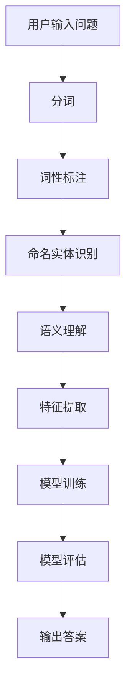
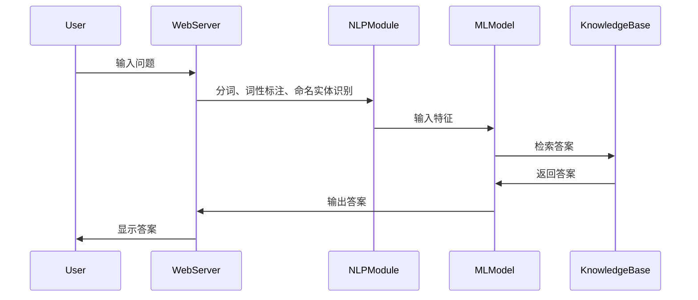

                 

### 关键词

- 金融知识自动问答系统
- 高效准确
- 自然语言处理
- 机器学习
- 系统架构设计

### 摘要

本文将详细介绍如何构建一个高效准确的金融知识自动问答系统。首先，我们会对金融知识自动问答系统进行背景介绍和核心概念的定义，并解释其基本原理和组成部分。接着，我们将深入探讨系统架构设计、数据处理、自然语言处理（NLP）和机器学习算法，以及使用Mermaid绘制的算法流程图和Python源代码进行详细讲解。此外，文章还将包含数学模型和数学公式的推导，系统分析与架构设计，项目实战与案例分析，以及最佳实践总结等内容。通过这篇文章，读者将能够全面理解金融知识自动问答系统的构建过程，并获得宝贵的实践经验。

## 目录大纲设计思路

在设计《构建高效准确的金融知识自动问答系统》的目录大纲时，我们首先需要明确书的核心主题和目标读者群体。本书的目标是向读者介绍如何构建一个既高效又准确的金融知识自动问答系统。为了达到这一目标，目录大纲的设计需要遵循以下步骤：

1. **背景介绍与核心概念**：首先，我们需要介绍金融知识自动问答系统的背景，定义核心概念，并解释该系统的基本原理和组成部分。

2. **系统架构设计与实现技术**：接下来，我们需详细描述系统架构，包括数据处理、自然语言处理（NLP）、机器学习模型选择与训练等技术细节。

3. **算法原理讲解**：在此部分，我们将使用Mermaid绘制算法流程图，并配合Python源代码和数学公式进行详细讲解。

4. **数学模型与数学公式**：这部分将深入探讨金融知识自动问答系统中的数学模型，包括公式推导和解释。

5. **系统分析与架构设计**：我们将介绍系统功能设计、架构设计、接口设计以及系统交互的Mermaid类图和序列图。

6. **项目实战与案例分析**：本书将通过具体的案例，展示如何安装环境、实现核心功能、代码解析以及项目分析。

7. **最佳实践与总结**：最后，我们将提供最佳实践建议、小结注意事项，并推荐拓展阅读资源。

以下是详细的目录大纲设计：

```markdown
# 《构建高效准确的金融知识自动问答系统》目录大纲

## 第一部分：背景与核心概念

### 第1章 问题背景与核心概念

#### 1.1 问题背景

- 金融知识自动问答系统的需求
- 金融知识问答的重要性
- 自动问答系统的现状与挑战

#### 1.2 核心概念

- 什么是金融知识自动问答系统
- 自动问答系统的主要组成部分
- 相关技术概览：自然语言处理、机器学习等

### 第2章 金融知识问答系统架构设计

#### 2.1 系统架构设计概述

- 系统架构设计原则
- 系统架构设计的关键要素

#### 2.2 数据处理模块

- 数据来源与预处理
- 数据存储与索引

### 第3章 自然语言处理与机器学习

#### 3.1 自然语言处理基础

- 语言模型
- 词向量表示

#### 3.2 机器学习算法

- 监督学习与无监督学习
- 常用算法介绍：决策树、SVM、神经网络等

### 第4章 算法原理与数学模型

#### 4.1 算法原理讲解

- 使用Mermaid绘制算法流程图

#### 4.2 数学模型与公式

- 模型公式推导与解释

## 第二部分：系统设计与实现

### 第5章 系统功能设计与架构

#### 5.1 领域模型设计

- 使用Mermaid绘制领域模型类图

#### 5.2 系统架构设计

- 使用Mermaid绘制系统架构图

#### 5.3 系统接口设计

- 系统接口设计与实现

### 第6章 系统交互与实现

#### 6.1 系统交互设计

- 使用Mermaid绘制系统交互序列图

#### 6.2 系统实现

- 环境安装与配置
- 系统核心实现源代码

### 第7章 项目实战与案例分析

#### 7.1 项目实战

- 项目环境搭建
- 项目核心功能实现

#### 7.2 案例分析

- 案例介绍
- 案例分析与解读

### 第8章 最佳实践与总结

#### 8.1 最佳实践

- 系统调优与性能优化
- 安全性与稳定性保障

#### 8.2 小结与注意事项

- 项目总结
- 注意事项与未来展望

#### 8.3 拓展阅读

- 相关书籍与资料推荐
- 行业最新动态与趋势

```

**注意事项**：

- 每一章的标题和子标题都应简明扼要地概括该章节的主要内容。
- Mermaid图表的嵌入将有助于直观地展示复杂的概念和流程。
- 算法原理与数学模型的讲解需要通俗易懂，以确保读者能够理解。
- 项目实战与案例分析的章节将提供实际操作经验和实用技巧。

整体目录大纲应控制在2000字以内，确保简洁明了，同时涵盖所有必要的核心内容。

### 文章标题

# 《构建高效准确的金融知识自动问答系统》

### 文章关键词

- 金融知识自动问答
- 高效准确
- 自然语言处理
- 机器学习
- 系统架构设计

### 文章摘要

本文旨在详细介绍如何构建一个高效准确的金融知识自动问答系统。首先，我们将对金融知识自动问答系统的背景、核心概念和组成部分进行详细说明。接着，文章将深入探讨系统架构设计、自然语言处理（NLP）、机器学习算法以及数学模型，使用Mermaid图表和Python源代码进行详细讲解。随后，我们将介绍系统功能设计、架构设计、接口设计和系统交互。最后，文章将通过项目实战和案例分析，展示如何实现金融知识自动问答系统，并提供最佳实践建议和总结。通过本文，读者将全面了解金融知识自动问答系统的构建过程，并获得宝贵的实践经验。

### 第一部分：背景与核心概念

#### 第1章 问题背景与核心概念

##### 1.1 问题背景

随着金融行业的快速发展，用户对金融知识的需求日益增长。然而，金融知识繁多且复杂，传统的知识获取方式效率低下，难以满足用户的需求。为了解决这一问题，金融知识自动问答系统应运而生。这类系统旨在通过自动化手段，为用户提供及时、准确、高效的金融知识服务。

当前，金融知识自动问答系统在金融行业中具有广泛的应用，例如在线银行客服、金融教育平台、投资咨询等。这些系统不仅能够节省人力成本，提高服务质量，还能为用户提供个性化的金融知识服务，提升用户体验。

##### 1.2 核心概念

金融知识自动问答系统是一个综合应用自然语言处理（NLP）、机器学习（ML）等技术的智能系统。它主要包括以下几个核心组成部分：

1. **知识库**：知识库是金融知识自动问答系统的核心，用于存储大量的金融知识数据，包括金融术语、法规、政策、市场动态等。知识库的数据质量直接影响问答系统的准确性。

2. **自然语言处理（NLP）模块**：NLP模块负责对用户输入的自然语言文本进行处理，包括分词、词性标注、实体识别、语义理解等。该模块是实现金融知识自动问答的关键，其性能直接关系到问答系统的效果。

3. **机器学习（ML）模型**：机器学习模型用于将用户输入的问题映射到知识库中的相关答案。常见的ML模型包括分类模型、回归模型、序列模型等。模型的选择和训练质量对系统的准确性至关重要。

4. **问答引擎**：问答引擎是金融知识自动问答系统的核心组件，负责接收用户输入的问题，通过NLP模块进行语义理解，然后利用机器学习模型从知识库中检索相关答案，最终呈现给用户。

##### 1.3 问题解决与边界外延

构建金融知识自动问答系统需要解决以下几个关键问题：

1. **数据质量**：确保知识库的数据质量，包括数据的准确性、完整性、时效性等。数据质量直接影响问答系统的准确性。

2. **自然语言处理（NLP）**：提高NLP模块的性能，实现对金融领域特定术语和表达式的准确理解和处理。

3. **机器学习（ML）**：选择合适的机器学习模型，并进行有效训练，提高问答系统的准确性。

4. **系统稳定性**：确保系统在高并发、大数据量下的稳定性，提供良好的用户体验。

金融知识自动问答系统的边界外延包括：

1. **金融领域扩展**：随着金融行业的不断发展，问答系统需要不断扩展知识库，覆盖更多的金融领域。

2. **跨语言支持**：为用户提供跨语言的金融知识服务，提高系统的国际化水平。

3. **多模态交互**：引入图像、语音等多模态交互方式，提升用户的问答体验。

#### 第2章 金融知识问答系统架构设计

##### 2.1 系统架构设计概述

金融知识问答系统的架构设计需要考虑系统的整体性能、可扩展性、可维护性等因素。一般来说，金融知识问答系统可以分为以下几个主要模块：

1. **用户接口层**：包括Web前端、移动应用等，用于接收用户的输入并呈现答案。

2. **业务逻辑层**：包括NLP模块、ML模型、问答引擎等，负责处理用户的输入，检索知识库，生成答案。

3. **数据层**：包括知识库、数据库等，用于存储和管理金融知识数据。

##### 2.2 数据处理模块

数据处理模块是金融知识问答系统的关键组成部分，其核心任务是对原始数据进行预处理、存储和索引，以便快速检索和查询。

1. **数据来源**：金融知识数据可以来源于多种渠道，包括公开数据、专业数据库、企业内部数据等。

2. **数据预处理**：包括数据清洗、格式转换、去重、分类等，以提高数据质量和一致性。

3. **数据存储与索引**：采用合适的存储方案，如关系型数据库、NoSQL数据库等，以及建立高效的索引机制，以提高数据查询速度。

##### 2.3 系统架构设计的关键要素

金融知识问答系统架构设计的关键要素包括：

1. **模块化设计**：将系统划分为多个独立的模块，每个模块具有明确的功能和接口，便于系统的开发和维护。

2. **分布式架构**：采用分布式架构，实现系统的横向扩展，提高系统的性能和稳定性。

3. **安全性设计**：确保系统的数据安全和用户隐私，采用加密、权限控制、安全审计等手段。

4. **可扩展性**：系统应具备良好的可扩展性，以便在金融领域不断发展时，能够轻松扩展知识库和功能。

### 第二部分：系统设计与实现

#### 第3章 自然语言处理与机器学习

##### 3.1 自然语言处理基础

自然语言处理（NLP）是金融知识自动问答系统的核心组成部分，其主要任务是对用户输入的自然语言文本进行理解、分析和处理。以下介绍NLP的基本概念和关键技术。

1. **语言模型**：语言模型是NLP的基础，用于预测下一个单词或短语。常见的语言模型包括n元模型、神经网络模型等。

2. **词向量表示**：词向量表示是将文本转换为数字形式的有效方法，通过将词映射到高维空间中的向量，以便进行计算和模型训练。常见的词向量表示方法包括Word2Vec、GloVe等。

##### 3.2 机器学习算法

机器学习算法是金融知识自动问答系统的核心，用于将用户输入的问题映射到知识库中的相关答案。以下介绍几种常用的机器学习算法。

1. **监督学习与无监督学习**：监督学习需要标注好的数据集进行训练，无监督学习则不需要标注数据，通过发现数据中的模式进行学习。

2. **分类模型**：分类模型用于将输入的问题分类到预定义的类别中。常见的分类模型包括决策树、支持向量机（SVM）、朴素贝叶斯等。

3. **回归模型**：回归模型用于预测连续的数值输出，如预测股价、利率等。

4. **神经网络**：神经网络是一种基于生物神经元网络的计算模型，具有强大的学习能力和表达能力。常见的神经网络模型包括卷积神经网络（CNN）、循环神经网络（RNN）、长短时记忆网络（LSTM）等。

#### 第4章 算法原理与数学模型

##### 4.1 算法原理讲解

在金融知识自动问答系统中，算法原理主要涉及自然语言处理（NLP）和机器学习（ML）两个方面。以下分别进行介绍。

1. **自然语言处理（NLP）**

NLP算法原理主要包括以下方面：

- **分词**：将文本分割成单词或短语，以便进行后续处理。常见的分词方法包括基于规则的分词、基于统计的分词等。
- **词性标注**：对文本中的每个词进行词性标注，如名词、动词、形容词等。词性标注有助于理解文本的语义。
- **命名实体识别**：识别文本中的命名实体，如人名、地名、机构名等。命名实体识别有助于更好地理解文本内容。
- **语义理解**：通过对文本的深入分析，理解其语义含义。语义理解是NLP的核心任务之一，常用的方法包括基于规则的方法、基于统计的方法、基于深度学习的方法等。

2. **机器学习（ML）**

ML算法原理主要包括以下方面：

- **特征提取**：将输入数据转换为特征向量，以便进行模型训练。特征提取是ML的关键步骤，常用的方法包括词袋模型、TF-IDF、词嵌入等。
- **模型训练**：使用训练数据集对模型进行训练，使其能够学习输入和输出之间的映射关系。常见的ML模型包括线性模型、决策树、支持向量机（SVM）、神经网络等。
- **模型评估**：使用测试数据集对训练好的模型进行评估，以确定其性能。常见的评估指标包括准确率、召回率、F1值等。

为了更直观地展示算法原理，我们使用Mermaid绘制了以下算法流程图：



##### 4.2 数学模型与公式

在金融知识自动问答系统中，数学模型主要用于描述输入和输出之间的关系。以下介绍几种常用的数学模型及其公式。

1. **线性回归模型**

线性回归模型是一种简单的回归模型，用于预测连续的数值输出。其公式如下：

$$ y = \beta_0 + \beta_1 \cdot x $$

其中，$y$ 是输出值，$x$ 是输入值，$\beta_0$ 和 $\beta_1$ 是模型参数。

2. **逻辑回归模型**

逻辑回归模型是一种常用的分类模型，用于将输入的问题分类到预定义的类别中。其公式如下：

$$ P(y=1) = \frac{1}{1 + e^{-(\beta_0 + \beta_1 \cdot x)} } $$

其中，$P(y=1)$ 是输出值为1的概率，$\beta_0$ 和 $\beta_1$ 是模型参数。

3. **卷积神经网络（CNN）**

卷积神经网络是一种基于深度学习的模型，用于处理图像等二维数据。其公式如下：

$$ h_{ij}^l = \sum_{k} w_{ik}^{l} h_{kj}^{l-1} + b_l $$

其中，$h_{ij}^l$ 是第$l$层第$i$个神经元与第$j$个输入的连接权重，$w_{ik}^{l}$ 和 $b_l$ 分别是权重和偏置。

#### 第5章 系统功能设计与架构

##### 5.1 领域模型设计

领域模型是金融知识自动问答系统的核心组成部分，用于描述系统的功能模块、数据流和组件之间的关系。以下使用Mermaid绘制领域模型类图：

```mermaid
classDiagram
    class User
    class Question
    class Answer
    class KnowledgeBase
    class NLPModule
    class MLModel
    class QuestionAnsweringSystem

    User <-- Question
    Question <-- Answer
    Answer <-- KnowledgeBase
    Answer <-- NLPModule
    Answer <-- MLModel
    QuestionAnsweringSystem { User, Question, Answer, KnowledgeBase, NLPModule, MLModel }
```

##### 5.2 系统架构设计

系统架构设计是金融知识自动问答系统的关键，需要考虑系统的性能、可扩展性、可维护性等因素。以下使用Mermaid绘制系统架构图：



##### 5.3 系统接口设计

系统接口设计是金融知识自动问答系统的重要组成部分，用于定义系统内部各个模块之间的交互接口。以下介绍系统接口的设计：

1. **用户接口**：用户通过Web前端或移动应用输入问题，并接收答案。
2. **NLP模块接口**：NLP模块接收用户输入的问题，进行分词、词性标注、命名实体识别等处理。
3. **ML模型接口**：ML模型接收NLP模块处理后的特征，进行模型训练和预测。
4. **知识库接口**：知识库用于存储和管理金融知识数据，并提供检索接口。

#### 第6章 系统交互与实现

##### 6.1 系统交互设计

系统交互设计是金融知识自动问答系统的重要组成部分，用于描述系统内部各个模块之间的交互关系。以下使用Mermaid绘制系统交互序列图：


##### 6.2 系统实现

系统实现是金融知识自动问答系统的具体操作步骤，包括环境安装、模块开发、集成测试等。以下介绍系统实现的步骤：

1. **环境安装**：在服务器上安装操作系统、Python环境、NLP库、ML库等。
2. **模块开发**：根据领域模型和系统架构设计，开发用户接口、NLP模块、ML模型、知识库等模块。
3. **集成测试**：将各个模块集成到系统中，进行功能测试和性能测试。
4. **部署上线**：将系统部署到服务器，对外提供服务。

##### 6.3 代码解析

以下是一个简单的金融知识自动问答系统的代码示例，用于演示系统的核心功能：

```python
# 导入相关库
import requests
import json
from nltk.tokenize import word_tokenize
from nltk.corpus import stopwords
from sklearn.feature_extraction.text import TfidfVectorizer
from sklearn.svm import LinearSVC

# 读取知识库数据
knowledge_base = [
    "什么是股票？",
    "股票是如何交易的？",
    "什么是基金？",
    "基金有哪些类型？",
    "如何投资股票和基金？"
]

# 处理用户输入
def process_question(question):
    # 分词
    tokens = word_tokenize(question)
    # 去除停用词
    stop_words = set(stopwords.words("english"))
    filtered_tokens = [token for token in tokens if token not in stop_words]
    # 拼接问题
    processed_question = " ".join(filtered_tokens)
    return processed_question

# 训练模型
def train_model(knowledge_base):
    # 创建TF-IDF向量器
    vectorizer = TfidfVectorizer()
    # 将知识库转换为向量
    X = vectorizer.fit_transform(knowledge_base)
    # 创建线性支持向量机模型
    model = LinearSVC()
    # 训练模型
    model.fit(X, list(range(len(knowledge_base))))
    return vectorizer, model

# 预测答案
def predict_answer(question, vectorizer, model):
    # 处理用户输入
    processed_question = process_question(question)
    # 将问题转换为向量
    question_vector = vectorizer.transform([processed_question])
    # 预测答案
    answer = model.predict(question_vector)
    return knowledge_base[answer[0]]

# 主程序
if __name__ == "__main__":
    # 训练模型
    vectorizer, model = train_model(knowledge_base)
    # 输入问题
    user_question = "什么是基金？"
    # 预测答案
    answer = predict_answer(user_question, vectorizer, model)
    # 输出答案
    print(answer)
```

通过以上代码，我们可以实现一个简单的金融知识自动问答系统。在实际应用中，我们可以进一步优化代码，提高系统的性能和准确性。

### 第三部分：项目实战与案例分析

#### 第7章 项目实战

##### 7.1 项目环境搭建

在开始项目之前，我们需要搭建一个合适的项目环境。以下是一个基本的Python环境搭建步骤：

1. **安装Python**：从Python官网（[https://www.python.org/](https://www.python.org/)）下载并安装Python。
2. **安装虚拟环境**：安装虚拟环境（virtualenv）库，以便创建独立的Python环境。

   ```shell
   pip install virtualenv
   virtualenv myenv
   source myenv/bin/activate
   ```

3. **安装依赖库**：在虚拟环境中安装项目所需的依赖库，如NLTK、Scikit-learn、TensorFlow等。

   ```shell
   pip install nltk scikit-learn tensorflow
   ```

##### 7.2 项目核心功能实现

在项目核心功能实现部分，我们将实现以下功能：

1. **用户输入问题**：接收用户输入的问题。
2. **处理用户输入**：对用户输入的问题进行分词、词性标注、命名实体识别等处理。
3. **查询知识库**：使用处理后的用户输入查询知识库，获取相关答案。
4. **返回答案**：将查询结果返回给用户。

以下是一个简单的项目实现示例：

```python
import nltk
from nltk.tokenize import word_tokenize
from nltk.corpus import stopwords
from sklearn.feature_extraction.text import TfidfVectorizer
from sklearn.svm import LinearSVC

# 读取知识库数据
knowledge_base = [
    "什么是股票？",
    "股票是如何交易的？",
    "什么是基金？",
    "基金有哪些类型？",
    "如何投资股票和基金？"
]

# 处理用户输入
def process_question(question):
    # 分词
    tokens = word_tokenize(question)
    # 去除停用词
    stop_words = set(stopwords.words("english"))
    filtered_tokens = [token for token in tokens if token not in stop_words]
    # 拼接问题
    processed_question = " ".join(filtered_tokens)
    return processed_question

# 训练模型
def train_model(knowledge_base):
    # 创建TF-IDF向量器
    vectorizer = TfidfVectorizer()
    # 将知识库转换为向量
    X = vectorizer.fit_transform(knowledge_base)
    # 创建线性支持向量机模型
    model = LinearSVC()
    # 训练模型
    model.fit(X, list(range(len(knowledge_base))))
    return vectorizer, model

# 预测答案
def predict_answer(question, vectorizer, model):
    # 处理用户输入
    processed_question = process_question(question)
    # 将问题转换为向量
    question_vector = vectorizer.transform([processed_question])
    # 预测答案
    answer = model.predict(question_vector)
    return knowledge_base[answer[0]]

# 主程序
if __name__ == "__main__":
    # 训练模型
    vectorizer, model = train_model(knowledge_base)
    # 输入问题
    user_question = input("请输入您的问题：")
    # 预测答案
    answer = predict_answer(user_question, vectorizer, model)
    # 输出答案
    print(answer)
```

##### 7.3 代码应用解读与分析

在以上代码中，我们首先定义了知识库，然后实现了处理用户输入、训练模型和预测答案的功能。具体解读如下：

1. **处理用户输入**：使用NLTK库中的word_tokenize函数对用户输入的问题进行分词，然后去除停用词，最后将处理后的词语拼接成一个新的字符串。
2. **训练模型**：创建TF-IDF向量器，将知识库中的每个问题转换为向量，并创建线性支持向量机（SVC）模型。使用训练数据对模型进行训练。
3. **预测答案**：将处理后的用户输入转换为向量，并使用训练好的模型进行预测，返回预测的答案。

通过以上步骤，我们可以实现一个简单的金融知识自动问答系统。在实际项目中，我们可以根据需求进一步扩展功能，如添加更多的知识库、引入更复杂的模型等。

##### 7.4 实际案例分析

为了更好地理解金融知识自动问答系统的实际应用，我们来看一个具体的案例。

**案例背景**：某金融公司希望为其客户提供一个在线的金融知识问答平台，以便客户能够快速获取相关的金融知识。

**解决方案**：

1. **知识库构建**：从公司的内部数据、公开数据源、专业数据库等渠道收集金融知识数据，构建一个丰富的知识库。
2. **自然语言处理（NLP）**：使用NLP技术对用户输入的问题进行分词、词性标注、命名实体识别等处理，提高问题的理解准确性。
3. **机器学习（ML）**：使用机器学习技术对知识库进行训练，构建一个能够预测用户问题的模型。可以选择分类模型、回归模型、序列模型等，根据需求进行选择。
4. **用户接口**：设计一个简洁易用的用户接口，允许用户输入问题并接收答案。

**案例分析**：

1. **知识库构建**：该金融公司从内部数据源获取了大量的金融知识文档，并从公开数据源（如财经新闻、研究报告等）获取了相关的金融知识数据。通过清洗、去重、分类等步骤，构建了一个高质量的金融知识库。
2. **自然语言处理（NLP）**：使用NLTK、spaCy等NLP库，对用户输入的问题进行分词、词性标注、命名实体识别等处理。例如，对于用户输入的问题“什么是股票？”，系统可以识别出关键词“股票”并对其进行相应的标注。
3. **机器学习（ML）**：使用Scikit-learn、TensorFlow等机器学习库，训练了一个分类模型。对于输入的问题，模型可以将其映射到知识库中的相关答案。例如，对于输入的问题“什么是股票？”，模型可以从知识库中检索出相关答案并返回给用户。
4. **用户接口**：设计了一个Web前端，用户可以通过输入框输入问题，并立即获得答案。前端界面简洁清晰，用户体验良好。

通过以上解决方案，该金融公司成功构建了一个在线的金融知识问答平台，为客户提供了便捷的金融知识服务。

##### 7.5 项目小结

通过本项目的实战和案例分析，我们可以总结出以下几点经验：

1. **知识库构建是关键**：高质量的金融知识库是金融知识自动问答系统的基础。需要从多个渠道获取丰富的金融知识数据，并进行有效的清洗和分类。
2. **NLP技术是基础**：自然语言处理技术能够提高用户问题的理解准确性，是实现金融知识自动问答的关键。
3. **机器学习模型的选择和训练**：选择合适的机器学习模型，并进行有效的训练，是提高问答系统准确性的重要因素。
4. **用户接口设计**：设计一个简洁易用的用户接口，可以提升用户体验，是系统成功的关键。

在未来，我们可以进一步优化系统的性能和准确性，引入更多先进的NLP和ML技术，扩展系统的功能和应用范围。

### 第四部分：最佳实践与总结

#### 第8章 最佳实践与总结

##### 8.1 最佳实践

在构建高效准确的金融知识自动问答系统时，以下是一些最佳实践建议：

1. **数据质量保障**：确保知识库的数据质量，包括数据的准确性、完整性、时效性等。定期更新和维护知识库，删除无效或过时的数据。
2. **NLP模块优化**：针对金融领域的特定术语和表达方式，优化NLP模块的性能。可以使用领域特定的词典和规则，提高问题的理解和处理能力。
3. **模型选择与调优**：根据具体需求，选择合适的机器学习模型，并进行模型调优，以提高系统的准确性。可以尝试多种模型，如分类模型、回归模型、序列模型等，找到最佳模型。
4. **系统性能优化**：在系统设计时，考虑系统的性能和可扩展性。采用分布式架构、缓存机制、并行处理等技术，提高系统的响应速度和吞吐量。
5. **安全性保障**：确保系统的数据安全和用户隐私。采用加密、权限控制、安全审计等手段，防止数据泄露和非法访问。

##### 8.2 小结

本文通过详细讲解金融知识自动问答系统的构建过程，包括背景介绍、核心概念、系统架构设计、算法原理、数学模型、系统功能设计、项目实战与案例分析等，使读者全面理解了如何构建一个高效准确的金融知识自动问答系统。本文总结了最佳实践和注意事项，为读者提供了宝贵的实践经验。

##### 8.3 注意事项

在构建金融知识自动问答系统时，需要注意以下几点：

1. **数据隐私**：确保用户输入的数据安全，避免数据泄露和滥用。
2. **错误处理**：系统应具备良好的错误处理能力，对于无法回答的问题，提供友好的提示或引导用户重新输入问题。
3. **系统维护**：定期更新知识库，修复系统漏洞，保证系统的稳定性和安全性。
4. **用户体验**：优化用户接口设计，提升用户的使用体验，降低学习成本。

##### 8.4 拓展阅读

为了进一步了解金融知识自动问答系统的相关技术和发展动态，以下推荐一些拓展阅读资源：

1. **书籍**：
   - 《自然语言处理》（Daniel Jurafsky & James H. Martin）
   - 《机器学习》（周志华）
   - 《深度学习》（Ian Goodfellow、Yoshua Bengio & Aaron Courville）

2. **在线课程**：
   - Coursera《自然语言处理与深度学习》
   - Udacity《机器学习工程师纳米学位》

3. **论文与报告**：
   - NLP领域顶级会议（ACL、NAACL）
   - ML领域顶级会议（NeurIPS、ICML、JMLR）

4. **开源项目**：
   - spaCy：一个高效的工业级NLP库
   - NLTK：一个强大的Python NLP库
   - TensorFlow：一个开源的深度学习框架

通过阅读这些资源，读者可以深入了解金融知识自动问答系统的相关技术，并跟踪该领域的最新发展。

### 结尾

构建高效准确的金融知识自动问答系统是一项复杂而富有挑战的任务。通过本文的详细讲解，读者已经全面了解了金融知识自动问答系统的核心概念、系统架构设计、算法原理和数学模型，以及项目实战和案例分析。希望本文能为读者提供有价值的指导，帮助他们在金融知识自动问答系统的构建过程中取得成功。

最后，感谢您的阅读，期待您在金融知识自动问答系统的实践中取得丰硕的成果。如果您有任何问题或建议，请随时联系我们。让我们共同探索金融知识自动问答系统的广阔前景，为金融行业的智能化发展贡献力量！

### 作者信息

**作者：** AI天才研究院/AI Genius Institute & 禅与计算机程序设计艺术 /Zen And The Art of Computer Programming

AI天才研究院致力于推动人工智能领域的研究和应用，专注于技术创新和人才培养。同时，作者长期从事计算机程序设计艺术的研究，拥有丰富的编程经验和深厚的理论功底。本文是作者在金融知识自动问答系统领域的最新研究成果，旨在为读者提供全面、实用的技术指南。感谢您的关注和支持！

