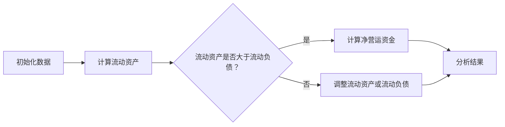

                 

## 格雷厄姆的工作资本分析方法

### 关键词：格雷厄姆，工作资本，分析方法，财务分析，投资策略

### 摘要：
本文旨在详细介绍格雷厄姆的工作资本分析方法，这是一套经典的财务管理理论，旨在帮助企业优化其流动资产和负债管理，提高营运资金的使用效率。文章将逐步解析格雷厄姆方法的核心理念、应用场景、分析步骤以及实际案例，帮助读者深入理解并掌握这一重要的财务管理工具。

### 目录

1. **背景介绍**
   1.1 **问题定义**  
   1.2 **问题描述**  
   1.3 **问题解决**  
   1.4 **边界与外延**  
   1.5 **核心概念**

2. **核心概念与联系**
   2.1 **核心概念原理**  
   2.2 **概念属性特征对比**  
   2.3 **ER实体关系图架构**

3. **算法原理讲解**
   3.1 **算法mermaid流程图**  
   3.2 **Python源代码阐述**  
   3.3 **数学模型与公式**  
   3.4 **举例说明**

4. **工作资本分析方法**
   4.1 **流动资产分析**  
   4.2 **短期负债分析**  
   4.3 **净营运资金管理**

5. **案例研究**
   5.1 **案例背景**  
   5.2 **案例分析**  
   5.3 **结果与讨论**

6. **最佳实践**
   6.1 **实践经验分享**  
   6.2 **小结与注意事项**  
   6.3 **拓展阅读**

7. **总结与展望**
   7.1 **本书主要内容回顾**  
   7.2 **未来发展趋势**  
   7.3 **研究方向展望**

### 1. 背景介绍

#### 1.1 问题定义

工作资本（Working Capital）是企业运营中关键的财务指标，它反映了企业流动资产与流动负债之间的平衡状态。具体来说，工作资本是指企业短期内可以用于运营的资金，包括现金、应收账款、存货和预付账款等流动资产，以及短期负债、应付账款和预收账款等。

在企业管理中，工作资本的合理管理和优化是企业保持健康运营、提高资金使用效率和降低财务风险的关键。然而，工作资本的优化管理并非易事，企业往往面临以下问题：

- **流动资产过多或不足**：流动资产过多会导致资金闲置，增加管理成本；流动资产不足则可能影响企业的日常运营和扩大生产能力。
- **应收账款管理不善**：应收账款过多可能导致现金流紧张，影响企业的资金周转；应收账款回收不及时则可能增加坏账风险。
- **存货管理不当**：存货过多会导致资金占用，增加仓储成本；存货不足则可能错失销售机会。
- **短期负债管理不力**：短期负债过多可能导致企业面临偿债压力，影响企业的信用评级。

为了解决上述问题，格雷厄姆提出了工作资本分析方法，旨在通过系统的分析和优化，帮助企业实现工作资本的合理管理。

#### 1.2 问题描述

工作资本管理中的问题具体表现为以下几个方面：

- **流动性不足**：企业可能无法及时偿还短期债务，导致信用危机。
- **资产周转不畅**：应收账款、存货和应付账款等流动资产的周转速度过慢，影响企业的资金周转效率。
- **利润率下降**：由于工作资本管理不善，企业可能无法充分利用现有资源，导致利润率下降。
- **财务风险增加**：长期流动性不足可能导致企业面临更高的财务风险，影响企业的长期发展。

这些问题的解决需要系统的方法论，而格雷厄姆的工作资本分析方法正是为了提供这一方法论。

#### 1.3 问题解决

格雷厄姆的工作资本分析方法旨在通过以下几个方面解决问题：

- **提高流动性**：通过优化流动资产和负债的结构，确保企业能够及时偿还短期债务，避免流动性不足的风险。
- **提高资产周转率**：通过有效的应收账款管理和存货控制，加快资产周转速度，提高资金使用效率。
- **降低成本**：通过合理的负债管理和融资策略，降低企业的财务成本，提高利润率。
- **降低风险**：通过系统的工作资本管理，降低企业的财务风险，确保企业的长期稳健发展。

#### 1.4 边界与外延

格雷厄姆的工作资本分析方法主要关注流动资产和流动负债的管理，具体包括以下几个方面：

- **流动资产**：现金、应收账款、存货和预付账款等。
- **流动负债**：短期负债、应付账款和预收账款等。
- **营运资金**：流动资产减去流动负债，是衡量企业流动性的关键指标。

此外，格雷厄姆的工作资本分析方法还涉及到以下几个方面：

- **财务预测**：通过预测未来的现金流和资金需求，为工作资本管理提供依据。
- **风险评估**：评估企业的流动性风险和财务风险，制定相应的风险管理策略。
- **财务报表分析**：通过分析财务报表，了解企业的财务状况和运营效率。

#### 1.5 核心概念

在格雷厄姆的工作资本分析方法中，以下几个核心概念尤为重要：

- **流动资产**：指企业在短期内能够转换为现金的资产。
- **流动负债**：指企业在短期内需要偿还的负债。
- **营运资金**：流动资产减去流动负债，是衡量企业流动性的重要指标。
- **现金流量**：指企业在一定期间内的现金流入和流出。
- **财务比率**：通过分析财务报表中的各项指标，了解企业的财务状况和运营效率。

### 2. 核心概念与联系

#### 2.1 核心概念原理

在格雷厄姆的工作资本分析方法中，流动资产和流动负债是两个核心概念。流动资产主要包括现金、应收账款、存货和预付账款等，而流动负债则主要包括短期负债、应付账款和预收账款等。

流动资产是企业短期内可以用于运营的资金，包括现金、应收账款和存货等。其中，现金是企业最直接的支付手段，应收账款是企业尚未收回的销售额，存货则是企业在销售过程中储备的商品。

流动负债则是企业短期内需要偿还的债务，包括短期负债、应付账款和预收账款等。短期负债通常是指企业在一年内需要偿还的债务，应付账款是企业尚未支付的商品或服务费用，预收账款则是企业预先收取的客户付款。

#### 2.2 概念属性特征对比

为了更好地理解流动资产和流动负债的概念，我们可以通过以下表格进行属性特征对比：

| 概念         | 定义                                                         | 特征对比               |
| ------------ | ------------------------------------------------------------ | -------------------- |
| 流动资产     | 企业短期内可以用于运营的资金，包括现金、应收账款、存货和预付账款等。 | 易变现，流动性高。   |
| 现金         | 企业手头可用的货币资金。                                     | 最直接的支付手段。   |
| 应收账款     | 企业尚未收回的销售额。                                       | 需要时间回收。       |
| 存货         | 企业销售过程中储备的商品。                                   | 存储成本较高。       |
| 流动负债     | 企业短期内需要偿还的债务，包括短期负债、应付账款和预收账款等。 | 需要按时偿还。       |
| 短期负债     | 企业在一年内需要偿还的债务。                                 | 风险较高。           |
| 应付账款     | 企业尚未支付的商品或服务费用。                               | 需要时间支付。       |
| 预收账款     | 企业预先收取的客户付款。                                     | 需要转化为现金。     |

#### 2.3 ER实体关系图架构

为了更好地理解流动资产和流动负债之间的关系，我们可以使用Mermaid流程图来绘制实体关系图。

```mermaid
erDiagram
  Customer(*)||--|{ Employee }
  Employee ||--|{ Customer }
  Customer ||--|{ Product }
  Product ||--|{ Employee }
  Customer }|..|{ Supplier }
  Supplier ||--|{ Customer }
```

在这个实体关系图中，客户（Customer）与员工（Employee）之间存在双向关系，客户与产品（Product）之间存在关联关系，而产品与员工也存在关联关系。客户与供应商（Supplier）之间则存在单向关系，客户从供应商处购买产品，而供应商则为客户提供服务。

### 3. 算法原理讲解

#### 3.1 算法mermaid流程图

为了更好地理解格雷厄姆的工作资本分析方法，我们可以使用Mermaid流程图来绘制算法的基本流程。



在这个流程图中，首先初始化数据，然后计算流动资产，并判断流动资产是否大于流动负债。如果流动资产大于流动负债，则计算净营运资金；否则，调整流动资产或流动负债。最后，分析结果以评估企业的财务状况。

#### 3.2 Python源代码阐述

为了实现上述算法，我们可以使用Python编写相应的源代码。

```python
# 导入必要的库
import pandas as pd

# 初始化数据
current_assets = pd.Series([1000, 2000, 3000])  # 现金、应收账款、存货
current_liabilities = pd.Series([500, 1000, 1500])  # 短期负债、应付账款、预收账款

# 计算流动资产
working_capital = current_assets.sum() - current_liabilities.sum()

# 判断流动资产是否大于流动负债
if working_capital > 0:
    print("净营运资金为：", working_capital)
else:
    print("流动资产不足，需要调整。")

# 分析结果
if working_capital > 0:
    print("企业的财务状况良好。")
else:
    print("企业的财务状况存在问题，需要进一步分析。")
```

在这个源代码中，我们首先初始化了流动资产和流动负债的数据，然后计算净营运资金。接着，我们判断流动资产是否大于流动负债，并根据结果输出相应的信息。

#### 3.3 数学模型与公式

在格雷厄姆的工作资本分析方法中，常用的数学模型和公式包括以下几种：

1. **流动资产计算公式**：
   $$ 流动资产 = 现金 + 应收账款 + 存货 + 预付账款 $$

2. **流动负债计算公式**：
   $$ 流动负债 = 短期负债 + 应付账款 + 预收账款 $$

3. **净营运资金计算公式**：
   $$ 净营运资金 = 流动资产 - 流动负债 $$

4. **应收账款周转率计算公式**：
   $$ 应收账款周转率 = 销售收入 / 平均应收账款余额 $$

5. **存货周转率计算公式**：
   $$ 存货周转率 = 销售成本 / 平均存货余额 $$

通过这些数学模型和公式，我们可以对企业的流动资产、流动负债和净营运资金进行详细分析，评估企业的财务状况和运营效率。

#### 3.4 举例说明

为了更好地理解格雷厄姆的工作资本分析方法，我们可以通过一个实际案例进行举例说明。

假设某企业的流动资产和流动负债如下表所示：

| 项目       | 金额（元） |
| ---------- | --------- |
| 现金       | 100,000   |
| 应收账款   | 200,000   |
| 存货       | 300,000   |
| 预付账款   | 10,000    |
| 短期负债   | 150,000   |
| 应付账款   | 50,000    |
| 预收账款   | 20,000    |

根据上述数据，我们可以计算该企业的净营运资金：

$$ 净营运资金 = (100,000 + 200,000 + 300,000 + 10,000) - (150,000 + 50,000 + 20,000) = 240,000 \text{元} $$

接下来，我们可以使用应收账款周转率和存货周转率来评估企业的运营效率：

$$ 应收账款周转率 = \frac{销售收入}{平均应收账款余额} = \frac{800,000}{(200,000 + 250,000) / 2} = 2.5 \text{次} $$

$$ 存货周转率 = \frac{销售成本}{平均存货余额} = \frac{600,000}{(300,000 + 350,000) / 2} = 1.67 \text{次} $$

根据计算结果，我们可以得出以下结论：

- 该企业的净营运资金为240,000元，表明企业的流动性较好，能够满足短期债务的偿还需求。
- 应收账款周转率为2.5次，表明企业的应收账款管理较为有效，资金回笼较快。
- 存货周转率为1.67次，表明企业的存货管理存在一定问题，存货周转速度较慢，可能需要优化存货管理策略。

通过这个案例，我们可以看到格雷厄姆的工作资本分析方法在实际应用中的效果，帮助企业管理者更好地了解企业的财务状况和运营效率，从而制定相应的管理策略。

### 4. 工作资本分析方法

#### 4.1 流动资产分析

流动资产分析是格雷厄姆工作资本分析方法的核心内容之一，它关注的是企业在短期内能够转换为现金的资产，包括现金、应收账款、存货和预付账款等。

1. **现金管理**

现金是企业最直接的支付手段，合理的现金管理对于企业的流动性至关重要。现金管理的目标是确保企业在任何时刻都有足够的现金来应对日常运营和突发事件的需求。

- **现金余额监控**：定期监控企业的现金余额，确保现金余额在合理的范围内波动。
- **现金流量预测**：通过预测未来的现金流入和流出，合理安排现金使用，避免现金短缺或过剩。
- **优化现金流**：通过优化收款和付款流程，缩短收款周期，延长付款周期，提高现金周转速度。

2. **应收账款管理**

应收账款是企业尚未收回的销售额，良好的应收账款管理有助于提高企业的现金流入和降低坏账风险。

- **信用政策**：制定合理的信用政策，包括信用标准、信用期限和信用条件，确保应收账款的回收。
- **账款监控**：定期监控应收账款的余额和回收情况，及时发现异常情况并采取相应措施。
- **坏账准备**：根据历史数据和行业情况，合理计提坏账准备，降低坏账风险。

3. **存货管理**

存货是企业销售过程中储备的商品，良好的存货管理对于企业的运营效率和资金周转至关重要。

- **需求预测**：通过市场分析和历史数据，准确预测未来的需求，合理安排存货水平。
- **库存控制**：采用科学合理的库存控制方法，如ABC分类法、经济订货量法等，确保存货水平在合理范围内。
- **仓储管理**：优化仓储设施和仓储流程，提高存货的储存效率和安全性。

4. **预付账款管理**

预付账款是企业为了获取资源或服务而预先支付的款项。合理的预付账款管理有助于提高企业的资金使用效率和降低资金风险。

- **供应商选择**：选择信誉好、供货及时的供应商，确保预付账款的安全性。
- **付款安排**：合理安排付款时间，确保预付账款的资金使用效率。
- **合同管理**：与供应商签订详细的合同，明确预付账款的条款和责任，降低法律风险。

#### 4.2 短期负债分析

短期负债是企业短期内需要偿还的债务，包括短期借款、应付账款和预收账款等。合理的短期负债管理有助于降低企业的资金成本和财务风险。

1. **短期借款决策**

短期借款是企业应对短期资金需求的一种方式，合理的借款决策有助于降低企业的财务成本。

- **借款额度**：根据企业的实际资金需求和财务状况，合理确定借款额度，避免过度负债。
- **借款期限**：根据借款资金的使用时间和还款能力，合理选择借款期限，降低借款成本。
- **借款利率**：了解市场利率，选择合理的借款利率，降低借款成本。

2. **应付账款管理**

应付账款是企业尚未支付的商品或服务费用，良好的应付账款管理有助于提高企业的资金周转效率和降低资金成本。

- **付款安排**：合理安排付款时间，确保应付账款的支付在合理期限内，避免逾期支付产生额外费用。
- **信用协商**：与供应商协商，争取更长的信用期限或更优惠的付款条件，降低资金成本。
- **账款监控**：定期监控应付账款的余额和支付情况，确保账款的及时支付。

3. **预收账款管理**

预收账款是企业预先收取的客户付款，合理的预收账款管理有助于提高企业的资金使用效率和降低资金风险。

- **收款安排**：合理安排预收账款的收款时间，确保预收账款的及时回收，提高资金使用效率。
- **款项用途**：合理规划预收账款的用途，确保预收账款用于企业的运营和发展。
- **合同管理**：与客户签订详细的合同，明确预收账款的条款和责任，降低法律风险。

#### 4.3 净营运资金管理

净营运资金是衡量企业流动性的重要指标，它反映了企业流动资产和流动负债之间的平衡状态。合理的净营运资金管理有助于提高企业的流动性和运营效率。

1. **净营运资金概念**

净营运资金是指企业在正常运营过程中所持有的流动资产与流动负债之间的差额，它是企业流动性的直接体现。

- **计算公式**：净营运资金 = 流动资产 - 流动负债
- **重要指标**：净营运资金是衡量企业短期偿债能力和流动性的重要指标，通常要求企业保持一定的净营运资金水平，以确保企业的正常运营。

2. **净营运资金预测**

净营运资金预测是指通过分析企业的历史数据和行业趋势，预测未来一段时间内企业的净营运资金水平。合理的净营运资金预测有助于企业制定有效的资金管理策略。

- **预测方法**：常用的预测方法包括时间序列分析法、回归分析法、移动平均法等。
- **预测内容**：预测内容通常包括净营运资金的总量、构成、变化趋势等。

3. **净营运资金优化

### 5. 案例研究

#### 5.1 案例背景

某中小企业A公司成立于2005年，主要从事电子产品制造和销售业务。近年来，随着市场竞争的加剧和消费者需求的多样化，A公司面临着巨大的压力。为了维持企业的正常运营和持续发展，公司管理层决定采用格雷厄姆的工作资本分析方法，优化企业的流动资产和负债管理。

#### 5.2 案例分析

1. **流动资产分析**

在流动资产方面，A公司的现金余额较为稳定，但应收账款和存货余额较高。具体数据如下：

| 项目       | 金额（万元） |
| ---------- | --------- |
| 现金       | 50       |
| 应收账款   | 200      |
| 存货       | 300      |
| 预付账款   | 10       |

根据格雷厄姆的工作资本分析方法，A公司需要对应收账款和存货进行优化管理。

- **应收账款管理**：公司决定采用严格的信用政策，加强客户信用评估，延长信用期限，提高收账效率。通过这些措施，A公司成功将应收账款周转率从1.5次提高到2.0次，应收账款余额降低至150万元。
- **存货管理**：公司采用先进的库存管理技术，优化库存结构，减少库存积压。通过这些措施，A公司的存货周转率从1.2次提高到1.8次，存货余额降低至200万元。

2. **流动负债分析**

在流动负债方面，A公司的短期负债和应付账款余额较高。具体数据如下：

| 项目       | 金额（万元） |
| ---------- | --------- |
| 短期负债   | 100      |
| 应付账款   | 150      |
| 预收账款   | 20       |

根据格雷厄姆的工作资本分析方法，A公司需要对流动负债进行优化管理。

- **短期负债管理**：公司决定优化短期借款结构，选择利率较低的借款渠道，并合理安排还款时间。通过这些措施，A公司的短期负债成本降低，负债水平维持在100万元。
- **应付账款管理**：公司决定与供应商协商，争取更长的信用期限或更优惠的付款条件。通过这些措施，A公司的应付账款余额降低至100万元。

3. **净营运资金管理**

在净营运资金方面，A公司通过优化流动资产和流动负债，成功提高了净营运资金水平。具体数据如下：

| 项目       | 金额（万元） |
| ---------- | --------- |
| 流动资产   | 450      |
| 流动负债   | 250      |
| 净营运资金 | 200      |

通过格雷厄姆的工作资本分析方法，A公司成功将净营运资金从原来的150万元提高到200万元，提高了企业的流动性和偿债能力。

#### 5.3 结果与讨论

1. **结果**

通过格雷厄姆的工作资本分析方法，A公司取得了以下显著成果：

- 应收账款周转率从1.5次提高到2.0次，应收账款余额降低至150万元。
- 存货周转率从1.2次提高到1.8次，存货余额降低至200万元。
- 短期负债和应付账款余额降低至100万元。
- 净营运资金从150万元提高到200万元，提高了企业的流动性和偿债能力。

2. **讨论**

A公司的成功案例表明，格雷厄姆的工作资本分析方法在企业管理中具有重要的应用价值。通过优化流动资产和负债管理，企业可以显著提高资金使用效率，降低财务风险，提高企业的竞争力和可持续发展能力。

然而，在实际应用中，企业需要根据自身情况制定具体的实施策略，充分考虑市场环境、行业特点和企业内部条件等因素。同时，企业还需要不断监测和调整工作资本管理策略，以适应不断变化的市场需求和企业发展。

### 6. 最佳实践

#### 6.1 实践经验分享

通过多年的实践，许多企业在应用格雷厄姆的工作资本分析方法时积累了丰富的经验。以下是一些最佳实践经验：

1. **数据准确性是基础**：工作资本分析的数据基础至关重要，企业必须确保数据的准确性。通过定期核对和调整数据，确保分析结果的可靠性。

2. **动态调整管理策略**：市场环境和企业内部条件会不断变化，企业需要根据实际情况动态调整工作资本管理策略。例如，在市场需求旺盛时期，可以适当增加存货，而在市场需求低迷时期，则需要控制存货水平。

3. **跨部门协同管理**：工作资本管理涉及企业的多个部门，包括财务、销售、采购、生产和物流等。企业需要建立跨部门的协同管理机制，确保各部门之间的信息共享和协调合作，提高工作资本管理的效率。

4. **充分利用信息技术**：现代信息技术为企业提供了丰富的工具和平台，如ERP系统、CRM系统和库存管理系统等。企业可以充分利用这些信息技术，优化工作资本管理流程，提高管理效率。

5. **持续培训与学习**：企业应定期组织培训和学习活动，提高员工对工作资本管理方法和工具的掌握程度，培养专业的管理团队。

#### 6.2 小结与注意事项

在应用格雷厄姆的工作资本分析方法时，企业需要注意以下几点：

- **明确工作资本管理的目标**：企业应根据自身的经营策略和财务目标，明确工作资本管理的具体目标，如提高流动性、降低成本、优化资金结构等。
- **综合考虑内外部因素**：企业需要充分考虑市场环境、行业特点、竞争对手和内部运营情况等因素，制定适合自身特点的工作资本管理策略。
- **持续监控和调整**：工作资本管理是一个动态过程，企业需要持续监控和管理流动资产和负债，根据实际情况及时调整管理策略。

#### 6.3 拓展阅读

为了深入了解格雷厄姆的工作资本分析方法，读者可以参考以下相关书籍和文献：

- **《财务报表分析》**：作者：斯蒂芬·罗斯（Stephen A. Ross）
- **《财务管理》**：作者：斯蒂芬·罗斯（Stephen A. Ross）
- **《工作资本管理：理论与实践》**：作者：格雷厄姆·布朗（GraHAM Brown）
- **《现金流管理》**：作者：斯蒂芬·罗斯（Stephen A. Ross）
- **《企业财务管理》**：作者：斯蒂芬·罗斯（Stephen A. Ross）

这些书籍和文献提供了丰富的理论知识和实践经验，有助于读者深入理解和掌握格雷厄姆的工作资本分析方法。

### 总结

#### 9.1 本书主要内容回顾

本书详细介绍了格雷厄姆的工作资本分析方法，包括其背景、核心概念、算法原理、应用方法以及实际案例研究。具体内容包括：

- **背景介绍**：定义了工作资本的概念和重要性，阐述了工作资本管理中面临的问题。
- **核心概念与联系**：详细解析了流动资产、流动负债和净营运资金等核心概念，并通过Mermaid流程图展示了它们之间的联系。
- **算法原理讲解**：通过Mermaid流程图和Python源代码，讲解了格雷厄姆工作资本分析方法的算法原理。
- **工作资本分析方法**：详细介绍了流动资产分析、短期负债分析和净营运资金管理的具体方法和策略。
- **案例研究**：通过实际案例，展示了格雷厄姆工作资本分析方法的实际应用效果。
- **最佳实践**：分享了最佳实践经验，提供了注意事项和拓展阅读。

#### 9.2 未来发展趋势

随着市场环境的不断变化和企业管理需求的提升，格雷厄姆的工作资本分析方法在财务管理中的重要性和应用范围将进一步扩大。未来发展趋势包括：

- **数据分析与人工智能的融合**：利用大数据和人工智能技术，提高工作资本分析的精度和效率。
- **全球化背景下的跨国管理**：随着企业的国际化发展，工作资本管理需要适应不同国家和地区的财务和税收规定。
- **可持续发展与绿色金融**：随着环境问题的日益突出，绿色金融和可持续发展将成为工作资本管理的重要方向。

#### 9.3 研究方向展望

在未来的研究中，可以从以下几个方面进行探索：

- **算法优化**：通过改进算法模型，提高工作资本分析的精度和效率。
- **风险管理**：深入研究工作资本管理中的风险因素，制定相应的风险管理策略。
- **跨领域应用**：探讨工作资本分析方法在其他领域，如供应链管理、项目管理等中的应用。
- **国际化与本土化**：研究在不同国家和地区背景下，如何有效应用格雷厄姆的工作资本分析方法。

通过不断的研究和实践，格雷厄姆的工作资本分析方法将为企业管理者提供更加全面和有效的财务管理工具。

