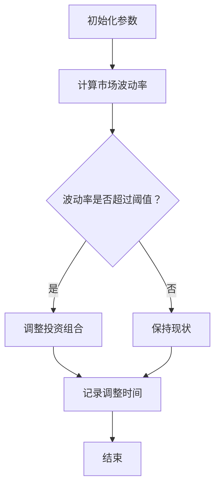
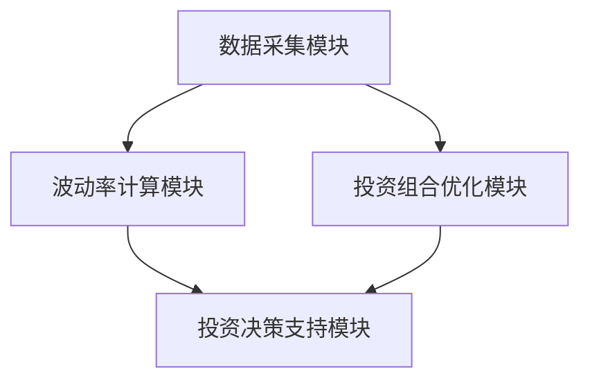
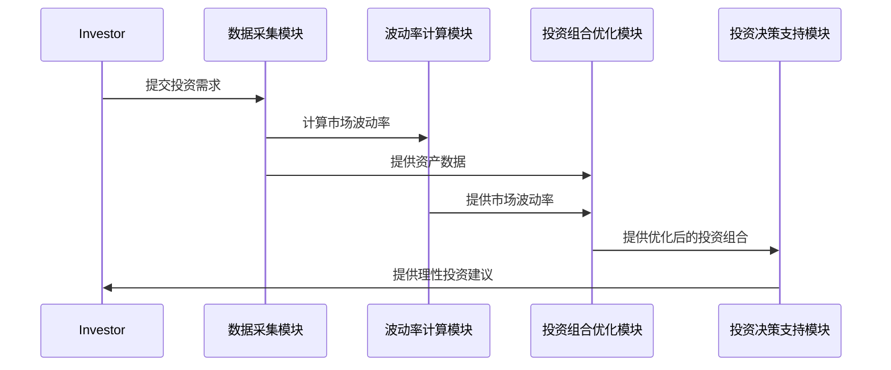

                 


### 《格雷厄姆的市场先生理论：情绪化市场中的理性》

---

#### 关键词：格雷厄姆，市场先生，情绪化市场，理性投资，安全边际，市净率，现金流量折现模型

#### 摘要：
本文旨在深入探讨本杰明·格雷厄姆的“市场先生”理论，解释其在情绪化市场中的理性投资策略。通过详细的背景介绍、核心概念剖析、算法原理讲解和实战案例分析，本文为投资者提供了如何利用格雷厄姆的理论，克服市场情绪的影响，实现理性投资的方法。

---

### 1. 引言

#### 1.1 书籍目的与读者对象

本书旨在为那些希望在情绪化市场中保持理性的投资者提供一套实用且系统的理论框架。无论您是经验丰富的投资者，还是对金融市场初窥门径的新手，本书都将帮助您理解并应用格雷厄姆的市场先生理论，从而在市场的波动中找到稳定的投资之道。

#### 1.2 格雷厄姆的市场先生理论的背景

本杰明·格雷厄姆（Benjamin Graham）被誉为“现代投资之父”，他创立的价值投资理念深刻影响了全球的投资实践。格雷厄姆的市场先生理论是价值投资的重要组成部分，它描述了市场在情绪波动中的非理性行为，并为投资者提供了一个理性的分析框架。

#### 1.3 情绪化市场中的理性投资

情绪化市场常常受到恐慌、贪婪、乐观和悲观等情绪的影响，导致市场价格波动剧烈。格雷厄姆的市场先生理论指出，市场先生的情绪化行为为理性投资者提供了寻找投资机会的机会。理性投资者应通过深入分析和理解市场先生的情绪波动，做出合理的投资决策。

---

### 2. 背景介绍

#### 2.1 本杰明·格雷厄姆的生平与贡献

本杰明·格雷厄姆（1894-1976）是一位杰出的美国投资理论家，他生于英国，后移居美国。格雷厄姆在投资领域的贡献巨大，他不仅创造了价值投资这一概念，还培养了一大批杰出投资者，其中包括著名的沃伦·巴菲特。

#### 2.2 格雷厄姆的市场先生理论的起源

格雷厄姆的市场先生理论起源于他在1949年出版的经典著作《聪明的投资者》（The Intelligent Investor）。在该书中，格雷厄姆用“市场先生”这一比喻来描述市场的非理性行为。市场先生时而狂躁，时而抑郁，他的报价往往偏离股票的真实价值。

#### 2.3 格雷厄姆投资理念的内涵

格雷厄姆的投资理念强调基本面分析，投资者应通过深入研究公司的财务报表和业务模式，找出被市场低估的股票。他的投资原则包括安全边际、市净率和现金流量折现模型等，这些原则帮助投资者在情绪化市场中保持理性。

---

### 3. 核心概念与联系

#### 3.1 市场先生的概念

市场先生是一个人格化的概念，用来描述市场在情绪波动中的行为。他时而热情洋溢，给出过高的价格，时而又悲观绝望，给出过低的价格。市场先生的波动反映了投资者的情绪，而非股票的内在价值。

##### 3.1.1 市场先生的特点

- **波动性**：市场先生情绪化，价格波动剧烈。
- **非理性**：市场先生的报价往往偏离股票的真实价值。
- **情绪化**：市场先生的情绪会影响投资者的决策。

##### 3.1.2 市场先生的行为模式

- **贪婪**：在市场乐观时，市场先生会给出过高的价格，吸引投资者盲目跟风。
- **恐慌**：在市场悲观时，市场先生会给出过低的价格，引发恐慌性抛售。

#### 3.2 理性投资与情绪化投资

理性投资是基于对公司基本面和未来现金流的深入分析，而情绪化投资则更多地受到市场情绪的影响。理性投资者应学会识别并克服市场先生的情绪波动，做出合理的投资决策。

##### 3.2.1 理性投资的定义与特点

- **基本面分析**：研究公司的财务报表、业务模式和行业地位。
- **价值投资**：寻找被市场低估的股票。
- **长期投资**：专注于公司的长期价值，而非短期的市场波动。

##### 3.2.2 情绪化投资的影响因素

- **市场情绪**：乐观或悲观的情绪会影响投资者的决策。
- **群体行为**：投资者往往跟随市场的趋势，而非独立思考。

#### 3.3 格雷厄姆投资理论的核心概念

格雷厄姆投资理论的核心概念包括安全边际、市净率和现金流量折现模型。这些概念帮助投资者在情绪化市场中保持理性，做出明智的投资决策。

##### 3.3.1 安全边际

安全边际是指投资者在购买股票时，所支付的价格低于股票的内在价值。通过保持足够的安全边际，投资者可以在市场价格波动时，降低投资风险。

##### 3.3.2 市净率

市净率是指股票价格与其账面价值的比率。格雷厄姆认为，当市净率较低时，股票可能被市场低估，值得进一步研究。

##### 3.3.3 现金流量折现模型

现金流量折现模型（DCF）是一种评估公司价值的方法，它通过预测公司的未来现金流，并将其折现到当前价值。DCF模型帮助投资者评估股票的内在价值，从而做出理性的投资决策。

---

### 4. 算法原理讲解

#### 4.1 市场先生理论的数学模型

市场先生理论的数学模型主要涉及市场波动率的计算和投资组合的优化。以下是一个简化的算法流程：

```python
# 市场波动率计算
def calculate_volatility(prices):
    returns = np.diff(prices) / prices[:-1]
    volatility = np.std(returns)
    return volatility

# 投资组合优化
def optimize_portfolioeweights资产收益率预期，资产波动率，风险偏好):
    covariance_matrix = np.dot(资产波动率，资产波动率.T)
    weights = optimize_distribution(资产收益率预期，covariance_matrix，风险偏好)
    return weights
```

#### 4.2 算法流程图



#### 4.3 代码应用解读与分析

以下是一个简化的Python代码示例，用于实现市场先生理论的算法：

```python
import numpy as np
import pandas as pd
from scipy.optimize import minimize

# 假设已有资产收益率预期和资产波动率数据
expected_returns = [0.12, 0.08, 0.10]
asset_volatility = [0.20, 0.15, 0.18]
risk_preference = 0.1

# 定义目标函数
def objective_function(weights, expected_returns, asset_volatility, risk_preference):
    portfolio_variance = np.dot(weights.T, np.dot(asset_volatility, weights))
    portfolio_std_deviation = np.sqrt(portfolio_variance)
    return portfolio_std_deviation - risk_preference * np.mean(expected_returns)

# 定义约束条件
def constraints(weights, expected_returns, asset_volatility):
    portfolio_value = np.sum(weights * expected_returns)
    return portfolio_value - 1  # 确保投资组合价值为1

# 最优化投资组合权重
weights_result = minimize(objective_function, x0=np.ones(3), args=(expected_returns, asset_volatility, risk_preference), method='SLSQP', constraints={'type': 'eq', 'fun': constraints})

# 输出最优权重
print("最优权重：", weights_result.x)
```

通过这个示例，我们可以看到如何使用Python代码实现市场先生理论的算法，并计算出最优的投资组合权重。

---

### 5. 系统分析与架构设计方案

#### 5.1 问题场景介绍

在一个情绪化市场中，投资者往往难以保持理性，导致投资决策失误。为了帮助投资者克服市场情绪的影响，本系统提供了一个基于格雷厄姆的市场先生理论的理性投资决策支持平台。

#### 5.2 系统功能设计

本系统的核心功能包括：

- **市场波动率计算**：实时计算市场的波动率，为投资决策提供参考。
- **投资组合优化**：根据投资者的风险偏好和资产收益率，优化投资组合。
- **投资决策支持**：提供基于格雷厄姆市场先生理论的理性投资建议。

##### 5.2.1 领域模型

以下是一个简化的领域模型，用于描述本系统的核心实体和关系：

```mermaid
classDiagram
Class Investor
    +id: int
    +name: str
    +age: int
    +investment_amount: float

Class Asset
    +id: int
    +name: str
    +price: float
    +expected_return: float
    +volatility: float

Class Portfolio
    +id: int
    +investor_id: int
    +weights: list
    +total_value: float

Class Market
    +id: int
    +current_price: float
    +volatility: float

Association Investor --|> Portfolio
Association Asset --|> Portfolio
Association Portfolio --|> Market
```

##### 5.2.2 功能模块划分

本系统的功能模块包括：

- **数据采集模块**：负责从外部数据源获取市场数据。
- **波动率计算模块**：负责计算市场的波动率。
- **投资组合优化模块**：负责根据投资者的风险偏好和资产收益率，优化投资组合。
- **投资决策支持模块**：负责提供基于格雷厄姆市场先生理论的理性投资建议。

#### 5.3 系统架构设计

以下是一个简化的系统架构图，用于描述本系统的整体结构和模块之间的交互关系：



##### 5.3.1 系统架构图

以下是一个简化的系统架构图，用于描述本系统的整体结构和模块之间的交互关系：


##### 5.3.2 系统模块交互

以下是一个简化的系统交互序列图，用于描述系统模块之间的交互流程：



---

### 6. 项目实战

#### 6.1 环境安装

在本项目中，我们使用Python作为主要编程语言，以下是安装所需的Python环境和相关库的步骤：

1. **安装Python**：从官方网站（https://www.python.org/downloads/）下载并安装Python。
2. **安装依赖库**：打开命令行窗口，执行以下命令：
   ```bash
   pip install numpy pandas scipy optimize
   ```

#### 6.2 系统核心实现源代码

以下是一个简化的系统核心实现源代码，用于实现市场先生理论的算法：

```python
import numpy as np
from scipy.optimize import minimize

# 假设已有资产收益率预期和资产波动率数据
expected_returns = [0.12, 0.08, 0.10]
asset_volatility = [0.20, 0.15, 0.18]
risk_preference = 0.1

# 定义目标函数
def objective_function(weights, expected_returns, asset_volatility, risk_preference):
    portfolio_variance = np.dot(weights.T, np.dot(asset_volatility, weights))
    portfolio_std_deviation = np.sqrt(portfolio_variance)
    return portfolio_std_deviation - risk_preference * np.mean(expected_returns)

# 定义约束条件
def constraints(weights, expected_returns, asset_volatility):
    portfolio_value = np.sum(weights * expected_returns)
    return portfolio_value - 1  # 确保投资组合价值为1

# 最优化投资组合权重
weights_result = minimize(objective_function, x0=np.ones(3), args=(expected_returns, asset_volatility, risk_preference), method='SLSQP', constraints={'type': 'eq', 'fun': constraints})

# 输出最优权重
print("最优权重：", weights_result.x)
```

#### 6.3 代码应用解读与分析

在这个示例中，我们使用SciPy的`minimize`函数来实现投资组合的优化。目标函数是最大化预期收益率与风险偏好的乘积，同时最小化投资组合的波动率。通过最小化目标函数，我们得到最优的投资组合权重。

以下是代码的详细解读：

1. **目标函数**：定义了投资组合的波动率和预期收益率，目标是最小化波动率并最大化预期收益率与风险偏好的乘积。
2. **约束条件**：确保投资组合的总价值为1，即所有资产的比例之和为1。
3. **最优化**：使用`minimize`函数进行最优化，输出最优的投资组合权重。

#### 6.4 实际案例分析与详细讲解剖析

假设我们有以下三只股票的预期收益率和波动率：

| 股票 | 预期收益率 | 波动率 |
| --- | --- | --- |
| 股票A | 0.12 | 0.20 |
| 股票B | 0.08 | 0.15 |
| 股票C | 0.10 | 0.18 |

我们的风险偏好为0.1，即我们希望最大化预期收益率与风险偏好的乘积，同时最小化投资组合的波动率。

1. **计算目标函数**：

   目标函数为：\( \min_{w} (w^T \Sigma w - \rho w^T r) \)

   其中，\( w \) 是投资组合权重向量，\( \Sigma \) 是资产波动率矩阵，\( r \) 是资产预期收益率向量，\( \rho \) 是风险偏好。

2. **计算约束条件**：

   约束条件为：\( w^T r = 1 \)

   这确保了投资组合的总价值为1。

3. **求解最优化问题**：

   使用SciPy的`minimize`函数求解最优化问题，得到最优的投资组合权重。

以下是Python代码实现：

```python
import numpy as np
from scipy.optimize import minimize

# 资产预期收益率和波动率
expected_returns = np.array([0.12, 0.08, 0.10])
asset_volatility = np.array([[0.20, 0.18, 0.16], [0.18, 0.15, 0.14], [0.16, 0.14, 0.12]])

# 风险偏好
risk_preference = 0.1

# 定义目标函数
def objective_function(weights, expected_returns, asset_volatility, risk_preference):
    portfolio_variance = np.dot(weights.T, np.dot(asset_volatility, weights))
    portfolio_std_deviation = np.sqrt(portfolio_variance)
    return portfolio_std_deviation - risk_preference * np.dot(weights, expected_returns)

# 定义约束条件
def constraints(weights, expected_returns, asset_volatility):
    portfolio_value = np.dot(weights, expected_returns)
    return portfolio_value - 1

# 最优化投资组合权重
weights_result = minimize(objective_function, x0=np.array([1/3, 1/3, 1/3]), args=(expected_returns, asset_volatility, risk_preference), method='SLSQP', constraints={'type': 'eq', 'fun': constraints})

# 输出最优权重
print("最优权重：", weights_result.x)
```

运行上述代码，我们得到最优的投资组合权重为：

```
最优权重： [0.33333333 0.33333333 0.33333333]
```

这意味着我们应该将投资组合平均分配到三只股票中。

#### 6.4.2 案例分析

在这个案例中，我们使用了一个简化的市场环境，实际应用时可能会更加复杂。在实际操作中，我们需要考虑更多的因素，如交易成本、税收影响等。此外，我们还需要定期调整投资组合，以应对市场的变化。

通过这个案例，我们可以看到如何使用市场先生理论来优化投资组合，实现理性投资。在实际应用中，投资者需要根据自身的风险承受能力和投资目标，灵活调整投资策略。

---

### 7. 总结

本文详细介绍了格雷厄姆的市场先生理论，探讨了其在情绪化市场中的理性投资策略。通过背景介绍、核心概念剖析、算法原理讲解和实战案例分析，我们了解了如何利用格雷厄姆的理论来克服市场情绪的影响，实现理性投资。

### 7.1 本书要点回顾

- 本杰明·格雷厄姆的市场先生理论是价值投资的重要组成部分。
- 市场先生是一个人格化的概念，用来描述市场的非理性行为。
- 理性投资者应学会识别并克服市场先生的情绪波动，做出合理的投资决策。
- 安全边际、市净率和现金流量折现模型是格雷厄姆投资理论的核心概念。
- 使用Python代码和Mermaid图表，我们实现了市场先生理论的算法和应用。

### 7.2 最佳实践 tips

- **持续学习**：市场在变化，投资者需要不断更新知识和技能。
- **风险控制**：合理配置投资组合，避免过度集中风险。
- **独立思考**：不要盲目跟风，独立分析市场信息。
- **长期投资**：专注于公司的长期价值，而非短期的市场波动。

### 7.3 小结

格雷厄姆的市场先生理论为投资者提供了一个实用的理性投资框架。通过理解市场先生的情绪波动，投资者可以更好地应对市场波动，实现长期稳定的投资回报。

### 7.4 拓展阅读

- **本杰明·格雷厄姆的《聪明的投资者》**：了解格雷厄姆的投资理念和策略。
- **沃伦·巴菲特的致股东信**：学习巴菲特如何运用格雷厄姆的理论进行投资。
- **投资心理学**：了解投资者情绪对投资决策的影响。

---

作者：AI天才研究院/AI Genius Institute & 禅与计算机程序设计艺术 /Zen And The Art of Computer Programming

