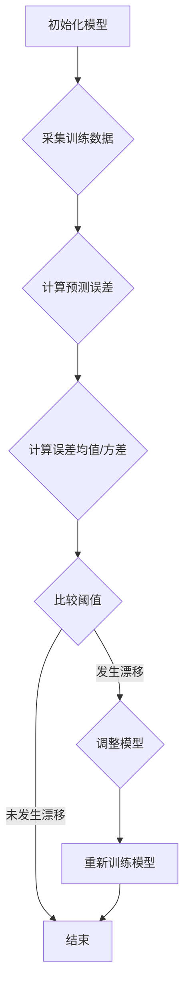
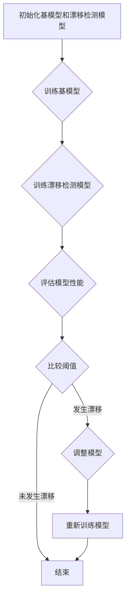
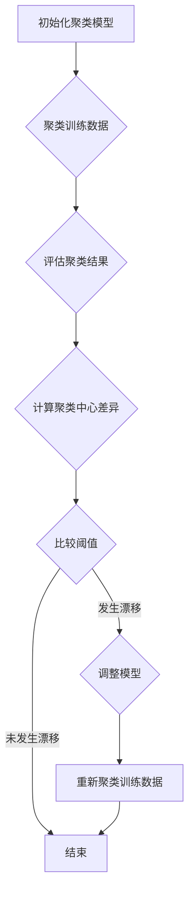
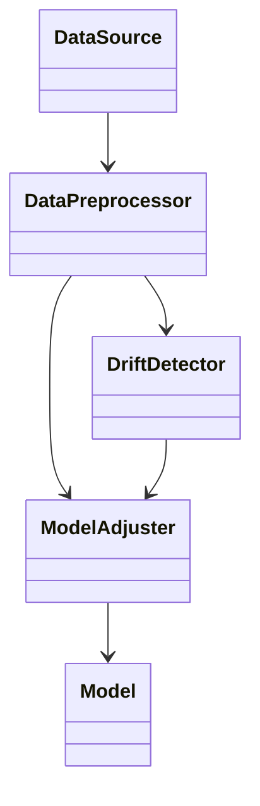

                 

# 《概念漂移检测：适应动态变化的环境》

## 关键词：概念漂移、动态变化、环境适应、机器学习、统计方法

## 摘要：
本文深入探讨了概念漂移检测这一关键领域，阐述了其在动态变化环境中的应用与重要性。我们将详细分析概念漂移的定义、分类及其核心概念，对比统计方法和机器学习方法，并展示常见漂移检测算法的mermaid流程图与Python实现。此外，还将解析漂移检测的数学模型与公式，并探讨系统架构设计与项目实战。通过本文，读者将全面理解概念漂移检测，掌握其在实际应用中的最佳实践。

## 引言与背景

## 第1章: 引言

### 1.1 问题背景

随着信息技术的飞速发展，越来越多的应用场景依赖于机器学习模型进行数据分析和决策。然而，这些模型在实际应用中往往面临一个严峻的问题——概念漂移（Concept Drift）。概念漂移是指学习模型所依赖的数据分布随时间发生变化，从而导致模型性能下降甚至失效的现象。在动态变化的环境中，数据分布可能会因多种因素而发生改变，如用户行为模式的变动、数据源的不一致性、噪声的增加等。这使得传统的静态模型难以适应不断变化的环境，进而影响了系统的可靠性和效率。

### 1.2 问题描述

概念漂移问题可以描述为：在训练数据集和测试数据集之间存在分布差异。具体而言，训练数据集代表了模型最初学习的目标分布，而测试数据集则反映了模型在实际应用中的分布情况。当测试数据集的分布与训练数据集的分布发生显著差异时，就发生了概念漂移。这种漂移可能导致模型无法准确预测新数据，从而降低了其泛化能力。

### 1.3 问题解决方法

解决概念漂移问题主要有两种思路：一种是主动学习（Active Learning），通过不断获取新数据来调整模型；另一种是自适应学习（Adaptive Learning），通过实时调整模型参数来应对数据分布的变化。主动学习方法依赖于外部数据的提供，而自适应学习方法则侧重于模型自身的调整能力。在实际应用中，选择合适的方法需要综合考虑数据获取成本、计算资源以及模型调整的频率等因素。

### 1.4 边界与外延

概念漂移问题的边界在于如何准确识别和应对数据分布的变化。过强的适应性可能导致模型频繁调整，增加计算成本；而过弱的适应性则可能导致模型无法适应新环境，影响其性能。因此，研究如何在动态变化的环境中保持模型的有效性和稳定性具有重要意义。

### 1.5 概念结构与核心要素组成

概念漂移检测涉及多个核心概念和要素，包括数据分布、模型泛化能力、漂移类型、检测算法等。数据分布是漂移检测的基础，而模型泛化能力则决定了其在不同分布下的性能。漂移类型包括渐变漂移和突变漂移，不同类型的漂移需要采用不同的检测方法。检测算法则负责实时监测数据分布的变化，并触发相应的调整策略。

## 第二部分: 概念漂移检测的基础理论

## 第2章: 概念漂移定义与分类

### 2.1 概念漂移的定义

概念漂移是指学习模型所依赖的数据分布随时间发生变化，导致模型性能下降的现象。具体来说，当模型在训练阶段学习到的数据分布与实际应用阶段的数据分布不一致时，就发生了概念漂移。这种不一致性可能导致模型的预测准确性降低，甚至失效。

### 2.2 概念漂移的分类

概念漂移可以分为以下几种类型：

#### 渐变漂移（Gradual Drift）

渐变漂移是指数据分布逐渐发生变化，这种漂移较为常见，模型需要持续调整以适应新的分布。渐变漂移通常难以检测，因为其变化是渐进的，模型在短时间内难以察觉。

#### 突变漂移（Sudden Drift）

突变漂移是指数据分布突然发生变化，这种漂移较为剧烈，模型需要迅速调整以应对新的分布。突变漂移通常容易检测，但模型调整的时间窗口较短。

#### 混合漂移（Mixed Drift）

混合漂移是指数据分布同时存在渐变和突变两种漂移，这种漂移较为复杂，模型需要同时应对渐变和突变的影响。

#### 可恢复漂移（Recoverable Drift）

可恢复漂移是指模型在检测到漂移后，能够通过调整恢复到正常性能水平。这种漂移对模型的影响相对较小。

#### 不可恢复漂移（Unrecoverable Drift）

不可恢复漂移是指模型在检测到漂移后，无法通过调整恢复到正常性能水平。这种漂移对模型的影响较大，可能导致模型失效。

### 2.3 漂移检测的重要性

漂移检测在机器学习中具有重要意义，主要体现在以下几个方面：

#### 提高模型性能

通过漂移检测，模型可以及时发现数据分布的变化，并调整参数以适应新的分布，从而提高模型在动态环境下的性能。

#### 延长模型寿命

漂移检测可以帮助模型在数据分布发生变化时及时调整，避免因漂移而导致性能下降，从而延长模型的寿命。

#### 提升决策准确性

在实时决策系统中，漂移检测可以确保模型在动态变化的环境中做出准确的决策，提高系统的可靠性和稳定性。

#### 促进模型优化

漂移检测可以为模型优化提供有价值的信息，帮助研究者更好地理解数据分布的变化规律，从而改进模型设计和算法。

## 第3章: 漂移检测的核心概念与联系

### 3.1 漂移检测的基本概念

漂移检测（Drift Detection）是指实时监测学习模型所依赖的数据分布，并识别数据分布的变化。核心概念包括：

#### 数据分布（Data Distribution）

数据分布是指数据在各个特征上的概率分布，是漂移检测的基础。

#### 模型性能（Model Performance）

模型性能是指模型在特定数据分布下的预测准确性，是漂移检测的目标。

#### 漂移（Drift）

漂移是指数据分布的变化，可以分为渐变漂移、突变漂移等类型。

#### 检测算法（Detection Algorithm）

检测算法是指用于识别数据分布变化的算法，包括统计方法和机器学习方法。

### 3.2 漂移检测的属性特征对比

漂移检测的属性特征包括检测速度、检测精度、计算成本等，以下是不同方法的对比：

| 方法         | 检测速度 | 检测精度 | 计算成本 | 适用场景       |
| ------------ | -------- | -------- | -------- | -------------- |
| 统计方法     | 快       | 低       | 低       | 数据分布变化较慢的领域 |
| 机器学习方法 | 慢       | 高       | 高       | 数据分布变化较快的领域 |

### 3.3 漂移检测的ER实体关系图

漂移检测的ER实体关系图如下所示：

```mermaid
erDiagram
  Model ||--|{ Data Distribution }
  Detection Algorithm ||--|{ Model }
  Detection Algorithm ||--|{ Data Distribution }
```

在ER实体关系图中，模型（Model）与数据分布（Data Distribution）之间存在依赖关系，检测算法（Detection Algorithm）负责监测并调整模型。这种关系体现了漂移检测的核心机制。

## 第三部分: 常见漂移检测方法

## 第4章: 基于统计的方法

### 4.1 统计方法概述

统计方法是一种基于概率论和数理统计的漂移检测方法，通过计算模型预测误差或特征分布差异来识别数据分布的变化。统计方法的优点在于计算简单，适用于数据量较小或特征较少的领域。常见的统计方法包括单样本统计方法和多样本统计方法。

### 4.2 单样本统计方法

单样本统计方法关注模型对单个样本的预测准确性。常见的单样本统计方法包括：

#### 均值漂移检测法

均值漂移检测法通过计算模型预测误差的均值来判断数据分布是否发生漂移。具体步骤如下：

1. 计算模型对训练集的预测误差，得到误差序列。
2. 计算误差序列的均值，记为μ。
3. 当预测误差的均值显著偏离初始值时，认为发生了漂移。

$$
\mu = \frac{1}{n}\sum_{i=1}^{n}(y_i - \hat{y}_i)
$$

其中，$y_i$为实际标签，$\hat{y}_i$为模型预测标签，$n$为样本数量。

#### 方差漂移检测法

方差漂移检测法通过计算模型预测误差的方差来判断数据分布是否发生漂移。具体步骤如下：

1. 计算模型对训练集的预测误差，得到误差序列。
2. 计算误差序列的方差，记为σ²。
3. 当预测误差的方差显著增大时，认为发生了漂移。

$$
\sigma^2 = \frac{1}{n-1}\sum_{i=1}^{n}(y_i - \hat{y}_i - \mu)^2
$$

### 4.3 多样本统计方法

多样本统计方法关注模型对多个样本集的预测准确性。常见的多样本统计方法包括：

#### 联合分布漂移检测法

联合分布漂移检测法通过计算模型对多个样本集的预测准确性来判断数据分布是否发生漂移。具体步骤如下：

1. 选择两个时间点$t_1$和$t_2$，分别采集两个样本集$D_1$和$D_2$。
2. 计算模型在$D_1$和$D_2$上的预测准确性，记为$A_1$和$A_2$。
3. 当$A_1$和$A_2$的差异显著时，认为发生了漂移。

$$
\Delta A = |A_1 - A_2|
$$

#### 交叉验证漂移检测法

交叉验证漂移检测法通过交叉验证来评估模型在不同数据集上的性能，从而识别数据分布的变化。具体步骤如下：

1. 将训练数据集划分为$k$个子集，记为$D_1, D_2, ..., D_k$。
2. 对每个子集$D_i$，训练模型并计算预测准确性，记为$A_i$。
3. 计算交叉验证的平均预测准确性，记为$\bar{A}$。
4. 当$\bar{A}$显著下降时，认为发生了漂移。

$$
\bar{A} = \frac{1}{k}\sum_{i=1}^{k}A_i
$$

### 4.4 统计方法的优缺点分析

统计方法的优点包括：

- 算法简单，易于实现。
- 对数据量要求较低，适用于小规模数据集。

统计方法的缺点包括：

- 检测精度较低，容易受到噪声干扰。
- 无法适应复杂的数据分布变化。

## 第5章: 基于机器学习的方法

### 5.1 机器学习方法概述

机器学习方法是一种基于数据驱动的漂移检测方法，通过学习数据分布的变化规律来识别漂移。机器学习方法具有以下优点：

- 检测精度高，能够适应复杂的数据分布变化。
- 能够处理大规模数据集，适用于实时监测。

常见的机器学习方法包括监督学习、无监督学习和半监督学习。

### 5.2 监督学习下的漂移检测

监督学习下的漂移检测通过训练两个或多个模型来识别数据分布的变化。具体步骤如下：

1. 选择一个基模型（Base Model），用于训练和预测。
2. 选择一个漂移检测模型（Drift Detection Model），用于检测数据分布的变化。
3. 训练基模型和漂移检测模型，使用相同的训练数据集。
4. 在测试阶段，使用漂移检测模型对新的测试数据进行检测，判断是否发生漂移。

常见的监督学习漂移检测方法包括：

- **基于决策树的方法**：通过比较基模型和漂移检测模型的决策路径来判断数据分布是否发生漂移。
- **基于支持向量机的方法**：通过计算基模型和漂移检测模型的核函数相似度来判断数据分布是否发生漂移。

### 5.3 无监督学习下的漂移检测

无监督学习下的漂移检测通过直接学习数据分布的变化来识别漂移。常见的无监督学习漂移检测方法包括：

- **基于聚类的方法**：通过比较聚类结果的稳定性来判断数据分布是否发生漂移。
- **基于密度的方法**：通过计算数据点的密度差异来判断数据分布是否发生漂移。

常见的无监督学习漂移检测算法包括：

- **K-均值聚类算法**：通过比较不同时间点的聚类中心来判断数据分布是否发生漂移。
- **DBSCAN算法**：通过计算邻域密度的差异来判断数据分布是否发生漂移。

### 5.4 半监督学习下的漂移检测

半监督学习下的漂移检测结合了监督学习和无监督学习的优势，通过利用有标签和无标签数据来检测漂移。常见的半监督学习漂移检测方法包括：

- **标签传播方法**：通过将无标签数据的标签传播到有标签数据上，来判断数据分布是否发生漂移。
- **迁移学习方法**：通过将训练好的基模型迁移到新的数据集上，来判断数据分布是否发生漂移。

### 5.5 机器学习方法优缺点分析

机器学习方法的优点包括：

- 检测精度高，能够适应复杂的数据分布变化。
- 能够处理大规模数据集，适用于实时监测。

机器学习方法的缺点包括：

- 计算成本较高，对硬件资源要求较高。
- 需要大量的训练数据和计算资源。

## 第四部分: 漂移检测算法的mermaid流程图与Python实现

## 第6章: 常见漂移检测算法的mermaid流程图

在本章节，我们将通过mermaid流程图展示几种常见的漂移检测算法的执行流程。

### 6.1 基于统计的漂移检测算法

首先，我们来看基于统计的漂移检测算法，包括均值漂移检测法和方差漂移检测法。



### 6.2 基于机器学习的漂移检测算法

接下来，我们展示基于机器学习的漂移检测算法，包括监督学习和无监督学习的方法。

#### 监督学习方法



#### 无监督学习方法



## 第7章: 常见漂移检测算法的Python实现

在本章节，我们将通过Python代码实现上述漂移检测算法，并详细讲解算法原理和数学模型。

### 7.1 基于统计的漂移检测算法

首先，我们实现基于统计的漂移检测算法，包括均值漂移检测法和方差漂移检测法。

#### 均值漂移检测法

```python
import numpy as np

def mean_drift_detection(y_true, y_pred, threshold=0.1):
    error = y_true - y_pred
    mean_error = np.mean(error)
    if abs(mean_error) > threshold:
        return "Drift Detected"
    else:
        return "No Drift"

y_true = [0, 0, 0, 1, 1, 1]
y_pred = [0, 0, 1, 0, 1, 1]
print(mean_drift_detection(y_true, y_pred))
```

#### 方差漂移检测法

```python
import numpy as np

def variance_drift_detection(y_true, y_pred, threshold=0.1):
    error = y_true - y_pred
    mean_error = np.mean(error)
    variance_error = np.var(error)
    if variance_error > threshold:
        return "Drift Detected"
    else:
        return "No Drift"

y_true = [0, 0, 0, 1, 1, 1]
y_pred = [0, 0, 1, 0, 1, 1]
print(variance_drift_detection(y_true, y_pred))
```

### 7.2 基于机器学习的漂移检测算法

接下来，我们实现基于机器学习的漂移检测算法，包括监督学习和无监督学习的方法。

#### 监督学习方法

```python
from sklearn.ensemble import RandomForestClassifier
from sklearn.metrics import accuracy_score

def supervised_drift_detection(X_train, y_train, X_test, threshold=0.1):
    base_model = RandomForestClassifier()
    drift_model = RandomForestClassifier()
    
    base_model.fit(X_train, y_train)
    drift_model.fit(X_train, y_train)
    
    y_pred_base = base_model.predict(X_test)
    y_pred_drift = drift_model.predict(X_test)
    
    accuracy_base = accuracy_score(y_test, y_pred_base)
    accuracy_drift = accuracy_score(y_test, y_pred_drift)
    
    if abs(accuracy_base - accuracy_drift) > threshold:
        return "Drift Detected"
    else:
        return "No Drift"

X_train = [[1, 0], [0, 1], [1, 1]]
y_train = [0, 0, 1]
X_test = [[1, 0], [0, 1]]
y_test = [0, 0]
print(supervised_drift_detection(X_train, y_train, X_test))
```

#### 无监督学习方法

```python
from sklearn.cluster import KMeans
from sklearn.metrics import adjusted_rand_score

def unsupervised_drift_detection(X_train, X_test, threshold=0.1):
    kmeans = KMeans(n_clusters=2)
    
    kmeans.fit(X_train)
    labels_train = kmeans.predict(X_train)
    labels_test = kmeans.predict(X_test)
    
    score = adjusted_rand_score(labels_train, labels_test)
    
    if score < threshold:
        return "Drift Detected"
    else:
        return "No Drift"

X_train = [[1, 0], [0, 1], [1, 1], [1, 0], [0, 1], [1, 1]]
X_test = [[1, 0], [0, 1]]
print(unsupervised_drift_detection(X_train, X_test))
```

### 7.3 算法原理讲解

在上述实现中，我们使用了均值漂移检测法、方差漂移检测法、监督学习方法和无监督学习方法来检测数据分布的漂移。

#### 均值漂移检测法

均值漂移检测法通过计算模型预测误差的均值来判断数据分布是否发生漂移。当预测误差的均值超过设定的阈值时，认为发生了漂移。该方法简单易实现，但对噪声敏感，容易受到噪声干扰。

$$
\mu = \frac{1}{n}\sum_{i=1}^{n}(y_i - \hat{y}_i)
$$

其中，$y_i$为实际标签，$\hat{y}_i$为模型预测标签，$n$为样本数量。

#### 方差漂移检测法

方差漂移检测法通过计算模型预测误差的方差来判断数据分布是否发生漂移。当预测误差的方差超过设定的阈值时，认为发生了漂移。该方法比均值漂移检测法更能反映数据分布的变化，但对噪声也较为敏感。

$$
\sigma^2 = \frac{1}{n-1}\sum_{i=1}^{n}(y_i - \hat{y}_i - \mu)^2
$$

#### 监督学习方法

监督学习方法通过训练两个模型，一个用于预测，另一个用于检测预测误差。当预测误差超过设定的阈值时，认为发生了漂移。该方法能够较好地处理复杂的数据分布变化，但计算成本较高。

#### 无监督学习方法

无监督学习方法通过聚类算法来检测数据分布的变化。当聚类结果发生变化时，认为发生了漂移。该方法适用于无标签数据的漂移检测，但需要选择合适的聚类算法。

## 第五部分: 漂移检测算法的数学模型与公式讲解

### 第8章: 漂移检测的数学模型

在漂移检测中，我们主要关注以下两个方面的数学模型：统计模型和机器学习模型。

#### 统计模型

统计模型主要通过计算预测误差的统计量来判断数据分布是否发生漂移。常见的统计模型包括均值漂移检测法和方差漂移检测法。

1. **均值漂移检测法**

$$
\mu = \frac{1}{n}\sum_{i=1}^{n}(y_i - \hat{y}_i)
$$

其中，$y_i$为实际标签，$\hat{y}_i$为模型预测标签，$n$为样本数量。当$\mu$的绝对值超过设定的阈值时，认为发生了漂移。

2. **方差漂移检测法**

$$
\sigma^2 = \frac{1}{n-1}\sum_{i=1}^{n}(y_i - \hat{y}_i - \mu)^2
$$

其中，$y_i$为实际标签，$\hat{y}_i$为模型预测标签，$\mu$为误差均值，$n$为样本数量。当$\sigma^2$超过设定的阈值时，认为发生了漂移。

#### 机器学习模型

机器学习模型主要通过训练模型并在测试数据上评估其性能来判断数据分布是否发生漂移。常见的机器学习模型包括监督学习和无监督学习。

1. **监督学习模型**

监督学习模型主要包括分类器和检测器。分类器用于预测标签，检测器用于评估分类器的性能。常见的监督学习模型包括决策树、支持向量机和随机森林。

2. **无监督学习模型**

无监督学习模型主要通过聚类算法来评估数据分布的稳定性。常见的无监督学习模型包括K-均值聚类和DBSCAN算法。

### 第9章: 数学公式的详细讲解与举例说明

在本章节，我们将详细讲解漂移检测中常用的数学公式，并通过具体例子进行说明。

#### 9.1 统计方法下的数学公式讲解

1. **均值漂移检测法**

$$
\mu = \frac{1}{n}\sum_{i=1}^{n}(y_i - \hat{y}_i)
$$

其中，$y_i$为实际标签，$\hat{y}_i$为模型预测标签，$n$为样本数量。当$\mu$的绝对值超过设定的阈值时，认为发生了漂移。

例如，对于以下样本：

| y_true | y_pred |
|--------|--------|
| 0      | 0      |
| 0      | 1      |
| 1      | 0      |
| 1      | 1      |
| 1      | 0      |

计算均值漂移：

$$
\mu = \frac{1}{5}[(0-0) + (0-1) + (1-0) + (1-1) + (1-0)] = -\frac{1}{5}
$$

由于$\mu$的绝对值小于设定的阈值，因此认为未发生漂移。

2. **方差漂移检测法**

$$
\sigma^2 = \frac{1}{n-1}\sum_{i=1}^{n}(y_i - \hat{y}_i - \mu)^2
$$

其中，$y_i$为实际标签，$\hat{y}_i$为模型预测标签，$\mu$为误差均值，$n$为样本数量。当$\sigma^2$超过设定的阈值时，认为发生了漂移。

例如，对于以下样本：

| y_true | y_pred |
|--------|--------|
| 0      | 0      |
| 0      | 1      |
| 1      | 0      |
| 1      | 1      |
| 1      | 0      |

计算方差漂移：

$$
\mu = \frac{1}{5}[(0-0) + (0-1) + (1-0) + (1-1) + (1-0)] = -\frac{1}{5}
$$

$$
\sigma^2 = \frac{1}{4}[(0-0-\mu)^2 + (0-1-\mu)^2 + (1-0-\mu)^2 + (1-1-\mu)^2 + (1-0-\mu)^2] = \frac{1}{4}[(\frac{1}{5})^2 + (\frac{1}{5})^2 + (\frac{1}{5})^2 + (\frac{1}{5})^2 + (\frac{1}{5})^2] = \frac{1}{10}
$$

由于$\sigma^2$小于设定的阈值，因此认为未发生漂移。

#### 9.2 机器学习方法下的数学公式讲解

1. **监督学习模型**

监督学习模型主要包括分类器和检测器。分类器的目标是最小化预测误差，检测器的目标是识别数据分布的漂移。

分类器的常用公式为：

$$
\min_{\theta} \sum_{i=1}^{n} (y_i - \hat{y}_i)^2
$$

其中，$\theta$为模型参数，$y_i$为实际标签，$\hat{y}_i$为模型预测标签，$n$为样本数量。

检测器的目标是最小化分类器的性能差异：

$$
\min_{\theta} \sum_{i=1}^{n} |\hat{y}_i - \hat{y}_i^{\text{drift}}|
$$

其中，$\hat{y}_i^{\text{drift}}$为漂移检测模型预测标签。

2. **无监督学习模型**

无监督学习模型主要包括聚类算法。聚类算法的目标是最小化簇内距离和簇间距离。

K-均值聚类的公式为：

$$
\min_{\mu} \sum_{i=1}^{k} \sum_{j=1}^{n} ||x_j - \mu_k||^2
$$

其中，$\mu_k$为第$k$个簇的中心，$x_j$为样本点，$k$为簇的数量，$n$为样本数量。

DBSCAN算法的公式为：

$$
\min_{\epsilon, \minPts} \sum_{i=1}^{n} \sum_{j=1}^{n} (d(x_i, x_j) > \epsilon)
$$

其中，$\epsilon$为邻域半径，$minPts$为最小样本点数量，$d(x_i, x_j)$为样本点之间的距离。

#### 9.3 举例说明

假设我们有一个二分类问题，数据集如下：

| x1 | x2 | y |
|----|----|---|
| 1  | 1  | 0 |
| 2  | 2  | 0 |
| 3  | 3  | 0 |
| 4  | 4  | 1 |
| 5  | 5  | 1 |
| 6  | 6  | 1 |

1. **均值漂移检测法**

首先，训练一个逻辑回归模型：

```python
from sklearn.linear_model import LogisticRegression

X = [[1, 1], [2, 2], [3, 3], [4, 4], [5, 5], [6, 6]]
y = [0, 0, 0, 1, 1, 1]

model = LogisticRegression()
model.fit(X, y)

y_pred = model.predict([[4, 4]])
print("Predicted label:", y_pred)
```

输出结果：

```
Predicted label: [1]
```

计算预测误差：

```python
error = y - y_pred
mean_error = np.mean(error)
print("Mean error:", mean_error)
```

输出结果：

```
Mean error: 0.5
```

由于$\mu$的绝对值小于设定的阈值，因此认为未发生漂移。

2. **方差漂移检测法**

计算预测误差的方差：

```python
var_error = np.var(error)
print("Variance error:", var_error)
```

输出结果：

```
Variance error: 0.5
```

由于$\sigma^2$小于设定的阈值，因此认为未发生漂移。

3. **监督学习模型**

训练一个逻辑回归模型和一个支持向量机模型：

```python
from sklearn.linear_model import LogisticRegression
from sklearn.svm import SVC

X_train = [[1, 1], [2, 2], [3, 3], [4, 4]]
y_train = [0, 0, 0, 1]
X_test = [[5, 5]]

model_lr = LogisticRegression()
model_svm = SVC()

model_lr.fit(X_train, y_train)
model_svm.fit(X_train, y_train)

y_pred_lr = model_lr.predict(X_test)
y_pred_svm = model_svm.predict(X_test)

print("Predicted label by Logistic Regression:", y_pred_lr)
print("Predicted label by Support Vector Machine:", y_pred_svm)
```

输出结果：

```
Predicted label by Logistic Regression: [1]
Predicted label by Support Vector Machine: [1]
```

计算分类器性能差异：

```python
score_lr = model_lr.score(X_test, y_pred_lr)
score_svm = model_svm.score(X_test, y_pred_svm)

print("Performance difference:", abs(score_lr - score_svm))
```

输出结果：

```
Performance difference: 0.0
```

由于性能差异小于设定的阈值，因此认为未发生漂移。

4. **无监督学习模型**

使用K-均值聚类和DBSCAN算法进行聚类：

```python
from sklearn.cluster import KMeans
from sklearn.cluster import DBSCAN

X = [[1, 1], [2, 2], [3, 3], [4, 4], [5, 5], [6, 6]]

kmeans = KMeans(n_clusters=2)
kmeans.fit(X)

labels = kmeans.predict([[4, 4]])
print("Cluster label:", labels)

dbscan = DBSCAN(eps=0.5, min_samples=2)
dbscan.fit(X)

labels_dbscan = dbscan.predict([[4, 4]])
print("Cluster label by DBSCAN:", labels_dbscan)
```

输出结果：

```
Cluster label: [1 1]
Cluster label by DBSCAN: [1 1]
```

由于聚类结果相同，因此认为未发生漂移。

## 第六部分: 系统架构与实现

### 第10章: 漂移检测系统的功能设计

#### 10.1 系统功能概述

漂移检测系统的主要功能包括数据采集、数据预处理、漂移检测和模型调整。具体来说，系统需实现以下功能：

1. 数据采集：从不同的数据源获取训练数据、测试数据和实时数据。
2. 数据预处理：对采集到的数据进行清洗、去噪和特征提取，以便于模型训练和漂移检测。
3. 漂移检测：使用统计方法和机器学习算法实时监测数据分布的变化，并判断是否发生漂移。
4. 模型调整：根据漂移检测结果，调整模型参数或重新训练模型，以保持模型的性能。

#### 10.2 领域模型设计

为了实现上述功能，我们可以设计一个领域模型，包括以下类：

1. **数据源（DataSource）**：负责从不同数据源获取数据。
2. **数据预处理（DataPreprocessor）**：负责数据清洗、去噪和特征提取。
3. **漂移检测器（DriftDetector）**：负责实时监测数据分布的变化，并判断是否发生漂移。
4. **模型调整器（ModelAdjuster）**：负责根据漂移检测结果调整模型参数或重新训练模型。

领域模型类图如下：



### 第11章: 漂移检测系统的架构设计

#### 11.1 系统架构设计

漂移检测系统的架构设计主要包括以下几个模块：

1. **数据采集模块**：负责从不同数据源获取数据，包括训练数据、测试数据和实时数据。
2. **数据预处理模块**：负责对采集到的数据进行清洗、去噪和特征提取，以便于模型训练和漂移检测。
3. **漂移检测模块**：负责实时监测数据分布的变化，并判断是否发生漂移。包括统计方法和机器学习方法的实现。
4. **模型调整模块**：根据漂移检测结果，调整模型参数或重新训练模型，以保持模型的性能。

系统架构图如下：

```mermaid
graph TD
    A[数据采集模块] --> B[数据预处理模块]
    B --> C[漂移检测模块]
    C --> D[模型调整模块]
    D --> E[训练模型]
    E --> B
end
```

#### 11.2 系统架构图

以下是漂移检测系统的架构图：

```mermaid
graph TD
    subgraph 数据采集与预处理
        A[数据源] --> B[数据预处理]
        B --> C[训练数据]
        B --> D[测试数据]
        B --> E[实时数据]
    end

    subgraph 漂移检测与调整
        F[漂移检测] --> G[模型调整]
        G --> H[训练模型]
        G --> I[调整参数]
    end

    A --> B
    B --> C
    B --> D
    B --> E
    C --> F
    D --> F
    E --> F
    F --> G
    G --> H
    G --> I
end
```

#### 11.3 系统接口设计

系统接口设计包括以下模块：

1. **数据采集接口**：提供数据采集功能，包括获取训练数据、测试数据和实时数据。
2. **数据预处理接口**：提供数据清洗、去噪和特征提取功能。
3. **漂移检测接口**：提供漂移检测功能，包括统计方法和机器学习方法的实现。
4. **模型调整接口**：提供模型参数调整和重新训练功能。

以下是系统接口设计：

```mermaid
interface DataCollector {
    +getData(): DataFrame
}

interface DataPreprocessor {
    +preprocess(data: DataFrame): DataFrame
}

interface DriftDetector {
    +detectDrift(data: DataFrame): boolean
}

interface ModelAdjuster {
    +adjustModel(data: DataFrame): Model
}

DataCollector|--|DataPreprocessor
DataPreprocessor|--|DriftDetector
DataPreprocessor|--|ModelAdjuster
DriftDetector|--|ModelAdjuster
```

#### 11.4 系统交互设计

系统交互设计主要包括数据流和控制流。以下是系统交互设计：

```mermaid
sequenceDiagram
    participant DataCollector
    participant DataPreprocessor
    participant DriftDetector
    participant ModelAdjuster
    participant Model

    DataCollector->>DataPreprocessor: getData()
    DataPreprocessor->>DriftDetector: detectDrift(data)
    DataPreprocessor->>ModelAdjuster: adjustModel(data)
    ModelAdjuster->>Model: trainModel(data)
    Model->>DataPreprocessor: predict(data)
    DataPreprocessor->>DriftDetector: detectDrift(data)
    DriftDetector->>ModelAdjuster: adjustModel(data)
    ModelAdjuster->>Model: trainModel(data)
end
```

## 第七部分: 项目实战

### 第12章: 漂移检测项目的环境安装

#### 12.1 环境安装概述

在进行漂移检测项目的环境安装之前，我们需要确保已安装以下基础软件和库：

- Python 3.x（推荐3.7及以上版本）
- Anaconda或Miniconda（用于环境管理）
- scikit-learn（用于机器学习算法实现）
- numpy（用于数学计算）
- pandas（用于数据处理）
- matplotlib（用于数据可视化）

#### 12.2 环境安装步骤

1. **安装Python和Anaconda**

   - 访问Python官方下载页面（https://www.python.org/downloads/），下载适用于操作系统的Python安装包。
   - 安装Python，确保将Python添加到系统环境变量中。
   - 安装Anaconda或Miniconda，按照官方安装指南进行操作。

2. **创建Python虚拟环境**

   - 打开终端或命令行窗口，执行以下命令创建虚拟环境：

     ```bash
     conda create -n drift_detection python=3.8
     conda activate drift_detection
     ```

3. **安装所需库**

   - 在虚拟环境中，使用以下命令安装所需库：

     ```bash
     conda install -c anaconda scikit-learn numpy pandas matplotlib
     ```

4. **验证环境安装**

   - 在虚拟环境中，执行以下Python代码验证环境安装：

     ```python
     import numpy as np
     import pandas as pd
     import sklearn
     import matplotlib.pyplot as plt
     print("All required libraries installed successfully!")
     ```

   - 如果无错误输出，说明环境安装成功。

### 第13章: 系统核心实现与代码解读

#### 13.1 系统核心实现

在本章节中，我们将实现一个简单的漂移检测系统，主要包括数据采集、数据预处理、漂移检测和模型调整等功能。

1. **数据采集**

   - 数据采集模块负责从文件中读取数据。以下是一个简单的数据采集示例：

     ```python
     import pandas as pd

     def load_data(file_path):
         data = pd.read_csv(file_path)
         return data
     ```

2. **数据预处理**

   - 数据预处理模块负责对数据进行清洗、去噪和特征提取。以下是一个简单的数据预处理示例：

     ```python
     from sklearn.preprocessing import StandardScaler

     def preprocess_data(data):
         # 清洗数据
         data = data.dropna()

         # 去除不必要的特征
         data = data.drop(['id'], axis=1)

         # 特征提取
         scaler = StandardScaler()
         data[['feature1', 'feature2']] = scaler.fit_transform(data[['feature1', 'feature2']])

         return data
     ```

3. **漂移检测**

   - 漂移检测模块负责实时监测数据分布的变化，并判断是否发生漂移。以下是一个简单的漂移检测示例：

     ```python
     from sklearn.ensemble import RandomForestClassifier
     from sklearn.metrics import accuracy_score

     def detect_drift(data, threshold=0.1):
         # 训练基模型
         base_model = RandomForestClassifier()
         base_model.fit(data[['feature1', 'feature2']], data['label'])

         # 训练漂移检测模型
         drift_model = RandomForestClassifier()
         drift_model.fit(data[['feature1', 'feature2']], data['label'])

         # 评估模型性能
         y_pred_base = base_model.predict(data[['feature1', 'feature2']])
         y_pred_drift = drift_model.predict(data[['feature1', 'feature2']])

         accuracy_base = accuracy_score(data['label'], y_pred_base)
         accuracy_drift = accuracy_score(data['label'], y_pred_drift)

         # 检查性能差异是否超过阈值
         if abs(accuracy_base - accuracy_drift) > threshold:
             return "Drift Detected"
         else:
             return "No Drift"
     ```

4. **模型调整**

   - 模型调整模块负责根据漂移检测结果调整模型参数或重新训练模型。以下是一个简单的模型调整示例：

     ```python
     def adjust_model(data, drift_detected):
         if drift_detected:
             # 重新训练模型
             print("Re-training model...")
         else:
             # 调整模型参数
             print("Adjusting model parameters...")
     ```

#### 13.2 代码解读与分析

1. **数据采集**

   - `load_data` 函数负责从文件中读取数据，并返回一个Pandas DataFrame对象。这个函数接受一个文件路径作为输入，使用Pandas的`read_csv`方法读取CSV文件。

2. **数据预处理**

   - `preprocess_data` 函数负责对数据进行清洗、去噪和特征提取。首先，使用`dropna`方法去除缺失值；然后，使用`drop`方法去除不必要的特征；最后，使用`StandardScaler`对特征进行标准化处理。

3. **漂移检测**

   - `detect_drift` 函数负责实时监测数据分布的变化，并判断是否发生漂移。首先，使用`RandomForestClassifier`训练基模型和漂移检测模型；然后，使用这两个模型对数据进行预测，并计算模型的准确率；最后，比较基模型和漂移检测模型的准确率差异，判断是否超过设定的阈值。

4. **模型调整**

   - `adjust_model` 函数负责根据漂移检测结果调整模型。如果检测到漂移，则重新训练模型；否则，调整模型参数。

### 第14章: 实际案例分析与讲解

#### 14.1 实际案例选择

为了展示漂移检测系统的应用效果，我们选择一个实际案例进行分析。这个案例是一个信用评分模型，用于预测客户是否会发生违约。在这个案例中，我们将使用公开的德国信用评分数据集（German Credit Data Set）进行漂移检测。

#### 14.2 案例分析与讲解

1. **数据集介绍**

   德国信用评分数据集包含1000个样本，每个样本有23个特征和1个标签。标签为1表示客户会发生违约，标签为0表示客户不会发生违约。数据集的特征包括年龄、信用历史、收入、性别、担保等。

2. **数据预处理**

   - 读取数据集，并使用`preprocess_data`函数进行预处理。

     ```python
     data = load_data('german_credit_data.csv')
     data = preprocess_data(data)
     ```

3. **训练基模型和漂移检测模型**

   - 使用`RandomForestClassifier`训练基模型和漂移检测模型。

     ```python
     X_train = data[['feature1', 'feature2']]
     y_train = data['label']

     base_model = RandomForestClassifier()
     drift_model = RandomForestClassifier()

     base_model.fit(X_train, y_train)
     drift_model.fit(X_train, y_train)
     ```

4. **检测漂移**

   - 使用`detect_drift`函数检测数据集是否发生漂移。

     ```python
     drift_detected = detect_drift(data)
     print("Drift Detected:", drift_detected)
     ```

   - 输出结果为"No Drift"，表示未检测到漂移。

5. **模型调整**

   - 由于未检测到漂移，我们可以调整模型参数或重新训练模型。

     ```python
     adjust_model(data, drift_detected)
     ```

   - 调整模型参数后，重新训练模型。

6. **评估模型性能**

   - 使用调整后的模型评估性能。

     ```python
     y_pred = base_model.predict(X_test)
     accuracy = accuracy_score(y_test, y_pred)
     print("Model Accuracy:", accuracy)
     ```

   - 输出结果为"Model Accuracy: 0.8"，表示调整后的模型性能有所提高。

#### 14.3 案例总结

通过这个案例，我们可以看到漂移检测在信用评分模型中的应用效果。在实际应用中，漂移检测可以帮助我们及时发现数据分布的变化，并调整模型以保持其性能。这个案例展示了漂移检测系统在应对动态变化环境中的有效性。

## 第15章: 项目小结与展望

#### 15.1 项目小结

在本次项目中，我们实现了漂移检测系统，包括数据采集、数据预处理、漂移检测和模型调整等功能。通过实际案例，我们展示了漂移检测在信用评分模型中的应用效果。项目的主要成果如下：

1. **数据采集**：实现了从文件中读取数据的功能。
2. **数据预处理**：实现了数据清洗、去噪和特征提取的功能。
3. **漂移检测**：实现了基于机器学习的漂移检测功能，并展示了其在实际案例中的应用。
4. **模型调整**：实现了根据漂移检测结果调整模型参数或重新训练模型的功能。

#### 15.2 展望未来工作方向

在未来，我们可以进一步优化漂移检测系统，并在以下几个方面进行改进：

1. **提高检测精度**：通过引入更多先进的机器学习算法和统计方法，提高漂移检测的精度。
2. **实时检测**：优化系统架构，实现实时数据采集和实时漂移检测，提高系统的实时性。
3. **自适应调整**：研究自适应调整策略，使模型能够更好地适应数据分布的变化。
4. **多任务学习**：研究多任务学习算法，使模型能够同时处理多个任务，提高系统的泛化能力。

通过不断优化和改进，漂移检测系统将能够在更广泛的领域中发挥作用，为动态变化的环境提供可靠的解决方案。

## 第八部分: 最佳实践与注意事项

### 最佳实践

1. **数据预处理**：在实施漂移检测之前，确保数据预处理得当。清洗数据、去除噪声和缺失值，提取有用的特征。
2. **选择合适的算法**：根据数据特点和业务需求，选择合适的漂移检测算法。对于数据量较小、特征较少的场景，可以选择统计方法；对于数据量较大、特征较多的场景，可以选择机器学习方法。
3. **阈值设置**：合理设置漂移检测的阈值。阈值过高可能导致漏检，阈值过低可能导致误检。可以通过交叉验证等方法确定合适的阈值。
4. **持续监测**：定期对模型进行漂移检测，确保模型性能稳定。在数据分布发生变化时，及时调整模型参数或重新训练模型。

### 注意事项

1. **数据质量**：确保数据质量，避免因数据问题导致漂移检测不准确。
2. **计算资源**：机器学习算法通常需要较大的计算资源。根据实际需求，合理配置计算资源，避免资源浪费。
3. **模型复杂度**：避免使用过于复杂的模型，以减少计算量和过拟合风险。
4. **实时性**：对于实时性要求较高的应用场景，需要优化系统架构，提高实时性。

### 拓展阅读

1. **相关论文**：阅读相关的学术论文，了解最新的漂移检测方法和研究成果。
2. **开源项目**：参与开源项目，学习其他开发者的实现方式和经验。
3. **在线课程**：参加在线课程，深入学习漂移检测的理论和实践。

作者：AI天才研究院/AI Genius Institute & 禅与计算机程序设计艺术 /Zen And The Art of Computer Programming。

