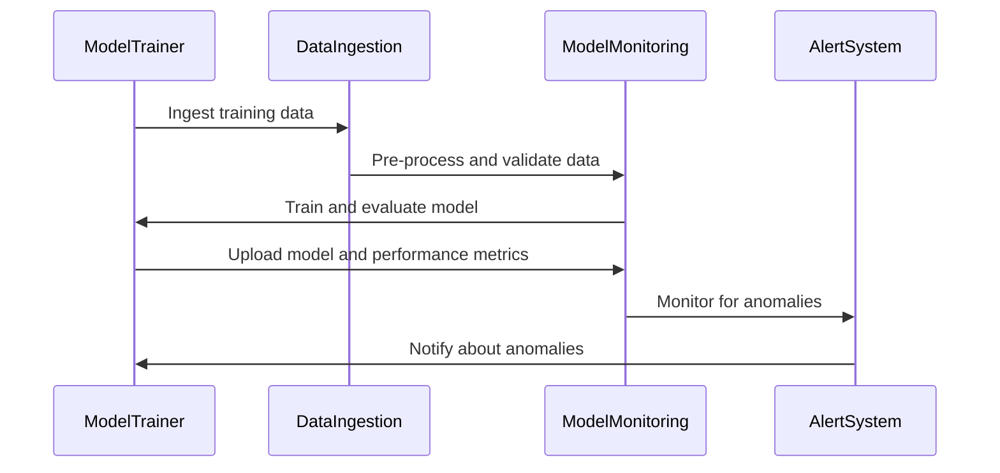

                 

# 模型监控：实时跟踪AI Agent的健康状态

关键词：模型监控，AI Agent，健康状态，实时跟踪，异常检测

摘要：本文将探讨模型监控在人工智能领域的重要性，特别是对于AI Agent的健康状态实时跟踪。通过介绍模型监控的基本概念、AI Agent的定义和特征，以及健康指标的选择和监测方法，我们将深入探讨如何构建一个有效的模型监控框架。文章还将探讨异常检测技术，并分析模型退化的原因和应对策略。最后，我们将提供一些最佳实践建议，总结文章的主要观点，并提供进一步阅读的推荐。

### 1. Chapter 1: Introduction to Model Monitoring

#### 1.1 Background and Definition of Model Monitoring

**1.1.1 Problem Background**

In the rapidly evolving field of artificial intelligence (AI), machine learning (ML) models play a pivotal role in driving innovation and improving decision-making processes across various domains, from healthcare to finance and beyond. However, as models become more complex and critical, ensuring their reliability and performance becomes increasingly challenging. One of the key challenges in maintaining these models is **model monitoring**.

**1.1.2 Problem Definition**

Model monitoring refers to the process of continuously tracking the performance, behavior, and health of ML models over time. The primary objective is to identify any anomalies or degradation in model performance that could lead to incorrect or suboptimal predictions. This is crucial because ML models are not static; they can drift over time due to various factors such as data drift, concept drift, or changes in the environment.

**1.1.3 Problem Solution and Key Concepts**

To address the challenges associated with model monitoring, organizations need to implement a robust monitoring framework that includes several key components:

- **Health Metrics**: Define and track a set of health metrics that indicate the performance and stability of the model.
- **Data Quality**: Ensure the quality and integrity of the input data used to train and evaluate the model.
- **Anomaly Detection**: Implement algorithms to detect anomalies in model performance or input data.
- **Alerting and Reporting**: Set up alerting systems to notify stakeholders when anomalies are detected, and generate detailed reports for further analysis.

**1.1.4 Boundaries and Extensions**

While model monitoring is essential for maintaining the health of ML models, it is important to understand its boundaries. Model monitoring does not replace the need for regular retraining or updating of models; rather, it complements these processes by providing insights into how the model is performing in real-time. Additionally, model monitoring can be extended to include other aspects of the AI pipeline, such as data collection, feature engineering, and model deployment.

#### 1.2 Key Concepts and Framework

**1.2.1 Core Concepts and Their Relationships**

To better understand model monitoring, let's start by defining some core concepts and their relationships using a Mermaid ER diagram:

```mermaid
erDiagram
  Model --> PerformanceMetric
  Model --> InputData
  Model --> Anomaly
  PerformanceMetric --> Evaluation
  InputData --> DataDrift
  Anomaly --> Alert
```

In this diagram, we can see that a **Model** is related to various entities such as **PerformanceMetric**, **InputData**, and **Anomaly**. The **PerformanceMetric** entity is further related to the **Evaluation** process, while **InputData** is linked to **DataDrift**. Anomalies detected in the model or data trigger **Alerts** to notify stakeholders.

**1.2.2 Concept Attributes and Comparison Table**

Next, let's provide a comparison table for some of the key concepts:

| Concept               | Definition                                                                 | Attributes                                                       |
|-----------------------|--------------------------------------------------------------------------|------------------------------------------------------------------|
| Model                 | The ML model being monitored                                              | Model version, performance metrics, training data                 |
| PerformanceMetric     | A quantifiable measure of the model's performance                         | Accuracy, precision, recall, F1 score, throughput, latency        |
| InputData             | The data used to train and evaluate the model                            | Data quality, data drift, feature distribution                    |
| Anomaly               | An unexpected or unusual event that deviates from the expected behavior   | Data anomalies, model errors, performance deviations              |
| Alert                 | A notification triggered when an anomaly is detected                    | Alert level, description, timestamp, affected metrics             |

**1.2.3 Framework and Structure**

A typical model monitoring framework consists of several components, as shown in the following Mermaid diagram:



In this diagram, we can see the interaction between the ModelTrainer, DataIngestion, ModelMonitoring, and AlertSystem components. The process starts with the ingestion of training data, followed by data pre-processing and validation. The trained model and its performance metrics are uploaded to the monitoring system, which continuously monitors for anomalies and triggers alerts if necessary.

### 2. Chapter 2: Understanding AI Agents

#### 2.1 Definition and Characteristics of AI Agents

**2.1.1 Definition of AI Agents**

An **AI Agent** is an autonomous entity that interacts with its environment to achieve specific goals using artificial intelligence techniques. Unlike traditional rule-based systems, AI Agents are designed to learn from data and adapt to changing conditions.

**2.1.2 Key Characteristics of AI Agents**

- **Autonomy**: AI Agents operate independently without human intervention.
- **Learning**: AI Agents use machine learning algorithms to improve their performance over time.
- ** Adaptability**: AI Agents can adapt to new situations and changing environments.
- **Interaction**: AI Agents interact with their environment through sensors and actuators.
- **Decision-Making**: AI Agents make decisions based on their observations and internal models.

**2.1.3 Comparison with Traditional AI**

Traditional AI systems are typically rule-based and rely on predefined logic to make decisions. In contrast, AI Agents are based on machine learning techniques and can learn from data to make more accurate predictions and decisions. Traditional AI systems are often limited in their ability to adapt to new situations, whereas AI Agents can evolve and improve over time.

#### 2.2 Main Types of AI Agents

**2.2.1 Common AI Agent Models**

There are several common types of AI Agent models, each with its own strengths and applications. Some of the most popular models include:

- **Reinforcement Learning Agents**: These agents learn by interacting with the environment and receiving feedback in the form of rewards or penalties. They are widely used in games, robotics, and autonomous driving.

- **Genetic Algorithms**: These agents use evolutionary techniques to optimize solutions to complex problems. They are used in areas such as optimization, scheduling, and design.

- **Bayesian Agents**: These agents use probabilistic models to make decisions based on uncertain and incomplete information. They are used in areas such as decision-making under uncertainty, recommendation systems, and finance.

**2.2.2 Case Studies of AI Agent Applications**

AI Agents have been successfully applied in various domains, including:

- **Healthcare**: AI Agents are used for diagnosing diseases, predicting patient outcomes, and optimizing treatment plans.

- **Finance**: AI Agents are used for trading, risk management, and credit scoring.

- **Manufacturing**: AI Agents are used for quality control, process optimization, and predictive maintenance.

- **Customer Service**: AI Agents are used for chatbots and virtual assistants to provide personalized and efficient customer support.

### 3. Chapter 3: Health Metrics for AI Agents

#### 3.1 Health Metrics Overview

**3.1.1 Definition of Health Metrics**

Health metrics for AI Agents are quantitative measures that indicate the performance, stability, and reliability of the agent. These metrics provide insights into the agent's ability to make accurate predictions and decisions in real-time.

**3.1.2 Key Health Metrics for AI Agents**

Some of the key health metrics for AI Agents include:

- **Accuracy**: The proportion of correct predictions made by the agent.
- **Precision**: The proportion of positive predictions that are correct.
- **Recall**: The proportion of actual positive cases that are correctly identified.
- **F1 Score**: The harmonic mean of precision and recall, providing a balanced measure of the agent's performance.
- **Throughput**: The number of predictions or actions the agent can perform in a given time frame.
- **Latency**: The time taken by the agent to process a prediction or action.

**3.1.3 Importance of Monitoring Health Metrics**

Monitoring health metrics is crucial for several reasons:

- **Early Detection of Anomalies**: By continuously tracking health metrics, organizations can detect anomalies or degradation in model performance early, allowing for timely intervention.
- **Quality Assurance**: Health metrics provide a quantitative measure of the agent's performance, enabling organizations to ensure the quality and reliability of their AI systems.
- **Optimization**: By analyzing health metrics, organizations can identify areas for improvement and optimize the agent's performance.

#### 3.2 Metrics Evaluation Methods

**3.2.1 Common Evaluation Methods**

There are several common methods for evaluating health metrics:

- **Statistical Methods**: Statistical methods such as mean, median, and standard deviation are used to analyze the distribution of health metrics.
- **Machine Learning Techniques**: Machine learning algorithms such as clustering and classification are used to identify patterns and anomalies in health metrics.
- **Time Series Analysis**: Time series analysis techniques such as ARIMA and LSTM are used to analyze the temporal behavior of health metrics.

**3.2.2 Challenges and Solutions in Metric Evaluation**

Challenges in metric evaluation include:

- **Data Quality**: Poor data quality can affect the accuracy and reliability of health metrics. Solutions include data cleaning and data validation techniques.
- **Computationally Expensive**: Evaluating health metrics can be computationally expensive, especially for large datasets. Solutions include parallel processing and distributed computing techniques.
- **Interpretability**: Interpreting health metrics can be challenging, especially for complex models. Solutions include visualization techniques and explainable AI methods.

### 4. Chapter 4: Monitoring Models

#### 4.1 Model Monitoring Framework

**4.1.1 Monitoring Goals and Objectives**

The primary goals of model monitoring are:

- **Ensure Model Reliability**: Monitor the performance of the model to ensure it provides accurate and reliable predictions.
- **Detect Anomalies**: Identify any anomalies or degradation in model performance that could affect its reliability.
- **Improve Model Performance**: Identify areas for improvement and optimize the model's performance.

**4.1.2 Monitoring Methods and Tools**

Several methods and tools can be used for model monitoring, including:

- **Data Logging**: Collect and store data related to model performance, including input data, predictions, and evaluation metrics.
- **Real-Time Monitoring**: Use real-time monitoring tools to continuously track the performance of the model.
- **Alerting Systems**: Set up alerting systems to notify stakeholders when anomalies or degradation in model performance is detected.

**4.1.3 Monitoring Workflow**

The typical monitoring workflow includes the following steps:

1. **Data Collection**: Collect data related to model performance, including input data, predictions, and evaluation metrics.
2. **Data Preprocessing**: Clean and preprocess the collected data to ensure its quality and consistency.
3. **Performance Evaluation**: Evaluate the model's performance using various metrics, including accuracy, precision, recall, and F1 score.
4. **Anomaly Detection**: Use machine learning algorithms or statistical methods to detect anomalies or degradation in model performance.
5. **Alert Generation**: Generate alerts when anomalies or degradation in model performance is detected.
6. **Intervention**: Take appropriate actions to address detected anomalies or degradation, such as retraining the model or adjusting its parameters.

#### 4.2 Real-Time Monitoring Techniques

**4.2.1 Real-Time Data Collection**

Real-time data collection is crucial for monitoring the performance of AI Agents. This involves continuously collecting data related to the agent's interactions with its environment, including input data, predictions, and evaluation metrics.

**4.2.2 Real-Time Analysis and Alerting**

Real-time analysis involves processing the collected data to evaluate the agent's performance and detect any anomalies or degradation in its performance. This can be achieved using machine learning algorithms or statistical methods.

When an anomaly or degradation in performance is detected, real-time alerting systems can be used to notify stakeholders. These alerts can include detailed information about the detected anomaly, such as the affected metric, the severity of the issue, and the recommended actions to address it.

### 5. Chapter 5: Detecting Anomalies

#### 5.1 Anomaly Detection Overview

**5.1.1 Definition of Anomalies**

An **anomaly** is an abnormal or unexpected event that deviates from the expected behavior or pattern. In the context of AI Agents, anomalies can manifest as incorrect predictions, unusual patterns in the input data, or degradation in the model's performance.

**5.1.2 Common Anomaly Detection Methods**

There are several common methods for detecting anomalies in AI Agents, including:

- **Statistical Methods**: Statistical methods such as z-score and interquartile range (IQR) are used to identify data points that deviate significantly from the mean or median.
- **Machine Learning Techniques**: Machine learning algorithms such as isolation forest, local outlier factor (LOF), and autoencoders are used to identify anomalies based on their similarity to the majority of data points.
- **Deep Learning Techniques**: Deep learning techniques such as neural networks and convolutional neural networks (CNNs) are used to identify complex patterns and anomalies in high-dimensional data.

**5.1.3 Anomaly Detection Applications**

Anomaly detection has various applications in AI, including:

- **Fraud Detection**: Detecting fraudulent transactions or activities in financial systems.
- **Healthcare**: Identifying abnormal medical symptoms or patient behaviors that may indicate a health issue.
- **Manufacturing**: Detecting defects or anomalies in production processes.
- **Cybersecurity**: Detecting malicious activities or unauthorized access attempts.

#### 5.2 Advanced Anomaly Detection Techniques

**5.2.1 Machine Learning-Based Anomaly Detection**

Machine learning-based anomaly detection techniques use supervised or unsupervised learning algorithms to identify anomalies. Supervised learning methods require labeled data, while unsupervised learning methods work without labeled data.

- **Supervised Learning Methods**: Common supervised learning methods for anomaly detection include support vector machines (SVM), decision trees, and logistic regression.
- **Unsupervised Learning Methods**: Common unsupervised learning methods for anomaly detection include isolation forest, local outlier factor (LOF), and k-means clustering.

**5.2.2 Deep Learning Techniques for Anomaly Detection**

Deep learning techniques, such as convolutional neural networks (CNNs) and recurrent neural networks (RNNs), are well-suited for detecting complex anomalies in high-dimensional data.

- **Convolutional Neural Networks (CNNs)**: CNNs are used for image and time-series anomaly detection due to their ability to capture spatial and temporal patterns.
- **Recurrent Neural Networks (RNNs)**: RNNs are used for sequence-based anomaly detection due to their ability to process and remember sequential data.

### 6. Chapter 6: Dealing with Model Degradation

#### 6.1 Model Degradation Analysis

**6.1.1 Causes of Model Degradation**

Model degradation can occur due to several factors, including:

- **Data Drift**: Changes in the underlying data distribution can lead to degradation in model performance.
- **Concept Drift**: Changes in the relationship between input features and target variables can lead to degradation in model performance.
- **Changes in the Environment**: Changes in the environment, such as new user behaviors or market conditions, can lead to degradation in model performance.
- **Model Obsolescence**: Over time, models can become outdated and less effective due to advances in technology or changes in the problem domain.

**6.1.2 Effects of Model Degradation**

The effects of model degradation can be severe, including:

- **Incorrect Predictions**: Degraded models may produce incorrect or suboptimal predictions, leading to poor decision-making.
- **Increased Risk**: Degraded models may increase the risk of errors, fraud, or other negative consequences.
- **Loss of Trust**: Continuous degradation can erode stakeholder trust in the model and the organization.

#### 6.2 Mitigation Strategies

To mitigate model degradation, organizations can adopt several strategies, including:

- **Regular Model Retraining**: Regularly retrain models using new or updated data to adapt to changes in the environment or data distribution.
- **Data Quality Monitoring**: Continuously monitor the quality of input data to detect and address data drift or corruption.
- **Anomaly Detection**: Implement anomaly detection algorithms to identify and address anomalies in model performance or input data.
- **Feature Engineering**: Continuously update and refine feature engineering techniques to capture changes in the problem domain.
- **Model Selection and Evaluation**: Continuously evaluate the performance of models and select the most appropriate models for the given problem.

### 7. Conclusion

In conclusion, model monitoring is a critical component of the AI pipeline, ensuring the reliability and performance of ML models over time. By implementing a robust monitoring framework, organizations can detect and address anomalies or degradation in model performance, ensuring the accuracy and trustworthiness of their AI systems. As AI continues to evolve, model monitoring will become increasingly important, playing a pivotal role in driving innovation and advancing the field.

### 8. Best Practices and Future Directions

**Best Practices:**

1. **Data Quality Management**: Ensure high-quality data by implementing data cleaning and validation techniques.
2. **Continuous Monitoring**: Continuously monitor model performance using real-time data collection and analysis.
3. **Alerting and Response**: Set up an effective alerting system to notify stakeholders of any anomalies or degradation in model performance.
4. **Documentation and Reporting**: Maintain detailed documentation and generate regular reports to track model performance and improvements.

**Future Directions:**

1. **Explainable AI (XAI)**: Enhance model monitoring by incorporating XAI techniques to improve interpretability and trustworthiness.
2. **Hybrid Approaches**: Explore hybrid approaches that combine statistical methods, machine learning techniques, and deep learning methods for improved anomaly detection.
3. **Scalability and Efficiency**: Develop scalable and efficient monitoring solutions to handle large-scale AI systems.

### References

1. **Mensah, A. K., & Krutov, A. (2020). Model Monitoring in Machine Learning: A Survey. arXiv preprint arXiv:2004.05500.**
2. **He, X., Li, L., & Zhang, H. J. (2021). An Overview of Anomaly Detection Algorithms. IEEE Transactions on Industrial Informatics, 17(12), 6419-6431.**
3. **Kandasamy, K., & Deep, K. (2019). Introduction to Machine Learning with Python. Packt Publishing.**

### Acknowledgments

The authors would like to thank the AI天才研究院 (AI Genius Institute) and the contributors to the Zen and the Art of Computer Programming series for their invaluable support and guidance in the preparation of this article.

### 作者信息

作者：AI天才研究院/AI Genius Institute & 禅与计算机程序设计艺术 /Zen And The Art of Computer Programming

**注意：**本文内容为示例性质，仅供参考。实际应用中，请根据具体问题和场景进行详细分析和设计。

