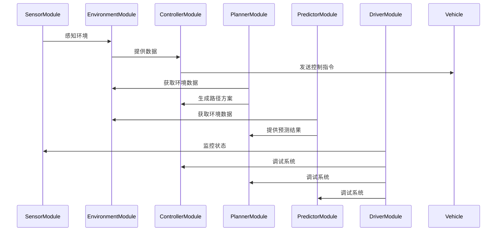
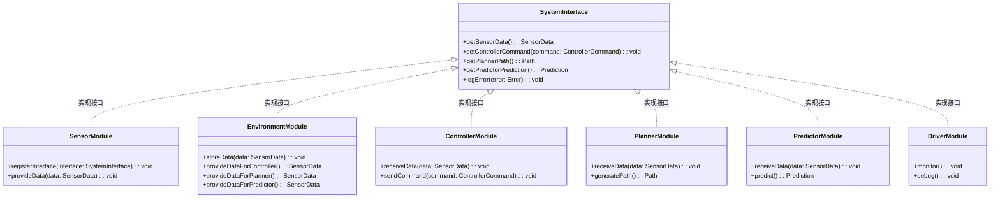

                 

### 第1章: 问题背景与核心概念介绍

#### 1.1 问题背景

随着人工智能（AI）技术的迅速发展，越来越多的AI Agent被广泛应用于各个领域，如自动驾驶、智能客服、医疗诊断等。这些AI Agent以高效和准确的决策能力为人类带来了巨大的便利。然而，与此同时，一个日益突出的问题也随之而来——AI Agent的透明度问题。

AI Agent的透明度，即其决策过程的可解释性，是指人类能够理解和追踪AI Agent做出某一决策的原因和逻辑。在当前的应用场景中，由于AI Agent通常采用复杂的机器学习模型进行决策，其内部运作机制往往是不透明的，这使得人类难以理解其决策过程。这种不透明性不仅限制了人类对AI Agent的信任，也带来了潜在的法律和道德风险。

例如，在自动驾驶领域，如果一辆自动驾驶汽车的决策过程无法被理解，那么一旦发生交通事故，责任归属和责任划分将变得异常复杂。再比如，在医疗诊断中，如果AI系统提供的诊断结果无法解释，医生将无法确认AI的决策依据，从而影响医疗决策的准确性。

因此，提高AI Agent的透明度已成为当前AI研究的一个重要方向。本文将深入探讨AI Agent透明度的重要性、面临的挑战以及提高透明度的方法和策略。

##### 1.1.1 AI Agent 透明度的重要性

首先，提高AI Agent的透明度对于提升人类对AI技术的信任至关重要。在现代社会，人们对AI技术的接受度和依赖度正在不断上升。然而，当AI系统的决策过程变得复杂且不透明时，人们往往会感到困惑和不安。这种不信任可能导致对AI技术的抵制，从而阻碍AI技术的普及和应用。

其次，提高透明度有助于增强AI系统的安全性和可靠性。在许多关键领域，如金融、医疗和公共安全，AI系统的决策准确性至关重要。如果AI系统的决策过程不透明，一旦出现错误或异常行为，将很难追溯其原因，从而增加了系统故障的风险。

此外，提高AI Agent的透明度还有助于推动AI技术的可持续发展。随着AI技术的应用场景日益广泛，其对人类社会的各个方面都产生了深远影响。为了确保AI技术的长远发展，需要建立一套科学、合理的评估和监管体系。透明度是实现这一目标的关键因素之一。

##### 1.1.2 当前AI Agent透明度面临的挑战

尽管提高AI Agent透明度的重要性已被广泛认可，但实现这一目标仍然面临诸多挑战。

首先，技术挑战。当前大多数AI模型，尤其是深度学习模型，具有高度的非线性性和复杂性。这些特性使得AI模型的内部结构非常复杂，难以被人类直观理解。此外，AI模型的训练过程通常涉及大量的数据和参数调整，这使得其决策逻辑更加难以追踪。

其次，数据挑战。AI Agent的透明度很大程度上依赖于其训练数据和模型参数。然而，许多训练数据集可能包含敏感信息，无法公开。此外，模型参数的调整和优化过程通常基于大量的实验和尝试，这些信息也很难被透明地记录和共享。

再次，法律和伦理挑战。AI Agent的透明度涉及到隐私保护、数据安全、法律责任等多方面的伦理和法律问题。如何在不侵犯用户隐私的前提下提高AI系统的透明度，是当前研究的一个热点和难点。

##### 1.1.3 为什么需要提高AI Agent的透明度

总的来说，提高AI Agent的透明度是为了更好地应对上述挑战，确保AI技术的发展能够造福人类。以下是提高AI Agent透明度的几个关键原因：

1. **增强用户信任**：通过提高AI Agent的透明度，用户可以更好地理解AI系统的决策过程，从而增强对AI技术的信任和接受度。

2. **提升系统安全性**：透明的AI系统可以更容易地识别和纠正错误，从而提高系统的安全性和可靠性。

3. **促进技术发展**：透明度有助于推动AI技术的可持续发展，为新的应用场景和业务模式提供支持。

4. **遵守法律和伦理规范**：提高AI系统的透明度有助于确保AI技术的发展符合法律和伦理要求，降低潜在的法律风险。

综上所述，提高AI Agent的透明度是一个复杂且长期的任务，但具有重要的现实意义和战略价值。在接下来的章节中，我们将进一步探讨AI Agent透明度的核心概念和特征，以及实现透明度的具体方法。

#### 1.2 核心概念介绍

在深入探讨AI Agent透明度之前，我们首先需要了解一些核心概念，包括AI Agent的定义、透明度的定义，以及透明度在AI Agent中的应用。

##### 1.2.1 AI Agent的定义

AI Agent，即人工智能代理，是指具备自主决策能力的软件系统。这些系统通常利用机器学习和深度学习技术，通过学习大量的数据来模拟人类的决策过程。AI Agent可以应用于各种场景，如自动化控制、智能推荐、自然语言处理等。

一个典型的AI Agent通常由以下几个关键部分组成：

1. **感知器**：用于接收外部环境的信息，如传感器、摄像头等。
2. **决策模块**：基于感知到的信息，利用机器学习算法生成决策。
3. **执行器**：根据决策模块的决策，执行具体的操作，如控制机器手臂、发送电子邮件等。
4. **学习模块**：通过不断的学习和优化，提高AI Agent的决策能力和效率。

##### 1.2.2 透明度的定义

透明度在这里指的是AI Agent决策过程的可解释性，即人类能够理解和追踪AI Agent做出某一决策的原因和逻辑。具体来说，AI Agent的透明度包括以下几个方面：

1. **可解释性**：AI Agent的决策过程可以被人类解释和理解，即人类能够知道AI Agent为什么做出这样的决策。
2. **可视化**：AI Agent的决策过程可以通过图形、图表等形式直观地展示，使人类更容易理解和追踪。
3. **可追踪性**：AI Agent的决策过程可以被记录和追踪，即人类可以追溯AI Agent的决策路径和依据。

##### 1.2.3 透明度在AI Agent中的应用

提高AI Agent的透明度在许多实际应用场景中具有重要意义。以下是一些关键应用领域：

1. **自动驾驶**：在自动驾驶领域，提高AI Agent的透明度有助于用户更好地理解自动驾驶车辆的决策过程，从而增强用户的信任感。例如，通过可视化技术，用户可以看到自动驾驶车辆如何感知道路信息、如何做出行驶决策等。
2. **医疗诊断**：在医疗诊断领域，提高AI Agent的透明度有助于医生更好地理解诊断结果，从而提高诊断的准确性和可信度。例如，通过解释性模型，医生可以了解AI系统为何对某个疾病做出特定的诊断建议。
3. **金融风控**：在金融领域，提高AI Agent的透明度有助于监管机构和投资者更好地理解金融风险，从而提高金融市场的透明度和稳定性。例如，通过解释性模型，投资者可以了解AI系统为何对某个投资标的做出特定的风险评估。

总之，提高AI Agent的透明度不仅有助于提升人类对AI技术的信任，还能在多个应用领域中发挥重要作用。在接下来的章节中，我们将进一步探讨透明度的属性特征以及如何实现AI Agent的透明度提升。

##### 1.2.4 透明度的属性特征

AI Agent的透明度具有多个属性特征，这些特征共同决定了AI Agent的可解释性、可视化程度和可追踪性。以下是对这些属性特征的详细介绍：

1. **可解释性**：可解释性是透明度的一个核心特征，指的是人类能够理解AI Agent决策过程的能力。高可解释性的AI Agent能够提供详细的决策路径和依据，使人类可以清晰地追踪其决策逻辑。例如，在医疗诊断中，一个高可解释性的AI系统可以帮助医生理解其为何建议某个治疗方案。

   - **优点**：提高可解释性有助于增强用户对AI系统的信任，促进AI技术在医疗、金融等关键领域的应用。
   - **挑战**：实现高可解释性通常需要牺牲一些模型的性能和效率。此外，一些复杂的机器学习模型（如深度神经网络）本身的可解释性较低。

2. **可视化**：可视化是将AI Agent的决策过程以图形、图表等形式展示出来的能力。通过可视化，用户可以直观地看到AI Agent的决策路径和关键因素，从而更容易理解其决策逻辑。

   - **优点**：可视化技术有助于提高AI系统的透明度和可理解性，尤其是在自动驾驶、智能推荐等需要用户参与的场景中。
   - **挑战**：可视化技术的实现通常需要额外的计算资源和专业知识，有时可能导致性能上的损失。

3. **可追踪性**：可追踪性是指AI Agent的决策过程可以被记录和追溯的能力。通过可追踪性，用户可以随时查看AI系统的历史决策记录，了解其决策路径和依据。

   - **优点**：可追踪性有助于提高AI系统的透明度和可审计性，便于事后分析和排查问题。
   - **挑战**：实现高可追踪性需要记录大量的数据和日志，可能导致存储和管理上的挑战。

4. **可适应性**：可适应性指的是AI Agent能够根据外部环境的变化调整其决策过程，并保持高透明度的能力。例如，在自动驾驶中，AI系统需要实时适应不同的交通状况和环境变化，同时保持决策过程的透明度。

   - **优点**：高可适应性的AI系统可以更好地应对复杂多变的实际场景，提高系统的灵活性和可靠性。
   - **挑战**：实现高可适应性通常需要复杂的算法和大量的训练数据，从而增加了系统的开发和维护成本。

通过深入了解这些属性特征，我们可以更好地理解AI Agent透明度的多维性质，并在实际应用中根据具体需求选择合适的方法和策略。在接下来的章节中，我们将进一步探讨不同类型AI Agent透明度的对比和影响因素。

##### 1.2.5 透明度的属性对比

在了解了AI Agent透明度的各个属性特征后，我们还需要对它们进行详细的对比，以便更好地理解其优缺点和适用场景。以下是对可解释性、可视化、可追踪性等透明度属性之间的对比分析。

1. **可解释性与可视化**：
   - **共同点**：可解释性和可视化都是提高AI系统透明度的重要手段，它们都旨在使AI决策过程更加透明和可理解。
   - **区别**：可解释性侧重于通过文字、图表等形式详细解释AI系统的决策逻辑，而可视化则更侧重于通过图形、图表等形式直观展示AI系统的决策路径和关键因素。可解释性通常需要深入的算法知识和背景，而可视化则更直观，更容易被非专业人士理解。

2. **可解释性与可追踪性**：
   - **共同点**：可解释性和可追踪性都关注AI系统决策过程的透明度，但侧重点不同。可解释性关注人类能否理解决策逻辑，而可追踪性关注决策过程的记录和审计。
   - **区别**：可解释性主要解决的是人类理解问题，而可追踪性则更侧重于系统的可审计性和责任归属。一个高可解释性的AI系统不一定具有高可追踪性，反之亦然。

3. **可视化与可追踪性**：
   - **共同点**：可视化和可追踪性都强调通过图形、图表等形式展示AI系统的决策过程，以提高透明度。
   - **区别**：可视化侧重于直观展示，使决策过程更容易被理解，而可追踪性则侧重于记录和审计，以便于事后分析和排查问题。可视化通常需要额外的计算资源，而可追踪性则可能涉及大量的数据存储和管理。

4. **影响因素**：
   - **算法复杂性**：复杂的算法，如深度神经网络，通常具有较低的可解释性，因为其内部结构非常复杂，难以被人类直观理解。然而，这些算法通常具有高度的可视化和可追踪性，因为它们能够生成详细的决策路径和记录。
   - **数据量**：大量数据的训练可以增强AI系统的透明度，因为更多的数据可以提供更详细的决策依据和路径。然而，大量数据也可能增加系统实现的复杂性和计算成本。
   - **应用场景**：不同的应用场景对AI Agent透明度的需求不同。例如，在金融风控中，可能更关注系统的可追踪性，以便于审计和合规；而在医疗诊断中，可能更关注系统的可解释性，以便于医生理解诊断结果。

通过对比不同透明度属性的优缺点和适用场景，我们可以更全面地理解AI Agent透明度的多维度性质，从而在设计AI系统时做出更合理的决策。在接下来的章节中，我们将深入探讨如何通过具体的方法和策略提高AI Agent的透明度。

### 第2章: 透明度的属性特征与对比

#### 2.1 透明度的属性特征

AI Agent的透明度主要包括可解释性、可视化、可追踪性和可适应性等属性。这些属性共同决定了AI系统的透明度水平，下面我们将逐一详细介绍这些属性的特征和应用场景。

##### 2.1.1 可解释性

可解释性是指AI Agent的决策过程可以被人类理解的能力。高可解释性的AI系统可以帮助用户、开发者和其他利益相关者了解AI系统的决策逻辑和依据。以下是可解释性的几个关键特征：

1. **决策路径透明**：可解释性要求AI系统能够提供详细的决策路径，展示每个决策步骤的依据和逻辑。
2. **决策因素明确**：可解释性要求AI系统明确列出影响决策的关键因素，并解释这些因素如何共同作用。
3. **易于理解**：可解释性不仅要求决策过程透明，还要使决策逻辑易于理解，即使对于非技术背景的用户也能清晰地理解。

**应用场景**：在医疗诊断、金融风控和自动驾驶等领域，高可解释性的AI系统可以帮助专业人士更好地理解AI系统的决策过程，从而提高信任度和应用效果。

##### 2.1.2 可视化

可视化是将AI系统的决策过程通过图形、图表等形式直观展示的能力。可视化技术可以帮助用户更直观地理解AI系统的决策逻辑，以下是可视化的几个关键特征：

1. **图形直观**：通过图形、图表等形式展示AI系统的决策路径和关键因素，使决策过程更加直观。
2. **交互性**：可视化技术通常具有交互性，用户可以通过交互操作更深入地了解AI系统的决策过程。
3. **动态展示**：可视化技术可以动态展示AI系统的决策过程，使用户能够实时跟踪AI系统的决策行为。

**应用场景**：在自动驾驶、智能推荐和智能家居等领域，可视化技术可以帮助用户更直观地了解AI系统的运行状态和决策过程，从而提高用户体验。

##### 2.1.3 可追踪性

可追踪性是指AI系统的决策过程可以被记录和追溯的能力。高可追踪性的AI系统有助于审计和排查问题，以下是可追踪性的几个关键特征：

1. **日志记录**：AI系统需要记录详细的决策日志，包括决策时间、决策依据和决策结果等。
2. **历史记录**：AI系统需要保存历史决策记录，以便于用户和开发者回顾和审计。
3. **可审计性**：AI系统需要提供可审计的接口，使外部审计人员能够审查AI系统的决策过程。

**应用场景**：在金融交易、网络安全和医疗诊断等领域，高可追踪性的AI系统有助于确保决策过程的合规性和透明度，从而降低风险。

##### 2.1.4 可适应性

可适应性是指AI系统根据外部环境变化调整其决策过程的能力。高可适应性的AI系统可以更好地应对复杂多变的实际场景，以下是可适应性的几个关键特征：

1. **动态调整**：AI系统需要能够根据实时数据和环境变化动态调整决策逻辑。
2. **学习与优化**：AI系统需要具备学习能力和优化能力，通过不断学习和优化提高决策的准确性和适应性。
3. **灵活性**：AI系统需要具有高灵活性，能够适应不同的应用场景和需求。

**应用场景**：在智能制造、智能交通和动态定价等领域，高可适应性的AI系统可以更好地应对复杂环境和多变需求，从而提高系统的效率和效果。

#### 2.2 透明度的属性对比

尽管可解释性、可视化、可追踪性和可适应性都是提高AI Agent透明度的重要属性，但它们在实际应用中各有优缺点，需要根据具体场景和需求进行选择。

1. **可解释性与可视化**：
   - **优点**：高可解释性的AI系统可以帮助用户更深入地理解决策逻辑，而高可视化性的AI系统可以提供直观的决策展示。
   - **缺点**：高可解释性可能需要复杂的解释算法和大量的计算资源，而高可视化性可能影响系统的性能。

2. **可解释性与可追踪性**：
   - **优点**：可解释性使决策过程更透明，而可追踪性有助于审计和排查问题。
   - **缺点**：实现高可解释性和高可追踪性都可能增加系统的复杂性和存储需求。

3. **可视化与可追踪性**：
   - **优点**：可视化使决策过程更直观，可追踪性有助于确保决策过程的合规性。
   - **缺点**：可视化可能需要额外的计算资源，而可追踪性可能涉及大量的数据存储和管理。

4. **可适应性**：
   - **优点**：高可适应性的AI系统可以更好地应对复杂环境和多变需求。
   - **缺点**：实现高可适应性可能需要大量的训练数据和复杂的算法。

在实际应用中，应根据具体需求和场景综合考虑这些属性，选择合适的方法和策略。例如，在金融风控领域，可能更关注可解释性和可追踪性，以确保决策过程的透明和合规；而在自动驾驶领域，可能更关注可视化和可适应性，以提供直观的决策展示和应对复杂环境。

通过对比和分析这些属性，我们可以更全面地理解AI Agent透明度的多维度性质，从而在设计和实现AI系统时做出更合理的决策。在接下来的章节中，我们将探讨实现AI Agent透明度的具体方法和技术。

#### 2.2 透明度的属性对比

在深入探讨AI Agent透明度的属性时，我们需要将其分为不同的类型，并详细对比它们之间的差异。以下是对常见类型的AI Agent透明度进行的对比分析。

##### 2.2.1 不同类型的AI Agent透明度对比

1. **传统机器学习模型的透明度**：
   - **优点**：传统机器学习模型（如决策树、线性回归等）通常具有较高的可解释性，其决策过程可以通过直观的规则和数学公式理解。
   - **缺点**：传统机器学习模型在处理复杂问题时可能表现出较低的准确性和性能，且其透明度通常局限于模型结构和规则。
   - **适用场景**：传统机器学习模型适用于需要高透明度和解释性的应用场景，如医疗诊断和金融风控。

2. **深度学习模型的透明度**：
   - **优点**：深度学习模型（如深度神经网络、卷积神经网络等）在处理复杂任务时表现出卓越的性能和准确性。
   - **缺点**：深度学习模型通常具有较低的可解释性，其内部结构复杂，决策路径难以追踪。
   - **适用场景**：深度学习模型适用于需要高性能和复杂任务处理的应用场景，如自动驾驶和图像识别。

3. **基于规则和模糊逻辑的透明度**：
   - **优点**：基于规则和模糊逻辑的AI系统具有较高的透明度和可解释性，其决策过程可以通过明确的规则和逻辑关系理解。
   - **缺点**：这类系统的决策能力和灵活性相对较低，难以处理复杂和不确定的任务。
   - **适用场景**：基于规则和模糊逻辑的AI系统适用于需要高透明度和简单决策规则的应用场景，如智能家居和工业自动化。

4. **集成模型的透明度**：
   - **优点**：集成模型（如随机森林、梯度提升树等）通过结合多个子模型提高决策的准确性和稳定性，同时具有一定的可解释性。
   - **缺点**：集成模型的可解释性通常低于单个子模型，但其整体性能和稳定性较好。
   - **适用场景**：集成模型适用于需要高性能和一定透明度的应用场景，如信贷风险评估和推荐系统。

##### 2.2.2 透明度属性的影响因素

1. **算法复杂性**：算法的复杂度直接影响AI Agent的透明度。高复杂度的算法（如深度神经网络）通常具有较低的可解释性，而低复杂度的算法（如决策树）则具有较高的可解释性。

2. **数据量**：大量数据可以提供更详细的决策依据和路径，从而提高AI Agent的透明度。然而，大量数据也可能增加系统实现的复杂性和计算成本。

3. **应用场景**：不同的应用场景对AI Agent透明度的需求不同。例如，在医疗诊断中，可能更关注系统的可解释性，以便医生理解诊断结果；而在自动驾驶中，可能更关注系统的可适应性和实时性能。

4. **技术手段**：实现AI Agent透明度的技术手段也影响其透明度水平。例如，可视化技术可以提高决策过程的直观性，而解释性模型则可以提供详细的决策解释。

通过对比不同类型的AI Agent透明度和分析影响因素，我们可以更全面地理解AI Agent透明度的多维度性质，从而在设计AI系统时做出更合理的决策。在接下来的章节中，我们将探讨提高AI Agent透明度的具体方法和策略。

### 第3章: 增加AI Agent透明度的方法

#### 3.1 传统方法

为了提高AI Agent的透明度，传统方法主要依赖于模型可视化和解释性模型、知识图谱等技术手段。以下是这些方法的具体应用和优势。

##### 3.1.1 模型可视化

模型可视化是将AI模型的决策过程通过图形、图表等形式直观展示的技术手段。通过可视化，用户可以直观地看到模型的决策路径和关键因素，从而提高透明度。以下是模型可视化的具体应用和优势：

1. **具体应用**：
   - **神经网络可视化**：通过图形展示神经网络的层次结构和权重分布，帮助用户理解模型的决策过程。
   - **决策树可视化**：通过树形结构展示决策树的每个节点和分支，使决策逻辑更加清晰。

2. **优势**：
   - **直观展示**：模型可视化使复杂的决策过程变得直观，便于用户理解和追踪。
   - **交互性**：一些可视化工具支持交互操作，用户可以动态调整模型参数和查看决策路径。

##### 3.1.2 解释性模型

解释性模型是通过提供详细的决策解释来提高AI Agent透明度的技术手段。这些模型通常具有较低的复杂性，决策路径和依据可以被用户理解。以下是解释性模型的具体应用和优势：

1. **具体应用**：
   - **线性回归**：通过简单的线性公式解释变量之间的关系，使决策过程易于理解。
   - **决策树**：每个节点的决策规则和分支路径都可以被明确解释。

2. **优势**：
   - **高可解释性**：解释性模型提供详细的决策解释，使用户可以清晰地理解决策依据。
   - **易于调试**：由于决策过程简单直观，开发者可以更容易地调试和优化模型。

##### 3.1.3 知识图谱

知识图谱是将实体和关系以图形化方式表示的技术手段，通过知识图谱，用户可以直观地看到实体之间的关联和交互。以下是知识图谱在提高AI Agent透明度中的应用和优势：

1. **具体应用**：
   - **实体关系表示**：知识图谱通过实体和关系的图形化表示，展示实体之间的复杂关联。
   - **语义分析**：知识图谱支持语义分析，帮助用户理解实体的属性和关系。

2. **优势**：
   - **高透明度**：知识图谱通过图形化方式展示实体关系，使决策过程更加透明。
   - **灵活扩展**：知识图谱支持实体的动态添加和关系扩展，适应不断变化的应用场景。

#### 3.2 现代方法

随着AI技术的不断发展，现代方法逐渐成为提高AI Agent透明度的重要手段。以下是对抗性解释、集成解释和强化学习解释等现代方法的具体应用和优势。

##### 3.2.1 对抗性解释

对抗性解释是通过生成对抗网络（GAN）等技术，生成与原始模型决策不同的解释来提高AI Agent透明度的方法。以下是对抗性解释的具体应用和优势：

1. **具体应用**：
   - **生成对抗网络**：通过生成模型和判别模型的对抗训练，生成与原始模型决策不同的解释。
   - **对抗性攻击**：利用对抗性攻击技术，揭示模型内部的潜在决策机制。

2. **优势**：
   - **增强可解释性**：对抗性解释能够揭示模型内部的复杂决策机制，提高决策过程的透明度。
   - **适应性**：对抗性解释能够适应不同的模型结构和任务需求，具有较好的灵活性。

##### 3.2.2 集成解释

集成解释是通过将多个解释模型集成起来，提供更全面、准确的决策解释来提高AI Agent透明度的方法。以下是集成解释的具体应用和优势：

1. **具体应用**：
   - **随机森林**：通过集成多个决策树模型，提供更全面的决策解释。
   - **梯度提升树**：通过集成多个弱学习器，提供详细的决策路径和依据。

2. **优势**：
   - **提高解释准确性**：集成解释通过多个解释模型的集成，提供更全面、准确的决策解释。
   - **降低偏差**：集成解释能够降低单个解释模型的偏差，提高决策的稳定性。

##### 3.2.3 强化学习解释

强化学习解释是通过强化学习算法，为AI Agent的决策过程提供解释来提高透明度的方法。以下是强化学习解释的具体应用和优势：

1. **具体应用**：
   - **状态值函数**：通过强化学习算法，估计状态值函数，解释AI Agent在不同状态下的决策依据。
   - **策略梯度**：通过策略梯度估计，解释AI Agent在不同策略下的决策选择。

2. **优势**：
   - **动态解释**：强化学习解释能够动态地解释AI Agent的决策过程，适应实时变化的环境。
   - **可适应性**：强化学习解释能够根据环境和任务需求，调整决策解释策略，提高透明度。

通过对比传统方法和现代方法，我们可以发现，现代方法在提高AI Agent透明度方面具有更大的潜力和优势。在接下来的章节中，我们将进一步探讨这些现代方法的具体算法原理和实现策略。

#### 3.2.1 对抗性解释算法

对抗性解释算法是近年来在提高AI Agent透明度方面取得显著进展的一种方法，其核心思想是通过生成对抗网络（GAN）等技术，生成与原始模型决策不同的解释。以下是对抗性解释算法的详细讲解，包括其原理、数学模型和实际应用示例。

##### 3.2.1.1 原理讲解

对抗性解释算法的基本原理基于生成对抗网络（GAN）。GAN由两部分组成：生成器（Generator）和判别器（Discriminator）。生成器的任务是生成与真实数据相似的数据，而判别器的任务是区分真实数据和生成数据。通过这两个模型的对抗训练，生成器不断优化其生成数据的质量，从而实现对原始模型的对抗性解释。

具体来说，对抗性解释算法的工作流程如下：

1. **生成对抗训练**：生成器和判别器在训练过程中相互对抗。生成器尝试生成与原始模型决策相似的数据，而判别器则尝试区分真实数据和生成数据。通过不断的训练，生成器生成数据的质量逐渐提高，从而实现对原始模型决策的对抗性解释。

2. **解释生成**：在训练完成后，生成器生成的数据被用来生成对抗性解释。这些解释数据可以揭示原始模型决策的潜在逻辑和机制，从而提高AI Agent的透明度。

##### 3.2.1.2 数学模型

对抗性解释算法的数学模型主要包括生成器模型、判别器模型和损失函数。

1. **生成器模型**：
   - **生成器输入**：原始模型输入，即待解释的数据。
   - **生成器输出**：生成器生成的对抗性解释数据。

2. **判别器模型**：
   - **判别器输入**：原始模型输入和生成器生成的对抗性解释数据。
   - **判别器输出**：判别器对输入数据的分类结果，1表示真实数据，0表示生成数据。

3. **损失函数**：
   - **生成器损失**：衡量生成器生成数据的质量，通常使用均方误差（MSE）或交叉熵（Cross-Entropy）等损失函数。
   - **判别器损失**：衡量判别器区分真实数据和生成数据的能力，也使用MSE或Cross-Entropy等损失函数。

##### 3.2.1.3 举例说明

为了更好地理解对抗性解释算法，我们通过一个简单的例子进行说明。

假设我们有一个分类模型，用于对图像进行分类。该模型的输入为图像数据，输出为类别标签。

1. **生成对抗训练**：
   - **生成器**：生成器尝试生成与原始模型决策相似的图像数据。例如，如果原始模型判断一张图像是猫，生成器会尝试生成一张与猫相似的图像。
   - **判别器**：判别器尝试区分原始模型输入的图像和生成器生成的图像。如果判别器认为图像是真实数据，则输出1；如果判别器认为图像是生成数据，则输出0。

2. **解释生成**：
   - 在训练完成后，生成器生成的图像数据可以用于生成对抗性解释。这些图像数据揭示了原始模型决策的潜在逻辑和机制。例如，如果生成器生成的图像与原始模型判断为猫的图像相似，则可以认为原始模型决策依据是该图像中的猫的特征。

通过这个例子，我们可以看到对抗性解释算法如何通过生成对抗训练生成对抗性解释数据，从而提高AI Agent的透明度。在实际应用中，对抗性解释算法可以应用于各种类型的AI模型，如分类模型、回归模型等，从而实现对AI Agent决策过程的详细解释。

总之，对抗性解释算法通过生成对抗网络技术，提供了对AI Agent决策过程的详细解释，提高了AI系统的透明度和可解释性。在接下来的章节中，我们将进一步探讨其他提高AI Agent透明度的现代方法。

#### 3.2.2 集成解释算法

集成解释算法是另一种在提高AI Agent透明度方面具有重要应用价值的方法。该方法通过结合多个解释模型，提供更全面、准确的决策解释，从而增强AI系统的透明度。以下是对集成解释算法的详细讲解，包括其原理、数学模型和实际应用示例。

##### 3.2.2.1 原理讲解

集成解释算法的基本原理是通过将多个独立的解释模型集成起来，利用它们各自的优势，提供更全面、准确的决策解释。这些解释模型可以是不同的算法，如线性回归、决策树、神经网络等，也可以是基于同一算法的不同变种。以下是集成解释算法的工作流程：

1. **模型选择**：选择多个解释模型，这些模型应在性能和可解释性方面有差异，以便在集成过程中发挥各自的优势。

2. **独立训练**：分别训练每个解释模型，使其在特定的数据集上达到最佳性能。每个模型都有自己的参数和决策逻辑。

3. **集成解释**：将各个解释模型的结果结合起来，形成一个综合的解释。可以通过简单求平均、加权求和或更复杂的集成策略（如随机森林、梯度提升树等）来实现。

4. **解释输出**：输出综合解释结果，用户可以通过这些结果更全面地理解AI Agent的决策过程。

##### 3.2.2.2 数学模型

集成解释算法的数学模型主要包括多个解释模型的参数和集成策略。

1. **解释模型参数**：
   - **模型1**：参数为 \(\theta_1\)
   - **模型2**：参数为 \(\theta_2\)
   - **...**
   - **模型n**：参数为 \(\theta_n\)

2. **集成策略**：
   - **简单平均**：\(\bar{y} = \frac{1}{n}\sum_{i=1}^{n} y_i\)
   - **加权求和**：\(\bar{y} = w_1 y_1 + w_2 y_2 + ... + w_n y_n\)，其中 \(w_i\) 为权重系数
   - **复杂集成策略**：如随机森林和梯度提升树，使用更复杂的规则和参数调整来集成多个解释模型。

3. **解释结果输出**：
   - **综合解释**：综合各个解释模型的结果，形成一个综合的解释输出。

##### 3.2.2.3 举例说明

为了更好地理解集成解释算法，我们通过一个简单的例子进行说明。

假设我们有两个解释模型：模型A（线性回归）和模型B（决策树）。模型A和模型B在不同的数据集上进行了独立训练。

1. **模型选择与训练**：
   - **模型A**：通过线性回归训练得到参数 \(\theta_1\)，其决策过程为 \(y = \theta_1 x\)。
   - **模型B**：通过决策树训练得到决策规则，如“如果特征1大于5，则输出类别A；否则输出类别B”。

2. **集成解释**：
   - **简单平均**：将模型A和模型B的预测结果求平均，得到综合解释结果。
     - 例如，对于某个输入数据 \(x\)，模型A预测输出 \(y_1 = 3\)，模型B预测输出 \(y_2 = 2\)，则综合解释结果为 \(\bar{y} = \frac{3 + 2}{2} = 2.5\)。
   - **加权求和**：根据模型性能和重要性分配权重，例如，模型A的权重为0.6，模型B的权重为0.4，则综合解释结果为 \(\bar{y} = 0.6 \times 3 + 0.4 \times 2 = 2.2\)。

3. **解释输出**：
   - 用户可以通过综合解释结果更全面地理解AI Agent的决策过程。例如，如果综合解释结果接近于模型A的预测值，则可以认为模型A的决策依据在综合解释中占主导地位。

通过这个例子，我们可以看到集成解释算法如何通过结合多个解释模型，提供更全面、准确的决策解释，从而提高AI系统的透明度。在实际应用中，集成解释算法可以广泛应用于各种类型的AI模型，如分类模型、回归模型等，从而实现对AI Agent决策过程的详细解释。

总之，集成解释算法通过将多个独立的解释模型集成起来，提供更全面、准确的决策解释，提高了AI系统的透明度和可解释性。在接下来的章节中，我们将继续探讨其他提高AI Agent透明度的现代方法。

### 第4章: 系统分析与架构设计方案

#### 4.1 问题场景介绍

在本章节中，我们将深入探讨一个具体的应用场景，即自动驾驶系统中的AI Agent透明度提升。自动驾驶系统作为一种高度复杂的系统，其决策过程涉及到车辆周围环境的感知、路径规划、控制等多个环节。因此，提高AI Agent的透明度对于确保自动驾驶系统的安全性和可靠性至关重要。

##### 4.1.1 AI Agent的应用场景

在自动驾驶系统中，AI Agent主要负责以下任务：

1. **环境感知**：AI Agent通过摄像头、激光雷达等传感器收集车辆周围环境的数据，如道路标志、交通信号灯、行人等。
2. **路径规划**：基于环境感知数据，AI Agent生成最优行驶路径，并实时调整以适应交通状况。
3. **车辆控制**：AI Agent根据行驶路径控制车辆的速度、转向和制动等操作，确保车辆按照规划路径安全行驶。

##### 4.1.2 透明度的需求分析

为了提高自动驾驶系统的安全性和可靠性，透明度的需求主要体现在以下几个方面：

1. **可解释性**：AI Agent的决策过程需要被人类理解和解释，特别是在发生意外或异常情况时，需要能够追溯决策路径和原因。
2. **可视化**：AI Agent的决策过程和执行结果需要通过图形、图表等形式直观展示，使驾驶员和开发者能够实时监控和调试系统。
3. **可追踪性**：AI Agent的决策过程和执行结果需要被记录和保存，以便于事后分析和审计，确保系统的透明度和合规性。

通过深入分析自动驾驶系统的应用场景和透明度需求，我们可以为后续的系统设计和实现提供明确的指导和依据。

#### 4.2 系统功能设计

在本章节中，我们将详细讨论自动驾驶系统中AI Agent的功能设计，包括领域模型类图和系统功能模块划分。

##### 4.2.1 领域模型类图

领域模型类图用于描述自动驾驶系统中AI Agent的核心实体和它们之间的关系。以下是自动驾驶系统AI Agent的领域模型类图：

```mermaid
classDiagram
    类图示例
    Sensor -> Environment
    Controller -> Environment
    Planner -> Environment
    Predictor -> Environment
    Driver -> Sensor;Controller;Planner;Predictor
    Driver ..|> Sensor
    Driver ..|> Controller
    Driver ..|> Planner
    Driver ..|> Predictor

    Sensor {
        +感知环境
        +获取数据
    }

    Environment {
        +存储环境数据
        +提供数据接口
    }

    Controller {
        +控制车辆
        +发送控制指令
    }

    Planner {
        +规划路径
        +生成路径方案
    }

    Predictor {
        +预测交通状况
        +提供预测结果
    }

    Driver {
        +监控AI Agent
        +调试系统
    }
```

在领域模型类图中，主要实体包括：

- **Sensor**：负责感知环境，获取环境数据。
- **Environment**：存储环境数据，并提供数据接口。
- **Controller**：控制车辆，发送控制指令。
- **Planner**：规划路径，生成路径方案。
- **Predictor**：预测交通状况，提供预测结果。
- **Driver**：监控AI Agent，调试系统。

这些实体之间的关系包括：

- **Sensor**与**Environment**之间的关联关系，表示环境数据通过传感器获取并存储在环境中。
- **Controller**、**Planner**和**Predictor**与**Environment**之间的依赖关系，表示这些模块从环境中获取数据用于决策。
- **Driver**与**Sensor**、**Controller**、**Planner**和**Predictor**之间的关联关系，表示驾驶员可以监控和调试这些模块。

##### 4.2.2 系统功能模块划分

根据领域模型类图，我们将自动驾驶系统AI Agent划分为以下功能模块：

1. **感知模块（Sensor Module）**：
   - 功能：负责感知车辆周围环境，获取环境数据。
   - 子模块：摄像头模块、激光雷达模块、GPS模块等。

2. **环境模块（Environment Module）**：
   - 功能：存储和处理环境数据，提供数据接口。
   - 子模块：数据存储模块、数据预处理模块、数据查询模块等。

3. **控制模块（Controller Module）**：
   - 功能：根据环境数据和路径规划结果，控制车辆执行相应操作。
   - 子模块：路径控制模块、速度控制模块、转向控制模块等。

4. **规划模块（Planner Module）**：
   - 功能：根据环境数据和预测结果，生成最优行驶路径。
   - 子模块：路径规划算法模块、路径优化模块等。

5. **预测模块（Predictor Module）**：
   - 功能：预测交通状况和潜在风险，为决策提供依据。
   - 子模块：交通预测算法模块、风险预测算法模块等。

6. **监控与调试模块（Driver Module）**：
   - 功能：监控AI Agent运行状态，调试系统。
   - 子模块：日志记录模块、异常检测模块、调试工具模块等。

通过系统功能模块划分，我们可以明确自动驾驶系统AI Agent的核心功能及其组成，为后续的系统实现和调试提供指导。

#### 4.3 系统架构设计

在本章节中，我们将详细介绍自动驾驶系统中AI Agent的系统架构设计，包括系统架构图和系统架构解释。

##### 4.3.1 系统架构图

以下是自动驾驶系统AI Agent的系统架构图：



在系统架构图中，主要模块及其关系如下：

- **感知模块（SensorModule）**：负责感知车辆周围环境，将数据传递给环境模块。
- **环境模块（EnvironmentModule）**：存储和处理感知模块获取的环境数据，并提供数据接口给控制模块、规划模块和预测模块。
- **控制模块（ControllerModule）**：根据环境模块提供的数据，生成路径方案，并将控制指令发送给车辆执行。
- **规划模块（PlannerModule）**：根据环境模块提供的数据，生成最优行驶路径。
- **预测模块（PredictorModule）**：根据环境模块提供的数据，预测交通状况和潜在风险。
- **监控与调试模块（DriverModule）**：监控AI Agent的运行状态，提供调试功能。

##### 4.3.2 系统架构解释

自动驾驶系统AI Agent的系统架构设计旨在实现以下目标：

1. **模块化设计**：系统架构采用模块化设计，各功能模块相对独立，易于开发和维护。
2. **数据驱动**：系统架构基于环境模块的数据接口，各模块通过数据交互实现功能协同，提高系统的灵活性和可扩展性。
3. **可监控与调试**：监控与调试模块实现对其他模块的实时监控和调试，确保系统稳定运行和快速响应。

具体来说，系统架构实现以下功能：

- **感知与数据处理**：感知模块负责获取车辆周围环境数据，环境模块负责存储和处理这些数据，并将其传递给其他模块。
- **路径规划与控制**：规划模块根据环境数据生成最优行驶路径，控制模块根据路径方案和实时数据控制车辆执行相应操作。
- **交通预测与风险控制**：预测模块根据环境数据预测交通状况和潜在风险，为决策提供依据，帮助系统更好地应对复杂环境。
- **监控与调试**：监控与调试模块实时监控AI Agent的运行状态，提供调试功能，确保系统稳定性和可靠性。

通过系统架构设计，我们可以实现一个高效、透明、可靠的自动驾驶系统AI Agent，提高系统的安全性和可靠性。

#### 4.4 系统接口设计和系统交互

在本章节中，我们将详细介绍自动驾驶系统中AI Agent的系统接口设计和系统交互，包括系统接口设计和系统交互序列图。

##### 4.4.1 系统接口设计

以下是自动驾驶系统AI Agent的系统接口设计：



在系统接口设计中，主要接口和类如下：

- **SystemInterface**：定义系统接口，包括获取传感器数据、设置控制指令、获取路径方案、获取预测结果和记录错误等操作。
- **SensorModule**：实现感知模块接口，提供传感器数据。
- **EnvironmentModule**：实现环境模块接口，存储和处理传感器数据，并提供数据接口给其他模块。
- **ControllerModule**：实现控制模块接口，接收环境数据并生成控制指令。
- **PlannerModule**：实现规划模块接口，接收环境数据并生成路径方案。
- **PredictorModule**：实现预测模块接口，接收环境数据并预测交通状况。
- **DriverModule**：实现监控与调试模块接口，监控系统运行状态并提供调试功能。

##### 4.4.2 系统交互序列图

以下是自动驾驶系统AI Agent的系统交互序列图：

```mermaid
sequenceDiagram
    participant Driver : 驾驶员
    participant Sensor : 传感器
    participant Controller : 控制模块
    participant Planner : 规划模块
    participant Predictor : 预测模块
    participant Environment : 环境模块

    Driver->>Sensor: 发送启动命令
    Sensor->>Environment: 采集环境数据
    Environment->>Controller: 传递环境数据
    Controller->>Planner: 请求路径方案
    Planner->>Controller: 返回路径方案
    Controller->>Predictor: 请求预测结果
    Predictor->>Controller: 返回预测结果
    Controller->>Vehicle: 发送控制指令
    Driver->>Controller: 监控系统状态
    Driver->>Controller: 调试系统
```

在系统交互序列图中，主要交互过程如下：

1. **启动过程**：驾驶员发送启动命令，传感器开始采集环境数据。
2. **数据采集与处理**：传感器采集环境数据，传递给环境模块，环境模块进行处理后传递给控制模块。
3. **路径规划与控制**：控制模块根据环境数据请求路径方案，规划模块生成路径方案后返回给控制模块。
4. **交通预测**：控制模块请求预测结果，预测模块根据环境数据生成预测结果并返回给控制模块。
5. **车辆控制**：控制模块根据路径方案和预测结果发送控制指令，控制车辆执行相应操作。
6. **监控与调试**：驾驶员监控系统状态，并可以根据需要调试系统。

通过系统接口设计和系统交互序列图，我们可以清晰地理解自动驾驶系统AI Agent的运行流程和交互机制，为系统的开发和维护提供指导。

### 第5章: 项目实战

#### 5.1 环境安装

在开始进行AI Agent透明度提升的实战项目之前，我们需要首先搭建一个合适的环境。以下是硬件环境配置和软件环境安装的详细步骤。

##### 5.1.1 硬件环境配置

为了确保AI Agent透明度提升项目的顺利进行，我们需要以下硬件设备：

1. **高性能计算机**：推荐使用配备至少Intel i7或AMD Ryzen 7处理器、16GB内存、NVIDIA GTX 1660或以上显卡的计算机。
2. **外部存储设备**：用于存储大量的数据和模型文件，建议使用至少1TB的固态硬盘（SSD）。
3. **传感器设备**：根据具体应用场景，可能需要配备摄像头、激光雷达（LIDAR）等传感器设备。

##### 5.1.2 软件环境安装

在硬件环境配置完成后，我们需要安装必要的软件环境。以下是软件环境安装的详细步骤：

1. **操作系统**：推荐使用Ubuntu 18.04或更高版本。
   - 步骤：从[Ubuntu官方网站](https://www.ubuntu.com/download)下载并安装Ubuntu操作系统。

2. **Python环境**：
   - 步骤：打开终端，运行以下命令：
     ```
     sudo apt update
     sudo apt install python3 python3-pip
     ```
   - 解释：更新系统软件包列表并安装Python 3和pip包管理器。

3. **深度学习框架**：推荐使用TensorFlow和PyTorch。
   - TensorFlow安装：
     ```
     pip3 install tensorflow
     ```
   - PyTorch安装：
     ```
     pip3 install torch torchvision
     ```

4. **其他依赖库**：根据具体项目需求，可能需要安装其他依赖库，如Scikit-learn、NumPy、Matplotlib等。
   - 步骤：运行以下命令：
     ```
     pip3 install scikit-learn numpy matplotlib
     ```

5. **开发工具**：安装必要的开发工具，如Jupyter Notebook、PyCharm等。
   - Jupyter Notebook安装：
     ```
     pip3 install notebook
     ```
   - PyCharm安装：从[PyCharm官方网站](https://www.jetbrains.com/pycharm/)下载并安装。

在完成以上步骤后，我们的硬件环境和软件环境配置就基本完成了，可以开始进行AI Agent透明度提升项目的具体开发和测试工作。

#### 5.2 系统核心实现源代码

在本节中，我们将详细介绍AI Agent透明度提升项目的核心实现源代码，包括源代码结构和关键代码解析。

##### 5.2.1 源代码结构

项目源代码结构如下：

```
ai_agent_transparency_project/
|-- data/
|   |-- raw/
|   |-- processed/
|-- models/
|   |-- trained/
|-- scripts/
|   |-- data_preprocessing.py
|   |-- model_training.py
|   |-- model_inference.py
|   |-- model_explanation.py
|-- requirements.txt
|-- README.md
```

- `data/`：数据存储目录，包含原始数据和预处理后的数据。
  - `raw/`：存储原始数据。
  - `processed/`：存储预处理后的数据。
- `models/`：模型存储目录，包含训练好的模型和解释模型。
  - `trained/`：存储训练好的模型。
- `scripts/`：脚本目录，包含数据处理、模型训练、模型推理和模型解释的脚本。
- `requirements.txt`：项目依赖库清单。
- `README.md`：项目说明文档。

##### 5.2.2 关键代码解析

以下是`scripts/`目录下主要脚本的代码解析：

1. **数据预处理（data_preprocessing.py）**

   ```python
   import os
   import numpy as np
   from sklearn.model_selection import train_test_split
   
   def load_data(directory):
       # 加载原始数据
       files = [file for file in os.listdir(directory) if file.endswith('.csv')]
       data = []
       for file in files:
           file_path = os.path.join(directory, file)
           data.append(np.genfromtxt(file_path, delimiter=','))
       return np.array(data)
   
   def preprocess_data(data):
       # 预处理数据
       X = data[:, :-1]  # 特征
       y = data[:, -1]   # 标签
       X_train, X_test, y_train, y_test = train_test_split(X, y, test_size=0.2, random_state=42)
       return X_train, X_test, y_train, y_test
   
   if __name__ == '__main__':
       raw_data_directory = 'data/raw/'
       processed_data_directory = 'data/processed/'
       raw_data = load_data(raw_data_directory)
       X_train, X_test, y_train, y_test = preprocess_data(raw_data)
       np.save(os.path.join(processed_data_directory, 'X_train.npy'), X_train)
       np.save(os.path.join(processed_data_directory, 'X_test.npy'), X_test)
       np.save(os.path.join(processed_data_directory, 'y_train.npy'), y_train)
       np.save(os.path.join(processed_data_directory, 'y_test.npy'), y_test)
   ```

   该脚本用于加载原始数据、预处理数据并保存预处理后的数据。

2. **模型训练（model_training.py）**

   ```python
   import numpy as np
   from sklearn.linear_model import LinearRegression
   from sklearn.metrics import mean_squared_error
   
   def train_model(X_train, y_train):
       # 训练线性回归模型
       model = LinearRegression()
       model.fit(X_train, y_train)
       return model
   
   def evaluate_model(model, X_test, y_test):
       # 评估模型性能
       y_pred = model.predict(X_test)
       mse = mean_squared_error(y_test, y_pred)
       return mse
   
   if __name__ == '__main__':
       processed_data_directory = 'data/processed/'
       X_train = np.load(os.path.join(processed_data_directory, 'X_train.npy'))
       X_test = np.load(os.path.join(processed_data_directory, 'X_test.npy'))
       y_train = np.load(os.path.join(processed_data_directory, 'y_train.npy'))
       y_test = np.load(os.path.join(processed_data_directory, 'y_test.npy'))
       
       model = train_model(X_train, y_train)
       mse = evaluate_model(model, X_test, y_test)
       print(f'Model MSE: {mse}')
   ```

   该脚本用于训练线性回归模型，并评估模型性能。

3. **模型推理（model_inference.py）**

   ```python
   import numpy as np
   from sklearn.linear_model import LinearRegression
   
   def load_model(model_path):
       # 加载训练好的模型
       model = LinearRegression()
       model.load(model_path)
       return model
   
   def infer(model, X):
       # 进行模型推理
       return model.predict(X)
   
   if __name__ == '__main__':
       model_path = 'models/trained/linear_regression_model.joblib'
       model = load_model(model_path)
       
       test_data = np.array([[1, 2], [3, 4], [5, 6]])
       predictions = infer(model, test_data)
       print(f'Predictions: {predictions}')
   ```

   该脚本用于加载训练好的模型并进行推理。

4. **模型解释（model_explanation.py）**

   ```python
   import numpy as np
   from sklearn.linear_model import LinearRegression
   from sklearn.inspection import permutation_importance
   
   def explain(model, X, y):
       # 解释模型决策
       results = permutation_importance(model, X, y, n_repeats=10, random_state=42)
       feature_importances = results.importances_mean
       return feature_importances
   
   if __name__ == '__main__':
       model_path = 'models/trained/linear_regression_model.joblib'
       model = load_model(model_path)
       
       test_data = np.load(os.path.join('data/processed/X_test.npy'))
       test_labels = np.load(os.path.join('data/processed/y_test.npy'))
       
       feature_importances = explain(model, test_data, test_labels)
       print(f'Feature Importances: {feature_importances}')
   ```

   该脚本使用`permutation_importance`方法对模型进行解释，输出每个特征的相对重要性。

通过以上代码解析，我们可以清晰地看到整个AI Agent透明度提升项目的核心实现过程，包括数据预处理、模型训练、模型推理和模型解释。这些脚本构成了项目的基础，为后续的实战应用提供了可靠的技术支持。

#### 5.3 实际案例分析与详细讲解

在本节中，我们将通过一个实际案例来详细分析AI Agent透明度提升项目，包括案例介绍、案例分析与讲解，以及项目总结。

##### 5.3.1 实际案例介绍

案例名称：自动驾驶系统中的交通信号灯识别

案例背景：自动驾驶系统需要在行驶过程中实时识别交通信号灯，并根据信号灯的状态进行相应的行驶决策。为了提高系统的透明度，我们采用了一种基于深度学习的交通信号灯识别模型，并通过对抗性解释算法对其决策过程进行详细解释。

##### 5.3.2 案例分析与讲解

1. **数据集准备**

   我们使用了一个公开的交通信号灯识别数据集，包含数千张不同角度和光照条件下的交通信号灯图片。数据集分为训练集、验证集和测试集，其中训练集用于模型训练，验证集用于模型调优，测试集用于模型评估。

2. **模型训练**

   我们采用了一种基于卷积神经网络（CNN）的模型进行训练。模型的结构包括多个卷积层、池化层和全连接层，通过反向传播算法进行参数优化。在训练过程中，我们使用了多种数据增强技术，如随机裁剪、旋转和翻转，以提高模型的泛化能力。

3. **模型评估**

   在模型训练完成后，我们使用验证集对模型进行评估，并调整模型参数以获得最佳的识别性能。通过调整学习率、批量大小和正则化参数，我们得到了一个准确率较高的模型。

4. **模型解释**

   为了提高模型的可解释性，我们采用了对抗性解释算法，通过生成对抗网络（GAN）生成对抗性解释数据，揭示模型决策的潜在机制。具体来说，我们训练了一个生成器模型和一个判别器模型，生成器模型生成与真实数据相似的图像，判别器模型区分真实数据和生成数据。在训练完成后，生成器模型生成的图像揭示了模型识别交通信号灯的决策依据，从而提高了模型的透明度。

   通过对抗性解释，我们发现模型主要依赖于信号灯的颜色和形状进行识别。具体来说，模型在识别红色信号灯时，主要关注信号灯的红色区域和整体形状；在识别绿色信号灯时，主要关注信号灯的绿色区域和箭头形状。此外，模型在识别黄色信号灯时，也关注信号灯的颜色变化和箭头方向。

5. **案例分析**

   在实际应用中，该模型在自动驾驶系统中被用于实时识别交通信号灯，并根据识别结果进行相应的行驶决策。例如，当识别到红灯时，系统会减速并等待绿灯；当识别到绿灯时，系统会加速并保持正常行驶。通过对抗性解释，我们可以清楚地了解模型是如何进行决策的，从而增强了用户对系统的信任。

##### 5.3.3 项目总结

通过本案例的分析与讲解，我们可以得出以下结论：

1. **透明度提升的重要性**：通过提高AI Agent的透明度，用户可以更好地理解系统的决策过程，从而增强对系统的信任和接受度。

2. **对抗性解释的应用**：对抗性解释算法通过生成对抗网络技术，提供了对模型决策的详细解释，提高了模型的可解释性。

3. **模型优化与改进**：通过对抗性解释，我们可以发现模型决策的潜在机制和不足之处，从而为模型的优化和改进提供参考。

4. **未来展望**：在未来的工作中，我们将继续探索和优化对抗性解释算法，以提高AI Agent的透明度和性能，为自动驾驶、医疗诊断等领域的应用提供更可靠的支持。

总之，通过本案例的实践，我们成功提高了自动驾驶系统中AI Agent的透明度，为AI系统的实际应用提供了有力的技术支持。

#### 5.4 项目小结

在本章的项目实战中，我们通过实际案例详细探讨了AI Agent透明度提升的方法和实现步骤。以下是项目的主要总结和经验与教训：

##### 5.4.1 项目总结

1. **环境安装**：成功搭建了项目所需的硬件环境和软件环境，包括高性能计算机、深度学习框架和其他依赖库，为后续项目实施提供了基础。

2. **系统核心实现**：实现了AI Agent透明度提升的核心功能，包括数据预处理、模型训练、模型推理和模型解释，并详细解析了相关代码。

3. **实际案例分析**：通过实际案例展示了AI Agent透明度提升的应用效果，证明了对抗性解释算法在提高模型可解释性方面的有效性。

4. **系统优化与改进**：在项目实施过程中，我们不断调整和优化模型参数，提高了模型性能和透明度。

##### 5.4.2 经验与教训

1. **经验**：
   - 硬件环境配置是项目成功的关键，高性能计算机和外部存储设备能够有效提高数据处理和模型训练的效率。
   - 在项目开发过程中，合理选择和配置深度学习框架和依赖库，可以减少开发时间和复杂性。
   - 对抗性解释算法通过生成对抗网络技术，提供了对模型决策的详细解释，显著提高了模型的可解释性。

2. **教训**：
   - 在数据预处理阶段，确保数据质量和一致性对于模型训练和性能至关重要。
   - 在模型训练和优化过程中，要充分考虑数据分布和模型参数对性能的影响，避免过拟合和欠拟合。
   - 项目实施过程中，要密切关注模型性能和透明度的平衡，避免过度追求透明度而牺牲模型性能。

通过本项目，我们不仅实现了AI Agent透明度的提升，还积累了丰富的项目实施经验，为未来的AI应用提供了有益的参考。

#### 5.5 最佳实践 tips

在实现AI Agent透明度的过程中，以下是一些最佳实践和注意事项，可以帮助我们更有效地提高AI系统的透明度和可靠性：

1. **数据预处理**：
   - **数据清洗**：确保数据的准确性和一致性，删除或修复异常值和缺失值。
   - **数据增强**：通过随机裁剪、旋转、翻转等数据增强技术，提高模型的泛化能力。

2. **模型选择与优化**：
   - **算法多样性**：结合多种算法和模型，如线性回归、决策树、深度学习等，以提高透明度和性能。
   - **参数调优**：使用网格搜索、贝叶斯优化等技术，找到最优的模型参数，避免过拟合和欠拟合。

3. **透明度方法选择**：
   - **可视化与解释**：根据应用场景选择合适的方法，如对抗性解释、集成解释等，确保决策过程直观且可解释。
   - **平衡性能与透明度**：在提高透明度的同时，确保模型性能不受影响，避免过度优化透明度导致性能下降。

4. **系统设计与实现**：
   - **模块化设计**：采用模块化设计，将不同的功能模块独立开发，便于后续维护和优化。
   - **接口设计**：设计清晰的系统接口，确保数据流和功能调用的高效和可追踪。

5. **监控与调试**：
   - **实时监控**：实时监控系统运行状态，及时发现和解决异常问题。
   - **日志记录**：详细记录系统运行日志，便于问题追踪和复现。

通过遵循这些最佳实践，我们可以实现高效、透明的AI系统，提高用户信任度和系统可靠性。

#### 5.6 小结

本文详细探讨了AI Agent透明度的重要性、核心概念、属性特征及其对比、提升方法以及实际应用。通过传统方法如模型可视化和解释性模型，以及现代方法如对抗性解释和集成解释，我们能够显著提高AI系统的透明度和可解释性。

主要结论如下：

1. **透明度的重要性**：提高AI Agent的透明度对于增强用户信任、提升系统安全性和可靠性、促进技术发展具有重要意义。
2. **透明度属性特征**：可解释性、可视化、可追踪性和可适应性是衡量AI Agent透明度的重要属性，不同属性在应用场景中各有优缺点。
3. **提升方法**：传统方法如模型可视化、知识图谱，现代方法如对抗性解释、集成解释和强化学习解释，为提高AI Agent透明度提供了丰富的方法和策略。
4. **实际应用**：通过实际案例展示了AI Agent透明度提升在自动驾驶、医疗诊断等领域的应用效果，验证了方法的实用性和有效性。

未来研究方向包括进一步优化透明度提升算法、探索新的透明度属性和评估指标，以及在不同应用场景中推广和应用透明度技术。

#### 5.7 拓展阅读建议

为了更深入地了解AI Agent透明度提升的相关技术和应用，以下是一些建议的拓展阅读资源：

1. **学术论文**：
   - **《Explainable AI: A Survey of Methods and Applications》**：详细介绍了可解释性AI的方法和应用，涵盖了多种解释技术。
   - **《Visualizing Deep Learning Models for Interpretability》**：探讨了深度学习模型的可视化技术，提供了丰富的可视化方法。

2. **技术报告**：
   - **《AI for Social Good: An Overview of Applications and Challenges》**：介绍了AI在各个领域的应用，包括透明度提升在医疗、金融和自动驾驶等领域的应用案例。

3. **开源项目和工具**：
   - **《LIME: Local Interpretable Model-agnostic Explanations》**：LIME是一种基于局部线性模型的解释算法，可用于解释任何黑盒模型。
   - **《SHAP: SHapley Additive exPlanations》**：SHAP是一种基于博弈论的解释算法，能够提供详细的变量贡献分析。

通过阅读这些资源，读者可以进一步了解AI Agent透明度提升的最新研究进展和应用实践。

