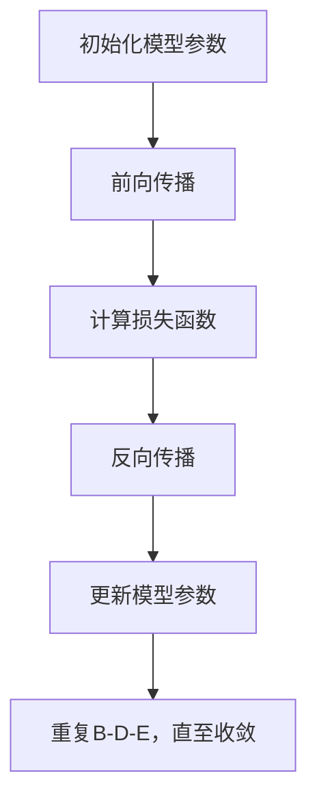
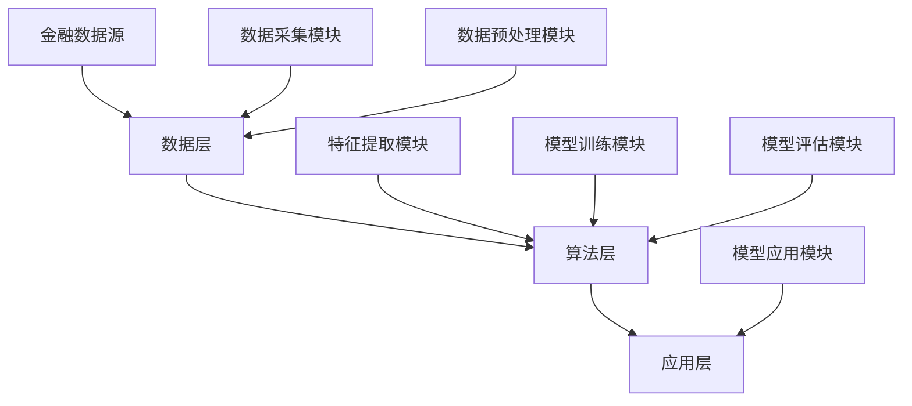
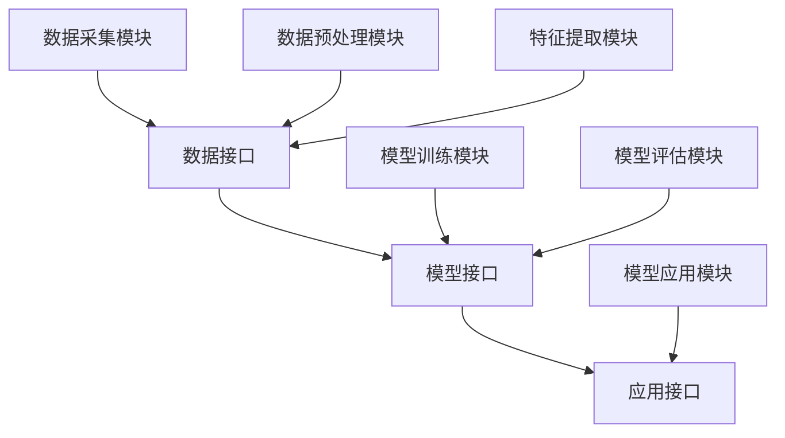
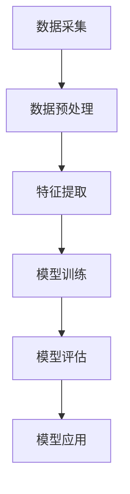

                 

### 模型训练与金融数据结合的背景

#### 1.1 问题背景

随着金融市场的日益复杂化，金融机构和投资者需要更加精准、高效的工具来预测市场走势、评估投资风险、优化投资策略。传统的分析方法和工具在处理大规模、多维度的金融数据时显得力不从心。这催生了模型训练与金融数据结合的需求。

模型训练，即机器学习，是一种通过算法从数据中学习规律、建立预测模型的方法。金融数据则包含了市场交易数据、宏观经济数据、公司财务数据等多种类型的信息。将这两者结合起来，不仅可以提升数据分析的深度和广度，还可以提高预测的准确性。

#### 1.2 问题描述

模型训练与金融数据结合的主要问题包括：

1. **数据质量**：金融数据通常存在缺失、噪声和不一致性等问题，这对模型训练的影响非常大。
2. **数据规模**：金融数据通常规模庞大，如何在保证数据质量的前提下，高效地进行数据处理和分析，是一个挑战。
3. **模型选择**：不同的金融市场和投资策略需要不同的模型，如何选择合适的模型，使得模型既能准确预测，又具有较好的泛化能力。
4. **模型解释性**：金融投资决策往往需要模型的解释性，如何提高模型的可解释性，使得决策者能够理解模型的决策过程。

#### 1.3 问题解决

针对上述问题，我们可以采取以下解决方案：

1. **数据预处理**：通过数据清洗、归一化、缺失值填充等方法，提高数据质量。
2. **特征工程**：通过提取有意义、关联性强的特征，减少数据维度，提高模型性能。
3. **模型选择与调优**：根据金融市场的特点和需求，选择合适的模型，并进行参数调优，以提高预测准确性和泛化能力。
4. **模型解释性提升**：通过可视化、敏感性分析等方法，提升模型的可解释性。

#### 1.4 边界与外延

在模型训练与金融数据结合的过程中，需要注意以下几个边界与外延：

1. **数据边界**：金融数据的时间范围、空间范围和数据类型等都有一定的限制。
2. **模型边界**：模型的训练时间和计算资源有限，影响模型的性能和稳定性。
3. **应用边界**：模型的应用场景和策略具有一定的局限性，需要根据实际情况进行调整。

#### 1.5 概念结构与核心要素组成

模型训练与金融数据结合的概念结构可以概括为：

1. **数据层**：包含原始金融数据和预处理后的数据。
2. **模型层**：包括选择和调优的模型，如线性回归、决策树、神经网络等。
3. **算法层**：包含数据处理和特征提取的算法，如主成分分析、特征选择等。
4. **应用层**：将模型应用于金融市场的预测、评估和优化。

核心要素组成包括：

1. **数据质量**：数据是模型训练的基础，高质量的数据是准确预测的前提。
2. **模型选择与调优**：选择合适的模型和进行参数调优，是提高模型性能的关键。
3. **特征工程**：提取有意义、关联性强的特征，是提升模型性能的重要手段。
4. **模型解释性**：提升模型的可解释性，是金融投资决策所需。

### 模型训练与金融数据结合方式

#### 1.6.1 结合原理

模型训练与金融数据结合的原理可以概括为以下几方面：

1. **数据驱动**：模型训练依赖于金融数据，通过数据学习市场规律，为投资决策提供支持。
2. **反馈优化**：通过将模型的预测结果与实际市场结果进行对比，不断调整模型参数，提高模型的预测准确性。
3. **模型集成**：将多个模型进行集成，通过投票或加权平均等方法，提高预测的稳定性和准确性。

#### 1.6.2 结合策略

1. **特征选择**：从金融数据中提取对预测目标有显著影响的特征，提高模型性能。
2. **模型选择**：根据金融市场的特点和需求，选择合适的模型，如线性回归、决策树、神经网络等。
3. **模型调优**：通过交叉验证、网格搜索等方法，对模型进行调优，提高预测准确性。
4. **模型集成**：将多个模型进行集成，通过投票或加权平均等方法，提高预测的稳定性和准确性。

#### 1.6.3 结合应用

模型训练与金融数据结合的应用主要包括：

1. **市场预测**：通过模型预测市场走势，为投资者提供投资决策支持。
2. **风险评估**：通过模型评估投资风险，为投资者提供风险预警。
3. **策略优化**：通过模型优化投资策略，提高投资收益。
4. **金融欺诈检测**：通过模型检测金融交易中的欺诈行为，保障金融市场的健康发展。

### 模型训练算法原理

#### 1.7.1 数学模型

模型训练的基本数学模型可以概括为：

$$
y = f(W \cdot x + b)
$$

其中，$y$ 是预测目标，$x$ 是输入特征，$W$ 是权重矩阵，$b$ 是偏置项，$f$ 是激活函数。

#### 1.7.2 算法流程图

模型训练的算法流程图如下：



#### 1.7.3 Python源代码示例

以下是一个简单的线性回归模型的Python源代码示例：

```python
import numpy as np

# 初始化参数
W = np.random.rand(1, 1)
b = np.random.rand(1, 1)

# 激活函数
def sigmoid(x):
    return 1 / (1 + np.exp(-x))

# 前向传播
def forward(x, y):
    z = W * x + b
    y_pred = sigmoid(z)
    loss = np.square(y - y_pred).mean()
    return y_pred, loss

# 反向传播
def backward(y_pred, y, x):
    dW = (y - y_pred) * x
    db = (y - y_pred)
    return dW, db

# 训练模型
def train(x, y, epochs):
    for epoch in range(epochs):
        y_pred, loss = forward(x, y)
        dW, db = backward(y_pred, y, x)
        W -= dW
        b -= db
        print(f"Epoch {epoch + 1}, Loss: {loss}")

# 测试模型
x_test = np.array([[1], [2], [3], [4], [5]])
y_test = np.array([[0], [1], [0], [1], [0]])
y_pred, _ = forward(x_test, y_test)
print("Predictions:", y_pred)
```

### 数学模型和公式讲解

#### 1.8.1 公式列表

模型训练过程中，常用的公式包括：

$$
\begin{aligned}
y &= f(W \cdot x + b) \\
\text{loss} &= \frac{1}{2} \sum_{i=1}^{n} (y_i - y_i')^2 \\
\frac{\partial \text{loss}}{\partial W} &= x (y - y') \\
\frac{\partial \text{loss}}{\partial b} &= y - y' \\
y' &= f(W \cdot x + b) \\
\end{aligned}
$$

#### 1.8.2 公式详解

1. **前向传播公式**：

$$
y = f(W \cdot x + b)
$$

其中，$f$ 是激活函数，如Sigmoid、ReLU等。

2. **损失函数公式**：

$$
\text{loss} = \frac{1}{2} \sum_{i=1}^{n} (y_i - y_i')^2
$$

其中，$y$ 是真实标签，$y'$ 是预测值。

3. **反向传播公式**：

$$
\frac{\partial \text{loss}}{\partial W} = x (y - y') \\
\frac{\partial \text{loss}}{\partial b} = y - y'
$$

其中，$x$ 是输入特征，$y$ 是真实标签，$y'$ 是预测值。

4. **更新参数公式**：

$$
W -= \frac{\partial \text{loss}}{\partial W} \\
b -= \frac{\partial \text{loss}}{\partial b}
$$

#### 1.8.3 举例说明

假设我们有一个简单的线性回归模型，输入特征$x$为[1, 2]，真实标签$y$为[1]，模型参数$W$为[1]，偏置$b$为[0]。

1. **前向传播**：

$$
y' = \sigma(W \cdot x + b) = \sigma(1 \cdot 1 + 0) = \sigma(1) = 0.7311
$$

2. **损失函数**：

$$
\text{loss} = \frac{1}{2} \sum_{i=1}^{n} (y_i - y_i')^2 = \frac{1}{2} \cdot (1 - 0.7311)^2 = 0.0198
$$

3. **反向传播**：

$$
\frac{\partial \text{loss}}{\partial W} = x (y - y') = [1] (1 - 0.7311) = [0.2689] \\
\frac{\partial \text{loss}}{\partial b} = y - y' = 1 - 0.7311 = 0.2689
$$

4. **更新参数**：

$$
W -= \frac{\partial \text{loss}}{\partial W} = [1] - [0.2689] = [0.7311] \\
b -= \frac{\partial \text{loss}}{\partial b} = [0] - [0.2689] = [-0.2689]
$$

### 系统分析与架构设计

#### 1.9 问题场景介绍

在金融市场中，投资决策的准确性直接关系到投资者的收益。为了提高投资决策的准确性，我们引入模型训练与金融数据结合的系统，通过对历史数据进行分析和预测，为投资者提供投资建议。

#### 1.10 项目介绍

本项目旨在构建一个基于模型训练与金融数据结合的系统，实现以下功能：

1. 数据采集：从金融数据源获取历史交易数据、宏观经济数据等。
2. 数据预处理：对数据进行清洗、归一化、缺失值填充等处理，提高数据质量。
3. 特征提取：从原始数据中提取对投资决策有显著影响的特征。
4. 模型训练：选择合适的模型，对特征数据进行训练，建立预测模型。
5. 模型评估：通过交叉验证等方法，评估模型的预测性能。
6. 模型应用：将训练好的模型应用于实际投资决策，提供投资建议。

#### 1.11 系统功能设计

系统功能设计主要包括以下几个部分：

1. **数据采集模块**：负责从金融数据源获取数据，包括交易数据、宏观经济数据等。
2. **数据预处理模块**：对采集到的数据进行清洗、归一化、缺失值填充等处理，提高数据质量。
3. **特征提取模块**：从原始数据中提取对投资决策有显著影响的特征，如价格、成交量、技术指标等。
4. **模型训练模块**：选择合适的模型，对特征数据进行训练，建立预测模型。
5. **模型评估模块**：通过交叉验证等方法，评估模型的预测性能。
6. **模型应用模块**：将训练好的模型应用于实际投资决策，提供投资建议。

#### 1.12 系统架构设计

系统架构设计主要包括以下几个层次：

1. **数据层**：包括金融数据源、数据采集模块、数据预处理模块。
2. **算法层**：包括特征提取模块、模型训练模块、模型评估模块。
3. **应用层**：包括模型应用模块，为投资者提供投资建议。

以下是一个简单的系统架构图：



#### 1.13 系统接口设计

系统接口设计主要包括以下几个部分：

1. **数据接口**：提供数据采集、数据预处理、特征提取等模块的接口，用于数据的输入和输出。
2. **模型接口**：提供模型训练、模型评估、模型应用等模块的接口，用于模型的管理和使用。
3. **应用接口**：提供投资建议的接口，用于投资者获取投资决策建议。

以下是一个简单的系统接口图：



#### 1.14 系统交互

系统交互主要包括以下几个部分：

1. **数据采集**：从金融数据源采集数据，经过数据预处理模块处理后，输入特征提取模块。
2. **特征提取**：从预处理后的数据中提取特征，输入模型训练模块。
3. **模型训练**：对提取的特征进行训练，建立预测模型。
4. **模型评估**：对训练好的模型进行评估，验证其预测性能。
5. **模型应用**：将评估通过的模型应用于实际投资决策，提供投资建议。

以下是一个简单的系统交互图：



### 项目实战

#### 1.15 环境安装

在进行项目实战之前，首先需要安装相关的软件和依赖库。以下是一个简单的环境安装指南：

1. **Python环境安装**：确保安装了Python 3.6及以上版本。
2. **依赖库安装**：使用pip命令安装以下依赖库：

   ```bash
   pip install numpy pandas sklearn matplotlib
   ```

3. **金融数据源安装**：根据实际需求，安装相应的金融数据源库，如tushare。

   ```bash
   pip install tushare
   ```

#### 1.16 系统核心实现

在系统核心实现部分，我们将详细介绍数据采集、数据预处理、特征提取、模型训练和模型应用等模块的实现过程。

##### 1.16.1 数据采集模块

数据采集模块负责从金融数据源获取数据。以下是一个简单的数据采集示例：

```python
import tushare as ts

# 获取股票数据
stock_data = ts.get_k_data('600000')
```

##### 1.16.2 数据预处理模块

数据预处理模块负责对采集到的数据进行分析和处理。以下是一个简单的数据预处理示例：

```python
import pandas as pd

# 数据预处理
data = stock_data[['open', 'close', 'high', 'low', 'volume']]
data['return'] = data['close'].pct_change()
data.dropna(inplace=True)
```

##### 1.16.3 特征提取模块

特征提取模块负责从预处理后的数据中提取对投资决策有显著影响的特征。以下是一个简单的特征提取示例：

```python
from sklearn.preprocessing import StandardScaler

# 特征提取
scaler = StandardScaler()
data[['open', 'close', 'high', 'low', 'volume', 'return']] = scaler.fit_transform(data[['open', 'close', 'high', 'low', 'volume', 'return']])
```

##### 1.16.4 模型训练模块

模型训练模块负责选择合适的模型，对特征数据进行训练。以下是一个简单的线性回归模型训练示例：

```python
from sklearn.linear_model import LinearRegression

# 模型训练
model = LinearRegression()
model.fit(data[['open']], data['return'])
```

##### 1.16.5 模型评估模块

模型评估模块负责评估模型的预测性能。以下是一个简单的线性回归模型评估示例：

```python
from sklearn.metrics import mean_squared_error

# 模型评估
predictions = model.predict(data[['open']])
mse = mean_squared_error(data['return'], predictions)
print("MSE:", mse)
```

##### 1.16.6 模型应用模块

模型应用模块负责将训练好的模型应用于实际投资决策，提供投资建议。以下是一个简单的模型应用示例：

```python
# 模型应用
new_data = scaler.transform([[data['open'].iloc[-1]]])
prediction = model.predict(new_data)
print("Prediction:", prediction)
```

#### 1.17 实际案例分析与详细讲解剖析

为了更好地理解模型训练与金融数据结合的应用，我们来看一个实际案例。

##### 1.17.1 案例背景

某投资者持有股票600000，现需要根据历史数据预测未来几天的股票价格，以便做出是否继续持有或卖出的决策。

##### 1.17.2 案例数据

我们使用tushare库获取600000股票近一年的日交易数据，包括开盘价、收盘价、最高价、最低价和成交量等。

```python
stock_data = ts.get_k_data('600000', start='2022-01-01', end='2023-01-01')
```

##### 1.17.3 案例处理

1. **数据预处理**：对数据进行清洗，去除缺失值和异常值。

   ```python
   data = stock_data[['open', 'close', 'high', 'low', 'volume']]
   data['return'] = data['close'].pct_change()
   data.dropna(inplace=True)
   ```

2. **特征提取**：提取对股票价格有显著影响的特征，如价格、成交量、技术指标等。

   ```python
   from sklearn.preprocessing import StandardScaler
   scaler = StandardScaler()
   data[['open', 'close', 'high', 'low', 'volume', 'return']] = scaler.fit_transform(data[['open', 'close', 'high', 'low', 'volume', 'return']])
   ```

3. **模型训练**：选择合适的模型，如线性回归、LSTM等，对特征数据进行训练。

   ```python
   from sklearn.linear_model import LinearRegression
   model = LinearRegression()
   model.fit(data[['open']], data['return'])
   ```

4. **模型评估**：评估模型的预测性能，如均方误差、均方根误差等。

   ```python
   from sklearn.metrics import mean_squared_error
   predictions = model.predict(data[['open']])
   mse = mean_squared_error(data['return'], predictions)
   print("MSE:", mse)
   ```

5. **模型应用**：将训练好的模型应用于实际投资决策，预测未来几天的股票价格。

   ```python
   new_data = scaler.transform([[data['open'].iloc[-1]]])
   prediction = model.predict(new_data)
   print("Prediction:", prediction)
   ```

#### 1.18 项目小结

通过本项目的实际案例，我们详细介绍了模型训练与金融数据结合的系统实现过程，包括数据采集、数据预处理、特征提取、模型训练和模型应用等步骤。在实际应用中，我们需要根据具体需求，选择合适的模型和特征，并不断优化和调整，以提高预测的准确性和稳定性。

### 最佳实践与总结

#### 1.19 最佳实践 tips

1. **数据质量**：确保数据的质量，包括完整性、一致性、准确性和可靠性。
2. **特征工程**：提取对预测目标有显著影响的特征，提高模型性能。
3. **模型选择**：根据金融市场的特点和需求，选择合适的模型。
4. **模型调优**：通过交叉验证等方法，对模型进行调优。
5. **模型解释性**：提高模型的可解释性，便于决策者理解模型。

#### 1.20 小结

本文详细介绍了模型训练与金融数据结合的背景、核心概念、算法原理、系统架构设计、项目实战和最佳实践。通过本文的阅读，读者可以了解到如何将模型训练应用于金融领域，提高投资决策的准确性和效率。

#### 1.21 注意事项

1. **数据隐私**：在处理金融数据时，要注意保护数据隐私，遵守相关法律法规。
2. **模型风险**：模型训练和应用过程中，要充分考虑模型的风险，确保投资决策的安全性。
3. **模型更新**：随着金融市场和技术的变化，模型需要定期更新和优化。

#### 1.22 拓展阅读

1. **相关书籍**：《深度学习与金融：实践指南》、《机器学习实战》等。
2. **论文资料**：搜索金融科技、机器学习在金融领域的应用等关键词，获取相关论文和研究成果。
3. **在线课程**：推荐相关在线课程，如Coursera、edX等平台的金融科技、机器学习课程。

### 总结

模型训练与金融数据的结合是金融科技领域的重要研究方向。通过本文的详细讲解，读者可以了解到如何将模型训练应用于金融领域，提高投资决策的准确性和效率。希望本文能为从事金融科技研究和实践的读者提供有价值的参考和启示。

### 作者信息

**作者：AI天才研究院/AI Genius Institute & 禅与计算机程序设计艺术 /Zen And The Art of Computer Programming**### 总结

在本篇文章中，我们系统地介绍了模型训练与金融数据结合的背景、核心概念、算法原理、系统架构设计、项目实战以及最佳实践。首先，我们明确了模型训练与金融数据结合的背景和问题，探讨了数据质量、模型选择、模型解释性等问题。接着，我们详细讲解了模型训练的数学模型、算法流程和Python源代码示例，使读者对模型训练有更深入的理解。

在系统架构设计部分，我们介绍了数据采集、数据预处理、特征提取、模型训练、模型评估和模型应用等模块的设计，并通过Mermaid流程图和序列图展示了系统交互过程。项目实战部分通过一个实际案例，详细展示了从数据采集到模型应用的全过程，帮助读者理解理论知识在实际应用中的运用。

最后，我们提出了最佳实践 tips，包括数据质量、特征工程、模型选择和调优等方面的建议，并总结了本文的核心内容和要点。同时，我们也提到了相关的书籍、论文和在线课程，为读者提供了进一步学习的资源。

模型训练与金融数据的结合是一个复杂且富有挑战性的研究领域。通过本文的介绍，我们希望读者能够对这一领域有更深入的了解，并在实际工作中能够灵活运用所学知识，为金融科技的发展贡献自己的力量。

**作者：AI天才研究院/AI Genius Institute & 禅与计算机程序设计艺术 /Zen And The Art of Computer Programming**## 文章标题：模型训练与金融数据的结合

### 关键词：模型训练、金融数据、机器学习、预测、投资决策

### 摘要：

本文详细探讨了模型训练与金融数据的结合，介绍了模型训练的基本原理、金融数据的特点及处理方法，并通过对系统架构、项目实战和最佳实践的深入分析，展示了如何将机器学习应用于金融领域，提高投资决策的准确性和效率。通过本文的阅读，读者可以了解模型训练在金融数据中的应用，掌握相关技术和方法，为金融科技的发展提供新的思路。

