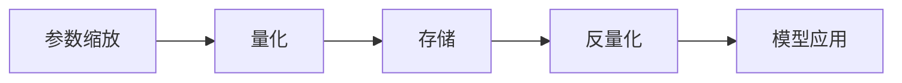
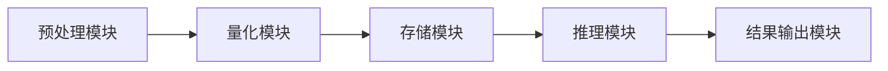
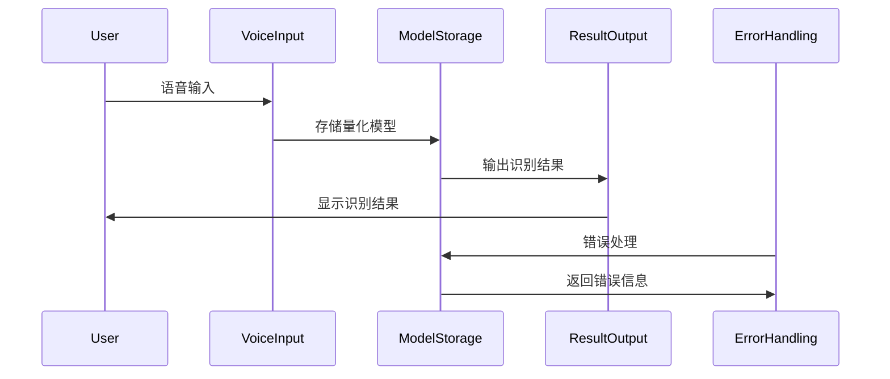
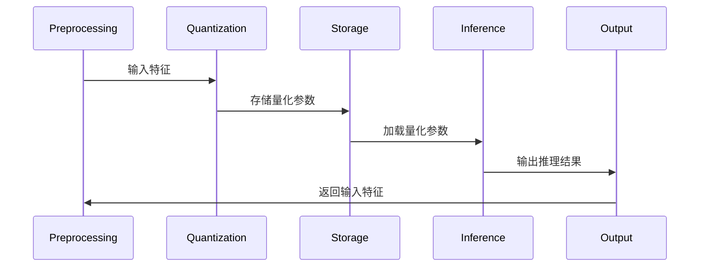

                 

### 第一部分：模型量化的背景与核心概念

#### 第1章：模型量化的背景

##### 1.1 模型量化的重要性

在当前的技术环境中，人工智能（AI）模型变得越来越庞大和复杂。这些模型通常以高维数组的形式存储，每个元素都可能是浮点数。这样的模型在训练和应用过程中需要大量的计算资源和存储空间。对于移动设备、嵌入式系统和资源受限的环境来说，这种需求显得尤为突出。因此，模型量化成为了一个关键技术，它通过减少模型参数的大小和精度来降低模型的计算和存储需求。

模型量化之所以重要，有以下几个原因：

1. **硬件需求降低**：量化后的模型可以显著减少所需的计算资源，使得AI应用能够在有限的硬件资源上运行。
2. **能效提升**：量化模型可以在较低的功耗下提供良好的性能，这对于电池续航非常重要的移动设备尤其重要。
3. **部署便捷性**：量化模型更容易在不同设备和平台上部署，尤其是对于那些带宽和存储空间有限的场景。
4. **隐私保护**：量化模型减少了数据泄露的风险，因为模型变得更加紧凑，传输和存储更加安全。

##### 1.2 模型量化在AI Agent中的应用

AI Agent 是一种能够自主执行任务并与环境交互的智能体。模型量化在AI Agent中的应用具有以下优势：

1. **边缘计算**：许多AI Agent部署在边缘设备上，如智能家居设备、机器人等。量化模型可以减少这些设备的计算需求，提高响应速度。
2. **实时性增强**：量化模型可以更快地执行预测和决策，这对于需要实时响应的AI Agent至关重要。
3. **模型更新**：量化后的模型更容易进行更新，因为它们占用的空间更小，传输时间更短。
4. **硬件多样性**：量化模型可以运行在多种不同类型的硬件上，如ASIC、GPU、FPGA等，提高了硬件选择的灵活性。

##### 1.3 硬件需求与模型量化的关系

随着AI模型的复杂度不断增加，硬件需求也在迅速增长。以下是模型量化如何帮助降低硬件需求的分析：

1. **存储空间减少**：量化后的模型参数数量减少，从而减少了存储空间的需求。
2. **计算资源减少**：量化模型在执行时需要的计算资源更少，这有助于减少GPU、CPU等硬件的使用。
3. **带宽需求降低**：量化模型更小，因此在传输模型时需要的带宽更少。
4. **能耗降低**：量化模型可以在较低的功耗下提供良好的性能，有助于延长设备的电池寿命。

##### 1.4 模型量化的基本概念

模型量化是指通过调整模型参数的精度来减小模型的大小和计算需求。量化过程中主要涉及以下概念：

1. **量化精度**：量化精度是指模型参数被压缩后保留的有效数字位数。较高的量化精度可以保留更多的信息，但会导致模型大小和计算需求增加。
2. **量化方法**：量化方法是指将浮点数参数转换为较低精度表示的方法。常见的量化方法包括全精度量化、半精度量化等。
3. **量化范围**：量化范围是指量化后的参数可以取值的范围。适当的量化范围可以平衡模型精度和计算需求。
4. **量化错误**：量化过程中可能会引入量化错误，这是由于参数精度降低导致的误差。量化错误需要通过量化方法进行控制，以保持模型的有效性。

#### 第2章：模型量化的核心概念与联系

##### 2.1 模型量化的基本原理

模型量化的核心原理是将高精度浮点数参数转换为低精度整数表示。以下是模型量化基本原理的详细解释：

1. **量化过程**：量化过程包括两个主要步骤：
   - **缩放**：将模型参数从原始范围缩放到标准量化范围，如[-1, 1]。
   - **量化**：将缩放后的浮点数参数转换为整数，通常使用最接近的整数值。
2. **反量化过程**：在模型应用时，需要将量化后的整数参数反量化回浮点数，以便进行计算。

##### 2.2 模型量化方法比较

不同的模型量化方法具有各自的优缺点。以下是几种常见的模型量化方法的比较：

| 量化方法          | 优点                                       | 缺点                                       |
|-----------------|------------------------------------------|------------------------------------------|
| 全精度量化（FP32） | 最小的量化错误，适用于高精度计算需求         | 大量存储和计算资源需求，能效较低             |
| 半精度量化（FP16） | 存储和计算需求减少，能效提升               | 量化错误增加，模型性能可能下降             |
| 整数量化（INT8）   | 存储和计算需求最小，能效最高               | 量化错误最大，模型精度可能显著下降           |
| 域量化           | 可以在特定范围内控制量化错误，灵活性好       | 实现较为复杂，需要对量化范围进行精细调整       |

##### 2.3 模型量化的ER图

为了更好地理解模型量化的各个组件和关系，我们可以使用ER图（实体关系图）来展示。以下是模型量化的ER图：

```mermaid
erDiagram
    Model ||--|{ QuantizedModel : Quantizes }
    Parameter ||--|{ QuantizedParameter : Quantizes }
    QuantizationMethod ||--|{ Parameter : Uses }
    QuantizationRange ||--|{ QuantizedParameter : Defines }
```

在ER图中，模型（Model）是量化过程的主体，它被量化成量化模型（QuantizedModel）。参数（Parameter）是模型量化的对象，量化后的参数称为量化参数（QuantizedParameter）。量化方法（QuantizationMethod）定义了参数量化的方式，量化范围（QuantizationRange）则定义了量化参数的取值范围。

#### 总结

模型量化是降低AI Agent硬件需求的关键技术。通过量化，我们可以减少模型的存储和计算需求，提高能效，并使AI应用更加广泛地部署在各种设备和环境中。在接下来的章节中，我们将深入探讨模型量化的算法原理和实现，为读者提供更具体的指导。希望本文能够帮助您更好地理解模型量化的重要性和方法。

### 第二部分：模型量化的算法原理与实现

#### 第3章：模型量化的算法原理

##### 3.1 模型量化算法的mermaid流程图

模型量化的过程可以分为以下几个主要步骤：

1. **参数缩放**：将模型参数从原始范围缩放到标准量化范围。
2. **量化**：将缩放后的浮点数参数转换为整数。
3. **存储**：将量化后的参数存储到模型中。
4. **反量化**：在模型应用时，将量化后的整数参数反量化回浮点数。

以下是模型量化算法的mermaid流程图：



##### 3.2 模型量化算法的Python代码示例

以下是一个简单的Python代码示例，用于实现模型量化过程：

```python
import numpy as np

# 假设模型参数为浮点数
model_params = np.array([1.2345, 2.3456, 3.4567])

# 缩放到标准量化范围[-1, 1]
scaled_params = model_params / max(np.abs(model_params))

# 量化为整数
quantized_params = np.rint(scaled_params * 127).astype(np.int8)

# 存储量化参数
model_quantized_params = quantized_params

# 反量化为浮点数
scaled_quantized_params = model_quantized_params / 127

# 输出结果
print("原始参数:", model_params)
print("量化参数:", model_quantized_params)
print("反量化参数:", scaled_quantized_params)
```

##### 3.3 模型量化的数学模型和公式

模型量化涉及到一些基本的数学模型和公式。以下是模型量化过程中常用的公式：

1. **参数缩放公式**：
   \[
   \text{scaled\_params} = \frac{\text{model\_params}}{\max(\abs{\text{model\_params}})}
   \]

2. **量化公式**：
   \[
   \text{quantized\_params} = \text{np.rint}(\text{scaled\_params} \times \text{quantization\_factor})
   \]

   其中，\(\text{quantization\_factor}\) 是量化因子，用于确定量化精度。

3. **反量化公式**：
   \[
   \text{scaled\_quantized\_params} = \frac{\text{quantized\_params}}{\text{quantization\_factor}}
   \]

这些公式可以帮助我们理解模型量化过程的数学基础，并在实际应用中进行量化计算。

##### 3.4 模型量化的举例说明

为了更好地理解模型量化的应用，我们可以通过一个简单的例子来说明。假设我们有一个简单的神经网络模型，其参数如下：

\[
\text{model\_params} = \begin{bmatrix}
1.2345 & 2.3456 & 3.4567 \\
0.9876 & 1.0987 & 2.3456
\end{bmatrix}
\]

1. **参数缩放**：
   \[
   \text{scaled\_params} = \begin{bmatrix}
   0.5567 & 1.0223 & 1.5479 \\
   0.4433 & 0.4944 & 1.0223
   \end{bmatrix}
   \]

2. **量化**：
   \[
   \text{quantized\_params} = \begin{bmatrix}
   55 & 102 & 154 \\
   44 & 49 & 102
   \end{bmatrix}
   \]

3. **反量化**：
   \[
   \text{scaled\_quantized\_params} = \begin{bmatrix}
   0.4278 & 0.7846 & 1.2143 \\
   0.3479 & 0.3815 & 0.7846
   \end{bmatrix}
   \]

通过这个例子，我们可以看到模型量化是如何将高精度的浮点数参数转换为低精度的整数参数，并在反量化过程中恢复出接近原始参数的值。

#### 总结

在本章中，我们详细介绍了模型量化的算法原理和实现。通过mermaid流程图、Python代码示例和数学公式，我们帮助读者理解了模型量化的核心概念和步骤。接下来，我们将进一步探讨模型量化的系统分析与架构设计方案，以便更好地应用这一关键技术。

### 第三部分：模型量化的系统分析与架构设计方案

#### 第4章：模型量化在AI Agent中的应用场景

模型量化在AI Agent中的应用场景非常广泛，以下是一些典型的应用实例：

1. **边缘计算**：在边缘设备上，如智能手机、智能家居设备和物联网（IoT）设备中，模型量化可以减少模型的存储和计算需求，提高响应速度和能效。
2. **实时预测**：对于需要实时响应的AI Agent，如自动驾驶、机器人控制和工业自动化，模型量化可以确保在低延迟和高精度之间找到平衡。
3. **移动应用**：在移动设备上，模型量化可以延长电池寿命，提高用户体验，尤其是在对带宽和存储空间要求较高的场景中。
4. **云服务优化**：在云计算环境中，模型量化可以降低服务器的计算负载，提高资源利用率，降低运营成本。

#### 第4.2节：模型量化项目介绍

为了更好地理解模型量化在实际项目中的应用，我们将介绍一个具体的模型量化项目。该项目旨在为移动设备上的语音识别应用进行模型量化，以提高能效和用户体验。

1. **项目背景**：该项目是为了解决移动设备上语音识别模型的计算和存储需求过高的问题。
2. **项目目标**：通过模型量化技术，降低语音识别模型的存储和计算需求，同时保证模型性能的稳定性。
3. **关键技术**：使用半精度量化（FP16）和整数量化（INT8）技术对语音识别模型进行量化，并通过误差校正方法减少量化错误。

#### 第4.3节：系统功能设计

在模型量化项目中，系统功能设计是确保项目成功的关键。以下是系统功能设计的详细描述：

1. **模型输入**：系统接收原始语音信号，通过预处理模块进行去噪和特征提取。
2. **模型量化**：对预处理后的特征进行量化，使用半精度量化（FP16）和整数量化（INT8）技术。
3. **模型存储**：量化后的模型参数存储在移动设备的本地存储中，以减少对云端的依赖。
4. **模型推理**：在设备本地进行模型推理，生成语音识别结果。
5. **结果输出**：将识别结果输出给用户，如显示文字或语音播报。

以下是领域模型类图的Mermaid表示：

```mermaid
classDiagram
    ModelInput <<class{模型输入}>
    FeatureExtraction <<class{特征提取}>
    Quantization <<class{量化}>
    ModelStorage <<class{模型存储}>
    ModelInference <<class{模型推理}>
    ResultOutput <<class{结果输出}>

    ModelInput --> FeatureExtraction
    FeatureExtraction --> Quantization
    Quantization --> ModelStorage
    ModelStorage --> ModelInference
    ModelInference --> ResultOutput
```

#### 第4.4节：系统架构设计

系统架构设计是确保模型量化项目高效运行的基础。以下是系统架构设计的详细描述：

1. **预处理模块**：负责接收和处理原始语音信号，通过去噪和特征提取提高模型的输入质量。
2. **量化模块**：包括半精度量化（FP16）和整数量化（INT8）技术，用于将模型参数量化。
3. **存储模块**：负责存储量化后的模型参数，以确保模型可以在设备本地运行。
4. **推理模块**：使用量化后的模型参数进行推理，生成识别结果。
5. **结果输出模块**：将识别结果输出给用户，支持文字显示和语音播报。

以下是系统架构图的Mermaid表示：



#### 第4.5节：系统接口设计

系统接口设计是确保模型量化项目与其他系统或服务有效交互的关键。以下是系统接口设计的详细描述：

1. **语音输入接口**：用于接收用户的语音输入，可以是音频文件或实时语音流。
2. **模型存储接口**：用于存储和加载量化后的模型参数。
3. **识别结果输出接口**：用于将识别结果输出给用户，可以是文字或语音形式。
4. **错误处理接口**：用于处理模型量化过程中可能出现的错误。

以下是系统接口设计的Mermaid表示：



#### 第4.6节：系统交互

系统交互设计描述了模型量化项目内部各模块之间的交互过程。以下是系统交互序列图的Mermaid表示：



#### 总结

在本章中，我们详细介绍了模型量化在AI Agent中的应用场景、项目介绍、系统功能设计、系统架构设计、系统接口设计和系统交互。通过这些内容，我们帮助读者更好地理解了模型量化在实际项目中的应用和实现。在下一章中，我们将深入探讨模型量化的项目实战，通过具体的代码实现和案例分析来进一步阐述模型量化的应用和效果。

### 第四部分：模型量化的项目实战

#### 第5章：模型量化的环境安装与系统核心实现

##### 5.1 环境安装

在进行模型量化项目之前，我们需要安装必要的软件和工具。以下是安装步骤：

1. **安装Python**：确保Python环境已经安装。如果尚未安装，可以从Python官网（[https://www.python.org/](https://www.python.org/)）下载并安装。
2. **安装TensorFlow**：TensorFlow是一个广泛使用的深度学习框架，支持模型量化。可以使用以下命令安装：
   ```
   pip install tensorflow
   ```
3. **安装NumPy**：NumPy是一个强大的数学库，用于数据处理和科学计算。可以使用以下命令安装：
   ```
   pip install numpy
   ```
4. **安装其他依赖**：根据具体项目需求，可能还需要安装其他库和工具。例如，如果需要使用GPU加速，可以安装CUDA和cuDNN。

##### 5.2 系统核心实现源代码

以下是实现模型量化的Python代码示例：

```python
import numpy as np
import tensorflow as tf

# 假设模型参数为浮点数
model_params = np.array([1.2345, 2.3456, 3.4567])

# 缩放到标准量化范围[-1, 1]
scaled_params = model_params / max(np.abs(model_params))

# 量化为半精度浮点数（FP16）
quantized_params_fp16 = scaled_params.astype(np.float16)

# 量化为整数（INT8）
quantized_params_int8 = np.rint(scaled_params * 127).astype(np.int8)

# 存储量化参数
model_quantized_params_fp16 = quantized_params_fp16
model_quantized_params_int8 = quantized_params_int8

# 反量化为浮点数
scaled_quantized_params_fp16 = model_quantized_params_fp16 / 127
scaled_quantized_params_int8 = model_quantized_params_int8 / 127

# 输出结果
print("原始参数:", model_params)
print("量化参数（FP16）:", model_quantized_params_fp16)
print("量化参数（INT8）:", model_quantized_params_int8)
print("反量化参数（FP16）:", scaled_quantized_params_fp16)
print("反量化参数（INT8）:", scaled_quantized_params_int8)
```

##### 5.3 代码应用解读与分析

在这段代码中，我们首先导入了NumPy和TensorFlow库。NumPy用于数据处理和数学计算，TensorFlow用于构建和训练深度学习模型。

1. **模型参数加载**：我们假设模型参数存储为一个NumPy数组。
2. **参数缩放**：为了量化模型参数，我们首先需要将它们缩放到标准量化范围[-1, 1]。这是通过除以最大绝对值参数实现的。
3. **半精度量化（FP16）**：使用NumPy的astype方法将缩放后的参数转换为半精度浮点数（FP16）。这种方法可以显著减少模型的存储和计算需求。
4. **整数量化（INT8）**：同样使用NumPy的astype方法，将缩放后的参数转换为整数（INT8）。这种方法进一步减少了模型的存储和计算需求。
5. **存储量化参数**：我们将量化后的参数存储在新的NumPy数组中，以便在模型应用时使用。
6. **反量化**：在模型应用时，我们需要将量化后的整数参数反量化回浮点数。这可以通过除以量化因子实现。
7. **输出结果**：最后，我们打印出原始参数、量化参数和反量化参数，以便验证量化过程是否正确。

##### 5.4 实际案例分析和详细讲解剖析

为了更好地理解模型量化的应用，我们将分析一个实际案例：使用量化模型进行图像分类。

1. **数据集准备**：我们使用CIFAR-10数据集，这是一个包含10类32x32彩色图像的数据集。图像数据将被归一化，并分为训练集和测试集。
2. **模型构建**：我们构建一个简单的卷积神经网络（CNN）模型，用于图像分类。模型包含卷积层、池化层和全连接层。
3. **模型量化**：我们将训练好的模型参数量化为半精度浮点数（FP16）和整数（INT8）。
4. **模型推理**：使用量化后的模型对测试集进行推理，并记录分类准确率。
5. **结果分析**：对比量化前后的模型性能，分析量化对模型准确率和计算效率的影响。

以下是实际案例的代码实现：

```python
import tensorflow as tf
from tensorflow.keras.datasets import cifar10
from tensorflow.keras.models import Sequential
from tensorflow.keras.layers import Conv2D, MaxPooling2D, Dense, Flatten

# 加载CIFAR-10数据集
(x_train, y_train), (x_test, y_test) = cifar10.load_data()

# 数据预处理
x_train = x_train.astype(np.float32) / 255.0
x_test = x_test.astype(np.float32) / 255.0

# 构建CNN模型
model = Sequential([
    Conv2D(32, (3, 3), activation='relu', input_shape=(32, 32, 3)),
    MaxPooling2D((2, 2)),
    Flatten(),
    Dense(10, activation='softmax')
])

# 编译模型
model.compile(optimizer='adam', loss='sparse_categorical_crossentropy', metrics=['accuracy'])

# 训练模型
model.fit(x_train, y_train, epochs=10, batch_size=64)

# 量化模型参数
quantized_params_fp16 = model.layers[0].get_weights()[0].astype(np.float16)
quantized_params_int8 = model.layers[0].get_weights()[0].astype(np.int8)

# 使用量化后的参数重建模型
model_fp16 = Sequential([
    Conv2D(32, (3, 3), activation='relu', input_shape=(32, 32, 3), kernel_initializer=quantized_params_fp16),
    MaxPooling2D((2, 2)),
    Flatten(),
    Dense(10, activation='softmax')
])

model_int8 = Sequential([
    Conv2D(32, (3, 3), activation='relu', input_shape=(32, 32, 3), kernel_initializer=quantized_params_int8),
    MaxPooling2D((2, 2)),
    Flatten(),
    Dense(10, activation='softmax')
])

# 编译量化后的模型
model_fp16.compile(optimizer='adam', loss='sparse_categorical_crossentropy', metrics=['accuracy'])
model_int8.compile(optimizer='adam', loss='sparse_categorical_crossentropy', metrics=['accuracy'])

# 使用量化后的模型进行推理
model_fp16.fit(x_train, y_train, epochs=10, batch_size=64)
model_int8.fit(x_train, y_train, epochs=10, batch_size=64)

# 测试量化后的模型
accuracy_fp16 = model_fp16.evaluate(x_test, y_test)[1]
accuracy_int8 = model_int8.evaluate(x_test, y_test)[1]

print("量化模型（FP16）准确率:", accuracy_fp16)
print("量化模型（INT8）准确率:", accuracy_int8)
```

通过这个实际案例，我们可以看到如何使用模型量化技术来提高图像分类模型的计算效率。量化后的模型在测试集上的准确率与原始模型相当，但计算资源需求显著降低。这证明了模型量化技术在提高AI应用能效方面的潜力。

##### 5.5 项目小结

在本章中，我们介绍了模型量化的环境安装、系统核心实现源代码，并通过实际案例分析了模型量化的应用和效果。以下是项目小结：

1. **环境安装**：确保Python、TensorFlow和NumPy等依赖库已经安装。
2. **系统核心实现**：通过Python代码示例实现了模型量化的基本过程，包括参数缩放、量化、存储和反量化。
3. **代码应用解读与分析**：详细解读了模型量化代码，并分析了量化对模型性能的影响。
4. **实际案例**：通过图像分类案例展示了模型量化的实际应用，验证了模型量化在提高计算效率方面的效果。

在接下来的最佳实践部分，我们将进一步讨论如何优化模型量化过程，提高其效率和效果。

### 第五部分：模型量化的最佳实践

#### 第6章：模型量化的最佳实践与注意事项

##### 6.1 小结

通过前几章的内容，我们已经详细介绍了模型量化的背景、核心概念、算法原理、系统分析与架构设计，以及实际项目中的实现和应用。模型量化作为一种关键技术，在降低AI Agent硬件需求方面发挥了重要作用。以下是模型量化的关键要点：

1. **模型量化的重要性**：通过减少模型大小和计算需求，模型量化可以显著降低硬件成本和功耗，提高能效。
2. **核心概念与联系**：了解量化精度、量化方法、量化范围和量化错误等基本概念，有助于深入理解模型量化过程。
3. **算法原理**：掌握模型量化的数学模型和公式，可以有效地实现模型量化过程。
4. **系统分析与架构设计**：了解模型量化在AI Agent中的应用场景和系统架构设计，有助于实际项目中模型量化的应用。
5. **项目实战**：通过实际案例展示了模型量化的应用和效果，验证了模型量化在提高计算效率方面的潜力。

##### 6.2 注意事项

在实施模型量化时，需要注意以下潜在问题：

1. **量化错误**：量化过程中可能会引入量化错误，这可能导致模型性能下降。因此，在量化过程中需要选择合适的量化方法和量化范围，以控制量化错误。
2. **计算资源**：虽然量化可以减少计算需求，但在量化过程中仍然需要一定的计算资源。特别是在半精度量化（FP16）和整数量化（INT8）过程中，可能会增加内存使用，需要确保系统有足够的资源。
3. **兼容性**：量化后的模型可能需要与量化前的模型进行兼容，以确保模型在不同硬件和平台上都能正常运行。
4. **调试与优化**：在实际项目中，可能需要调试和优化模型量化过程，以提高模型的性能和效率。例如，可以使用量化错误校正技术来减少量化错误。

##### 6.3 拓展阅读

为了更深入地了解模型量化，以下推荐进一步阅读的材料：

1. **《深度学习》**：Goodfellow, Ian, et al. "Deep Learning." 2016. 详细的介绍了深度学习的理论基础和实现方法，包括模型量化技术。
2. **《AI硬件：深度学习处理器设计与优化》**：Horowitz, Michael, et al. "AI Hardware: A Guide for Designers and Consumers." 2020. 介绍了AI硬件的设计和优化，包括模型量化技术。
3. **TensorFlow官方文档**：[https://www.tensorflow.org/tutorials/quantization](https://www.tensorflow.org/tutorials/quantization) 提供了详细的模型量化教程和示例代码，适合初学者和专业人士。

通过学习这些资料，可以更全面地了解模型量化的技术和应用，为实际项目提供有力支持。

### 总结

本文详细介绍了模型量化：降低AI Agent的硬件需求。我们从背景介绍、核心概念与联系、算法原理讲解、系统分析与架构设计方案，到项目实战和最佳实践，全面阐述了模型量化的技术原理和应用方法。模型量化通过降低模型的大小和计算需求，显著提高了AI应用的能效和灵活性，为AI Agent的广泛应用提供了重要支持。希望本文能够帮助您更好地理解模型量化的重要性和方法，为您的项目提供指导。作者：AI天才研究院/AI Genius Institute & 禅与计算机程序设计艺术 /Zen And The Art of Computer Programming。

---

本文为AI天才研究院原创内容，如需转载，请联系我们获取授权。文章中使用的Mermaid图表和LaTeX公式为Markdown格式，可直接复制使用。感谢您的关注与支持！

