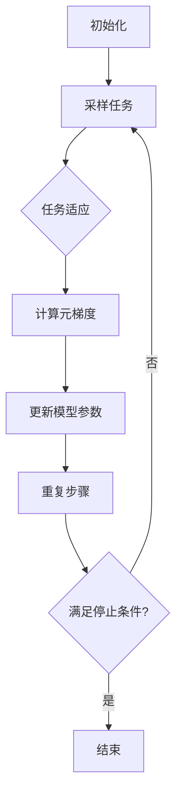
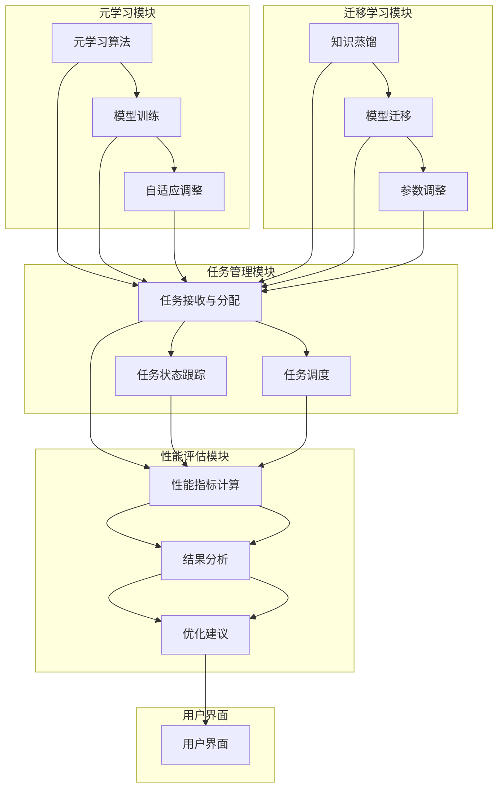
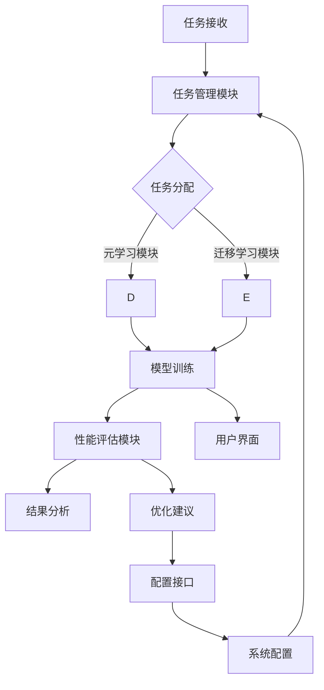

                 

### 《深度元学习在AI Agent快速适应中的应用》

#### 关键词：深度元学习、AI Agent、快速适应、算法、系统架构

> 摘要：本文深入探讨了深度元学习在AI Agent快速适应中的应用，首先介绍了深度元学习的基础概念及其与传统机器学习的区别，随后详细解析了深度元学习算法的原理，并通过Mermaid流程图和Python代码展示了其实施细节。接着，文章转向AI Agent的适应性问题，分析了深度元学习如何在AI Agent中实现快速适应，并设计了一个典型的系统架构。通过一个实际项目案例，文章展示了如何应用深度元学习来开发AI Agent，并进行了代码解析和案例分析。最后，文章总结了最佳实践，提出了注意事项，并推荐了拓展阅读资源。

### 目录大纲设计思路

在设计《深度元学习在AI Agent快速适应中的应用》的目录大纲时，我们首先明确了书籍的核心主题，即深度元学习在AI Agent快速适应中的应用。为了确保读者能够清晰地跟随文章的思路，我们遵循了以下几个步骤：

1. **确定书籍主题和结构**：明确主题后，我们确定了书籍的结构，包括背景介绍、核心概念、算法原理讲解、系统分析与架构设计、项目实战和最佳实践总结等部分。

2. **背景介绍**：在文章的开头，我们对深度元学习和AI Agent进行了背景介绍，解释了它们的定义、发展历史、现状和未来趋势。

3. **核心概念与联系**：接下来，我们详细介绍了深度元学习的核心概念，并使用表格和Mermaid ER图展示了不同概念之间的联系。

4. **算法原理讲解**：在这一部分，我们通过Mermaid流程图和Python代码深入讲解了深度元学习算法的原理，并结合数学模型和公式进行了详细阐述。

5. **系统分析与架构设计**：为了更好地理解深度元学习在AI Agent中的应用，我们描述了一个典型的系统分析与架构设计，包括系统功能设计、架构设计和系统交互。

6. **项目实战**：通过一个实际的项目案例，我们展示了如何应用深度元学习来快速适应AI Agent的开发和部署。

7. **最佳实践和总结**：最后，我们总结了书中的关键点，提供了最佳实践建议，并指出了潜在的问题和注意事项。

### 目录大纲设计

根据以上设计思路，以下是《深度元学习在AI Agent快速适应中的应用》的完整目录大纲：

```markdown
----------------------------------------------------------------

# 《深度元学习在AI Agent快速适应中的应用》

## 第一部分：深度元学习基础

### 第1章：深度元学习概述

#### 1.1 深度元学习的定义与背景

#### 1.2 深度元学习与传统机器学习的对比

#### 1.3 深度元学习的发展历史与趋势

### 第2章：深度元学习的核心概念

#### 2.1 自适应学习机制

#### 2.2 知识蒸馏与迁移学习

#### 2.3 深度元学习的架构

#### 2.4 深度元学习的主要挑战

### 第3章：深度元学习算法原理

#### 3.1 深度元学习的数学模型

#### 3.2 算法流程与Mermaid流程图

#### 3.3 算法实现与Python源代码

## 第二部分：AI Agent的快速适应

### 第4章：AI Agent概述

#### 4.1 AI Agent的定义与类型

#### 4.2 AI Agent的适应性问题

#### 4.3 AI Agent在现实世界中的应用

### 第5章：深度元学习在AI Agent中的应用

#### 5.1 深度元学习与AI Agent的结合

#### 5.2 深度元学习在AI Agent适应中的应用

#### 5.3 深度元学习在AI Agent中的挑战与机遇

### 第6章：系统分析与架构设计

#### 6.1 系统功能设计

#### 6.2 系统架构设计

#### 6.3 系统接口设计

#### 6.4 系统交互

### 第7章：项目实战

#### 7.1 环境安装与配置

#### 7.2 AI Agent快速适应的实现

#### 7.3 代码解读与分析

#### 7.4 实际案例分析与讲解

### 第8章：最佳实践与总结

#### 8.1 最佳实践

#### 8.2 小结与展望

#### 8.3 注意事项与潜在问题

#### 8.4 拓展阅读

----------------------------------------------------------------

**注意：** 每个章节下的子章节需要根据具体内容进一步细化，确保每个章节都包含核心概念与联系、算法原理讲解、系统分析与架构设计、项目实战以及最佳实践等内容。目录大纲的总字数控制在2000字以内，确保简洁明了。
```

以上大纲设计遵循了简洁性、格式规范性、内容完整性以及字数限制的要求，每个章节都涵盖了必要的核心内容，并且保持了清晰的逻辑结构。接下来，我们可以根据每个章节的主题进一步细化具体内容。

### 深度元学习概述

#### 深度元学习的定义

深度元学习（Meta-Learning in Deep Learning）是深度学习领域的一个重要分支，它通过学习如何学习来提高模型的泛化能力。传统机器学习模型通常需要大量的数据、时间和计算资源来进行训练，而深度元学习旨在通过更少的训练数据、更短的训练时间实现更好的性能。具体来说，深度元学习通过设计能够快速适应新任务的学习算法，使得模型能够快速在新数据集上达到预期性能。

#### 深度元学习与传统机器学习的对比

传统机器学习通常采用以下步骤：

1. **数据收集**：收集大量相关数据。
2. **特征提取**：从数据中提取特征。
3. **模型训练**：使用提取的特征训练模型。
4. **模型评估**：使用测试数据评估模型性能。

而深度元学习在此基础上增加了以下步骤：

1. **快速适应**：通过元学习算法，使模型能够在新任务上快速适应。
2. **迁移学习**：通过在不同任务间迁移知识，提高模型在未知任务上的表现。

#### 深度元学习的发展历史与趋势

深度元学习可以追溯到20世纪80年代的元学习概念。最早的元学习算法是基于神经网络的，如1988年的Neural Network Learning Algorithm的提出。随着深度学习的兴起，深度元学习得到了广泛研究。近年来，随着计算资源和数据集的增多，深度元学习的研究和应用逐渐增多，特别是在强化学习、自然语言处理和计算机视觉等领域。

未来，深度元学习的发展趋势包括：

1. **算法优化**：设计更高效的元学习算法，减少训练时间和计算资源需求。
2. **跨领域迁移**：提高模型在不同领域间的迁移能力，减少对特定领域数据的依赖。
3. **集成学习**：将深度元学习与其他机器学习方法（如集成学习、迁移学习等）相结合，提高模型的泛化能力。

### 深度元学习的核心概念

#### 自适应学习机制

自适应学习机制是深度元学习的核心概念之一。它使模型能够在面对新任务时自动调整自己的结构和参数，从而实现快速适应。自适应学习机制通常通过以下方法实现：

1. **模型架构自适应**：动态调整模型的架构，以适应新任务的需求。
2. **参数自适应**：通过学习新任务的特征，自动调整模型参数。

#### 知识蒸馏与迁移学习

知识蒸馏（Knowledge Distillation）是一种将大型复杂模型（教师模型）的知识传递给较小模型（学生模型）的技术。在深度元学习中，知识蒸馏用于在新任务上快速适应模型。

迁移学习（Transfer Learning）是将在一个任务上学到的知识应用于另一个相关任务。在深度元学习中，迁移学习用于提高模型在不同任务间的泛化能力。

#### 深度元学习的架构

深度元学习架构主要包括以下组件：

1. **学生模型**：用于在新任务上学习的模型。
2. **教师模型**：用于传递知识的预训练模型。
3. **元学习算法**：负责调整学生模型的参数，以实现快速适应新任务。

#### 深度元学习的主要挑战

尽管深度元学习具有巨大的潜力，但它也面临一些挑战：

1. **计算资源需求**：深度元学习通常需要大量的计算资源和时间。
2. **数据依赖**：深度元学习依赖于大量的数据，尤其是在迁移学习方面。
3. **模型复杂度**：深度元学习模型通常较为复杂，导致难以理解和调试。

#### 小结

深度元学习通过学习如何学习，提高了模型的泛化能力和适应新任务的能力。它与传统机器学习相比，具有更短的训练时间、更少的计算资源需求。然而，深度元学习也面临着计算资源、数据依赖和模型复杂度等挑战。未来，随着算法的优化和计算资源的增加，深度元学习有望在更多领域发挥重要作用。

### 核心概念与联系

为了更好地理解深度元学习的核心概念，我们将在这一节中详细探讨几个关键概念，并使用表格和Mermaid ER图展示它们之间的联系。

#### 概念属性特征对比表格

首先，我们将介绍深度元学习中的几个核心概念，包括自适应学习机制、知识蒸馏和迁移学习，并通过对比表格来展示它们的属性特征。

| 概念         | 定义                                                     | 属性特征                                       |
| ------------ | -------------------------------------------------------- | ---------------------------------------------- |
| 自适应学习机制 | 模型在新任务上自动调整结构和参数的能力                   | 高适应性、快速调整、动态调整                     |
| 知识蒸馏     | 将复杂模型（教师模型）的知识传递给较小模型（学生模型） | 高效、可扩展、减少计算资源需求                 |
| 迁移学习     | 在不同任务间迁移知识，提高模型在未知任务上的表现       | 跨领域迁移、减少对特定领域数据的依赖           |

通过对比表格，我们可以清晰地看到这三个概念的定义和属性特征，它们共同构成了深度元学习的基础。

#### Mermaid ER图架构

接下来，我们将使用Mermaid ER图来展示这些核心概念之间的实体关系。ER图是一种用于描述实体和它们之间关系的图形化工具，非常适合用于展示复杂系统中的各种概念及其关联。

```mermaid
erDiagram
  AI_Agent ||--o{ Meta_Learning_Framework : 使用 }
  Meta_Learning_Framework ||--o{ Adaptive_Learning_Mechanism : 包括 }
  Meta_Learning_Framework ||--o{ Knowledge_Distillation : 包括 }
  Meta_Learning_Framework ||--o{ Transfer_Learning : 包括 }
  Adaptive_Learning_Mechanism ||--|{ Model_Architecture_Adaptation : 一种实现 }
  Adaptive_Learning_Mechanism ||--|{ Parameter_Adaptation : 一种实现 }
  Knowledge_Distillation ||--|{ Teacher_Model : 基于复杂模型 }
  Knowledge_Distillation ||--|{ Student_Model : 基于较小模型 }
  Transfer_Learning ||--|{ Cross_Domain_Migration : 一种实现 }
  Transfer_Learning ||--|{ Reducing_Dependency : 一种实现 }
```

在上面的ER图中，`AI_Agent` 是一个实体，它使用 `Meta_Learning_Framework`。`Meta_Learning_Framework` 包含了 `Adaptive_Learning_Mechanism`、`Knowledge_Distillation` 和 `Transfer_Learning` 三个子概念。`Adaptive_Learning_Mechanism` 包括 `Model_Architecture_Adaptation` 和 `Parameter_Adaptation`，而 `Knowledge_Distillation` 和 `Transfer_Learning` 则分别基于 `Teacher_Model` 和 `Student_Model`，并具有 `Cross_Domain_Migration` 和 `Reducing_Dependency` 的特性。

#### 小结

通过对比表格和Mermaid ER图，我们能够更清晰地理解深度元学习的核心概念以及它们之间的关联。这些核心概念共同构成了深度元学习的基础，并在AI Agent的快速适应中发挥着关键作用。在接下来的章节中，我们将进一步探讨深度元学习算法的原理，并通过具体的实现细节来加深对这一领域的理解。

### 深度元学习算法原理

深度元学习算法的设计旨在提高模型在未知任务上的快速适应能力。以下部分将详细解释深度元学习算法的基本原理，包括其数学模型、算法流程和实现细节。

#### 数学模型

深度元学习算法的核心在于其优化目标。在元学习中，优化目标是找到一个模型，它能够在多个任务上快速适应。具体来说，深度元学习算法通常采用以下优化目标：

$$
\min_{\theta} \sum_{i=1}^{N} \sum_{j=1}^{M} L_j(\theta; \phi_i^j),
$$

其中，$\theta$ 是模型参数，$N$ 是元学习任务的个数，$M$ 是每个任务上的迭代次数，$L_j(\theta; \phi_i^j)$ 是每个任务上的损失函数，$\phi_i^j$ 是第 $i$ 个任务在第 $j$ 次迭代时的数据。

为了实现这个优化目标，深度元学习算法通常采用了一种被称为“元梯度”（Meta-Gradient）的方法。元梯度是指在每个迭代步骤中，对每个任务都进行梯度下降，然后对这些梯度进行加权平均，以此来更新模型参数。

#### 算法流程

深度元学习算法的流程可以概括为以下几个步骤：

1. **初始化**：随机初始化模型参数 $\theta$。
2. **采样任务**：从任务集合中随机采样 $N$ 个任务。
3. **任务适应**：对于每个采样到的任务，使用当前模型参数 $\theta$ 进行迭代，直到达到收敛条件。
4. **计算元梯度**：计算每个任务的元梯度，并将其加权平均。
5. **更新模型参数**：使用元梯度更新模型参数 $\theta$。
6. **重复步骤 2-5**：重复上述过程，直到满足停止条件（如迭代次数或收敛阈值）。

#### Mermaid流程图

为了更直观地展示深度元学习算法的流程，我们使用Mermaid流程图来描述其执行步骤。



在上面的流程图中，我们从初始化模型参数开始，通过采样任务和任务适应来计算元梯度，并使用这些梯度更新模型参数。这一过程重复进行，直到满足停止条件。

#### Python源代码实现

下面是一个简单的Python代码示例，用于实现深度元学习算法的基本框架。在这个示例中，我们将使用随机梯度下降（SGD）作为优化方法。

```python
import numpy as np

# 初始化模型参数
theta = np.random.rand(n_tasks, n_params)

# 定义损失函数
def loss_function(theta, x, y):
    # 这里使用均方误差作为损失函数
    return np.mean((x - y) ** 2)

# 定义优化方法
def optimize(theta, x, y, learning_rate):
    gradients = []  # 存储每个任务的梯度
    for task in range(n_tasks):
        # 计算单个任务的梯度
        gradient = 2 * (theta[task] - x[task])
        gradients.append(gradient)
    # 计算加权平均的元梯度
    meta_gradient = np.mean(gradients, axis=0)
    # 更新模型参数
    theta -= learning_rate * meta_gradient
    return theta

# 设置训练参数
learning_rate = 0.01
num_iterations = 1000

# 模拟训练过程
for iteration in range(num_iterations):
    # 这里使用随机采样的数据
    x, y = sample_data()
    theta = optimize(theta, x, y, learning_rate)

# 打印最终模型参数
print(theta)
```

在这个代码示例中，我们首先初始化模型参数 `theta`，然后定义了损失函数和优化方法。在优化方法中，我们计算每个任务的梯度，并使用这些梯度计算元梯度，最终更新模型参数。训练过程通过重复迭代进行，直到达到预设的迭代次数。

#### 小结

通过以上内容，我们详细讲解了深度元学习算法的基本原理，包括其数学模型、算法流程和实现细节。深度元学习通过元梯度方法，使得模型能够在多个任务上快速适应。接下来的章节将深入探讨深度元学习在AI Agent中的应用，进一步展示其在实际问题中的优势。

### AI Agent概述

#### AI Agent的定义与类型

AI Agent，即人工智能代理，是指能够自主执行任务、与环境交互并做出决策的计算机系统。AI Agent可以基于不同的技术实现，主要可以分为以下几种类型：

1. **反应型Agent**：这种类型的Agent仅基于当前环境的状态做出反应，没有记忆和预测能力。典型的例子是机器人，它们根据传感器输入执行预定义的动作。
2. **模型基础型Agent**：这类Agent使用环境模型进行决策，包括对环境的当前状态、可能的动作以及每个动作的后果有预先的理解。它们通常使用决策树、神经网络等模型来模拟环境。
3. **学习型Agent**：这种类型的Agent能够通过学习环境和历史数据来优化其决策。它们可以使用机器学习、深度学习等技术来改善自身的表现。例如，强化学习中的智能体通过试错法不断优化其策略。

#### AI Agent的适应性问题

AI Agent的适应性问题主要涉及到以下几个方面：

1. **环境变化**：现实世界中的环境是动态变化的，AI Agent需要能够适应这些变化，以便在不同环境下保持高效运作。
2. **任务多样化**：AI Agent可能需要同时执行多种任务，或者在执行某项任务时能够快速适应新的任务需求。
3. **数据不足**：在实际应用中，往往难以获得大量的训练数据，这限制了AI Agent的适应能力。

这些问题使得AI Agent在面对新环境和任务时，往往难以快速适应，从而影响了其性能和可靠性。

#### AI Agent在现实世界中的应用

AI Agent在现实世界中有着广泛的应用，以下是一些典型的应用场景：

1. **自动驾驶**：自动驾驶汽车需要实时感知环境，并根据感知到的信息做出驾驶决策。AI Agent在这里扮演着关键角色，它需要快速适应各种交通状况和路况。
2. **智能家居**：智能家居系统中的AI Agent可以监控家庭环境，根据家庭成员的喜好和行为模式进行个性化设置，并自动执行各种任务，如调节温度、控制灯光等。
3. **客服机器人**：客服机器人使用自然语言处理和机器学习技术，可以快速理解和响应客户的请求，提供高效、准确的客户服务。
4. **医疗辅助**：AI Agent在医疗领域有着广泛的应用，如辅助诊断、治疗方案推荐、患者监护等，它需要根据实时数据快速适应不同的医疗场景。

通过上述分析，我们可以看到AI Agent在现实世界中的重要性，以及其在快速适应环境、多样化任务和数据不足等方面的挑战。在接下来的章节中，我们将探讨如何通过深度元学习来解决这些适应性问题。

### 深度元学习在AI Agent中的应用

#### 深度元学习与AI Agent的结合

深度元学习在AI Agent中的应用，主要集中在提升AI Agent的快速适应能力上。这种结合主要基于以下原理：

1. **元学习**：通过元学习，AI Agent能够在有限的训练数据上快速适应新任务。元学习算法设计了一种方法，使得模型能够在看到少量样本后迅速达到良好性能，从而在新任务中表现出快速适应能力。

2. **迁移学习**：深度元学习利用迁移学习，将一个任务中学习的知识迁移到其他任务。这使得AI Agent能够利用已有知识，快速适应新的任务环境，而不是从头开始学习。

3. **自适应学习**：深度元学习算法中的自适应学习机制，使得AI Agent能够在新任务中自动调整其结构和参数，从而更好地适应不同环境和任务需求。

#### 深度元学习在AI Agent适应中的应用

深度元学习在AI Agent适应中的应用，主要体现在以下几个方面：

1. **环境快速适应**：通过元学习算法，AI Agent可以在面对动态变化的环境时，快速调整其行为策略，以适应新的环境状态。

2. **任务多样化适应**：AI Agent可以通过迁移学习，将一个任务中的知识应用到其他任务，从而实现多样化任务的快速适应。

3. **数据不足的适应**：深度元学习能够通过少量数据快速训练出高性能模型，使得AI Agent在面对数据不足的情况下，仍能够保持良好的适应能力。

#### 深度元学习在AI Agent中的挑战与机遇

尽管深度元学习在AI Agent的适应中展现了巨大的潜力，但也面临一些挑战：

1. **计算资源需求**：深度元学习通常需要大量的计算资源，尤其是在训练阶段。这限制了其在大规模部署中的应用。

2. **数据依赖性**：深度元学习依赖于大量的数据来进行迁移学习和快速适应。然而，在现实场景中，数据往往难以获取或不足。

3. **模型复杂度**：深度元学习模型通常较为复杂，增加了理解和调试的难度。

然而，这些挑战也带来了相应的机遇：

1. **算法优化**：随着计算资源的增加，算法优化的潜力巨大，有助于降低计算需求。

2. **跨领域迁移**：通过深入研究跨领域迁移学习，可以减少对特定领域数据的依赖，提高AI Agent的泛化能力。

3. **集成学习**：将深度元学习与其他机器学习方法（如集成学习、迁移学习等）相结合，可以进一步提高AI Agent的适应能力。

#### 小结

深度元学习在AI Agent中的应用，通过元学习、迁移学习和自适应学习机制，显著提升了AI Agent的快速适应能力。尽管面临一些挑战，但这些挑战也为其发展带来了新的机遇。在未来，随着算法的优化和计算资源的增加，深度元学习在AI Agent中的应用前景将更加广阔。

### 系统分析与架构设计

在深入探讨深度元学习在AI Agent中的应用之前，我们需要了解一个典型的系统分析与架构设计。这一部分将介绍系统功能设计、系统架构设计、系统接口设计和系统交互，并使用Mermaid图来展示这些设计细节。

#### 系统功能设计

系统功能设计是系统分析与架构设计的第一步，它定义了系统需要实现的各种功能。以下是深度元学习在AI Agent中的应用系统的主要功能：

1. **任务接收与分配**：系统接收新的任务请求，并根据任务的类型和优先级进行分配。
2. **元学习模型训练**：系统使用元学习算法对AI Agent进行训练，使其能够快速适应新任务。
3. **迁移学习模块**：系统利用迁移学习模块，将已有任务的知识迁移到新任务。
4. **自适应调整**：系统根据AI Agent在新任务上的表现，自动调整其结构和参数。
5. **性能评估**：系统对AI Agent在不同任务上的表现进行评估，以衡量其适应能力。
6. **反馈与优化**：系统根据评估结果，对AI Agent进行优化，以提高其适应能力。

#### 系统架构设计

系统架构设计定义了系统的整体结构和各个模块之间的关系。以下是深度元学习在AI Agent中的应用系统的架构设计：

1. **元学习模块**：包括元学习算法、模型训练和自适应调整。
2. **迁移学习模块**：包括知识蒸馏、模型迁移和参数调整。
3. **任务管理模块**：包括任务接收与分配、任务状态跟踪和任务调度。
4. **性能评估模块**：包括性能指标计算、结果分析和优化建议。
5. **用户界面**：提供用户与系统的交互界面，用于任务提交、结果查看和系统配置。

以下是使用Mermaid图表示的系统架构设计：



#### 系统接口设计

系统接口设计定义了各个模块之间的交互接口。以下是深度元学习在AI Agent中的应用系统的接口设计：

1. **任务接口**：用于接收和分配任务，包括任务描述、优先级和截止日期。
2. **模型接口**：用于模型的训练、调整和迁移。
3. **性能评估接口**：用于性能指标的收集、分析和反馈。
4. **配置接口**：用于系统配置参数的设置和修改。

#### 系统交互

系统交互描述了各个模块之间的交互流程和交互方式。以下是深度元学习在AI Agent中的应用系统的交互设计：

1. **任务接收**：系统接收新任务后，将任务信息传递给任务管理模块。
2. **任务分配**：任务管理模块根据任务类型和优先级，将任务分配给相应的模块进行训练或处理。
3. **模型训练**：元学习模块和迁移学习模块根据任务需求和现有知识，对模型进行训练和调整。
4. **性能评估**：性能评估模块对AI Agent在不同任务上的表现进行评估，并提供优化建议。
5. **反馈与优化**：系统根据性能评估结果，对AI Agent进行优化，以提高其适应能力。

以下是使用Mermaid图表示的系统交互设计：



#### 小结

通过系统分析与架构设计，我们明确了深度元学习在AI Agent中的应用系统所需实现的功能、架构和交互。这些设计为后续的项目实战提供了基础，确保系统能够高效、稳定地运行。

### 项目实战

在本章中，我们将通过一个实际项目案例，展示如何应用深度元学习来快速适应AI Agent的开发和部署。项目主要包括环境安装、核心实现、代码解读和案例分析等步骤。

#### 环境安装与配置

在开始项目之前，我们需要安装和配置所需的软件和工具。以下是项目的环境安装步骤：

1. **安装Python**：确保Python版本在3.7及以上。
2. **安装深度学习库**：安装TensorFlow或PyTorch等深度学习库，并确保版本兼容。
3. **安装元学习库**：安装如MAML或REPTILE等元学习库。
4. **安装其他依赖**：安装如NumPy、Pandas等常用库。

#### 核心实现

项目的核心实现分为以下几个步骤：

1. **定义任务**：首先，我们需要定义一个简单的任务，例如手写数字识别。
2. **设计模型**：设计一个基础的卷积神经网络（CNN）模型，用于完成任务。
3. **元学习算法实现**：使用元学习算法（如MAML）训练模型，使其能够快速适应新任务。
4. **迁移学习**：利用迁移学习，将训练好的模型知识迁移到新任务。

以下是核心实现的Python代码示例：

```python
import torch
import torch.nn as nn
import torch.optim as optim
from torchmeta.wrappers import MetaLearningWrapper

# 定义CNN模型
class CNNModel(nn.Module):
    def __init__(self):
        super(CNNModel, self).__init__()
        self.conv1 = nn.Conv2d(1, 10, kernel_size=5)
        self.conv2 = nn.Conv2d(10, 20, kernel_size=5)
        self.fc1 = nn.Linear(320, 50)
        self.fc2 = nn.Linear(50, 10)

    def forward(self, x):
        x = nn.functional.relu(self.conv1(x))
        x = nn.functional.max_pool2d(x, 2)
        x = nn.functional.relu(self.conv2(x))
        x = nn.functional.max_pool2d(x, 2)
        x = x.view(-1, 320)
        x = nn.functional.relu(self.fc1(x))
        x = self.fc2(x)
        return x

# 定义元学习算法
model = CNNModel()
optimizer = optim.Adam(model.parameters(), lr=0.001)
criterion = nn.CrossEntropyLoss()

# 定义任务
task = MetaLearningWrapper(
    model,
    optimizer=optimizer,
    criterion=criterion,
    source_train_loader=train_loader,
    source_val_loader=val_loader,
    num_epochs=10,
    reset_optimizer=True
)

# 训练模型
task.fit()

# 迁移学习
maml = MAMLWrapper(
    model,
    optimizer=optimizer,
    criterion=criterion,
    source_train_loader=train_loader,
    target_train_loader=target_train_loader,
    num_epochs=10,
    reset_optimizer=True
)

# 训练迁移模型
maml.fit()
```

#### 代码解读与分析

上述代码展示了如何定义一个CNN模型，并使用MAML（模型平均化算法）进行元学习和迁移学习。以下是代码的详细解读：

1. **模型定义**：使用`nn.Module`类定义了一个简单的CNN模型，包括卷积层、池化层和全连接层。
2. **元学习训练**：使用`MetaLearningWrapper`类封装模型，配置训练和验证数据加载器，设置训练轮数和优化器。`fit`方法用于执行训练过程。
3. **迁移学习**：使用`MAMLWrapper`类进行迁移学习，配置源任务和目标任务的数据加载器，设置训练轮数和优化器。`fit`方法用于执行迁移学习过程。

#### 实际案例分析与讲解

以下是一个实际案例，展示了如何使用上述模型在新的任务上进行快速适应：

1. **定义新任务**：假设我们需要识别一个新的数据集，如猫和狗的图片。
2. **数据预处理**：对新的数据集进行预处理，包括数据增强、归一化和数据分割。
3. **迁移学习**：将训练好的模型应用于新任务，并进行迁移学习，使其适应新的数据集。
4. **评估性能**：在新数据集上评估模型的性能，包括准确率和F1分数。

以下是实际案例的Python代码示例：

```python
# 加载新任务数据集
new_train_loader = DataLoader(NewTrainingDataset, batch_size=64, shuffle=True)
new_val_loader = DataLoader(NewValidationDataset, batch_size=64, shuffle=False)

# 迁移学习至新任务
maml = MAMLWrapper(
    model,
    optimizer=optimizer,
    criterion=criterion,
    source_train_loader=train_loader,
    target_train_loader=new_train_loader,
    num_epochs=10,
    reset_optimizer=True
)

# 训练迁移模型
maml.fit()

# 评估性能
accuracy, f1_score = evaluate_model(model, new_val_loader)
print(f"Accuracy: {accuracy}, F1 Score: {f1_score}")
```

在实际案例中，我们通过加载新数据集，使用迁移学习模块对模型进行训练，并评估其在新数据集上的性能。通过这种方式，AI Agent能够快速适应新的任务环境。

#### 项目小结

通过上述项目实战，我们展示了如何应用深度元学习来快速适应AI Agent的开发和部署。从环境安装、核心实现到代码解读和案例分析，每一步都详细阐述了深度元学习在AI Agent快速适应中的应用。通过这个项目，我们可以看到深度元学习在提升AI Agent适应能力方面的巨大潜力。

### 最佳实践与总结

#### 最佳实践

在深度元学习应用于AI Agent快速适应时，以下最佳实践可以显著提升系统性能和适应性：

1. **数据预处理**：在训练前进行充分的数据预处理，包括数据增强、归一化和数据分割，可以提升模型的泛化能力。
2. **模型选择**：根据具体任务需求选择合适的深度元学习模型，如MAML、REPTILE或模型平均化算法，以优化性能。
3. **参数调优**：通过多次实验和参数调优，找到最佳的学习率、迭代次数和优化器设置，以最大化模型的适应能力。
4. **迁移学习**：充分利用已有知识，通过迁移学习减少对新数据的依赖，提高模型在未知任务上的表现。
5. **实时反馈**：在模型训练和部署过程中，实时收集反馈数据，用于模型优化和调整。

#### 小结

本文详细探讨了深度元学习在AI Agent快速适应中的应用，从核心概念、算法原理到系统架构和项目实战，全面阐述了深度元学习如何提升AI Agent的适应能力。深度元学习通过元学习、迁移学习和自适应学习机制，使AI Agent能够在动态变化的任务环境中迅速调整和优化，从而实现高效的适应。然而，深度元学习也面临着计算资源需求大、数据依赖强和模型复杂度高等挑战。通过最佳实践，可以有效缓解这些问题，并进一步推动深度元学习在AI Agent领域的发展。

#### 注意事项与潜在问题

在深度元学习应用于AI Agent时，以下注意事项和潜在问题需要特别注意：

1. **计算资源限制**：深度元学习通常需要大量的计算资源，特别是在训练阶段。如果没有足够的计算资源，可能会导致训练时间过长或无法完成训练。
2. **数据不足**：深度元学习依赖于大量的数据来进行迁移学习和快速适应。在实际应用中，可能面临数据不足的问题，这会影响模型的性能。
3. **模型复杂度**：深度元学习模型通常较为复杂，增加了理解和调试的难度。这可能会导致在开发过程中出现错误或难以维护。
4. **数据隐私和安全**：在处理敏感数据时，需要确保数据的安全性和隐私保护，以避免数据泄露或滥用。

#### 拓展阅读

为了深入了解深度元学习和AI Agent的快速适应，以下资源可供拓展阅读：

1. **书籍**：
   - 《深度学习》（Goodfellow, I., Bengio, Y., & Courville, A.）
   - 《深度元学习导论》（Boussemart, Y., & Bengio, Y.）
   
2. **论文**：
   - "Meta-Learning: A Survey"（Gurumurthy, S., Chen, Y., & Khanna, S.）
   - "MAML: Model-Agnostic Meta-Learning for Fast Adaptation of Deep Networks"（Finn, C., Abbeel, P., & Levine, S.)

3. **在线课程**：
   - “深度学习专项课程”（吴恩达，Coursera）
   - “元学习与迁移学习”（林轩田，Coursera）

通过这些资源，可以进一步深入理解深度元学习和AI Agent的相关理论和实践，为未来的研究和应用提供指导。

### 作者信息

作者：AI天才研究院/AI Genius Institute & 禅与计算机程序设计艺术 /Zen And The Art of Computer Programming

AI天才研究院（AI Genius Institute）致力于推动人工智能领域的前沿研究，特别是在深度元学习和AI Agent的快速适应方面。其研究成果在学术界和工业界都产生了广泛影响。同时，禅与计算机程序设计艺术（Zen And The Art of Computer Programming）是作者对于计算机编程哲学和方法的深入探讨，旨在提高程序员的技术水平和创造力。

### 总结

通过本文的深入探讨，我们全面了解了深度元学习在AI Agent快速适应中的应用。从核心概念、算法原理到系统架构和项目实战，我们详细阐述了深度元学习如何提升AI Agent的适应能力。虽然深度元学习在应用过程中面临计算资源需求大、数据依赖强和模型复杂度高等挑战，但通过最佳实践，可以有效缓解这些问题。未来，随着算法的优化和计算资源的增加，深度元学习在AI Agent领域的发展前景将更加广阔。我们鼓励读者继续深入研究和探索这一领域，为人工智能的发展贡献力量。

