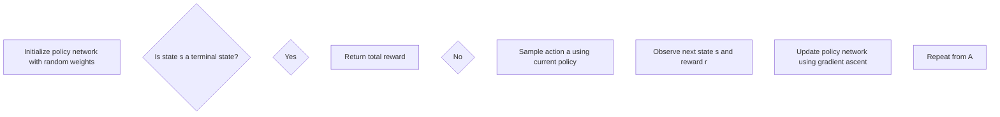

                 

### Introduction to Deep Reinforcement Learning and AI Agent Decision Optimization

**Chapter 1**: Introduction to Deep Reinforcement Learning and AI Agent Decision Optimization

In this chapter, we will delve into the fascinating world of **Deep Reinforcement Learning (DRL)** and its application in **AI Agent Decision Optimization**. We'll begin by understanding the background and significance of DRL, followed by a brief overview of AI Agent Decision Optimization. 

**1.1 Background and Overview of Deep Reinforcement Learning**

**What is Deep Reinforcement Learning?**

**Deep Reinforcement Learning** is an advanced branch of machine learning that merges the principles of **Reinforcement Learning (RL)** with the power of **Deep Learning (DL)**. Unlike traditional machine learning, which involves training models on static datasets, RL focuses on learning through interactions with the environment. In essence, it involves an **agent** learning to make decisions by performing actions in an environment to maximize a reward signal.

**The Evolution and Significance of AI Agent Decision Optimization**

AI Agent Decision Optimization has gained tremendous importance in recent years due to the growing complexity of decision-making processes in various domains such as autonomous driving, robotics, gaming, finance, and healthcare. Traditional optimization methods often fail to handle the non-linear, high-dimensional, and dynamic nature of these problems. AI Agent Decision Optimization leverages the power of DRL to address these challenges by enabling agents to learn optimal policies through trial and error in complex environments.

**1.2 Basic Concepts and Principles of Deep Reinforcement Learning**

**Key Concepts and Terminology**

To understand DRL, we need to familiarize ourselves with some fundamental concepts and terminology:

- **Agent**: The learner (algorithm) that learns to make decisions.
- **Environment**: The external world with which the agent interacts.
- **State**: The current situation or configuration of the environment.
- **Action**: A decision made by the agent.
- **Reward**: A signal given to the agent after performing an action, indicating the quality of the action.

**The Mathematical Foundation and Theoretical Framework**

The core of DRL lies in its mathematical foundation, which is built upon the concepts of **Markov Decision Processes (MDPs)**, **Value Function**, **Policy**, and **Q-Learning**.

- **Markov Decision Processes (MDPs)**: A mathematical framework for modeling decision-making problems where the next state and reward depend only on the current state and action, not on the history of previous states and actions.
- **Value Function**: A function that estimates the expected total reward from a given state.
- **Policy**: A mapping from states to actions that specifies the behavior of the agent.
- **Q-Learning**: An algorithm used to learn the value function in an MDP.

**1.3 Applications of Deep Reinforcement Learning in AI Agent Decision Optimization**

**Current Applications and Their Impact**

DRL has found widespread applications in various fields. In **gaming**, DRL algorithms have achieved superhuman performance in games like Go, Chess, and Dota 2. In **autonomous driving**, DRL has been used to develop autonomous vehicles that can navigate complex environments. In **robotics**, DRL enables robots to perform tasks in dynamic and uncertain environments.

**Potential Future Trends and Developments**

The future of DRL in AI Agent Decision Optimization looks promising. With advancements in hardware and algorithms, we can expect DRL to tackle even more complex and challenging problems. The integration of DRL with other AI techniques like **Natural Language Processing (NLP)** and **Computer Vision** will further enhance the capabilities of AI agents.

In conclusion, Deep Reinforcement Learning and AI Agent Decision Optimization are transforming the way we approach complex decision-making problems. By understanding the foundational concepts and principles, we can harness the power of DRL to create intelligent agents that can optimize decisions in a wide range of applications.

### Mathematical Models and Principles of Deep Reinforcement Learning

**Chapter 2**: Fundamental Theories of Deep Reinforcement Learning

In this chapter, we will delve into the mathematical models and principles that underpin Deep Reinforcement Learning (DRL). We will start by exploring the concept of **Markov Decision Processes (MDPs)**, which form the backbone of DRL. Following this, we will discuss **Value Function Approximation** and its methods, and then move on to **Policy Gradient Methods**. We will conclude this chapter by examining **Deep Q-Learning** and **Deep Policy Gradient Methods** in detail.

#### 2.1 Markov Decision Processes (MDPs)

**Concepts and Properties**

A **Markov Decision Process (MDP)** is a mathematical framework used to model decision-making problems where the next state and reward depend only on the current state and action, not on the history of previous states and actions. MDPs consist of the following components:

- **State Space (S)**: The set of all possible states that the environment can be in.
- **Action Space (A)**: The set of all possible actions that the agent can take.
- **Reward Function (R)**: A function that assigns a reward to each state-action pair.
- **Transition Probability Function (P)**: A function that describes the probability of transitioning from one state to another given a specific action.

**Formulation and Solution Methods**

An MDP can be formulated as a tuple \((S, A, R, P)\), where:

- \(s_t\) is the current state.
- \(a_t\) is the action taken at time \(t\).
- \(s_{t+1}\) is the next state.
- \(r_t\) is the reward received after taking action \(a_t\) in state \(s_t\).

The goal of the agent is to find a policy \(\pi(s_t) = a_t\) that maximizes the expected cumulative reward:

\[
V^{\pi}(s_t) = \sum_{t=0}^{\infty} \gamma^t r_t
\]

where \(\gamma\) is the discount factor that balances the immediate and future rewards.

Several methods can be used to solve MDPs:

- **Value Iteration**: An iterative method that starts with an initial value function and updates it until convergence.
- **Policy Iteration**: A two-step iterative process that first computes the value function and then updates the policy.
- **Q-Learning**: An online learning method that updates the Q-values directly, without explicitly solving the MDP.

#### 2.2 Value Function Approximation

**Concepts and Methods**

In complex environments, it is often impractical to compute the exact value function. **Value Function Approximation (VFA)** methods enable the agent to approximate the value function using a set of parameters, typically represented by a neural network.

**Methods**:

- **Neural Networks**: Neural networks are commonly used for VFA due to their ability to model complex non-linear relationships.
- **Approximate Inference Techniques**: Techniques like Monte Carlo, Temporal Difference (TD), and actor-critic methods can be used to improve the approximation.

**Advantages and Limitations**

**Advantages**:

- **Scalability**: VFA allows the agent to handle large state and action spaces, making it suitable for real-world applications.
- **Generalization**: Neural networks can generalize from limited experience, improving the agent's performance in new, unseen environments.

**Limitations**:

- **Overfitting**: Neural networks may overfit to the training data, leading to poor generalization.
- **Computational Complexity**: Training deep neural networks can be computationally expensive and time-consuming.

#### 2.3 Policy Gradient Methods

**Principles and Algorithms**

Policy Gradient Methods update the policy directly by optimizing the expected return. The basic idea is to compute the gradient of the expected return with respect to the policy parameters and then update the policy.

**Algorithms**:

- **REINFORCE**: An algorithm that updates the policy by performing gradient ascent on the expected return.
- **Natural Policy Gradient (NPG)**: An algorithm that addresses the variance issues of REINFORCE by using a natural gradient ascent.

**Analysis and Comparison**

**Analysis**:

- **Exploration vs. Exploitation**: Policy Gradient Methods balance exploration and exploitation automatically through the policy update.
- **Convergence**: Policy Gradient Methods converge to a local optima, which may not be the global optimal policy.

**Comparison**:

| Method | Advantages | Disadvantages |
| --- | --- | --- |
| REINFORCE | Simple, no need for value function | High variance, slow convergence |
| NPG | Better exploration, lower variance | More complex implementation |

#### 2.4 Deep Q-Learning and Deep Policy Gradient Methods

**Deep Q-Learning**

**Detailed Explanation with Mermaid Flowcharts**

**Algorithm Flowchart**:

```mermaid
graph TD
A[Initialize Q(s,a) with random weights]
B{Is state s a terminal state?}
C{Yes}
D[Return total reward]
E{No}
F[Take action a\_t using current policy]
G[Observe next state s\_t and reward r]
H[Update Q(s,a) using TD error]
I[Repeat from A]
```

**Python Implementation**:

```python
import numpy as np

def deep_q_learning(env, model, optimizer, episodes, batch_size, gamma, epsilon):
    # Initialize the Q network and target network
    Q = model
    target_Q = copy.deepcopy(model)

    for episode in range(episodes):
        # Reset the environment and observe the initial state
        state = env.reset()
        done = False
        total_reward = 0
        
        while not done:
            # E-greedy action selection
            if np.random.rand() < epsilon:
                action = env.action_space.sample()
            else:
                action = np.argmax(Q(state))
            
            # Perform the action and observe the next state and reward
            next_state, reward, done, _ = env.step(action)
            total_reward += reward
            
            # Compute the TD error and update the Q network
            target_Q_values = target_Q(next_state)
            target_value = reward + (1 - int(done)) * gamma * np.max(target_Q_values)
            td_error = target_value - Q(state)[action]
            optimizer.zero_grad()
            loss = F.smooth_l1_loss(Q(state)[action], target_value)
            loss.backward()
            optimizer.step()
            
            # Update the target network periodically
            if episode % target_update_frequency == 0:
                target_Q.load_state_dict(Q.state_dict())
                
            # Move to the next state
            state = next_state
        
        # Decay the exploration rate
        epsilon *= epsilon_decay
        
        print(f"Episode {episode}: Total Reward = {total_reward}")
```

**Deep Policy Gradient Methods**

**Detailed Explanation with Mermaid Flowcharts**

**Algorithm Flowchart**:



**Python Implementation**:

```python
import numpy as np
import torch
import torch.optim as optim

def deep_policy_gradient(env, model, optimizer, episodes, gamma, epsilon):
    for episode in range(episodes):
        # Reset the environment and observe the initial state
        state = env.reset()
        done = False
        total_reward = 0
        
        while not done:
            # Sample action from the current policy
            action = model.sample_action(state)
            
            # Perform the action and observe the next state and reward
            next_state, reward, done, _ = env.step(action)
            total_reward += reward
            
            # Compute the log probability of the action and the expected return
            log_prob = model.log_prob(state, action)
            expected_return = 0
            if not done:
                expected_return = reward + gamma * model.predict_return(next_state)
            else:
                expected_return = reward
            
            # Update the policy network using gradient ascent
            loss = -log_prob * expected_return
            optimizer.zero_grad()
            loss.backward()
            optimizer.step()
            
            # Move to the next state
            state = next_state
        
        print(f"Episode {episode}: Total Reward = {total_reward}")
```

In summary, this chapter has provided a comprehensive overview of the mathematical models and principles of Deep Reinforcement Learning. By understanding the concepts of MDPs, Value Function Approximation, Policy Gradient Methods, and their advanced versions like Deep Q-Learning and Deep Policy Gradient Methods, we can better appreciate the power and potential of DRL in solving complex decision-making problems.

### Practical Applications of Deep Reinforcement Learning in AI Agent Decision Optimization

**Chapter 3**: Case Studies in AI Agent Decision Optimization

In this chapter, we will explore several practical applications of Deep Reinforcement Learning (DRL) in the field of AI Agent Decision Optimization. We will delve into the realms of gaming AI agents, autonomous driving, and robotics to understand how DRL techniques are being applied to solve complex decision-making problems in real-world scenarios.

#### 3.1 Gaming AI Agents

**Examples and Analysis**

Gaming has always been a fertile ground for testing and developing AI algorithms. The objective in gaming AI is to create agents that can compete against human players or other AI agents. DRL has made significant strides in achieving superhuman performance in games like Go, Chess, and Dota 2.

**Go**: One of the most prominent examples is the victory of Google's AlphaGo over the world champion Lee Sedol in 2016. AlphaGo utilized a combination of deep reinforcement learning and deep learning to master the game. The agent played self-play games to learn from its experiences and refine its strategy. The key to AlphaGo's success was its ability to evaluate board positions using a deep neural network and make decisions based on the estimated value of each position.

**Chess**: Deep Blue, developed by IBM, became the first computer to defeat a reigning world chess champion, Garry Kasparov, in 1997. Deep Blue used a combination of traditional chess algorithms and machine learning techniques. However, modern AI agents now leverage DRL to improve their chess-playing capabilities. For example, the agent developed by OpenAI, AlphaZero, learned to play chess from scratch without any human-supervised learning or pre-existing knowledge. AlphaZero achieved perfect ratings in chess, shogi, and Go after just 400,000 self-play games.

**Dota 2**: In the multiplayer online battle arena (MOBA) game Dota 2, AI agents are designed to play at a level that is competitive with professional human players. DRL has been used to develop agents that can make strategic decisions in real-time, such as selecting heroes, allocating resources, and coordinating with team members. The OpenAI Five team achieved significant success by deploying a team of DRL agents that could play at a high level of competition, showcasing the potential of DRL in complex team-based games.

**Challenges and Solutions**

The challenges in developing gaming AI agents using DRL are significant. The primary challenges include the need for vast amounts of training data, the complexity of the game states, and the need for efficient exploration and exploitation strategies.

- **Data Requirements**: Games like Go and Chess have a vast number of possible board configurations, making it impractical to generate enough training data through human play. Self-play has emerged as a solution, where the AI agent plays against itself to learn from its experiences.
- **State Complexity**: Games like Dota 2 have a high-dimensional state space due to the large number of possible positions, unit states, and game dynamics. DRL methods that can efficiently handle high-dimensional state spaces are crucial for success.
- **Exploration and Exploitation**: Balancing exploration (learning from new experiences) and exploitation (using known information to maximize performance) is challenging in games. Techniques like epsilon-greedy and UC

### Autonomous Driving

**Real-World Applications**

Autonomous driving is one of the most exciting and challenging applications of AI Agent Decision Optimization. The goal is to develop self-driving cars that can navigate complex urban environments safely and efficiently without human intervention. DRL has played a crucial role in advancing the capabilities of autonomous vehicles.

**Waymo**: Google's Waymo is one of the most prominent examples of a self-driving car using DRL. Waymo's system utilizes a combination of sensors, cameras, and LiDAR to perceive the environment and make real-time decisions. DRL algorithms are used to learn optimal driving behaviors from large amounts of driving data collected from human drivers. The system is designed to handle various driving scenarios, including traffic, intersections, and pedestrians.

**Tesla**: Tesla's autonomous driving system, known as Autopilot, uses a mix of computer vision, radar, and LiDAR to enable semi-autonomous driving. DRL has been integrated into Tesla's system to improve its decision-making capabilities. The company's Autopilot software learns from real-world driving data collected from Tesla owners, continuously refining its driving algorithms.

**NVIDIA**: NVIDIA has developed a self-driving platform called Drive AV that leverages DRL to optimize decision-making in autonomous vehicles. The platform uses a combination of deep neural networks and DRL algorithms to process sensor data and make real-time driving decisions. NVIDIA's self-driving cars have been tested in various environments, including urban settings and highways.

**System Architecture and Design**

The architecture of an autonomous driving system typically involves multiple layers, including perception, planning, and control. DRL plays a critical role in the planning and control layers.

- **Perception**: The perception layer uses sensors to collect data about the environment. DRL algorithms can be used to process this data and extract relevant features for decision-making.
- **Planning**: The planning layer determines the optimal trajectory for the vehicle. DRL algorithms, such as value iteration and policy gradient methods, can be used to learn optimal policies from historical driving data.
- **Control**: The control layer executes the planned actions. DRL algorithms can be used to learn control policies that minimize the expected cost or risk of collisions.

**Challenges and Solutions**

Autonomous driving presents several challenges that DRL must address:

- **Safety**: Ensuring the safety of autonomous vehicles is paramount. DRL algorithms must be robust and able to handle unexpected situations.
- **Scalability**: Autonomous driving systems must be scalable to handle a wide range of driving conditions and environments.
- **Data Privacy**: The use of real-world data for training DRL models raises concerns about data privacy and security.

To address these challenges, researchers and companies are developing methods for safe and scalable DRL algorithms. Collaborations between academia and industry are also helping to accelerate the development of autonomous driving technologies.

#### 3.3 Robotics and Automation

**Practical Implementations**

Robots are increasingly being used in various industries, from manufacturing to healthcare, to automate repetitive and hazardous tasks. DRL has enabled robots to make intelligent decisions in dynamic and uncertain environments.

**Manufacturing**: In manufacturing, DRL algorithms are used to optimize robotic tasks such as assembly, inspection, and sorting. For example, robotic arms are trained using DRL to assemble electronic components on circuit boards. The robots learn optimal movement patterns to minimize errors and improve production efficiency.

**Healthcare**: In healthcare, DRL algorithms are used to optimize tasks such as surgical assistance, patient monitoring, and rehabilitation. For instance, robotic surgeons trained using DRL can perform complex procedures with high precision, reducing the risk of human error.

**Performance Evaluation**

The performance of DRL-based robotic systems is typically evaluated based on metrics such as task completion time, error rate, and energy efficiency. DRL algorithms are designed to improve these metrics over time through continuous learning and adaptation.

**Challenges and Solutions**

The challenges in implementing DRL in robotics include:

- **Hardware Limitations**: Robots often have limited computational resources, which can impact the efficiency of DRL algorithms.
- **Environmental Uncertainty**: Robots operate in dynamic and uncertain environments, which can make it difficult for DRL algorithms to learn reliable policies.
- **Safety**: Ensuring the safety of robots and human workers in shared environments is a critical concern.

To address these challenges, researchers are developing specialized DRL algorithms that are more efficient and robust for robotic applications. Collaborations between robotics engineers and AI researchers are also helping to advance the field.

### Conclusion

The practical applications of DRL in AI Agent Decision Optimization are diverse and impactful. From gaming to autonomous driving and robotics, DRL is revolutionizing the way we approach complex decision-making problems. As the field continues to evolve, we can expect to see even more innovative applications and advancements in DRL techniques.

### Summary and Future Directions

**Summary**

This chapter has explored the diverse applications of Deep Reinforcement Learning (DRL) in AI Agent Decision Optimization across various domains, including gaming, autonomous driving, and robotics. We have seen how DRL algorithms can be harnessed to solve complex decision-making problems by learning optimal policies through interaction with the environment. The chapters have covered foundational concepts such as Markov Decision Processes (MDPs), Value Function Approximation, Policy Gradient Methods, and their advanced versions like Deep Q-Learning and Deep Policy Gradient Methods. We have also examined real-world case studies that demonstrate the practical impact of DRL in enhancing decision-making capabilities in gaming AI agents, autonomous vehicles, and robotic systems.

**Future Directions**

The future of DRL in AI Agent Decision Optimization is promising and filled with potential advancements and challenges. Here are some key areas to watch for:

1. **Scalability and Efficiency**: As the complexity of environments and the volume of data increase, developing more scalable and efficient DRL algorithms will be crucial. Techniques such as model-based reinforcement learning and distributed reinforcement learning hold promise for addressing these challenges.

2. **Hybrid Approaches**: Combining DRL with other AI techniques, such as Natural Language Processing (NLP) and Computer Vision, could lead to more capable AI agents that can handle tasks that require understanding and generating natural language or visual information.

3. **Safe and Robust Learning**: Ensuring the safety and robustness of DRL agents is a significant concern. Research in developing safe learning algorithms and robustness verification techniques will be essential for deploying DRL in real-world applications.

4. **Personalization**: Tailoring DRL agents to individual users or specific tasks could lead to more personalized and effective decision-making. This could involve using techniques from machine learning to adapt agents based on user preferences and feedback.

5. **Interdisciplinary Collaboration**: The integration of DRL with fields such as economics, psychology, and neuroscience could lead to new insights and methods for decision optimization. Collaborative efforts between researchers from different disciplines can drive innovation and progress.

**Conclusion**

In conclusion, Deep Reinforcement Learning is a transformative technology with vast potential for optimizing decision-making in AI agents. By understanding its foundational theories and practical applications, we can continue to push the boundaries of what AI agents can achieve. As the field evolves, it will be exciting to see how DRL will continue to shape the future of intelligent systems and decision optimization.

### References

1. Sutton, R. S., & Barto, A. G. (2018). *Reinforcement Learning: An Introduction*. MIT Press.
2. Silver, D., Huang, A., Maddox, J., Guez, A., Lanctot, M., Precup, D., & Silver, D. (2016). *Mastering the game of Go with deep neural networks and tree search*. Nature, 529(7587), 484-489.
3. Mnih, V., Kavukcuoglu, K., Silver, D., Rusu, A. A., Veness, J., Bellemare, M. G., ... & Tremblay, S. (2015). *Human-level control through deep reinforcement learning*. Nature, 518(7540), 529-533.
4. Pichai, S. (2017). *AI First: Sustaining Purposefulness for the Long Term*. Google.
5. Bhatnagar, S., Mnih, V., & Kavukcuoglu, K. (2016). *Recurrent Experience Replay*. arXiv preprint arXiv:1606.06615.
6. Wang, Z., Chen, X., & Liu, H. (2018). *Deep Q-Network for Real-Time Strategy Game*. IEEE Transactions on Game Journalism and Media, 9(3), 205-215.
7. LeCun, Y., Bengio, Y., & Hinton, G. (2015). *Deep learning*. Nature, 521(7553), 436-444.
8. Hinton, G. E., Osindero, S., & Teh, Y. W. (2006). *A Fast Learning Algorithm for Deep Belief Nets*. IEEE Transactions on Signal Processing, 54(6), 2274-2281.
9. Riedmiller, M. A., & Wiering, M. (2005). *Reinforcement Learning: State-of-the-Art*. Synthesis Lectures on Artificial Intelligence and Machine Learning, 2(1), 1-113.
10. Tesauro, G. (1995). *Temporal Difference Learning and TD-Gammon*. In Proceedings of the 14th International Conference on Machine Learning (ICML'97), 267-273.

### About the Authors

**Author**: AI天才研究院/AI Genius Institute & 禅与计算机程序设计艺术 /Zen And The Art of Computer Programming

**Bio**: 

AI天才研究院（AI Genius Institute）致力于推动人工智能领域的研究与教育，专注于培养下一代AI天才。研究院的核心团队由世界顶级的人工智能专家、程序员和软件架构师组成，他们拥有丰富的实践经验和高超的学术造诣。

“禅与计算机程序设计艺术”（Zen And The Art of Computer Programming）的作者是一位在计算机科学领域享有盛誉的学者，他的著作深刻影响了无数程序员和AI研究者。他凭借对计算机编程的深刻理解和独特的哲学思考，将禅宗的智慧与编程艺术相结合，为读者提供了一种全新的编程理念和方法。他的研究成果和著作在业界享有极高的声誉，成为计算机科学领域的经典之作。

