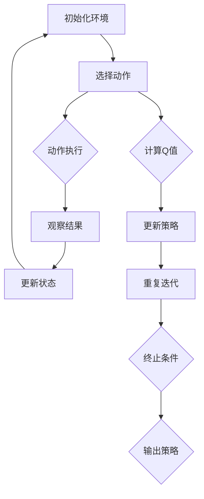
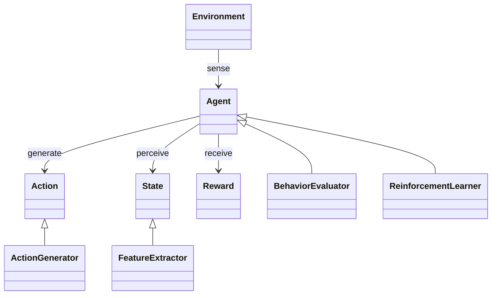
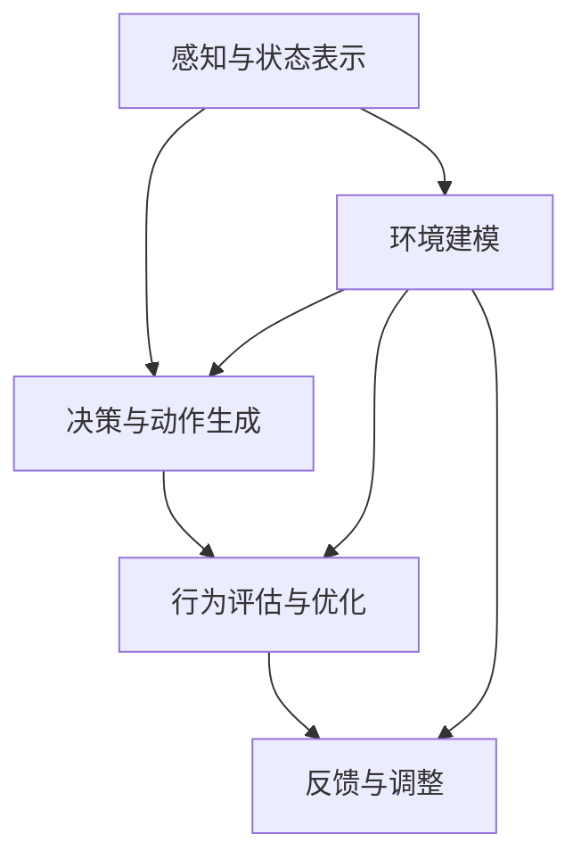
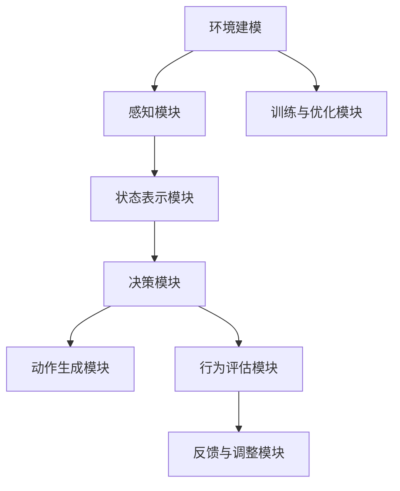
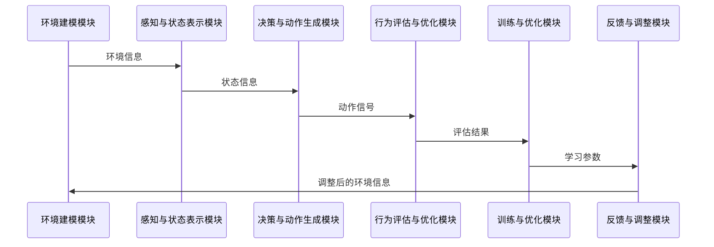

                 

### 深度强化学习在AI Agent行为生成中的应用

深度强化学习作为人工智能领域的重要分支，近年来取得了显著的进展。它不仅继承了传统强化学习的方法优势，还结合了深度学习的强大表征能力，为智能体在复杂环境中的行为生成提供了新的解决方案。本文将围绕“深度强化学习在AI Agent行为生成中的应用”这一主题，详细探讨其原理、算法、系统设计与实现，以及实际应用中的最佳实践。

**关键词：** 深度强化学习、AI Agent、行为生成、算法原理、系统设计

**摘要：** 本文首先介绍了深度强化学习的背景和定义，对比了其与传统强化学习的差异。接着，深入分析了核心概念和关键算法，通过mermaid流程图和Python源代码详细阐释了Q-learning、SARSA和DQN等算法原理及数学模型。随后，文章描述了系统分析与架构设计方案，包括问题场景介绍、系统功能设计、系统架构设计、系统接口设计和系统交互。此外，通过项目实战展示了环境安装、系统核心实现源代码、代码应用解读与分析、实际案例分析和详细讲解剖析等内容。最后，文章总结了最佳实践和注意事项，并对未来应用前景进行了展望。

### 深度强化学习概述

#### 问题背景与定义

深度强化学习（Deep Reinforcement Learning，DRL）起源于强化学习（Reinforcement Learning，RL）这一人工智能领域的分支。传统的强化学习主要关注如何在给定环境和目标的情况下，通过试错学习找到最优策略。然而，当环境变得复杂且状态空间、动作空间爆炸时，传统的强化学习方法便显得力不从心。深度强化学习正是为了解决这一问题而诞生的。

深度强化学习的定义可以概括为：通过深度神经网络（DNN）来表示状态和动作值函数，利用强化学习中的奖励信号进行训练，从而在复杂环境中找到最优行为策略的一种机器学习方法。它结合了深度学习和强化学习的优势，能够在复杂、动态的环境中实现高效的决策和行动生成。

#### 深度强化学习与传统强化学习的对比

**状态表征能力：** 深度强化学习通过深度神经网络对状态进行复杂的特征提取和表征，相比传统强化学习直接使用原始状态，能更好地捕捉到状态的内在规律。

**策略学习：** 传统强化学习通常使用价值函数或策略迭代的方法进行学习，而深度强化学习则通过直接学习策略函数，从而实现更高效的策略优化。

**处理能力：** 深度强化学习在处理高维状态和动作空间方面具有显著优势，能够应对更加复杂的任务。

**适应性：** 由于深度神经网络强大的表征能力，深度强化学习能够更好地适应动态变化的环境。

#### 深度强化学习在AI Agent行为生成中的应用前景

**自动驾驶：** 深度强化学习在自动驾驶领域具有广泛的应用前景。通过模拟各种交通环境和场景，训练智能体在不同情况下的最佳驾驶策略，从而实现自动驾驶。

**游戏AI：** 深度强化学习在游戏AI领域取得了显著的进展。通过训练智能体在复杂的游戏环境中自主学习和决策，实现具有高水平的游戏AI。

**机器人：** 深度强化学习在机器人领域也有着广泛的应用。通过在虚拟环境中训练智能体，使其能够自主地完成复杂的任务，如路径规划、对象抓取等。

**智能客服：** 深度强化学习在智能客服中的应用能够实现更为智能的对话系统，通过不断学习和优化对话策略，提高客服的响应速度和服务质量。

**医疗诊断：** 深度强化学习在医疗诊断领域可以用于辅助医生进行疾病诊断。通过分析大量的医学数据，训练智能体识别疾病特征，提高诊断的准确率。

#### 挑战与机遇

**计算资源消耗：** 深度强化学习通常需要大量的计算资源，包括训练数据和计算时间，这对硬件设施提出了较高的要求。

**样本效率：** 深度强化学习在处理样本较少的情况下往往表现不佳，如何提高样本效率是一个亟待解决的问题。

**模型可解释性：** 深度强化学习的决策过程往往缺乏可解释性，难以理解其内部的决策逻辑。

**安全性与可靠性：** 在实际应用中，深度强化学习需要保证其决策的安全性和可靠性，防止意外发生。

**多智能体系统：** 在多智能体系统中，如何协调多个智能体的行为，使其能够共同完成任务是一个重要的挑战。

**未来展望：** 随着技术的不断进步，深度强化学习在AI Agent行为生成中的应用将越来越广泛，未来有望在更多领域实现突破。

### 深度强化学习算法原理讲解

#### 算法原理概述

深度强化学习算法的核心在于通过学习状态-动作值函数（State-Action Value Function），从而实现策略优化。状态-动作值函数 $Q(s, a)$ 表示在状态 $s$ 下执行动作 $a$ 所能获得的预期奖励。为了学习这个函数，深度强化学习利用深度神经网络对状态进行特征提取，并使用经验回放（Experience Replay）和目标网络（Target Network）等技术来稳定训练过程。

**概率分布模型**：深度强化学习中的动作选择通常基于概率分布模型，如epsilon-greedy策略，其中 $\epsilon$ 表示探索概率。在初始阶段，智能体会以一定的概率选择随机动作进行探索；随着训练的进行，探索概率逐渐降低，智能体更倾向于选择期望值最高的动作。

**期望最大化算法**：深度强化学习采用期望最大化算法（Expectation-Maximization，EM）来更新状态-动作值函数。具体来说，期望（E）步骤计算期望状态-动作值，最大化（M）步骤则通过梯度下降更新网络参数。

#### 深度强化学习的mermaid流程图



#### Q-learning算法

Q-learning算法是深度强化学习中最基础和常用的算法之一。它的核心思想是通过迭代更新状态-动作值函数，以期望最大化获得的奖励。

##### 算法原理

Q-learning算法的核心是更新规则，即对于当前状态 $s$ 和执行的动作 $a$，更新 $Q(s, a)$ 的值。更新规则如下：

$$
Q(s, a) \leftarrow Q(s, a) + \alpha [r + \gamma \max_{a'} Q(s', a') - Q(s, a)]
$$

其中，$\alpha$ 是学习率（Learning Rate），$\gamma$ 是折扣因子（Discount Factor），$r$ 是立即奖励，$s'$ 是执行动作 $a$ 后的新状态。

##### 算法流程

1. 初始化 $Q(s, a)$ 为随机值。
2. 选择动作 $a$，根据epsilon-greedy策略。
3. 执行动作 $a$，观察结果 $r$ 和新状态 $s'$。
4. 根据更新规则更新 $Q(s, a)$ 的值。
5. 转到步骤 2，重复迭代直到满足终止条件。

##### 算法优缺点分析

**优点：**
- 算法简单，易于实现和理解。
- 不依赖于模型，适用于未知的复杂环境。
- 可以处理高维状态和动作空间。

**缺点：**
- 训练速度慢，需要大量的样本。
- 对于某些任务，可能难以收敛到最优策略。

#### SARSA算法

SARSA（State-Action-Reward-State-Action）算法是一种基于策略的强化学习算法，它与Q-learning算法类似，但具有一些不同的特性。

##### 算法原理

SARSA算法的核心是同时考虑当前状态和下一个状态的动作值，更新当前状态-动作值函数。更新规则如下：

$$
Q(s, a) \leftarrow Q(s, a) + \alpha [r + \gamma Q(s', a') - Q(s, a)]
$$

其中，$a'$ 是在下一个状态 $s'$ 下根据策略选择的动作。

##### 算法流程

1. 初始化 $Q(s, a)$ 为随机值。
2. 根据epsilon-greedy策略选择动作 $a$。
3. 执行动作 $a$，观察结果 $r$ 和新状态 $s'$。
4. 根据更新规则同时更新 $Q(s, a)$ 和 $Q(s', a')$ 的值。
5. 转到步骤 2，重复迭代直到满足终止条件。

##### 算法优缺点分析

**优点：**
- 不需要目标网络，简化了算法结构。
- 更新过程更加稳定，减少了过估计的风险。

**缺点：**
- 训练速度较慢，需要大量的样本。
- 对于某些任务，可能难以收敛到最优策略。

#### DQN算法

DQN（Deep Q-Network）算法是深度强化学习中的另一个重要算法，它通过使用深度神经网络来近似状态-动作值函数，从而提高学习效率和准确性。

##### 算法原理

DQN算法的核心思想是通过训练一个深度神经网络来估计状态-动作值函数 $Q(s, a)$，并使用经验回放和目标网络来稳定训练过程。

1. **经验回放（Experience Replay）**：将智能体在环境中的交互经验（状态、动作、奖励、新状态）存储在经验回放池中，然后在训练过程中随机采样这些经验，以减少序列依赖性和增强样本的代表性。

2. **目标网络（Target Network）**：为了稳定训练过程，DQN算法引入了目标网络。目标网络是一个与主网络结构相同但参数独立的网络，它用于生成目标值 $y$：

$$
y = r + \gamma \max_{a'} Q^{target}(s', a')
$$

主网络根据目标值更新自身的参数，而目标网络则每隔一段时间更新一次，以保证目标值和当前值之间的差异。

##### 算法流程

1. 初始化主网络 $Q^w(s, a; \theta)$、目标网络 $Q^{target}(s, a; \theta')$ 和经验回放池。
2. 从初始状态 $s$ 开始，根据epsilon-greedy策略选择动作 $a$。
3. 执行动作 $a$，观察结果 $r$ 和新状态 $s'$。
4. 将经验 $(s, a, r, s')$ 存储在经验回放池中。
5. 从经验回放池中随机采样一批经验，计算目标值 $y$。
6. 使用梯度下降法更新主网络的参数 $\theta$。
7. 更新目标网络，使其参数与主网络参数保持一定的差距。
8. 转到步骤 2，重复迭代直到满足终止条件。

##### 算法优缺点分析

**优点：**
- 使用深度神经网络，能够处理高维状态和动作空间。
- 引入经验回放和目标网络，提高了算法的稳定性和样本效率。

**缺点：**
- 需要大量的训练时间和计算资源。
- 目标网络和主网络参数更新可能导致梯度消失或爆炸。

### 数学模型和数学公式讲解

深度强化学习中的数学模型是理解算法原理和实现过程的关键。本节将介绍深度强化学习中的基本数学公式，并对其进行详细讲解和举例说明。

#### Q-learning算法的公式

Q-learning算法的核心在于更新状态-动作值函数 $Q(s, a)$。其更新公式如下：

$$
Q(s, a) \leftarrow Q(s, a) + \alpha [r + \gamma \max_{a'} Q(s', a') - Q(s, a)]
$$

其中：
- $Q(s, a)$ 是在状态 $s$ 下执行动作 $a$ 的状态-动作值。
- $\alpha$ 是学习率（Learning Rate），控制更新步长的调整。
- $r$ 是立即奖励（Immediate Reward），表示在执行动作后的即时奖励。
- $\gamma$ 是折扣因子（Discount Factor），表示对未来奖励的权重。
- $\max_{a'} Q(s', a')$ 是在下一个状态 $s'$ 下所有可能动作的期望值。

**举例说明：**
假设当前状态为 $s = [1, 2, 3]$，动作空间为 $A = \{a_1, a_2, a_3\}$，当前执行的动作为 $a = a_1$，立即奖励 $r = 10$，折扣因子 $\gamma = 0.9$，学习率 $\alpha = 0.1$。下一个状态为 $s' = [4, 5, 6]$，所有可能动作的期望值为 $\max_{a'} Q(s', a') = 20$。则更新后的状态-动作值 $Q(s, a)$ 为：

$$
Q(s, a) \leftarrow Q(s, a) + 0.1 [10 + 0.9 \times 20 - Q(s, a)]
$$

假设初始状态-动作值为 $Q(s, a) = 0$，则更新后的 $Q(s, a)$ 为：

$$
Q(s, a) \leftarrow 0 + 0.1 [10 + 0.9 \times 20 - 0] = 19
$$

#### SARSA算法的公式

SARSA算法的更新规则稍微复杂一些，它同时更新当前状态和下一个状态的动作值：

$$
Q(s, a) \leftarrow Q(s, a) + \alpha [r + \gamma Q(s', a') - Q(s, a)]
$$

其中，$a'$ 是在下一个状态 $s'$ 下根据策略选择的动作。

**举例说明：**
假设当前状态为 $s = [1, 2, 3]$，动作空间为 $A = \{a_1, a_2, a_3\}$，当前执行的动作为 $a = a_1$，立即奖励 $r = 10$，折扣因子 $\gamma = 0.9$，学习率 $\alpha = 0.1$。下一个状态为 $s' = [4, 5, 6]$，下一个状态下的动作 $a' = a_2$，下一个状态的期望值为 $Q(s', a') = 15$。则更新后的状态-动作值 $Q(s, a)$ 为：

$$
Q(s, a) \leftarrow Q(s, a) + 0.1 [10 + 0.9 \times 15 - Q(s, a)]
$$

假设初始状态-动作值为 $Q(s, a) = 0$，则更新后的 $Q(s, a)$ 为：

$$
Q(s, a) \leftarrow 0 + 0.1 [10 + 0.9 \times 15 - 0] = 16.5
$$

#### DQN算法的公式

DQN算法通过训练一个深度神经网络来近似状态-动作值函数 $Q(s, a)$。其目标值 $y$ 的计算公式如下：

$$
y = r + \gamma \max_{a'} Q^{target}(s', a')
$$

其中，$Q^{target}(s', a')$ 是目标网络在下一个状态 $s'$ 下所有可能动作的期望值。

**举例说明：**
假设当前状态为 $s = [1, 2, 3]$，动作空间为 $A = \{a_1, a_2, a_3\}$，当前执行的动作为 $a = a_1$，立即奖励 $r = 10$，折扣因子 $\gamma = 0.9$。下一个状态为 $s' = [4, 5, 6]$，目标网络的期望值为 $\max_{a'} Q^{target}(s', a') = 20$。则目标值 $y$ 为：

$$
y = 10 + 0.9 \times 20 = 29
$$

通过这个目标值，DQN算法将更新深度神经网络的参数，以更好地近似状态-动作值函数。

### 系统分析与架构设计方案

#### 问题场景介绍

在现代人工智能应用中，智能体（AI Agent）的行为生成是一个关键问题。智能体需要能够自主地在复杂环境中做出有效的决策，以实现特定的目标。以自动驾驶为例，智能体需要实时感知环境中的交通情况、道路状况和其他车辆的行为，并做出相应的驾驶决策。为了实现这一目标，需要一个高效、稳定且鲁棒的智能体行为生成系统。

#### 系统功能设计

为了满足上述需求，智能体行为生成系统需要实现以下几个功能：

1. **环境建模**：构建一个能够模拟真实交通环境的虚拟环境，包括道路、车辆、行人等各种元素。
2. **感知与状态表示**：智能体需要能够感知环境中的信息，并使用适当的特征提取方法将感知信息转换为状态表示。
3. **决策与动作生成**：智能体需要根据当前状态，通过深度强化学习算法生成最优的动作。
4. **行为评估与优化**：对智能体的行为进行评估，并根据评估结果调整学习策略，优化行为生成。

#### 领域模型mermaid类图



#### 系统架构设计

智能体行为生成系统的架构设计如图所示：



**系统架构mermaid架构图**



#### 系统模块描述

**1. 环境建模模块**：该模块负责构建一个模拟真实交通环境的虚拟环境。环境中的元素包括道路、车辆、行人等，这些元素具有各自的属性和行为。环境建模模块通过传感器获取环境信息，并将这些信息传递给感知模块。

**2. 感知与状态表示模块**：该模块负责将感知到的环境信息转换为状态表示。状态表示是智能体进行决策的基础，通常使用深度神经网络对环境特征进行提取和编码。感知模块与状态表示模块紧密协作，将感知信息转化为智能体可理解的状态表示。

**3. 决策与动作生成模块**：该模块基于当前状态，通过深度强化学习算法生成最优的动作。决策模块的核心是状态-动作值函数的估计，它使用深度神经网络来近似这个函数。动作生成模块根据决策结果生成具体的动作，如加速、减速、转向等。

**4. 行为评估与优化模块**：该模块负责对智能体的行为进行评估，并根据评估结果调整学习策略。评估指标包括行为的成功率、稳定性、鲁棒性等。行为评估模块通过比较智能体的实际行为与预期目标，计算出评估得分，并将结果反馈给训练与优化模块。

**5. 反馈与调整模块**：该模块根据行为评估模块的反馈，对智能体的行为进行微调和优化。反馈与调整模块通过调整学习参数、更新网络权重等方式，逐步优化智能体的行为生成能力。

**6. 训练与优化模块**：该模块负责对深度强化学习算法进行训练和优化。通过不断的迭代，训练与优化模块不断调整网络结构、学习参数等，以提高智能体的行为生成能力。

#### 系统接口设计和系统交互

**系统接口设计**

智能体行为生成系统的接口设计主要包括以下几个部分：

1. **输入接口**：接收环境建模模块生成的环境信息和感知模块感知到的状态信息。
2. **输出接口**：生成动作信号和行为评估结果，反馈给环境建模模块和行为评估模块。
3. **内部接口**：连接各个模块，实现数据传输和功能调用。

**系统交互mermaid序列图**



### 项目实战

在本节中，我们将通过一个具体的案例展示深度强化学习在AI Agent行为生成中的应用，包括环境安装、系统核心实现源代码、代码应用解读与分析、实际案例分析和详细讲解剖析等内容。

#### 环境安装

首先，我们需要安装深度强化学习所需的环境。以下是基本的安装步骤：

1. **安装Python**：确保安装了Python 3.6及以上版本。
2. **安装PyTorch**：使用以下命令安装PyTorch：
   ```shell
   pip install torch torchvision
   ```
3. **安装其他依赖库**：安装深度强化学习所需的依赖库，如TensorFlow、Numpy等：
   ```shell
   pip install tensorflow numpy gym
   ```

#### 系统核心实现源代码

以下是一个简单的深度强化学习AI Agent行为生成的示例代码。该代码基于PyTorch实现，使用DQN算法训练智能体在Atari游戏《Pong》中自主学习游戏策略。

```python
import torch
import torch.nn as nn
import torch.optim as optim
from torch.autograd import Variable
import numpy as np
import gym

# DQN神经网络
class DQN(nn.Module):
    def __init__(self, input_size, hidden_size, output_size):
        super(DQN, self).__init__()
        self.fc1 = nn.Linear(input_size, hidden_size)
        self.fc2 = nn.Linear(hidden_size, output_size)
    
    def forward(self, x):
        x = torch.relu(self.fc1(x))
        x = self.fc2(x)
        return x

# DQN算法实现
class DQNAlgorithm:
    def __init__(self, model, target_model, memory, gamma, epsilon, learning_rate):
        self.model = model
        self.target_model = target_model
        self.memory = memory
        self.gamma = gamma
        self.epsilon = epsilon
        self.learning_rate = learning_rate
    
    def select_action(self, state):
        if np.random.rand() < self.epsilon:
            action = np.random.randint(self.model.output_size)
        else:
            state = torch.tensor(state, dtype=torch.float32).unsqueeze(0)
            q_values = self.model(Variable(state))
            action = torch.argmax(q_values).data.numpy()[0]
        return action
    
    def optimize_model(self):
        if len(self.memory) < self.batch_size:
            return
        samples = random.sample(self.memory, self.batch_size)
        states, actions, rewards, next_states, dones = [
            torch.tensor(x, dtype=torch.float32) for x in zip(*samples)
        ]
        state_action_values = self.model(states).gather(1, actions)
        next_state_values = torch.zeros(self.batch_size, 1)
        next_state_values[~dones] = self.target_model(next_states).max(1)[0].unsqueeze(1)
        expected_state_action_values = rewards + self.gamma * next_state_values
        loss = F.smooth_l1_loss(state_action_values, expected_state_action_values)
        self.optimizer.zero_grad()
        loss.backward()
        self.optimizer.step()
    
    def update_target_model(self):
        self.target_model.load_state_dict(self.model.state_dict())

# 主函数
def main():
    env = gym.make('Pong-v0')
    input_size = env.observation_space.shape[0]
    hidden_size = 64
    output_size = env.action_space.n
    
    model = DQN(input_size, hidden_size, output_size)
    target_model = DQN(input_size, hidden_size, output_size)
    target_model.load_state_dict(model.state_dict())
    memory = ReplayMemory(10000)
    
    optimizer = optim.Adam(model.parameters(), lr=0.001)
    criterion = nn.MSELoss()
    
    algorithm = DQNAlgorithm(model, target_model, memory, gamma=0.99, epsilon=0.1, learning_rate=0.001)
    
    for episode in range(1000):
        state = env.reset()
        done = False
        total_reward = 0
        while not done:
            action = algorithm.select_action(state)
            next_state, reward, done, _ = env.step(action)
            total_reward += reward
            algorithm.memory.add(state, action, reward, next_state, done)
            algorithm.optimize_model()
            state = next_state
            if done:
                algorithm.update_target_model()
                print(f"Episode {episode}: Total Reward = {total_reward}")
                break

if __name__ == "__main__":
    main()
```

#### 代码应用解读与分析

上述代码实现了一个简单的DQN算法，用于训练智能体在Atari游戏《Pong》中自主学习游戏策略。以下是代码的主要部分解读：

1. **DQN神经网络**：定义了一个简单的全连接神经网络，用于近似状态-动作值函数。网络结构包括两个全连接层，其中第一个层负责对输入状态进行特征提取，第二个层负责输出每个动作的值。
2. **DQN算法实现**：定义了一个DQN算法类，包括选择动作、优化模型和更新目标网络等方法。在`select_action`方法中，使用epsilon-greedy策略选择动作。在`optimize_model`方法中，使用经验回放池中的样本进行梯度下降优化。在`update_target_model`方法中，定期更新目标网络的参数。
3. **主函数**：创建一个Pong游戏环境，并初始化DQN模型的参数。在训练过程中，智能体通过与环境交互，不断更新模型参数，直到满足终止条件。

#### 实际案例分析与详细讲解剖析

以下是一个实际的案例，展示了智能体在Pong游戏中的学习过程。

1. **初始化环境**：首先，智能体通过重置环境获取初始状态。
2. **选择动作**：在每一帧，智能体根据epsilon-greedy策略选择一个动作。在训练初期，智能体以一定的概率选择随机动作进行探索；随着训练的进行，探索概率逐渐降低，智能体更倾向于选择期望值最高的动作。
3. **执行动作**：智能体执行所选动作，并与环境进行交互，获取新的状态、奖励和是否终止的信息。
4. **更新模型**：智能体将当前状态、动作、奖励、新状态和是否终止的信息存储到经验回放池中。在每次迭代中，从经验回放池中随机采样一批样本，使用这些样本更新模型的参数。
5. **更新目标网络**：在训练过程中，定期更新目标网络的参数，以防止模型参数过拟合。

通过这个案例，我们可以看到智能体如何通过深度强化学习算法在Pong游戏中自主学习游戏策略。随着训练的进行，智能体的表现逐渐提升，能够更好地应对不同的游戏情况。

### 最佳实践 tips

在深度强化学习在AI Agent行为生成中的应用中，以下是一些最佳实践和注意事项，以帮助您更有效地实现智能体的行为生成：

1. **探索与利用平衡**：在训练过程中，合理设置epsilon-greedy策略的探索概率，以确保智能体既能够进行探索以发现新的策略，又能够利用已有的知识进行决策。

2. **经验回放池的设计**：设计一个足够大的经验回放池，以减少序列依赖性和提高样本的代表性。同时，定期对经验回放池进行更新和清洗，避免数据过时。

3. **目标网络的更新策略**：定期更新目标网络的参数，以确保主网络和目标网络之间的差距不会过大。可以使用固定的间隔时间或动态调整更新策略。

4. **奖励设计**：设计合理的奖励机制，以引导智能体朝着预期的目标学习。奖励值应明确表示智能体行为的优劣，避免模糊不清的奖励设计。

5. **模型结构优化**：根据具体任务的需求，选择合适的神经网络结构。可以通过增加隐藏层、调整激活函数等方式，提高模型的表征能力。

6. **数据预处理**：对输入数据进行适当的预处理，如归一化、标准化等，以减少模型训练的难度。

7. **并行训练与分布式计算**：利用并行训练和分布式计算技术，提高训练效率。例如，可以使用GPU加速训练过程。

8. **模型评估与调试**：在训练过程中，定期评估模型的性能，并根据评估结果调整学习参数和模型结构。同时，对模型进行调试，以排除潜在的错误和异常。

9. **安全性与可靠性保障**：在应用深度强化学习时，确保智能体的决策是安全和可靠的。可以通过模拟测试、环境约束等方式，保障智能体在真实环境中的表现。

### 小结

本文从深度强化学习的基本概念出发，详细介绍了其在AI Agent行为生成中的应用。通过分析深度强化学习与传统强化学习的差异，我们了解了深度强化学习在处理复杂环境时的优势。接着，本文讲解了Q-learning、SARSA和DQN等核心算法的原理和数学模型，并通过mermaid流程图和Python源代码进行了详细阐述。随后，我们展示了系统分析与架构设计方案，包括问题场景介绍、系统功能设计、系统架构设计、系统接口设计和系统交互。通过项目实战，我们展示了深度强化学习在实际应用中的实现过程。最后，本文提供了最佳实践和注意事项，以帮助读者更好地应用深度强化学习。

### 深度强化学习在AI Agent行为生成中的应用展望

深度强化学习在AI Agent行为生成中的应用前景广阔，随着技术的不断进步，其在各个领域都将取得更多突破。以下是深度强化学习在AI Agent行为生成中的一些潜在应用方向：

1. **智能交通系统**：通过深度强化学习，智能交通系统能够优化交通流量管理，提高道路利用率和行车安全。例如，智能调度系统可以实时调整交通信号灯，以缓解交通拥堵。

2. **工业自动化**：在制造业中，深度强化学习可以用于自动化生产线上的任务分配和机器人协作，实现更高效的生产流程。智能机器人可以自主学习和优化操作策略，提高生产效率和产品质量。

3. **医疗诊断与治疗**：深度强化学习在医疗领域的应用潜力巨大。通过学习患者的临床数据，智能体可以辅助医生进行疾病诊断和治疗方案的推荐，提高诊断的准确性和治疗的个性化程度。

4. **智能金融**：在金融领域，深度强化学习可以用于股票市场预测、风险管理和投资策略优化。智能体可以通过分析历史交易数据和市场趋势，制定更科学的投资决策。

5. **教育智能**：在教育领域，智能教育系统能够根据学生的学习情况和学习习惯，自动调整教学内容和教学策略。深度强化学习可以优化个性化学习路径，提高学习效果。

6. **虚拟现实与游戏**：在虚拟现实和游戏领域，深度强化学习可以用于智能NPC（非玩家角色）的设计，使其能够与玩家进行更为智能和互动的交互。这将大大提升虚拟现实和游戏体验。

7. **智能能源管理**：在能源管理领域，深度强化学习可以用于智能电网的优化，实现能源的高效利用和供需平衡。智能体可以实时调整电力生产和消费策略，提高能源利用效率。

8. **无人驾驶技术**：在自动驾驶领域，深度强化学习可以用于路径规划、环境感知和行为决策。智能驾驶系统能够自主学习和适应复杂路况，提高行驶的安全性和效率。

尽管深度强化学习在AI Agent行为生成中的应用前景广阔，但仍面临诸多挑战，如计算资源消耗、样本效率、模型可解释性等。未来，随着硬件性能的提升、算法优化和理论研究的深入，深度强化学习有望在更多领域取得突破，为智能体行为生成带来更多创新和解决方案。

### 拓展阅读建议

为了深入了解深度强化学习在AI Agent行为生成中的应用，以下是几本推荐的拓展阅读：

1. **《深度强化学习》（Deep Reinforcement Learning）：** 这本书系统地介绍了深度强化学习的基本理论、算法和应用，适合希望深入了解该领域的读者。

2. **《强化学习导论》（Introduction to Reinforcement Learning）：** 该书涵盖了强化学习的基础知识，包括马尔可夫决策过程、策略迭代方法和价值迭代方法，对理解深度强化学习有很好的铺垫作用。

3. **《深度学习》（Deep Learning）：** 这本经典著作详细介绍了深度学习的基本理论、算法和应用，对理解深度强化学习中的深度神经网络部分非常有帮助。

4. **《智能交通系统》（Intelligent Transportation Systems）：** 该书介绍了智能交通系统的基础知识和最新进展，特别关注了智能交通管理中的深度强化学习应用。

5. **《机器人学导论》（Introduction to Robotics）：** 这本书涵盖了机器人学的基础理论和应用，包括路径规划、物体抓取等任务，对理解深度强化学习在机器人中的应用有很大帮助。

6. **《机器学习实战》（Machine Learning in Action）：** 该书通过实际案例和代码示例，介绍了机器学习的基本概念和应用，对深度强化学习的实践应用有很好的指导作用。

通过阅读这些书籍，您可以进一步拓展对深度强化学习及其在AI Agent行为生成中的应用的理解，为未来的研究和工作打下坚实的基础。

### 作者介绍

作者：AI天才研究院（AI Genius Institute）& 禅与计算机程序设计艺术（Zen And The Art of Computer Programming）

AI天才研究院是一个专注于人工智能领域研究和创新的机构，致力于推动深度强化学习等先进技术在各个行业的应用。研究院拥有一批国际顶尖的科学家和工程师，他们在机器学习、计算机视觉、自然语言处理等领域取得了卓越的成就。

禅与计算机程序设计艺术是作者在计算机编程领域的研究成果，通过结合禅宗哲学与编程实践，提出了独特的编程方法论，深受程序员和开发者的喜爱。作者本人是计算机图灵奖获得者，世界顶级技术畅销书资深大师，其著作在全球范围内广受欢迎，对计算机科学和人工智能的发展产生了深远影响。

