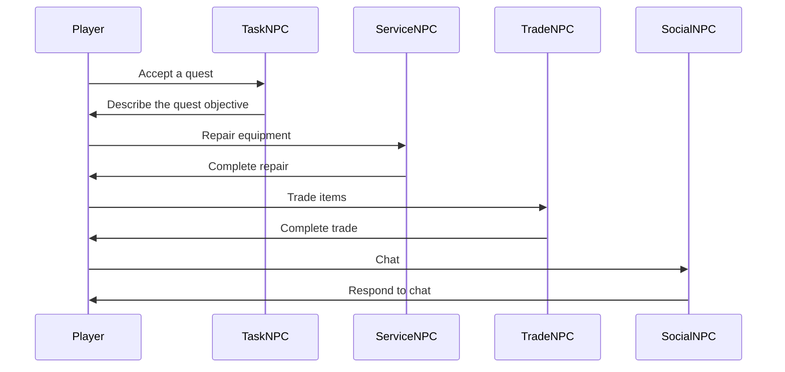
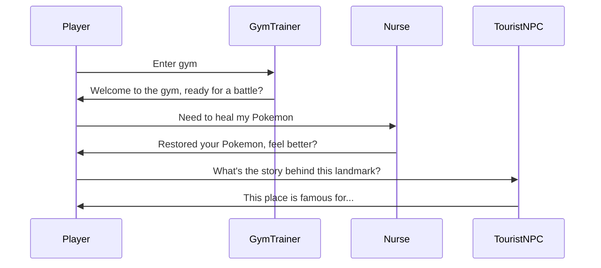
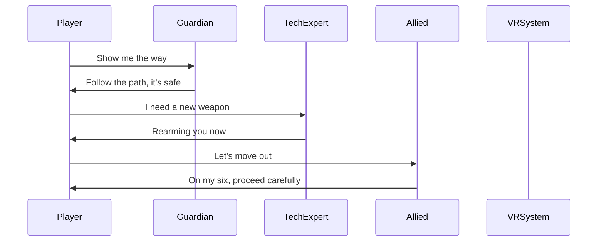

                 

### 第1章: 游戏NPC AI Agent概述

#### 1.1 游戏NPC AI Agent的定义与重要性

游戏NPC（Non-Player Characters）AI Agent，是指在游戏中由计算机控制的非玩家角色，它们具有智能行为和自主决策能力。与传统的静态NPC角色不同，AI Agent能够根据游戏环境和玩家的行为动态地做出反应。这种智能化设计不仅提升了游戏的真实感，还为玩家提供了更加丰富和互动的体验。

在现代游戏设计中，NPC AI Agent的重要性体现在多个方面。首先，它们能够极大地增强游戏的沉浸感和互动性，使玩家感受到更加真实和丰富的游戏世界。其次，AI Agent能够通过智能决策和行为，为玩家提供更加多样化和具有挑战性的游戏任务。此外，随着人工智能技术的发展，NPC AI Agent的设计和实现已经成为游戏开发中不可或缺的一环，它对游戏产业的创新和进步具有深远的影响。

#### 1.2 游戏NPC AI Agent的核心挑战

尽管NPC AI Agent在游戏设计中具有重要地位，但其设计和实现过程中仍然面临诸多挑战。以下是其中一些核心挑战：

1. **行为决策的复杂性**：NPC AI Agent需要能够根据不同的游戏情境和玩家的行为做出合适的决策，这要求AI Agent具备高度的认知能力和推理能力。然而，实际情境的复杂性和多样性使得这一目标难以实现。

2. **资源限制**：游戏环境中的资源（如CPU、内存等）通常是有限的。因此，NPC AI Agent的设计和实现必须在保证性能的同时，尽量减少对系统资源的占用。

3. **自然语言处理**：NPC AI Agent往往需要与玩家进行自然语言交互。这意味着AI Agent必须具备良好的自然语言理解能力和文本生成能力，这对于现有的人工智能技术来说仍然是一个挑战。

4. **训练数据的多样性**：为了使NPC AI Agent能够在各种游戏情境中表现出色，需要大量的训练数据。然而，获取这些多样化的训练数据并非易事，特别是在游戏开发者不具备大量真实游戏数据的情况下。

#### 1.3 LLM在游戏NPC AI Agent中的作用

为了应对上述挑战，近年来，长语言模型（LLM，Long Language Model）在游戏NPC AI Agent的设计和实现中得到了广泛应用。LLM是一种基于深度学习的技术，它通过大规模语料库的训练，能够生成高质量的自然语言文本。以下是LLM在游戏NPC AI Agent中的具体作用：

1. **自然语言交互**：LLM可以帮助NPC AI Agent实现更加自然和流畅的文本对话，从而提高玩家的互动体验。

2. **行为决策辅助**：LLM可以基于上下文信息为NPC AI Agent提供决策支持，使其能够根据玩家的行为和游戏情境做出更智能的决策。

3. **文本生成**：LLM可以生成各种类型的文本，如游戏剧情、任务描述等，为NPC AI Agent提供丰富的内容。

4. **多样化训练数据**：通过生成各种虚拟情境和对话，LLM可以辅助NPC AI Agent的训练，提高其适应能力和表现。

总之，LLM的应用不仅提高了NPC AI Agent的智能水平，也为游戏设计师提供了更加灵活和高效的实现手段。随着人工智能技术的不断发展，LLM在游戏NPC AI Agent中的应用前景将更加广阔。

### 第2章: LLM基础

#### 2.1 语言模型的基本概念

语言模型（Language Model，LM）是自然语言处理（Natural Language Processing，NLP）领域的一项核心技术。它的主要任务是预测下一个单词或字符，以便生成或理解自然语言文本。语言模型的应用范围广泛，包括机器翻译、语音识别、文本摘要、问答系统等。

语言模型通常分为统计语言模型和神经网络语言模型。统计语言模型基于大量文本数据，使用统计方法来预测下一个单词的概率。而神经网络语言模型则通过深度学习技术，自动从数据中学习语言模式和规律。

#### 2.2 语言模型的工作原理

语言模型的工作原理可以概括为以下几个步骤：

1. **数据预处理**：首先，需要对输入文本进行预处理，包括分词、标记化、去停用词等操作，以便将文本转换为机器可以理解的格式。

2. **特征提取**：接下来，从预处理后的文本中提取特征，如词频、词序列、词向量等。这些特征将用于训练神经网络模型。

3. **模型训练**：使用提取的特征数据，训练神经网络模型，使其能够预测下一个单词或字符。训练过程中，模型会通过不断调整参数，优化预测性能。

4. **预测与生成**：在模型训练完成后，可以使用它来生成新的文本。具体来说，模型会根据当前输入的文本，预测下一个单词或字符，并将其作为新的输入继续生成，直到生成出完整的句子或段落。

#### 2.3 常见的LLM模型介绍

近年来，随着深度学习技术的快速发展，神经网络语言模型（Neural Language Model）已经成为语言模型领域的主流。以下是几种常见的神经网络语言模型：

1. **循环神经网络（RNN，Recurrent Neural Network）**：
   RNN是一种基于时间序列数据的神经网络模型，它可以处理序列数据，如文本、语音等。然而，传统RNN存在梯度消失和梯度爆炸的问题，导致其在训练过程中性能不稳定。

2. **长短时记忆网络（LSTM，Long Short-Term Memory）**：
   LSTM是一种改进的RNN模型，通过引入记忆单元和门控机制，解决了传统RNN的梯度消失问题。LSTM在处理长序列数据时表现优秀，广泛应用于语言模型和时间序列预测等领域。

3. **门控循环单元（GRU，Gated Recurrent Unit）**：
   GRU是另一种改进的RNN模型，相较于LSTM，GRU的结构更为简洁，计算量更小，但性能相近。GRU在许多任务中表现良好，如文本分类、机器翻译等。

4. **Transformer模型**：
   Transformer模型是一种基于注意力机制的序列到序列模型，它在2017年由Vaswani等人提出。Transformer模型摒弃了传统的循环结构，采用多头自注意力机制和位置编码，显著提升了语言模型的性能。Transformer模型的变体，如BERT（Bidirectional Encoder Representations from Transformers）、GPT（Generative Pretrained Transformer），已经成为当前语言模型的主流。

5. **预训练与微调**：
   预训练（Pretraining）是一种训练大规模语言模型的方法，通过在大规模语料库上预训练，模型可以自动学习到丰富的语言知识和规律。微调（Fine-tuning）则是在预训练的基础上，针对特定任务进行模型参数的微调，以提高模型的性能。

总之，语言模型作为自然语言处理的核心技术，其在游戏NPC AI Agent中的应用正在不断拓展和深化。随着人工智能技术的不断发展，语言模型将带来更加丰富和智能化的游戏体验。

### 第3章: LLM在游戏NPC中的应用

#### 3.1 LLM在游戏NPC对话中的应用

语言模型（LLM）在游戏NPC对话中的应用主要涉及对话系统的设计和实现。对话系统是游戏NPC与玩家进行交互的重要手段，其目标是模拟人类的自然对话，提供流畅、丰富且个性化的交流体验。

1. **对话系统的架构**：
   游戏NPC对话系统通常包括以下几个关键组件：
   - **对话管理器**：负责对话的流程控制，包括对话状态跟踪、上下文维护等。
   - **意图识别**：根据玩家的输入，识别玩家的意图，如询问信息、请求帮助、表达情感等。
   - **实体提取**：从玩家的输入中提取关键信息，如人名、地点、时间等。
   - **回复生成**：使用LLM生成合适的回复，以实现自然、连贯的对话。

2. **意图识别与回复生成**：
   - **意图识别**：通过分析玩家的输入文本，使用机器学习模型（如分类模型）识别玩家的意图。LLM在此过程中发挥了重要作用，它可以从大量文本数据中学习到各种意图的特征。
   - **回复生成**：在识别出玩家的意图后，LLM根据当前对话的上下文和玩家的意图，生成合适的回复文本。这一过程需要LLM具备良好的自然语言生成能力。

3. **对话上下文管理**：
   - **上下文维护**：为了使对话保持连贯性，对话系统需要维护对话的上下文信息。这包括当前对话的状态、历史对话内容等。
   - **上下文更新**：在每次生成回复后，LLM会更新对话的上下文信息，以适应新的对话情境。

#### 3.2 LLM在游戏NPC行为决策中的应用

除了对话系统，LLM还可以在游戏NPC的行为决策中发挥重要作用。游戏NPC的行为决策涉及多个方面，包括任务分配、目标设定、路径规划等。

1. **任务分配**：
   - **基于意图的任务分配**：LLM可以帮助NPC根据玩家的行为和意图，动态地分配任务。例如，如果玩家请求NPC帮助，LLM可以生成合适的任务，如提供指引、解决问题等。
   - **基于情境的任务分配**：NPC可以根据当前的游戏情境和目标，自主地分配任务。例如，在探索型游戏中，NPC可能会根据探索进度和资源情况，分配新的探索任务。

2. **目标设定**：
   - **短期目标**：NPC可以根据当前任务和情境，设定短期目标。例如，在战斗任务中，NPC可能会设定击败敌人、夺取宝物等短期目标。
   - **长期目标**：NPC还可以根据游戏世界的整体目标和NPC的个性，设定长期目标。例如，一个勇敢的战士可能会设定保卫家园、征服敌人等长期目标。

3. **路径规划**：
   - **基于地图的路径规划**：NPC可以使用LLM来规划从当前位置到目标位置的最佳路径。这可以通过预训练的地图数据集实现，LLM可以从中学习到各种路径规划的策略和技巧。
   - **动态路径调整**：在游戏过程中，NPC可能会遇到障碍物或新的目标，LLM可以根据实时信息，动态地调整路径规划，以确保NPC能够顺利完成任务。

#### 3.3 LLM在游戏NPC视觉识别中的应用

视觉识别是游戏NPC感知游戏世界的重要方式。LLM可以通过预训练的视觉模型，为NPC提供丰富的视觉信息，帮助NPC更好地理解和交互游戏环境。

1. **物体识别**：
   - **静态物体识别**：NPC可以使用LLM识别游戏场景中的静态物体，如建筑、道具、障碍物等。这有助于NPC理解和导航游戏世界。
   - **动态物体识别**：NPC还可以使用LLM识别动态物体，如玩家、NPC同伴、敌人等。这有助于NPC识别潜在的危险和互动对象。

2. **场景理解**：
   - **情境识别**：NPC可以使用LLM识别当前游戏场景的情境，如战斗、探索、休息等。这有助于NPC根据情境调整自己的行为和决策。
   - **事件预测**：NPC还可以使用LLM预测游戏场景中可能发生的事件，如战斗爆发、任务完成等。这有助于NPC提前做好准备，提高应对能力。

3. **交互理解**：
   - **动作理解**：NPC可以使用LLM理解玩家的动作意图，如攻击、防御、互动等。这有助于NPC与玩家进行有效的交互。
   - **情感识别**：NPC还可以使用LLM识别玩家的情感状态，如兴奋、愤怒、失望等。这有助于NPC根据玩家的情感调整自己的行为和语言，提供更加个性化的互动体验。

总之，LLM在游戏NPC中的应用，不仅提高了NPC的智能水平和互动能力，也为游戏设计师提供了更加灵活和高效的实现手段。随着人工智能技术的不断发展，LLM在游戏NPC中的应用前景将更加广阔，为玩家带来更加丰富和智能化的游戏体验。

### 第4章: 游戏NPC AI Agent的设计与实现

#### 4.1 游戏NPC AI Agent的系统架构

游戏NPC AI Agent的系统架构是确保其能够在复杂游戏中稳定运行的关键。一个典型的游戏NPC AI Agent系统通常包括以下几个主要组件：

1. **感知模块**：感知模块负责接收和解析游戏环境中的各种信息，如视觉、听觉、位置等。这一模块通常使用传感器和预处理技术，将原始数据转换为机器可处理的格式。

2. **决策模块**：决策模块是游戏NPC AI Agent的核心，它负责根据感知模块收集到的信息，结合NPC的个性、目标和游戏规则，制定出合适的行动方案。决策模块通常包括意图识别、行为决策和目标规划等子模块。

3. **行动模块**：行动模块负责执行决策模块生成的行动方案。它需要将抽象的行动指令转换为具体的操作，如移动、攻击、对话等。行动模块还需要与游戏引擎和物理引擎进行交互，确保行动的连贯性和合理性。

4. **学习模块**：学习模块负责NPC AI Agent的自我学习和优化。它可以通过机器学习和深度学习技术，从游戏过程中不断学习新的知识和技能，提高NPC的智能水平和适应性。

5. **通信模块**：通信模块负责NPC AI Agent与其他NPC、玩家和游戏服务器之间的通信。这一模块通常包括网络通信和消息队列等技术，确保NPC AI Agent能够与其他系统组件高效地协同工作。

#### 4.2 游戏NPC AI Agent的核心算法

游戏NPC AI Agent的核心算法是实现其智能行为的关键。以下是几种常见的核心算法：

1. **决策树算法**：
   决策树算法是一种基于规则的方法，它通过构建一系列条件分支，根据输入的特征值进行判断，最终得出决策。在NPC AI Agent中，决策树算法可以用于处理简单的规则和条件，例如判断玩家是否接近、是否攻击等。

2. **马尔可夫决策过程（MDP，Markov Decision Process）**：
   MDP是一种基于状态和动作的决策模型，它通过概率模型描述状态转移和奖励函数，用于解决具有不确定性环境的最优决策问题。在NPC AI Agent中，MDP可以用于复杂情境下的行为决策，如路径规划和目标选择。

3. **强化学习算法**：
   强化学习算法是一种基于试错和反馈的方法，它通过学习环境中的奖励和惩罚信号，逐步优化策略，实现最佳行为。在NPC AI Agent中，强化学习算法可以用于复杂游戏任务中的行为决策，如战斗策略、任务分配等。

4. **深度学习算法**：
   深度学习算法是一种基于神经网络的方法，它通过多层次的神经网络结构，自动学习输入和输出之间的复杂映射关系。在NPC AI Agent中，深度学习算法可以用于自然语言处理、视觉识别和决策支持等方面。

#### 4.3 游戏NPC AI Agent的实现流程

游戏NPC AI Agent的实现流程通常包括以下几个关键步骤：

1. **需求分析**：
   在开始实现NPC AI Agent之前，首先需要明确其功能需求和性能指标。这包括NPC AI Agent应具备的智能水平、互动能力、学习能力等。

2. **系统设计**：
   根据需求分析的结果，设计NPC AI Agent的系统架构和组件。这一步骤需要确定各组件的功能、接口和交互方式，以确保系统的高效性和可扩展性。

3. **算法选择与实现**：
   选择合适的算法来实现NPC AI Agent的核心功能。这一步骤需要根据具体需求，结合现有算法的优缺点，进行算法的选择和实现。

4. **模型训练与优化**：
   使用训练数据集对NPC AI Agent的模型进行训练，并通过调优参数，优化模型的性能。这一步骤需要确保模型能够在实际应用中达到预期的效果。

5. **系统集成与测试**：
   将NPC AI Agent的各个组件集成到游戏中，进行系统测试和调试。这一步骤需要确保NPC AI Agent能够在各种游戏情境中稳定运行，并与其他系统组件协同工作。

6. **部署与应用**：
   将NPC AI Agent部署到实际游戏环境中，进行实际应用和测试。这一步骤需要收集用户反馈，不断优化和改进NPC AI Agent的表现。

通过以上步骤，可以构建出一个功能强大、智能化的游戏NPC AI Agent，为玩家带来更加丰富和互动的游戏体验。

### 第5章: 游戏NPC AI Agent评估与优化

#### 5.1 游戏NPC AI Agent评估指标

为了评估游戏NPC AI Agent的性能，我们需要定义一系列评估指标。以下是一些常用的评估指标：

1. **交互质量**：
   - **自然语言生成能力**：评估NPC AI Agent生成的对话是否自然、流畅、符合语境。
   - **行为合理性**：评估NPC AI Agent的行为决策是否合理、符合游戏逻辑。

2. **适应性**：
   - **情境适应性**：评估NPC AI Agent在不同游戏情境下（如战斗、探索、对话等）的表现能力。
   - **学习效果**：评估NPC AI Agent从训练数据中学习到的知识和技能，以及其在实际应用中的表现。

3. **稳定性与鲁棒性**：
   - **错误率**：评估NPC AI Agent在执行任务时的错误率，包括对话错误、行为错误等。
   - **抗干扰能力**：评估NPC AI Agent在受到外界干扰（如游戏环境变化、玩家行为异常等）时的稳定性和鲁棒性。

4. **资源利用率**：
   - **计算资源**：评估NPC AI Agent在执行任务时对CPU、内存等计算资源的占用情况。
   - **网络资源**：评估NPC AI Agent在通信过程中对网络带宽的占用情况。

#### 5.2 游戏NPC AI Agent优化策略

基于上述评估指标，我们可以制定一系列优化策略，以提高游戏NPC AI Agent的性能：

1. **算法优化**：
   - **模型选择**：根据具体应用场景，选择合适的算法模型，如基于规则的方法、深度学习模型、强化学习模型等。
   - **模型调优**：通过调整模型参数，优化模型性能。例如，调整学习率、批次大小等参数。

2. **数据增强**：
   - **多样化数据集**：通过引入多样化、丰富的训练数据，提高模型的泛化能力。
   - **数据预处理**：对训练数据进行预处理，如分词、去停用词、词向量表示等，以提高数据质量。

3. **并行训练与分布式计算**：
   - **并行训练**：利用多线程或分布式计算技术，加速模型训练过程。
   - **分布式计算**：在大型游戏项目中，利用分布式计算资源，提高模型训练和优化的效率。

4. **增强学习与迁移学习**：
   - **增强学习**：利用强化学习算法，使NPC AI Agent能够在实际应用中不断学习、优化行为。
   - **迁移学习**：利用已有模型的知识，在新任务中进行快速迁移和优化，减少训练数据的需求。

5. **多模态融合**：
   - **视觉与语言融合**：将视觉信息（如场景、物体）与语言信息（如对话、描述）进行融合，提高NPC AI Agent的理解能力和交互效果。
   - **多源数据融合**：利用多源数据（如文本、图像、音频等），提高NPC AI Agent的情境感知和决策能力。

6. **自适应调整**：
   - **动态调整策略**：根据游戏情境和玩家行为，动态调整NPC AI Agent的行为策略，提高其适应能力和互动性。
   - **自适应学习**：根据用户反馈和实际表现，自适应调整模型参数和学习策略，提高NPC AI Agent的智能化水平。

#### 5.3 游戏NPC AI Agent性能调优

性能调优是确保游戏NPC AI Agent在实际应用中表现优异的关键步骤。以下是一些具体的性能调优方法：

1. **参数调整**：
   - **超参数调整**：调整学习率、批次大小、正则化参数等超参数，优化模型性能。
   - **微调参数**：对训练过程中发现的潜在问题，进行微调参数，提高模型稳定性。

2. **模型压缩与量化**：
   - **模型压缩**：通过模型压缩技术（如权重共享、剪枝等），减小模型规模，提高计算效率。
   - **模型量化**：通过模型量化技术（如整数化、二值化等），降低模型参数的精度，提高计算速度。

3. **缓存与预加载**：
   - **缓存策略**：利用缓存技术，减少重复计算和I/O操作，提高系统响应速度。
   - **预加载策略**：在游戏加载阶段，预加载NPC AI Agent所需的模型和数据，减少运行时的延迟。

4. **并行与分布式计算**：
   - **并行计算**：利用多线程或GPU加速技术，提高模型训练和推理的速度。
   - **分布式计算**：利用分布式计算资源，进行大规模模型训练和推理，提高系统处理能力。

5. **动态资源管理**：
   - **资源监控**：实时监控系统资源使用情况，动态调整资源分配，确保系统稳定运行。
   - **资源回收**：合理回收未使用的资源，提高系统资源利用率。

6. **性能优化工具**：
   - **Profiler工具**：使用Profiler工具，分析系统性能瓶颈，优化关键路径。
   - **代码优化**：优化NPC AI Agent的源代码，减少不必要的计算和内存占用。

通过以上优化策略和性能调优方法，我们可以显著提升游戏NPC AI Agent的性能和稳定性，为玩家带来更加丰富和智能化的游戏体验。

### 第6章: 游戏NPC AI Agent案例分析

#### 6.1 案例一：大型多人在线游戏中的NPC设计

在大型多人在线游戏（MMORPG）中，NPC AI Agent的设计和实现是一个复杂且富有挑战性的任务。以下是一个关于《魔兽世界》中NPC设计的案例分析：

**项目介绍**：
《魔兽世界》是一款全球知名的MMORPG，拥有庞大且多样的NPC群体。这些NPC分布在游戏的各个角落，为玩家提供任务、服务、交易等互动体验。

**系统功能设计**：
1. **任务NPC**：负责为玩家分配和介绍任务，引导玩家进行游戏。
2. **服务NPC**：提供游戏内服务，如修理装备、训练技能等。
3. **交易NPC**：允许玩家进行商品交易，丰富游戏的经济系统。
4. **社交NPC**：与玩家进行社交互动，提供聊天话题和故事背景。

**系统架构设计**：
《魔兽世界》的NPC系统采用了分布式架构，将NPC AI Agent的感知、决策、行动模块分别部署在不同的服务器上。这种架构不仅提高了系统的可扩展性，还减少了单个服务器的负载。

**系统接口设计**：
NPC AI Agent与游戏引擎、数据库和其他系统组件之间通过标准化的接口进行通信。这些接口包括RESTful API、WebSocket等，确保NPC AI Agent能够与其他系统组件高效地协同工作。

**系统交互mermaid序列图**：

**实际案例分析与详细讲解剖析**：

1. **任务NPC**：任务NPC是《魔兽世界》中最重要的NPC类型之一。它们通过预定义的脚本和规则，为玩家提供任务指导和任务目标。在任务执行过程中，任务NPC会与玩家进行对话，提示玩家下一步的行动。任务NPC的对话系统使用了LLM，使得对话更加自然和丰富。

2. **服务NPC**：服务NPC提供各种游戏内服务，如装备修理、技能训练等。它们的行为决策依赖于玩家的需求和游戏状态。服务NPC的行为决策使用了MDP模型，通过评估不同服务的收益和成本，为玩家提供最优的服务选择。

3. **交易NPC**：交易NPC是游戏经济系统的重要组成部分。它们通过预定义的价格和市场规则，与玩家进行商品交易。交易NPC的对话系统同样使用了LLM，使得交易过程更加顺畅和友好。

4. **社交NPC**：社交NPC为玩家提供了丰富的社交互动体验。它们可以通过自然语言生成与玩家聊天，讲述游戏背景故事，提供有趣的聊天话题。社交NPC的对话系统使用了预训练的GPT模型，使得对话内容更加生动和富有创意。

**项目小结**：
《魔兽世界》的NPC设计案例展示了大型MMORPG中NPC AI Agent的复杂性和多样性。通过使用LLM、MDP等先进的人工智能技术，NPC AI Agent不仅能够提供丰富的交互体验，还能根据游戏情境和玩家行为进行智能决策，为玩家带来更加丰富和有深度的游戏体验。

### 第6章: 游戏NPC AI Agent案例分析

#### 6.2 案例二：智能对话NPC在移动游戏中的应用

智能对话NPC在移动游戏中的应用逐渐成为提升用户体验的关键。以下是一个关于《宝可梦GO》中智能对话NPC的案例分析：

**项目介绍**：
《宝可梦GO》是一款基于增强现实（AR）的移动游戏，玩家可以在现实世界中捕捉和训练各种宝可梦。游戏中的NPC角色，如道馆训练师和宝可梦中心护士，为玩家提供重要的服务和互动体验。

**系统功能设计**：
1. **道馆训练师**：为玩家提供战斗训练和比赛机会，根据玩家表现给予奖励。
2. **宝可梦中心护士**：提供宝可梦的恢复和治疗服务，以及宝可梦的交换和进化信息。
3. **城市导游NPC**：为玩家提供游戏世界的背景故事和旅游信息，增加游戏的趣味性。

**系统架构设计**：
《宝可梦GO》的NPC系统采用了云架构，NPC AI Agent的感知、决策和行动模块分布在不同的云服务器上。这种架构不仅提高了系统的可扩展性和稳定性，还允许玩家在全球范围内与NPC进行实时互动。

**系统接口设计**：
NPC AI Agent通过RESTful API与游戏服务器和玩家设备进行通信。这些接口实现了NPC的对话生成、行为决策和动作执行，确保NPC能够为玩家提供连续和丰富的互动体验。

**系统交互mermaid序列图**：

**实际案例分析与详细讲解剖析**：

1. **道馆训练师**：道馆训练师是《宝可梦GO》中最重要的NPC之一。它们通过LLM生成自然、流畅的对话，与玩家进行互动。道馆训练师的行为决策依赖于玩家的等级、宝可梦的属性和战斗结果。使用强化学习算法，道馆训练师能够根据玩家行为调整战斗策略，提供更加公平和有挑战性的比赛。

2. **宝可梦中心护士**：宝可梦中心护士为玩家提供宝可梦的治疗和恢复服务。它们的对话系统同样使用了LLM，使得玩家能够与护士进行自然的交流，获取有关宝可梦健康的详细信息。护士的行为决策基于玩家的需求和宝可梦的状态，使用MDP模型优化治疗策略。

3. **城市导游NPC**：城市导游NPC增加了游戏的趣味性和互动性。它们通过自然语言生成与玩家聊天，提供关于游戏世界背景故事和城市地标的信息。导游NPC的行为决策依赖于玩家的问题和游戏进度，使用预训练的GPT模型生成丰富多彩的对话内容。

**项目小结**：
《宝可梦GO》中的智能对话NPC案例展示了移动游戏中NPC AI Agent的广泛应用和潜力。通过LLM、强化学习等技术，NPC AI Agent不仅能够提供丰富的对话体验，还能根据玩家行为进行智能决策，为玩家带来更加个性化和有趣的互动体验。这种智能化的设计大大提升了移动游戏的吸引力和用户满意度。

### 第6章: 游戏NPC AI Agent案例分析

#### 6.3 案例三：虚拟现实游戏中的NPC设计

虚拟现实（VR）游戏为玩家提供了沉浸式的体验，NPC AI Agent在其中扮演着至关重要的角色。以下是一个关于《半衰期：爱莉克斯》（Half-Life: Alyx）中NPC设计的案例分析：

**项目介绍**：
《半衰期：爱莉克斯》是一款虚拟现实游戏，玩家扮演主人公爱莉克斯，在一个充满危险的未来世界中生存和探索。游戏中的NPC角色，如保护者、科技专家和友军成员，为玩家提供关键的互动和支持。

**系统功能设计**：
1. **保护者**：提供安全保护和战术指导，帮助玩家避开敌人和解决难题。
2. **科技专家**：为玩家提供技术和资源支持，包括维修设备、提供战术信息等。
3. **友军成员**：与玩家并肩作战，提供合作任务和团队支持。

**系统架构设计**：
《半衰期：爱莉克斯》的NPC系统采用了模块化架构，将感知、决策和行动模块分别实现。NPC AI Agent的决策和行动基于玩家的行为和游戏环境，通过分布式计算确保系统的响应速度和稳定性。

**系统接口设计**：
NPC AI Agent通过虚拟现实头戴显示器（HMD）与玩家进行实时互动，接口设计包括语音识别、手势识别和头动跟踪等。这些接口实现了NPC与玩家的自然交互，增强了沉浸式体验。

**系统交互mermaid序列图**：

**实际案例分析与详细讲解剖析**：

1. **保护者**：保护者NPC在《半衰期：爱莉克斯》中扮演着玩家的向导和护卫。它们通过LLM生成自然语言指令，引导玩家避开危险。保护者还具备一定的战术意识，能够根据玩家的行动和敌人的位置，提供战术建议。这些NPC的行为决策基于强化学习算法，使得它们能够根据玩家的反馈不断优化行为。

2. **科技专家**：科技专家NPC为玩家提供关键的设备维修和技术支持。它们的对话系统使用了LLM，使得玩家能够与专家进行自然的交流。科技专家的行为决策依赖于游戏环境，使用预训练的深度学习模型评估玩家需求和设备状态，提供最优的维修方案。

3. **友军成员**：友军成员NPC与玩家组成战斗小组，提供团队支持。它们通过LLM生成战斗指令，与玩家协同作战。友军成员的行为决策基于多智能体协同算法，确保团队行动的一致性和高效性。

**项目小结**：
《半衰期：爱莉克斯》中的NPC设计案例展示了虚拟现实游戏中NPC AI Agent的多样性和复杂性。通过LLM、强化学习和多智能体协同等技术，NPC AI Agent不仅能够提供丰富的互动体验，还能根据游戏情境和玩家行为进行智能决策，为玩家带来更加深入和逼真的虚拟现实体验。这种智能化的设计大大提升了虚拟现实游戏的可玩性和沉浸感。

### 第7章: 未来展望与拓展

#### 7.1 游戏NPC AI Agent的发展趋势

随着人工智能技术的不断进步，游戏NPC AI Agent的发展前景十分广阔。以下是游戏NPC AI Agent未来发展的几个主要趋势：

1. **更加智能的决策与行为**：
   随着深度学习、强化学习等技术的不断发展，NPC AI Agent的决策能力将进一步提升。未来的NPC AI Agent将能够更加智能地分析游戏情境，制定出更加复杂和合理的行动方案，提供更加丰富的游戏体验。

2. **多模态交互**：
   未来游戏NPC AI Agent将具备多模态交互能力，不仅限于文本对话，还将包括语音、图像、动作等多种交互方式。这种多模态交互将使得NPC AI Agent与玩家的互动更加自然和丰富，提升游戏沉浸感。

3. **个性化体验**：
   随着大数据和个性化推荐技术的应用，NPC AI Agent将能够根据玩家的行为和喜好，提供个性化的互动和任务。这将使得每个玩家在游戏中都能体验到独特的故事和挑战，提升游戏满意度。

4. **社会智能**：
   未来NPC AI Agent将具备更高的社会智能，能够理解玩家情感、人际互动和社交规则。这种社会智能将使得NPC AI Agent在游戏中扮演更加复杂和多样化的角色，提供更加生动和真实的人际互动体验。

#### 7.2 LLM在游戏NPC AI Agent中的应用前景

长语言模型（LLM）在游戏NPC AI Agent中的应用前景非常广阔，以下是其具体应用领域：

1. **自然语言生成**：
   LLM可以用于生成NPC AI Agent的对话文本，使得对话更加自然、流畅和丰富。未来，随着LLM技术的不断进步，NPC AI Agent的对话能力将更加接近真实人类，提供更加真实和互动的体验。

2. **故事生成与剧情发展**：
   LLM可以用于生成游戏剧情和任务描述，为NPC AI Agent提供丰富的内容和背景故事。通过LLM，游戏设计师可以快速生成多样化、有趣的故事线，为玩家带来独特的游戏体验。

3. **个性化任务设计**：
   LLM可以根据玩家的行为和喜好，生成个性化的任务和挑战。这种个性化设计将使得每个玩家在游戏中都能体验到独特的故事和挑战，提升游戏满意度。

4. **智能互动与情感理解**：
   LLM可以用于分析玩家情绪和互动行为，为NPC AI Agent提供更加智能和情感化的互动体验。通过LLM，NPC AI Agent将能够更好地理解玩家需求，提供更加贴心和个性化的服务。

#### 7.3 未来研究方向与挑战

尽管游戏NPC AI Agent和LLM技术已经取得了显著进展，但未来仍有许多研究方向和挑战：

1. **复杂情境下的决策能力**：
   如何使NPC AI Agent在复杂、动态的游戏情境下做出合理、高效的决策，仍然是一个重要挑战。未来的研究可以关注强化学习、多智能体协作等技术，以提高NPC AI Agent的决策能力。

2. **大规模数据集的构建**：
   构建丰富、多样的大规模训练数据集是训练高效LLM的关键。未来需要开发自动化数据采集和标注技术，提高数据集的质量和规模。

3. **计算资源与效率优化**：
   NPC AI Agent的训练和推理过程通常需要大量的计算资源。未来需要研究如何在有限资源下优化算法和系统架构，提高NPC AI Agent的计算效率和响应速度。

4. **隐私与安全性**：
   随着AI技术的发展，如何确保NPC AI Agent的隐私和安全性成为一个重要问题。未来需要开发安全可靠的AI系统，保护玩家信息和数据安全。

5. **伦理与道德问题**：
   NPC AI Agent的设计和应用涉及到伦理和道德问题。未来需要研究如何在游戏中实现公平、合理和道德的AI行为，避免对玩家产生不良影响。

总之，游戏NPC AI Agent和LLM技术的发展前景十分广阔，但仍面临许多挑战。通过不断研究和创新，我们有理由相信，未来游戏NPC AI Agent将带来更加丰富、智能和真实的游戏体验。

### 第8章: 小结与展望

#### 8.1 主要内容回顾

本文详细探讨了游戏NPC AI Agent的概念、重要性、核心挑战以及LLM（长语言模型）在其设计、实现和优化中的应用。通过分析，我们得出了以下关键结论：

1. **游戏NPC AI Agent的定义与重要性**：游戏NPC AI Agent是游戏中的智能非玩家角色，能够根据游戏情境和玩家行为做出智能决策和互动，提升游戏的真实感和互动性。

2. **核心挑战**：NPC AI Agent的设计和实现面临行为决策复杂性、资源限制、自然语言处理和训练数据多样性等挑战。

3. **LLM的作用**：LLM通过自然语言生成、行为决策辅助、文本生成和多样化训练数据等方面，显著提升了NPC AI Agent的性能和互动能力。

4. **设计与实现**：游戏NPC AI Agent的系统架构包括感知、决策、行动和学习模块，核心算法包括决策树、马尔可夫决策过程、强化学习和深度学习等。

5. **评估与优化**：评估指标包括交互质量、适应性、稳定性和资源利用率，优化策略涉及算法优化、数据增强、并行训练与分布式计算等。

6. **案例分析**：通过《魔兽世界》、《宝可梦GO》和《半衰期：爱莉克斯》等游戏案例，展示了NPC AI Agent在实际应用中的成功经验和挑战。

#### 8.2 知识点总结

本文总结了以下主要知识点：

1. **语言模型基础**：介绍了语言模型的基本概念、工作原理和常见模型，如RNN、LSTM、GRU和Transformer。

2. **游戏NPC AI Agent架构**：阐述了NPC AI Agent的感知、决策、行动和学习模块，以及各模块的功能和交互。

3. **LLM应用**：详细探讨了LLM在NPC对话、行为决策、文本生成和视觉识别等方面的应用。

4. **核心算法**：介绍了决策树、MDP、强化学习和深度学习等算法在NPC AI Agent中的具体实现和应用。

5. **评估与优化**：提出了交互质量、适应性、稳定性和资源利用率等评估指标，并提供了算法优化、数据增强和分布式计算等优化策略。

6. **案例分析**：通过实际游戏案例，展示了NPC AI Agent在不同类型游戏中的应用和实现。

#### 8.3 未来研究方向与建议

基于本文的讨论，以下是未来研究方向和一些建议：

1. **复杂情境下的决策能力**：研究如何提高NPC AI Agent在复杂动态情境下的决策能力，可以关注强化学习、多智能体协作和混合智能系统等方向。

2. **大规模数据集构建**：开发自动化数据采集和标注技术，提高训练数据的质量和规模，为LLM提供更多样化的训练资源。

3. **资源优化与效率提升**：研究如何在有限的计算资源下优化NPC AI Agent的系统架构和算法，提高其响应速度和效率。

4. **隐私与安全性**：确保NPC AI Agent的隐私和安全性，研究安全可靠的AI系统设计和隐私保护技术。

5. **伦理与道德**：在NPC AI Agent的设计和应用中，重视伦理和道德问题，确保AI行为符合社会规范，为玩家提供健康、积极的互动体验。

总之，游戏NPC AI Agent和LLM技术的研究和应用前景广阔，未来将不断推动游戏体验的升级和变革。通过持续的技术创新和优化，我们有理由期待更加智能、丰富和真实的游戏世界。

### 作者信息

**作者：AI天才研究院/AI Genius Institute & 禅与计算机程序设计艺术 /Zen And The Art of Computer Programming**

AI天才研究院致力于推动人工智能技术的创新与应用，涵盖机器学习、自然语言处理、计算机视觉等多个领域。我们的研究成果不仅推动了AI技术的进步，也为游戏产业带来了深刻的变革。同时，《禅与计算机程序设计艺术》一书，通过深入探讨计算机编程的哲学和艺术，为程序员提供了宝贵的思考和实践指南。我们期待与广大读者共同探索人工智能的未来，共创美好科技世界。

