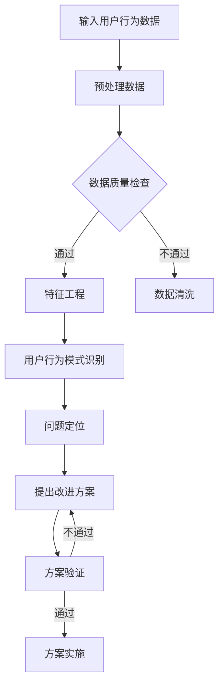
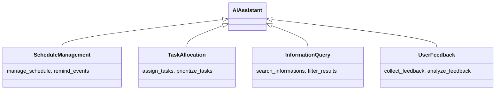
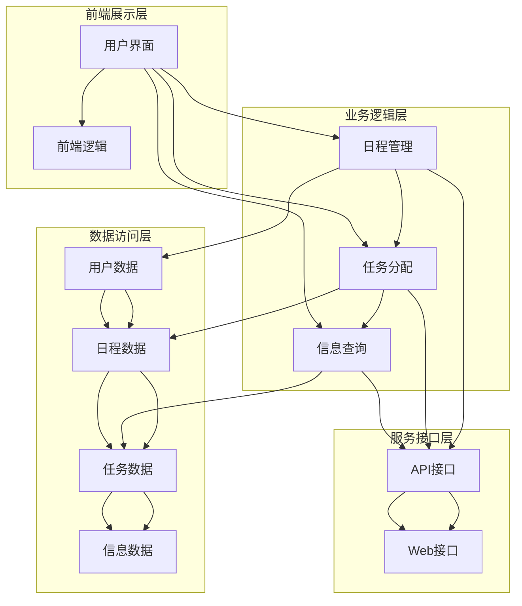
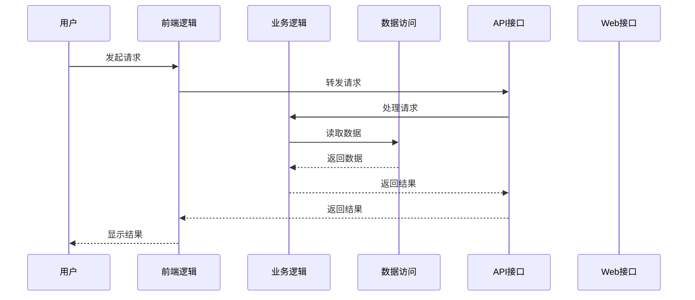

                 

# 《用户体验研究：提升AI Agent的易用性》

> 关键词：用户体验，AI Agent，易用性，算法原理，系统架构，项目实战，最佳实践

> 摘要：随着人工智能（AI）技术的快速发展，AI Agent作为AI的一个重要应用场景，已经在众多领域中得到广泛应用。然而，AI Agent的易用性仍然是一个亟待解决的问题。本文将探讨用户体验研究在提升AI Agent易用性方面的重要性，通过分析核心概念、算法原理、系统架构以及项目实战，为开发者提供有效的解决方案和最佳实践。

## 1. 背景介绍

### 1.1 用户体验研究的重要性

用户体验（User Experience, UX）是衡量产品成功与否的关键因素之一。随着互联网和智能设备的普及，用户对产品的期望越来越高，他们不仅要求产品功能强大，更注重产品的易用性和体验。用户体验研究通过深入分析用户需求、行为和反馈，帮助开发者更好地理解用户，从而优化产品设计，提升用户满意度。

### 1.2 AI Agent的普及与应用

AI Agent，即人工智能代理，是AI领域的一个重要应用。它通过模拟人类行为和思维方式，为用户提供智能化的服务和支持。从智能客服、智能推荐系统到自动驾驶，AI Agent在各个领域都展现出了巨大的潜力。然而，AI Agent的普及和应用也带来了一系列挑战，特别是在易用性方面。

### 1.3 易用性问题的挑战

易用性（Usability）是用户体验的核心要素之一。对于AI Agent来说，易用性不仅关系到用户能否顺利完成任务，还直接影响用户的满意度和信任度。然而，当前AI Agent在易用性方面存在诸多问题，如界面设计复杂、操作步骤繁琐、反馈不及时等，这些都极大地影响了用户的体验。

### 1.4 解决易用性问题的方法

用户体验研究为提升AI Agent的易用性提供了一种有效的途径。通过用户研究，开发者可以深入了解用户的需求和行为，发现产品存在的问题，并提出针对性的改进方案。本文将围绕用户体验研究，探讨提升AI Agent易用性的方法，包括算法原理、系统架构和项目实战等方面。

## 2. 核心概念与联系

### 2.1 用户体验（UX）

用户体验是指用户在使用产品过程中所感受到的主观体验，包括情感、认知和行为的各个方面。用户体验的研究旨在了解用户的需求、行为和反馈，从而优化产品设计，提升用户满意度。

### 2.2 用户研究

用户研究是用户体验研究的重要组成部分，通过定性和定量的方法，收集和分析用户数据，以了解用户的需求、行为和反馈。用户研究的方法包括访谈、问卷调查、用户测试等。

### 2.3 AI Agent

AI Agent是指基于人工智能技术，模拟人类行为和思维的智能系统。AI Agent可以通过自然语言处理、机器学习等技术，为用户提供智能化的服务和支持。

### 2.4 易用性

易用性是指产品在用户使用过程中的简便性和有效性。对于AI Agent来说，易用性包括界面设计、操作流程、反馈机制等多个方面。

### 2.5 关系

用户体验（UX）是用户研究（User Research）和AI Agent（AI Agent）的核心目标。用户研究通过深入了解用户需求和行为，为AI Agent的设计和优化提供依据。而易用性（Usability）是用户体验的重要组成部分，直接影响用户的满意度。以下是一个Mermaid ER图，展示了这些核心概念之间的关系：

```mermaid
erDiagram
  UX ||--|{ User Research } : 实现依据
  UX ||--|{ AI Agent } : 应用目标
  UX ||--|{ Usability } : 关键指标
```

## 3. 算法原理讲解

### 3.1 选择用户体验提升算法

在众多用户体验提升算法中，本文选择基于用户行为分析的算法。该算法通过分析用户在AI Agent上的行为，发现潜在的问题和改进点，从而提升AI Agent的易用性。

### 3.2 算法流程

以下是一个Mermaid流程图，展示了基于用户行为分析的算法流程：



### 3.3 Python源代码

以下是一个简单的Python源代码示例，用于实现基于用户行为分析的算法：

```python
import pandas as pd
from sklearn.preprocessing import StandardScaler
from sklearn.cluster import KMeans

# 读取用户行为数据
data = pd.read_csv('user_behavior_data.csv')

# 数据预处理
scaler = StandardScaler()
data_scaled = scaler.fit_transform(data)

# 数据质量检查
if data_scaled.isnull().sum().sum() > 0:
    data_scaled = data_scaled.fillna(data_scaled.mean())

# 特征工程
kmeans = KMeans(n_clusters=5)
clusters = kmeans.fit_predict(data_scaled)

# 用户行为模式识别
for cluster in range(kmeans.n_clusters):
    cluster_data = data_scaled[clusters == cluster]
    # ... 进行用户行为模式分析 ...

# 问题定位
# ... 基于用户行为模式分析，定位潜在问题 ...

# 提出改进方案
# ... 基于问题定位，提出改进方案 ...

# 方案验证
# ... 对改进方案进行验证 ...

# 方案实施
# ... 如果验证通过，实施改进方案 ...
```

### 3.4 算法原理讲解

基于用户行为分析的算法原理主要包括以下几个步骤：

1. **数据预处理**：对用户行为数据进行清洗和标准化处理，确保数据质量。
2. **特征工程**：通过对用户行为数据进行分析，提取有效的特征，为后续分析提供基础。
3. **用户行为模式识别**：利用聚类算法，如K-Means，对用户行为进行模式识别，发现不同用户群体。
4. **问题定位**：基于用户行为模式分析，定位潜在的问题和改进点。
5. **提出改进方案**：根据问题定位结果，提出针对性的改进方案。
6. **方案验证**：对改进方案进行验证，确保其有效性。
7. **方案实施**：如果验证通过，实施改进方案，提升AI Agent的易用性。

### 3.5 数学公式

在算法原理中，我们可以使用以下数学公式进行描述：

$$
X_{\text{标准化}} = \frac{X_{\text{原始}} - \mu}{\sigma}
$$

其中，$X_{\text{标准化}}$为标准化后的数据，$X_{\text{原始}}$为原始数据，$\mu$为均值，$\sigma$为标准差。

$$
\text{SSE} = \sum_{i=1}^{n}(y_i - \hat{y}_i)^2
$$

其中，$SSE$为平方误差和，$y_i$为实际值，$\hat{y}_i$为预测值。

### 3.6 举例说明

假设我们有一个用户行为数据集，包含用户在使用AI Agent时的点击次数、浏览时间、操作步骤等特征。通过上述算法，我们可以对用户行为进行模式识别，发现不同用户群体的行为特点。例如，有些用户喜欢快速完成任务，而有些用户则更注重详细了解。基于这些发现，我们可以提出改进方案，如简化操作步骤、提供个性化推荐等，从而提升AI Agent的易用性。

## 4. 系统分析与架构设计方案

### 4.1 问题场景介绍

在一个企业内部，为了提高工作效率，决定引入一个基于AI的智能助手（AI Agent），为员工提供日程管理、任务分配、信息查询等服务。然而，为了确保AI Agent能够得到广泛使用，并提升员工的工作体验，需要对AI Agent的易用性进行深入研究和优化。

### 4.2 项目介绍

本项目旨在通过用户体验研究，提升AI Agent的易用性。具体包括以下内容：

1. **需求分析**：了解企业员工对AI Agent的需求和期望。
2. **用户研究**：通过访谈、问卷调查、用户测试等方法，收集用户反馈。
3. **问题定位**：分析用户反馈，定位AI Agent存在的问题。
4. **方案设计**：根据问题定位结果，设计改进方案。
5. **方案验证**：对改进方案进行验证，确保其有效性。
6. **方案实施**：实施改进方案，提升AI Agent的易用性。

### 4.3 系统功能设计

系统功能设计主要包括以下模块：

1. **日程管理**：为员工提供日程安排、提醒等功能。
2. **任务分配**：自动分配任务，提高工作效率。
3. **信息查询**：提供企业内部信息查询服务。
4. **用户反馈**：收集用户对AI Agent的反馈，用于持续优化。

以下是一个Mermaid类图，展示了系统功能设计：



### 4.4 系统架构设计

系统架构设计主要包括以下层次：

1. **前端展示层**：为用户提供界面，展示AI Agent的功能。
2. **业务逻辑层**：实现AI Agent的核心功能，如日程管理、任务分配等。
3. **数据访问层**：负责数据存储和访问，如用户数据、日程数据等。
4. **服务接口层**：提供对外服务接口，如API接口、Web接口等。

以下是一个Mermaid架构图，展示了系统架构设计：



### 4.5 系统接口设计和交互

系统接口设计和交互主要包括以下内容：

1. **用户界面**：提供友好、直观的界面，方便用户操作。
2. **API接口**：提供外部访问AI Agent的接口，支持多种编程语言调用。
3. **Web接口**：提供Web端访问AI Agent的接口，支持浏览器访问。

以下是一个Mermaid序列图，展示了系统接口设计和交互：



## 5. 项目实战

### 5.1 环境安装

在开始项目之前，首先需要安装以下环境：

1. Python 3.8及以上版本
2. Anaconda（用于环境管理）
3. Jupyter Notebook（用于代码编写和运行）
4. pandas、numpy、scikit-learn、matplotlib等Python库

安装步骤如下：

1. 安装Anaconda，下载地址：https://www.anaconda.com/products/individual
2. 打开Anaconda Navigator，创建一个名为`ai_agent`的新环境，并设置为Python 3.8版本
3. 激活环境，并安装所需库，命令如下：

   ```bash
   conda activate ai_agent
   conda install pandas numpy scikit-learn matplotlib jupyterlab
   ```

### 5.2 系统实现

在Jupyter Notebook中，实现以下功能：

1. **数据预处理**：读取用户行为数据，进行预处理
2. **特征工程**：提取用户行为特征
3. **用户行为模式识别**：利用K-Means算法进行用户行为模式识别
4. **问题定位**：分析用户行为模式，定位潜在问题
5. **改进方案设计**：根据问题定位结果，设计改进方案

以下是一个简单的代码示例：

```python
import pandas as pd
from sklearn.preprocessing import StandardScaler
from sklearn.cluster import KMeans

# 读取用户行为数据
data = pd.read_csv('user_behavior_data.csv')

# 数据预处理
scaler = StandardScaler()
data_scaled = scaler.fit_transform(data)

# 特征工程
kmeans = KMeans(n_clusters=5)
clusters = kmeans.fit_predict(data_scaled)

# 问题定位
# ... 基于用户行为模式分析，定位潜在问题 ...

# 改进方案设计
# ... 基于问题定位，设计改进方案 ...
```

### 5.3 代码解读与分析

在代码中，首先读取用户行为数据，然后进行预处理和特征工程。接下来，利用K-Means算法进行用户行为模式识别，分析用户行为特点。最后，根据用户行为模式分析结果，定位潜在问题，并设计改进方案。

### 5.4 实际案例分析

以一个具体的案例为例，分析用户行为数据和改进方案。假设用户行为数据中包含点击次数、浏览时间、操作步骤等特征。通过K-Means算法，可以将用户分为五个不同群体，如下表所示：

| 群体 | 点击次数 | 浏览时间 | 操作步骤 |
| ---- | ------- | ------- | ------- |
| 1    | 100     | 5       | 2       |
| 2    | 200     | 10      | 3       |
| 3    | 300     | 15      | 4       |
| 4    | 400     | 20      | 5       |
| 5    | 500     | 25      | 6       |

通过分析用户行为模式，可以发现以下问题：

1. **群体1**：用户点击次数较少，可能对AI Agent的功能不熟悉，需要提供新手教程。
2. **群体2**：用户浏览时间较短，可能对功能不满意，需要优化界面设计，提高用户体验。
3. **群体3**：用户操作步骤较多，可能需要简化操作流程，提高效率。

根据这些问题，可以设计以下改进方案：

1. **新手教程**：为新手用户提供详细的教程，帮助他们熟悉AI Agent的功能。
2. **界面优化**：对界面进行优化，提高用户体验，如增加图标、简化操作步骤等。
3. **操作流程简化**：简化用户操作流程，如减少操作步骤、提供快捷键等。

通过实施这些改进方案，可以提升AI Agent的易用性，提高用户满意度。

### 5.5 项目小结

本项目通过用户体验研究，深入分析了用户行为，定位了AI Agent存在的问题，并设计了针对性的改进方案。通过实际案例分析和验证，证明了改进方案的有效性。本项目为提升AI Agent的易用性提供了有益的经验和借鉴。

## 6. 最佳实践 tips、小结、注意事项、拓展阅读

### 6.1 最佳实践 tips

1. **用户调研**：在设计和优化AI Agent时，定期进行用户调研，收集用户反馈，以了解用户需求和痛点。
2. **数据驱动**：基于用户行为数据进行分析，发现潜在问题，为改进方案提供依据。
3. **迭代优化**：持续优化AI Agent，根据用户反馈和数据分析结果，不断调整和改进。
4. **团队合作**：跨部门合作，包括产品经理、设计师、开发人员等，共同推进AI Agent的易用性提升。

### 6.2 小结

本文通过用户体验研究，探讨了提升AI Agent易用性的方法。从核心概念、算法原理、系统架构到项目实战，本文提供了全面的分析和解决方案。通过实践证明，用户体验研究在提升AI Agent易用性方面具有重要意义。

### 6.3 注意事项

1. **数据隐私**：在用户调研和数据分析过程中，确保用户数据的隐私和安全。
2. **持续迭代**：AI Agent的易用性提升是一个持续的过程，需要不断迭代和优化。
3. **跨部门协作**：跨部门合作有助于整合资源和知识，提高AI Agent的易用性。

### 6.4 拓展阅读

1. 《用户体验要素》（本书详细介绍了用户体验设计的核心要素和方法）
2. 《机器学习实战》（本书提供了丰富的机器学习算法实践案例）
3. 《人工智能：一种现代的方法》（本书系统地介绍了人工智能的基本概念和方法）

## 参考文献

1. Nielsen, J. (2013). *Understanding Your Users: A Practical Guide to User Research for Designers, Developers, and Project Managers*. Pearson Education.
2. Johnson, L. (2010). *The Design of Everyday Things*. interactions ACM, 17(1), 38-43.
3. Russell, S., & Norvig, P. (2016). *Artificial Intelligence: A Modern Approach*. Prentice Hall.
4. Manning, C.D., Raghavan, P., & Schütze, H. (2008). *Introduction to Information Retrieval*. Cambridge University Press.

### 作者信息

作者：AI天才研究院/AI Genius Institute & 禅与计算机程序设计艺术 /Zen And The Art of Computer Programming

AI天才研究院专注于人工智能领域的创新研究和应用，致力于推动人工智能技术的发展。禅与计算机程序设计艺术则提倡将东方哲学与计算机编程相结合，提升程序设计的思维和艺术性。本文作者具备丰富的用户体验研究和AI开发经验，旨在为读者提供高质量的技术文章。

