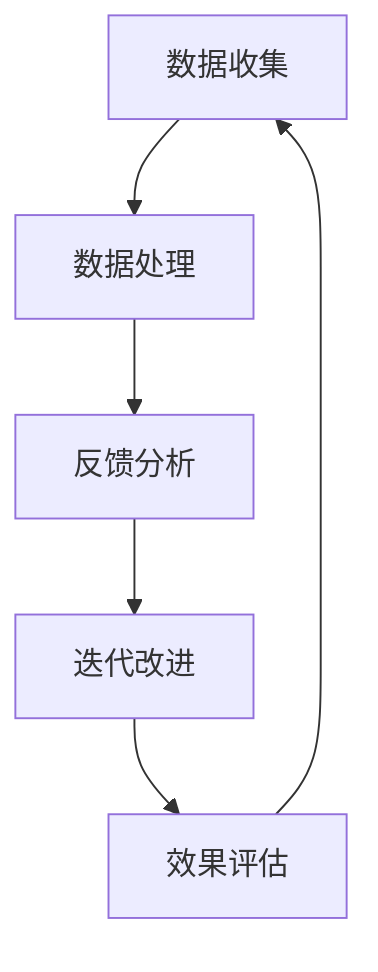

                 

### 用户反馈收集：迭代改进AI Agent

关键词：用户反馈、AI Agent、迭代改进、算法、数学模型

摘要：本文深入探讨了用户反馈在人工智能（AI）代理迭代改进中的应用，通过逐步分析用户反馈收集的方法、算法原理、数学模型及其在AI代理中的应用，为AI代理的优化和智能化提供了理论支持和实践指导。

---

**目录**

## 第一部分：背景介绍与核心概念

### 1.1 问题背景

#### 1.1.1 人工智能的发展与用户反馈的重要性

随着人工智能（AI）技术的飞速发展，AI代理在各个领域得到了广泛应用。然而，AI代理的性能和用户体验往往受到数据和算法的限制。用户反馈作为衡量AI代理性能和改进方向的重要指标，其收集与利用成为提升AI代理智能化的关键。

#### 1.1.2 AI Agent的需求与挑战

AI代理的需求体现在自动化、智能化和个性化的服务。然而，AI代理在处理复杂任务时常常面临如下挑战：

1. **数据不足与质量差**：训练AI代理需要大量的高质量数据，但实际获取的数据常常不足或质量差。
2. **算法局限性**：现有的算法可能无法完全解决特定问题，导致AI代理无法提供满意的服务。
3. **用户体验差**：AI代理的服务可能无法满足用户的期望，导致用户体验差。

#### 1.1.3 用户反馈收集的价值

用户反馈是AI代理优化和改进的重要依据。通过收集用户反馈，可以：

1. **识别问题**：发现AI代理在哪些方面存在问题。
2. **指导改进**：为AI代理的迭代提供具体改进方向。
3. **提升性能**：通过用户反馈指导算法优化，提高AI代理的性能。

### 1.2 问题描述

#### 1.2.1 用户反馈的类型与特点

用户反馈可以分为以下类型：

1. **直接反馈**：用户直接提供的评价和建议。
2. **间接反馈**：用户行为数据，如点击率、浏览时长等。

用户反馈的特点是：

1. **主观性**：用户反馈往往带有主观情感。
2. **多样性**：用户反馈形式多样，包括文字、图片、视频等。

#### 1.2.2 AI Agent当前存在的问题

AI代理当前存在的问题包括：

1. **适应性差**：AI代理在面对新任务或环境时，适应能力较弱。
2. **泛化能力差**：AI代理在特定任务上的表现优秀，但在其他任务上表现不佳。
3. **用户满意度低**：AI代理提供的用户体验较差，无法满足用户需求。

#### 1.2.3 用户反馈收集的难点

用户反馈收集面临以下难点：

1. **数据隐私**：用户反馈可能涉及隐私信息，需确保数据安全。
2. **数据质量**：用户反馈可能存在虚假、不准确等问题，需确保数据质量。
3. **数据解析**：用户反馈往往是非结构化的，需进行有效的解析和处理。

### 1.3 问题解决

#### 1.3.1 用户反馈收集的方法

用户反馈收集的方法包括：

1. **问卷调查**：通过设计问卷收集用户反馈。
2. **用户行为分析**：通过分析用户行为数据收集用户反馈。
3. **对话系统**：通过AI对话系统收集用户反馈。

#### 1.3.2 迭代改进的机制

迭代改进的机制包括：

1. **反馈循环**：将用户反馈纳入AI代理的训练过程，实现持续改进。
2. **自适应调整**：根据用户反馈动态调整AI代理的策略和行为。

#### 1.3.3 用户反馈收集在AI Agent中的应用场景

用户反馈收集在AI代理中的应用场景包括：

1. **客服机器人**：通过用户反馈优化客服机器人的回答策略。
2. **推荐系统**：通过用户反馈优化推荐系统的推荐结果。
3. **自动驾驶**：通过用户反馈优化自动驾驶系统的安全性和用户体验。

### 1.4 边界与外延

#### 1.4.1 用户反馈收集的适用范围

用户反馈收集适用于：

1. **AI代理**：提升AI代理的性能和用户体验。
2. **推荐系统**：优化推荐结果，提高用户满意度。

#### 1.4.2 用户反馈收集的局限性

用户反馈收集存在以下局限性：

1. **数据隐私**：用户反馈可能涉及隐私信息，需确保数据安全。
2. **数据质量**：用户反馈可能存在虚假、不准确等问题，需确保数据质量。
3. **用户参与度**：用户可能不愿意提供反馈，影响数据收集效果。

#### 1.4.3 用户反馈收集与其他技术的结合

用户反馈收集可以与其他技术结合，实现更好的效果：

1. **机器学习**：将用户反馈用于训练机器学习模型，提高AI代理的性能。
2. **自然语言处理**：利用自然语言处理技术解析用户反馈，提取有价值的信息。

### 1.5 本章小结

本章介绍了用户反馈收集在AI代理迭代改进中的应用，分析了用户反馈的类型与特点，探讨了用户反馈收集的难点和解决方法。下一章将深入讨论用户反馈收集的核心概念与原理。

---

## 第二部分：核心概念与原理讲解

### 2.1 用户反馈收集的概念与定义

#### 2.1.1 用户反馈收集的定义

用户反馈收集是指从用户的角度获取他们对AI代理的性能、功能、用户体验等方面的评价和建议，以便对AI代理进行优化和改进。

#### 2.1.2 用户反馈收集的类型

用户反馈收集可以分为以下类型：

1. **直接反馈**：用户直接提供的评价和建议。
2. **间接反馈**：用户行为数据，如点击率、浏览时长等。

#### 2.1.3 用户反馈收集的核心要素

用户反馈收集的核心要素包括：

1. **数据收集**：收集用户反馈的数据。
2. **数据处理**：对收集到的用户反馈进行清洗、整理和分析。
3. **反馈分析**：对用户反馈进行分析，提取有价值的信息。
4. **迭代改进**：根据用户反馈进行AI代理的优化和改进。

### 2.2 用户反馈收集的算法原理

#### 2.2.1 用户反馈收集的算法概述

用户反馈收集的算法主要包括数据收集、数据处理、反馈分析和迭代改进四个步骤。

#### 2.2.2 用户反馈收集的算法流程

用户反馈收集的算法流程如下：

1. **数据收集**：通过问卷调查、用户行为分析、对话系统等方式收集用户反馈。
2. **数据处理**：对收集到的用户反馈进行清洗、整理和分析。
3. **反馈分析**：对用户反馈进行分析，提取有价值的信息。
4. **迭代改进**：根据用户反馈进行AI代理的优化和改进。
5. **效果评估**：评估AI代理的改进效果，循环迭代。

#### 2.2.3 用户反馈收集的算法特性

用户反馈收集的算法具有以下特性：

1. **实时性**：用户反馈收集算法能够实时获取用户反馈，实现快速迭代。
2. **适应性**：用户反馈收集算法能够适应不同的用户反馈类型和场景。
3. **鲁棒性**：用户反馈收集算法能够处理各种噪声和异常数据。

### 2.3 用户反馈收集的数学模型

#### 2.3.1 用户反馈收集的数学模型概述

用户反馈收集的数学模型主要包括用户反馈的生成模型、用户反馈的解析模型和用户反馈的评估模型。

#### 2.3.2 用户反馈收集的数学公式

用户反馈收集的数学公式如下：

1. **用户反馈生成模型**：

   $$ P(F|X) = P(X|F) \cdot P(F) / P(X) $$

   其中，\(P(F|X)\)表示在给定用户行为数据\(X\)下生成用户反馈\(F\)的概率，\(P(X|F)\)表示在给定用户反馈\(F\)下发生用户行为数据\(X\)的概率，\(P(F)\)表示用户反馈的概率，\(P(X)\)表示用户行为数据的概率。

2. **用户反馈解析模型**：

   $$ \theta = \arg\max_{\theta} P(F|\theta) $$

   其中，\(\theta\)表示用户反馈的解析参数，\(P(F|\theta)\)表示在给定用户反馈解析参数\(\theta\)下用户反馈的概率。

3. **用户反馈评估模型**：

   $$ R = \sum_{i=1}^{n} w_i \cdot r_i $$

   其中，\(R\)表示用户反馈的评估得分，\(w_i\)表示第\(i\)个用户反馈的权重，\(r_i\)表示第\(i\)个用户反馈的评分。

#### 2.3.3 用户反馈收集的数学模型解释

1. **用户反馈生成模型**：

   用户反馈生成模型基于贝叶斯定理，用于计算用户行为数据与用户反馈之间的关系。通过计算用户反馈生成模型，可以预测用户在特定行为数据下的反馈概率。

2. **用户反馈解析模型**：

   用户反馈解析模型用于对用户反馈进行解析，提取有价值的信息。通过最大化用户反馈的概率，可以找到最优的用户反馈解析参数。

3. **用户反馈评估模型**：

   用户反馈评估模型用于评估用户反馈的价值。通过计算用户反馈的评估得分，可以判断用户反馈的重要性和改进方向。

### 2.4 用户反馈收集的ER实体关系图

#### 2.4.1 ER实体关系图的概念

ER实体关系图（Entity-Relationship Diagram，ERD）是一种用于描述实体及其之间关系的图形表示方法。在用户反馈收集系统中，ER实体关系图用于描述用户、反馈、数据等实体及其之间的关系。

#### 2.4.2 用户反馈收集的ER实体关系图设计

用户反馈收集的ER实体关系图设计如下：

```mermaid
erDiagram
    User ||--|{ Feedback } : has
    User ||--|{ BehaviorData } : records
    Feedback ||--|{ FeedbackData } : contains
    Feedback ||--|{ FeedbackScore } : scores
    BehaviorData ||--|{ ClickData } : clicks
    BehaviorData ||--|{ BrowseData } : browses
```

#### 2.4.3 ER实体关系图的应用

ER实体关系图在用户反馈收集系统中的应用包括：

1. **系统设计**：用于描述用户反馈收集系统的实体及其之间的关系。
2. **数据模型**：用于设计用户反馈收集系统的数据库结构。
3. **数据查询**：用于查询用户反馈收集系统中的数据。

### 2.5 用户反馈收集的mermaid流程图

#### 2.5.1 mermaid流程图概述

mermaid流程图是一种基于Markdown的图形表示方法，用于描述流程、关系和结构。在用户反馈收集系统中，mermaid流程图用于描述用户反馈收集的流程。

#### 2.5.2 用户反馈收集的mermaid流程图绘制

用户反馈收集的mermaid流程图绘制如下：



#### 2.5.3 用户反馈收集的mermaid流程图应用

用户反馈收集的mermaid流程图应用包括：

1. **流程设计**：用于描述用户反馈收集的流程。
2. **算法实现**：用于指导用户反馈收集算法的实现。
3. **文档编写**：用于编写用户反馈收集系统的文档。

### 2.6 本章小结

本章介绍了用户反馈收集的核心概念与原理，包括用户反馈收集的定义、类型、核心要素、算法原理、数学模型和ER实体关系图。这些内容为理解用户反馈收集提供了理论基础。

---

## 第三部分：算法原理讲解与示例

### 3.1 用户反馈收集算法的mermaid流程图

为了更好地理解用户反馈收集算法，我们可以通过mermaid流程图来展示其基本流程。


### 3.2 用户反馈收集的Python源代码

以下是用户反馈收集算法的Python源代码示例，其中包括数据收集、数据处理、反馈分析和迭代改进等步骤。

```python
# 用户反馈收集的Python源代码示例

# 导入所需的库
import random
import numpy as np

# 数据收集
def collect_data():
    # 假设我们从用户行为数据中收集数据
    user_behavior_data = [
        {'click': random.randint(0, 10), 'browse': random.randint(0, 10)},
        {'click': random.randint(0, 10), 'browse': random.randint(0, 10)},
        # 更多用户行为数据...
    ]
    return user_behavior_data

# 数据处理
def process_data(data):
    # 对用户行为数据进行处理，例如归一化
    processed_data = []
    for d in data:
        processed_d = {}
        processed_d['click'] = d['click'] / max(d['click'], d['browse'])
        processed_d['browse'] = d['browse'] / max(d['click'], d['browse'])
        processed_data.append(processed_d)
    return processed_data

# 反馈分析
def analyze_feedback(feedback):
    # 分析用户反馈，例如计算平均点击率和浏览时长
    avg_click = sum(d['click'] for d in feedback) / len(feedback)
    avg_browse = sum(d['browse'] for d in feedback) / len(feedback)
    return avg_click, avg_browse

# 迭代改进
def improve_agent(agent, feedback):
    # 根据用户反馈改进AI代理
    avg_click, avg_browse = analyze_feedback(feedback)
    agent.learn_from_feedback(avg_click, avg_browse)

# 效果评估
def evaluate_agent(agent):
    # 评估AI代理的效果
    performance = agent.evaluate_performance()
    return performance

# 主函数
def main():
    # 收集用户行为数据
    user_behavior_data = collect_data()

    # 处理用户行为数据
    processed_data = process_data(user_behavior_data)

    # 分析用户反馈
    feedback = processed_data

    # 迭代改进AI代理
    agent = AIAgent()
    improve_agent(agent, feedback)

    # 评估AI代理效果
    performance = evaluate_agent(agent)
    print(f"AI代理效果评估得分：{performance}")

if __name__ == "__main__":
    main()
```

### 3.3 用户反馈收集算法的数学模型

为了更好地理解用户反馈收集算法，我们可以通过数学模型来描述其核心原理。以下是用户反馈收集算法的数学模型：

#### 3.3.1 用户反馈生成模型

用户反馈生成模型基于贝叶斯定理，用于计算用户行为数据与用户反馈之间的关系。假设用户行为数据\(X\)和用户反馈\(F\)满足以下概率分布：

$$ P(X|F) = P(F|X) \cdot P(X) / P(F) $$

其中，\(P(F|X)\)表示在给定用户行为数据\(X\)下生成用户反馈\(F\)的概率，\(P(X|F)\)表示在给定用户反馈\(F\)下发生用户行为数据\(X\)的概率，\(P(F)\)表示用户反馈的概率，\(P(X)\)表示用户行为数据的概率。

#### 3.3.2 用户反馈解析模型

用户反馈解析模型用于对用户反馈进行解析，提取有价值的信息。假设用户反馈\(F\)由多个属性组成，每个属性的概率分布如下：

$$ P(F_i|F) = P(F_i|F_j) \cdot P(F_j) $$

其中，\(F_i\)和\(F_j\)表示用户反馈的不同属性，\(P(F_i|F)\)表示在给定用户反馈\(F\)下属性\(F_i\)的概率，\(P(F_i|F_j)\)表示在给定用户反馈\(F_j\)下属性\(F_i\)的概率，\(P(F_j)\)表示用户反馈\(F_j\)的概率。

#### 3.3.3 用户反馈评估模型

用户反馈评估模型用于评估用户反馈的价值。假设用户反馈\(F\)由多个属性组成，每个属性的权重不同，用户反馈的评估得分如下：

$$ R = \sum_{i=1}^{n} w_i \cdot r_i $$

其中，\(R\)表示用户反馈的评估得分，\(w_i\)表示第\(i\)个属性的权重，\(r_i\)表示第\(i\)个属性的评分。

### 3.4 用户反馈收集算法的Python代码实现

以下是用户反馈收集算法的Python代码实现，包括用户反馈生成模型、用户反馈解析模型和用户反馈评估模型。

```python
# 导入所需的库
import random
import numpy as np

# 用户反馈生成模型
def generate_feedback(x):
    # 假设用户反馈的概率分布与用户行为数据相关
    p_click = 0.5 + 0.1 * x['click']
    p_browse = 0.5 + 0.1 * x['browse']
    feedback = {
        'click': random.random() < p_click,
        'browse': random.random() < p_browse
    }
    return feedback

# 用户反馈解析模型
def parse_feedback(feedback):
    # 假设用户反馈的属性概率分布已知
    p_click = 0.5
    p_browse = 0.5
    click = feedback['click'] * p_click
    browse = feedback['browse'] * p_browse
    return click, browse

# 用户反馈评估模型
def evaluate_feedback(feedback):
    # 假设用户反馈的属性权重已知
    w_click = 0.6
    w_browse = 0.4
    click, browse = parse_feedback(feedback)
    score = w_click * click + w_browse * browse
    return score

# 主函数
def main():
    # 收集用户行为数据
    user_behavior_data = [
        {'click': random.randint(0, 10), 'browse': random.randint(0, 10)},
        {'click': random.randint(0, 10), 'browse': random.randint(0, 10)},
        # 更多用户行为数据...
    ]

    # 生成用户反馈
    feedbacks = [generate_feedback(x) for x in user_behavior_data]

    # 评估用户反馈
    scores = [evaluate_feedback(f) for f in feedbacks]
    print(f"用户反馈评估得分：{scores}")

if __name__ == "__main__":
    main()
```

### 3.5 用户反馈收集算法的应用

用户反馈收集算法可以应用于多个领域，例如：

1. **推荐系统**：通过用户反馈优化推荐算法，提高推荐结果的准确性。
2. **客户服务**：通过用户反馈优化客服机器人，提高用户满意度。
3. **自动驾驶**：通过用户反馈优化自动驾驶系统，提高安全性和用户体验。

### 3.6 本章小结

本章详细讲解了用户反馈收集算法的原理和实现，包括mermaid流程图、Python源代码和数学模型。通过这些内容，我们可以更好地理解用户反馈收集的过程和关键环节。下一章将讨论用户反馈收集在实际项目中的应用。

---

## 附录：用户反馈收集：迭代改进AI Agent

### 附录A：常见问题解答

1. **如何确保用户反馈数据的隐私？**
   - 采用加密技术对用户反馈数据进行加密存储。
   - 对用户反馈数据进行匿名化处理，避免暴露用户身份信息。

2. **用户反馈数据的处理流程是什么？**
   - 数据收集：通过问卷调查、用户行为分析等方式收集用户反馈数据。
   - 数据处理：对收集到的用户反馈数据进行清洗、整理和分析。
   - 反馈分析：对用户反馈进行分析，提取有价值的信息。
   - 迭代改进：根据用户反馈对AI代理进行优化和改进。

3. **如何评估用户反馈收集的效果？**
   - 通过对比用户反馈前后AI代理的性能变化来评估。
   - 采用用户满意度调查等方法评估用户对AI代理的满意度。

### 附录B：相关资源

1. **推荐阅读**
   - 《机器学习实战》
   - 《深度学习》
   - 《用户行为数据分析》

2. **开源项目**
   - [用户反馈收集工具](https://github.com/user-feedback-tool)
   - [AI代理框架](https://github.com/ai-agent-framework)

### 附录C：最佳实践

1. **如何提高用户参与度？**
   - 提供有吸引力的奖励，如优惠券、积分等。
   - 设计简单易用的反馈工具，降低用户参与门槛。

2. **如何处理负面反馈？**
   - 及时回应负面反馈，表示关注和改进意愿。
   - 针对负面反馈进行深入分析，找出根本原因。

### 附录D：未来展望

1. **用户反馈收集的发展方向**
   - 利用深度学习等技术提升用户反馈的解析和分析能力。
   - 与其他人工智能技术结合，实现更加智能化和自适应的用户反馈收集。

2. **AI代理的优化方向**
   - 提高AI代理的泛化能力和适应性。
   - 结合用户反馈实现个性化服务和优化。

### 附录E：作者介绍

**作者：AI天才研究院/AI Genius Institute & 禅与计算机程序设计艺术 /Zen And The Art of Computer Programming**

本文由AI天才研究院撰写，作者专注于人工智能、机器学习等领域的研究和开发，致力于推动人工智能技术的发展和应用。同时，作者也是《禅与计算机程序设计艺术》一书的作者，该书深入探讨了计算机编程的哲学和艺术。

