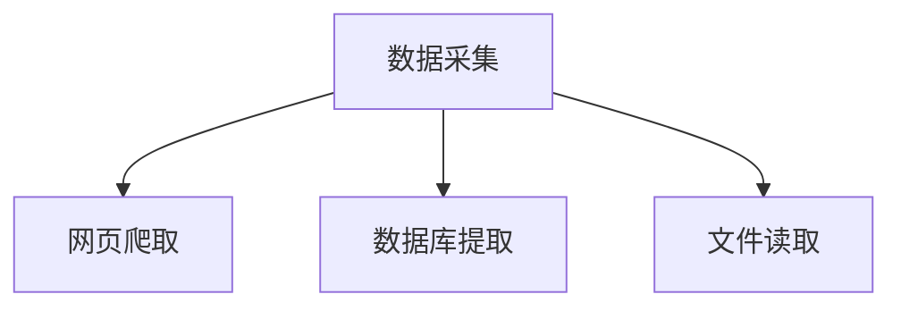
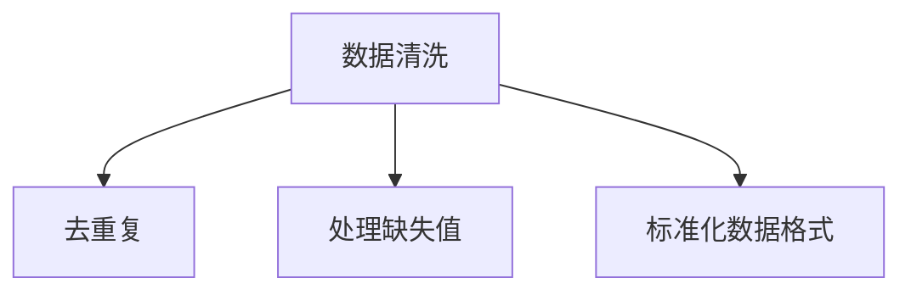
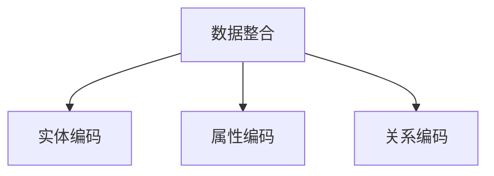
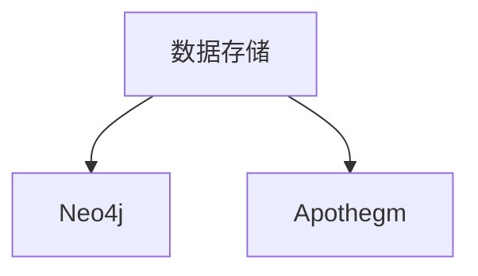
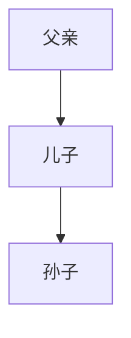
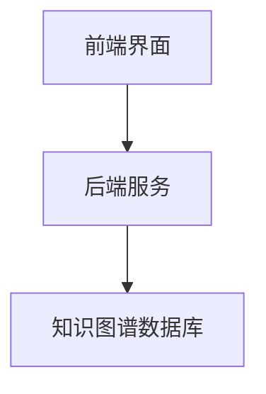

                 

# 知识图谱在AI Agent中的应用

## 关键词

- **知识图谱**
- **AI Agent**
- **语义理解**
- **推荐系统**
- **自动问答**
- **智能搜索**

## 摘要

本文将深入探讨知识图谱在AI Agent中的应用。我们将首先介绍知识图谱的基本概念、特点、组成及其构建过程。接着，我们将分析知识图谱在AI Agent中的应用原理，包括语义理解、上下文感知、推荐系统和自动问答。此外，本文还将详细阐述知识图谱的构建与存储、查询与推理方法，并分享知识图谱在实际应用中的案例，如智能客服系统。通过这篇文章，读者将全面了解知识图谱在AI Agent领域的重要性及其应用前景。

## 第1章：知识图谱概述

### 1.1 知识图谱的概念

#### 1.1.1 知识图谱的定义

知识图谱（Knowledge Graph）是一种用于表示信息及其关系的语义网络，通过实体（Entity）、属性（Attribute）和关系（Relationship）三种基本元素来构建。与传统的数据结构不同，知识图谱不仅仅存储了数据，更重要的是存储了数据之间的语义关系。

#### 1.1.2 知识图谱的特点

- **语义丰富**：知识图谱通过实体和关系，使得数据具有更丰富的语义信息。
- **网络结构**：知识图谱以网络结构来表示信息，使得信息之间具有关联性。
- **动态更新**：知识图谱可以根据新的数据动态更新，保持数据的实时性。

### 1.2 知识图谱的组成

#### 1.2.1 实体

实体是知识图谱中的基本元素，可以是任何具有独立意义的对象，如人、地点、事物等。

#### 1.2.2 属性

属性描述了实体的特征，如人的姓名、年龄，地点的纬度、经度等。

#### 1.2.3 关系

关系描述了实体之间的联系，如人住在某个地方、物体属于某个类别等。

### 1.3 知识图谱的构建

#### 1.3.1 数据采集

数据采集是知识图谱构建的第一步，数据来源可以是互联网、数据库、文件等多种途径。

#### 1.3.2 数据清洗

数据清洗是确保数据质量的过程，包括去除噪声、纠正错误等。

#### 1.3.3 数据整合

数据整合是将来自不同来源的数据进行统一处理和整合，形成一致的知识库。

#### 1.3.4 数据存储

数据存储是将处理后的数据存储在知识图谱数据库中，以便进行查询和处理。

### 1.4 知识图谱的应用场景

#### 1.4.1 智能搜索

知识图谱可以用于智能搜索，通过理解用户的查询意图，提供更加精准和个性化的搜索结果。

#### 1.4.2 语义理解

知识图谱可以帮助AI Agent更好地理解自然语言，提高对话系统的准确性和效率。

#### 1.4.3 个性化推荐

知识图谱可以用于构建推荐系统，提供基于用户兴趣和行为的个性化推荐。

#### 1.4.4 自动问答

知识图谱可以帮助构建自动问答系统，提供基于知识图谱的智能问答服务。

### 1.5 知识图谱与AI Agent的关系

知识图谱为AI Agent提供了丰富的语义信息，使其能够更好地理解用户的需求，进行智能决策。知识图谱不仅丰富了AI Agent的知识库，还提高了其推理和决策能力。

## 第2章：知识图谱在AI Agent中的应用原理

### 2.1 AI Agent的概念

AI Agent（智能代理）是一种具有自主意识和行为能力的计算机系统，它可以模拟人类的决策过程，完成特定任务。AI Agent通常由感知模块、决策模块和执行模块组成。

### 2.2 知识图谱在AI Agent中的应用

#### 2.2.1 语义理解

知识图谱可以帮助AI Agent更好地理解自然语言。通过知识图谱中的实体和关系，AI Agent可以识别出用户输入的自然语言中的关键信息，并理解其语义含义。

#### 2.2.2 上下文感知

知识图谱可以为AI Agent提供上下文信息，使其在特定场景下做出更合理的决策。例如，在智能客服场景中，AI Agent可以通过知识图谱中的关系，理解用户的历史提问和回答，提供更加个性化的服务。

#### 2.2.3 推荐系统

知识图谱可以用于构建推荐系统，提供基于用户兴趣和行为的个性化推荐。通过知识图谱中的关系，AI Agent可以识别出用户可能感兴趣的内容，并提供相应的推荐。

#### 2.2.4 自动问答

知识图谱可以帮助构建自动问答系统，提供基于知识图谱的智能问答服务。AI Agent可以通过查询知识图谱，找到与用户提问相关的信息，并生成回答。

### 2.3 知识图谱与AI Agent的关系

知识图谱为AI Agent提供了丰富的语义信息，使其能够更好地理解用户的需求，进行智能决策。知识图谱不仅丰富了AI Agent的知识库，还提高了其推理和决策能力。

## 第3章：知识图谱构建与存储

### 3.1 知识图谱的构建

#### 3.1.1 数据采集

数据采集是知识图谱构建的第一步，数据来源可以是互联网、数据库、文件等多种途径。例如，可以从互联网上爬取网页数据，从数据库中提取关系数据，从文件中读取属性数据等。



#### 3.1.2 数据清洗

数据清洗是确保数据质量的过程，包括去除噪声、纠正错误等。例如，去除重复数据、处理缺失值、标准化数据格式等。



#### 3.1.3 数据整合

数据整合是将来自不同来源的数据进行统一处理和整合，形成一致的知识库。例如，将不同的实体、属性和关系进行统一编码，建立一致的数据模型。



#### 3.1.4 数据存储

数据存储是将处理后的数据存储在知识图谱数据库中，以便进行查询和处理。常用的知识图谱数据库有Neo4j、Apothegm等。



### 3.2 知识图谱的存储

#### 3.2.1 RDF模型

RDF（Resource Description Framework）是一种用于表示知识图谱的数据模型。它使用三元组（Subject, Predicate, Object）来表示实体、属性和关系。

$$
(S, P, O)
$$

其中，S表示主体，P表示谓词，O表示对象。

#### 3.2.2 图数据库

图数据库是一种用于存储和查询知识图谱的数据库。它使用图结构来表示数据，其中节点表示实体，边表示关系。

## 第4章：知识图谱查询与推理

### 4.1 知识图谱查询

#### 4.1.1 SPARQL查询语言

SPARQL（Simple Protocol for Querying RDF）是一种用于查询RDF模型的查询语言。它使用查询语句来检索知识图谱中的数据。

```sql
SELECT ?x ?y
WHERE {
  ?x rdf:type foaf:Person .
  ?x foaf:knows ?y .
}
```

#### 4.1.2 图查询算法

图查询算法用于在知识图谱中查找实体、关系和路径。常见的图查询算法有深度优先搜索（DFS）、广度优先搜索（BFS）等。

### 4.2 知识图谱推理

#### 4.2.1 规则推理

规则推理是一种基于规则的推理方法，用于从知识图谱中推导出新的事实。例如，如果A是B的父亲，而B是C的父亲，则可以推导出A是C的祖父。



#### 4.2.2 本体推理

本体推理是一种基于本体的推理方法，用于从知识图谱中推导出新的事实。本体是指对一组概念及其关系的形式化描述，它用于指导知识图谱的构建和推理。

## 第5章：知识图谱在AI Agent中的应用案例

### 5.1 智能客服

#### 5.1.1 案例背景

智能客服是一种基于人工智能的客服系统，它可以自动处理用户的咨询和请求，提供高效的客户服务。知识图谱在智能客服中的应用，可以显著提高客服系统的语义理解能力和上下文感知能力。

#### 5.1.2 系统架构

智能客服系统的架构通常包括前端界面、后端服务和知识图谱数据库。前端界面用于接收用户的查询和请求，后端服务负责处理这些请求，知识图谱数据库用于存储和管理知识图谱数据。



#### 5.1.3 实现细节

- **前端界面**：使用Web技术（如HTML、CSS、JavaScript）构建，用于接收用户的查询和请求。
- **后端服务**：使用Python等编程语言实现，负责处理用户的查询和请求，调用知识图谱数据库进行查询。
- **知识图谱数据库**：使用Neo4j等图数据库存储和管理知识图谱数据。

```python
# Python示例代码
from py2neo import Graph

# 连接Neo4j数据库
graph = Graph("bolt://localhost:7687", auth=("neo4j", "password"))

# 查询知识图谱
results = graph.run("MATCH (n:Person) RETURN n")

# 输出查询结果
for result in results:
    print(result["n"])
```

#### 5.1.4 项目实战

在本案例中，我们将使用Python和Neo4j构建一个简单的智能客服系统。首先，我们需要安装Neo4j数据库，并创建一个知识图谱数据库。然后，我们编写Python代码，连接Neo4j数据库，并实现查询功能。

```bash
# 安装Neo4j数据库
sudo apt-get install neo4j

# 启动Neo4j数据库
sudo neo4j start

# 创建知识图谱数据库
neo4j create db "knowledge_graph"

# 使用Python连接Neo4j数据库
from py2neo import Graph

# 连接Neo4j数据库
graph = Graph("bolt://localhost:7474", auth=("neo4j", "password"))

# 查询知识图谱
results = graph.run("MATCH (n:Person) RETURN n")

# 输出查询结果
for result in results:
    print(result["n"])
```

通过这个案例，我们可以看到知识图谱在智能客服系统中的应用。知识图谱不仅提高了系统的语义理解能力和上下文感知能力，还使得系统的构建和扩展变得更加灵活。

## 总结

知识图谱在AI Agent中的应用具有重要意义。通过知识图谱，AI Agent可以更好地理解用户的语义意图，提供更加精准和个性化的服务。同时，知识图谱的动态更新和扩展能力，使得AI Agent可以不断学习和适应新的环境和需求。在未来的发展中，知识图谱有望成为AI Agent的核心技术之一，推动人工智能的进一步发展。

## 注意事项

- 在构建知识图谱时，需要确保数据的质量和一致性，避免噪声和错误对系统性能的影响。
- 知识图谱的查询和推理方法需要根据具体应用场景进行优化，以提高系统的效率和准确性。
- 在实际应用中，需要综合考虑系统的性能、可扩展性和用户体验，以实现最佳的效果。

## 拓展阅读

- **《知识图谱：概念、技术和应用》**：详细介绍了知识图谱的基本概念、技术原理和应用场景。
- **《AI Agent：原理、技术和应用》**：深入探讨了AI Agent的基本原理、技术方法和应用实践。
- **《Neo4j图数据库实战》**：介绍了Neo4j图数据库的安装、配置和编程使用方法。

## 作者信息

作者：AI天才研究院/AI Genius Institute & 禅与计算机程序设计艺术/Zen And The Art of Computer Programming

