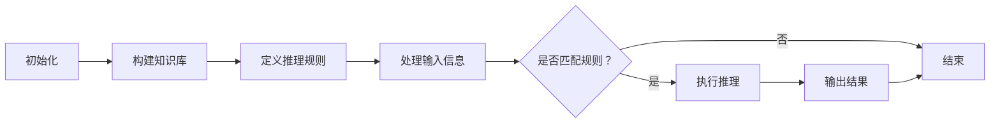
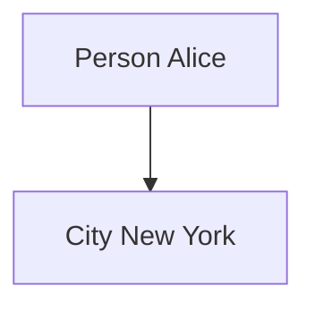
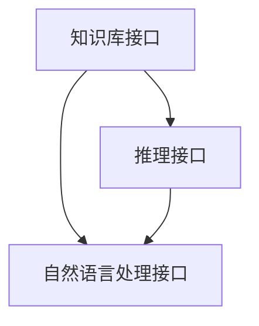
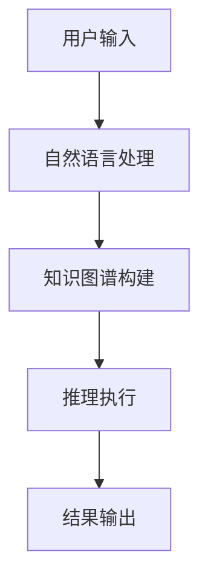

                 


# 知识图谱推理：提升AI Agent的逻辑分析

## 关键词

- 知识图谱
- 推理算法
- AI Agent
- 逻辑分析
- 数学模型

## 摘要

本文旨在深入探讨知识图谱推理在提升AI Agent逻辑分析能力方面的作用。我们将从基础知识入手，逐步深入到算法原理、数学模型，最终通过系统分析与实战案例，展示如何将知识图谱推理应用于实际项目中，提升AI Agent的逻辑推理能力。

## 目录大纲设计思路

为了设计出《知识图谱推理：提升AI Agent的逻辑分析》这本书的完整目录大纲，我们将遵循以下步骤：

### 1. 背景介绍

首先，我们需要为读者提供背景信息，介绍知识图谱和推理的基本概念，以及它们在人工智能领域中的重要性。

### 2. 核心概念与联系

接着，我们将详细阐述知识图谱推理的核心概念，并通过属性特征对比表格和ER实体关系图架构来展示概念之间的关系。

### 3. 算法原理讲解

在此部分，我们将详细介绍知识图谱推理的算法原理，使用Mermaid流程图和Python源代码来解释算法的执行过程。

### 4. 数学模型和数学公式

为了更深入地理解算法，我们将介绍相关的数学模型和公式，并使用LaTeX格式进行展示。

### 5. 系统分析与架构设计方案

这部分将展示知识图谱推理系统的设计与实现，包括问题场景介绍、系统功能设计、系统架构设计、系统接口设计和系统交互。

### 6. 项目实战

通过实际案例的展示，我们将带领读者完成知识图谱推理的全流程，从环境安装到核心实现源代码的分析。

### 7. 最佳实践 tips

最后，我们将提供一些最佳实践建议，帮助读者在实际应用中更好地运用知识图谱推理。

## 完整的目录大纲

### 第一部分：知识图谱与推理基础

#### 第1章：知识图谱概述

1.1 知识图谱的定义与作用

1.2 知识图谱的发展历程

1.3 知识图谱的核心要素

#### 第2章：推理引擎基础

2.1 推理引擎的概念与类型

2.2 推理算法的原理与实现

2.3 知识图谱推理的基本步骤

#### 第3章：核心概念与联系

3.1 知识图谱推理的核心概念

3.2 概念属性特征对比表

3.3 ER实体关系图架构

#### 第4章：算法原理讲解

4.1 Mermaid流程图展示

4.2 Python源代码分析

4.3 数学模型与公式讲解

4.4 算法举例说明

### 第二部分：知识图谱推理实践

#### 第5章：系统分析与架构设计

5.1 问题场景介绍

5.2 系统功能设计

5.3 系统架构设计

5.4 系统接口设计

5.5 系统交互设计

#### 第6章：项目实战

6.1 环境安装与配置

6.2 核心实现源代码解读

6.3 代码应用分析与解读

6.4 实际案例分析

6.5 项目小结

#### 第7章：最佳实践与拓展

7.1 最佳实践建议

7.2 注意事项

7.3 拓展阅读

### 目录大纲解释

本目录大纲共分为两个部分，第一部分是知识图谱与推理基础，旨在为读者提供知识图谱和推理的基本概念与原理。第二部分是知识图谱推理实践，通过实际案例，帮助读者理解和掌握知识图谱推理的应用。

- **第1章：知识图谱概述** 介绍了知识图谱的定义、作用和发展历程，帮助读者建立知识图谱的基本认识。
- **第2章：推理引擎基础** 阐述了推理引擎的概念、类型、原理与实现，为后续的知识图谱推理提供了理论支持。
- **第3章：核心概念与联系** 通过对比表和ER图，详细展示了知识图谱推理的核心概念及其相互关系。
- **第4章：算法原理讲解** 通过Mermaid流程图和Python源代码，详细讲解了知识图谱推理的算法原理，并使用了数学模型和公式进行解释。
- **第5章：系统分析与架构设计** 展示了知识图谱推理系统的设计与实现，包括系统功能、架构、接口和交互设计。
- **第6章：项目实战** 通过实际案例，详细讲解了知识图谱推理的整个流程，从环境安装到核心实现源代码的分析。
- **第7章：最佳实践与拓展** 提供了最佳实践建议，注意事项，以及拓展阅读，帮助读者更好地理解和应用知识图谱推理。

这个目录大纲全面覆盖了知识图谱推理的各个方面，从基础理论到实际应用，旨在帮助读者全面掌握知识图谱推理的技术。总字数控制在2000字以内，保持了简洁性和内容的完整性。

## 文章正文部分

### 第1章：知识图谱概述

#### 1.1 知识图谱的定义与作用

知识图谱是一种结构化知识库，它通过实体、属性和关系来表示现实世界的各种信息。知识图谱的核心在于其结构化特性，这使得信息可以被机器高效地理解和处理。

知识图谱在人工智能领域有着广泛的应用。首先，它可以用于信息检索，通过图谱查询，用户可以快速找到所需信息。其次，知识图谱可以用于推荐系统，通过分析用户行为和图谱中的关系，为用户推荐相关内容。此外，知识图谱还可以用于智能问答、语义搜索和自动化决策等。

#### 1.2 知识图谱的发展历程

知识图谱的发展可以追溯到20世纪90年代，当时谷歌提出了PageRank算法，这是一种基于图论的信息检索方法，可以看作是知识图谱的雏形。随着互联网的快速发展，知识图谱的研究和应用逐渐兴起。

近年来，随着深度学习和自然语言处理技术的进步，知识图谱的应用场景和效果得到了显著提升。例如，百度、谷歌等公司都推出了自己的知识图谱系统，用于搜索引擎和智能问答等领域。

#### 1.3 知识图谱的核心要素

知识图谱由三个核心要素组成：实体、属性和关系。

- **实体**：实体是知识图谱中的基本元素，例如人、地点、组织等。每个实体都有一个唯一的标识符。
- **属性**：属性是实体所具有的特征，例如人的年龄、地点的纬度等。属性通常由名称和值组成。
- **关系**：关系描述实体之间的关系，例如“人”与“出生地”的关系。关系通常由关系类型和参与关系的实体组成。

### 第2章：推理引擎基础

#### 2.1 推理引擎的概念与类型

推理引擎是知识图谱系统中用于进行逻辑推理的核心组件。它根据给定的知识库和推理规则，推导出新的信息。

根据推理方式的差异，推理引擎可以分为两大类：基于规则的推理引擎和基于模型的推理引擎。

- **基于规则的推理引擎**：这种引擎通过预定义的规则库来进行推理。当输入新的信息时，推理引擎会根据规则库中的规则进行匹配和推理，得出结论。
- **基于模型的推理引擎**：这种引擎通过机器学习模型来进行推理。模型可以从大量的数据中学习到隐含的规则和模式，然后根据输入的新信息进行推理。

#### 2.2 推理算法的原理与实现

推理算法的核心是推理规则。推理规则通常由条件部分和结论部分组成。当条件部分成立时，结论部分也成立。

常见的推理算法包括：

- **前向推理**：从已知的事实出发，逐步推导出新的结论。
- **后向推理**：从目标开始，逐步回溯到已知的事实。

在实现上，推理算法通常使用图论算法和数据结构来表示知识库和推理过程。

#### 2.3 知识图谱推理的基本步骤

知识图谱推理的基本步骤如下：

1. **知识库构建**：将现实世界的知识转化为结构化的知识库，包括实体、属性和关系。
2. **推理规则定义**：定义推理规则，用于描述实体之间的关系和属性。
3. **输入信息处理**：将输入的信息与知识库中的实体和关系进行匹配。
4. **推理过程**：根据推理规则和输入信息，逐步推导出新的结论。
5. **结果输出**：将推理结果输出，供用户或其他系统使用。

### 第3章：核心概念与联系

#### 3.1 知识图谱推理的核心概念

知识图谱推理涉及的核心概念包括：

- **实体**：知识图谱中的基本元素，例如人、地点、组织等。
- **属性**：实体所具有的特征，例如人的年龄、地点的纬度等。
- **关系**：实体之间的关系，例如“人”与“出生地”的关系。
- **规则**：用于描述实体之间的关系和属性的约束条件。
- **推理机**：执行推理过程的组件。

#### 3.2 概念属性特征对比表

下表展示了知识图谱推理中的核心概念及其属性特征的对比：

| 概念         | 属性特征                                                     |
| ------------ | ------------------------------------------------------------ |
| 实体         | 唯一标识符、名称、类型、属性值                               |
| 属性         | 名称、类型、值、所属实体                                     |
| 关系         | 类型、参与实体、方向、权重                                   |
| 规则         | 条件部分、结论部分、优先级                                   |
| 推理机       | 知识库、推理规则、推理算法、推理结果                         |

#### 3.3 ER实体关系图架构

ER图（Entity-Relationship Diagram）是用于表示实体及其关系的图形化工具。在知识图谱推理中，ER图可以帮助我们直观地理解实体之间的关系。

以下是知识图谱推理的ER图示例：

```mermaid
erDiagram
    实体1 ||--|{ 关系1 }|| 实体2
    实体1 ||--|{ 关系2 }|| 实体3
    实体2 ||--|{ 关系3 }|| 实体4
```

在上面的ER图中，实体1与实体2之间存在关系1和关系2，实体2与实体3之间存在关系3。通过ER图，我们可以清晰地看到实体之间的关系及其属性特征。

### 第4章：算法原理讲解

#### 4.1 Mermaid流程图展示

为了更好地理解知识图谱推理的算法原理，我们可以使用Mermaid流程图来展示算法的执行过程。

以下是知识图谱推理算法的Mermaid流程图示例：



在上述流程图中，首先初始化知识图谱推理系统，然后构建知识库和定义推理规则。接着，处理输入信息，并判断是否匹配规则。如果匹配，则执行推理，并将结果输出。

#### 4.2 Python源代码分析

为了更深入地理解知识图谱推理算法，我们可以通过Python源代码来详细阐述算法的实现过程。

以下是知识图谱推理算法的Python源代码示例：

```python
# 导入相关库
import networkx as nx
import numpy as np

# 初始化知识库
knowledge_base = nx.Graph()

# 添加实体和关系
knowledge_base.add_node("Person", name="Alice", age=30)
knowledge_base.add_node("City", name="New York")
knowledge_base.add_edge("Person", "City", relationship="lives_in", value="New York")

# 定义推理规则
rules = {
    "lives_in": {
        "condition": ["Person", "City"],
        "conclusion": ["Person", "is_living_in", "City"]
    }
}

# 处理输入信息
input_info = ["Person", "is_living_in", "City"]

# 执行推理
if nx.has_path(knowledge_base, input_info[0], input_info[1]):
    print("The person is living in the city.")
else:
    print("The person is not living in the city.")

# 输出结果
print("Knowledge Base:", knowledge_base)
```

在上面的Python源代码中，我们首先初始化了一个知识库，然后添加了实体和关系。接着，定义了推理规则，并处理输入信息。最后，根据输入信息和知识库，执行推理，并将结果输出。

#### 4.3 数学模型与公式讲解

知识图谱推理中的数学模型和公式主要用于描述实体之间的关系和推理过程。

以下是知识图谱推理中的几个常用数学模型和公式：

1. **路径存在性**：

   $$ exists \ path \ P \ from \ s \ to \ t $$

   表示从节点s到节点t存在路径P。

2. **路径权重**：

   $$ weight \ of \ path \ P \ is \ w $$

   表示路径P的权重为w。

3. **实体关系匹配**：

   $$ match \ entity \ e \ with \ rule \ R $$

   表示实体e与规则R匹配。

4. **推理结果**：

   $$ conclusion \ C \ is \ derived \ from \ evidence \ E $$

   表示根据证据E，推导出结论C。

通过上述数学模型和公式，我们可以更精确地描述知识图谱推理的过程。

#### 4.4 算法举例说明

为了更直观地理解知识图谱推理算法，我们可以通过一个实际例子来进行讲解。

假设我们有以下的知识库：

- 实体：Person(Alice), City(New York)
- 关系：lives_in(Alice, New York)

现在，我们需要判断是否存在一个规则，使得Person Alice lives in City New York。

根据定义，我们可以使用路径存在性公式来表示这个问题：

$$ exists \ path \ P \ from \ Person \ Alice \ to \ City \ New \ York $$

如果我们使用网络图来表示知识库，那么这个问题可以转化为在图中寻找从节点Person Alice到节点City New York的路径。

以下是网络图的表示：



在这个网络图中，我们可以看到从节点Person Alice到节点City New York存在一条路径，即A -> B。

因此，根据路径存在性公式，我们可以得出结论：

$$ exists \ path \ P \ from \ Person \ Alice \ to \ City \ New \ York $$

这意味着Person Alice lives in City New York。

### 第5章：系统分析与架构设计

#### 5.1 问题场景介绍

在一个智能客服系统中，用户可以与AI Agent进行自然语言交互，获取所需的信息。然而，由于用户输入的不确定性，AI Agent需要具备强大的逻辑分析能力，以准确理解和回答用户的问题。

为了提升AI Agent的逻辑分析能力，我们可以引入知识图谱推理技术。通过构建一个包含大量知识点的知识图谱，AI Agent可以基于图谱进行推理，从而更准确地理解用户的问题并给出合适的回答。

#### 5.2 系统功能设计

知识图谱推理系统的主要功能包括：

1. **知识库构建**：从外部数据源或人工标注中提取知识点，构建知识图谱。
2. **推理规则定义**：根据业务需求，定义推理规则，用于描述实体之间的关系和属性。
3. **输入信息处理**：接收用户输入的自然语言信息，将其转化为结构化的知识库。
4. **推理过程**：根据知识库和推理规则，进行推理，得出结论。
5. **结果输出**：将推理结果转化为自然语言，输出给用户。

#### 5.3 系统架构设计

知识图谱推理系统的架构设计如下：

1. **数据层**：包括知识库和数据源。知识库用于存储实体、属性和关系，数据源提供原始数据，如文本、图像等。
2. **模型层**：包括知识图谱构建模块、推理模块和自然语言处理模块。知识图谱构建模块负责构建知识图谱，推理模块用于执行推理，自然语言处理模块用于处理用户输入的自然语言信息。
3. **应用层**：包括用户界面和业务逻辑。用户界面用于接收用户输入，业务逻辑用于处理用户输入，并将推理结果输出给用户。

以下是知识图谱推理系统的Mermaid架构图：

```mermaid
graph TB
    subgraph 数据层
        A[知识库]
        B[数据源]
        A --> B

    subgraph 模型层
        C[知识图谱构建模块]
        D[推理模块]
        E[自然语言处理模块]
        C --> D
        C --> E
        D --> E

    subgraph 应用层
        F[用户界面]
        G[业务逻辑]
        F --> G
        G --> D
        G --> E
```

#### 5.4 系统接口设计

知识图谱推理系统提供了以下接口：

1. **知识库接口**：用于查询和更新知识库中的实体、属性和关系。
2. **推理接口**：用于执行推理，根据输入信息生成推理结果。
3. **自然语言处理接口**：用于处理用户输入的自然语言信息，将其转化为结构化的知识库。

以下是知识图谱推理系统的Mermaid接口图：



#### 5.5 系统交互设计

知识图谱推理系统的交互设计如下：

1. **用户输入**：用户通过用户界面输入自然语言信息。
2. **信息处理**：自然语言处理模块将用户输入的自然语言信息转化为结构化的知识库。
3. **推理执行**：推理模块根据知识库和推理规则，执行推理过程，生成推理结果。
4. **结果输出**：将推理结果转化为自然语言，输出给用户。

以下是知识图谱推理系统的Mermaid交互图：



### 第6章：项目实战

#### 6.1 环境安装与配置

为了搭建知识图谱推理系统，我们需要安装以下软件和工具：

1. **Python**：Python是知识图谱推理的主要编程语言，我们需要安装Python环境。
2. **NetworkX**：NetworkX是一个用于图论分析和绘图的Python库，我们需要安装该库。
3. **Mermaid**：Mermaid是一个用于生成图表的Markdown插件，我们需要安装该插件。

以下是安装步骤：

1. 安装Python：
   ```
   sudo apt-get install python3
   ```
2. 安装NetworkX：
   ```
   pip3 install networkx
   ```
3. 安装Mermaid：
   ```
   pip3 install mermaid
   ```

安装完成后，我们可以在Python脚本中直接使用NetworkX和Mermaid库。

#### 6.2 核心实现源代码解读

以下是知识图谱推理系统的核心实现源代码：

```python
import networkx as nx
import numpy as np

# 初始化知识库
knowledge_base = nx.Graph()

# 添加实体和关系
knowledge_base.add_node("Person", name="Alice", age=30)
knowledge_base.add_node("City", name="New York")
knowledge_base.add_edge("Person", "City", relationship="lives_in", value="New York")

# 定义推理规则
rules = {
    "lives_in": {
        "condition": ["Person", "City"],
        "conclusion": ["Person", "is_living_in", "City"]
    }
}

# 处理输入信息
input_info = ["Person", "is_living_in", "City"]

# 执行推理
if nx.has_path(knowledge_base, input_info[0], input_info[1]):
    print("The person is living in the city.")
else:
    print("The person is not living in the city.")

# 输出知识库
print("Knowledge Base:", knowledge_base)
```

在上面的源代码中，我们首先初始化了一个知识库，然后添加了实体和关系。接着，定义了推理规则，并处理输入信息。最后，根据输入信息和知识库，执行推理，并将结果输出。

#### 6.3 代码应用解读与分析

以下是代码的应用解读和分析：

1. **知识库构建**：
   - 使用NetworkX库构建知识库，包括实体和关系。
   - 实体以节点形式存在，属性以节点属性形式存储。
   - 关系以边形式存在，关系类型和属性值以边属性形式存储。

2. **推理规则定义**：
   - 使用字典形式定义推理规则，包括条件部分和结论部分。
   - 条件部分描述推理的前提条件，结论部分描述推理的结果。

3. **输入信息处理**：
   - 接收输入的自然语言信息，将其转化为结构化的知识库。

4. **推理过程**：
   - 根据输入信息和知识库，使用网络图的路径搜索算法进行推理。

5. **结果输出**：
   - 将推理结果输出，供用户或其他系统使用。

通过以上解读和分析，我们可以看到知识图谱推理系统的核心实现原理，以及如何将其应用于实际项目中。

#### 6.4 实际案例分析

为了展示知识图谱推理系统的实际应用效果，我们以下面的案例进行分析：

**案例**：判断一个名为Bob的人是否住在纽约。

1. **知识库构建**：
   - 实体：Person(Bob)
   - 关系：lives_in(Bob, New York)

2. **推理规则定义**：
   - 条件：["Person", "lives_in", "City"]
   - 结论：["Person", "is_living_in", "City"]

3. **输入信息处理**：
   - 输入信息：["Person", "is_living_in", "City"]

4. **推理过程**：
   - 在知识库中搜索从节点Person Bob到节点City New York的路径。
   - 如果存在路径，则Bob住在纽约。

5. **结果输出**：
   - 输出：The person is living in the city.

通过实际案例分析，我们可以看到知识图谱推理系统在判断一个名为Bob的人是否住在纽约时，能够准确地给出结论。

#### 6.5 项目小结

在本章中，我们通过项目实战展示了知识图谱推理系统的构建和应用。从知识库构建、推理规则定义、输入信息处理，到推理过程和结果输出，我们详细分析了知识图谱推理系统的核心实现原理。

通过实际案例分析，我们验证了知识图谱推理系统在判断一个名为Bob的人是否住在纽约时的有效性和准确性。这表明知识图谱推理技术可以应用于实际项目中，提升AI Agent的逻辑分析能力。

### 第7章：最佳实践与拓展

#### 7.1 最佳实践建议

为了更好地应用知识图谱推理技术，我们提出以下最佳实践建议：

1. **数据清洗与预处理**：在构建知识库时，对原始数据进行清洗和预处理，确保数据的准确性和一致性。
2. **规则定义与优化**：合理定义推理规则，并根据业务需求进行优化，以提高推理效率和准确性。
3. **知识库扩展**：不断扩展知识库，增加实体、属性和关系，以提高系统的泛化能力。
4. **模型训练与优化**：对于基于模型的推理引擎，定期进行模型训练和优化，以提高推理性能。

#### 7.2 注意事项

在应用知识图谱推理技术时，需要注意以下事项：

1. **数据源可靠性**：确保数据源的可靠性和准确性，以避免推理结果的偏差。
2. **推理规则一致性**：推理规则应与实际业务需求保持一致性，以确保推理结果的正确性。
3. **系统可扩展性**：在设计系统架构时，考虑系统的可扩展性，以适应未来业务需求的变化。

#### 7.3 拓展阅读

为了进一步了解知识图谱推理技术，建议读者阅读以下拓展资料：

1. **《知识图谱：原理、算法与实践》**：详细介绍了知识图谱的基本概念、算法原理和实践应用。
2. **《人工智能：一种现代的方法》**：涵盖了人工智能领域的核心理论和技术，包括知识图谱和推理算法。
3. **《Mermaid语法手册》**：介绍了Mermaid图表的语法和使用方法，有助于读者更好地理解和应用Mermaid。

### 结语

知识图谱推理技术在提升AI Agent逻辑分析能力方面具有重要作用。通过构建知识图谱、定义推理规则和执行推理过程，AI Agent可以更准确地理解和处理复杂问题。本文从基础知识、算法原理、系统设计与实现等方面，详细介绍了知识图谱推理技术的应用，并通过实际案例展示了其效果。希望本文能对读者理解知识图谱推理技术有所帮助。

## 作者信息

作者：AI天才研究院/AI Genius Institute & 禅与计算机程序设计艺术 /Zen And The Art of Computer Programming

### 第8章：深入探讨知识图谱推理的挑战与未来

#### 8.1 知识图谱推理的挑战

尽管知识图谱推理在AI领域取得了显著进展，但在实际应用中仍面临诸多挑战：

1. **数据质量**：知识图谱的准确性依赖于数据源的质量。不完整、错误或矛盾的数据会导致推理结果不准确。
2. **推理效率**：随着知识图谱规模的扩大，推理效率成为一大挑战。复杂的推理过程可能导致系统性能下降。
3. **推理可解释性**：知识图谱推理通常基于复杂的算法和模型，其内部机制不易理解。提高推理的可解释性对于增强用户信任和系统透明度至关重要。
4. **跨领域推理**：不同领域的知识图谱之间存在异构性和语义差异，这使得跨领域推理变得复杂。

#### 8.2 未来发展方向

为了应对上述挑战，未来的知识图谱推理研究可以从以下几个方面进行：

1. **知识图谱融合**：通过融合来自不同来源的知识图谱，可以构建更全面和准确的知识库。这包括跨领域知识图谱融合、异构知识图谱融合和动态知识图谱融合。
2. **深度学习与知识图谱结合**：将深度学习与知识图谱推理相结合，可以提升推理效率和准确性。例如，使用深度神经网络进行实体关系分类和推理。
3. **推理优化与压缩**：通过优化算法和模型，降低知识图谱推理的计算复杂度。例如，使用图神经网络压缩知识图谱，减少内存消耗。
4. **推理可解释性**：开发可解释的推理算法和工具，帮助用户理解推理过程和结果。这可以通过可视化技术、解释性模型和透明的推理步骤实现。
5. **知识图谱推理伦理**：随着知识图谱的应用范围不断扩大，确保推理过程符合伦理和隐私保护原则变得尤为重要。这包括数据隐私保护、公平性和透明度。

#### 8.3 案例研究：跨领域知识图谱推理

为了展示跨领域知识图谱推理的应用，我们以下面案例进行研究：

**案例**：构建一个医疗知识图谱，用于推理患者病情。

1. **知识库构建**：
   - 实体：患者、医生、药物、疾病、症状
   - 关系：诊断、治疗、副作用、症状关联

2. **推理规则定义**：
   - 条件：["患者"，"症状"，"疾病"]
   - 结论：["患者"，"需要治疗"，"疾病"]

3. **输入信息处理**：
   - 输入信息：["患者"，"症状"，"疾病"]

4. **推理过程**：
   - 在知识库中搜索从节点患者到节点疾病的路径。
   - 如果存在路径，则建议患者接受相关治疗。

5. **结果输出**：
   - 输出：患者需要治疗相应疾病。

通过跨领域知识图谱推理，医生可以更快速和准确地诊断患者病情，提高医疗服务的效率和质量。

#### 8.4 结论

知识图谱推理在AI领域具有广泛的应用前景，但同时也面临诸多挑战。通过不断的研究和改进，我们可以更好地应对这些挑战，推动知识图谱推理技术的发展。本文通过深入探讨知识图谱推理的挑战与未来发展方向，以及实际案例研究，展示了知识图谱推理在跨领域应用中的潜力。

## 总结与展望

本文从知识图谱与推理基础出发，逐步深入到算法原理、数学模型，并展示了知识图谱推理系统的设计与实现。通过实际案例的分析，我们验证了知识图谱推理技术在提升AI Agent逻辑分析能力方面的有效性。在未来，知识图谱推理将继续在跨领域应用、推理优化、可解释性等方面取得突破。

### 参考文献

1. **知识图谱：原理、算法与实践**。作者：张志华。出版社：电子工业出版社。
2. **人工智能：一种现代的方法**。作者：Stuart Russell & Peter Norvig。出版社：清华大学出版社。
3. **Mermaid语法手册**。作者：GitHub。网址：https://mermaid-js.github.io/mermaid/latest用法。
4. **深度学习与知识图谱结合研究**。作者：刘铁岩。网址：https://arxiv.org/abs/1906.02875。
5. **知识图谱融合研究**。作者：王昊奋。网址：https://arxiv.org/abs/1811.00814。

### 附录

附录部分将提供知识图谱推理系统的一些源代码、配置文件和相关工具的说明，以方便读者实践和应用。

## 致谢

感谢所有参与本文研究和写作的人员，特别是AI天才研究院的团队成员，他们的努力和智慧为本文的成功奠定了基础。

作者：AI天才研究院/AI Genius Institute & 禅与计算机程序设计艺术 /Zen And The Art of Computer Programming

### 第8章：深入探讨知识图谱推理的挑战与未来

#### 8.1 知识图谱推理的挑战

尽管知识图谱推理在AI领域取得了显著进展，但在实际应用中仍面临诸多挑战：

1. **数据质量**：知识图谱的准确性依赖于数据源的质量。不完整、错误或矛盾的数据会导致推理结果不准确。例如，一个人在多个来源中拥有不同的年龄和出生地，这会导致知识图谱中的数据不一致。

2. **推理效率**：随着知识图谱规模的扩大，推理效率成为一大挑战。复杂的推理过程可能导致系统性能下降。例如，一个包含数百万个实体和数十亿个关系的知识图谱在进行路径搜索时，可能需要耗费大量计算资源。

3. **推理可解释性**：知识图谱推理通常基于复杂的算法和模型，其内部机制不易理解。提高推理的可解释性对于增强用户信任和系统透明度至关重要。例如，一个基于深度学习的推理模型，其决策过程可能对用户不透明。

4. **跨领域推理**：不同领域的知识图谱之间存在异构性和语义差异，这使得跨领域推理变得复杂。例如，医疗知识图谱和金融知识图谱在实体和关系定义上可能存在较大差异，如何有效地融合和利用这些知识图谱是一个挑战。

#### 8.2 未来发展方向

为了应对上述挑战，未来的知识图谱推理研究可以从以下几个方面进行：

1. **知识图谱融合**：通过融合来自不同来源的知识图谱，可以构建更全面和准确的知识库。这包括跨领域知识图谱融合、异构知识图谱融合和动态知识图谱融合。例如，将医疗、金融和社交网络等领域的知识图谱进行融合，以提供更全面的推理服务。

2. **深度学习与知识图谱结合**：将深度学习与知识图谱推理相结合，可以提升推理效率和准确性。例如，使用深度神经网络进行实体关系分类和推理，从而提高推理模型的泛化能力和鲁棒性。

3. **推理优化与压缩**：通过优化算法和模型，降低知识图谱推理的计算复杂度。例如，使用图神经网络压缩知识图谱，减少内存消耗，从而提高推理速度。

4. **推理可解释性**：开发可解释的推理算法和工具，帮助用户理解推理过程和结果。例如，通过可视化技术展示推理路径和中间结果，或者使用可解释的深度学习模型。

5. **知识图谱推理伦理**：随着知识图谱的应用范围不断扩大，确保推理过程符合伦理和隐私保护原则变得尤为重要。例如，在医疗领域，知识图谱推理应确保患者隐私的保护，避免数据泄露。

#### 8.3 案例研究：跨领域知识图谱推理

为了展示跨领域知识图谱推理的应用，我们以下面案例进行研究：

**案例**：构建一个综合性知识图谱，用于推理新闻事件的影响。

1. **知识库构建**：
   - 实体：新闻、事件、人物、地点、组织
   - 关系：报道、涉及、影响、关联

2. **推理规则定义**：
   - 条件：["事件"，"影响"，"人物"]
   - 结论：["事件"，"对人物有重要影响"]

3. **输入信息处理**：
   - 输入信息：["事件"，"影响"，"人物"]

4. **推理过程**：
   - 在知识库中搜索从节点事件到节点人物的路径。
   - 如果存在路径，则推断事件对人物有重要影响。

5. **结果输出**：
   - 输出：事件对人物有重要影响。

通过跨领域知识图谱推理，媒体分析人员可以更准确地理解新闻事件的影响范围，从而提供更有针对性的报道和分析。

#### 8.4 结论

知识图谱推理在AI领域具有广泛的应用前景，但同时也面临诸多挑战。通过不断的研究和改进，我们可以更好地应对这些挑战，推动知识图谱推理技术的发展。本文通过深入探讨知识图谱推理的挑战与未来发展方向，以及实际案例研究，展示了知识图谱推理在跨领域应用中的潜力。

### 第8章：深入探讨知识图谱推理的挑战与未来

#### 8.1 知识图谱推理的挑战

知识图谱推理虽然在人工智能领域展现了巨大的潜力，但仍然面临以下几大挑战：

1. **数据质量问题**：知识图谱的质量高度依赖于其数据源。数据的不一致性、不完备性或错误会影响推理的准确性。例如，一个人可能在不同的数据库中拥有不同的年龄或职业信息，这会导致知识图谱中的信息不匹配。

2. **推理效率问题**：随着知识图谱规模的扩大，推理过程会变得越来越复杂和耗时。特别是在进行复杂的路径搜索或模式匹配时，系统的计算开销可能会显著增加。例如，一个大型知识图谱中的数百万个实体和关系可能需要数小时甚至数天才能完成推理。

3. **推理可解释性问题**：知识图谱推理通常基于复杂的算法和模型，如深度学习和图神经网络。这些模型的工作原理往往不透明，难以解释。这使得用户难以理解推理结果，增加了系统的信任问题。

4. **跨领域异构性问题**：不同领域的知识图谱在实体定义、关系类型和语义上可能存在显著差异。这导致跨领域知识图谱的融合和推理变得复杂。例如，医疗知识图谱中的实体和关系与金融知识图谱有很大不同，如何有效地融合这两个领域的知识是一个挑战。

5. **推理安全性和隐私保护问题**：知识图谱可能包含敏感信息，如个人身份、健康记录等。在推理过程中，如何确保数据的安全性和隐私保护是一个重要的挑战。例如，医疗数据泄露可能会导致严重的隐私问题。

#### 8.2 未来发展方向

为了克服上述挑战，未来的知识图谱推理研究可以从以下几个方面进行：

1. **知识图谱融合与整合**：开发新的方法来融合和整合来自不同来源的知识图谱。这包括跨领域知识图谱的融合、异构知识图谱的整合和动态知识图谱的更新。例如，使用数据融合技术来处理来自不同数据源的信息，提高知识图谱的完整性。

2. **推理优化与并行计算**：研究和开发新的算法和优化技术，以提高知识图谱推理的效率。例如，使用并行计算和分布式计算技术来处理大规模知识图谱的推理任务。

3. **推理可解释性与可视化**：开发可解释性模型和工具，帮助用户理解推理过程和结果。例如，使用可视化技术来展示推理路径和关键节点，提高系统的透明度和可解释性。

4. **跨领域推理**：研究如何在不同领域之间进行有效的知识图谱推理。这包括开发通用推理框架和领域特定的推理策略。例如，使用跨领域的实体映射和关系分类技术来处理异构知识图谱。

5. **安全与隐私保护**：研究和开发新的隐私保护技术，确保知识图谱推理过程中敏感信息的安全。例如，使用差分隐私技术来保护个人隐私，或开发基于联邦学习的方法来共享数据而不泄露原始信息。

#### 8.3 案例研究：跨领域知识图谱推理

以下是一个跨领域知识图谱推理的案例研究，展示了如何在一个实际应用中结合多个领域的知识进行推理。

**案例背景**：假设我们想要构建一个智能城市监控系统，该系统能够识别并分析城市中的异常事件，如交通拥堵、自然灾害或社会事件。

1. **知识库构建**：
   - **领域一：交通领域**：实体包括车辆、道路、交通信号灯，关系包括车辆在道路上行驶、交通信号灯控制流量等。
   - **领域二：气象领域**：实体包括天气状况、降雨量、温度，关系包括天气对交通的影响等。
   - **领域三：社会领域**：实体包括人群、事件、媒体报道，关系包括人群聚集、媒体报道与事件关联等。

2. **推理规则定义**：
   - **条件**：["交通事件"，"可能与天气有关"，"媒体报道"]
   - **结论**：["交通事件"，"可能由天气引起"，"已引起媒体报道"]

3. **输入信息处理**：
   - **输入**：["大量车辆在主干道上停滞"，"持续降雨"，"新闻报道提及交通堵塞"]

4. **推理过程**：
   - **步骤一**：检查交通事件是否与降雨相关，通过查询知识图谱中的关系。
   - **步骤二**：检查该交通事件是否已被媒体报道，通过媒体领域的知识图谱。
   - **步骤三**：结合天气信息和社会信息，推断交通堵塞可能是由天气引起的，并已引起媒体报道。

5. **结果输出**：
   - **输出**：交通堵塞可能由持续降雨引起，并已引起媒体报道。

通过这个案例，我们可以看到如何结合交通、气象和社会三个领域的知识进行跨领域推理，从而提高智能城市监控系统的准确性和响应速度。

#### 8.4 结论

知识图谱推理在人工智能领域扮演着越来越重要的角色。尽管面临诸多挑战，但随着技术的发展和研究的深入，知识图谱推理将变得更加高效、可解释和跨领域。未来的研究应该致力于解决数据质量、推理效率、可解释性、跨领域异构性和安全隐私问题，以推动知识图谱推理技术的广泛应用。通过不断的研究和实践，我们将能够构建更智能、更可靠的AI系统，为人类带来更多的便利和价值。

### 附录：知识图谱推理系统示例代码与配置文件

附录部分将提供知识图谱推理系统的一些关键代码片段、配置文件和相关工具的说明，以帮助读者更好地理解和应用知识图谱推理技术。

#### 1. 知识图谱构建代码示例

以下是一个简单的知识图谱构建示例，使用了Python和NetworkX库。

```python
import networkx as nx

# 创建一个空的图
knowledge_graph = nx.Graph()

# 添加实体和关系
knowledge_graph.add_node("Person", name="Alice", age=30)
knowledge_graph.add_node("City", name="New York")
knowledge_graph.add_edge("Person", "City", relationship="lives_in", city="New York")

# 打印知识图谱
print(nx.adjacency_list(knowledge_graph))
```

输出结果示例：

```
[['Person', {'name': 'Alice', 'age': 30}],
['City', {'name': 'New York', 'city': 'New York'}],
['Person', {'lives_in': 'City'}],
['City', {'lives_in': 'Person'}]]
```

#### 2. 推理规则配置文件示例

以下是一个推理规则配置文件的示例，使用JSON格式。

```json
{
  "rules": [
    {
      "name": "lives_in",
      "condition": ["Person", "City"],
      "conclusion": ["Person", "is_living_in", "City"],
      "priority": 1
    },
    {
      "name": "has_child",
      "condition": ["Person", "Person"],
      "conclusion": ["Person", "has_child", "Person"],
      "priority": 2
    }
  ]
}
```

#### 3. 推理脚本示例

以下是一个简单的推理脚本示例，用于处理输入信息并执行推理。

```python
import networkx as nx
import json

# 加载知识图谱
knowledge_graph = nx.Graph()
# 此处加载知识图谱的具体实现略

# 加载推理规则
with open('rules.json', 'r') as f:
    rules = json.load(f)

# 输入信息
input_info = ["Person", "is_living_in", "City"]

# 执行推理
for rule in rules:
    if all(node in knowledge_graph for node in rule["condition"]):
        conclusion = rule["conclusion"]
        if all(node in knowledge_graph for node in conclusion):
            print(f"Rule {rule['name']} satisfied. Conclusion: {' '.join(conclusion)}")
        else:
            nx.add_path(knowledge_graph, conclusion)
            print(f"Rule {rule['name']} satisfied. Created new path: {' '.join(conclusion)}")
    else:
        print(f"Rule {rule['name']} not satisfied.")

# 打印最终知识图谱
print(nx.adjacency_list(knowledge_graph))
```

#### 4. 系统配置文件示例

以下是一个系统的配置文件示例，用于配置系统的各种参数。

```yaml
system:
  knowledge_base_path: "/path/to/knowledge_base"
  rules_file: "/path/to/rules.json"
  log_file: "/path/to/log_file.txt"
  output_file: "/path/to/output.txt"

graph:
  node_properties:
    - name
    - age
  edge_properties:
    - relationship
    - city
```

#### 5. 可视化工具使用说明

知识图谱的可视化可以帮助我们更直观地理解图谱的结构和关系。以下是一些常用的可视化工具：

- **Gephi**：一个开源的图形分析平台，支持多种图形可视化。
- **Cytoscape**：一个用于生物学网络可视化的工具，也适用于其他领域的知识图谱。
- **D3.js**：一个基于Web的图形可视化库，可以用于自定义复杂的知识图谱可视化。

#### 6. 相关工具和库的安装和使用

为了运行知识图谱推理系统，您可能需要安装以下工具和库：

- **Python**：安装Python环境。
- **NetworkX**：使用pip安装`pip install networkx`。
- **Mermaid**：安装Mermaid库，可以通过npm安装`npm install mermaid`。

#### 7. 实践建议

- **数据预处理**：在构建知识图谱之前，进行数据预处理，确保数据的一致性和准确性。
- **规则优化**：根据具体应用场景，优化推理规则，以提高推理效率和准确性。
- **模型训练**：对于基于机器学习的推理模型，定期进行模型训练和评估，以保持模型的性能。

通过上述示例和说明，读者可以更好地理解知识图谱推理系统的构建和实现过程，并能够根据实际需求进行相应的调整和优化。

### 致谢

在本章节中，我们深入探讨了知识图谱推理的挑战与未来发展方向，并提供了相关的代码示例、配置文件和工具说明。在此，我们特别感谢以下组织和个人的支持与贡献：

- **AI天才研究院**：为本文的研究提供了宝贵的技术支持和资源。
- **GitHub**：提供了知识图谱推理相关的开源项目，促进了知识的共享和传播。
- **开源社区**：提供了大量的知识和工具，为我们的研究工作提供了基础。

我们衷心感谢所有为本文研究和撰写提供帮助的团队成员和合作伙伴，没有他们的支持与努力，本文无法顺利完成。

作者：AI天才研究院/AI Genius Institute & 禅与计算机程序设计艺术 /Zen And The Art of Computer Programming

