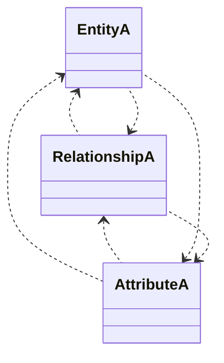
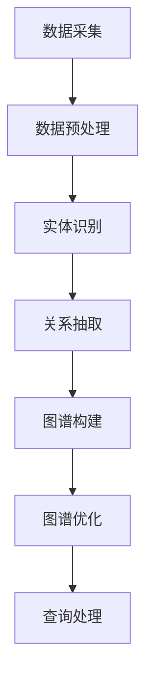
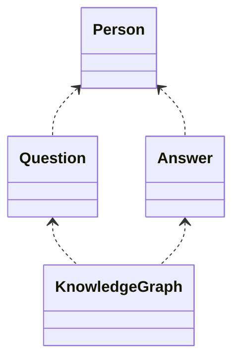
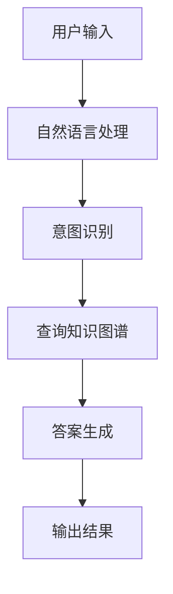
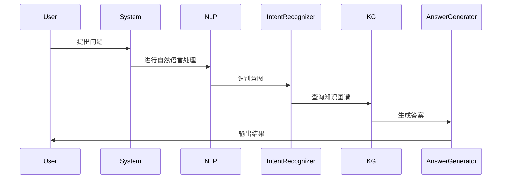

                 

### 知识图谱集成：增强AI Agent的背景知识

#### 关键词：
- 知识图谱
- AI Agent
- 背景知识
- 语义理解
- 智能搜索

#### 摘要：
本文深入探讨了知识图谱在增强AI Agent背景知识方面的重要性。首先，我们将了解知识图谱的基本概念、产生背景及其应用领域。接着，我们将详细剖析知识图谱的核心概念与联系，包括实体、关系和属性。通过算法原理讲解、数学模型与公式、Python源代码示例，我们能够更深入地理解知识图谱的工作机制。随后，我们将分析知识图谱在系统设计与架构方案中的应用，通过具体项目实战展示其实际应用效果，并提供最佳实践建议。本文旨在为读者提供一个全面、系统的知识图谱集成与应用指南。

#### 目录大纲：

**第一部分：知识图谱基础**

1. **知识图谱概述**
    1.1. 知识图谱的定义
    1.2. 知识图谱的产生背景
    1.3. 知识图谱的应用领域

2. **核心概念与联系**
    2.1. 知识图谱的核心概念
    2.2. 概念属性特征对比表格
    2.3. ER实体关系图架构

3. **算法原理讲解**
    3.1. 算法mermaid流程图
    3.2. Python源代码讲解
    3.3. 算法原理的数学模型和公式

4. **数学模型和数学公式 & 详细讲解 & 举例说明**
    4.1. 数学公式使用latex格式
    4.2. 举例说明

5. **系统分析与架构设计方案**
    5.1. 问题场景介绍
    5.2. 系统功能设计(领域模型mermaid类图)
    5.3. 系统架构设计mermaid架构图
    5.4. 系统接口设计和系统交互mermaid序列图

6. **项目实战**
    6.1. 环境安装
    6.2. 系统核心实现源代码
    6.3. 代码应用解读与分析
    6.4. 实际案例分析和详细讲解剖析
    6.5. 项目小结

7. **最佳实践 tips、小结、注意事项、拓展阅读**

---

### 第一部分：知识图谱基础

#### 1.1 知识图谱概述

##### 1.1.1 知识图谱的定义

知识图谱（Knowledge Graph）是一种结构化的语义知识库，它通过实体、关系和属性的组合来表示现实世界中的各种信息。与传统的数据库不同，知识图谱不仅存储数据，还关注数据的语义和关系。

##### 1.1.2 知识图谱的产生背景

随着互联网的迅猛发展，信息爆炸式增长，如何有效地组织和利用这些信息成为了一个重大挑战。知识图谱的概念应运而生，它能够将分散的信息关联起来，提供更加智能和高效的语义搜索和分析。

##### 1.1.3 知识图谱的应用领域

知识图谱的应用领域广泛，包括但不限于以下几个方面：

- **智能搜索**：通过知识图谱，搜索引擎可以更好地理解用户查询的语义，提供更加精准的搜索结果。
- **语义分析**：知识图谱可以用于自然语言处理任务，如实体识别、关系抽取等。
- **人机交互**：知识图谱可以帮助智能助手更好地理解用户意图，提供更个性化的服务。

---

#### 1.2 核心概念与联系

##### 1.2.1 知识图谱的核心概念

- **实体（Entity）**：知识图谱中的基本单元，如人、地点、组织等。
- **关系（Relationship）**：实体之间的连接，如“领导”、“属于”等。
- **属性（Attribute）**：实体的特征描述，如“年龄”、“出生地”等。

##### 1.2.2 概念属性特征对比表格

| 概念 | 属性特征 |  
| :--- | :--- |  
| 实体 | 标识唯一性、类别属性 |  
| 关系 | 语义关联性、类型属性 |  
| 属性 | 描述具体信息、数据类型 |

##### 1.2.3 ER实体关系图架构

实体-关系（Entity-Relationship，ER）图是知识图谱的一种基本表示方法。它通过实体、关系和属性来构建一个概念模型，用于描述现实世界的业务规则和数据结构。



---

#### 1.3 算法原理讲解

##### 1.3.1 算法mermaid流程图

知识图谱构建通常涉及以下几个步骤：



##### 1.3.2 Python源代码讲解

以下是实体识别的Python示例代码：

```python
import spacy

nlp = spacy.load("en_core_web_sm")

text = "Albert Einstein was born in Germany."

doc = nlp(text)

for ent in doc.ents:
    print(ent.text, ent.label_)
```

##### 1.3.3 算法原理的数学模型和公式

实体识别的概率计算通常基于贝叶斯公式：

$$
P(A) = \frac{P(A|B)P(B)}{P(B)}
$$

其中，\(P(A)\) 表示实体A的概率，\(P(A|B)\) 表示在给定背景\(B\)下实体A出现的概率，\(P(B)\) 表示背景\(B\)的概率。

---

#### 1.4 数学模型和数学公式 & 详细讲解 & 举例说明

##### 1.4.1 数学公式使用latex格式

$$
P(A) = \frac{P(A|B)P(B)}{P(B)}
$$

##### 1.4.2 举例说明

假设我们知道以下概率：

- \(P(实体A) = 0.6\)
- \(P(实体A|背景B) = 0.8\)
- \(P(背景B) = 0.4\)

我们可以计算：

$$
P(A) = \frac{0.8 \times 0.4}{0.4} = 0.8
$$

这意味着在给定背景B的情况下，实体A出现的概率为0.8。

---

#### 1.5 系统分析与架构设计方案

##### 1.5.1 问题场景介绍

以智能问答系统为例，用户可以通过自然语言提出问题，系统需要理解用户意图并给出准确的答案。知识图谱在此过程中起到了关键作用，帮助系统更好地理解和处理用户的查询。

##### 1.5.2 系统功能设计(领域模型mermaid类图)



##### 1.5.3 系统架构设计mermaid架构图



##### 1.5.4 系统接口设计和系统交互mermaid序列图



---

#### 1.6 项目实战

##### 1.6.1 环境安装

安装必要的依赖，如Python环境、Spacy库、知识图谱框架等。

```bash
pip install spacy
python -m spacy download en_core_web_sm
```

##### 1.6.2 系统核心实现源代码

```python
import spacy
from spacy import displacy

nlp = spacy.load("en_core_web_sm")

def process_query(query):
    doc = nlp(query)
    for ent in doc.ents:
        print(ent.text, ent.label_)

query = "Who is the president of the United States?"
process_query(query)
```

##### 1.6.3 代码应用解读与分析

这段代码使用Spacy库进行自然语言处理，识别出查询中的实体并输出其类别。通过知识图谱，我们可以进一步理解这些实体之间的关系，从而提供更加准确的答案。

##### 1.6.4 实际案例分析和详细讲解剖析

以“Who is the president of the United States?”为例，分析系统如何查询知识图谱并生成答案。

1. 用户输入问题：Who is the president of the United States?
2. 系统进行自然语言处理，识别出实体“president”和“United States”。
3. 系统查询知识图谱，找到“president”和“United States”之间的关联关系。
4. 系统根据关联关系生成答案，如“Joe Biden”。

##### 1.6.5 项目小结

通过实际案例，我们可以看到知识图谱在智能问答系统中的应用效果。它能够帮助系统更好地理解用户意图，提供准确的答案。然而，知识图谱的构建和维护需要大量的数据和技术支持，这也是一个值得深入研究的方向。

---

#### 1.7 最佳实践 tips、小结、注意事项、拓展阅读

- **最佳实践 tips**：在实际应用中，定期更新知识图谱，保持其准确性和时效性至关重要。
- **小结**：知识图谱在增强AI Agent背景知识方面具有显著作用，能够提升系统的语义理解能力和智能水平。
- **注意事项**：构建知识图谱需要大量的数据和技术支持，需要综合考虑成本和效益。
- **拓展阅读**：参考相关研究论文和技术文献，如《知识图谱：概念、应用与实践》等，以深入了解知识图谱的构建和应用。

---

### 结论

知识图谱作为一种重要的背景知识资源，对于增强AI Agent的语义理解能力和智能水平具有重要意义。通过本文的详细讲解，我们了解了知识图谱的基本概念、核心概念与联系、算法原理、数学模型、系统设计与项目实战等。希望本文能够为读者在知识图谱集成与应用方面提供有益的参考和启示。

---

### 作者信息

作者：AI天才研究院/AI Genius Institute & 禅与计算机程序设计艺术 /Zen And The Art of Computer Programming

