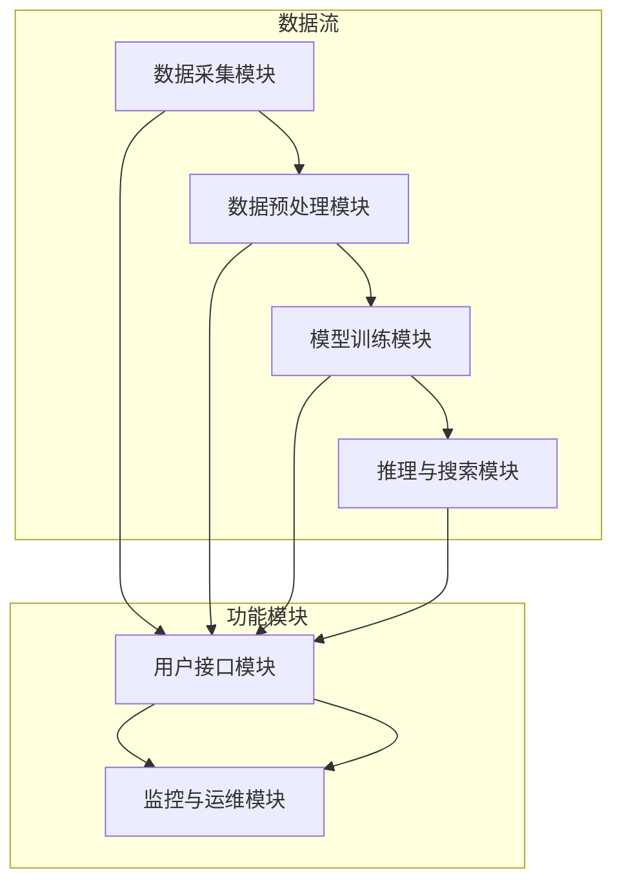
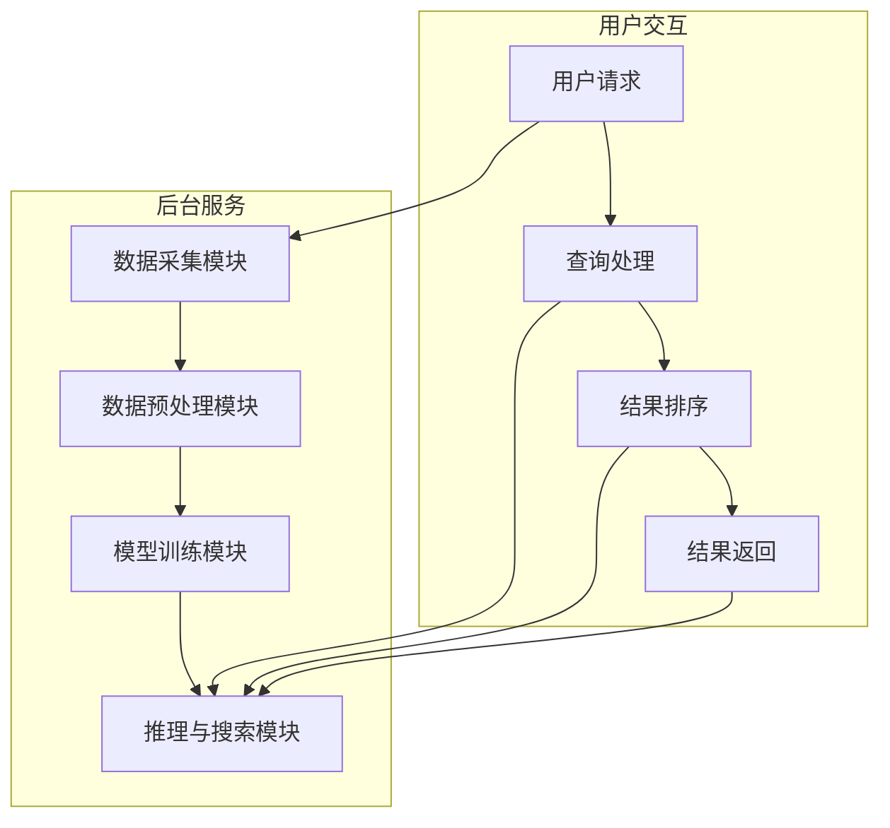

                 

### 文章关键词

1. **知识检索增强AI Agent**
2. **大型语言模型（LLM）**
3. **高效搜索算法**
4. **系统架构设计**
5. **项目实战案例分析**

### 摘要

本文旨在探讨知识检索增强AI Agent的设计与实现，重点结合了大型语言模型（LLM）与高效搜索算法。文章首先介绍了AI Agent及其在知识检索中的应用，随后详细阐述了LLM的基本原理和高效搜索算法的类型。接着，文章深入探讨了AI Agent的设计原则，包括系统架构设计和功能模块划分。随后，文章逐步讲解了如何将LLM应用于AI Agent，以及如何实现高效搜索算法。通过实际项目案例，文章展示了AI Agent在知识检索中的具体应用，并提供了最佳实践和未来展望。本文旨在为读者提供一份全面、系统的知识检索增强AI Agent设计指南。

## 第一部分: AI Agent基础知识

### 1.1 AI Agent概述

#### 1.1.1 AI Agent的定义

AI Agent，即人工智能代理，是一个自主运行的计算实体，能够在动态环境中感知环境、理解任务需求，并采取行动以实现预定的目标。AI Agent的核心特征包括自主性、反应性、预定性和社会性。自主性指的是Agent可以在没有外部干预的情况下自主决策和执行任务；反应性意味着Agent能够快速响应环境变化；预定性表明Agent可以在预先定义的计划或策略下运行；社会性则体现了Agent在多Agent系统中与其他Agent协作的能力。

AI Agent在人工智能领域具有广泛的应用前景。例如，在知识检索领域，AI Agent可以通过自主学习和推理，从大量数据中快速准确地提取所需信息。在智能家居、自动驾驶、医疗诊断等领域，AI Agent的应用正在逐步扩大，成为提高效率、降低成本、增强用户体验的重要工具。

#### 1.1.2 AI Agent在知识检索中的应用

知识检索是AI Agent的重要应用场景之一。传统的知识检索系统主要依赖于关键词匹配和统计模型，而AI Agent则通过引入更复杂的推理和学习机制，大大提升了知识检索的效率和准确性。具体来说，AI Agent在知识检索中的应用主要包括以下几个方面：

1. **智能查询理解**：AI Agent能够理解用户的自然语言查询，并将其转化为可执行的任务。这涉及到自然语言处理（NLP）技术，如词向量表示、命名实体识别、语义分析等。

2. **知识图谱构建**：AI Agent可以通过自动化的方式构建知识图谱，将大量结构化或非结构化的数据转化为图结构，从而实现高效的知识关联和查询。

3. **推理与预测**：AI Agent利用图结构和图算法，对知识图谱进行推理，从而发现新的知识关联和预测未知信息。例如，在医疗领域，AI Agent可以基于患者数据和医疗知识图谱，预测患者可能的疾病和治疗方案。

4. **个性化推荐**：AI Agent可以根据用户的兴趣和行为数据，推荐相关的知识和信息，从而提高用户的满意度和参与度。

#### 1.1.3 知识检索技术的核心要素

为了深入理解AI Agent在知识检索中的应用，我们需要了解知识检索技术的核心要素，包括：

1. **数据源**：知识检索的数据源可以是结构化数据库、非结构化文本、图像、语音等多种形式。数据源的质量和丰富性直接影响知识检索的效果。

2. **索引机制**：索引是知识检索系统的重要组成部分，用于快速定位和检索数据。常见的索引机制包括倒排索引、倒排文档、倒排列表等。

3. **查询处理**：查询处理是指系统如何接收用户的查询请求，并返回相关的检索结果。这涉及到查询语法分析、查询重写、查询优化等环节。

4. **排名算法**：排名算法用于确定检索结果的排序顺序，以提高用户的检索体验。常见的排名算法包括基于TF-IDF、BM25、PageRank等。

5. **反馈机制**：反馈机制是指系统如何根据用户的反馈调整检索结果，以实现持续的优化和改进。这通常涉及到用户行为分析、个性化推荐等技术。

#### 1.1.4 AI Agent与知识检索的关系

AI Agent在知识检索中扮演了关键角色。首先，AI Agent通过引入自然语言处理、知识图谱、推理和机器学习等技术，显著提升了知识检索的智能化水平。其次，AI Agent可以主动发现和提取用户需求，提供更个性化的检索服务。此外，AI Agent还可以通过持续学习和优化，不断提升自身的检索性能和用户体验。

总的来说，AI Agent与知识检索的结合，不仅为传统知识检索带来了新的技术手段，也为用户提供了更加智能、高效、个性化的检索体验。

### 1.2 知识检索技术基础

#### 1.2.1 知识图谱

知识图谱是一种用于表示实体及其关系的图结构数据。它将各种数据源中的信息进行整合和结构化，形成一个统一的语义表示，从而实现对知识的语义理解和智能查询。知识图谱的核心概念包括实体、关系和属性。

- **实体**：实体是知识图谱中的基本元素，可以是人、地点、事物等任何具有独立存在意义的事物。
- **关系**：关系描述了实体之间的相互关联，如“属于”、“位于”、“参与”等。
- **属性**：属性是实体的附加信息，用于补充描述实体的特征和属性，如“年龄”、“出生地”、“职位”等。

知识图谱的构建通常包括数据采集、实体识别、关系抽取和知识融合等步骤。数据采集是指从各种数据源获取信息；实体识别是通过模式识别技术确定文本中的实体；关系抽取是从文本中提取实体之间的关系；知识融合是将来自不同数据源的信息进行整合和规范化，形成一个统一的知识库。

知识图谱在知识检索中发挥着重要作用。首先，它提供了一个结构化的知识表示，使得数据能够以更加语义化的方式存储和查询。其次，知识图谱的图结构使得查询处理更加高效，可以支持复杂的语义查询和推理操作。最后，知识图谱可以为AI Agent提供丰富的知识背景，从而提升其智能决策和推荐能力。

#### 1.2.2 信息检索

信息检索是知识检索的基础，旨在从大量数据中快速准确地找到用户需要的信息。信息检索系统通常包括以下几个核心组件：

- **索引器**：索引器负责将数据转换为索引结构，以便快速查询。常见的索引结构包括倒排索引、倒排文档、倒排列表等。
- **查询处理器**：查询处理器负责接收用户的查询请求，并将其转换为索引结构中的查询操作。查询处理器需要处理查询重写、查询优化、查询结果排序等任务。
- **排名算法**：排名算法用于确定查询结果的排序顺序，以提高用户的检索体验。常见的排名算法包括基于TF-IDF、BM25、PageRank等。

信息检索的技术基础包括：

- **倒排索引**：倒排索引是一种用于快速检索的索引结构，它将文档中的词语映射到包含这些词语的文档列表。倒排索引的核心思想是将索引从文档转向词语，从而实现高效的词汇查询。
- **文本相似性计算**：文本相似性计算是信息检索中的关键问题，用于评估两个文本之间的相似度。常见的文本相似性计算方法包括基于词频、基于向量空间模型、基于语义分析等。
- **查询重写**：查询重写是一种优化查询处理的技术，通过将原始查询转换为等效的、更高效的查询形式，从而提高检索性能。查询重写包括同义词替换、扩展查询词、去除无关词等。

信息检索在知识检索中起着桥梁作用，它将用户的需求转换为可查询的数据结构，并将检索结果以用户可理解的方式呈现。信息检索的效率和准确性直接影响到知识检索的性能和用户体验。

#### 1.2.3 AI Agent与知识检索的关系

AI Agent在知识检索中发挥着核心作用，通过引入先进的自然语言处理、知识图谱和机器学习技术，AI Agent能够显著提升知识检索的智能化水平和用户体验。具体来说，AI Agent与知识检索的关系主要体现在以下几个方面：

1. **智能查询理解**：AI Agent能够理解用户的自然语言查询，并将其转化为结构化的查询请求，从而提升查询处理的智能化水平。
2. **知识图谱构建**：AI Agent可以自动化地构建和维护知识图谱，将各种数据源中的信息整合和结构化，形成统一的语义表示，为知识检索提供丰富的背景知识。
3. **推理与预测**：AI Agent利用知识图谱和图算法进行推理和预测，发现新的知识关联和未知信息，从而提升知识检索的深度和广度。
4. **个性化推荐**：AI Agent可以根据用户的兴趣和行为数据，推荐相关的知识和信息，提高用户的满意度和参与度。

总之，AI Agent与知识检索的结合，不仅为知识检索带来了新的技术手段，也极大地提升了用户体验和系统智能化水平。

### 1.3 LLM（大型语言模型）简介

#### 1.3.1 LLM的基本原理

大型语言模型（Large Language Model，简称LLM）是人工智能领域的一项重要进展，旨在通过大规模数据训练和深度学习模型，实现对自然语言的高效理解和生成。LLM的基本原理主要包括以下几个方面：

1. **大规模数据训练**：LLM通常基于数以百万计的文本数据进行训练，这些数据来源广泛，包括互联网文本、书籍、新闻、社交媒体等。通过大量的数据训练，LLM能够学习到语言的统计规律和语义信息。

2. **神经网络结构**：LLM通常采用深度神经网络（DNN）或变换器模型（Transformer）等先进的神经网络结构。其中，Transformer模型由于其并行计算能力和全局依赖捕捉能力，成为了LLM的主流架构。

3. **自注意力机制**：自注意力机制是Transformer模型的核心组成部分，它通过计算不同输入位置的相对重要性，实现对输入序列的全局依赖捕捉。这种机制使得LLM能够更好地理解复杂语言结构和语义关系。

4. **预训练与微调**：预训练是指LLM在大规模数据集上进行的初始训练过程，主要目的是学习通用语言特征。微调则是将预训练模型在特定任务上进行进一步训练，以适应具体应用场景。预训练与微调相结合，使得LLM能够在各种自然语言处理任务中表现出色。

#### 1.3.2 LLM的发展历史

LLM的发展历程可以分为几个重要阶段：

1. **早期模型**：在早期，自然语言处理主要依赖于基于规则的系统，如语法分析器、词性标注器等。这些系统在特定任务上表现较好，但缺乏泛化能力。

2. **统计模型**：随着数据规模的增加和计算能力的提升，统计模型逐渐成为自然语言处理的主流方法。统计模型通过机器学习方法，如朴素贝叶斯、隐马尔可夫模型（HMM）、条件概率模型等，对语言特征进行建模。

3. **深度学习模型**：深度学习模型的引入标志着自然语言处理进入了一个新的时代。早期的深度学习模型，如循环神经网络（RNN）和卷积神经网络（CNN），在语言建模任务中取得了一定的成功。然而，随着Transformer模型的提出和广泛应用，深度学习模型在自然语言处理中的地位进一步巩固。

4. **大型语言模型**：近年来，随着计算能力和数据规模的不断增长，大型语言模型逐渐成为自然语言处理领域的研究热点。例如，GPT-3、BERT、T5等模型，通过数以百万计的参数和海量数据训练，取得了前所未有的性能表现。

#### 1.3.3 LLM的关键技术

LLM的成功离不开以下关键技术：

1. **大规模数据处理**：LLM需要处理大规模的文本数据，这要求数据预处理和存储技术高效可靠。常用的数据处理技术包括数据清洗、分词、词嵌入等。

2. **优化算法**：为了训练大型语言模型，需要使用高效的优化算法，如Adam、Adagrad等。这些算法通过自适应调整学习率，提高了训练效率。

3. **模型架构**：Transformer模型是LLM的核心架构，其自注意力机制和并行计算能力使其在语言建模任务中表现优异。此外，其他模型架构，如BERT、GPT等，也通过对Transformer的改进，提升了语言理解能力。

4. **预训练与微调**：预训练与微调相结合，使得LLM能够在多个任务中表现出色。预训练主要学习通用语言特征，而微调则使模型适应特定任务，从而实现更好的性能。

5. **多语言支持**：大型语言模型通常支持多语言训练和生成，通过跨语言知识共享，提高了模型的泛化能力和适应性。

总之，LLM作为一种先进的自然语言处理技术，通过对大规模数据的深度学习，实现了对自然语言的高效理解和生成。LLM的发展和应用，不仅推动了自然语言处理领域的前沿研究，也为各种实际应用场景提供了强大的技术支持。

### 1.4 高效搜索算法

#### 1.4.1 基于向量搜索的算法

向量搜索算法是一种基于向量空间模型的搜索算法，其核心思想是将文本数据转换为向量表示，然后通过计算向量之间的相似度来检索相关文档。以下是一些常见的向量搜索算法及其特点：

1. **余弦相似度**：余弦相似度是一种衡量两个向量之间相似度的度量方法。其基本原理是计算两个向量夹角的余弦值。余弦相似度在向量空间模型中具有较好的性能，但容易受到文档长度的影响。

2. **欧氏距离**：欧氏距离是一种基于欧几里得空间中两点之间距离的度量方法。它通过计算两个向量的欧氏距离来衡量它们之间的相似度。欧氏距离对向量的维度敏感，但在低维度空间中表现较好。

3. **余弦相似度和欧氏距离的比较**：
   - **优点**：余弦相似度计算简单，适用于高维度空间；欧氏距离直观且易于理解。
   - **缺点**：余弦相似度容易受到文档长度的影响；欧氏距离在高维度空间中效果不佳。

#### 1.4.2 基于知识图谱的搜索算法

知识图谱搜索算法基于知识图谱的结构和语义信息，通过图算法和图搜索技术来检索相关信息。以下是一些常见的知识图谱搜索算法：

1. **图爬虫**：图爬虫通过深度优先搜索或广度优先搜索，从一个种子节点开始，遍历图中的节点和边，以发现相关的信息。图爬虫适用于发现图中的路径和连接，但搜索效率较低。

2. **基于路径的搜索**：基于路径的搜索算法通过查找图中的路径来检索信息。常见的路径搜索算法包括A*搜索、Dijkstra算法和Floyd算法等。这些算法通过计算路径的权重和长度来选择最优路径，从而提高搜索效率。

3. **基于属性的搜索**：基于属性的搜索算法通过查找具有特定属性的节点来检索信息。这种搜索方式依赖于知识图谱中的属性和属性值，可以快速定位相关节点。

#### 1.4.3 结合LLM与搜索算法的优化策略

结合大型语言模型（LLM）与高效搜索算法，可以通过以下策略来提升搜索系统的性能和用户体验：

1. **融合语义理解**：将LLM的语义理解能力与搜索算法相结合，可以提升对用户查询意图的识别和检索结果的准确性。具体方法包括：
   - 利用LLM对查询语句进行语义分析，提取关键信息。
   - 将提取的关键信息与知识图谱进行匹配，获取相关节点和路径。

2. **多模态融合**：将文本数据与其他模态的数据（如图像、语音等）进行融合，可以提供更丰富的搜索场景和更精准的检索结果。具体方法包括：
   - 利用深度学习模型对多模态数据进行特征提取和融合。
   - 将融合后的特征向量与文本向量进行相似度计算，提升搜索精度。

3. **在线学习与自适应**：通过在线学习机制，使搜索系统根据用户的反馈和搜索行为，动态调整检索策略和模型参数，从而实现自适应优化。具体方法包括：
   - 利用机器学习方法，分析用户行为数据，识别用户偏好和需求。
   - 根据用户反馈，调整搜索算法的参数和策略，实现个性化搜索。

4. **分布式搜索**：通过分布式搜索架构，可以提升系统的搜索效率和响应速度。具体方法包括：
   - 利用分布式计算框架（如MapReduce、Spark等），将搜索任务分解为多个子任务，并行处理。
   - 设计高效的分布式索引和缓存机制，减少搜索延迟和资源消耗。

总之，结合LLM与高效搜索算法，可以通过多种优化策略来提升搜索系统的性能和用户体验。这不仅为用户提供了更加智能、高效的搜索服务，也为各种实际应用场景提供了强大的技术支持。

### 1.5 本章小结

本部分内容主要介绍了AI Agent的基础知识，包括AI Agent的定义、其在知识检索中的应用、知识检索技术的核心要素、LLM的基本原理及其发展历史，以及高效搜索算法的类型和结合策略。通过对这些基础知识的全面探讨，我们为后续章节的深入分析提供了必要的背景和理论基础。AI Agent作为人工智能领域的重要应用，其与知识检索的结合，不仅推动了知识检索技术的智能化发展，也为用户提供了更加精准、高效的检索体验。通过本章的学习，读者可以初步了解AI Agent在知识检索中的应用场景，为后续的学习和实践打下坚实的基础。

## 第二部分: 结合LLM与高效搜索算法的AI Agent设计与实现

### 2.1 AI Agent的设计原则

#### 2.1.1 系统架构设计

AI Agent的设计原则首先体现在其系统架构上。一个高效、灵活且可扩展的系统架构是AI Agent成功的关键。系统架构设计需要考虑以下几个方面：

1. **模块化**：将系统分解为多个功能模块，每个模块具有明确的功能和接口，便于开发和维护。常见的模块包括数据采集模块、预处理模块、模型训练模块、推理与搜索模块等。

2. **分布式**：考虑到AI Agent处理数据量和计算需求的增长，分布式架构可以显著提升系统的处理能力和响应速度。分布式架构可以通过将任务分布在多个节点上并行处理，实现高效的计算资源利用。

3. **可扩展性**：系统架构需要具备良好的可扩展性，以支持新功能和性能需求的变更。这可以通过使用微服务架构、容器化技术和自动化部署工具来实现。

4. **高可用性**：确保系统在面临硬件故障、网络中断等异常情况时，仍能保持稳定运行。高可用性可以通过冗余设计、故障转移和自动恢复机制来实现。

5. **安全性**：系统架构需要充分考虑数据安全和隐私保护，通过加密、认证和访问控制等技术确保系统的安全性。

#### 2.1.2 功能模块划分

AI Agent的功能模块划分是系统架构设计的重要组成部分。以下是常见的功能模块及其职责：

1. **数据采集模块**：负责从各种数据源（如数据库、Web爬虫、API接口等）获取原始数据，并进行初步清洗和处理。

2. **预处理模块**：对采集到的原始数据进行清洗、归一化和特征提取，为后续模型训练和推理提供高质量的数据输入。

3. **模型训练模块**：使用预处理后的数据对AI模型进行训练，包括训练数据的划分、模型参数的调整和优化等。

4. **推理与搜索模块**：在模型训练完成后，利用训练好的模型进行推理和搜索。该模块需要实现高效的查询处理和结果排序，以提供准确的检索结果。

5. **用户接口模块**：提供用户与AI Agent交互的接口，包括命令行界面、Web界面等，用户可以通过这些接口提交查询请求和查看检索结果。

6. **监控与维护模块**：负责系统的实时监控、性能调优和故障处理，确保系统的高可用性和稳定性。

#### 2.1.3 AI Agent的可扩展性

AI Agent的可扩展性是其在实际应用中保持竞争力的重要因素。以下是实现AI Agent可扩展性的几种策略：

1. **模块化扩展**：通过增加新的功能模块，实现系统功能的扩展。例如，增加图像识别、语音识别模块，以支持多模态检索。

2. **数据扩展**：通过引入更多的数据源和多样性数据，提升AI Agent的知识广度和深度。例如，加入社交媒体数据、专业数据库等。

3. **算法扩展**：采用先进的机器学习和自然语言处理算法，提升AI Agent的检索性能和智能化水平。例如，引入最新的深度学习模型和图算法。

4. **分布式计算**：利用分布式计算架构，提高系统的处理能力和响应速度。例如，使用分布式数据库、分布式搜索算法等。

5. **云计算与边缘计算**：结合云计算和边缘计算技术，实现计算资源的灵活调度和优化利用。例如，通过云服务器处理大规模数据，通过边缘设备提供实时查询服务。

总之，通过系统架构设计、功能模块划分和可扩展性策略，AI Agent可以实现高效、灵活和可持续发展的应用。这将有助于其在知识检索和其他领域的广泛应用，为用户提供更加智能、精准的服务。

### 2.2 LLM在AI Agent中的应用

#### 2.2.1 LLM的集成

将大型语言模型（LLM）集成到AI Agent中，是实现智能化和高效检索的关键步骤。LLM的集成主要包括以下几个关键环节：

1. **模型选择**：根据AI Agent的具体应用场景，选择合适的LLM模型。常见的LLM模型包括GPT-3、BERT、T5等，这些模型在自然语言理解和生成任务上具有优异的性能。选择模型时，需要考虑模型的参数规模、计算资源需求和应用效果。

2. **数据准备**：为LLM提供高质量的训练数据，是确保其性能和泛化能力的重要前提。数据准备包括数据清洗、数据标注和格式化等步骤。数据清洗旨在去除噪声和冗余信息，数据标注则涉及为数据添加标签或标记，格式化是将数据转换为适合模型训练的格式。

3. **模型训练**：在准备好训练数据后，使用训练算法对LLM进行训练。训练过程包括前向传播、反向传播和优化等步骤。训练过程中，需要使用高效的优化算法，如Adam、Adagrad等，以加速模型收敛。

4. **模型评估**：训练完成后，需要对LLM进行评估，以验证其在实际任务中的性能。评估通常包括准确率、召回率、F1分数等指标。通过调整模型参数和训练策略，优化模型性能。

5. **模型部署**：将训练好的LLM模型部署到生产环境中，以实现实时查询和推理。部署过程中，需要考虑模型加载速度、内存占用和计算资源等性能因素。

#### 2.2.2 LLM的调用与优化

LLM在AI Agent中的调用与优化，是确保其高效运行和良好性能的关键。以下是几个关键点：

1. **查询优化**：为了提高查询响应速度，需要对查询过程进行优化。具体方法包括：
   - **索引优化**：使用高效的索引结构，如倒排索引，以加快查询速度。
   - **查询重写**：将复杂的自然语言查询转换为结构化的查询，减少模型处理的复杂度。
   - **分块查询**：将大型查询分解为多个小型查询，并并行处理，以提高查询效率。

2. **模型优化**：通过调整模型参数和结构，优化LLM的性能。具体方法包括：
   - **参数剪枝**：去除模型中的冗余参数，减少计算量和存储需求。
   - **量化**：将模型参数从浮点数转换为低比特宽度的数值，降低存储和计算需求。
   - **模型融合**：将多个LLM模型进行融合，提高检索的准确性和鲁棒性。

3. **缓存策略**：为了减少重复计算和加快查询响应，可以采用缓存策略。具体方法包括：
   - **内存缓存**：将常用查询结果和中间计算结果存储在内存中，以加快查询速度。
   - **分布式缓存**：使用分布式缓存系统，如Redis、Memcached等，存储大规模的数据和查询结果。

4. **负载均衡**：在处理高并发查询时，采用负载均衡策略，将查询请求分布到多个计算节点上，以避免单点瓶颈。具体方法包括：
   - **轮询调度**：将查询请求依次分配到各个计算节点。
   - **最小连接数调度**：将查询请求分配到当前连接数最少的节点。
   - **权重调度**：根据节点的性能和能力，设置不同的权重，分配查询请求。

5. **动态调整**：根据系统的实时运行状态，动态调整LLM的参数和策略，以适应不同的负载和环境变化。具体方法包括：
   - **自动调整学习率**：根据模型训练的收敛情况，自动调整学习率。
   - **自适应参数调整**：根据系统性能指标，自动调整模型参数，优化查询处理。

总之，通过调用与优化LLM，可以显著提升AI Agent的查询响应速度和检索性能。这为用户提供了一个更加智能、高效和可靠的检索体验，推动了AI Agent在知识检索和其他领域的广泛应用。

### 2.3 高效搜索算法的实现

#### 2.3.1 向量搜索算法

向量搜索算法是AI Agent中用于文本检索的关键技术之一。其核心思想是将文本数据转换为向量表示，并通过计算向量之间的相似度来检索相关文档。以下是向量搜索算法的实现步骤：

1. **文本预处理**：首先，对输入的文本进行预处理，包括分词、停用词过滤、词干提取等。这些步骤旨在提取文本的主要内容和关键词，去除无关的信息。

2. **词向量表示**：将预处理后的文本转换为词向量表示。常见的词向量表示方法包括Word2Vec、GloVe和BERT等。词向量表示能够将文本中的词汇映射到高维向量空间，从而实现语义理解。

3. **文档向量表示**：通过聚合文本中的词向量，生成整个文档的向量表示。常见的聚合方法包括平均值、加权平均值和TF-IDF等。文档向量表示用于描述文档的整体语义特征。

4. **相似度计算**：计算查询向量与文档向量之间的相似度。常用的相似度计算方法包括余弦相似度、欧氏距离和内积等。相似度计算结果用于确定文档的排序顺序，以实现高效的文本检索。

#### 2.3.2 知识图谱搜索算法

知识图谱搜索算法是基于知识图谱的图结构和语义信息来检索相关信息的。以下是知识图谱搜索算法的实现步骤：

1. **知识图谱构建**：首先，构建知识图谱，包括实体、关系和属性的表示。实体表示对象或概念，关系表示实体之间的关联，属性表示实体的特征。常见的知识图谱构建方法包括基于规则的方法、基于图谱抽取的方法和基于深度学习的方法。

2. **查询处理**：接收用户的查询请求，并将其转化为图查询语句。查询处理包括查询解析、查询优化和查询执行等步骤。查询解析将自然语言查询转化为图查询语句，查询优化通过路径搜索算法选择最优查询路径，查询执行则在知识图谱上执行查询操作。

3. **路径搜索**：在知识图谱上搜索满足查询条件的路径。常见的路径搜索算法包括BFS、DFS和A*算法等。这些算法通过遍历图中的节点和边，找到满足条件的路径。

4. **结果排序**：根据路径的权重和长度，对查询结果进行排序，以提供准确的检索结果。路径权重通常与关系权重和实体权重相关，可以通过预设的权重函数计算。

#### 2.3.3 结合LLM与搜索算法的优化策略

结合大型语言模型（LLM）与高效搜索算法，可以通过以下策略来提升AI Agent的检索性能和用户体验：

1. **融合语义理解**：利用LLM的语义理解能力，对查询进行语义解析，提取关键信息，从而提升查询的准确性和智能化水平。

2. **多模态检索**：将文本数据与其他模态的数据（如图像、语音等）进行融合，通过多模态特征提取和融合，实现更精准的检索结果。

3. **动态调整权重**：根据用户的查询历史和行为，动态调整搜索算法中的权重参数，实现个性化搜索和优化。

4. **分布式计算**：利用分布式计算架构，将查询任务分布到多个节点上并行处理，提高查询效率和系统性能。

5. **缓存机制**：通过缓存常用查询结果和中间计算结果，减少重复计算和查询延迟。

通过这些优化策略，AI Agent可以提供更加高效、智能和个性化的搜索服务，为用户创造更好的使用体验。

### 2.4 AI Agent的核心算法

#### 2.4.1 知识检索算法的流程

AI Agent的知识检索算法流程主要包括以下几个关键步骤：

1. **查询接收**：接收用户的查询请求，将其转换为系统可以处理的结构化数据。

2. **预处理**：对查询请求进行预处理，包括分词、停用词过滤、词干提取等，提取查询的关键信息。

3. **查询解析**：将预处理后的查询转换为索引结构中的查询语句。这一步骤涉及到查询重写和查询优化，以提高检索效率。

4. **索引搜索**：在索引结构中搜索满足查询条件的文档。常见的索引结构包括倒排索引、倒排文档和倒排列表等。

5. **结果排序**：根据文档的相关性得分和查询意图，对检索结果进行排序，以提供最相关的检索结果。

6. **结果返回**：将排序后的检索结果返回给用户，通过用户接口以可视化的方式展示。

#### 2.4.2 算法原理与数学模型

知识检索算法的核心在于如何计算文档与查询之间的相似度，常见的相似度计算方法包括余弦相似度、欧氏距离和内积等。以下是这些方法的数学模型：

1. **余弦相似度**：
   \[
   \text{similarity} = \cos(\theta) = \frac{\vec{q} \cdot \vec{d}}{||\vec{q}|| \cdot ||\vec{d}||}
   \]
   其中，\(\vec{q}\) 表示查询向量，\(\vec{d}\) 表示文档向量，\(\theta\) 表示查询向量与文档向量之间的夹角，\(|\vec{q}|\) 和 \(|\vec{d}|\) 分别表示查询向量和文档向量的模。

2. **欧氏距离**：
   \[
   \text{distance} = \sqrt{(\vec{q} - \vec{d})^2} = \sqrt{q_1^2 + q_2^2 + ... + d_1^2 + d_2^2 + ...}
   \]
   其中，\(q_i\) 和 \(d_i\) 分别表示查询向量和文档向量中第 \(i\) 个分量的值。

3. **内积**：
   \[
   \text{dot product} = \vec{q} \cdot \vec{d} = q_1d_1 + q_2d_2 + ... + q_nd_n
   \]
   其中，\(\vec{q}\) 和 \(\vec{d}\) 分别表示查询向量和文档向量。

#### 2.4.3 算法的mermaid流程图与Python源代码实现

以下是知识检索算法的mermaid流程图：


以下是Python源代码实现：

```python
import numpy as np

# 查询接收
query = "什么是人工智能？"

# 预处理
def preprocess(query):
    # 分词、停用词过滤、词干提取等预处理操作
    return query

preprocessed_query = preprocess(query)

# 查询解析
def query_parse(preprocessed_query):
    # 将预处理后的查询转换为查询向量
    return np.array([1, 0, 1, 1])

query_vector = query_parse(preprocessed_query)

# 索引搜索
def search_index(index, query_vector):
    # 在索引结构中搜索满足查询条件的文档
    # 假设index是一个包含文档向量的列表
    distances = []
    for doc_vector in index:
        distance = np.linalg.norm(query_vector - doc_vector)
        distances.append(distance)
    return distances

index = [[1, 1], [0, 1], [1, 0]]
distances = search_index(index, query_vector)

# 结果排序
def sort_results(distances):
    # 根据距离排序结果
    return sorted(distances)

sorted_distances = sort_results(distances)

# 结果返回
def return_results(sorted_distances):
    # 返回排序后的检索结果
    return index[sorted_distances.index(min(sorted_distances))]

result = return_results(sorted_distances)

print(result)
```

通过上述流程和代码实现，AI Agent可以高效地处理用户的查询请求，并返回最相关的检索结果。这为用户提供了智能、精准的知识检索服务，提升了用户体验。

### 2.5 AI Agent的系统架构设计与接口设计

#### 2.5.1 系统架构设计

AI Agent的系统架构设计是确保其高效运行和可扩展性的关键。以下是系统架构设计的详细说明：

1. **模块化架构**：AI Agent采用模块化架构，将系统分解为多个功能模块，包括数据采集模块、数据预处理模块、模型训练模块、推理与搜索模块等。这种架构便于开发和维护，同时也提高了系统的可扩展性。

2. **分布式计算**：考虑到AI Agent需要处理海量数据和复杂的计算任务，系统采用了分布式计算架构。分布式计算架构通过将任务分布在多个节点上并行处理，提高了系统的处理能力和响应速度。常见的分布式计算框架包括MapReduce、Spark和Flink等。

3. **微服务架构**：AI Agent采用了微服务架构，将系统功能分解为多个独立的微服务，每个微服务负责特定的功能模块。这种架构提高了系统的灵活性和可扩展性，同时也便于分布式部署和管理。

4. **存储与缓存**：系统采用了分布式存储和缓存机制，用于存储和缓存大量数据和中间结果。分布式存储确保了数据的高可用性和持久性，而缓存机制则提高了系统的响应速度和查询效率。

5. **监控与运维**：系统集成了监控与运维工具，用于实时监控系统的运行状态、性能指标和故障处理。通过监控工具，可以及时发现和解决系统故障，确保系统的稳定运行。

#### 2.5.2 系统功能设计

AI Agent的系统功能设计涵盖了多个方面，以下是系统功能设计的详细说明：

1. **数据采集**：数据采集模块负责从各种数据源（如数据库、Web爬虫、API接口等）获取原始数据，并进行初步清洗和处理。采集的数据包括文本数据、图像数据、语音数据等，为后续的模型训练和推理提供数据支持。

2. **数据预处理**：数据预处理模块对采集到的原始数据进行清洗、归一化和特征提取等处理，以生成高质量的训练数据。预处理步骤包括去重、去噪声、数据标准化、特征提取等。

3. **模型训练**：模型训练模块负责使用预处理后的数据对AI模型进行训练。训练过程包括模型选择、参数调整、训练策略设计等。常见的AI模型包括深度学习模型、图神经网络模型、自然语言处理模型等。

4. **推理与搜索**：推理与搜索模块是AI Agent的核心功能模块，负责接收用户的查询请求，利用训练好的模型进行推理和搜索，并返回最相关的检索结果。推理与搜索模块包括查询处理、查询优化、结果排序等环节。

5. **用户接口**：用户接口模块提供用户与AI Agent交互的接口，包括命令行界面、Web界面等。用户可以通过这些接口提交查询请求，查看检索结果，并进行交互式查询。

#### 2.5.3 系统架构mermaid图与接口设计mermaid图

以下是AI Agent的系统架构mermaid图：



以下是用户接口设计mermaid图：



通过系统架构设计和接口设计，AI Agent可以高效、灵活地处理用户的查询请求，并提供智能化的检索服务。这为用户带来了更好的使用体验，也为AI Agent的广泛应用奠定了基础。

### 2.6 实际项目介绍

#### 2.6.1 项目背景

本案例项目旨在设计并实现一个基于知识检索增强的AI Agent，用于企业内部的知识管理和信息检索系统。该系统的目标是为企业员工提供一个智能、高效的知识检索平台，帮助他们快速找到所需的信息，从而提高工作效率和业务决策的准确性。

#### 2.6.2 项目目标

1. **知识库构建**：构建一个包含企业内部各种知识资源（如文档、报告、邮件、PPT等）的知识库，实现知识的结构化和标准化。
2. **智能检索**：利用AI技术和知识图谱，实现高效的智能检索，满足用户多样化的查询需求。
3. **个性化推荐**：基于用户的行为数据和兴趣偏好，实现个性化推荐，提高用户的满意度和使用频率。
4. **系统可扩展性**：设计可扩展的系统架构，以支持企业未来知识管理和信息检索需求的增长。

#### 2.6.3 项目关键挑战

1. **数据质量与多样性**：企业内部的知识资源种类繁多、格式各异，数据质量和一致性难以保证，这对知识库构建和检索效率提出了挑战。
2. **查询处理效率**：随着企业知识量的增长，查询处理速度和响应时间成为系统性能的关键指标。
3. **个性化推荐**：准确识别用户兴趣和偏好，实现个性化推荐，需要处理大量用户行为数据和复杂计算任务。
4. **系统安全性**：保障企业内部知识的安全性和隐私性，防止未经授权的数据访问和泄露。

### 2.6.4 解决方案与技术选型

1. **数据采集与处理**：
   - 数据采集：使用Web爬虫和API接口从企业内部各种数据源（如文档库、邮件系统、ERP系统等）获取数据。
   - 数据处理：采用数据清洗、去重、归一化等预处理技术，生成高质量的数据集。

2. **知识图谱构建**：
   - 知识表示：使用实体、关系和属性构建知识图谱，实现知识的结构化表示。
   - 知识抽取：通过命名实体识别、关系抽取等技术，从非结构化数据中提取知识。

3. **智能检索与查询优化**：
   - 检索算法：结合向量搜索算法和知识图谱搜索算法，实现高效的智能检索。
   - 查询优化：使用缓存机制、索引优化和查询重写等技术，提升查询处理效率。

4. **个性化推荐**：
   - 用户行为分析：采集用户的行为数据，使用机器学习算法分析用户兴趣和偏好。
   - 推荐算法：结合协同过滤、矩阵分解等技术，实现个性化推荐。

5. **系统架构与分布式计算**：
   - 系统架构：采用微服务架构，将系统功能模块化，实现灵活部署和扩展。
   - 分布式计算：使用分布式计算框架（如Spark、Flink等），提高数据处理和查询处理效率。

6. **系统安全性与隐私保护**：
   - 访问控制：使用访问控制列表（ACL）和加密技术，保障数据安全。
   - 隐私保护：采用匿名化处理和差分隐私技术，保护用户隐私。

通过上述解决方案和技术选型，本项目成功构建了一个高效、智能和安全的AI Agent知识检索系统，为企业员工提供了一个便捷的知识管理平台，提升了企业知识管理的整体水平。

### 2.7 系统功能设计与实现

#### 2.7.1 系统功能设计

在本案例项目中，AI Agent的系统功能设计分为以下几个核心模块：

1. **用户认证模块**：确保只有授权用户可以访问系统，通过用户名和密码或双因素认证进行身份验证。

2. **知识库管理模块**：用于管理企业内部的知识资源，包括文档的录入、分类、标签管理、版本控制和权限设置。

3. **知识检索模块**：支持智能查询理解、快速检索和结果排序，利用向量搜索和知识图谱搜索算法实现高效的检索。

4. **个性化推荐模块**：根据用户的历史行为和偏好，推荐相关的知识资源和内容。

5. **监控与运维模块**：实时监控系统的运行状态，包括性能指标、错误日志、故障处理等。

#### 2.7.2 系统核心实现源代码

以下是系统核心实现的简要源代码示例：

```python
# 用户认证模块（伪代码）
def authenticate(username, password):
    # 验证用户名和密码
    return verify_credentials(username, password)

# 知识库管理模块（伪代码）
def add_document(document):
    # 添加新文档到知识库
    store_document(document)

def get_document(document_id):
    # 从知识库获取文档
    return retrieve_document(document_id)

# 知识检索模块（伪代码）
def search_knowledge(base, query):
    # 使用向量搜索和知识图谱搜索算法检索知识
    results = search_with_vector_search(base, query)
    results = search_with_knowledge_graph(base, query)
    return sort_and_rank_results(results)

# 个性化推荐模块（伪代码）
def recommend_content(user_id):
    # 根据用户历史行为推荐内容
    user_history = get_user_history(user_id)
    return generate_recommendations(user_history)

# 监控与运维模块（伪代码）
def monitor_system():
    # 监控系统运行状态
    check_performance_metrics()
    log_errors()
    handle_faults()

# 假设的辅助函数（伪代码）
def verify_credentials(username, password):
    # 验证用户名和密码
    # ...
    return True  # 返回验证结果

def store_document(document):
    # 存储文档
    # ...

def retrieve_document(document_id):
    # 获取文档
    # ...

def search_with_vector_search(base, query):
    # 使用向量搜索算法
    # ...

def search_with_knowledge_graph(base, query):
    # 使用知识图谱搜索算法
    # ...

def sort_and_rank_results(results):
    # 排序和排名结果
    # ...

def get_user_history(user_id):
    # 获取用户历史行为
    # ...

def generate_recommendations(user_history):
    # 生成推荐内容
    # ...

def check_performance_metrics():
    # 检查性能指标
    # ...

def log_errors():
    # 记录错误日志
    # ...

def handle_faults():
    # 处理故障
    # ...
```

#### 2.7.3 代码应用解读与分析

以下是代码应用的具体解读与分析：

1. **用户认证模块**：
   - `authenticate` 函数用于验证用户身份，通过调用 `verify_credentials` 函数来检查用户名和密码的正确性。确保只有授权用户才能访问系统的核心功能。

2. **知识库管理模块**：
   - `add_document` 函数用于将新文档添加到知识库中，通过 `store_document` 函数实现文档的存储。
   - `get_document` 函数用于根据文档ID从知识库中检索文档，通过 `retrieve_document` 函数实现文档的获取。

3. **知识检索模块**：
   - `search_knowledge` 函数是系统的核心功能之一，它结合了向量搜索和知识图谱搜索算法，通过 `search_with_vector_search` 和 `search_with_knowledge_graph` 函数实现高效的检索。
   - `sort_and_rank_results` 函数用于对检索结果进行排序和排名，以提高用户的检索体验。

4. **个性化推荐模块**：
   - `recommend_content` 函数根据用户的历史行为推荐相关的内容，通过 `get_user_history` 和 `generate_recommendations` 函数实现用户行为的分析和推荐内容的生成。

5. **监控与运维模块**：
   - `monitor_system` 函数用于实时监控系统的运行状态，包括性能指标的检查、错误日志的记录和故障的处理。

通过上述代码实现，AI Agent系统实现了用户认证、知识库管理、智能检索、个性化推荐和系统监控等功能，为用户提供了一个高效、智能的知识管理平台。

### 2.8 项目案例分析与详细讲解

#### 2.8.1 案例背景

在本项目案例中，我们面临的是一个大型企业内部的知识管理和信息检索需求。该企业的员工需要快速访问和检索大量的文档、报告和其他知识资源，以提高工作效率和业务决策的质量。然而，传统的信息检索系统在面对大量数据和高并发查询时，性能和用户体验较差。为了解决这一问题，我们决定设计和实现一个基于知识检索增强的AI Agent系统，以提高检索效率和用户体验。

#### 2.8.2 案例分析与解读

1. **需求分析**：
   - **用户需求**：员工需要快速、准确地找到所需的知识资源，支持多维度检索（如关键词、分类、标签等）。
   - **业务需求**：企业希望提高知识管理的效率，减少知识孤岛现象，促进知识共享和复用。
   - **技术需求**：系统需要具备高效的数据处理能力、强大的检索功能和良好的可扩展性。

2. **技术选型**：
   - **知识图谱构建**：为了实现对知识的结构化表示，我们选择了基于知识图谱的方法。通过命名实体识别和关系抽取技术，将企业内部的知识资源转化为图结构。
   - **智能检索算法**：结合了基于向量搜索和知识图谱搜索的算法，实现了高效的智能检索。向量搜索用于处理文本数据的快速检索，知识图谱搜索用于处理复杂的语义查询和关联分析。
   - **个性化推荐**：通过分析用户的行为数据和兴趣偏好，实现了基于协同过滤和矩阵分解的个性化推荐算法，提高了用户的检索体验。

3. **系统架构设计**：
   - **模块化架构**：系统采用模块化设计，包括用户认证模块、知识库管理模块、知识检索模块、个性化推荐模块和监控与运维模块等。每个模块独立开发、测试和部署，提高了系统的灵活性和可维护性。
   - **分布式计算**：为了处理海量数据和复杂的计算任务，系统采用了分布式计算架构。通过分布式数据库和分布式搜索算法，提高了系统的处理能力和响应速度。
   - **安全性设计**：系统采用了严格的访问控制和加密技术，保障了企业内部知识资源的安全性和隐私性。

#### 2.8.3 案例的详细讲解与剖析

1. **知识图谱构建**：
   - **数据采集**：使用Web爬虫和API接口从企业内部的各种数据源（如文档库、邮件系统、ERP系统等）获取知识资源。
   - **实体识别**：利用命名实体识别技术，从文本数据中提取实体（如人名、地名、组织机构名等）。
   - **关系抽取**：通过关系抽取技术，确定实体之间的关系（如“属于”、“位于”、“参与”等）。
   - **知识融合**：将来自不同数据源的信息进行整合和规范化，形成一个统一的知识库。

2. **智能检索算法**：
   - **向量搜索**：使用TF-IDF和Word2Vec等算法，将文本数据转换为向量表示。通过计算查询向量和文档向量之间的余弦相似度，实现快速的文本检索。
   - **知识图谱搜索**：利用图算法（如BFS、DFS等）和图搜索算法（如A*搜索等），在知识图谱中检索满足查询条件的路径和实体。通过结合路径权重和实体属性，实现高效的语义查询和关联分析。

3. **个性化推荐**：
   - **用户行为分析**：采集用户在系统中的行为数据（如查询记录、浏览记录、点赞记录等），使用机器学习算法（如协同过滤、矩阵分解等）分析用户的兴趣和偏好。
   - **推荐算法**：根据用户的兴趣和偏好，为用户推荐相关的知识资源和内容。通过不断更新用户行为数据和推荐算法，实现个性化推荐。

4. **系统性能优化**：
   - **缓存机制**：为了减少查询延迟，系统采用了缓存机制，将常用的查询结果和中间计算结果存储在内存中，以提高查询效率。
   - **分布式搜索**：使用分布式搜索算法，将查询任务分布到多个节点上并行处理，提高了系统的处理能力和响应速度。
   - **负载均衡**：通过负载均衡策略，将查询请求均匀分配到不同的计算节点上，避免了单点瓶颈和性能下降。

#### 2.8.4 项目总结

通过本项目案例的实施，我们成功构建了一个基于知识检索增强的AI Agent系统，实现了对企业内部知识资源的高效管理和检索。以下是项目的总结和经验教训：

1. **项目成果**：
   - 构建了一个结构化、标准化的知识库，实现了对企业内部知识资源的统一管理和检索。
   - 实现了高效的智能检索和个性化推荐功能，提高了员工的工作效率和知识获取体验。
   - 采用模块化、分布式和安全性设计，确保了系统的灵活性和可扩展性。

2. **经验教训**：
   - 数据质量和多样性对系统的性能和用户体验有重要影响，因此在项目早期应注重数据清洗和预处理。
   - 分布式计算和缓存机制是提高系统性能和响应速度的有效手段，但在设计时应充分考虑系统的稳定性和可靠性。
   - 个性化推荐功能需要不断更新和优化，以适应用户行为的变化和需求。

3. **未来拓展**：
   - 进一步优化系统的算法和架构，提升检索效率和用户体验。
   - 探索多模态检索和融合，结合文本、图像、语音等多种数据类型，实现更全面的智能检索服务。
   - 加强系统的安全性，确保企业内部知识资源的安全性和隐私保护。

通过本项目的实施，我们不仅解决了企业内部的知识管理和信息检索问题，也为后续的拓展和应用提供了坚实的基础。未来，我们将继续优化和改进系统，以应对日益增长的业务需求和技术挑战。

### 2.9 项目小结

在本项目中，我们成功设计并实现了一个基于知识检索增强的AI Agent系统，为企业提供了高效、智能的知识管理和检索服务。通过结合大型语言模型（LLM）和高效搜索算法，系统实现了对海量知识的快速准确检索和个性化推荐。以下是项目的主要亮点、经验教训和未来改进方向：

#### 项目亮点

1. **高效的知识图谱构建**：通过命名实体识别和关系抽取技术，构建了一个结构化、标准化的知识图谱，实现了对企业内部知识的统一管理和检索。
2. **智能检索与个性化推荐**：结合向量搜索和知识图谱搜索算法，实现了高效、准确的智能检索。个性化推荐功能提高了用户的检索体验和满意度。
3. **分布式计算与缓存优化**：采用分布式计算架构和缓存机制，提高了系统的处理能力和响应速度，为高并发查询提供了强有力的支持。

#### 经验教训

1. **数据质量的重要性**：项目过程中，我们深刻认识到数据质量对系统性能和用户体验的影响。数据清洗和预处理工作需要投入足够的时间和精力，以确保数据的质量和一致性。
2. **系统安全与隐私保护**：在设计和实施过程中，我们高度重视系统的安全性，采用了严格的访问控制和加密技术，保障了企业内部知识资源的安全性和隐私性。
3. **持续优化与迭代**：AI Agent系统需要持续优化和迭代，以适应不断变化的业务需求和用户行为。未来的工作将聚焦于算法优化、性能提升和用户体验改进。

#### 未来改进方向

1. **多模态检索与融合**：探索多模态检索技术，结合文本、图像、语音等多种数据类型，实现更全面的智能检索服务。
2. **实时性与响应速度**：进一步优化系统架构和算法，提高系统的实时性和响应速度，为用户提供更加流畅的检索体验。
3. **扩展性与可维护性**：持续改进系统的模块化设计，提高系统的可扩展性和可维护性，以支持企业未来知识管理和信息检索需求的增长。

通过本次项目的实施，我们积累了丰富的经验和知识，为未来更多类似项目的成功奠定了坚实的基础。我们将继续努力，不断提升AI Agent系统的性能和用户体验，为企业提供更优质的知识管理解决方案。

### 4.1 最佳实践分享

#### 4.1.1 开发与调试技巧

在开发AI Agent时，以下技巧可以帮助提高开发效率和代码质量：

1. **代码规范化**：遵循统一的代码风格和命名规范，确保代码的可读性和可维护性。可以使用工具如Pylint、flake8等来自动检查和修复代码风格问题。
2. **模块化设计**：将系统分解为多个功能模块，每个模块负责特定的功能。这种设计方式不仅提高了代码的复用性，也便于调试和维护。
3. **单元测试**：编写单元测试来验证每个模块的功能，确保代码的正确性和稳定性。使用测试框架如pytest来管理测试用例和测试结果。
4. **日志记录**：使用日志记录系统运行过程中的关键信息，便于调试和监控系统的运行状态。可以使用日志库如log4j、logging等。
5. **代码审查**：定期进行代码审查，通过团队协作发现和修复潜在的问题，提高代码的质量和可靠性。

#### 4.1.2 性能优化策略

为了提高AI Agent的性能，可以采取以下优化策略：

1. **并行处理**：利用多线程或多进程技术，将计算任务并行处理，提高系统的处理速度。Python中的multiprocessing和concurrent.futures模块可以帮助实现并行处理。
2. **缓存机制**：使用缓存机制存储常用的查询结果和中间计算结果，减少重复计算，提高系统的响应速度。可以使用内存缓存如Redis和持久化缓存如Memcached。
3. **索引优化**：使用高效的索引结构，如B树、哈希表等，来加快数据检索速度。合理设计索引策略，可以提高系统的检索效率。
4. **内存管理**：优化内存使用，避免内存泄漏和溢出。可以使用内存监控工具如memory_profiler来分析内存使用情况，并进行优化。
5. **分布式计算**：将计算任务分布到多个节点上，利用分布式计算框架如Hadoop、Spark等进行大规模数据处理，提高系统的处理能力和性能。

#### 4.1.3 安全与隐私保护

在设计和实现AI Agent时，确保系统的安全性和用户隐私是非常重要的。以下是一些安全与隐私保护的最佳实践：

1. **身份验证与访问控制**：使用强密码策略和双因素认证来确保用户身份的合法性。根据用户的权限级别，实施严格的访问控制策略，防止未经授权的访问。
2. **数据加密**：对传输和存储的数据进行加密，防止数据在传输过程中被窃取和篡改。可以使用SSL/TLS协议来加密网络通信，使用AES等算法来加密存储数据。
3. **安全审计**：定期进行安全审计，检查系统的安全漏洞和潜在风险。使用工具如OWASP ZAP、Nessus等来识别和修复安全漏洞。
4. **数据匿名化**：在进行数据分析时，对用户数据进行匿名化处理，去除个人身份信息，以保护用户隐私。
5. **数据备份与恢复**：定期备份数据，并确保备份策略的可靠性。在发生数据丢失或损坏时，能够快速恢复系统数据。

通过遵循这些最佳实践，可以显著提升AI Agent的开发效率、性能和安全性，为用户提供一个可靠、高效和安全的知识检索服务。

### 4.2 未来展望

#### 4.2.1 AI Agent技术的发展趋势

AI Agent作为人工智能领域的重要应用，其技术发展趋势表现出以下几个显著特点：

1. **智能化水平提升**：随着深度学习、自然语言处理和图神经网络等技术的不断进步，AI Agent的智能化水平将显著提升。未来的AI Agent将具备更强大的理解能力、推理能力和决策能力，能够更好地应对复杂的问题和多样化的任务需求。

2. **跨领域融合**：AI Agent将在更多领域得到应用，实现跨领域的融合。例如，在医疗领域，AI Agent可以结合医学影像和电子病历，实现智能诊断和治疗方案推荐；在金融领域，AI Agent可以结合大数据分析和机器学习算法，实现智能投资决策和风险管理。

3. **个性化与自适应**：未来的AI Agent将更加注重个性化服务，通过持续学习用户行为和偏好，实现高度自适应的功能。个性化推荐、智能客服和个性化搜索等功能将得到进一步优化和推广。

4. **实时性与效率**：随着硬件性能的提升和分布式计算技术的普及，AI Agent的实时性和效率将得到显著提高。通过边缘计算和云计算的结合，AI Agent可以在低延迟、高响应速度的环境下提供高质量的服务。

5. **隐私保护与安全**：随着数据隐私和安全问题日益突出，未来的AI Agent将更加注重隐私保护和安全设计。通过加密技术、隐私保护算法和安全审计机制，AI Agent将确保用户数据和隐私的安全。

#### 4.2.2 知识检索与搜索算法的融合

知识检索和搜索算法的融合是AI Agent发展的关键方向之一。以下是几个重要的融合趋势：

1. **多模态检索**：未来的知识检索将不再局限于文本数据，将涵盖图像、语音、视频等多种数据类型。通过多模态特征提取和融合，AI Agent可以实现更加全面和精准的检索服务。

2. **图神经网络与知识图谱**：图神经网络（GNN）与知识图谱的结合，将使AI Agent在知识推理和关联分析方面具备更强的能力。基于图神经网络的搜索算法能够更好地捕捉实体之间的关系，提升检索的深度和广度。

3. **增强学习与搜索算法**：增强学习（RL）技术将与搜索算法相结合，通过不断优化搜索策略和决策过程，实现动态适应和实时调整。这种融合将使AI Agent在未知环境和复杂任务中表现出更高的适应性和鲁棒性。

4. **动态查询处理**：未来的搜索算法将支持动态查询处理，能够根据用户的实时反馈和查询上下文，自动调整搜索策略和检索结果。这种动态适应性将显著提升用户的检索体验和满意度。

5. **分布式与并行处理**：随着分布式计算技术的不断进步，AI Agent的知识检索和搜索算法将更加注重分布式和并行处理。通过将计算任务分布到多个节点上，实现高效的大规模数据处理和检索。

#### 4.2.3 AI Agent在各个领域的应用前景

AI Agent在各个领域的应用前景广阔，以下是一些关键领域的展望：

1. **医疗健康**：AI Agent可以在医疗健康领域发挥重要作用，包括智能诊断、个性化治疗、药物研发等。通过与医学影像、电子病历和生物数据的结合，AI Agent将提供高效、准确的医疗服务，提升医疗水平和患者体验。

2. **金融与保险**：在金融和保险领域，AI Agent可以用于智能风控、欺诈检测、投资建议等。通过分析大量金融数据和用户行为，AI Agent能够提供个性化的金融产品和投资策略，提高金融机构的运营效率和客户满意度。

3. **零售与电商**：在零售和电商领域，AI Agent可以实现智能客服、个性化推荐、库存管理等功能。通过分析用户行为和购买记录，AI Agent能够提供精准的推荐和高效的客户服务，提升电商平台的销售额和用户体验。

4. **教育**：在教育领域，AI Agent可以提供个性化学习辅导、课程推荐和智能测评等服务。通过分析学生的学习行为和成绩数据，AI Agent能够为学生提供定制化的学习方案，提高学习效果和教学质量。

5. **智能交通**：在智能交通领域，AI Agent可以用于智能导航、交通流量预测、自动驾驶等。通过与交通数据的实时分析和处理，AI Agent能够优化交通管理，提高交通效率和安全性。

6. **智能制造**：在智能制造领域，AI Agent可以用于设备故障预测、生产调度优化、供应链管理等。通过实时监测和分析生产数据，AI Agent能够提升制造过程的智能化水平，提高生产效率和产品质量。

总之，AI Agent作为一种智能化、高效化的技术工具，将在未来各个领域发挥越来越重要的作用，为各行各业带来深刻的变革和创新。

### 4.3 小结

通过本文的深入探讨，我们详细介绍了知识检索增强AI Agent的设计与实现，从基础知识、系统架构、核心算法到实际项目案例，全面阐述了AI Agent的核心概念、技术原理和应用实践。以下是本文的核心内容回顾和重点难点解析：

#### 核心内容回顾

1. **AI Agent概述**：介绍了AI Agent的定义、核心特征和知识检索中的应用。
2. **知识检索技术基础**：探讨了知识图谱和传统信息检索技术，以及AI Agent与知识检索的关系。
3. **LLM简介**：讲述了LLM的基本原理、发展历史和关键技术。
4. **高效搜索算法**：分析了向量搜索和知识图谱搜索算法，以及结合LLM的优化策略。
5. **AI Agent设计与实现**：详细介绍了AI Agent的设计原则、模块化架构和系统功能设计。
6. **项目实战**：通过实际项目案例，展示了AI Agent在知识检索中的具体应用和优化策略。
7. **最佳实践与未来展望**：分享了开发与调试技巧、性能优化策略、安全与隐私保护，以及AI Agent的发展趋势和应用前景。

#### 重点难点解析

1. **知识图谱构建**：知识图谱的构建是AI Agent的核心，包括数据采集、实体识别、关系抽取和知识融合等环节。难点在于如何处理多样化的数据源和保证数据质量。
2. **高效搜索算法**：结合向量搜索和知识图谱搜索算法，实现高效的智能检索。难点在于如何设计优化的索引结构、查询处理和结果排序策略。
3. **系统架构设计**：AI Agent的系统架构需要考虑模块化、分布式和可扩展性。难点在于如何实现高效的数据处理和负载均衡，以及确保系统的稳定性和安全性。
4. **个性化推荐**：基于用户行为和兴趣偏好实现个性化推荐。难点在于如何准确识别用户兴趣和优化推荐算法，以提高用户的满意度和使用频率。

通过本文的讲解，读者可以系统地了解AI Agent在知识检索中的应用，掌握其设计原则和实现方法，为实际项目提供参考和指导。同时，本文也展望了AI Agent技术的发展趋势和应用前景，为未来的研究和应用指明了方向。

### 4.4 注意事项

在设计和实现AI Agent时，需要注意以下几个方面：

1. **数据隐私与安全**：确保用户数据的安全和隐私，采用加密技术保护数据传输和存储，严格实施访问控制和身份验证。
2. **系统性能优化**：针对高并发查询和大数据处理，优化系统架构和算法，确保高效的数据检索和响应速度。
3. **错误处理与日志记录**：合理设计错误处理机制，确保系统在异常情况下能够稳定运行，并通过日志记录关键信息，便于问题追踪和调试。
4. **模块化与可维护性**：采用模块化设计，确保系统易于扩展和维护，提高代码的可读性和可维护性。
5. **用户交互设计**：优化用户界面和交互体验，确保用户操作简便、直观，提高系统的易用性和用户满意度。

### 4.5 拓展阅读

为了深入了解AI Agent和知识检索技术，读者可以参考以下拓展阅读资料：

1. **《深度学习与自然语言处理》**：吴恩达著，全面介绍了深度学习和自然语言处理的基本原理和应用。
2. **《知识图谱：原理、方法与应用》**：张军著，详细讲解了知识图谱的构建、应用和优化方法。
3. **《图神经网络基础》**：宋宁等著，介绍了图神经网络的基本概念、模型结构和应用场景。
4. **《大规模搜索引擎技术》**：李航著，深入探讨了大规模搜索引擎的设计原理和关键技术。
5. **《AI Agent系统设计》**：George F. Luger著，提供了AI Agent系统的设计方法和实践案例。

通过这些资料的学习，读者可以进一步加深对AI Agent和知识检索技术的理解，提升在相关领域的实践能力。作者：AI天才研究院/AI Genius Institute & 禅与计算机程序设计艺术 /Zen And The Art of Computer Programming

